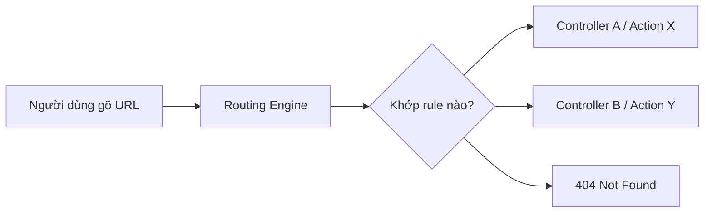

# Chương 10: URL, Domain, Routing & URL Rewrite

## 1. URL là gì?

**URL** (Uniform Resource Locator) là địa chỉ định vị một tài nguyên cụ thể trên Internet. Mỗi URL trên Web là duy nhất — không có hai tài nguyên khác nhau nào cùng chia sẻ một URL hoàn toàn giống nhau.

Cấu trúc tổng quát:

```
scheme://host:port/path?query_string#fragment
```

Ví dụ đầy đủ:

```
https://www.uit.edu.vn:80/index.html?lang=vi#section1
```

---

## 2. Cấu trúc chi tiết của URL

### 2.1 Scheme (Giao thức)

Scheme là phần đầu tiên của URL, kết thúc ngay trước dấu `:`. Nó xác định **phương thức giao tiếp** mà trình duyệt dùng để trao đổi dữ liệu với server.

| Scheme | Ý nghĩa |
|---|---|
| `http` | HyperText Transfer Protocol — giao tiếp web thông thường |
| `https` | HTTP Secure — mã hóa bằng TLS/SSL |
| `ftp` | File Transfer Protocol — truyền tải file |
| `mailto` | Gửi email |

### 2.2 Authority (Thẩm quyền)

Phần còn lại sau `://` được gọi là **Authority**, bao gồm:

- **www** (World Wide Web prefix) — có thể có hoặc không có (non-www)
- **Domain** — tên miền, ví dụ: `uit.edu.vn`
- **Port** — cổng giao tiếp, ví dụ: `80` (HTTP), `443` (HTTPS)

### 2.3 Các thành phần bổ sung

| Thành phần | Ký hiệu | Ví dụ | Mô tả |
|---|---|---|---|
| Path | `/` | `/thongbao/bai-viet` | Đường dẫn đến tài nguyên trên server |
| Query String | `?` | `?id=5&lang=vi` | Tham số truyền lên server |
| Fragment | `#` | `#section2` | Điểm neo trong trang, xử lý ở phía client |

```
https://www.example.com:443/blog/post?id=10&lang=vi#comments
│─────│  │──────────────│ │──│ │────────│ │──────────│ │──────│
scheme      host/domain  port   path     query string  fragment
```

---

## 3. Domain (Tên miền)

### 3.1 Định nghĩa

Domain là **tên miền** đại diện cho một địa chỉ IP, giúp người dùng dễ nhớ và dễ truy cập hơn so với việc phải gõ địa chỉ IP thuần túy.

> Ví dụ: Địa chỉ IP `74.125.200.113` có tên miền là `google.com`

Bản chất, khi bạn gõ `google.com` vào trình duyệt, hệ thống DNS (Domain Name System) sẽ tra cứu và dịch tên miền đó thành địa chỉ IP tương ứng để kết nối đến đúng server.

### 3.2 Phân loại tên miền

```
www.uit.edu.vn
         │  │
         │  └── ccTLD: Country Code Top-Level Domain (.vn = Việt Nam)
         └───── SLD: Second-Level Domain (.edu = giáo dục)
```

| Loại | Ví dụ | Ý nghĩa |
|---|---|---|
| Quốc tế | `.com`, `.net`, `.org` | Thương mại, mạng, tổ chức |
| Quốc gia | `.vn`, `.sg`, `.jp` | Việt Nam, Singapore, Nhật Bản |
| Chuyên ngành | `.edu`, `.gov`, `.io` | Giáo dục, chính phủ, công nghệ |

### 3.3 Đăng ký tên miền

Tên miền cần được đăng ký thông qua các nhà cung cấp uy tín. Tại Việt Nam có thể đăng ký tại:

- [pavietnam.vn](https://pavietnam.vn)
- [matbao.net](https://matbao.net)
- [tenten.vn](https://tenten.vn)

---

## 4. Semantic URLs (Friendly URLs)

### 4.1 Định nghĩa

**Semantic URL** (hay Friendly URL) là URL được thiết kế sao cho nội dung của nó **mô tả rõ ràng** trang mà nó trỏ đến, thay vì chứa các tham số kỹ thuật khó đọc.

So sánh:

```
# URL không thân thiện (dynamic URL)
https://www.example.com/subfolder/subfolder-2/AxJSjdS.html

# URL thân thiện (semantic URL)
https://www.example.com/tu-khoa-can-seo-abc.html
```

### 4.2 Lợi ích

- **Dễ nhớ, dễ đọc** cho người dùng
- **Tăng thứ hạng SEO** vì công cụ tìm kiếm hiểu được nội dung qua URL
- **Che giấu công nghệ nội bộ** — người dùng không thấy `?id=`, `.php`, `.aspx`, v.v.
- **Tăng tỷ lệ nhấp (CTR)** khi URL xuất hiện trong kết quả tìm kiếm

---

## 5. URL và SEO

### 5.1 Các tiêu chí URL chuẩn SEO

!!! tip "12 tiêu chí URL chuẩn SEO"
    1. Giới hạn ký tự (tối đa ~96 ký tự hoặc 10 từ)
    2. URL phải chứa từ khóa chính hoặc ít nhất là từ khóa phụ
    3. Không chỉnh sửa URL khi đã được Google Index
    4. Chuyển từ URL động thành URL tĩnh
    5. Dùng dấu gạch nối `-` để phân cách các từ
    6. Không để trùng lặp URL
    7. Giữ URL đơn giản, dễ hiểu
    8. Viết thường toàn bộ
    9. URL không nên chứa các con số (trừ khi cần thiết)
    10. Bắt đầu với từ khóa chính
    11. Không chứa ký tự đặc biệt
    12. URL không quá 2 cấp thư mục

### 5.2 Tối ưu nội dung URL

**Từ khóa:** Từ khóa nên xuất hiện ngay đầu URL, tránh đặt ở cuối vì các công cụ tìm kiếm đánh trọng số cao hơn cho phần đầu URL.

**Nội dung mô tả:** URL phải ngắn gọn nhưng đủ mô tả — người dùng nhìn vào URL phải đoán được trang đó nói về chủ đề gì.

**Stop words:** Hạn chế các từ phổ thông như `and`, `the`, `of`, `một`, `và`, `của` trong URL vì các công cụ tìm kiếm thường bỏ qua chúng.

### 5.3 Tối ưu cấu trúc URL

!!! warning "Ký tự cần tránh trong URL"
    Không dùng: `_`, `^`, `#`, `%`, `=`, `@`, `?`, `$`  
    Nên dùng: `-` để ngăn cách các từ

```
# Sai
https://example.com/san_pham/lap_top?id=100&cat=may_tinh

# Đúng
https://example.com/san-pham/laptop-asus-x507
```

!!! danger "Không thay đổi URL đã được Google Index"
    Khi Google đã lập chỉ mục (index) một URL, việc thay đổi cấu trúc URL sẽ làm mất toàn bộ thứ hạng SEO tích lũy được. Nếu buộc phải đổi, cần thiết lập **301 Redirect** từ URL cũ sang URL mới.

---

## 6. Rewrite URL

### 6.1 Định nghĩa

**URL Rewriting** là kỹ thuật cho phép **biến đổi URL** từ dạng này sang dạng khác mà không thay đổi logic xử lý phía server. Còn được gọi là *Short URLs*, *Fancy URLs*.

```
# Trước khi rewrite (URL động, xấu)
http://www.example.com/Blogs/modules.php?name=News&op=viewst&sid=696

# Sau khi rewrite (URL tĩnh, đẹp)
http://www.example.com/Blogs/News/viewst/696.html
```

### 6.2 Lợi ích

- Tạo URL thân thiện với người dùng và Search Engine
- Tăng cường bảo mật bằng cách ẩn cấu trúc nội bộ (tên bảng, tham số truy vấn, công nghệ sử dụng)
- Dễ chia sẻ, dễ nhớ

---

## 7. Slug

### 7.1 Định nghĩa

**Slug** là một chuỗi ký tự được tạo ra từ tiêu đề hoặc nội dung, dùng làm phần định danh trong URL. Slug đóng vai trò cầu nối giữa nội dung có dấu, có ký tự đặc biệt và một URL hợp lệ, thân thiện với SEO.

```
Tiêu đề: "How to Create a Website with HTML and CSS"
Slug:     "how-to-create-a-website-with-html-and-css"
```

### 7.2 Đặc điểm của Slug

| Đặc điểm | Mô tả |
|---|---|
| Chữ thường | Toàn bộ chuyển sang lowercase |
| Không dấu | Loại bỏ dấu tiếng Việt và ký tự đặc biệt |
| Dùng dấu `-` | Thay thế khoảng trắng bằng gạch ngang |
| Duy nhất | Mỗi slug phải unique trong hệ thống |

Ví dụ thực tế từ UIT:

```
https://www.uit.edu.vn/uit-long-trong-chuc-le-ky-niem-41-nam-ngay-nha-giao-viet-nam-2011
```

### 7.3 Hàm tạo Slug (C#)

```csharp
public static string GenerateSlug(string title)
{
    // Thay tất cả ký tự không phải chữ cái, số, hoặc dấu gạch ngang bằng "-"
    string slug = Regex.Replace(title, @"[^a-zA-Z0-9-]", "-");

    // Loại bỏ các dấu gạch ngang liên tiếp (ví dụ: "---" → "-")
    slug = Regex.Replace(slug, @"-{2,}", "-");

    // Xóa dấu gạch ngang ở đầu và cuối, chuyển thành chữ thường
    slug = slug.Trim('-').ToLower();

    return slug;
}
```

!!! note "Lưu ý với tiếng Việt"
    Hàm trên chỉ xử lý ký tự ASCII. Với tiếng Việt, cần thêm bước **chuẩn hóa Unicode** (chuyển `ắ` → `a`, `ộ` → `o`, v.v.) trước khi áp dụng regex. Thư viện phổ biến để làm việc này trong C# là `Unidecode` hoặc tự viết bảng mapping.

---

## 8. URL Routing (Định tuyến URL)

### 8.1 Khái niệm

**URL Routing** là cơ chế ánh xạ một URL yêu cầu đến một đoạn code xử lý cụ thể (controller/action trong MVC, hoặc handler trong Express.js). Thay vì URL phải khớp chính xác với đường dẫn file vật lý trên server, routing cho phép định nghĩa **quy tắc linh hoạt**.



### 8.2 Routing trong ASP.NET MVC

Trong ASP.NET MVC, các route được đăng ký trong file `RouteConfig.cs`:

```csharp
routes.MapRoute(
    name: "Default",
    url: "{controller}/{action}/{id}",
    defaults: new { controller = "Home", action = "Index", id = UrlParameter.Optional }
);
```

| Tham số | Ý nghĩa |
|---|---|
| `name` | Tên định danh của route, phải duy nhất |
| `url` | Pattern nhận dạng URL, dùng `{}` cho placeholder |
| `controller` | Tên controller mặc định nếu không có trong URL |
| `action` | Tên action mặc định |
| `id` | Tham số tùy chọn |

**Cách hoạt động:**

```
URL: /Products/Details/5
→ controller = "Products"
→ action    = "Details"
→ id        = 5

URL: /   (không có gì)
→ controller = "Home"   (mặc định)
→ action    = "Index"   (mặc định)
→ id        = (không có)
```

### 8.3 Rewrite URL với ASP.NET MVC

Có thể tạo các route tùy chỉnh để ánh xạ URL đẹp về đúng controller:

```csharp
// Route dạng: /hp-340s-i7.p-1000
routes.MapRoute(
    name: "Product",
    url: "{alias}.p-{id}",
    defaults: new { controller = "Products", action = "Details", id = UrlParameter.Optional },
    namespaces: new string[] { "WebApplication1.Controllers" }
);

// Route dạng: /products-hp-340s-i7
routes.MapRoute(
    name: "ProductDetail",
    url: "products-{slug}",
    defaults: new { controller = "Products", action = "DetailsBySlug" },
    namespaces: new string[] { "WebApplication1.Controllers" }
);
```

Kết quả:

```
https://mywebsite.com/hp-340s-i7.p-1000
https://mywebsite.com/products-hp-340s-i7
```

!!! warning "Thứ tự đăng ký route"
    ASP.NET MVC khớp route theo thứ tự đăng ký từ trên xuống. Route nào được đăng ký trước sẽ được kiểm tra trước. Do đó, các route **cụ thể hơn** phải đặt **trước** các route **tổng quát**.

### 8.4 Rewrite URL với Node.js (Express.js)

Trong Express.js, routing được định nghĩa trực tiếp trong code:

```javascript
app.get('/products/:slug', (req, res) => {
    const slug = req.params.slug; // Lấy slug từ URL

    // Truy vấn cơ sở dữ liệu theo slug
    const product = getProductBySlug(slug);

    res.send(`Product Details: ${product.name}`);
});

function getProductBySlug(slug) {
    // Giả lập truy vấn database
    return {
        slug: slug,
        name: `Product ${slug}`,
    };
}
```

Sử dụng trong HTML:

```html
<a href="/products/laptop-asus-x507">Laptop ASUS X507</a>
```

Kết quả URL:

```
https://mywebsite.com/products/hp-340s-i7
```

`:slug` trong Express là **route parameter** — bất kỳ chuỗi nào nằm ở vị trí đó trong URL đều được gán vào `req.params.slug`.

---

## 9. Facebook Open Graph

### 9.1 Định nghĩa

**Open Graph** là giao thức do Facebook phát triển, cho phép bất kỳ trang web nào kiểm soát **cách nội dung hiển thị** khi được chia sẻ lên mạng xã hội (Facebook, Zalo, LinkedIn, v.v.).

Khi bạn dán một link vào Facebook, Facebook sẽ crawl URL đó và đọc các thẻ `<meta>` Open Graph để lấy tiêu đề, mô tả và ảnh preview.

### 9.2 Các thẻ Open Graph cơ bản

```html
<meta property="og:title"       content="Tiêu đề của trang" />
<meta property="og:description" content="Mô tả ngắn về nội dung" />
<meta property="og:image"       content="https://example.com/image.jpg" />
<meta property="og:url"         content="https://example.com/bai-viet" />
<meta property="og:type"        content="website" />
```

| Thẻ | Ý nghĩa |
|---|---|
| `og:title` | Tiêu đề hiển thị khi share |
| `og:description` | Mô tả ngắn bên dưới tiêu đề |
| `og:image` | Ảnh thumbnail preview |
| `og:url` | URL chính tắc của trang |
| `og:type` | Loại nội dung: `website`, `article`, `product`, v.v. |

!!! tip "Kiểm tra Open Graph"
    Facebook cung cấp công cụ **Sharing Debugger** tại `developers.facebook.com/tools/debug` để kiểm tra và xem trước cách trang web sẽ hiển thị khi được chia sẻ. Nếu thiếu các thẻ `og:title`, `og:description`, `fb:app_id`, công cụ sẽ cảnh báo.

---

## 10. Cẩm nang SEO cơ bản

### 10.1 Bảng tổng hợp

| Tiêu chí | Mô tả |
|---|---|
| **Tối ưu nội dung** | Tiêu đề và mô tả hấp dẫn, chính xác; nội dung chất lượng; từ khóa phù hợp |
| **Tối ưu URL** | URL ngắn, dễ đọc, chứa từ khóa, tránh ký tự đặc biệt |
| **Optimize hình ảnh** | Ảnh chất lượng, nén ảnh, dùng thuộc tính `alt` mô tả |
| **Thẻ meta** | Sử dụng `<meta name="description">`, Open Graph, v.v. |
| **Xây dựng liên kết** | Internal links giữa các trang liên quan; backlinks từ trang uy tín |
| **Sitemap XML** | Tạo `sitemap.xml` gửi lên Google Search Console; cấu hình `robots.txt` |
| **Theo dõi & kiểm tra** | Google Analytics, Google Search Console, Google PageSpeed Insights |
| **Mạng xã hội** | Chia sẻ nội dung để tăng tương tác và reach |
| **Mobile friendly** | Thiết kế responsive; kiểm tra bằng Mobile-Friendly Test |

### 10.2 Công cụ tham khảo

- [Google Search Central](https://developers.google.com/search/docs?hl=vi) — tài liệu SEO chính thức từ Google
- [Google PageSpeed Insights](https://pagespeed.web.dev/) — kiểm tra tốc độ tải trang
- [Google Search Console](https://search.google.com/search-console) — theo dõi vị trí từ khóa, lỗi crawl
- [Facebook Sharing Debugger](https://developers.facebook.com/tools/debug) — kiểm tra Open Graph

---

??? note "Tóm tắt luồng hoạt động tổng thể"

    ```mermaid
    flowchart TD
        A["Người dùng nhập URL"] --> B["DNS phân giải Domain → IP"]
        B --> C["Trình duyệt gửi HTTP Request"]
        C --> D["Server nhận request"]
        D --> E["URL Routing khớp rule"]
        E --> F["Controller/Handler xử lý"]
        F --> G["Truy vấn DB theo slug/id"]
        G --> H["Trả về HTML response"]
        H --> I["Trình duyệt render trang"]
    ```
