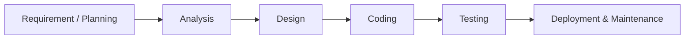
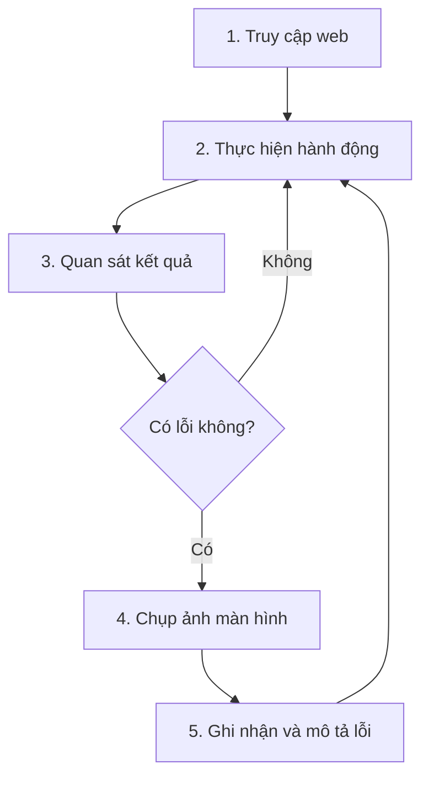

# Chương 11: Kiểm Thử Ứng Dụng Web

## 1. Kiểm thử là gì và tại sao cần thiết?

Kiểm thử phần mềm (Software Testing) là quá trình **đánh giá và xác minh** rằng một ứng dụng hoặc hệ thống phần mềm hoạt động đúng theo yêu cầu đã đề ra. Trong bối cảnh phát triển web, kiểm thử giúp phát hiện những điểm chưa đúng trước khi sản phẩm đến tay người dùng cuối.

### Vị trí trong quy trình phát triển phần mềm



Mỗi giai đoạn có đầu ra và người chịu trách nhiệm riêng:

| Giai đoạn | Đầu ra chính | Người chịu trách nhiệm |
|---|---|---|
| Requirement / Planning | Tài liệu yêu cầu, Proposal, Project Plan | Sales, BA, PM, Customer |
| Analysis | Tài liệu đặc tả yêu cầu phần mềm (SRS) | PM, BA, Senior |
| Design | Hồ sơ thiết kế, Flowchart, Diagram | Designer, BA |
| Coding | Source Code | Developer |
| **Testing** | **Test Case, Test Plan, Bug Report** | **QA, Tester** |
| Deployment & Maintenance | Tài liệu hướng dẫn sử dụng | DevOps |

Kiểm thử nằm ngay **sau giai đoạn lập trình**, và trước khi triển khai — đây là lưới lọc cuối cùng để đảm bảo chất lượng sản phẩm.

### Lý do phải kiểm thử

**Phát hiện lỗi sớm giúp tiết kiệm chi phí đáng kể.** Theo nguyên lý "Rule of Ten" trong kỹ thuật phần mềm, chi phí sửa một lỗi tăng gấp 10 lần mỗi khi vượt qua một giai đoạn phát triển. Một lỗi phát hiện ở giai đoạn coding có thể sửa trong vài phút, nhưng nếu lỗi đó ra đến tay người dùng thực tế thì tốn hàng giờ hoặc hàng ngày để xử lý hậu quả.

**Cải thiện trải nghiệm người dùng (UX).** Một ứng dụng web hoạt động sai — dù chỉ là một nút bấm không phản hồi hay một form không gửi được — sẽ khiến người dùng mất niềm tin và rời bỏ sản phẩm.

**Đảm bảo luồng chức năng hoạt động đúng.** Kiểm thử giúp xác nhận rằng toàn bộ các tính năng — từ đăng nhập, tìm kiếm, thanh toán đến đăng xuất — hoạt động liên tục và đúng như thiết kế.

**Tăng độ tin cậy trước khi triển khai.** Một sản phẩm được kiểm thử kỹ giúp đội ngũ phát triển tự tin hơn khi đưa ra thị trường, đồng thời giảm thiểu rủi ro xảy ra sự cố sau khi go-live.

---

## 2. Các loại kiểm thử Web phổ biến

### 2.1 UI/UX Testing

UI Testing kiểm tra xem **giao diện người dùng có hiển thị đúng và nhất quán** không. UX Testing đi xa hơn, đánh giá xem người dùng có thao tác thuận tiện không.

Các điểm cần kiểm tra cụ thể:

- **Layout:** Các thành phần có được đặt đúng vị trí theo thiết kế không? Khi kéo giãn hoặc thu nhỏ trình duyệt, layout có bị vỡ không?
- **Typography:** Font chữ có nhất quán? Kích thước heading, body text có theo đúng hệ thống thiết kế?
- **Màu sắc và tương phản:** Màu chữ trên nền có đủ tương phản để người dùng đọc được, kể cả người có thị lực yếu? Tiêu chuẩn WCAG 2.1 yêu cầu tỉ lệ tương phản tối thiểu 4.5:1 với văn bản thông thường.
- **Responsive:** Khi chuyển sang màn hình nhỏ hơn, các thành phần có tự điều chỉnh hợp lý không?
- **Điều hướng bằng bàn phím:** Người dùng có thể dùng phím `Tab` để di chuyển qua các phần tử tương tác không? Đây là yêu cầu về khả năng tiếp cận (Accessibility).
- **Alt text cho ảnh:** Các thẻ `` có thuộc tính `alt` để trình đọc màn hình (screen reader) mô tả nội dung cho người dùng khiếm thị không?

### 2.2 Functional Testing

Functional Testing kiểm tra xem **các chức năng có hoạt động đúng theo yêu cầu nghiệp vụ** không.

- **Button:** Mỗi nút bấm có thực hiện đúng hành động khi click không? Có trạng thái loading/disabled phù hợp không?
- **Form validation:** Form có kiểm tra dữ liệu đầu vào trước khi gửi không? Ví dụ: trường email có báo lỗi khi nhập sai định dạng? Trường bắt buộc có cảnh báo khi bỏ trống?
- **Navigation và liên kết:** Các mục menu, breadcrumb, liên kết nội bộ có dẫn đến đúng trang không?
- **Dead links (liên kết chết):** Có đường link nào trả về lỗi `404 Not Found` không? Liên kết bên ngoài có còn hoạt động không?

### 2.3 Responsive Testing

Responsive Testing kiểm tra xem **website có hiển thị và hoạt động tốt trên nhiều kích thước màn hình** không — từ điện thoại di động, tablet, đến màn hình desktop lớn.

Các vấn đề thường gặp:

- Giao diện bị vỡ (các phần tử chồng lên nhau, tràn ra ngoài).
- Xuất hiện thanh scroll ngang không mong muốn do có phần tử có `width` cố định lớn hơn viewport.
- Chữ quá nhỏ trên mobile do không có `viewport meta tag` hoặc không dùng đơn vị tương đối.
- Nút bấm quá nhỏ, khó chạm trên màn hình cảm ứng.

Công cụ hỗ trợ: Chrome DevTools cho phép giả lập nhiều thiết bị ngay trong trình duyệt bằng cách bật **Device Toolbar** (`Ctrl + Shift + M`).

### 2.4 Performance Testing

Performance Testing đánh giá **tốc độ và hiệu năng** của ứng dụng web.

Các chỉ số quan trọng:

- **First Contentful Paint (FCP):** Thời gian đến khi nội dung đầu tiên xuất hiện trên màn hình.
- **Largest Contentful Paint (LCP):** Thời gian để phần tử lớn nhất trong viewport được render — LCP tốt là dưới 2.5 giây.
- **Time to Interactive (TTI):** Thời gian để trang có thể tương tác được.
- **Lag khi scroll:** Nếu trang có nhiều animation hoặc hình ảnh nặng, có xuất hiện giật lag khi người dùng cuộn trang không?

Công cụ hỗ trợ: **Lighthouse** (tích hợp sẵn trong Chrome DevTools, tab "Lighthouse") và **PageSpeed Insights** (tools.web.dev/measure).

### 2.5 Security Testing

Security Testing kiểm tra xem **ứng dụng có dễ bị tấn công** không. Đây là lĩnh vực chuyên sâu, nhưng ở mức cơ bản, tester cần chú ý:

- Form có bị lỗ hổng **XSS (Cross-Site Scripting)** không — thử nhập `<script>alert(1)</script>` vào các trường nhập liệu.
- URL có lộ thông tin nhạy cảm không?
- Có trang admin hoặc tài nguyên nhạy cảm nào không được bảo vệ bằng xác thực không?
- Kết nối có dùng HTTPS không?

---

## 3. Kiểm thử thủ công (Manual Testing)

Kiểm thử thủ công là hình thức kiểm thử trong đó **người kiểm thử trực tiếp thao tác với ứng dụng** như một người dùng thực tế, không dùng công cụ tự động hóa. Đây là kỹ năng nền tảng mà mọi tester cần thành thạo trước khi chuyển sang kiểm thử tự động.

### Quy trình kiểm thử thủ công



**Bước 1 — Truy cập web:** Mở ứng dụng trong trình duyệt. Nên test trên nhiều trình duyệt khác nhau (Chrome, Firefox, Safari, Edge) vì cách render có thể khác nhau.

**Bước 2 — Thực hiện hành động:** Tương tác với ứng dụng như người dùng thật: điền form, click button, dùng menu điều hướng, thử các luồng sử dụng chính.

**Bước 3 — Quan sát kết quả:** So sánh kết quả thực tế với kết quả kỳ vọng. Kết quả kỳ vọng thường được xác định dựa trên tài liệu đặc tả hoặc hiểu biết thông thường về hành vi của ứng dụng.

**Bước 4 — Chụp ảnh màn hình nếu có lỗi:** Ảnh chụp màn hình là bằng chứng quan trọng để developer tái hiện lỗi. Nên chụp toàn màn hình, bao gồm URL trên thanh địa chỉ.

**Bước 5 — Ghi nhận và mô tả lỗi:** Viết bug report rõ ràng để developer hiểu và sửa được.

### Cách ghi nhận lỗi (Bug Report) hiệu quả

Một bug report tốt cần có đủ các thành phần sau:

```
Tiêu đề: [Tên module] - Mô tả ngắn gọn lỗi
Môi trường: Trình duyệt, OS, kích thước màn hình
Mức độ nghiêm trọng: Critical / High / Medium / Low

Các bước tái hiện:
1. Truy cập [URL cụ thể]
2. Thực hiện [hành động cụ thể]
3. ...

Kết quả thực tế: [Điều gì đã xảy ra]
Kết quả kỳ vọng: [Điều gì nên xảy ra]

Đính kèm: [Ảnh chụp màn hình / video]
```

!!! tip "Nguyên tắc ghi lỗi"
    Mô tả lỗi phải đủ chi tiết để một người chưa từng thấy lỗi đó có thể **tái hiện lại chính xác** chỉ bằng cách làm theo các bước bạn ghi. Tránh mô tả mơ hồ như "trang bị lỗi" hay "không hoạt động".

---

## 4. Công cụ hỗ trợ kiểm thử

### Chrome DevTools

Công cụ tích hợp sẵn trong Chrome, truy cập bằng `F12` hoặc chuột phải → Inspect.

- **Elements tab:** Kiểm tra cấu trúc HTML, CSS đang được áp dụng.
- **Console tab:** Xem lỗi JavaScript, thông báo từ ứng dụng.
- **Network tab:** Theo dõi các request HTTP, kiểm tra response, phát hiện request thất bại (status 4xx, 5xx).
- **Device Toolbar:** Giả lập màn hình mobile/tablet để test responsive.

### Lighthouse

Tích hợp trong Chrome DevTools (tab "Lighthouse"). Lighthouse chạy một loạt bài kiểm tra tự động và cho điểm theo các hạng mục:

- Performance (Hiệu năng)
- Accessibility (Khả năng tiếp cận)
- Best Practices
- SEO

Điểm được tính từ 0–100. Mục tiêu lý tưởng là trên 90 ở mỗi hạng mục.

### PageSpeed Insights

Truy cập tại `pagespeed.web.dev`. Tương tự Lighthouse nhưng phân tích trực tiếp từ phía Google, có thêm dữ liệu thực tế từ người dùng Chrome (Core Web Vitals).

### GTmetrix

Truy cập tại `gtmetrix.com`. Cung cấp phân tích chi tiết về tốc độ tải trang, có thể test từ nhiều vị trí địa lý khác nhau trên thế giới.

### Firefox Accessibility Inspector

Công cụ trong Firefox DevTools, chuyên dùng để kiểm tra **khả năng tiếp cận (Accessibility)** của trang web: cây ngữ nghĩa (accessibility tree), thuộc tính ARIA, tỷ lệ tương phản màu sắc.

### Plugin bổ sung

- **Broken Link Checker:** Tự động quét và liệt kê các liên kết chết trên trang.
- **Web Developer:** Thanh công cụ mở rộng với nhiều chức năng như disable CSS, disable JavaScript, kiểm tra form, xem thông tin meta...

---

## 5. Checklist kiểm thử cơ bản

Trước khi bàn giao hoặc deploy một trang web, nên đi qua checklist sau:

??? note "Checklist kiểm thử"

    **Giao diện (UI)**
    - [ ] Layout không bị vỡ trên các trình duyệt phổ biến
    - [ ] Font, màu sắc, căn chỉnh nhất quán
    - [ ] Không có ảnh bị vỡ (broken images)

    **Responsive**
    - [ ] Hiển thị đúng trên mobile (< 768px)
    - [ ] Hiển thị đúng trên tablet (768px – 1024px)
    - [ ] Hiển thị đúng trên desktop (> 1024px)
    - [ ] Không có scroll ngang không mong muốn

    **Chức năng**
    - [ ] Tất cả button hoạt động đúng
    - [ ] Form validate đầy đủ và chính xác
    - [ ] Không có liên kết chết (404)
    - [ ] Navigation dẫn đúng trang

    **Hiệu năng**
    - [ ] Điểm Lighthouse Performance >= 70
    - [ ] Thời gian tải trang hợp lý (LCP < 2.5s)

---

## 6. Case Study — Kiểm thử thực tế

### Mục tiêu

Áp dụng toàn bộ kiến thức trên để kiểm thử một website thực tế: **Hiptech Solution** tại `https://hiptechvn.com/`

### Gợi ý các bước thực hiện

**Bước 1 — Chuẩn bị**

Trước khi bắt đầu, xác định rõ phạm vi kiểm thử: kiểm thử những trang nào, những chức năng nào. Ví dụ: trang chủ, trang giới thiệu, trang liên hệ, form liên hệ.

**Bước 2 — Kiểm thử UI/UX**

- Mở website trên Chrome, quan sát layout tổng thể.
- Kiểm tra font chữ, màu sắc, căn chỉnh có nhất quán không.
- Resize cửa sổ trình duyệt từ desktop xuống tablet rồi mobile.
- Bật DevTools → Device Toolbar để test trên iPhone SE, iPhone 14, Samsung Galaxy S20.

**Bước 3 — Kiểm thử chức năng**

- Click vào từng mục trong navigation menu.
- Thử điền form liên hệ với dữ liệu hợp lệ và không hợp lệ.
- Kiểm tra các nút CTA (Call to Action).
- Chuột phải → Inspect → tab Console xem có lỗi JavaScript không.

**Bước 4 — Kiểm thử hiệu năng**

- Mở DevTools → tab Lighthouse → chọn "Mobile" → Generate report.
- Ghi lại điểm từng hạng mục.
- Truy cập `pagespeed.web.dev`, nhập URL và xem kết quả.

**Bước 5 — Ghi nhận và tổng hợp**

Tổng hợp tất cả lỗi phát hiện được vào một bảng bug report, kèm ảnh chụp màn hình minh chứng. Đồng thời đề xuất cải tiến cụ thể cho từng vấn đề.

!!! example "Ví dụ bug report mẫu"
    **Tiêu đề:** [Trang chủ] - Giao diện bị vỡ trên màn hình 375px

    **Môi trường:** Chrome 124, Windows 11, viewport 375x812 (iPhone SE)

    **Mức độ:** High

    **Bước tái hiện:**
    1. Truy cập `https://hiptechvn.com/`
    2. Bật DevTools → Device Toolbar
    3. Chọn thiết bị iPhone SE (375px)

    **Kết quả thực tế:** Banner section bị tràn ngang, xuất hiện scroll bar ngang

    **Kết quả kỳ vọng:** Banner hiển thị gọn trong viewport, không có scroll ngang

    **Đính kèm:** screenshot_homepage_iphonese.png
