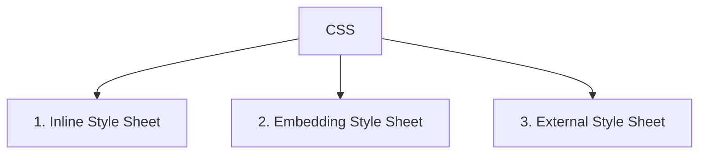
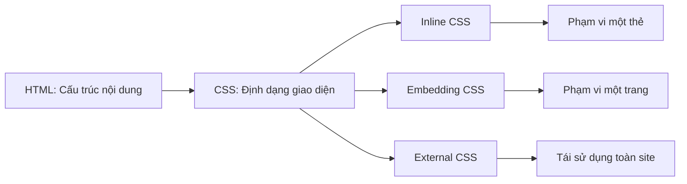

# Chương 2: Lập Trình Giao Diện Web với HTML & CSS

---

## PHẦN 1: HTML – HYPERTEXT MARKUP LANGUAGE

---

### 1. Giới Thiệu HTML

HTML (HyperText Markup Language) là ngôn ngữ đánh dấu siêu văn bản, được sử dụng để xây dựng cấu trúc và nội dung của các trang web. HTML không phải là ngôn ngữ lập trình — nó là ngôn ngữ **đánh dấu** (markup), nghĩa là dùng các thẻ để mô tả ý nghĩa và cách trình bày nội dung.

HTML do **Tim Berners-Lee** phát minh và được tổ chức **W3C (World Wide Web Consortium)** chuẩn hóa vào năm 1994.

Mối quan hệ giữa HTML và CSS:

```
HTML  → Quy định CẤU TRÚC và NỘI DUNG của trang web
CSS   → Quy định CÁCH HIỂN THỊ (giao diện) của trang web
```

---

### 2. Đặc Điểm của HTML

- HTML sử dụng các **thẻ (tags)** để định dạng và tổ chức dữ liệu.
- HTML **không phân biệt chữ hoa và chữ thường** — `<P>` và `<p>` là như nhau.
- Các trình duyệt **không báo lỗi cú pháp** HTML. Nếu viết sai, trang web chỉ hiển thị không đúng như mong muốn chứ không có thông báo lỗi.

!!! warning "Lưu ý"
    Vì trình duyệt không báo lỗi, người học cần rèn thói quen viết HTML đúng cú pháp ngay từ đầu để tránh lỗi hiển thị khó phát hiện.

---

### 3. Thẻ HTML (Tag)

#### 3.1 Khái niệm

Thẻ là các chỉ thị dùng để định dạng nội dung, cho trình duyệt biết cách hiển thị một đoạn văn bản, hình ảnh, liên kết, v.v.

Cấu trúc cơ bản của một thẻ có thuộc tính:

```html
<tên_thẻ thuộc_tính_1="giá_trị_1" thuộc_tính_2="giá_trị_2">
    Nội dung
</tên_thẻ>
```

**Ví dụ cụ thể:**

```html
<body bgcolor="#ffffff"></body>
```

Trong đó:
- `body` — tên thẻ
- `bgcolor` — thuộc tính của thẻ `<body>`
- `#ffffff` — giá trị của thuộc tính (có thể dùng nháy đơn hoặc nháy kép)

---

#### 3.2 Phân loại thẻ

Có hai loại thẻ HTML:

**Thẻ đôi (Two-sided):** Có thẻ mở và thẻ đóng, chứa nội dung ở giữa.

```html
<p>Đây là một đoạn văn bản.</p>
<u>Văn bản gạch chân</u>
```

**Thẻ đơn (One-sided):** Không có thẻ đóng, không chứa nội dung.

```html
<br>

```

!!! note "Ghi chú"
    Luôn có thẻ mở, nhưng không phải thẻ nào cũng có thẻ đóng. Ví dụ: ``, `<br>`, `<input>` là các thẻ đơn, không cần thẻ đóng.

---

#### 3.3 Thuộc tính của thẻ

Thuộc tính bổ sung thêm thông tin hoặc điều chỉnh hành vi cho thẻ. Một thẻ có thể có nhiều thuộc tính.

```html
<tên_thẻ tên_TT1="giá_trị1" tên_TT2="giá_trị2">
```

**Lưu ý quan trọng:**
- Có thể thay đổi thứ tự các thuộc tính mà không gây lỗi.
- Thẻ đóng viết bình thường, không lặp lại thuộc tính: `</tên_thẻ>`
- Mỗi trình duyệt có thể hỗ trợ các thẻ và thuộc tính khác nhau; chỉ các thẻ cơ bản là giống nhau trên mọi trình duyệt.

---

### 4. Cấu Trúc Trang HTML Cơ Bản

```html
<!DOCTYPE html>
<html>
<head>
    <title>Hello page</title>
</head>
<body>
    Chao mung ban den voi <u>HTML</u>!
</body>
</html>
```

**Giải thích từng phần:**

- `<!DOCTYPE html>` — Khai báo kiểu tài liệu, cho trình duyệt biết đây là HTML5.
- `<html>` — Thẻ gốc bao bọc toàn bộ trang.
- `<head>` — Phần đầu trang, chứa thông tin meta, tiêu đề, liên kết CSS, v.v. Nội dung trong `<head>` không hiển thị trực tiếp trên trang.
- `<title>` — Tiêu đề hiển thị trên tab trình duyệt.
- `<body>` — Phần thân trang, chứa toàn bộ nội dung hiển thị cho người dùng.

!!! tip "Thực hành"
    Tạo file `index.html` bằng Notepad, gõ nội dung trên, lưu lại rồi mở bằng trình duyệt. Để thấy thay đổi sau khi sửa, nhấn **F5** để làm mới trang.

---

### 5. Soạn Thảo Văn Bản trong HTML

Văn bản gõ trực tiếp trong `<body>` sẽ được hiển thị trên trang. Tuy nhiên, HTML xử lý khoảng trắng theo cách đặc biệt:

!!! warning "Lưu ý quan trọng"
    **Mọi khoảng trắng liên tiếp và dấu xuống dòng trong mã HTML đều chỉ được hiển thị thành 1 khoảng trắng duy nhất** trên trang web. Để có nhiều khoảng trắng hay xuống dòng, phải dùng thẻ hoặc ký tự đặc biệt.

#### Các ký tự đặc biệt thường dùng:

| Ký tự muốn hiển thị | Mã HTML |
|---|---|
| Khoảng trắng thêm | `&nbsp;` |
| Dấu nhỏ hơn `<` | `&lt;` |
| Dấu lớn hơn `>` | `&gt;` |
| Dấu ngoặc kép `"` | `&quot;` |
| Ký hiệu bản quyền `©` | `&copy;` |

#### Ghi chú trong HTML:

```html
<!-- Đây là ghi chú, không hiển thị trên trang web -->
```

---

### 6. Thẻ Định Dạng Ký Tự

#### 6.1 Các thẻ định dạng cơ bản

```html
<b>Chữ đậm (Bold)</b>
<i>Chữ nghiêng (Italic)</i>
<u>Chữ gạch chân (Underline)</u>
<sup>Chỉ số trên (Superscript)</sup>
<sub>Chỉ số dưới (Subscript)</sub>
```

#### 6.2 Thẻ `<font>` — Tùy chỉnh font chữ

```html
<font face="Arial" size="3" color="#FF0000">Nội dung</font>
```

Thuộc tính của `<font>`:
- `face="tên font"` — Tên font chữ, ví dụ: `Arial`, `Times New Roman`
- `size="kích thước"` — Kích thước từ 1 đến 7
- `color="màu"` — Màu chữ, viết theo tên tiếng Anh (`red`, `blue`) hoặc mã hex (`#FF0000`)

**Quy tắc màu hex `#RRGGBB`:**
- `#FFFFFF` — Trắng
- `#000000` — Đen
- `#FF0000` — Đỏ
- `#00FF00` — Xanh lá
- `#0000FF` — Xanh dương

#### 6.3 Ví dụ đầy đủ về định dạng ký tự

```html
<!DOCTYPE html>
<html>
<head>
  <meta http-equiv="Content-Type" content="text/html; charset=utf-8">
  <title>Định dạng ký tự</title>
</head>
<body>
    <p><i><font color="#FF0000">Chào các bạn đến với Lập trình Ứng dụng Web</font></i></p>

    <!-- Ví dụ chỉ số trên và dưới -->
    <font size="3">
        AX<sup>2</sup> + BX + C = 0
        <br>
        C + O<sub>2</sub> = CO<sub>2</sub>
    </font>
</body>
</html>
```

**Kết quả hiển thị:**
- Dòng 1: Chữ nghiêng màu đỏ
- Dòng 2: Phương trình bậc hai với số mũ ở trên
- Dòng 3: Phản ứng hóa học với chỉ số ở dưới

---

### 7. Tiêu Đề, Đoạn Văn, Ngắt Dòng

#### 7.1 Thẻ tiêu đề `<h1>` đến `<h6>`

HTML cung cấp 6 cấp tiêu đề, kích thước giảm dần từ `<h1>` (to nhất) đến `<h6>` (nhỏ nhất). Sau mỗi tiêu đề, văn bản tự động xuống dòng mới.

```html
<h1>Giám đốc</h1>
<h2>Phó Giám đốc</h2>
<h3>Nhân viên</h3>
<h4>Thực tập sinh</h4>
```

Thuộc tính căn lề `align`:

```html
<h1 align="center">Tiêu đề căn giữa</h1>
<h2 align="right">Tiêu đề căn phải</h2>
<h2 align="left">Tiêu đề căn trái (mặc định)</h2>
```

#### 7.2 Thẻ đoạn văn `<p>`

Dùng để nhóm một đoạn văn bản lại. Trình duyệt tự thêm khoảng cách trên và dưới mỗi đoạn.

```html
<p align="justify">Đây là một đoạn văn bản được căn đều hai bên.</p>
```

#### 7.3 Thẻ ngắt dòng `<br>`

Xuống dòng ngay tại vị trí đó, không tạo khoảng cách như `<p>`.

```html
Dòng thứ nhất<br>
Dòng thứ hai
```

---

### 8. Chèn Ảnh

Dùng thẻ đơn `` để nhúng hình ảnh vào trang.

```html

```

**Giải thích các thuộc tính:**

| Thuộc tính | Ý nghĩa | Ví dụ |
|---|---|---|
| `src` | Đường dẫn đến file ảnh | `src="images/logo.png"` |
| `alt` | Chú thích hiển thị khi ảnh lỗi hoặc khi rê chuột lên | `alt="Logo công ty"` |
| `width` | Chiều rộng (pixel hoặc %) | `width="300"` hoặc `width="50%"` |
| `height` | Chiều cao (pixel hoặc %) | `height="200"` |
| `border` | Độ dày đường viền xung quanh ảnh | `border="0"` (không viền) |
| `align` | Căn chỉnh ảnh so với văn bản | `align="left"`, `align="right"` |

!!! tip "Nên dùng đường dẫn tương đối"
    Khi ảnh nằm trong cùng website, nên dùng đường dẫn tương đối thay vì đường dẫn tuyệt đối. Ví dụ: `src="images/anh.jpg"` thay vì `src="http://example.com/images/anh.jpg"`. Điều này giúp website hoạt động đúng khi chuyển sang server khác.

---

### 9. Danh Sách (List)

HTML hỗ trợ hai loại danh sách:

#### 9.1 Danh sách có thứ tự (Ordered List)

```html
<ol>
    <li>Bước 1: Cài đặt môi trường</li>
    <li>Bước 2: Viết code HTML</li>
    <li>Bước 3: Mở trình duyệt xem kết quả</li>
</ol>
```

Hiển thị: 1, 2, 3, ...

#### 9.2 Danh sách không có thứ tự (Unordered List)

```html
<ul>
    <li>HTML</li>
    <li>CSS</li>
    <li>JavaScript</li>
</ul>
```

Hiển thị: dấu chấm tròn hoặc gạch đầu dòng.

#### 9.3 Danh sách lồng nhau

Một phần tử `<li>` có thể chứa một danh sách con:

```html
<ul>
    <li>Frontend
        <ul>
            <li>HTML</li>
            <li>CSS</li>
            <li>JavaScript</li>
        </ul>
    </li>
    <li>Backend</li>
</ul>
```

---

### 10. Siêu Liên Kết (Hyperlink)

Siêu liên kết cho phép người dùng điều hướng giữa các trang, file, hoặc địa chỉ email bằng cách nhấp chuột.

**Thuật ngữ:**
- **Đối tượng liên kết:** Phần văn bản hoặc hình ảnh mà người dùng nhấp vào.
- **Đích liên kết:** Địa chỉ sẽ được mở ra.

#### 10.1 Cú pháp cơ bản

```html
<a href="đích_liên_kết">Đối tượng liên kết</a>
```

#### 10.2 Các dạng liên kết thường dùng

**Liên kết đến trang khác trong cùng website:**

```html
<a href="trangkhac.html">Đến trang khác</a>
```

**Liên kết đến website khác:**

```html
<a href="https://www.google.com" target="_blank">Mở Google trong tab mới</a>
```

**Liên kết gửi email:**

```html
<a href="mailto:example@gmail.com">Gửi email cho chúng tôi</a>
```

**Liên kết thực thi JavaScript:**

```html
<a href="javascript:alert('Hello!')">Nhấn vào đây</a>
```

**Thuộc tính `target`:**

| Giá trị | Ý nghĩa |
|---|---|
| `_self` | Mở trong cửa sổ/tab hiện tại (mặc định) |
| `_blank` | Mở trong tab/cửa sổ mới |

---

### 11. Bảng Biểu (Table)

HTML coi bảng gồm nhiều **dòng**, mỗi dòng gồm nhiều **ô**, và chỉ ô mới chứa dữ liệu.

#### 11.1 Cấu trúc thẻ

| Thẻ | Mục đích |
|---|---|
| `<table>` | Tạo bảng (mỗi bảng chỉ có 1 cặp thẻ này) |
| `<tr>` | Tạo một dòng (table row) |
| `<th>` | Tạo ô tiêu đề (tự động in đậm và căn giữa) |
| `<td>` | Tạo ô dữ liệu (table data) |

#### 11.2 Ví dụ bảng cơ bản

```html
<table border="1">
    <tr>
        <th>Họ tên</th>
        <th>Môn học</th>
        <th>Điểm</th>
    </tr>
    <tr>
        <td>Nguyễn Văn A</td>
        <td>HTML</td>
        <td>9.5</td>
    </tr>
    <tr>
        <td>Trần Thị B</td>
        <td>CSS</td>
        <td>8.0</td>
    </tr>
</table>
```

#### 11.3 Thuộc tính của `<table>`

| Thuộc tính | Ý nghĩa |
|---|---|
| `border="n"` | Độ dày đường viền bảng. `border="0"` là không có viền |
| `width`, `height` | Kích thước bảng (pixel hoặc %) |
| `cellspacing="n"` | Khoảng cách giữa hai ô liền kề |
| `cellpadding="n"` | Khoảng cách từ cạnh ô đến nội dung bên trong |
| `bgcolor="màu"` | Màu nền của toàn bảng |
| `background="url"` | Ảnh nền cho bảng |

#### 11.4 Thuộc tính của `<td>` và `<th>`

| Thuộc tính | Ý nghĩa |
|---|---|
| `bgcolor`, `background` | Màu hoặc ảnh nền riêng cho từng ô |
| `width`, `height` | Kích thước ô |
| `align` | Căn ngang: `left`, `right`, `center`, `justify` |
| `valign` | Căn dọc: `top`, `middle`, `bottom` |
| `colspan="n"` | Ô này chiếm n **cột** (gộp cột) |
| `rowspan="n"` | Ô này chiếm n **dòng** (gộp dòng) |
| `nowrap` | Không cho phép nội dung ô tự xuống dòng |

#### 11.5 Ví dụ gộp ô (colspan, rowspan)

```html
<table border="1">
    <tr>
        <th colspan="3">Bảng điểm học kỳ 1</th>
    </tr>
    <tr>
        <td rowspan="2">Nguyễn Văn A</td>
        <td>Toán</td>
        <td>8.5</td>
    </tr>
    <tr>
        <td>Lý</td>
        <td>7.0</td>
    </tr>
</table>
```

!!! note "Ô trống trong bảng"
    Để hiển thị một ô trống (không có dữ liệu), không được để `<td></td>` mà phải viết `<td>&nbsp;</td>`. Nếu để rỗng, đường viền ô có thể không hiển thị đúng trên một số trình duyệt.

---

### 12. Form và Các Điều Khiển Nhập Liệu

Form cho phép người dùng nhập dữ liệu và gửi về server để xử lý.

#### 12.1 Thẻ `<form>`

```html
<form name="tenForm" action="url_xu_ly" method="POST">
    <!-- Các điều khiển nhập liệu đặt ở đây -->
</form>
```

**Thuộc tính quan trọng:**

| Thuộc tính | Ý nghĩa |
|---|---|
| `action` | Địa chỉ server nhận dữ liệu khi submit |
| `method` | Phương thức gửi: `GET` (mặc định) hoặc `POST` |

??? question "Khác biệt giữa GET và POST?"
    - **GET:** Dữ liệu được đính kèm vào URL, hiển thị rõ trên thanh địa chỉ. Phù hợp cho tìm kiếm, lọc dữ liệu. Giới hạn độ dài.
    - **POST:** Dữ liệu được gửi trong body của HTTP request, không hiển thị trên URL. Phù hợp cho đăng nhập, gửi form có mật khẩu hoặc dữ liệu lớn.

#### 12.2 Textbox — Hộp nhập văn bản một dòng

```html
<!-- Ô nhập văn bản thường -->
<input type="text" name="hoten" value="Nguyễn Văn A">

<!-- Ô nhập mật khẩu (ký tự bị che) -->
<input type="password" name="matkhau">
```

#### 12.3 Checkbox — Hộp chọn nhiều lựa chọn

```html
<input type="checkbox" name="monhoc" value="html" checked> HTML
<input type="checkbox" name="monhoc" value="css"> CSS
<input type="checkbox" name="monhoc" value="js"> JavaScript
```

- `value`: Giá trị gửi về server nếu ô này được chọn.
- `checked`: Mặc định ô này đã được chọn.
- Checkbox cho phép **chọn nhiều** lựa chọn cùng lúc.

#### 12.4 Radio Button — Nút chọn một lựa chọn

```html
<input type="radio" name="gioitinh" value="nam" checked> Nam
<input type="radio" name="gioitinh" value="nu"> Nữ
```

!!! important "Quy tắc Radio Button"
    Các radio button có cùng giá trị thuộc tính `name` sẽ thuộc **cùng một nhóm** và chỉ cho phép chọn **một** trong số đó. Nếu muốn nhiều nhóm riêng biệt, đặt `name` khác nhau cho từng nhóm.

#### 12.5 Nút lệnh (Button)

```html
<!-- Nút gửi dữ liệu về server -->
<input type="submit" value="Đăng ký">

<!-- Nút xóa toàn bộ dữ liệu đã nhập, trả về mặc định -->
<input type="reset" value="Nhập lại">

<!-- Nút thông thường, xử lý bằng JavaScript -->
<input type="button" value="Nhấn vào đây">
```

#### 12.6 Combo Box — Hộp danh sách xổ xuống

Chỉ hiển thị một lựa chọn tại một thời điểm, nhấn mũi tên để xổ danh sách.

```html
<select name="thanhpho">
    <option value="hn">Hà Nội</option>
    <option value="hp">Hải Phòng</option>
    <option value="hcm" selected>Hồ Chí Minh</option>
    <option value="dn">Đà Nẵng</option>
</select>
```

- `selected`: Phần tử này được chọn mặc định.

#### 12.7 Listbox — Hộp danh sách hiển thị nhiều dòng

```html
<select name="danhsach" size="4" multiple>
    <option value="hn">Hà Nội</option>
    <option value="hp">Hải Phòng</option>
    <option value="hcm">Hồ Chí Minh</option>
    <option value="dn">Đà Nẵng</option>
    <option value="hue">Huế</option>
</select>
```

- `size="4"`: Hiển thị 4 dòng cùng lúc.
- `multiple`: Cho phép giữ **Ctrl** để chọn nhiều phần tử.

#### 12.8 TextArea — Hộp nhập văn bản nhiều dòng

```html
<textarea name="noidung" rows="5" cols="40">
Nội dung mặc định ở đây...
</textarea>
```

- `rows`: Số dòng hiển thị.
- `cols`: Số ký tự trên mỗi dòng (chiều rộng ước tính).

#### 12.9 Ví dụ form đầy đủ

```html
<form action="dangky.php" method="POST">
    <p>Họ tên: <input type="text" name="hoten"></p>
    <p>Mật khẩu: <input type="password" name="matkhau"></p>
    
    <p>Giới tính:
        <input type="radio" name="gt" value="nam" checked> Nam
        <input type="radio" name="gt" value="nu"> Nữ
    </p>
    
    <p>Sở thích:
        <input type="checkbox" name="st" value="doc"> Đọc sách
        <input type="checkbox" name="st" value="nhac" checked> Nghe nhạc
    </p>
    
    <p>Thành phố:
        <select name="tp">
            <option value="hn">Hà Nội</option>
            <option value="hcm" selected>Hồ Chí Minh</option>
        </select>
    </p>
    
    <p>Giới thiệu: <br>
        <textarea name="gioithieu" rows="4" cols="40"></textarea>
    </p>
    
    <input type="submit" value="Đăng ký">
    <input type="reset" value="Nhập lại">
</form>
```

---

### 13. Thẻ Meta

Thẻ `<meta>` đặt trong `<head>`, cung cấp thông tin **về trang web** cho trình duyệt và công cụ tìm kiếm. Thẻ này không hiển thị trực tiếp trên trang.

```html
<!-- Mô tả trang web (hiển thị trong kết quả tìm kiếm Google) -->
<meta name="description" content="Trang học HTML và CSS cho sinh viên CNTT">

<!-- Từ khóa tìm kiếm -->
<meta name="keywords" content="HTML, CSS, lập trình web, học HTML">

<!-- Tác giả -->
<meta name="author" content="Đỗ Thị Hương Lan">

<!-- Tự động chuyển trang sau 5 giây -->
<meta http-equiv="refresh" content="5;url=trangmoi.html">

<!-- Khai báo mã ký tự (quan trọng để hiển thị tiếng Việt) -->
<meta http-equiv="content-type" content="text/html; charset=utf-8">

<!-- Ngày hết hạn cache trang -->
<meta http-equiv="expires" content="Mon, 01 Jan 2025 00:00:00 GMT">
```

!!! tip "charset=utf-8 rất quan trọng"
    Khi viết trang web có tiếng Việt hoặc các ký tự Unicode, luôn khai báo `charset=utf-8` để đảm bảo hiển thị đúng trên mọi trình duyệt.

---

## PHẦN 2: CSS – CASCADING STYLE SHEETS

---

### 1. Giới Thiệu CSS

CSS (Cascading Style Sheets) là ngôn ngữ dùng để **mô tả cách hiển thị** các thành phần HTML trên trang web. Nếu HTML quy định *cái gì* có trên trang, thì CSS quy định *trông như thế nào*.

**Lợi ích chính của CSS:**
- Tách biệt nội dung (HTML) và giao diện (CSS) — dễ bảo trì.
- Có thể **tái sử dụng** một file CSS cho nhiều trang web.
- Thay đổi giao diện toàn bộ website chỉ bằng cách sửa một file CSS duy nhất (cascading).

---

### 2. Cú Pháp CSS Cơ Bản

```css
selector {
    property: value;
    property2: value2;
}
```

**Ví dụ:**

```css
body {
    background: #FFF;
    color: #FF0000;
    font-size: 14pt;
}

.username {
    font-size: 10pt;
    font-weight: bold;
}

#title {
    text-transform: uppercase;
    font-style: italic;
}
```

**Giải thích 3 thành phần:**

- **Selector:** Đối tượng áp dụng style. Có thể là tên thẻ HTML (`body`, `h1`, `p`), class (`.username`), hoặc ID (`#title`).
- **Property:** Thuộc tính cần thiết lập (`color`, `font-size`, `background`, ...).
- **Value:** Giá trị của thuộc tính (`red`, `14pt`, `#FFF`, ...).

#### Ghi chú trong CSS

```css
selector {
    property1: value1; /* Ghi chú dòng 1 */
    property2: value2; /* Ghi chú dòng 2 */
}
```

---

### 3. Phân Loại CSS



---

#### 3.1 Inline Style Sheet

Định nghĩa style trực tiếp trong thuộc tính `style` của từng thẻ HTML.

```html
<h1 style="color: yellow; font-size: 24px;">Tiêu đề màu vàng</h1>
<p style="color: red; text-align: center;">Đoạn văn màu đỏ, căn giữa</p>
```

!!! warning "Hạn chế"
    Inline style khó quản lý khi cần áp dụng cùng một style cho nhiều thẻ. Nếu muốn thay đổi, phải sửa từng thẻ một. **Không nên dùng** khi cần áp dụng style cho nhiều phần tử.

---

#### 3.2 Embedding Style Sheet

Nhúng khối CSS vào bên trong thẻ `<style>` đặt trong `<head>` của trang HTML. Style chỉ áp dụng cho trang đó.

```html
<!DOCTYPE html>
<html>
<head>
    <style>
        body {
            background-color: #000;
        }
        h1 {
            color: red;
            margin-left: 40px;
        }
        p {
            font-size: 14px;
            color: white;
        }
    </style>
</head>
<body>
    <h1>This is a heading</h1>
    <p>This is a paragraph.</p>
</body>
</html>
```

---

#### 3.3 External Style Sheet

Tất cả CSS được lưu trong file riêng có đuôi `.css`. Liên kết đến file này từ mọi trang HTML cần dùng. Đây là cách **được sử dụng phổ biến nhất** trong thực tế.

**File `mystyle.css`:**

```css
body {
    background-color: lightblue;
}

h1 {
    color: navy;
    margin-left: 20px;
}
```

**File HTML sử dụng CSS:**

```html
<!DOCTYPE html>
<html>
<head>
    <link rel="stylesheet" type="text/css" href="mystyle.css">
</head>
<body>
    <h1>This is a heading</h1>
    <p>This is a paragraph.</p>
</body>
</html>
```

!!! success "Ưu điểm lớn nhất"
    Khi chỉ cần thay đổi nội dung file `.css`, **toàn bộ các trang web** liên kết đến file đó sẽ được cập nhật ngay lập tức mà không cần sửa từng trang HTML.

---

#### 3.4 So Sánh 3 Loại CSS

| Tiêu chí | Inline | Embedding | External |
|---|---|---|---|
| Cú pháp | `<p style="color:red;">` | `<style> .class{...} </style>` | `<link href="style.css">` |
| Phạm vi | Từng thẻ | Một trang HTML | Nhiều trang HTML |
| Ưu điểm | Ưu tiên cao nhất, dễ kiểm soát từng thẻ | Không cần file riêng | Tái sử dụng cho toàn site, trình duyệt cache lại |
| Nhược điểm | Phải khai báo trong từng thẻ, khó bảo trì | Phải khai báo lại cho từng trang | Lần đầu cần tải thêm file `.css` |

---

### 4. Độ Ưu Tiên CSS (Specificity)

Khi nhiều rule CSS cùng áp dụng cho một phần tử, rule có độ ưu tiên cao hơn sẽ được áp dụng. Thứ tự ưu tiên từ cao xuống thấp:

```
1. Inline Style Sheet      (cao nhất)
2. Embedding Style Sheet
3. External Style Sheet
4. Browser Default         (thấp nhất)
```

**Ví dụ:** Nếu External CSS quy định `h1 { color: blue; }` nhưng Inline CSS quy định `<h1 style="color: red;">`, thì chữ sẽ hiển thị màu **đỏ** vì Inline có độ ưu tiên cao hơn.

---

### 5. Selector trong CSS

Selector xác định **phần tử HTML nào** sẽ được áp dụng style.

| Loại | Cú pháp | Phạm vi ảnh hưởng | Ví dụ |
|---|---|---|---|
| Element | `h1 { }` | Tất cả thẻ `<h1>` trong tài liệu | `h1 { color: red; }` |
| ID | `#tenid { }` | Thẻ có `id="tenid"` (duy nhất trong trang) | `#para1 { color: green; }` |
| Class | `.tenclass { }` | Tất cả thẻ có `class="tenclass"` | `.note { color: red; }` |

#### 5.1 Ví dụ Element Selector

```html
<style>
    p {
        text-align: center;
        color: red;
    }
</style>

<p>Đoạn này bị ảnh hưởng.</p>
<p id="para1">Đoạn này cũng bị ảnh hưởng.</p>
<p>Và đoạn này cũng vậy.</p>
```

Tất cả thẻ `<p>` đều căn giữa và màu đỏ.

#### 5.2 Ví dụ ID Selector

```html
<style>
    #para1 {
        text-align: center;
        color: red;
    }
</style>

<p id="para1">Hello World!</p>
<p>Đoạn này KHÔNG bị ảnh hưởng.</p>
```

Chỉ thẻ có `id="para1"` bị ảnh hưởng.

#### 5.3 Ví dụ Class Selector

```html
<style>
    .center {
        text-align: center;
        color: red;
    }
</style>

<h1 class="center">Tiêu đề đỏ, căn giữa</h1>
<p class="center">Đoạn văn đỏ, căn giữa</p>
<p>Đoạn này không bị ảnh hưởng</p>
```

!!! note "ID vs Class"
    - `id` là **duy nhất** trong một trang — mỗi `id` chỉ dùng cho một phần tử.
    - `class` có thể **dùng lại** cho nhiều phần tử khác nhau.
    - Một phần tử có thể có nhiều class: `<p class="center bold red">`

---

### 6. CSS Box Model

Mỗi phần tử HTML được trình duyệt coi như một **hộp chữ nhật** gồm 4 lớp từ trong ra ngoài:

```
+---------------------------+
|         margin            |
|  +---------------------+  |
|  |       border        |  |
|  |  +---------------+  |  |
|  |  |    padding    |  |  |
|  |  |  +---------+  |  |  |
|  |  |  | content |  |  |  |
|  |  |  +---------+  |  |  |
|  |  +---------------+  |  |
|  +---------------------+  |
+---------------------------+
```

- **Content:** Nội dung thực sự (văn bản, hình ảnh).
- **Padding:** Khoảng cách từ nội dung đến đường viền. Nền (background) của phần tử lan rộng vào vùng padding.
- **Border:** Đường viền bao quanh padding và nội dung.
- **Margin:** Khoảng cách bên ngoài border, ngăn cách phần tử này với phần tử khác. Margin trong suốt.

**Tính kích thước thực tế của phần tử:**

```
Tổng chiều rộng = width + padding-left + padding-right + border-left + border-right + margin-left + margin-right
```

```css
div {
    width: 300px;
    padding: 10px;
    border: 5px solid black;
    margin: 20px;
}
```

---

### 7. CSS Layout — Định Vị Phần Tử

#### 7.1 Thuộc tính `position`

```css
selector { position: giá_trị; }
```

| Giá trị | Mô tả |
|---|---|
| `static` | Mặc định. Phần tử nằm theo luồng bình thường của tài liệu. |
| `relative` | Định vị **tương đối** so với vị trí ban đầu của chính nó. Không ảnh hưởng các phần tử khác. |
| `absolute` | Định vị **tuyệt đối** so với phần tử cha gần nhất có `position: relative` hoặc `absolute`. Thoát khỏi luồng bình thường. |
| `fixed` | Định vị **cố định** theo cửa sổ trình duyệt. Không di chuyển khi cuộn trang. |
| `inherit` | Kế thừa giá trị `position` từ phần tử cha. |

**Ví dụ `position: absolute` kết hợp `z-index`:**

```css
img {
    position: absolute;
    left: 0px;
    top: 0px;
    z-index: -1; /* Nằm phía sau các phần tử khác */
}
```

`z-index` quy định thứ tự chồng lấp: giá trị cao hơn nằm phía trên.

#### 7.2 Thuộc tính `float`

`float` dùng để đẩy phần tử sang trái hoặc phải, cho phép các phần tử khác **bao quanh** nó.

```css
img {
    float: left;   /* Ảnh nằm bên trái, văn bản bao quanh bên phải */
}

.sidebar {
    float: right;  /* Cột phụ nằm bên phải */
    width: 200px;
}
```

| Giá trị | Ý nghĩa |
|---|---|
| `left` | Đẩy phần tử về bên trái, nội dung khác bao quanh bên phải |
| `right` | Đẩy phần tử về bên phải, nội dung khác bao quanh bên trái |
| `none` | Không float (mặc định) |

**Ứng dụng phổ biến của `float`:**
- Tạo bố cục nhiều cột.
- Đặt ảnh và văn bản bên cạnh nhau.
- Tạo thanh điều hướng nằm ngang.

---

### 8. Tổng Kết Luồng Học


