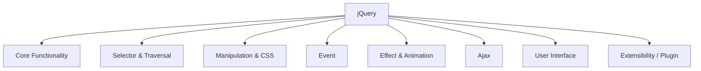
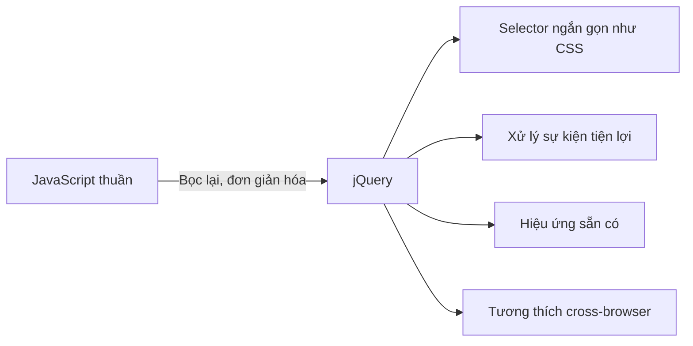

# Chương 3: Lập Trình Sự Kiện với JavaScript & jQuery

---

## PHẦN 1: JAVASCRIPT

---

### 1. Giới thiệu về JavaScript

JavaScript (viết tắt: **JS**) là ngôn ngữ kịch bản (scripting language) được phát triển bởi Sun Microsystems và Netscape. Ban đầu được thiết kế để chạy trên trình duyệt (phía client), nhưng hiện nay JS không chỉ giới hạn ở frontend.

- **Phía server:** Node.js là ví dụ nổi tiếng nhất cho việc dùng JS ở server-side.
- **Cơ sở dữ liệu:** MongoDB, CouchDB sử dụng JavaScript làm ngôn ngữ truy vấn và lập trình.

> **Lưu ý quan trọng:** JavaScript và Java là hai ngôn ngữ **hoàn toàn khác nhau**. Chúng chỉ có tên tương tự nhau về mặt marketing, không có quan hệ kỹ thuật trực tiếp.

JavaScript là một trong 3 ngôn ngữ nền tảng của mọi trang web:

| Ngôn ngữ | Vai trò |
|---|---|
| HTML | Quy định **nội dung** của trang |
| CSS | Quy định **giao diện** (màu sắc, bố cục) |
| JavaScript | Quy định **hành vi, sự kiện** (tương tác người dùng) |

---

### 2. Nhúng JavaScript vào Trang Web

Có hai cách nhúng JavaScript vào HTML:

**Cách 1: Viết trực tiếp trong thẻ `<script>`**

```html
<script type="text/javascript">
    // Nhập code tại đây
</script>
```

> Thuộc tính `type="text/javascript"` không còn bắt buộc trong HTML5. Bạn có thể viết gọn `<script>`.

**Cách 2: Liên kết file JS ngoài (tương tự CSS)**

```html
<script src="ten_file_script.js"></script>
```

**Vị trí đặt thẻ `<script>` ảnh hưởng đến thứ tự thực thi:**

```html
<html>
  <head>
    <script type="text/javascript">
      // Script ở đây thực thi NGAY KHI trang bắt đầu tải
      // Dùng cho khai báo hàm, biến toàn cục
    </script>
  </head>
  <body>
    <script type="text/javascript">
      // Script ở đây thực thi SAU KHI các script trong <head> đã chạy
      // Thường dùng để thao tác DOM sau khi nội dung đã có
    </script>

    <script src="ten_file_script.js"></script>
  </body>
</html>
```

!!! info "Số lượng thẻ script"
    Không có giới hạn về số lượng đoạn `<script>` có thể chèn vào một trang web.

---

### 3. Đầu Ra (Output) của JavaScript

JavaScript có nhiều cách hiển thị dữ liệu:

```javascript
// 1. Ghi vào nội dung của một element HTML
document.getElementById("myDiv").innerHTML = "Xin chào!";

// 2. Ghi thẳng vào luồng HTML (dùng khi trang đang tải)
document.write("Hello World");

// 3. Hiển thị hộp thoại cảnh báo
window.alert("Đây là cảnh báo!");

// 4. Ghi ra console của trình duyệt (dùng để debug)
console.log("Giá trị biến x =", x);
```

!!! warning "Lưu ý về `document.write()`"
    Nếu gọi `document.write()` sau khi trang đã tải xong, nó sẽ **ghi đè toàn bộ nội dung trang**. Chỉ nên dùng trong quá trình trang đang tải lần đầu.

---

### 4. Biến (Variable)

#### 4.1 Quy tắc đặt tên biến

- Chỉ dùng các ký tự: `A–Z`, `a–z`, `0–9`, `_`
- **Phân biệt chữ hoa và chữ thường:** `myVar` và `myvar` là hai biến khác nhau
- Không được bắt đầu bằng chữ số

#### 4.2 Khai báo biến

```javascript
// Khai báo bằng var (cách cũ, phạm vi function)
var count = 10;
var amount; // khai báo không khởi tạo => undefined

// Khai báo nhiều biến cùng lúc
var x = 5, y = 10, z;

// Khai báo bằng let (ES6+, phạm vi block - khuyến khích dùng)
let name = "Nguyen Van A";

// Khai báo hằng số (không thể thay đổi sau khi gán)
const PI = 3.14159;
```

!!! tip "Không cần khai báo trước khi dùng?"
    JavaScript cho phép sử dụng biến mà không cần khai báo trước — biến sẽ tồn tại từ lần đầu tiên được sử dụng. Tuy nhiên, đây là thói quen xấu vì có thể gây lỗi khó debug. **Luôn luôn khai báo biến trước khi dùng.**

#### 4.3 Kiểu Dữ Liệu

JavaScript là ngôn ngữ **kiểu động** (dynamically typed) — biến tự đổi kiểu khi giá trị thay đổi.

| Kiểu | Ví dụ | Mô tả |
|---|---|---|
| `Number` | `0.066218`, `12` | Số thực/nguyên, theo chuẩn IEEE 754 |
| `String` | `"Hello"`, `"40"`, `""` | Chuỗi Unicode, kể cả chuỗi rỗng |
| `Boolean` | `true`, `false` | Giá trị logic |
| `Object` | `new Array(10)` | Phải cấp phát bằng từ khóa `new` |
| `undefined` | `var x;` | Biến đã khai báo nhưng chưa gán giá trị |
| `null` | `connection = null` | Giá trị rỗng có chủ đích |

**Ví dụ biến tự đổi kiểu:**

```javascript
var x = 10;           // x kiểu Number
x = "hello world!";  // x tự động đổi thành kiểu String
```

**Cộng biến khác kiểu:**

```javascript
var x;
x = "12" + 34.5;
// Kết quả: x = "1234.5" (kiểu String)
// Vì khi có String, JS dùng phép nối chuỗi thay vì cộng số
```

!!! question "Tại sao `"12" + 34.5` lại ra `"1234.5"` chứ không phải `46.5`?"
    Trong JavaScript, khi một trong hai toán hạng của `+` là kiểu `String`, JavaScript sẽ **ép kiểu** toán hạng còn lại thành `String` và thực hiện **nối chuỗi** thay vì cộng số. Vì vậy `"12" + 34.5` = `"12" + "34.5"` = `"1234.5"`.

**Chuyển đổi kiểu dữ liệu từ chuỗi sang số:**

```javascript
var str = "42.5abc";

parseInt(str);    // => 42   (chỉ lấy phần số nguyên đầu tiên)
parseFloat(str);  // => 42.5 (lấy phần số thực đầu tiên)

parseInt("abc");  // => NaN (Not a Number - không parse được)
```

---

### 5. Kiểu Dữ Liệu và Các Phép Toán

#### 5.1 Phép toán số học

```javascript
var a = 10, b = 3;

a + b;   // 13 - cộng
a - b;   // 7  - trừ
a * b;   // 30 - nhân
a / b;   // 3.333... - chia
a % b;   // 1  - chia lấy phần dư (modulo)
a++;     // tăng a lên 1 (a = 11)
a--;     // giảm a đi 1 (a = 9)

// Phép gán kết hợp
a += 5;  // tương đương a = a + 5
a -= 5;
a *= 2;
a /= 2;
```

#### 5.2 Phép toán so sánh

```javascript
a < b;   // nhỏ hơn
a <= b;  // nhỏ hơn hoặc bằng
a > b;   // lớn hơn
a >= b;  // lớn hơn hoặc bằng
a == b;  // bằng (chỉ so sánh giá trị, không so sánh kiểu)
a != b;  // khác

// Nên dùng === và !== để so sánh cả kiểu dữ liệu
"5" == 5;   // true  (vì chỉ so sánh giá trị)
"5" === 5;  // false (vì khác kiểu: String vs Number)
```

#### 5.3 Phép toán logic

```javascript
var x = 10, y = 5;

x && y;   // AND: true nếu cả hai đều true
x || y;   // OR:  true nếu ít nhất một cái true
!x;       // NOT: đảo ngược giá trị boolean
```

---

### 6. Các Quy Tắc Cú Pháp Chung

```javascript
// Khối lệnh bao trong dấu ngoặc nhọn
if (x > 0) {
    // các lệnh bên trong
}

// Mỗi lệnh nên kết thúc bằng dấu chấm phẩy
var x = 10;
document.write(x);

// Chú thích một dòng
// Đây là chú thích

/* Chú thích
   nhiều dòng */
```

---

### 7. Khai Báo Hàm (Function)

#### 7.1 Hàm không trả về giá trị

```javascript
function tenHam(thamso1, thamso2) {
    // Thân hàm
    // Thực hiện các lệnh
}
```

#### 7.2 Hàm có trả về giá trị

```javascript
function tenHam(thamso1, thamso2) {
    // Thân hàm
    return (giaTriTraVe);
}
```

**Ví dụ cụ thể:**

```html
<!DOCTYPE html>
<html>
<head></head>
<body>
  <script>
    function Add(x, y) {
        return (x + y);
    }

    var t;
    t = Add(4, 8);        // Gọi hàm với tham số 4 và 8
    document.write(t);    // In ra: 12
  </script>
</body>
</html>
```

!!! info "Đặc điểm hàm trong JavaScript"
    - Hàm trong JS là **first-class citizen** — có thể gán vào biến, truyền làm tham số, trả về từ hàm khác.
    - Tham số không cần khai báo kiểu.
    - Nếu gọi hàm thiếu tham số, các tham số thiếu sẽ có giá trị `undefined`.

---

### 8. Xử Lý Sự Kiện (Event Handling)

#### 8.1 Các sự kiện thông dụng

| Sự kiện | Mô tả |
|---|---|
| `onclick` | Người dùng click vào element |
| `ondblclick` | Người dùng double-click |
| `onmouseover` | Con trỏ di chuyển **vào** element |
| `onmouseout` | Con trỏ di chuyển **ra khỏi** element |
| `onmousedown` | Nhấn giữ nút chuột |
| `onmouseup` | Thả nút chuột |
| `onmousemove` | Di chuyển chuột trên element |
| `onfocus` | Element nhận focus (được chọn) |
| `onblur` | Element mất focus |
| `onchange` | Giá trị của element thay đổi |
| `onload` | Trang web tải xong |
| `onunload` | Người dùng đóng trang |
| `onsubmit` | Người dùng submit form |
| `onreset` | Người dùng reset form |
| `onselect` | Người dùng chọn nội dung trên trang |
| `onresize` | Cửa sổ trình duyệt thay đổi kích thước |
| `onkeydown` | Phím đang được nhấn xuống |
| `onkeypress` | Phím được nhấn |
| `onkeyup` | Phím được nhả ra |
| `onabort` | Người dùng hủy tải trang |

#### 8.2 Cách gắn sự kiện vào element

**Cách 1: Gắn trực tiếp trong HTML (inline)**

```html
<button onclick="myFunction()">Click me</button>
```

**Cách 2: Gắn qua thuộc tính trong JavaScript**

```javascript
document.getElementById("myBtn").onclick = myFunction;
```

#### 8.3 Ví dụ sự kiện `onload`

```html
<head>
  <script language="Javascript">
    function GreetingMessage() {
        window.alert("Welcome to my world");
    }
  </script>
</head>
<body onload="GreetingMessage()">
  <!-- Khi trang tải xong, hàm GreetingMessage() sẽ tự động được gọi -->
</body>
```

!!! tip "Khi nào dùng `onload`?"
    Sự kiện `onload` rất hữu ích để khởi tạo dữ liệu, kiểm tra trình duyệt, hoặc thực hiện các thao tác cần đợi toàn bộ trang (kể cả ảnh, CSS) tải xong.

---

## PHẦN 2: JQUERY

---

### 1. Giới Thiệu về jQuery

jQuery là một **thư viện JavaScript mã nguồn mở, miễn phí**, được thiết kế với triết lý: **"Write less, do more"** (viết ít hơn, làm được nhiều hơn).

**Lợi ích chính:**

- Truy xuất các phần tử HTML với cú pháp tương tự CSS (thông qua **selector**).
- Hỗ trợ xử lý nhiều thao tác trên một tập element chỉ bằng một dòng lệnh (**method chaining**):

```javascript
$("selector").func1().func2().func3();
```

- Tách biệt mã xử lý JavaScript khỏi HTML.
- Tương thích trên nhiều trình duyệt (cross-browser compatible).
- jQuery là thư viện JavaScript **được sử dụng phổ biến nhất** trên các website trên thế giới.

#### 1.1 Cài Đặt jQuery

**Cách 1: Nhúng từ CDN (không cần tải về)**

```html
<!DOCTYPE html>
<html>
<head>
  <script src="https://ajax.googleapis.com/ajax/libs/jquery/3.4.1/jquery.min.js"></script>
  <script>
    $(document).ready(function() {
        // Code jQuery viết ở đây
    });
  </script>
</head>
<body>
</body>
</html>
```

**Cách 2: Tải về và import vào project**

Tải từ [jquery.com](http://jquery.com/), rồi nhúng:

```html
<script src="jquery-3.4.1.min.js"></script>
```

#### 1.2 Sự Kiện `onload` trong jQuery

**Cách truyền thống (JavaScript thuần):**

```javascript
function onloadHandler() {
    alert("Chạy sau khi toàn bộ nội dung trang đã tải xong, kể cả ảnh");
}
window.onload = onloadHandler;
```

**Với jQuery — `$(document).ready()`:**

```javascript
$(document).ready(function() {
    // Hàm này được gọi ngay sau khi cấu trúc DOM đã nạp xong
    // KHÔNG cần chờ ảnh hay các tài nguyên khác tải xong
    alert("hello world");
});
```

!!! question "Sự khác biệt giữa `window.onload` và `$(document).ready()`?"
    - `window.onload`: chờ **toàn bộ** trang tải xong (HTML, CSS, ảnh, ...).
    - `$(document).ready()`: chỉ cần **cấu trúc DOM** (HTML) tải xong là chạy — nhanh hơn.
    - `$(document).ready()` có thể được gọi **nhiều lần** trong cùng một trang, các hàm được gọi theo thứ tự đăng ký. Còn `window.onload` chỉ giữ lại hàm được gán **cuối cùng**.

#### 1.3 Các Thành Phần Chính của jQuery



| Thành phần | Chức năng |
|---|---|
| Core Functionality | Các phương thức lõi và hàm tiện ích |
| Selector & Traversal | Chọn, tìm kiếm, duyệt element trong DOM |
| Manipulation & CSS | Thay đổi nội dung element, làm việc với CSS |
| Event | Đơn giản hóa xử lý sự kiện |
| Effect & Animation | Tạo hiệu ứng và animation |
| Ajax | Gửi/nhận dữ liệu bất đồng bộ với server |
| User Interface | Các widget: accordion, datepicker, dialog, ... |
| Extensibility | Hỗ trợ viết plugin mở rộng |

---

### 2. jQuery Selector

Selector cho phép **truy xuất (chọn) các element trong DOM** dựa trên biểu thức. Cú pháp tương tự CSS.

```javascript
$(selector).action();
// selector: biểu thức chọn element
// action(): phương thức thực hiện trên các element được chọn
```

**Kết quả trả về là jQuery objects**, không phải DOM objects thuần.

#### 2.1 Bảng Selector Cơ Bản

| Selector | Ý nghĩa |
|---|---|
| `tagname` | Chọn tất cả element có tên tag là `tagname` |
| `#id` | Chọn element có thuộc tính `id` tương ứng |
| `.className` | Chọn tất cả element có `class` tương ứng |
| `tag.className` | Chọn element thuộc loại `tag` VÀ có `class` tương ứng |
| `*` | Chọn tất cả element trên document |

#### 2.2 Ví Dụ Minh Họa

Giả sử HTML như sau:

```html
<ul id="list1">
    <li class="a">item 1</li>
    <li class="a">item 2</li>
    <li class="b">item 3</li>
    <li class="b">item 4</li>
</ul>
<p class="a">this is paragraph 1</p>
<p id="para2">this is paragraph 2</p>
<p class="b">this is paragraph 3</p>
<p>this is paragraph 4</p>
```

```javascript
// Chọn tất cả thẻ <p>
$("p").css("border", "1px solid red");

// Chọn element có id là "para2"
$("#para2").css("border", "1px solid red");

// Chọn tất cả <li> có class="a"
$("li.a").css("border", "1px solid red");

// Chọn nhiều selector cùng lúc (dùng dấu phẩy)
$("li.a, p.a, p#para2").css("border", "1px solid red");

// Chọn tất cả element có class="a" HOẶC class="b"
$(".a, .b").css("border", "1px solid red");

// Selector lồng nhau: chọn <a> nằm bên trong <p>
$("p a").css("border", "1px solid red");
```

#### 2.3 Form Selector

Dùng để chọn các phần tử trong form:

| Selector | Ý nghĩa |
|---|---|
| `:input` | Chọn tất cả `<input>`, `<textarea>` trong form |
| `:text` | Chọn tất cả text field |
| `:password` | Chọn tất cả password field |
| `:radio` | Chọn tất cả radio button |
| `:checkbox` | Chọn tất cả checkbox |
| `:submit` | Chọn tất cả button submit |
| `:reset` | Chọn tất cả button reset |
| `:image` | Chọn tất cả image input |
| `:button` | Chọn tất cả button |
| `:file` | Chọn tất cả control upload file |

```javascript
// Đặt viền đỏ cho tất cả input trong form
$("form :input").css("border", "1px solid red");
```

---

### 3. jQuery Filter

jQuery Filter được dùng để **lọc thêm** trên tập kết quả đã có từ Selector. Có 6 loại Filter: Basic, Content, Visibility, Attribute, Child, Form.

#### 3.1 Basic Filter

| Bộ lọc | Ý nghĩa |
|---|---|
| `:first` | Phần tử **đầu tiên** trong tập kết quả |
| `:last` | Phần tử **cuối cùng** trong tập kết quả |
| `:even` | Các phần tử ở vị trí **chẵn** (0, 2, 4, ...) |
| `:odd` | Các phần tử ở vị trí **lẻ** (1, 3, 5, ...) |
| `:eq(index)` | Phần tử tại vị trí **bằng** `index` |
| `:gt(index)` | Các phần tử có vị trí **lớn hơn** `index` |
| `:lt(index)` | Các phần tử có vị trí **nhỏ hơn** `index` |
| `:header` | Tất cả header element (`H1`, `H2`, ..., `H6`) |
| `:not(selector)` | Các phần tử **không thỏa** selector |

!!! info "Chỉ số (index) bắt đầu từ 0"
    Trong jQuery, vị trí của các phần tử trong tập kết quả được đánh số từ **0**.

#### 3.2 Ví Dụ Filter

```javascript
// Chọn các thẻ <p> ở vị trí lẻ (paragraph 2, 4)
$("p:odd").css("border", "1px solid red");

// Chọn thẻ <p> tại vị trí 1 (paragraph 2)
$("p:eq(1)").css("border", "1px solid red");

// Chọn thẻ <p> tại vị trí 3 (paragraph 4)
$("p:eq(3)").css("border", "1px solid red");
```

---

### 4. Thay Đổi Nội Dung Document

#### 4.1 Tạo Nội Dung Mới

```javascript
// Tạo thẻ h1 mới với nội dung
var h1 = $("<h1>heading 1</h1>");

// Tạo từ biến chuỗi
var temp = "<h1>heading 1</h1>";
var newH1 = $(temp);

// Đặt nội dung vừa tạo vào element đầu tiên thỏa selector
$("p:eq(0)").html(newH1);
```

#### 4.2 Truy Cập và Thay Đổi Nội Dung Element

| Phương thức | Ý nghĩa |
|---|---|
| `html()` | Lấy nội dung HTML bên trong element **đầu tiên** thỏa selector |
| `html(newContent)` | Thay đổi nội dung HTML bên trong **mọi** element thỏa selector (tương tự `innerHTML`) |
| `text()` | Lấy nội dung text bên trong element đầu tiên |
| `text(newTextContent)` | Thay đổi nội dung text bên trong mọi element (tương tự `innerText`) |

```javascript
// Lấy nội dung HTML của ul
alert($("#list1").html());
// Kết quả: <LI class=a>item 1 <LI class=a>item 2 ...

// Lấy nội dung text thuần của ul
alert($("#list1").text());
// Kết quả: item 1 item 2 item 3 item 4

// Thay đổi nội dung HTML của element có id="p1"
var h1 = $("<h1>heading1</h1>");
$("#p1").html(h1);

// Thay đổi nội dung text của phần tử cuối
$("p:last").text("new content");
```

#### 4.3 Thay Đổi Giá Trị Thuộc Tính (Attribute)

| Phương thức | Ý nghĩa |
|---|---|
| `attr(name)` | Lấy giá trị attribute của element **đầu tiên** thỏa selector |
| `attr(key, value)` | Thiết lập một attribute cho **mọi** element thỏa selector |
| `attr(properties)` | Thiết lập **nhiều attribute** cùng lúc (dạng object) |
| `attr(key, function)` | Thiết lập giá trị attribute dựa trên hàm |
| `removeAttr(name)` | Xóa attribute khỏi mọi element thỏa selector |

```javascript
// Thay đổi href của thẻ <a>
$("a").attr("href", "trang2.html");

// Thay đổi text hiển thị của thẻ <a>
$("a").text("trang 2");

// Mở link trong tab mới
$("a").attr("target", "_blank");

// Thay đổi src của ảnh bên trong thẻ <a>
$("a img").attr("src", "book2.jpg");

// Xóa thuộc tính href
$("a").removeAttr("href");

// Thiết lập nhiều thuộc tính cùng lúc
$("img").attr({ src: "book2.jpg", alt: "hello world" });
```

#### 4.4 Chèn Nội Dung

| Phương thức | Ý nghĩa |
|---|---|
| `append(content)` | Chèn `content` vào **sau** nội dung có sẵn bên trong element |
| `appendTo(selector)` | Chèn element hiện tại vào **sau** nội dung của element chỉ định |
| `prepend(content)` | Chèn `content` vào **trước** nội dung có sẵn bên trong element |
| `prependTo(selector)` | Chèn element hiện tại vào **trước** nội dung của element chỉ định |
| `after(content)` | Chèn `content` vào **sau** element (bên ngoài) |
| `before(content)` | Chèn `content` vào **trước** element (bên ngoài) |

```javascript
// Thêm "new content" vào sau nội dung của mỗi thẻ <li>
$("li").append("<b>new content</b>");
// Kết quả: item 1 new content, item 2 new content, ...
```

!!! question "Sự khác nhau giữa `append` và `after`?"
    - `append(content)`: chèn `content` **bên trong** element, ở **cuối** nội dung hiện có.
    - `after(content)`: chèn `content` **bên ngoài** element, ngay **sau** thẻ đóng của element.
    
    Ví dụ: `$("p").append("<b>x</b>")` → `<p>nội dung<b>x</b></p>` (x nằm trong `<p>`)  
    Còn `$("p").after("<b>x</b>")` → `<p>nội dung</p><b>x</b>` (x nằm ngoài `<p>`)

---

### 5. Làm Việc với CSS

#### 5.1 Truy Cập và Thay Đổi Thuộc Tính CSS

| Phương thức | Ý nghĩa |
|---|---|
| `css(name)` | Lấy giá trị thuộc tính CSS của element **đầu tiên** thỏa selector |
| `css(property, value)` | Thiết lập **một** thuộc tính CSS cho mọi element thỏa selector |
| `css(properties)` | Thiết lập **nhiều** thuộc tính CSS cùng lúc |

```javascript
// Lấy màu của element
var color = $("p#para2").css("color");

// Thiết lập màu chữ và màu nền
$("p#para2").css({ color: "red", backgroundColor: "green" });

// Thiết lập màu chữ cho tất cả p.a
$("p.a").css("color", "blue");
```

#### 5.2 Làm Việc với Class CSS

| Phương thức | Ý nghĩa |
|---|---|
| `addClass(class)` | **Thêm** class vào các element thỏa selector |
| `hasClass(class)` | **Kiểm tra** class có tồn tại hay không |
| `removeClass(class)` | **Xóa** class khỏi các element thỏa selector |
| `toggleClass(class)` | **Thêm** nếu chưa có, **xóa** nếu đã có |

```javascript
$("div").addClass("highlight");
$("div").removeClass("highlight");
$("div").toggleClass("highlight"); // đảo trạng thái
```

#### 5.3 Thay Đổi Kích Thước

| Phương thức | Ý nghĩa |
|---|---|
| `height()` | Lấy chiều cao của element đầu tiên thỏa selector |
| `width()` | Lấy chiều rộng của element đầu tiên thỏa selector |
| `height(val)` | Thiết lập chiều cao cho mọi element thỏa selector |
| `width(val)` | Thiết lập chiều rộng cho mọi element thỏa selector |

---

### 6. Xử Lý Sự Kiện trong jQuery

#### 6.1 Đăng Ký và Hủy Sự Kiện

```javascript
// Đăng ký sự kiện
$("selector").bind(event, [data], handler);

// Hủy đăng ký sự kiện
$("selector").unbind(event, [data], handler);
```

| Tham số | Ý nghĩa |
|---|---|
| `event` | Tên sự kiện: `load`, `blur`, `click`, `dblclick`, `mousedown`, `mouseup`, `mousemove`, `mouseover`, `mouseout`, `submit`, `keydown`, `keypress`, `keyup`, ... |
| `data` | (Tùy chọn) Dữ liệu truyền vào handler khi event xảy ra |
| `handler` | Tên hàm hoặc hàm ẩn danh xử lý sự kiện |

#### 6.2 Ví Dụ Xử Lý Sự Kiện

```javascript
// Đăng ký sự kiện hover và click
$("div").bind("mouseover", highLight);
$("div").bind("mouseleave", highLight);

$("div").bind("click", function() {
    // Khi click, hủy các sự kiện hover
    $("div").unbind("mouseover", highLight);
    $("div").unbind("mouseleave", highLight);
    $("div").html("<p style='color:green;'>turn off</p>");
});

function highLight(evt) {
    $("div").toggleClass("highlight"); // đảo class highlight
}
```

#### 6.3 Helper Function — Viết Ngắn Gọn Hơn

jQuery cung cấp các hàm rút gọn cho các sự kiện thông dụng:

| Phương thức | Ý nghĩa |
|---|---|
| `click(func)` | Gắn hàm xử lý sự kiện `click` |
| `blur(func)` | Gắn hàm xử lý sự kiện `blur` |
| `mousedown(func)` | Gắn hàm xử lý sự kiện `mousedown` |
| `mouseover(func)` | Gắn hàm xử lý sự kiện `mouseover` |
| `mouseout(func)` | Gắn hàm xử lý sự kiện `mouseout` |
| `submit(func)` | Gắn hàm xử lý sự kiện `submit` |
| `hover(func1, func2)` | `func1` khi chuột vào, `func2` khi chuột ra |

```javascript
// Dùng helper click() thay vì bind("click", ...)
$("div").click(function() {
    alert("Bạn đã click vào div!");
});

// Dùng hover()
$("div").hover(highLight, highLight);
// func1 = highLight: gọi khi chuột di vào
// func2 = highLight: gọi khi chuột di ra

function highLight(evt) {
    $("div").toggleClass("highlight");
}
```

---

### 7. Hiệu Ứng và Hoạt Ảnh (Effects & Animation)

#### 7.1 Ẩn / Hiện Element

Tham số `speed` nhận các giá trị: `"slow"`, `"normal"`, `"fast"`, hoặc số millisecond (vd: `4000` = 4 giây).

| Phương thức | Ý nghĩa |
|---|---|
| `show()` | Hiển thị element nếu đang ẩn |
| `show(speed, callback)` | Hiển thị với tốc độ, gọi `callback` sau khi xong |
| `hide()` | Ẩn element nếu đang hiển thị |
| `hide(speed, callback)` | Ẩn với tốc độ, gọi `callback` sau khi xong |
| `toggle()` | Đảo trạng thái ẩn/hiện |
| `toggle(speed, callback)` | Đảo trạng thái với tốc độ |

```javascript
$("#div1").show("normal");   // Hiện với tốc độ bình thường
$("#div1").hide("slow");     // Ẩn chậm
$("#div1").hide(4000);       // Ẩn trong 4 giây
$("#div1").toggle("fast");   // Đảo trạng thái nhanh
```

#### 7.2 Fade In / Fade Out

Hiệu ứng thay đổi độ trong suốt (opacity):

| Phương thức | Ý nghĩa |
|---|---|
| `fadeIn(speed, callback)` | Hiển thị bằng cách **tăng dần** độ trong suốt |
| `fadeOut(speed, callback)` | Ẩn bằng cách **giảm dần** độ trong suốt về 0, sau đó `display:none` |
| `fadeTo(speed, opacity, callback)` | Thay đổi độ trong suốt đến giá trị `opacity` (0.0 – 1.0) |

```javascript
$("#button_fadein").bind("click", function() {
    $("#div1").fadeIn("normal");
});

$("#button_fadeout").bind("click", function() {
    $("#div1").fadeOut("slow");
});

// Fade đến 30% opacity, rồi hiển thị alert
$("#button_fadeto3").bind("click", function() {
    $("#div1").fadeTo("slow", 0.3, function() {
        alert("finished");
    });
});

// Fade trở lại 100% opacity
$("#button_fadeup").bind("click", function() {
    $("#div1").fadeTo("slow", 1.0);
});
```

#### 7.3 Sliding (Trượt)

Hiệu ứng thay đổi chiều cao của element:

| Phương thức | Ý nghĩa |
|---|---|
| `slideDown(speed, callback)` | Hiển thị element bằng cách **tăng dần chiều cao** |
| `slideUp(speed, callback)` | Ẩn element bằng cách **giảm dần chiều cao** |
| `slideToggle(speed, callback)` | Đảo trạng thái ẩn/hiện bằng sliding |

```javascript
$("#button_slideup").bind("click", function() {
    $("#div1").slideUp("normal");
});

$("#button_slidedown").bind("click", function() {
    $("#div1").slideDown("slow");
});

$("#button_toggleslide").bind("click", function() {
    $("#div1").slideToggle(3000); // 3 giây
});
```

#### 7.4 Custom Animation

Tạo hiệu ứng tùy chỉnh bằng cách thay đổi các thuộc tính CSS:

```javascript
$("selector").animate(properties, [duration], [easing], [callback]);

// Dừng animation đang chạy
$("selector").stop();
```

| Tham số | Ý nghĩa |
|---|---|
| `properties` | Object chứa các thuộc tính CSS mục tiêu sau khi animate xong |
| `duration` | Thời gian animate: `"slow"`, `"normal"`, `"fast"`, hoặc millisecond |
| `easing` | Kiểu chuyển động: `"swing"` (mặc định) hoặc `"linear"` |
| `callback` | Hàm gọi sau khi animate hoàn tất |

```javascript
// Mở rộng chiều rộng div đến 800px
$("#button_growright").click(function() {
    $("#div1").animate({ width: "800" }, "normal");
});

// Thu hẹp chiều rộng về 100px
$("#button_growleft").click(function() {
    $("#div1").animate({ width: "100" }, "fast");
});

// Tăng kích thước font chữ lên 40px trong 2 giây
$("#button_bigtext").click(function() {
    $("#div1").animate({ fontSize: "40" }, 2000);
});

// Di chuyển và phóng to chữ cùng lúc, chuyển động tuyến tính
$("#button_movediv").click(function() {
    $("#div1").animate(
        { left: "500", fontSize: "50" },
        1000,
        "linear"
    );
});
```

!!! warning "Lưu ý về `animate()` với `left`, `top`"
    Để di chuyển element bằng `animate()` với thuộc tính `left` hay `top`, element đó phải có `position: relative` hoặc `position: absolute` trong CSS, không phải `position: static` (mặc định).

---

### Tổng Kết So Sánh



| Tính năng | JavaScript thuần | jQuery |
|---|---|---|
| Chọn element | `document.getElementById("id")` | `$("#id")` |
| Thay đổi nội dung | `el.innerHTML = "..."` | `$("#id").html("...")` |
| Gắn sự kiện | `el.onclick = function(){}` | `$("#id").click(function(){})` |
| Hiệu ứng ẩn/hiện | Tự viết CSS/JS | `hide()`, `show()`, `fadeIn()`, ... |
| Hiệu ứng trượt | Tự viết | `slideUp()`, `slideDown()` |
| Animation | Tự viết với `setInterval` | `animate({...})` |
