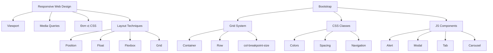

# Chương 4: Responsive Web Design & Bootstrap Framework

---

## Phần 1: Responsive Web Design

---

### 1. Giới thiệu về Thiết kế Đáp ứng

**Responsive Web Design (RWD)** là phương pháp thiết kế web trong đó giao diện và bố cục trang web tự động điều chỉnh để hiển thị phù hợp trên mọi thiết bị và kích thước màn hình — từ điện thoại di động, máy tính bảng cho đến máy tính để bàn.

Triết lý cốt lõi của RWD có thể tóm gọn bằng câu nói nổi tiếng:

> *"Content is like water"* — Nội dung giống như nước: đổ vào cốc thì thành hình cốc, đổ vào chai thì thành hình chai. Trang web cũng vậy, nội dung phải tự định hình theo thiết bị hiển thị.

#### Cách hoạt động

Trong mô hình Responsive, **máy chủ luôn gửi cùng một mã HTML** đến tất cả thiết bị. CSS là thành phần chịu trách nhiệm thay đổi cách trình bày, bố cục tùy theo kích thước màn hình. Điều này khác biệt hoàn toàn với cách tiếp cận cũ là duy trì hai phiên bản website riêng biệt (một cho desktop, một cho mobile).

#### So sánh Responsive vs Adaptive

| Tiêu chí | Responsive Design | Adaptive Design |
|---|---|---|
| HTML gửi về | Một bộ HTML duy nhất | Nhiều bộ HTML khác nhau tùy thiết bị |
| CSS điều chỉnh | Linh hoạt, fluid | Cố định theo từng breakpoint |
| Độ phức tạp | Đơn giản hơn để bảo trì | Phức tạp hơn, cần nhiều template |
| Trải nghiệm | Mượt mà, liên tục | Tối ưu hơn cho từng thiết bị cụ thể |

---

### 2. Viewport và Screen Resolutions

#### Viewport là gì?

**Viewport** là vùng nhìn thấy của trang web đối với người dùng — tức là phần trang web được hiển thị trong cửa sổ trình duyệt tại một thời điểm. Viewport thay đổi theo thiết bị: nhỏ hơn trên điện thoại, lớn hơn trên màn hình máy tính.

Trước khi có HTML5, trình duyệt mobile thường render trang web ở độ rộng desktop (khoảng 980px) rồi thu nhỏ lại, khiến chữ rất nhỏ và người dùng phải zoom. HTML5 giải quyết vấn đề này bằng **thẻ meta viewport**.

#### Thẻ meta viewport

```html
<meta name="viewport" content="width=device-width, initial-scale=1.0">
```

Giải thích từng thuộc tính:

- `width=device-width` — đặt chiều rộng của viewport bằng chiều rộng thực của thiết bị, thay vì dùng chiều rộng mặc định của trình duyệt
- `initial-scale=1.0` — mức zoom ban đầu là 1 (không phóng to, không thu nhỏ)

Các thuộc tính khác của meta viewport:

| Thuộc tính | Mô tả |
|---|---|
| `width` | Chiều rộng của viewport (có thể là số px hoặc `device-width`) |
| `height` | Chiều cao của viewport |
| `initial-scale` | Mức zoom ban đầu (1 = 100%) |
| `minimum-scale` | Mức zoom tối thiểu người dùng có thể thu nhỏ |
| `maximum-scale` | Mức zoom tối đa người dùng có thể phóng to |
| `user-scalable` | Cho phép người dùng zoom hay không (`yes` / `no`) |

!!! warning "Lưu ý về user-scalable"
    Không nên đặt `user-scalable=no` vì điều này gây khó khăn cho người dùng có khiếm khuyết thị lực và vi phạm các tiêu chuẩn về khả năng tiếp cận (accessibility).

#### Nguyên tắc điều chỉnh nội dung phù hợp viewport

- **Không dùng kích thước cố định lớn** — tránh đặt `width: 980px` cứng; thay vào đó dùng `width: 100%` hoặc `max-width`.
- **Hạn chế thanh cuộn ngang** — khi nội dung rộng hơn viewport, trình duyệt sẽ tạo scrollbar ngang, gây trải nghiệm kém trên mobile.

#### Screen Resolutions và Breakpoints

Dựa trên thống kê thực tế, các breakpoint phổ biến nhất theo kích thước thiết bị:

| Breakpoint | Thiết bị |
|---|---|
| `max-width: 320px` | Điện thoại di động, chiều dọc |
| `max-width: 480px` | Điện thoại di động, chiều ngang |
| `max-width: 600px` | Máy tính bảng nhỏ, chiều dọc |
| `max-width: 768px` | Máy tính bảng lớn, chiều dọc |
| `max-width: 800px` | Máy tính bảng, chiều ngang |
| `max-width: 1024px` | Máy tính bảng lớn, chiều ngang |
| `min-width: 1025px` | Desktop thông thường |

---

### 3. CSS Media Queries

**Media Queries** là tính năng CSS3 cho phép áp dụng các quy tắc CSS khác nhau tùy thuộc vào đặc điểm của thiết bị (chiều rộng màn hình, loại màn hình, độ phân giải,...).

#### Cú pháp cơ bản

```css
@media [media-type] and ([media-feature]) {
    /* CSS rules */
}
```

Ví dụ thực tế:

```css
/* Áp dụng khi màn hình >= 480px */
@media screen and (min-width: 480px) {
    body {
        background-color: lightgreen;
    }
}

/* Áp dụng khi màn hình <= 768px */
@media screen and (max-width: 768px) {
    .sidebar {
        display: none;
    }
}

/* Kết hợp nhiều điều kiện */
@media screen and (min-width: 480px) and (max-width: 768px) {
    .container {
        width: 100%;
    }
}
```

#### Các Media Type phổ biến

| Media Type | Mô tả |
|---|---|
| `screen` | Màn hình máy tính, điện thoại, tablet |
| `print` | Khi in trang |
| `all` | Tất cả thiết bị (mặc định) |

#### Mobile-First vs Desktop-First

**Mobile-First** (khuyến nghị): Viết CSS cho mobile trước, dùng `min-width` để mở rộng lên desktop.

```css
/* Base styles: mobile */
.container { width: 100%; }

/* Tablet trở lên */
@media (min-width: 768px) {
    .container { width: 750px; }
}

/* Desktop trở lên */
@media (min-width: 1024px) {
    .container { width: 960px; }
}
```

**Desktop-First**: Viết CSS cho desktop trước, dùng `max-width` để thu nhỏ về mobile.

```css
/* Base styles: desktop */
.container { width: 960px; }

/* Tablet */
@media (max-width: 1024px) {
    .container { width: 750px; }
}

/* Mobile */
@media (max-width: 768px) {
    .container { width: 100%; }
}
```

!!! tip "Nên dùng Mobile-First"
    Mobile-First được khuyến nghị vì xu hướng người dùng ngày càng dùng điện thoại nhiều hơn. CSS viết cho mobile thường đơn giản hơn và có thể tái sử dụng cho desktop, trong khi chiều ngược lại thường phức tạp hơn.

---

### 4. Đơn vị đo trong CSS

#### Đơn vị tuyệt đối

Đơn vị tuyệt đối có kích thước cố định, không thay đổi theo môi trường.

| Đơn vị | Tên | Mô tả |
|---|---|---|
| `px` | Pixel | Đơn vị phổ biến nhất, 1px = 1 điểm ảnh logic |
| `pt` | Point | 1pt = 1/72 inch, thường dùng cho in ấn |
| `cm` | Centimeter | Đơn vị vật lý |
| `mm` | Millimeter | Đơn vị vật lý |
| `in` | Inch | 1in = 96px = 2.54cm |

#### Đơn vị tương đối

Đơn vị tương đối thay đổi kích thước dựa trên một giá trị tham chiếu khác — đây là nền tảng của Responsive Design.

| Đơn vị | Tham chiếu | Mô tả |
|---|---|---|
| `%` | Phần tử cha | 50% = nửa kích thước của phần tử cha |
| `em` | Font-size của phần tử hiện tại | `2em` = gấp 2 lần cỡ chữ hiện tại |
| `rem` | Font-size của phần tử gốc (`html`) | Ổn định hơn `em`, không bị lồng nhau |
| `vw` | Viewport width | `1vw` = 1% chiều rộng viewport |
| `vh` | Viewport height | `1vh` = 1% chiều cao viewport |
| `vmin` | Giá trị nhỏ hơn giữa vw và vh | |
| `vmax` | Giá trị lớn hơn giữa vw và vh | |

**Ví dụ so sánh `em` và `rem`:**

```css
html { font-size: 16px; }

.parent {
    font-size: 20px;
}

.child-em {
    font-size: 1.5em; /* = 20px * 1.5 = 30px (tính từ parent) */
    padding: 1em;     /* = 30px (tính từ font-size của chính nó) */
}

.child-rem {
    font-size: 1.5rem; /* = 16px * 1.5 = 24px (luôn tính từ html) */
    padding: 1rem;     /* = 16px (luôn tính từ html) */
}
```

!!! note "Khi nào dùng đơn vị nào?"
    - Dùng `px` cho border, shadow, những thứ không cần scale
    - Dùng `rem` cho font-size để tôn trọng cài đặt font của người dùng
    - Dùng `%` hoặc `vw/vh` cho layout, container
    - Dùng `em` cho spacing (padding, margin) gắn liền với cỡ chữ

---

### 5. Các Kỹ thuật Dàn trang Đáp ứng

#### 5.1 CSS Position

Thuộc tính `position` xác định cách một phần tử được định vị trong tài liệu.

```css
selector { position: giá_trị; }
```

| Giá trị | Mô tả |
|---|---|
| `static` | Mặc định, theo luồng bình thường |
| `relative` | Dịch chuyển tương đối so với vị trí bình thường của nó |
| `absolute` | Định vị tuyệt đối so với phần tử cha `positioned` gần nhất |
| `fixed` | Cố định so với viewport, không cuộn cùng trang |
| `sticky` | Kết hợp `relative` và `fixed` |

Thuộc tính đi kèm: `top`, `right`, `bottom`, `left`, `z-index`.

**Ví dụ `z-index`:**

```html
<style>
img {
    position: absolute;
    left: 0px;
    top: 0px;
    z-index: -1; /* Đặt ảnh ra phía sau nội dung */
}
</style>
```

!!! info "z-index"
    `z-index` chỉ hoạt động trên các phần tử có `position` khác `static`. Giá trị càng cao, phần tử càng nằm trên cùng (gần người xem hơn).

#### 5.2 CSS Float

`float` được dùng để định vị phần tử sang trái hoặc phải, cho phép nội dung xung quanh bao bọc lấy nó. Đây là kỹ thuật layout truyền thống, hiện nay đã dần được thay thế bởi Flexbox và Grid.

```css
.element {
    float: left;  /* left | right | none */
}

/* Xóa float, ngăn phần tử tiếp theo bị ảnh hưởng */
.clearfix::after {
    content: "";
    display: table;
    clear: both;
}
```

#### 5.3 Flexbox

**Flexbox** (Flexible Box Layout) là mô hình layout một chiều, dùng để sắp xếp các phần tử theo hàng hoặc cột, với khả năng phân phối không gian linh hoạt.

**Khái niệm cốt lõi:**

```
Flex Container (cha)
    ├── Flex Item 1
    ├── Flex Item 2
    └── Flex Item 3
```

- **Main axis**: Trục chính (mặc định là ngang, từ trái sang phải)
- **Cross axis**: Trục phụ (vuông góc với main axis)
- **main start / main end**: Điểm bắt đầu/kết thúc trên trục chính
- **cross start / cross end**: Điểm bắt đầu/kết thúc trên trục phụ

**Các thuộc tính của Flex Container:**

```css
.container {
    display: flex;               /* Kích hoạt flexbox */
    flex-direction: row;         /* row | row-reverse | column | column-reverse */
    flex-wrap: nowrap;           /* nowrap | wrap | wrap-reverse */
    justify-content: flex-start; /* Căn chỉnh theo main axis */
    align-items: stretch;        /* Căn chỉnh theo cross axis */
    gap: 10px;                   /* Khoảng cách giữa các item */
}
```

**Các thuộc tính của Flex Item:**

```css
.item {
    flex: 1;         /* Viết tắt của flex-grow flex-shrink flex-basis */
    flex-grow: 1;    /* Tỷ lệ phóng to khi có không gian dư */
    flex-shrink: 1;  /* Tỷ lệ thu nhỏ khi thiếu không gian */
    flex-basis: auto;/* Kích thước ban đầu trước khi phân phối không gian */
}
```

**Ví dụ layout Responsive với Flexbox:**

```css
/* Desktop: 3 cột, cột giữa rộng gấp đôi */
section, div { display: flex; }
div, article  { flex: 1; }
article:nth-of-type(2) { flex: 2; }

/* Tablet: chuyển section thành block */
@media (max-width: 767px) {
    section { display: block; }
}

/* Mobile: chuyển div thành block */
@media (max-width: 600px) {
    div { display: block; }
}
```

#### 5.4 CSS Grid

**CSS Grid** là mô hình layout hai chiều (hàng và cột đồng thời), phù hợp cho việc dàn trang phức tạp hơn Flexbox.

```css
.grid-container {
    display: grid;
    grid-template-columns: repeat(3, 1fr); /* 3 cột bằng nhau */
    grid-template-rows: auto;
    gap: 20px; /* Khoảng cách giữa các ô (gutter) */
}

.grid-item {
    grid-column: span 2; /* Phần tử này chiếm 2 cột */
}
```

---

## Phần 2: Bootstrap Framework

---

### 1. Giới thiệu về Bootstrap

**Bootstrap** là framework CSS/JS front-end phổ biến nhất thế giới, được Twitter phát triển và ra mắt năm 2010. Bootstrap cung cấp sẵn một hệ thống các class CSS, component, và plugin JavaScript để xây dựng giao diện web nhanh chóng và nhất quán.

**Những lợi ích chính:**

- **Thư viện CSS và JS có sẵn** — không cần tự định nghĩa lại các thành phần cơ bản như nút bấm, form, bảng, navigation...
- **Responsive tích hợp sẵn** — hỗ trợ hiển thị đẹp trên mọi kích thước màn hình
- **Mobile-First** — ưu tiên thiết kế cho điện thoại trước, sau đó mở rộng lên desktop
- **Tương thích trình duyệt** — hoạt động tốt trên Chrome, Firefox, Safari, Opera, IE

#### Cài đặt

**Cách 1 — Dùng CDN (nhanh, không cần tải về):**

```html
<!DOCTYPE html>
<html lang="en">
<head>
    <meta charset="utf-8">
    <meta name="viewport" content="width=device-width, initial-scale=1, shrink-to-fit=no">
    <!-- Bootstrap CSS -->
    <link rel="stylesheet" href="https://stackpath.bootstrapcdn.com/bootstrap/4.4.1/css/bootstrap.min.css">
    <title>Hello, world!</title>
</head>
<body>
    <h1>Hello, world!</h1>

    <!-- jQuery (bắt buộc trước Bootstrap JS) -->
    <script src="https://code.jquery.com/jquery-3.4.1.slim.min.js"></script>
    <!-- Popper.js -->
    <script src="https://cdn.jsdelivr.net/npm/popper.js@1.16.0/dist/umd/popper.min.js"></script>
    <!-- Bootstrap JS -->
    <script src="https://stackpath.bootstrapcdn.com/bootstrap/4.4.1/js/bootstrap.min.js"></script>
</body>
</html>
```

**Cách 2 — Tải về và import local:** Tải tại https://getbootstrap.com rồi đặt vào thư mục dự án.

!!! note "Thứ tự script quan trọng"
    Bootstrap JS phụ thuộc vào jQuery và Popper.js. Phải nhúng theo đúng thứ tự: jQuery → Popper.js → Bootstrap JS.

---

### 2. Bootstrap Grid System

Đây là thành phần trung tâm và quan trọng nhất của Bootstrap.

#### Nguyên lý hoạt động

Grid System của Bootstrap được xây dựng trên **Flexbox**, chia trang thành **12 cột**. Ta có thể gộp nhiều cột lại để tạo cột rộng hơn (ví dụ: 2 cột 6 = 1 hàng đầy đủ).

```
| 1 | 2 | 3 | 4 | 5 | 6 | 7 | 8 | 9 | 10 | 11 | 12 |
|      col-6        |          col-6                |
|   col-4    |   col-4    |        col-4            |
|  col-3  |  col-3  |  col-3  |       col-3        |
```

#### Cấu trúc bắt buộc

```html
<div class="container">
    <div class="row">
        <div class="col-md-6">Cột 1</div>
        <div class="col-md-6">Cột 2</div>
    </div>
</div>
```

Quy tắc:
1. Luôn có **container** bọc bên ngoài
2. Bên trong container là **row**
3. Bên trong row là các **col**

#### Các loại Container

| Class | xs (<576px) | sm (≥576px) | md (≥768px) | lg (≥992px) | xl (≥1200px) |
|---|---|---|---|---|---|
| `.container` | 100% | 540px | 720px | 960px | 1140px |
| `.container-fluid` | 100% | 100% | 100% | 100% | 100% |
| `.container-sm` | 100% | 540px | 720px | 960px | 1140px |
| `.container-md` | 100% | 100% | 720px | 960px | 1140px |
| `.container-lg` | 100% | 100% | 100% | 960px | 1140px |
| `.container-xl` | 100% | 100% | 100% | 100% | 1140px |

#### Cú pháp col

```
col-{breakpoint}-{size}
```

- `{breakpoint}`: để trống (xs), `sm`, `md`, `lg`, `xl`
- `{size}`: từ 1 đến 12, hoặc để trống (tự động chia đều)

| Class | Áp dụng từ |
|---|---|
| `.col-` | Tất cả thiết bị (< 576px) |
| `.col-sm-` | ≥ 576px |
| `.col-md-` | ≥ 768px |
| `.col-lg-` | ≥ 992px |
| `.col-xl-` | ≥ 1200px |

**Ví dụ layout responsive thực tế:**

```html
<div class="container">
    <div class="row">
        <!-- 
            Mobile: full width (12/12)
            Tablet: 1/2 màn hình (6/12)
            Desktop: 1/3 màn hình (4/12)
        -->
        <div class="col-12 col-sm-6 col-md-4">Cột A</div>
        <div class="col-12 col-sm-6 col-md-4">Cột B</div>
        <div class="col-12 col-sm-12 col-md-4">Cột C</div>
    </div>
</div>
```

!!! tip "Cách đọc: lớp nào thắng?"
    Bootstrap áp dụng class theo kiểu **min-width** (mobile-first). Class `col-md-4` nghĩa là "từ md trở lên, chiếm 4 cột". Nếu không có class nhỏ hơn, nó stack thành 100% ở màn hình nhỏ hơn.

---

### 3. Bootstrap CSS Classes

#### Colors — Màu sắc

Bootstrap cung cấp bảng màu ngữ nghĩa (semantic colors):

```html
<!-- Màu chữ -->
<p class="text-primary">Xanh dương chính</p>
<p class="text-secondary">Xám phụ</p>
<p class="text-success">Xanh lá thành công</p>
<p class="text-danger">Đỏ nguy hiểm</p>
<p class="text-warning">Vàng cảnh báo</p>
<p class="text-info">Xanh cyan thông tin</p>
<p class="text-muted">Xám nhạt</p>
<p class="text-dark">Đen</p>
<p class="text-light bg-dark">Trắng (cần bg tối)</p>

<!-- Màu nền -->
<div class="bg-primary text-white">Nền xanh chính</div>
<div class="bg-success text-white">Nền xanh lá</div>
<div class="bg-danger text-white">Nền đỏ</div>
<div class="bg-warning text-dark">Nền vàng</div>
<div class="bg-dark text-white">Nền đen</div>
<div class="bg-transparent">Nền trong suốt</div>
```

#### Spacing — Khoảng cách

Bootstrap dùng ký hiệu tắt cho margin/padding:

```
{property}{sides}-{size}
```

- **Property**: `m` = margin, `p` = padding
- **Sides**: `t` = top, `b` = bottom, `l` = left, `r` = right, `x` = left+right, `y` = top+bottom, (trống) = tất cả 4 cạnh
- **Size**: `0` đến `5` (tương ứng 0, 0.25rem, 0.5rem, 1rem, 1.5rem, 3rem), `auto`

```html
<div class="mt-3">margin-top: 1rem</div>
<div class="mb-0">margin-bottom: 0</div>
<div class="px-2">padding left + right: 0.5rem</div>
<div class="p-4">padding tất cả: 1.5rem</div>
<div class="mx-auto">margin auto (căn giữa)</div>
```

```css
/* Tương đương CSS */
.mt-0  { margin-top: 0 !important; }
.ml-1  { margin-left: 0.25rem !important; }
.px-2  { padding-left: 0.5rem !important; padding-right: 0.5rem !important; }
.p-3   { padding: 1rem !important; }
```

---

### 4. Bootstrap Navigation

#### Nav cơ bản

```html
<ul class="nav">
    <li class="nav-item">
        <a class="nav-link" href="#">Trang chủ</a>
    </li>
    <li class="nav-item">
        <a class="nav-link" href="#">Giới thiệu</a>
    </li>
    <li class="nav-item">
        <a class="nav-link disabled" href="#">Vô hiệu hóa</a>
    </li>
</ul>
```

| Tag | Class Bootstrap | Vai trò |
|---|---|---|
| `ul` | `nav` | Danh sách điều hướng |
| `li` | `nav-item` | Mục điều hướng |
| `a` | `nav-link` | Liên kết |

#### Dropdown trong Nav

```html
<ul class="nav">
    <li class="nav-item">
        <a class="nav-link active" href="#">Active</a>
    </li>
    <li class="nav-item dropdown">
        <a class="nav-link dropdown-toggle" data-toggle="dropdown" href="#">Dropdown</a>
        <div class="dropdown-menu">
            <a class="dropdown-item" href="#">Link 1</a>
            <a class="dropdown-item" href="#">Link 2</a>
            <a class="dropdown-item" href="#">Link 3</a>
        </div>
    </li>
</ul>
```

#### Navigation Bar (Navbar)

Navbar là thanh điều hướng hoàn chỉnh với hỗ trợ responsive:

```html
<nav class="navbar navbar-expand-lg navbar-light bg-light">
    <a class="navbar-brand" href="#">Logo</a>
    <!-- Nút hamburger cho mobile -->
    <button class="navbar-toggler" type="button" data-toggle="collapse" data-target="#navMenu">
        <span class="navbar-toggler-icon"></span>
    </button>
    <!-- Menu (ẩn trên mobile, hiện khi bấm nút) -->
    <div class="collapse navbar-collapse" id="navMenu">
        <ul class="navbar-nav">
            <li class="nav-item"><a class="nav-link" href="#">Home</a></li>
            <li class="nav-item"><a class="nav-link" href="#">Link</a></li>
        </ul>
        <!-- Search form -->
        <form class="form-inline ml-auto">
            <input class="form-control mr-sm-2" type="search" placeholder="Search">
            <button class="btn btn-outline-success" type="submit">Search</button>
        </form>
    </div>
</nav>
```

!!! info "navbar-expand-{breakpoint}"
    - `navbar-expand-lg`: menu hiển thị ngang từ `lg` trở lên, thu về hamburger ở nhỏ hơn
    - `navbar-expand-md`: mở rộng từ `md`
    - Không có `navbar-expand`: luôn thu về hamburger

#### Pagination

```html
<ul class="pagination">
    <li class="page-item">
        <a class="page-link" href="#">Previous</a>
    </li>
    <li class="page-item">
        <a class="page-link" href="#">1</a>
    </li>
    <li class="page-item active">
        <a class="page-link" href="#">2</a>  <!-- Trang hiện tại -->
    </li>
    <li class="page-item">
        <a class="page-link" href="#">3</a>
    </li>
    <li class="page-item">
        <a class="page-link" href="#">Next</a>
    </li>
</ul>
```

---

### 5. Bootstrap JavaScript Components

Bootstrap JS được viết dựa trên jQuery và cung cấp nhiều component tương tác. Cần nhúng đúng thứ tự: jQuery → Popper.js → Bootstrap JS.

#### Alert (Thông báo)

```html
<div class="alert alert-success alert-dismissible">
    <button type="button" class="close" data-dismiss="alert">&times;</button>
    <strong>Thành công!</strong> Thao tác đã được thực hiện.
</div>

<div class="alert alert-danger alert-dismissible">
    <button type="button" class="close" data-dismiss="alert">&times;</button>
    <strong>Lỗi!</strong> Đã có sự cố xảy ra.
</div>
```

- `alert-dismissible`: thêm padding phù hợp cho nút đóng
- `data-dismiss="alert"`: nút đóng alert khi bấm

#### Modal (Hộp thoại)

Modal là hộp thoại hiện lên khi được kích hoạt bởi một sự kiện. Mặc định ẩn, hiện ra khi trigger.

```html
<!-- Nút kích hoạt modal -->
<button type="button" class="btn btn-primary"
        data-toggle="modal"
        data-target="#myModal">
    Mở hộp thoại
</button>

<!-- Nội dung Modal -->
<div class="modal fade" id="myModal" tabindex="-1" role="dialog">
    <div class="modal-dialog" role="document">
        <div class="modal-content">
            <!-- Tiêu đề -->
            <div class="modal-header">
                <h5 class="modal-title">Tiêu đề</h5>
                <button type="button" class="close" data-dismiss="modal">
                    <span>&times;</span>
                </button>
            </div>
            <!-- Nội dung -->
            <div class="modal-body">
                Nội dung modal ở đây...
            </div>
            <!-- Chân modal -->
            <div class="modal-footer">
                <button type="button" class="btn btn-secondary" data-dismiss="modal">Đóng</button>
                <button type="button" class="btn btn-primary">Lưu</button>
            </div>
        </div>
    </div>
</div>
```

!!! tip "Class `.fade`"
    Thêm class `.fade` vào modal để có hiệu ứng mờ dần khi hiện/ẩn. Bỏ `.fade` nếu muốn hiện tức thì.

#### Tab

Tab dùng để phân tách nội dung thành các phần, mỗi lúc chỉ xem được một phần.

```html
<!-- Danh sách tab -->
<ul class="nav nav-tabs">
    <li class="nav-item">
        <a class="nav-link active" data-toggle="tab" href="#home">Home</a>
    </li>
    <li class="nav-item">
        <a class="nav-link" data-toggle="tab" href="#menu1">Menu 1</a>
    </li>
    <li class="nav-item">
        <a class="nav-link" data-toggle="tab" href="#menu2">Menu 2</a>
    </li>
</ul>

<!-- Nội dung tab -->
<div class="tab-content">
    <div id="home" class="container tab-pane active">
        <h3>HOME</h3>
        <p>Nội dung trang chủ...</p>
    </div>
    <div id="menu1" class="container tab-pane fade">
        <h3>Menu 1</h3>
        <p>Nội dung menu 1...</p>
    </div>
    <div id="menu2" class="container tab-pane fade">
        <h3>Menu 2</h3>
        <p>Nội dung menu 2...</p>
    </div>
</div>
```

- `data-toggle="tab"` — Bootstrap tự xử lý việc show/hide tab qua JS
- `tab-pane active` — Tab hiển thị mặc định
- `tab-pane fade` — Tab ẩn, sẽ fade in khi được chọn

#### Filter Table (Tìm kiếm bảng)

Sử dụng jQuery để lọc nội dung bảng theo từ khóa nhập vào:

```html
<input id="myInput" type="text" placeholder="Tìm kiếm...">

<table>
    <thead>
        <tr>
            <th>Họ</th>
            <th>Tên</th>
            <th>Email</th>
        </tr>
    </thead>
    <tbody id="myTable">
        <tr><td>Nguyen</td><td>Van A</td><td>a@example.com</td></tr>
        <tr><td>Tran</td><td>Thi B</td><td>b@mail.com</td></tr>
    </tbody>
</table>

<script>
$(document).ready(function() {
    $("#myInput").on("keyup", function() {
        var value = $(this).val().toLowerCase();
        $("#myTable tr").filter(function() {
            $(this).toggle(
                $(this).text().toLowerCase().indexOf(value) > -1
            );
        });
    });
});
</script>
```

**Giải thích logic:**
1. Lắng nghe sự kiện `keyup` (mỗi lần nhấn phím) trên ô input
2. Lấy giá trị nhập vào, chuyển về chữ thường
3. Với mỗi hàng trong bảng: so sánh text của hàng với từ khóa
4. `toggle()`: hiện hàng nếu tìm thấy, ẩn nếu không tìm thấy

#### Carousel (Slideshow)

Carousel dùng để trình bày một tập hình ảnh hoặc nội dung dạng slideshow — thường dùng cho banner, quảng cáo.

```html
<div id="myCarousel" class="carousel slide" data-ride="carousel">
    <!-- Indicators (chấm tròn bên dưới) -->
    <ul class="carousel-indicators">
        <li data-target="#myCarousel" data-slide-to="0" class="active"></li>
        <li data-target="#myCarousel" data-slide-to="1"></li>
        <li data-target="#myCarousel" data-slide-to="2"></li>
    </ul>

    <!-- Slides -->
    <div class="carousel-inner">
        <div class="carousel-item active">
            
            <div class="carousel-caption">
                <h5>Tiêu đề slide 1</h5>
                <p>Mô tả slide 1</p>
            </div>
        </div>
        <div class="carousel-item">
            
        </div>
    </div>

    <!-- Nút Previous/Next -->
    <a class="carousel-control-prev" href="#myCarousel" data-slide="prev">
        <span class="carousel-control-prev-icon"></span>
    </a>
    <a class="carousel-control-next" href="#myCarousel" data-slide="next">
        <span class="carousel-control-next-icon"></span>
    </a>
</div>
```

---

### Tổng kết


