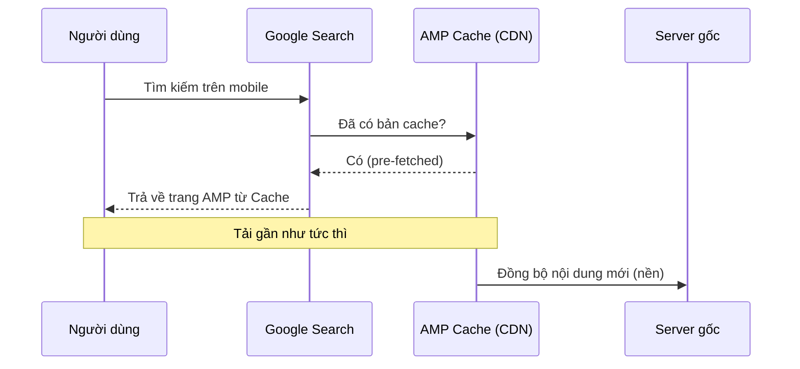
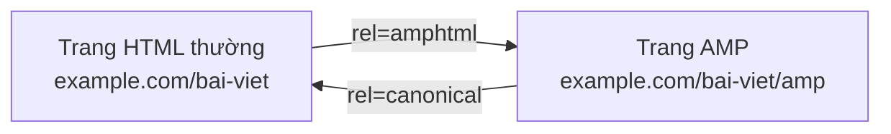
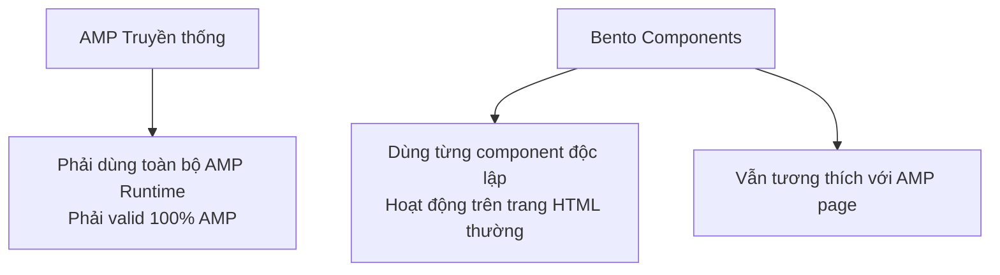

# Chương 5: AMP (Accelerated Mobile Pages)

---

## 1. Tổng quan về AMP

### AMP là gì?

**AMP (Accelerated Mobile Pages)** là một framework web mã nguồn mở do Google khởi xướng năm 2015, được thiết kế để tạo ra các trang web tải cực nhanh, đặc biệt trên thiết bị di động. AMP hoạt động bằng cách áp đặt một tập hợp các ràng buộc kỹ thuật nghiêm ngặt lên HTML/CSS/JS thông thường, đổi lại đảm bảo hiệu năng tải trang gần như tức thì.

AMP không phải là một công nghệ hoàn toàn mới — nó vẫn là HTML, CSS, JavaScript — nhưng được **tinh giản, kiểm soát và tối ưu hóa** theo một bộ quy tắc chặt chẽ.

### Tại sao AMP ra đời?

Trước khi AMP xuất hiện, trang web mobile thường gặp các vấn đề:

- JavaScript bên thứ ba (quảng cáo, analytics, widget) chạy không kiểm soát, chặn render
- Hình ảnh tải không lazy, chiếm băng thông ngay cả khi ngoài viewport
- CSS inline quá lớn, font chữ blocking
- Không có cơ chế ưu tiên tài nguyên rõ ràng

AMP giải quyết tất cả bằng cách **chuẩn hóa** cách viết trang web và **cache sẵn nội dung** trên CDN của Google (AMP Cache).

---

## 2. Kiến trúc và Cách thức hoạt động

### Ba trụ cột của AMP

```
AMP HTML  +  AMP JS (Runtime)  +  AMP Cache
```

- **AMP HTML**: HTML mở rộng với các thẻ tùy chỉnh (`<amp-img>`, `<amp-video>`, ...) và các ràng buộc (không dùng `<script>` tùy ý, không inline style quá 75KB, ...)
- **AMP JS (Runtime)**: Thư viện JavaScript duy nhất được phép chạy, quản lý toàn bộ vòng đời render, ưu tiên tài nguyên, lazy load
- **AMP Cache**: CDN của Google (hoặc Bing, Cloudflare) pre-fetch, validate và phục vụ trang AMP đã được cache — người dùng nhận trang từ CDN thay vì server gốc

### Luồng tải trang AMP



### Tại sao AMP nhanh? — Cơ chế kỹ thuật

AMP thực hiện nhiều kỹ thuật tối ưu đồng thời:

1. **Chỉ cho phép async script**: Mọi JS đều phải `async`, không có script nào được chặn render
2. **Sizing tĩnh cho tất cả tài nguyên**: Ảnh, video, iframe đều phải khai báo `width` và `height` trước, trình duyệt không cần reflow sau khi load
3. **Không có CSS bên ngoài tùy ý**: CSS phải inline trong `<style amp-custom>`, tối đa 75KB
4. **Font loading không blocking**: Fonts web được load theo cơ chế đặc biệt
5. **GPU-accelerated animation**: Chỉ cho phép `opacity` và `transform` trong animation
6. **Pre-connect và Pre-fetch chủ động**: AMP Runtime tự quản lý việc mở kết nối trước đến các origin cần thiết
7. **AMP Cache pre-rendering**: Google pre-render trang AMP trong kết quả tìm kiếm trước khi người dùng click

---

## 3. Cấu trúc một trang AMP HTML

### Boilerplate tối thiểu

```html
<!doctype html>
<html ⚡ lang="vi">
<head>
  <meta charset="utf-8">
  <title>Trang AMP đầu tiên</title>

  <!-- Bắt buộc: viewport -->
  <meta name="viewport" content="width=device-width,minimum-scale=1,initial-scale=1">

  <!-- Bắt buộc: canonical trỏ về trang gốc -->
  <link rel="canonical" href="https://example.com/trang-goc.html">

  <!-- Bắt buộc: AMP boilerplate CSS (không được sửa) -->
  <style amp-boilerplate>
    body{-webkit-animation:-amp-start 8s steps(1,end) 0s 1 normal both;
    -moz-animation:-amp-start 8s steps(1,end) 0s 1 normal both;
    -ms-animation:-amp-start 8s steps(1,end) 0s 1 normal both;
    animation:-amp-start 8s steps(1,end) 0s 1 normal both}
    @-webkit-keyframes -amp-start{from{visibility:hidden}to{visibility:visible}}
    @-moz-keyframes -amp-start{from{visibility:hidden}to{visibility:visible}}
    @-ms-keyframes -amp-start{from{visibility:hidden}to{visibility:visible}}
    @keyframes -amp-start{from{visibility:hidden}to{visibility:visible}}
  </style>
  <noscript>
    <style amp-boilerplate>body{-webkit-animation:none;-moz-animation:none;-ms-animation:none;animation:none}</style>
  </noscript>

  <!-- Bắt buộc: AMP Runtime -->
  <script async src="https://cdn.ampproject.org/v0.js"></script>

  <!-- CSS tùy chỉnh của bạn (tối đa 75KB) -->
  <style amp-custom>
    body { font-family: sans-serif; margin: 0; }
    h1   { color: #333; }
  </style>
</head>
<body>
  <h1>Xin chào AMP!</h1>
  <amp-img src="hinh-anh.jpg"
           width="800" height="600"
           layout="responsive"
           alt="Mô tả ảnh">
  </amp-img>
</body>
</html>
```

!!! warning "Các điểm bắt buộc không được thiếu"
    - Thuộc tính `⚡` hoặc `amp` trên thẻ `<html>`
    - `<meta charset="utf-8">` phải là thẻ đầu tiên trong `<head>`
    - `<meta name="viewport">` với `minimum-scale=1`
    - `<link rel="canonical">` trỏ về trang gốc (hoặc chính nó nếu chỉ có AMP)
    - AMP boilerplate CSS — không được sửa đổi nội dung
    - `<script async src="https://cdn.ampproject.org/v0.js">` — script AMP runtime duy nhất

---

## 4. Các thành phần AMP (AMP Components)

AMP thay thế nhiều thẻ HTML thông thường bằng các **custom element** (`amp-*`) để kiểm soát cách load tài nguyên.

### 4.1 amp-img — Hình ảnh

Thay thế thẻ `` thông thường. Bắt buộc phải có `width`, `height`, `layout`.

```html
<!-- Ảnh responsive (co giãn theo chiều rộng container) -->
<amp-img src="baner.jpg"
         width="1200" height="628"
         layout="responsive"
         alt="Banner chính">
</amp-img>

<!-- Ảnh cố định -->
<amp-img src="logo.png"
         width="150" height="50"
         layout="fixed"
         alt="Logo">
</amp-img>

<!-- Fallback khi ảnh lỗi -->
<amp-img src="anh-chinh.jpg" width="800" height="600" layout="responsive">
  <amp-img fallback src="anh-du-phong.jpg" width="800" height="600" layout="responsive">
  </amp-img>
</amp-img>
```

**Các giá trị `layout` quan trọng:**

| layout | Mô tả |
|---|---|
| `responsive` | Co giãn theo chiều rộng, giữ tỉ lệ |
| `fixed` | Kích thước cố định tuyệt đối |
| `fixed-height` | Chiều cao cố định, chiều rộng linh hoạt |
| `fill` | Lấp đầy container cha |
| `nodisplay` | Ẩn, không chiếm không gian |
| `intrinsic` | Tương tự responsive nhưng không vượt quá kích thước gốc |

### 4.2 amp-video — Video

```html
<!-- Import component (phải thêm script riêng) -->
<script async custom-element="amp-video"
  src="https://cdn.ampproject.org/v0/amp-video-0.1.js"></script>

<amp-video width="720" height="405"
           src="video-gioi-thieu.mp4"
           poster="thumbnail.jpg"
           layout="responsive"
           controls>
  <div fallback>Trình duyệt của bạn không hỗ trợ video HTML5.</div>
</amp-video>
```

### 4.3 amp-carousel — Băng chuyền ảnh

```html
<script async custom-element="amp-carousel"
  src="https://cdn.ampproject.org/v0/amp-carousel-0.1.js"></script>

<amp-carousel width="1200" height="628"
              layout="responsive"
              type="slides"
              autoplay delay="3000">
  <amp-img src="slide1.jpg" width="1200" height="628" layout="responsive"></amp-img>
  <amp-img src="slide2.jpg" width="1200" height="628" layout="responsive"></amp-img>
  <amp-img src="slide3.jpg" width="1200" height="628" layout="responsive"></amp-img>
</amp-carousel>
```

### 4.4 amp-accordion — Accordion mở rộng/thu gọn

```html
<script async custom-element="amp-accordion"
  src="https://cdn.ampproject.org/v0/amp-accordion-0.1.js"></script>

<amp-accordion>
  <section>
    <h2>Câu hỏi 1: AMP có bắt buộc không?</h2>
    <p>Không bắt buộc, nhưng được khuyến nghị cho các trang tin tức, blog, e-commerce muốn tối ưu SEO mobile.</p>
  </section>
  <section expanded>
    <h2>Câu hỏi 2: AMP có ảnh hưởng SEO không?</h2>
    <p>Có. Google ưu tiên hiển thị trang AMP trong kết quả tìm kiếm mobile với biểu tượng sét (⚡).</p>
  </section>
</amp-accordion>
```

### 4.5 amp-form — Biểu mẫu

```html
<script async custom-element="amp-form"
  src="https://cdn.ampproject.org/v0/amp-form-0.1.js"></script>

<form method="post"
      action-xhr="https://api.example.com/subscribe"
      target="_top">
  <input type="email" name="email" placeholder="Email của bạn" required>
  <input type="submit" value="Đăng ký">

  <!-- Trạng thái gửi thành công -->
  <div submit-success>
    <template type="amp-mustache">
      Cảm ơn {{name}}! Đăng ký thành công.
    </template>
  </div>

  <!-- Trạng thái lỗi -->
  <div submit-error>
    <template type="amp-mustache">
      Lỗi: {{message}}
    </template>
  </div>
</form>
```

!!! info "Lưu ý về amp-form"
    AMP form không dùng `action` thông thường mà dùng `action-xhr` để gửi qua XHR (AJAX). Server phải trả về JSON và hỗ trợ CORS.

### 4.6 amp-analytics — Theo dõi Analytics

```html
<script async custom-element="amp-analytics"
  src="https://cdn.ampproject.org/v0/amp-analytics-0.1.js"></script>

<amp-analytics type="googleanalytics">
  <script type="application/json">
  {
    "vars": {
      "account": "UA-XXXXX-Y"
    },
    "triggers": {
      "trackPageview": {
        "on": "visible",
        "request": "pageview"
      },
      "trackClickButton": {
        "on": "click",
        "selector": "#btn-mua-hang",
        "request": "event",
        "vars": {
          "eventCategory": "Ecommerce",
          "eventAction": "Click mua hàng"
        }
      }
    }
  }
  </script>
</amp-analytics>
```

### 4.7 amp-sidebar — Thanh điều hướng

```html
<script async custom-element="amp-sidebar"
  src="https://cdn.ampproject.org/v0/amp-sidebar-0.1.js"></script>

<amp-sidebar id="sidebar-chinh" layout="nodisplay" side="left">
  <nav>
    <ul>
      <li><a href="/">Trang chủ</a></li>
      <li><a href="/tin-tuc">Tin tức</a></li>
      <li><a href="/lien-he">Liên hệ</a></li>
    </ul>
  </nav>
</amp-sidebar>

<!-- Nút mở sidebar -->
<button on="tap:sidebar-chinh.toggle">Menu</button>
```

---

## 5. Hệ thống Actions & Events trong AMP

Vì AMP không cho phép JavaScript tùy ý, tương tác UI được xử lý qua cú pháp `on="event:target.action"`.

```html
<!-- Cú pháp tổng quát -->
on="[event]:[targetId].[action]([args])"

<!-- Ví dụ: click nút -> mở lightbox -->
<button on="tap:anh-lightbox.open">Xem ảnh lớn</button>
<amp-lightbox id="anh-lightbox" layout="nodisplay">
  <amp-img src="anh-full.jpg" width="1200" height="800" layout="responsive"></amp-img>
</amp-lightbox>

<!-- Toggle class CSS -->
<button on="tap:menu.toggleClass(class='active')">Toggle Menu</button>

<!-- Nhiều action cùng lúc -->
<button on="tap:sidebar.open, analytics.trigger(eventType='open-menu')">
  Mở Menu
</button>
```

**Các event phổ biến:**

| Event | Mô tả |
|---|---|
| `tap` | Chạm/click vào element |
| `change` | Giá trị input thay đổi |
| `submit` | Form được gửi |
| `visible` | Element hiện ra trong viewport |
| `load` | Component đã load xong |

---

## 6. AMP & SEO

### Mối quan hệ giữa AMP và trang gốc

Thông thường bạn có hai phiên bản song song:



Trong `<head>` của trang thường:
```html
<link rel="amphtml" href="https://example.com/bai-viet/amp">
```

Trong `<head>` của trang AMP:
```html
<link rel="canonical" href="https://example.com/bai-viet">
```

Nếu chỉ có AMP (không có trang thường):
```html
<!-- Trang AMP tự trỏ canonical về chính nó -->
<link rel="canonical" href="https://example.com/bai-viet/amp">
```

### Lợi ích SEO từ AMP

- Xuất hiện trong **Top Stories carousel** của Google Search (trước đây bắt buộc AMP, từ 2021 chuyển sang dùng Core Web Vitals)
- Biểu tượng ⚡ trong kết quả tìm kiếm mobile tăng CTR
- Tốc độ tải nhanh hơn → **Core Web Vitals** (LCP, FID, CLS) tốt hơn → ranking cao hơn
- Giảm bounce rate vì trang tải nhanh

!!! warning "Thay đổi quan trọng từ 2021"
    Google không còn bắt buộc AMP để xuất hiện trong Top Stories. Thay vào đó, trang cần đạt **Core Web Vitals** ngưỡng "Good". Tuy nhiên, AMP vẫn là cách dễ nhất để đạt CWV tốt.

---

## 7. AMP Cache

### AMP Cache là gì?

AMP Cache là hệ thống CDN proxy — khi Google (hoặc Bing) crawl trang AMP hợp lệ, họ sẽ lưu bản cache tại CDN của mình. Khi người dùng click từ kết quả tìm kiếm, họ nhận trang từ CDN thay vì server gốc.

URL của trang trên Google AMP Cache có dạng:
```
https://[publisher-domain].cdn.ampproject.org/c/s/[original-url]

# Ví dụ:
# Trang gốc: https://example.com/tin-tuc/bai-viet-1
# Trên AMP Cache: https://example-com.cdn.ampproject.org/c/s/example.com/tin-tuc/bai-viet-1
```

### Cập nhật nội dung trên AMP Cache

AMP Cache tự động làm mới sau một khoảng thời gian, nhưng bạn có thể yêu cầu làm mới ngay:

```
# Update cache thủ công (thay YOUR_DOMAIN và PATH)
https://cdn.ampproject.org/update-cache/c/s/YOUR_DOMAIN/PATH?amp_action=flush&amp_ts=UNIX_TIMESTAMP&amp_url_signature=SIGNATURE
```

---

## 8. Web Stories

### Web Stories là gì?

Web Stories là format nội dung dạng **story full-screen** (giống Instagram/Snapchat Stories) nhưng chạy trên web mở, có URL riêng, indexable bởi Google.

```html
<!doctype html>
<html ⚡ lang="vi">
<head>
  <meta charset="utf-8">
  <script async src="https://cdn.ampproject.org/v0.js"></script>
  <script async custom-element="amp-story"
    src="https://cdn.ampproject.org/v0/amp-story-1.0.js"></script>
  <title>5 Mẹo học AMP nhanh</title>
  <meta name="viewport" content="width=device-width,minimum-scale=1,initial-scale=1">
  <link rel="canonical" href="https://example.com/stories/meo-hoc-amp">
  <style amp-boilerplate>...</style>
</head>
<body>
  <amp-story standalone
             title="5 Mẹo học AMP nhanh"
             publisher="Example Publisher"
             publisher-logo-src="logo.png"
             poster-portrait-src="cover.jpg">

    <!-- Trang 1: Cover -->
    <amp-story-page id="trang-bia">
      <amp-story-grid-layer template="fill">
        <amp-img src="cover.jpg" width="720" height="1280" layout="fill"></amp-img>
      </amp-story-grid-layer>
      <amp-story-grid-layer template="vertical">
        <h1>5 Mẹo học AMP nhanh</h1>
      </amp-story-grid-layer>
    </amp-story-page>

    <!-- Trang 2: Nội dung -->
    <amp-story-page id="meo-1">
      <amp-story-grid-layer template="vertical">
        <h2>Mẹo 1</h2>
        <p>Bắt đầu từ boilerplate chính thức trên amp.dev</p>
      </amp-story-grid-layer>
    </amp-story-page>

  </amp-story>
</body>
</html>
```

---

## 9. AMP Email

### AMP Email là gì?

AMP Email cho phép nhúng nội dung **động và tương tác** vào email — người dùng có thể điền form, xem carousel, cập nhật nội dung real-time ngay trong email mà không cần mở trình duyệt.

```html
<!doctype html>
<html ⚡4email lang="vi">
<head>
  <meta charset="utf-8">
  <script async src="https://cdn.ampproject.org/v0.js"></script>
  <script async custom-element="amp-carousel"
    src="https://cdn.ampproject.org/v0/amp-carousel-0.1.js"></script>
  <style amp-custom>
    body { font-family: Arial, sans-serif; }
  </style>
</head>
<body>
  <h1>Sản phẩm mới tháng này</h1>

  <amp-carousel width="600" height="400" layout="responsive" type="slides">
    <amp-img src="sp1.jpg" width="600" height="400" layout="responsive"></amp-img>
    <amp-img src="sp2.jpg" width="600" height="400" layout="responsive"></amp-img>
  </amp-carousel>

  <!-- Form đặt hàng ngay trong email -->
  <form method="post" action-xhr="https://api.example.com/order" target="_top">
    <input type="text" name="ten" placeholder="Họ tên" required>
    <input type="submit" value="Đặt hàng ngay">
  </form>
</body>
</html>
```

!!! info "Hỗ trợ AMP Email"
    Hiện tại Gmail, Yahoo Mail và Mail.ru hỗ trợ AMP Email. Các client không hỗ trợ sẽ fallback về phiên bản HTML thường.

---

## 10. Validation và Debug

### Validate trang AMP

**Cách 1: Thêm `#development=1` vào URL**
```
https://example.com/trang-amp.html#development=1
```
Mở DevTools Console → AMP Runtime sẽ in lỗi validation chi tiết.

**Cách 2: AMP Validator online**
```
https://validator.ampproject.org/
```

**Cách 3: Chrome Extension**
Cài "AMP Validator" extension — biểu tượng ⚡ trên thanh địa chỉ sẽ chuyển màu xanh (hợp lệ) hoặc đỏ (có lỗi).

**Cách 4: CLI**
```bash
# Cài đặt
npm install -g amphtml-validator

# Validate file
amphtml-validator trang-amp.html

# Validate URL
amphtml-validator https://example.com/trang-amp
```

### Các lỗi validation phổ biến

??? note "Lỗi 1: Thiếu boilerplate hoặc sai cú pháp"
    ```
    MANDATORY_TAG_MISSING: head > style[amp-boilerplate]
    ```
    **Nguyên nhân**: Đã sửa nội dung boilerplate CSS hoặc bỏ sót.  
    **Cách sửa**: Copy nguyên xi đoạn boilerplate từ amp.dev, không sửa một ký tự nào.

??? note "Lỗi 2: Dùng thẻ bị cấm"
    ```
    DISALLOWED_TAG: script
    ```
    **Nguyên nhân**: Thêm `<script>` tùy ý (Google Analytics inline, widget JS...).  
    **Cách sửa**: Dùng `amp-analytics` thay cho GA inline; dùng các `amp-*` component tương ứng.

??? note "Lỗi 3: CSS vượt quá giới hạn"
    ```
    STYLESHEET_TOO_LONG: 75001 bytes
    ```
    **Nguyên nhân**: CSS trong `<style amp-custom>` vượt 75KB.  
    **Cách sửa**: Tối ưu CSS, loại bỏ rule không dùng, dùng công cụ như PurgeCSS.

??? note "Lỗi 4: Thiếu kích thước trên amp-img"
    ```
    MANDATORY_ONEOF_ATTR_MISSING: width hoặc height
    ```
    **Cách sửa**: Luôn khai báo đủ `width` và `height` cho mọi `amp-img`.

---

## 11. Tích hợp AMP vào các nền tảng phổ biến

### WordPress

```bash
# Plugin chính thức
# Tìm và cài "AMP for WordPress" (by AMP Project Contributors) từ WordPress Plugin Directory
```

Sau khi cài, truy cập `Settings > AMP` để cấu hình:
- **Standard mode**: Toàn bộ site chạy AMP
- **Transitional mode**: Cả hai phiên bản song song
- **Reader mode**: Phiên bản AMP riêng biệt, template tối giản

### Next.js / React

```bash
npm install next
```

```javascript
// pages/bai-viet/[slug].js
// Next.js tự động tạo trang AMP khi export config sau:

export const config = { amp: true } // Chỉ AMP
// hoặc
export const config = { amp: 'hybrid' } // Cả hai phiên bản
```

### Hugo (Static Site Generator)

```toml
# config.toml
[params]
  ampEnabled = true
```

```html
<!-- layouts/_default/single.amp.html -->
{{ partial "amp-head.html" . }}
<body>
  {{ .Content }}
</body>
```

---

## 12. Bento AMP — Tương lai của AMP

### Bento là gì?

Bento (ra mắt cuối 2021) là bước tiến hóa quan trọng của AMP: **tách các AMP component ra khỏi AMP Runtime**, cho phép dùng độc lập trên bất kỳ trang web thông thường nào mà không cần toàn bộ framework AMP.



### Dùng Bento component trên trang HTML thường

```html
<!-- Không cần AMP Runtime, chỉ import component cụ thể -->
<script async src="https://cdn.ampproject.org/v0/bento-carousel-1.0.js"></script>
<link rel="stylesheet" href="https://cdn.ampproject.org/v0/bento-carousel-1.0.css">

<bento-base-carousel style="height: 400px;">
  
  
</bento-base-carousel>

<script>
  // Bento components có API JavaScript thông thường
  const carousel = document.querySelector('bento-base-carousel');
  carousel.next();  // Chuyển slide tiếp theo
</script>
```

---

## 13. So sánh AMP với các giải pháp thay thế

| Tiêu chí | AMP | PWA | Tối ưu thông thường |
|---|---|---|---|
| Tốc độ tải lần đầu | Rất nhanh (CDN cache) | Nhanh sau lần đầu | Tùy thuộc tối ưu |
| Offline support | Không | Có (Service Worker) | Không |
| Cài đặt về home screen | Không | Có | Không |
| Kiểm soát code | Hạn chế (ràng buộc AMP) | Toàn quyền | Toàn quyền |
| SEO mobile | Rất tốt | Tốt | Tùy |
| Độ phức tạp | Thấp-Trung bình | Cao | Trung bình |
| Phù hợp nhất | Tin tức, blog, landing page | App-like web, e-commerce | Mọi loại site |

!!! tip "Kết hợp AMP + PWA"
    Hai công nghệ không loại trừ nhau. Kiến trúc **PWAMP** (Progressive Web AMP) kết hợp:
    - AMP cho tốc độ tải lần đầu từ search
    - PWA Shell tiếp nhận sau khi user vào site, cung cấp offline + app-like navigation

---

## 14. Câu hỏi thường gặp (Q&A)

??? question "Câu hỏi 1: AMP có bắt buộc phải dùng không?"
    **Không bắt buộc.** AMP là một lựa chọn tối ưu, không phải tiêu chuẩn bắt buộc. Từ tháng 6/2021, Google không còn yêu cầu AMP để vào Top Stories — thay vào đó dùng Core Web Vitals. Tuy nhiên, AMP vẫn là cách **nhanh nhất và dễ nhất** để đạt CWV tốt, đặc biệt với các trang tin tức, blog có nội dung chủ yếu là văn bản và hình ảnh.

??? question "Câu hỏi 2: AMP ảnh hưởng như thế nào đến trải nghiệm người dùng?"
    **Tích cực:** Trang tải nhanh hơn đáng kể (thường dưới 1 giây từ Google Search), giảm bounce rate, tăng thời gian đọc.  
    **Tiêu cực tiềm ẩn:** URL hiển thị là URL của AMP Cache (google.com/amp/...) chứ không phải domain của bạn — điều này gây nhầm lẫn và khó share link. Google đã giải quyết một phần bằng **AMP URL Signing** (Web Packaging / Signed Exchanges).

??? question "Câu hỏi 3: Tại sao AMP cấm JavaScript tùy ý?"
    JavaScript không kiểm soát là nguyên nhân chính của trang web chậm trên mobile:
    - Các script bên thứ ba (ads, tracking, chat widget) chặn render thread
    - Script A chờ script B xong mới chạy → waterfall dependency
    - Layout thrashing (đọc rồi ghi DOM liên tục) gây reflow/repaint liên tục
    
    AMP thay thế bằng một runtime duy nhất (`v0.js`) tự quản lý toàn bộ, đảm bảo mọi thứ async và ưu tiên đúng.

??? question "Câu hỏi 4: AMP có hỗ trợ Dynamic content không?"
    **Có**, qua `amp-list` và `amp-bind`:
    
    ```html
    <!-- amp-list: Fetch và render dữ liệu động từ JSON endpoint -->
    <script async custom-element="amp-list"
      src="https://cdn.ampproject.org/v0/amp-list-0.1.js"></script>
    <script async custom-element="amp-mustache"
      src="https://cdn.ampproject.org/v0/amp-mustache-0.2.js"></script>
    
    <amp-list src="https://api.example.com/san-pham" height="300">
      <template type="amp-mustache">
        <div class="san-pham">
          <amp-img src="{{anh}}" width="200" height="150" layout="responsive"></amp-img>
          <h3>{{ten}}</h3>
          <p>Giá: {{gia}}</p>
        </div>
      </template>
    </amp-list>
    ```

??? question "Câu hỏi 5: amp-bind dùng để làm gì?"
    `amp-bind` cho phép thay đổi trạng thái UI theo hành động người dùng — tương tự data binding trong React/Vue nhưng không dùng JS tùy ý.
    
    ```html
    <script async custom-element="amp-bind"
      src="https://cdn.ampproject.org/v0/amp-bind-0.1.js"></script>
    
    <!-- State ban đầu -->
    <amp-state id="trangThai">
      <script type="application/json">
        { "mauNen": "white", "soLuong": 1 }
      </script>
    </amp-state>
    
    <!-- Binding: class thay đổi theo state -->
    <div [class]="trangThai.mauNen == 'dark' ? 'nen-toi' : 'nen-sang'">
      Nội dung
    </div>
    
    <!-- Thay đổi state khi click -->
    <button on="tap:AMP.setState({trangThai: {mauNen: 'dark'}})">
      Chế độ tối
    </button>
    
    <!-- Hiển thị giá trị từ state -->
    <p>Số lượng: <span [text]="trangThai.soLuong">1</span></p>
    <button on="tap:AMP.setState({trangThai: {soLuong: trangThai.soLuong + 1}})">
      +1
    </button>
    ```

??? question "Câu hỏi 6: Làm thế nào để test hiệu năng trang AMP?"
    Dùng các công cụ sau:
    
    - **Google PageSpeed Insights**: `https://pagespeed.web.dev` — đo CWV, cho điểm 0-100
    - **WebPageTest**: `https://webpagetest.org` — đo chi tiết waterfall, TTFB, LCP
    - **Chrome DevTools > Lighthouse**: Audit trực tiếp trên Chrome
    - **AMP Optimizer**: Tool tối ưu thêm cho AMP, giảm Server-Side Rendering time
    
    ```bash
    # AMP Optimizer (Node.js)
    npm install @ampproject/toolbox-optimizer
    ```
    
    ```javascript
    const AmpOptimizer = require('@ampproject/toolbox-optimizer');
    const optimizer = AmpOptimizer.create();
    
    const inputHtml = fs.readFileSync('trang-amp.html', 'utf8');
    const outputHtml = await optimizer.transformHtml(inputHtml);
    fs.writeFileSync('trang-amp-optimized.html', outputHtml);
    ```

??? question "Câu hỏi 7: AMP Ads (AMPHTML Ads) là gì?"
    AMPHTML Ads là định dạng quảng cáo viết theo chuẩn AMP — nhẹ hơn, nhanh hơn, an toàn hơn so với quảng cáo HTML thông thường. Lợi ích:
    
    - Tải nhanh hơn 6 lần so với quảng cáo thông thường
    - Được validate trước khi render → không có malware
    - Hiển thị được trên cả trang AMP lẫn trang thường
    
    Cấu trúc giống trang AMP nhưng dùng `<html ⚡4ads>` và có giới hạn CSS/JS nghiêm ngặt hơn.

---

## 15. Checklist triển khai AMP

```markdown
### Trước khi publish

- [ ] Validate qua https://validator.ampproject.org/ — 0 lỗi
- [ ] Kiểm tra `<link rel="canonical">` trỏ đúng trang gốc
- [ ] Trang gốc có `<link rel="amphtml">` trỏ về trang AMP
- [ ] Tất cả amp-* component đã import đúng script
- [ ] CSS trong amp-custom < 75KB
- [ ] Mọi amp-img có đủ width, height, layout, alt
- [ ] Form dùng action-xhr, server hỗ trợ CORS
- [ ] Test trên thiết bị thật (Android + iOS)
- [ ] Test hiệu năng qua PageSpeed Insights

### Sau khi publish

- [ ] Submit sitemap lên Google Search Console
- [ ] Kiểm tra AMP trong Google Search Console > AMP report
- [ ] Monitor Core Web Vitals hàng tuần
- [ ] Cấu hình amp-analytics theo dõi conversion
```
