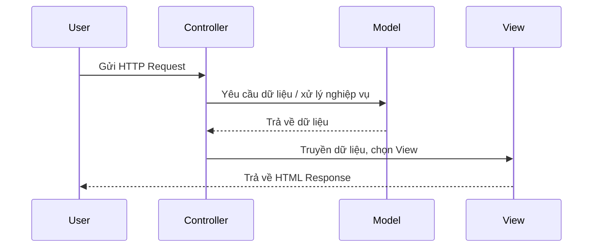
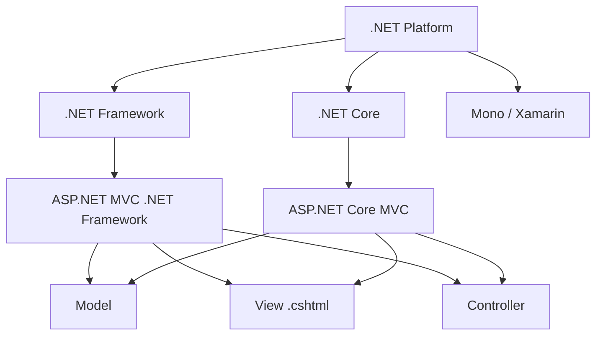

# Chương 6: ASP.NET MVC — Lập trình ứng dụng Web

---

## 1. Giới thiệu về .NET

### .NET là gì?

.NET là một **nền tảng phát triển phần mềm miễn phí, mã nguồn mở** được phát triển bởi Microsoft. Nó bao gồm một tập hợp các thư viện lớp (class libraries), runtime, và công cụ hỗ trợ lập trình viên xây dựng nhiều loại ứng dụng khác nhau.

.NET hỗ trợ nhiều ngôn ngữ lập trình, trong đó phổ biến nhất là:

- **C#** — ngôn ngữ chính, hiện đại, hướng đối tượng
- **F#** — ngôn ngữ lập trình hàm (functional programming)
- **Visual Basic** — ngôn ngữ dễ học, thân thiện với người mới

### Các loại ứng dụng có thể xây dựng với .NET

- Web apps và web services (chạy trên Windows, Linux, macOS, Docker)
- Mobile apps (iOS, Android, Windows)
- Desktop apps (Windows, macOS)
- Microservices chạy trong Docker containers
- Game 2D/3D
- Machine Learning (thị giác máy tính, xử lý giọng nói, mô hình dự đoán)
- Cloud services
- IoT (Internet of Things), hỗ trợ Raspberry Pi

### Ba nhánh chính của .NET

| Nhánh | Mô tả |
|---|---|
| **.NET Framework** | Ra đời sớm nhất, hỗ trợ website, ứng dụng desktop Windows |
| **Mono / Xamarin** | Dành cho phát triển ứng dụng di động (mobile) |
| **.NET Core** (từ 2013) | Đa nền tảng (cross-platform), chạy trên Windows, Linux, macOS |

### Nên chọn .NET Core hay .NET Framework?

- Nếu ứng dụng là **Windows Desktop** → dùng **.NET Framework**
- Nếu ứng dụng là **Web Server** → cả hai đều được, nhưng **.NET Core** được khuyến nghị vì đa nền tảng
- **.NET Core** có ít thư viện hơn .NET Framework, nhưng đang ngày càng được bổ sung
- **Tuyệt đối không dùng Mono/Xamarin** để chạy Web Server

!!! warning "Lưu ý quan trọng"
    Mono/Xamarin được thiết kế cho mobile, không phù hợp để vận hành Web Server. Sử dụng sai mục đích sẽ gây ra vấn đề hiệu năng và bảo trì.

---

## 2. ASP.NET

### ASP.NET là gì?

**ASP.NET** là phần mở rộng của nền tảng .NET, cung cấp thêm các công cụ và thư viện chuyên biệt để xây dựng **ứng dụng web** và **dịch vụ web (web services)**.

ASP.NET hỗ trợ:

- **ASP.NET Web Forms** — mô hình lập trình web theo sự kiện (event-driven), giống WinForms
- **ASP.NET Web Pages (Razor)** — trang web nhúng code C# trực tiếp vào HTML
- **ASP.NET Web API** — xây dựng RESTful API
- **ASP.NET MVC** — áp dụng mô hình Model–View–Controller

### ASP.NET (.NET Framework) vs ASP.NET Core

Đây là **hai nền tảng khác nhau**, không được nhầm lẫn:

| | ASP.NET (.NET Framework) | ASP.NET Core |
|---|---|---|
| Nền tảng | Chỉ Windows | Windows, Linux, macOS, Docker |
| Hiệu năng | Thấp hơn | Cao hơn đáng kể |
| Mã nguồn mở | Một phần | Hoàn toàn |
| Hỗ trợ tương lai | Maintenance only | Đang phát triển tích cực |

### ASP.NET Razor

**Razor** là một cú pháp template cho phép nhúng code C# (hoặc VB) vào bên trong HTML để tạo ra nội dung động phía server.

- File Razor có phần mở rộng `.cshtml` (C#) hoặc `.vbhtml` (VB)
- Dễ học, dễ sử dụng, được hỗ trợ IntelliSense trong Visual Studio

Ví dụ một đoạn Razor hiển thị danh sách dạng bảng:

```html
<table class="table">
    <thead>
        <tr>
            <th>@Html.DisplayNameFor(model => model.Name)</th>
            <th>@Html.DisplayNameFor(model => model.PhoneNumber)</th>
            <th>@Html.DisplayNameFor(model => model.Email)</th>
        </tr>
    </thead>
    <tbody>
        @foreach (var item in Model)
        {
            <tr>
                <td>@Html.DisplayFor(modelItem => item.Name)</td>
                <td>@Html.DisplayFor(modelItem => item.PhoneNumber)</td>
                <td>@Html.DisplayFor(modelItem => item.Email)</td>
            </tr>
        }
    </tbody>
</table>
```

Cú pháp `@` là dấu hiệu chuyển từ HTML sang code C#. Razor engine sẽ xử lý phía server và trả về HTML thuần cho client.

---

## 3. Mô hình MVC

### MVC là gì?

**MVC** (Model – View – Controller) là một **mẫu thiết kế kiến trúc phần mềm** (architectural design pattern) giúp tách ứng dụng thành ba thành phần riêng biệt nhưng phối hợp với nhau.

Mục tiêu chính: **tách biệt logic nghiệp vụ, giao diện, và điều phối luồng xử lý** để dễ phát triển, bảo trì và mở rộng.

### Ba thành phần của MVC

**Model**

- Chịu trách nhiệm về **dữ liệu và logic nghiệp vụ**
- Kết nối và tương tác với cơ sở dữ liệu (thêm, sửa, xóa, truy vấn)
- Không biết gì về View hay cách hiển thị dữ liệu
- Ví dụ: class `SinhVien`, `SanPham`, các phương thức truy vấn database

**View**

- Chịu trách nhiệm về **giao diện người dùng (UI)**
- Hiển thị dữ liệu nhận từ Controller
- Nhận tương tác từ người dùng (click, nhập form...) và gửi đến Controller
- Trong ASP.NET MVC, View thường là các file `.cshtml` (Razor)

**Controller**

- Đóng vai trò **điều phối trung gian** giữa Model và View
- Nhận request từ người dùng
- Gọi Model để lấy hoặc xử lý dữ liệu
- Chọn View phù hợp và truyền dữ liệu vào đó để trả về response

### Luồng hoạt động của MVC



### Ưu và nhược điểm của MVC

**Ưu điểm:**

- **Dễ bảo trì và nâng cấp**: vì ba thành phần độc lập, thay đổi giao diện không ảnh hưởng logic nghiệp vụ và ngược lại
- **Tách biệt rõ ràng** giữa xử lý giao diện, cơ sở dữ liệu và chức năng
- **Chuyên nghiệp**, phù hợp làm việc nhóm — frontend và backend có thể phát triển song song
- **Dễ kiểm thử (unit test)** vì các thành phần tách biệt

**Nhược điểm:**

- **Cài đặt phức tạp** hơn so với các mô hình đơn giản như Web Forms
- **Tốc độ xử lý có thể chậm hơn** một chút so với không áp dụng MVC, do chi phí điều phối giữa các tầng

!!! tip "Khi nào nên dùng MVC?"
    MVC phù hợp với các ứng dụng có quy mô trung bình đến lớn, cần bảo trì lâu dài hoặc làm việc theo nhóm. Với ứng dụng rất nhỏ, đơn giản, đôi khi chi phí cài đặt MVC không xứng đáng.

---

## 4. ASP.NET MVC

### Cấu trúc thư mục — ASP.NET MVC (.NET Framework)

Khi tạo một project ASP.NET MVC với .NET Framework, Visual Studio sinh ra cấu trúc thư mục chuẩn sau:

| Thư mục | Mục đích |
|---|---|
| `App_Data` | Chứa dữ liệu cục bộ: LocalDB, file `.mdf`, file XML |
| `App_Start` | Chứa các file cấu hình khởi động (RouteConfig, BundleConfig...) |
| `Content` | Chứa file CSS, hình ảnh. Mặc định có Bootstrap CSS |
| `Controllers` | Chứa các Controller. Tên file **bắt buộc** kết thúc bằng `Controller` |
| `Models` | Chứa các class Model — ánh xạ với bảng trong CSDL |
| `Scripts` | Chứa file JavaScript. Mặc định có jQuery, Bootstrap JS |
| `Views` | Chứa các Razor page (`.cshtml`) — giao diện người dùng |

!!! info "Quy tắc đặt tên Controller"
    ASP.NET MVC **bắt buộc** tên file và tên class của Controller phải kết thúc bằng chữ `Controller`. Ví dụ: `HomeController`, `SinhVienController`. Nếu đặt sai, framework sẽ không nhận diện được.

### Cấu trúc thư mục — ASP.NET MVC (.NET Core)

Với .NET Core, cấu trúc gọn hơn, không còn `App_Data`, `App_Start`, `Content`, `Scripts` riêng biệt:

```
MVCWeb/
├── Connected Services
├── Dependencies
├── Properties
├── wwwroot/          ← thay thế Content + Scripts (static files)
├── Controllers/
├── Models/
├── Views/
├── appsettings.json  ← cấu hình ứng dụng (connection string, logging...)
├── Program.cs        ← điểm khởi động ứng dụng
└── Startup.cs        ← cấu hình middleware, DI container
```

Điểm khác biệt chính:

- `wwwroot/` chứa toàn bộ static files (CSS, JS, hình ảnh) thay cho `Content/` và `Scripts/`
- `appsettings.json` thay thế `Web.config`
- `Startup.cs` cấu hình pipeline và dependency injection
- `Program.cs` là entry point của ứng dụng

### Ví dụ một Controller cơ bản

```csharp
using System.Web.Mvc;

namespace MyWebsiteMVC.Controllers
{
    public class HomeController : Controller
    {
        // Xử lý GET /Home/Index
        public ActionResult Index()
        {
            ViewBag.Message = "Chào mừng đến với ASP.NET MVC!";
            return View(); // Trả về Views/Home/Index.cshtml
        }

        // Xử lý GET /Home/About
        public ActionResult About()
        {
            return View();
        }
    }
}
```

### Ví dụ một View tương ứng (`Index.cshtml`)

```html
@{
    ViewBag.Title = "Trang chủ";
}

<h2>@ViewBag.Title</h2>
<p>@ViewBag.Message</p>
```

### Ví dụ một Model cơ bản

```csharp
namespace MyWebsiteMVC.Models
{
    public class SinhVien
    {
        public int MaSV { get; set; }
        public string HoTen { get; set; }
        public string Email { get; set; }
        public int NamSinh { get; set; }
    }
}
```

### Quy tắc routing mặc định

ASP.NET MVC dùng URL routing để ánh xạ URL đến Controller và Action tương ứng. Quy tắc mặc định:

```
/{controller}/{action}/{id}
```

Ví dụ:
- `/Home/Index` → `HomeController.Index()`
- `/SinhVien/Details/5` → `SinhVienController.Details(5)`
- `/` (root) → `HomeController.Index()` (mặc định)

---

## 5. Tổng kết



??? summary "Tóm tắt các điểm cần nhớ"
    - **.NET** là nền tảng đa ngôn ngữ của Microsoft, gồm 3 nhánh: Framework, Core, Xamarin
    - **ASP.NET** mở rộng .NET cho web, hỗ trợ Web Forms, Razor, Web API, MVC
    - **MVC** là mẫu kiến trúc tách ứng dụng thành Model (dữ liệu), View (giao diện), Controller (điều phối)
    - **ASP.NET MVC** áp dụng mẫu MVC vào web, có cấu trúc thư mục chuẩn, tên Controller phải kết thúc bằng `Controller`
    - **.NET Core** là tương lai — đa nền tảng, hiệu năng cao, được Microsoft đầu tư tích cực
