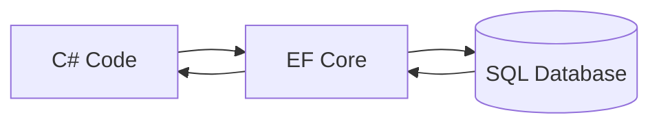
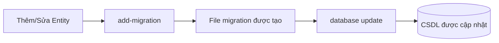
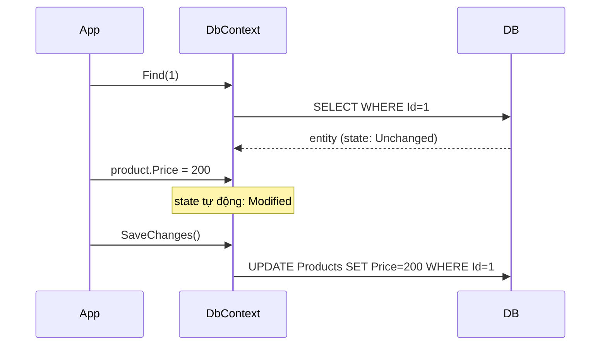
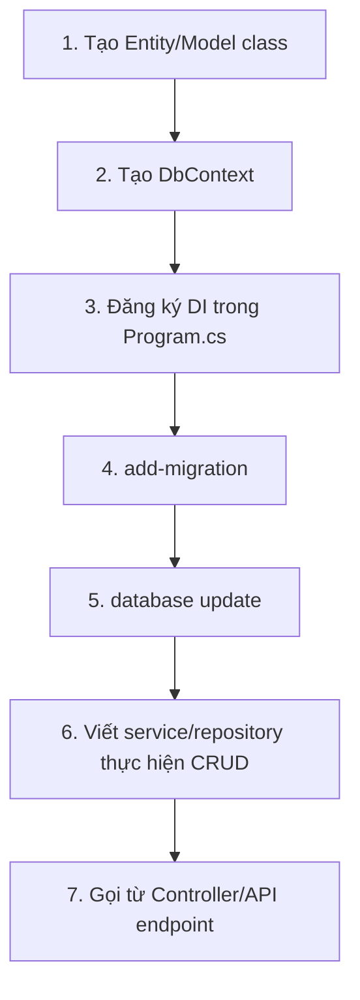
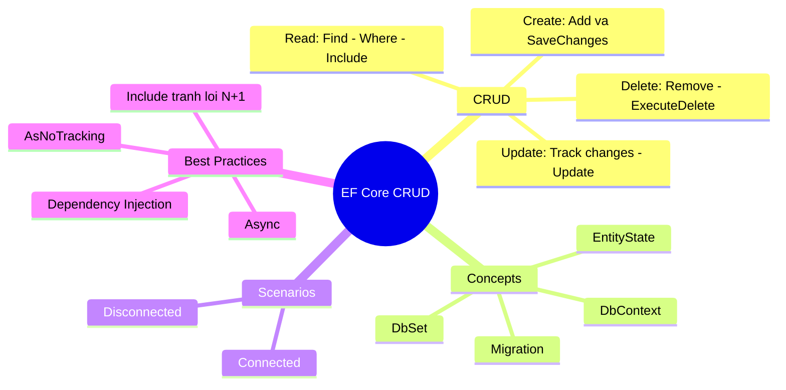

# Chương 7: CRUD và Thao Tác CSDL với Entity Framework Core

## 1. CRUD là gì?

**CRUD** là từ viết tắt của **Create, Read, Update, Delete** — bốn thao tác cơ bản tạo nên nền tảng của mọi hệ thống quản lý dữ liệu.

```
C — Create   : Tạo mới dữ liệu
R — Read     : Đọc / truy vấn dữ liệu
U — Update   : Cập nhật dữ liệu
D — Delete   : Xoá dữ liệu
```

### Mô tả từng thao tác

| Thao tác | Mô tả | Ví dụ thực tế |
|----------|-------|---------------|
| **Create** | Chèn bản ghi mới vào hệ thống lưu trữ | Đăng ký tài khoản mới, thêm sản phẩm |
| **Read** | Truy xuất dữ liệu đã tồn tại, không thay đổi gì | Xem hồ sơ, tìm kiếm sản phẩm |
| **Update** | Sửa dữ liệu đã có mà không tạo bản ghi mới | Đổi mật khẩu, cập nhật địa chỉ giao hàng |
| **Delete** | Xoá bản ghi không còn cần thiết | Xoá bài đăng, huỷ đơn hàng |

!!! info "Tại sao CRUD quan trọng?"
    Nếu một thao tác không thể mô tả bằng một trong bốn hàm này, có thể nó cần phải là một model riêng biệt. CRUD đặc biệt quan trọng trong: phát triển ứng dụng web, thiết kế API, hệ thống quản lý CSDL, và kiến trúc phần mềm.

---

## 2. CRUD trong RESTful API

Trong môi trường REST, các thao tác CRUD ánh xạ trực tiếp sang các HTTP method.

| CRUD | HTTP Method | Mục đích |
|------|-------------|----------|
| Create | `POST` | Tạo resource mới |
| Read | `GET` | Lấy resource hoặc danh sách |
| Update | `PUT` / `PATCH` | Sửa resource đã có |
| Delete | `DELETE` | Xoá resource |

### 2.1 CREATE — POST

Khi tạo thành công, server trả về header chứa link đến resource mới và HTTP status code **201 (CREATED)**.

```http
POST http://www.myrestaurant.com/dishes/

Body:
{
  "dish": {
    "name": "Avocado Toast",
    "price": 8
  }
}

Response (201 CREATED):
{
  "dish": {
    "id": 1223,
    "name": "Avocado Toast",
    "price": 8
  }
}
```

### 2.2 READ — GET

Đọc dữ liệu không bao giờ thay đổi thông tin — nó chỉ lấy về. Gọi GET 10 lần liên tiếp phải trả về cùng kết quả.

```http
# Lấy toàn bộ danh sách
GET http://www.myrestaurant.com/dishes/
→ 200 OK

# Lấy một phần tử cụ thể theo id
GET http://www.myrestaurant.com/dishes/1223
→ 200 OK | 404 NOT FOUND nếu không tìm thấy
```

### 2.3 UPDATE — PUT

```http
PUT http://www.myrestaurant.com/dishes/1223

Body:
{
  "dish": {
    "name": "Avocado Toast",
    "price": 10
  }
}

Response: 200 OK (hoặc 204 NO CONTENT)
```

### 2.4 DELETE — DELETE

Gọi DELETE trên resource không tồn tại không được thay đổi trạng thái hệ thống — phải trả về **404 NOT FOUND**.

```http
DELETE http://www.myrestaurant.com/dishes/1223
→ 204 NO CONTENT (không có body)
```

### HTTP Status Codes tương ứng

??? question "Hỏi: Mỗi thao tác CRUD có những status code nào?"
    **Trả lời:**

    | Thao tác | Status Code thường gặp | Ý nghĩa |
    |----------|------------------------|---------|
    | POST (Create) | 201 | Tạo thành công |
    | POST (Create) | 400 | Dữ liệu đầu vào sai |
    | POST (Create) | 409 | Resource đã tồn tại |
    | GET (Read) | 200 | Tìm thấy, trả về |
    | GET (Read) | 404 | Không tồn tại |
    | PUT/PATCH (Update) | 200 | Cập nhật thành công |
    | PUT/PATCH (Update) | 400 | Dữ liệu cập nhật sai |
    | PUT/PATCH (Update) | 404 | Không tìm thấy để cập nhật |
    | DELETE | 204 | Xoá thành công |
    | DELETE | 404 | Không tìm thấy để xoá |

---

## 3. CRUD trong SQL

Trong SQL, các thao tác CRUD tương ứng với những lệnh SQL cụ thể.

```sql
-- CREATE
INSERT INTO dishes (name, price, category)
VALUES ('Avocado Toast', 8, 'Breakfast');

-- READ
SELECT * FROM dishes WHERE id = 1223;

-- UPDATE
UPDATE dishes SET price = 10 WHERE id = 1223;

-- DELETE
DELETE FROM dishes WHERE id = 1223;
```

---

## 4. Entity Framework Core là gì?

**Entity Framework Core (EF Core)** là một ORM (Object-Relational Mapper) của Microsoft dành cho .NET. Thay vì viết SQL thủ công, bạn thao tác với dữ liệu thông qua các đối tượng C#, và EF Core tự động sinh SQL tương ứng.



### Đặc điểm nổi bật

- **Cross-platform**: chạy trên Windows, Linux, macOS
- **Code-First**: định nghĩa model bằng C#, EF tạo CSDL
- **Database-First**: reverse engineer CSDL thành C# model
- **Migration**: quản lý thay đổi schema CSDL theo phiên bản
- **LINQ queries**: truy vấn dữ liệu bằng LINQ thay vì SQL thuần

---

## 5. Các khái niệm cốt lõi

### 5.1 DbContext

**DbContext** quản lý kết nối CSDL, theo dõi thay đổi trên entity, và thực thi query. Nó xoá bỏ nhu cầu viết SQL phức tạp thủ công vì tự động sinh ra chúng.

```csharp
public class AppDbContext : DbContext
{
    public DbSet<Product> Products { get; set; }
    public DbSet<Category> Categories { get; set; }

    protected override void OnConfiguring(DbContextOptionsBuilder optionsBuilder)
    {
        optionsBuilder.UseSqlServer(
            "Server=(localdb)\\mssqllocaldb;Database=ShopDb;Trusted_Connection=True;");
    }
}
```

Hoặc cấu hình qua Dependency Injection (khuyến nghị trong ASP.NET Core):

```csharp
// Program.cs
builder.Services.AddDbContext<AppDbContext>(options =>
    options.UseSqlServer(builder.Configuration.GetConnectionString("Default")));
```

```json
// appsettings.json
{
  "ConnectionStrings": {
    "Default": "Server=(localdb)\\mssqllocaldb;Database=ShopDb;Trusted_Connection=True;"
  }
}
```

!!! warning "DbContext KHÔNG thread-safe"
    EF Core không hỗ trợ nhiều thao tác song song trên cùng một DbContext instance. Điều này bao gồm cả việc thực thi async query song song và sử dụng đồng thời từ nhiều thread. Trong web app, mỗi HTTP request nên dùng một DbContext riêng.

### 5.2 DbSet

**DbSet** đại diện cho một tập hợp entity trong CSDL (về mặt logic là một bảng ảo). Cần định nghĩa nó cho từng kiểu entity (như Customer, Order, Product) để truy vấn và thao tác dữ liệu.

```csharp
// DbSet<Product> ánh xạ tới bảng Products trong database
public DbSet<Product> Products { get; set; }
```

### 5.3 Entity / Model

```csharp
public class Product
{
    public int Id { get; set; }           // Primary key (tự động nhận dạng)
    public string Name { get; set; }
    public decimal Price { get; set; }
    public int CategoryId { get; set; }
    public Category Category { get; set; } // Navigation property
}
```

---

## 6. Migration — Quản lý Schema CSDL

Migration là cơ chế giúp đồng bộ model C# với schema CSDL theo lịch sử thay đổi.



### Các lệnh Migration quan trọng

```bash
# Tạo migration mới (sau khi thay đổi model)
dotnet ef migrations add InitialCreate

# Áp dụng migration vào database
dotnet ef database update

# Xem danh sách migrations
dotnet ef migrations list

# Rollback về migration trước
dotnet ef database update TênMigrationCũ

# Xoá migration chưa apply
dotnet ef migrations remove
```

Hoặc dùng Package Manager Console trong Visual Studio:

```powershell
Add-Migration InitialCreate
Update-Database
```

??? question "Hỏi: File migration sinh ra trông như thế nào?"
    **Trả lời:** EF Core tạo ra hai file:

    ```csharp
    // Migrations/20240101_InitialCreate.cs
    public partial class InitialCreate : Migration
    {
        protected override void Up(MigrationBuilder migrationBuilder)
        {
            // Tạo bảng Products
            migrationBuilder.CreateTable(
                name: "Products",
                columns: table => new
                {
                    Id = table.Column<int>(nullable: false)
                        .Annotation("SqlServer:Identity", "1, 1"),
                    Name = table.Column<string>(maxLength: 100, nullable: false),
                    Price = table.Column<decimal>(nullable: false)
                },
                constraints: table =>
                {
                    table.PrimaryKey("PK_Products", x => x.Id);
                });
        }

        protected override void Down(MigrationBuilder migrationBuilder)
        {
            // Rollback: xoá bảng Products
            migrationBuilder.DropTable(name: "Products");
        }
    }
    ```

    - Phương thức `Up()`: áp dụng thay đổi lên CSDL
    - Phương thức `Down()`: rollback, hoàn tác thay đổi

---

## 7. Connected vs Disconnected Scenario

Đây là một trong những khái niệm quan trọng nhất khi làm việc với EF Core.

### 7.1 Connected Scenario

Trong Connected Scenario, cùng một DbContext instance được dùng để lấy và lưu entity. Điều này có nghĩa DbContext theo dõi trạng thái entity xuyên suốt vòng đời của chúng.

```csharp
using (var context = new AppDbContext())
{
    // 1. Lấy entity (context bắt đầu track)
    var product = context.Products.Find(1);

    // 2. Sửa trong cùng context
    product.Price = 200;

    // 3. Lưu — EF tự biết cần UPDATE
    context.SaveChanges();
}
```



### 7.2 Disconnected Scenario

Trong Disconnected Scenario, DbContext không có sẵn để theo dõi thay đổi sau khi dữ liệu được lấy về. Tình huống này phổ biến trong web API, nơi entity được truyền qua HTTP. Không có change tracking: entity không được theo dõi sau khi DbContext bị dispose, nghĩa là thay đổi phải được quản lý thủ công.

```csharp
// Request 1: lấy data (DbContext #1, rồi dispose)
Product product;
using (var context = new AppDbContext())
{
    product = context.Products.Find(1);
} // DbContext bị dispose, không còn tracking

// ... entity được truyền qua HTTP, user sửa ...
product.Price = 999;

// Request 2: lưu (DbContext #2, khác với #1)
using (var context = new AppDbContext())
{
    // Phải thông báo cho context biết entity này đã bị Modified
    context.Entry(product).State = EntityState.Modified;
    context.SaveChanges();
}
```

### So sánh Connected vs Disconnected

| Tiêu chí | Connected | Disconnected |
|----------|-----------|--------------|
| Cùng DbContext? | Có | Không |
| Change Tracking | Tự động | Thủ công |
| Phổ biến ở | Desktop app, batch job | Web API, MVC app |
| Quản lý EntityState | EF tự xử lý | Lập trình viên phải set |

---

## 8. EntityState — Trạng thái Entity

Trong Connected Scenario, DbContext theo dõi entity và trạng thái của chúng (Added, Modified, Deleted). Khi gọi `SaveChanges()`, EF Core tự động sinh và thực thi câu lệnh SQL INSERT, UPDATE, hoặc DELETE tương ứng dựa trên trạng thái entity.

| EntityState | Ý nghĩa | SQL tương ứng |
|-------------|---------|---------------|
| `Added` | Entity mới, chưa có trong DB | `INSERT` |
| `Modified` | Entity đã tồn tại, có thay đổi | `UPDATE` |
| `Deleted` | Đánh dấu để xoá | `DELETE` |
| `Unchanged` | Entity tồn tại, không thay đổi | (không có SQL) |
| `Detached` | Không được theo dõi | (không có SQL) |

```csharp
var product = context.Products.Find(1);
Console.WriteLine(context.Entry(product).State); 
// → Unchanged

product.Price = 500;
Console.WriteLine(context.Entry(product).State); 
// → Modified (tự động!)
```

---

## 9. Thực hiện CRUD với EF Core

### 9.1 CREATE — Thêm mới

```csharp
// Cách 1: DbSet.Add
var product = new Product { Name = "Laptop", Price = 15000000 };
context.Products.Add(product);
context.SaveChanges();

// Cách 2: DbContext.Add (dùng khi không biết type cụ thể)
context.Add(product);
context.SaveChanges();

// Cách 3: Thêm nhiều cùng lúc — AddRange
var products = new List<Product>
{
    new Product { Name = "Phone", Price = 8000000 },
    new Product { Name = "Tablet", Price = 12000000 }
};
context.Products.AddRange(products);
context.SaveChanges();
```

!!! tip "Async luôn được ưu tiên trong web app"
    ```csharp
    await context.Products.AddAsync(product);
    await context.SaveChangesAsync();
    ```

### 9.2 READ — Truy vấn

```csharp
// Lấy tất cả
var all = context.Products.ToList();

// Lấy theo điều kiện
var cheap = context.Products
    .Where(p => p.Price < 5000000)
    .ToList();

// Lấy một bản ghi theo primary key (nhanh nhất)
var product = context.Products.Find(1);

// Lấy một bản ghi theo điều kiện (trả về null nếu không tìm thấy)
var product = context.Products
    .FirstOrDefault(p => p.Name == "Laptop");

// Bao gồm dữ liệu quan hệ (eager loading)
var products = context.Products
    .Include(p => p.Category)
    .ToList();
```

??? question "Hỏi: AsNoTracking() là gì và khi nào dùng?"
    **Trả lời:** Dùng `AsNoTracking()` cho các query chỉ đọc vì nó bỏ qua overhead của EF Core's change tracking, cải thiện hiệu năng đáng kể. Đây là điều cốt yếu với read-only query.

    ```csharp
    // Dành cho read-only, không cần cập nhật sau
    var products = context.Products
        .AsNoTracking()
        .Where(p => p.Price > 1000)
        .ToList();
    ```

### 9.3 UPDATE — Cập nhật

**Connected Scenario (đơn giản nhất):**

```csharp
using (var context = new AppDbContext())
{
    var product = context.Products.Find(1);
    product.Price = 20000000; // EF tự phát hiện thay đổi
    context.SaveChanges();   // Chỉ UPDATE các field đã thay đổi
}
```

**Disconnected Scenario:**

```csharp
// entity đến từ ngoài (API request, form submit...)
public void UpdateProduct(Product updatedProduct)
{
    using var context = new AppDbContext();

    // Cách 1: Attach + set state
    context.Entry(updatedProduct).State = EntityState.Modified;
    context.SaveChanges();

    // Cách 2: DbContext.Update() — tương đương
    context.Update(updatedProduct);
    context.SaveChanges();
}
```

!!! warning "Lưu ý khi dùng Update() trong disconnected"
    `context.Update(entity)` sẽ đánh dấu **tất cả** các field là Modified → SQL UPDATE sẽ ghi lại toàn bộ cột, kể cả những cột không thay đổi. Trong connected scenario, EF chỉ UPDATE đúng các field thực sự thay đổi.

### 9.4 DELETE — Xoá

```csharp
// Cách 1: Connected — tìm rồi xoá
var product = context.Products.Find(1);
if (product != null)
{
    context.Products.Remove(product);
    context.SaveChanges();
}

// Cách 2: Disconnected — tạo stub entity để tránh SELECT thừa
var stub = new Product { Id = 1 };
context.Products.Attach(stub);
context.Products.Remove(stub);
context.SaveChanges();

// Cách 3: EF Core 7+ ExecuteDelete (không cần load entity vào memory)
await context.Products
    .Where(p => p.Price < 100)
    .ExecuteDeleteAsync();
```

---

## 10. Cài đặt EF Core

```bash
# Cài provider SQL Server
dotnet add package Microsoft.EntityFrameworkCore.SqlServer

# Cài tools để dùng migration
dotnet add package Microsoft.EntityFrameworkCore.Tools

# Hoặc dùng NuGet Package Manager Console:
Install-Package Microsoft.EntityFrameworkCore.SqlServer
Install-Package Microsoft.EntityFrameworkCore.Tools
```

---

## 11. Quy trình tổng quát xây dựng ứng dụng CRUD với EF Core



### Ví dụ hoàn chỉnh — Console App

```csharp
// 1. Model
public class Student
{
    public int Id { get; set; }
    public string Name { get; set; }
    public string Email { get; set; }
}

// 2. DbContext
public class SchoolDbContext : DbContext
{
    public DbSet<Student> Students { get; set; }

    protected override void OnConfiguring(DbContextOptionsBuilder options)
        => options.UseSqlServer("Server=(localdb)\\mssqllocaldb;Database=SchoolDb;Trusted_Connection=True;");
}

// 3. Thao tác CRUD
class Program
{
    static async Task Main()
    {
        using var context = new SchoolDbContext();
        await context.Database.MigrateAsync(); // apply migration

        // CREATE
        var student = new Student { Name = "Nguyen Van A", Email = "a@example.com" };
        context.Students.Add(student);
        await context.SaveChangesAsync();
        Console.WriteLine($"Đã thêm: Id = {student.Id}");

        // READ
        var all = await context.Students.ToListAsync();
        foreach (var s in all)
            Console.WriteLine($"{s.Id}: {s.Name}");

        // UPDATE
        var found = await context.Students.FindAsync(student.Id);
        found.Name = "Nguyen Van B";
        await context.SaveChangesAsync();

        // DELETE
        context.Students.Remove(found);
        await context.SaveChangesAsync();
        Console.WriteLine("Đã xoá.");
    }
}
```

---

## 12. Best Practices

!!! tip "Các nguyên tắc tốt khi dùng EF Core"

    1. **Dùng `async/await`** cho mọi thao tác I/O với CSDL (`ToListAsync`, `SaveChangesAsync`...)
    2. **Dùng `AsNoTracking()`** cho các query chỉ đọc — tăng hiệu năng đáng kể
    3. **Inject DbContext qua DI** thay vì tạo trực tiếp — dễ test, đúng vòng đời
    4. **Dùng `FindAsync(id)`** khi cần lấy theo primary key — kiểm tra cache trước khi ra DB
    5. **Tránh N+1 problem** bằng cách dùng `.Include()` để eager load dữ liệu quan hệ
    6. **Dùng transactions** khi cần nhiều thao tác phải thành công cùng lúc

    ```csharp
    // Tránh N+1: đừng làm thế này
    var orders = context.Orders.ToList();
    foreach (var o in orders)
        Console.WriteLine(o.Customer.Name); // mỗi dòng = 1 query!

    // Làm đúng: Include trước
    var orders = context.Orders.Include(o => o.Customer).ToList();
    ```

??? question "Hỏi: EF Core tự dùng transaction chưa?"
    **Trả lời:** Mặc định EF tự triển khai transaction. Khi bạn thực hiện thay đổi nhiều dòng hoặc nhiều bảng rồi gọi `SaveChanges`, EF đảm bảo tất cả thay đổi thành công hoặc tất cả thất bại. Nếu có lỗi xảy ra, các thay đổi trước đó sẽ tự động được rollback.

    Nếu cần kiểm soát transaction thủ công:

    ```csharp
    using var transaction = await context.Database.BeginTransactionAsync();
    try
    {
        context.Products.Add(new Product { Name = "A", Price = 100 });
        await context.SaveChangesAsync();

        context.Orders.Add(new Order { ProductId = 1 });
        await context.SaveChangesAsync();

        await transaction.CommitAsync();
    }
    catch
    {
        await transaction.RollbackAsync();
        throw;
    }
    ```

---

## Tóm tắt


