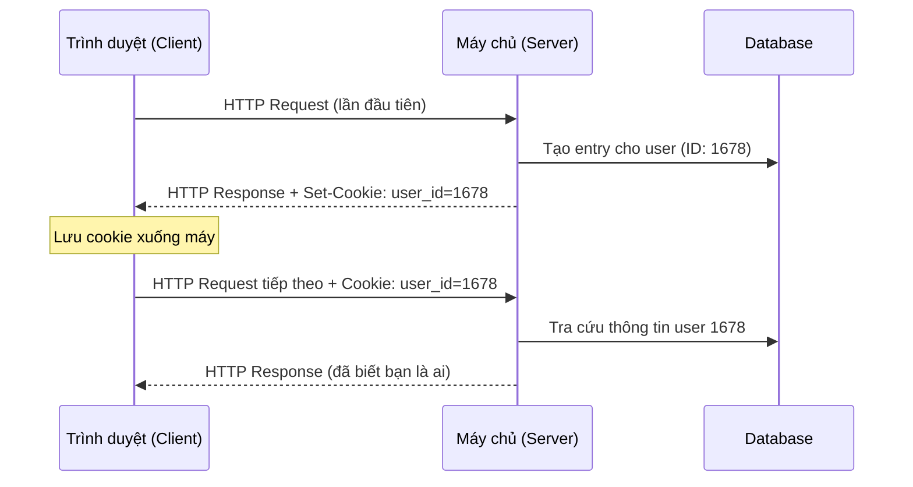
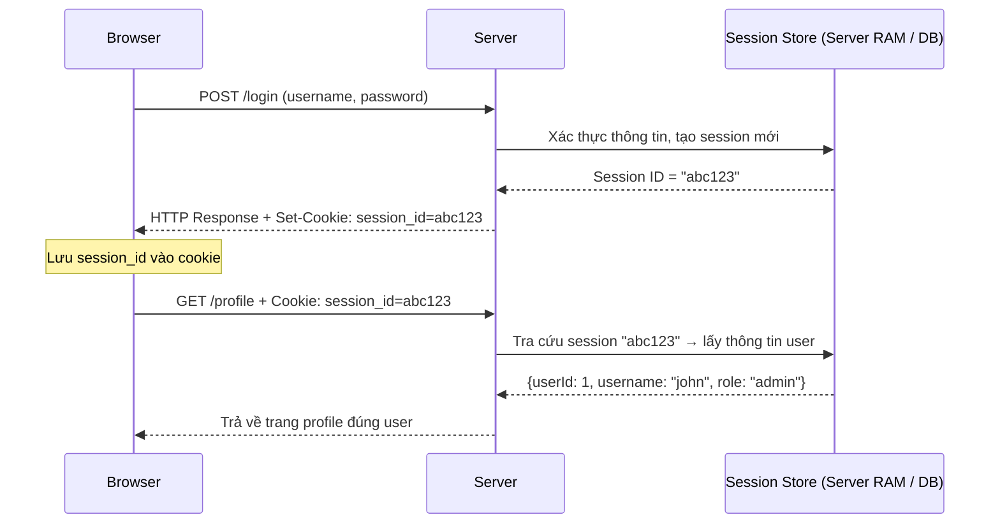

# Chương 8: Cookies, Session và Web Storage

## Bối cảnh: Tại sao cần lưu trạng thái?

HTTP là giao thức **stateless** (phi trạng thái). Điều này có nghĩa là mỗi request từ trình duyệt đến server là hoàn toàn độc lập — server không nhớ bạn là ai sau khi xử lý xong request trước. Ví dụ: sau khi bạn đăng nhập vào Facebook, ngay request tiếp theo (đăng bài) thì server sẽ không biết bạn là ai nếu không có cơ chế lưu trạng thái.

Để giải quyết vấn đề này, web sử dụng 3 cơ chế chính: **Cookies**, **Session**, và **Web Storage**.

---

## 1. Cookies

### Cookies là gì?

Cookie là một tập tin nhỏ (dưới 4KB) chứa thông tin liên quan đến người dùng, được **lưu trên máy của người dùng (client-side)** và có thể được quản lý bởi trình duyệt.

!!! info "Tài liệu chuẩn"
    Đặc tả chính thức của Cookies được định nghĩa trong [RFC 6265](https://datatracker.ietf.org/doc/html/rfc6265#section-5.4).

### 3 mục đích chính

| Mục đích | Mô tả | Ví dụ |
|---|---|---|
| Quản lý phiên | Ghi nhớ trạng thái người dùng | Giỏ hàng, thông tin đăng nhập, điểm số game |
| Cá nhân hóa | Lưu tùy chọn giao diện | Ngôn ngữ, theme màu sắc trang web |
| Theo dõi hoạt động | Phân tích hành vi | Tần suất truy cập, trang đã xem |

### Cách hoạt động

Luồng hoạt động của cookie diễn ra như sau:



**Giải thích chi tiết:**

1. Lần đầu truy cập, server tạo ra một định danh cho người dùng và gửi kèm trong `Set-Cookie` của HTTP Response Header.
2. Trình duyệt nhận cookie và lưu lại trên máy.
3. Từ các request tiếp theo, trình duyệt **tự động** đính kèm cookie vào HTTP Request Header — người dùng không cần làm gì.

### Các loại Cookies

??? note "First-Party Cookies"
    Được tạo và lưu trữ bởi **chính domain** mà bạn đang truy cập. Ví dụ: bạn vào `thacobus.net`, cookie do `thacobus.net` tạo ra là first-party cookie. Đây là loại phổ biến và ít gây tranh cãi về quyền riêng tư nhất.

??? note "Third-Party Cookies"
    Thuộc về **domain khác** với domain bạn đang truy cập. Ví dụ: khi bạn vào `thacobus.net`, trang này nhúng script từ `googleanalytics.com` hoặc `facebook.com` — các cookie từ những domain đó là third-party. Đây là loại được dùng nhiều cho quảng cáo theo dõi, và hiện tại đang bị nhiều trình duyệt hạn chế hoặc chặn.

??? note "Session Cookies (Non-Persistent)"
    Không được ghi vào file cứng, chỉ tồn tại trong bộ nhớ của trình duyệt. Khi người dùng **đóng trình duyệt**, cookie sẽ bị xóa hoàn toàn. Đặc điểm nhận biết: không có thuộc tính `Expires` hoặc `Max-Age`.

??? note "Persistent Cookies"
    Được ghi vào ổ đĩa cứng của người dùng. Không bị mất khi đóng trình duyệt, mà chỉ hết hạn khi đến ngày được chỉ định trong thuộc tính `Expires` hoặc `Max-Age`. Ví dụ: tính năng "Nhớ đăng nhập trong 30 ngày" sử dụng loại này.

### HTTP Headers liên quan đến Cookies

**Server gửi cookie về client** qua `Set-Cookie` trong Response Header:

```http
HTTP/1.0 200 OK
Set-Cookie: SSID=Ap4PGTEq; Domain=foo.com; Path=/; Expires=Wed, 13 Jan 2021 22:23:01 GMT; Secure; HttpOnly
```

**Client gửi cookie lên server** qua `Cookie` trong Request Header:

```http
GET /page HTTP/1.1
Host: foo.com
Cookie: SSID=Ap4PGTEq; lang=vi-VN
```

!!! warning "Lưu ý"
    Trình duyệt sẽ tự động gửi **tất cả các cookie** phù hợp (đúng domain, path, chưa hết hạn) trong mỗi request — kể cả khi bạn không muốn. Đây vừa là tính năng, vừa là điểm cần lưu ý về bảo mật (CSRF).

### Các thuộc tính của Cookie

| Thuộc tính | Mô tả | Ví dụ |
|---|---|---|
| `Name=Value` | Tên và giá trị cookie | `ASP.NET_SessionId=abcdjsa` |
| `Expires=date` | Ngày hết hạn. Nếu để trống → xóa khi đóng trình duyệt | `Expires=Wed, 09 Jun 2021 10:18:14 GMT` |
| `Max-Age=second` | Thời gian sống tính bằng giây (ưu tiên hơn `Expires` nếu cả hai cùng có) | `Max-Age=9000` (= 2.5 giờ) |
| `Path=path` | Cookie chỉ gửi khi request đến path này hoặc path con của nó | `Path=/` (gửi cho tất cả path) |
| `Domain=domain` | Domain nào được phép nhận cookie | `Domain=facebook.com` |
| `Secure` | Chỉ gửi cookie qua kết nối HTTPS | `Secure` |
| `HttpOnly` | Cookie không thể truy cập bằng JavaScript (`document.cookie`), chỉ server mới đọc được | `HttpOnly` |
| `SameSite` | Kiểm soát khi nào cookie được gửi theo cross-site request (giúp chống CSRF) | `SameSite=Strict` / `Lax` / `None` |

!!! tip "Phân tích ví dụ thực tế"
    ```http
    Set-Cookie: SSID=Ap4PGTEq; Domain=foo.com; Path=/; Expires=Wed, 13 Jan 2021 22:23:01 GMT; Secure; HttpOnly
    ```
    - Tên: `SSID`, Giá trị: `Ap4PGTEq`
    - Chỉ được gửi đến `foo.com`, mọi đường dẫn
    - Hết hạn vào `13/01/2021 22:23:01 GMT`
    - Chỉ truyền qua HTTPS (`Secure`)
    - JavaScript không thể đọc cookie này (`HttpOnly`) → tăng bảo mật chống XSS

### Làm việc với Cookie bằng JavaScript

**Tạo cookie:**

```javascript
// Cách đơn giản
document.cookie = "user=UIT; expires=Wed, 13 Jan 2021 00:00:00 GMT";

// Hàm tổng quát để tạo cookie
function setCookie(cname, cvalue, exdays) {
    let d = new Date();
    d.setTime(d.getTime() + (exdays * 24 * 60 * 60 * 1000));
    let expires = "expires=" + d.toUTCString();
    document.cookie = cname + "=" + cvalue + ";" + expires + ";path=/";
}

// Ví dụ sử dụng: lưu cookie tên "username" trong 7 ngày
setCookie("username", "John", 7);
```

**Đọc cookie:**

```javascript
// Lấy toàn bộ cookie dưới dạng chuỗi
let allCookies = document.cookie;
// Kết quả: "user=UIT; lang=vi-VN; theme=dark"

// Hàm đọc cookie theo tên
function getCookie(cname) {
    let name = cname + "=";
    let decodedCookie = decodeURIComponent(document.cookie);
    let ca = decodedCookie.split(';');
    for (let i = 0; i < ca.length; i++) {
        let c = ca[i].trim();
        if (c.indexOf(name) === 0) {
            return c.substring(name.length, c.length);
        }
    }
    return "";
}

// Ví dụ
let username = getCookie("user"); // "UIT"
```

**Thay đổi cookie** (ghi đè bằng cùng tên):

```javascript
document.cookie = "username=Jane; expires=Thu, 18 Dec 2025 12:00:00 UTC; path=/";
```

**Xóa cookie** (đặt `expires` về quá khứ):

```javascript
document.cookie = "username=; expires=Thu, 01 Jan 1970 00:00:00 UTC; path=/;";
```

!!! warning "Hạn chế của Cookies"
    - Dung lượng tối đa chỉ **4KB** — không lưu được nhiều dữ liệu.
    - Mỗi domain thường giới hạn vài chục cookie.
    - Cookie **tự động đính kèm** vào mọi request → tốn băng thông không cần thiết.
    - Có thể bị **đánh cắp** (nếu không dùng `HttpOnly` + `Secure`) hoặc **giả mạo** (CSRF).

---

## 2. Session

### Session là gì?

Session là một **phiên làm việc** — một cơ chế lưu trữ thông tin người dùng **ở phía server**. Khi người dùng truy cập vào ứng dụng web, server tạo ra một "hồ sơ tạm thời" dành riêng cho người đó.

**Vòng đời của Session:**
- **Bắt đầu:** Khi client gửi request lần đầu (hoặc sau khi đăng nhập thành công).
- **Tồn tại:** Xuyên suốt quá trình người dùng dùng ứng dụng, từ trang này sang trang khác.
- **Kết thúc:** Khi người dùng đóng trình duyệt, hoặc khi session timeout (hết giờ không hoạt động — thường từ 20–30 phút).

### Cách Session hoạt động kết hợp với Cookie

Session thường dùng Cookie để truyền **Session ID** giữa client và server:



**Kết quả:** Server nhận ra bạn là ai mà không cần bạn gửi lại username/password mỗi lần.

!!! info "Session ID của các framework phổ biến"
    Mỗi framework có tên Session ID cookie riêng:
    
    | Framework | Tên cookie |
    |---|---|
    | ASP.NET | `ASP.NET_SessionId` |
    | PHP | `PHPSESSID` |
    | Laravel | `laravel_session` |
    | JSP/Java | `JSESSIONID` |
    | Express.js | `connect.sid` |

### Nên lưu gì vào Session?

Session được lưu trên server — mỗi người dùng chiếm một phần bộ nhớ server. Do đó, cần chọn lọc dữ liệu lưu trữ.

**Nên lưu:**
- Thông tin đăng nhập (user ID, role, quyền hạn)
- Giỏ hàng (với người dùng chưa đăng nhập)
- Sản phẩm/nội dung đã xem gần đây
- Dữ liệu wizard/form nhiều bước

**Không nên lưu:**
- Dữ liệu lớn như danh sách sản phẩm, bài viết → gây tốn RAM server
- Mật khẩu (dù đã hash)
- Dữ liệu có thể lấy lại từ database dễ dàng

### Session trong PHP

```php
<?php
// Bước 1: Bắt đầu session (phải gọi trước khi output bất kỳ HTML nào)
session_start();

// Bước 2: Lưu dữ liệu vào session
$_SESSION["username"] = "john_doe";
$_SESSION["role"] = "admin";
$_SESSION["cart"] = ["item1", "item2"];

// Bước 3: Đọc dữ liệu từ session
echo "Xin chào " . $_SESSION["username"]; // "Xin chào john_doe"

// Bước 4: Xóa toàn bộ session (đăng xuất)
session_destroy();
?>
```

### Session trong ASP.NET MVC

```csharp
// Thêm mới (nếu chưa có) hoặc thay thế (nếu đã có)
Session["Username"] = "Huong Lan";
Session["CartCount"] = 3;

// Thêm mới (sẽ lỗi nếu key đã tồn tại)
Session.Add("Role", "Admin");

// Đọc dữ liệu
string name = Session["Username"]?.ToString();

// Lấy ID của session hiện tại
string sessionId = Session.SessionId;

// Xóa một key
Session.Remove("CartCount");

// Xóa toàn bộ session
Session.Abandon();
```

---

## 3. Web Storage

### Web Storage là gì?

Web Storage là API của HTML5 cho phép ứng dụng web **lưu trữ dữ liệu trực tiếp trong trình duyệt** của người dùng, hoàn toàn phía client-side. Dữ liệu lưu theo dạng **key-value** và **không bao giờ tự động gửi lên server** như cookie.

!!! success "Ưu điểm so với Cookie"
    - Dung lượng lớn hơn nhiều: **5–10MB** (tùy trình duyệt) so với 4KB của cookie.
    - Không tự động gửi lên server → không tốn băng thông.
    - API đơn giản và rõ ràng hơn.

### Hai loại Web Storage

| | `localStorage` | `sessionStorage` |
|---|---|---|
| Thời hạn | Vĩnh viễn (đến khi user xóa cache) | Mất khi đóng **tab** |
| Phạm vi | Tất cả tab/cửa sổ cùng origin | Chỉ trong tab hiện tại |
| Dung lượng | ~5–10MB | ~5MB |
| Gửi lên server | Không | Không |

### Kiểm tra trình duyệt có hỗ trợ không

```javascript
if (typeof(Storage) !== "undefined") {
    console.log("Trình duyệt hỗ trợ Web Storage!");
    // Tiến hành sử dụng localStorage / sessionStorage
} else {
    console.log("Trình duyệt không hỗ trợ Web Storage.");
    // Dự phòng: dùng cookie hoặc thông báo người dùng
}
```

### Các phương thức của Web Storage API

Cả `localStorage` và `sessionStorage` đều dùng chung bộ API sau:

| Phương thức | Mô tả |
|---|---|
| `setItem(key, value)` | Lưu một cặp key/value. Nếu key đã tồn tại thì ghi đè |
| `getItem(key)` | Lấy giá trị theo key. Trả về `null` nếu không tồn tại |
| `removeItem(key)` | Xóa một cặp key/value theo key |
| `clear()` | Xóa **tất cả** key/value trong storage |
| `key(n)` | Lấy tên của key ở vị trí thứ `n` (dùng để duyệt qua tất cả key) |
| `length` | Số lượng key/value đang được lưu |

### localStorage — Lưu trữ vĩnh viễn

```javascript
// === Lưu dữ liệu ===
// Cách 1: setItem (khuyến nghị)
localStorage.setItem("theme", "dark");
localStorage.setItem("language", "vi");

// Cách 2: dot notation
localStorage.theme = "dark";

// Cách 3: bracket notation
localStorage["theme"] = "dark";

// === Lưu object (cần JSON.stringify) ===
const user = { name: "John", age: 25 };
localStorage.setItem("user", JSON.stringify(user));

// === Đọc dữ liệu ===
let theme = localStorage.getItem("theme"); // "dark"

// Đọc object
let storedUser = JSON.parse(localStorage.getItem("user"));
console.log(storedUser.name); // "John"

// === Xóa dữ liệu ===
localStorage.removeItem("theme");   // Xóa một key
localStorage.clear();               // Xóa tất cả

// === Duyệt tất cả key ===
for (let i = 0; i < localStorage.length; i++) {
    let key = localStorage.key(i);
    let value = localStorage.getItem(key);
    console.log(key + ": " + value);
}
```

!!! example "Ứng dụng thực tế: Lưu theme người dùng"
    ```javascript
    // Lưu lựa chọn theme
    function setTheme(themeName) {
        localStorage.setItem("theme", themeName);
        document.body.className = themeName;
    }

    // Khi trang load, áp dụng theme đã lưu
    window.onload = function() {
        const savedTheme = localStorage.getItem("theme") || "light";
        document.body.className = savedTheme;
    };
    ```

### sessionStorage — Lưu trữ theo phiên

API giống hoàn toàn `localStorage`, chỉ khác ở vòng đời:

```javascript
// Lưu dữ liệu form (tránh mất khi refresh trang)
sessionStorage.setItem("draftEmail", "Kính gửi...");

// Lưu bước hiện tại của wizard nhiều bước
sessionStorage.setItem("checkoutStep", "3");

// Đọc lại
let draft = sessionStorage.getItem("draftEmail");

// Khi submit form xong, xóa draft
sessionStorage.removeItem("draftEmail");
```

!!! tip "Dùng sessionStorage khi nào?"
    - Lưu dữ liệu nhập liệu tạm thời (tránh mất form khi refresh)
    - Lưu trạng thái của wizard/form nhiều bước
    - Dữ liệu nhạy cảm tạm thời không muốn tồn tại lâu

!!! warning "Bảo mật Web Storage"
    `localStorage` và `sessionStorage` **có thể bị đọc bởi JavaScript**. Điều này có nghĩa là nếu trang web bị tấn công XSS (Cross-Site Scripting), kẻ tấn công có thể đọc toàn bộ dữ liệu trong storage.
    
    **Không nên lưu vào Web Storage:**
    - Token xác thực (JWT token) nếu trang có nguy cơ XSS
    - Mật khẩu (dù đã hash)
    - Thông tin thẻ ngân hàng
    - Bất kỳ thông tin nhạy cảm nào

---

## 4. So sánh tổng quan

### Session vs Cookies

| Tiêu chí | Session | Cookie |
|---|---|---|
| Nơi lưu trữ | Server | Client (máy người dùng) |
| Dung lượng | Tùy ý (giới hạn bởi RAM/disk server) | Tối đa 4KB |
| Thời hạn | Đến khi đóng trình duyệt hoặc timeout | Tùy thuộc vào `Expires`/`Max-Age` |
| Bảo mật | Cao hơn (dữ liệu ở server) | Thấp hơn (dữ liệu ở client, dễ đánh cắp/sửa) |
| Hiệu năng server | Tốn RAM server khi nhiều người dùng | Không tốn tài nguyên server |
| Gửi lên server | Gián tiếp (qua Session ID) | Tự động kèm theo mỗi request |

### Cookies vs localStorage vs sessionStorage

| Tiêu chí | Cookies | localStorage | sessionStorage |
|---|---|---|---|
| Dung lượng | 4KB | ~10MB | ~5MB |
| Hỗ trợ HTML | HTML4 + | HTML5 | HTML5 |
| Thời hạn | Do lập trình viên đặt | Vĩnh viễn (đến khi xóa cache) | Đến khi đóng tab |
| Truy cập từ | Bất kỳ tab nào (cùng domain) | Bất kỳ tab nào (cùng origin) | Chỉ trong tab hiện tại |
| Gửi lên server | Có (tự động) | Không | Không |
| Nơi lưu | Browser + Server nhận | Browser only | Browser only |
| JavaScript đọc được | Có (trừ khi `HttpOnly`) | Có | Có |

---

## 5. Câu hỏi ôn tập

??? question "Q1: HTTP là stateless — điều này có nghĩa là gì và cơ chế nào giải quyết vấn đề này?"
    **HTTP stateless** có nghĩa là mỗi request đều độc lập — server không nhớ thông tin từ request trước. Sau khi gửi response, server "quên" bạn là ai.
    
    Để giải quyết, web dùng:
    - **Cookie:** Server gửi token nhận dạng về client, client đính kèm vào request sau.
    - **Session:** Server lưu thông tin người dùng, client chỉ giữ Session ID (thường qua cookie).
    - **Web Storage:** Client tự lưu dữ liệu cần thiết, đọc lại khi cần (không gửi lên server).

??? question "Q2: Thuộc tính HttpOnly và Secure trong Cookie có tác dụng gì?"
    - **`HttpOnly`:** Ngăn JavaScript phía client đọc cookie thông qua `document.cookie`. Cookie chỉ được server gửi/nhận qua HTTP header. Điều này giúp **chống tấn công XSS** — dù script độc hại chạy được, nó cũng không đọc được cookie quan trọng.
    - **`Secure`:** Cookie chỉ được gửi qua kết nối **HTTPS** (mã hóa). Ngăn cookie bị đánh cắp qua mạng không an toàn (MITM attack).
    
    Kết hợp cả hai là best practice cho session cookie.

??? question "Q3: Khi nào nên dùng localStorage, khi nào dùng sessionStorage, khi nào dùng cookie?"
    - **Cookie:** Khi cần server biết thông tin đó (vì cookie tự động gửi lên). Ví dụ: Session ID, CSRF token, tracking.
    - **localStorage:** Khi cần lưu lâu dài trên client, không liên quan server. Ví dụ: cài đặt giao diện (theme, ngôn ngữ), dữ liệu offline, giỏ hàng ẩn danh.
    - **sessionStorage:** Khi dữ liệu chỉ cần trong phiên làm việc của tab hiện tại. Ví dụ: dữ liệu form đang nhập, bước hiện tại trong wizard, kết quả tìm kiếm tạm.

??? question "Q4: Tại sao không nên lưu JWT Token vào localStorage?"
    `localStorage` có thể bị đọc bởi bất kỳ JavaScript nào chạy trên trang. Nếu trang bị tấn công **XSS** (kẻ tấn công chèn được script vào trang), chúng có thể đánh cắp token và giả mạo người dùng.
    
    Thay vào đó, nên lưu JWT trong **`HttpOnly` cookie** — dù bị XSS, script cũng không đọc được. Tuy nhiên cần thêm cơ chế chống **CSRF** (dùng `SameSite=Strict` hoặc CSRF token).

??? question "Q5: Session Cookie khác với Persistent Cookie như thế nào?"
    - **Session Cookie:** Không có thuộc tính `Expires` hay `Max-Age`. Tồn tại trong RAM của trình duyệt, tự xóa khi đóng trình duyệt.
    - **Persistent Cookie:** Có `Expires` hoặc `Max-Age`. Được ghi vào ổ đĩa, tồn tại qua nhiều lần mở trình duyệt cho đến khi hết hạn.
    
    Lưu ý: "Session Cookie" ở đây là loại cookie, không phải cùng khái niệm với "Session" (phiên làm việc server-side).

??? question "Q6: Giải thích tại sao Session tốn tài nguyên server khi có nhiều người dùng?"
    Dữ liệu session được lưu **trên server** (trong RAM hoặc database). Mỗi người dùng đang hoạt động chiếm một slot session riêng. Nếu có 100,000 người dùng đồng thời, server phải duy trì 100,000 session objects. Điều này có thể gây:
    - Tốn nhiều RAM/disk server
    - Khó scale ngang (horizontal scaling) vì session ở server A không tự chia sẻ với server B
    
    **Giải pháp hiện đại:** Dùng **JWT (JSON Web Token)** — token chứa thông tin người dùng được mã hóa, lưu ở client. Server không cần lưu state, dễ scale. Đây là nội dung sẽ học ở phần Token.
