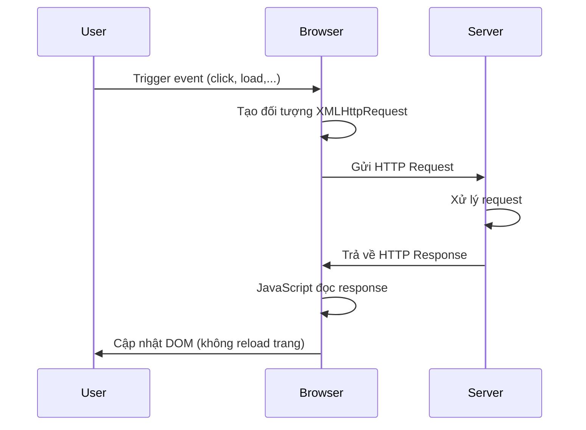
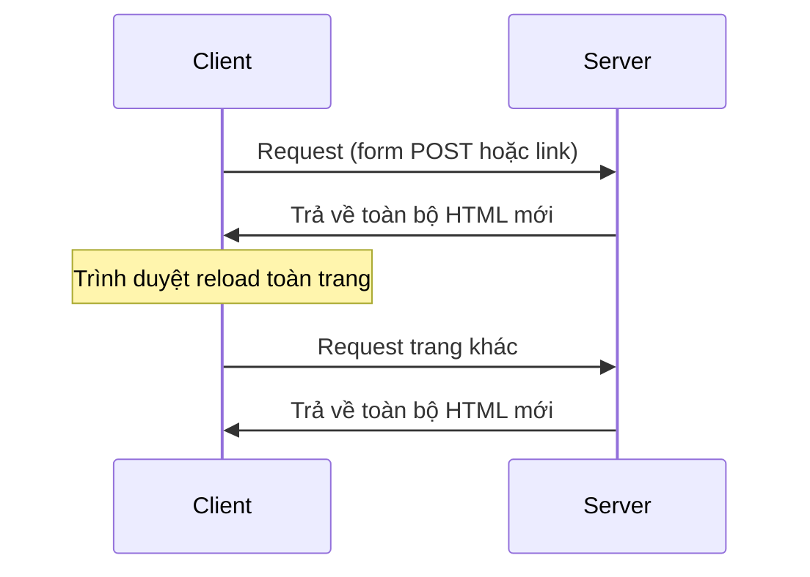
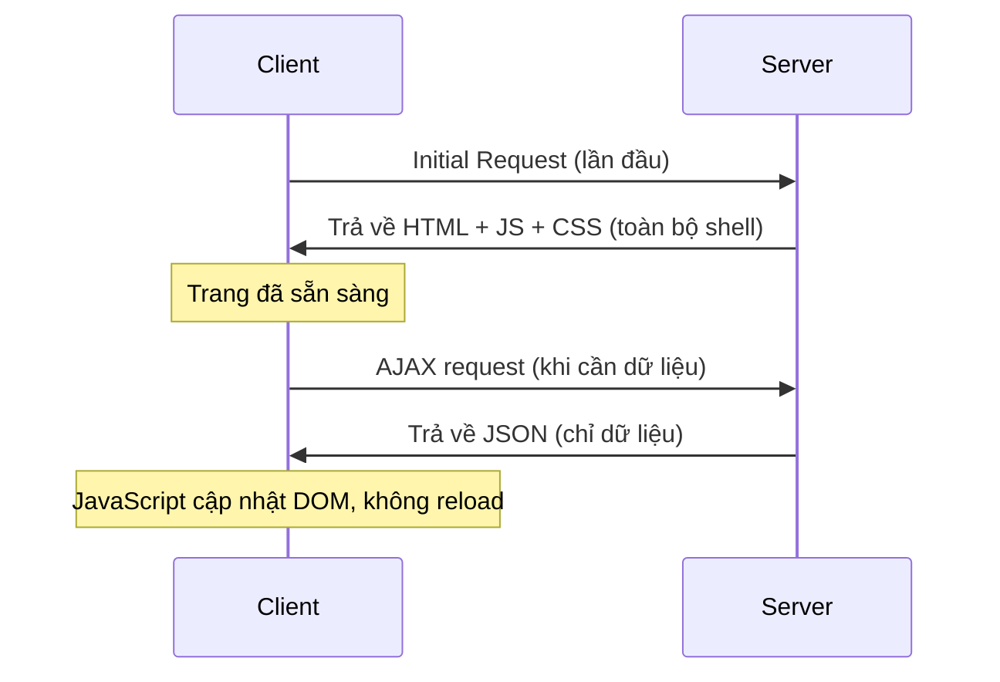
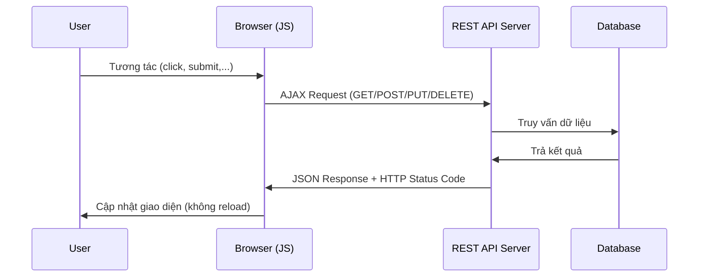
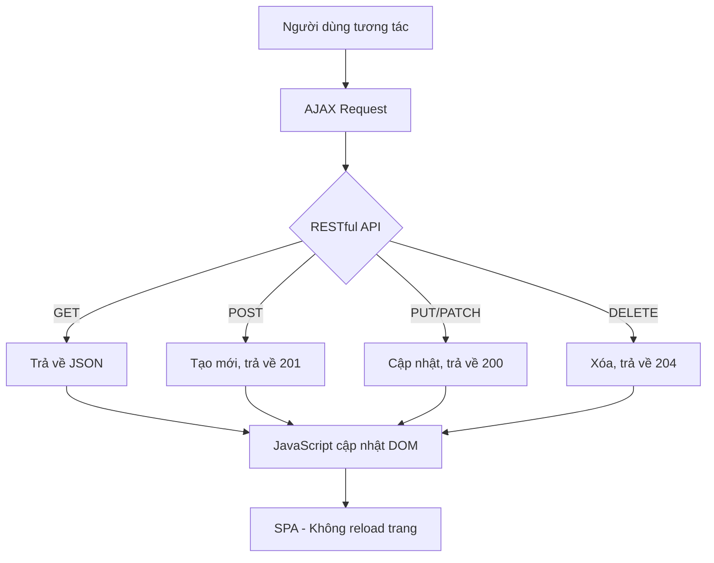

# Chương 9: AJAX, Single Page Application và RESTful API

---

## 1. AJAX (Asynchronous JavaScript and XML)

### 1.1 Khái niệm

AJAX không phải là một ngôn ngữ lập trình. Đây là một **phương thức trao đổi dữ liệu bất đồng bộ với máy chủ**, cho phép cập nhật một phần trang web mà không cần tải lại toàn bộ trang.

> "Bất đồng bộ" (asynchronous) có nghĩa là trình duyệt có thể tiếp tục hoạt động bình thường trong khi đợi phản hồi từ server — người dùng không bị chặn lại.

### 1.2 Lợi ích

- Cập nhật nội dung trang mà không cần reload
- Gửi/nhận dữ liệu sau khi trang đã tải xong
- Các thao tác với server chạy ở nền (background), không làm gián đoạn trải nghiệm người dùng

### 1.3 Các công nghệ liên quan

AJAX là sự kết hợp của nhiều công nghệ:

- **HTML/XHTML + CSS** — cấu trúc và trình bày trang
- **DOM** — truy cập và thao tác cây phần tử HTML
- **XML / JSON** — định dạng dữ liệu trao đổi
- **XMLHttpRequest (XHR)** — đối tượng cốt lõi để gửi/nhận request
- **JavaScript** — điều phối toàn bộ luồng xử lý

### 1.4 Quy trình hoạt động



---

## 2. XMLHttpRequest (XHR)

### 2.1 Tổng quan

`XMLHttpRequest` là đối tượng JavaScript dùng để thực hiện các HTTP request đến server mà không cần reload trang. Dù tên có chứa "XML", nó có thể nhận **bất kỳ kiểu dữ liệu** nào (JSON, text, HTML,...) và hỗ trợ nhiều giao thức (HTTP, file, FTP).

### 2.2 Các thuộc tính quan trọng

| Thuộc tính | Mô tả |
|---|---|
| `onreadystatechange` | Hàm callback được gọi mỗi khi `readyState` thay đổi |
| `readyState` | Trạng thái hiện tại của request (0–4) |
| `responseText` | Nội dung phản hồi dưới dạng chuỗi văn bản |
| `responseXML` | Nội dung phản hồi dưới dạng XML DOM |
| `status` | Mã HTTP status (200, 404, 500,...) |

**Các giá trị `readyState`:**

| Giá trị | Tên | Ý nghĩa |
|---|---|---|
| 0 | UNSENT | Đối tượng đã tạo, chưa gọi `open()` |
| 1 | OPENED | `open()` đã được gọi |
| 2 | HEADERS_RECEIVED | `send()` đã gọi, đã nhận được header |
| 3 | LOADING | Đang nhận dữ liệu, `responseText` đang có dữ liệu |
| 4 | DONE | Hoàn tất, dữ liệu đã nhận đầy đủ |

!!! tip "Điều kiện thường dùng"
    Trong thực tế, ta chỉ cần kiểm tra `readyState == 4` và `status == 200` để biết request đã thành công.

### 2.3 Các phương thức quan trọng

| Phương thức | Mô tả |
|---|---|
| `open(method, URL)` | Khởi tạo request với method (GET/POST) và URL |
| `open(method, URL, async)` | Thêm tham số async (`true` = bất đồng bộ) |
| `open(method, URL, async, user, pass)` | Thêm xác thực |
| `send()` | Gửi request (dùng cho GET) |
| `send(string)` | Gửi request kèm body (dùng cho POST) |
| `setRequestHeader(header, value)` | Đặt header cho request |

### 2.4 Ví dụ thực tế

**GET request:**

```javascript
function loadDoc() {
    var xhttp = new XMLHttpRequest();

    xhttp.onreadystatechange = function() {
        if (this.readyState == 4 && this.status == 200) {
            document.getElementById("demo").innerHTML = this.responseText;
        }
    };

    xhttp.open("GET", "data.json", true);
    xhttp.send();
}
```

**POST request:**

```javascript
function submitForm() {
    var xhttp = new XMLHttpRequest();

    xhttp.onreadystatechange = function() {
        if (this.readyState == 4 && this.status == 200) {
            document.getElementById("demo").innerHTML = this.responseText;
        }
    };

    xhttp.open("POST", "submit.php", true);
    // Bắt buộc khi gửi dữ liệu dạng form
    xhttp.setRequestHeader("Content-type", "application/x-www-form-urlencoded");
    xhttp.send("fname=Henry&lname=Ford");
}
```

---

## 3. jQuery AJAX

jQuery cung cấp các hàm tiện ích bọc lại XHR, giúp code ngắn gọn hơn nhiều.

### 3.1 `$.get()`

```javascript
$.get(URL, callback);
```

**Ví dụ:**

```javascript
$(document).ready(function() {
    $("button").click(function() {
        $.get("data.asp", function(data, status) {
            if (status == "success") {
                $("#content").html(data);
            } else {
                $("#content").html("Failed");
            }
        });
    });
});
```

### 3.2 `$.post()`

```javascript
$.post(URL, data, callback);
```

**Ví dụ:**

```javascript
$("button").click(function() {
    $.post("submit.asp",
        {
            name: "Donald Duck",
            city: "Duckburg"
        },
        function(data, status) {
            alert("Data: " + data + "\nStatus: " + status);
        }
    );
});
```

### 3.3 So sánh XHR thuần và jQuery AJAX

| | XHR thuần | jQuery `$.get` / `$.post` |
|---|---|---|
| Độ dài code | Nhiều dòng | Rất ngắn gọn |
| Cần thư viện | Không | Có (jQuery) |
| Kiểm soát chi tiết | Cao | Trung bình |
| Phù hợp | Dự án không dùng jQuery | Dự án dùng jQuery |

---

## 4. Single Page Application (SPA)

### 4.1 So sánh với truyền thống

**Ứng dụng truyền thống (Multi-Page Application):**



**Single Page Application:**



### 4.2 Đặc trưng của SPA

**Giống native app**
: Trải nghiệm mượt mà, phản hồi nhanh, không có cảm giác "nhảy trang" — tương tự ứng dụng desktop hay mobile.

**Không reload**
: Toàn bộ cấu trúc HTML/CSS/JS được tải một lần duy nhất. Khi chuyển "trang", thực ra chỉ là JavaScript thay đổi nội dung bên trong — URL có thể thay đổi nhờ HTML5 History API nhưng trang không thực sự tải lại.

**Tải bộ phận (Lazy loading)**
: Chỉ những phần dữ liệu mà người dùng cần mới được tải về, thông qua AJAX. Điều này giúp tiết kiệm băng thông và tăng tốc độ phản hồi.

### 4.3 Nhược điểm

!!! warning "Một số hạn chế cần lưu ý"

    - **Load lần đầu nặng:** Toàn bộ JavaScript của ứng dụng phải tải về cùng lúc, khiến lần tải đầu có thể chậm hơn so với trang truyền thống. Giải pháp hiện đại là code splitting và lazy loading theo route.
    
    - **SEO khó khăn:** Vì nội dung được render bởi JavaScript phía client, các công cụ tìm kiếm (đặc biệt là các crawler đơn giản) có thể không đọc được nội dung. Giải pháp: Server-Side Rendering (SSR) như Next.js, Nuxt.js.
    
    - **Phụ thuộc JavaScript:** Nếu người dùng tắt JavaScript hoặc trình duyệt không hỗ trợ, ứng dụng sẽ hoàn toàn không hoạt động.
    
    - **Quản lý state phức tạp:** Khi ứng dụng lớn, việc quản lý trạng thái (state) giữa các component trở nên phức tạp. Cần dùng thêm thư viện như Redux, Vuex, Zustand,...

### 4.4 Các framework SPA phổ biến

| Framework | Ngôn ngữ | Nhà phát triển |
|---|---|---|
| React | JavaScript/TypeScript | Meta (Facebook) |
| Vue.js | JavaScript/TypeScript | Evan You (cộng đồng) |
| Angular | TypeScript | Google |
| Svelte | JavaScript/TypeScript | Rich Harris |

---

## 5. RESTful API

### 5.1 Định nghĩa

**REST** (Representational State Transfer) là một **kiến trúc thiết kế** (không phải giao thức hay chuẩn cứng) cho phép client và server tương tác với nhau qua HTTP theo một tập quy tắc thống nhất.

Một API tuân thủ REST gọi là **RESTful API**.

REST đáp ứng các yếu tố:

- **Self-documenting:** Nhìn vào URL có thể đoán được mục đích
- **Flexible:** Dễ mở rộng và tùy biến
- **Unified structure:** Cấu trúc nhất quán, tên thuộc tính thống nhất
- **Clear error message:** Thông báo lỗi rõ ràng, có ích cho việc debug

### 5.2 HTTP Methods và CRUD

RESTful API ánh xạ các hoạt động CRUD lên HTTP methods:

| HTTP Method | CRUD | Mô tả |
|---|---|---|
| `GET` | Read | Lấy dữ liệu |
| `POST` | Create | Tạo mới dữ liệu |
| `PUT` | Update | Cập nhật toàn bộ dữ liệu |
| `PATCH` | Update (partial) | Cập nhật một phần dữ liệu |
| `DELETE` | Delete | Xóa dữ liệu |

### 5.3 HTTP Status Codes

Mỗi response từ server đều kèm theo một mã trạng thái:

| Nhóm | Ý nghĩa | Ví dụ thường gặp |
|---|---|---|
| `1xx` | Thông tin | `100 Continue` |
| `2xx` | Thành công | `200 OK`, `201 Created`, `204 No Content` |
| `3xx` | Điều hướng | `301 Moved Permanently`, `304 Not Modified` |
| `4xx` | Lỗi phía client | `400 Bad Request`, `401 Unauthorized`, `403 Forbidden`, `404 Not Found` |
| `5xx` | Lỗi phía server | `500 Internal Server Error` |

**Các status code phổ biến nhất:**

```
200 — OK                  Thành công
201 — Created             Tạo mới thành công (dùng cho POST)
204 — No Content          Thành công nhưng không có dữ liệu trả về (dùng cho DELETE)
304 — Not Modified        Client có thể dùng cache
400 — Bad Request         Request sai định dạng
401 — Unauthorized        Chưa đăng nhập / thiếu token
403 — Forbidden           Đã xác thực nhưng không có quyền
404 — Not Found           Resource không tồn tại
422 — Unprocessable Entity Dữ liệu không hợp lệ về mặt nghiệp vụ
500 — Internal Server Error Lỗi server không mong đợi
```

---

## 6. Các nguyên tắc thiết kế RESTful API

### Nguyên tắc 1: Sử dụng HTTP method đúng mục đích

Mỗi method phải thể hiện đúng hành động cần thực hiện. Không dùng GET để xóa dữ liệu, không dùng POST để cập nhật.

| Resource | POST | GET | PUT | DELETE |
|---|---|---|---|---|
| `/dogs` | Tạo mới một con chó | Lấy danh sách chó | Cập nhật nhiều chó | Xóa tất cả chó |
| `/dogs/1234` | Lỗi (405) | Lấy thông tin chó 1234 | Cập nhật chó 1234 | Xóa chó 1234 |

### Nguyên tắc 2: Dùng danh từ số nhiều, không dùng động từ trong URL

URL đại diện cho **resource (tài nguyên)**, không đại diện cho **hành động**.

```
# Sai - dùng động từ
GET /getAllCars
POST /createNewCar
DELETE /deleteAllRedCars

# Đúng - dùng danh từ số nhiều
GET    /cars
POST   /cars
DELETE /cars
```

```
# Sai - dùng số ít
/car
/user
/product

# Đúng - dùng số nhiều
/cars
/users
/products
```

### Nguyên tắc 3: Phân cấp resource (Nested resources)

Khi có quan hệ giữa các resource:

```
# Lấy tất cả xe của user 123
GET /users/123/cars

# Lấy xe số 5 của user 123 (2 cách đều được)
GET /users/123/cars/5
GET /cars/5
```

!!! warning "Không nên lồng quá 2 cấp"
    ```
    # Không nên dùng (khó đọc, khó maintain)
    GET /users/1/posts/5/comments/10

    # Thay vào đó, dùng query params
    GET /users/1/filter?properties.post=5&properties.comment=10
    ```

### Nguyên tắc 4: Versioning

Versioning bắt buộc để không phá vỡ các client cũ khi API thay đổi.

```
# Đúng - version ở đầu URL, dùng số nguyên
GET /v1/users/1
GET /v2/users/1

# Sai - số thập phân, hoặc version ở giữa
GET /users/v1.5/1
```

### Nguyên tắc 5: Đặt tên attribute nhất quán

Chọn một convention và tuân thủ xuyên suốt toàn bộ API. Ba convention phổ biến:

| Convention | Ví dụ |
|---|---|
| snake_case | `created_at`, `user_id` |
| camelCase | `createdAt`, `userId` |
| PascalCase | `CreatedAt`, `UserId` |

!!! danger "Tránh dùng nhiều tên cho cùng một loại attribute"
    Ví dụ xấu: đôi khi dùng `user_id`, đôi khi dùng `user` để nói về cùng một thứ. Hoặc `from_date` và `from` cùng xuất hiện trong cùng một API.

### Nguyên tắc 6: Phân trang (Pagination)

Khi dữ liệu lớn, không bao giờ trả về toàn bộ trong một request. Các cách phổ biến:

```
# Facebook style (trực quan nhất)
GET /posts?offset=50&limit=25

# Twitter style
GET /posts?page=3&rpp=25        # rpp = records per page

# LinkedIn style
GET /posts?start=50&count=25
```

### Nguyên tắc 7: Tìm kiếm và lọc

```
# Global search - tìm trên toàn bộ hệ thống
GET /search?q=fluffy+fur

# Scoped search - tìm trong resource cụ thể
GET /users/123/cars?q=toyota

# Lọc theo field cụ thể với các toán tử
GET /cars?price[gte]=100&price[lte]=500&brand=toyota

# Chọn field trả về (giảm payload)
GET /users?fields=id,name,email
```

**Các toán tử lọc thường dùng:**

| Toán tử | Ý nghĩa |
|---|---|
| `eq` | Bằng |
| `neq` | Không bằng |
| `gt` | Lớn hơn |
| `gte` | Lớn hơn hoặc bằng |
| `lt` | Nhỏ hơn |
| `lte` | Nhỏ hơn hoặc bằng |
| `in` | Có trong danh sách |
| `not_in` | Không có trong danh sách |

### Nguyên tắc 8: Định dạng dữ liệu qua HTTP Header

```http
# Client thông báo gửi dữ liệu dạng JSON
Content-Type: application/json

# Client yêu cầu server trả về JSON
Accept: application/json
```

### Nguyên tắc 9: Error message rõ ràng, có cấu trúc

Một error response tốt phục vụ được cả 3 đối tượng:

```json
{
    "error": {
        "userMessage": "Rất tiếc, tài nguyên bạn yêu cầu không tồn tại.",
        "internalMessage": "No car found in the database with id=55",
        "code": 34
    }
}
```

| Field | Dùng cho |
|---|---|
| `userMessage` | Hiển thị cho người dùng cuối |
| `internalMessage` | Backend developer debug |
| `code` | Client developer xử lý logic |

---

## 7. Kết hợp AJAX và RESTful API trong thực tế

### 7.1 Mô hình hoạt động tổng thể



### 7.2 Ví dụ: Dùng jQuery AJAX gọi RESTful API

```javascript
$(document).ready(function() {

    // Load danh sách sản phẩm
    $("#loadmore").click(function() {
        $.get("/api/products", function(data, status) {
            for (var i = 0; i < data.length; i++) {
                $("#productlist").append(
                    "<tr>" +
                    "<td>" + data[i].Product_Code + "</td>" +
                    "<td>" + data[i].Product_Name + "</td>" +
                    "<td>" + data[i].Product_Summary + "</td>" +
                    "<td></td>" +
                    "</tr>"
                );
            }
        });
    });

    // Tạo mới sản phẩm
    $("#createBtn").click(function() {
        var newProduct = {
            Product_Code: "SP001",
            Product_Name: "Laptop Example"
        };

        $.ajax({
            url: "/api/products",
            method: "POST",
            contentType: "application/json",
            data: JSON.stringify(newProduct),
            success: function(response) {
                console.log("Tạo thành công:", response);
            },
            error: function(xhr) {
                console.error("Lỗi:", xhr.status, xhr.responseText);
            }
        });
    });

});
```

### 7.3 Dùng Fetch API (modern alternative, không cần jQuery)

Ngày nay, `fetch()` là cách hiện đại hơn để thực hiện AJAX, được hỗ trợ native trên tất cả trình duyệt hiện đại:

```javascript
// GET
fetch("/api/products")
    .then(response => {
        if (!response.ok) throw new Error("HTTP error: " + response.status);
        return response.json();
    })
    .then(data => {
        console.log(data);
    })
    .catch(error => console.error("Lỗi:", error));

// POST
fetch("/api/products", {
    method: "POST",
    headers: {
        "Content-Type": "application/json"
    },
    body: JSON.stringify({
        Product_Code: "SP001",
        Product_Name: "Laptop Example"
    })
})
.then(res => res.json())
.then(data => console.log("Tạo thành công:", data));
```

Hoặc dùng `async/await` cho dễ đọc hơn:

```javascript
async function createProduct(product) {
    try {
        const response = await fetch("/api/products", {
            method: "POST",
            headers: { "Content-Type": "application/json" },
            body: JSON.stringify(product)
        });

        if (!response.ok) {
            throw new Error("Lỗi: " + response.status);
        }

        const data = await response.json();
        console.log("Thành công:", data);
    } catch (error) {
        console.error(error);
    }
}
```

---

## 8. Tổng kết



| Công nghệ | Vai trò |
|---|---|
| **AJAX / Fetch API** | Cơ chế giao tiếp bất đồng bộ với server |
| **XMLHttpRequest / fetch()** | Đối tượng/hàm thực hiện HTTP request |
| **RESTful API** | Quy tắc thiết kế interface giữa client và server |
| **JSON** | Định dạng dữ liệu trao đổi phổ biến nhất |
| **SPA** | Kiến trúc ứng dụng tận dụng AJAX để không reload trang |
