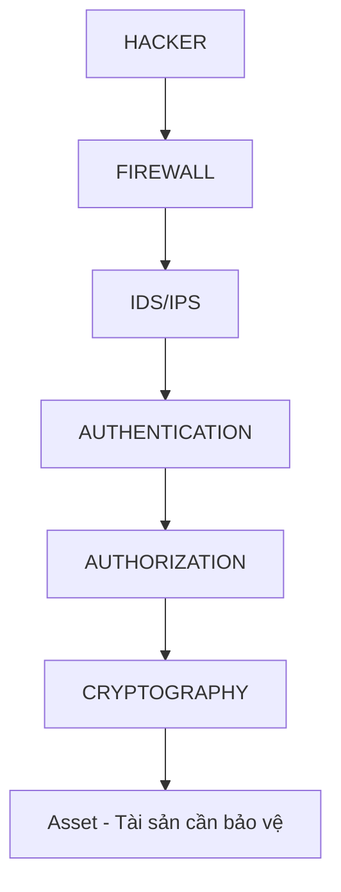
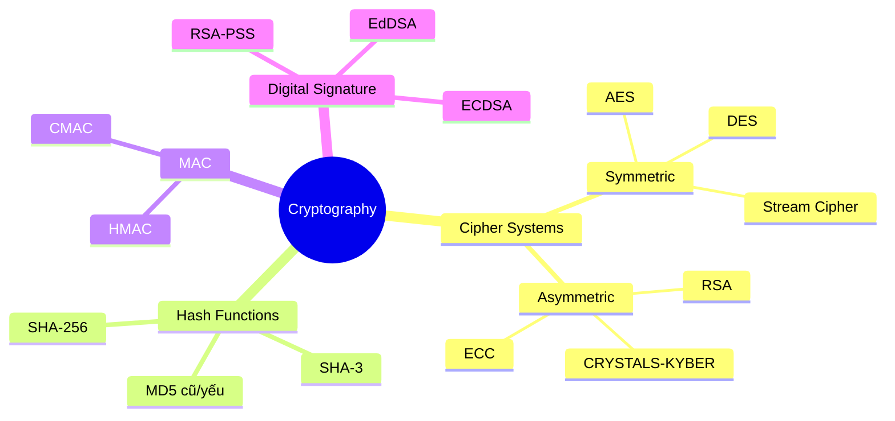

# Bài 1: Giới thiệu về Mật mã học

---

### 1. Tại sao cần mật mã học?

> **Cryptology = Cryptography + Cryptanalysis**
> 
> - **Cryptography** ("secret writing"): nghiên cứu cách *bảo vệ* thông tin bằng mã hóa.
> - **Cryptanalysis**: nghiên cứu cách *phá vỡ* mã hóa để tiết lộ thông tin bí mật.

#### Dữ liệu tồn tại ở 3 trạng thái cần bảo vệ:

```
┌────────────────────────────────────────────────┐
│              3 Trạng thái của Dữ liệu          │
├──────────────────┬──────────────────────────────┤
│ Transmission     │ Đang truyền qua mạng          │
│ Storage          │ Đang lưu trữ trên đĩa/DB      │
│ Processing       │ Đang xử lý trong RAM/CPU      │
└──────────────────┴──────────────────────────────┘
```

!!! info "Tại sao quan trọng?"
    Mạng Internet ngày nay kết nối mọi thiết bị: điện thoại, máy tính, datacenter, ISP,... Bất kỳ lớp nào cũng có thể bị tấn công nếu không có cơ chế bảo vệ.

---

### 2. Mô hình phòng thủ theo chiều sâu (Defense in Depth)



!!! tip "Nguyên tắc quan trọng"
    Không có một lớp bảo vệ nào là tuyệt đối. Mô hình **Defense in Depth** (Onion Model) sử dụng nhiều lớp bảo vệ lồng nhau: nếu một lớp bị vượt qua, các lớp bên trong vẫn bảo vệ tài sản.

---

### 3. Các mục tiêu bảo mật trong mật mã học

| Mục tiêu | Mô tả | Ví dụ triển khai |
|---|---|---|
| **Confidentiality** | Chỉ người được phép mới đọc được dữ liệu | AES, RSA encryption |
| **Integrity** | Dữ liệu không bị sửa đổi trái phép | SHA-256, HMAC |
| **Authentication** | Xác minh danh tính người dùng/thiết bị | Digital Certificate, Kerberos |
| **Non-repudiation** | Không thể phủ nhận hành động đã thực hiện | Digital Signature |
| **Availability** | Hệ thống luôn sẵn sàng phục vụ | Kết hợp với các giải pháp khác |
| **Privacy** | Bảo vệ thông tin cá nhân | GDPR compliance + encryption |

!!! note "Liên hệ với CIA Triad"
    Các mục tiêu trên mở rộng từ **CIA Triad** (Confidentiality - Integrity - Availability). Mật mã học bổ sung thêm **Authentication** và **Non-repudiation** — hai yếu tố mà CIA Triad truyền thống không đề cập đến.

---

### 4. Các công cụ/cơ chế mật mã học


