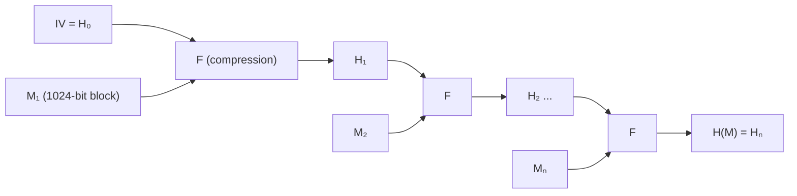

# Bài 10: Hash Function và Message Authentication Codes (Phần 1)

---

## 1. Mục tiêu bảo mật & vị trí của Hash/MAC

Trong mật mã học, các mục tiêu bảo mật cốt lõi gồm:

| Mục tiêu | Công cụ |
|---|---|
| Confidentiality (bảo mật) | Symmetric (AES, DES), Asymmetric (RSA, ECC) |
| **Authentication** (xác thực) | MAC, HMAC, Digital Signature |
| **Integrity** (toàn vẹn) | Hash function, MAC |
| Non-repudiation (không chối bỏ) | Digital Signature, Certificate |
| Availability | Access control (RBAC, ABAC) |

> **Lưu ý quan trọng:** Cipher (mã hóa đối xứng/bất đối xứng) chỉ cung cấp **confidentiality** và một phần authentication — chúng **không** tự động đảm bảo integrity hay non-repudiation. Đó là lý do cần Hash function và MAC.

---

## 2. Động lực (Motivations)

### 2.1 Vấn đề toàn vẹn dữ liệu

Khi A gửi dữ liệu cho B qua mạng, có hai vấn đề:

1. **Lỗi truyền dẫn (propagation errors):** Dữ liệu bị hỏng do nhiễu đường truyền.
2. **Tấn công MITM:** Kẻ tấn công chen giữa, sửa đổi dữ liệu mà A và B không hay biết.

### 2.2 Man-in-the-Middle (MiTM) attack trong ECDH

Xem xét giao thức Diffie-Hellman trên đường cong elliptic:

```
Alice (a, QA=aG)          Eve (m, QM=mG)          Bob (b, QB=bG)
      |                        |                        |
      |------- aG ------------>|                        |
      |                        |------- mG ------------>|
      |<------ mG -------------|                        |
      |                        |<------ bG -------------|
      |                        |                        |
sk1 = a·mG                  sk1=m·aG              sk2 = b·mG
                             sk2=m·bG
```

- Eve thay thế `aG` và `bG` bằng `mG` của mình.
- Alice nghĩ đang nói chuyện với Bob, thực ra đang nói với Eve.
- Eve giải mã, đọc/sửa nội dung, rồi mã hóa lại gửi Bob.

!!! danger "Kết luận"
    Cần cơ chế **xác thực thực thể (entity authentication)** — cipher đơn thuần không đủ để ngăn MITM.

---

## 3. Hash Function

### 3.1 Định nghĩa

Hàm hash ánh xạ một chuỗi bit đầu vào có độ dài **tùy ý** sang chuỗi bit đầu ra có độ dài **cố định** `l` bit:

```
H: {0,1}* → {0,1}^l
```

- Đầu ra gọi là **fingerprint** (dấu tay số) hoặc **message digest** (tóm lược thông điệp).
- Không dùng khóa bí mật.

### 3.2 Ví dụ: CRC Checksum

CRC (Cyclic Redundancy Check) là một hash function đơn giản dùng trong mạng để phát hiện lỗi truyền dẫn.

**Ví dụ cụ thể:**

```
Message M = 11010011101100  (14 bits)
Divisor   = x³ + x + 1  →  1011

Bước 1: Thêm 3 bit 0 vào M
M' = 11010011101100 000

Bước 2: Chia M'(x) cho x³+x+1 (chia modulo 2 – XOR division)
Quotient  Q(x) = x¹³ + x¹² + x¹¹ + x¹⁰ + x⁶ + x⁵ + x⁴ + x³ + x²
Remainder R(x) = x²  →  CRC = 100

Bước 3: Gửi M||CRC = 11010011101100 100
```

**Receiver kiểm tra:** Chia `M'(x)` cho divisor — nếu dư = 0 thì không có lỗi.

!!! warning "Giới hạn của CRC"
    CRC chỉ phát hiện **lỗi ngẫu nhiên**, không chống được **tấn công có chủ đích** vì kẻ tấn công có thể tính lại CRC sau khi sửa M. Cần **cryptographic hash function**.

---

## 4. Cryptographic Hash Function

### 4.1 Ba tính chất bảo mật

Cho hàm `h: X → Y`:

| Tính chất | Tên khác | Định nghĩa |
|---|---|---|
| **Preimage resistant** | One-way | Cho trước `y ∈ Y`, không thể tìm `x` sao cho `h(x) = y` |
| **2nd preimage resistant** | Weak collision resistant | Cho trước `x`, không thể tìm `x' ≠ x` sao cho `h(x') = h(x)` |
| **Collision resistant** | Strong collision resistant | Không thể tìm bất kỳ cặp `(x', x)` phân biệt nào sao cho `h(x') = h(x)` |

??? note "Quan hệ giữa ba tính chất"
    - Collision resistant ⟹ 2nd preimage resistant (nhưng ngược lại chưa chắc đúng).
    - 2nd preimage resistant không đảm bảo collision resistant.
    - Preimage resistant là tính chất độc lập nhất.

### 4.2 Ứng dụng

- **Kiểm tra toàn vẹn phần mềm:** SHA1 của file ISO Windows/Ubuntu được công bố chính thức, người dùng tự hash file tải về và so sánh.
- **Timestamping:** Để chứng minh biết bí mật `S` từ trước thời điểm `T` mà không tiết lộ `S`, công bố `(T, h(T, S))`.
- **Message Authentication (MAC/HMAC)**
- **One-time passwords**
- **Digital Signature, Certificate**

### 4.3 Sử dụng Hash cho Message Integrity

**Case 1:** Gửi `(M, h(M))` trên cùng một kênh không an toàn.

- ❌ **Không an toàn** — kẻ tấn công sửa `M` thành `M'` và tính lại `h(M')`.

**Case 2:** Gửi `M` trên kênh không an toàn, gửi `h(M)` qua kênh an toàn riêng.

- ✅ **An toàn về integrity** — nhưng cần kênh an toàn riêng để gửi hash.

**Case 3:** Gửi `(M, h(K, M))` với khóa bí mật `K` chung — đây là **MAC/HMAC**.

- ✅ **An toàn về cả integrity lẫn authentication** — kẻ tấn công không biết `K` nên không tính được `h(K, M')`.

---

## 5. Thuật ngữ tổng hợp

| Khái niệm | Mô tả |
|---|---|
| **Digital digest / fingerprint** | Đại diện ngắn của M, **không dùng khóa bí mật**, tạo bởi cryptographic hash function |
| **MAC (Message Authentication Code) / Tag** | Đại diện ngắn của M, **dùng khóa bí mật** |
| **HMAC** | Kết hợp hash function + khóa bí mật: `HMAC = H(K, M)` |

**Ví dụ HMAC trong thực tế (thiết bị y tế):**

```
Elder ←──(Diffie-Hellman)──→ Healthcare Server
Chia sẻ khóa K

Elder gửi: (M, tag = HMAC(K, M))
Server kiểm tra: H(K, M') == tag?
  → Nếu M' = M thì xác thực thành công
  → Nếu M' ≠ M thì phát hiện giả mạo
```

---

## 6. Các Hash Function phổ biến

| Thuật toán | Output (bits) | Trạng thái |
|---|---|---|
| MD5 | 128 | ❌ Phased out — collision hoàn toàn bị phá |
| SHA-1 | 160 | ❌ Phased out — collision attack tìm được |
| SHA-224 | 224 | ✅ (SHA-2 family) |
| SHA-256 | 256 | ✅ Phổ biến nhất hiện tại |
| SHA-384 | 384 | ✅ |
| SHA-512 | 512 | ✅ |
| SHA3-256, SHA3-512,... | 256–512 | ✅ Thế hệ mới nhất |

!!! warning "Điểm yếu của SHA-1, SHA-2"
    Cả SHA-1 và SHA-2 đều dễ bị **length extension attack** (tấn công mở rộng độ dài) do cấu trúc Merkle-Damgård. SHA-3 khắc phục điều này.

---

## 7. Cấu trúc Merkle-Damgård

SHA-1, SHA-2, và WHIRLPOOL đều dùng cấu trúc này.



**Công thức:**
```
H₀ = IV
Hᵢ = Hᵢ₋₁ XOR F(Mᵢ, Hᵢ₋₁),  i = 1, 2, ..., N
```

- Giống CBC trong mã hóa đối xứng nhưng **không dùng khóa bí mật**.
- `F` là **compression function** — nhận khối `Mᵢ` và trạng thái `Hᵢ₋₁`, xuất ra trạng thái mới.

---

## 8. SHA-512 Chi tiết

### 8.1 Padding (bước tiền xử lý)

SHA-512 xử lý các khối 1024-bit. Trước tiên phải pad message M:

```
M' = M || 1 || (0...0) || b₁₂₈(L)
                  ^l bit      ^độ dài L biểu diễn 128-bit
```

Điều kiện: `|M'|` chia hết cho 1024.

**Ví dụ: M = "abc" (L = 24 bits)**

```
l = 1024 - 24 - 1 - 128 = 871 bits padding 0

M' (1024 bits):
[ 01100001 01100010 01100011 | 1 | 000...000 (871 bits) | 000...011000 (128-bit = 24) ]
     'a'       'b'       'c'
```

**Công thức tính `l`:**
```
l = 895 - (L mod 1024)              nếu L mod 1024 ≤ 895
l = 895 + 1024 - (L mod 1024)      nếu L mod 1024 > 895
```

Sau padding: `M' = M₁M₂...Mₙ` — mỗi `Mᵢ` là 1024 bits.

### 8.2 Initial Vector (IV)

SHA-512 dùng **512-bit IV** gồm 8 thanh ghi 64-bit `r1..r8`, khởi tạo là 64-bit đầu của **phần thập phân** căn bậc hai của 8 số nguyên tố đầu tiên (√2, √3, √5, √7, √11, √13, √17, √19):

```
H₀⁽⁰⁾ = 6a09e667f3bcc908
H₁⁽⁰⁾ = bb67ae8584caa73b
H₂⁽⁰⁾ = 3c6ef372fe94f82b
H₃⁽⁰⁾ = a54ff53a5f1d36f1
H₄⁽⁰⁾ = 510e527fade682d1
H₅⁽⁰⁾ = 9b05688c2b3e6c1f
H₆⁽⁰⁾ = 1f83d9abfb41bd6b
H₇⁽⁰⁾ = 5be0cd19137e2179
```

> Cách chọn IV "không có cửa hậu" này (nothing-up-my-sleeve numbers) giúp đảm bảo IV được chọn minh bạch, không phải magic number do NSA chọn tùy ý.

### 8.3 Compression Function F

Mỗi lần gọi `F(Mᵢ, Hᵢ₋₁)` thực hiện **80 vòng** (rounds).

**Các phép toán bit cơ bản:**

| Ký hiệu | Phép toán |
|---|---|
| `∧` | AND |
| `∨` | OR |
| `⊕` | XOR |
| `¬` | NOT (complement) |
| `+` | Addition mod 2⁶⁴ |
| `<<n` | Left shift n bits (bỏ n bit trái, thêm n bit 0 bên phải) |
| `>>n` | Right shift n bits |
| `>>>n` | **Circular right shift** n bits (rotate right) |

**Mỗi round t (t = 0..79):**

```
T1 = r8 + Ch(r5,r6,r7) + Σ₁(r5) + Wt + Kt    (mod 2⁶⁴)
T2 = Σ₀(r1) + Maj(r1,r2,r3)                   (mod 2⁶⁴)

r8 ← r7
r7 ← r6
r6 ← r5
r5 ← (r4 + T1)  mod 2⁶⁴
r4 ← r3
r3 ← r2
r2 ← r1
r1 ← (T1 + T2)  mod 2⁶⁴
```

Trong đó:
- `Ch(e,f,g) = (e ∧ f) ⊕ (¬e ∧ g)` — "Choice"
- `Maj(a,b,c) = (a ∧ b) ⊕ (a ∧ c) ⊕ (b ∧ c)` — "Majority"
- `Σ₀`, `Σ₁` là các hàm rotate phức hợp
- `Wt` là message schedule (expand từ 1024-bit block)
- `Kₜ` là hằng số — 64-bit đầu phần thập phân **căn bậc ba** của 80 số nguyên tố đầu tiên

Sau 80 rounds, output 512-bit `F(Mᵢ, Hᵢ₋₁) = r1||r2||...||r8`.

---

## 9. Length Extension Attack trên SHA-2

!!! danger "Điểm yếu nghiêm trọng"
    Do cấu trúc Merkle-Damgård, nếu biết `H(K||M)`, kẻ tấn công có thể tính `H(K||M||padded||EX)` mà **không cần biết K**.

**Cơ chế:**

```
H(K||M) = HN  →  kẻ tấn công dùng HN làm trạng thái khởi đầu H*
H(K||M||padded||EX) = H*(EX)  →  tính được mà không biết K!
```

**Hậu quả:** Nếu server dùng `H(K||M)` làm MAC (thay vì HMAC chuẩn), kẻ tấn công có thể forge MAC cho `M||padded||EX`.

!!! success "Giải pháp"
    Dùng **HMAC chuẩn**: `HMAC(K, M) = H(K ⊕ opad || H(K ⊕ ipad || M))` — hai lần hash ngăn length extension.  
    Hoặc dùng **SHA-3** vốn không bị length extension attack.

---

## 10. SHA-3 & Sponge Construction

### 10.1 Tại sao cần SHA-3?

SHA-3 là **giải pháp thay thế** cho SHA-2, tương thích drop-in. Khác biệt cốt lõi: dùng **sponge construction** thay vì Merkle-Damgård.

### 10.2 Sponge Construction


**Tham số:**
- `b = r + c` — tổng trạng thái (với SHA-3: `b = 1600 bits`)
- `r` — **rate**: phần hấp thụ input mỗi bước
- `c` — **capacity**: `c = 2γ` (γ = độ dài output)

| Variant | Output (γ) | r | c |
|---|---|---|---|
| SHA3-224 | 224 | 1152 | 448 |
| SHA3-256 | 256 | 1088 | 512 |
| SHA3-384 | 384 | 832 | 768 |
| SHA3-512 | 512 | 576 | 1024 |

**Absorbing phase:** XOR từng r-bit block của M vào state, áp dụng permutation Keccak-f.

**Squeezing phase:** Đọc r-bit từ state làm output, áp dụng thêm permutation nếu cần nhiều hơn r bit.

!!! success "Lợi thế của SHA-3"
    - **Không bị length extension attack** vì capacity `c` không bao giờ bị lộ ra ngoài.
    - Thiết kế hoàn toàn khác SHA-1/2, đa dạng hóa rủi ro nếu SHA-2 bị phá.

---

## 11. Message Authentication Code (MAC)

### 11.1 Vấn đề với hash đơn thuần

Nếu A và B **không có khóa chung** K:
- Gửi `(M, tag = CRC)` → kẻ tấn công sửa M, tính lại CRC → ❌
- Gửi `(M, tag = H(M))` → kẻ tấn công sửa M, tính lại H(M') → ❌

### 11.2 Giải pháp: MAC với khóa bí mật

```
Alice và Bob chia sẻ khóa K (qua Diffie-Hellman chẳng hạn)

Alice gửi: (M, tag = HMAC(K, M) = H(K, M))
Bob nhận:  (M', tag)
Bob kiểm: H(K, M') == tag?
           → Nếu đúng: M chưa bị sửa, và chỉ Alice (biết K) mới tạo được tag này
```

**Tính chất của MAC:**

- ✅ **Integrity:** Bất kỳ sửa đổi nào vào M đều làm tag không khớp.
- ✅ **Authentication:** Chỉ người biết K mới tạo được tag hợp lệ.
- ❌ **Non-repudiation:** Không có — vì cả Alice lẫn Bob đều biết K, không thể phân biệt ai tạo tag.

!!! note "MAC vs Digital Signature"
    - **MAC (symmetric):** Cả hai bên cùng biết K → không có non-repudiation.
    - **Digital Signature (asymmetric):** Chỉ người ký biết private key → có non-repudiation.
