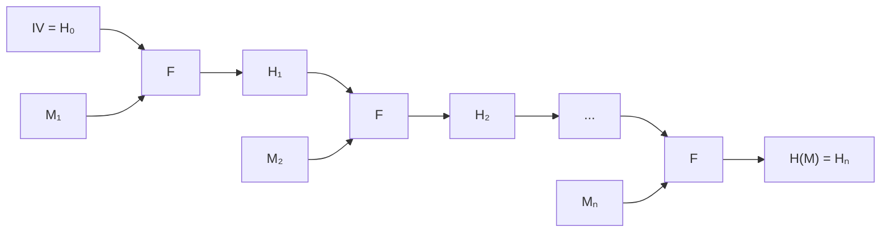
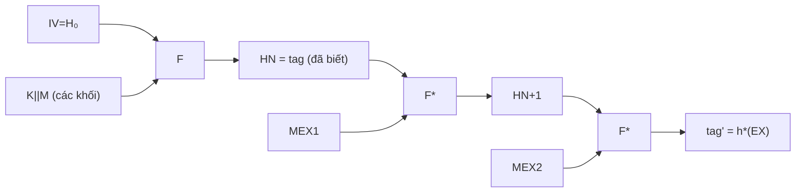
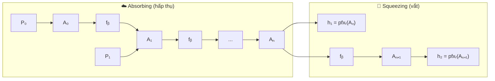
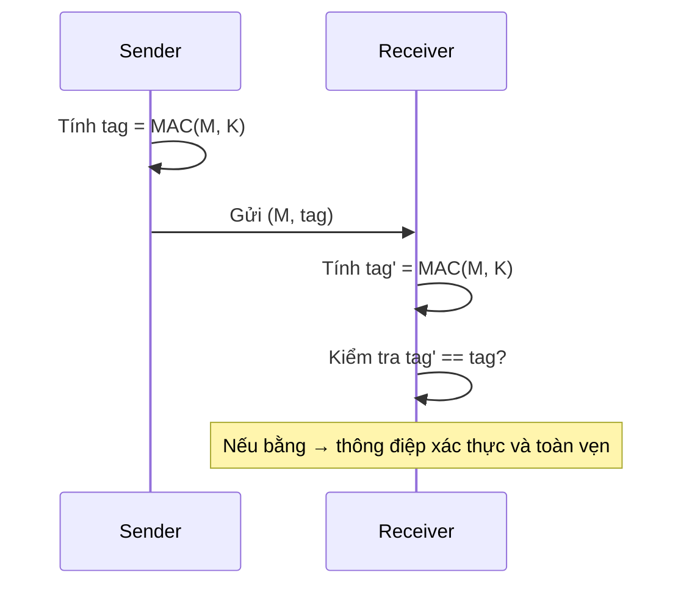
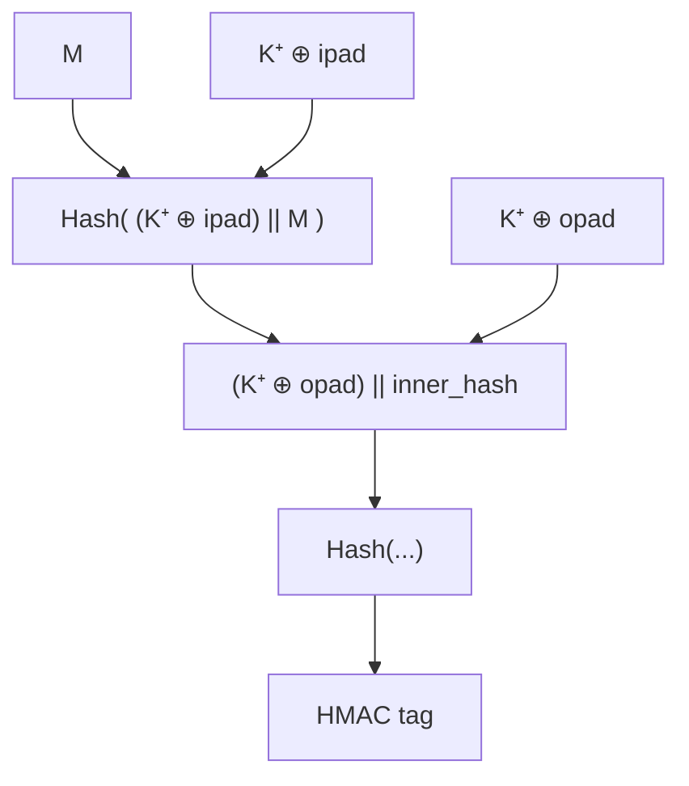

# Bài 11: Hash Function và Message Authentication Codes (Phần 2)

---

## 1. SHA-1, SHA-2, SHA-3 — Tổng Quan

SHA (Secure Hash Algorithm) là họ các hàm băm mật mã được chuẩn hóa bởi NIST. Dưới đây là bảng so sánh tổng quan:

| Thuật toán | Kích thước đầu ra (bits) | Kích thước khối (bits) | Số vòng | Bảo mật chống collision |
|---|---|---|---|---|
| MD5 (tham khảo) | 128 | 512 | 64 | Đã bị phá vỡ |
| SHA-1 | 160 | 512 | 80 | < 63 bit (đã bị phá) |
| SHA-224 | 224 | 512 | 64 | 112 bit |
| SHA-256 | 256 | 512 | 64 | 128 bit |
| SHA-384 | 384 | 1024 | 80 | 192 bit |
| SHA-512 | 512 | 1024 | 80 | 256 bit |
| SHA3-256 | 256 | 1088 (rate) | 24 | 128 bit |
| SHA3-512 | 512 | 576 (rate) | 24 | 256 bit |

---

## 2. Cấu Trúc Merkle-Damgård (dùng cho SHA-1, SHA-2)

### 2.1 Nguyên lý hoạt động

SHA-1 và SHA-2 đều sử dụng **Merkle-Damgård construction**. Ý tưởng cốt lõi là biến một hàm nén `F` có độ dài cố định thành một hàm băm xử lý được thông điệp có độ dài tùy ý.



Công thức tổng quát:

```
H₀ = IV
Hᵢ = F(Mᵢ, Hᵢ₋₁)    với i = 1, 2, ..., N
```

**Điểm quan trọng:** Hàm nén `F` được áp dụng lặp lại theo kiểu CBC (Cipher Block Chaining) nhưng **không dùng khóa bí mật**.

---

## 3. Thuật Toán SHA-512

### 3.1 Bước 1 — Padding (Thêm đệm)

Cho thông điệp `M` có độ dài `L` bit. SHA-512 yêu cầu mỗi khối `Mᵢ` phải có đúng **1024 bit**.

**Quy trình padding:**

```
M' = M || 1 || 0^l || b₁₂₈(L)
```

Trong đó:
- `1` — thêm 1 bit `1`
- `0^l` — thêm `l` bit `0` để căn chỉnh
- `b₁₂₈(L)` — biểu diễn độ dài `L` dưới dạng số nhị phân 128-bit
- `l` được chọn sao cho `|M'|` chia hết cho 1024

**Công thức tính `l`:**

```
l = 895 - (L mod 1024)     nếu (L mod 1024) ≤ 895
l = 895 + 1024 - (L mod 1024)   nếu (L mod 1024) > 895
```

> **Ví dụ:** M = "abc" → L = 24 bit
>
> l = 1024 - 24 - 1 - 128 = 871
>
> M' = 01100001 01100010 01100011 || 1 || 0^871 || (24 dưới dạng 128-bit)
>
> Tổng: 24 + 1 + 871 + 128 = 1024 bit ✓ → N = 1 khối

---

### 3.2 Bước 2 — Vector khởi tạo IV (H₀)

SHA-512 dùng **512-bit IV**, gồm 8 thanh ghi 64-bit `r1..r8`. Các giá trị này được lấy từ **64 bit đầu của phần thập phân căn bậc hai** của 8 số nguyên tố đầu tiên (√2, √3, √5, √7, √11, √13, √17, √19):

| Thanh ghi | Giá trị hex |
|---|---|
| H₁⁽⁰⁾ | `6a09e667f3bcc908` |
| H₂⁽⁰⁾ | `bb67ae8584caa73b` |
| H₃⁽⁰⁾ | `3c6ef372fe94f82b` |
| H₄⁽⁰⁾ | `a54ff53a5f1d36f1` |
| H₅⁽⁰⁾ | `510e527fade682d1` |
| H₆⁽⁰⁾ | `9b05688c2b3e6c1f` |
| H₇⁽⁰⁾ | `1f83d9abfb41bd6b` |
| H₈⁽⁰⁾ | `5be0cd19137e2179` |

---

### 3.3 Bước 3 — Hàm nén F (80 vòng lặp)

Mỗi lần gọi `F(Mᵢ, Hᵢ₋₁)` thực hiện **80 vòng lặp** (t = 0, 1, ..., 79).

**Đầu vào của F:**
- `Mᵢ`: khối thông điệp 1024-bit
- `Hᵢ₋₁ = r1 r2 r3 r4 r5 r6 r7 r8` (8 từ 64-bit)

**Các phép toán dùng trong SHA-512:**

| Ký hiệu | Ý nghĩa |
|---|---|
| `AND` | Phép AND theo bit |
| `OR` | Phép OR theo bit |
| `XOR (⊕)` | Phép XOR theo bit |
| `NOT` | Phép đảo bit |
| `+ mod 2⁶⁴` | Cộng modulo 2⁶⁴ |
| `W >>> n` | Dịch vòng phải n bit |
| `W >> n` | Dịch phải n bit (điền 0 vào trái) |
| `W << n` | Dịch trái n bit (điền 0 vào phải) |

**Công thức mỗi vòng t:**

```
T1 = [r8 + Ch(r5, r6, r7) + Σ₁(r5) + Wt + Kt] mod 2⁶⁴
T2 = [Σ₀(r1) + Maj(r1, r2, r3)] mod 2⁶⁴

r8 ← r7
r7 ← r6
r6 ← r5
r5 ← (r4 + T1) mod 2⁶⁴
r4 ← r3
r3 ← r2
r2 ← r1
r1 ← (T1 + T2) mod 2⁶⁴
```

**Hằng số Kt:** 80 hằng số 64-bit, lấy từ **64 bit đầu của phần thập phân căn bậc ba** của 80 số nguyên tố đầu tiên.

Sau 80 vòng:
```
F(Mᵢ, Hᵢ₋₁) = r1 r2 r3 r4 r5 r6 r7 r8   (512-bit)
```

---

## 4. Tấn Công Length Extension trên SHA-2

### 4.1 Vấn đề

Do cấu trúc Merkle-Damgård, SHA-2 **dễ bị tấn công length extension** khi được dùng naively để tạo MAC theo kiểu `h(K || M)`.

### 4.2 Kịch bản tấn công

!!! danger "Mô tả tấn công"
    Kẻ tấn công biết `(M, tag)` trong đó `tag = h(K || M)`, nhưng **không biết K**.
    
    Kẻ tấn công có thể tính được `tag' = h(K || M || padding || EX)` cho bất kỳ chuỗi `EX` nào — mà **không cần biết K**!

**Tại sao được?** Vì `tag = h(K || M) = HN` chính là trạng thái nội bộ cuối cùng của hàm băm. Kẻ tấn công dùng `HN` làm IV mới và tiếp tục tính:



**Kết quả:** Kẻ tấn công tạo ra cặp hợp lệ `(M', tag')` với `M' = M || padding || EX` mà server sẽ chấp nhận — **giả mạo thành công**.

### 4.3 Cách phòng chống

- Dùng **HMAC** thay vì `h(K || M)` hoặc `h(M || K)`
- Dùng **SHA-3** (sponge construction — không bị length extension attack)

---

## 5. SHA-3 (Keccak)

### 5.1 Lịch sử

- **2007:** NIST kêu gọi thiết kế hàm băm mới
- **2008:** Nhận 64 đề xuất
- **2012:** NIST chọn **Keccak** làm SHA-3, tác giả: Guido Bertoni, Joan Daemen, Gilles Van Assche, Michaël Peeters

### 5.2 Sponge Construction — Ý tưởng cốt lõi

Thay vì Merkle-Damgård, SHA-3 dùng **sponge construction** (cấu trúc bọt biển) gồm 2 pha:



**Tham số:**
- `b = r + c` — kích thước trạng thái (state size), SHA-3 dùng `b = 1600` bit
- `r` — **rate** (tốc độ): kích thước khối message mỗi vòng
- `c` — **capacity** (dung lượng bảo mật): `c = 2d` với `d` là độ dài hash đầu ra

| Hàm | d (output) | r (rate) | c (capacity) |
|---|---|---|---|
| SHA3-256 | 256 | 1088 | 512 |
| SHA3-384 | 384 | 832 | 768 |
| SHA3-512 | 512 | 576 | 1024 |
| SHAKE128 | tùy ý | 1344 | 256 |

### 5.3 Padding trong SHA-3

```
M' = M || 1 {0}* 1
```

Thêm bit `1`, sau đó các bit `0`, rồi bit `1` cuối — sao cho `|M'|` chia hết cho `r`.

### 5.4 Hàm hoán vị fᵦ (Keccak-f)

State được biểu diễn dưới dạng **ma trận 5×5×64** (với b=1600). Mỗi vòng gồm **5 bước**:

#### Bước θ (Theta) — Khuếch tán

```
C[x, z] = A[x,0,z] ⊕ A[x,1,z] ⊕ A[x,2,z] ⊕ A[x,3,z] ⊕ A[x,4,z]
D[x, z] = C[(x-1) mod 5, z] ⊕ C[(x+1) mod 5, (z-1) mod w]
A'[x,y,z] = A[x,y,z] ⊕ D[x,z]
```

> Mỗi bit phụ thuộc vào giá trị hiện tại và 1 bit từ cột trước + 1 bit từ cột sau → tạo hiệu ứng khuếch tán lan rộng.

#### Bước ρ (Rho) — Dịch vòng trong từ

```
A'[x, y, z] = A[x, y, (z - (t+1)(t+2)/2) mod w]
```

Các bit trong mỗi từ (word) được dịch vòng, tạo sự phân tán theo chiều sâu.

#### Bước π (Pi) — Hoán vị từ

```
A'[x, y, z] = A[(x + 3y) mod 5, x, z]
```

Hoán vị vị trí các từ trong ma trận 5×5.

#### Bước χ (Chi) — Ánh xạ phi tuyến

```
A'[x,y,z] = A[x,y,z] ⊕ ((A[(x+1) mod 5, y, z] ⊕ 1) · A[(x+2) mod 5, y, z])
```

Đây là bước **duy nhất phi tuyến**, cung cấp khả năng chống phân tích tuyến tính.

#### Bước ι (Iota) — Phá đối xứng

```
A'[0,0,z] = A'[0,0,z] ⊕ RC[z]
```

XOR phần tử `[0,0]` với hằng số vòng `RC` — ngăn SHA-3 có tính đối xứng chu kỳ.

### 5.5 Hấp thụ và Vắt

**Absorbing (hấp thụ từng khối):**
```
Aᵢ = fᵦ( (pfxᵣ(Mᵢ ⊕ Aᵢ₋₁) || sfxc(Aᵢ₋₁)) )    i = 1..N
```

- XOR r bit đầu của state với khối `Mᵢ`
- Giữ nguyên c bit sau
- Áp dụng fᵦ

**Squeezing (vắt ra hash):**
```
hᵢ = pfxᵣ(Aₙ₊ᵢ₋₁)    i = 1..
Aₙ₊ᵢ = fᵦ(Aₙ₊ᵢ₋₁)
```

Lấy r bit đầu của state làm output, tiếp tục áp dụng fᵦ để lấy thêm nếu cần.

---

## 6. Chọn Độ Dài Hash — Nguyên Tắc Mắt Xích Yếu Nhất

!!! tip "Weakest Link Principle"
    Một hệ thống chỉ mạnh bằng mắt xích yếu nhất. Do đó tất cả các thành phần nên có mức độ bảo mật tương đương nhau.

Do **birthday attack**, độ dài hash cần **gấp đôi** độ dài khóa của block cipher:

| Hash | Độ bảo mật | Tương ứng với |
|---|---|---|
| SHA-224 | 112 bit | Triple-DES |
| SHA-256 | 128 bit | AES-128 |
| SHA-384 | 192 bit | AES-192 |
| SHA-512 | 256 bit | AES-256 |

---

## 7. Giới Hạn Của Hash Thuần Túy Trong Xác Thực

!!! warning "Vấn đề"
    Hash function là **công khai** — bất kỳ ai cũng có thể tính `h(M)` cho bất kỳ `M` nào. Do đó, chỉ gửi `(M, h(M))` qua kênh thông thường **không đảm bảo xác thực**.

Để xác thực, cần thêm **thông tin bí mật** (khóa) vào quá trình tính hash → dẫn đến **MAC**.

---

## 8. Message Authentication Code (MAC)

### 8.1 Định nghĩa

```
tag = MAC(M, K)
```

- `M`: thông điệp
- `K`: khóa bí mật chia sẻ giữa sender và receiver
- `tag`: mã xác thực



### 8.2 Yêu cầu bảo mật — Existential Unforgeability under CPA

!!! info "Định nghĩa bảo mật MAC"
    - Challenger chọn khóa K ngẫu nhiên
    - Adversary chọn các thông điệp M₁, M₂, ..., Mₙ và nhận được `tⱼ = MAC(K, Mⱼ)`
    - Adversary output `(M', t')`
    - **Adversary thắng** nếu: `M' ≠ Mⱼ` với mọi j, và `t' = MAC(K, M')`
    
    MAC an toàn khi không adversary nào có thể thắng với xác suất đáng kể.

---

## 9. Các Loại MAC Phổ Biến

### 9.1 CMAC (Cipher-based MAC)

Dựa trên block cipher (thường là AES), sử dụng chế độ CBC:

```
CMAC = MSBTlen(CIPHK(Mn ⊕ K1 hoặc K2) ← ... ← CIPHK(M1))
```

- Khối cuối được XOR với khóa phụ K1 (nếu khối đầy đủ) hoặc K2 (nếu cần padding thêm `10...0`)

### 9.2 GMAC (Galois/Counter Mode MAC)

- Là phần xác thực của **GCM (Galois/Counter Mode)**
- Dựa trên phép nhân trong trường Galois GF(2¹²⁸)
- Đầu ra: auth tag kết hợp với ciphertext `C = C1 || ... || Cn`

### 9.3 Poly1305, SipHash, VMAC

Các MAC nhanh hiện đại, phù hợp cho các ứng dụng yêu cầu hiệu suất cao.

---

## 10. HMAC — Keyed-Hash MAC

### 10.1 Vấn đề với h(K || M)

Dùng thẳng `h(K || M)` làm MAC **không an toàn** do length extension attack (đã trình bày ở mục 4).

Tương tự, `h(M || K)` cũng có thể bị tấn công nếu hàm băm không an toàn.

### 10.2 Cấu trúc HMAC

```
K⁺ = K || 0* (padding K thành B bytes — kích thước khối đầu vào của hash)
ipad = 0x36 lặp B lần
opad = 0x5C lặp B lần

HMAC_K[M] = Hash[(K⁺ ⊕ opad) || Hash[(K⁺ ⊕ ipad) || M]]
```

Ở mức cao hơn:
```
HMAC_K[M] ≈ H(K_outer || H(K_inner || M))
```



### 10.3 Tại sao HMAC an toàn?

- Lớp hash bên trong: `h((K⁺ ⊕ ipad) || M)` — binding M với khóa
- Lớp hash bên ngoài: `h((K⁺ ⊕ opad) || ...)` — **ngăn length extension attack** vì kết quả bên trong được bọc thêm một lần hash có khóa

!!! success "HMAC Security"
    Nếu dùng với hàm băm mạnh (SHA3-256 trở lên) và kích thước khóa phù hợp → **không có tấn công thực tế nào được biết đến** chống lại HMAC.

### 10.4 So sánh ưu/nhược điểm HMAC

| | Ưu điểm | Nhược điểm |
|---|---|---|
| **HMAC** | Không cần block cipher, dùng bất kỳ hash nào | Chậm hơn CMAC với AES-NI |
| **CMAC** | Tận dụng AES hardware | Phụ thuộc block cipher |
| **GMAC** | Tốc độ cao, kết hợp mã hóa | Phức tạp hơn |

---

## 11. Ứng Dụng: Xác Thực Dựa Trên Mật Khẩu

### 11.1 Lưu trữ mật khẩu an toàn

!!! danger "KHÔNG BAO GIỜ lưu mật khẩu dạng plaintext!"

Thay vào đó, server lưu `h(password)` hoặc tốt hơn là `h(salt || password)`:

```
Đăng ký:
  store(username, h(salt || password))

Đăng nhập:
  nhận (username, password')
  tra cứu hash theo username
  kiểm tra h(salt || password') == stored_hash
```

### 11.2 Dictionary Attack và Rainbow Table

Vì hash là công khai và deterministic, kẻ tấn công có thể:

1. **Dictionary attack:** Tính `h(password)` cho danh sách mật khẩu phổ biến
2. **Rainbow table:** Bảng tra cứu tiền tính `password → h(password)`

**Phòng chống:** Thêm **salt** (chuỗi ngẫu nhiên) vào trước khi hash → cùng mật khẩu nhưng salt khác cho hash khác → vô hiệu hóa rainbow table.

Các hàm băm mật khẩu chuyên dụng: **bcrypt, scrypt, Argon2** — được thiết kế chậm chủ động để cản brute force.

---

## 12. Câu Hỏi Tự Luyện

??? question "Câu 1: Tại sao SHA-3 không bị tấn công length extension?"
    SHA-3 dùng sponge construction. State có kích thước `b = r + c` bit, nhưng chỉ `r` bit được XOR với message. `c` bit còn lại (capacity) **không bao giờ được xuất trực tiếp** và không thể bị kẻ tấn công điều khiển. Để tiếp tục tính từ trạng thái cuối, kẻ tấn công cần biết toàn bộ `b` bit state — nhưng chỉ có `d` bit output được cung cấp, trong khi `c = 2d` bit bị ẩn. Do đó length extension attack **không khả thi**.

??? question "Câu 2: Tại sao HMAC dùng ipad và opad khác nhau?"
    Nếu dùng cùng pad, hai lần hash sẽ dùng cùng khóa → có thể tạo ra các quan hệ toán học giữa inner và outer hash, dẫn đến các tấn công nhất định. Dùng ipad = 0x36 và opad = 0x5C đảm bảo `K⁺ ⊕ ipad ≠ K⁺ ⊕ opad`, tức là hai lớp hash dùng **khóa hiệu dụng khác nhau** — tăng tính độc lập và bảo mật.

??? question "Câu 3: Birthday attack ảnh hưởng đến hash như thế nào?"
    Birthday attack tìm collision (hai đầu vào khác nhau có cùng hash). Với hash `n` bit, tấn công brute force cần `2ⁿ` phép tính, nhưng birthday attack chỉ cần `2^(n/2)`. Vì vậy, hash 256-bit chỉ cung cấp **128-bit security** chống collision — đây là lý do cần hash dài gấp đôi so với độ dài khóa mong muốn.

??? question "Câu 4: Tại sao không dùng h(M || K) thay vì HMAC?"
    Với `h(M || K)`, nếu hash dùng Merkle-Damgård: kẻ tấn công biết `h(M || K)` và có thể tìm collision hoặc khai thác cấu trúc nội bộ. Ngoài ra, một số tấn công dựa trên việc kẻ tấn công kiểm soát prefix của input. HMAC với lớp hash kép và hai khóa hiệu dụng khác nhau được chứng minh bảo mật nếu hash underlying là PRF (pseudo-random function).
