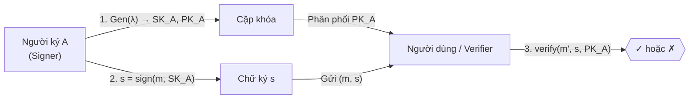
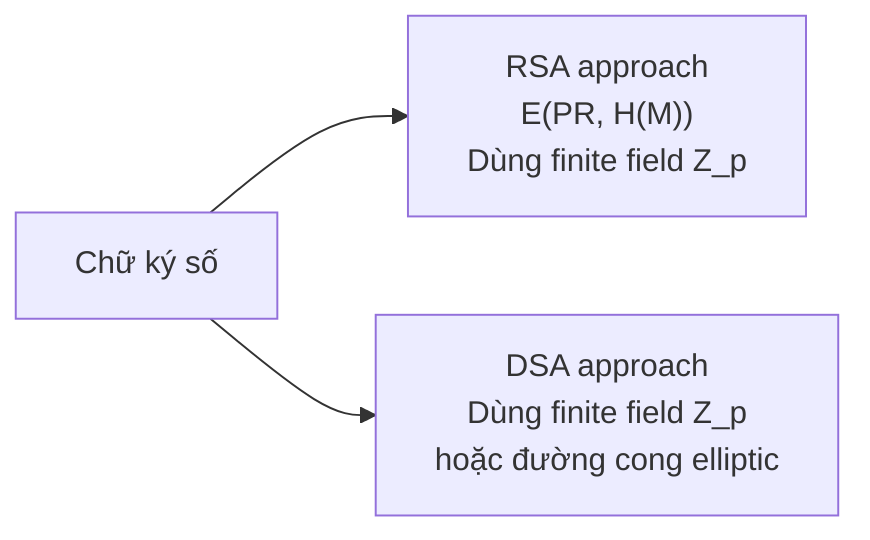
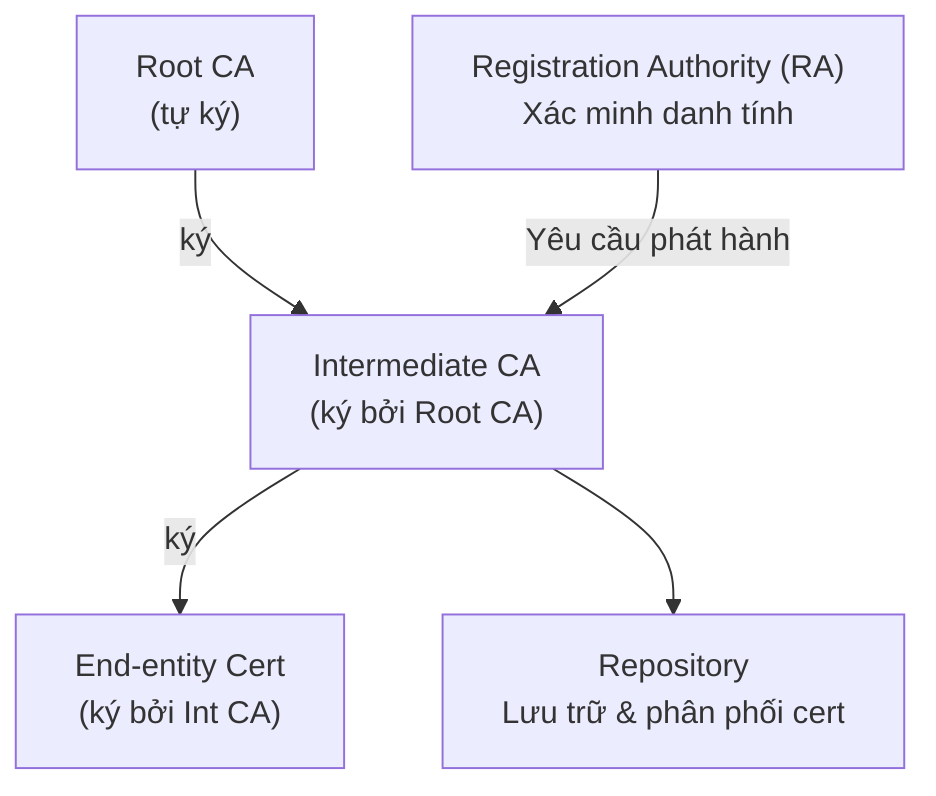
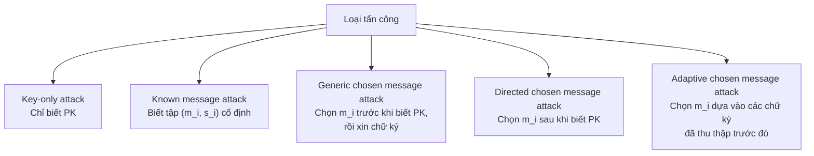

# Bài 12: Chữ ký số (Digital Signature)

---

## 1. Động lực (Motivations)

### Vấn đề với MAC/HMAC

Giả sử Alice muốn gửi tin nhắn cho Bob và đảm bảo tính xác thực + toàn vẹn. Với MAC/HMAC, họ cần chia sẻ trước một khóa bí mật $K$:

```
Alice                              Bob
  |  ── (M, tag = HMAC(K, M)) ──>   |
  |                                 |  kiểm tra HMAC(K, M') == tag?
```

**Hạn chế:** Nếu Alice và Bob **không thể thỏa thuận khóa phiên** $K$ trước (ví dụ: không có kênh bảo mật, hoặc Bob là người lạ), thì MAC không dùng được.

Ngoài ra, MAC/HMAC **không có tính chối bỏ** — vì cả Alice lẫn Bob đều biết $K$, Bob không thể chứng minh với bên thứ ba rằng chữ ký đến từ Alice.

### Giải pháp: Chữ ký số (Digital Signature)

```
Alice (có cặp khóa PK_A, SK_A)           Bob, Carol, Dave, ...
  |                                              |
  |  ── (M, sig = sign(SK_A, M)) ──────────>     |
  |                                              |  verify(PK_A, M', sig)?
```

- Alice ký bằng **khóa bí mật** $SK_A$ (chỉ mình Alice biết).
- Bất kỳ ai có **khóa công khai** $PK_A$ đều có thể xác minh.
- Không cần chia sẻ bí mật trước → phù hợp với môi trường mở.

---

## 2. Tính chất của chữ ký số

!!! info "Ba tính chất bắt buộc"
    1. **Xác thực người ký (Authentication):** Chứng minh được chữ ký đến từ đúng người ký.
    2. **Toàn vẹn nội dung (Integrity):** Phát hiện bất kỳ thay đổi nào trong nội dung sau khi ký.
    3. **Không thể chối bỏ (Non-repudiation):** Bên thứ ba có thể xác minh độc lập để giải quyết tranh chấp — người ký không thể phủ nhận chữ ký của mình.

---

## 3. Quy trình tổng quát của chữ ký số



**Bốn bước cụ thể:**

| Bước | Mô tả |
|------|--------|
| **Setup** | Chọn tham số hệ thống: hàm băm $H$, nhóm toán học, … |
| **KeyGen** | Sinh cặp khóa $(SK_A, PK_A)$ từ tham số bảo mật $\lambda$ |
| **Sign** | Tính $s = \text{sign}(m, SK_A)$ → thực tế là ký trên $H(m)$ |
| **Verify** | Kiểm tra $\text{verify}(m', s, PK_A)$ → trả về `true/false` |

!!! warning "Tại sao ký trên $H(m)$ thay vì $m$ trực tiếp?"
    - Thông điệp $m$ có thể rất dài, nhưng hàm băm cho ra đầu ra có độ dài cố định (ví dụ 256-bit với SHA-256).
    - Ký trực tiếp trên $m$ trong các sơ đồ như RSA đòi hỏi $m$ phải nhỏ hơn modulus $n$.
    - Băm trước giúp chuẩn hóa đầu vào và tăng bảo mật (tránh một số tấn công algebraic).

---

## 4. ElGamal Digital Signature

### 4.1 Tham số hệ thống

- $p$: số nguyên tố $\lambda$-bit
- $g$: generator của nhóm nhân $\mathbb{Z}_p^*$
- $H: \{0,1\}^* \to \{0,1\}^L$ với $L \geq \lambda$

**Public parameters:** $(p, g, H)$

### 4.2 Sinh khóa

- **Khóa bí mật:** $x \xleftarrow{R} \mathbb{Z}_p^*$
- **Khóa công khai:** $y = g^x \mod p$

### 4.3 Ký (Signing)

Để ký thông điệp $m$:

1. Chọn ngẫu nhiên $k \xleftarrow{R} \mathbb{Z}_p^*$ (khóa tạm, dùng một lần)
2. Tính $r = g^k \mod p$
3. Tính $s = (H(m) - x \cdot r) \cdot k^{-1} \mod (p-1)$
4. Chữ ký: $(r, s)$, gửi $(m, (r, s))$

### 4.4 Xác minh (Verifying)

Nhận $(m', r, s)$:

1. Kiểm tra $0 < r < p$ và $0 < s < p-1$
2. Kiểm tra:

$$y^r \cdot r^s \mod p \stackrel{?}{=} g^{H(m')}$$

**Chứng minh tính đúng đắn (correctness):**

$$y^r \cdot r^s = g^{xr} \cdot g^{ks} = g^{xr + k \cdot (H(m) - xr) \cdot k^{-1}} = g^{H(m)}$$

Nếu $m' = m$ thì $g^{H(m)} = g^{H(m')}$ → xác minh thành công.

!!! danger "Lưu ý bảo mật ElGamal"
    $k$ phải **ngẫu nhiên và duy nhất** cho mỗi lần ký. Nếu dùng lại $k$ cho hai thông điệp khác nhau, kẻ tấn công có thể tính được khóa bí mật $x$ từ hai phương trình $s_1, s_2$.

---

## 5. Schnorr Digital Signature

### 5.1 Tham số hệ thống

- Hai số nguyên tố $p, q$ sao cho $p = qr + 1$ (tức $q \mid p-1$)
- $g$: generator của nhóm con bậc $q$ trong $\mathbb{Z}_p^*$
- $H: \{0,1\}^* \to \mathbb{Z}_q$

**Public parameters:** $(p, q, g, H)$

### 5.2 Sinh khóa

- **Khóa bí mật:** $x \xleftarrow{R} \mathbb{Z}_p^*$
- **Khóa công khai:** $y = g^x \mod p$

### 5.3 Ký

1. Chọn ngẫu nhiên $k \xleftarrow{R} \mathbb{Z}_p^*$
2. Tính $r = g^k$
3. Tính $e = H(r \| m) \in \mathbb{Z}_q$ ← đây là "challenge"
4. Tính $s = k - x \cdot e \mod q$
5. Chữ ký: $(s, e)$

!!! tip "Điểm khác biệt so với ElGamal"
    Schnorr **không gửi $r$ trực tiếp** trong chữ ký, thay vào đó gửi $e = H(r \| m)$. Điều này giúp chữ ký **ngắn hơn** và là nền tảng cho nhiều sơ đồ hiện đại (EdDSA, MuSig, …).

### 5.4 Xác minh

Nhận $(m', s, e)$:

1. Tính $r_v = g^s \cdot y^e \mod p$

$$= g^{k - xe} \cdot g^{xe} = g^k = r$$

2. Kiểm tra: $e \stackrel{?}{=} H(r_v \| m')$

---

## 6. NIST Digital Signature Schemes

### 6.1 Lịch sử chuẩn hóa

| Phiên bản | Năm | Ghi chú |
|-----------|-----|---------|
| FIPS 186 | 1994 | Phiên bản đầu tiên, giới thiệu DSA |
| FIPS 186-4 | 2013 | Thêm ECDSA, RSA |
| FIPS 186-5 | 2023 | Cập nhật mới nhất |
| FIPS 203, 204 | 2024 | Post-quantum (ML-KEM, ML-DSA) |

### 6.2 Hai hướng tiếp cận



---

## 7. RSASSA Signatures

### 7.1 Nguyên lý cơ bản

- **Public key:** $(n, e)$; **Private key:** $d$
- **Ký:** $s = H(m)^d \mod n$
- **Xác minh:** $s^e \mod n = H(m)^{de} \mod n = H(m) \stackrel{?}{=} H(m')$

!!! warning "Tại sao phải padding?"
    Nếu ký trực tiếp trên $H(m)$ mà không padding:
    
    - **Tấn công nhân:** Nếu attacker có chữ ký của $m_1$ và $m_2$, họ có thể tính chữ ký của $m_1 \cdot m_2$ do tính nhân của RSA.
    - **Tấn công giả mạo tầm thường:** Ví dụ $s = 0$ hoặc $s = 1$ luôn xác minh được với $m$ tương ứng.
    - Padding đưa thêm cấu trúc và entropy vào, phá vỡ tính nhân.

### 7.2 RSASSA-PKCS1-v1_5

Định dạng bản tin được mã hóa (Encoded Message - EM):

```
EM = 0x00 || 0x01 || 0xFF...0xFF || 0x00 || DigestInfo || H(M)
```

Trong đó `DigestInfo` xác định thuật toán băm:

| Hàm băm | DigestInfo prefix (hex) |
|---------|------------------------|
| SHA-1 | `30 21 30 09 06 05 2b 0e 03 02 1a 05 00 04 14` |
| SHA-256 | `30 31 30 0d 06 09 60 86 48 01 65 03 04 02 01 05 00 04 20` |
| SHA-384 | `30 41 30 0d 06 09 60 86 48 01 65 03 04 02 02 05 00 04 30` |
| SHA-512 | `30 51 30 0d 06 09 60 86 48 01 65 03 04 02 03 05 00 04 40` |

**Quy trình:**
```
M ──hash──> H(M) ──prepend DigestInfo──> EM ──RSA encrypt──> s (signature)
```

!!! note "PKCS#1 v1.5 — Vấn đề bảo mật"
    Padding này là **deterministic** (cùng $m$ luôn cho cùng $s$). Điều này mở ra một số tấn công lý thuyết (Bleichenbacher 1998 trên RSA encryption). Vì vậy NIST khuyến nghị dùng PSS cho các ứng dụng mới.

### 7.3 RSASSA-PSS (Probabilistic Signature Scheme)

PSS dùng **salt ngẫu nhiên** để đảm bảo tính probabilistic (cùng $m$ ký hai lần → chữ ký khác nhau).

**Quy trình encoding (PSS-Encode):**

```
M ──hash──> mHash
mHash + salt ──hash──> H' (8 bytes 0x00 || mHash || salt)

DB = padding2 || salt
dbMask = MGF(H')       ← MGF = Mask Generation Function (cũng dùng hash)
maskedDB = DB XOR dbMask

EM = maskedDB || H' || 0xBC
```

**Quy trình ký:**
```
EM ──RSA encrypt với SK──> s
```

**Quy trình xác minh:**
```
s ──RSA decrypt với PK──> EM ──PSS-Decode──> kiểm tra H(M*) == mHash
```

!!! tip "MGF (Mask Generation Function)"
    MGF là hàm dựa trên hash, hoạt động như một PRF để tạo mask có độ dài tùy ý từ một seed ngắn. Tương tự như một XOF (extendable output function).

---

## 8. DSA (Digital Signature Algorithm)

### 8.1 Tham số hệ thống

| Tham số | Mô tả |
|---------|-------|
| $p$ | Số nguyên tố $L$-bit, $2^{L-1} < p < 2^L$ |
| $q$ | Ước số nguyên tố của $p-1$, $N$-bit |
| $g$ | Generator của nhóm con bậc $q$ trong $GF(p) = \mathbb{Z}_p$ |

**Kích thước khóa được NIST chuẩn hóa:**

| $L$ (bit) | $N$ (bit) | Mức bảo mật |
|-----------|-----------|-------------|
| 1024 | 160 | 80-bit (đã lỗi thời) |
| 2048 | 224 | 112-bit |
| 2048 | 256 | 128-bit |
| 3072 | 256 | 128-bit+ |

### 8.2 Sinh khóa

- **Khóa bí mật:** $x \xleftarrow{R} [1, q-1]$
- **Khóa công khai:** $y = g^x \mod p$

### 8.3 Ký

1. Chọn ngẫu nhiên $k \xleftarrow{R} [1, q-1]$ (mỗi thông điệp một $k$ khác nhau!)
2. Tính $r = (g^k \mod p) \mod q$
3. Tính $s = k^{-1}(H(m) + x \cdot r) \mod q$
4. Chữ ký: $(r, s)$

### 8.4 Xác minh

Nhận $(m', r, s)$:

$$w = s^{-1} \mod q$$

$$u_1 = H(m') \cdot w \mod q$$

$$u_2 = r \cdot w \mod q$$

$$v = (g^{u_1} \cdot y^{u_2} \mod p) \mod q$$

Kiểm tra: $v \stackrel{?}{=} r$

**Chứng minh correctness:** Nếu $m' = m$:

$$g^{u_1} \cdot y^{u_2} = g^{u_1 + x \cdot u_2} = g^{k(H(m)+xr)(H(m)+xr)^{-1}} = g^k$$

Do đó $(g^k \mod p) \mod q = r$ ✓

!!! danger "Lỗi nghiêm trọng — Sony PS3 (2010)"
    Sony đã **dùng cùng một $k$ cố định** cho tất cả chữ ký ECDSA trên PS3. Từ hai phương trình ký với cùng $k$, hacker tính được private key và crack toàn bộ hệ thống bảo mật của PS3.
    
    **Bài học:** $k$ phải là CSPRNG, tuyệt đối không dùng lại.

---

## 9. ECDSA (Elliptic Curve DSA)

### 9.1 Tham số hệ thống

| Tham số | Ý nghĩa |
|---------|---------|
| $p$ (hoặc $f(x)$) | Số nguyên tố xác định trường |
| $a, b \in \mathbb{Z}_p$ | Hệ số đường cong: $y^2 = x^3 + ax + b$ |
| $G \in E(\mathbb{Z}_p)$ | Điểm sinh (base point) |
| $n = \text{ord}(G)$ | Bậc của điểm sinh |
| $h = \lvert E(\mathbb{Z}_p) \rvert / n$ | Cofactor |
| $H$ | Hàm băm với output $l = l(n)$ bit |

**Bảng mức bảo mật theo FIPS 186-5:**

| Độ dài $n$ (bit) | Cofactor tối đa | Mức bảo mật |
|-----------------|----------------|-------------|
| 224–255 | $2^{14}$ | ~112 bit |
| 256–383 | $2^{16}$ | ~128 bit |
| 384–511 | $2^{32}$ | ~192 bit |
| $\geq 512$ | $2^{32}$ | ~256 bit |

### 9.2 Sinh khóa

- **Khóa bí mật:** $d \xleftarrow{R} [1, n-1]$
- **Khóa công khai:** $Q = d \cdot G \in E(\mathbb{Z}_p)$ (phép nhân vô hướng trên đường cong)

### 9.3 Ký

1. Chọn $k \xleftarrow{R} [1, n-1]$
2. Tính $R = k \cdot G = (x_1, y_1)$, đặt $r = x_1 \mod n$
3. Tính $s = k^{-1}(H(m) + d \cdot r) \mod n$
4. Chữ ký: $(r, s)$

!!! note "So sánh DSA vs ECDSA"
    Cả hai có cấu trúc ký **hoàn toàn tương tự**, điểm khác biệt:
    
    - DSA làm việc trong nhóm nhân $\mathbb{Z}_p^*$ → cần $p$ 2048-bit để bảo mật 128-bit
    - ECDSA làm việc trên đường cong elliptic → chỉ cần $n$ 256-bit để đạt cùng mức bảo mật
    - **ECDSA hiệu quả hơn nhiều** về kích thước khóa và tốc độ tính toán

### 9.4 Xác minh

Nhận $(m', r, s)$:

$$w = s^{-1} \mod n$$

$$u_1 = H(m') \cdot w \mod n, \quad u_2 = r \cdot w \mod n$$

$$X = u_1 G + u_2 Q = (x_1', y_1')$$

$$v_x = x_1' \mod n \stackrel{?}{=} r$$

---

## 10. X.509 Digital Certificates

### 10.1 Vấn đề phân phối khóa công khai

!!! question "Câu hỏi: Làm sao biết $PK_A$ thực sự thuộc về Alice?"

    Nếu Bob chỉ nhận $PK_A$ qua mạng, một kẻ tấn công có thể gửi $PK_{Eve}$ và giả mạo là Alice (Man-in-the-Middle). Ta cần một cơ chế **ràng buộc danh tính với khóa công khai** một cách đáng tin cậy.

**Giải pháp:** Chứng chỉ số X.509

$$\text{Certificate} = (M = \{\text{user}, \text{publickey}, \ldots\},\ s = \text{sign}(SK_{CA}, M))$$

Trong đó $CA$ (Certificate Authority) là bên thứ ba đáng tin cậy.

### 10.2 Cấu trúc chứng chỉ X.509

| Trường | Nội dung |
|--------|---------|
| **Version** | Phiên bản định dạng (v1, v2, v3) |
| **Serial Number** | Số định danh duy nhất trong phạm vi CA |
| **Algorithm** | Tên hàm băm + thuật toán chữ ký (vd: SHA256withRSA) |
| **Issuer** | Tên CA phát hành |
| **Validity Period** | Thời gian hiệu lực (notBefore, notAfter) |
| **Subject** | Tên chủ sở hữu chứng chỉ |
| **Public Key** | Khóa công khai + thông tin tham số |
| **Extensions** | Thông tin bổ sung (chỉ có ở v3): Key Usage, SAN, … |
| **Signature** | Chữ ký của CA = $\text{sign}(SK_{CA}, \text{tất cả trên})$ |

### 10.3 Kiểm tra chứng chỉ thực tế với OpenSSL

```bash
# Xem chứng chỉ server của facebook.com
echo | openssl s_client -servername www.facebook.com \
    -connect www.facebook.com:443 2>/dev/null \
    | openssl x509 -text

# Tải về file .cer
echo | openssl s_client -servername www.facebook.com \
    -connect www.facebook.com:443 2>/dev/null \
    | openssl x509 -out facebook.cer

# Đọc file cert đã tải
openssl x509 -in facebook.cer -inform pem -text -noout

# Xem toàn bộ chuỗi chứng chỉ (chain)
openssl s_client -connect facebook.com:443 -showcerts
```

### 10.4 PKI (Public Key Infrastructure)

PKI là hệ thống quản lý toàn bộ vòng đời của chứng chỉ số:



**Chức năng của PKI:**
- Xác định tính hợp lệ của người dùng
- Phát hành / gia hạn / thu hồi chứng chỉ
- Lưu trữ và quản lý chứng chỉ
- Ngăn chặn người ký chối bỏ chữ ký (non-repudiation)
- Hỗ trợ cross-certification giữa các PKI khác nhau

### 10.5 PKIX (X.509 PKI theo IETF RFC 5280)

Bốn thành phần cơ bản:

| Thành phần | Vai trò |
|-----------|---------|
| **End Entity** | Người dùng cuối, người xác minh |
| **CA (Certificate Authority)** | Phát hành và thu hồi chứng chỉ |
| **RA (Registration Authority)** | Xác minh danh tính chủ sở hữu |
| **Repository** | Lưu trữ và phân phối chứng chỉ |

**Các giao dịch được quản lý:**
- Registration, Initialization
- Certificate Issuing & Publication
- Key Recovery, Key Generation
- Certificate Revocation
- Cross-certification

---

## 11. Tấn công vào chữ ký số

### 11.1 Phân loại theo khả năng của kẻ tấn công



Từ trên xuống dưới: **năng lực kẻ tấn công tăng dần**. Một sơ đồ an toàn phải chống được **adaptive chosen message attack** (mô hình EUF-CMA).

### 11.2 Phân loại theo mức độ giả mạo

| Loại giả mạo | Mô tả |
|-------------|-------|
| **Total break** | Tìm ra được $SK$ → ký được mọi thứ |
| **Universal forgery** | Tìm được thuật toán ký tương đương, không cần $SK$ |
| **Selective forgery** | Giả mạo chữ ký cho một thông điệp **cụ thể** do người ký chọn |
| **Existential forgery** | Giả mạo chữ ký cho ít nhất một thông điệp **bất kỳ** (không kiểm soát nội dung) |

!!! tip "Ngưỡng bảo mật thực tế"
    Hầu hết các sơ đồ chữ ký hiện đại được chứng minh **EUF-CMA secure** = chống được existential forgery dưới adaptive chosen message attack. Đây là định nghĩa bảo mật chuẩn.

---

## 12. Yêu cầu của chữ ký số

Một sơ đồ chữ ký số phải thỏa mãn đồng thời:

1. Chữ ký là một **bit pattern phụ thuộc vào thông điệp** được ký.
2. Chữ ký sử dụng **thông tin duy nhất của người ký** (khóa bí mật) để ngăn giả mạo và chối bỏ.
3. **Dễ tạo chữ ký** — người có $SK$ ký nhanh.
4. **Dễ xác minh** — người có $PK$ kiểm tra nhanh.
5. **Không thể giả mạo về mặt tính toán** — không thể tạo chữ ký hợp lệ cho thông điệp mới, hay tạo chữ ký giả cho thông điệp cho trước.
6. **Có thể lưu trữ** — chữ ký có kích thước thực tế.

---

## 13. Direct Digital Signature

> Direct Digital Signature = sơ đồ chữ ký số **chỉ có hai bên** tham gia (Alice và Bob), không có bên thứ ba online.

**Giả định:** Bob biết $PK_A$ của Alice trước.

**Bảo mật:** Để thêm tính bảo mật, toàn bộ $(M, s)$ được mã hóa bằng khóa phiên chung.

!!! warning "Điểm yếu — vấn đề chối bỏ khóa"
    Alice có thể sau đó tuyên bố: *"Khóa bí mật $SK_A$ của tôi đã bị đánh cắp, chữ ký đó không phải của tôi!"*
    
    **Biện pháp đối phó:**
    - Yêu cầu **timestamp** trong mỗi thông điệp đã ký
    - Báo cáo khóa bị lộ ngay lập tức cho **CA/CRL** (Certificate Revocation List)
    - Dùng **PKI + chứng chỉ có thời hạn** để giới hạn cửa sổ tấn công

---

## 14. Tóm tắt so sánh các sơ đồ

| Sơ đồ | Nền tảng toán học | Kích thước chữ ký | Ghi chú |
|-------|------------------|--------------------|---------|
| **ElGamal** | DLP trên $\mathbb{Z}_p^*$ | $2 \times \lambda$ bit | Nền tảng cho DSA |
| **Schnorr** | DLP trên nhóm con | $\lambda + N$ bit | Nền tảng cho EdDSA |
| **RSASSA-PKCS** | RSA (IFP) | $\lambda$ bit | Deterministic, có rủi ro |
| **RSASSA-PSS** | RSA (IFP) | $\lambda$ bit | Probabilistic, an toàn hơn |
| **DSA** | DLP trên $\mathbb{Z}_p^*$ | $2N$ bit | NIST chuẩn, $k$ phải ngẫu nhiên |
| **ECDSA** | ECDLP | $2 \times l(n)$ bit | Hiệu quả nhất, phổ biến nhất hiện tại |
