# Bài 13: Cryptography Applications (Phần 1)

---

## 1. Mục tiêu bảo mật (Security Goals)

Trước khi đi vào các giao thức, cần hiểu rõ các mục tiêu bảo mật mà hệ thống cần đạt được:

| Mục tiêu | Ý nghĩa |
|---|---|
| **Confidentiality** | Bảo mật dữ liệu, chỉ người được phép mới đọc được |
| **Authentication** | Xác minh danh tính người dùng, thiết bị, tiến trình |
| **Integrity** | Dữ liệu không bị thay đổi trên đường truyền |
| **Non-repudiation** | Không thể chối bỏ hành động đã thực hiện |
| **Availability** | Hệ thống luôn sẵn sàng phục vụ |
| **Privacy** | Bảo vệ thông tin cá nhân |

Mỗi mục tiêu được đảm bảo bởi các cơ chế mật mã khác nhau:

- **Cipher systems**: DES, AES (đối xứng), RSA, ECC, CRYSTALS-KYBER (bất đối xứng)
- **Hash functions**: SHA-256, SHA3-512,...
- **MAC** (Message Authentication Code)
- **Chữ ký số / Chứng chỉ số**
- **Kiểm soát truy cập**: RBAC, ABAC, PBAC

---

## 2. Giao thức bảo mật mạng – Tổng quan

Một giao thức bảo mật mạng hoàn chỉnh phải giải quyết **ba vấn đề cốt lõi**:

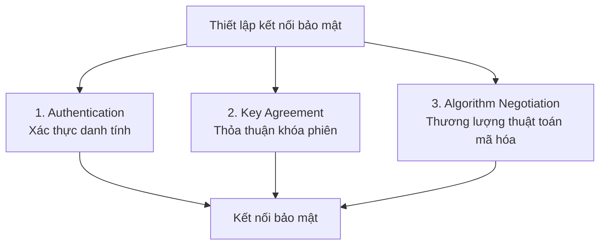

---

## 3. Xác thực (Authentication)

### 3.1 Định nghĩa

!!! info "Định nghĩa Authentication (NIST)"
    Authentication là quá trình **xác minh danh tính** của một người dùng, tiến trình hoặc thiết bị, thường là điều kiện tiên quyết để cho phép truy cập vào tài nguyên của hệ thống thông tin.

Quá trình xác thực gồm hai bước:

1. **Identification**: Cung cấp thông tin định danh (tên, ID,...)
2. **Verification**: Hệ thống kiểm tra xem thông tin đó có hợp lệ không

> **Authorization** (Ủy quyền) khác với Authentication: là quyền/phép mà thực thể được cấp để truy cập tài nguyên *sau khi* đã được xác thực.

---

### 3.2 Các yếu tố xác thực (Authentication Factors)

!!! note "Ba nhóm yếu tố xác thực"

    === "Knowledge – Cái bạn biết"
        - Mật khẩu (Password)
        - Mã PIN
        - Câu hỏi bí mật

    === "Possession – Cái bạn có"
        - Smartcard
        - Thẻ khóa điện tử
        - Chứng chỉ số (Digital Certificate)
        - Thiết bị của người dùng

    === "Inherence – Cái bạn là"
        - Vân tay (Fingerprint)
        - Võng mạc (Retina)
        - Khuôn mặt (Face)
        - Giọng nói (Voice)
        - PUFs (Physical Unclonable Functions)

---

### 3.3 Xác thực bằng chứng chỉ số (Certificate-based Authentication)

Đây là phương pháp phổ biến nhất để xác thực **server/tài nguyên**. Ý tưởng cốt lõi:

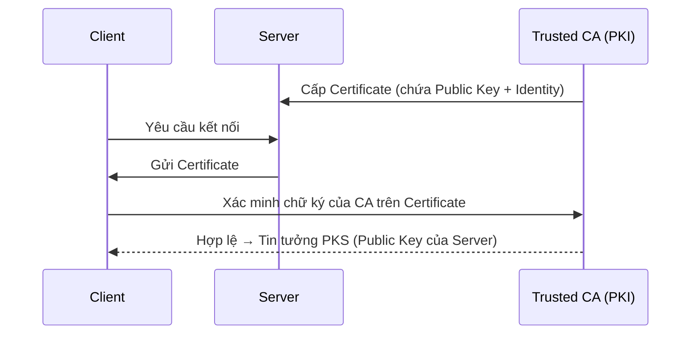

**Chứng chỉ số** kết hợp:
- **Public key** của server
- **Identity** của server (IP, tên miền,...)
- **Chữ ký của CA** để xác nhận tính hợp lệ

```bash
# Kiểm tra certificate của một website thực tế
openssl s_client -connect facebook.com:443 -showcerts
```

??? warning "Hạn chế của Certificate-based Authentication"
    - Cần hạ tầng PKI (tốn kém, phức tạp)
    - Vấn đề **Revocation** (thu hồi chứng chỉ): Khi chứng chỉ bị lộ, cần cơ chế CRL/OCSP để vô hiệu hóa
    - **Network Payload** tăng do phải truyền certificate
    - **Trusted CA**: Ai tin tưởng CA nào? Vấn đề Semi-Trusted và Zero-Trust
    - Nếu CA bị tấn công → toàn bộ hệ thống tin tưởng bị ảnh hưởng

---

### 3.4 Xác thực bằng mật khẩu (Password-based Authentication)

**Quy trình đăng nhập cơ bản:**

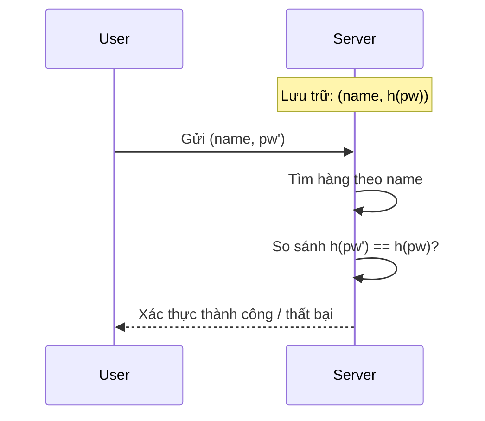

!!! danger "Các tấn công vào mật khẩu"

    **1. Dictionary Attack (Tấn công từ điển)**

    - Con người có xu hướng chọn mật khẩu dễ nhớ → không gian mật khẩu nhỏ
    - Kẻ tấn công tạo danh sách các mật khẩu phổ biến, hash tất cả, rồi so sánh với bảng lưu trữ
    - **Offline Dictionary Attack**: Kẻ tấn công lấy được file `/etc/shadow`, tấn công offline không giới hạn tốc độ

    **2. Verification Table Attack**

    - Nếu server lưu `h(pw)` không có salt → kẻ tấn công tạo **Rainbow Table** (bảng tra cứu hash → plaintext)
    - **Giải pháp**: Sử dụng **salt** (giá trị ngẫu nhiên) trước khi hash: lưu `h(pw || salt)` kèm `salt`

---

### 3.5 Xác thực đa yếu tố (Multi-Factor Authentication – MFA)

Kết hợp nhiều yếu tố để tăng độ bảo mật:

```
Mật khẩu (Knowledge) + Smartcard/OTP (Possession) + Vân tay (Inherence)
```

| Yếu tố | Lưu trữ | Xác minh |
|---|---|---|
| **Biometric** | Cần bộ nhớ bảo mật | So sánh 1-1 hay 1-nhiều? |
| **Smartcard** | Lưu trữ bảo mật trên thẻ | Tự thực hiện thuật toán xác minh |
| **TPM/TEE/Secure Enclave** | Lưu trữ phần cứng bảo vệ | Thực hiện thuật toán bảo mật |

!!! question "Câu hỏi: Tại sao cần MFA?"
    Vì không yếu tố nào là hoàn hảo:
    - Mật khẩu có thể bị đánh cắp (phishing, keylogger)
    - Smartcard có thể bị mất
    - Biometric có thể bị giả mạo (deepfake, spoofing)
    
    Khi kết hợp nhiều yếu tố, kẻ tấn công phải đồng thời vượt qua tất cả → khó hơn rất nhiều.

---

## 4. Thỏa thuận khóa phiên (Session Key Agreement)

### 4.1 Tại sao cần khóa phiên?

Sau khi xác thực server (qua certificate), client cần thiết lập một **khóa phiên bí mật** (`ssk` – session secret key) để mã hóa dữ liệu trao đổi. Khóa này:

- Chỉ tồn tại trong một phiên làm việc
- Được tạo mới mỗi lần kết nối → **Perfect Forward Secrecy (PFS)**
- Thường dùng **mã hóa đối xứng** (AES) vì nhanh hơn

---

### 4.2 Diffie-Hellman trên ECC (ECDH)

Đây là phương pháp phổ biến nhất hiện nay:

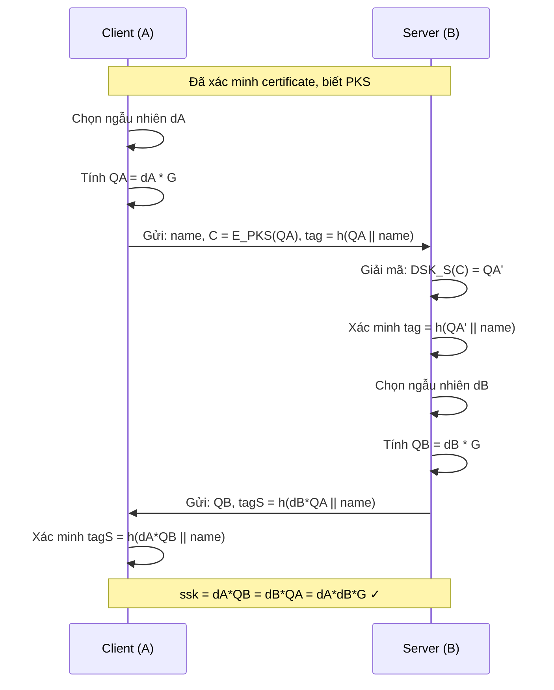

!!! success "Tính đúng đắn của ECDH"
    ```
    Client tính: dA * QB = dA * (dB * G) = dA*dB*G
    Server tính: dB * QA = dB * (dA * G) = dA*dB*G
    → Cả hai đều có chung ssk = dA*dB*G
    ```

**Sau khi có `ssk`**, mọi dữ liệu được mã hóa đối xứng:

```
C = E_AES(ssk, name || pw)   ← Client gửi
D_AES(ssk, C) = name || pw   ← Server giải mã
```

---

### 4.3 Xác thực trong môi trường WiFi (Pre-shared Secret)

Khi không có chứng chỉ (ví dụ: WiFi gia đình), hai bên sử dụng **pre-shared secret** (mật khẩu WiFi):

```
WEP → WPA → WPA2 → WPA3
```

Các giao thức này xây dựng cơ chế xác thực và thỏa thuận khóa dựa trên mật khẩu chung mà không cần PKI.

---

## 5. Giao thức bảo mật đa server (Multi-server AKA)

### 5.1 Mục tiêu

Trong môi trường thực tế, người dùng cần kết nối với **nhiều server khác nhau** (D₁, D₂,..., Dₖ). Thay vì đăng ký riêng với từng server, cần:

- **Đăng ký một lần** (One-time registration)
- Đảm bảo: **Xác thực lẫn nhau, Thỏa thuận khóa, Không thể truy vết (Untraceability), Thu hồi (Revocation), Hiệu quả**

### 5.2 Các biến thể giao thức

??? info "Certificateless AKA – Biometric Multi-server (2016)"
    - Các yếu tố: Mật khẩu + Smartcard + Sinh trắc học
    - Bảo mật dựa trên: Bài toán DLP (`x / y = gˣ`), Hash Function, Random Oracle Model
    - Đặc điểm: **Untraceable** – server không thể liên kết các phiên của cùng một người dùng

??? info "Three-party AKA – ECC-based (2018)"
    - Kiến trúc: Người dùng ↔ Trusted Server ↔ Server dịch vụ
    - Bảo mật dựa trên: Bài toán ECDLP (`d / Q = d*G`)
    - Chứng minh bảo mật: **ROR model (Real-or-Random)**

??? info "SIP Protocol – Multimedia Networks (2018)"
    - Ứng dụng cho mạng đa phương tiện dựa trên IP (VoIP, video conferencing)
    - Session Initiation Protocol với xác thực sinh trắc học

??? info "Satellite Mobile Networks (2019)"
    - Ứng dụng cho mạng vệ tinh di động
    - Thách thức: độ trễ cao, tài nguyên hạn chế

---

## 6. Triển khai giao thức bảo mật theo tầng mạng

### 6.1 Vị trí triển khai

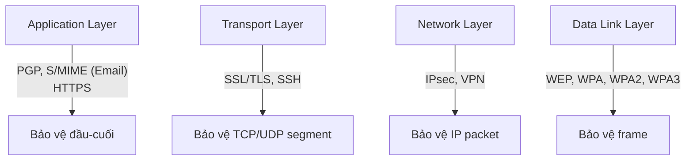

### 6.2 So sánh ưu/nhược điểm

| Tầng | Ưu điểm | Nhược điểm |
|---|---|---|
| **Application** | Bảo vệ đầu-cuối; node trung gian không cần giải mã | Kẻ tấn công vẫn phân tích được header; phải sửa ứng dụng |
| **Transport** | Không cần sửa ứng dụng; bảo vệ TCP payload | Kẻ tấn công phân tích được IP header |
| **Network** | Không cần sửa ứng dụng; Transport mode hoặc Tunnel mode | Phức tạp hơn; Tunnel mode cần gateway |
| **Data Link** | Kẻ tấn công khó phân tích traffic | Chỉ bảo vệ trên một đường link vật lý |

---

## 7. Giao thức SSH

### 7.1 Kiến trúc phân lớp

```
┌─────────────────────────────┐
│      SSH Connection         │  ← Quản lý nhiều channel (shell, SFTP,...)
├─────────────────────────────┤
│   SSH User Authentication   │  ← Xác thực user (password hoặc PKC)
├─────────────────────────────┤
│      SSH Transport          │  ← Xác thực server, trao đổi khóa, mã hóa
├─────────────────────────────┤
│           TCP               │
├─────────────────────────────┤
│           IP                │
└─────────────────────────────┘
```

### 7.2 Luồng hoạt động SSH

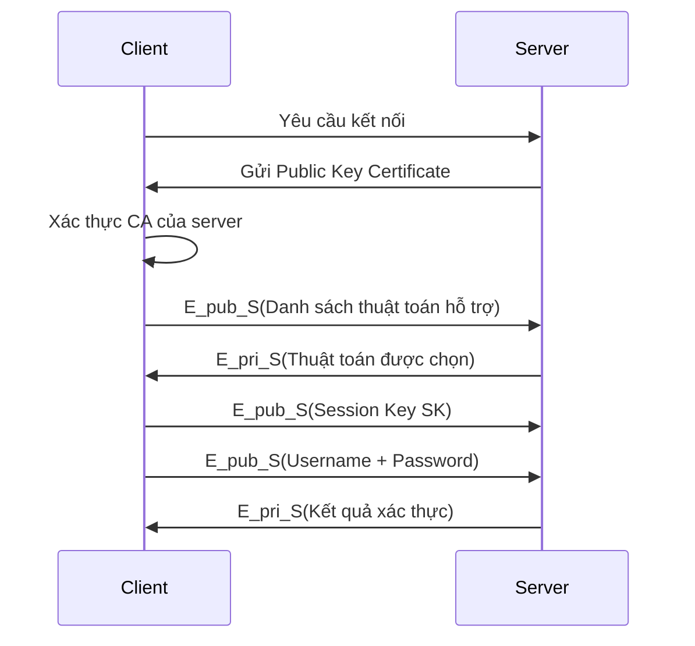

!!! question "Tại sao SSH quan trọng?"
    SSH giải quyết vấn đề quản trị máy chủ từ xa một cách bảo mật. Trước khi có SSH, Telnet truyền mọi thứ (kể cả mật khẩu) dưới dạng plaintext — bất kỳ ai nghe lén trên mạng đều đọc được. SSH mã hóa toàn bộ phiên làm việc.

---

## 8. Giao thức SSL/TLS

### 8.1 Lịch sử phát triển

| Phiên bản | Năm | Trạng thái |
|---|---|---|
| SSL 1.0 | Chưa phát hành | Không dùng |
| SSL 2.0 | 1995 | Deprecated 2011 (RFC 6176) |
| SSL 3.0 | 1996 | Deprecated 2015 (RFC 7568) |
| TLS 1.0 | 1999 | Deprecated 2021 (RFC 8996) |
| TLS 1.1 | 2006 | Deprecated 2021 (RFC 8996) |
| **TLS 1.2** | **2008** | **Vẫn được dùng** |
| **TLS 1.3** | **2018** | **Khuyến nghị hiện tại** |

### 8.2 Cấu trúc TLS

```
┌──────────────────────────────────────────────────┐
│                    HTTP (HTTPS)                  │
├──────────────┬──────────────────┬────────────────┤
│ SSL Handshake│ Change Cipher    │   SSL Alert    │
│   Protocol   │ Spec Protocol    │   Protocol     │
├──────────────┴──────────────────┴────────────────┤
│              SSL Record Protocol                 │
├──────────────────────────────────────────────────┤
│                      TCP                        │
└──────────────────────────────────────────────────┘
```

### 8.3 TLS 1.2 Handshake

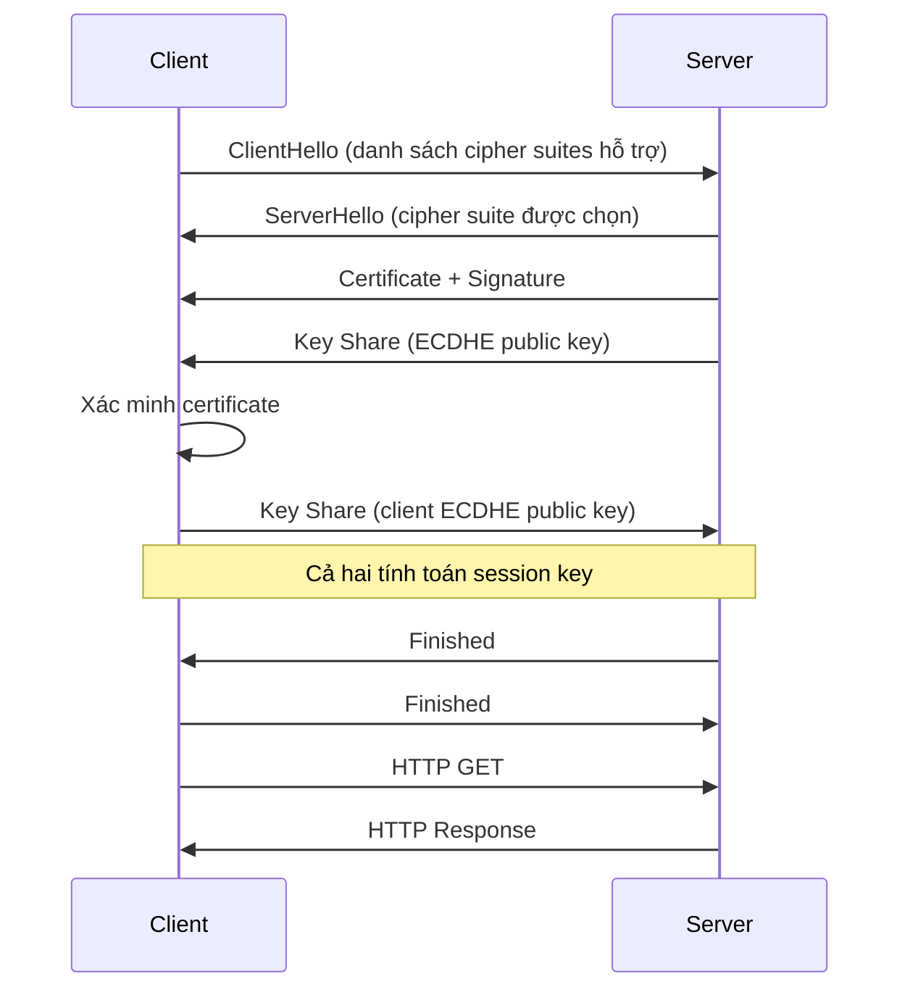

**Ba thành phần chính của TLS 1.2:**
1. **Authentication**: Digital certificate (PKI)
2. **Key Agreement**: ECDH
3. **Algorithm Negotiation**: Thỏa thuận cipher suite (AES-128-CBC, SHA256, v.v.)

### 8.4 TLS 1.3 – Cải tiến so với 1.2

TLS 1.3 (RFC 8446) giảm số lần RTT (Round-Trip Time):

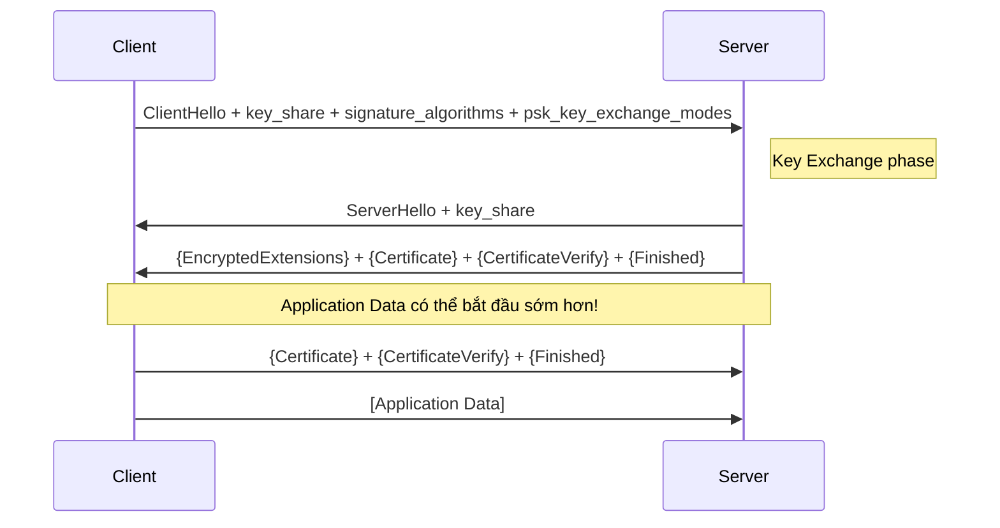

!!! success "TLS 1.3 cải tiến gì so với 1.2?"
    - **1-RTT** thay vì 2-RTT cho full handshake
    - **0-RTT** (Early Data) cho phép gửi data ngay trong handshake (với PSK)
    - Loại bỏ các thuật toán yếu: RSA key exchange, RC4, DES, SHA-1
    - **Forward Secrecy** bắt buộc (chỉ dùng (EC)DHE)
    - Mã hóa nhiều phần hơn trong handshake

---

## 9. Giao thức IPsec

### 9.1 Tổng quan

IPsec (IP Security) là bộ giao thức hoạt động ở **tầng Network**, mã hóa và/hoặc xác thực các gói IP. Gồm ba giao thức thành phần:

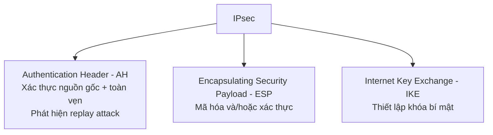

### 9.2 Hai chế độ hoạt động

**Transport Mode** – Bảo vệ host-to-host:

```
[ IP Header | IPsec Header | Payload (TCP/UDP) ]
                ↑ Mã hóa phần này
```

Các endpoint phải là IPsec-aware. Thường dùng cho kết nối trực tiếp giữa hai host.

**Tunnel Mode** – Yêu cầu gateway:

```
[ Outer IP Header | IPsec Header | Inner IP Header | Payload ]
                   ↑ Mã hóa toàn bộ phần này
```

Gateway đóng gói toàn bộ gói IP gốc → bảo vệ cả header nội bộ.

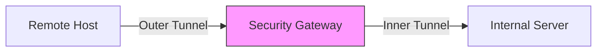

### 9.3 Security Association (SA)

!!! info "SA là gì?"
    SA (Security Association) là một **thỏa thuận một chiều** giữa hai bên về các tham số bảo mật sẽ sử dụng. Mỗi SA chỉ phục vụ **một chiều** và **một mục đích** (hoặc mã hóa, hoặc xác thực).

    → Nếu cần cả hai: tạo **hai SA** riêng biệt.

**Ba tham số định danh một SA:**
1. **SPI** – Security Parameters Index
2. **IP Destination Address**
3. **Security Protocol Identifier** (AH hay ESP)

**Hai cơ sở dữ liệu quan trọng:**
- **SAD** (Security Association Database): Lưu các SA đang hoạt động
- **SPD** (Security Policy Database): Quy tắc áp dụng SA cho gói tin nào

### 9.4 Authentication Header (AH)

```
┌─────────────┬──────────────┬────────────────────────────┐
│ Next Header │ Payload Len  │         RESERVED            │
├─────────────┴──────────────┴────────────────────────────┤
│              Security Parameters Index (SPI)             │
├──────────────────────────────────────────────────────────┤
│                    Sequence Number                        │
├──────────────────────────────────────────────────────────┤
│           Integrity Check Value (ICV) – variable         │
└──────────────────────────────────────────────────────────┘
```

### 9.5 Chống Replay Attack bằng Sliding Window

```
|← Quá cũ →|←── Cửa sổ ──→|← Quá mới →|
     A              B              C
```

- **Vùng A**: Sequence number quá nhỏ → **Loại bỏ**
- **Vùng B**: Trong cửa sổ → Kiểm tra xem đã nhận chưa (bitmap)
- **Vùng C**: Sequence number mới → **Dịch cửa sổ** và chấp nhận

!!! question "Tại sao cần chống Replay Attack?"
    Kẻ tấn công có thể bắt các gói tin đã được xác thực hợp lệ và gửi lại nhiều lần (ví dụ: gói tin "chuyển tiền 100$"). Sequence number + sliding window đảm bảo mỗi gói chỉ được xử lý một lần.

### 9.6 Encapsulated Security Payload (ESP)

```
┌──────────────────────────────────────────────────────────┐
│              Security Parameters Index (SPI)             │
├──────────────────────────────────────────────────────────┤
│                    Sequence Number                        │
├──────────────────────────────────────────────────────────┤
│              Payload Data (variable length)               │◄─ Mã hóa
├──────────────────────────────────────────────────────────┤
│         Padding (0-255 bytes) | Pad Len | Next Hdr       │◄─ Mã hóa
├──────────────────────────────────────────────────────────┤
│           Authentication Data (variable length)          │◄─ MAC
└──────────────────────────────────────────────────────────┘
```

**ESP trong Transport Mode vs Tunnel Mode:**

```
Transport Mode:
[IP Hdr | ESP Hdr | TCP/UDP/... | ESP Trlr | ESP Auth]
                  |←── Mã hóa ──→|
         |←────────── MAC ──────────────────→|

Tunnel Mode:
[Outer IP | ESP Hdr | Inner IP | Payload | ESP Trlr | ESP Auth]
                    |←────── Mã hóa ────────→|
          |←──────────────── MAC ───────────────────→|
```

### 9.7 Quản lý khóa – Oakley KDP và ISAKMP

**Oakley Key Determination Protocol** là Diffie-Hellman có tăng cường:

| Tính năng | Mục đích |
|---|---|
| **DH cơ bản** | Thiết lập khóa bí mật chung |
| **+ Authentication** | Chống tấn công Man-in-the-Middle |
| **+ Cookies** | Chống tấn công Clogging (DoS) |
| **+ Nonce** | Chống Replay Attack |

!!! danger "Clogging Attack là gì?"
    Kẻ tấn công gửi hàng loạt gói tin với các giá trị `Yi` giả mạo, buộc server phải liên tục tính `Ki = Yi^X mod p` – phép tính **modular exponentiation** rất tốn CPU → DoS.
    
    **Giải pháp Cookie**: Trước khi tính DH, server gửi cookie ngẫu nhiên về source address và chờ xác nhận. Nếu source address giả mạo → không nhận được cookie → không gửi xác nhận được → server không tính toán.

**ISAKMP** (Internet Security Association and Key Management Protocol) định nghĩa **format** của các message trao đổi:

```
┌────────────────┬────────────────┐
│  64-bit Initiator Cookie        │
├────────────────┬────────────────┤
│  64-bit Responder Cookie        │
├──────┬──────┬──┴───┬────────────┤
│Next  │Major │Minor │ Exchange   │
│Pload │ Ver  │ Ver  │   Type     │
├──────┴──────┴──────┴────────────┤
│         32-bit Message ID       │
├─────────────────────────────────┤
│           32-bit Length         │
└─────────────────────────────────┘
```

Các loại payload ISAKMP hỗ trợ: SA, Proposal, Transform, Key-exchange, Identification, Certificate, Hash, Signature, Nonce, Notification, Delete,...

---

## 10. Tổng kết – Bức tranh toàn cảnh

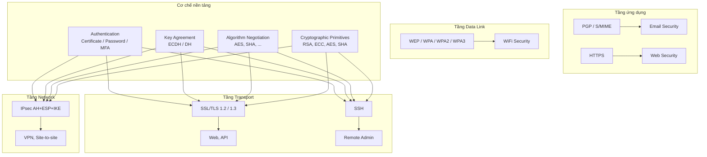

!!! summary "Điểm cần nhớ"
    1. Mọi giao thức bảo mật đều giải quyết 3 bài toán: **Xác thực – Thỏa thuận khóa – Thương lượng thuật toán**
    2. **TLS 1.3** là tiêu chuẩn hiện đại nhất cho bảo mật tầng Transport
    3. **IPsec** hoạt động ở tầng Network, phù hợp cho VPN
    4. **SSH** = Transport + User Auth + Connection, dùng cho quản trị từ xa
    5. **Certificate** = Public Key + Identity + CA Signature → nền tảng của PKI
    6. **SA trong IPsec** là một chiều, một mục đích → cần 2 SA cho mã hóa hai chiều
