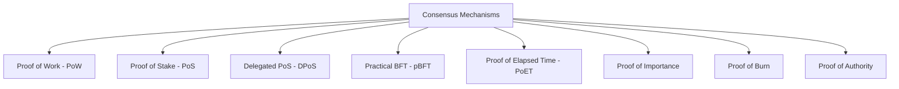
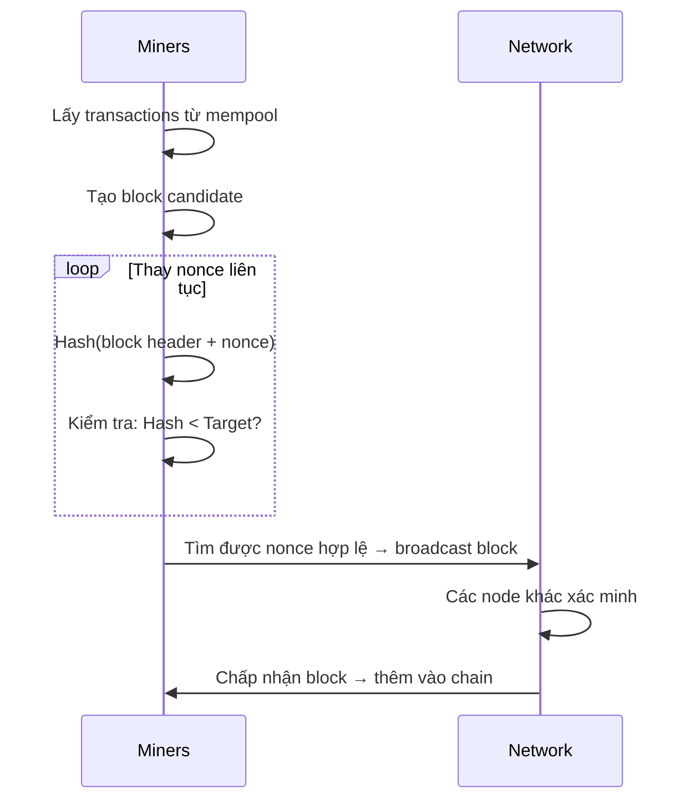
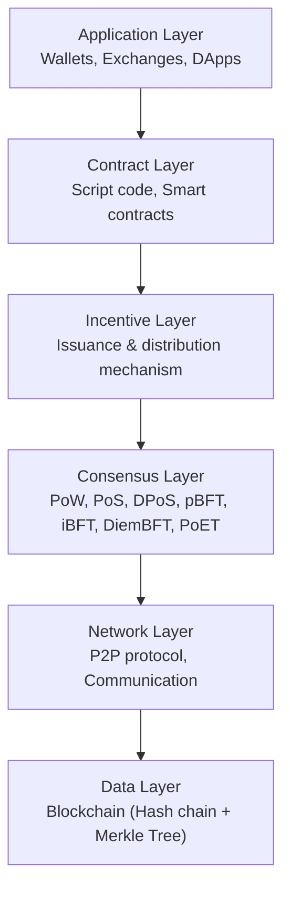
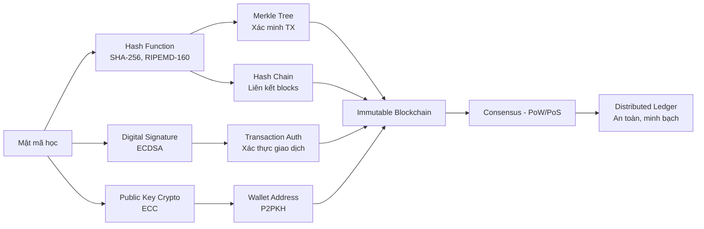

# Bài 14: Cryptography Applications (P2)
## Blockchain Network Security

---

## 1. Động lực (Motivations)

### Vấn đề với hệ thống tập trung (Centralized Systems)

Trong mô hình truyền thống, một **bên thứ ba tập trung** (ngân hàng, chính phủ, tổ chức) nắm toàn bộ quyền kiểm soát:

- Tạo dữ liệu
- Lưu trữ dữ liệu
- Cập nhật/duy trì cơ sở dữ liệu (thêm/sửa/xóa)
- Kiểm soát quyền truy cập của người dùng

!!! danger "Rủi ro cốt lõi"
    **Single Point of Risk (Điểm rủi ro duy nhất):** Nếu bên trung tâm bị tấn công, bị mua chuộc, hoặc hành động không trung thực → toàn bộ hệ thống sụp đổ. Người dùng **buộc phải tin tưởng** mà không có cách nào kiểm chứng.

**Ví dụ – Hệ thống ngân hàng:**

```
Người dùng A ──┐
Người dùng B ──┤──► Clearing House (Ngân hàng Trung tâm) ──► Quyết định mọi thứ
Người dùng C ──┘
```

Ngân hàng kiểm soát: số dư tài khoản, lịch sử giao dịch, quyền chuyển tiền. Nếu ngân hàng gian lận hoặc bị hack → người dùng chịu hậu quả.

### Giải pháp: Hệ thống phân tán quyền (Distributed Rights Systems)

Thay vì một bên nắm quyền, **nhiều node cùng nhau** đưa ra quyết định:

- **Quyền quyết định:** Nhiều node hợp tác biểu quyết cho sự kiện mới (giống cơ chế bỏ phiếu trong nghị viện)
- **Lưu trữ an toàn:** Dữ liệu được lưu tại nhiều vị trí (tất cả full nodes)
- **Xóa bỏ điểm kiểm soát đơn độc**

!!! question "Câu hỏi đặt ra"
    Làm thế nào để xác minh dữ liệu, đồng bộ hóa an toàn, và ghi nhận sự kiện mới khi trong mạng tồn tại các node giả mạo?

    **Trả lời:** Blockchain giải quyết bằng 3 cơ chế:
    
    1. **Hash-based immutable storage** – đảm bảo tính toàn vẹn dữ liệu
    2. **Signature-based authentication** – xác thực người dùng và giao dịch
    3. **Consensus mechanism** – đồng thuận dân chủ, chịu lỗi Byzantine

---

## 2. Cơ chế chịu lỗi (Fault-Tolerant Mechanism)

### Crash Fault Tolerance (CFT)

Xử lý trường hợp các node **bị crash hoặc mất kết nối ngẫu nhiên** – bài toán tương đối dễ giải.

### Byzantine Fault Tolerance (BFT)

Xử lý trường hợp có các node **độc hại chủ động phá hoại** quá trình đồng thuận.

!!! warning "BFT khó hơn CFT rất nhiều"
    BFT chưa được giải quyết hoàn toàn về mặt toán học ở quy mô lớn. Các giải pháp gần đúng (approximations of BFT) đều đi kèm ràng buộc và giới hạn đáng kể. BFT thường dùng **chữ ký mật mã (cryptographic signatures)** làm nền tảng.

---

## 3. Cơ sở dữ liệu bất biến – Immutable Database

### 3.1 Các phương pháp đảm bảo tính toàn vẹn

| Phương pháp | Mục đích |
|---|---|
| **Signature-based** | Xác thực các bên liên quan, kiểm tra tính toàn vẹn và nguồn gốc |
| **Hash-based** | Lưu trữ bất biến – không thể thay đổi dữ liệu đã ghi |

### 3.2 Merkle Hash Tree

Merkle Tree là cấu trúc dữ liệu dạng cây, trong đó mỗi nút cha là hash của hai nút con.

```
        Root Hash
       /          \
    H(H1||H2)   H(H3||H4)
    /      \     /      \
  H(x1) H(x2) H(x3) H(x4)
   |      |     |      |
   x1    x2    x3    x4  ← dữ liệu gốc (transactions)
```

- `||` ký hiệu nối chuỗi (string concatenation)
- **Bảo vệ nhiều lá (leafs) → Chỉ cần tin tưởng một Root**
- Có thể xác minh một giao dịch đơn lẻ mà **không cần tải toàn bộ cây** (Merkle Proof)
- Có thể lưu dưới dạng cấu trúc cây: index, XML

!!! tip "Ứng dụng thực tế"
    Khi ai đó hỏi "Giao dịch X có trong block này không?", ta chỉ cần cung cấp một **Merkle Proof** (một nhánh nhỏ của cây) thay vì toàn bộ block. Điều này cực kỳ quan trọng cho **light clients** (ví dụ ví di động Bitcoin).

### 3.3 Hash Chains

```
h₀ (genesis)
 │
h₁ = H(r₁ || h₀)
 │
h₂ = H(r₂ || h₁)
 │
hᵢ = H(rᵢ || hᵢ₋₁)
```

- Bảo vệ nhiều bản ghi `rⱼ`
- Chỉ cần lưu tin tưởng hai hash đầu và cuối: `h₀`, `hᵢ`
- Nếu bất kỳ `rⱼ` nào bị thay đổi → `hⱼ` thay đổi → tất cả hash sau đó thay đổi → **chuỗi bị phá vỡ và phát hiện ngay**

!!! question "Câu hỏi: Có thể phá vỡ chuỗi không?"
    **Trả lời:** Về mặt tính toán, không thể. Để sửa một bản ghi `rⱼ`, kẻ tấn công phải tính lại toàn bộ `hⱼ, hⱼ₊₁, ..., hᵢ`. Trong Bitcoin, điều này còn đòi hỏi phải **redo Proof-of-Work** cho tất cả các block sau đó, và làm nhanh hơn toàn bộ phần còn lại của mạng – bất khả thi trong thực tế.

### 3.4 Cấu trúc Bitcoin Block = Hash Chain + Merkle Tree

```
Block n-1          Block n           Block n+1
┌─────────────┐   ┌─────────────┐   ┌─────────────┐
│ Block Hash  │◄──│ Prev Hash   │◄──│ Prev Hash   │
│ Prev Hash   │   │ Version     │   │ Version     │
│ Version     │   │ Timestamp   │   │ Timestamp   │
│ Timestamp   │   │ Nonce       │   │ Nonce       │
│ nBits       │   │ nBits       │   │ nBits       │
│ Merkle Root │   │ Merkle Root │   │ Merkle Root │
│ Coinbase    │   │ Coinbase    │   │ Coinbase    │
│ Tx...       │   │ Tx...       │   │ Tx...       │
└─────────────┘   └─────────────┘   └─────────────┘
```

!!! question "Tại sao database bất biến?"
    **Trả lời:** Mỗi block chứa hash của block trước (`Prev Hash`). Nếu ai đó sửa một giao dịch trong Block n:
    
    1. Merkle Root của Block n thay đổi
    2. Block Hash của Block n thay đổi
    3. `Prev Hash` trong Block n+1 không khớp nữa
    4. Phải tính lại Block n+1, n+2, ... đến hiện tại
    5. Đồng thời phải vượt qua Proof-of-Work của toàn bộ mạng
    
    → **Bất khả thi về mặt tính toán**

---

## 4. Xác minh giao dịch (Verifying Transaction Data)

### 4.1 Nội dung giao dịch (Transaction Contents)

Mỗi giao dịch Bitcoin có cấu trúc **Input → Output (UTXO model)**:

```
Transaction A (trước đó)
├── Input:  [nguồn tiền từ tx trước]
└── Output: 0.1005 BTC → Joe

Transaction B (hiện tại)
├── Input:  Transaction A, Output #0 (0.1005 BTC từ Joe)
└── Output:
    ├── 0.0150 BTC → Bob's Address
    ├── 0.0845 BTC → Alice's Address (tiền thừa/change)
    └── 0.0005 BTC → Transaction Fee (phí mạng)
```

!!! info "UTXO Model – Unspent Transaction Output"
    Bitcoin không lưu "số dư tài khoản" như ngân hàng. Thay vào đó, nó lưu danh sách các **đầu ra chưa tiêu (Unspent TXOs)**. Để chi tiêu, bạn phải chứng minh bạn sở hữu các UTXO đó bằng chữ ký số.

### 4.2 Cấu trúc Transaction trong Bitcoin

```
Transaction
├── TxID (hash của toàn bộ transaction)
├── Inputs[]
│   ├── Prev TxID (trỏ đến UTXO muốn dùng)
│   ├── Output Index
│   ├── ScriptSig (SigScript): chứa Signature + Public Key
│   └── Sequence
└── Outputs[]
    ├── Value (số satoshi)
    └── ScriptPubKey (PkScript): điều kiện để tiêu UTXO này
```

### 4.3 ECDSA – Elliptic Curve Digital Signature Algorithm

#### Thiết lập tham số (Parameters)

| Tham số | Ý nghĩa |
|---|---|
| `p` (hoặc `f(x)`) | Số nguyên tố định nghĩa trường hữu hạn |
| `a, b ∈ ℤₚ` | Hệ số đường cong elliptic: `y² = x³ + ax + b` |
| `G ∈ E(ℤₚ)` | Điểm cơ sở (base point) trên đường cong |
| `n = ord(G)` | Bậc của G (số nguyên tố lớn) |
| `h = ord(E(ℤₚ))/n` | Cofactor |
| `H: {0,1}* → {0,1}ˡ` | Hàm băm (SHA-256 trong Bitcoin) |

#### Sinh khóa (Key Generation)

```
Secret key (private key):  d ∈ᴿ [1, n-1]   ← chọn ngẫu nhiên
Public key:                Q = d·G ∈ E(ℤₚ)  = (Keyₓ, Keyᵧ)
```

!!! warning "Bảo mật"
    Từ `Q` và `G` công khai, không thể tính ngược lại `d` vì bài toán **Elliptic Curve Discrete Logarithm Problem (ECDLP)** được coi là bất khả thi về mặt tính toán.

#### Ký số (Signing message `m`)

```
1. Chọn k ∈ᴿ [1, n-1]  ← bí mật, KHÁC NHAU cho mỗi message!
2. Tính R = k·G = (x₁, y₁),  r = x₁ mod n
3. Tính s = k⁻¹ · (H(m) + d·r) mod n
4. Chữ ký: (r, s)
```

!!! danger "Lỗi thảm khốc: Tái sử dụng k"
    Nếu cùng một `k` được dùng cho hai message khác nhau `m₁`, `m₂`:
    
    - Kẻ tấn công có `(r, s₁)` và `(r, s₂)` với cùng `r`
    - Giải hệ phương trình → **khôi phục được private key `d`**
    
    Đây là lỗi thực tế đã xảy ra với Sony PlayStation 3 (2010), dẫn đến lộ private key ký firmware.

#### Xác minh chữ ký (Verification)

```
1. Tính w = s⁻¹ mod n
2. Tính u₁ = H(m)·w mod n,  u₂ = r·w mod n
3. Tính point X = u₁·G + u₂·Q
4. Chữ ký hợp lệ ↔ x-coordinate của X ≡ r (mod n)
```

**Độ bảo mật theo chuẩn NIST FIPS 186-5:**

| Bit length of n | Max Cofactor h | Security Strength |
|---|---|---|
| 224–255 | 2¹⁴ | ≥ 112 bits |
| 256–383 | 2¹⁶ | ≥ 128 bits |
| 384–511 | 2¹⁶ | ≥ 192 bits |
| ≥ 512 | 2³² | ≥ 256 bits |

### 4.4 Bitcoin Address (P2PKH – Pay to Public Key Hash)

Địa chỉ Bitcoin **không phải** là public key, mà là hash của nó:

```
Private Key (d)
     │  Elliptic Curve Multiplication (one-way)
     ▼
Public Key K = (Keyₓ, Keyᵧ)  [65 bytes uncompressed / 33 bytes compressed]
     │  SHA-256
     ▼
SHA256(K)
     │  RIPEMD-160
     ▼
Public Key Hash = RIPEMD160(SHA256(K))  [20 bytes = 160 bits]
     │  + version prefix 0x00 + checksum
     ▼
Bitcoin Address (Base58Check encoded)  [~34 characters]
     ví dụ: 195sYZIRik2y3gidQz3svoU7NexoLPJopr
```

!!! tip "Tại sao dùng 2 lớp hash?"
    - **SHA-256**: hàm hash phổ biến, collision resistant
    - **RIPEMD-160**: rút ngắn xuống 160 bit (tiết kiệm không gian) và thêm một lớp bảo vệ nữa
    - **Base58Check**: loại bỏ các ký tự dễ nhầm (0, O, I, l) và thêm checksum để phát hiện lỗi nhập tay

### 4.5 Transaction Pool (Mempool)

```
Người dùng phát giao dịch
         │
         ▼
   Transaction Pool (Mempool)
   ┌─────────────────────────┐
   │  Trans1  Trans2  Trans3 │  ← các giao dịch hợp lệ
   │  Trans4  Trans5  ...    │     chờ được ghi vào block
   └──────────┬──────────────┘
              │ ~10 phút (Bitcoin)
              ▼
         New Block
   (Confirmed transactions)
```

---

## 5. Cơ chế đồng thuận (Consensus Mechanism)

!!! abstract "Định nghĩa"
    Consensus mechanism là **cơ chế chịu lỗi** (fault-tolerant mechanism) giúp các node phân tán đạt được **thỏa thuận về một trạng thái duy nhất** của mạng.



### 5.1 Proof of Work (PoW)

**Mục tiêu:** Ngăn chặn các yêu cầu giả mạo (Sybil attack), đảm bảo đồng thuận phi tập trung.

**Cơ chế:**

```
Input cố định: [Header của block trước] + [Merkle Root] + [Transactions] + [Nonce]
                                                                               ▲
                                                                         Thay đổi liên tục
Output:        H(input) phải < Threshold (target difficulty)
```

**Quy trình chi tiết:**



**Ví dụ cụ thể từ slide:**
- Node 1: Thử `Nonce = 7C4DDB29` → Hash = `2DFE8E32...` → FAIL
- Node 1: Thử `Nonce = 7C4DDB30` → Hash = `4124B3DC...` → FAIL  
- Node 1: Thử `Nonce = 7C4DDB31` → Hash = `000004F652FED3109` → **SUCCESS** (starts with 0000)
- Node 2 và Node 3 dừng lại sau khi biết Node 1 thắng

!!! tip "Độ khó (Difficulty) là gì?"
    Target được điều chỉnh tự động mỗi 2016 block (~2 tuần) để duy trì thời gian tạo block trung bình là **10 phút** trong Bitcoin. Nếu nhiều miner hơn tham gia → difficulty tăng; miner rời đi → difficulty giảm.

**Ưu điểm:**
- Phi tập trung thực sự
- Đã được kiểm chứng qua thực tế (Bitcoin ~15 năm)

**Nhược điểm:**
- Tiêu tốn năng lượng khổng lồ
- Tốc độ thấp (~7 TPS với Bitcoin)

### 5.2 Proof of Stake (PoS)

**Thay đổi cốt lõi:** `miners` → `validators`; thay vì cạnh tranh bằng sức mạnh tính toán, validator được **chọn ngẫu nhiên có trọng số theo stake**.

| | PoW | PoS |
|---|---|---|
| Tài nguyên bỏ ra | Điện + phần cứng | Tiền đặt cọc (stake) |
| Người tạo block | Người giải puzzle nhanh nhất | Thuật toán chọn ngẫu nhiên theo stake |
| Thưởng | Block reward + transaction fees | Transaction fees (một phần) |
| Hình phạt gian lận | Lãng phí điện | Slashing (mất stake) |

**Ví dụ:** Nếu bạn nắm giữ 10% tổng stake của mạng → xác suất được chọn tạo block là ~10%.

!!! info "Ethereum đã chuyển từ PoW sang PoS"
    Tháng 9/2022 ("The Merge"), Ethereum chuyển sang PoS, giảm ~99.95% năng lượng tiêu thụ.

### 5.3 The Scalability Trilemma

```
        Decentralization
             /\
            /  \
           /    \
          / sweet\
         / spot? \
        /──────────\
   Security      Scalability
```

Không thể đạt cả ba mục tiêu cùng lúc ở mức cao:

- **Bitcoin:** Hi sinh Scalability (~7 TPS) để đổi lấy Security + Decentralization
- **Ripple/Stellar/EOS:** Hi sinh Decentralization để đổi lấy Scale + Security

!!! note "Liên hệ với CAP Theorem"
    Trilemma này tương tự CAP Theorem trong distributed systems: Consistency, Availability, Partition Tolerance – chỉ chọn được 2 trong 3.

---

## 6. Kiến trúc mạng Blockchain



### Đặc tính của Bitcoin (Case Study)

**Decentralization (Phi tập trung):**
- Không có điểm kiểm soát trung tâm
- Tất cả node phải đồng thuận để thêm dữ liệu
- Đảm bảo tính toàn vẹn trong quá trình đồng thuận

**Immutability (Bất biến):**
- Dữ liệu đã ghi không thể thay đổi
- Bảo vệ khỏi mọi sửa đổi hoặc tấn công
- Loại bỏ sự cần thiết phải tin tưởng bên thứ ba tập trung

**Transparency (Minh bạch):**
- Block explorer: truy cập toàn bộ dữ liệu block
- Bất kỳ ai cũng có thể tra cứu lịch sử giao dịch
- Audit trail hoàn chỉnh và không thể xóa

---

## 7. Smart Contracts – Thế hệ tiếp theo

!!! abstract "Định nghĩa"
    Smart contract là **chương trình máy tính / giao thức giao dịch** tự động thực thi các điều khoản hợp đồng khi điều kiện được thỏa mãn, không cần bên trung gian.

**Đặc điểm:**
- **Tự động thực thi** (automatically execute) khi điều kiện thỏa mãn
- **Kiểm soát / ghi lại** các sự kiện có giá trị pháp lý
- **Compiled code** được deploy lên blockchain (immutable)
- Kích hoạt bởi việc gửi transaction từ wallet đến blockchain

**Ví dụ Rust smart contract (trên Elrond/MultiversX):**

```rust
#![no_std]
elrond_wasm::imports!();

#[elrond_wasm::derive::contract]
pub trait Adder {
    #[view(getSum)]
    #[storage_mapper("sum")]
    fn sum(&self) -> SingleValueMapper<BigInt>;

    #[init]
    fn init(&self, initial_value: BigInt) {
        self.sum().set(&initial_value);
    }

    #[endpoint]
    fn add(&self, value: BigInt) -> SCResult<()> {
        self.sum().update(|sum| *sum + value);
        Ok(())
    }
}
```

!!! tip "Giải thích contract trên"
    Contract này implement một bộ cộng đơn giản:
    
    - `init`: Khởi tạo với giá trị ban đầu, lưu vào storage
    - `add`: Endpoint công khai – bất kỳ ai cũng có thể gọi để cộng thêm vào sum
    - `getSum`: View function – đọc giá trị hiện tại
    
    Trong thực tế, smart contract được dùng cho DeFi (DEX, lending), NFT, DAO governance, supply chain,...

---

## 8. Các lĩnh vực ứng dụng của Blockchain

| Lĩnh vực | Ứng dụng |
|---|---|
| **Tài chính (Finance/DeFi)** | Cryptocurrency, e-commerce, lending, stablecoin |
| **Supply Chain** | Truy xuất nguồn gốc hàng hóa, chống hàng giả |
| **Healthcare** | Lưu trữ hồ sơ bệnh nhân phi tập trung, chia sẻ dữ liệu y tế |
| **IoT** | Quản lý thiết bị, bảo mật dữ liệu cảm biến |
| **Cloud Computing** | Lưu trữ phi tập trung, IPFS |
| **Energy** | Microgrid, peer-to-peer energy trading |
| **Government** | Digital identity, e-voting, regulatory compliance |
| **Industry 4.0** | Additive manufacturing, cognitive radio, traceability |
| **Security & Privacy** | Homomorphic encryption, zero-knowledge proof, access control |

---

## Tổng kết – Kiến trúc bảo mật của Blockchain



> **Kết luận:** Blockchain là sự kết hợp khéo léo của nhiều kỹ thuật mật mã học (hash function, digital signature, public key cryptography) với cơ chế đồng thuận phân tán, tạo ra một hệ thống lưu trữ **phi tập trung, bất biến, minh bạch và không cần tin tưởng** (trustless).
