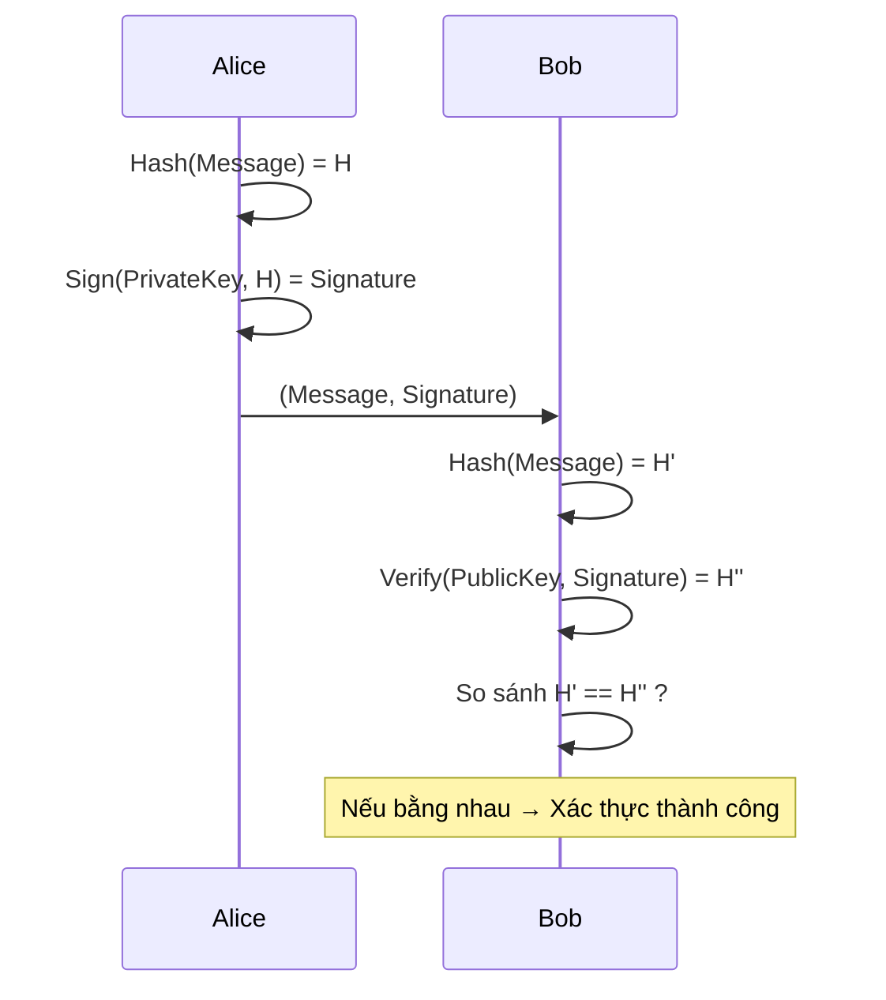
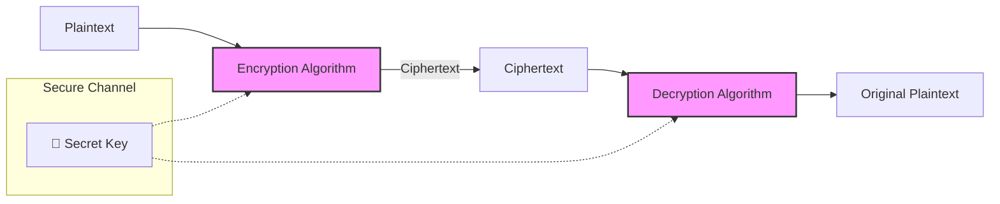
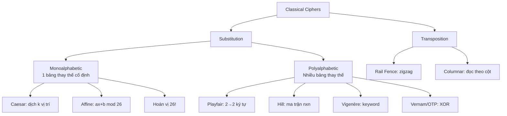
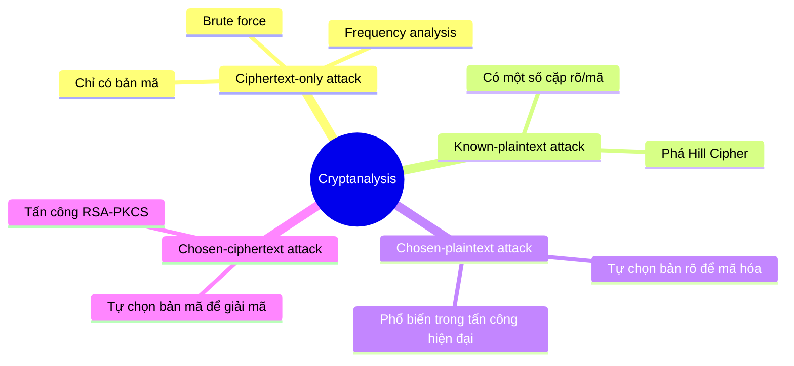
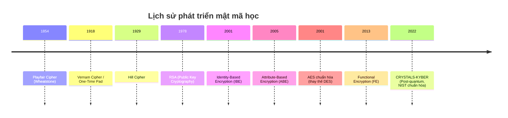

# Bài 2: Mật mã cổ điển & Phân tích mật mã

---

### 1. Hệ mật mã hoạt động như thế nào?

#### 1.1 Cipher Systems (Hệ mã hóa)

```
Plaintext ──[Encryption: E(K, P)]──► Ciphertext ──[Decryption: D(K, C)]──► Plaintext
              (Dễ tính)                               (Dễ nếu biết K)
```

!!! info "One-way function"
    Hàm mã hóa dễ tính theo chiều thuận nhưng **rất khó đảo ngược** nếu không biết khóa bí mật `K`. Đây là nền tảng của mọi hệ mã hóa hiện đại.

#### 1.2 Hash Functions

```
Plaintext ──[Hash Function]──► Digital Digest (bản tóm lược số)
              (Dễ tính)          (KHÔNG thể đảo ngược!)
```

**Đặc điểm:**
- Cùng input → luôn cùng output
- Thay đổi 1 bit input → output hoàn toàn khác (avalanche effect)
- Không thể khôi phục input từ output

```python
import hashlib
msg = "Hello World"
print(hashlib.sha256(msg.encode()).hexdigest())
# Output: a591a6d40bf420404a011733cfb7b190d62c65bf0bcda32b57b277d9ad9f146e
```

#### 1.3 Digital Signature



---

### 2. Hệ mật mã đối xứng cổ điển

> **Yêu cầu cơ bản của mã hóa đối xứng:**
> 1. Thuật toán mã hóa phải đủ mạnh
> 2. Người gửi và nhận phải trao đổi khóa bí mật qua kênh an toàn



---

### 3. Kỹ thuật thay thế (Substitution Techniques)

#### 3.1 Mật mã đơn bảng (Monoalphabetic Cipher)

> **Định nghĩa:** Mỗi ký tự trong bản rõ được thay thế bằng **một** ký tự cố định trong bản mã.

---

##### 🔸 Caesar Cipher

**Ý tưởng:** Dịch chuyển mỗi chữ cái đi `k` vị trí trong bảng chữ cái.

$$C = E(k, p) = (p + k) \mod 26$$
$$p = D(k, C) = (C - k) \mod 26$$

**Ví dụ với k = 3:**

```
Bản rõ:   A  B  C  D  E  F  G  H  I  J  K  L  M  N  O  P  Q  R  S  T  U  V  W  X  Y  Z
Bản mã:   D  E  F  G  H  I  J  K  L  M  N  O  P  Q  R  S  T  U  V  W  X  Y  Z  A  B  C

plain:  MEET ME AFTER THE TOGA PARTY
cipher: PHHW PH DIWHU WKH WRJD SDUWB
```

!!! question "Câu hỏi: Tại sao Caesar Cipher dễ bị phá?"
    **Trả lời:** Caesar Cipher chỉ có **25 khóa khả dĩ** (k = 1 đến 25). Kẻ tấn công chỉ cần thử vét cạn (brute-force) tất cả 25 khả năng là tìm ra bản rõ. Đây được gọi là **brute-force attack** — hoàn toàn khả thi với tài nguyên tính toán tối thiểu.

```python
def caesar_encrypt(text, k):
    result = ""
    for char in text.upper():
        if char.isalpha():
            result += chr((ord(char) - ord('A') + k) % 26 + ord('A'))
        else:
            result += char
    return result

def caesar_decrypt(cipher, k):
    return caesar_encrypt(cipher, 26 - k)

# Brute force
ciphertext = "JBBQJBXCQBOQEBQLUXMXOQV"
for k in range(1, 26):
    print(f"k={k}: {caesar_decrypt(ciphertext, k)}")
```

---

##### 🔸 ROT13

Là trường hợp đặc biệt của Caesar với `k = 13`. Do 26/2 = 13, nên **mã hóa và giải mã dùng cùng phép tính**:

$$ROT13(ROT13(x)) = x$$

---

##### 🔸 Affine Cipher

$$E(x) = (ax + b) \mod 26$$

với điều kiện `gcd(a, 26) = 1` (a và 26 nguyên tố cùng nhau).

Giải mã: $D(x) = a^{-1}(x - b) \mod 26$

---

##### 🔸 Monoalphabetic Substitution (Hoán vị tổng quát)

Thay vì dịch chuyển cố định, dùng **hoán vị ngẫu nhiên** của 26 chữ cái:

```
Plain:   A B C D E F G H I J K L M N O P Q R S T U V W X Y Z
Cipher:  A Z E R T Y U I O P Q S D F G H J K L M W X C V B N
```

**Không gian khóa:** $26! \approx 4 \times 10^{26}$ — lớn hơn DES $10^{10}$ lần!

!!! danger "Vẫn bị phá được!"
    Dù không gian khóa rất lớn, monoalphabetic cipher **dễ bị phá bằng frequency analysis** (phân tích tần suất xuất hiện của các ký tự).

---

#### 3.2 Phân tích tần suất (Frequency Analysis)

**Nguyên lý:** Trong tiếng Anh, tần suất xuất hiện của các chữ cái **không đều nhau**:

```
Tần suất cao nhất: E (12.7%) > T (9.1%) > A (8.2%) > O (7.5%) > I (7.0%)
Tần suất thấp nhất: Z, Q, X, J, K
```

!!! example "Ví dụ tấn công thực tế"
    Trong bản mã của bài tập (slide), ký tự `n` xuất hiện nhiều nhất → khả năng cao `n` tương ứng với `e` trong tiếng Anh. Từ đó suy dần ra các chữ cái khác.

**Quy trình frequency analysis:**
```
1. Đếm tần suất xuất hiện của mỗi ký tự trong bản mã
2. So sánh với phân bố tần suất tiếng Anh
3. Ánh xạ ký tự mã → ký tự rõ (từ cao nhất đến thấp nhất)
4. Kiểm tra kết quả, điều chỉnh nếu cần
```

---

#### 3.3 Mật mã đa bảng (Polyalphabetic Cipher)

> **Mục đích:** Khắc phục điểm yếu của monoalphabetic bằng cách dùng **nhiều bảng thay thế khác nhau** cho cùng một ký tự, tùy vị trí trong bản rõ.

---

##### 🔸 Playfair Cipher

**Đặc điểm:**
- Mã hóa từng cặp 2 ký tự (digram) cùng lúc
- Dùng ma trận 5×5 xây dựng từ một **từ khóa**
- I và J được gộp chung thành một ô

**Xây dựng ma trận với keyword `MONARCHY`:**

```
M  O  N  A  R
C  H  Y  B  D
E  F  G  I/J K
L  P  Q  S  T
U  V  W  X  Z
```

**Quy tắc mã hóa:**

```
Plaintext: "Hide the gold in the tree stump"
→ Chia digram: HI DE TH EG OL DI NT HE TR EX ES TU MP
                 (thêm X nếu cặp trùng; thêm X nếu lẻ)
```

??? details "3 quy tắc mã hóa Playfair"
    1. **Cùng hàng:** Thay mỗi ký tự bằng ký tự bên phải (vòng tròn)
    2. **Cùng cột:** Thay mỗi ký tự bằng ký tự bên dưới (vòng tròn)
    3. **Hình chữ nhật:** Mỗi ký tự thay bằng ký tự cùng hàng, ở cột của ký tự kia

!!! question "Câu hỏi: Tại sao Playfair khó phá hơn monoalphabetic?"
    **Trả lời:** Playfair mã hóa theo **cặp ký tự (digram)** thay vì từng ký tự đơn lẻ. Điều này làm cho phân tích tần suất đơn giản không còn hiệu quả vì phải phân tích tần suất của 26² = 676 cặp thay vì 26 ký tự. Tuy nhiên, **digram frequency analysis** vẫn có thể phá được vì `th` là digram phổ biến nhất trong tiếng Anh.

---

##### 🔸 Hill Cipher

**Ý tưởng:** Dùng **đại số ma trận** để mã hóa. Với ma trận khóa K kích thước n×n:

$$\mathbf{C} = \mathbf{K} \cdot \mathbf{P} \mod 26$$

**Ví dụ ma trận 3×3:**

$$\begin{pmatrix} c_1 \\ c_2 \\ c_3 \end{pmatrix} = \begin{pmatrix} k_{11} & k_{12} & k_{13} \\ k_{21} & k_{22} & k_{23} \\ k_{31} & k_{32} & k_{33} \end{pmatrix} \begin{pmatrix} p_1 \\ p_2 \\ p_3 \end{pmatrix} \mod 26$$

!!! success "Ưu điểm"
    Ẩn hoàn toàn tần suất xuất hiện của từng ký tự đơn lẻ. Ma trận 3×3 còn ẩn cả tần suất cặp ký tự (bigram).

!!! danger "Điểm yếu nghiêm trọng"
    Dễ dàng bị phá bằng **known-plaintext attack**: nếu kẻ tấn công biết một số cặp (bản rõ, bản mã), họ có thể lập hệ phương trình tuyến tính để tìm ra ma trận khóa K.

---

##### 🔸 Vigenère Cipher

**Ý tưởng:** Dùng một **từ khóa lặp lại** để chọn bảng Caesar khác nhau cho từng vị trí.

$$C_i = (P_i + K_i) \mod 26$$

**Ví dụ:**

```
Plaintext:  w  e  a  r  e  d  i  s  c  o  v  e  r  e  d  s  a  v  e  y  o  u  r  s  e  l  f
Key:        d  e  c  e  p  t  i  v  e  d  e  c  e  p  t  i  v  e  d  e  c  e  p  t  i  v  e
            (keyword "deceptive" lặp lại)
Ciphertext: Z  I  C  V  T  W  Q  N  G  R  Z  G  V  T  W  A  V  Z  H  C  Q  Y  G  L  M  Q  J
```

!!! question "Câu hỏi: Tại sao Vigenère Autokey System vẫn bị phá được?"
    **Trả lời:** Dù Autokey dùng bản rõ làm phần tiếp theo của khóa (tránh lặp lại), nhưng do **khóa và bản rõ có cùng phân bố tần suất** (đều là ngôn ngữ tự nhiên), các kỹ thuật thống kê như **Kasiski test** và **Index of Coincidence** vẫn xác định được độ dài khóa và phá mã.

---

#### 3.4 Vernam Cipher & One-Time Pad

**Vernam Cipher** là stream cipher dùng phép XOR:

$$c_i = p_i \oplus k_i$$

**One-Time Pad** là cải tiến của Vernam:
- Khóa **ngẫu nhiên thực sự** (không phải pseudo-random)
- Khóa dài **bằng** bản rõ
- Mỗi khóa chỉ dùng **một lần duy nhất**

!!! success "Bảo mật lý thuyết tuyệt đối (Perfect Secrecy)"
    One-Time Pad là hệ mật mã **duy nhất** được chứng minh toán học là không thể phá vỡ. Bản mã không chứa bất kỳ thông tin thống kê nào về bản rõ.

!!! danger "Hạn chế thực tế"
    1. **Vấn đề tạo khóa:** Cần lượng lớn bit ngẫu nhiên thực sự — rất khó tạo
    2. **Vấn đề phân phối khóa:** Khóa phải dài bằng tin nhắn → phân phối an toàn rất tốn kém
    3. **Chỉ phù hợp** cho kênh băng thông thấp, yêu cầu bảo mật tối cao (ngoại giao, quân sự)

---

### 4. Kỹ thuật hoán vị (Transposition Techniques)

> **Khác biệt cốt lõi:** Thay vì *thay thế* ký tự, transposition cipher *xáo trộn vị trí* của các ký tự.

---

#### 4.1 Rail Fence Cipher

Bản rõ được viết theo đường zigzag, sau đó đọc theo hàng ngang:

```
Plaintext: "meet me after the toga party"

Rail 1: m . . t . e . f . e . t . e . o . a . a . t .
Rail 2: . e . . m . . a . t . r . t . . t . g . p . r . y

Rail 1 (đọc hàng 1): m t e f e t e o a a t
Rail 2 (đọc hàng 2): e e m a t r t t g p r y

Ciphertext: MEMATRHTGPRYETEFETEOAAT
```

---

#### 4.2 Columnar Transposition Cipher

Viết bản rõ theo hàng trong bảng, đọc theo cột theo thứ tự khóa:

```
Key:  4 3 1 2 5 6 7
      a t t a c k p
      o s t p o n e
      d u n t i l t
      w o a m x y z

Đọc theo thứ tự cột (1→7):
Cột 1: t t n a  → TTNA
Cột 2: a p t m  → APTM
Cột 3: t s u o  → TSUO
...
Ciphertext: TTNAAPTMTSUOAODWCOIXKNLYPETZ
```

!!! question "Câu hỏi: Tại sao transposition cipher không che giấu được frequency?"
    **Trả lời:** Transposition chỉ **di chuyển vị trí** các ký tự, không thay đổi bản thân chúng. Do đó, **tần suất xuất hiện của từng ký tự hoàn toàn giống** bản rõ. Phân tích tần suất vẫn xác nhận đây là tiếng Anh (hay ngôn ngữ nào đó), chỉ cần phân tích cấu trúc hoán vị.

---

### 5. So sánh các loại mật mã cổ điển



| Cipher | Key Space | Bảo mật | Điểm yếu chính |
|---|---|---|---|
| Caesar | 25 | Rất yếu | Brute force trivial |
| Monoalphabetic | 26! ≈ 4×10²⁶ | Yếu | Frequency analysis |
| Playfair | Lớn | Trung bình | Digram frequency |
| Hill (3×3) | Lớn | Trung bình | Known-plaintext attack |
| Vigenère | Lớn | Trung bình | Kasiski/IC test |
| One-Time Pad | ∞ | **Tuyệt đối** | Phân phối khóa |

---

### 6. Phân tích mật mã (Cryptanalysis) — Tổng quan



!!! tip "Kasiski Test — Phá Vigenère"
    1. Tìm các chuỗi ký tự lặp lại trong bản mã
    2. Tính khoảng cách giữa các lần lặp → USCLN của các khoảng cách ≈ độ dài khóa
    3. Chia bản mã thành các nhóm cách nhau `n` vị trí → mỗi nhóm là Caesar cipher
    4. Dùng frequency analysis phá từng Caesar

---

### 7. Hệ mật mã hiện đại — Cái nhìn tổng quan



!!! note "Post-Quantum Cryptography"
    Máy tính lượng tử có thể phá RSA và ECC bằng thuật toán Shor. **CRYSTALS-KYBER** (được NIST chuẩn hóa năm 2022) là thuật toán kháng lượng tử, sẽ được học trong **Tuần 14** của khóa học.

---

??? details "📚 Danh sách tài liệu tham khảo"
    - **[1]** Stallings, W. (2019). *Cryptography and Network Security: Principles and Practice* (8th ed.). Pearson Education. — **Chương 1, 3**
    - **[2]** Yan, S. Y. (2019). *Cybercryptography: Applicable Cryptography for Cyberspace Security*. Springer. — **Chương 1, 4**
    - **[3]** Mihailescu & Nita (2021). *Pro Cryptography and Cryptanalysis with C++20*. Apress. — Dùng cho lab
    - **[4]** Katz & Lindell (2020). *Introduction to Modern Cryptography* (3rd ed.). CRC Press.
    
    **Tools:**
    - CrypTool 2: https://www.cryptool.org/en/ct2/
    - OpenSSL: https://github.com/openssl/openssl
    - Online AES: https://www.devglan.com/online-tools/aes-encryption-decryption
