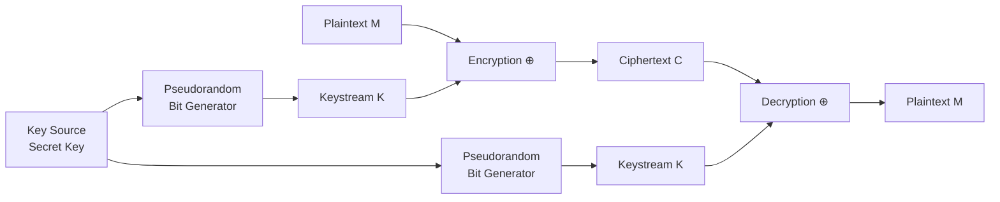
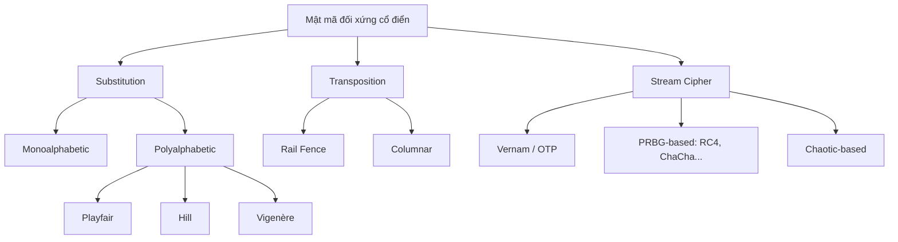

# Bài 3: Modern Symmetric Ciphers

---

## 1. Tổng quan mật mã học

Mật mã học (Cryptology) bao gồm hai nhánh chính:

- **Cryptography** (Mật mã): Thiết kế các hệ thống bảo mật
- **Cryptanalysis** (Phân tích mật mã): Phá vỡ các hệ thống bảo mật

### Mục tiêu của mật mã học

| Mục tiêu | Ý nghĩa |
|---|---|
| **Confidentiality** | Bảo mật – chỉ người được phép mới đọc được thông tin |
| **Authentication** | Xác thực – xác minh danh tính người gửi |
| **Integrity** | Toàn vẹn – đảm bảo dữ liệu không bị thay đổi |
| **Non-repudiation** | Không thể chối từ – người gửi không thể phủ nhận đã gửi |
| **Availability** | Khả dụng – dịch vụ luôn sẵn sàng |
| **Privacy** | Quyền riêng tư |

---

## 2. Các thuật toán mật mã cổ điển

Mật mã cổ điển chia thành hai kỹ thuật lớn:

```
Mật mã đối xứng cổ điển
├── Substitution (Thay thế)
│   ├── Monoalphabetic (1-1)
│   └── Polyalphabetic (nhiều ký tự)
│       ├── Playfair Cipher
│       ├── Hill Cipher
│       └── Vigenère Cipher
└── Transposition (Hoán vị)
    ├── Rail Fence Cipher
    └── Columnar Transposition Cipher
```

---

## 3. Polyalphabetic Ciphers (Mật mã đa bảng)

### 3.1 Playfair Cipher

Playfair là mật mã thay thế **2 ký tự → 2 ký tự** (digraph substitution), được phát triển vào thế kỷ 19.

**Cách xây dựng ma trận khóa (5×5):**

1. Điền các chữ cái của từ khóa (bỏ trùng) vào ma trận 5×5
2. Điền các chữ cái còn lại theo thứ tự bảng chữ cái
3. I và J được coi là một ký tự

Ví dụ với từ khóa **MONARCHY**:

```
M  O  N  A  R
C  H  Y  B  D
E  F  G  I  K
L  P  Q  S  T
U  V  W  X  Z
```

**Quy tắc mã hóa:**

- Tách plaintext thành từng cặp (digram). Nếu cặp có 2 chữ giống nhau, chèn 'X' vào giữa.
- **Cùng hàng:** Mỗi chữ thay bằng chữ liền phải (wrap around)
- **Cùng cột:** Mỗi chữ thay bằng chữ liền dưới (wrap around)
- **Hình chữ nhật:** Mỗi chữ thay bằng chữ ở góc đối diện cùng hàng

> **Ví dụ:** Plaintext `"Hide the gold in the tree stump"`
> 
> Sau khi tách: `HI DE TH EG OL DI NT HE TR EX ES TU MP`
> 
> Ciphertext: `BF CK PD FI ...`

**Phân tích mật mã (Cryptanalysis) Playfair:**

Mặc dù Playfair che giấu tần suất đơn ký tự, nó vẫn bị tấn công thông qua:

- **Unigram Scorer:** Phân tích tần suất đơn ký tự
- **Digram Scorer:** Phân tích tần suất cặp ký tự phổ biến (ví dụ: `th`, `he`, `in`)
- **Quadgram Scorer:** Phân tích tần suất bộ 4 ký tự

???+ info "Tại sao Playfair vẫn bị phá?"
    Vì ngôn ngữ tự nhiên có phân phối tần suất rất đặc trưng. Dù mã hóa theo cặp, các cặp ký tự phổ biến trong tiếng Anh như `TH`, `HE`, `IN` vẫn tạo ra ciphertext có tần suất lệch nhau. Với đủ ciphertext, attacker có thể đoán ngược lại ma trận khóa.

---

### 3.2 Hill Cipher

Hill Cipher được phát triển bởi nhà toán học **Lester Hill** vào năm 1929. Đây là mật mã **tuyến tính** dựa trên đại số ma trận.

**Nguyên lý:**

$$C = K \cdot P \mod 26$$

Với ma trận khóa K (3×3) và vector plaintext P (3×1):

$$\begin{pmatrix} c_1 \\ c_2 \\ c_3 \end{pmatrix} = \begin{pmatrix} k_{11} & k_{12} & k_{13} \\ k_{21} & k_{22} & k_{23} \\ k_{31} & k_{32} & k_{33} \end{pmatrix} \cdot \begin{pmatrix} x_1 \\ x_2 \\ x_3 \end{pmatrix} \mod 26$$

**Điểm mạnh:**
- Che giấu hoàn toàn tần suất đơn ký tự
- Ma trận 3×3 còn che giấu cả tần suất bigram (cặp ký tự)

**Điểm yếu:**

!!! warning "Known-Plaintext Attack"
    Hill Cipher **rất dễ bị phá** nếu attacker có một cặp plaintext-ciphertext đã biết. Với đủ cặp plaintext/ciphertext, attacker có thể giải phương trình tuyến tính để tìm lại ma trận khóa K.

**Điều kiện:** Ma trận K phải có **nghịch đảo** trong modulo 26, tức là `det(K)` phải **nguyên tố cùng nhau với 26**.

---

### 3.3 Vigenère Cipher

Vigenère là một trong những mật mã đa bảng nổi tiếng và đơn giản nhất.

**Nguyên lý:** Sử dụng 26 bảng Caesar Cipher khác nhau, mỗi bảng ứng với một shift từ 0–25. Từ khóa sẽ chỉ định bảng nào được dùng tại mỗi vị trí.

**Công thức:**

$$c_i = (m_i + k_i) \mod 26$$

$$m_i = (c_i - k_i) \mod 26$$

**Ví dụ:**

```
Keyword:    deceptive deceptive deceptive
Plaintext:  wearediscoveredsaveyourself
Ciphertext: ZICVTWQNGKZEIIGASXSTSLVVWLA
```

Chữ `w` (22) + `d` (3) = 25 = `Z`. Chữ `e` (4) + `e` (4) = 8 = `I`. Và cứ tiếp tục như vậy.

**Vigenère Autokey System:**

Thay vì lặp lại từ khóa, hệ thống Autokey dùng chính plaintext làm phần tiếp theo của khóa sau khi hết từ khóa ban đầu:

```
Plaintext:  w e a r e d i s c o v e r e d s a v e y o u r s e l f
Key:        d e c e p t i v e w e a r e d i s c o v e r e d s a v
Ciphertext: Z I C V T W Q N G K Z E I I G A S X S T S L V V W L A
```

!!! warning "Vẫn có thể bị phá"
    Dù dùng Autokey, vì khóa và plaintext có cùng phân phối tần suất chữ cái, các kỹ thuật thống kê vẫn có thể khai thác được.

---

## 4. Transposition Ciphers (Mật mã hoán vị)

Khác với substitution (thay thế ký tự), transposition **giữ nguyên ký tự** nhưng **xáo trộn vị trí** của chúng.

### 4.1 Rail Fence Cipher

Plaintext được viết theo đường zigzag trên nhiều "thanh ray", rồi đọc theo từng hàng.

**Ví dụ** với depth = 2, plaintext `"meet me after the toga party"`:

```
m . e . m . a . t . r . h . t . g . p . r . y
. e . t . e . f . e . t . e . o . a . a . t .
```

Đọc theo hàng: `MEMATRHTGPRY` + `ETEFETEOAAT`  
→ Ciphertext: `MEMATRHTGPRYETEFETEOAAT`

### 4.2 Columnar Transposition Cipher

Plaintext được viết theo hàng vào một bảng chữ nhật, sau đó đọc theo cột nhưng **thứ tự cột bị hoán vị** theo khóa.

**Ví dụ:**

```
Key:      4 3 1 2 5 6 7
          A T T A C K P
          O S T P O N E
          D U N T I L T
          W O A M X Y Z
```

Đọc theo thứ tự cột (1→7): Cột 1 = `TNAL`, Cột 2 = `APTM`, ...  
→ Ciphertext: `TTNAAPTMTSUOAODWCOIXKNLYPETZ`

---

## 5. So sánh độ bảo mật các mật mã cổ điển

```
Độ bảo mật (từ thấp → cao):
Plaintext < Playfair < Vigenère < Random Polyalphabetic
```

Biểu đồ tần suất cho thấy:
- **Plaintext** có phân phối rất rõ ràng (chữ E, T, A hay xuất hiện nhất)
- **Playfair** san phẳng một phần, nhưng vẫn còn dấu vết
- **Vigenère** san phẳng hơn
- **Random polyalphabetic** gần với phân phối đều (khó phân tích nhất)

---

## 6. Stream Cipher (Mật mã dòng)

### 6.1 Khái niệm cơ bản

Stream cipher mã hóa từng **bit hoặc byte** của plaintext một lúc, thay vì theo khối.

**Công thức tổng quát:**

$$c_i = m_i \oplus k_i$$

Trong đó:

- $m_i$: bit/byte plaintext thứ i
- $k_i$: bit/byte keystream thứ i  
- $c_i$: bit/byte ciphertext thứ i
- $\oplus$: phép XOR



### 6.2 Vernam Cipher

Gilbert Vernam phát minh ra một hệ thống mã hóa dòng thực tiễn đầu tiên. Plaintext được XOR trực tiếp với keystream.

### 6.3 One-Time Pad (OTP)

Cải tiến của Vernam bởi **Joseph Mauborgne** (Quân đội Mỹ):

- Khóa hoàn toàn **ngẫu nhiên**, dài bằng plaintext
- Mỗi khóa chỉ dùng **một lần duy nhất**
- Sau khi dùng xong, khóa bị **hủy**

!!! success "Tính bảo mật hoàn hảo (Perfect Secrecy)"
    OTP là hệ thống mật mã **duy nhất** được chứng minh có **bảo mật hoàn hảo** (information-theoretic security). Ciphertext không chứa bất kỳ thông tin thống kê nào về plaintext. Dù có vô hạn tài nguyên tính toán, attacker cũng không thể phá.

!!! danger "Khó khăn thực tiễn"
    OTP có 2 vấn đề lớn khiến nó không thực tế:
    
    1. **Sinh khóa ngẫu nhiên thật sự với số lượng lớn** rất khó — hệ thống bận rộn có thể cần hàng triệu ký tự ngẫu nhiên mỗi ngày.
    2. **Phân phối khóa** — mỗi tin nhắn cần một khóa dài tương đương, phải chia sẻ an toàn trước với người nhận qua kênh độc lập.
    
    → OTP chỉ phù hợp cho **kênh băng thông thấp, yêu cầu bảo mật cực cao** (ví dụ: đường dây nóng giữa các lãnh đạo quốc gia).

### 6.4 Stream Cipher thực tiễn

Vì OTP không khả thi, trong thực tế ta dùng **Pseudorandom Bit Generator (PRBG)** — một thuật toán tất định tạo ra keystream dài từ một "**secret seed**" (khóa bí mật ngắn).

**Yêu cầu của PRBG bảo mật:**
- Không thể dự đoán các bit tiếp theo từ các bit đã biết trước (computational indistinguishability)
- Cả người gửi và người nhận chỉ cần chia sẻ **seed** ngắn, không cần toàn bộ keystream

**Các stream cipher phổ biến:**

| Loại | Ví dụ |
|---|---|
| Widely used | A5/1, A5/2, RC4, ChaCha, EO |
| eSTREAM (Software) | HC-256, Rabbit, Salsa20, SOSEMANUK |
| eSTREAM (Hardware) | Grain, MICKEY, Trivium |

### 6.5 Chaotic-based Cryptosystem

Một hướng nghiên cứu dùng **hệ thống hỗn loạn (chaotic maps)** để sinh keystream.

**Ví dụ: Logistic Map**

$$x_{n+1} = r \cdot x_n(1 - x_n)$$

- **Input (seed):** $x_0 \in (0,1)$, $r \in (3.6, 4)$
- **Output:** chuỗi $x_1, x_2, x_3, \ldots$ với $0 < x_i < 1$
- Khi $r$ gần 4, hệ thống thể hiện hành vi hỗn loạn (chaotic) — rất nhạy cảm với điều kiện ban đầu, khó dự đoán

???+ note "Ứng dụng"
    Chaotic maps được nghiên cứu đặc biệt cho mã hóa **ảnh và video**, vì chúng có thể sinh keystream nhanh và có tính ngẫu nhiên tốt. Tuy nhiên, một số hệ thống dựa trên chaos đã bị phát hiện có điểm yếu khi phân tích kỹ về độ ngẫu nhiên thực sự.

---

## 7. Tổng kết & Roadmap tiếp theo



**Tuần 4–5 sẽ học:**
- Block Cipher (Mật mã khối)
- **DES** – Data Encryption Standard
- **AES** – Advanced Encryption Standard
- Searchable Encryption (mã hóa có thể tìm kiếm)

---

???+ question "Câu hỏi ôn tập"

    **Q1: Tại sao Hill Cipher mạnh với ciphertext-only attack nhưng yếu với known-plaintext attack?**
    
    > **Trả lời:** Hill Cipher dùng phép nhân ma trận tuyến tính. Với ciphertext-only, attacker không biết P nên khó đảo ngược. Nhưng nếu biết một số cặp (P, C), attacker có thể lập hệ phương trình $C = K \cdot P \mod 26$ và giải tìm K — đây là bài toán đại số tuyến tính đơn giản.
    
    **Q2: One-Time Pad có bảo mật hoàn hảo, tại sao không dùng phổ biến?**
    
    > **Trả lời:** Hai lý do: (1) Sinh đủ khóa ngẫu nhiên thật sự cho lượng dữ liệu lớn rất khó và tốn kém; (2) Phân phối khóa — cần chia sẻ khóa dài bằng plaintext qua kênh an toàn trước, mà nếu đã có kênh an toàn như vậy thì có thể truyền trực tiếp tin nhắn qua đó luôn.
    
    **Q3: Sự khác biệt cơ bản giữa stream cipher và block cipher là gì?**
    
    > **Trả lời:** Stream cipher mã hóa từng bit/byte một thời điểm, dùng keystream XOR với plaintext — thích hợp cho dữ liệu liên tục (real-time audio/video). Block cipher chia plaintext thành các khối cố định (thường 128-bit) rồi mã hóa cả khối theo một phép biến đổi phức tạp — thích hợp cho dữ liệu lưu trữ và file. Tuần sau sẽ học chi tiết block cipher (DES, AES).
