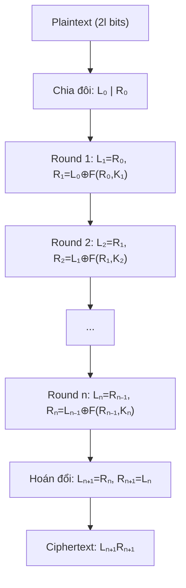
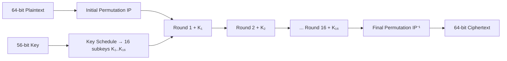
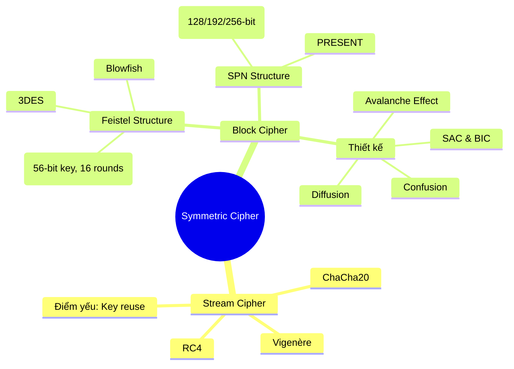

# Bài 4: Modern Symmetric Ciphers (Phần 1)

---

## 1. Tổng quan Mật mã học

```
Cryptology = Cryptography + Cryptanalysis
```

Mật mã học hiện đại hướng đến các mục tiêu bảo mật sau:

| Mục tiêu | Ý nghĩa |
|---|---|
| **Confidentiality** | Bảo mật – chỉ người được phép mới đọc được dữ liệu |
| **Authentication** | Xác thực – đảm bảo đúng nguồn gốc của thông tin |
| **Integrity** | Toàn vẹn – dữ liệu không bị thay đổi trong quá trình truyền |
| **Non-repudiation** | Không thể chối bỏ – người gửi không thể phủ nhận hành động |
| **Availability** | Sẵn sàng – hệ thống luôn phục vụ được người dùng hợp lệ |
| **Privacy** | Riêng tư – bảo vệ thông tin cá nhân |

**Các thành phần chính trong hệ thống mật mã:**

- Hệ mã đối xứng: AES, DES
- Hệ mã bất đối xứng: RSA, ECC, CRYSTALS-KYBER
- Hàm băm (Hash functions)
- Mã xác thực thông điệp (MAC)
- Chữ ký số / Chứng chỉ số

---

## 2. Phân tích mật mã (Cryptanalysis) – Mã cổ điển

### 2.1 Transposition Ciphers (Mã hoán vị)

> Không thay thế ký tự mà **xáo trộn vị trí** của chúng.

#### Rail Fence Cipher
Ghi plaintext theo hình sóng (zigzag) qua nhiều hàng, sau đó đọc từng hàng:

```
Plaintext: HELLOWORLD
Hàng 1: H . L . O . O . L .
Hàng 2: . E . L . W . R . D
→ Ciphertext: HLOOLWRD + ELWR... → HLOOEL WRLD
```

#### Columnar Transposition Cipher

Viết plaintext theo hàng ngang trong bảng chữ nhật, sau đó đọc theo cột theo thứ tự cột được xác định bởi **key**.

```
Key:   4 3 1 2 5 6 (hoán vị cột)
Plain: A T T A C K
       I N G T H E
       P A L A C E

→ Đọc theo cột đã sắp xếp:
Ciphertext: TTNAAPTMTSUOAODWCOIXKNLYPETZ
```

!!! info "Điểm mấu chốt"
    Thứ tự cột chính là **key** của thuật toán. Kẻ tấn công cần biết số cột và thứ tự hoán vị để giải mã.

---

## 3. Stream Cipher (Mã dòng)

### 3.1 Nguyên lý hoạt động

Stream cipher mã hóa **từng bit hoặc byte** một, sử dụng một keystream (dòng khóa) sinh ra từ khóa bí mật.

```
Ciphertext cᵢ = mᵢ ⊕ kᵢ
```

```
Keystream:   k₁  k₂  k₃  ...  kₙ
Plaintext:   m₁  m₂  m₃  ...  mₙ
                ⊕   ⊕   ⊕        ⊕
Ciphertext:  c₁  c₂  c₃  ...  cₙ
```

Keystream được sinh từ một **Pseudorandom Bit Generator (PRNG)** sử dụng **secret seed** (khóa bí mật ban đầu).

### 3.2 Vigenère Cipher – Stream Cipher cổ điển

```
cᵢ = (mᵢ + kᵢ) mod 26
```

Ví dụ:
```
Plaintext:   A  T  T  A  C  K     A  T     D  A  W  N
             0  19 19 0  2  10    0  19    3  0  22 13
Key (LEMON): L  E  M  O  N  E  M  O  N    L  E  M  O  N
             11 4  12 14 13 4  12 14 13   11 4  12 14 13
             -----------------------------------------------
Ciphertext:  L  X  F  O  P  V  E  F  R   N  H  R  (mod 26)
             11 23 5  14 15 21 4  5  17  13 7  17
```

### 3.3 Cryptanalysis của Stream Cipher

!!! danger "Điểm yếu nghiêm trọng – Key Reuse"
    **Không bao giờ dùng lại key cho nhiều bản rõ khác nhau!**

**Tấn công khi biết cặp (P₁, C₁):**

```
C₁ = K ⊕ P₁
→ K = C₁ ⊕ P₁  (tính được K!)
→ Pₙ = Cₙ ⊕ K  (giải mã bất kỳ ciphertext nào dùng K)
```

**Kịch bản thực tế:**
- Nếu dùng session key cho toàn bộ phiên truyền hình ảnh/video
- Kẻ tấn công chọn plaintext (Chosen Plaintext Attack) → biết (P₁, C₁) → khôi phục K → tấn công toàn bộ phiên

!!! tip "Giải pháp"
    Dùng **One-time key** (mỗi phiên một khóa mới) hoặc dùng **Block Cipher với IV (Initialization Vector)** thay đổi theo từng khối.

---

## 4. Block Cipher (Mã khối)

### 4.1 Định nghĩa

Block Cipher mã hóa **một khối plaintext cố định** thành một khối ciphertext có cùng độ dài.

- Kích thước block phổ biến: **64 bit** (DES) hoặc **128 bit** (AES)
- Hai bên chia sẻ **khóa đối xứng**
- Được sử dụng rộng rãi nhất trong các ứng dụng mạng

### 4.2 So sánh Stream Cipher vs Block Cipher

| Tiêu chí | Stream Cipher | Block Cipher |
|---|---|---|
| Đơn vị xử lý | Bit / Byte | Khối (64-128 bit) |
| Tốc độ | Nhanh hơn | Chậm hơn |
| Ứng dụng | Truyền thực thời (video/audio) | File, dữ liệu lưu trữ, network |
| Ví dụ | RC4, ChaCha20 | DES, AES |
| Key stream | Có, sinh từ PRNG | Không (key dùng trực tiếp hoặc mở rộng) |

### 4.3 Block Substitution

Với block **n-bit**, mỗi bản rõ là một giá trị từ `0` đến `2ⁿ - 1`, và cần ánh xạ sang một trong `2ⁿ` giá trị ciphertext.

```
Số lượng hoán vị (keys) có thể = 2ⁿ!
```

Ví dụ block 4-bit:
```
2⁴ = 16 giá trị → 16! ≈ 2.09 × 10¹³ hoán vị có thể
```

!!! warning "Vấn đề thực tế"
    Với block 64-bit: `2⁶⁴!` → số khổng lồ, không thể lưu bảng thay thế. Cần cấu trúc toán học thay thế → Feistel Cipher ra đời.

---

## 5. Feistel Cipher

### 5.1 Nguồn gốc và Ý tưởng

Horst Feistel (1973) đề xuất mã hóa **kết hợp luân phiên** giữa:
- **Substitution (Thay thế):** Thay mỗi phần tử bằng phần tử khác tương ứng
- **Permutation (Hoán vị):** Thay đổi thứ tự các phần tử (không thêm/xóa)

Đây là ứng dụng thực tế của đề xuất của **Claude Shannon** về **Product Cipher** kết hợp:

### 5.2 Diffusion và Confusion (Shannon, 1949)

!!! abstract "Hai khái niệm nền tảng của mật mã hiện đại"

**Diffusion (Khuếch tán):**
> Mỗi bit plaintext ảnh hưởng đến nhiều bit ciphertext, phá vỡ cấu trúc thống kê của plaintext.

Ví dụ: Đổi 1 bit plaintext → ~50% bit ciphertext thay đổi (Avalanche Effect).

**Confusion (Làm rối):**
> Làm cho mối quan hệ giữa ciphertext và key trở nên phức tạp đến mức dù biết thống kê ciphertext cũng không suy ra được key.

Thực hiện qua: S-boxes (bảng thay thế phi tuyến).

### 5.3 Sơ đồ Feistel Cipher (FCS)



### 5.4 Công thức Mã hóa và Giải mã

**Mã hóa (Encryption):**
```
Với M = L₀R₀, thực hiện n vòng:
    Lᵢ = Rᵢ₋₁
    Rᵢ = Lᵢ₋₁ ⊕ F(Rᵢ₋₁, Kᵢ)
Ciphertext C = Lₙ₊₁Rₙ₊₁  (trong đó Lₙ₊₁=Rₙ, Rₙ₊₁=Lₙ)
```

**Giải mã (Decryption):**
```
Viết C = L'₀R'₀, thực hiện n vòng với key đảo ngược:
    L'ᵢ = R'ᵢ₋₁
    R'ᵢ = L'ᵢ₋₁ ⊕ F(R'ᵢ₋₁, K'ₙ₋ᵢ₊₁)
Plaintext M = L'ₙ₊₁R'ₙ₊₁
```

!!! success "Điểm hay của Feistel"
    **Thuật toán giải mã giống hệt mã hóa**, chỉ khác thứ tự subkey (đảo ngược). Điều này đơn giản hóa đáng kể việc triển khai phần cứng.

### 5.5 Chứng minh tính đúng đắn của FCS Decryption

Cần chứng minh: sau khi giải mã, nhận lại được M = L₀R₀.

**Chứng minh bằng quy nạp** – cần chứng minh 2 đẳng thức:
```
(1) L'ᵢ = Rₙ₋ᵢ
(2) R'ᵢ = Lₙ₋ᵢ
```

**Cơ sở (i=0):**
```
L'₀ = Lₙ₊₁ = Rₙ  → (1) đúng
R'₀ = Rₙ₊₁ = Lₙ  → (2) đúng
```

**Giả thiết quy nạp:** Giả sử đúng với i-1:
```
L'ᵢ₋₁ = Rₙ₋ᵢ₊₁
R'ᵢ₋₁ = Lₙ₋ᵢ₊₁
```

**Bước quy nạp:**
```
L'ᵢ = R'ᵢ₋₁ = Lₙ₋ᵢ₊₁ = Rₙ₋ᵢ  (do encrypt: Lₙ₋ᵢ₊₁ = Rₙ₋ᵢ)
→ (1) đúng ✓

R'ᵢ = L'ᵢ₋₁ ⊕ F(R'ᵢ₋₁, Kₙ₋ᵢ₊₁)
    = Rₙ₋ᵢ₊₁ ⊕ F(Lₙ₋ᵢ₊₁, Kₙ₋ᵢ₊₁)        [bởi giả thiết]
    = [Lₙ₋ᵢ ⊕ F(Rₙ₋ᵢ, Kₙ₋ᵢ₊₁)] ⊕ F(Rₙ₋ᵢ, Kₙ₋ᵢ₊₁)  [bởi encrypt]
    = Lₙ₋ᵢ
→ (2) đúng ✓
```

Kết quả: L'ₙ₊₁ = R'ₙ = L₀, R'ₙ₊₁ = L'ₙ = R₀ → **M = L₀R₀** được khôi phục. ✓

### 5.6 Các tham số thiết kế Feistel Cipher

| Tham số | Ảnh hưởng |
|---|---|
| **Block size** | Lớn hơn → an toàn hơn, nhưng chậm hơn |
| **Key size** | Lớn hơn → an toàn hơn, chống brute-force |
| **Số vòng (rounds)** | Nhiều vòng → khó phân tích hơn; 1 vòng không đủ |
| **Subkey generation** | Phức tạp hơn → khó phân tích key hơn |
| **Hàm F** | Phi tuyến cao → chống cryptanalysis |
| **Tốc độ phần mềm** | Quan trọng khi không có hardware support |

---

## 6. Data Encryption Standard (DES)

### 6.1 Lịch sử

- Phát hành năm **1977** bởi National Bureau of Standards (nay là NIST)
- Chuẩn FIPS 46, tên thuật toán: **Data Encryption Algorithm (DEA)**
- Thống trị mã hóa toàn cầu cho đến khi AES ra đời năm **2001**

**Thông số kỹ thuật:**
```
Block size:  64 bit
Key size:    56 bit (lưu dưới dạng 64-bit, loại bỏ 8 bit parity)
Số vòng:     16
```

### 6.2 Luồng mã hóa DES



### 6.3 Các bước mã hóa DES

```
1. IP(M) = L₀R₀   (|L₀|=|R₀|=32 bits)

2. Với i = 1..16:
      Lᵢ = Rᵢ₋₁
      Rᵢ = Lᵢ₋₁ ⊕ F(Rᵢ₋₁, Kᵢ)

3. C = IP⁻¹(R₁₆L₁₆)   ← chú ý hoán đổi L và R trước khi áp IP⁻¹
```

### 6.4 Sinh subkey trong DES

```
Key gốc: 64-bit (K = k₁k₂...k₆₄)

Bước 1: Loại bỏ các bit parity (vị trí 8, 16, 24, ..., 64)
        → còn 56-bit

Bước 2: Áp dụng hoán vị ban đầu cho key: IPₖₑᵧ(K)

Bước 3: Chia thành U₀V₀ (mỗi phần 28-bit)

Bước 4: Với mỗi vòng i = 1..16:
        Uᵢ = LS_{z(i)}(Uᵢ₋₁)   ← Dịch trái vòng 1 hoặc 2 bit
        Vᵢ = LS_{z(i)}(Vᵢ₋₁)

Bước 5: Kᵢ = Pₖₑᵧ(UᵢVᵢ)   ← Hoán vị nén 56-bit → 48-bit
```

!!! note "Số lần dịch theo từng vòng"
    Vòng 1,2,9,16: dịch **1 bit**; các vòng còn lại: dịch **2 bit**.

### 6.5 Hàm F trong DES

```
F(Rᵢ₋₁, Kᵢ) = P( S( EP(Rᵢ₋₁) ⊕ Kᵢ ) )
```

**Các bước:**

```
Rᵢ₋₁ (32-bit)
    ↓ EP (Expansion Permutation)
48-bit  (mở rộng bằng cách sao chép một số bit)
    ↓ ⊕ Kᵢ (48-bit subkey)
48-bit
    ↓ S-boxes (8 hộp, mỗi hộp: 6-bit → 4-bit)
32-bit
    ↓ P (Permutation)
32-bit = F(Rᵢ₋₁, Kᵢ)
```

### 6.6 S-boxes – Trái tim của DES

Hàm S biến đổi 48-bit thành 32-bit qua **8 S-box**, mỗi S-box là ma trận 4×16.

**Cách sử dụng S-box:**
```
Input: 6 bit = b₁b₂b₃b₄b₅b₆

Row    = b₁b₆          (2-bit, chọn hàng 0-3)
Column = b₂b₃b₄b₅      (4-bit, chọn cột 0-15)
Output = giá trị 4-bit tại [row][column]
```

**Ví dụ với S₁:**
```
Input:  "011011"
b₁=0, b₆=1 → Row = 01 = 1
b₂b₃b₄b₅ = 1101 = 13 → Column = 13

S₁[1][13] = 5 = "0101"
Output: "0101"
```

!!! tip "Tại sao S-box quan trọng?"
    S-box là thành phần **phi tuyến duy nhất** trong DES. Thiếu nó, toàn bộ thuật toán sẽ là tuyến tính và dễ phân tích. Các S-box được thiết kế đặc biệt để:
    - Thỏa mãn **SAC** (Strict Avalanche Criterion): mỗi bit output thay đổi xác suất 1/2 khi đảo 1 bit input
    - Thỏa mãn **BIC** (Bit Independence Criterion): các bit output thay đổi độc lập nhau

### 6.7 Câu hỏi: DES có đủ an toàn không?

??? question "DES có đủ an toàn không? Tại sao?"

    **Không!** DES không còn an toàn vì các lý do sau:

    **1. Độ dài key quá ngắn:**
    ```
    Key 56-bit → 2⁵⁶ ≈ 7.2 × 10¹⁶ khóa có thể
    ```
    - 1997: Brute-force qua Internet trong vài tháng
    - 1998: EFF Deep Crack phá trong vài ngày
    - 1999: Kết hợp → **22 giờ**
    - Ngày nay: GPU hiện đại → vài giây/phút

    **2. Số vòng:**
    Nếu DES chỉ có ≤15 vòng, **Differential Cryptanalysis** hiệu quả hơn brute-force.

    **Giải pháp tạm thời:** Triple DES (3DES):
    ```
    C = Eₖ₃(Dₖ₂(Eₖ₁(P)))
    Key size: 112-bit hoặc 168-bit
    ```

    **Giải pháp dài hạn:** → **AES (Advanced Encryption Standard)**

---

## 7. Nguyên tắc thiết kế Block Cipher

### 7.1 Số vòng (Number of Rounds)

- Một vòng duy nhất: **không đủ an toàn**
- Tiêu chí: số vòng phải đủ để mọi tấn công đã biết đòi hỏi effort **nhiều hơn** brute-force
- DES với 16 vòng: differential cryptanalysis cần ≥2⁵⁵ phép tính, ngang bằng brute-force

### 7.2 Thiết kế hàm F

- F phải **phi tuyến cao** → chống linear/differential cryptanalysis
- Avalanche Effect: thay đổi 1 bit input → ~50% bit output thay đổi

**SAC (Strict Avalanche Criterion):**
```
Với mỗi bit output j và mỗi bit input i:
Pr[output bit j thay đổi | đảo input bit i] = 1/2
```

**BIC (Bit Independence Criterion):**
```
Bit output j và k phải thay đổi ĐỘC LẬP nhau
khi đảo bất kỳ bit input i nào.
```

### 7.3 Sinh subkey

- Mỗi subkey phải **khó đoán** từ subkey khác
- Key schedule phải thỏa mãn **SAC và BIC** cho cặp (key, ciphertext)
- Ngăn chặn: related-key attacks, slide attacks

---

## 8. Tổng kết & Bức tranh toàn cảnh



!!! summary "Bài học cốt lõi"
    1. **Stream cipher**: nhanh, nhưng không được tái sử dụng key — nguy hiểm chí mạng
    2. **Block cipher**: linh hoạt, an toàn hơn khi thiết kế đúng
    3. **Feistel structure**: giải mã = mã hóa với subkey đảo — tiết kiệm, thanh lịch
    4. **DES**: lịch sử quan trọng nhưng đã lỗi thời do key 56-bit quá ngắn
    5. **Diffusion + Confusion** (Shannon): nền tảng thiết kế mọi cipher hiện đại
    6. **SAC + BIC**: tiêu chí định lượng để đánh giá chất lượng S-box và key schedule
