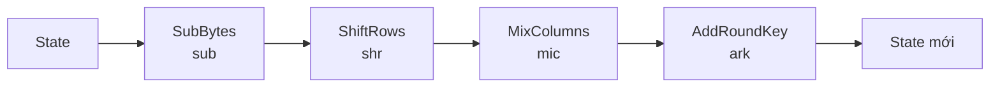
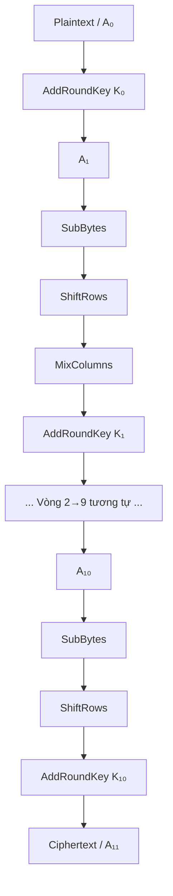
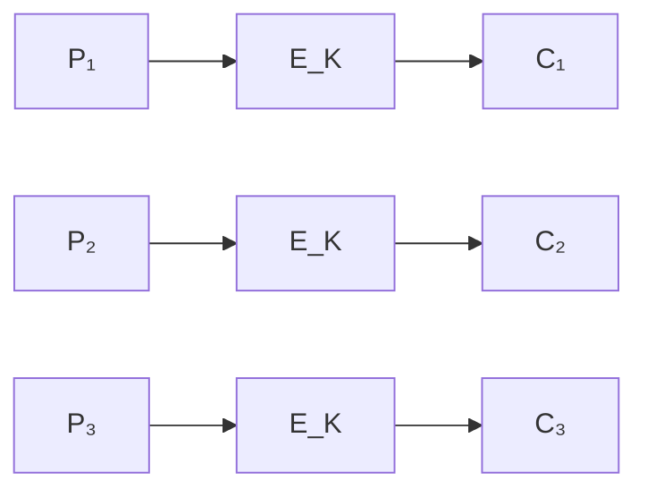
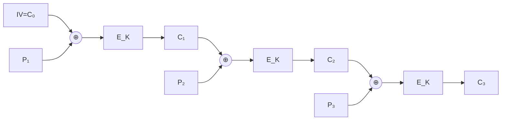
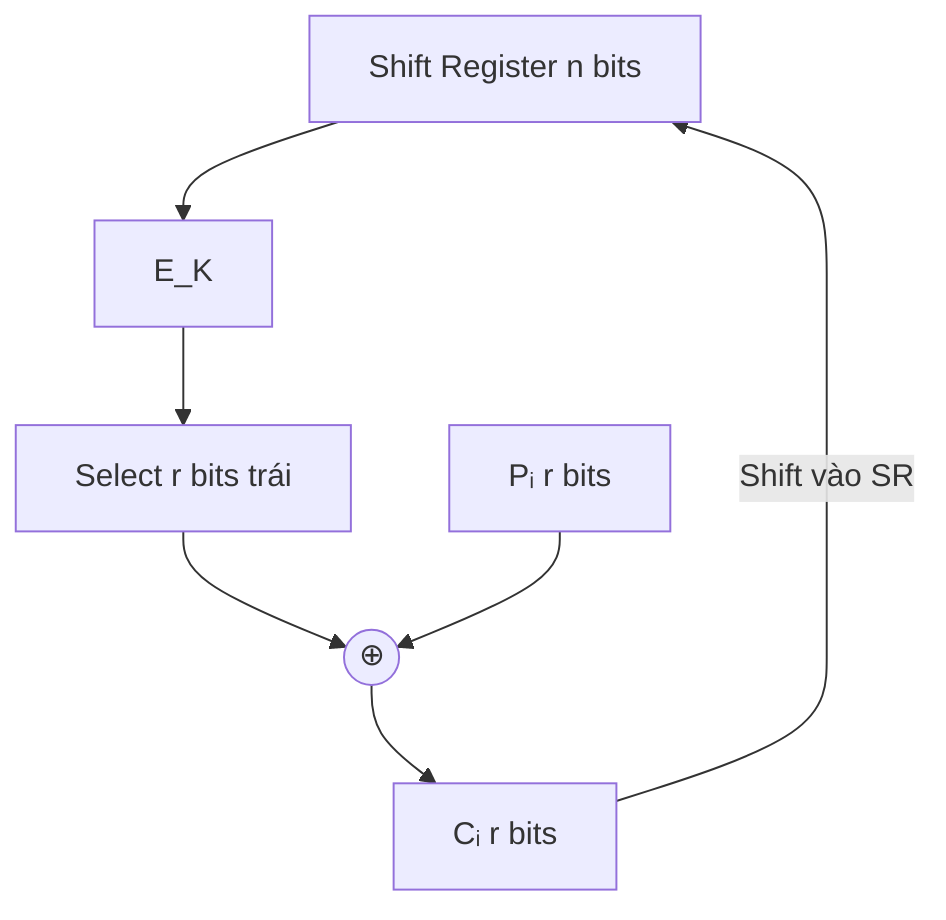
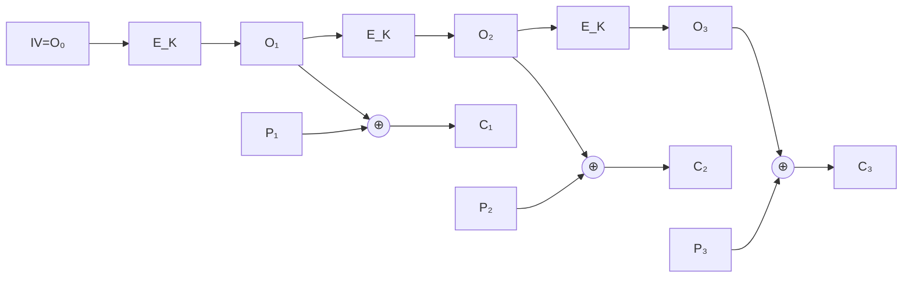
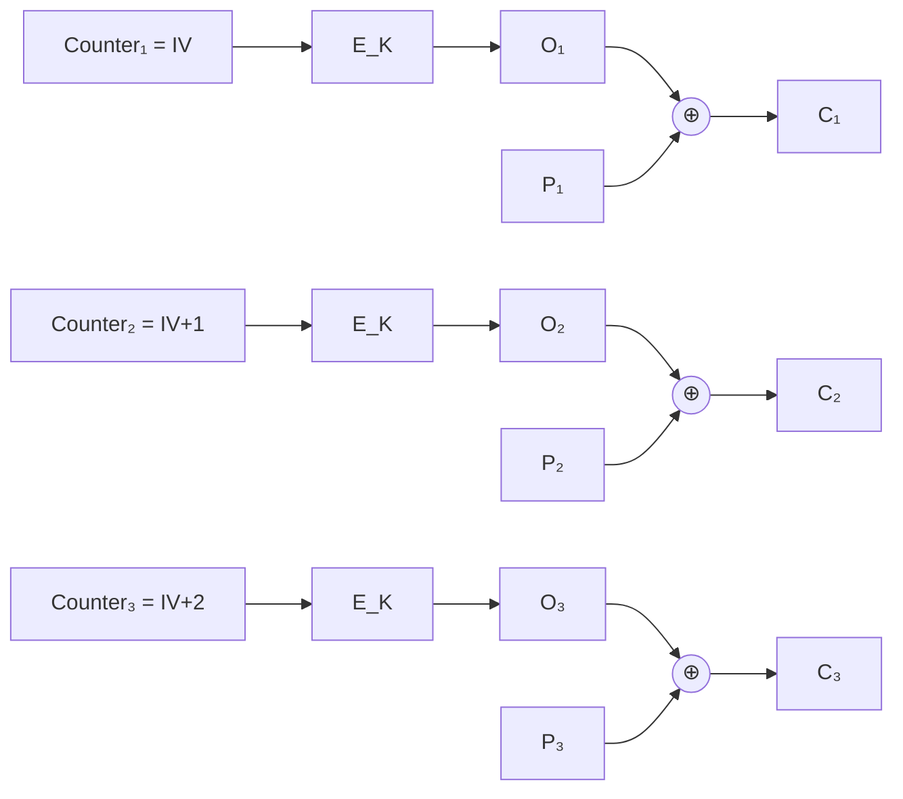
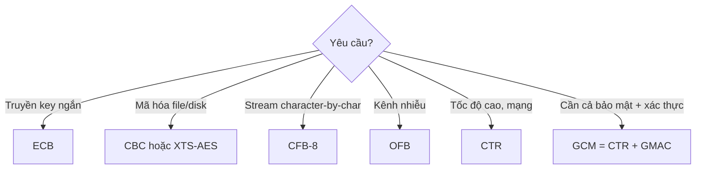
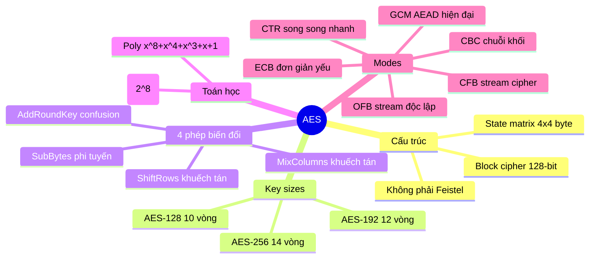

# Bài 5: Modern Symmetric Ciphers (Phần 2)

---

## 1. DES – Ôn tập nhanh

### 1.1 Cấu trúc tổng quan

DES (Data Encryption Standard) là một **block cipher** kiểu **Feistel**, hoạt động trên khối 64-bit với khóa 56-bit, thực hiện **16 vòng** mã hóa.

Hàm vòng F được định nghĩa:

```
F(Rᵢ₋₁, Kᵢ) = P(S(EP(Rᵢ₋₁) ⊕ Kᵢ))
```

Trong đó:
- **EP**: Expansion Permutation – mở rộng 32-bit → 48-bit
- **S**: S-Box substitution – thay thế phi tuyến
- **P**: Permutation – hoán vị

### 1.2 Bảo mật & Tấn công

!!! danger "DES đã bị phá vỡ hoàn toàn"
    - Không gian khóa chỉ có `2⁵⁶ ≈ 7.2 × 10¹⁶` khóa – quá nhỏ với phần cứng hiện đại.
    - **1997**: DESCHALL Project phá lần đầu tiên bằng brute-force phân tán.
    - **1998**: EFF's *Deep Crack* phá trong **56 giờ**.
    - **1999**: Deep Crack + distributed.net phá trong **22 giờ 15 phút**.
    - **2016**: Một GPU NVIDIA GTX 1080 Ti phá trung bình trong **15 ngày** (full search 30 ngày).
    - **2017**: Rainbow table tấn công chosen-plaintext phá trong **25 giây** với một plaintext cố định.

> **Kết luận**: DES **không còn an toàn** cho bất kỳ ứng dụng nào. Thay thế bằng AES.

---

## 2. Advanced Encryption Standard (AES)

### 2.1 Lịch sử ra đời

- **1997**: NIST khởi động cuộc thi tìm kiếm chuẩn mã hóa mới thay thế DES.
- **2001**: Thuật toán **Rijndael** (của Vincent Rijmen và Joan Daemen, người Bỉ) được chọn làm AES.

### 2.2 Đặc điểm cơ bản

| Thuộc tính | Giá trị |
|---|---|
| Loại | Block cipher (không phải Feistel) |
| Kích thước khối | 128 bit (16 byte) |
| Kích thước khóa | 128 / 192 / 256 bit |
| Số vòng | 10 / 12 / 14 vòng |
| Đơn vị cơ bản | Byte (không phải bit như DES) |

!!! info "AES không phải Feistel"
    Khác với DES dùng cấu trúc Feistel (chia đôi khối, chỉ mã hóa một nửa mỗi vòng), AES mã hóa **toàn bộ khối** mỗi vòng qua 4 phép biến đổi. Điều này làm AES hiệu quả và an toàn hơn trên phần cứng hiện đại.

### 2.3 Biểu diễn State Matrix

Mỗi khối 16 byte được biểu diễn dưới dạng **ma trận 4×4** (gọi là **state matrix**), đọc theo cột:

```
Byte[0]  Byte[4]  Byte[8]  Byte[12]
Byte[1]  Byte[5]  Byte[9]  Byte[13]
Byte[2]  Byte[6]  Byte[10] Byte[14]
Byte[3]  Byte[7]  Byte[11] Byte[15]
```

---

## 3. Số học trường hữu hạn GF(2ⁿ) – Finite Field Arithmetic

### 3.1 Tại sao cần trường hữu hạn?

AES thực hiện các phép toán **cộng, trừ, nhân, chia** trên các byte. Để phép **chia có nghĩa** (tức là mọi phần tử khác 0 đều có nghịch đảo nhân), ta cần làm việc trong một **trường (field)**.

!!! question "Câu hỏi: Tập Z₂ⁿ = {0,1,...,2ⁿ-1} có phải trường không?"
    **Trả lời: KHÔNG.**

    Ví dụ với Z₈ = {0,1,2,3,4,5,6,7}:
    
    - `3 × 3 mod 8 = 1` ✅ (3 có nghịch đảo là 3)
    - `5 × 5 mod 8 = 1` ✅ (5 có nghịch đảo là 5)
    - `7 × 7 mod 8 = 1` ✅ (7 có nghịch đảo là 7)
    - `2 × x mod 8 = 1` → **không tồn tại x** ❌
    - `4 × x mod 8 = 1` → **không tồn tại x** ❌
    - `6 × x mod 8 = 1` → **không tồn tại x** ❌

    Vì số chẵn không có nghịch đảo trong Z₂ⁿ nên **Z₂ⁿ không phải trường**.

### 3.2 GF(2ⁿ) – Trường hữu hạn Galois

Để xây dựng trường với 2ⁿ phần tử, ta dùng **đa thức modulo một đa thức bất khả quy bậc n** trên GF(2):

```
GF(2ⁿ) = GF(2)[x] / (p(x))
```

Trong đó `p(x)` là đa thức **bất khả quy** (irreducible polynomial) bậc n.

### 3.3 GF(2⁸) – Trường dùng trong AES (Rijndael's Finite Field)

AES sử dụng đa thức bất khả quy:

$$p(x) = x^8 + x^4 + x^3 + x + 1$$

Mỗi **byte** `b₇b₆b₅b₄b₃b₂b₁b₀` được biểu diễn tương ứng với đa thức:

$$r(x) = b_7x^7 + b_6x^6 + b_5x^5 + b_4x^4 + b_3x^3 + b_2x^2 + b_1x + b_0$$

**Ví dụ:**
```
Byte: 0x57 = 0101 0111
→ Đa thức: x⁶ + x⁴ + x² + x + 1
```

**Phép cộng trong GF(2⁸)** = XOR từng bit (không có nhớ):
```
0x57 ⊕ 0x83 = 0101 0111
               1000 0011
             = 1101 0100 = 0xD4
```

**Phép nhân trong GF(2⁸)**: Nhân hai đa thức rồi lấy **modulo** `x⁸+x⁴+x³+x+1`.

!!! tip "Tại sao dùng GF(2⁸)?"
    - Dữ liệu máy tính là byte (8-bit) → biểu diễn tự nhiên.
    - Mọi phép tính đều cho kết quả đúng 1 byte.
    - Phép chia (tức tìm nghịch đảo) **luôn tồn tại** với mọi byte ≠ 0.
    - Hiệu quả khi implement bằng bảng tra (lookup table).

---

## 4. Bốn phép biến đổi cơ bản trong AES

Mỗi vòng AES (trừ vòng cuối) gồm **4 phép biến đổi** áp dụng lên state matrix:



### 4.1 SubBytes (sub) – Thay thế byte

#### Mục đích
Tạo ra **tính phi tuyến (non-linearity)** — thành phần quan trọng nhất để chống lại:
- **Differential cryptanalysis** (phân tích vi sai)
- **Linear cryptanalysis** (phân tích tuyến tính)

#### Cơ chế hoạt động

SubBytes áp dụng một **S-Box 16×16** lên từng byte của state matrix. S-Box này được xây dựng từ hai bước toán học:

1. **Tính nghịch đảo nhân** trong GF(2⁸): `b' = b⁻¹` (nếu b ≠ 0, ngược lại b' = 0)
2. **Biến đổi affine**: áp dụng phép nhân ma trận GF(2) + XOR với hằng số `0x63`

#### Cách tra S-Box

Với byte đầu vào `w = b₀b₁b₂b₃b₄b₅b₆b₇`:
- **Row index** `i = b₀b₁b₂b₃` (4 bit đầu)
- **Column index** `j = b₄b₅b₆b₇` (4 bit sau)
- **Output** = `S[i][j]`

!!! example "Ví dụ tra S-Box"
    Plaintext byte `P = 1101 0011₂ = 0xD3`
    - Row: `i = 1101₂ = D`
    - Col: `j = 0011₂ = 3`
    - Tra S-Box tại hàng D, cột 3 → `C = 0x66`

#### SubBytes trên toàn state matrix

```
         [a₀₀ a₀₁ a₀₂ a₀₃]         [S(a₀₀) S(a₀₁) S(a₀₂) S(a₀₃)]
sub(A) = [a₁₀ a₁₁ a₁₂ a₁₃]    →    [S(a₁₀) S(a₁₁) S(a₁₂) S(a₁₃)]
         [a₂₀ a₂₁ a₂₂ a₂₃]         [S(a₂₀) S(a₂₁) S(a₂₂) S(a₂₃)]
         [a₃₀ a₃₁ a₃₂ a₃₃]         [S(a₃₀) S(a₃₁) S(a₃₂) S(a₃₃)]
```

Để giải mã, dùng **Inverse S-Box** (sub⁻¹): `sub(sub⁻¹(A)) = A`

---

### 4.2 ShiftRows (shr) – Dịch vòng hàng

#### Mục đích
Tạo ra **tính khuếch tán (diffusion)** — đảm bảo mỗi byte của output phụ thuộc vào nhiều byte của input khác nhau.

#### Cơ chế hoạt động

Dịch vòng trái (left circular shift) hàng thứ `i` đi `i-1` vị trí (hàng đầu không dịch):

```
Hàng 0: không dịch  → [a₀₀  a₀₁  a₀₂  a₀₃]
Hàng 1: dịch 1 trái → [a₁₁  a₁₂  a₁₃  a₁₀]
Hàng 2: dịch 2 trái → [a₂₂  a₂₃  a₂₀  a₂₁]
Hàng 3: dịch 3 trái → [a₃₃  a₃₀  a₃₁  a₃₂]
```

Giải mã dùng **shr⁻¹**: dịch vòng **phải** tương ứng.

!!! tip "Tại sao ShiftRows quan trọng?"
    ShiftRows kết hợp với MixColumns tạo ra hiệu ứng **"full diffusion"**: sau 2 vòng, mỗi byte output phụ thuộc vào **tất cả 16 byte** input ban đầu. Đây là nền tảng của **AES Wide Trail Strategy**.

---

### 4.3 MixColumns (mic) – Trộn cột

#### Mục đích
Cũng tạo **tính khuếch tán (diffusion)**, hoạt động theo cột. Mỗi byte output của một cột phụ thuộc vào **tất cả 4 byte** của cột đó.

#### Cơ chế hoạt động

Nhân ma trận state với **ma trận M** trong GF(2⁸):

```
    [2  3  1  1]
M = [1  2  3  1]
    [1  1  2  3]
    [3  1  1  2]
```

Với phép tính trong GF(2⁸):
- Số `1` = không biến đổi
- Số `2` = hàm M(w): dịch trái 1 bit, nếu bit 7 = 1 thì XOR với `0x1B`
- Số `3` = M(w) ⊕ w

```
         M(b₇=0): b₆b₅b₄b₃b₂b₁b₀0
M(byte) = 
         M(b₇=1): b₆b₅b₄b₃b₂b₁b₀0 ⊕ 00011011
```

#### Công thức chi tiết cho từng byte của cột j

```
a'₀ⱼ = M(a₀ⱼ) ⊕ [M(a₁ⱼ) ⊕ a₁ⱼ] ⊕ a₂ⱼ ⊕ a₃ⱼ
a'₁ⱼ = a₀ⱼ ⊕ M(a₁ⱼ) ⊕ [M(a₂ⱼ) ⊕ a₂ⱼ] ⊕ a₃ⱼ
a'₂ⱼ = a₀ⱼ ⊕ a₁ⱼ ⊕ M(a₂ⱼ) ⊕ [M(a₃ⱼ) ⊕ a₃ⱼ]
a'₃ⱼ = [M(a₀ⱼ) ⊕ a₀ⱼ] ⊕ a₁ⱼ ⊕ a₂ⱼ ⊕ M(a₃ⱼ)
```

#### Ma trận nghịch đảo M⁻¹

```
      [14  11  13   9]
M⁻¹ = [ 9  14  11  13]
      [13   9  14  11]
      [11  13   9  14]
```

> **Vòng cuối** của AES **không có MixColumns** — vì vòng cuối thực hiện MixColumns sẽ không tăng thêm bảo mật nhưng lại gây khó khăn cho việc giải mã.

---

### 4.4 AddRoundKey (ark) – Cộng khóa vòng

#### Mục đích
Đây là bước **duy nhất** đưa khóa bí mật vào quá trình mã hóa — tạo **confusion** (che giấu quan hệ giữa key và ciphertext).

#### Cơ chế hoạt động

XOR từng byte của state matrix với byte tương ứng của **round key** Kᵢ:

```
ark(A, Kᵢ) = A ⊕ Kᵢ
```

```
[k₀₀⊕a₀₀  k₀₁⊕a₀₁  k₀₂⊕a₀₂  k₀₃⊕a₀₃]
[k₁₀⊕a₁₀  k₁₁⊕a₁₁  k₁₂⊕a₁₂  k₁₃⊕a₁₃]
[k₂₀⊕a₂₀  k₂₁⊕a₂₁  k₂₂⊕a₂₂  k₂₃⊕a₂₃]
[k₃₀⊕a₃₀  k₃₁⊕a₃₁  k₃₂⊕a₃₂  k₃₃⊕a₃₃]
```

!!! note "ark là phép tự nghịch đảo"
    Vì XOR là tự đảo ngược: `ark(ark(A, Kᵢ), Kᵢ) = A`
    
    Điều này giúp giải mã và mã hóa dùng **cùng một hàm** ở bước này.

---

## 5. Quá trình mã hóa/giải mã AES-128

### 5.1 Mã hóa AES-128 (10 vòng)



**Công thức tóm tắt:**
```
A₁ = ark(A₀, K₀)
Aᵢ₊₁ = ark(mic(shr(sub(Aᵢ))), Kᵢ)    với i = 1,...,9
A₁₁ = ark(shr(sub(A₁₀)), K₁₀)         ← Vòng cuối KHÔNG có MixColumns
```

### 5.2 Giải mã AES-128

```
C₁ = ark(C₀, K₁₀)
Cᵢ₊₁ = mic⁻¹(ark(sub⁻¹(shr⁻¹(Cᵢ)), K₁₀₋ᵢ))    với i = 1,...,9
C₁₁ = ark(sub⁻¹(shr⁻¹(C₁₀)), K₀)
```

Thứ tự phép biến đổi ngược lại: `shr⁻¹ → sub⁻¹ → ark → mic⁻¹`

### 5.3 Chứng minh tính đúng đắn của giải mã

??? details "Xem chứng minh đầy đủ"
    **Mục tiêu**: Chứng minh `C₁₁ = A₀`

    **Bổ đề**: `Cᵢ = shr(sub(A₁₁₋ᵢ))` với i = 1,...,10 (chứng minh bằng quy nạp)

    **Cơ sở (i=1)**:
    ```
    C₁ = ark(A₁₁, K₁₀)
       = A₁₁ ⊕ K₁₀
       = ark(shr(sub(A₁₀)), K₁₀) ⊕ K₁₀
       = (shr(sub(A₁₀)) ⊕ K₁₀) ⊕ K₁₀
       = shr(sub(A₁₀)) = shr(sub(A₁₁₋₁)) ✓
    ```

    **Bước quy nạp** (giả sử đúng với i, chứng minh i+1):
    ```
    Cᵢ₊₁ = mic⁻¹(ark(sub⁻¹(shr⁻¹(Cᵢ)), K₁₀₋ᵢ))
          = mic⁻¹(ark(sub⁻¹(shr⁻¹(shr(sub(A₁₁₋ᵢ)))), K₁₀₋ᵢ))
          = mic⁻¹(A₁₁₋ᵢ ⊕ K₁₀₋ᵢ)
          = mic⁻¹(ark(mic(shr(sub(A₁₀₋ᵢ))), K₁₀₋ᵢ) ⊕ K₁₀₋ᵢ)
          = mic⁻¹(mic(shr(sub(A₁₀₋ᵢ))))
          = shr(sub(A₁₀₋ᵢ)) = shr(sub(A₁₁₋(ᵢ₊₁))) ✓
    ```

    **Kết luận**:
    ```
    C₁₁ = ark(sub⁻¹(shr⁻¹(C₁₀)), K₀)
         = sub⁻¹(shr⁻¹(shr(sub(A₁)))) ⊕ K₀
         = A₁ ⊕ K₀
         = (A₀ ⊕ K₀) ⊕ K₀
         = A₀ ✓
    ```

---

## 6. AES Key Expansion – Mở rộng khóa

### 6.1 Mục tiêu

Từ khóa gốc K (128/192/256 bit), sinh ra **11 round keys** (với AES-128), mỗi round key là 128 bit (4 word × 32 bit). Tổng cộng **44 word** = 176 byte.

### 6.2 Định nghĩa hàm M̃ (xtime)

```
         b₆b₅b₄b₃b₂b₁b₀0             nếu b₇ = 0
M̃(byte) = 
         b₆b₅b₄b₃b₂b₁b₀0 ⊕ 00011011  nếu b₇ = 1
```

Đây là phép nhân với `x` (tức nhân `2`) trong GF(2⁸).

### 6.3 Hàm T (word substitution)

Hàm T biến đổi 1 word (4 byte) → 1 word, có tham số vòng `j`:

1. **RotWord**: dịch vòng trái byte (w₁w₂w₃w₄ → w₂w₃w₄w₁)
2. **SubWord**: áp dụng S-Box lên từng byte
3. **Rcon XOR**: XOR byte đầu tiên với round constant `m(j-1)`

```python
def T(word, j):
    w1, w2, w3, w4 = word
    # Bước 1: RotWord
    rotated = [w2, w3, w4, w1]
    # Bước 2: SubWord
    subbed = [S_BOX[b] for b in rotated]
    # Bước 3: XOR với round constant
    subbed[0] ^= RCON[j-1]
    return subbed
```

### 6.4 Công thức sinh round key

```
W[0..3] = K[0..127]  ← 4 word đầu là khóa gốc

         W[i-4] ⊕ T(W[i-1], i/4)   nếu i chia hết cho 4
W[i] = 
         W[i-4] ⊕ W[i-1]            ngược lại

với i = 4, 5, ..., 43
```

**Round key thứ i**: `Kᵢ = W[4i], W[4i+1], W[4i+2], W[4i+3]`

### 6.5 Tại sao Key Expansion được thiết kế phức tạp vậy?

!!! info "Tiêu chí thiết kế của Rijndael"
    - Biết **một phần** round key không cho phép tính được các round key khác.
    - **Round constant** (Rcon) loại bỏ tính đối xứng giữa các vòng.
    - **Khuếch tán**: sự khác biệt nhỏ trong cipher key lan rộng ra toàn bộ round keys.
    - **Phi tuyến tính**: SubWord đủ phi tuyến để ngăn full determination từ key differences.
    - Là **phép biến đổi khả nghịch** (invertible).
    - **Tốc độ** cao trên nhiều loại vi xử lý.

---

## 7. Các Mode of Operation (Chế độ hoạt động)

### 7.1 Vấn đề: Tại sao cần mode of operation?

Block cipher (DES/AES) chỉ mã hóa **một khối cố định** (64/128 bit). Nhưng trong thực tế, dữ liệu cần mã hóa có độ dài **tùy ý**.

**Mode of operation** = Cách áp dụng block cipher lặp đi lặp lại để mã hóa dữ liệu dài.

### 7.2 Các khái niệm quan trọng

**Initialization Vector (IV)**:
- Khối bit dùng để **ngẫu nhiên hóa** quá trình mã hóa
- Đảm bảo cùng plaintext + cùng key → **khác ciphertext** (nếu IV khác)
- Không cần bí mật, nhưng phải **không đoán trước được** và **không tái sử dụng**

**Nonce (Number used Once)**:
- Số ngẫu nhiên/giả ngẫu nhiên dùng **đúng một lần**
- Ngăn chặn **replay attacks** (tấn công phát lại)
- Một số chế độ dùng nonce thay cho IV

**Padding**:
- Khối cuối cùng có thể không đủ kích thước → cần padding
- Phương pháp phổ biến: **PKCS#7** – thêm n byte, mỗi byte có giá trị n

```
Ví dụ PKCS#7 với block 16 byte:
Nếu thiếu 4 byte → thêm: 04 04 04 04
Nếu thiếu 1 byte → thêm: 01
Nếu đủ → thêm thêm 1 block: 10 10 10 ... 10 (16 byte)
```

---

### 7.3 ECB – Electronic Codebook

#### Cơ chế

```
Mã hóa: Cᵢ = Eₖ(Pᵢ)
Giải mã: Pᵢ = Dₖ(Cᵢ)
```



#### Đánh giá

| Tiêu chí | Đánh giá |
|---|---|
| Đơn giản | ✅ Rất đơn giản |
| Song song hóa | ✅ Có thể song song hoàn toàn |
| Bảo mật | ❌ **RẤT YẾU** |

!!! danger "Điểm yếu chết người của ECB"
    **Cùng plaintext → cùng ciphertext** (với cùng key). Điều này làm lộ pattern trong dữ liệu.

    Ví dụ nổi tiếng: Mã hóa ảnh Linux penguin (Tux) bằng ECB — kết quả vẫn nhận ra được hình con chim. Trong khi đó các mode khác cho kết quả trông như nhiễu ngẫu nhiên.

    **Kẻ tấn công có thể:**
    - Phát hiện các khối plaintext giống nhau
    - Sắp xếp lại, chèn, hay xóa các khối mà không bị phát hiện

**Ứng dụng thực tế**: Chỉ dùng để mã hóa **một giá trị đơn lẻ nhỏ** (ví dụ: transmission key ngắn).

---

### 7.4 CBC – Cipher Block Chaining

#### Cơ chế

```
Mã hóa: C₀ = IV
        Cᵢ = Eₖ(Pᵢ ⊕ Cᵢ₋₁)

Giải mã: C₀ = IV
         Pᵢ = Dₖ(Cᵢ) ⊕ Cᵢ₋₁
```



#### Đặc điểm

- Cùng plaintext → **khác ciphertext** (nhờ IV và chaining)
- Mã hóa **tuần tự** (không song song), nhưng **giải mã có thể song song**
- **Cần padding** cho khối cuối

!!! warning "CBC KHÔNG đảm bảo toàn vẹn dữ liệu (Data Integrity)!"
    CBC chỉ cung cấp **confidentiality** (bảo mật). Nếu ciphertext bị sửa đổi, giải mã sẽ cho kết quả sai nhưng **không phát hiện được lỗi**.

    **CBC Bit-Flipping Attack**: Nếu kẻ tấn công flip bit thứ j trong Cᵢ₋₁:
    - Pᵢ₋₁ bị corrupt hoàn toàn (1 khối)
    - Bit thứ j của Pᵢ bị flip **có thể đoán trước được**

    → Cần kết hợp với **MAC (Message Authentication Code)** để đảm bảo toàn vẹn.

**Ứng dụng**: Mã hóa hàng loạt (bulk encryption), xác thực.

---

### 7.5 CFB – Cipher Feedback

#### Cơ chế

CFB biến block cipher thành **stream cipher**. Encryption function của block cipher được dùng để tạo **keystream**, sau đó XOR với plaintext.

```
C₀ = IV
Cᵢ = Pᵢ ⊕ SelectLeft_r(Eₖ(ShiftLeft_r(Cᵢ₋₁)))
```

Tham số r là số bit feedback (CFB-1, CFB-8, CFB-64, CFB-128):



#### Đặc điểm

- Chỉ dùng **encryption function** (không cần decryption function của block cipher)
- Xử lý được **bất kỳ số bit nào** (r = 1, 8, 64,...)
- **Error propagation**: lỗi 1 bit trên ciphertext ảnh hưởng đến **nhiều khối** tiếp theo

!!! info "CFB-8 trong thực tế"
    CFB-8 mã hóa từng **byte** một — rất hữu ích cho terminal/character-by-character encryption (truyền từng ký tự). Đây là ứng dụng lịch sử quan trọng.

**Ứng dụng**: Stream data encryption, authentication.

---

### 7.6 OFB – Output Feedback

#### Cơ chế

Khác với CFB (feedback từ **ciphertext**), OFB feedback từ **output của block cipher**:

```
O₀ = IV
Oᵢ = Eₖ(Oᵢ₋₁)    ← Keystream độc lập hoàn toàn với plaintext/ciphertext
Cᵢ = Pᵢ ⊕ Oᵢ
```



#### So sánh CFB vs OFB

| Thuộc tính | CFB | OFB |
|---|---|---|
| Feedback từ | Ciphertext | Output của cipher |
| Keystream | Phụ thuộc ciphertext | **Độc lập** với plaintext/ciphertext |
| Tiền tính keystream | ❌ Không (phụ thuộc Cᵢ) | ✅ **Có thể pre-compute** |
| Error propagation | Có, lan sang vài khối | ❌ **Không lan rộng** |
| Nếu bit lỗi trên wire | Ảnh hưởng nhiều khối | Chỉ ảnh hưởng **1 bit tương ứng** |

!!! warning "Nguy hiểm: Tái sử dụng IV trong OFB"
    Nếu cùng IV + cùng key được dùng cho 2 message:
    ```
    C₁ = P₁ ⊕ Keystream
    C₂ = P₂ ⊕ Keystream
    → C₁ ⊕ C₂ = P₁ ⊕ P₂
    ```
    Kẻ tấn công có được XOR của hai plaintext → **phá mã hoàn toàn**!

**Ứng dụng**: Stream encryption trên kênh nhiễu (noisy channel) như vệ tinh, vô tuyến.

---

### 7.7 CTR – Counter Mode

#### Cơ chế

Thay vì feedback, CTR mã hóa **giá trị counter** tăng dần để tạo keystream:

```
Oᵢ = Eₖ(IV + i)    ← Counter = IV concatenated/added với số thứ tự
Cᵢ = Pᵢ ⊕ Oᵢ
```



#### Ưu điểm vượt trội

| Thuộc tính | CTR |
|---|---|
| Song song hóa | ✅ Hoàn toàn (cả mã hóa lẫn giải mã) |
| Random access | ✅ Có thể giải mã **bất kỳ khối nào** mà không cần giải mã các khối trước |
| Pre-computation | ✅ Tính trước keystream trước khi có plaintext |
| Padding | ❌ Không cần padding |
| Chỉ cần E | ✅ Chỉ cần hàm encryption (không cần decryption của block cipher) |

!!! warning "Nonce trong CTR phải tuyệt đối không tái sử dụng"
    Tái sử dụng nonce trong CTR → **toàn bộ message bị lộ** (giống vấn đề OFB nhưng tệ hơn vì không chỉ 1 khối).

    Trong CBC, nonce reuse chỉ lộ **khối đầu tiên**. Trong CTR, nonce reuse lộ **toàn bộ message**.

**Ứng dụng**: High-speed network encryption, disk encryption, TLS 1.3.

---

## 8. So sánh tổng hợp các Mode

### 8.1 Bảng so sánh kỹ thuật

| Mode | Kiểu | Padding | Song song (ENC) | Song song (DEC) | Pre-compute | Error propagation |
|---|---|---|---|---|---|---|
| **ECB** | Block | ✅ Cần | ✅ | ✅ | ❌ | Chỉ khối lỗi |
| **CBC** | Block | ✅ Cần | ❌ | ✅ | ❌ | Khối lỗi + 1 khối tiếp |
| **CFB** | Stream | ❌ | ❌ | ✅ | ❌ | Khối lỗi + vài khối tiếp |
| **OFB** | Stream | ❌ | ❌ | ❌ | ✅ | Chỉ bit tương ứng |
| **CTR** | Stream | ❌ | ✅ | ✅ | ✅ | Chỉ bit tương ứng |

### 8.2 Bảng so sánh CBC vs CTR

| | CBC | CTR |
|---|---|---|
| Padding | Cần | Không cần |
| Song song | Không | Có |
| Hàm cần | E + D | Chỉ E |
| IV | Random IV | Nonce duy nhất |
| Nếu IV/nonce tái dùng | Lộ thông tin khối đầu | **Lộ toàn bộ message** |
| Random access | ❌ | ✅ |

### 8.3 Mức độ bảo mật và ứng dụng



---

## 9. Lưu ý quan trọng về IV

!!! danger "Quy tắc sử dụng IV"

    | Mode | Yêu cầu với IV |
    |---|---|
    | ECB | Không dùng IV |
    | **CBC** | IV phải **ngẫu nhiên** (unpredictable). Reuse → lộ prefix chung |
    | **CFB** | IV phải **ngẫu nhiên**. Reuse → lộ prefix chung |
    | **OFB** | IV phải là **nonce** (không bao giờ tái dùng). Reuse → phá hoàn toàn |
    | **CTR** | IV/nonce phải **duy nhất tuyệt đối**. Reuse → phá hoàn toàn |

---

## 10. Các mode chỉ cung cấp Confidentiality – Cần kết hợp MAC

!!! warning "Confidentiality ≠ Integrity"
    Tất cả các mode ECB, CBC, CFB, OFB, CTR **chỉ đảm bảo bí mật (confidentiality)**.
    
    Để đảm bảo **toàn vẹn dữ liệu (integrity)** và **xác thực (authentication)**, cần thêm:
    - **HMAC** (Hash-based MAC)
    - **CMAC** (Cipher-based MAC)
    - **GMAC** (Galois MAC)

    **Chú ý**: Kết hợp không đúng cách giữa confidentiality mode và MAC có thể tạo ra lỗ hổng bảo mật (ví dụ: MAC-then-Encrypt trong SSL/TLS dẫn đến POODLE attack).

### Các mode kết hợp (Authenticated Encryption)

Để tránh rủi ro kết hợp sai, NIST đã chuẩn hóa các **Authenticated Encryption with Associated Data (AEAD)** mode:

| Mode | Mô tả | Ứng dụng |
|---|---|---|
| **GCM** | CTR + GMAC | TLS 1.3, IPsec, SSH (phổ biến nhất) |
| **CCM** | CTR + CBC-MAC | WiFi (WPA3), Bluetooth |
| **OCB** | Parallel AEAD | Tốc độ cao |
| **EAX** | CTR + OMAC | Thay thế CCM |

!!! success "Best Practice hiện đại"
    Luôn dùng **AES-256-GCM** hoặc **ChaCha20-Poly1305** cho ứng dụng mới. Tuyệt đối tránh AES-ECB.

---

## 11. Tóm tắt tổng quan AES


