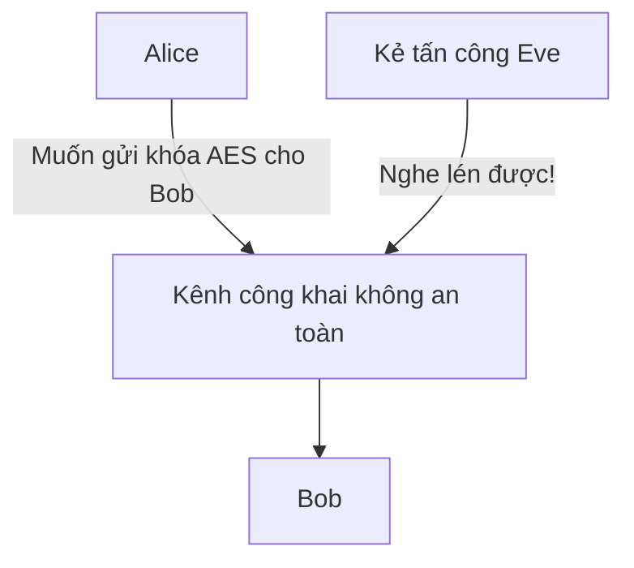
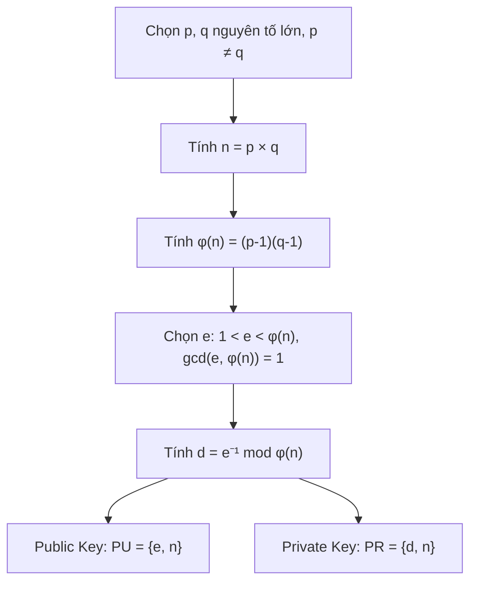
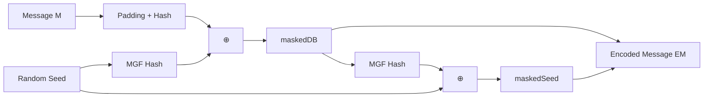

# Bài 6: Mật Mã Bất Đối Xứng Hiện Đại (Phần 1)

---

## 1. Ôn tập nhanh: Stream Cipher & AES

### Stream Cipher

Mã hóa luồng hoạt động theo nguyên tắc XOR đơn giản:

```
C = M ⊕ K      # Mã hóa
M = C ⊕ K      # Giải mã (vì C ⊕ K = M ⊕ K ⊕ K = M)
```

!!! warning "Tấn công Chosen Plaintext"
    Nếu biết cả M và C, kẻ tấn công có thể tính ra khóa K:
    ```
    C ⊕ M = (M ⊕ K) ⊕ M = K
    ```
    → Đây là lý do **mỗi khóa chỉ được dùng một lần** (one-time key).

**Vấn đề cốt lõi:** Làm sao hai bên thỏa thuận được khóa bí mật một cách an toàn mà không cần gặp nhau trước?

### AES (Advanced Encryption Standard)

AES là mã khối (block cipher) với 4 phép biến đổi mỗi vòng:

| Bước | Tên | Mục đích |
|------|-----|----------|
| 1 | SubBytes | Thay thế phi tuyến → chống cryptanalysis |
| 2 | ShiftRows | Dịch hàng → tạo diffusion |
| 3 | MixColumns | Trộn cột → tạo diffusion |
| 4 | AddRoundKey | XOR với khóa vòng → tạo confusion |

!!! question "Câu hỏi từ slide: Làm sao thỏa thuận khóa bí mật cho AES?"
    Đây chính là vấn đề **key distribution** — vấn đề trung tâm dẫn đến sự ra đời của mật mã bất đối xứng. Nếu Alice và Bob chưa từng gặp nhau, họ không thể trao đổi khóa AES một cách an toàn qua kênh công khai. Giải pháp là dùng **Public-Key Cryptography**.

---

## 2. Tại sao cần Mật Mã Bất Đối Xứng?

Mật mã đối xứng (AES, DES...) gặp hai vấn đề lớn:

### 2.1 Vấn đề phân phối khóa (Key Distribution)



Với n người dùng, cần **n(n-1)/2** cặp khóa riêng — không thể mở rộng được.

### 2.2 Vấn đề chữ ký số (Digital Signatures)

Mật mã đối xứng **không thể** chứng minh ai là người gửi thật sự, vì cả hai bên đều biết cùng một khóa.

!!! success "Giải pháp: Diffie & Hellman (1976)"
    Whitfield Diffie và Martin Hellman đề xuất phương pháp dùng **cặp khóa công khai/riêng tư** — giải quyết cả hai vấn đề trên cùng lúc.

---

## 3. Nguyên lý Hệ Mật Mã Khóa Công Khai

### 3.1 Thành phần của hệ thống

Một hệ mật mã khóa công khai gồm 6 thành phần:

1. **Plaintext (Bản rõ)** — dữ liệu đầu vào
2. **Thuật toán mã hóa** — biến đổi plaintext
3. **Khóa công khai (Public Key - PU)** — dùng để mã hóa hoặc xác minh
4. **Khóa riêng tư (Private Key - PR)** — dùng để giải mã hoặc ký
5. **Ciphertext (Bản mã)** — kết quả đầu ra
6. **Thuật toán giải mã** — khôi phục plaintext từ ciphertext + khóa

### 3.2 Ba chế độ sử dụng

=== "Bảo mật (Confidentiality)"

    ```mermaid
    sequenceDiagram
        Bob->>Alice: Gửi Public Key (PU_b)
        Alice->>Alice: C = E(PU_b, M)
        Alice->>Bob: Gửi C
        Bob->>Bob: M = D(PR_b, C)
    ```
    **Ai cũng có thể mã hóa**, nhưng **chỉ Bob mới giải mã được** (vì chỉ Bob có PR_b).

=== "Xác thực (Authentication)"

    ```mermaid
    sequenceDiagram
        Alice->>Alice: Y = E(PR_a, M)  [ký bằng khóa riêng]
        Alice->>Bob: Gửi Y
        Bob->>Bob: M = D(PU_a, Y)  [xác minh bằng khóa công khai]
    ```
    **Chỉ Alice mới tạo được Y** (vì chỉ Alice có PR_a), Bob dùng PU_a để xác minh.

=== "Cả hai (Auth + Secrecy)"

    Alice ký bằng PR_a → rồi mã hóa bằng PU_b của Bob → Bob giải mã bằng PR_b → xác minh bằng PU_a của Alice. Kết hợp cả bảo mật lẫn xác thực.

### 3.3 So sánh các thuật toán

| Thuật toán | Mã hóa/Giải mã | Chữ ký số | Trao đổi khóa |
|------------|:--------------:|:---------:|:-------------:|
| RSA | ✅ | ✅ | ✅ |
| Elliptic Curve | ✅ | ✅ | ✅ |
| Diffie-Hellman | ❌ | ❌ | ✅ |
| DSS | ❌ | ✅ | ❌ |

---

## 4. Yêu cầu của Hệ Mật Mã Khóa Công Khai

### 4.1 Các điều kiện bắt buộc

1. Dễ tạo cặp khóa (PU, PR)
2. Biết PU và M → dễ tính C
3. Biết PR và C → dễ tính M
4. **Biết PU → KHÔNG thể tìm ra PR** (tính chất quan trọng nhất)
5. Biết PU và C → không thể tìm ra M
6. Hai khóa có thể dùng theo thứ tự bất kỳ

### 4.2 Hàm một chiều có cửa hậu (Trapdoor One-Way Function)

Đây là nền tảng toán học của mọi hệ mật khóa công khai:

```
Hàm thông thường:    Y = f(X)       → Dễ tính
Hàm một chiều:       X = f⁻¹(Y)    → Không thể tính ngược
Có cửa hậu k:        X = fk⁻¹(Y)   → Dễ tính nếu biết k
```

!!! info "Ví dụ trực quan"
    Nhân hai số nguyên tố lớn p × q = N rất dễ. Nhưng **phân tích ngược** N thành p và q lại cực kỳ khó — đây chính là cơ sở của RSA.

---

## 5. RSA — Rivest-Shamir-Adleman

### 5.1 Lịch sử & Tổng quan

- Phát triển năm **1977** tại MIT bởi Ron Rivest, Adi Shamir và Len Adleman
- Thuật toán khóa công khai phổ biến nhất hiện nay
- Plaintext và ciphertext là các số nguyên trong khoảng [0, n-1]
- Kích thước n điển hình: **3072 bits**

### 5.2 Cơ sở toán học: Bài toán phân tích nhân tử nguyên tố

```
Cho: N = p × q  (p, q là số nguyên tố lớn)
Bài toán: Tìm lại p và q khi chỉ biết N
```

Không có thuật toán cổ điển nào giải được bài toán này trong thời gian đa thức (polynomial time) với đầu vào kích thước n-bit.

### 5.3 Sinh khóa RSA



!!! note "Điều kiện của e"
    e phải **nguyên tố cùng nhau** với φ(n), tức là gcd(e, φ(n)) = 1. Điều này đảm bảo tồn tại d là nghịch đảo modular của e.

### 5.4 Mã hóa và Giải mã

```python
# Mã hóa (Bob dùng Public Key của Alice)
C = M^e mod n

# Giải mã (Alice dùng Private Key của mình)
M = C^d mod n
```

### 5.5 Tại sao hoạt động đúng?

```
C^d mod n = (M^e)^d mod n = M^(e·d) mod n

Vì: e · d ≡ 1 (mod φ(n))
→  e · d = 1 + k·φ(n)  với k nguyên nào đó

Theo Định lý Euler:
    M^φ(n) ≡ 1 (mod n)  khi gcd(M, n) = 1

Suy ra:
    M^(e·d) = M^(1 + k·φ(n)) = M · (M^φ(n))^k ≡ M · 1^k ≡ M (mod n)
```

!!! success "Kết quả"
    `C^d mod n = M` — Giải mã hoàn toàn chính xác ✅

### 5.6 Ví dụ số nhỏ

```
Chọn: p = 17, q = 11
→ n = 17 × 11 = 187
→ φ(n) = 16 × 10 = 160

Chọn e = 7  (vì gcd(7, 160) = 1)
→ d = 7⁻¹ mod 160 = 23  (vì 7 × 23 = 161 = 1 + 160)

Public Key:  PU = {7, 187}
Private Key: PR = {23, 187}

Mã hóa M = 88:
    C = 88^7 mod 187 = 11

Giải mã C = 11:
    M = 11^23 mod 187 = 88  ✅
```

---

## 6. Lũy thừa Modular Nhanh (Fast Modular Exponentiation)

### 6.1 Vấn đề

RSA cần tính `M^e mod n` với e có thể lên đến hàng nghìn bit — không thể nhân trực tiếp.

### 6.2 Thuật toán Square-and-Multiply

Ý tưởng: biểu diễn số mũ dưới dạng nhị phân và tính từng bước.

```python
def fast_mod_exp(a, b, n):
    """Tính a^b mod n"""
    # Biểu diễn b dưới dạng nhị phân: b = b_k b_{k-1} ... b_0
    c = 0
    f = 1
    for bit in bin(b)[2:]:  # duyệt từ bit cao nhất
        c = 2 * c
        f = (f * f) % n
        if bit == '1':
            c = c + 1
            f = (f * a) % n
    return f
```

### 6.3 Ví dụ minh họa: 7^560 mod 561

560 = `1000110000` trong nhị phân

| i | b_i | c | f |
|---|-----|---|---|
| 9 | 1 | 1 | 7 |
| 8 | 0 | 2 | 49 |
| 7 | 0 | 4 | 157 |
| 6 | 0 | 8 | 526 |
| 5 | 1 | 17 | 160 |
| 4 | 1 | 35 | 241 |
| 3 | 0 | 70 | 298 |
| 2 | 0 | 140 | 166 |
| 1 | 0 | 280 | 67 |
| 0 | 0 | 560 | **1** |

**Kết quả:** 7^560 mod 561 = 1

!!! tip "Độ phức tạp"
    Thay vì nhân 560 lần, thuật toán chỉ cần **O(log b)** phép nhân — cực kỳ hiệu quả cho khóa 2048-bit hay 3072-bit.

---

## 7. Hiệu quả trong thực tế

### 7.1 Khóa công khai (e)

Giá trị e phổ biến nhất là **65537 = 2^16 + 1** vì:
- Chỉ có 2 bit 1 trong biểu diễn nhị phân → ít phép nhân nhất
- Đủ lớn để tránh tấn công đơn giản
- e = 3 hoặc e = 17 cũng được dùng nhưng kém an toàn hơn

!!! warning "Cảnh báo: e quá nhỏ"
    Nếu e = 3 và M nhỏ, có thể xảy ra `M^3 < n` → C = M^3 (không còn mod nữa) → dễ dàng lấy căn bậc 3 để tìm M.

### 7.2 Khóa riêng (d) — Chinese Remainder Theorem

Dùng **CRT (Định lý Phần dư Trung Hoa)** để tăng tốc giải mã ~4 lần:

```
Thay vì tính: M = C^d mod n

Tính hai giá trị nhỏ hơn:
    M_p = C^(d mod p-1) mod p
    M_q = C^(d mod q-1) mod q

Rồi kết hợp M_p, M_q bằng CRT để ra M
```

---

## 8. Bảo mật của RSA — Các dạng tấn công

### 8.1 Brute Force
Thử toàn bộ khóa riêng tư. **Đối phó:** dùng khóa đủ lớn (≥ 2048 bit hiện tại, 3072 bit khuyến nghị).

### 8.2 Mathematical Attack — Phân tích nhân tử

Nếu kẻ tấn công phân tích được n = p × q → tính được φ(n) → tính được d.

```
Biết: n, e (public)
Mục tiêu: tìm d
Cách: n = p × q → φ(n) = (p-1)(q-1) → d = e⁻¹ mod φ(n)
```

Đây là lý do kích thước khóa RSA phải rất lớn.

### 8.3 Timing Attack ⚡

!!! danger "Tấn công kênh kề (Side-Channel)"
    Paul Kocher (1995) chứng minh: đo **thời gian thực thi** giải mã → suy ra từng bit của d.

    **Nguy hiểm vì:**
    - Tấn công từ hướng hoàn toàn bất ngờ (không phá toán học)
    - Chỉ cần quan sát ciphertext (ciphertext-only attack)

**Biện pháp đối phó:**

| Phương pháp | Cách thực hiện |
|-------------|----------------|
| Constant-time | Đảm bảo mọi phép tính mất cùng thời gian |
| Random delay | Thêm độ trễ ngẫu nhiên vào quá trình tính toán |
| Blinding | Nhân C với số ngẫu nhiên trước khi tính `C^d mod n` |

### 8.4 Fault-Based Attack

Cố tình gây lỗi phần cứng (giảm điện áp) trong quá trình tạo chữ ký số → chữ ký bị lỗi → phân tích để tìm khóa riêng.

!!! info "Mức độ nguy hiểm"
    Tương đối thấp vì **yêu cầu truy cập vật lý** trực tiếp vào máy tính mục tiêu.

### 8.5 Chosen Ciphertext Attack (CCA)

Kẻ tấn công chọn một số ciphertext và lấy được plaintext tương ứng → khai thác tính chất algebraic của RSA.

**Ví dụ tấn công multiplicative:**
```
RSA thuần: nếu biết D(C1) = M1 và D(C2) = M2
→ D(C1 · C2 mod n) = M1 · M2 mod n
```

**Đối phó: OAEP (Optimal Asymmetric Encryption Padding)**



OAEP thêm tính ngẫu nhiên vào quá trình mã hóa → cùng một M sẽ cho C khác nhau mỗi lần.

---

## 9. Sinh Số Nguyên Tố Lớn

### Quy trình chọn số nguyên tố p, q

```
1. Chọn ngẫu nhiên một số lẻ n
2. Chọn ngẫu nhiên a < n
3. Thực hiện kiểm tra tính nguyên tố xác suất (Miller-Rabin) với tham số a
   - Nếu n không qua → quay lại bước 1
4. Nếu n đã qua đủ số lần kiểm tra → chấp nhận n là số nguyên tố
   - Nếu chưa đủ → quay lại bước 2
```

!!! note "Kiểm tra xác suất"
    Thuật toán Miller-Rabin không chứng minh 100% là nguyên tố, nhưng xác suất sai có thể giảm xuống dưới 2^(-128) bằng cách tăng số lần kiểm tra — hoàn toàn đủ cho thực tế.

---

## 10. Câu hỏi từ Slide & Trả lời

??? question "RSA xử lý nhiều block — Nếu P1, P2, ... Pn rất nhỏ thì có vấn đề gì?"
    **Vấn đề:** Nếu plaintext M quá nhỏ (M << n), thì `C = M^e mod n` có thể bằng `M^e` (không bao giờ wrap around modulo). Kẻ tấn công có thể lấy căn bậc e để tìm ra M trực tiếp.

    Ngoài ra, với các block nhỏ lặp đi lặp lại (ví dụ ký tự đơn), **cùng plaintext → cùng ciphertext** (RSA thuần là deterministic) → dễ phân tích tần số.

    **Giải pháp:** Dùng **OAEP** để thêm padding ngẫu nhiên trước khi mã hóa.

??? question "Tại sao không dùng mật mã khóa công khai cho mọi dữ liệu thay vì AES?"
    RSA chậm hơn AES **hàng nghìn lần**. Trong thực tế:
    - RSA chỉ dùng để **mã hóa khóa AES** (key encapsulation)
    - AES dùng để mã hóa **dữ liệu thực**
    
    Đây gọi là **Hybrid Encryption** — kết hợp ưu điểm cả hai.

??? question "Công khai khóa công khai có thực sự an toàn không?"
    Có, **với điều kiện** người dùng xác minh được khóa công khai thực sự thuộc về đúng người. Nếu không có cơ chế xác thực, kẻ tấn công có thể thực hiện **Man-in-the-Middle Attack** bằng cách tráo khóa công khai. Đây là lý do tồn tại **PKI (Public Key Infrastructure)** và **Certificate Authority (CA)**.

---

## 11. Các Quan Niệm Sai về Mật Mã Khóa Công Khai

!!! warning "Hiểu nhầm 1: Khóa công khai an toàn hơn mật mã đối xứng"
    Sai. Không có gì chứng minh RSA an toàn hơn AES. Mỗi loại có điểm yếu riêng.

!!! warning "Hiểu nhầm 2: Mật mã khóa công khai thay thế mật mã đối xứng"
    Sai. Vì quá chậm, khóa công khai chỉ bổ sung cho mật mã đối xứng, không thay thế.

!!! warning "Hiểu nhầm 3: Phân phối khóa công khai là trivial"
    Sai. Vẫn cần cơ chế xác thực (PKI, CA) để đảm bảo khóa công khai thuộc đúng người — nếu không sẽ bị tấn công MitM.

---

## 12. Thuật ngữ Quan trọng

| Thuật ngữ | Định nghĩa |
|-----------|------------|
| **Asymmetric Keys** | Cặp khóa liên quan (public + private) dùng cho các phép toán bù nhau |
| **Public Key Certificate** | Tài liệu số được CA ký, ràng buộc danh tính với khóa công khai |
| **PKI** | Hạ tầng quản lý chứng chỉ và cặp khóa: phát hành, duy trì, thu hồi |
| **Trapdoor OWF** | Hàm một chiều có cửa hậu — dễ tính xuôi, khó tính ngược trừ khi biết bí mật |
| **OAEP** | Padding ngẫu nhiên cho RSA để chống CCA |
| **CRT** | Định lý Phần dư Trung Hoa — tăng tốc giải mã RSA 4 lần |
