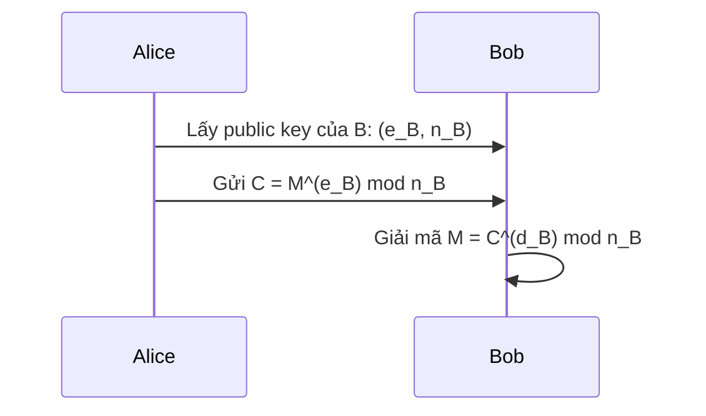
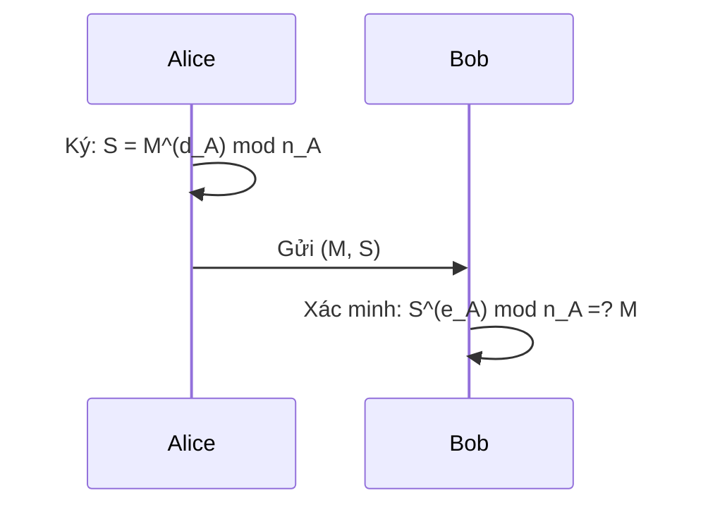
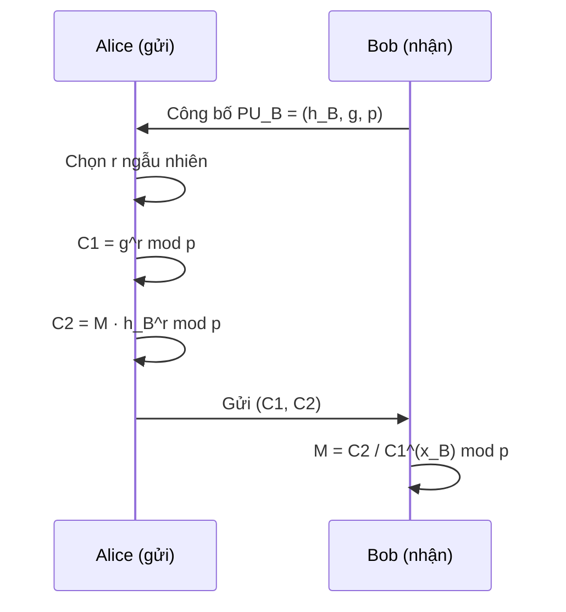
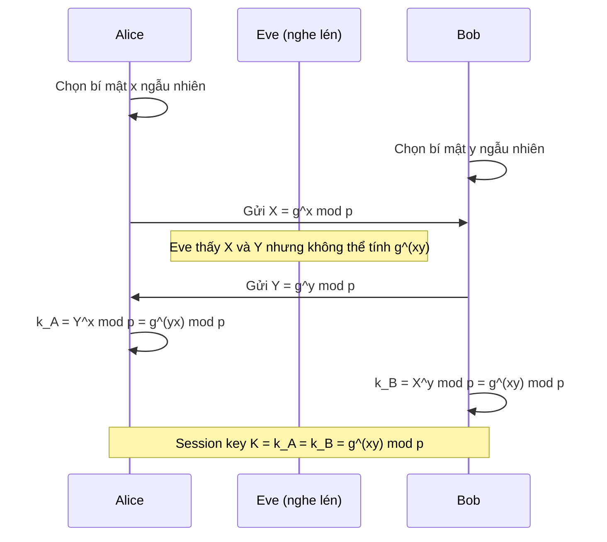
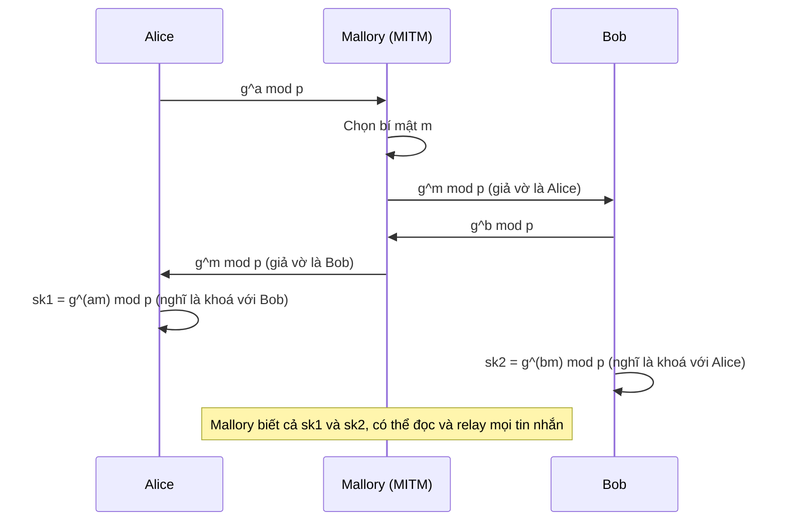
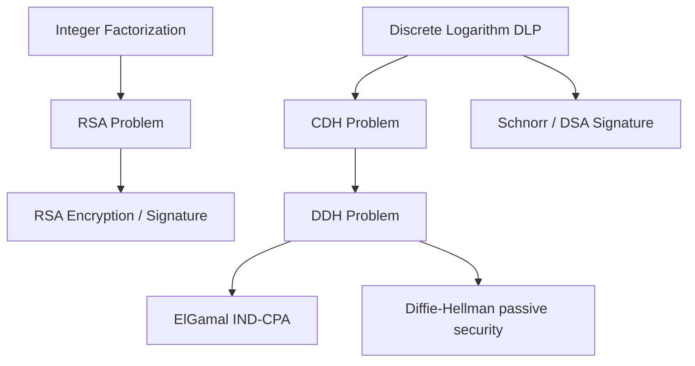

# Bài 7: Mật mã Bất đối xứng Hiện đại (Phần 2)

---

## 1. Tại sao cần mật mã khoá công khai?

Mật mã đối xứng có hai vấn đề cốt lõi chưa giải quyết được:

**Vấn đề 1 – Phân phối khoá (Key Distribution)**

Trước khi Alice và Bob có thể trao đổi tin mật, họ phải đã có sẵn một khoá bí mật chung. Nhưng để trao đổi khoá đó một cách an toàn, họ lại cần... một kênh đã được mã hoá. Đây là bài toán "con gà – quả trứng". Giải pháp truyền thống là dùng KDC (Key Distribution Center), nhưng điều này tạo ra điểm thất bại tập trung và đòi hỏi tin tưởng vào bên thứ ba.

**Vấn đề 2 – Chữ ký số (Digital Signature)**

Với mật mã đối xứng, không thể chứng minh rằng một tin nhắn đến từ Alice chứ không phải Bob, vì cả hai cùng biết khoá. Không có tính *non-repudiation* (không thể phủ nhận).

> **Giải pháp:** Whitfield Diffie và Martin Hellman đề xuất mật mã khoá công khai vào năm 1976, giải quyết cả hai vấn đề trên mà không cần kênh bí mật hay bên thứ ba tin cậy.

---

## 2. Phân loại mật mã bất đối xứng hiện đại

```
Asymmetric Cryptography
├── Factoring-Based      → RSA (1978)
├── Logarithm-Based      → ElGamal, Diffie-Hellman
├── Elliptic Curve (ECC) → ECDH, ECDSA
└── Advanced
    ├── IBE  (2001) – Identity-Based Encryption
    ├── ABE  (2005) – Attribute-Based Encryption
    └── FE   (2013) – Functional Encryption
```

???+ note "Các hướng mã hoá nâng cao"
    - **IBE (Identity-Based Encryption):** Khoá công khai *chính là* một chuỗi định danh (email, số điện thoại). Không cần PKI phức tạp để phân phối khoá công khai.
    - **ABE (Attribute-Based Encryption):** Nhúng kiểm soát truy cập phức tạp vào trong bản thân ciphertext. Ví dụ: chỉ giải mã được nếu có thuộc tính `role=doctor AND hospital=Bach Mai`.
    - **FE (Functional Encryption):** Khoá bí mật có thể cho phép tính toán một hàm `f(m)` trên ciphertext mà không lộ `m`. Ứng dụng trong Homomorphic Encryption, Searchable Encryption.

---

## 3. Mật mã dựa trên bài toán phân tích nhân tử – RSA

### 3.1 Bài toán phân tích nhân tử nguyên tố

Bài toán: Cho số nguyên hợp `N`, hãy tìm phân tích nhân tử nguyên tố của nó.

- **Dễ theo chiều thuận:** `p × q = N` — chỉ cần nhân.
- **Khó theo chiều ngược:** Cho `N`, tìm `p` và `q` — không có thuật toán cổ điển nào chạy trong thời gian đa thức với mọi đầu vào.

Ví dụ đơn giản: `864 = 2⁵ × 3³`. Với số có hàng trăm chữ số thập phân, bài toán này hiện tại là không khả thi trên máy tính cổ điển.

### 3.2 Thuật toán RSA

**Sinh khoá (Key Generation):**

```
1. Chọn hai số nguyên tố lớn p và q (giữ bí mật)
2. Tính n = p × q
3. Tính φ(n) = (p-1)(q-1)   ← Euler's totient
4. Chọn e sao cho: gcd(e, φ(n)) = 1 và 1 < e < φ(n)
5. Tính d = e⁻¹ mod φ(n)    ← nghịch đảo modular
6. Public key:  PU = {e, n}
7. Private key: PR = {d, n}
```

**Mã hoá và Giải mã:**

```
Mã hoá:   C = Mᵉ mod n
Giải mã:  M = Cᵈ mod n
```

**Tại sao hoạt động đúng?**

Cần chứng minh: `Cᵈ mod n = M`

```
Cᵈ mod n = (Mᵉ)ᵈ mod n = M^(e·d) mod n
```

Vì `e·d ≡ 1 mod φ(n)`, theo **định lý Euler**: `M^φ(n) ≡ 1 mod n`, suy ra:

```
M^(e·d) = M^(k·φ(n) + 1) = (M^φ(n))^k · M ≡ 1^k · M = M mod n
```

???+ question "Câu hỏi: Vì sao cần giữ p, q bí mật?"
    Nếu kẻ tấn công biết `n` và `e` (đều là public), họ cần tính `d`. Muốn tính `d` cần biết `φ(n) = (p-1)(q-1)`. Muốn tính `φ(n)` cần biết `p` và `q`. Mà tìm `p`, `q` từ `n` chính là bài toán phân tích nhân tử — bài toán được cho là khó. Do đó bảo mật của RSA phụ thuộc vào độ khó của bài toán này.

### 3.3 Tính hiệu quả: Lũy thừa modular nhanh (Fast Modular Exponentiation)

Vì `e` và `d` có thể rất lớn (hàng nghìn bit), tính `Mᵉ mod n` trực tiếp là không thực tế. Dùng thuật toán **square-and-multiply**:

```python
# Tính a^b mod n
def fast_mod_exp(a, b, n):
    # Biểu diễn b dưới dạng nhị phân: b = b_k b_{k-1} ... b_0
    result = 1
    base = a % n
    while b > 0:
        if b % 2 == 1:          # bit hiện tại = 1
            result = (result * base) % n
        base = (base * base) % n  # bình phương
        b //= 2
    return result
```

Độ phức tạp: `O(log b)` phép nhân, thay vì `O(b)`.

**Chọn e tối ưu:**

Thực tế hay dùng `e = 65537 = 2¹⁶ + 1`. Lý do: chỉ có 2 bit `1` trong biểu diễn nhị phân → số phép nhân trong square-and-multiply là tối thiểu.

!!! warning "Cảnh báo: e nhỏ quá"
    Nếu chọn `e = 3` và cùng một plaintext `M` được gửi đến 3 người dùng RSA khác nhau, kẻ tấn công có thể dùng **Håstad's broadcast attack** (CRT) để phục hồi `M` mà không cần phá khoá. Đây là lý do tại sao cần padding (OAEP).

### 3.4 Tăng tốc giải mã bằng CRT

Giải mã dùng `d` rất chậm vì `d` lớn. Dùng **Chinese Remainder Theorem (CRT)**:

```
dp = d mod (p-1)
dq = d mod (q-1)
M1 = C^dp mod p
M2 = C^dq mod q
M  = CRT(M1, M2)   ← kết hợp lại
```

Kết quả: nhanh hơn ~4 lần so với tính `Cᵈ mod n` trực tiếp.

### 3.5 Sinh số nguyên tố lớn

```
1. Chọn ngẫu nhiên một số lẻ n
2. Chọn ngẫu nhiên a < n
3. Chạy kiểm tra tính nguyên tố xác suất với tham số a
   (Miller-Rabin primality test)
4. Nếu n không qua kiểm tra → quay lại bước 1
5. Nếu n qua đủ số lần kiểm tra → chấp nhận n là số nguyên tố
```

!!! info "Miller-Rabin"
    Miller-Rabin là thuật toán kiểm tra xác suất: nếu `n` là hợp số, xác suất nó qua `k` vòng kiểm tra là tối đa `(1/4)^k`. Với `k = 40`, xác suất sai là nhỏ hơn `10⁻²⁴` — chấp nhận được trong thực tế.

### 3.6 Ba ứng dụng của RSA

**A. Bảo mật (Confidentiality):**



Chỉ Bob (có `d_B`) mới giải mã được.

**B. Xác thực / Chữ ký số (Authentication):**



???+ question "Câu hỏi: Tại sao xác thực được nguồn gốc?"
    Chỉ Alice mới biết `d_A`. Nếu `S^(e_A) mod n_A = M`, điều đó chứng tỏ `S` được tạo ra bởi người biết `d_A`, tức là Alice. Đây cũng cung cấp **integrity** (tính toàn vẹn): bất kỳ thay đổi nào trên `M` sẽ làm phép xác minh thất bại.

**C. Bảo mật + Xác thực kết hợp:**

```
Alice:
  S  = k^(d_A) mod n_A        ← ký khoá phiên k bằng private key A
  C1 = k^(e_B) mod n_B        ← mã hoá k bằng public key B
  S1 = S^(e_B) mod n_B        ← mã hoá chữ ký bằng public key B
  Gửi: (C1, S1)

Bob:
  k  = C1^(d_B) mod n_B       ← giải mã ra k
  S  = S1^(d_B) mod n_B       ← giải mã ra S
  k' = S^(e_A) mod n_A        ← xác minh chữ ký
  Kiểm tra: k' =? k
```

???+ question "Câu hỏi: Hạn chế của sơ đồ kết hợp này là gì?"
    Hạn chế lớn nhất: sơ đồ này **không xác thực danh tính** của người giữ khoá công khai. Nếu kẻ tấn công thay thế `PU_A` bằng khoá của họ, Bob sẽ xác minh chữ ký của kẻ tấn công mà tưởng là Alice. Đây chính là lý do cần **certificate** (chứng chỉ số) và PKI để ràng buộc khoá công khai với danh tính thực sự.

### 3.7 OAEP – Optimal Asymmetric Encryption Padding

RSA thuần tuý (textbook RSA) có nhiều điểm yếu: deterministic (cùng M → cùng C), dễ bị tấn công chosen-ciphertext, v.v. Thực tế phải dùng padding scheme.

**Cơ chế OAEP:**

```
Input: message K, label L, random Seed
DB  = H(L) || 00...00 || 01 || K
Y   = MGF(Seed) XOR DB       ← maskedDB
X   = MGF(Y) XOR Seed        ← maskedSeed
EM  = 00 || X || Y           ← encoded message
Sau đó: C = EM^e mod n
```

- `MGF` (Mask Generation Function): một hàm hash mở rộng (thường dựa trên SHA).
- Mục đích: thêm tính ngẫu nhiên (qua `Seed`), đảm bảo ciphertext không xác định (IND-CCA2 secure).

---

## 4. Mật mã dựa trên bài toán logarithm rời rạc

### 4.1 Bài toán Logarithm Rời rạc (DLP)

Cho nhóm nhân hữu hạn `G = Zp* = {1, 2, ..., p-1}`, phần tử sinh `g`, và `p` nguyên tố lớn:

```
Chiều dễ:  Cho g, x, p  → tính y = g^x mod p   (nhanh, O(log x))
Chiều khó: Cho g, y, p  → tìm x sao cho g^x ≡ y mod p   (rất khó)
```

Không có thuật toán cổ điển nào giải DLP trong thời gian đa thức. Đây là nền tảng bảo mật của ElGamal và Diffie-Hellman.

### 4.2 ElGamal Cipher

**Sinh khoá:**

```
Chọn số nguyên tố lớn p, phần tử sinh g của Zp*
Secret key: x ∈_R [1, p-1]      ← chọn ngẫu nhiên
Public key: h = g^x mod p
```

**Mã hoá message `m < p`:**

```
1. Chọn ngẫu nhiên r ∈_R [1, p-1]
2. C1 = g^r mod p
3. C2 = m · h^r mod p
4. Ciphertext: (C1, C2)
```

**Giải mã `(C1, C2)` với secret key `x`:**

```
1. Tính C1^x mod p = g^(rx) mod p
2. Tính C2 / C1^x mod p = (m · g^(xr)) / g^(rx) mod p = m
```

???+ question "Câu hỏi: Tại sao ElGamal an toàn?"
    Để phục hồi `m`, kẻ tấn công từ `(C1, C2, h, g, p)` phải tính `h^r = g^(xr)`. Họ biết `C1 = g^r` và `h = g^x`, nhưng tính `g^(xr)` từ `g^x` và `g^r` chính là **Computational Diffie-Hellman (CDH) problem** — được giả định là khó. Nếu CDH khó thì ElGamal IND-CPA secure.

!!! info "Lưu ý quan trọng về randomness"
    Mỗi lần mã hoá **phải** chọn `r` khác nhau. Nếu dùng lại `r` cho hai message `m1` và `m2`, kẻ tấn công có `C2/C2' = m1/m2 mod p` → lộ thông tin. Đây là lỗ hổng tương tự nonce reuse trong stream cipher.

**Sơ đồ trao đổi:**



### 4.3 Giao thức trao đổi khoá Diffie-Hellman (DHE)

**Mục tiêu:** Hai bên Alice và Bob chưa từng gặp nhau, thiết lập một khoá phiên chung qua kênh công khai (có thể bị nghe lén), mà không cần bí mật chung từ trước.

**Public parameters (mọi người biết):** Số nguyên tố lớn `p`, phần tử sinh `g` của `Zp*`.



**Ví dụ số thực tế (từ slide):**

```
p = 1606938044258990275541962092341162602522202993782792835301301
g = 123456789

Alice chọn: a = 6854...7440  (số 64 chữ số)
Bob chọn:   b = 3620...7440  (số 64 chữ số)

g^a mod p = 7846...8593
g^b mod p = 5600...8798
Session key g^(ab) mod p = 4374...1215
```

### 4.4 Tại sao Diffie-Hellman an toàn?

Ba mức độ bài toán khó, từ yếu đến mạnh:

| Bài toán | Nội dung | Vai trò |
|---|---|---|
| **DL** (Discrete Log) | Từ `g^x`, tìm `x` | Điều kiện cần |
| **CDH** (Computational DH) | Từ `g^x` và `g^y`, tính `g^(xy)` | Đảm bảo kẻ tấn công không tính được khoá |
| **DDH** (Decisional DH) | Phân biệt `g^(xy)` với `g^r` ngẫu nhiên | Đảm bảo khoá trông ngẫu nhiên với kẻ nghe lén |

!!! info "Mối quan hệ"
    DL khó → CDH khó → DDH khó (theo chiều suy luận). DHE an toàn chống passive attacker nếu DDH khó.

### 4.5 Tấn công Man-in-the-Middle (MITM) vào DHE

DHE **không** cung cấp xác thực. Kẻ tấn công Mallory có thể ngồi giữa:



**Giải pháp:** Kết hợp DHE với xác thực (chữ ký số, certificate). Ví dụ: TLS dùng DHE + chứng chỉ X.509 do CA ký; IPsec dùng IKE với chữ ký và cookie chống DoS.

---

## 5. So sánh: Ưu và nhược điểm của mật mã khoá công khai

| | Mật mã đối xứng | Mật mã khoá công khai |
|---|---|---|
| **Tốc độ** | Rất nhanh (AES ~Gb/s) | Chậm hơn 100–1000 lần |
| **Độ dài khoá** | 128 bit (AES-128) | 3072 bit (RSA), 256 bit (ECC) |
| **Key distribution** | Cần kênh bí mật | Không cần |
| **Authentication** | Không có non-repudiation | Có (chữ ký số) |
| **Nền tảng toán học** | Đã được chứng minh mạnh (AES) | Dựa trên giả định chưa chứng minh |

**Mô hình thực tế (hybrid):**

```
1. Dùng DHE/RSA để trao đổi khoá phiên (session key)
2. Dùng AES với session key đó để mã hoá dữ liệu thực
```

Đây là kiến trúc của TLS, SSL, IPsec, Signal Protocol, v.v.

---

## 6. Tổng quan các bài toán khó và sơ đồ phụ thuộc



!!! warning "Kháng lượng tử (Post-Quantum)"
    Thuật toán Shor (chạy trên máy tính lượng tử) có thể giải cả **Integer Factorization** lẫn **Discrete Logarithm** trong thời gian đa thức. Điều này có nghĩa RSA, ElGamal, DH, và ECC đều **không an toàn** trước máy tính lượng tử đủ mạnh. NIST đang chuẩn hoá các thuật toán kháng lượng tử (CRYSTALS-Kyber, CRYSTALS-Dilithium, FALCON, SPHINCS+).
