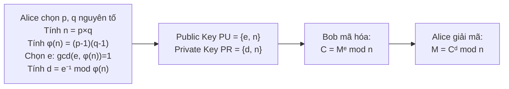
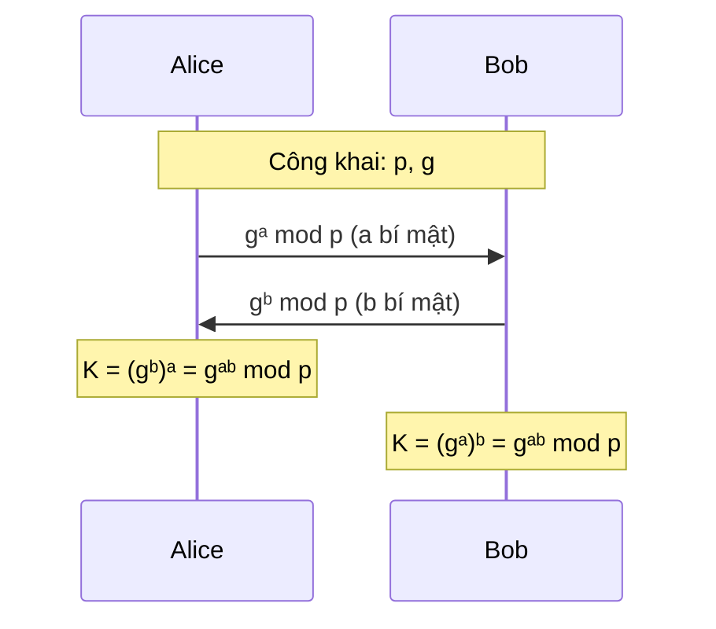
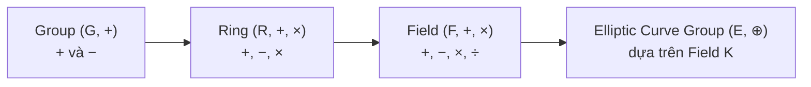
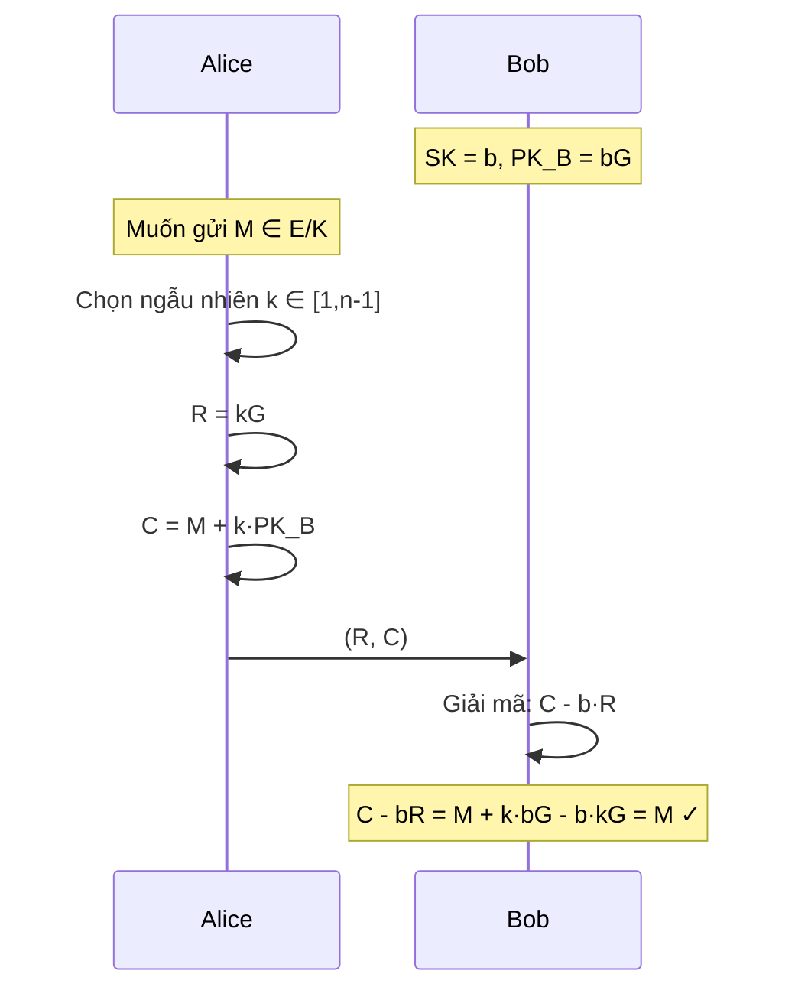
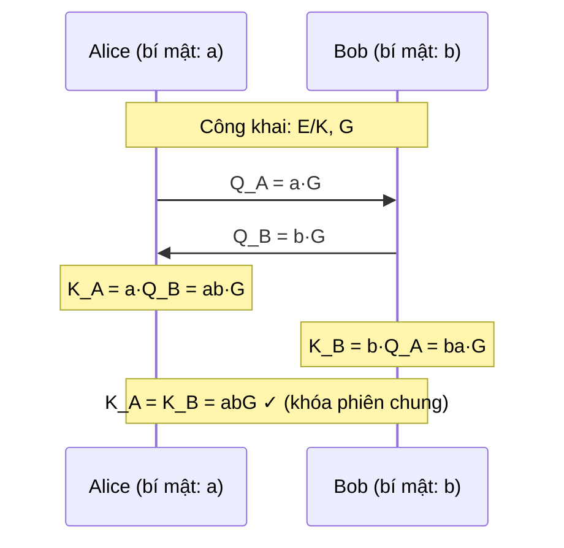
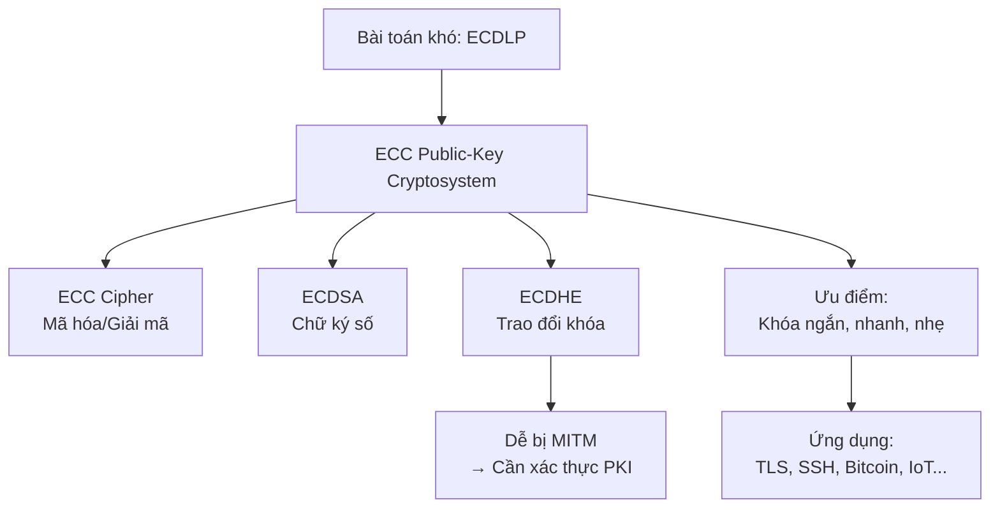

# Bài 8: Mật mã Bất đối xứng (Phần 3) — Elliptic Curve Cryptography

---

## 1. Ôn tập nhanh: Tại sao cần mật mã bất đối xứng?

!!! question "Warmup — Trao đổi khóa AES với server"
    Giả sử bạn muốn thiết lập một phiên AES với server. Hãy suy nghĩ:

    1. **RSA hay DHE?** → Cả hai đều được, nhưng DHE cho phép *forward secrecy* (bí mật chuyển tiếp).
    2. **Thiết lập tham số hệ thống?** → Chọn đường cong, điểm sinh G, modulo p.
    3. **Trao đổi khóa công khai hay gửi AES Key Encapsulation?** → RSA-based: đóng gói khóa AES bằng RSA; DHE: tính toán khóa phiên chung.
    4. **Tính khóa phiên AES?** → Từ giá trị DH chung hoặc giải mã gói RSA.

---

## 2. Ôn tập RSA

### 2.1 Luồng hoạt động



### 2.2 Tại sao giải mã đúng?

Cần chứng minh: $C^d \mod n = M$

$$C^d = (M^e)^d = M^{ed} \mod n$$

Ta cần $ed \equiv 1 \pmod{\lambda(n)}$, trong đó:

- **Định lý Fermat nhỏ** (với p nguyên tố): $a^{p-1} \equiv 1 \pmod{p}$
- **Định lý Carmichael**: $\lambda(n) = \text{lcm}(p-1, q-1)$

!!! example "Ví dụ cụ thể"
    Cho $n = 15 = 3 \times 5$:
    
    - $\varphi(15) = (3-1)(5-1) = 8$
    - $\lambda(15) = \text{lcm}(2, 4) = 4$
    
    Với mọi $a$ thỏa $\gcd(a, 15) = 1$: $a^4 \mod 15 = 1$
    
    | a | a⁴ mod 15 | a⁸ mod 15 |
    |---|-----------|-----------|
    | 1 | 1 | 1 |
    | 2 | 1 | 1 |
    | 4 | 1 | 1 |
    | 7 | 1 | 1 |
    | 11 | 1 | 1 |
    | 13 | 1 | 1 |

### 2.3 Tối ưu hóa giải mã RSA bằng CRT

Thay vì tính $M = C^d \mod n$ trực tiếp (tốn kém với d lớn), ta dùng **Chinese Remainder Theorem (CRT)**:

$$d_p = d \mod (p-1), \quad d_q = d \mod (q-1), \quad q_{inv} = q^{-1} \mod p$$

```
m₁ = C^(dp) mod p
m₂ = C^(dq) mod q
h  = q_inv × (m₁ - m₂) mod p
m  = m₂ + h × q
```

!!! tip "Lợi ích"
    Thay vì làm việc với modulo $n$ (~2048 bit), ta làm việc với $p$ và $q$ (~1024 bit mỗi cái) → **nhanh hơn ~4 lần**.

---

## 3. Mật mã ElGamal & Diffie-Hellman

### 3.1 ElGamal Cipher

**Thiết lập:** Chọn số nguyên tố $p$, generator $g$, khóa bí mật $x$, khóa công khai $h = g^x \mod p$.

**Mã hóa** thông điệp $m < p-1$:

1. Chọn số ngẫu nhiên $r \in_R [1, p-1]$
2. Tính $C_1 = g^r \mod p$
3. Tính $C_2 = m \cdot h^r \mod p = m \cdot g^{xr} \mod p$
4. Bản mã: $(C_1, C_2)$

**Giải mã** $(C_1, C_2)$ với khóa bí mật $x$:

$$\frac{C_2}{C_1^x} = \frac{m \cdot g^{xr}}{g^{rx}} = m$$

!!! question "Tại sao phải chọn r ngẫu nhiên mỗi lần?"
    Nếu dùng cùng một $r$ cho hai bản rõ khác nhau $m_1, m_2$:
    
    - $C_2^{(1)} = m_1 \cdot h^r$, $C_2^{(2)} = m_2 \cdot h^r$
    - → $\frac{C_2^{(1)}}{C_2^{(2)}} = \frac{m_1}{m_2}$ → lộ tỉ lệ giữa hai bản rõ!
    
    Vì vậy **r phải được chọn ngẫu nhiên và mới cho mỗi lần mã hóa**.

### 3.2 Diffie-Hellman Key Exchange (DHE)



### 3.3 Các bài toán khó nền tảng

| Bài toán | Mô tả | Ứng dụng |
|---|---|---|
| **IFP** (Integer Factorization) | Cho $n = p \cdot q$, tìm $p, q$ | RSA |
| **DLP** (Discrete Log) | Cho $g, p, y = g^x \mod p$, tìm $x$ | ElGamal, DHE |
| **DHP** (Diffie-Hellman) | Cho $g^a \mod p$, $g^b \mod p$, tính $g^{ab} \mod p$ | DHE |

### 3.4 Tấn công Man-in-the-Middle vào DHE

!!! danger "DHE không xác thực danh tính!"
    
    ```mermaid
    sequenceDiagram
        participant Alice
        participant Mallory as Mallory (MITM)
        participant Bob
        Alice->>Mallory: gᵃ mod p
        Mallory->>Bob: gᵐ mod p (m bí mật của Mallory)
        Bob->>Mallory: gᵇ mod p
        Mallory->>Alice: gᵐ mod p
        Note over Alice,Mallory: sk₁ = gᵃᵐ mod p
        Note over Mallory,Bob: sk₂ = gᵇᵐ mod p
    ```
    
    Mallory nghe được **toàn bộ** nội dung trao đổi của Alice và Bob. Để phòng chống, cần kết hợp với **xác thực danh tính** (chứng chỉ số, PKI).

---

## 4. Nền tảng Toán học cho ECC

### 4.1 Cấu trúc đại số



!!! info "Tại sao cần Field?"
    Đường cong elliptic được định nghĩa **trên một trường (field) K**. Các phép tính cộng/nhân trong field K được dùng để tính toán phép toán ⊕ trên đường cong.

    - Trong thực tế: $K = \mathbb{Z}_p$ (trường số nguyên modulo p nguyên tố) → **an toàn, hiệu quả**.

### 4.2 Phương trình đường cong Elliptic

**Dạng Weierstrass (phổ biến nhất):**

$$E/K: y^2 = x^3 + ax + b$$

!!! example "Ví dụ trực quan"
    - $E/\mathbb{R}: y^2 = x^3 + x + 1$ → đường cong trơn liên tục trên mặt phẳng thực
    - $E/\mathbb{Z}_7: y^2 = x^3 + x + 1 \pmod{7}$ → tập hữu hạn các điểm nguyên
    
    **Tính các điểm trên $E/\mathbb{Z}_7$:**
    
    | x | x³+x+1 mod 7 | y (nếu tồn tại) |
    |---|---|---|
    | 0 | 1 | 1, 6 |
    | 1 | 3 | không có (3 không là QR mod 7) |
    | 2 | 4 | 2, 5 |
    | 3 | 3 | không có |
    | 4 | 6 | không có |
    | 5 | 5 | không có |
    | 6 | 6 | không có |

**Dạng Montgomery:**

$$E/K: By^2 = x^3 + Ax^2 + x$$

**Dạng Twisted Edwards:**

$$E/K: ax^2 + y^2 = 1 + dx^2y^2$$

!!! note "Curve25519 — đường cong thực tế hiệu suất cao"
    $$y^2 = x^3 + 486662x^2 + x \quad \text{trên trường } K = \mathbb{Z}_{2^{255}-19}$$
    
    Được dùng trong TLS 1.3, SSH, Signal Protocol. Chọn $p = 2^{255}-19$ vì đây là số nguyên tố Mersenne, cho phép phép tính modulo cực nhanh.

---

## 5. Phép toán trên nhóm Elliptic

### 5.1 Cộng hai điểm phân biệt P₁ + P₂

!!! info "Quy tắc hình học"
    Kẻ đường thẳng qua $P_1$ và $P_2$, đường thẳng này cắt đường cong tại điểm thứ ba $P_3'$, lấy đối xứng qua trục x → thu được $P_3 = P_1 + P_2$.

**Công thức đại số** (trên trường $\mathbb{Z}_p$):

$$\lambda = \frac{y_2 - y_1}{x_2 - x_1} \mod p$$

$$x_3 = \lambda^2 - x_1 - x_2 \mod p$$

$$y_3 = \lambda(x_1 - x_3) - y_1 \mod p$$

### 5.2 Nhân đôi điểm (Point Doubling): P + P = 2P

!!! info "Quy tắc hình học"
    Kẻ tiếp tuyến tại P với đường cong, tiếp tuyến cắt đường cong tại điểm thứ hai, đối xứng qua trục x.

**Công thức:**

$$\lambda = \frac{3x_1^2 + a}{2y_1} \mod p$$

$$x_3 = \lambda^2 - 2x_1 \mod p, \quad y_3 = \lambda(x_1 - x_3) - y_1 \mod p$$

!!! warning "Trường hợp đặc biệt: P + P = O"
    Nếu tiếp tuyến tại P thẳng đứng (tức $y_1 = 0$) → kết quả là điểm vô cực $\mathcal{O}$.

### 5.3 Điểm đối và điểm vô cực

$$P + (-P) = \mathcal{O} \quad \text{(điểm vô cực — phần tử trung hòa)}$$

$$P + \mathcal{O} = \mathcal{O} + P = P$$

Điểm đối của $P = (x, y)$ là $-P = (x, -y)$ (trên $\mathbb{Z}_p$: $-P = (x, p-y)$).

### 5.4 Tính chất nhóm

!!! success "E/K là nhóm Abel (Abelian Group)"
    - **Giao hoán:** $P + Q = Q + P$
    - **Kết hợp:** $(P + Q) + R = P + (Q + R)$
    - **Phần tử trung hòa:** $P + \mathcal{O} = P$
    - **Phần tử nghịch:** $P + (-P) = \mathcal{O}$

### 5.5 Nhân vô hướng (Scalar Multiplication)

$$kG = \underbrace{G + G + \cdots + G}_{k \text{ lần}}$$

!!! tip "Tính hiệu quả: Double-and-Add"
    Tương tự "Square-and-Multiply" trong RSA. Với k có n bit, cần tối đa $2n$ phép toán thay vì k phép cộng:
    
    ```
    Q = O
    for bit in bits(k) từ cao xuống thấp:
        Q = 2Q          # Point Doubling
        if bit == 1:
            Q = Q + G   # Point Addition
    return Q
    ```

---

## 6. Tham số nhóm ECC

Một đường cong ECC được xác định bởi bộ tham số:

| Tham số | Ý nghĩa |
|---|---|
| **Phương trình** | Dạng Weierstrass/Montgomery/Edwards và hệ số $a, b$ |
| **Modulo** | Số nguyên tố $p$ hoặc đa thức $f(x)$ |
| **Generator point G** | Điểm cơ sở công khai |
| **Order n** | $n = \langle G \rangle$ = số điểm trong subgroup sinh bởi G |
| **Cofactor h** | $h = \|E/K\| / n$ (lý tưởng $h = 1$ hoặc $h = 4$) |

!!! note "Ví dụ thực tế: secp256k1 (Bitcoin)"
    Xem tại [http://www.secg.org/sec2-v2.pdf](http://www.secg.org/sec2-v2.pdf)

---

## 7. Bài toán khó của ECC: ECDLP

!!! danger "Elliptic Curve Discrete Logarithm Problem (ECDLP)"
    **Cho:** Điểm $G$ (công khai) và điểm $Q = dG$ (công khai)
    
    **Tìm:** Số nguyên $d$ (khóa bí mật)
    
    → **Cực kỳ khó** khi nhóm đủ lớn. Không có thuật toán đa thức nào giải được ECDLP hiệu quả trên đường cong được chọn tốt.

**So sánh với DLP thông thường:**

| | DLP (mod p) | ECDLP |
|---|---|---|
| Bài toán | $g^x \equiv y \pmod{p}$, tìm $x$ | $dG = Q$, tìm $d$ |
| Thuật toán tốt nhất | Index calculus (sub-exponential) | Baby-step giant-step, Pollard's rho (fully exponential) |
| → Kích thước khóa cần thiết | Lớn hơn nhiều | Nhỏ hơn nhiều |

---

## 8. Hệ mật ECC

### 8.1 Thiết lập chung

Cả hai bên đồng thuận công khai:
- Đường cong $E/K$, điểm sinh $G$
- Mỗi người tự tạo cặp khóa:
  - **Khóa bí mật:** $d \in [1, n-1]$ (chọn ngẫu nhiên)
  - **Khóa công khai:** $Q = d \cdot G$

### 8.2 ECC Cipher (Mã hóa ElGamal trên đường cong)



### 8.3 ECDHE — Trao đổi khóa Diffie-Hellman trên đường cong



!!! danger "ECDHE vẫn dễ bị MITM nếu không có xác thực!"
    Tương tự DHE, kẻ tấn công Mallory có thể xen vào:
    
    - Mallory chặn $Q_A = aG$ từ Alice, gửi cho Bob $Q_M = mG$
    - Mallory chặn $Q_B = bG$ từ Bob, gửi cho Alice $Q_M = mG$
    - Kết quả: $sk_1 = amG$ (Alice-Mallory), $sk_2 = bmG$ (Bob-Mallory)
    
    **Giải pháp:** Dùng chứng chỉ số X.509 (PKI) để xác thực khóa công khai.

### 8.4 Bảng so sánh các hệ mật

| Thuật toán | Mã hóa/Giải mã | Chữ ký số | Trao đổi khóa |
|---|---|---|---|
| RSA | ✅ | ✅ | ✅ |
| Elliptic Curve (ECC) | ✅ | ✅ | ✅ |
| Diffie-Hellman | ❌ | ❌ | ✅ |
| DSS | ❌ | ✅ | ❌ |

---

## 9. Tại sao dùng ECC? So sánh kích thước khóa

!!! success "ECC cho bảo mật tương đương với khóa ngắn hơn rất nhiều"

| AES (bit) | RSA/DH (bit) | ECC (bit) |
|---|---|---|
| 56 | 512 | 112 |
| 80 | 1024 | 160 |
| 112 | 2048 | 224 |
| **128** | **3072** | **256** |
| 192 | 7680 | 384 |
| 256 | 15360 | 512 |

> Nguồn: [NIST SP 800-57](https://nvlpubs.nist.gov/nistpubs/SpecialPublications/NIST.SP.800-57pt1r5.pdf)

!!! tip "Lợi ích thực tế"
    - **Tốc độ:** Mã hóa, giải mã, ký số nhanh hơn
    - **Bộ nhớ:** Khóa nhỏ hơn → tiết kiệm RAM/flash
    - **Băng thông:** Gói tin nhỏ hơn khi truyền khóa công khai
    - **Ứng dụng nhúng:** Phù hợp IoT, smart card, thiết bị không dây

---

## 10. Ứng dụng ECC

!!! example "ECC được dùng ở đâu?"
    - **TLS 1.3:** ECDHE cho key exchange (mặc định)
    - **Bitcoin/Ethereum:** secp256k1 cho chữ ký giao dịch (ECDSA)
    - **SSH:** Ed25519 (Twisted Edwards) cho xác thực
    - **Signal/WhatsApp:** Curve25519 cho mã hóa đầu cuối
    - **Smart card / SIM card:** Xác thực với tài nguyên hạn chế
    - **Web server:** Xử lý nhiều phiên TLS đồng thời

---

## 11. Tóm tắt toàn bộ



!!! summary "Điểm chốt cần nhớ"
    1. ECC xây dựng trên bài toán **ECDLP**: cho $Q = dG$, tìm $d$ → rất khó.
    2. Cùng mức bảo mật, ECC cần khóa **12× ngắn hơn RSA** (256 bit vs 3072 bit).
    3. Các phép toán cơ bản: **Point Addition**, **Point Doubling**, **Scalar Multiplication** ($kG$).
    4. **ECDHE** giải quyết trao đổi khóa nhưng **không chống MITM** nếu không có xác thực.
    5. Curve25519 và secp256k1 là hai đường cong phổ biến nhất hiện nay.
