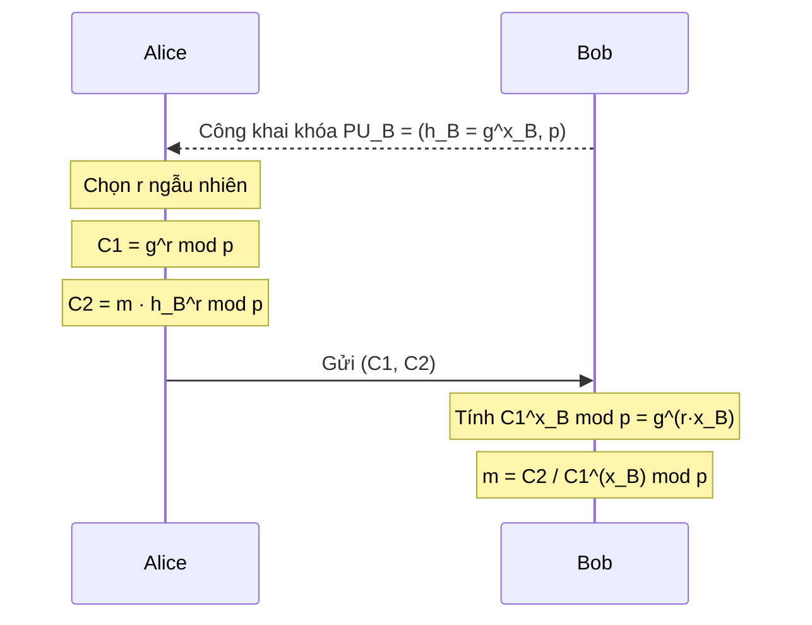
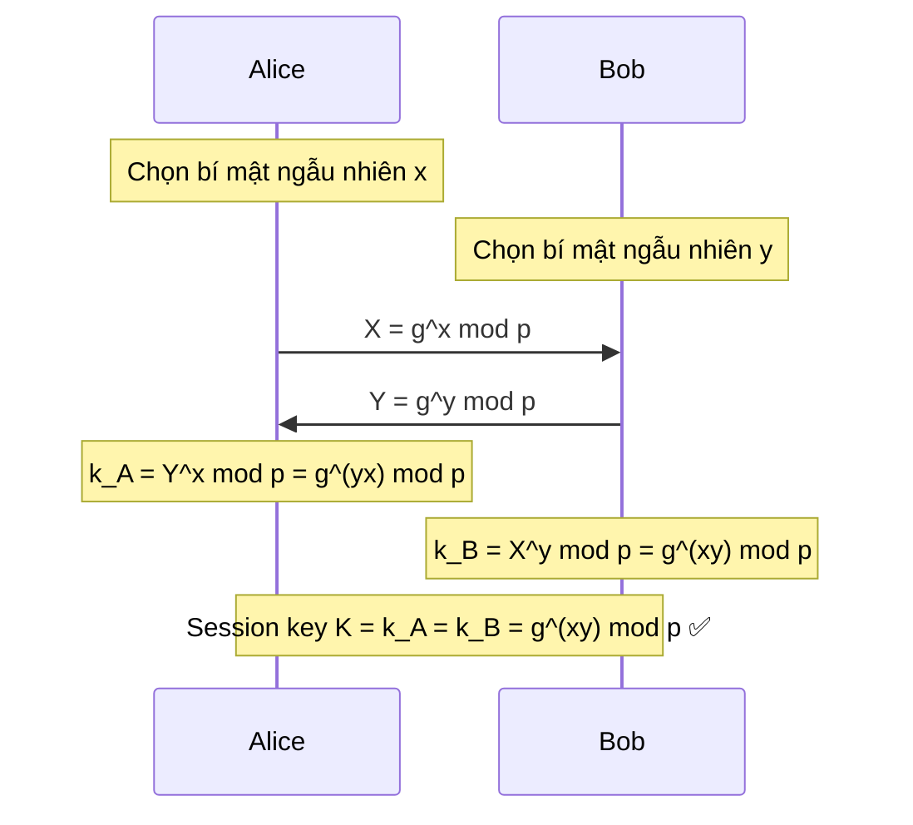
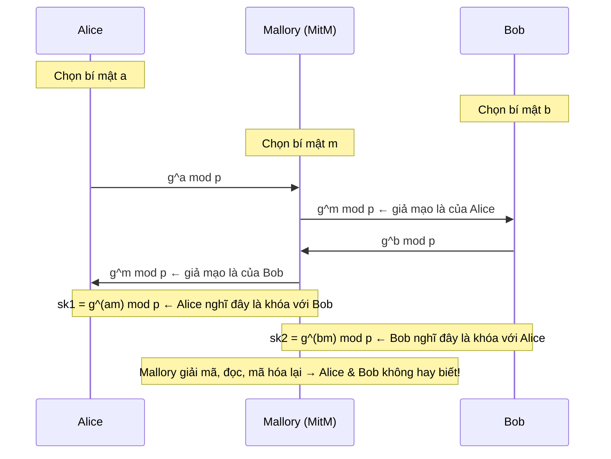
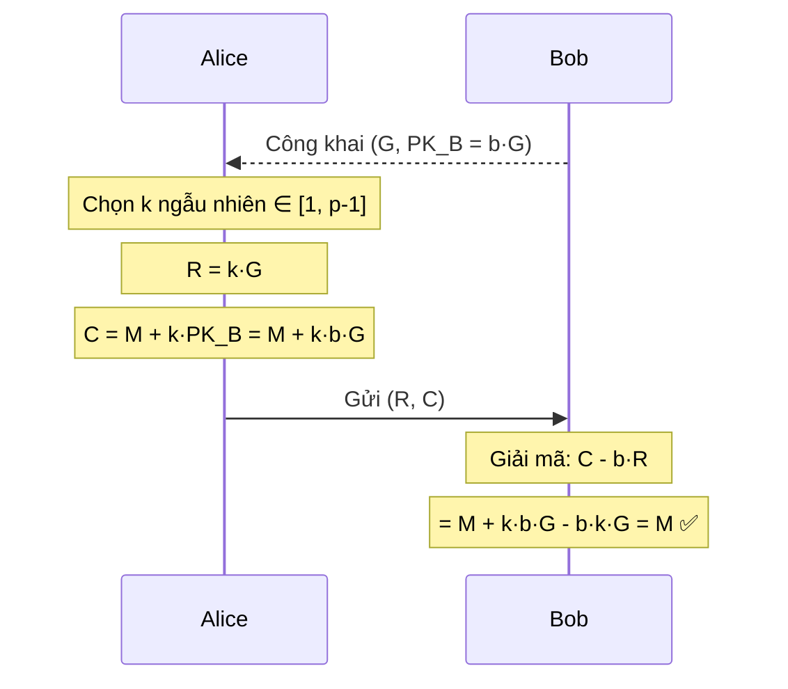
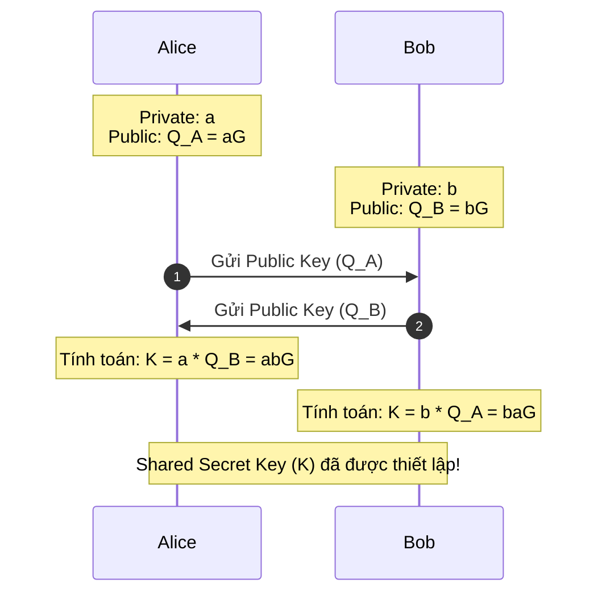
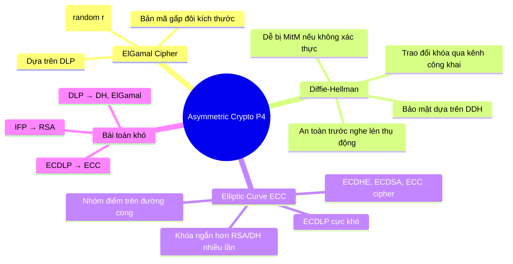

# Bài 9: Mật mã bất đối xứng (P4): ElGamal, Diffie-Hellman & ECC

---

## 1. ElGamal Cipher

### 1.1 Tham số hệ thống

ElGamal hoạt động trên nhóm nhân modulo một số nguyên tố lớn $p$:

- **Nhóm:** $G = \mathbb{Z}_p^* = \{1, 2, \ldots, p-1\}$, với $g$ là phần tử sinh (generator)
- **Khóa bí mật:** $x \in_R [1, p-1]$ (chọn ngẫu nhiên)
- **Khóa công khai:** $h = g^x \mod p$

> **Tóm lại:** Ai cũng biết $p$, $g$, $h$. Chỉ chủ sở hữu biết $x$.

---

### 1.2 Mã hóa

Để mã hóa thông điệp $m < p-1$ bằng **khóa công khai** $h = g^x$:

1. Chọn số ngẫu nhiên $r \in_R [1, p-1]$
2. Tính $C_1 = g^r \mod p$
3. Tính $C_2 = m \cdot h^r \mod p = m \cdot g^{x \cdot r} \mod p$
4. Bản mã là cặp $(C_1, C_2)$

!!! question "Tại sao cần chọn $r$ ngẫu nhiên?"
    Nếu $r$ cố định hoặc bị tái sử dụng, kẻ tấn công có thể so sánh hai bản mã $C_2 = m \cdot g^{xr}$ và $C_2' = m' \cdot g^{xr}$, từ đó suy ra $m/m'$ — lộ thông tin. Tính ngẫu nhiên của $r$ đảm bảo **semantic security** (mỗi lần mã hóa cùng $m$ ra kết quả khác nhau).

---

### 1.3 Giải mã

Để giải mã $(C_1, C_2)$ bằng **khóa bí mật** $x$:

1. Tính $C_1^x \mod p = (g^r)^x \mod p = g^{rx} \mod p$
2. Tính:

$$\frac{C_2}{C_1^x} \mod p = \frac{m \cdot g^{xr}}{g^{rx}} \mod p = m$$

---

### 1.4 Luồng hoạt động tổng thể



---

## 2. Diffie-Hellman Key Exchange (DHE)

### 2.1 Bối cảnh & ý tưởng

Alice và Bob chưa từng gặp nhau, **không chia sẻ bí mật nào trước đó**, nhưng muốn thiết lập một **khóa đối xứng chung** qua kênh truyền công khai (kẻ nghe lén có thể thấy mọi thứ).

**Thông tin công khai:** số nguyên tố lớn $p$ và generator $g$ của $\mathbb{Z}_p^*$.

---

### 2.2 Giao thức



Alice và Bob đều đến được cùng một khóa $K = g^{xy} \mod p$ mà **không cần truyền $x$ hay $y$** qua mạng.

---

### 2.3 Tại sao DHE an toàn?

Có ba mức độ khó tăng dần:

| Bài toán | Phát biểu | Ghi chú |
|---|---|---|
| **DLP** – Discrete Log | Cho $g^x \mod p$, tìm $x$ | Không có thuật toán hiệu quả đã biết |
| **CDH** – Computational DH | Cho $g^x$ và $g^y$, tính $g^{xy} \mod p$ | Khó trừ khi biết $x$ hoặc $y$ |
| **DDH** – Decisional DH | Cho $g^x$, $g^y$, phân biệt $g^{xy}$ với $g^r$ ngẫu nhiên | Khó nhất trong ba bài toán |

!!! info "Tại sao DLP chưa đủ?"
    Nếu chỉ cần DLP khó là đủ, thì kẻ tấn công không cần tìm $x$ — họ chỉ cần phân biệt khóa phiên $g^{xy}$ với một giá trị ngẫu nhiên để phá vỡ giao thức. Do đó **DDH mới là giả thiết cần thiết** để DHE an toàn trước kẻ nghe lén thụ động.

---

### 2.4 Hạn chế: Không có xác thực

!!! warning "DHE không chống được Man-in-the-Middle (MitM)"
    DHE chỉ an toàn trước **kẻ nghe lén thụ động**. Nếu kẻ tấn công có thể **chặn và thay thế** các thông điệp, toàn bộ giao thức bị phá vỡ.



**Giải pháp thực tế:** IPsec kết hợp DHE với **chữ ký số** và các cơ chế chống DoS để xác thực danh tính hai bên.

---

## 3. Elliptic Curve Cryptography (ECC)

### 3.1 Động lực: Tại sao cần ECC?

Trước ECC, các hệ mật dùng cấu trúc đại số cơ bản:

```
Group (G, +)       → có +, −
Ring  (R, +, ×)    → có +, −, ×
Field (F, +, ×)    → có +, −, ×, ÷
```

Ví dụ hay dùng: $\mathbb{Z}_p = \{0, 1, \ldots, p-1\}$ — trường hữu hạn modulo nguyên tố.

**Vấn đề:** Để đạt mức bảo mật tương đương AES-128, RSA cần khóa 3072-bit — **nặng về tính toán và lưu trữ**.

ECC xây dựng một **nhóm mới** (elliptic curve group) trên nền trường hữu hạn, nhưng bài toán logarithm rời rạc trên đường cong elliptic **khó hơn nhiều** so với trên $\mathbb{Z}_p^*$, cho phép dùng khóa ngắn hơn đáng kể.

---

### 3.2 Đường cong Elliptic là gì?

#### Dạng Weierstrass (phổ biến nhất)

$$E/K: y^2 = x^3 + ax + b$$

- $K$ là trường nền (field): có thể là $\mathbb{R}$, $\mathbb{Z}_p$, $GF(2^n)$, ...
- $a, b$ là các hệ số xác định hình dạng đường cong
- Đường cong hợp lệ khi $4a^3 + 27b^2 \neq 0$ (không có điểm kỳ dị)

#### Dạng Montgomery

$$E/K: By^2 = x^3 + Ax^2 + x$$

Ví dụ: **Curve25519** — một trong những đường cong được dùng nhiều nhất hiện nay:

$$y^2 = x^3 + 486662x^2 + x \quad \text{trên trường } \mathbb{Z}_{2^{255}-19}$$

#### Dạng Twisted Edwards

$$E/K: ax^2 + y^2 = 1 + dx^2y^2$$

Dùng trong **Ed25519** (chữ ký số nhanh). Xem thêm: [https://safecurves.cr.yp.to/](https://safecurves.cr.yp.to/)

---

### 3.3 Phép cộng điểm trên đường cong Elliptic

Đây là phép toán cơ bản của ECC. Ý tưởng hình học:

**Cộng hai điểm $P_1 + P_2$:**

- Vẽ đường thẳng qua $P_1$ và $P_2$
- Đường thẳng đó cắt đường cong tại điểm thứ ba
- Lấy đối xứng điểm đó qua trục $x$ → ra $P_3 = P_1 + P_2$

**Nhân đôi điểm $P + P = 2P$:**

- Vẽ tiếp tuyến tại $P$
- Tiếp tuyến cắt đường cong tại điểm khác
- Lấy đối xứng qua trục $x$

**Các trường hợp đặc biệt:**

- $P + (-P) = \mathcal{O}$ (điểm vô cực — phần tử trung hòa)
- $P + \mathcal{O} = \mathcal{O} + P = P$

---

### 3.4 Tính chất nhóm

Tập hợp các điểm trên $E/K$ cùng phép cộng $\oplus$ tạo thành một **nhóm Abel**:

| Tính chất | Biểu thức |
|---|---|
| Giao hoán | $P + Q = Q + P$ |
| Kết hợp | $(P + Q) + R = P + (Q + R)$ |
| Phần tử trung hòa | $P + \mathcal{O} = P$ |
| Phần tử nghịch đảo | $P + (-P) = \mathcal{O}$ |

---

### 3.5 Các tham số nhóm ECC

Để triển khai ECC thực tế, cần xác định đầy đủ:

| Tham số | Ý nghĩa |
|---|---|
| Phương trình đường cong | Loại (Weierstrass, Montgomery,...) + hệ số $a, b$ |
| Modulo | Số nguyên tố $p$ hoặc đa thức $f(x)$ |
| Điểm sinh $G$ | Generator point — điểm cơ sở của nhóm con |
| Bậc $n$ | $n = \lvert\langle G \rangle\rvert$ — số điểm trong nhóm con sinh bởi $G$ |
| Cofactor $h$ | $h = \lvert E/K \rvert / n$ — tỉ lệ kích thước nhóm lớn / nhóm con |

Tài liệu chuẩn: [SECG SEC2 v2](http://www.secg.org/sec2-v2.pdf)

---

### 3.6 Bài toán khó của ECC: ECDLP

!!! danger "Elliptic Curve Discrete Logarithm Problem (ECDLP)"
    **Cho:** điểm sinh $G$ và điểm $Q = dG$ (tức $G$ cộng với chính nó $d$ lần)  
    **Tìm:** số nguyên $d$

    - Chiều thuận $G \xrightarrow{d} Q = dG$: **dễ** (dùng thuật toán double-and-add, $O(\log d)$ phép toán)
    - Chiều ngược $Q, G \xrightarrow{?} d$: **cực kỳ khó** — không có thuật toán đa thức đã biết

So sánh với DLP trên $\mathbb{Z}_p^*$: ECDLP khó hơn nhiều ở cùng kích thước tham số, vì các thuật toán index calculus hiệu quả trên $\mathbb{Z}_p^*$ **không áp dụng được** cho đường cong elliptic tổng quát.

---

### 3.7 Cặp khóa ECC

```
Khóa bí mật (private key): d ∈ [1, n-1]  — số nguyên ngẫu nhiên

Khóa công khai (public key): Q = d·G     — một điểm trên đường cong
```

---

### 3.8 ECC Cipher (Mã hóa ElGamal trên đường cong)



!!! info "Lưu ý"
    $M$ ở đây là một **điểm trên đường cong** $E/K$, không phải số nguyên thông thường. Trong thực tế, cần bước **encode** thông điệp thành điểm trước khi mã hóa.

---

### 3.9 ECDHE – Elliptic Curve Diffie-Hellman

Tương tự DHE nhưng thay nhóm $\mathbb{Z}_p^*$ bằng nhóm điểm trên đường cong:



ECDHE cũng **dễ bị tấn công MitM** nếu không có xác thực, hoàn toàn tương tự DHE.

---

## 4. So sánh các hệ mật

### 4.1 Chức năng

| Thuật toán | Mã hóa/Giải mã | Chữ ký số | Trao đổi khóa |
|---|:---:|:---:|:---:|
| RSA | ✅ | ✅ | ✅ |
| Elliptic Curve | ✅ | ✅ | ✅ |
| Diffie-Hellman | ❌ | ❌ | ✅ |
| DSS | ❌ | ✅ | ❌ |

### 4.2 Kích thước khóa để đạt cùng mức bảo mật

| Symmetric (bits) | RSA / DH (bits) | ECC (bits) |
|:---:|:---:|:---:|
| 56 | 512 | 112 |
| 80 | 1024 | 160 |
| 112 | 2048 | 224 |
| **128** | **3072** | **256** |
| 192 | 7680 | 384 |
| 256 | 15360 | 512 |

!!! success "ECC dùng khóa ngắn hơn ~12× so với RSA ở mức bảo mật 128-bit"
    Điều này có ý nghĩa lớn trong thực tế: tốc độ tính toán nhanh hơn, tiêu thụ băng thông ít hơn, phù hợp thiết bị giới hạn tài nguyên.

---

## 5. Các bài toán khó nền tảng – Tổng kết

| Bài toán | Ký hiệu | Phát biểu |
|---|---|---|
| **Integer Factorization** | IFP | Cho $n = p \cdot q$, tìm $\phi(n) = (p-1)(q-1)$ |
| **Discrete Log** | DLP | Cho $g, p, y = g^x \mod p$, tìm $x$ |
| **Diffie-Hellman** | DHP | Cho $g, p, A = g^a \mod p, B = g^b \mod p$, tính $g^{ab}$ |
| **EC Discrete Log** | ECDLP | Cho $G, Q = dG$, tìm $d$ |

---

## 6. Ứng dụng thực tế của ECC

ECC đặc biệt phù hợp cho:

- **Thiết bị không dây** (IoT, sensor): tài nguyên hạn chế
- **Smart card**: bộ nhớ và CPU yếu
- **Web server**: cần xử lý hàng nghìn phiên TLS đồng thời — ECDHE giảm tải CPU đáng kể
- **Bất kỳ ứng dụng nào** cần bảo mật mạnh nhưng thiếu tài nguyên tính toán

---

## 7. Tóm tắt toàn bộ chương


