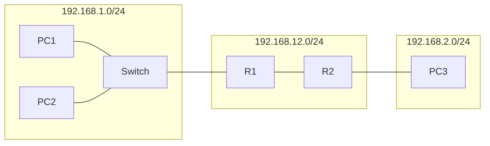
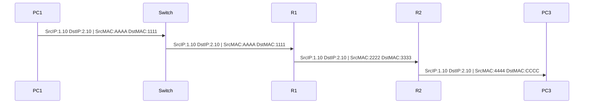

# Chương 1: Giới thiệu về Hạ tầng Mạng (Network Infrastructures)

Hạ tầng mạng là tập hợp các thành phần phần cứng, phần mềm và dịch vụ tạo nên nền tảng kết nối cho phép các thiết bị giao tiếp với nhau. Một hạ tầng mạng điển hình bao gồm ba nhóm chính:

### 1.1 Thiết bị mạng (Network Devices)

Các thiết bị mạng là phần cứng đóng vai trò trung gian hoặc đầu cuối trong quá trình truyền dữ liệu:

- **Hub**: Thiết bị lớp 1 (Physical Layer), phát tín hiệu đến tất cả các cổng mà không phân biệt đích. Hiện nay gần như không còn được dùng.
- **Switch**: Thiết bị lớp 2 (Data Link Layer), học và lưu địa chỉ MAC, chỉ chuyển tiếp frame đến đúng cổng đích. Là thiết bị trung tâm trong mạng LAN hiện đại.
- **Router**: Thiết bị lớp 3 (Network Layer), định tuyến gói tin giữa các mạng khác nhau dựa trên địa chỉ IP.
- **Access Point (AP)**: Cho phép các thiết bị không dây kết nối vào mạng có dây.
- **Firewall**: Kiểm soát luồng traffic vào/ra mạng dựa trên các quy tắc bảo mật.

### 1.2 Môi trường truyền dẫn (Network Media Types)

Môi trường truyền dẫn xác định cách tín hiệu được truyền đi giữa các thiết bị:

**Có dây (Wired):**

- **Cáp đồng xoắn đôi (Twisted Pair - UTP/STP)**: Phổ biến nhất trong mạng LAN. Các chuẩn Cat5e, Cat6, Cat6a hỗ trợ tốc độ từ 100 Mbps đến 10 Gbps.
- **Cáp đồng trục (Coaxial)**: Ít dùng trong mạng hiện đại, chủ yếu dùng cho truyền hình cáp.
- **Cáp quang (Fiber Optic)**: Truyền tín hiệu bằng ánh sáng, tốc độ cao, khoảng cách xa, không bị nhiễu điện từ. Gồm single-mode (khoảng cách rất xa) và multi-mode (khoảng cách ngắn hơn).

**Không dây (Wireless):**

- **Wi-Fi (IEEE 802.11)**: Phổ biến nhất, dùng sóng radio 2.4 GHz hoặc 5 GHz.
- **Bluetooth, Zigbee, LTE/5G**: Các công nghệ không dây khác cho các mục đích cụ thể.

### 1.3 Dịch vụ mạng (Network Services)

Các dịch vụ chạy trên nền hạ tầng mạng để phục vụ người dùng và hệ thống:

- **DNS (Domain Name System)**: Phân giải tên miền thành địa chỉ IP.
- **DHCP (Dynamic Host Configuration Protocol)**: Cấp phát địa chỉ IP tự động cho các thiết bị.
- **HTTP/HTTPS**: Giao thức truyền tải trang web.
- **FTP/SFTP**: Truyền tải tập tin.
- **SMTP/IMAP/POP3**: Dịch vụ email.
- **NTP (Network Time Protocol)**: Đồng bộ thời gian.

---

## 2. Giới thiệu về Router

### 2.1 Các thành phần của Router

Router là một thiết bị phức tạp với nhiều thành phần phần cứng và phần mềm:

```
Router
├── CPU (Bộ xử lý trung tâm)
│   └── Thực thi IOS (Internetwork Operating System)
├── RAM (Random Access Memory)
│   └── Lưu running-config (cấu hình đang chạy, mất khi tắt nguồn)
├── Flash Memory
│   └── Lưu IOS image (hệ điều hành của router)
├── NVRAM (Non-Volatile RAM)
│   └── Lưu startup-config (cấu hình khởi động, giữ lại khi tắt nguồn)
└── Interfaces (Các cổng giao tiếp)
    ├── Management: Console, Mini-USB, AUX
    ├── LAN: GigabitEthernet, FastEthernet
    └── WAN: Serial
```

!!! note "Phân biệt running-config và startup-config"
    - `running-config`: cấu hình hiện tại đang được áp dụng, lưu trong **RAM**, sẽ **mất** khi router khởi động lại nếu không lưu.
    - `startup-config`: cấu hình được load khi router khởi động, lưu trong **NVRAM**, **không mất** khi tắt nguồn.
    - Để lưu cấu hình: `copy running-config startup-config` hoặc `write memory`.

### 2.2 Vai trò của Router trong Topology mạng

Router đảm nhận hai vai trò chính:

**a) LAN Segmentation (Phân đoạn mạng LAN)**

Router chia một mạng lớn thành các segment nhỏ hơn (các subnet). Mỗi segment là một broadcast domain riêng biệt. Điều này giúp:

- Giảm lượng broadcast traffic không cần thiết.
- Tăng bảo mật giữa các phân đoạn.
- Dễ quản lý và kiểm soát traffic.

**b) Routing và Forwarding (Định tuyến và Chuyển tiếp)**

Router duy trì một **Routing Table** (bảng định tuyến) để xác định đường đi tốt nhất cho mỗi gói tin:

| Network Protocol | Destination Network | Exit Interface |
|---|---|---|
| Connected | 192.168.1.0/24 | Interface 1 |
| Connected | 192.168.12.0/24 | Interface 2 |
| Learned | 192.168.2.0/24 | Interface 2 |

- **Connected**: Mạng kết nối trực tiếp vào interface của router, tự động được thêm vào bảng định tuyến khi interface được cấu hình IP và active.
- **Learned**: Mạng học được qua các giao thức định tuyến động (như RIP, OSPF, EIGRP) hoặc cấu hình tĩnh (static route).



---

## 3. Truyền dữ liệu trong mạng LAN

### 3.1 Hoạt động của Switch trong LAN

Switch hoạt động ở lớp 2 (Data Link Layer) và sử dụng **địa chỉ MAC** để chuyển tiếp frame.

**Ví dụ:** PC1 gửi dữ liệu đến PC2 trong cùng một mạng LAN.

```
Topology:
PC1 (IP: 192.168.1.10, MAC: AAAA) --- [Interface 1] Switch [Interface 2] --- PC2 (IP: 192.168.1.20, MAC: BBBB)
```

**MAC Address Table của Switch:**

| Interface | MAC |
|---|---|
| 1 | AAAA |
| 2 | BBBB |

**Quá trình:**

1. PC1 muốn gửi dữ liệu tới PC2. PC1 biết IP đích (192.168.1.20) thuộc cùng subnet, nên cần biết MAC của PC2.
2. PC1 gửi **ARP Request** (broadcast) hỏi "MAC của 192.168.1.20 là gì?".
3. PC2 phản hồi ARP Reply với MAC: BBBB.
4. PC1 đóng gói frame với Source MAC: AAAA, Destination MAC: BBBB và gửi đến Switch.
5. Switch tra bảng MAC, thấy BBBB nằm ở Interface 2, chuyển tiếp frame ra Interface 2.
6. PC2 nhận được frame.

!!! info "Switch học MAC Address như thế nào?"
    Switch học MAC address theo cơ chế **dynamic learning**: khi nhận được một frame, switch ghi lại Source MAC Address và cổng nhận vào MAC Address Table. Nếu Destination MAC chưa có trong bảng, switch sẽ **flood** (gửi ra tất cả các cổng trừ cổng nhận vào) - hành vi gọi là **unknown unicast flooding**.

---

## 4. Truyền dữ liệu qua nhiều mạng LAN (Data Transmission over LANs)

Đây là kịch bản phức tạp hơn, khi nguồn và đích thuộc hai mạng khác nhau, phải đi qua Router.

### 4.1 Sơ đồ mạng

```
PC1 (192.168.1.10/24, GW: 192.168.1.1, MAC: AAAA)
    |
[Interface 1] Switch [Interface 2] --- [Interface 3]
                                            |
                                    R1 - Interface 1: 192.168.1.1/24, MAC: 1111
                                       - Interface 2: 192.168.12.1/24, MAC: 2222
                                            |
                                    R2 - Interface 1: 192.168.12.2/24, MAC: 3333
                                       - Interface 2: 192.168.2.1/24, MAC: 4444
                                            |
                                    PC3 (192.168.2.10/24, GW: 192.168.2.1, MAC: CCCC)
```

### 4.2 Phân tích từng hop

**Kịch bản:** PC1 (192.168.1.10) gửi dữ liệu tới PC3 (192.168.2.10).

PC1 nhận ra 192.168.2.10 không cùng subnet với mình (192.168.1.0/24), nên phải gửi lên **default gateway** là R1 Interface 1 (192.168.1.1).

---

**Hop 1: PC1 --> R1 (qua Switch)**

| Trường | Giá trị |
|---|---|
| Source IP | 192.168.1.10 |
| Destination IP | 192.168.2.10 |
| Source MAC | AAAA (MAC của PC1) |
| Destination MAC | 1111 (MAC của R1 Interface 1 - gateway) |

!!! warning "Lưu ý quan trọng"
    **Địa chỉ IP không thay đổi** trong suốt hành trình (trừ khi có NAT). Chỉ có **địa chỉ MAC thay đổi** ở mỗi hop, vì MAC chỉ có ý nghĩa trong phạm vi một segment mạng (Layer 2).

---

**Hop 2: R1 --> R2 (qua đường WAN/liên mạng 192.168.12.0/24)**

R1 tra bảng định tuyến, thấy 192.168.2.0/24 có thể đến qua Interface 2 (192.168.12.0/24), next-hop là R2 (192.168.12.2).

| Trường | Giá trị |
|---|---|
| Source IP | 192.168.1.10 |
| Destination IP | 192.168.2.10 |
| Source MAC | 2222 (MAC của R1 Interface 2) |
| Destination MAC | 3333 (MAC của R2 Interface 1) |

---

**Hop 3: R2 --> PC3**

R2 tra bảng định tuyến, thấy 192.168.2.0/24 là mạng kết nối trực tiếp qua Interface 2. R2 gửi ARP để tìm MAC của PC3 rồi chuyển tiếp.

| Trường | Giá trị |
|---|---|
| Source IP | 192.168.1.10 |
| Destination IP | 192.168.2.10 |
| Source MAC | 4444 (MAC của R2 Interface 2) |
| Destination MAC | CCCC (MAC của PC3) |



!!! tip "Tóm tắt nguyên tắc cốt lõi"
    - **IP Address** = địa chỉ logic, xác định đích cuối cùng, **không đổi** qua các hop (kịch bản không có NAT).
    - **MAC Address** = địa chỉ vật lý, chỉ có giá trị trong một segment Layer 2, **thay đổi** ở mỗi hop khi đi qua router.
    - **Router** là thiết bị thực hiện việc "bóc" header Layer 2 cũ và "đóng" header Layer 2 mới phù hợp với segment tiếp theo.

---

---

## Câu hỏi Trắc nghiệm

**Câu 1.** Thiết bị nào hoạt động ở Layer 2 của mô hình OSI và sử dụng địa chỉ MAC để chuyển tiếp dữ liệu?

- A. Router
- B. Hub
- C. Switch
- D. Firewall

??? info "Đáp án & Giải thích"
    **Đáp án: C**

    Switch hoạt động ở Layer 2 (Data Link Layer) và dùng MAC Address Table để quyết định chuyển tiếp frame đến đúng cổng đích.

---

**Câu 2.** Router hoạt động ở layer nào của mô hình OSI?

- A. Layer 1
- B. Layer 2
- C. Layer 3
- D. Layer 4

??? info "Đáp án & Giải thích"
    **Đáp án: C**

    Router hoạt động ở Layer 3 (Network Layer), xử lý địa chỉ IP và thực hiện định tuyến gói tin giữa các mạng khác nhau.

---

**Câu 3.** Thành phần nào của Router lưu trữ `startup-config`?

- A. RAM
- B. Flash
- C. NVRAM
- D. CPU

??? info "Đáp án & Giải thích"
    **Đáp án: C**

    NVRAM (Non-Volatile RAM) lưu `startup-config` - cấu hình khởi động của router. Đây là bộ nhớ không mất dữ liệu khi tắt nguồn.

---

**Câu 4.** Thành phần nào của Router lưu trữ `running-config`?

- A. NVRAM
- B. Flash
- C. RAM
- D. ROM

??? info "Đáp án & Giải thích"
    **Đáp án: C**

    RAM lưu `running-config` - cấu hình đang chạy hiện tại. Dữ liệu trong RAM sẽ **mất** khi router tắt nguồn hoặc khởi động lại.

---

**Câu 5.** Flash memory trong Router dùng để lưu gì?

- A. running-config
- B. startup-config
- C. IOS image
- D. Routing table

??? info "Đáp án & Giải thích"
    **Đáp án: C**

    Flash memory lưu trữ **IOS image** (hệ điều hành của router - Internetwork Operating System). Đây là bộ nhớ không mất khi tắt nguồn và có thể cập nhật được.

---

**Câu 6.** Lệnh nào dùng để lưu `running-config` vào `startup-config`?

- A. `save config`
- B. `copy startup-config running-config`
- C. `copy running-config startup-config`
- D. `write erase`

??? info "Đáp án & Giải thích"
    **Đáp án: C**

    `copy running-config startup-config` (hoặc `write memory`) là lệnh lưu cấu hình hiện tại vào NVRAM để không bị mất khi khởi động lại.

---

**Câu 7.** Trong quá trình truyền dữ liệu từ PC1 tới PC3 qua hai router, địa chỉ nào thay đổi ở mỗi hop?

- A. Source IP và Destination IP
- B. Source MAC và Destination MAC
- C. Chỉ Destination MAC
- D. Không có gì thay đổi

??? info "Đáp án & Giải thích"
    **Đáp án: B**

    Địa chỉ **MAC** (Source và Destination) thay đổi ở mỗi hop vì MAC chỉ có ý nghĩa trong phạm vi một segment Layer 2. Địa chỉ **IP** không thay đổi (trừ khi có NAT).

---

**Câu 8.** Khi PC1 muốn gửi dữ liệu tới PC3 ở mạng khác, PC1 đặt địa chỉ MAC đích là?

- A. MAC của PC3
- B. MAC của Switch
- C. MAC của Default Gateway (Router interface)
- D. Broadcast MAC FF:FF:FF:FF:FF:FF

??? info "Đáp án & Giải thích"
    **Đáp án: C**

    Khi đích nằm ngoài subnet, PC1 gửi frame tới **default gateway** (router). Do đó MAC đích là MAC của interface router kết nối vào cùng mạng với PC1.

---

**Câu 9.** Giao thức nào giúp PC1 xác định được địa chỉ MAC của default gateway?

- A. DNS
- B. DHCP
- C. ARP
- D. ICMP

??? info "Đáp án & Giải thích"
    **Đáp án: C**

    **ARP (Address Resolution Protocol)** được dùng để phân giải địa chỉ IP thành địa chỉ MAC trong cùng một subnet.

---

**Câu 10.** Trong bảng định tuyến, entry loại "Connected" có nghĩa là?

- A. Mạng học được từ giao thức định tuyến động
- B. Mạng cấu hình tĩnh bởi quản trị viên
- C. Mạng kết nối trực tiếp vào interface của router
- D. Mạng mặc định (default route)

??? info "Đáp án & Giải thích"
    **Đáp án: C**

    Entry **Connected** là mạng kết nối trực tiếp vào một interface của router. Router tự động thêm entry này khi interface được cấu hình IP và ở trạng thái up/up.

---

**Câu 11.** Loại cáp nào có khả năng truyền dữ liệu xa nhất và không bị nhiễu điện từ?

- A. Cáp UTP Cat6
- B. Cáp đồng trục
- C. Cáp quang (Fiber Optic)
- D. Cáp STP

??? info "Đáp án & Giải thích"
    **Đáp án: C**

    Cáp quang truyền tín hiệu bằng ánh sáng, không bị nhiễu điện từ (EMI), hỗ trợ khoảng cách rất xa (single-mode có thể lên đến hàng chục km) và băng thông rất cao.

---

**Câu 12.** Hub khác Switch ở điểm nào cơ bản nhất?

- A. Hub hoạt động ở Layer 2, Switch ở Layer 1
- B. Hub phát tín hiệu ra tất cả các cổng, Switch chỉ gửi đến đúng cổng đích
- C. Hub nhanh hơn Switch
- D. Hub hỗ trợ nhiều cổng hơn Switch

??? info "Đáp án & Giải thích"
    **Đáp án: B**

    Hub hoạt động ở Layer 1, phát (broadcast) tín hiệu ra tất cả các cổng. Switch hoạt động ở Layer 2, dùng MAC table để chuyển tiếp frame chỉ đến đúng cổng đích, hiệu quả hơn nhiều.

---

**Câu 13.** Switch học địa chỉ MAC bằng cơ chế nào?

- A. Cấu hình thủ công bởi admin
- B. Nhận từ DHCP server
- C. Dynamic learning - học từ Source MAC của các frame nhận được
- D. Nhận từ Router

??? info "Đáp án & Giải thích"
    **Đáp án: C**

    Switch tự động học MAC bằng cách ghi nhận **Source MAC Address** và cổng nhận vào mỗi khi nhận được frame. Đây gọi là dynamic (transparent) learning.

---

**Câu 14.** Khi Switch nhận được frame có Destination MAC chưa có trong bảng MAC, Switch sẽ làm gì?

- A. Hủy frame
- B. Gửi frame về nguồn
- C. Flood frame ra tất cả các cổng trừ cổng nhận vào
- D. Chờ đến khi học được MAC

??? info "Đáp án & Giải thích"
    **Đáp án: C**

    Đây gọi là **Unknown Unicast Flooding**. Switch gửi frame ra tất cả các cổng (trừ cổng vào) để đảm bảo frame đến được đích. Thiết bị có MAC tương ứng sẽ nhận và phản hồi, switch sau đó học được vị trí của MAC đó.

---

**Câu 15.** Cổng Console trên Router dùng để làm gì?

- A. Kết nối WAN tốc độ cao
- B. Quản lý router out-of-band (truy cập trực tiếp không qua mạng)
- C. Kết nối LAN Gigabit
- D. Kết nối với switch qua cáp quang

??? info "Đáp án & Giải thích"
    **Đáp án: B**

    Cổng **Console** (và AUX) là cổng quản lý **out-of-band**, cho phép truy cập trực tiếp vào router bằng cáp console, không cần thông qua mạng IP. Rất hữu ích khi router bị mất kết nối mạng.

---

**Câu 16.** Vai trò của DNS trong hạ tầng mạng là gì?

- A. Cấp phát địa chỉ IP tự động
- B. Phân giải tên miền thành địa chỉ IP
- C. Định tuyến gói tin giữa các mạng
- D. Mã hóa dữ liệu truyền tải

??? info "Đáp án & Giải thích"
    **Đáp án: B**

    **DNS (Domain Name System)** phân giải tên miền dễ nhớ (vd: `www.google.com`) thành địa chỉ IP mà máy tính có thể dùng để kết nối.

---

**Câu 17.** DHCP phục vụ mục đích gì?

- A. Phân giải tên miền
- B. Cấp phát địa chỉ IP tự động cho các thiết bị trong mạng
- C. Bảo mật kết nối mạng
- D. Đồng bộ thời gian giữa các thiết bị

??? info "Đáp án & Giải thích"
    **Đáp án: B**

    **DHCP (Dynamic Host Configuration Protocol)** tự động cấp phát địa chỉ IP, subnet mask, default gateway và DNS server cho các thiết bị khi chúng kết nối vào mạng.

---

**Câu 18.** Trong mạng LAN, PC1 (192.168.1.10/24) gửi dữ liệu cho PC2 (192.168.1.20/24). Cả hai kết nối qua một Switch. Gói tin đi qua thiết bị nào?

- A. Switch và Router
- B. Chỉ Switch
- C. Chỉ Router
- D. Switch, Router rồi Switch khác

??? info "Đáp án & Giải thích"
    **Đáp án: B**

    Vì PC1 và PC2 cùng subnet (192.168.1.0/24), dữ liệu chỉ cần đi qua **Switch** ở Layer 2. Không cần Router vì đây là giao tiếp trong cùng một mạng LAN.

---

**Câu 19.** PC1 có IP 192.168.1.10/24 và PC3 có IP 192.168.2.10/24. Hai PC này muốn giao tiếp. Điều gì bắt buộc phải có?

- A. Một Switch kết nối cả hai
- B. Một Router với ít nhất hai interface nối vào hai mạng
- C. Cả hai phải có cùng địa chỉ MAC
- D. Một Hub phát sóng broadcast

??? info "Đáp án & Giải thích"
    **Đáp án: B**

    Hai subnet khác nhau cần **Router** để định tuyến traffic giữa chúng. Router phải có ít nhất một interface trong mỗi mạng (hoặc kết nối gián tiếp qua các router khác).

---

**Câu 20.** Trong ví dụ bài giảng, khi gói tin đi từ R1 đến R2 (qua mạng 192.168.12.0/24), Source MAC là?

- A. AAAA (MAC của PC1)
- B. 1111 (MAC của R1 Interface 1)
- C. 2222 (MAC của R1 Interface 2)
- D. 3333 (MAC của R2 Interface 1)

??? info "Đáp án & Giải thích"
    **Đáp án: C**

    Trên segment 192.168.12.0/24, frame được gửi từ **R1 Interface 2** (MAC: 2222) đến **R2 Interface 1** (MAC: 3333). Source MAC là MAC của interface gửi đi, tức là 2222.

---

**Câu 21.** Trong ví dụ bài giảng, khi gói tin đến PC3, Source MAC là?

- A. AAAA
- B. 2222
- C. 3333
- D. 4444

??? info "Đáp án & Giải thích"
    **Đáp án: D**

    Hop cuối từ R2 đến PC3, R2 gửi frame từ **Interface 2** (MAC: 4444) đến PC3 (MAC: CCCC). Source MAC = 4444.

---

**Câu 22.** Địa chỉ IP nguồn (Source IP) trong gói tin từ PC1 đến PC3 thay đổi như thế nào qua các hop?

- A. Thay đổi mỗi khi qua Router
- B. Không thay đổi, luôn là 192.168.1.10
- C. Thay đổi thành IP của Router
- D. Thay đổi thành IP của default gateway

??? info "Đáp án & Giải thích"
    **Đáp án: B**

    Trong kịch bản không có NAT, **Source IP luôn là IP của PC1** (192.168.1.10) xuyên suốt hành trình. Chỉ MAC mới thay đổi.

---

**Câu 23.** Loại interface WAN nào được đề cập trong bài là phổ biến trên Router?

- A. GigabitEthernet
- B. FastEthernet
- C. Serial
- D. Wi-Fi

??? info "Đáp án & Giải thích"
    **Đáp án: C**

    Cổng **Serial** là loại interface WAN phổ biến trên router, thường dùng cho các kết nối diện rộng như leased line.

---

**Câu 24.** "Broadcast domain" là gì?

- A. Tập hợp các thiết bị có thể nhận được broadcast của nhau
- B. Tên gọi khác của mạng LAN
- C. Phạm vi tín hiệu Wi-Fi
- D. Một loại địa chỉ IP đặc biệt

??? info "Đáp án & Giải thích"
    **Đáp án: A**

    **Broadcast domain** là tập hợp tất cả các thiết bị có thể nhận được frame broadcast của nhau. Router **ngăn** broadcast giữa các mạng, Switch **không ngăn** broadcast trong cùng VLAN.

---

**Câu 25.** Router giúp giảm broadcast traffic bằng cách nào?

- A. Chặn tất cả traffic
- B. Phân đoạn mạng thành các broadcast domain riêng biệt
- C. Nén dữ liệu trước khi gửi
- D. Tăng băng thông đường truyền

??? info "Đáp án & Giải thích"
    **Đáp án: B**

    Mỗi interface của Router tạo ra một **broadcast domain** riêng biệt. Broadcast từ một mạng sẽ không được router chuyển tiếp sang mạng khác, giảm tải cho toàn hệ thống.

---

**Câu 26.** NTP (Network Time Protocol) có vai trò gì?

- A. Dịch tên miền ra IP
- B. Cấp phát địa chỉ IP
- C. Đồng bộ thời gian giữa các thiết bị trong mạng
- D. Truyền file giữa các máy

??? info "Đáp án & Giải thích"
    **Đáp án: C**

    **NTP** đảm bảo tất cả các thiết bị trong mạng có cùng thời gian chính xác, rất quan trọng cho logging, bảo mật, và các giao thức phân tán.

---

**Câu 27.** Cáp quang single-mode khác multi-mode ở điểm nào?

- A. Single-mode chậm hơn multi-mode
- B. Single-mode truyền được xa hơn multi-mode
- C. Multi-mode đắt hơn single-mode
- D. Không có sự khác biệt đáng kể

??? info "Đáp án & Giải thích"
    **Đáp án: B**

    **Single-mode fiber** có lõi nhỏ hơn (~9µm), chỉ cho một chùm sáng truyền qua, đạt khoảng cách rất xa (lên đến hàng chục km). **Multi-mode fiber** có lõi lớn hơn (~50-62.5µm), nhiều chùm sáng, khoảng cách ngắn hơn (thường dưới 2km) nhưng rẻ hơn.

---

**Câu 28.** Khi nói "Router thực hiện LAN Segmentation", điều đó có nghĩa là?

- A. Router chia nhỏ frame thành các mảnh nhỏ hơn
- B. Router tạo ra các mạng con (subnet) riêng biệt, ngăn broadcast lan rộng
- C. Router ghép nhiều mạng LAN thành một
- D. Router mã hóa traffic giữa các mạng

??? info "Đáp án & Giải thích"
    **Đáp án: B**

    LAN Segmentation = Router tạo ra ranh giới giữa các mạng, mỗi mạng là một broadcast domain độc lập, giúp kiểm soát traffic và tăng hiệu quả.

---

**Câu 29.** Trong routing table, entry "Learned" thường được học qua cách nào?

- A. Kết nối trực tiếp vào interface
- B. Giao thức định tuyến động (như OSPF, EIGRP) hoặc static route
- C. ARP request
- D. DHCP server

??? info "Đáp án & Giải thích"
    **Đáp án: B**

    Entry "Learned" (hoặc "Dynamic") đến từ **giao thức định tuyến động** (RIP, OSPF, EIGRP, BGP) hoặc **static route** do admin cấu hình thủ công.

---

**Câu 30.** PC1 gửi ARP Request để tìm MAC của default gateway. ARP Request này là loại gì?

- A. Unicast - gửi trực tiếp đến gateway
- B. Multicast - gửi đến một nhóm
- C. Broadcast - gửi đến tất cả trong subnet
- D. Anycast - gửi đến thiết bị gần nhất

??? info "Đáp án & Giải thích"
    **Đáp án: C**

    ARP Request là **broadcast** (Destination MAC: FF:FF:FF:FF:FF:FF), gửi tới tất cả thiết bị trong subnet. Chỉ thiết bị có IP tương ứng mới phản hồi bằng ARP Reply (unicast).

---

**Câu 31.** Địa chỉ MAC có độ dài bao nhiêu bit?

- A. 32 bit
- B. 48 bit
- C. 64 bit
- D. 128 bit

??? info "Đáp án & Giải thích"
    **Đáp án: B**

    Địa chỉ MAC có độ dài **48 bit** (6 byte), thường biểu diễn dưới dạng hex: XX:XX:XX:XX:XX:XX. Nửa đầu (3 byte) là OUI (nhà sản xuất), nửa sau là số serial do nhà sản xuất gán.

---

**Câu 32.** Địa chỉ IP phiên bản IPv4 có độ dài bao nhiêu bit?

- A. 16 bit
- B. 32 bit
- C. 48 bit
- D. 128 bit

??? info "Đáp án & Giải thích"
    **Đáp án: B**

    IPv4 address có độ dài **32 bit**, chia thành 4 octet, mỗi octet 8 bit, biểu diễn dạng thập phân: X.X.X.X (vd: 192.168.1.10).

---

**Câu 33.** 192.168.1.10/24 - prefix /24 có nghĩa là subnet mask bao nhiêu?

- A. 255.0.0.0
- B. 255.255.0.0
- C. 255.255.255.0
- D. 255.255.255.128

??? info "Đáp án & Giải thích"
    **Đáp án: C**

    /24 = 24 bit 1 liên tiếp = **255.255.255.0**. Điều này có nghĩa phần network là 24 bit đầu, phần host là 8 bit cuối, cho phép 254 host hợp lệ.

---

**Câu 34.** Trong mạng 192.168.1.0/24, địa chỉ broadcast là?

- A. 192.168.1.0
- B. 192.168.1.1
- C. 192.168.1.254
- D. 192.168.1.255

??? info "Đáp án & Giải thích"
    **Đáp án: D**

    Địa chỉ broadcast của một subnet là địa chỉ có tất cả các bit host bằng 1. Với /24, phần host là 8 bit cuối, tất cả bằng 1 = 255. Vậy broadcast = **192.168.1.255**.

---

**Câu 35.** PC1 (192.168.1.10/24) nhận ra PC3 (192.168.2.10/24) ở mạng khác bằng cách nào?

- A. Tra bảng MAC
- B. So sánh phần network của địa chỉ IP với subnet mask
- C. Hỏi DNS server
- D. Ping thử rồi chờ phản hồi

??? info "Đáp án & Giải thích"
    **Đáp án: B**

    PC thực hiện phép AND giữa IP đích và subnet mask của mình. Nếu kết quả khác với Network ID của mình, tức là đích ở mạng khác, phải gửi qua gateway.

    - IP PC1: 192.168.1.10 AND 255.255.255.0 = **192.168.1.0**
    - IP PC3: 192.168.2.10 AND 255.255.255.0 = **192.168.2.0**
    - 192.168.1.0 ≠ 192.168.2.0 → khác mạng → gửi qua gateway.

---

**Câu 36.** Giao thức nào dùng cho truyền file bảo mật?

- A. FTP
- B. SFTP
- C. HTTP
- D. SMTP

??? info "Đáp án & Giải thích"
    **Đáp án: B**

    **SFTP (SSH File Transfer Protocol)** truyền file được mã hóa qua SSH. FTP truyền dữ liệu không mã hóa, không an toàn cho môi trường thực tế.

---

**Câu 37.** Firewall hoạt động theo nguyên tắc nào?

- A. Chuyển tiếp tất cả traffic không phân biệt
- B. Kiểm soát traffic vào/ra dựa trên các rule/policy bảo mật
- C. Chỉ chặn traffic đến từ ngoài Internet
- D. Mã hóa tất cả traffic đi qua nó

??? info "Đáp án & Giải thích"
    **Đáp án: B**

    Firewall kiểm tra và lọc traffic dựa trên **các quy tắc (rules/policies)** được định nghĩa trước. Có thể lọc theo IP, port, giao thức, trạng thái kết nối, v.v.

---

**Câu 38.** Trong topology bài giảng, mạng 192.168.12.0/24 đóng vai trò gì?

- A. Mạng người dùng cuối
- B. Mạng liên kết (interconnect/transit) giữa R1 và R2
- C. Mạng server
- D. Mạng quản lý

??? info "Đáp án & Giải thích"
    **Đáp án: B**

    192.168.12.0/24 là mạng **point-to-point** (hoặc transit network) nối giữa R1 Interface 2 và R2 Interface 1. Không có thiết bị người dùng cuối trong mạng này.

---

**Câu 39.** Wi-Fi sử dụng chuẩn IEEE nào?

- A. IEEE 802.3
- B. IEEE 802.11
- C. IEEE 802.1Q
- D. IEEE 802.1X

??? info "Đáp án & Giải thích"
    **Đáp án: B**

    **IEEE 802.11** là chuẩn cho mạng không dây Wi-Fi. IEEE 802.3 là chuẩn Ethernet có dây. 802.1Q là VLAN tagging. 802.1X là xác thực port-based.

---

**Câu 40.** Cổng AUX trên Router thường dùng cho mục đích gì?

- A. Kết nối LAN
- B. Kết nối WAN tốc độ cao
- C. Quản lý router từ xa qua modem dial-up (out-of-band)
- D. Kết nối ổ cứng ngoài

??? info "Đáp án & Giải thích"
    **Đáp án: C**

    Cổng **AUX (Auxiliary)** thường dùng để kết nối modem analog cho phép truy cập quản lý router từ xa (remote out-of-band management) khi đường IP không khả dụng.

---

**Câu 41.** Trong mô hình OSI, lớp nào chịu trách nhiệm đóng gói dữ liệu thành "frame"?

- A. Network Layer (Layer 3)
- B. Data Link Layer (Layer 2)
- C. Transport Layer (Layer 4)
- D. Physical Layer (Layer 1)

??? info "Đáp án & Giải thích"
    **Đáp án: B**

    **Data Link Layer (Layer 2)** đóng gói dữ liệu thành **frame**, thêm header chứa Source/Destination MAC address và trailer (FCS để kiểm tra lỗi).

---

**Câu 42.** Trong mô hình OSI, lớp nào chịu trách nhiệm đóng gói dữ liệu thành "packet"?

- A. Data Link Layer (Layer 2)
- B. Transport Layer (Layer 4)
- C. Network Layer (Layer 3)
- D. Session Layer (Layer 5)

??? info "Đáp án & Giải thích"
    **Đáp án: C**

    **Network Layer (Layer 3)** đóng gói dữ liệu thành **packet**, thêm header chứa Source/Destination IP address. Router hoạt động ở lớp này.

---

**Câu 43.** Khi Router nhận được một gói tin, nó làm gì với header Layer 2 (MAC)?

- A. Giữ nguyên hoàn toàn
- B. Bóc bỏ header Layer 2 cũ và tạo header Layer 2 mới phù hợp với segment tiếp theo
- C. Xóa cả header Layer 2 và Layer 3
- D. Chỉ thay đổi Source MAC

??? info "Đáp án & Giải thích"
    **Đáp án: B**

    Router **bóc** (decapsulate) header Layer 2 để đọc IP đích, tra bảng routing, rồi **đóng lại** (re-encapsulate) với header Layer 2 mới phù hợp với segment tiếp theo (Source MAC = MAC của interface ra, Destination MAC = MAC của next-hop).

---

**Câu 44.** SMTP là giao thức dùng cho?

- A. Nhận email
- B. Gửi email
- C. Truyền file
- D. Phân giải tên miền

??? info "Đáp án & Giải thích"
    **Đáp án: B**

    **SMTP (Simple Mail Transfer Protocol)** dùng để **gửi** email (từ client đến mail server, hoặc giữa các mail server). Nhận email dùng IMAP hoặc POP3.

---

**Câu 45.** Nếu Router R1 không có entry nào trong bảng định tuyến cho mạng đích, R1 sẽ làm gì?

- A. Flood gói tin ra tất cả interface
- B. Gửi gói tin về nguồn
- C. Hủy gói tin và có thể gửi ICMP Destination Unreachable
- D. Chờ học route từ giao thức định tuyến

??? info "Đáp án & Giải thích"
    **Đáp án: C**

    Khi không tìm thấy route phù hợp (và không có default route), router **drop (hủy) gói tin** và thường gửi thông báo **ICMP Destination Unreachable** về cho nguồn.

---

**Câu 46.** Mục đích của "default gateway" trong cấu hình IP của một máy tính là gì?

- A. Địa chỉ của DNS server
- B. Địa chỉ IP của router để gửi traffic ra ngoài subnet
- C. Địa chỉ của DHCP server
- D. Địa chỉ broadcast của mạng

??? info "Đáp án & Giải thích"
    **Đáp án: B**

    **Default gateway** là địa chỉ IP của router interface kết nối vào mạng của máy tính. Khi máy tính muốn gửi traffic đến đích ngoài subnet, nó gửi đến default gateway.

---

**Câu 47.** Cáp UTP (Unshielded Twisted Pair) có ưu điểm gì so với cáp đồng trục?

- A. Truyền xa hơn
- B. Không bị nhiễu
- C. Rẻ hơn, linh hoạt hơn, dễ lắp đặt hơn
- D. Tốc độ chậm hơn

??? info "Đáp án & Giải thích"
    **Đáp án: C**

    UTP phổ biến trong mạng LAN vì **rẻ, nhẹ, linh hoạt và dễ lắp đặt**. Cáp đồng trục cứng hơn, lắp đặt khó hơn và đã dần bị thay thế.

---

**Câu 48.** Trong bài giảng, R1 biết đường đến mạng 192.168.2.0/24 bằng cách nào (entry "Learned")?

- A. Kết nối trực tiếp vào R1
- B. Học từ giao thức định tuyến động hoặc static route
- C. Nhận từ Switch
- D. Đọc từ DHCP server

??? info "Đáp án & Giải thích"
    **Đáp án: B**

    Mạng 192.168.2.0/24 không kết nối trực tiếp vào R1. R1 biết đường đến mạng này thông qua **giao thức định tuyến động** (như OSPF, RIP) từ R2, hoặc admin cấu hình **static route** thủ công.

---

**Câu 49.** Địa chỉ MAC FF:FF:FF:FF:FF:FF có ý nghĩa gì?

- A. Địa chỉ loopback
- B. Địa chỉ của Router
- C. Địa chỉ broadcast Layer 2
- D. Địa chỉ multicast

??? info "Đáp án & Giải thích"
    **Đáp án: C**

    **FF:FF:FF:FF:FF:FF** là địa chỉ **MAC broadcast**. Frame có Destination MAC này sẽ được gửi đến tất cả thiết bị trong cùng broadcast domain (cùng VLAN/subnet Layer 2). ARP Request dùng địa chỉ này.

---

**Câu 50.** Tại sao khi gói tin từ PC1 đến PC3 đi qua R2 rồi đến PC3, Source IP vẫn là 192.168.1.10 chứ không phải IP của R2?

- A. Vì R2 không có địa chỉ IP
- B. Vì địa chỉ IP hoạt động end-to-end (đầu cuối-đầu cuối), không thay đổi qua các router trong kịch bản không có NAT
- C. Vì PC3 cần biết địa chỉ của R2
- D. Vì Switch đã thay đổi Source IP trước đó

??? info "Đáp án & Giải thích"
    **Đáp án: B**

    Địa chỉ IP hoạt động theo nguyên tắc **end-to-end**: Source IP luôn là IP của thiết bị gửi ban đầu, Destination IP luôn là IP của thiết bị nhận cuối cùng. Router không thay đổi các trường này (trừ khi có NAT - Network Address Translation). Đây là sự khác biệt cốt lõi giữa Layer 2 (MAC - hop-by-hop) và Layer 3 (IP - end-to-end).
