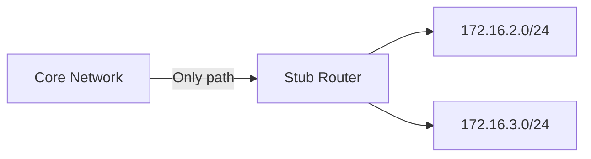
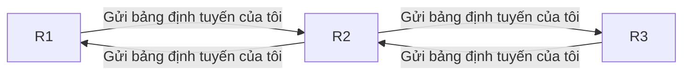
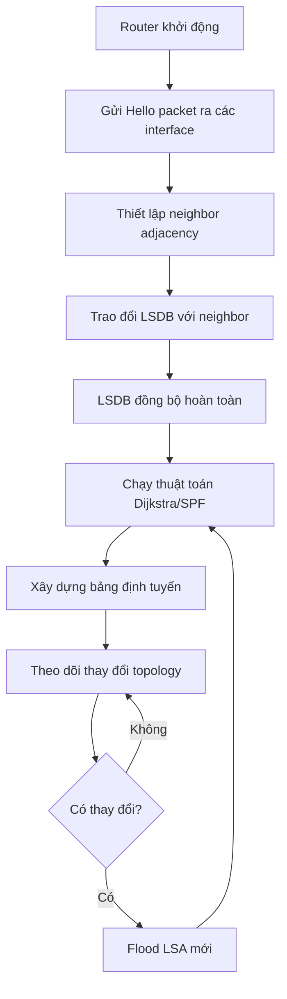

# Chương 2: Định Tuyến

---

## Phần 1: Static Routing (Định Tuyến Tĩnh)

## 1. Static Route là gì?

Static route (định tuyến tĩnh) là các tuyến đường được người quản trị mạng cấu hình thủ công trên router, thay vì được học động thông qua các giao thức định tuyến. Router không tự động phát hiện hay cập nhật các tuyến này khi topology mạng thay đổi.

**Ví dụ thực tế:** Router R1 chỉ biết về 2 mạng kết nối trực tiếp với nó. Để đến được các mạng khác (như Internet hay các mạng nội bộ xa hơn), R1 cần được cấu hình tuyến tĩnh trỏ đến R2.

```
R1 --[192.168.10.0/24]--> R2 --[209.165.200.224/30]--> Internet
     [192.168.11.0/24]        [10.1.1.0/24]
                               [10.1.2.0/24]
```

---

## 2. Ưu và Nhược điểm

### Ưu điểm

- **Bảo mật cao hơn:** Các tuyến tĩnh không được quảng bá ra ngoài, kẻ tấn công khó xác định topology mạng.
- **Tiết kiệm tài nguyên:** Không tiêu tốn băng thông và CPU để trao đổi thông tin định tuyến liên tục.
- **Đường đi có thể dự đoán:** Người quản trị biết chính xác gói tin đi theo con đường nào.

### Nhược điểm

- **Tốn thời gian cấu hình và bảo trì:** Đặc biệt trong mạng lớn, phải cấu hình từng tuyến thủ công.
- **Dễ xảy ra lỗi cấu hình:** Trong mạng phức tạp, nhầm lẫn là điều thường gặp.
- **Không tự động cập nhật:** Khi topology thay đổi, người quản trị phải can thiệp thủ công.
- **Không mở rộng được:** Khi mạng phát triển lớn hơn, việc quản lý static route trở nên cực kỳ phức tạp.
- **Yêu cầu hiểu biết toàn bộ mạng:** Người cấu hình phải nắm rõ toàn bộ topology.

---

## 3. Khi nào nên dùng Static Route?

Static route phù hợp trong các tình huống sau:

- **Mạng nhỏ:** Số lượng router ít, topology đơn giản, ít thay đổi.
- **Stub network:** Mạng chỉ có một con đường duy nhất ra ngoài, không cần giao thức định tuyến động.
- **Default route:** Dùng một tuyến mặc định duy nhất trỏ đến gateway của nhà cung cấp Internet (ISP).



!!! note "Stub Network"
    Stub network là mạng chỉ có **một con đường duy nhất** để kết nối với phần còn lại của hệ thống mạng. Router kết nối với stub network gọi là **stub router**. Đây là ứng dụng lý tưởng nhất của static route.

---

## 4. Các Loại Static Route

### 4.1 Standard Static Route (Tuyến tĩnh thông thường)

Dùng để khai báo tuyến đường đến một mạng cụ thể, xác định rõ địa chỉ mạng đích và subnet mask.

**Ví dụ:** Cần đến mạng 172.16.3.0/24, cấu hình tuyến cụ thể trỏ đến router kế tiếp.

### 4.2 Default Static Route (Tuyến tĩnh mặc định)

Sử dụng địa chỉ đặc biệt `0.0.0.0/0`, có nghĩa là "tất cả các mạng không khớp với bất kỳ tuyến nào khác thì dùng tuyến này". Thường dùng cho stub router trỏ ra Internet.

**Ví dụ:** Stub router không cần biết về từng mạng bên ngoài, chỉ cần một tuyến mặc định trỏ đến core router là đủ.

### 4.3 Summary Static Route (Tuyến tĩnh tóm tắt)

Thay vì khai báo nhiều tuyến riêng lẻ, ta có thể gộp nhiều mạng liên tiếp thành một tuyến duy nhất (route summarization / supernetting).

**Ví dụ:**
```
172.20.0.0/16
172.21.0.0/16   -->  Gộp lại thành: 172.20.0.0/14
172.22.0.0/16
172.23.0.0/16
```

!!! tip "Tại sao /14?"
    4 mạng /16 liên tiếp từ 172.20 đến 172.23 có thể được biểu diễn bằng prefix /14 vì 2 bit cuối của octet thứ 3 trong nhóm này thay đổi (00, 01, 10, 11). Mượn 2 bit từ /16 ra, ta được /14.

### 4.4 Floating Static Route (Tuyến tĩnh dự phòng)

Là tuyến tĩnh có **administrative distance (AD) cao hơn** tuyến chính. Nó chỉ được sử dụng khi tuyến chính bị down (failover/backup route).

**Ví dụ:**
```
Branch Router --[WAN riêng 172.16.1.0/30]--> HQ Router  (tuyến chính, ưu tiên)
Branch Router --[Internet 209.165.200.x]---> HQ Router  (floating static, backup)
```

Khi đường WAN riêng bị lỗi, tuyến floating static qua Internet sẽ tự động được kích hoạt.

---

## 5. Cấu Hình Static Route

### Cú pháp lệnh

```
Router(config)# ip route <network-address> <subnet-mask> { <ip-address> | <exit-interface> } [AD]
```

| Tham số | Ý nghĩa |
|---|---|
| `network-address` | Địa chỉ mạng đích cần thêm vào bảng định tuyến |
| `subnet-mask` | Subnet mask của mạng đích (có thể sửa để tóm tắt) |
| `ip-address` | Địa chỉ IP của router kế tiếp (next-hop). Tạo **recursive lookup** |
| `exit-interface` | Cổng ra của router hiện tại. Thường dùng cho kết nối point-to-point |
| `AD` | Administrative Distance, dùng cho floating static route |

!!! warning "Recursive Lookup"
    Khi dùng `ip-address` (next-hop), router phải tra bảng định tuyến thêm một lần nữa để tìm cổng ra tương ứng với địa chỉ next-hop đó. Đây gọi là **recursive lookup** và tiêu tốn thêm tài nguyên CPU. Dùng **fully specified static route** (khai báo cả exit-interface lẫn ip-address) để tránh vấn đề này.

---

### 5.1 Next-Hop Static Route

Chỉ khai báo địa chỉ IP của router kế tiếp.

```cisco
R1(config)# ip route 172.16.1.0 255.255.255.0 172.16.2.2
R1(config)# ip route 192.168.1.0 255.255.255.0 172.16.2.2
R1(config)# ip route 192.168.2.0 255.255.255.0 172.16.2.2
```

**Kiểm tra bảng định tuyến:**

```
R1# show ip route
Gateway of last resort is not set

     172.16.0.0/16 is variably subnetted, 4 subnets
S       172.16.1.0/24 [1/0] via 172.16.2.2
C       172.16.2.0/24 is directly connected, Serial0/0/0
L       172.16.2.1/32 is directly connected, Serial0/0/0
C       172.16.3.0/24 is directly connected, GigabitEthernet0/0
L       172.16.3.1/32 is directly connected, GigabitEthernet0/0
S       192.168.1.0/24 [1/0] via 172.16.2.2
S       192.168.2.0/24 [1/0] via 172.16.2.2
```

Ký hiệu `S` trong bảng định tuyến nghĩa là **Static route**. Giá trị `[1/0]` là `[AD/metric]`.

---

### 5.2 Fully Specified Static Route

Khai báo cả exit interface lẫn địa chỉ next-hop, tránh recursive lookup.

```cisco
R1(config)# ip route 172.16.1.0 255.255.255.0 G0/1 172.16.2.2
R1(config)# ip route 192.168.1.0 255.255.255.0 G0/1 172.16.2.2
R1(config)# ip route 192.168.2.0 255.255.255.0 G0/1 172.16.2.2
```

---

### 5.3 Default Static Route

```cisco
R1(config)# ip route 0.0.0.0 0.0.0.0 172.16.2.2
```

Khi được cấu hình, bảng định tuyến sẽ hiển thị:

```
Gateway of last resort is 172.16.2.2 to network 0.0.0.0

S*   0.0.0.0/0 [1/0] via 172.16.2.2
```

Dấu `*` sau `S` biểu thị đây là **candidate default route**.

---

---

## Phần 2: RIP — Distance Vector Routing Protocol

## 1. Tổng Quan về Distance-Vector

Các giao thức định tuyến distance-vector hoạt động theo nguyên tắc:

- **Router chia sẻ cập nhật với các router hàng xóm** (neighbors) trực tiếp kết nối với mình.
- **Không biết về topology tổng thể của mạng** — chỉ biết khoảng cách (distance) và hướng đi (vector) đến từng mạng.
- **Gửi cập nhật định kỳ** đến địa chỉ broadcast `255.255.255.255` hoặc multicast, kể cả khi topology không thay đổi.
- Các giao thức thuộc nhóm này: **RIP, IGRP, RIPv2, EIGRP**.



---

## 2. Thuật Toán Bellman-Ford

RIP sử dụng thuật toán **Bellman-Ford** làm nền tảng tính toán đường đi tốt nhất. Thuật toán này hoạt động theo phương thức phân tán:

- **Gửi và nhận thông tin định tuyến** từ các router hàng xóm.
- **Tính toán đường đi tốt nhất** dựa trên metric là **hop count** (số router phải đi qua).
- **Phát hiện và phản ứng với thay đổi topology** khi có router hoặc đường link bị lỗi.

!!! info "Bellman-Ford vs Dijkstra"
    - **Bellman-Ford** (dùng trong RIP): Mỗi router chỉ biết thông tin từ hàng xóm, không biết toàn bộ topology. Hội tụ chậm hơn.
    - **Dijkstra** (dùng trong OSPF): Mỗi router có bản đồ đầy đủ của mạng (LSDB), tính toán đường ngắn nhất một cách chủ động. Hội tụ nhanh hơn.

**Cập nhật định tuyến RIP được broadcast mỗi 30 giây, sử dụng UDP port 520.**

---

## 3. So Sánh RIPv1 và RIPv2

| Đặc điểm | RIPv1 | RIPv2 |
|---|---|---|
| Metric | Hop count | Hop count |
| Địa chỉ cập nhật | 255.255.255.255 (broadcast) | 224.0.0.9 (multicast) |
| Hỗ trợ VLSM & CIDR | Không | Có |
| Hỗ trợ Authentication | Không | Có |

!!! warning "Hạn chế của RIPv1"
    RIPv1 không gửi kèm subnet mask trong các bản cập nhật, nên không hỗ trợ **VLSM** (Variable Length Subnet Mask) hay **CIDR**. Điều này khiến RIPv1 không còn phù hợp với các mạng hiện đại.

---

## 4. Hoạt Động của RIP — Quá Trình Hội Tụ

Xét topology đơn giản: `PC --- R1 --- R2 --- PC`

```
192.168.1.0/24  R1  192.168.2.0/24  R2  192.168.3.0/24
```

### Bước 1 — Trạng thái khởi đầu

Mỗi router chỉ biết về các mạng kết nối trực tiếp (hop = 0):

**Bảng R1:**

| Network | Interface | Hop |
|---|---|---|
| 192.168.1.0/24 | F0/0 | 0 |
| 192.168.2.0/24 | S0/0/0 | 0 |

**Bảng R2:**

| Network | Interface | Hop |
|---|---|---|
| 192.168.2.0/24 | S0/0/0 | 0 |
| 192.168.3.0/24 | F0/0 | 0 |

### Bước 2 — Sau lần cập nhật đầu tiên

R2 gửi bảng định tuyến của mình sang R1 → R1 học được 192.168.3.0/24 với hop = 1.  
R1 gửi bảng định tuyến của mình sang R2 → R2 học được 192.168.1.0/24 với hop = 1.

**Bảng R1 sau update:**

| Network | Interface | Hop |
|---|---|---|
| 192.168.1.0/24 | F0/0 | 0 |
| 192.168.2.0/24 | S0/0/0 | 0 |
| 192.168.3.0/24 | S0/0/0 | 1 |

**Bảng R2 sau update:**

| Network | Interface | Hop |
|---|---|---|
| 192.168.2.0/24 | S0/0/0 | 0 |
| 192.168.3.0/24 | F0/0 | 0 |
| 192.168.1.0/24 | S0/0/0 | 1 |

### Bước 3 — Hội tụ hoàn toàn

Sau khi trao đổi vài lần, cả hai router đều có đầy đủ thông tin về toàn bộ mạng. Đây gọi là trạng thái **convergence** (hội tụ).

!!! note "Maximum Hop Count"
    RIP có giới hạn tối đa **15 hops**. Bất kỳ mạng nào có hop count = 16 đều được coi là **unreachable** (không thể đến được). Đây là cơ chế ngăn chặn routing loop vô hạn, nhưng cũng là giới hạn về quy mô — RIP không phù hợp với mạng lớn.

---

## 5. Cấu Hình RIP

### Topology tham khảo

```
[PC0]---Switch1---R1---192.168.254.0/24---R2---Switch2---[PC1]
192.168.1.0/24            G0/0/0  G0/0/0       192.168.2.0/24
                                               Switch3---[Server]
                                               192.168.10.0/24
```

### Các lệnh cấu hình trên R1

```cisco
R1(config)# router rip
R1(config-router)# version 2
R1(config-router)# network 192.168.1.0
R1(config-router)# network 192.168.254.0
R1(config-router)# passive-interface g0/0/0
R1(config-router)# default-information originate
```

### Giải thích từng lệnh

| Lệnh | Ý nghĩa |
|---|---|
| `router rip` | Vào chế độ cấu hình RIP |
| `version 2` | Sử dụng RIPv2 thay vì RIPv1 |
| `network 192.168.1.0` | Kích hoạt RIP trên các interface thuộc mạng 192.168.1.0, đồng thời quảng bá mạng này |
| `network 192.168.254.0` | Kích hoạt RIP trên interface kết nối WAN |
| `passive-interface g0/0/0` | Ngừng gửi RIP update ra cổng G0/0/0 (cổng LAN phía host), tránh lãng phí băng thông và tăng bảo mật |
| `default-information originate` | Quảng bá default route (`0.0.0.0/0`) cho các router RIP khác trong mạng |

!!! tip "Passive Interface"
    Lệnh `passive-interface` rất quan trọng. Cổng kết nối với host (PC, server) không cần nhận RIP update, nhưng nếu không có lệnh này, router vẫn gửi RIP update ra cổng đó mỗi 30 giây — lãng phí băng thông và có thể bị kẻ tấn công nghe lén thông tin định tuyến.

---

---

## Phần 3: OSPF — Link-State Routing Protocol

## 1. Ôn Tập Thuật Toán Dijkstra

OSPF sử dụng thuật toán **Dijkstra (SPF — Shortest Path First)** để tính toán đường đi ngắn nhất.

### Ví dụ tính toán Dijkstra

Cho đồ thị mạng với các node u, v, w, x, y, z và các cost trên link:

```
u --1-- x --1-- y --1-- w
|               |       |
2               2       3
|               |       |
v               z --4---+
      5
u --------w (direct)
```

**Bảng tính toán từng bước:**

| Bước | N' | D(v),p(v) | D(w),p(w) | D(x),p(x) | D(y),p(y) | D(z),p(z) |
|---|---|---|---|---|---|---|
| 0 | u | 2,u | 5,u | 1,u | ∞ | ∞ |
| 1 | ux | 2,u | 4,x | — | 2,x | ∞ |
| 2 | uxy | 2,u | 3,y | — | — | 4,y |
| 3 | uxyv | — | 3,y | — | — | 4,y |
| 4 | uxyvw | — | — | — | — | 4,y |
| 5 | uxyvwz | — | — | — | — | — |

**Đường đi ngắn nhất từ u:**

| Đích | Đường đi | Next-hop link |
|---|---|---|
| v | u → v | (u,v) |
| x | u → x | (u,x) |
| y | u → x → y | (u,x) |
| w | u → x → y → w | (u,x) |
| z | u → x → y → z | (u,x) |

---

## 2. Tổng Quan về Link-State

Khác với distance-vector, giao thức link-state hoạt động theo cách:

- Mỗi router xây dựng một **bản đồ đầy đủ** (topology map) của toàn bộ mạng.
- Router quảng bá **Link-State Advertisement (LSA)** — thông tin về các kết nối trực tiếp của mình — cho **tất cả các router** trong mạng (flooding).
- Tất cả router đều lưu LSA vào **Link-State Database (LSDB)** — cơ sở dữ liệu dùng chung, giống nhau trên tất cả router trong cùng khu vực.
- Mỗi router tự chạy thuật toán Dijkstra trên LSDB để tính đường đi ngắn nhất.

---

## 3. LSA và LSDB

### LSA — Link-State Advertisement

Mỗi router tạo ra LSA mô tả:

- Các **interface** (cổng) của nó.
- **Cost** (chi phí) của từng interface.
- **Neighbor** (router hàng xóm) kết nối qua từng interface.

**Ví dụ LSA của R1:**

```
Link 1:
  - Network: 192.168.1.0/24
  - IP address: 192.168.1.1
  - Neighbor: Không có (mạng stub)
  - Cost: 2
```

### LSDB — Link-State Database

Sau khi nhận LSA từ tất cả router trong mạng, mỗi router có một LSDB hoàn chỉnh — giống như một "bản đồ" đầy đủ của mạng. Từ LSDB này, Dijkstra được chạy để tạo bảng định tuyến.

---

## 4. Quá Trình Hoạt Động của Link-State Protocol



### Chi tiết từng bước trong LS protocol operation

**Bước 1:** Mỗi router học các kết nối trực tiếp của mình và tạo LSA.

**Bước 2:** Router flood LSA ra tất cả các cổng (trừ cổng nhận vào — split horizon).

**Bước 3:** Router nhận LSA, lưu vào LSDB, rồi tiếp tục forward cho các router khác.

**Bước 4:** Khi tất cả LSA đã được flood khắp mạng, mọi router đều có LSDB giống nhau.

**Bước 5:** Mỗi router chạy Dijkstra độc lập trên LSDB của mình → xây dựng **Shortest Path Tree (SPT)**.

**Bước 6:** Từ SPT, router điền vào **routing table**.

---

## 5. OSPF — Open Shortest Path First

OSPF là giao thức link-state phổ biến nhất, được chuẩn hóa trong RFC 2328.

### Đặc điểm chính của OSPF

- **Metric:** Cost, được tính dựa trên băng thông của interface (`Cost = 10^8 / bandwidth`).
- **Hội tụ nhanh:** Chỉ flood LSA khi có thay đổi topology, không gửi định kỳ như RIP.
- **Hỗ trợ VLSM và CIDR:** Hoàn toàn hỗ trợ mạng phân lớp không đều.
- **Hỗ trợ authentication:** Bảo vệ cập nhật định tuyến.
- **Phân vùng (Areas):** Chia mạng lớn thành các vùng nhỏ hơn để giảm tải LSDB và traffic flooding.

### Các loại OSPF Area

- **Area 0 (Backbone Area):** Vùng lõi, tất cả các area khác phải kết nối trực tiếp hoặc gián tiếp qua Area 0.
- **Non-backbone area:** Các area thông thường, LSA không được flood ra ngoài area.

---

## 6. Quá Trình Flood LSA trong Mạng OSPF

Xét mạng gồm R1, R2, R3, R4, R5:

**Giai đoạn 1:** R1 flood LSA của mình ra tất cả các cổng. R2, R3 nhận được.

**Giai đoạn 2:** R2 flood LSA của R1 (và LSA của chính R2) sang R4, R5. R3 flood sang R4.

**Giai đoạn 3 trở đi:** Quá trình tiếp tục cho đến khi tất cả router đều có LSA của nhau trong LSDB.

!!! info "Flooding vs Periodic Update"
    - **RIP:** Gửi toàn bộ bảng định tuyến mỗi 30 giây dù topology không đổi → lãng phí băng thông.
    - **OSPF:** Chỉ flood LSA khi có thay đổi (triggered update). Khi ổn định, chỉ gửi **Hello packet** định kỳ (mặc định 10 giây) để duy trì neighbor relationship.

---

---

## Câu Hỏi Trắc Nghiệm

## Phần 1: Static Routing

**Câu 1.** Static route có ưu điểm nào sau đây so với dynamic routing?

- A. Tự động cập nhật khi topology thay đổi
- B. Không quảng bá tuyến đường, bảo mật hơn
- C. Không cần người quản trị cấu hình
- D. Mở rộng tốt với mạng lớn

??? info "Đáp án & Giải thích"
    **Đáp án: B**
    
    Static route không được quảng bá ra ngoài như các giao thức định tuyến động, giúp kẻ tấn công khó xác định cấu trúc mạng hơn.

---

**Câu 2.** Nhược điểm lớn nhất của static routing khi áp dụng cho mạng lớn là gì?

- A. Tiêu tốn nhiều băng thông
- B. Không hỗ trợ IPv6
- C. Không tự động thích ứng khi topology thay đổi, bảo trì phức tạp
- D. Metric không chính xác

??? info "Đáp án & Giải thích"
    **Đáp án: C**
    
    Trong mạng lớn, mỗi khi có thay đổi topology (thêm mạng mới, đường link bị lỗi...), người quản trị phải can thiệp thủ công trên tất cả router liên quan. Đây là nhược điểm cơ bản nhất.

---

**Câu 3.** Static route phù hợp nhất khi nào?

- A. Mạng doanh nghiệp lớn với hàng trăm router
- B. Mạng có topology thay đổi thường xuyên
- C. Stub network với một đường ra duy nhất
- D. Mạng cần tự động cân bằng tải

??? info "Đáp án & Giải thích"
    **Đáp án: C**
    
    Stub network chỉ có một con đường ra ngoài, không cần giao thức định tuyến động. Một static route (hoặc default static route) là giải pháp đơn giản và hiệu quả nhất.

---

**Câu 4.** Default static route sử dụng địa chỉ mạng nào?

- A. 192.168.0.0/16
- B. 255.255.255.255/32
- C. 0.0.0.0/0
- D. 127.0.0.0/8

??? info "Đáp án & Giải thích"
    **Đáp án: C**
    
    `0.0.0.0/0` khớp với tất cả địa chỉ đích, nhưng có độ ưu tiên thấp nhất (prefix length = 0). Được dùng như "tuyến cuối cùng" khi không có tuyến cụ thể nào khớp.

---

**Câu 5.** Floating static route khác static route thông thường ở điểm nào?

- A. Sử dụng địa chỉ mạng khác nhau
- B. Được cấu hình với Administrative Distance cao hơn để làm tuyến dự phòng
- C. Tự động cập nhật theo topology
- D. Chỉ hoạt động với IPv6

??? info "Đáp án & Giải thích"
    **Đáp án: B**
    
    Floating static route có AD cao hơn tuyến chính (ví dụ: tuyến chính AD=1, floating AD=5). Khi tuyến chính còn hoạt động, floating route không xuất hiện trong bảng định tuyến. Chỉ khi tuyến chính down, floating route mới được kích hoạt.

---

**Câu 6.** Lệnh nào sau đây cấu hình default static route trỏ đến next-hop 10.0.0.1?

- A. `ip route default 0.0.0.0 10.0.0.1`
- B. `ip route 0.0.0.0 0.0.0.0 10.0.0.1`
- C. `ip route 255.255.255.255 255.255.255.255 10.0.0.1`
- D. `ip route any any 10.0.0.1`

??? info "Đáp án & Giải thích"
    **Đáp án: B**
    
    Cú pháp chuẩn của IOS Cisco: `ip route <network> <mask> <next-hop|exit-intf>`. Default route dùng `0.0.0.0 0.0.0.0`.

---

**Câu 7.** Trong bảng định tuyến Cisco, ký hiệu `S*` có nghĩa là gì?

- A. Static route thông thường
- B. Static route được chọn làm candidate default route
- C. Static route bị lỗi
- D. Summary static route

??? info "Đáp án & Giải thích"
    **Đáp án: B**
    
    `S` = static, `*` = candidate default route. Khi thêm default route, dòng "Gateway of last resort" sẽ xuất hiện trong bảng định tuyến.

---

**Câu 8.** Recursive lookup xảy ra trong trường hợp nào?

- A. Khi dùng exit interface trong static route
- B. Khi dùng next-hop IP address trong static route
- C. Khi dùng default static route
- D. Khi dùng summary static route

??? info "Đáp án & Giải thích"
    **Đáp án: B**
    
    Khi chỉ khai báo next-hop IP, router phải tra bảng định tuyến thêm một lần nữa để tìm exit interface phù hợp với next-hop đó. Đây là recursive lookup.

---

**Câu 9.** Fully specified static route là gì?

- A. Static route khai báo đầy đủ tất cả các mạng trong hệ thống
- B. Static route khai báo cả exit interface và next-hop IP address
- C. Static route với subnet mask đầy đủ 32 bit
- D. Static route cho mạng /24

??? info "Đáp án & Giải thích"
    **Đáp án: B**
    
    Fully specified static route khai báo cả exit interface lẫn next-hop IP, giúp tránh recursive lookup và xác định rõ ràng đường đi.

---

**Câu 10.** Summary static route `172.20.0.0/14` bao gồm những mạng /16 nào?

- A. 172.20.0.0 đến 172.21.0.0
- B. 172.20.0.0 đến 172.23.0.0
- C. 172.16.0.0 đến 172.20.0.0
- D. 172.20.0.0 đến 172.27.0.0

??? info "Đáp án & Giải thích"
    **Đáp án: B**
    
    /14 có nghĩa là 14 bit network. So với /16, ta mượn 2 bit thêm, tạo ra 4 mạng (2² = 4): 172.20.0.0/16, 172.21.0.0/16, 172.22.0.0/16, 172.23.0.0/16.

---

**Câu 11.** Giá trị `[1/0]` trong bảng định tuyến Cisco có nghĩa là gì?

- A. 1 hop, 0 metric
- B. Administrative Distance = 1, Metric = 0
- C. 1 đường, 0 gói tin bị mất
- D. Version 1, Revision 0

??? info "Đáp án & Giải thích"
    **Đáp án: B**
    
    Định dạng `[AD/metric]`. Static route có AD mặc định = 1 (thấp hơn connected = 0, nhưng thấp hơn hầu hết giao thức động). Metric = 0 vì static route không dùng metric.

---

**Câu 12.** Administrative Distance (AD) mặc định của static route trên Cisco IOS là bao nhiêu?

- A. 0
- B. 1
- C. 110
- D. 120

??? info "Đáp án & Giải thích"
    **Đáp án: B**
    
    AD = 0: Connected interface. AD = 1: Static route. AD = 110: OSPF. AD = 120: RIP. AD thấp hơn = được ưu tiên hơn.

---

**Câu 13.** Để xem bảng định tuyến trên Cisco router, dùng lệnh nào?

- A. `show routing table`
- B. `display ip route`
- C. `show ip route`
- D. `debug ip route`

??? info "Đáp án & Giải thích"
    **Đáp án: C**
    
    `show ip route` là lệnh chuẩn trên Cisco IOS để xem bảng định tuyến IPv4.

---

**Câu 14.** Lệnh `show ip route begin Gateway` có tác dụng gì?

- A. Hiển thị chỉ các static route
- B. Hiển thị bảng định tuyến bắt đầu từ dòng chứa từ "Gateway"
- C. Lọc chỉ các default route
- D. Hiển thị gateway của từng interface

??? info "Đáp án & Giải thích"
    **Đáp án: B**
    
    Từ khóa `begin` trong Cisco IOS pipe filter dùng để hiển thị output bắt đầu từ dòng đầu tiên khớp với pattern đã cho.

---

**Câu 15.** Stub router khác gì với router thông thường?

- A. Stub router chạy phần mềm đặc biệt
- B. Stub router kết nối với stub network — mạng chỉ có một đường ra
- C. Stub router không hỗ trợ dynamic routing
- D. Stub router chỉ dùng được với IPv6

??? info "Đáp án & Giải thích"
    **Đáp án: B**
    
    Stub router là router kết nối với phần cuối (stub) của mạng, nơi chỉ có một con đường vào/ra. Không có gì đặc biệt về phần cứng hay phần mềm.

---

## Phần 2: RIP

**Câu 16.** RIP thuộc loại giao thức định tuyến nào?

- A. Link-state
- B. Distance-vector
- C. Path-vector
- D. Hybrid

??? info "Đáp án & Giải thích"
    **Đáp án: B**
    
    RIP (Routing Information Protocol) là giao thức distance-vector điển hình, sử dụng thuật toán Bellman-Ford.

---

**Câu 17.** Metric mà RIP sử dụng để xác định đường đi tốt nhất là gì?

- A. Bandwidth (băng thông)
- B. Delay (độ trễ)
- C. Hop count (số bước nhảy)
- D. Cost

??? info "Đáp án & Giải thích"
    **Đáp án: C**
    
    RIP dùng hop count — số router phải đi qua để đến đích. Đây là metric đơn giản nhưng không phản ánh chất lượng đường truyền (một link 56Kbps và một link 1Gbps có cùng hop count = 1).

---

**Câu 18.** RIP gửi cập nhật định tuyến mỗi bao nhiêu giây?

- A. 10 giây
- B. 30 giây
- C. 60 giây
- D. 90 giây

??? info "Đáp án & Giải thích"
    **Đáp án: B**
    
    RIP gửi toàn bộ bảng định tuyến đến các neighbor mỗi 30 giây, dù topology có thay đổi hay không.

---

**Câu 19.** RIP sử dụng giao thức tầng transport nào và port số bao nhiêu?

- A. TCP port 521
- B. UDP port 520
- C. TCP port 520
- D. UDP port 521

??? info "Đáp án & Giải thích"
    **Đáp án: B**
    
    RIP dùng UDP (không cần đảm bảo tin cậy) port 520. Các bản tin RIP nhỏ và có cơ chế riêng để xử lý mất gói.

---

**Câu 20.** Hop count tối đa trong RIP là bao nhiêu?

- A. 8
- B. 15
- C. 16
- D. 255

??? info "Đáp án & Giải thích"
    **Đáp án: B**
    
    RIP giới hạn hop count tối đa là 15. Mạng có hop count = 16 được coi là unreachable. Đây là giới hạn ngăn routing loop vô hạn, nhưng cũng khiến RIP không phù hợp với mạng lớn.

---

**Câu 21.** Giá trị hop count = 16 trong RIP có nghĩa là gì?

- A. Mạng đích cách 16 hop
- B. Mạng đích không thể đến được (unreachable)
- C. Đây là hop count tối ưu
- D. Router cần cập nhật lại bảng định tuyến

??? info "Đáp án & Giải thích"
    **Đáp án: B**
    
    16 là "infinity" trong RIP. Khi một mạng bị gán hop count = 16, tất cả router sẽ coi mạng đó là unreachable và xóa khỏi bảng định tuyến.

---

**Câu 22.** RIPv1 gửi cập nhật đến địa chỉ nào?

- A. 224.0.0.9
- B. 224.0.0.5
- C. 255.255.255.255
- D. 255.255.255.0

??? info "Đáp án & Giải thích"
    **Đáp án: C**
    
    RIPv1 dùng broadcast `255.255.255.255`. RIPv2 cải thiện bằng cách dùng multicast `224.0.0.9`, chỉ các router chạy RIPv2 mới nhận.

---

**Câu 23.** RIPv2 gửi cập nhật đến địa chỉ multicast nào?

- A. 224.0.0.5
- B. 224.0.0.6
- C. 224.0.0.9
- D. 224.0.0.10

??? info "Đáp án & Giải thích"
    **Đáp án: C**
    
    `224.0.0.9` là địa chỉ multicast dành riêng cho RIPv2. `224.0.0.5` dành cho OSPF (All OSPF Routers), `224.0.0.10` dành cho EIGRP.

---

**Câu 24.** Điểm khác biệt quan trọng nhất của RIPv2 so với RIPv1 là gì?

- A. Dùng TCP thay vì UDP
- B. Hỗ trợ VLSM và CIDR do gửi kèm subnet mask trong update
- C. Hop count tối đa tăng lên 30
- D. Gửi cập nhật mỗi 15 giây

??? info "Đáp án & Giải thích"
    **Đáp án: B**
    
    RIPv2 gửi kèm subnet mask trong các bản tin cập nhật, cho phép hỗ trợ VLSM (các mạng con có độ dài mask khác nhau) và CIDR (classless inter-domain routing).

---

**Câu 25.** Lệnh nào kích hoạt RIPv2 trên Cisco router?

- A. `router rip version 2`
- B. `router rip` sau đó `version 2`
- C. `rip version 2`
- D. `ip rip version 2`

??? info "Đáp án & Giải thích"
    **Đáp án: B**
    
    Phải vào RIP config mode trước: `router rip`, sau đó mới gõ `version 2` trong chế độ `(config-router)#`.

---

**Câu 26.** Lệnh `network` trong cấu hình RIP có tác dụng gì?

- A. Chỉ khai báo mạng đích để định tuyến đến
- B. Kích hoạt RIP trên các interface thuộc mạng đó và quảng bá mạng đó
- C. Tạo ra một network object
- D. Cấu hình địa chỉ IP cho interface

??? info "Đáp án & Giải thích"
    **Đáp án: B**
    
    Lệnh `network` trong RIP có hai tác dụng: (1) kích hoạt RIP trên tất cả interface có địa chỉ IP thuộc mạng đó, và (2) đưa mạng đó vào các bản tin RIP update gửi cho neighbor.

---

**Câu 27.** Lệnh `passive-interface` trong RIP có tác dụng gì?

- A. Tắt hoàn toàn interface đó
- B. Ngừng gửi RIP update ra interface đó nhưng vẫn nhận update
- C. Tắt cả gửi và nhận RIP update
- D. Tăng tốc độ hội tụ

??? info "Đáp án & Giải thích"
    **Đáp án: B**
    
    `passive-interface` ngừng gửi RIP update (hello/advertisement) ra interface đó, nhưng mạng kết nối qua interface đó vẫn được quảng bá cho các neighbor khác. Thường dùng trên interface LAN kết nối với host.

---

**Câu 28.** Lệnh `default-information originate` trong RIP có tác dụng gì?

- A. Tạo ra default route tự động
- B. Quảng bá default route (`0.0.0.0/0`) cho các RIP neighbor
- C. Nhận default route từ các neighbor
- D. Xóa default route khỏi bảng định tuyến

??? info "Đáp án & Giải thích"
    **Đáp án: B**
    
    Lệnh này cho phép router chia sẻ default route của mình với các router RIP khác trong mạng, giúp tất cả router biết cách truy cập Internet qua gateway.

---

**Câu 29.** Thuật toán nào được RIP sử dụng?

- A. Dijkstra
- B. Bellman-Ford
- C. Floyd-Warshall
- D. A* (A-star)

??? info "Đáp án & Giải thích"
    **Đáp án: B**
    
    RIP dùng Bellman-Ford — thuật toán distance-vector phân tán, nơi mỗi node chỉ cần thông tin từ hàng xóm trực tiếp để tính đường đi ngắn nhất.

---

**Câu 30.** Trong quá trình hội tụ RIP, R1 có mạng 192.168.1.0/24 và R2 có mạng 192.168.3.0/24. Sau lần trao đổi đầu tiên, R1 sẽ thấy 192.168.3.0/24 với hop count là bao nhiêu?

- A. 0
- B. 1
- C. 2
- D. 3

??? info "Đáp án & Giải thích"
    **Đáp án: B**
    
    R2 quảng bá 192.168.3.0/24 với hop = 0 (trực tiếp). Khi R1 nhận được, nó cộng thêm 1 → hop = 1. R1 phải đi qua R2 (1 hop) để đến 192.168.3.0/24.

---

**Câu 31.** Tại sao RIP không phù hợp với mạng lớn?

- A. Không hỗ trợ IPv4
- B. Giới hạn 15 hop và hội tụ chậm
- C. Tốn quá nhiều CPU
- D. Không hỗ trợ Ethernet

??? info "Đáp án & Giải thích"
    **Đáp án: B**
    
    Hai giới hạn chính: (1) max 15 hop — mạng quá lớn sẽ có những đích không thể đến được; (2) hội tụ chậm — mỗi 30 giây mới gửi update, sau sự cố phải nhiều chu kỳ mới hội tụ xong.

---

**Câu 32.** Khi nào RIP coi một mạng là "unreachable"?

- A. Khi không nhận được update trong 30 giây
- B. Khi hop count = 16
- C. Khi router bị overload CPU
- D. Khi mạng bị tắt nguồn

??? info "Đáp án & Giải thích"
    **Đáp án: B**
    
    RIP dùng giá trị 16 (infinity) để biểu thị mạng không thể đến được. Đây là cơ chế tránh routing loop.

---

## Phần 3: OSPF & Link-State

**Câu 33.** OSPF thuộc loại giao thức định tuyến nào?

- A. Distance-vector
- B. Link-state
- C. Path-vector
- D. Hybrid

??? info "Đáp án & Giải thích"
    **Đáp án: B**
    
    OSPF (Open Shortest Path First) là giao thức link-state điển hình, sử dụng thuật toán Dijkstra và LSDB để xây dựng bản đồ toàn bộ mạng.

---

**Câu 34.** Thuật toán nào được OSPF sử dụng để tính đường đi ngắn nhất?

- A. Bellman-Ford
- B. Dijkstra (SPF)
- C. Floyd-Warshall
- D. Prim's algorithm

??? info "Đáp án & Giải thích"
    **Đáp án: B**
    
    OSPF dùng Dijkstra, còn gọi là SPF (Shortest Path First). Mỗi router chạy SPF trên LSDB của mình để tính cây đường đi ngắn nhất (Shortest Path Tree).

---

**Câu 35.** LSDB trong OSPF là gì?

- A. Local Static Database — cơ sở dữ liệu lưu static route
- B. Link-State Database — cơ sở dữ liệu lưu thông tin toàn bộ topology mạng
- C. Logical Subnet Database
- D. Layer-State Distribution Board

??? info "Đáp án & Giải thích"
    **Đáp án: B**
    
    LSDB chứa tất cả LSA nhận được từ mọi router trong cùng OSPF area. Tất cả router trong một area có LSDB giống hệt nhau, từ đó mỗi router tự tính đường đi bằng Dijkstra.

---

**Câu 36.** LSA trong OSPF là gì?

- A. Link-State Advertisement — thông tin router gửi mô tả các kết nối của mình
- B. Local Subnet Address
- C. Logical System Announcement
- D. Layer-State Acknowledgment

??? info "Đáp án & Giải thích"
    **Đáp án: A**
    
    Mỗi router tạo ra LSA mô tả: các interface của nó, cost của mỗi interface, và neighbor kết nối qua mỗi interface. LSA được flood cho tất cả router trong area.

---

**Câu 37.** Metric của OSPF được tính dựa trên yếu tố nào?

- A. Hop count
- B. Delay
- C. Cost (dựa trên bandwidth của interface)
- D. MTU

??? info "Đáp án & Giải thích"
    **Đáp án: C**
    
    OSPF dùng cost = 10^8 / bandwidth (bps). Interface Gigabit (10^9 bps) có cost = 1, Fast Ethernet (10^8 bps) cost = 1 (cần điều chỉnh reference bandwidth), Serial 1.544Mbps cost ≈ 64.

---

**Câu 38.** Điểm khác biệt cơ bản giữa distance-vector và link-state là gì?

- A. Distance-vector dùng TCP, link-state dùng UDP
- B. Distance-vector chỉ biết hướng và khoảng cách đến đích; link-state biết toàn bộ topology mạng
- C. Distance-vector nhanh hơn link-state
- D. Link-state chỉ dùng trong mạng nhỏ

??? info "Đáp án & Giải thích"
    **Đáp án: B**
    
    Đây là sự khác biệt cốt lõi. Distance-vector (RIP): "Tôi biết cách đi đến đích và chi phí bao nhiêu" nhưng không biết bản đồ. Link-state (OSPF): "Tôi có bản đồ đầy đủ của mạng, tôi tự tính đường tốt nhất."

---

**Câu 39.** Trong Dijkstra, "N'" (tập N') đại diện cho điều gì?

- A. Tập hợp tất cả node trong mạng
- B. Tập hợp các node mà đường đi ngắn nhất đã được xác định
- C. Tập hợp các node chưa được xét
- D. Tập hợp các router hàng xóm

??? info "Đáp án & Giải thích"
    **Đáp án: B**
    
    Trong ví dụ Dijkstra, N' là tập "confirmed set" — các node mà SPF đã hoàn toàn xác định được đường ngắn nhất. Thuật toán kết thúc khi N' chứa tất cả node.

---

**Câu 40.** Quá trình flooding trong link-state protocol có nghĩa là gì?

- A. Router gửi packet với tốc độ tối đa
- B. Router forward LSA ra tất cả các interface (trừ interface nhận vào) để LSA lan khắp mạng
- C. Router gửi bảng định tuyến đến tất cả neighbor
- D. Router broadcast ARP request

??? info "Đáp án & Giải thích"
    **Đáp án: B**
    
    Flooding đảm bảo mọi LSA đều đến được tất cả router trong mạng. Khi nhận LSA, router lưu vào LSDB rồi gửi ra tất cả cổng khác (trừ cổng nhận vào).

---

**Câu 41.** OSPF Area 0 có vai trò gì?

- A. Area chứa các router stub
- B. Backbone area — vùng lõi mà tất cả area khác phải kết nối vào
- C. Area dành cho kết nối Internet
- D. Area có hiệu suất cao nhất

??? info "Đáp án & Giải thích"
    **Đáp án: B**
    
    Area 0 (backbone area) là trung tâm của mạng OSPF. Mọi area khác phải kết nối trực tiếp (hoặc qua virtual link) vào Area 0. Thiết kế này đảm bảo thông tin định tuyến đi qua backbone trước khi đến area đích.

---

**Câu 42.** So với RIP, OSPF hội tụ nhanh hơn vì lý do gì?

- A. OSPF gửi update mỗi 15 giây thay vì 30 giây
- B. OSPF chỉ gửi LSA khi có thay đổi topology (triggered update), không gửi định kỳ
- C. OSPF có hop count cao hơn
- D. OSPF dùng TCP nên đáng tin cậy hơn

??? info "Đáp án & Giải thích"
    **Đáp án: B**
    
    OSPF dùng triggered update: khi topology thay đổi, LSA được flood ngay lập tức. Trong khi đó, RIP phải chờ đến chu kỳ 30 giây tiếp theo mới gửi update. Khi ổn định, OSPF chỉ gửi Hello packet để duy trì neighbor relationship.

---

**Câu 43.** OSPF dùng Hello packet để làm gì?

- A. Gửi bảng định tuyến
- B. Flood LSA
- C. Thiết lập và duy trì mối quan hệ neighbor (adjacency)
- D. Xác nhận nhận LSA

??? info "Đáp án & Giải thích"
    **Đáp án: C**
    
    Hello packet được gửi định kỳ (mặc định 10 giây trên mạng broadcast, 30 giây trên NBMA) để router phát hiện và duy trì kết nối với neighbor. Nếu không nhận Hello trong Dead Interval (mặc định 4× Hello interval), neighbor được coi là down.

---

**Câu 44.** Điều gì xảy ra khi OSPF phát hiện có thay đổi topology?

- A. Gửi toàn bộ LSDB cho tất cả router
- B. Chỉ gửi LSA bị ảnh hưởng (flooding), rồi mỗi router chạy lại Dijkstra
- C. Đợi 30 giây rồi gửi update
- D. Xóa toàn bộ bảng định tuyến và học lại từ đầu

??? info "Đáp án & Giải thích"
    **Đáp án: B**
    
    OSPF flood ngay lập tức LSA liên quan đến thay đổi. Sau khi LSDB được cập nhật, mỗi router chạy lại SPF (Dijkstra) để tính lại bảng định tuyến. Quá trình này rất nhanh.

---

**Câu 45.** Tại sao OSPF phù hợp với mạng lớn hơn RIP?

- A. OSPF đơn giản hơn để cấu hình
- B. OSPF không giới hạn bởi hop count, hội tụ nhanh, hỗ trợ VLSM, và có thể phân vùng (area) để giảm tải
- C. OSPF tiêu tốn ít CPU hơn
- D. OSPF không cần cấu hình thủ công

??? info "Đáp án & Giải thích"
    **Đáp án: B**
    
    OSPF có nhiều ưu điểm vượt trội cho mạng lớn: không giới hạn hop count, hội tụ nhanh (triggered update), hỗ trợ VLSM/CIDR, có thể chia thành nhiều area để giảm kích thước LSDB, và dùng cost thay vì hop count (phản ánh chất lượng đường truyền tốt hơn).

---

## Câu Hỏi Tổng Hợp

**Câu 46.** So sánh ba loại giao thức định tuyến: static, distance-vector (RIP), và link-state (OSPF). Điều nào sau đây đúng?

- A. Static route hội tụ nhanh nhất, OSPF chậm nhất
- B. RIP biết toàn bộ topology mạng như OSPF
- C. OSPF hội tụ nhanh nhất vì có LSDB đầy đủ; static route không "hội tụ" vì là thủ công
- D. Cả ba đều dùng hop count làm metric

??? info "Đáp án & Giải thích"
    **Đáp án: C**
    
    Static route: không có quá trình hội tụ (người quản trị cấu hình thủ công). RIP: hội tụ chậm (30 giây/chu kỳ, chỉ biết từ hàng xóm). OSPF: hội tụ nhanh (triggered update, có bản đồ đầy đủ). Metric: RIP dùng hop count, OSPF dùng cost, static không dùng metric.

---

**Câu 47.** Administrative Distance (AD) được dùng để làm gì?

- A. Xác định metric của một tuyến đường
- B. Ưu tiên nguồn thông tin định tuyến khi có nhiều giao thức cùng tìm ra đường đến cùng một đích
- C. Xác định số hop tối đa
- D. Cấu hình authentication cho giao thức định tuyến

??? info "Đáp án & Giải thích"
    **Đáp án: B**
    
    Khi nhiều giao thức định tuyến cùng có tuyến đến một mạng đích, router chọn tuyến từ nguồn có AD thấp nhất. Ví dụ: nếu OSPF (AD=110) và RIP (AD=120) cùng biết đường đến mạng X, OSPF được ưu tiên.

---

**Câu 48.** Lệnh nào sau đây dùng để kiểm tra chi tiết các giao thức định tuyến đang chạy?

- A. `show ip route`
- B. `show ip protocols`
- C. `show interfaces`
- D. `debug ip routing`

??? info "Đáp án & Giải thích"
    **Đáp án: B**
    
    `show ip protocols` hiển thị thông tin về các giao thức định tuyến đang chạy: version, các mạng được quảng bá, timer, neighbor, v.v.

---

**Câu 49.** Điều nào sau đây mô tả đúng về quá trình hội tụ mạng?

- A. Hội tụ là quá trình tất cả router trong mạng đồng bộ với nhau về thông tin định tuyến và có bảng định tuyến nhất quán, chính xác
- B. Hội tụ là quá trình cân bằng tải traffic
- C. Hội tụ là quá trình router khởi động lại
- D. Hội tụ là quá trình cập nhật firmware

??? info "Đáp án & Giải thích"
    **Đáp án: A**
    
    Convergence (hội tụ) đạt được khi tất cả router có cùng thông tin về mạng và bảng định tuyến của họ phản ánh đúng trạng thái hiện tại của network. Tốc độ hội tụ là một tiêu chí quan trọng đánh giá giao thức định tuyến.

---

**Câu 50.** Khi nào nên dùng OSPF thay vì RIP?

- A. Khi mạng chỉ có 2-3 router
- B. Khi mạng có nhiều router, yêu cầu hội tụ nhanh, và có các subnet với độ dài mask khác nhau (VLSM)
- C. Khi cần tiết kiệm CPU tối đa
- D. Khi router không hỗ trợ giao thức phức tạp

??? info "Đáp án & Giải thích"
    **Đáp án: B**
    
    OSPF phù hợp khi: mạng lớn (nhiều router, nhiều subnet), cần hội tụ nhanh khi có sự cố, sử dụng VLSM/CIDR, hoặc cần phân chia vùng (area) để tối ưu. RIP phù hợp hơn cho mạng nhỏ, đơn giản, ít thay đổi.

---

**Câu 51.** Trong bảng định tuyến, ký hiệu `C` có nghĩa là gì?

- A. Connected — mạng kết nối trực tiếp với interface của router
- B. CIDR route
- C. Core route
- D. Calculated route

??? info "Đáp án & Giải thích"
    **Đáp án: A**
    
    `C` = Connected. Mạng kết nối trực tiếp có AD = 0 (tin cậy tuyệt đối). `L` = Local (địa chỉ IP chính xác của interface). `S` = Static. `R` = RIP. `O` = OSPF.

---

**Câu 52.** VLSM là gì và tại sao RIPv1 không hỗ trợ?

- A. VLSM là Variable Length Subnet Mask — cho phép dùng các subnet mask khác nhau trong cùng một mạng lớn. RIPv1 không hỗ trợ vì không gửi kèm subnet mask trong update
- B. VLSM là Very Long Subnet Mask. RIPv1 không hỗ trợ vì hop count giới hạn
- C. VLSM là Virtual LAN Subnet Management. RIPv1 không hỗ trợ VLAN
- D. VLSM là Verified Link-State Metric. RIPv1 dùng distance-vector nên không tương thích

??? info "Đáp án & Giải thích"
    **Đáp án: A**
    
    RIPv1 là classful protocol — các bản tin update không mang subnet mask. Router phải suy ra mask dựa trên class của địa chỉ (A/B/C). Điều này không cho phép dùng VLSM. RIPv2 khắc phục bằng cách đính kèm subnet mask trong mỗi entry của update.

---

**Câu 53.** Lệnh `show ip route` hiển thị dòng "Gateway of last resort is not set" có nghĩa gì?

- A. Router không có kết nối Internet
- B. Chưa có default route được cấu hình
- C. Router bị lỗi gateway
- D. Tất cả gateway đều down

??? info "Đáp án & Giải thích"
    **Đáp án: B**
    
    Khi chưa cấu hình default route (`0.0.0.0/0`), router không biết gửi gói tin về đâu khi không khớp với bất kỳ tuyến nào trong bảng. Khi có default route, dòng này sẽ hiển thị "Gateway of last resort is X.X.X.X to network 0.0.0.0".

---

**Câu 54.** Điểm nào sau đây là ưu điểm của link-state so với distance-vector?

- A. Cấu hình đơn giản hơn
- B. Tiêu tốn ít bộ nhớ hơn
- C. Hội tụ nhanh hơn vì mỗi router có bản đồ đầy đủ và chỉ gửi update khi có thay đổi
- D. Hop count cao hơn

??? info "Đáp án & Giải thích"
    **Đáp án: C**
    
    Link-state hội tụ nhanh vì: (1) có LSDB đầy đủ, tính toán chính xác hơn; (2) chỉ flood khi có thay đổi, không chờ 30 giây như RIP; (3) khi nhận LSA mới, ngay lập tức chạy lại SPF.

---

**Câu 55.** Trong OSPF, "neighbor adjacency" là gì?

- A. Hai router có cùng địa chỉ mạng
- B. Mối quan hệ giữa hai router OSPF đã trao đổi xong LSDB và đồng bộ thông tin định tuyến
- C. Hai router kết nối bằng cáp Ethernet
- D. Hai router trong cùng một VLAN

??? info "Đáp án & Giải thích"
    **Đáp án: B**
    
    Adjacency trong OSPF là mối quan hệ đặc biệt giữa hai router OSPF hàng xóm, trong đó họ đã trao đổi và đồng bộ LSDB với nhau. Chỉ có adjacent router mới trao đổi LSA trực tiếp với nhau.
