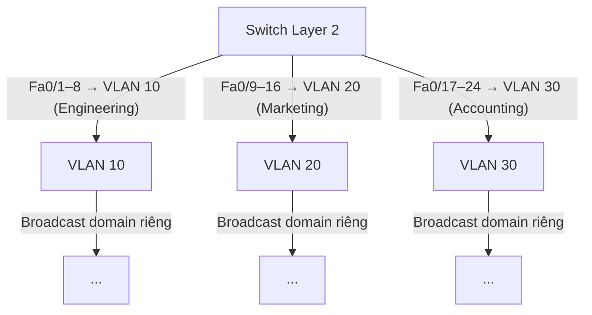
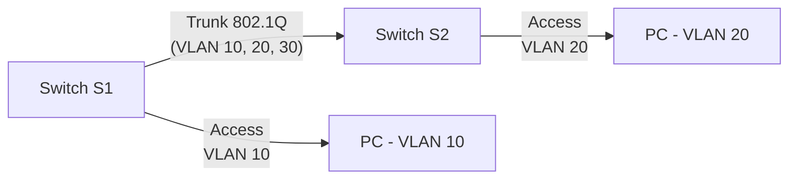
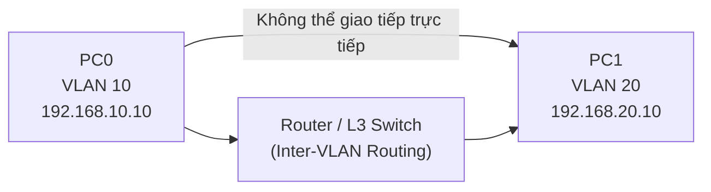
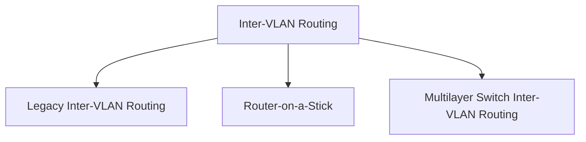
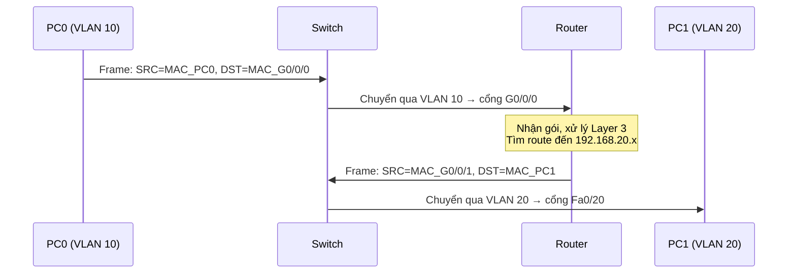
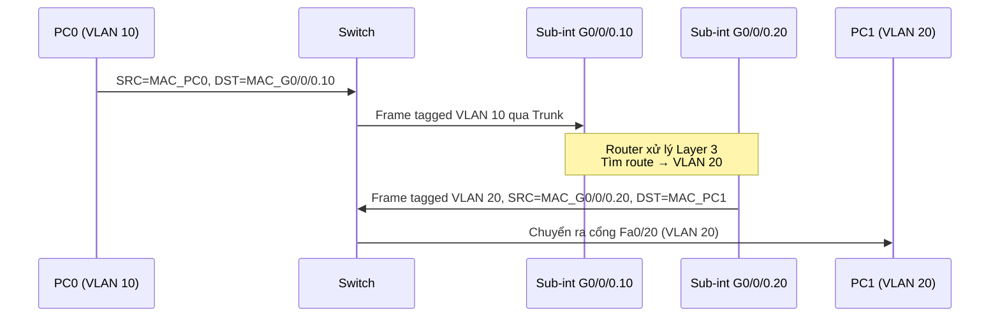
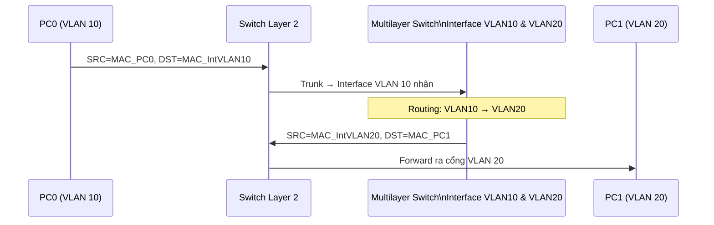

# Chương 3: SWITCH VÀ VLAN 

---

## 1. Tổng Quan về Switch

Switch là thiết bị hoạt động tại **tầng Data Link (Lớp 2)** trong mô hình OSI. Nhiệm vụ chính của switch là **chuyển tiếp frame dựa trên địa chỉ MAC** của thiết bị đích.

Khi một frame đến switch, switch sẽ:

1. Đọc địa chỉ MAC đích trong frame.
2. Tra cứu bảng MAC Address Table (CAM Table).
3. Chuyển frame ra đúng cổng tương ứng (hoặc flood nếu chưa biết).

Switch tạo ra các **collision domain riêng biệt** cho từng cổng, giúp tăng hiệu suất mạng so với Hub.

---

## 2. VLAN (Virtual Local Area Network)

### 2.1 Khái niệm

VLAN là một **mạng LAN ảo** — một nhóm các thiết bị được phân chia logic thành một miền broadcast riêng, bất kể vị trí vật lý của chúng trên mạng.

Nói cách khác, thay vì phân chia mạng theo vị trí địa lý (tầng 1, tầng 2, tầng 3...), VLAN cho phép phân chia theo **chức năng hoặc bộ phận** (Engineering, Marketing, Accounting...) ngay trên cùng một switch vật lý.

```
Ví dụ thực tế:
- Tầng 1: có máy Engineering và máy Marketing
- Tầng 2: có máy Engineering và máy Accounting
- VLAN Engineering gồm tất cả máy Engineering dù ở tầng nào
- VLAN Marketing gồm tất cả máy Marketing dù ở tầng nào
```

### 2.2 Phân loại VLAN

**Port-based VLAN (phổ biến nhất):** Mỗi cổng vật lý của switch được gán vào một VLAN cụ thể. Thiết bị cắm vào cổng đó sẽ thuộc VLAN tương ứng.



### 2.3 Ưu điểm của VLAN

!!! info "4 lợi ích chính của VLAN"

    **1. Dễ dàng thêm mới thiết bị/LAN segment**
    Thêm thiết bị vào VLAN chỉ cần gán cổng — không cần kéo thêm cáp hay thay đổi hạ tầng vật lý.

    **2. Dễ dàng thay đổi cấu hình**
    Chuyển một máy từ VLAN này sang VLAN khác chỉ cần thay đổi cấu hình cổng trên switch, không cần di chuyển vật lý.

    **3. Dễ giám sát lưu lượng mạng**
    Mỗi VLAN là một broadcast domain độc lập. Lưu lượng broadcast không lan sang VLAN khác → dễ phân tích và giám sát theo từng nhóm.

    **4. Tăng cường bảo mật mạng**
    Các VLAN khác nhau không thể giao tiếp trực tiếp mà không qua thiết bị định tuyến (Router hoặc Layer 3 Switch). Điều này giúp cô lập dữ liệu giữa các bộ phận.

---

## 3. Cấu Hình VLAN trên Switch Cisco

### 3.1 Tạo VLAN

Để tạo một VLAN mới, vào **Global Configuration Mode** và thực hiện:

```bash
S1# configure terminal
S1(config)# vlan 20
S1(config-vlan)# name student
S1(config-vlan)# end
```

> - `vlan 20` — tạo VLAN với ID là 20 (ID hợp lệ từ 1–4094, trong đó 1 là VLAN mặc định).
> - `name student` — đặt tên mô tả cho VLAN (tùy chọn nhưng nên đặt để dễ quản lý).

### 3.2 Gán cổng vào VLAN (Access Port)

Sau khi tạo VLAN, cần gán các cổng vật lý vào VLAN đó:

```bash
S1# configure terminal
S1(config)# interface fa0/18
S1(config-if)# switchport mode access
S1(config-if)# switchport access vlan 20
S1(config-if)# end
```

> - `switchport mode access` — đặt cổng ở chế độ access (chỉ thuộc 1 VLAN duy nhất, dành cho kết nối với thiết bị đầu cuối như PC).
> - `switchport access vlan 20` — gán cổng vào VLAN 20.

Kết quả: PC cắm vào cổng Fa0/18 sẽ thuộc VLAN 20 (ví dụ: Student PC với IP 172.17.20.22).

### 3.3 Thay đổi VLAN cho cổng

**Xóa VLAN khỏi cổng (đưa cổng về VLAN mặc định — VLAN 1):**

```bash
S1(config)# interface fa0/18
S1(config-if)# no switchport access vlan
S1(config-if)# end
```

**Gán cổng sang VLAN khác:**

```bash
S1# configure terminal
S1(config)# interface fa0/11
S1(config-if)# switchport mode access
S1(config-if)# switchport access vlan 20
S1(config-if)# end
```

### 3.4 Xóa VLAN khỏi Switch

```bash
S1# configure terminal
S1(config)# no vlan 20
S1(config)# end
```

!!! warning "Lưu ý quan trọng khi xóa VLAN"
    Khi xóa một VLAN, các cổng đang được gán vào VLAN đó sẽ **không tự động chuyển về VLAN 1**. Các cổng đó sẽ rơi vào trạng thái **không hoạt động** (inactive) cho đến khi được gán vào VLAN mới. Vì vậy, hãy gán lại cổng trước khi xóa VLAN.

### 3.5 Kiểm tra cấu hình VLAN

**Xem tóm tắt tất cả VLAN:**

```bash
S1# show vlan brief
```

Kết quả mẫu:

```
VLAN Name                             Status    Ports
---- -------------------------------- --------- -----------------------------------
1    default                          active    Fa0/1, Fa0/2, ..., Gi0/1, Gi0/2
20   student                          active    Fa0/11, Fa0/18
1002 fddi-default                     act/unsup
1003 token-ring-default               act/unsup
1004 fddinet-default                  act/unsup
1005 trnet-default                    act/unsup
```

**Xem chi tiết một VLAN cụ thể:**

```bash
S1# show vlan name student
```

**Xem thống kê tổng số VLAN:**

```bash
S1# show vlan summary
```

Hiển thị số lượng VLAN đang tồn tại, số VLAN VTP, số VLAN extended.

**Xem thông tin interface SVI (Switch Virtual Interface):**

```bash
S1# show interfaces vlan 20
```

Lệnh này hiển thị trạng thái của interface VLAN ảo — dùng để quản lý switch từ xa qua IP.

---

## 4. Cấu Hình Trunk trên Switch Cisco

### 4.1 Trunk là gì?

Khi hai switch kết nối với nhau và cần truyền lưu lượng của **nhiều VLAN** qua một đường dây vật lý duy nhất, ta cần dùng **Trunk link**.

Trunk link sử dụng chuẩn **802.1Q** để **gắn tag VLAN ID** vào mỗi frame, giúp switch nhận biết frame đó thuộc VLAN nào.



**Native VLAN:** Là VLAN không bị gắn tag khi truyền qua trunk (mặc định là VLAN 1). Cả hai đầu trunk phải cùng native VLAN để tránh lỗi.

### 4.2 Cấu hình Trunk

```bash
S1(config)# interface FastEthernet0/1
S1(config-if)# switchport mode trunk
S1(config-if)# switchport trunk native vlan 99
S1(config-if)# switchport trunk allowed vlan 10,20,30
S1(config-if)# end
```

> - `switchport mode trunk` — ép cổng hoạt động ở chế độ trunk.
> - `switchport trunk native vlan 99` — đặt VLAN 99 làm native VLAN (thay vì mặc định là VLAN 1 — thực hành bảo mật tốt).
> - `switchport trunk allowed vlan 10,20,30` — chỉ cho phép VLAN 10, 20, 30 đi qua trunk này (hạn chế lưu lượng không cần thiết).

### 4.3 Xóa cấu hình Trunk (reset về mặc định)

```bash
S1(config)# interface fa0/1
S1(config-if)# no switchport trunk allowed vlan
S1(config-if)# no switchport trunk native vlan
S1(config-if)# end
```

### 4.4 Chuyển cổng Trunk về chế độ Access

```bash
S1(config)# interface fa0/1
S1(config-if)# switchport mode access
S1(config-if)# end
```

### 4.5 Kiểm tra cấu hình Trunk

```bash
S1# show interfaces fa0/1 switchport
```

Kết quả mẫu (khi đang ở chế độ trunk):

```
Name: Fa0/1
Switchport: Enabled
Administrative Mode: trunk
Operational Mode: trunk
Administrative Trunking Encapsulation: dot1q
Operational Trunking Encapsulation: dot1q
Negotiation of Trunking: On
Trunking Native Mode VLAN: 99 (VLAN0099)
Trunking VLANs Enabled: 10,20,30
```

Kết quả mẫu (khi đã chuyển về access):

```
Administrative Mode: static access
Operational Mode: static access
Negotiation of Trunking: Off
```

---

## 5. Tổng Kết Lệnh

| Mục đích | Lệnh |
|---|---|
| Tạo VLAN | `vlan <id>` |
| Đặt tên VLAN | `name <tên>` |
| Gán cổng vào VLAN | `switchport access vlan <id>` |
| Đặt chế độ access | `switchport mode access` |
| Xóa VLAN khỏi cổng | `no switchport access vlan` |
| Xóa VLAN | `no vlan <id>` |
| Đặt chế độ trunk | `switchport mode trunk` |
| Đặt native VLAN | `switchport trunk native vlan <id>` |
| Cho phép VLAN trên trunk | `switchport trunk allowed vlan <list>` |
| Xem VLAN | `show vlan brief` |
| Xem chi tiết cổng | `show interfaces <port> switchport` |

---

---

## INTER-VLAN ROUTING — Định Tuyến Giữa Các VLAN

---

## 1. Tổng Quan (Overview)

### Vấn đề đặt ra

Switch Layer 2 có thể phân chia mạng thành nhiều VLAN riêng biệt — mỗi VLAN là một broadcast domain độc lập. Tuy nhiên, **Switch Layer 2 không thể tự chuyển tiếp lưu lượng giữa các VLAN khác nhau**.

Điều này có nghĩa là: PC ở VLAN 10 và PC ở VLAN 20 **không thể giao tiếp với nhau** nếu chỉ dùng switch Layer 2.

### Giải pháp: Inter-VLAN Routing

**Inter-VLAN Routing** là quá trình định tuyến lưu lượng mạng giữa các VLAN khác nhau, cần có thiết bị hoạt động ở **Layer 3 (tầng Mạng)**.



### Ba phương pháp Inter-VLAN Routing



---

## 2. Legacy Inter-VLAN Routing (Định Tuyến Truyền Thống)

### 2.1 Nguyên lý hoạt động

Mỗi VLAN được kết nối với **một cổng vật lý riêng biệt trên Router**. Router dùng các cổng này làm default gateway cho từng VLAN.

```
Ví dụ:
- VLAN 10 → kết nối với cổng G0/0/0 của Router (IP: 192.168.10.1)
- VLAN 20 → kết nối với cổng G0/0/1 của Router (IP: 192.168.20.1)
```

**Quá trình truyền frame từ PC0 (VLAN 10) đến PC1 (VLAN 20):**



### 2.2 Nhược điểm

!!! danger "Hạn chế của Legacy Inter-VLAN Routing"
    - **Tốn cổng Router:** Mỗi VLAN cần một cổng vật lý riêng trên Router. Router thường chỉ có 2–4 cổng → không mở rộng được khi có nhiều VLAN.
    - **Tốn cổng Switch:** Mỗi kết nối Router-Switch tốn một cổng access trên switch.
    - **Chi phí cao:** Phải dùng Router có nhiều cổng hoặc mua thêm nhiều Router.
    - **Không linh hoạt:** Thêm một VLAN mới → phải kéo thêm cáp vật lý và cấu hình cổng mới.

---

## 3. Router-on-a-Stick Inter-VLAN Routing

### 3.1 Nguyên lý hoạt động

Thay vì dùng nhiều cổng vật lý, phương pháp này chỉ dùng **một cổng vật lý duy nhất** trên Router, nhưng tạo ra nhiều **sub-interface (cổng con ảo)** — mỗi sub-interface phục vụ một VLAN.

```
Ví dụ:
- G0/0/0.10 → sub-interface phục vụ VLAN 10 (IP: 192.168.10.1)
- G0/0/0.20 → sub-interface phục vụ VLAN 20 (IP: 192.168.20.1)
```

Cổng Switch kết nối với Router được đặt ở chế độ **Trunk**, để lưu lượng của nhiều VLAN đi qua một đường dây vật lý duy nhất có gắn tag 802.1Q.

### 3.2 Quá trình truyền frame

**PC0 (VLAN 10, 192.168.10.10) gửi đến PC1 (VLAN 20, 192.168.20.10):**



### 3.3 Ưu và nhược điểm

!!! success "Ưu điểm"
    - Chỉ tốn **1 cổng vật lý** trên Router (tiết kiệm so với Legacy).
    - Dễ mở rộng: thêm VLAN chỉ cần thêm sub-interface, không cần kéo cáp mới.

!!! warning "Nhược điểm"
    - **Nghẽn cổ chai (bottleneck):** Toàn bộ lưu lượng inter-VLAN đều đi qua một đường vật lý duy nhất → có thể bão hòa băng thông.
    - **Phụ thuộc vào Router:** Router vẫn là thiết bị trung gian bắt buộc.
    - **Kết nối cố định:** Khi thêm Switch mới, các VLAN trên Switch mới vẫn phải kết nối trunk về Switch chính rồi lên Router — không linh hoạt khi mạng phát triển lớn.

---

## 4. Multilayer Switch Inter-VLAN Routing

### 4.1 Nguyên lý hoạt động

**Multilayer Switch (Switch Layer 3)** là switch có khả năng định tuyến — tức là nó vừa có thể chuyển mạch (switching) như switch thông thường, vừa có thể định tuyến (routing) như router.

Thay vì cổng vật lý, Multilayer Switch dùng **SVI (Switch Virtual Interface)** — một interface ảo được tạo cho mỗi VLAN, hoạt động như default gateway của VLAN đó.

```
Ví dụ:
- Interface VLAN 10 → IP: 192.168.10.1/24 (default gateway của VLAN 10)
- Interface VLAN 20 → IP: 192.168.20.1/24 (default gateway của VLAN 20)
- Interface VLAN 30 → IP: 192.168.30.1/24 (default gateway của VLAN 30)
```

### 4.2 Hai trường hợp truyền dữ liệu

**Trường hợp 1: PC0 và PC2 cùng VLAN 10**

Lưu lượng được chuyển mạch ở Layer 2 — không cần qua định tuyến:

```
SRC IP: PC0 | DST IP: PC2
SRC MAC: PC0 | DST MAC: PC2   ← MAC đích là MAC của PC2 trực tiếp
```

Frame đi qua Switch Layer 2 → Switch Layer 2 forward đến PC2 trong cùng VLAN.

**Trường hợp 2: PC0 (VLAN 10) giao tiếp với PC1 (VLAN 20)**

Lưu lượng cần định tuyến qua SVI:



### 4.3 So sánh ba phương pháp

| Tiêu chí | Legacy | Router-on-a-Stick | Multilayer Switch |
|---|---|---|---|
| Thiết bị cần | Router + Switch L2 | Router + Switch L2 | Switch L3 |
| Số cổng Router | 1 cổng / VLAN | 1 cổng vật lý | Không cần Router |
| Khả năng mở rộng | Kém | Trung bình | Tốt |
| Hiệu năng | Thấp | Trung bình | Cao (hardware-based) |
| Chi phí | Thấp ban đầu | Trung bình | Cao hơn (Switch L3 đắt) |
| Ứng dụng | Mạng nhỏ, học tập | Mạng vừa | Mạng doanh nghiệp |

---

## 5. Cấu Hình Inter-VLAN Routing

### 5.1 Cấu hình Router-on-a-Stick

**Bước 1: Cấu hình trunk trên Switch**

```bash
S1(config)# interface fa0/1
S1(config-if)# switchport mode trunk
S1(config-if)# switchport trunk native vlan 99
S1(config-if)# switchport trunk allowed vlan 10,20,30
S1(config-if)# end
```

**Bước 2: Tạo sub-interface trên Router**

```bash
R(config)# interface g0/0/0
R(config-if)# no shutdown
R(config-if)# exit

R(config)# interface g0/0/0.10
R(config-subif)# encapsulation dot1q 10
R(config-subif)# ip address 192.168.10.1 255.255.255.0
R(config-subif)# exit

R(config)# interface g0/0/0.20
R(config-subif)# encapsulation dot1q 20
R(config-subif)# ip address 192.168.20.1 255.255.255.0
R(config-subif)# exit

R(config)# interface g0/0/0.30
R(config-subif)# encapsulation dot1q 30
R(config-subif)# ip address 192.168.30.1 255.255.255.0
R(config-subif)# end
```

> - `encapsulation dot1q 10` — sub-interface này xử lý frame tagged VLAN 10.
> - IP address đặt trên sub-interface sẽ là default gateway cho các PC trong VLAN tương ứng.

### 5.2 Cấu hình Multilayer Switch (SVI)

**Bước 1: Kích hoạt chức năng định tuyến**

```bash
MLS(config)# ip routing
```

**Bước 2: Tạo VLAN và SVI**

```bash
MLS(config)# vlan 10
MLS(config-vlan)# name Engineering
MLS(config-vlan)# exit

MLS(config)# interface vlan 10
MLS(config-if)# ip address 192.168.10.1 255.255.255.0
MLS(config-if)# no shutdown
MLS(config-if)# exit

MLS(config)# vlan 20
MLS(config-vlan)# name Marketing
MLS(config-vlan)# exit

MLS(config)# interface vlan 20
MLS(config-if)# ip address 192.168.20.1 255.255.255.0
MLS(config-if)# no shutdown
MLS(config-if)# exit
```

**Bước 3: Gán cổng vào VLAN**

```bash
MLS(config)# interface fa0/10
MLS(config-if)# switchport mode access
MLS(config-if)# switchport access vlan 10
MLS(config-if)# exit
```

**Bước 4: Cấu hình Trunk giữa Multilayer Switch và Switch Layer 2**

```bash
MLS(config)# interface fa0/1
MLS(config-if)# switchport mode trunk
MLS(config-if)# switchport trunk native vlan 99
MLS(config-if)# end
```

**Kiểm tra:**

```bash
MLS# show ip route
MLS# show interfaces vlan 10
MLS# show vlan brief
```

---

## 6. Tổng Kết Lệnh Inter-VLAN Routing

| Mục đích | Lệnh |
|---|---|
| Bật định tuyến trên L3 Switch | `ip routing` |
| Tạo SVI | `interface vlan <id>` |
| Gán IP cho SVI | `ip address <ip> <mask>` |
| Tạo sub-interface | `interface g0/0/0.<số>` |
| Đặt encapsulation 802.1Q | `encapsulation dot1q <vlan-id>` |
| Xem bảng định tuyến | `show ip route` |
| Xem thông tin switchport | `show interfaces <port> switchport` |

---

## Câu Hỏi Trắc Nghiệm

---

**Câu 1.** Switch hoạt động ở tầng nào trong mô hình OSI?

- A. Tầng 1 (Physical)
- B. Tầng 2 (Data Link)
- C. Tầng 3 (Network)
- D. Tầng 4 (Transport)

??? info "Đáp án & Giải thích"
    **Đáp án: B**
    
    Switch là thiết bị tầng 2 (Data Link), sử dụng địa chỉ MAC để chuyển tiếp frame, khác với Router (tầng 3) dùng địa chỉ IP.

---

**Câu 2.** Switch sử dụng loại địa chỉ nào để chuyển tiếp dữ liệu?

- A. Địa chỉ IP
- B. Địa chỉ MAC
- C. Địa chỉ Port
- D. Địa chỉ URL

??? info "Đáp án & Giải thích"
    **Đáp án: B**
    
    Switch tra cứu bảng MAC Address Table (CAM Table) để xác định cổng đích và chuyển tiếp frame.

---

**Câu 3.** VLAN là viết tắt của?

- A. Virtual LAN Access Network
- B. Virtual Local Area Network
- C. Variable LAN Architecture Network
- D. Verified Local Address Node

??? info "Đáp án & Giải thích"
    **Đáp án: B**
    
    VLAN = Virtual Local Area Network — mạng LAN ảo được phân chia logic trên hạ tầng vật lý chung.

---

**Câu 4.** VLAN tạo ra điều gì cho mỗi nhóm thiết bị?

- A. Collision domain riêng
- B. Broadcast domain riêng
- C. IP subnet riêng bắt buộc
- D. Cả A và B

??? info "Đáp án & Giải thích"
    **Đáp án: B**
    
    VLAN chủ yếu tạo ra broadcast domain riêng. Mỗi cổng switch đã là một collision domain riêng (do full-duplex). VLAN không bắt buộc phải là subnet riêng về mặt kỹ thuật, nhưng trong thực tế thường đi kèm với subnet riêng.

---

**Câu 5.** Phương pháp phân chia VLAN phổ biến nhất là?

- A. MAC-based VLAN
- B. Protocol-based VLAN
- C. Port-based VLAN
- D. Tag-based VLAN

??? info "Đáp án & Giải thích"
    **Đáp án: C**
    
    Port-based VLAN (gán VLAN theo cổng vật lý) là phương pháp đơn giản và phổ biến nhất trong thực tế triển khai.

---

**Câu 6.** Ưu điểm nào sau đây KHÔNG phải của VLAN?

- A. Dễ thêm thiết bị vào mạng
- B. Tăng cường bảo mật mạng
- C. Loại bỏ hoàn toàn nhu cầu sử dụng Router
- D. Dễ thay đổi cấu hình mạng

??? info "Đáp án & Giải thích"
    **Đáp án: C**
    
    VLAN không loại bỏ nhu cầu Router — thực tế, để giao tiếp giữa các VLAN vẫn cần Router hoặc Layer 3 Switch (Inter-VLAN Routing). VLAN chỉ phân chia mạng, không định tuyến giữa các phần đó.

---

**Câu 7.** Lệnh nào dùng để tạo VLAN 30 trên switch Cisco?

- A. `S1(config)# create vlan 30`
- B. `S1(config)# vlan 30`
- C. `S1# vlan 30`
- D. `S1(config-if)# vlan 30`

??? info "Đáp án & Giải thích"
    **Đáp án: B**
    
    Tạo VLAN phải ở Global Configuration Mode (`config`), dùng lệnh `vlan <id>`.

---

**Câu 8.** Lệnh nào đặt tên "Marketing" cho VLAN đang được cấu hình?

- A. `S1(config)# vlan name Marketing`
- B. `S1(config-vlan)# name Marketing`
- C. `S1(config-if)# name Marketing`
- D. `S1(config)# name vlan Marketing`

??? info "Đáp án & Giải thích"
    **Đáp án: B**
    
    Sau khi vào VLAN configuration mode (`config-vlan`), dùng lệnh `name` để đặt tên.

---

**Câu 9.** Lệnh nào đặt cổng Fa0/5 vào chế độ access?

- A. `S1(config)# switchport mode access fa0/5`
- B. `S1(config-if)# access mode switchport`
- C. `S1(config-if)# switchport mode access`
- D. `S1(config-if)# port mode access`

??? info "Đáp án & Giải thích"
    **Đáp án: C**
    
    Lệnh `switchport mode access` được thực thi trong interface configuration mode sau khi đã `interface fa0/5`.

---

**Câu 10.** Sau khi đặt mode access, lệnh nào gán cổng vào VLAN 40?

- A. `S1(config-if)# vlan access 40`
- B. `S1(config-if)# switchport access vlan 40`
- C. `S1(config-if)# switchport vlan 40 access`
- D. `S1(config-if)# assign vlan 40`

??? info "Đáp án & Giải thích"
    **Đáp án: B**
    
    Cú pháp đúng là `switchport access vlan <id>`.

---

**Câu 11.** Lệnh nào xóa một VLAN khỏi cổng và trả cổng về VLAN mặc định?

- A. `S1(config-if)# delete vlan`
- B. `S1(config-if)# no vlan`
- C. `S1(config-if)# no switchport access vlan`
- D. `S1(config-if)# switchport access vlan 1`

??? info "Đáp án & Giải thích"
    **Đáp án: C**
    
    `no switchport access vlan` xóa cấu hình VLAN khỏi cổng, đưa cổng về VLAN 1 (default). Tùy chọn D cũng có thể hoạt động nhưng C là cú pháp chuẩn để xóa.

---

**Câu 12.** Điều gì xảy ra với các cổng khi xóa một VLAN bằng `no vlan <id>`?

- A. Các cổng tự động chuyển về VLAN 1
- B. Các cổng trở thành trunk port
- C. Các cổng trở nên inactive cho đến khi được gán VLAN mới
- D. Các cổng bị tắt hoàn toàn

??? info "Đáp án & Giải thích"
    **Đáp án: C**
    
    Khi VLAN bị xóa, các cổng đang gán vào VLAN đó không tự động về VLAN 1 mà sẽ ở trạng thái không hoạt động. Đây là điểm cần chú ý quan trọng trong quản trị mạng.

---

**Câu 13.** Lệnh nào hiển thị tóm tắt thông tin VLAN trên switch?

- A. `show vlan all`
- B. `show vlan detail`
- C. `show vlan brief`
- D. `show vlan summary`

??? info "Đáp án & Giải thích"
    **Đáp án: C**
    
    `show vlan brief` hiển thị danh sách VLAN với ID, tên, trạng thái và các cổng thuộc mỗi VLAN — dạng tóm tắt ngắn gọn.

---

**Câu 14.** Trunk link dùng để làm gì?

- A. Kết nối switch với PC
- B. Truyền lưu lượng của nhiều VLAN qua một đường vật lý duy nhất
- C. Kết nối switch với Router theo kiểu cổ điển
- D. Tăng tốc độ truyền dữ liệu trong cùng một VLAN

??? info "Đáp án & Giải thích"
    **Đáp án: B**
    
    Trunk link cho phép nhiều VLAN cùng đi qua một liên kết vật lý bằng cách gắn tag 802.1Q vào mỗi frame để xác định VLAN của nó.

---

**Câu 15.** Chuẩn nào được dùng để gắn tag VLAN trên trunk link?

- A. 802.11
- B. 802.3
- C. 802.1Q
- D. 802.1X

??? info "Đáp án & Giải thích"
    **Đáp án: C**
    
    IEEE 802.1Q là chuẩn trunking phổ biến nhất, thêm 4-byte tag vào Ethernet frame để xác định VLAN ID (0–4095).

---

**Câu 16.** Native VLAN là gì?

- A. VLAN có nhiều thiết bị nhất
- B. VLAN không bị gắn tag khi truyền qua trunk link
- C. VLAN mặc định cho tất cả access port
- D. VLAN dành riêng cho management

??? info "Đáp án & Giải thích"
    **Đáp án: B**
    
    Native VLAN là VLAN mà các frame thuộc nó sẽ được truyền qua trunk không có tag 802.1Q. Mặc định là VLAN 1, nhưng nên đổi sang VLAN khác vì lý do bảo mật.

---

**Câu 17.** Lệnh nào ép cổng hoạt động ở chế độ trunk?

- A. `S1(config-if)# switchport trunk enable`
- B. `S1(config-if)# switchport mode trunk`
- C. `S1(config-if)# trunk mode on`
- D. `S1(config-if)# set trunk`

??? info "Đáp án & Giải thích"
    **Đáp án: B**
    
    Cú pháp chuẩn Cisco IOS để đặt chế độ trunk là `switchport mode trunk`.

---

**Câu 18.** Lệnh nào đặt native VLAN là 99 trên trunk?

- A. `S1(config-if)# native vlan 99`
- B. `S1(config-if)# switchport trunk vlan native 99`
- C. `S1(config-if)# switchport trunk native vlan 99`
- D. `S1(config-if)# vlan 99 native trunk`

??? info "Đáp án & Giải thích"
    **Đáp án: C**
    
    Cú pháp đúng: `switchport trunk native vlan <id>`.

---

**Câu 19.** Lệnh nào chỉ cho phép VLAN 10, 20, 30 đi qua trunk?

- A. `S1(config-if)# switchport trunk vlan allow 10,20,30`
- B. `S1(config-if)# switchport trunk allowed vlan 10,20,30`
- C. `S1(config-if)# trunk vlan permit 10,20,30`
- D. `S1(config-if)# allow vlan 10,20,30 trunk`

??? info "Đáp án & Giải thích"
    **Đáp án: B**
    
    Cú pháp: `switchport trunk allowed vlan <danh sách VLAN>`. Nếu không cấu hình lệnh này, mặc định trunk sẽ cho phép tất cả VLAN đi qua.

---

**Câu 20.** Lệnh nào dùng để xem thông tin chi tiết về chế độ hoạt động của một cổng trunk?

- A. `show vlan brief`
- B. `show trunk`
- C. `show interfaces fa0/1 switchport`
- D. `show interfaces trunk`

??? info "Đáp án & Giải thích"
    **Đáp án: C**
    
    `show interfaces <port> switchport` hiển thị đầy đủ thông tin: chế độ administrative, chế độ operational, encapsulation, native VLAN, danh sách VLAN được phép...

---

**Câu 21.** Tại sao nên đổi native VLAN từ VLAN 1 sang VLAN khác (ví dụ VLAN 99)?

- A. Để tăng tốc độ trunk
- B. Để giảm tải broadcast
- C. Để tăng bảo mật, tránh tấn công VLAN hopping
- D. Để trunk hoạt động được

??? info "Đáp án & Giải thích"
    **Đáp án: C**
    
    VLAN 1 là VLAN mặc định và kẻ tấn công có thể lợi dụng native VLAN để thực hiện tấn công "VLAN hopping". Đặt native VLAN là một VLAN không sử dụng (như VLAN 99) giúp giảm thiểu rủi ro này.

---

**Câu 22.** Lệnh nào xóa danh sách VLAN được phép trên trunk, trả về mặc định (cho phép tất cả)?

- A. `S1(config-if)# no trunk vlan`
- B. `S1(config-if)# no switchport trunk allowed vlan`
- C. `S1(config-if)# switchport trunk allowed vlan all`
- D. `S1(config-if)# delete trunk vlan`

??? info "Đáp án & Giải thích"
    **Đáp án: B**
    
    `no switchport trunk allowed vlan` xóa cấu hình danh sách VLAN cho phép, trả trunk về trạng thái mặc định (allow all VLANs).

---

**Câu 23.** Hai switch cần đồng nhất điều gì để trunk hoạt động đúng?

- A. Tốc độ cổng
- B. Native VLAN phải giống nhau ở cả hai đầu
- C. Số lượng VLAN phải bằng nhau
- D. Cả hai phải cùng model

??? info "Đáp án & Giải thích"
    **Đáp án: B**
    
    Nếu native VLAN không khớp ở hai đầu trunk, switch sẽ sinh ra cảnh báo (CDP/STP warning) và có thể gây lỗi kết nối. Cisco khuyến nghị native VLAN phải đồng nhất.

---

**Câu 24.** Switch Layer 2 có thể tự định tuyến lưu lượng giữa các VLAN không?

- A. Có, nếu được cấu hình đúng
- B. Có, nhưng chỉ với VLAN 1 và VLAN 2
- C. Không, cần thiết bị Layer 3
- D. Có, thông qua SVI

??? info "Đáp án & Giải thích"
    **Đáp án: C**
    
    Switch Layer 2 chỉ hoạt động ở tầng Data Link, không có khả năng định tuyến IP. Phải dùng Router hoặc Layer 3 Switch để thực hiện Inter-VLAN Routing.

---

**Câu 25.** Inter-VLAN Routing là gì?

- A. Quá trình tạo VLAN mới
- B. Quá trình chuyển tiếp lưu lượng giữa các VLAN khác nhau
- C. Quá trình xóa VLAN
- D. Quá trình cấu hình trunk

??? info "Đáp án & Giải thích"
    **Đáp án: B**
    
    Inter-VLAN Routing là quá trình cho phép các thiết bị thuộc các VLAN khác nhau giao tiếp với nhau thông qua thiết bị Layer 3.

---

**Câu 26.** Có bao nhiêu phương pháp Inter-VLAN Routing được đề cập trong bài?

- A. 2
- B. 3
- C. 4
- D. 5

??? info "Đáp án & Giải thích"
    **Đáp án: B**
    
    Ba phương pháp: (1) Legacy Inter-VLAN Routing, (2) Router-on-a-Stick, (3) Multilayer Switch Inter-VLAN Routing.

---

**Câu 27.** Nhược điểm chính của Legacy Inter-VLAN Routing là?

- A. Cần cài thêm phần mềm
- B. Mỗi VLAN cần một cổng vật lý riêng trên Router → không mở rộng được
- C. Không hỗ trợ 802.1Q
- D. Chỉ hoạt động với VLAN 1

??? info "Đáp án & Giải thích"
    **Đáp án: B**
    
    Mỗi VLAN cần một cổng riêng trên Router. Khi số VLAN tăng lên, cần Router có nhiều cổng hoặc nhiều Router → tốn kém và không scalable.

---

**Câu 28.** Trong Legacy Inter-VLAN Routing, cổng Switch kết nối với Router được đặt ở chế độ gì?

- A. Trunk
- B. Access
- C. Dynamic
- D. Hybrid

??? info "Đáp án & Giải thích"
    **Đáp án: B**
    
    Trong Legacy, mỗi cổng switch-router là một access port thuộc một VLAN riêng. Khác với Router-on-a-Stick nơi dùng một trunk port.

---

**Câu 29.** Router-on-a-Stick sử dụng bao nhiêu cổng vật lý trên Router cho nhiều VLAN?

- A. Một cổng cho mỗi VLAN
- B. Hai cổng cho tất cả VLAN
- C. Một cổng vật lý duy nhất, chia thành nhiều sub-interface
- D. Không cần cổng nào

??? info "Đáp án & Giải thích"
    **Đáp án: C**
    
    Đây là ý nghĩa của "Router-on-a-Stick": một cổng vật lý duy nhất (một "cái gậy") được chia thành nhiều sub-interface logic, mỗi sub-interface xử lý một VLAN.

---

**Câu 30.** Sub-interface là gì trong ngữ cảnh Router-on-a-Stick?

- A. Cổng vật lý phụ
- B. Interface ảo được tạo trên một cổng vật lý, xử lý lưu lượng của một VLAN cụ thể
- C. Cổng kết nối với switch
- D. Interface quản lý

??? info "Đáp án & Giải thích"
    **Đáp án: B**
    
    Sub-interface (ví dụ: G0/0/0.10) là interface logic được tạo từ interface vật lý G0/0/0, hoạt động độc lập với cấu hình riêng (IP, encapsulation).

---

**Câu 31.** Cổng switch kết nối với Router trong Router-on-a-Stick phải được đặt ở chế độ gì?

- A. Access
- B. Trunk
- C. Dynamic Auto
- D. Monitor

??? info "Đáp án & Giải thích"
    **Đáp án: B**
    
    Vì lưu lượng của nhiều VLAN cần đi qua một cổng vật lý duy nhất lên Router, cổng đó phải là trunk port để mang tag VLAN 802.1Q.

---

**Câu 32.** Trong cấu hình Router-on-a-Stick, lệnh nào gắn sub-interface với VLAN 20?

- A. `R(config-subif)# vlan 20`
- B. `R(config-subif)# encapsulation dot1q 20`
- C. `R(config-subif)# switchport access vlan 20`
- D. `R(config-subif)# trunk vlan 20`

??? info "Đáp án & Giải thích"
    **Đáp án: B**
    
    `encapsulation dot1q <vlan-id>` gắn sub-interface với VLAN tương ứng, báo cho Router biết sub-interface này xử lý frame có tag VLAN 20.

---

**Câu 33.** Nhược điểm của Router-on-a-Stick so với Multilayer Switch là?

- A. Không hỗ trợ nhiều VLAN
- B. Toàn bộ lưu lượng inter-VLAN đi qua một đường vật lý → bottleneck
- C. Không hỗ trợ 802.1Q
- D. Không thể cấu hình trên Cisco IOS

??? info "Đáp án & Giải thích"
    **Đáp án: B**
    
    Khi mạng lớn với nhiều lưu lượng inter-VLAN, một cổng vật lý duy nhất trở thành điểm nghẽn cổ chai (bottleneck) về băng thông.

---

**Câu 34.** SVI (Switch Virtual Interface) là gì?

- A. Cổng vật lý đặc biệt trên switch
- B. Interface ảo trên Multilayer Switch đại diện cho một VLAN, dùng làm default gateway
- C. Sub-interface trên Router
- D. Interface quản lý trunk

??? info "Đáp án & Giải thích"
    **Đáp án: B**
    
    SVI là interface logic được tạo bằng lệnh `interface vlan <id>` trên Layer 3 Switch. Nó được gán địa chỉ IP và hoạt động như default gateway của VLAN đó.

---

**Câu 35.** Để Multilayer Switch có thể định tuyến giữa các VLAN, cần bật tính năng nào?

- A. `spanning-tree enable`
- B. `ip routing`
- C. `vlan routing enable`
- D. `layer3 enable`

??? info "Đáp án & Giải thích"
    **Đáp án: B**
    
    Mặc định, Multilayer Switch hoạt động như switch Layer 2. Lệnh `ip routing` kích hoạt chức năng định tuyến Layer 3 trên thiết bị.

---

**Câu 36.** Ưu điểm chính của Multilayer Switch so với Router-on-a-Stick là?

- A. Rẻ hơn nhiều
- B. Định tuyến được thực hiện ở phần cứng (hardware-based) → hiệu năng cao hơn
- C. Không cần cấu hình VLAN
- D. Không cần trunk

??? info "Đáp án & Giải thích"
    **Đáp án: B**
    
    Multilayer Switch sử dụng ASIC (Application-Specific Integrated Circuit) để định tuyến ở tốc độ phần cứng, nhanh hơn nhiều so với định tuyến bằng phần mềm trên Router.

---

**Câu 37.** Khi PC0 (VLAN 10) gửi frame đến PC2 (cùng VLAN 10) qua Multilayer Switch, điều gì xảy ra?

- A. Frame được định tuyến qua SVI
- B. Frame được chuyển mạch ở Layer 2, không cần định tuyến
- C. Frame bị từ chối vì không qua Router
- D. Frame được gắn tag và gửi qua trunk

??? info "Đáp án & Giải thích"
    **Đáp án: B**
    
    Khi nguồn và đích cùng VLAN, không cần định tuyến — switch thực hiện chuyển mạch Layer 2 thuần túy, MAC đích trong frame là MAC của PC2 trực tiếp.

---

**Câu 38.** Khi PC0 (VLAN 10) gửi frame đến PC1 (VLAN 20) qua Multilayer Switch, MAC đích trong frame đầu tiên là?

- A. MAC của PC1
- B. MAC của Interface VLAN 10 (SVI của VLAN 10)
- C. MAC của Interface VLAN 20 (SVI của VLAN 20)
- D. MAC của Switch vật lý

??? info "Đáp án & Giải thích"
    **Đáp án: B**
    
    PC0 nhận ra PC1 thuộc subnet khác, nên gửi frame đến default gateway — Interface VLAN 10. Multilayer Switch nhận, xử lý Layer 3, rồi gửi frame mới với MAC nguồn là Interface VLAN 20 và MAC đích là MAC của PC1.

---

**Câu 39.** Trong quá trình Inter-VLAN Routing, yếu tố nào thay đổi khi frame đi từ VLAN này sang VLAN khác?

- A. Địa chỉ IP nguồn và đích
- B. Địa chỉ MAC nguồn và đích
- C. VLAN ID trong payload
- D. Cả A và B

??? info "Đáp án & Giải thích"
    **Đáp án: B**
    
    Khi định tuyến, địa chỉ IP nguồn và đích giữ nguyên (end-to-end). Địa chỉ MAC thay đổi hop-by-hop: MAC nguồn mới là MAC của interface Router/L3 Switch, MAC đích mới là MAC của thiết bị đầu cuối hoặc router tiếp theo.

---

**Câu 40.** Phương pháp Inter-VLAN Routing nào phù hợp nhất cho mạng doanh nghiệp lớn?

- A. Legacy Inter-VLAN Routing
- B. Router-on-a-Stick
- C. Multilayer Switch Inter-VLAN Routing
- D. Tất cả đều như nhau

??? info "Đáp án & Giải thích"
    **Đáp án: C**
    
    Multilayer Switch cho hiệu năng cao, khả năng mở rộng tốt, không bị bottleneck như Router-on-a-Stick, phù hợp cho môi trường doanh nghiệp với nhiều VLAN và lưu lượng lớn.

---

**Câu 41.** Phương pháp nào phù hợp nhất cho mạng nhỏ hoặc môi trường học tập với ngân sách hạn chế?

- A. Multilayer Switch
- B. Router-on-a-Stick
- C. Legacy Inter-VLAN Routing
- D. Không có phương pháp nào phù hợp

??? info "Đáp án & Giải thích"
    **Đáp án: B**
    
    Router-on-a-Stick tiết kiệm cổng Router hơn Legacy, và Router thông thường rẻ hơn Multilayer Switch → phù hợp cho mạng vừa và nhỏ hoặc lab học tập.

---

**Câu 42.** Lệnh nào tạo SVI cho VLAN 10 trên Multilayer Switch?

- A. `MLS(config)# vlan interface 10`
- B. `MLS(config)# interface vlan 10`
- C. `MLS(config)# svi vlan 10`
- D. `MLS(config)# create svi 10`

??? info "Đáp án & Giải thích"
    **Đáp án: B**
    
    `interface vlan <id>` tạo và vào cấu hình SVI tương ứng. Sau đó gán IP bằng `ip address`.

---

**Câu 43.** Khi cấu hình sub-interface G0/0/0.10, cổng vật lý G0/0/0 cần ở trạng thái nào?

- A. Tắt (shutdown)
- B. Bật (no shutdown) và không có IP address
- C. Có IP address riêng
- D. Ở chế độ trunk

??? info "Đáp án & Giải thích"
    **Đáp án: B**
    
    Cổng vật lý (G0/0/0) phải được bật (`no shutdown`) nhưng không cần IP address — IP được đặt trên các sub-interface. Cổng vật lý chỉ đóng vai trò "carrier" vật lý.

---

**Câu 44.** Lệnh `show ip route` trên Multilayer Switch dùng để làm gì?

- A. Xem danh sách VLAN
- B. Xem bảng định tuyến IP
- C. Xem cấu hình trunk
- D. Xem thông tin MAC address

??? info "Đáp án & Giải thích"
    **Đáp án: B**
    
    `show ip route` hiển thị bảng định tuyến — các mạng mà thiết bị biết và có thể chuyển tiếp gói tin đến. Dùng để verify Inter-VLAN Routing đã hoạt động chưa.

---

**Câu 45.** Trong Router-on-a-Stick, nếu thêm VLAN mới (ví dụ VLAN 30), cần làm gì trên Router?

- A. Thêm cổng vật lý mới
- B. Tạo thêm sub-interface G0/0/0.30 với `encapsulation dot1q 30` và IP address
- C. Khởi động lại Router
- D. Không cần làm gì thêm

??? info "Đáp án & Giải thích"
    **Đáp án: B**
    
    Đây là ưu điểm của Router-on-a-Stick: thêm VLAN chỉ cần thêm sub-interface trên Router và thêm VLAN vào danh sách allowed trên trunk — không cần kéo cáp mới.

---

**Câu 46.** VLAN ID hợp lệ trong phạm vi nào (chuẩn thương mại)?

- A. 0–1023
- B. 1–1001
- C. 1–4094
- D. 0–4095

??? info "Đáp án & Giải thích"
    **Đáp án: C**
    
    VLAN ID hợp lệ là 1–4094. VLAN 0 và 4095 được dành riêng. VLAN 1 là mặc định. VLAN 1002–1005 dành cho các công nghệ cũ (FDDI, Token Ring). VLAN 1006–4094 là extended VLAN.

---

**Câu 47.** VLAN 1 có vai trò đặc biệt gì trên switch Cisco?

- A. VLAN dành cho voice
- B. VLAN mặc định — tất cả cổng mặc định thuộc VLAN 1, là native VLAN mặc định
- C. VLAN dành cho management
- D. VLAN có độ ưu tiên cao nhất

??? info "Đáp án & Giải thích"
    **Đáp án: B**
    
    VLAN 1 là VLAN mặc định trên switch Cisco: tất cả cổng ban đầu thuộc VLAN 1, native VLAN mặc định của trunk là VLAN 1. VLAN 1 không thể bị xóa hay đổi tên.

---

**Câu 48.** Trong Legacy Inter-VLAN Routing, nếu muốn thêm VLAN thứ 3, cần?

- A. Chỉ cấu hình thêm trên Router
- B. Thêm một cổng vật lý mới trên Router và thêm cáp kết nối đến Switch
- C. Thêm sub-interface trên cổng hiện có
- D. Cấu hình thêm VLAN trên Switch là đủ

??? info "Đáp án & Giải thích"
    **Đáp án: B**
    
    Đây chính là nhược điểm cơ bản của Legacy: mỗi VLAN mới cần thêm một cổng vật lý Router và một đường cáp vật lý mới → không scalable.

---

**Câu 49.** Lệnh nào xem thông tin chi tiết một VLAN theo tên?

- A. `show vlan brief`
- B. `show vlan id 20`
- C. `show vlan name student`
- D. `show vlan detail student`

??? info "Đáp án & Giải thích"
    **Đáp án: C**
    
    `show vlan name <tên>` hiển thị thông tin chi tiết của VLAN được tìm kiếm theo tên, bao gồm type, SAID, MTU, parent, các cổng...

---

**Câu 50.** Trong mô hình Multilayer Switch, kết nối giữa Multilayer Switch và Switch Layer 2 bên dưới cần được cấu hình là?

- A. Access port (VLAN 1)
- B. Trunk port
- C. Monitor port
- D. Routed port

??? info "Đáp án & Giải thích"
    **Đáp án: B**
    
    Trunk port cần thiết để lưu lượng của nhiều VLAN có thể đi qua kết nối giữa Multilayer Switch và Switch Layer 2, với tag 802.1Q giúp phân biệt VLAN.

---

**Câu 51.** Trong Router-on-a-Stick, địa chỉ IP đặt trên sub-interface G0/0/0.10 sẽ là?

- A. IP của Switch
- B. Default gateway cho các PC thuộc VLAN 10
- C. IP quản lý Router
- D. IP của PC thuộc VLAN 10

??? info "Đáp án & Giải thích"
    **Đáp án: B**
    
    Sub-interface G0/0/0.10 đóng vai trò default gateway cho VLAN 10. PC muốn giao tiếp ra ngoài VLAN sẽ gửi gói tin đến IP này.

---

**Câu 52.** Lệnh `no ip routing` trên Multilayer Switch sẽ có tác dụng gì?

- A. Xóa tất cả VLAN
- B. Tắt chức năng định tuyến, switch hoạt động như switch Layer 2 thuần túy
- C. Xóa bảng MAC
- D. Tắt trunk

??? info "Đáp án & Giải thích"
    **Đáp án: B**
    
    `no ip routing` vô hiệu hóa Layer 3 routing. Sau lệnh này, switch không thể định tuyến giữa các VLAN dù SVI đã được cấu hình.

---

**Câu 53.** Điểm khác biệt cơ bản giữa access port và trunk port là?

- A. Tốc độ khác nhau
- B. Access port thuộc một VLAN duy nhất; Trunk port mang lưu lượng của nhiều VLAN
- C. Access port chỉ dùng cho Router; Trunk port chỉ dùng cho Switch
- D. Access port nhanh hơn trunk port

??? info "Đáp án & Giải thích"
    **Đáp án: B**
    
    Access port: frame không có tag 802.1Q, cổng chỉ thuộc một VLAN, dùng cho thiết bị đầu cuối. Trunk port: frame có tag 802.1Q (trừ native VLAN), mang lưu lượng nhiều VLAN, dùng giữa switch-switch hoặc switch-router.

---

**Câu 54.** Khi kiểm tra trunk với `show interfaces fa0/1 switchport` và thấy "Operational Mode: static access", điều đó có nghĩa là?

- A. Trunk đang hoạt động bình thường
- B. Cổng đang ở chế độ access, không phải trunk
- C. Cổng bị lỗi
- D. Native VLAN sai

??? info "Đáp án & Giải thích"
    **Đáp án: B**
    
    "static access" nghĩa là cổng đang hoạt động ở chế độ access — không phải trunk. Cần kiểm tra lại cấu hình `switchport mode trunk`.

---

**Câu 55.** Trong output `show vlan brief`, cột "Status" cho giá trị "act/unsup" có nghĩa là?

- A. VLAN đang active và được hỗ trợ đầy đủ
- B. VLAN active nhưng không được hỗ trợ (thường là VLAN 1002-1005 cho công nghệ cũ)
- C. VLAN bị tắt
- D. VLAN đang trong quá trình cấu hình

??? info "Đáp án & Giải thích"
    **Đáp án: B**
    
    VLAN 1002–1005 (fddi-default, token-ring-default, fddinet-default, trnet-default) được tạo tự động trên switch Cisco nhưng không được hỗ trợ trên nền tảng Ethernet hiện đại → hiển thị "act/unsup".
