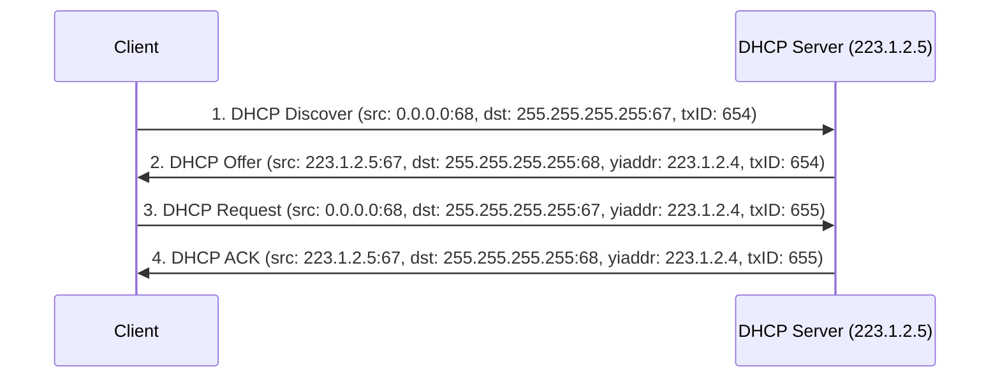
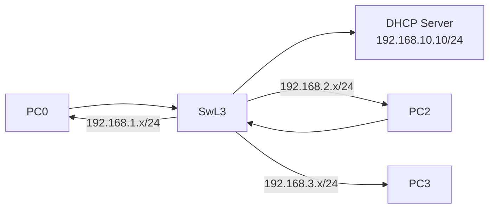
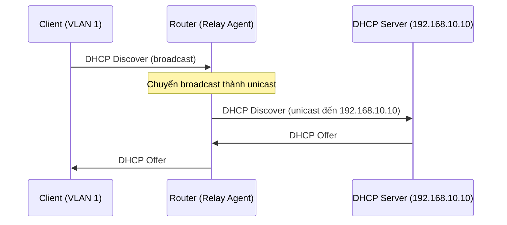
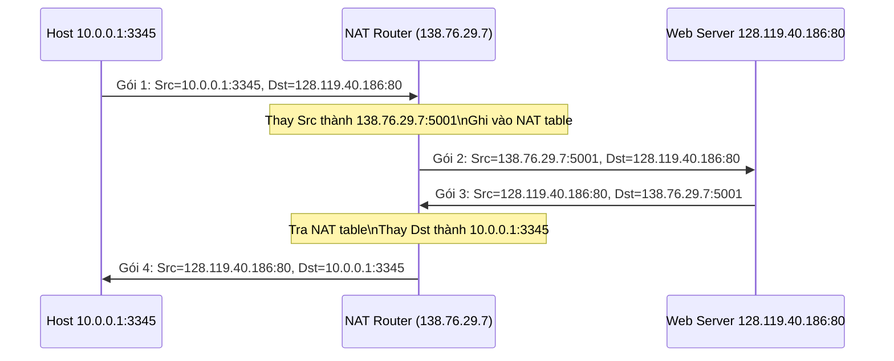
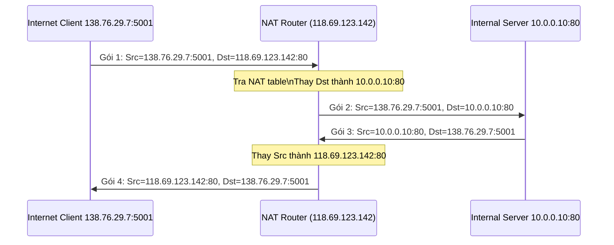
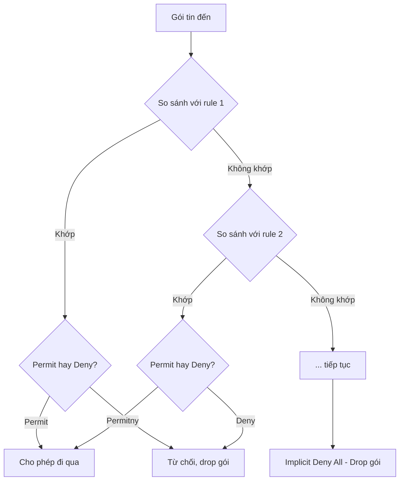

# Chương 4: Network Services

---

## 1. DHCP (Dynamic Host Configuration Protocol)

### 1.1 Tổng quan DHCP

DHCP là giao thức tự động cấp phát địa chỉ IP và các thông tin cấu hình mạng cho các thiết bị trong mạng, thay vì phải cấu hình tay từng máy.

DHCP server cung cấp các thông tin sau cho client:

- **IP address** – địa chỉ IP được cấp phát
- **Subnet mask** – mặt nạ mạng con
- **Default gateway** – cổng mặc định để ra ngoài mạng
- **DNS server** – máy chủ phân giải tên miền

!!! note "Tại sao cần DHCP?"
    Trong một tổ chức có hàng trăm, hàng nghìn thiết bị, việc cấu hình IP thủ công rất tốn công và dễ xảy ra xung đột địa chỉ. DHCP giải quyết vấn đề này bằng cách tự động hóa quá trình phân phối địa chỉ IP.

---

### 1.2 Hoạt động của DHCP (DORA Process)

Quá trình cấp phát IP của DHCP gồm 4 bước, thường được gọi là **DORA**:



| Bước | Tên | Mô tả |
|------|-----|-------|
| 1 | **Discover** | Client broadcast để tìm DHCP server. IP nguồn là `0.0.0.0` vì client chưa có IP. |
| 2 | **Offer** | Server phản hồi, đề nghị một địa chỉ IP (`yiaddr`) kèm thời gian thuê. |
| 3 | **Request** | Client chấp nhận đề nghị, broadcast để thông báo cho toàn mạng (có thể có nhiều server). |
| 4 | **ACK** | Server xác nhận, hoàn tất việc cấp phát. Client bắt đầu dùng địa chỉ IP này. |

!!! tip "Tại sao DHCP dùng broadcast?"
    Client lúc đầu chưa biết địa chỉ IP của DHCP server, nên phải broadcast (`255.255.255.255`) để tìm server. Đây cũng là lý do router thông thường không forward DHCP message sang mạng khác (vì router không forward broadcast).

---

### 1.3 DHCP trên Router/Access Point

Hầu hết router gia đình hoặc AP đều tích hợp sẵn DHCP server. Quản trị viên có thể cấu hình:

- **Start IP / End IP**: Dải địa chỉ IP sẽ được cấp phát
- **Lease Time**: Thời gian thuê địa chỉ IP (mặc định 120 phút)
- **Default Gateway**: Thường là địa chỉ IP của router
- **Primary/Secondary DNS**: Máy chủ DNS

---

### 1.4 Router as a DHCP Server

Router L3 có thể đóng vai trò DHCP server cho nhiều VLAN/subnet khác nhau.



---

### 1.5 Router as a DHCP Relay Agent

**Vấn đề:** Router không forward broadcast. Khi client gửi DHCP Discover (broadcast), router sẽ chặn gói tin này, khiến client không liên lạc được với DHCP server ở mạng khác.

**Giải pháp:** Cấu hình router làm **DHCP Relay Agent** bằng lệnh `ip helper-address`.



**Cấu hình DHCP Relay Agent trên interface VLAN:**

```cisco
interface vlan 10
 ip address 192.168.1.1 255.255.255.0
 ip helper-address 192.168.10.10
```

!!! warning "Lưu ý"
    Lệnh `ip helper-address` phải được cấu hình trên interface phía client (interface nhận broadcast), không phải interface phía server.

---

## 2. NAT (Network Address Translation)

### 2.1 Tổng quan NAT

**Private IP address** là các dải địa chỉ dùng nội bộ trong mạng tổ chức/gia đình, không thể định tuyến trực tiếp trên Internet:

| Dải địa chỉ | Ký hiệu CIDR |
|------------|--------------|
| 10.0.0.0 – 10.255.255.255 | 10.0.0.0/8 |
| 172.16.0.0 – 172.31.255.255 | 172.16.0.0/12 |
| 192.168.0.0 – 192.168.255.255 | 192.168.0.0/16 |

**Public IP address** là địa chỉ có thể định tuyến được trên Internet, do ISP cấp phát.

**NAT** dịch địa chỉ IP private sang public (và ngược lại) để cho phép thiết bị nội bộ giao tiếp với Internet. Nhờ NAT, hàng nghìn thiết bị có thể dùng chung một hoặc vài địa chỉ IP public.

---

### 2.2 NAT Case 1 – Internal ra Internet (Source NAT)

Đây là trường hợp phổ biến nhất: các thiết bị trong mạng nội bộ muốn truy cập Internet.



**NAT Translation Table:**

| WAN side addr | LAN side addr |
|---------------|---------------|
| 138.76.29.7:5001 | 10.0.0.1:3345 |

!!! info "PAT (Port Address Translation)"
    Kỹ thuật dùng port để phân biệt nhiều kết nối từ các host khác nhau nhưng cùng dùng một IP public được gọi là **PAT** hay **NAT Overload** – đây là cơ chế thực tế được dùng phổ biến nhất.

---

### 2.3 NAT Case 2 – Internet vào Server nội bộ (Destination NAT / Port Forwarding)

Khi một client trên Internet muốn kết nối đến server trong mạng nội bộ.



**NAT Translation Table (pre-defined):**

| WAN side addr | LAN side addr |
|---------------|---------------|
| 118.69.123.142:80 | 10.0.0.10:80 |

!!! warning "Quan trọng"
    Trong Case 2, bản ghi trong NAT table phải được **cấu hình sẵn** (static/pre-defined) bởi quản trị viên. Router không thể tự động tạo bản ghi này như Case 1.

---

### 2.4 Port Forwarding

Port Forwarding là cách triển khai NAT Case 2 trên router gia đình/doanh nghiệp nhỏ. Quản trị viên cấu hình qua giao diện web của router:

| Trường | Mô tả |
|--------|-------|
| Service Type | Tên dịch vụ (HTTP, FTP...) |
| External Port | Cổng nhận từ Internet |
| Internal IP | Địa chỉ IP private của server |
| Internal Port | Cổng của server nội bộ |
| Protocol | TCP hoặc UDP |

**Ví dụ:** Forward cổng 80 từ Internet đến server web nội bộ `192.168.1.10`:

| External Port | Internal IP | Internal Port | Protocol |
|---|---|---|---|
| 80 | 192.168.1.10 | 80 | TCP |

---

## 3. ACL (Access Control List)

### 3.1 Tổng quan ACL

ACL là một danh sách tuần tự các câu lệnh `permit` (cho phép) hoặc `deny` (từ chối) được áp dụng trên interface của router để kiểm soát luồng traffic.

**Ví dụ bài toán:**
- Cho phép tất cả truy cập đến Server
- Từ chối PC2 không được truy cập Server

!!! warning "Implicit Deny"
    Cuối mỗi ACL luôn có một câu lệnh ẩn `deny any` (deny all). Nếu gói tin không khớp với bất kỳ rule nào, nó sẽ bị từ chối. Vì vậy phải luôn có ít nhất một `permit` rule nếu muốn cho phép traffic đi qua.

---

### 3.2 Hoạt động của ACL



- Router so sánh gói tin với từng rule theo thứ tự từ trên xuống
- Khi tìm thấy rule khớp, thực hiện hành động (permit/deny) và **dừng** so sánh
- Nếu không có rule nào khớp, áp dụng **implicit deny**

---

### 3.3 Inbound vs Outbound ACL

=== "Inbound ACL"

    - Lọc gói tin **trước khi định tuyến** (before routing)
    - Gói tin đến interface được kiểm tra trước, nếu bị deny thì không cần tra bảng định tuyến
    - **Hiệu quả hơn** vì tiết kiệm tài nguyên xử lý routing nếu gói tin bị drop

=== "Outbound ACL"

    - Lọc gói tin **sau khi định tuyến** (after routing)
    - Gói tin đã được tra bảng định tuyến xong, sau đó mới kiểm tra ACL tại interface ra
    - Phù hợp khi muốn kiểm soát traffic từ nhiều nguồn vào một interface ra

---

### 3.4 Loại ACL và vị trí đặt

=== "Standard ACL"

    - Lọc gói tin **chỉ dựa trên địa chỉ IP nguồn**
    - Access-list number: **1–99** hoặc **1300–1999**
    - **Đặt gần đích** (destination) để tránh chặn traffic không cần thiết

    **Lý do:** Standard ACL không biết destination, nếu đặt gần source có thể chặn cả traffic hợp lệ đến các đích khác.

=== "Extended ACL"

    - Lọc dựa trên nhiều tiêu chí:
        - Địa chỉ IP nguồn và đích
        - Loại giao thức (ICMP, TCP, UDP, IP...)
        - Số cổng TCP/UDP nguồn và đích
    - Access-list number: **100–1299**
    - **Đặt gần nguồn** (source) để tránh traffic không cần thiết đi qua mạng rồi mới bị drop

**Nguyên tắc áp dụng ACL:**

!!! info "One ACL per protocol, per direction, per interface"
    - Mỗi interface chỉ có **một** ACL cho mỗi hướng (in hoặc out)
    - Mỗi giao thức (IPv4, IPv6) cần ACL riêng

---

### 3.5 Wildcard Mask

Wildcard mask là chuỗi 32 bit dùng để chỉ định phần địa chỉ IP nào cần khớp chính xác và phần nào bỏ qua:

- **Bit 0**: **phải khớp** (match)
- **Bit 1**: **bỏ qua** (ignore)

!!! tip "So sánh với Subnet Mask"
    Wildcard mask là **nghịch đảo** của subnet mask. Ví dụ: subnet mask `/24` = `255.255.255.0`, wildcard tương ứng = `0.0.0.255`.

**Ví dụ minh họa:**

=== "Ví dụ 1 – Match chính xác một host"

    | | Decimal | Binary |
    |--|---------|--------|
    | IP | 192.168.10.1 | 11000000.10101000.00001010.00000001 |
    | Wildcard | 0.0.0.0 | 00000000.00000000.00000000.00000000 |

    Tất cả 32 bit đều phải khớp chính xác → chỉ match đúng host `192.168.10.1`.

    **Shorthand:** `host 192.168.10.1`

=== "Ví dụ 2 – Match tất cả"

    | | Decimal | Binary |
    |--|---------|--------|
    | IP | 0.0.0.0 | 00000000.00000000.00000000.00000000 |
    | Wildcard | 255.255.255.255 | 11111111.11111111.11111111.11111111 |

    Tất cả 32 bit đều bỏ qua → match mọi địa chỉ IP.

    **Shorthand:** `any`

=== "Ví dụ 3 – Match một subnet /24"

    | | Decimal | Binary |
    |--|---------|--------|
    | IP | 192.168.10.0 | 11000000.10101000.00001010.00000000 |
    | Wildcard | 0.0.0.255 | 00000000.00000000.00000000.11111111 |

    24 bit đầu phải khớp, 8 bit cuối bỏ qua → match toàn bộ subnet `192.168.10.0/24`.

---

### 3.6 Wildcard Mask Keywords

```cisco
! Thay vì viết wildcard 0.0.0.0 (match chính xác một host):
192.168.10.10 0.0.0.0
! Có thể viết gọn:
host 192.168.10.10

! Thay vì viết 0.0.0.0 255.255.255.255 (match tất cả):
! Có thể viết gọn:
any
```

---

### 3.7 Bài tập Wildcard Mask

??? question "Bài tập 1 – Xác định wildcard mask"

    **Câu hỏi 1:** Từ chối tất cả host trong mạng `10.10.10.0/24`

    **Trả lời:** Wildcard mask = `0.0.0.255`

    Giải thích: `/24` có 8 bit host, tất cả bit host đều bỏ qua → 8 bit cuối = `11111111` = `255`.

    ---

    **Câu hỏi 2:** Từ chối host `192.168.5.7`

    **Trả lời:** Wildcard mask = `0.0.0.0`

    Giải thích: Cần match chính xác một địa chỉ cụ thể, không bỏ qua bit nào.

??? question "Bài tập 2 – Xác định permit hay deny"

    **Câu hỏi 1:** `access-list 50 permit 192.168.122.128 0.0.0.63` — IP `192.168.122.195` có được permit không?

    **Trả lời:** **Deny**

    Giải thích:
    - Wildcard `0.0.0.63` = `00000000.00000000.00000000.00111111`
    - 26 bit đầu phải khớp với `192.168.122.128` = `...10000000`
    - `192.168.122.195` = `...11000011` → bit thứ 25 (tính từ phải: bit 7) là `1` ≠ `1` nhưng bit 26 là `1` ≠ `0` → **không khớp** → Deny

    Dải cho phép: `192.168.122.128` đến `192.168.122.191` (64 địa chỉ). `195 > 191` → Deny.

    ---

    **Câu hỏi 2:** `access-list 50 permit 192.168.233.64 0.0.0.15` — IP `192.168.233.72` có được permit không?

    **Trả lời:** **Permit**

    Giải thích:
    - Wildcard `0.0.0.15` → 28 bit đầu phải khớp, 4 bit cuối bỏ qua
    - Dải cho phép: `192.168.233.64` đến `192.168.233.79`
    - `72` nằm trong khoảng `[64, 79]` → **Permit**

---

### 3.8 Cấu hình Standard ACL

**Bước 1: Định nghĩa ACL rule**

```cisco
Router(config)# access-list <access-list-number> { deny | permit | remark } <source> [source-wildcard] [log]
```

- `access-list-number`: 1–99 hoặc 1300–1999
- `source`: địa chỉ IP nguồn cần so khớp
- `source-wildcard`: wildcard mask
- `log`: ghi log khi rule này khớp

**Bước 2: Áp dụng ACL lên interface**

```cisco
Router(config)# interface g0/0/0
Router(config-if)# ip access-group <access-list-number> { in | out }
```

**Xóa ACL:**

```cisco
Router(config)# no access-list <access-list-number>
```

**Ví dụ đầy đủ:** Từ chối mạng `192.168.1.0/24` đến Server 1, cho phép tất cả còn lại:

```cisco
Router(config)# access-list 1 deny 192.168.1.0 0.0.0.255
Router(config)# access-list 1 permit any

Router(config)# interface g0/0/0
Router(config-if)# ip access-group 1 out
```

!!! info "Giải thích"
    ACL 1 áp dụng **outbound** trên interface `g0/0/0` (interface hướng ra Server). Rule đầu từ chối toàn bộ mạng `192.168.1.0/24`, rule thứ hai cho phép tất cả còn lại.

---

### 3.9 Cấu hình Extended ACL

**Bước 1: Định nghĩa ACL rule**

```cisco
Router(config)# access-list <access-list-number> { deny | permit | remark } <protocol>
  <source> [source-wildcard] [operator] [port]
  <destination> [destination-wildcard] [operator] [port]
  [established] [log]
```

- `access-list-number`: 100–1299
- `protocol`: `tcp`, `udp`, `icmp`, `ip`...
- `operator`: `lt` (less than), `gt` (greater than), `eq` (equal)
- `port`: số cổng hoặc tên (22=ssh, 80=http, 21=ftp...)

**Bước 2: Áp dụng lên interface**

```cisco
Router(config)# interface g0/0/0
Router(config-if)# ip access-group <access-list-number> { in | out }
```

**Ví dụ đầy đủ:** Từ chối SSH từ `192.168.1.0/24` đến Server `192.168.10.10`, cho phép HTTP từ mạng đó đến server, cho phép TCP còn lại:

```cisco
R1(config)# access-list 100 deny tcp 192.168.1.0 0.0.0.255 host 192.168.10.10 eq 22
R1(config)# access-list 100 permit tcp 192.168.1.0 0.0.0.255 host 192.168.10.10 eq 80
R1(config)# access-list 100 permit tcp any any

R1(config)# interface g0/0/0
R1(config-if)# ip access-group 100 in
```

!!! info "Giải thích"
    - Rule 1: Deny TCP từ `192.168.1.0/24` đến `192.168.10.10` port 22 (SSH)
    - Rule 2: Permit TCP từ `192.168.1.0/24` đến `192.168.10.10` port 80 (HTTP)
    - Rule 3: Permit TCP từ bất kỳ đến bất kỳ (traffic còn lại)
    - ACL áp dụng **inbound** trên interface g0/0/0 (gần source) — đúng nguyên tắc Extended ACL đặt gần source.

---

## Câu hỏi trắc nghiệm

---

**Câu 1.** DHCP là viết tắt của?

- A. Dynamic Host Control Protocol
- B. Dynamic Host Configuration Protocol
- C. Dynamic Hardware Configuration Protocol
- D. Direct Host Configuration Protocol

??? info "Đáp án & Giải thích"
    **Đáp án: B**

    DHCP = Dynamic Host Configuration Protocol – giao thức cấu hình host động.

---

**Câu 2.** DHCP server cung cấp những thông tin nào cho client?

- A. IP address, Subnet mask, Default gateway, DNS server
- B. IP address, MAC address, Default gateway, DNS server
- C. IP address, Subnet mask, Default gateway, WINS server
- D. IP address, Subnet mask, NAT table, DNS server

??? info "Đáp án & Giải thích"
    **Đáp án: A**

    DHCP cung cấp: IP address, Subnet mask, Default gateway, DNS server. MAC address là thông tin của card mạng, không do DHCP cấp.

---

**Câu 3.** Trong quá trình DORA, bước nào client gửi broadcast để tìm DHCP server?

- A. DHCP Offer
- B. DHCP Request
- C. DHCP Discover
- D. DHCP ACK

??? info "Đáp án & Giải thích"
    **Đáp án: C**

    DHCP Discover là bước đầu tiên, client broadcast để tìm DHCP server vì chưa biết địa chỉ server.

---

**Câu 4.** Trong DHCP Discover, địa chỉ IP nguồn của client là gì?

- A. 127.0.0.1
- B. 192.168.1.1
- C. 255.255.255.255
- D. 0.0.0.0

??? info "Đáp án & Giải thích"
    **Đáp án: D**

    Client chưa có IP nên dùng `0.0.0.0` làm địa chỉ nguồn.

---

**Câu 5.** DHCP sử dụng cặp port nào?

- A. Client port 67, Server port 68
- B. Client port 68, Server port 67
- C. Client port 80, Server port 443
- D. Client port 53, Server port 53

??? info "Đáp án & Giải thích"
    **Đáp án: B**

    DHCP client dùng port UDP 68, DHCP server dùng port UDP 67.

---

**Câu 6.** Bước nào trong DORA là DHCP server xác nhận cấp phát địa chỉ IP cho client?

- A. Discover
- B. Offer
- C. Request
- D. ACK

??? info "Đáp án & Giải thích"
    **Đáp án: D**

    DHCP ACK (Acknowledgement) là bước server xác nhận, hoàn tất việc cấp phát địa chỉ IP.

---

**Câu 7.** Tại sao router không forward DHCP Discover sang mạng khác theo mặc định?

- A. Vì DHCP dùng TCP
- B. Vì DHCP Discover là gói broadcast
- C. Vì DHCP không có trong bảng định tuyến
- D. Vì DHCP dùng port đặc biệt

??? info "Đáp án & Giải thích"
    **Đáp án: B**

    Router không forward broadcast. DHCP Discover gửi đến `255.255.255.255` là broadcast, nên bị chặn tại router.

---

**Câu 8.** Lệnh nào cấu hình router làm DHCP Relay Agent?

- A. `ip dhcp relay`
- B. `ip helper-address`
- C. `ip forward-protocol`
- D. `ip dhcp-relay`

??? info "Đáp án & Giải thích"
    **Đáp án: B**

    Lệnh `ip helper-address <địa chỉ DHCP server>` cấu hình router chuyển tiếp DHCP broadcast thành unicast đến DHCP server.

---

**Câu 9.** Lệnh `ip helper-address 192.168.10.10` được cấu hình ở đâu?

- A. Trên interface hướng về DHCP server
- B. Trên interface nhận DHCP request từ client
- C. Trên DHCP server
- D. Trong global configuration mode

??? info "Đáp án & Giải thích"
    **Đáp án: B**

    Lệnh này phải đặt trên interface phía client (interface nhận broadcast DHCP Discover từ client).

---

**Câu 10.** "Lease time" trong DHCP có nghĩa là gì?

- A. Thời gian server phản hồi Offer
- B. Thời gian client được sử dụng địa chỉ IP được cấp
- C. Thời gian router lưu bảng định tuyến
- D. Thời gian ACK được gửi

??? info "Đáp án & Giải thích"
    **Đáp án: B**

    Lease time là thời gian thuê địa chỉ IP. Sau khi hết thời gian này, client phải gia hạn hoặc xin cấp lại địa chỉ IP.

---

**Câu 11.** Dải địa chỉ nào là Private IP?

- A. 172.32.0.0/12
- B. 192.168.0.0/16
- C. 11.0.0.0/8
- D. 100.0.0.0/8

??? info "Đáp án & Giải thích"
    **Đáp án: B**

    Ba dải Private IP: `10.0.0.0/8`, `172.16.0.0/12`, `192.168.0.0/16`. Các đáp án còn lại không thuộc dải private.

---

**Câu 12.** NAT là viết tắt của?

- A. Network Address Transfer
- B. Network Address Translation
- C. Network Application Translation
- D. Node Address Translation

??? info "Đáp án & Giải thích"
    **Đáp án: B**

    NAT = Network Address Translation – dịch địa chỉ mạng.

---

**Câu 13.** Mục đích chính của NAT là gì?

- A. Tăng tốc độ mạng
- B. Mã hóa dữ liệu
- C. Cho phép các thiết bị có IP private truy cập Internet qua IP public
- D. Phân giải tên miền

??? info "Đáp án & Giải thích"
    **Đáp án: C**

    NAT dịch private IP thành public IP để thiết bị nội bộ có thể giao tiếp với Internet.

---

**Câu 14.** Trong NAT Case 1, khi client 10.0.0.1:3345 gửi gói đến Internet, router NAT thay đổi gì?

- A. Địa chỉ đích
- B. Địa chỉ nguồn
- C. Cả địa chỉ nguồn lẫn đích
- D. Không thay đổi gì

??? info "Đáp án & Giải thích"
    **Đáp án: B**

    Trong Source NAT (Case 1), router thay thế địa chỉ IP nguồn (private) bằng IP public của router.

---

**Câu 15.** NAT translation table lưu trữ thông tin gì?

- A. Tên miền và địa chỉ IP
- B. Ánh xạ giữa WAN side address và LAN side address
- C. Bảng định tuyến
- D. Danh sách MAC address

??? info "Đáp án & Giải thích"
    **Đáp án: B**

    NAT table ghi lại ánh xạ giữa địa chỉ (IP:port) phía WAN và phía LAN để router biết cách forward gói tin chiều về.

---

**Câu 16.** Trong NAT Case 2, bản ghi trong NAT table phải được tạo như thế nào?

- A. Tự động tạo khi có kết nối đầu tiên
- B. Được cấu hình sẵn (static) bởi quản trị viên
- C. Được tạo bởi DHCP server
- D. Được học từ bảng ARP

??? info "Đáp án & Giải thích"
    **Đáp án: B**

    Trong Destination NAT (Case 2), quản trị viên phải cấu hình sẵn ánh xạ port forwarding vì router không thể tự biết phải forward đến server nội bộ nào.

---

**Câu 17.** Port Forwarding là ứng dụng của loại NAT nào?

- A. Source NAT (Case 1)
- B. Destination NAT (Case 2)
- C. Cả hai
- D. Không liên quan đến NAT

??? info "Đáp án & Giải thích"
    **Đáp án: B**

    Port Forwarding cho phép Internet client kết nối đến server nội bộ – đây là Destination NAT (thay địa chỉ đích).

---

**Câu 18.** PAT (Port Address Translation) khác NAT thông thường ở điểm gì?

- A. PAT không dùng port
- B. PAT cho phép nhiều thiết bị nội bộ dùng chung một IP public bằng cách phân biệt qua port
- C. PAT chỉ dùng cho IPv6
- D. PAT không cần router

??? info "Đáp án & Giải thích"
    **Đáp án: B**

    PAT (hay NAT Overload) sử dụng port để phân biệt các kết nối khác nhau từ các host khác nhau, cho phép nhiều thiết bị dùng chung một IP public.

---

**Câu 19.** Trong NAT Case 1, khi gói phản hồi từ Internet trở về, router làm gì?

- A. Drop gói vì không biết gửi đến đâu
- B. Tra NAT table để thay địa chỉ đích từ IP public về IP private
- C. Broadcast gói đến tất cả thiết bị nội bộ
- D. Gửi thẳng đến default gateway

??? info "Đáp án & Giải thích"
    **Đáp án: B**

    Router tra NAT table tìm bản ghi tương ứng với IP:port đích, sau đó thay bằng IP:port private để gửi đến đúng thiết bị nội bộ.

---

**Câu 20.** ACL là viết tắt của?

- A. Access Control Layer
- B. Access Control List
- C. Address Control List
- D. Application Control List

??? info "Đáp án & Giải thích"
    **Đáp án: B**

    ACL = Access Control List – danh sách kiểm soát truy cập.

---

**Câu 21.** ACL là gì?

- A. Một giao thức định tuyến
- B. Danh sách tuần tự các câu lệnh permit/deny để lọc traffic trên interface router
- C. Bảng định tuyến của router
- D. Danh sách địa chỉ MAC

??? info "Đáp án & Giải thích"
    **Đáp án: B**

    ACL là danh sách có thứ tự các rule permit/deny, áp dụng trên interface của router để kiểm soát traffic.

---

**Câu 22.** Điều gì xảy ra khi gói tin không khớp với bất kỳ rule nào trong ACL?

- A. Gói tin được permit
- B. Gói tin được gửi đến server log
- C. Gói tin bị deny (implicit deny)
- D. Gói tin được forward đến default gateway

??? info "Đáp án & Giải thích"
    **Đáp án: C**

    Cuối mỗi ACL có một rule ẩn `deny any`. Nếu gói tin không khớp rule nào, nó bị drop.

---

**Câu 23.** Khi router so sánh gói tin với ACL, điều gì xảy ra ngay sau khi tìm thấy rule khớp?

- A. Tiếp tục kiểm tra các rule tiếp theo
- B. Dừng kiểm tra, thực hiện hành động của rule đó
- C. Kiểm tra tất cả rule rồi mới quyết định
- D. Gửi log về server

??? info "Đáp án & Giải thích"
    **Đáp án: B**

    ACL hoạt động theo nguyên tắc first-match: khi tìm thấy rule khớp đầu tiên, thực hiện hành động và dừng lại ngay.

---

**Câu 24.** Inbound ACL lọc gói tin ở thời điểm nào?

- A. Sau khi định tuyến
- B. Trước khi định tuyến
- C. Sau khi gửi ra interface
- D. Khi gói tin đến gateway

??? info "Đáp án & Giải thích"
    **Đáp án: B**

    Inbound ACL lọc trước khi tra bảng định tuyến, tiết kiệm tài nguyên hơn vì gói bị deny không cần route.

---

**Câu 25.** Standard ACL lọc gói tin dựa trên tiêu chí nào?

- A. Địa chỉ IP nguồn và đích
- B. Chỉ địa chỉ IP nguồn
- C. Giao thức và port
- D. MAC address

??? info "Đáp án & Giải thích"
    **Đáp án: B**

    Standard ACL chỉ lọc dựa trên địa chỉ IP nguồn (source IP address).

---

**Câu 26.** Extended ACL có thể lọc dựa trên những tiêu chí nào?

- A. Chỉ IP nguồn
- B. IP nguồn, IP đích, giao thức, port nguồn và đích
- C. Chỉ port number
- D. MAC address và IP address

??? info "Đáp án & Giải thích"
    **Đáp án: B**

    Extended ACL lọc dựa trên: source IP, destination IP, protocol type, source port, destination port.

---

**Câu 27.** Standard ACL nên đặt ở đâu?

- A. Gần nguồn (source)
- B. Gần đích (destination)
- C. Ở giữa mạng
- D. Vị trí nào cũng giống nhau

??? info "Đáp án & Giải thích"
    **Đáp án: B**

    Standard ACL chỉ lọc theo source IP, nếu đặt gần source có thể chặn cả traffic hợp lệ đến đích khác. Đặt gần destination để chỉ chặn đúng traffic không mong muốn.

---

**Câu 28.** Extended ACL nên đặt ở đâu?

- A. Gần đích (destination)
- B. Gần nguồn (source)
- C. Trên interface WAN
- D. Trên DHCP server

??? info "Đáp án & Giải thích"
    **Đáp án: B**

    Extended ACL đặt gần source để traffic bị deny không đi qua mạng không cần thiết, tiết kiệm băng thông.

---

**Câu 29.** Dải số nào dùng cho Standard ACL?

- A. 1–99 và 1300–1999
- B. 100–199 và 2000–2699
- C. 100–1299
- D. 1–199

??? info "Đáp án & Giải thích"
    **Đáp án: A**

    Standard ACL dùng số 1–99 và 1300–1999.

---

**Câu 30.** Dải số nào dùng cho Extended ACL?

- A. 1–99
- B. 100–1299
- C. 1300–1999
- D. 200–299

??? info "Đáp án & Giải thích"
    **Đáp án: B**

    Extended ACL dùng số 100–1299.

---

**Câu 31.** Wildcard mask `0.0.0.0` có nghĩa là gì?

- A. Match tất cả địa chỉ
- B. Match chính xác địa chỉ đó
- C. Bỏ qua tất cả
- D. Match toàn bộ subnet

??? info "Đáp án & Giải thích"
    **Đáp án: B**

    Wildcard `0.0.0.0` nghĩa là tất cả 32 bit đều phải khớp chính xác – chỉ match đúng một host.

---

**Câu 32.** Wildcard mask `255.255.255.255` có nghĩa là gì?

- A. Match chính xác một host
- B. Match tất cả địa chỉ
- C. Match một subnet /24
- D. Match subnet /16

??? info "Đáp án & Giải thích"
    **Đáp án: B**

    Wildcard `255.255.255.255` nghĩa là tất cả 32 bit đều bỏ qua – match mọi địa chỉ IP.

---

**Câu 33.** Keyword `host` trong ACL thay thế wildcard mask nào?

- A. 255.255.255.255
- B. 0.0.0.255
- C. 0.0.0.0
- D. 255.255.255.0

??? info "Đáp án & Giải thích"
    **Đáp án: C**

    `host 192.168.1.1` tương đương `192.168.1.1 0.0.0.0` – match chính xác một host.

---

**Câu 34.** Keyword `any` trong ACL thay thế điều gì?

- A. `0.0.0.0 0.0.0.0`
- B. `255.255.255.255 0.0.0.0`
- C. `0.0.0.0 255.255.255.255`
- D. `255.255.255.255 255.255.255.255`

??? info "Đáp án & Giải thích"
    **Đáp án: C**

    `any` tương đương `0.0.0.0 255.255.255.255` – match tất cả địa chỉ.

---

**Câu 35.** Wildcard mask tương ứng với subnet `/24` là gì?

- A. 255.255.255.0
- B. 0.0.0.255
- C. 0.255.255.255
- D. 255.0.0.0

??? info "Đáp án & Giải thích"
    **Đáp án: B**

    Subnet `/24` có subnet mask `255.255.255.0`. Wildcard = nghịch đảo = `0.0.0.255`.

---

**Câu 36.** Lệnh áp dụng ACL vào interface theo hướng vào là gì?

- A. `ip access-group 1 out`
- B. `ip access-group 1 in`
- C. `ip access-list 1 in`
- D. `ip acl 1 inbound`

??? info "Đáp án & Giải thích"
    **Đáp án: B**

    Cú pháp: `ip access-group <số ACL> { in | out }`. Dùng `in` để áp dụng theo chiều vào.

---

**Câu 37.** Để xóa ACL số 10, dùng lệnh nào?

- A. `delete access-list 10`
- B. `no ip access-list 10`
- C. `no access-list 10`
- D. `remove access-list 10`

??? info "Đáp án & Giải thích"
    **Đáp án: C**

    Lệnh xóa ACL: `no access-list <số ACL>`

---

**Câu 38.** Cho ACL: `access-list 100 deny tcp 192.168.1.0 0.0.0.255 host 192.168.10.10 eq 22`
Rule này có tác dụng gì?

- A. Deny tất cả TCP từ 192.168.1.0/24
- B. Deny TCP từ 192.168.1.0/24 đến host 192.168.10.10 cổng SSH (22)
- C. Permit TCP đến cổng 22
- D. Deny UDP từ 192.168.1.0/24

??? info "Đáp án & Giải thích"
    **Đáp án: B**

    Rule deny giao thức TCP, từ nguồn `192.168.1.0/24`, đến đích `192.168.10.10`, cổng đích `22` (SSH).

---

**Câu 39.** Mỗi interface có thể có bao nhiêu ACL cho mỗi hướng?

- A. Không giới hạn
- B. Tối đa 2
- C. Chỉ 1
- D. Tối đa 10

??? info "Đáp án & Giải thích"
    **Đáp án: C**

    Nguyên tắc: one ACL per protocol, per direction, per interface. Mỗi hướng chỉ có một ACL.

---

**Câu 40.** Trong Standard ACL, câu lệnh `access-list 1 permit any` có nghĩa là gì?

- A. Permit đúng một host
- B. Permit tất cả địa chỉ IP
- C. Permit mạng 0.0.0.0/0
- D. Cả B và C đều đúng

??? info "Đáp án & Giải thích"
    **Đáp án: D**

    `any` = `0.0.0.0 255.255.255.255` = permit tất cả địa chỉ. Đây là rule dùng để override implicit deny, cho phép traffic còn lại đi qua.

---

**Câu 41.** Trong bit của wildcard mask, bit `0` có nghĩa gì?

- A. Bỏ qua (ignore)
- B. Phải khớp (match)
- C. Invert bit
- D. Không quan tâm

??? info "Đáp án & Giải thích"
    **Đáp án: B**

    Trong wildcard mask: `0` = phải khớp chính xác, `1` = bỏ qua (ngược với subnet mask).

---

**Câu 42.** `access-list 50 permit 192.168.122.128 0.0.0.63` cho phép dải địa chỉ nào?

- A. 192.168.122.0 – 192.168.122.255
- B. 192.168.122.128 – 192.168.122.191
- C. 192.168.122.128 – 192.168.122.255
- D. 192.168.122.64 – 192.168.122.127

??? info "Đáp án & Giải thích"
    **Đáp án: B**

    Wildcard `0.0.0.63` = 6 bit host (`63 = 00111111`). Dải: từ `.128` đến `.128 + 63 = .191`.

---

**Câu 43.** Wildcard mask để match subnet `10.10.10.0/24` là gì?

- A. 255.255.255.0
- B. 0.0.0.255
- C. 10.10.10.255
- D. 0.255.255.255

??? info "Đáp án & Giải thích"
    **Đáp án: B**

    `/24` → wildcard `0.0.0.255`. 24 bit đầu phải khớp, 8 bit cuối bỏ qua.

---

**Câu 44.** Câu lệnh Extended ACL nào deny SSH từ bất kỳ nguồn nào đến host `10.0.0.1`?

- A. `access-list 100 deny tcp any host 10.0.0.1 eq 22`
- B. `access-list 10 deny tcp any host 10.0.0.1 eq 22`
- C. `access-list 100 deny udp any host 10.0.0.1 eq 22`
- D. `access-list 100 deny tcp any any eq 22`

??? info "Đáp án & Giải thích"
    **Đáp án: A**

    Extended ACL dùng số 100–1299. SSH dùng TCP port 22. Cú pháp đúng: `access-list 100 deny tcp any host 10.0.0.1 eq 22`.

---

**Câu 45.** Trong quá trình DHCP DORA, transaction ID dùng để làm gì?

- A. Xác định port DHCP
- B. Xác định phiên làm việc, ghép cặp các tin nhắn request và response
- C. Xác định subnet
- D. Mã hóa tin nhắn

??? info "Đáp án & Giải thích"
    **Đáp án: B**

    Transaction ID là số ngẫu nhiên do client tạo, dùng để client biết gói Offer/ACK nào là phản hồi cho Discover/Request của mình.

---

**Câu 46.** Outbound ACL được kiểm tra ở thời điểm nào?

- A. Khi gói vào interface
- B. Sau khi định tuyến, trước khi gói ra interface
- C. Khi gói đến default gateway
- D. Trước khi DHCP xử lý

??? info "Đáp án & Giải thích"
    **Đáp án: B**

    Outbound ACL: gói đã được tra routing table xong, sau đó mới kiểm tra ACL tại interface ra.

---

**Câu 47.** Vì sao Extended ACL nên đặt gần source?

- A. Để không ảnh hưởng đến DHCP
- B. Tránh traffic bị deny vẫn đi qua toàn bộ mạng trước khi bị drop tại đích
- C. Extended ACL không hoạt động được ở xa source
- D. Để phù hợp với NAT

??? info "Đáp án & Giải thích"
    **Đáp án: B**

    Đặt gần source tiết kiệm băng thông và tài nguyên mạng, vì traffic bị drop ngay từ đầu thay vì đi qua toàn bộ đường mạng rồi mới bị drop.

---

**Câu 48.** Cho rule: `access-list 50 permit 192.168.233.64 0.0.0.15`. IP `192.168.233.72` có được permit không?

- A. Deny
- B. Permit
- C. Phụ thuộc vào rule tiếp theo
- D. Router báo lỗi

??? info "Đáp án & Giải thích"
    **Đáp án: B**

    Wildcard `0.0.0.15` → 4 bit cuối bỏ qua → dải `.64` đến `.79`. `72` nằm trong `[64, 79]` → Permit.

---

**Câu 49.** Điểm khác biệt chính giữa Standard ACL và Extended ACL là gì?

- A. Standard ACL nhanh hơn
- B. Extended ACL có thể lọc theo destination IP, protocol và port; Standard chỉ lọc theo source IP
- C. Standard ACL dùng cho IPv6, Extended cho IPv4
- D. Extended ACL không cần wildcard mask

??? info "Đáp án & Giải thích"
    **Đáp án: B**

    Đây là điểm khác biệt cốt lõi: Standard ACL chỉ lọc theo source IP, Extended ACL lọc theo nhiều tiêu chí hơn (src IP, dst IP, protocol, port).

---

**Câu 50.** Cấu hình sau có ý nghĩa gì?
```
access-list 1 deny 192.168.1.0 0.0.0.255
access-list 1 permit any
interface g0/0/0
ip access-group 1 out
```

- A. Cho phép 192.168.1.0/24 và chặn tất cả còn lại ra g0/0/0
- B. Chặn 192.168.1.0/24 và cho phép tất cả còn lại ra qua g0/0/0
- C. Chặn tất cả traffic vào g0/0/0
- D. Không có tác dụng vì thiếu Extended ACL

??? info "Đáp án & Giải thích"
    **Đáp án: B**

    Rule 1: deny mạng `192.168.1.0/24`. Rule 2: permit tất cả còn lại. Áp dụng outbound trên `g0/0/0` → traffic từ `192.168.1.0/24` bị chặn khi ra interface này, traffic từ mạng khác đi qua bình thường.

---

**Câu 51.** Trong NAT, "yiaddr" trong gói DHCP là gì? *(Câu hỏi kết hợp kiến thức)*

- A. Địa chỉ của DHCP server
- B. Địa chỉ IP được đề nghị cấp cho client (Your IP address)
- C. Địa chỉ gateway mặc định
- D. Địa chỉ broadcast

??? info "Đáp án & Giải thích"
    **Đáp án: B**

    `yiaddr` = "Your IP address" – địa chỉ IP mà server đề nghị cấp cho client trong gói DHCP Offer và ACK.

---

**Câu 52.** Nguyên tắc "one ACL per protocol, per direction, per interface" có nghĩa là gì?

- A. Mỗi router chỉ có một ACL
- B. Trên một interface, mỗi giao thức và mỗi hướng (in/out) chỉ áp dụng được một ACL
- C. Chỉ có thể dùng một giao thức với ACL
- D. ACL chỉ dùng được trên một interface duy nhất

??? info "Đáp án & Giải thích"
    **Đáp án: B**

    Ví dụ: interface g0/0 có thể có tối đa: 1 ACL IPv4 inbound + 1 ACL IPv4 outbound + 1 ACL IPv6 inbound + 1 ACL IPv6 outbound.

---

**Câu 53.** Wildcard mask `0.0.255.255` match với điều kiện nào sau đây cho địa chỉ base `192.168.0.0`?

- A. Chỉ match chính xác `192.168.0.0`
- B. Match tất cả địa chỉ trong `192.168.0.0` đến `192.168.255.255`
- C. Match tất cả địa chỉ trong dải `192.x.x.x`
- D. Match tất cả địa chỉ

??? info "Đáp án & Giải thích"
    **Đáp án: B**

    Wildcard `0.0.255.255` → 16 bit đầu phải khớp (`192.168`), 16 bit sau bỏ qua → match toàn bộ `192.168.0.0/16`.

---

**Câu 54.** Câu lệnh nào đúng để permit traffic từ host cụ thể `10.1.1.5` trong Standard ACL?

- A. `access-list 5 permit 10.1.1.5 255.255.255.255`
- B. `access-list 5 permit host 10.1.1.5`
- C. `access-list 5 permit 10.1.1.5 0.0.0.0`
- D. Cả B và C đều đúng

??? info "Đáp án & Giải thích"
    **Đáp án: D**

    `host 10.1.1.5` = `10.1.1.5 0.0.0.0`. Cả hai cú pháp đều hợp lệ và cho kết quả giống nhau.
