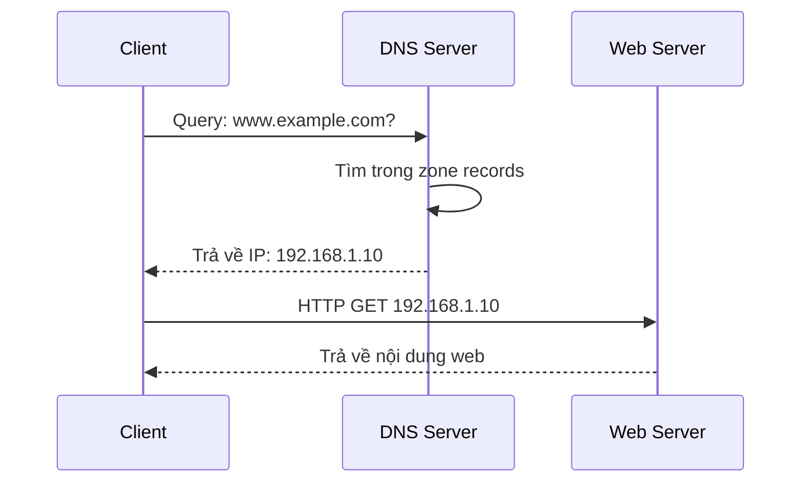
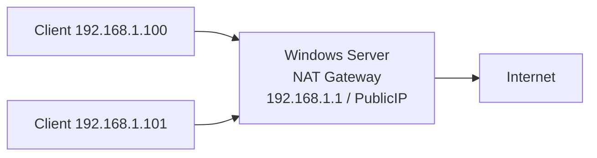
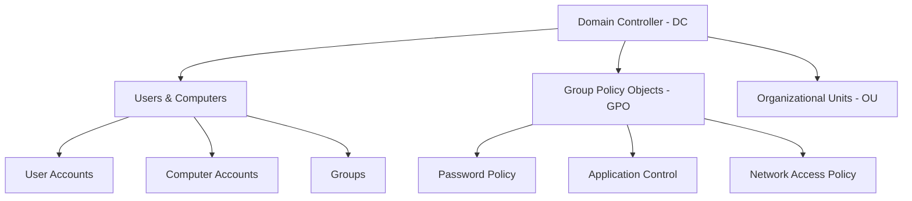
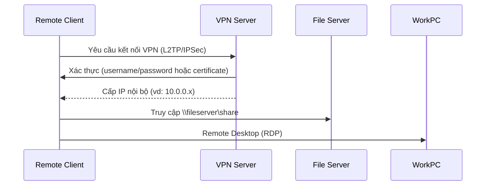
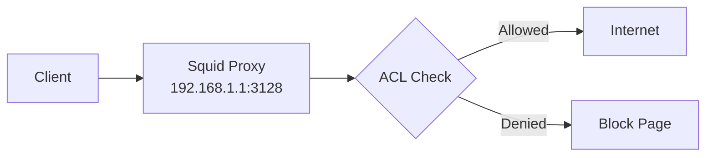
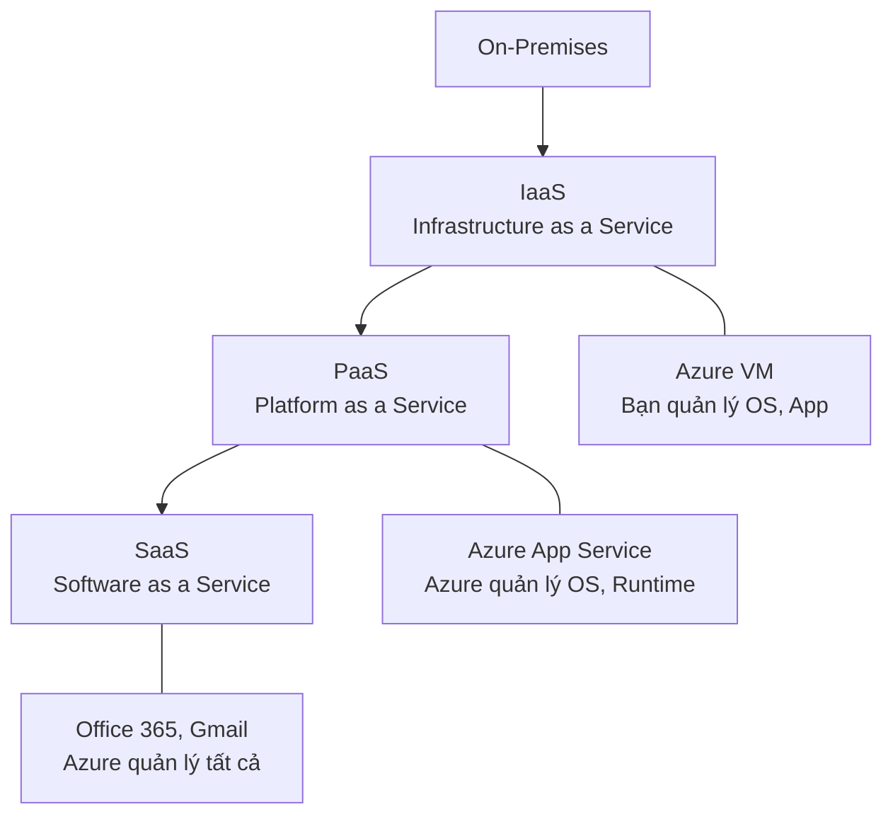

# Chương 5: Networks and Systems Administration

---

## Phần 1: Windows Server

### Tổng quan Windows Server

Windows Server là hệ điều hành máy chủ của Microsoft, được thiết kế để cung cấp các dịch vụ mạng, quản lý tài nguyên, bảo mật và hạ tầng cho doanh nghiệp. Các phiên bản phổ biến:

=== "Windows Server 2012"
    - Ra mắt năm 2012, hỗ trợ đến 2023 (Extended Support).
    - Tích hợp Hyper-V 3.0, Storage Spaces, ReFS.
    - Giao diện Server Manager tập trung, quản lý nhiều server từ một console.
    - Hỗ trợ tối đa 4TB RAM, 640 logical processors.

=== "Windows Server 2016"
    - Ra mắt năm 2016.
    - Bổ sung Windows Containers và Nano Server.
    - Cải tiến bảo mật: Shielded VMs, Credential Guard, Device Guard.
    - Tích hợp tốt hơn với Azure (Hybrid Cloud).
    - Hỗ trợ ReFS nâng cao, Storage Replica.

=== "Windows Server 2022"
    - Ra mắt năm 2021.
    - Bảo mật nâng cao: Secured-core server, TLS 1.3 mặc định, DNS-over-HTTPS.
    - Hỗ trợ Azure Arc để quản lý hybrid/multi-cloud.
    - Hiệu năng mạng tốt hơn với TCP/UDP, SMB compression.
    - Hỗ trợ container Windows nâng cao.

---

### Dự án Windows Server

#### 1. Web Server và DNS

**Mục tiêu:** Sinh viên có thể triển khai ứng dụng web và cấu hình tên miền (domain name) cho website.

**Kiến thức nền tảng:**

**IIS (Internet Information Services)** là web server tích hợp sẵn trong Windows Server. Nó hỗ trợ HTTP, HTTPS, FTP, SMTP và các ứng dụng ASP.NET, PHP.

```
Cài đặt IIS qua Server Manager:
Server Manager > Add Roles and Features > Web Server (IIS)
```

**DNS (Domain Name System)** là hệ thống phân giải tên miền thành địa chỉ IP. DNS Server trên Windows Server sử dụng role **DNS Server**.

```
Cấu hình DNS Server:
1. Cài role: Server Manager > Add Roles > DNS Server
2. Tạo Forward Lookup Zone: DNS Manager > Forward Lookup Zones > New Zone
3. Tạo A Record: trỏ domain -> IP của web server
4. Tạo CNAME Record (nếu cần alias)
```

**Luồng hoạt động DNS:**



=== "Yêu cầu cơ bản"
    - Triển khai một ứng dụng web lên IIS.
    - Cấu hình DNS để phân giải tên miền về IP của server.
    - Client truy cập web qua tên miền thành công.

=== "Yêu cầu nâng cao"
    - Triển khai nhiều hơn một ứng dụng web trên cùng một server (dùng **Virtual Hosting** hoặc **Host Header**).
    - Cấu hình nhiều DNS record tương ứng cho từng website.
    - Có thể dùng port khác nhau hoặc host header khác nhau để phân biệt site.

!!! tip "Gợi ý thực hành"
    Sử dụng IIS Bindings để host nhiều website trên cùng IP: mỗi site có host header khác nhau (vd: `site1.local`, `site2.local`). Trên DNS, tạo A Record cho từng tên miền trỏ về cùng IP server.

---

#### 2. NAT và DHCP

**Mục tiêu:** Server cung cấp IP cho client và client có thể truy cập Internet thông qua NAT.

**DHCP (Dynamic Host Configuration Protocol)** tự động cấp phát địa chỉ IP, subnet mask, default gateway, DNS server cho các thiết bị trong mạng.

```
Cài đặt DHCP Server:
Server Manager > Add Roles and Features > DHCP Server

Cấu hình DHCP Scope:
- Scope name: LAN_Scope
- Start IP: 192.168.1.100
- End IP: 192.168.1.200
- Subnet mask: 255.255.255.0
- Default Gateway: 192.168.1.1
- DNS Server: 192.168.1.1
- Lease Duration: 8 hours
```

**NAT (Network Address Translation)** cho phép nhiều thiết bị trong mạng nội bộ (private IP) chia sẻ một địa chỉ IP công cộng (public IP) để truy cập Internet.



Trên Windows Server, NAT được cấu hình qua **Routing and Remote Access Service (RRAS)**:

```
Cấu hình NAT:
Server Manager > Add Roles > Remote Access > Routing
Tools > Routing and Remote Access > Configure and Enable
Chọn NAT > Chọn interface kết nối Internet
```

=== "Yêu cầu cơ bản"
    - Server cấp IP tự động cho client qua DHCP.
    - Client có thể truy cập Internet nhờ NAT trên server.

=== "Yêu cầu nâng cao"
    - Cấu hình DHCP Reservations (đặt IP cố định cho một số thiết bị theo MAC address).
    - Cấu hình DHCP Exclusion Range (loại trừ một dải IP không cấp phát).
    - NAT hoạt động ổn định, client truy cập Internet bình thường.

!!! warning "Lưu ý"
    Windows Server cần có **2 NIC**: một NIC nối Internet (external), một NIC nối mạng nội bộ (internal). DHCP scope được tạo trên interface internal.

---

#### 3. File Service

**Mục tiêu:** File server lưu trữ và quản lý file để các máy trong mạng có thể truy cập.

**File Server Resource Manager (FSRM)** và **SMB (Server Message Block)** là nền tảng chia sẻ file trên Windows Server.

```
Cài đặt File Server:
Server Manager > Add Roles > File and Storage Services > File Server

Tạo Shared Folder:
1. Chuột phải vào thư mục > Properties > Sharing > Advanced Sharing
2. Đặt Share Name (tên chia sẻ)
3. Cấu hình Share Permissions (Everyone / Specific Users)
4. Cấu hình NTFS Permissions (Security tab)
```

**Phân biệt Share Permissions và NTFS Permissions:**

| Loại | Phạm vi áp dụng | Ưu tiên |
|---|---|---|
| Share Permissions | Chỉ khi truy cập qua mạng | Kém chi tiết hơn |
| NTFS Permissions | Cả local và qua mạng | Chi tiết hơn |

!!! info "Nguyên tắc kết hợp quyền"
    Khi cả hai loại quyền cùng áp dụng, hệ thống sẽ lấy quyền **hạn chế hơn (more restrictive)** giữa Share Permission và NTFS Permission.

=== "Yêu cầu cơ bản"
    - Người dùng trong mạng có thể truy cập file được chia sẻ từ server.

=== "Yêu cầu nâng cao"
    - Server cấu hình phân quyền truy cập file chi tiết: một số user chỉ đọc (Read), một số được ghi (Write/Modify), một số bị từ chối (Deny).
    - Kết hợp với Active Directory để quản lý quyền theo nhóm người dùng.

---

#### 4. Active Directory – Domain Service (AD DS)

**Mục tiêu:** Cài đặt và cấu hình các chính sách (policy) áp dụng lên client.

**Active Directory Domain Services (AD DS)** là dịch vụ thư mục của Microsoft, dùng để quản lý người dùng, máy tính, nhóm, chính sách bảo mật trong một domain tập trung.

**Các thành phần cốt lõi:**



**Cài đặt AD DS:**

```
Server Manager > Add Roles > Active Directory Domain Services
Sau đó: Promote this server to a domain controller
- Add a new forest: example.local
- Forest Functional Level: Windows Server 2016/2019
- Đặt DSRM password
- DNS sẽ được cài tự động cùng DC
```

**Group Policy (GPO)** là cơ chế triển khai chính sách tập trung xuống toàn bộ user/computer trong domain.

=== "Password Policy"
    Cấu hình trong: `Default Domain Policy > Computer Configuration > Windows Settings > Security Settings > Account Policies > Password Policy`

    Các tham số quan trọng:
    - **Minimum password length:** ít nhất 8 ký tự
    - **Password complexity:** bắt buộc chữ hoa, chữ thường, số, ký tự đặc biệt
    - **Maximum password age:** tối đa 90 ngày phải đổi mật khẩu
    - **Password history:** ghi nhớ 24 mật khẩu cũ, không được dùng lại

=== "Application Control Policy"
    Sử dụng **AppLocker** (Windows Server 2008 R2+) hoặc **Software Restriction Policies**:

    ```
    GPO > Computer Configuration > Windows Settings > Security Settings > AppLocker
    - Executable Rules: kiểm soát .exe, .com
    - Windows Installer Rules: kiểm soát .msi, .msp
    - Script Rules: kiểm soát .ps1, .bat, .vbs
    - Packaged App Rules: kiểm soát ứng dụng Store
    ```

=== "Network Access Policy"
    Sử dụng **Network Policy Server (NPS)** kết hợp với **Network Access Protection (NAP)**:

    - Kiểm tra tình trạng máy client trước khi cho phép kết nối mạng.
    - Có thể yêu cầu máy phải có antivirus cập nhật, firewall bật mới được vào mạng.
    - Cấu hình qua: `Server Manager > Network Policy and Access Services`

!!! tip "Thứ tự áp dụng GPO (LSDOU)"
    Local > Site > Domain > Organizational Unit. GPO ở cấp thấp hơn (OU) sẽ ghi đè GPO cấp cao hơn (Domain) nếu không bị block inheritance.

---

#### 5. Remote Access Service – VPN

**Mục tiêu:** Server cung cấp kết nối từ xa cho remote client.

**VPN (Virtual Private Network)** tạo một đường hầm (tunnel) mã hóa qua Internet, cho phép người dùng từ xa truy cập tài nguyên nội bộ như thể đang ở trong mạng LAN.

**Các giao thức VPN hỗ trợ trên Windows Server (RRAS):**

| Giao thức | Mô tả | Bảo mật |
|---|---|---|
| PPTP | Point-to-Point Tunneling Protocol | Thấp (không khuyến nghị) |
| L2TP/IPSec | Layer 2 Tunneling Protocol + IPSec | Cao |
| SSTP | Secure Socket Tunneling Protocol (qua HTTPS port 443) | Cao |
| IKEv2 | Internet Key Exchange version 2 | Rất cao, hỗ trợ MOBIKE |



**Cài đặt VPN Server:**

```
Server Manager > Add Roles > Remote Access > DirectAccess and VPN (RAS)
Tools > Routing and Remote Access > Configure and Enable
Chọn: Remote access (dial-up or VPN)
Cấu hình:
- VPN interface: NIC kết nối Internet
- IP Address Assignment: DHCP hoặc Static pool (vd: 10.0.0.1 - 10.0.0.20)
- Authentication: Windows Authentication hoặc RADIUS
```

=== "Yêu cầu cơ bản"
    - Remote user kết nối VPN thành công.
    - Sau khi kết nối, user truy cập được File Server nội bộ.

=== "Yêu cầu nâng cao"
    - Remote user truy cập được File Server.
    - Remote user dùng **Remote Desktop (RDP)** để điều khiển một máy tính khác trong mạng nội bộ qua VPN.

---

## Phần 2: Linux Server

### Tổng quan Linux Server

=== "Ubuntu Server"
    - Distro phổ biến nhất cho server, dựa trên Debian.
    - LTS (Long Term Support) hỗ trợ 5 năm (vd: Ubuntu 22.04 LTS).
    - Package manager: `apt`.
    - Phù hợp cho web server, cloud, container.

=== "CentOS / Rocky Linux"
    - CentOS từng là bản downstream của RHEL (Red Hat Enterprise Linux).
    - CentOS 8 đã EOL năm 2021, cộng đồng chuyển sang **Rocky Linux** hoặc **AlmaLinux**.
    - Package manager: `yum` / `dnf`.
    - Phổ biến trong môi trường doanh nghiệp.

=== "Kali Linux"
    - Dành cho Information Security (bảo mật thông tin).
    - Tích hợp sẵn hàng trăm công cụ pentest: Nmap, Metasploit, Wireshark, Burp Suite...
    - Không dùng làm server sản xuất, chỉ dùng cho lab/pentest.
    - Tùy chọn (Optional) cho sinh viên ngành Bảo mật thông tin.

---

### Dự án Linux Server

#### 1. Web Server và DNS

**Apache HTTP Server** và **Nginx** là hai web server phổ biến nhất trên Linux.

=== "Apache"
    ```bash
    # Ubuntu
    sudo apt update
    sudo apt install apache2

    # Cấu hình Virtual Host
    sudo nano /etc/apache2/sites-available/mysite.conf
    ```

    ```apache
    <VirtualHost *:80>
        ServerName www.mysite.local
        DocumentRoot /var/www/mysite
        ErrorLog ${APACHE_LOG_DIR}/error.log
        CustomLog ${APACHE_LOG_DIR}/access.log combined
    </VirtualHost>
    ```

    ```bash
    sudo a2ensite mysite.conf
    sudo systemctl reload apache2
    ```

=== "Nginx"
    ```bash
    sudo apt install nginx

    sudo nano /etc/nginx/sites-available/mysite
    ```

    ```nginx
    server {
        listen 80;
        server_name www.mysite.local;
        root /var/www/mysite;
        index index.html index.php;
    }
    ```

    ```bash
    sudo ln -s /etc/nginx/sites-available/mysite /etc/nginx/sites-enabled/
    sudo systemctl reload nginx
    ```

**BIND9** là DNS server phổ biến nhất trên Linux:

```bash
sudo apt install bind9

# Cấu hình zone
sudo nano /etc/bind/named.conf.local
```

```bash
zone "mysite.local" {
    type master;
    file "/etc/bind/zones/db.mysite.local";
};
```

```bash
# File zone record
$TTL    604800
@   IN  SOA ns1.mysite.local. admin.mysite.local. (
              2         ; Serial
         604800         ; Refresh
          86400         ; Retry
        2419200         ; Expire
         604800 )       ; Negative Cache TTL
;
@       IN  NS  ns1.mysite.local.
ns1     IN  A   192.168.1.10
www     IN  A   192.168.1.10
```

---

#### 2. NAT và DHCP

**ISC DHCP Server** trên Linux:

```bash
sudo apt install isc-dhcp-server

sudo nano /etc/dhcp/dhcpd.conf
```

```
subnet 192.168.1.0 netmask 255.255.255.0 {
    range 192.168.1.100 192.168.1.200;
    option routers 192.168.1.1;
    option domain-name-servers 8.8.8.8, 8.8.4.4;
    default-lease-time 600;
    max-lease-time 7200;
}
```

**NAT với iptables** trên Linux:

```bash
# Bật IP forwarding
echo 1 > /proc/sys/net/ipv4/ip_forward
# Hoặc vĩnh viễn:
sudo nano /etc/sysctl.conf
# net.ipv4.ip_forward = 1

# Cấu hình NAT (MASQUERADE)
sudo iptables -t nat -A POSTROUTING -o eth0 -j MASQUERADE
sudo iptables -A FORWARD -i eth1 -o eth0 -j ACCEPT
sudo iptables -A FORWARD -i eth0 -o eth1 -m state --state RELATED,ESTABLISHED -j ACCEPT

# Lưu cấu hình iptables
sudo apt install iptables-persistent
sudo netfilter-persistent save
```

!!! info "eth0 vs eth1"
    `eth0` là interface kết nối Internet (WAN), `eth1` là interface kết nối mạng nội bộ (LAN). Tên interface hiện đại có thể là `ens33`, `enp3s0`... tùy hệ thống.

---

#### 3. File Service

Linux hỗ trợ nhiều giao thức chia sẻ file:

=== "NFS (Network File System)"
    Giao thức chia sẻ file native của Linux/Unix. Phù hợp trong môi trường thuần Linux.

    ```bash
    sudo apt install nfs-kernel-server

    sudo nano /etc/exports
    # /srv/nfs  192.168.1.0/24(rw,sync,no_subtree_check)

    sudo exportfs -a
    sudo systemctl restart nfs-kernel-server
    ```

    ```bash
    # Trên client Linux mount NFS:
    sudo mount 192.168.1.10:/srv/nfs /mnt/nfs
    ```

=== "SMB/CIFS (Samba)"
    Cho phép Linux chia sẻ file với Windows client. Dùng **Samba**.

    ```bash
    sudo apt install samba

    sudo nano /etc/samba/smb.conf
    ```

    ```ini
    [shared]
       path = /srv/samba/shared
       browsable = yes
       writable = yes
       guest ok = no
       valid users = @smbgroup
    ```

    ```bash
    # Tạo Samba user
    sudo smbpasswd -a username
    sudo systemctl restart smbd
    ```

=== "FTP (vsftpd)"
    Very Secure FTP Daemon – phổ biến cho file transfer.

    ```bash
    sudo apt install vsftpd

    sudo nano /etc/vsftpd.conf
    # anonymous_enable=NO
    # local_enable=YES
    # write_enable=YES
    # chroot_local_user=YES

    sudo systemctl restart vsftpd
    ```

    !!! warning "Bảo mật FTP"
        FTP truyền dữ liệu không mã hóa. Nên dùng **SFTP** (SSH File Transfer Protocol) hoặc **FTPS** (FTP over TLS) thay thế.

---

#### 4. Monitoring Server – Nagios / Zabbix

**Mục tiêu:** Server giám sát hiệu năng của máy Windows/Linux và các dịch vụ mạng.

=== "Nagios"
    Nagios là hệ thống monitoring mã nguồn mở, giám sát host, service, và gửi cảnh báo khi có sự cố.

    **Kiến trúc Nagios:**

    ```mermaid
    graph LR
        A[Nagios Server] --> B[Nagios Plugins]
        B --> C[Linux Host<br/>NRPE Agent]
        B --> D[Windows Host<br/>NSClient++]
        B --> E[Network Device<br/>SNMP]
        A --> F[Web Interface<br/>http://server/nagios]
        A --> G[Notifications<br/>Email/SMS]
    ```

    ```bash
    # Cài Nagios Core trên Ubuntu
    sudo apt install nagios3

    # File cấu hình chính:
    /etc/nagios3/nagios.cfg
    /etc/nagios3/conf.d/  # Thêm host/service tại đây

    # Định nghĩa host cần monitor:
    define host {
        host_name       linux-server
        alias           Linux Server
        address         192.168.1.20
        check_command   check-host-alive
        max_check_attempts 3
    }

    # Định nghĩa service:
    define service {
        host_name           linux-server
        service_description HTTP
        check_command       check_http
    }
    ```

=== "Zabbix"
    Zabbix là giải pháp monitoring mạnh mẽ hơn, hỗ trợ auto-discovery, dashboard đồ họa, alerting phức tạp.

    **Kiến trúc Zabbix:**

    ```mermaid
    graph LR
        A[Zabbix Server] --> B[(Zabbix Database<br/>MySQL/PostgreSQL)]
        A --> C[Zabbix Frontend<br/>Web UI]
        D[Linux Agent] --> A
        E[Windows Agent] --> A
        F[SNMP Device] --> A
        G[JMX/IPMI] --> A
    ```

    ```bash
    # Cài Zabbix Agent trên host cần monitor:
    sudo apt install zabbix-agent

    sudo nano /etc/zabbix/zabbix_agentd.conf
    # Server=192.168.1.100      # IP Zabbix Server
    # Hostname=linux-server

    sudo systemctl restart zabbix-agent
    ```

    **So sánh Nagios vs Zabbix:**

    | Tiêu chí | Nagios | Zabbix |
    |---|---|---|
    | Giao diện | Đơn giản | Đồ họa, hiện đại |
    | Cấu hình | File text | Web UI + file |
    | Auto-discovery | Hạn chế | Mạnh |
    | Scalability | Trung bình | Cao |
    | Database | Không cần (mặc định) | Cần MySQL/PostgreSQL |
    | Độ khó | Trung bình | Thấp hơn (UI thân thiện) |

=== "Yêu cầu cơ bản"
    Monitoring server giám sát được hiệu năng máy Windows/Linux (CPU, RAM, disk...).

=== "Yêu cầu nâng cao"
    Ngoài giám sát máy, còn giám sát được các **network service**: HTTP, DNS, SMTP, FTP... và gửi cảnh báo khi service down.

---

#### 5. Proxy Server – Squid

**Mục tiêu:** Server kiểm soát chính sách truy cập Internet của client.

**Squid** là proxy server mã nguồn mở, hoạt động như một trung gian giữa client và Internet.

**Chức năng của Squid:**
- **Caching:** Lưu cache nội dung web, tăng tốc độ và giảm băng thông.
- **Access Control:** Chặn website, file type, theo thời gian.
- **Logging:** Ghi log toàn bộ hoạt động truy cập.
- **Authentication:** Yêu cầu đăng nhập trước khi truy cập Internet.

```bash
sudo apt install squid

sudo nano /etc/squid/squid.conf
```

**Cấu hình chặn website:**

```squid
# Tạo ACL danh sách website bị chặn
acl blocked_sites dstdomain .facebook.com .youtube.com
http_access deny blocked_sites

# Cho phép mạng nội bộ truy cập
acl localnet src 192.168.1.0/24
http_access allow localnet
http_access deny all
```

**Cấu hình chặn loại file:**

```squid
acl blocked_files urlpath_regex -i \.mp3$ \.avi$ \.mkv$ \.exe$
http_access deny blocked_files
```

**Cấu hình giới hạn thời gian truy cập:**

```squid
acl business_hours time MTWHF 08:00-17:00
http_access allow localnet business_hours
http_access deny localnet
```



=== "Yêu cầu cơ bản (Explicit Proxy)"
    Client phải tự cấu hình proxy trong trình duyệt hoặc hệ thống:
    - Proxy Address: `192.168.1.1`
    - Port: `3128`

=== "Yêu cầu nâng cao (Transparent Proxy)"
    Squid hoạt động như một router trong suốt. Traffic tự động đi qua proxy mà không cần cấu hình trên client.

    ```bash
    # iptables redirect HTTP traffic sang Squid
    sudo iptables -t nat -A PREROUTING -i eth1 -p tcp --dport 80 \
        -j REDIRECT --to-port 3128

    # Trong squid.conf:
    # http_port 3128 transparent
    ```

---

#### 6. Remote Access Service – OpenVPN

**Mục tiêu:** Server cung cấp kết nối từ xa qua VPN cho remote client.

**OpenVPN** là giải pháp VPN mã nguồn mở sử dụng SSL/TLS để mã hóa, hoạt động trên cả UDP (port 1194) và TCP (port 443).

```bash
sudo apt install openvpn easy-rsa

# Tạo CA và certificates
make-cadir ~/openvpn-ca
cd ~/openvpn-ca
./easyrsa init-pki
./easyrsa build-ca
./easyrsa gen-req server nopass
./easyrsa sign-req server server
./easyrsa gen-dh
openvpn --genkey --secret ta.key
```

```bash
# Cấu hình server.conf
sudo nano /etc/openvpn/server.conf
```

```
port 1194
proto udp
dev tun
ca ca.crt
cert server.crt
key server.key
dh dh.pem
tls-auth ta.key 0
server 10.8.0.0 255.255.255.0
push "redirect-gateway def1 bypass-dhcp"
push "dhcp-option DNS 8.8.8.8"
keepalive 10 120
cipher AES-256-CBC
user nobody
group nogroup
persist-key
persist-tun
```

**So sánh VPN Windows (RRAS) vs Linux (OpenVPN):**

| Tiêu chí | Windows RRAS VPN | OpenVPN |
|---|---|---|
| Giao thức | PPTP, L2TP, SSTP, IKEv2 | SSL/TLS (UDP/TCP) |
| Bảo mật | Phụ thuộc giao thức | Cao (TLS 1.2/1.3) |
| Cross-platform | Tốt với Windows client | Rất tốt (Win/Mac/Linux/Mobile) |
| Cấu hình | GUI (RRAS console) | File config + certs |
| Chi phí | Bao gồm trong Windows Server | Miễn phí |

=== "Yêu cầu cơ bản"
    Remote user kết nối OpenVPN, sau đó truy cập được File Server nội bộ.

=== "Yêu cầu nâng cao"
    Remote user có thể:
    - Truy cập File Server (NFS/SMB).
    - **SSH** vào máy Linux nội bộ.
    - **Remote Desktop** đến máy Windows nội bộ.

---

## Phần 3: Cloud Server – Azure

### Tổng quan Azure

**Microsoft Azure** là nền tảng điện toán đám mây của Microsoft, cung cấp hơn 200 dịch vụ bao gồm IaaS, PaaS, SaaS.

**Azure for Students** cung cấp:
- $100 credit miễn phí.
- Không cần thẻ tín dụng để đăng ký.
- Truy cập qua: `portal.azure.com`

**Ba mô hình dịch vụ cloud:**



---

### Dự án Cloud Server

#### 1. Virtual Machine trên Azure

**Mục tiêu:** Triển khai web server và cấu hình DNS trên Azure Virtual Machine.

**Tạo Azure VM:**

```
Azure Portal > Virtual Machines > Create
- Image: Windows Server 2022 / Ubuntu 22.04
- Size: B1s (1 vCPU, 1GB RAM) - tiết kiệm credit
- Authentication: Password hoặc SSH Key
- Public IP: Static
- Network Security Group (NSG): Mở port 80, 443, 3389/22
```

**Network Security Group (NSG)** hoạt động như firewall ở mức mạng:

```
Inbound Rules:
Priority 100: Allow HTTP (port 80)
Priority 110: Allow HTTPS (port 443)
Priority 120: Allow RDP (port 3389) - chỉ cho Windows
Priority 130: Allow SSH (port 22) - chỉ cho Linux
```

**Cấu hình DNS trên Azure VM:**

Có thể dùng Public IP của VM để kết nối từ Internet. Azure cũng cung cấp DNS label miễn phí dạng:
`<your-label>.<region>.cloudapp.azure.com`

```
VM > Networking > Public IP > Configuration
DNS name label: mywebsite
=> mywebsite.eastasia.cloudapp.azure.com
```

**Yêu cầu:**
- Triển khai nhiều hơn một web application lên Azure VM.
- User từ Internet có thể truy cập website.

---

#### 2. App Service

**Mục tiêu:** Host ứng dụng web bằng Azure App Service (PaaS).

**App Service** là dịch vụ PaaS, tự động quản lý hạ tầng (OS, runtime, scaling), lập trình viên chỉ cần deploy code.

```
Azure Portal > App Services > Create
- Runtime stack: .NET, Node.js, Python, PHP, Java...
- OS: Windows hoặc Linux
- Region: Southeast Asia (gần Việt Nam)
- Plan: Free F1 (60 CPU min/day) hoặc B1 Basic
```

**So sánh Azure VM vs App Service:**

| Tiêu chí | Azure Virtual Machine (IaaS) | Azure App Service (PaaS) |
|---|---|---|
| Kiểm soát | Toàn quyền OS | Chỉ code và config |
| Quản lý | Tự quản lý OS, update | Azure tự quản lý |
| Scaling | Manual hoặc VMSS | Auto-scaling tích hợp |
| Phù hợp | Ứng dụng legacy, custom setup | Web app, API hiện đại |
| Giá | Trả theo giờ VM chạy | Trả theo App Service Plan |

**Deploy ứng dụng lên App Service:**

```bash
# Dùng Azure CLI
az webapp up --name myapp --resource-group MyRG --runtime "PYTHON:3.9"

# Hoặc dùng VS Code Extension: Azure App Service
# Hoặc GitHub Actions CI/CD
```

**Custom Domain cho App Service:**

```
App Service > Custom Domains > Add Custom Domain
1. Verify ownership: Thêm CNAME/TXT record vào DNS của domain
2. Bind SSL certificate (có thể dùng certificate miễn phí của App Service)
```

!!! tip "Azure Student Tips"
    Với $100 credit sinh viên, ưu tiên dùng size nhỏ (B1s, F1) và **stop VM khi không dùng** để tiết kiệm credit. App Service plan Free F1 không tốn credit nhưng có giới hạn tính toán.

---

## Câu hỏi trắc nghiệm

**Câu 1.** Giao thức nào được sử dụng để tự động cấp phát địa chỉ IP cho client trong mạng?

- A. DNS
- B. NAT
- C. DHCP
- D. FTP

??? info "Đáp án & Giải thích"
    **Đáp án: C**
    
    DHCP (Dynamic Host Configuration Protocol) tự động cấp phát địa chỉ IP, subnet mask, gateway và DNS cho client. DNS dùng để phân giải tên miền, NAT để dịch địa chỉ mạng, FTP để truyền file.

---

**Câu 2.** Trong Windows Server, dịch vụ nào dùng để triển khai web server?

- A. DNS Server
- B. IIS (Internet Information Services)
- C. RRAS
- D. DHCP Server

??? info "Đáp án & Giải thích"
    **Đáp án: B**
    
    IIS là web server tích hợp sẵn trong Windows Server, hỗ trợ HTTP/HTTPS và hosting các ứng dụng web ASP.NET, PHP...

---

**Câu 3.** NAT (Network Address Translation) có chức năng chính là gì?

- A. Phân giải tên miền thành địa chỉ IP
- B. Cho phép nhiều thiết bị trong mạng nội bộ chia sẻ một IP public để ra Internet
- C. Cấp phát IP tự động cho client
- D. Mã hóa toàn bộ traffic mạng

??? info "Đáp án & Giải thích"
    **Đáp án: B**
    
    NAT dịch địa chỉ IP private (mạng nội bộ) thành IP public khi gói tin đi ra Internet và ngược lại, cho phép nhiều thiết bị dùng chung một IP public.

---

**Câu 4.** Trên Windows Server, dịch vụ nào được dùng để cấu hình NAT?

- A. IIS
- B. DNS Server
- C. RRAS (Routing and Remote Access Service)
- D. Active Directory

??? info "Đáp án & Giải thích"
    **Đáp án: C**
    
    RRAS cung cấp tính năng NAT, routing, và VPN trên Windows Server.

---

**Câu 5.** Active Directory Domain Services (AD DS) được dùng để làm gì?

- A. Host website
- B. Cung cấp địa chỉ IP cho client
- C. Quản lý tập trung user, computer, nhóm và chính sách bảo mật trong domain
- D. Giám sát hiệu năng mạng

??? info "Đáp án & Giải thích"
    **Đáp án: C**
    
    AD DS là dịch vụ thư mục cho phép quản lý tập trung toàn bộ tài nguyên (users, computers, groups, GPO) trong một domain Windows.

---

**Câu 6.** Thứ tự áp dụng Group Policy Object (GPO) theo nguyên tắc LSDOU là gì?

- A. Local → Site → Domain → Organizational Unit
- B. Domain → Site → Local → Organizational Unit
- C. Organizational Unit → Domain → Site → Local
- D. Site → Local → Organizational Unit → Domain

??? info "Đáp án & Giải thích"
    **Đáp án: A**
    
    LSDOU: Local → Site → Domain → OU. GPO ở cấp sau ghi đè cấp trước, vì vậy GPO ở OU có độ ưu tiên cao nhất.

---

**Câu 7.** Khi cả Share Permission và NTFS Permission cùng được áp dụng, hệ thống sẽ chọn quyền nào?

- A. Share Permission (luôn ưu tiên)
- B. NTFS Permission (luôn ưu tiên)
- C. Quyền hạn chế hơn (more restrictive) trong cả hai
- D. Kết hợp cộng dồn tất cả quyền

??? info "Đáp án & Giải thích"
    **Đáp án: C**
    
    Windows lấy giao của hai bộ quyền – quyền cuối cùng là quyền hạn chế nhất giữa Share Permission và NTFS Permission.

---

**Câu 8.** Giao thức VPN nào được xem là kém bảo mật nhất và không còn được khuyến nghị sử dụng?

- A. IKEv2
- B. L2TP/IPSec
- C. PPTP
- D. SSTP

??? info "Đáp án & Giải thích"
    **Đáp án: C**
    
    PPTP (Point-to-Point Tunneling Protocol) có nhiều lỗ hổng bảo mật đã được biết đến từ lâu, không còn được khuyến nghị dùng trong môi trường production.

---

**Câu 9.** DNS Server phổ biến nhất trên Linux là gì?

- A. vsftpd
- B. BIND9
- C. Squid
- D. OpenVPN

??? info "Đáp án & Giải thích"
    **Đáp án: B**
    
    BIND9 (Berkeley Internet Name Domain) là DNS server phổ biến nhất trên Linux, cấu hình qua file `/etc/bind/named.conf`.

---

**Câu 10.** Giao thức chia sẻ file nào phù hợp nhất cho môi trường thuần Linux/Unix?

- A. SMB
- B. FTP
- C. NFS
- D. HTTP

??? info "Đáp án & Giải thích"
    **Đáp án: C**
    
    NFS (Network File System) là giao thức native của Linux/Unix. SMB dùng để tương thích với Windows, FTP và HTTP không phải giao thức chia sẻ file hệ thống.

---

**Câu 11.** Samba trên Linux dùng để làm gì?

- A. Giám sát hiệu năng server
- B. Chia sẻ file giữa Linux và Windows client qua giao thức SMB
- C. Cấu hình NAT
- D. Tạo VPN tunnel

??? info "Đáp án & Giải thích"
    **Đáp án: B**
    
    Samba triển khai giao thức SMB/CIFS trên Linux, cho phép Windows client kết nối và truy cập thư mục chia sẻ trên Linux server.

---

**Câu 12.** Lệnh nào trong Linux dùng để cấu hình NAT với iptables?

- A. `iptables -t nat -A PREROUTING -j MASQUERADE`
- B. `iptables -t nat -A POSTROUTING -o eth0 -j MASQUERADE`
- C. `iptables -A INPUT -j ACCEPT`
- D. `iptables -t filter -A FORWARD -j NAT`

??? info "Đáp án & Giải thích"
    **Đáp án: B**
    
    `POSTROUTING` với target `MASQUERADE` trên interface WAN (eth0) là cấu hình NAT chuẩn trên Linux. MASQUERADE tự động lấy IP của interface ra ngoài.

---

**Câu 13.** Để bật IP Forwarding trên Linux (vĩnh viễn), cần chỉnh sửa file nào?

- A. `/etc/hosts`
- B. `/etc/resolv.conf`
- C. `/etc/sysctl.conf`
- D. `/etc/network/interfaces`

??? info "Đáp án & Giải thích"
    **Đáp án: C**
    
    Thêm `net.ipv4.ip_forward = 1` vào `/etc/sysctl.conf` để bật IP forwarding vĩnh viễn (giữ sau khi reboot).

---

**Câu 14.** Nagios sử dụng agent nào để monitor máy Windows?

- A. Zabbix Agent
- B. NRPE
- C. NSClient++
- D. SNMP Trap

??? info "Đáp án & Giải thích"
    **Đáp án: C**
    
    NSClient++ là agent cài trên Windows để Nagios có thể thu thập thông tin hiệu năng (CPU, RAM, disk, services). NRPE dùng cho Linux.

---

**Câu 15.** Điểm khác biệt chính của Zabbix so với Nagios là gì?

- A. Zabbix chỉ monitor Linux, Nagios monitor cả Windows
- B. Zabbix có giao diện web đồ họa hiện đại và hỗ trợ auto-discovery mạnh hơn
- C. Zabbix miễn phí, Nagios tính phí
- D. Nagios cần database, Zabbix thì không

??? info "Đáp án & Giải thích"
    **Đáp án: B**
    
    Zabbix nổi bật hơn về giao diện đồ họa, auto-discovery, dashboard và khả năng scale. Cả hai đều miễn phí. Zabbix cần database (MySQL/PostgreSQL), Nagios Core thì không bắt buộc.

---

**Câu 16.** Squid Proxy chạy ở chế độ Transparent nghĩa là gì?

- A. Squid chặn tất cả traffic
- B. Client không cần cấu hình proxy, traffic tự động được redirect qua Squid
- C. Squid mã hóa toàn bộ traffic
- D. Squid chỉ cache nội dung, không chặn website

??? info "Đáp án & Giải thích"
    **Đáp án: B**
    
    Transparent Proxy dùng iptables để redirect traffic HTTP (port 80) sang Squid mà không cần cấu hình proxy trên client.

---

**Câu 17.** Lệnh iptables nào dùng để redirect HTTP traffic sang Squid Transparent Proxy (port 3128)?

- A. `iptables -A FORWARD -p tcp --dport 80 -j REDIRECT --to-port 3128`
- B. `iptables -t nat -A PREROUTING -p tcp --dport 80 -j REDIRECT --to-port 3128`
- C. `iptables -t mangle -A OUTPUT -p tcp --dport 80 -j REDIRECT --to-port 3128`
- D. `iptables -A INPUT -p tcp --dport 3128 -j ACCEPT`

??? info "Đáp án & Giải thích"
    **Đáp án: B**
    
    Cần dùng table `nat`, chain `PREROUTING` để redirect gói tin đến trước khi routing quyết định.

---

**Câu 18.** OpenVPN mặc định sử dụng giao thức và port nào?

- A. TCP port 443
- B. UDP port 1194
- C. TCP port 1723
- D. UDP port 500

??? info "Đáp án & Giải thích"
    **Đáp án: B**
    
    OpenVPN mặc định dùng UDP port 1194. Tuy nhiên có thể cấu hình để dùng TCP port 443 để vượt qua firewall strict.

---

**Câu 19.** vsftpd là phần mềm gì?

- A. VPN server trên Linux
- B. Web server
- C. FTP server (Very Secure FTP Daemon)
- D. Proxy server

??? info "Đáp án & Giải thích"
    **Đáp án: C**
    
    vsftpd (Very Secure FTP Daemon) là FTP server phổ biến trên Linux, cấu hình qua `/etc/vsftpd.conf`.

---

**Câu 20.** Tại sao nên dùng SFTP thay vì FTP?

- A. SFTP nhanh hơn FTP
- B. FTP không hỗ trợ upload file
- C. FTP truyền dữ liệu không mã hóa, SFTP mã hóa qua SSH
- D. SFTP miễn phí, FTP tính phí

??? info "Đáp án & Giải thích"
    **Đáp án: C**
    
    FTP truyền cả dữ liệu lẫn thông tin xác thực (username/password) ở dạng plain text, rất dễ bị nghe lén. SFTP dùng SSH để mã hóa toàn bộ.

---

**Câu 21.** Azure Virtual Machine thuộc mô hình dịch vụ cloud nào?

- A. SaaS
- B. PaaS
- C. IaaS
- D. FaaS

??? info "Đáp án & Giải thích"
    **Đáp án: C**
    
    VM là IaaS (Infrastructure as a Service) – người dùng thuê hạ tầng (compute, storage) và tự quản lý OS, ứng dụng.

---

**Câu 22.** Azure App Service thuộc mô hình dịch vụ cloud nào?

- A. SaaS
- B. PaaS
- C. IaaS
- D. DaaS

??? info "Đáp án & Giải thích"
    **Đáp án: B**
    
    App Service là PaaS (Platform as a Service) – Azure quản lý OS và runtime, người dùng chỉ cần deploy và quản lý code.

---

**Câu 23.** Network Security Group (NSG) trong Azure hoạt động như thành phần gì?

- A. Load balancer
- B. Firewall ở mức mạng, kiểm soát traffic vào/ra VM
- C. DNS server
- D. DHCP server

??? info "Đáp án & Giải thích"
    **Đáp án: B**
    
    NSG cho phép định nghĩa các inbound/outbound rules để kiểm soát traffic đến và từ Azure VM, tương tự firewall.

---

**Câu 24.** Khi tạo Azure VM để làm web server, cần mở port nào trong NSG?

- A. Port 22 và 3389
- B. Port 80 và 443
- C. Port 1194
- D. Port 3128

??? info "Đáp án & Giải thích"
    **Đáp án: B**
    
    Port 80 (HTTP) và 443 (HTTPS) cần được mở để cho phép người dùng trên Internet truy cập web server.

---

**Câu 25.** Điểm khác biệt chính giữa Azure VM (IaaS) và App Service (PaaS) là gì?

- A. App Service rẻ hơn trong mọi trường hợp
- B. Azure VM cho phép toàn quyền kiểm soát OS, App Service không cần quản lý OS
- C. App Service không hỗ trợ HTTPS
- D. Azure VM không có Public IP

??? info "Đáp án & Giải thích"
    **Đáp án: B**
    
    Đây là sự khác biệt cốt lõi IaaS vs PaaS: VM cho toàn quyền kiểm soát (kèm trách nhiệm quản lý), App Service trừu tượng hóa hạ tầng và tự động quản lý.

---

**Câu 26.** Lệnh nào dùng để triển khai ứng dụng lên Azure App Service bằng Azure CLI?

- A. `az vm create`
- B. `az webapp up`
- C. `az appservice plan create`
- D. `az storage upload`

??? info "Đáp án & Giải thích"
    **Đáp án: B**
    
    `az webapp up` là lệnh tiện lợi để build và deploy ứng dụng web lên App Service trong một bước.

---

**Câu 27.** Kali Linux trong chương trình học được sử dụng cho mục đích gì?

- A. Làm web server production
- B. Làm DNS server
- C. Tùy chọn cho sinh viên ngành Bảo mật thông tin, dùng cho pentest/lab
- D. Thay thế cho Ubuntu Server

??? info "Đáp án & Giải thích"
    **Đáp án: C**
    
    Kali Linux tích hợp sẵn các công cụ bảo mật như Nmap, Metasploit, Wireshark và chỉ được đề cập là Optional cho sinh viên ngành Information Security.

---

**Câu 28.** Trong cấu hình Squid, ACL `dstdomain` dùng để làm gì?

- A. Chặn theo địa chỉ IP nguồn
- B. Chặn theo tên miền đích (destination domain)
- C. Chặn theo loại file
- D. Chặn theo thời gian

??? info "Đáp án & Giải thích"
    **Đáp án: B**
    
    `dstdomain` (destination domain) dùng để tạo ACL theo tên miền website đích. Ví dụ: `acl blocked_sites dstdomain .facebook.com`.

---

**Câu 29.** File cấu hình zone của BIND9 trên Ubuntu thường nằm ở đâu?

- A. `/etc/apache2/`
- B. `/etc/nginx/`
- C. `/etc/bind/`
- D. `/etc/dhcp/`

??? info "Đáp án & Giải thích"
    **Đáp án: C**
    
    BIND9 trên Ubuntu lưu cấu hình trong `/etc/bind/named.conf` và các file zone trong `/etc/bind/zones/`.

---

**Câu 30.** Windows Server 2022 có tính năng bảo mật mới nào so với các phiên bản trước?

- A. Hyper-V 3.0
- B. Windows Containers lần đầu
- C. Secured-core server, TLS 1.3 mặc định, DNS-over-HTTPS
- D. Storage Spaces lần đầu

??? info "Đáp án & Giải thích"
    **Đáp án: C**
    
    Windows Server 2022 bổ sung Secured-core server (bảo vệ firmware), TLS 1.3 mặc định và DNS-over-HTTPS để tăng cường bảo mật.

---

**Câu 31.** AppLocker trên Windows Server dùng để kiểm soát gì?

- A. Truy cập file qua mạng
- B. Các ứng dụng được phép chạy trên máy client
- C. Chính sách mật khẩu
- D. Kết nối VPN

??? info "Đáp án & Giải thích"
    **Đáp án: B**
    
    AppLocker là tính năng trong Group Policy cho phép admin kiểm soát ứng dụng nào được phép thực thi trên client, theo loại file: .exe, .msi, .script, .dll...

---

**Câu 32.** Giao thức VPN nào trên Windows Server dùng port 443 (HTTPS), giúp vượt qua hầu hết firewall?

- A. PPTP
- B. L2TP/IPSec
- C. SSTP
- D. IKEv2

??? info "Đáp án & Giải thích"
    **Đáp án: C**
    
    SSTP (Secure Socket Tunneling Protocol) đóng gói VPN traffic qua HTTPS (port 443), do đó dễ dàng vượt qua firewall chỉ cho phép HTTPS.

---

**Câu 33.** Giao thức VPN nào hỗ trợ MOBIKE – cho phép duy trì kết nối khi thay đổi IP?

- A. PPTP
- B. SSTP
- C. L2TP/IPSec
- D. IKEv2

??? info "Đáp án & Giải thích"
    **Đáp án: D**
    
    IKEv2 hỗ trợ MOBIKE (Mobility and Multihoming), rất phù hợp cho thiết bị di động thường xuyên đổi mạng (WiFi sang 4G).

---

**Câu 34.** Trong DHCP, tham số "Lease Duration" có nghĩa là gì?

- A. Khoảng thời gian server chờ client phản hồi
- B. Thời gian địa chỉ IP được cấp cho client trước khi cần gia hạn
- C. Thời gian server khởi động
- D. Thời gian giữa hai lần broadcast DHCP Discover

??? info "Đáp án & Giải thích"
    **Đáp án: B**
    
    Lease Duration là thời gian "thuê" địa chỉ IP. Sau khi hết hạn, client phải xin gia hạn. Thời gian phổ biến: 8 giờ (văn phòng) đến 24 giờ.

---

**Câu 35.** Lệnh nào dùng để tạo tài khoản Samba trên Linux?

- A. `useradd -s /sbin/nologin username`
- B. `smbpasswd -a username`
- C. `adduser --samba username`
- D. `net user /add username`

??? info "Đáp án & Giải thích"
    **Đáp án: B**
    
    `smbpasswd -a` thêm user vào Samba database và đặt password SMB riêng biệt với password Linux.

---

**Câu 36.** File cấu hình của OpenVPN server thường đặt tại đâu trên Linux?

- A. `/etc/openvpn/client.conf`
- B. `/etc/openvpn/server.conf`
- C. `/etc/vpn/openvpn.conf`
- D. `/usr/local/openvpn/server.conf`

??? info "Đáp án & Giải thích"
    **Đáp án: B**
    
    File cấu hình OpenVPN server đặt tại `/etc/openvpn/server.conf`. OpenVPN đọc file này khi start service.

---

**Câu 37.** Trong Nagios, NRPE là gì?

- A. Một loại protocol mạng
- B. Agent cài trên Linux host để Nagios có thể thực thi check commands từ xa
- C. Giao diện web của Nagios
- D. Database lưu kết quả monitoring

??? info "Đáp án & Giải thích"
    **Đáp án: B**
    
    NRPE (Nagios Remote Plugin Executor) cho phép Nagios Server chạy plugin trên remote Linux host để kiểm tra CPU, RAM, disk... từ xa.

---

**Câu 38.** Trong Active Directory, Organizational Unit (OU) dùng để làm gì?

- A. Lưu trữ file chia sẻ
- B. Nhóm các đối tượng (users, computers) để dễ quản lý và áp dụng GPO
- C. Cấu hình VPN
- D. Định nghĩa subnet trong mạng

??? info "Đáp án & Giải thích"
    **Đáp án: B**
    
    OU là container trong AD dùng để tổ chức đối tượng theo phòng ban, khu vực. GPO có thể được link vào OU để áp dụng chính sách cho nhóm cụ thể.

---

**Câu 39.** Trong Password Policy của Active Directory, "Password History" dùng để làm gì?

- A. Ghi lại ai đã thay đổi mật khẩu
- B. Ngăn người dùng dùng lại các mật khẩu cũ
- C. Tự động reset mật khẩu
- D. Lưu mật khẩu dưới dạng plain text

??? info "Đáp án & Giải thích"
    **Đáp án: B**
    
    Password History lưu một số lượng mật khẩu cũ nhất định (vd: 24), ngăn người dùng quay lại dùng mật khẩu đã từng dùng.

---

**Câu 40.** Package manager mặc định của Ubuntu Server là gì?

- A. yum
- B. dnf
- C. apt
- D. pacman

??? info "Đáp án & Giải thích"
    **Đáp án: C**
    
    Ubuntu (và Debian) dùng `apt` (Advanced Package Tool). CentOS/RHEL dùng `yum`/`dnf`, Arch Linux dùng `pacman`.

---

**Câu 41.** Lệnh nào dùng để enable virtual host site trong Apache2 trên Ubuntu?

- A. `apache2ctl enable mysite`
- B. `a2ensite mysite.conf`
- C. `systemctl enable apache2-mysite`
- D. `apachectl -k graceful`

??? info "Đáp án & Giải thích"
    **Đáp án: B**
    
    `a2ensite` (Apache2 Enable Site) tạo symlink từ `sites-available` sang `sites-enabled`, sau đó reload Apache để áp dụng.

---

**Câu 42.** Trong Nginx, để host nhiều website trên cùng server cần cấu hình gì?

- A. Multiple `Listen` directives
- B. Server blocks với `server_name` khác nhau
- C. Multiple `port` bindings
- D. Dùng `.htaccess` files

??? info "Đáp án & Giải thích"
    **Đáp án: B**
    
    Nginx dùng "server blocks" (tương đương Virtual Hosts trong Apache), phân biệt các site bằng `server_name` (host header).

---

**Câu 43.** Squid mặc định lắng nghe ở port nào?

- A. 80
- B. 8080
- C. 3128
- D. 8888

??? info "Đáp án & Giải thích"
    **Đáp án: C**
    
    Squid mặc định lắng nghe ở port 3128. Cấu hình qua `http_port 3128` trong `squid.conf`.

---

**Câu 44.** Để monitor network service (HTTP, DNS...) với Nagios, cần sử dụng gì?

- A. Chỉ cần ping đến server
- B. Nagios Plugins (check_http, check_dns, check_smtp...)
- C. Zabbix Agent
- D. SNMP v3

??? info "Đáp án & Giải thích"
    **Đáp án: B**
    
    Nagios sử dụng plugins như `check_http`, `check_dns`, `check_ftp`... để kiểm tra trạng thái các network service cụ thể.

---

**Câu 45.** Trong OpenVPN, cipher `AES-256-CBC` có nghĩa là gì?

- A. Thuật toán hash với 256 bit
- B. Mã hóa AES 256-bit ở chế độ CBC (Cipher Block Chaining)
- C. Thuật toán trao đổi khóa Diffie-Hellman 256-bit
- D. Chứng chỉ SSL với độ dài khóa 256-bit

??? info "Đáp án & Giải thích"
    **Đáp án: B**
    
    AES-256-CBC là thuật toán mã hóa đối xứng AES với khóa 256-bit ở chế độ CBC. Đây là tiêu chuẩn mạnh, được dùng rộng rãi. OpenVPN hiện đại khuyến nghị dùng AES-256-GCM thay cho CBC.

---

**Câu 46.** Điều gì xảy ra khi client Linux muốn mount NFS share từ server?

- A. Client cần cài Samba
- B. Client chạy lệnh `mount <server_ip>:<share_path> <mount_point>`
- C. Client cần cài vsftpd
- D. Client cần tham gia domain Active Directory

??? info "Đáp án & Giải thích"
    **Đáp án: B**
    
    Ví dụ: `sudo mount 192.168.1.10:/srv/nfs /mnt/nfs`. Client Linux cần cài `nfs-common` package để hỗ trợ NFS client.

---

**Câu 47.** Windows Server 2016 giới thiệu tính năng bảo mật nào để bảo vệ credential của user?

- A. BitLocker
- B. Windows Defender Antivirus
- C. Credential Guard
- D. Windows Firewall

??? info "Đáp án & Giải thích"
    **Đáp án: C**
    
    Credential Guard (xuất hiện từ Windows Server 2016) sử dụng virtualization-based security để bảo vệ NTLM password hashes và Kerberos tickets khỏi bị đánh cắp.

---

**Câu 48.** Trong Azure, "Azure for Students" cung cấp bao nhiêu credit miễn phí?

- A. $50
- B. $100
- C. $200
- D. $300

??? info "Đáp án & Giải thích"
    **Đáp án: B**
    
    Azure for Students cung cấp $100 credit miễn phí, không cần thẻ tín dụng để đăng ký.

---

**Câu 49.** Khi cài đặt Domain Controller (DC) đầu tiên trong một domain mới trên Windows Server, cần thực hiện thao tác gì?

- A. Chỉ cài role Active Directory Domain Services
- B. Cài role AD DS, sau đó "Promote this server to a domain controller" và tạo new forest
- C. Join server vào domain có sẵn
- D. Cài role DNS riêng trước, sau đó mới cài AD DS

??? info "Đáp án & Giải thích"
    **Đáp án: B**
    
    Sau khi cài role AD DS, cần chạy wizard "Promote this server to a domain controller", chọn "Add a new forest" và đặt tên domain (vd: `example.local`). DNS sẽ được tự động cài cùng.

---

**Câu 50.** Trong Squid, ACL `time` dùng để làm gì?

- A. Giới hạn thời gian cache của nội dung
- B. Định nghĩa khoảng thời gian trong ngày để áp dụng chính sách truy cập
- C. Đo thời gian phản hồi của website
- D. Timeout kết nối TCP

??? info "Đáp án & Giải thích"
    **Đáp án: B**
    
    ACL `time` cho phép tạo rule theo ngày trong tuần và giờ trong ngày. Ví dụ: `acl business_hours time MTWHF 08:00-17:00` áp dụng cho Thứ 2–6, 8 giờ sáng đến 5 giờ chiều.

---

**Câu 51.** Lệnh nào dùng để kiểm tra trạng thái của service `apache2` trên Ubuntu?

- A. `service apache2 status`
- B. `systemctl status apache2`
- C. `apache2 --status`
- D. Cả A và B đều đúng

??? info "Đáp án & Giải thích"
    **Đáp án: D**
    
    Cả `service apache2 status` (SysV init style) và `systemctl status apache2` (systemd) đều hoạt động trên Ubuntu hiện đại. `systemctl` là cách được khuyến nghị.

---

**Câu 52.** File cấu hình ISC DHCP Server trên Ubuntu nằm ở đâu?

- A. `/etc/dhcp/dhcpd.conf`
- B. `/etc/network/dhcp.conf`
- C. `/etc/isc-dhcp/server.conf`
- D. `/var/dhcp/dhcpd.conf`

??? info "Đáp án & Giải thích"
    **Đáp án: A**
    
    File cấu hình chính của ISC DHCP Server là `/etc/dhcp/dhcpd.conf`, nơi định nghĩa subnet, range IP, options...

---

**Câu 53.** Trong BIND9, record loại "A" dùng để làm gì?

- A. Ánh xạ tên miền sang địa chỉ IPv6
- B. Ánh xạ tên miền sang địa chỉ IPv4
- C. Định nghĩa mail server cho domain
- D. Tạo alias (tên thay thế) cho một tên miền khác

??? info "Đáp án & Giải thích"
    **Đáp án: B**
    
    Record "A" (Address) ánh xạ hostname sang IPv4. Record "AAAA" dùng cho IPv6. Record "MX" cho mail server. Record "CNAME" cho alias.

---

**Câu 54.** Để Remote Desktop (RDP) qua VPN đến máy tính trong mạng nội bộ, cần điều kiện gì?

- A. Chỉ cần VPN kết nối thành công
- B. VPN kết nối thành công VÀ Remote Desktop được bật trên máy đích VÀ firewall cho phép port 3389
- C. Cần cài thêm phần mềm đặc biệt trên VPN server
- D. Chỉ hoạt động với PPTP VPN

??? info "Đáp án & Giải thích"
    **Đáp án: B**
    
    Sau khi kết nối VPN và có IP nội bộ, cần đảm bảo: (1) Remote Desktop enabled trên máy đích (System Properties > Remote), (2) Windows Firewall cho phép RDP (port 3389), (3) có tài khoản được phép RDP.

---

**Câu 55.** Trong Zabbix, "Trigger" là gì?

- A. Lệnh chạy tự động khi server khởi động
- B. Điều kiện logic xác định khi nào cần gửi cảnh báo (alert)
- C. Agent cài trên host được monitor
- D. Template cấu hình sẵn cho loại thiết bị

??? info "Đáp án & Giải thích"
    **Đáp án: B**
    
    Trigger trong Zabbix là biểu thức logic (vd: `CPU > 90% trong 5 phút`) khi thỏa mãn sẽ chuyển trạng thái sang Problem và kích hoạt Action (gửi email, chạy script...).
