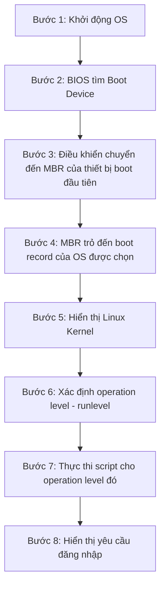

# Chương 6: Linux Administration

---

## 1. Tổng Quan về Linux

### 1.1. Linux là gì?

Linux là sự kết hợp của phần mềm được gọi là **GNU/Linux**:

- **GNU**: Tập hợp phần mềm tự do (free software) cung cấp các công cụ tương đương mã nguồn mở so với UNIX.
- **Linux Kernel**: Nhân hệ điều hành — thành phần cốt lõi quản lý tài nguyên phần cứng và cung cấp dịch vụ cho các chương trình.

Lịch sử Linux gắn liền với UNIX — hệ điều hành được phát triển vào cuối những năm 1960 tại Bell Labs. Linus Torvalds tạo ra Linux Kernel năm 1991 và phát hành mã nguồn mở, từ đó phong trào Open Source phát triển mạnh mẽ.

### 1.2. Linux là Open Source

Trong lịch sử, hầu hết phần mềm được phát hành theo **closed-source license** (giấy phép mã nguồn đóng):

- Người dùng chỉ nhận được quyền sử dụng file thực thi (executable / machine code).
- Không thể xem hoặc chỉnh sửa mã nguồn.

**Triết lý Open Source** (Mã nguồn mở):

- Bạn có quyền lấy mã nguồn phần mềm.
- Bạn có quyền chỉnh sửa cho mục đích sử dụng của mình.
- Phần lớn bản phân phối Linux hiện nay đều miễn phí và cho phép tùy biến sâu.

!!! info "Tại sao Open Source quan trọng?"
    Open Source tạo ra sự minh bạch trong phần mềm — bất kỳ ai cũng có thể kiểm tra mã nguồn để phát hiện lỗ hổng bảo mật, bug, hoặc hành vi độc hại. Đây là nền tảng của bảo mật trong chuỗi cung ứng phần mềm hiện đại.

### 1.3. Kiến Trúc Linux

```
+------------------+
|   Người dùng     |
+------------------+
|   Shell          |  <-- Giao diện dòng lệnh
+------------------+
|   Ứng dụng       |  <-- Trình duyệt, editor, dịch vụ
+------------------+
|   Tiện ích       |  <-- Các lệnh hệ thống (ls, cp, grep...)
+------------------+
|   Kernel         |  <-- Nhân hệ điều hành
+------------------+
|   Phần cứng      |  <-- CPU, RAM, Disk, Network
+------------------+
```

#### Shell

Shell là **giao diện dòng lệnh** cho phép người dùng tương tác với hệ điều hành bằng cách gõ lệnh. Shell nhận lệnh từ người dùng, chuyển tiếp cho kernel thực thi, sau đó trả kết quả về.

Các loại shell phổ biến trong Linux:

| Shell | Dấu nhắc | Mô tả |
|---|---|---|
| C Shell (csh/tcsh) | `%` | Cú pháp gần giống ngôn ngữ C |
| Bourne Shell (sh) | `$` | Shell truyền thống của UNIX |
| Bourne Again Shell (bash) | `$` | Phổ biến nhất, mặc định trên hầu hết distro |
| Korn Shell (ksh) | `$` | Kết hợp tính năng sh và csh |
| Z Shell (zsh) | `%` | Shell hiện đại, tính năng mạnh |

#### Kernel

Kernel là **trung tâm của Linux**, có vai trò:

- Làm cầu nối giữa ứng dụng và phần cứng (hardware abstraction layer).
- Quản lý bộ nhớ, tiến trình, thiết bị vào/ra, hệ thống file.
- Sử dụng **swap space** (không gian hoán đổi trên đĩa) để lưu trữ dữ liệu tiến trình khi RAM không đủ.

!!! note "Swap Space"
    Swap là phân vùng hoặc file trên ổ cứng được kernel dùng như RAM mở rộng. Khi RAM đầy, kernel di chuyển các trang bộ nhớ ít dùng ra swap. Hiệu năng chậm hơn RAM nhiều lần nhưng giúp hệ thống không bị crash do thiếu bộ nhớ.

### 1.4. Các Bản Phân Phối Linux (Distro)

Bản phân phối Linux (Linux distribution) = Linux Kernel + GNU tools + phần mềm bổ sung + trình quản lý gói.

Các distro phổ biến:

=== "Dòng Red Hat"
    - **Red Hat Enterprise Linux (RHEL)**: Thương mại, dùng trong doanh nghiệp.
    - **CentOS**: Phiên bản miễn phí của RHEL (nay là CentOS Stream).
    - **Fedora**: Cộng đồng, thử nghiệm tính năng mới.

=== "Dòng Debian"
    - **Debian**: Ổn định, mã nguồn mở hoàn toàn.
    - **Ubuntu**: Dễ dùng, phổ biến nhất cho desktop/server.
    - **Kubuntu, Xubuntu**: Ubuntu với desktop environment khác.

=== "Dòng khác"
    - **SUSE / openSUSE**: Phổ biến ở châu Âu.
    - **Gentoo**: Tự biên dịch từ nguồn, tối ưu cao.
    - **Slackware**: Một trong những distro lâu đời nhất.
    - **FreeBSD**: Kỹ thuật mạnh, không hoàn toàn là Linux.

---

## 2. Cài Đặt Linux OS

### 2.1. Quá Trình Khởi Động (Booting)

Khi bật máy tính, hệ điều hành Linux được nạp theo 8 bước:



!!! info "MBR là gì?"
    **MBR (Master Boot Record)** là 512 byte đầu tiên của ổ đĩa, chứa bootloader và bảng phân vùng. Bootloader (như GRUB) chịu trách nhiệm nạp kernel Linux vào bộ nhớ.

**Runlevel** (mức vận hành) xác định trạng thái hoạt động của hệ thống:

| Runlevel | Ý nghĩa |
|---|---|
| 0 | Tắt máy (Halt) |
| 1 | Single-user mode (khôi phục) |
| 3 | Multi-user, không có GUI |
| 5 | Multi-user, có GUI |
| 6 | Khởi động lại (Reboot) |

### 2.2. Dòng Lệnh Linux

#### Cấu trúc lệnh

```
Command  [options]  [arguments]
```

- **Command**: Tên lệnh cần thực thi.
- **Options**: Tùy chọn thay đổi hành vi mặc định của lệnh, thường bắt đầu bằng `-` (short) hoặc `--` (long).
- **Arguments**: Thông tin bổ sung cho lệnh (ví dụ: tên file, đường dẫn).

```bash
# Ví dụ đầy đủ
[root@server01 home]# ls -a -l /etc

# Kết hợp options
[root@server01 home]# ls -al /etc
```

#### Phím tắt Terminal

| Phím tắt | Chức năng |
|---|---|
| `Ctrl + C` | Hủy lệnh đang chạy |
| `Ctrl + D` | End-of-file (thoát shell hoặc kết thúc input) |
| `Ctrl + \` | Thoát lệnh đang thực thi (mạnh hơn Ctrl+C) |
| `Ctrl + S` | Dừng hiển thị output |
| `Ctrl + Q` | Tiếp tục hiển thị output |
| `Ctrl + H` | Xóa 1 ký tự |
| `Ctrl + W` | Xóa 1 từ |
| `↑ / ↓` | Duyệt lịch sử lệnh |

#### Các lệnh cơ bản

| Lệnh | Chức năng |
|---|---|
| `date` | Hiển thị ngày giờ hệ thống |
| `who` | Hiển thị người dùng đang đăng nhập |
| `pwd` | Hiển thị thư mục hiện tại |
| `cal` | Hiển thị lịch |
| `ps` | Hiển thị các tiến trình đang chạy |
| `ls` | Liệt kê file/thư mục |
| `head` | Hiển thị phần đầu của file |
| `tail` | Hiển thị phần cuối của file |
| `hostname` | Hiển thị hoặc thay đổi tên máy |
| `passwd` | Đổi mật khẩu người dùng |
| `su` | Chuyển sang người dùng khác |

#### Xem trợ giúp (man pages)

```bash
# Xem manual của lệnh
man ls

# Tìm kiếm theo từ khóa
man -k keyword

# Xem dạng info
info ls
```

Trong trang man:

| Phím | Chức năng |
|---|---|
| `Space` | Trang tiếp theo |
| `q` | Thoát |
| `/keyword` | Tìm kiếm từ khóa |
| `n` | Tìm kết quả tiếp theo |

### 2.3. Đăng Nhập Hệ Thống

```
Login: <username>
Password: <password>

# Sau khi đăng nhập thành công:
[username@computername folder]#

# Ví dụ:
[root@server01 home]#
```

- Dấu `#` cho biết đang ở tài khoản **root** (superuser).
- Dấu `$` cho biết đang ở tài khoản người dùng thường.

```bash
# Đăng xuất
exit
# hoặc
logout
```

### 2.4. Tắt và Khởi Động Lại

=== "Tắt máy (Shutdown)"
    ```bash
    # Chuyển về runlevel 0
    init 0

    # Tắt sau t phút
    shutdown -hy t

    # Tắt ngay lập tức
    shutdown -h now

    # Tắt nguồn
    halt
    poweroff
    ```

=== "Khởi động lại (Reboot)"
    ```bash
    # Chuyển về runlevel 6
    init 6

    # Khởi động lại
    reboot

    # Khởi động lại sau t phút
    shutdown -ry t

    # Khởi động lại ngay
    shutdown -r now
    ```

---

## 3. Quản Trị Người Dùng và Nhóm

### 3.1. Khái Niệm Cơ Bản

**User Account (Tài khoản người dùng)**:

- Mỗi người dùng có một **username** duy nhất và một **UID (User ID)** duy nhất.
- Mỗi người dùng thuộc ít nhất 1 **primary group** (nhóm chính).

**Group (Nhóm)**:

- Mỗi nhóm có một **group name** duy nhất và một **GID (Group ID)** duy nhất.
- Một nhóm có thể có 1 hoặc nhiều thành viên.

!!! warning "Lưu ý"
    - Username và group name là duy nhất trong hệ thống.
    - UID và GID có thể trùng nhau (cùng số nhưng một là người dùng, một là nhóm).

**Home Directory (Thư mục home)**:

- Mỗi người dùng có một thư mục home riêng, thường là `/home/username`.
- Chứa dữ liệu cá nhân và file cấu hình của người dùng.

**Skeleton Directory** (`/etc/skel/`):

- Chứa các file và thư mục mặc định sẽ được sao chép vào thư mục home khi tạo người dùng mới.

### 3.2. Root — Tài Khoản Superuser

Root là tài khoản quản trị viên có **toàn quyền** trên hệ thống. UID của root là **0**.

!!! danger "Rủi ro khi đăng nhập trực tiếp bằng root"
    - Mọi tiến trình chạy trong phiên làm việc đều chạy với quyền root — bao gồm cả malware.
    - Có thể vô tình quên mình đang chạy với quyền root và thực hiện các lệnh nguy hiểm.
    - Có thể vô tình chạy các tác vụ không cần quyền admin với quyền cao nhất.

**Thực hành tốt hơn**: Sử dụng `sudo` hoặc `su` thay vì đăng nhập trực tiếp bằng root.

```bash
# Chuyển sang root tạm thời
su -

# Thực thi một lệnh với quyền root
sudo command

# Ví dụ
sudo apt update
```

### 3.3. Quản Trị Người Dùng

#### Tạo người dùng — `useradd`

```bash
useradd [options] username
```

| Option | Mô tả |
|---|---|
| `-c "mô tả"` | Thêm thông tin mô tả tài khoản |
| `-m` | Tạo thư mục home nếu chưa tồn tại |
| `-u uid` | Chỉ định UID cụ thể |
| `-G group1,group2` | Danh sách nhóm phụ (supplementary groups) |
| `-d /home/dir` | Chỉ định đường dẫn thư mục home |
| `-g groupname` | Chỉ định nhóm chính (primary group) |

```bash
# Ví dụ tạo người dùng
useradd -g studs -c "Student 01" stud01

# Ví dụ đầy đủ
useradd -u 1000 -g users -G wheel,research -c 'Jane Doe' jane
```

Sau khi tạo, thông tin được tự động thêm vào:
- `/etc/passwd` — thông tin tài khoản
- `/var/spool/mail/username` — hộp thư hệ thống

#### Đặt mật khẩu — `passwd`

```bash
# Người dùng tự đổi mật khẩu
passwd

# Admin đặt mật khẩu cho người dùng khác
passwd jane
```

```
root@localhost:~# passwd jane
Enter new UNIX password:
BAD PASSWORD: it is WAY too short
BAD PASSWORD: is too simple
Retype new UNIX password:
```

!!! info "Quy tắc mật khẩu"
    Hệ thống sẽ cảnh báo nếu mật khẩu quá ngắn hoặc quá đơn giản. Admin có thể cấu hình chính sách mật khẩu trong `/etc/login.defs` và `/etc/pam.d/`.

#### Sửa đổi người dùng — `usermod`

```bash
usermod [options] username
```

| Option ngắn | Option dài | Mô tả |
|---|---|---|
| `-c COMMENT` | `--comment COMMENT` | Thay đổi thông tin mô tả |
| `-d HOME_DIR` | `--home HOME_DIR` | Thay đổi thư mục home |
| `-e EXPIRE_DATE` | `--expiredate DATE` | Đặt ngày hết hạn tài khoản |
| `-l NEW_NAME` | `--login NEW_NAME` | Đổi tên đăng nhập |
| `-G group1,group2` | `--groups` | Thay đổi danh sách nhóm phụ |
| `-L` | `--lock` | Khóa tài khoản |
| `-U` | `--unlock` | Mở khóa tài khoản |

```bash
# Kiểm tra người dùng có đang đăng nhập không
who
w
last
```

#### Xóa người dùng — `userdel`

```bash
# Xóa người dùng, giữ lại thư mục home
userdel jane

# Xóa người dùng và thư mục home
userdel -r jane
```

!!! warning "Lưu ý khi xóa người dùng"
    Khi xóa người dùng, cần kiểm tra xem người dùng có đang đăng nhập không (dùng `who`, `w`, `last`). Nếu xóa mà không dùng `-r`, thư mục home vẫn còn trên đĩa và trở thành "orphaned" (không có chủ sở hữu).

### 3.4. Quản Trị Nhóm

#### Xem thông tin nhóm

```bash
# Tìm kiếm nhóm trong /etc/group
grep root /etc/group

# Xem thông tin nhóm
getent group root
```

Output:
```
root:x:0:
```

Định dạng file `/etc/group`:
```
groupname:password:GID:member1,member2,...
```

#### Tạo nhóm — `groupadd`

```bash
# Tạo nhóm với GID cụ thể
groupadd -g 506 research

# Tạo nhóm, tự động gán GID
groupadd development
```

```bash
root@localhost:~# grep research /etc/group
research:x:506:

root@localhost:~# grep development /etc/group
development:x:507:
```

**Lưu ý về GID**:

- GID dưới 1000 thường được dành cho tài khoản hệ thống.
- Tránh tạo GID trùng với khoảng UID để tránh nhầm lẫn.

#### Quy tắc đặt tên nhóm

- Ký tự đầu tiên: chữ cái hoặc dấu `_`.
- Các ký tự tiếp theo: chữ cái, số, dấu `_`, dấu `-`.
- Không quá 16 ký tự.
- Ký tự cuối không nên là dấu `-`.

#### Sửa đổi nhóm — `groupmod`

```bash
# Đổi tên nhóm (từ sales thành clerks)
groupmod -n clerks sales

# Thay đổi GID
groupmod -g 10003 clerks
```

!!! warning "Nguy hiểm khi thay đổi GID"
    Thay đổi tên nhóm không gây vấn đề về quyền truy cập. Tuy nhiên, **thay đổi GID** sẽ khiến các file thuộc nhóm cũ không còn liên kết với nhóm mới. Dùng lệnh `find` với `-nogroup` để tìm file mồ côi:
    ```bash
    find / -nogroup
    ```

#### Xóa nhóm — `groupdel`

```bash
groupdel clerks
```

- Chỉ có thể xóa nhóm phụ (supplementary groups), không thể xóa nhóm chính của bất kỳ người dùng nào.
- Các file thuộc nhóm bị xóa sẽ trở thành orphaned.

### 3.5. Các File Cấu Hình Người Dùng/Nhóm

| File | Nội dung |
|---|---|
| `/etc/passwd` | Thông tin tài khoản người dùng (username, UID, GID, home, shell) |
| `/etc/shadow` | Mật khẩu đã mã hóa và chính sách mật khẩu |
| `/etc/group` | Thông tin nhóm |
| `/etc/login.defs` | Cấu hình mặc định cho tài khoản (UID range, GID range, chính sách mật khẩu) |
| `/etc/default/useradd` | Giá trị mặc định khi tạo người dùng mới |

??? details "Định dạng /etc/passwd"
    ```
    username:x:UID:GID:GECOS:home_directory:shell
    
    Ví dụ:
    jane:x:1000:1000:Jane Doe:/home/jane:/bin/bash
    ```
    - `x` ở trường mật khẩu có nghĩa mật khẩu được lưu trong `/etc/shadow`.
    - **GECOS**: Thông tin mô tả (tên đầy đủ, phòng ban, v.v.)

??? details "Định dạng /etc/shadow"
    ```
    username:hashed_password:last_change:min:max:warn:inactive:expire:reserved
    ```
    - `hashed_password`: Mật khẩu đã được hash (bcrypt, SHA-512, v.v.)
    - `last_change`: Ngày đổi mật khẩu lần cuối (tính từ 1/1/1970)
    - `min/max`: Số ngày tối thiểu/tối đa giữa các lần đổi mật khẩu

---

## 4. Lệnh Quản Lý Mạng

### 4.1. Cấu Hình Network Interface

Khi cấu hình mạng, cần xác định:

- **Có dây (Wired) hay không dây (Wireless)?** — Wireless có thêm cấu hình bảo mật (WPA2, WPA3).
- **DHCP hay Static IP?**
    - **DHCP**: Server cấp phát IP tự động, subnet mask, gateway, DNS.
    - **Static**: Cấu hình thủ công địa chỉ IP và các thông số mạng.

#### File cấu hình mạng (CentOS/RHEL)

```bash
# Xem file cấu hình
cat /etc/sysconfig/network-scripts/ifcfg-eth0
```

```ini
# Cấu hình DHCP
DEVICE="eth0"
BOOTPROTO=dhcp
NM_CONTROLLED="yes"
ONBOOT=yes
```

```ini
# Cấu hình Static IP
DEVICE="eth0"
BOOTPROTO=none
IPADDR=192.168.1.100
NETMASK=255.255.255.0
GATEWAY=192.168.1.1
DNS1=8.8.8.8
ONBOOT=yes
```

#### Cấu hình IPv6

Thêm vào file `/etc/sysconfig/network-scripts/ifcfg-eth0`:

```ini
IPV6INIT=yes
IPV6ADDR=<IPv6 IP Address>
IPV6_DEFAULTGW=<IPv6 IP Gateway Address>
```

### 4.2. DNS — Domain Name Service

DNS chuyển đổi tên miền thành địa chỉ IP và ngược lại.

#### Ba file quan trọng cho name resolution

| File | Chức năng |
|---|---|
| `/etc/hosts` | Bảng tra cứu hostname-to-IP tĩnh, ưu tiên đầu tiên |
| `/etc/resolv.conf` | Địa chỉ IP của DNS server |
| `/etc/nsswitch.conf` | Thứ tự tra cứu hostname (hosts → dns hoặc ngược lại) |

```bash
# Ví dụ /etc/hosts
127.0.0.1   localhost
192.168.1.10  server01.example.com  server01

# Ví dụ /etc/resolv.conf
nameserver 8.8.8.8
nameserver 8.8.4.4
search example.com
```

!!! info "Thứ tự name resolution"
    Theo mặc định trong `/etc/nsswitch.conf`, hệ thống tra cứu theo thứ tự: `files` (tức `/etc/hosts`) trước, rồi mới đến `dns`. Điều này có nghĩa `/etc/hosts` luôn được ưu tiên.

### 4.3. Các Lệnh Network Quan Trọng

#### `ifconfig` — Xem cấu hình giao diện mạng (cũ)

```bash
ifconfig
```

```
eth0  Link encap:Ethernet  HWaddr b6:84:ab:e9:8f:0a
      inet addr:192.168.1.2  Bcast:0.0.0.0  Mask:255.255.255.0
      inet6 addr: fe80::b484:abff:fee9:8f0a/64 Scope:Link
      UP BROADCAST RUNNING MULTICAST  MTU:1500  Metric:1
      RX packets:95 errors:0 dropped:4 overruns:0 frame:0
      TX packets:9 errors:0 dropped:0 overruns:0 carrier:0
      RX bytes:25306 (25.3 KB)  TX bytes:690 (690.0 B)
```

Thông tin quan trọng trong output:
- `HWaddr`: Địa chỉ MAC (địa chỉ vật lý)
- `inet addr`: Địa chỉ IPv4
- `Mask`: Subnet mask
- `inet6 addr`: Địa chỉ IPv6
- `RX/TX packets`: Số gói tin nhận/gửi

#### `ip` — Lệnh thay thế ifconfig (mới)

```bash
# Cú pháp
ip [OPTIONS] OBJECT COMMAND

# Xem địa chỉ IP
ip addr show
ip a

# Xem routing table
ip route show
ip r

# Bật/tắt interface
ip link set eth0 up
ip link set eth0 down

# Gán IP tạm thời
ip addr add 192.168.1.100/24 dev eth0
```

!!! tip "ifconfig vs ip"
    `ifconfig` là lệnh cũ (net-tools package), đang dần bị thay thế. `ip` (từ iproute2 package) có nhiều tính năng hơn và là tiêu chuẩn trên các hệ thống Linux hiện đại.

#### `route` — Xem bảng định tuyến

```bash
route
```

```
Kernel IP routing table
Destination  Gateway      Genmask        Flags  Metric  Ref  Use  Iface
192.168.1.0  *            255.255.255.0  U      0       0    0    eth0
default      192.168.1.1  0.0.0.0        UG     0       0    0    eth0
```

Giải thích:
- `192.168.1.0` với gateway `*`: Mạng cục bộ, gửi trực tiếp không qua gateway.
- `default` với gateway `192.168.1.1`: Mọi gói tin đến mạng khác đều được chuyển qua gateway này.

#### `ping` — Kiểm tra kết nối mạng

```bash
# Ping liên tục (Ctrl+C để dừng)
ping 192.168.1.1

# Ping giới hạn số lần
ping -c 4 192.168.1.1

# Ping theo tên miền
ping google.com
```

Output thành công:
```
64 bytes from 192.168.1.2: icmp_req=1 ttl=64 time=0.051 ms
```

Output thất bại:
```
From 192.168.1.2 icmp_seq=1 Destination Host Unreachable
```

!!! note "Ping hoạt động như thế nào?"
    Ping sử dụng giao thức **ICMP (Internet Control Message Protocol)**. Máy gửi ICMP Echo Request đến đích, đích trả lời ICMP Echo Reply. Đây là cách đơn giản nhất để kiểm tra kết nối tầng mạng.

#### `netstat` — Thống kê kết nối mạng

```bash
# Xem bảng định tuyến
netstat -r

# Xem các port đang lắng nghe (TCP)
netstat -tln

# Xem tất cả kết nối
netstat -an

# Xem process sử dụng port
netstat -tulnp
```

```
Active Internet connections (only servers)
Proto  Recv-Q  Send-Q  Local Address      Foreign Address  State
tcp    0       0       192.168.1.2:53     0.0.0.0:*        LISTEN
tcp    0       0       127.0.0.1:53       0.0.0.0:*        LISTEN
```

| Flag | Ý nghĩa |
|---|---|
| `-t` | Kết nối TCP |
| `-u` | Kết nối UDP |
| `-l` | Chỉ hiển thị socket đang LISTEN |
| `-n` | Hiển thị số thay vì tên |
| `-p` | Hiển thị PID/tên process |

!!! tip "ss — Thay thế netstat"
    Lệnh `ss` (socket statistics) hiện đại hơn và nhanh hơn `netstat`. Cú pháp tương tự:
    ```bash
    ss -tulnp
    ```

#### `dig` — Truy vấn DNS chi tiết

```bash
# Tra cứu địa chỉ IP của tên miền
dig example.com

# Tra cứu loại bản ghi cụ thể
dig example.com MX    # Mail exchange
dig example.com NS    # Name server
dig example.com ANY   # Tất cả bản ghi
```

```
; <<>> DiG 9.8.1-P1 <<>> example.com
...
example.com.    86400   IN  A   192.168.1.2
...
```

#### `host` — Tra cứu DNS đơn giản

```bash
# Tra cứu IP từ tên miền
host example.com
# example.com has address 192.168.1.2

# Tra cứu ngược (IP → tên miền)
host 192.168.1.2
# 2.1.168.192.in-addr.arpa domain name pointer example.com.
```

#### `ssh` — Kết nối từ xa an toàn

```bash
# Kết nối đến máy từ xa
ssh username@hostname
ssh bob@test
ssh bob@192.168.1.10

# Chỉ định port
ssh -p 2222 bob@192.168.1.10

# Đăng xuất khỏi phiên SSH
exit
```

```
The authenticity of host 'test (127.0.0.1)' can't be established.
RSA key fingerprint is c2:0d:ff:27:4c:f8:69:a9:c6:3e:13:da:2f:47:e4:c9.
Are you sure you want to continue connecting (yes/no)? yes
Warning: Permanently added 'test' (RSA) to the list of known hosts.
bob@test's password:
bob@test:~$
```

**RSA Key Fingerprint và bảo mật SSH**:

- Lần đầu kết nối, SSH hiển thị fingerprint của server để xác minh danh tính.
- Nếu bạn chọn `yes`, fingerprint được lưu vào `~/.ssh/known_hosts`.
- Lần kết nối sau, SSH so sánh fingerprint. **Nếu không khớp → cảnh báo Man-in-the-Middle Attack**.

!!! danger "SSH và Man-in-the-Middle Attack"
    Nếu nhận được cảnh báo `REMOTE HOST IDENTIFICATION HAS CHANGED`, cần điều tra ngay. Có thể server đã bị thay đổi, hoặc đang bị tấn công MITM. Không nên bỏ qua cảnh báo này.

---

## 5. Dịch Vụ Mạng (Network Services)

### 5.1. Tổng Quan

Các dịch vụ mạng cơ bản trên Linux:

| Dịch vụ | Chức năng |
|---|---|
| **DHCP** | Tự động cấp phát địa chỉ IP cho các máy trong mạng |
| **DNS** | Phân giải tên miền thành địa chỉ IP |
| **Web Server** | Phục vụ nội dung web (HTTP/HTTPS) |
| **File Service** | Chia sẻ file trong mạng (NFS, Samba) |

### 5.2. DHCP (Dynamic Host Configuration Protocol)

DHCP server tự động cấp phát:
- Địa chỉ IP
- Subnet Mask
- Default Gateway
- DNS Server address

!!! note "Quy trình DHCP (DORA)"
    1. **Discover**: Client broadcast tìm DHCP server
    2. **Offer**: Server đề nghị cấp IP
    3. **Request**: Client xác nhận muốn IP đó
    4. **Acknowledge**: Server xác nhận cấp phát

### 5.3. DNS Server

DNS hoạt động theo mô hình phân cấp:
- **Root DNS** → **TLD DNS** (`.com`, `.vn`) → **Authoritative DNS** → Bản ghi

Các loại bản ghi DNS:

| Bản ghi | Ý nghĩa |
|---|---|
| `A` | Ánh xạ hostname → IPv4 |
| `AAAA` | Ánh xạ hostname → IPv6 |
| `MX` | Mail server cho domain |
| `CNAME` | Alias (tên khác) cho hostname |
| `PTR` | Tra cứu ngược (IP → hostname) |
| `NS` | Name server cho zone |

### 5.4. Web Server

Phần mềm web server phổ biến:
- **Apache HTTP Server**: Phổ biến nhất, module-based.
- **Nginx**: Hiệu năng cao, phù hợp reverse proxy.

File cấu hình Apache: `/etc/httpd/conf/httpd.conf`
Document root mặc định: `/var/www/html/`

### 5.5. File Service

- **NFS (Network File System)**: Chia sẻ file giữa các máy Linux/UNIX.
- **Samba**: Chia sẻ file tương thích với Windows (SMB protocol).

---

## Câu Hỏi Trắc Nghiệm

**Câu 1.** Linux Kernel có vai trò chính là gì?
- A. Cung cấp giao diện đồ họa cho người dùng
- B. Làm cầu nối giữa ứng dụng và phần cứng
- C. Quản lý tài khoản người dùng
- D. Cung cấp trình duyệt web

??? info "Đáp án & Giải thích"
    **Đáp án: B**
    Kernel là thành phần trung tâm của Linux, có nhiệm vụ làm cầu nối (bridge) giữa ứng dụng và phần cứng, quản lý bộ nhớ, tiến trình, và các thiết bị.

---

**Câu 2.** GNU trong GNU/Linux là viết tắt của?
- A. General Network Utility
- B. GNU's Not Unix
- C. Global Network Unix
- D. Generic Network User

??? info "Đáp án & Giải thích"
    **Đáp án: B**
    GNU là từ viết tắt đệ quy của "GNU's Not Unix" — dự án của Richard Stallman nhằm tạo ra hệ điều hành tự do tương thích UNIX.

---

**Câu 3.** Triết lý Open Source cho phép người dùng làm gì?
- A. Chỉ sử dụng phần mềm miễn phí
- B. Lấy mã nguồn và chỉnh sửa cho mục đích của mình
- C. Phân phối lại mà không cần giấy phép
- D. Sử dụng phần mềm mà không cần cài đặt

??? info "Đáp án & Giải thích"
    **Đáp án: B**
    Triết lý Open Source là bạn có quyền lấy mã nguồn (source code) và chỉnh sửa cho mục đích sử dụng của mình.

---

**Câu 4.** Shell trong kiến trúc Linux cung cấp chức năng gì?
- A. Quản lý bộ nhớ RAM
- B. Giao diện dòng lệnh cho người dùng tương tác với hệ thống
- C. Kết nối internet
- D. Quản lý driver phần cứng

??? info "Đáp án & Giải thích"
    **Đáp án: B**
    Shell cung cấp command line interface (CLI) cho phép người dùng gõ lệnh, shell nhận và chuyển tiếp cho kernel thực thi.

---

**Câu 5.** Dấu nhắc lệnh nào sau đây cho biết người dùng đang ở tài khoản root?
- A. `$`
- B. `%`
- C. `#`
- D. `@`

??? info "Đáp án & Giải thích"
    **Đáp án: C**
    Dấu `#` là dấu nhắc của root (superuser). Dấu `$` là dấu nhắc của người dùng thường. Dấu `%` thường dùng trong C Shell.

---

**Câu 6.** Bước nào trong quá trình boot xác định runlevel hoạt động?
- A. Bước 2
- B. Bước 4
- C. Bước 6
- D. Bước 8

??? info "Đáp án & Giải thích"
    **Đáp án: C**
    Bước 6 trong quá trình boot là "Identify the operation level" — xác định runlevel để quyết định nhóm dịch vụ nào sẽ được khởi động.

---

**Câu 7.** Lệnh nào dùng để hiển thị thư mục hiện tại?
- A. `ls`
- B. `cd`
- C. `pwd`
- D. `dir`

??? info "Đáp án & Giải thích"
    **Đáp án: C**
    `pwd` (Print Working Directory) hiển thị đường dẫn đầy đủ của thư mục đang làm việc hiện tại.

---

**Câu 8.** Lệnh `shutdown -hy 5` thực hiện điều gì?
- A. Khởi động lại sau 5 giây
- B. Tắt máy sau 5 phút
- C. Tắt nguồn sau 5 giờ
- D. Dừng tất cả dịch vụ sau 5 phút

??? info "Đáp án & Giải thích"
    **Đáp án: B**
    `-h` là halt (tắt máy), `-y` là xác nhận tự động, `5` là sau 5 phút.

---

**Câu 9.** Phím tắt nào dùng để hủy một lệnh đang chạy trong terminal?
- A. `Ctrl + D`
- B. `Ctrl + C`
- C. `Ctrl + Z`
- D. `Ctrl + X`

??? info "Đáp án & Giải thích"
    **Đáp án: B**
    `Ctrl + C` gửi tín hiệu SIGINT để hủy lệnh đang chạy. `Ctrl + D` là end-of-file/thoát. `Ctrl + Z` là suspend (tạm dừng).

---

**Câu 10.** Lệnh nào hiển thị manual của một lệnh?
- A. `help`
- B. `info`
- C. `man`
- D. `doc`

??? info "Đáp án & Giải thích"
    **Đáp án: C**
    `man command` hiển thị trang manual của lệnh. `info` cũng có thể dùng nhưng hiển thị theo định dạng Info format.

---

**Câu 11.** Trong trang `man`, phím nào dùng để thoát?
- A. `x`
- B. `e`
- C. `q`
- D. `Escape`

??? info "Đáp án & Giải thích"
    **Đáp án: C**
    Trong `man` page (sử dụng pager `less`), nhấn `q` để thoát.

---

**Câu 12.** UID của tài khoản root là bao nhiêu?
- A. 1
- B. 100
- C. 0
- D. 999

??? info "Đáp án & Giải thích"
    **Đáp án: C**
    Root luôn có UID = 0. Đây là cách kernel nhận biết một tiến trình có quyền superuser.

---

**Câu 13.** Lệnh `useradd -G wheel,research jane` có ý nghĩa gì?
- A. Tạo người dùng jane với nhóm chính là wheel và research
- B. Tạo người dùng jane với nhóm phụ là wheel và research
- C. Thêm jane vào nhóm wheel và xóa khỏi nhóm research
- D. Tạo hai nhóm mới wheel và research

??? info "Đáp án & Giải thích"
    **Đáp án: B**
    `-G` (viết hoa) chỉ định supplementary groups (nhóm phụ). `-g` (viết thường) mới là nhóm chính (primary group).

---

**Câu 14.** Lệnh nào xóa người dùng VÀ thư mục home?
- A. `userdel jane`
- B. `userdel -r jane`
- C. `userdel -d jane`
- D. `usermod -d jane`

??? info "Đáp án & Giải thích"
    **Đáp án: B**
    `userdel -r` xóa người dùng và thư mục home cùng toàn bộ nội dung. Không có `-r` thì chỉ xóa tài khoản, thư mục home vẫn còn.

---

**Câu 15.** File nào lưu trữ mật khẩu đã mã hóa của người dùng?
- A. `/etc/passwd`
- B. `/etc/password`
- C. `/etc/shadow`
- D. `/etc/login`

??? info "Đáp án & Giải thích"
    **Đáp án: C**
    `/etc/shadow` lưu mật khẩu đã hash (bcrypt/SHA-512) và các chính sách mật khẩu. `/etc/passwd` chỉ lưu thông tin tài khoản (có dấu `x` ở trường mật khẩu).

---

**Câu 16.** GID dưới bao nhiêu thường được dành cho tài khoản hệ thống?
- A. 100
- B. 500
- C. 1000
- D. 65535

??? info "Đáp án & Giải thích"
    **Đáp án: C**
    GID dưới 1000 thường được dành cho system accounts (tài khoản hệ thống). Người dùng thường bắt đầu từ UID/GID 1000.

---

**Câu 17.** Lệnh `groupmod -n clerks sales` thực hiện điều gì?
- A. Đổi tên nhóm clerks thành sales
- B. Đổi tên nhóm sales thành clerks
- C. Thêm clerks vào nhóm sales
- D. Xóa nhóm clerks và sales

??? info "Đáp án & Giải thích"
    **Đáp án: B**
    Cú pháp: `groupmod -n NEW_NAME OLD_NAME`. Vậy nhóm `sales` được đổi tên thành `clerks`.

---

**Câu 18.** Lệnh `find / -nogroup` dùng để làm gì?
- A. Tìm file không có quyền truy cập
- B. Tìm file không thuộc nhóm nào (orphaned files)
- C. Tìm thư mục trống
- D. Tìm file của root

??? info "Đáp án & Giải thích"
    **Đáp án: B**
    Khi xóa hoặc thay đổi GID của nhóm, các file thuộc nhóm cũ sẽ không còn liên kết nhóm (orphaned). `-nogroup` tìm các file này.

---

**Câu 19.** Thư mục `/etc/skel/` có tác dụng gì?
- A. Lưu file cấu hình kernel
- B. Chứa template file/thư mục mặc định cho home directory người dùng mới
- C. Lưu log hệ thống
- D. Chứa script khởi động

??? info "Đáp án & Giải thích"
    **Đáp án: B**
    Khi tạo người dùng mới với `useradd -m`, nội dung `/etc/skel/` được sao chép vào thư mục home mới của người dùng.

---

**Câu 20.** Chỉ loại nhóm nào có thể bị xóa bằng `groupdel`?
- A. Primary group
- B. Supplementary group (nhóm phụ)
- C. System group
- D. Tất cả đều được

??? info "Đáp án & Giải thích"
    **Đáp án: B**
    Chỉ có thể xóa supplementary group. Không thể xóa primary group của bất kỳ người dùng nào đang tồn tại trong hệ thống.

---

**Câu 21.** File `/etc/nsswitch.conf` dùng để làm gì?
- A. Cấu hình DNS server
- B. Cấu hình thứ tự tra cứu hostname (files trước hay dns trước)
- C. Lưu bảng ánh xạ hostname-IP tĩnh
- D. Cấu hình network interface

??? info "Đáp án & Giải thích"
    **Đáp án: B**
    `/etc/nsswitch.conf` xác định thứ tự các nguồn tra cứu cho các loại thông tin, bao gồm hostname resolution (hosts: files dns).

---

**Câu 22.** Lệnh `ifconfig` hiển thị thông tin gì?
- A. Danh sách các tiến trình mạng
- B. Cấu hình giao diện mạng (IP, MAC, trạng thái)
- C. Bảng định tuyến
- D. Danh sách port đang mở

??? info "Đáp án & Giải thích"
    **Đáp án: B**
    `ifconfig` (interface configuration) hiển thị thông tin cấu hình mạng: địa chỉ IP, địa chỉ MAC, subnet mask, IPv6, trạng thái interface, thống kê gói tin.

---

**Câu 23.** Trong output của `ifconfig`, `HWaddr` là gì?
- A. Hostname Address
- B. Hard disk Address
- C. Hardware (MAC) Address
- D. HTTP Web Address

??? info "Đáp án & Giải thích"
    **Đáp án: C**
    `HWaddr` là Hardware Address, tức địa chỉ MAC (Media Access Control) — định danh vật lý duy nhất của card mạng.

---

**Câu 24.** Lệnh `ip addr show` tương đương với lệnh nào (cũ hơn)?
- A. `route`
- B. `netstat`
- C. `ifconfig`
- D. `ping`

??? info "Đáp án & Giải thích"
    **Đáp án: C**
    `ip addr show` là lệnh mới thay thế `ifconfig` để hiển thị thông tin địa chỉ IP của các network interface.

---

**Câu 25.** Bảng định tuyến (routing table) cho biết điều gì?
- A. Danh sách các DNS server
- B. Các kết nối TCP đang hoạt động
- C. Đường đi của gói tin đến các mạng khác nhau
- D. Danh sách người dùng đang đăng nhập

??? info "Đáp án & Giải thích"
    **Đáp án: C**
    Routing table xác định: gói tin đến mạng nào thì đi qua gateway nào, hoặc gửi trực tiếp qua interface nào.

---

**Câu 26.** Lệnh `ping -c 4 192.168.1.1` có ý nghĩa gì?
- A. Ping 4 địa chỉ IP khác nhau
- B. Ping với 4 byte data
- C. Ping 4 lần rồi dừng
- D. Ping qua 4 router

??? info "Đáp án & Giải thích"
    **Đáp án: C**
    `-c count` giới hạn số lần gửi ICMP Echo Request. `-c 4` sẽ ping 4 lần rồi dừng và hiển thị thống kê.

---

**Câu 27.** Ping sử dụng giao thức nào?
- A. TCP
- B. UDP
- C. ICMP
- D. ARP

??? info "Đáp án & Giải thích"
    **Đáp án: C**
    Ping sử dụng **ICMP (Internet Control Message Protocol)** — cụ thể là ICMP Echo Request và Echo Reply.

---

**Câu 28.** Lệnh `netstat -tln` hiển thị điều gì?
- A. Tất cả kết nối mạng
- B. Các TCP port đang ở trạng thái LISTEN
- C. Bảng định tuyến
- D. Thống kê UDP

??? info "Đáp án & Giải thích"
    **Đáp án: B**
    `-t` = TCP, `-l` = LISTEN, `-n` = hiển thị số thay vì tên. Kết hợp lại: liệt kê các TCP socket đang lắng nghe kết nối.

---

**Câu 29.** Lệnh `dig` khác `host` như thế nào?
- A. `dig` không tra cứu DNS
- B. `dig` cung cấp thông tin chi tiết hơn về kết quả DNS
- C. `host` nhanh hơn và chi tiết hơn
- D. Không có sự khác biệt

??? info "Đáp án & Giải thích"
    **Đáp án: B**
    `dig` (Domain Information Groper) cung cấp output đầy đủ bao gồm: query section, answer section, TTL, record type, flags, và thông tin server DNS. `host` cho output đơn giản hơn.

---

**Câu 30.** Lệnh `host 192.168.1.2` thực hiện kiểu tra cứu DNS nào?
- A. Forward lookup (tên → IP)
- B. Reverse lookup (IP → tên)
- C. MX record lookup
- D. Zone transfer

??? info "Đáp án & Giải thích"
    **Đáp án: B**
    Khi cung cấp địa chỉ IP cho `host`, nó thực hiện **reverse DNS lookup** — tra cứu PTR record để tìm tên miền tương ứng với IP đó.

---

**Câu 31.** Khi SSH lần đầu kết nối đến một server, hệ thống hỏi xác nhận điều gì?
- A. Tên đăng nhập của server
- B. RSA key fingerprint của server
- C. Phiên bản SSH của server
- D. Địa chỉ MAC của server

??? info "Đáp án & Giải thích"
    **Đáp án: B**
    SSH hiển thị fingerprint (hash) của public key của server và hỏi người dùng có tin tưởng không. Đây là bảo vệ chống Man-in-the-Middle attack.

---

**Câu 32.** SSH lưu fingerprint của server đã biết vào file nào?
- A. `/etc/ssh/known_hosts`
- B. `~/.ssh/known_hosts`
- C. `/etc/ssh/authorized_keys`
- D. `~/.ssh/id_rsa`

??? info "Đáp án & Giải thích"
    **Đáp án: B**
    `~/.ssh/known_hosts` trong thư mục home của người dùng lưu fingerprint của tất cả server đã kết nối và được chấp nhận.

---

**Câu 33.** Cấu hình `BOOTPROTO=dhcp` trong file ifcfg-eth0 có nghĩa là?
- A. Interface sẽ không sử dụng IP
- B. Interface sẽ nhận IP tự động từ DHCP server
- C. Interface sẽ dùng IP tĩnh
- D. Interface sẽ dùng IPv6

??? info "Đáp án & Giải thích"
    **Đáp án: B**
    `BOOTPROTO=dhcp` chỉ định giao diện mạng sẽ dùng DHCP để tự động nhận cấu hình IP khi khởi động.

---

**Câu 34.** File `/etc/resolv.conf` chứa thông tin gì?
- A. Danh sách người dùng có quyền dùng DNS
- B. Địa chỉ IP của DNS server để truy vấn
- C. Bảng ánh xạ hostname-IP tĩnh
- D. Cấu hình giao diện mạng

??? info "Đáp án & Giải thích"
    **Đáp án: B**
    `/etc/resolv.conf` chứa địa chỉ của nameserver (DNS server) mà hệ thống sẽ dùng để phân giải tên miền, ví dụ: `nameserver 8.8.8.8`.

---

**Câu 35.** Điểm khác biệt chính giữa DHCP và Static IP là gì?
- A. DHCP chỉ dùng cho IPv6
- B. DHCP tự động cấp phát IP; Static yêu cầu cấu hình thủ công
- C. Static IP chỉ dùng trên wireless
- D. DHCP nhanh hơn Static về tốc độ mạng

??? info "Đáp án & Giải thích"
    **Đáp án: B**
    DHCP (Dynamic Host Configuration Protocol) tự động cấp IP và cấu hình mạng. Static IP yêu cầu admin nhập tay địa chỉ IP, subnet mask, gateway, DNS.

---

**Câu 36.** Lệnh nào dùng để xem bảng định tuyến kernel?
- A. `ifconfig -r`
- B. `netstat -r` hoặc `route`
- C. `ping -r`
- D. `dns -r`

??? info "Đáp án & Giải thích"
    **Đáp án: B**
    Cả `route` và `netstat -r` đều hiển thị kernel routing table. Lệnh mới hơn là `ip route show`.

---

**Câu 37.** Lệnh `init 6` thực hiện điều gì?
- A. Tắt máy
- B. Chuyển sang single-user mode
- C. Khởi động lại hệ thống
- D. Khởi động GUI

??? info "Đáp án & Giải thích"
    **Đáp án: C**
    Runlevel 6 là reboot. `init 6` yêu cầu hệ thống chuyển sang runlevel 6, tức khởi động lại.

---

**Câu 38.** Trong cấu trúc lệnh Linux `ls -al /etc`, phần nào là option?
- A. `ls`
- B. `-al`
- C. `/etc`
- D. Tất cả

??? info "Đáp án & Giải thích"
    **Đáp án: B**
    `ls` là command, `-al` là option (kết hợp `-a` liệt kê file ẩn và `-l` định dạng dài), `/etc` là argument (thư mục cần liệt kê).

---

**Câu 39.** Lệnh `ps` hiển thị điều gì?
- A. Kích thước phân vùng đĩa
- B. Các tiến trình đang chạy
- C. Trạng thái mạng
- D. Thông tin người dùng

??? info "Đáp án & Giải thích"
    **Đáp án: B**
    `ps` (process status) hiển thị danh sách các tiến trình đang chạy trên hệ thống. `ps aux` hiển thị tất cả tiến trình của mọi người dùng.

---

**Câu 40.** Lệnh `tail` khác `head` ở điểm nào?
- A. `tail` hiển thị phần đầu file, `head` hiển thị phần cuối
- B. `tail` hiển thị phần cuối file, `head` hiển thị phần đầu
- C. `tail` dùng cho log, `head` dùng cho text
- D. Không có sự khác biệt

??? info "Đáp án & Giải thích"
    **Đáp án: B**
    `head` hiển thị N dòng đầu (mặc định 10), `tail` hiển thị N dòng cuối. `tail -f` rất hữu ích để theo dõi log file thời gian thực.

---

**Câu 41.** Option `-c` trong lệnh `useradd` dùng để làm gì?
- A. Chỉ định thư mục home
- B. Tạo tài khoản không có mật khẩu
- C. Thêm thông tin mô tả (comment/GECOS) cho tài khoản
- D. Chỉ định UID

??? info "Đáp án & Giải thích"
    **Đáp án: C**
    `-c "comment"` thêm thông tin mô tả vào trường GECOS trong `/etc/passwd`, thường là tên đầy đủ hoặc thông tin liên hệ.

---

**Câu 42.** Lệnh nào kiểm tra người dùng nào đang đăng nhập vào hệ thống?
- A. `ls`
- B. `ps`
- C. `who`
- D. `id`

??? info "Đáp án & Giải thích"
    **Đáp án: C**
    `who` hiển thị danh sách người dùng đang đăng nhập, terminal họ đang dùng, và thời gian đăng nhập. `w` cho thêm thông tin về họ đang làm gì.

---

**Câu 43.** Để cấu hình IPv6 trên CentOS, cần thêm tham số nào vào file ifcfg?
- A. `IPV6=yes`
- B. `IPV6INIT=yes` cùng với địa chỉ và gateway
- C. `INET6=enable`
- D. `PROTOCOL=ipv6`

??? info "Đáp án & Giải thích"
    **Đáp án: B**
    Cần thêm `IPV6INIT=yes`, `IPV6ADDR=<địa chỉ>`, và `IPV6_DEFAULTGW=<gateway>` vào file `/etc/sysconfig/network-scripts/ifcfg-eth0`.

---

**Câu 44.** Lệnh `getent group root` cho kết quả gì?
- A. Danh sách tất cả người dùng trong hệ thống
- B. Thông tin về nhóm root từ database nhóm
- C. Quyền của nhóm root
- D. Tất cả file thuộc nhóm root

??? info "Đáp án & Giải thích"
    **Đáp án: B**
    `getent group root` truy vấn database nhóm (kể cả LDAP nếu có) và trả về thông tin nhóm root theo định dạng: `root:x:0:`.

---

**Câu 45.** Khi thay đổi GID của một nhóm bằng `groupmod -g`, điều gì xảy ra với các file thuộc nhóm cũ?
- A. Tự động cập nhật GID mới
- B. Bị xóa
- C. Trở thành orphaned (không còn liên kết nhóm)
- D. Được chuyển sang nhóm root

??? info "Đáp án & Giải thích"
    **Đáp án: C**
    File được liên kết với GID, không phải tên nhóm. Khi GID thay đổi, các file vẫn giữ GID cũ nhưng không còn nhóm nào có GID đó → orphaned files.

---

**Câu 46.** Lệnh `man -k keyword` thực hiện gì?
- A. Mở manual với từ khóa được tô sáng
- B. Tìm kiếm tất cả manual page có chứa từ khóa
- C. Xem manual của lệnh tên keyword
- D. Lọc manual theo section

??? info "Đáp án & Giải thích"
    **Đáp án: B**
    `man -k keyword` tìm kiếm trong database manual tất cả các lệnh/chủ đề có liên quan đến từ khóa. Tương đương với lệnh `apropos keyword`.

---

**Câu 47.** Trong output `route`, dòng có Destination là `default` và Gateway là `192.168.1.1` có nghĩa gì?
- A. Tất cả gói tin đến 192.168.1.1 sẽ bị từ chối
- B. Gói tin không khớp route nào khác sẽ được chuyển đến 192.168.1.1
- C. 192.168.1.1 là DNS server mặc định
- D. Interface mặc định là 192.168.1.1

??? info "Đáp án & Giải thích"
    **Đáp án: B**
    Default route (default gateway) là nơi chuyển tất cả gói tin đến các mạng không có trong routing table. Đây là "cổng ra Internet" của mạng nội bộ.

---

**Câu 48.** Lệnh nào thay thế `netstat` trên hệ thống Linux hiện đại?
- A. `nstat`
- B. `ss`
- C. `sockstat`
- D. `ipstat`

??? info "Đáp án & Giải thích"
    **Đáp án: B**
    `ss` (socket statistics) là lệnh hiện đại thay thế `netstat`, nhanh hơn và cung cấp nhiều thông tin hơn. Cú pháp tương tự: `ss -tulnp`.

---

**Câu 49.** Swap space trong Linux có chức năng gì?
- A. Lưu trữ các file tạm thời của người dùng
- B. Mở rộng bộ nhớ RAM bằng cách dùng không gian đĩa
- C. Cache cho ổ đĩa
- D. Phân vùng backup hệ thống

??? info "Đáp án & Giải thích"
    **Đáp án: B**
    Swap là phần không gian đĩa được kernel sử dụng như RAM ảo. Khi RAM đầy, kernel di chuyển các trang bộ nhớ ít dùng ra swap để giải phóng RAM cho tiến trình cần.

---

**Câu 50.** Tại sao không nên thường xuyên đăng nhập trực tiếp bằng tài khoản root?
- A. Root không thể chạy tất cả lệnh
- B. Mọi tiến trình đều chạy với quyền root, tăng nguy cơ bảo mật và lỗi vô ý
- C. Root không có thư mục home
- D. Root không thể kết nối mạng

??? info "Đáp án & Giải thích"
    **Đáp án: B**
    Đăng nhập root trực tiếp nguy hiểm vì: (1) mọi tiến trình chạy với full privilege, (2) malware/script lỗi có thể phá hoại toàn hệ thống, (3) dễ vô tình thực thi lệnh nguy hiểm. Nên dùng `sudo` để chỉ nâng quyền khi cần.

---

**Câu 51.** Lệnh `groupadd` không có option `-g` sẽ xảy ra điều gì?
- A. Lệnh sẽ thất bại
- B. GID tự động được gán bởi hệ thống
- C. Nhóm được tạo với GID = 0
- D. Yêu cầu nhập GID thủ công

??? info "Đáp án & Giải thích"
    **Đáp án: B**
    Khi không chỉ định `-g`, `groupadd` tự động gán GID tiếp theo có sẵn (thường GID kế tiếp sau GID cao nhất hiện có).

---

**Câu 52.** File `/etc/hosts` có tác dụng gì trong name resolution?
- A. Lưu cấu hình DNS server
- B. Cung cấp bảng ánh xạ hostname-IP tĩnh, ưu tiên trước DNS
- C. Lưu lịch sử các domain đã truy cập
- D. Chặn các domain độc hại

??? info "Đáp án & Giải thích"
    **Đáp án: B**
    `/etc/hosts` chứa các mục hostname-to-IP tĩnh. Theo mặc định, nó được tra cứu trước DNS. Hữu ích cho môi trường lab, testing, hoặc ghi đè DNS.

---

**Câu 53.** Lệnh `ip link set eth0 down` thực hiện điều gì?
- A. Xóa interface eth0
- B. Tắt (disable) network interface eth0
- C. Đặt tốc độ eth0 xuống thấp nhất
- D. Ngắt kết nối SSH qua eth0

??? info "Đáp án & Giải thích"
    **Đáp án: B**
    `ip link set INTERFACE down` tắt network interface. `up` để bật lại. Tương đương: `ifconfig eth0 down`.

---

**Câu 54.** Lệnh `last` hiển thị điều gì?
- A. File được chỉnh sửa gần nhất
- B. Lịch sử đăng nhập của người dùng
- C. Lệnh cuối cùng được thực thi
- D. Người dùng cuối cùng được tạo

??? info "Đáp án & Giải thích"
    **Đáp án: B**
    `last` đọc file `/var/log/wtmp` và hiển thị lịch sử đăng nhập/đăng xuất của người dùng, bao gồm thời gian và terminal/IP nguồn.

---

**Câu 55.** Khi SSH nhận cảnh báo "REMOTE HOST IDENTIFICATION HAS CHANGED", nguyên nhân có thể là?
- A. Server vừa được nâng cấp SSH
- B. Có thể có tấn công Man-in-the-Middle hoặc server đã được cài đặt lại
- C. Mật khẩu SSH đã hết hạn
- D. Kết nối mạng không ổn định

??? info "Đáp án & Giải thích"
    **Đáp án: B**
    Cảnh báo này xuất hiện khi fingerprint của server thay đổi so với lần trước. Có thể do server được cài lại (hợp lệ) hoặc có kẻ tấn công đứng giữa (Man-in-the-Middle). Cần xác minh trước khi tiếp tục.
