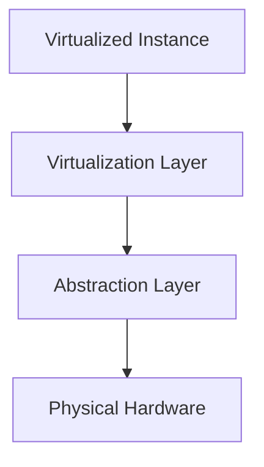
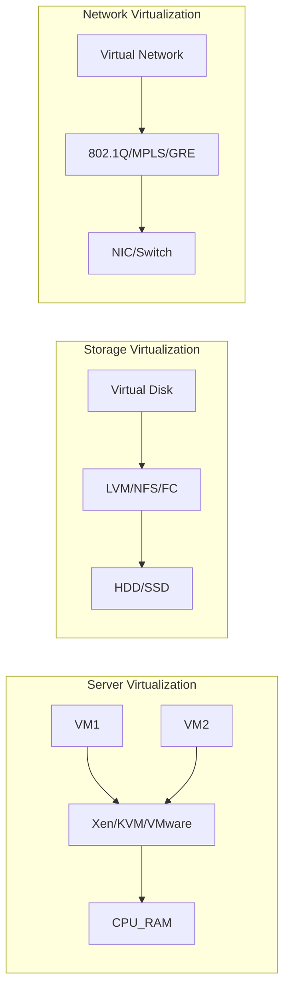

# Chương 8: Ảo Hóa (Virtualization) — Tài liệu học tập mở rộng

---

## 1. Ảo Hóa Là Gì?

**Ảo hóa (Virtualization)** là quá trình tạo ra một phiên bản ảo (thay vì vật lý) của tài nguyên máy tính — bao gồm phần cứng, hệ điều hành, thiết bị lưu trữ hoặc tài nguyên mạng.

Ảo hóa **che giấu các đặc tính vật lý** của tài nguyên khỏi người dùng hoặc ứng dụng sử dụng chúng, cho phép nhiều môi trường độc lập cùng tồn tại trên một nền tảng vật lý.

!!! info "Tại sao ảo hóa quan trọng?"
    - Tận dụng tối đa phần cứng (tránh lãng phí tài nguyên)
    - Cô lập môi trường — lỗi ở VM này không ảnh hưởng VM khác
    - Dễ dàng triển khai, sao lưu, khôi phục hệ thống
    - Nền tảng của điện toán đám mây hiện đại

---

## 2. Các Tầng Trừu Tượng Trong Hệ Thống Máy Tính

Hệ thống máy tính được xây dựng theo **nhiều tầng trừu tượng chồng lên nhau**. Mỗi tầng cao hơn ẩn đi chi tiết của tầng bên dưới, cung cấp một giao diện đơn giản hơn cho tầng trên.

```
┌─────────────────────────────┐
│     Application Programs    │  ← Tầng ứng dụng
├─────────────────────────────┤
│         Libraries           │  ← Thư viện (API)
├─────────────────────────────┤
│      Operating System       │  ← Hệ điều hành (ABI)
├─────────────────────────────┤
│    Execution Hardware       │  ← Phần cứng thực thi (ISA)
├─────────────────────────────┤
│     Memory Translation      │
├─────────────────────────────┤
│  System Interconnect (Bus)  │
├─────────────────────────────┤
│  I/O Devices & Networking   │
├─────────────────────────────┤
│        Main Memory          │
└─────────────────────────────┘
```

### 2.1. Tầng Máy (Machine Level) — ISA

**ISA (Instruction Set Architecture)** là ranh giới quan trọng nhất, phân chia phần cứng và phần mềm.

- Dành cho các nhà phát triển **hệ điều hành**.
- Định nghĩa tập lệnh mà CPU hỗ trợ (x86, ARM, MIPS...).
- Gồm hai phần:
    - **User ISA**: Lệnh mà ứng dụng người dùng có thể thực thi.
    - **System ISA**: Lệnh chỉ OS mới được phép thực thi (privileged instructions).

!!! example "Ví dụ"
    Intel x86-64 và ARM64 là hai ISA khác nhau. Một chương trình biên dịch cho x86 không thể chạy trực tiếp trên ARM mà không có lớp dịch thuật (emulation hoặc recompilation).

### 2.2. Tầng OS (ABI — Application Binary Interface)

- Dành cho các nhà phát triển **compiler** và **thư viện**.
- **ABI** định nghĩa giao diện ở cấp nhị phân giữa ứng dụng và OS:
    - Cách gọi system call.
    - Quy ước truyền tham số (calling conventions).
    - Cấu trúc dữ liệu nhị phân.
- ABI đảm bảo rằng các file `.so` (shared library trên Linux) hoặc `.dll` (Windows) có thể tái sử dụng mà không cần biên dịch lại.

### 2.3. Tầng Thư Viện (API — Application Programming Interface)

- Dành cho **lập trình viên ứng dụng**.
- **API** định nghĩa các hàm, lớp, giao thức mà ứng dụng có thể gọi.
- Trừu tượng hóa sự phức tạp bên dưới: lập trình viên không cần biết malloc() thực sự quản lý bộ nhớ như thế nào.

```
Mức trừu tượng:
  API   → lập trình viên ứng dụng dùng (ngôn ngữ lập trình)
  ABI   → compiler/linker dùng (nhị phân)
  ISA   → OS/hardware dùng (tập lệnh)
```

---

## 3. Mô Hình Triển Khai Ảo Hóa Tổng Quát



| Tầng | Mô tả |
|---|---|
| **Virtualized Instance** | Phiên bản ảo hóa — VM mà người dùng nhìn thấy |
| **Virtualization Layer** | Phần mềm triển khai ảo hóa (VMM/Hypervisor) |
| **Abstraction Layer** | Giao diện truy cập phần cứng (ISA, ABI, API) |
| **Physical Hardware** | Tài nguyên vật lý: Server, Storage, Network |

---

## 4. Phân Biệt Emulation và Virtualization

=== "Emulation (Giả lập)"

    **Mô phỏng** một môi trường độc lập trong đó **kiến trúc phần cứng của guest KHÁC** với host.

    - Mọi lệnh của guest ISA phải được **dịch sang** lệnh host ISA.
    - Hiệu năng thường **thấp hơn** đáng kể.
    - Cho phép chạy phần mềm của một nền tảng hoàn toàn khác.

    !!! example "Ví dụ"
        - Chạy phần mềm x86 trên nền tảng ARM (ví dụ: Rosetta 2 của Apple — dịch x86_64 sang ARM64 trên M1).
        - Giả lập console game (GameBoy, PlayStation) trên máy tính x86.

=== "Virtualization (Ảo hóa)"

    **Tạo môi trường độc lập** trong đó **kiến trúc phần cứng của guest GIỐNG** host.

    - Nhiều lệnh guest có thể chạy **trực tiếp** trên phần cứng.
    - Hiệu năng cao hơn nhiều so với emulation.
    - Một máy vật lý x86 chạy nhiều VM x86.

    !!! example "Ví dụ"
        - Chạy nhiều phiên bản Linux x86_64 trên một máy chủ x86_64.
        - VMware, VirtualBox, KVM.

---

## 5. Virtual Machine (VM)

**Máy ảo (Virtual Machine)** là một phần mềm mô phỏng máy tính, thực thi chương trình giống như máy vật lý thực sự.

### Thuật ngữ

| Thuật ngữ | Ý nghĩa |
|---|---|
| **Host (Target)** | Môi trường chính — nền tảng vật lý nơi ảo hóa diễn ra |
| **Guest (Source)** | Môi trường được ảo hóa — hệ thống chạy bên trong VM |

### Tính đồng cấu (Isomorphism)

Về mặt hình thức, ảo hóa xây dựng một **ánh xạ đồng cấu** (isomorphism) từ trạng thái guest sang trạng thái host:

```
Guest state  ──e(si)──►  Guest state'
     │                        │
  mapping                  mapping
     │                        │
Host state   ──e'(si)──► Host state'
```

Mọi hành vi trong môi trường guest đều có sự tương ứng chính xác trong môi trường host.

---

## 6. Phân Loại Virtual Machine

=== "Process Virtual Machine"

    ### Process VM (Máy ảo tiến trình)

    - Thường chạy các ứng dụng guest với **ISA khác** so với host.
    - Ghép nối ở tầng **ABI** thông qua một **runtime system**.
    - **Không persistent** — khi thoát ứng dụng, VM biến mất.

    ```
    ┌─────────────────────────────┐
    │  Application  │ Application │  ← Guest
    ├─────────────────────────────┤
    │          Runtime            │  ← Virtualizing Software
    ├─────────────────────────────┤
    │              OS             │
    ├─────────────────────────────┤
    │          Hardware           │  ← Host
    └─────────────────────────────┘
    ```

    !!! example "Ví dụ"
        - **Java Runtime Environment (JRE)**: bytecode Java chạy trên JVM, độc lập với nền tảng vật lý.
        - **Microsoft CLI (.NET CLR)**: mã MSIL chạy trên Common Language Runtime.
        - **Wine**: chạy ứng dụng Windows trên Linux bằng cách dịch Windows API sang Linux API.

=== "System Virtual Machine"

    ### System VM (Máy ảo hệ thống)

    - Cung cấp **toàn bộ hệ điều hành** trên cùng hoặc khác ISA với host.
    - Xây dựng ở tầng **ISA**.
    - **Persistent** — VM tồn tại độc lập, có thể khởi động/tắt như máy thật.

    ```
    ┌────────────┬────────────┐
    │    Apps    │    Apps    │  ← Guest
    ├────────────┼────────────┤
    │  Guest OS  │  Guest OS  │
    ├────────────┴────────────┤
    │    VMM / Hypervisor     │  ← Virtualizing Software
    ├─────────────────────────┤
    │        Hardware         │  ← Host
    └─────────────────────────┘
    ```

    !!! example "Ví dụ"
        - **Xen**, **KVM**, **VMware ESXi** — các hypervisor phổ biến cho x86.

---

## 7. Virtual Machine Monitor (VMM) / Hypervisor

**VMM (Virtual Machine Monitor)** hay **Hypervisor** là lớp phần mềm **quản lý và điều phối** các máy ảo.

### Trách nhiệm của VMM

- **Phân bổ tài nguyên** phần cứng (CPU, RAM, I/O) cho từng VM.
- **Cô lập** các VM với nhau — VM này không thể truy cập bộ nhớ của VM khác.
- **Ảo hóa** các lệnh đặc quyền (privileged instructions) mà guest OS cố thực thi.
- **Multiplexing** phần cứng — nhiều VM dùng chung một CPU vật lý.

### So sánh kiến trúc: Traditional Stack vs. Virtualized Stack

=== "Traditional Stack"

    ```
    ┌───────────────────┐
    │        App        │
    ├───────────────────┤
    │  Operating System │
    ├───────────────────┤
    │     Hardware      │
    └───────────────────┘
    ```

=== "Virtualized Stack"

    ```
    ┌───────┬───────┬───────┐
    │  App  │  App  │  App  │
    ├───────┼───────┼───────┤
    │  OS   │  OS   │  OS   │
    ├───────┴───────┴───────┤
    │      Hypervisor       │
    ├───────────────────────┤
    │       Hardware        │
    └───────────────────────┘
    ```

---

## 8. Phân Loại VMM Theo Kiến Trúc

### Type 1 — Bare Metal Hypervisor

- VMM **chạy trực tiếp trên phần cứng** của host, đóng vai trò như một OS kiểm soát.
- Không cần OS trung gian.
- Hiệu năng **cao hơn** Type 2 vì ít tầng trung gian hơn.
- Thường dùng trong **môi trường doanh nghiệp / data center**.

```
┌──────┬──────┬──────┐
│ VM1  │ VM2  │ VM3  │
├──────┴──────┴──────┤
│   Hypervisor (T1)  │
├────────────────────┤
│      Hardware      │
└────────────────────┘
```

!!! example "Ví dụ Type 1"
    VMware ESXi, Microsoft Hyper-V (bare metal), Xen Project, KVM (khi tích hợp vào kernel Linux).

### Type 2 — Hosted Hypervisor

- VMM là **ứng dụng phần mềm** chạy bên trong một OS thông thường.
- Host OS quản lý phần cứng, VMM chạy trên Host OS.
- Dễ cài đặt hơn, phù hợp cho **người dùng cá nhân / phát triển**.
- Hiệu năng thấp hơn do thêm một tầng Host OS.

```
┌──────┬──────┬──────┐
│ VM1  │ VM2  │ VM3  │
├──────┴──────┴──────┤
│   Hypervisor (T2)  │
├────────────────────┤
│     Host OS        │
├────────────────────┤
│     Hardware       │
└────────────────────┘
```

!!! example "Ví dụ Type 2"
    VMware Workstation, Oracle VirtualBox, Parallels Desktop, QEMU (không có KVM).

---

## 9. Phương Pháp Ảo Hóa

=== "Full Virtualization"

    ### Full Virtualization (Ảo hóa toàn phần)

    VMM **mô phỏng đủ phần cứng** để guest OS có thể chạy mà **không cần chỉnh sửa**.

    **Cơ chế hoạt động:**

    - Các lệnh đặc quyền (privileged instructions) của guest OS bị **trap** (bẫy) và **emulate** bởi VMM.
    - Kỹ thuật **Binary Translation**: VMM dịch các lệnh nhạy cảm thành lệnh an toàn trước khi thực thi.
    - Kỹ thuật **Hardware-Assisted Virtualization** (Intel VT-x, AMD-V): CPU có hỗ trợ ảo hóa ở mức phần cứng, giảm overhead.

    | | |
    |---|---|
    | **Ưu điểm** | Không cần chỉnh sửa guest OS — chạy được cả Windows lẫn Linux không sửa đổi |
    | **Nhược điểm** | Overhead hiệu năng đáng kể (đặc biệt khi không có hỗ trợ phần cứng) |

    !!! example "Ví dụ"
        VMware Workstation, VirtualBox, KVM với QEMU.

=== "Para-Virtualization"

    ### Para-Virtualization (Ảo hóa bán phần)

    VMM **không mô phỏng hoàn toàn phần cứng**. Thay vào đó, guest OS được **chỉnh sửa** để biết mình đang chạy trong môi trường ảo hóa và giao tiếp trực tiếp với VMM qua **hypercall API**.

    **Cơ chế hoạt động:**

    - Guest OS thay thế các lệnh đặc quyền bằng **hypercall** (gọi trực tiếp vào VMM).
    - Giống như system call nhưng từ guest OS đến VMM thay vì từ app đến OS.

    ```
    // Ví dụ hypercall (giả lập)
    // Thay vì thực thi lệnh đặc quyền trực tiếp:
    // MOV CR3, reg  ← lệnh này sẽ gây trap

    // Guest OS được sửa để gọi:
    HYPERCALL(HYPERVISOR_UPDATE_VA_MAPPING, va, new_pte, flags)
    // VMM nhận và xử lý trực tiếp — không cần trap/emulate
    ```

    | | |
    |---|---|
    | **Ưu điểm** | Hiệu năng cao hơn full virtualization (ít overhead hơn) |
    | **Nhược điểm** | Phải chỉnh sửa guest OS — không chạy được OS đóng như Windows (không có source code) |

    !!! example "Ví dụ"
        Xen với para-virtualized Linux guests, VMware Tools (một phần).

---

## 10. Ví Dụ Thực Tế: Xen và KVM

=== "Xen"

    ### Xen Hypervisor

    - **Type 1** (Bare Metal)
    - **Para-Virtualization** (chính) + hỗ trợ HVM (Hardware-assisted Virtual Machine) cho full virtualization

    **Kiến trúc Xen:**

    ```
    ┌──────────────────────────────────────────────────┐
    │  Dom0 (Privileged Domain)                        │
    │  ┌──────────────────────────────────────────┐   │
    │  │ Control Interface  │  Guest OS (Modified)│   │
    │  └──────────────────────────────────────────┘   │
    ├──────────────────────────────────────────────────┤
    │  DomU (Unprivileged Domains)                     │
    │  ┌──────────┐ ┌──────────┐ ┌──────────┐         │
    │  │ Dom1     │ │ Dom2     │ │ Dom3     │         │
    │  │(Modified)│ │(Modified)│ │(Modified)│         │
    │  └──────────┘ └──────────┘ └──────────┘         │
    ├──────────────────────────────────────────────────┤
    │               VMM (Xen Hypervisor)               │
    ├──────────────────────────────────────────────────┤
    │                 Physical Hardware                │
    └──────────────────────────────────────────────────┘
    ```

    !!! info "Dom0 là gì?"
        **Dom0** (Domain 0) là domain đặc quyền duy nhất có quyền truy cập trực tiếp phần cứng và điều khiển các domain khác (DomU). Dom0 thường chạy Linux đã được patch để làm control plane cho Xen.

=== "KVM"

    ### KVM (Kernel-based Virtual Machine)

    - **Type 2** (Hosted) — tích hợp vào Linux kernel như một module
    - **Full Virtualization** — sử dụng Intel VT-x hoặc AMD-V

    !!! note "Lưu ý phân loại KVM"
        Có tranh luận về việc KVM là Type 1 hay Type 2. Về mặt kỹ thuật, KVM biến Linux kernel thành hypervisor, nên một số nguồn coi là Type 1. Tuy nhiên, slide gốc phân loại là Type 2 (hosted).

    **Kiến trúc KVM:**

    ```
    ┌────────────────────────────────────┐
    │  Guest OS 1   │  Guest OS 2        │
    │  ┌──────────┐ │  ┌──────────┐      │
    │  │   QEMU   │ │  │   QEMU   │      │
    │  └──────────┘ │  └──────────┘      │
    ├────────────────────────────────────┤
    │           KVM Module               │
    ├────────────────────────────────────┤
    │     Host OS (Linux Kernel)         │
    ├────────────────────────────────────┤
    │         Physical Hardware          │
    └────────────────────────────────────┘
    ```

    **QEMU** đóng vai trò là device emulator (mô phỏng I/O devices), trong khi **KVM** xử lý việc thực thi CPU ảo bằng hardware acceleration.

---

## 11. Các Kỹ Thuật Ảo Hóa Theo Loại Tài Nguyên

### 11.1. Server Virtualization (Ảo hóa máy chủ)

- Ảo hóa **CPU, RAM, I/O devices**.
- Một máy chủ vật lý chạy nhiều VM độc lập.
- Công nghệ: **Xen, KVM, VMware**
- Phần cứng cơ sở: **x86, ARM, MIPS**

### 11.2. Storage Virtualization (Ảo hóa lưu trữ)

- Ảo hóa các thiết bị lưu trữ vật lý thành **Virtual Disk File System**.
- Che giấu sự phức tạp của RAID, SAN, NAS khỏi VM.
- Công nghệ: **LVM (Logical Volume Manager), NFS, FC (Fibre Channel), RAID**
- Thiết bị vật lý: **Flash disk, Hard disk, Tape**

!!! info "LVM là gì?"
    **LVM (Logical Volume Manager)** cho phép gộp nhiều ổ đĩa vật lý (Physical Volumes) thành một nhóm (Volume Group), từ đó tạo các ổ đĩa logic (Logical Volumes) có thể resize linh hoạt, dùng làm virtual disk cho VM.

### 11.3. Network Virtualization (Ảo hóa mạng)

- Tạo ra các **Virtual Network** độc lập trên cùng hạ tầng mạng vật lý.
- VM trong cùng một virtual network có thể giao tiếp như trong mạng LAN thật, dù nằm trên các máy vật lý khác nhau.
- Công nghệ: **802.1Q (VLAN), MPLS, GRE (tunneling)**
- Thiết bị vật lý: **Network Card, Switch, Router**



---

## 12. Bảng So Sánh Tổng Quan

| Tiêu chí | Full Virtualization | Para-Virtualization |
|---|---|---|
| Guest OS cần sửa? | Không | Có |
| Hiệu năng | Thấp hơn | Cao hơn |
| Hỗ trợ Windows | Có | Không (thường) |
| Cơ chế | Trap & Emulate / Binary Translation | Hypercall API |
| Ví dụ | VMware, VirtualBox, KVM | Xen PV |

| Tiêu chí | Type 1 (Bare Metal) | Type 2 (Hosted) |
|---|---|---|
| Chạy trên | Phần cứng trực tiếp | Host OS |
| Hiệu năng | Cao hơn | Thấp hơn |
| Dễ cài đặt | Khó hơn | Dễ hơn |
| Dùng cho | Data center, Production | Dev/Test, Cá nhân |
| Ví dụ | VMware ESXi, Xen | VirtualBox, VMware Workstation, KVM |

| Tiêu chí | Process VM | System VM |
|---|---|---|
| Cấp độ | ABI | ISA |
| Phạm vi | Một tiến trình/ứng dụng | Toàn bộ OS |
| Persistent | Không | Có |
| Ví dụ | JVM, .NET CLR | Xen, KVM, VMware |

---

---

## Câu Hỏi Trắc Nghiệm

**Câu 1.** Ảo hóa (Virtualization) được định nghĩa là gì?

- A. Quá trình nâng cấp phần cứng máy chủ
- B. Tạo ra một phiên bản ảo của tài nguyên máy tính thay vì phiên bản vật lý
- C. Mã hóa dữ liệu trên máy chủ
- D. Cài đặt nhiều hệ điều hành trên cùng một ổ cứng

??? info "Đáp án & Giải thích"
    **Đáp án: B**
    Ảo hóa là việc tạo ra phiên bản ảo (virtual) thay vì vật lý (physical) của tài nguyên — có thể là phần cứng, OS, thiết bị lưu trữ hoặc mạng.

---

**Câu 2.** ISA là viết tắt của gì và đại diện cho tầng trừu tượng nào?

- A. Internet Security Architecture — tầng mạng
- B. Instruction Set Architecture — ranh giới giữa phần cứng và phần mềm
- C. Integrated System Application — tầng ứng dụng
- D. Internal Software API — tầng thư viện

??? info "Đáp án & Giải thích"
    **Đáp án: B**
    ISA (Instruction Set Architecture) định nghĩa tập lệnh CPU hỗ trợ và là ranh giới quan trọng giữa phần cứng và phần mềm. Dành cho OS developers.

---

**Câu 3.** ABI (Application Binary Interface) chủ yếu phục vụ đối tượng nào?

- A. Lập trình viên ứng dụng
- B. Nhà phát triển phần cứng
- C. Nhà phát triển compiler và thư viện
- D. Quản trị viên mạng

??? info "Đáp án & Giải thích"
    **Đáp án: C**
    ABI định nghĩa giao diện nhị phân giữa ứng dụng và OS (calling conventions, system call, cấu trúc dữ liệu nhị phân), phục vụ cho compiler và library developers.

---

**Câu 4.** API (Application Programming Interface) dành cho đối tượng nào?

- A. OS developers
- B. Hardware engineers
- C. Application developers (lập trình viên ứng dụng)
- D. Network administrators

??? info "Đáp án & Giải thích"
    **Đáp án: C**
    API là tầng cao nhất trong trừu tượng, cung cấp các hàm/phương thức cho lập trình viên ứng dụng sử dụng mà không cần hiểu chi tiết bên dưới.

---

**Câu 5.** Đâu là sự khác biệt cốt lõi giữa Emulation và Virtualization?

- A. Emulation nhanh hơn Virtualization
- B. Emulation cho phép guest ISA khác host ISA; Virtualization yêu cầu guest ISA giống host ISA
- C. Virtualization cho phép guest ISA khác host ISA; Emulation yêu cầu giống
- D. Không có sự khác biệt

??? info "Đáp án & Giải thích"
    **Đáp án: B**
    Emulation mô phỏng môi trường với ISA KHÁC (ví dụ: x86 trên ARM), trong khi Virtualization tạo nhiều instance của ISA GIỐNG nhau (ví dụ: nhiều x86 trên x86).

---

**Câu 6.** Java Runtime Environment (JRE) là ví dụ của loại VM nào?

- A. System Virtual Machine
- B. Process Virtual Machine
- C. Type 1 Hypervisor
- D. Para-Virtual Machine

??? info "Đáp án & Giải thích"
    **Đáp án: B**
    JRE là Process VM — nó ảo hóa ở tầng ABI để chạy bytecode Java, chỉ tồn tại khi ứng dụng Java đang chạy (không persistent).

---

**Câu 7.** System Virtual Machine khác Process Virtual Machine ở điểm nào?

- A. System VM chạy nhanh hơn
- B. System VM được xây dựng ở tầng ISA, cung cấp toàn bộ OS, và persistent
- C. System VM chỉ chạy được một ứng dụng tại một thời điểm
- D. System VM không cần phần cứng vật lý

??? info "Đáp án & Giải thích"
    **Đáp án: B**
    System VM hoạt động ở tầng ISA, cung cấp toàn bộ môi trường OS, và persistent (tồn tại độc lập). Ví dụ: Xen, KVM, VMware.

---

**Câu 8.** VMM (Virtual Machine Monitor) có tên gọi khác là gì?

- A. Virtual CPU
- B. Hypervisor
- C. Guest OS
- D. Host Driver

??? info "Đáp án & Giải thích"
    **Đáp án: B**
    VMM còn được gọi là Hypervisor — đây là lớp phần mềm quản lý và điều phối các VM, phân bổ tài nguyên và cô lập các VM.

---

**Câu 9.** Hypervisor Type 1 (Bare Metal) hoạt động như thế nào?

- A. Chạy như ứng dụng trong Host OS
- B. Chạy trực tiếp trên phần cứng, đóng vai trò như một OS kiểm soát
- C. Chạy trong một container
- D. Chạy bên trong Process VM

??? info "Đáp án & Giải thích"
    **Đáp án: B**
    Type 1 Hypervisor chạy trực tiếp trên phần cứng (bare metal), không cần Host OS trung gian. Điều này cho phép hiệu năng cao hơn Type 2.

---

**Câu 10.** Hypervisor Type 2 (Hosted) có đặc điểm gì?

- A. Chạy trực tiếp trên phần cứng
- B. Là một ứng dụng phần mềm chạy bên trong Host OS thông thường
- C. Không cần OS
- D. Chỉ hỗ trợ Linux

??? info "Đáp án & Giải thích"
    **Đáp án: B**
    Type 2 là hosted hypervisor — chạy như một ứng dụng trong Host OS. Ví dụ: VirtualBox, VMware Workstation.

---

**Câu 11.** VMware ESXi thuộc loại Hypervisor nào?

- A. Type 2 — Hosted
- B. Type 1 — Bare Metal
- C. Process VM
- D. Para-Virtual

??? info "Đáp án & Giải thích"
    **Đáp án: B**
    VMware ESXi là Type 1 Bare Metal Hypervisor — chạy trực tiếp trên phần cứng, được dùng phổ biến trong data center.

---

**Câu 12.** Oracle VirtualBox thuộc loại Hypervisor nào?

- A. Type 1 — Bare Metal
- B. Type 2 — Hosted
- C. Para-Virtualization
- D. Process VM

??? info "Đáp án & Giải thích"
    **Đáp án: B**
    VirtualBox là Type 2 Hosted Hypervisor — chạy như ứng dụng trong Windows/Linux/macOS, phù hợp cho mục đích cá nhân và phát triển.

---

**Câu 13.** Full Virtualization (Ảo hóa toàn phần) có đặc điểm gì?

- A. Yêu cầu chỉnh sửa guest OS
- B. VMM mô phỏng đủ phần cứng để guest OS chạy mà không cần sửa đổi
- C. Chỉ hỗ trợ Linux
- D. Không hỗ trợ Windows

??? info "Đáp án & Giải thích"
    **Đáp án: B**
    Full Virtualization mô phỏng phần cứng đầy đủ, cho phép guest OS (kể cả Windows) chạy mà không cần chỉnh sửa. Đây là ưu điểm lớn nhất của Full Virtualization.

---

**Câu 14.** Nhược điểm chính của Full Virtualization là gì?

- A. Không thể chạy Windows
- B. Phải sửa đổi guest OS
- C. Overhead hiệu năng đáng kể (đặc biệt khi không có hỗ trợ phần cứng)
- D. Không hỗ trợ mạng ảo

??? info "Đáp án & Giải thích"
    **Đáp án: C**
    Full Virtualization phải trap và emulate các privileged instructions, gây overhead. Kỹ thuật Binary Translation hoặc Hardware-Assisted Virtualization (VT-x, AMD-V) được dùng để giảm overhead này.

---

**Câu 15.** Para-Virtualization (Ảo hóa bán phần) yêu cầu điều gì từ guest OS?

- A. Guest OS phải là Windows
- B. Guest OS phải được chỉnh sửa để giao tiếp với VMM qua hypercall
- C. Guest OS phải chạy ở chế độ 64-bit
- D. Guest OS phải có ít nhất 4GB RAM

??? info "Đáp án & Giải thích"
    **Đáp án: B**
    Para-Virtualization yêu cầu guest OS được sửa đổi để thay thế các privileged instructions bằng hypercall — lời gọi trực tiếp đến VMM. Điều này tăng hiệu năng nhưng đòi hỏi source code của OS.

---

**Câu 16.** Ưu điểm của Para-Virtualization so với Full Virtualization là gì?

- A. Không cần sửa guest OS
- B. Hiệu năng nhẹ hơn và cao hơn do tránh được overhead của trap & emulate
- C. Hỗ trợ nhiều loại OS hơn
- D. Dễ triển khai hơn

??? info "Đáp án & Giải thích"
    **Đáp án: B**
    Para-Virtualization giao tiếp trực tiếp qua hypercall thay vì phải trap lệnh đặc quyền, nên overhead ít hơn và hiệu năng cao hơn.

---

**Câu 17.** Tại sao Para-Virtualization thường không hỗ trợ Windows?

- A. Windows quá nặng
- B. Windows là hệ thống đóng, không có source code để chỉnh sửa thành para-virtualized guest
- C. Windows không hỗ trợ mạng ảo
- D. Windows yêu cầu ISA riêng

??? info "Đáp án & Giải thích"
    **Đáp án: B**
    Para-Virtualization yêu cầu chỉnh sửa source code của OS. Windows là hệ điều hành đóng (proprietary), Microsoft không cho phép chỉnh sửa kernel để chạy dưới dạng para-virtualized guest.

---

**Câu 18.** Xen thuộc loại Hypervisor nào và sử dụng phương pháp ảo hóa gì?

- A. Type 2, Full Virtualization
- B. Type 1, Para-Virtualization (chính)
- C. Type 2, Para-Virtualization
- D. Type 1, Full Virtualization duy nhất

??? info "Đáp án & Giải thích"
    **Đáp án: B**
    Xen là Type 1 Bare Metal Hypervisor sử dụng chủ yếu Para-Virtualization. Xen cũng hỗ trợ HVM (Hardware Virtual Machine) cho Full Virtualization.

---

**Câu 19.** KVM thuộc loại Hypervisor nào và sử dụng phương pháp ảo hóa gì?

- A. Type 1, Para-Virtualization
- B. Type 2, Full Virtualization (theo slide gốc)
- C. Type 1, Full Virtualization
- D. Type 2, Para-Virtualization

??? info "Đáp án & Giải thích"
    **Đáp án: B**
    Theo slide gốc, KVM được phân loại là Type 2 Hosted Hypervisor sử dụng Full Virtualization, dựa vào Intel VT-x/AMD-V. KVM hoạt động như một module trong Linux kernel.

---

**Câu 20.** Dom0 trong kiến trúc Xen có vai trò gì?

- A. Là VM thông thường không có quyền đặc biệt
- B. Là domain đặc quyền duy nhất có quyền truy cập phần cứng và điều khiển các DomU
- C. Là hypervisor layer
- D. Là virtual network controller

??? info "Đáp án & Giải thích"
    **Đáp án: B**
    Dom0 (Domain 0) trong Xen là privileged domain, có quyền truy cập trực tiếp phần cứng và cung cấp control interface để quản lý các DomU (unprivileged domains).

---

**Câu 21.** Trong kiến trúc KVM, QEMU đảm nhiệm vai trò gì?

- A. Quản lý bộ nhớ RAM
- B. Mô phỏng thiết bị I/O (device emulation)
- C. Phân bổ CPU cho các VM
- D. Quản lý mạng ảo

??? info "Đáp án & Giải thích"
    **Đáp án: B**
    Trong KVM, QEMU (Quick Emulator) đảm nhiệm emulation thiết bị I/O (đĩa, mạng, USB...), trong khi KVM module xử lý CPU virtualization bằng hardware acceleration.

---

**Câu 22.** LVM (Logical Volume Manager) được dùng trong lĩnh vực ảo hóa nào?

- A. Server Virtualization
- B. Network Virtualization
- C. Storage Virtualization
- D. Process Virtualization

??? info "Đáp án & Giải thích"
    **Đáp án: C**
    LVM là công nghệ thuộc Storage Virtualization, cho phép gộp nhiều ổ đĩa vật lý thành logical volumes linh hoạt để cấp phát cho VM.

---

**Câu 23.** Công nghệ 802.1Q được sử dụng trong loại ảo hóa nào?

- A. Server Virtualization
- B. Storage Virtualization
- C. Network Virtualization
- D. CPU Virtualization

??? info "Đáp án & Giải thích"
    **Đáp án: C**
    802.1Q là chuẩn VLAN (Virtual LAN), thuộc Network Virtualization. Nó cho phép tạo các mạng ảo độc lập trên cùng hạ tầng vật lý.

---

**Câu 24.** GRE (Generic Routing Encapsulation) thuộc về lĩnh vực ảo hóa nào?

- A. Storage Virtualization
- B. Server Virtualization
- C. Network Virtualization
- D. Memory Virtualization

??? info "Đáp án & Giải thích"
    **Đáp án: C**
    GRE là giao thức tunneling dùng trong Network Virtualization, cho phép đóng gói gói tin của một giao thức bên trong gói tin IP khác để tạo virtual network.

---

**Câu 25.** FC (Fibre Channel) được dùng trong lĩnh vực nào?

- A. Network Virtualization
- B. Storage Virtualization
- C. Server Virtualization
- D. CPU Virtualization

??? info "Đáp án & Giải thích"
    **Đáp án: B**
    FC (Fibre Channel) là công nghệ kết nối tốc độ cao dùng trong Storage Virtualization (SAN — Storage Area Network) để kết nối máy chủ với hệ thống lưu trữ.

---

**Câu 26.** Tầng ISA (Instruction Set Architecture) định nghĩa điều gì?

- A. Giao diện lập trình ứng dụng
- B. Tập lệnh mà CPU hỗ trợ — ranh giới giữa phần cứng và phần mềm
- C. Giao thức mạng
- D. Cấu trúc cơ sở dữ liệu

??? info "Đáp án & Giải thích"
    **Đáp án: B**
    ISA định nghĩa tập lệnh, chế độ địa chỉ, kiểu dữ liệu mà CPU hỗ trợ. Đây là ranh giới quan trọng giữa phần cứng (hardware) và phần mềm (software).

---

**Câu 27.** Kiến trúc hệ thống máy tính được xây dựng theo nguyên lý nào?

- A. Mọi tầng có thể truy cập trực tiếp phần cứng
- B. Các tầng trừu tượng chồng lên nhau, tầng cao hơn ẩn chi tiết của tầng thấp hơn
- C. Một tầng duy nhất quản lý toàn bộ
- D. Các tầng hoạt động độc lập không tương tác nhau

??? info "Đáp án & Giải thích"
    **Đáp án: B**
    Hệ thống máy tính xây dựng trên **layered abstraction** — mỗi tầng ẩn đi chi tiết bên dưới và cung cấp giao diện đơn giản hơn cho tầng trên. Đây là nguyên lý cốt lõi trong thiết kế hệ thống.

---

**Câu 28.** Process Virtual Machine có đặc tính "not persistent" có nghĩa là gì?

- A. Không thể lưu file
- B. VM tự động xóa dữ liệu mỗi giờ
- C. VM chỉ tồn tại khi ứng dụng đang chạy, biến mất khi ứng dụng kết thúc
- D. Không thể kết nối mạng

??? info "Đáp án & Giải thích"
    **Đáp án: C**
    Process VM (như JVM) không persistent — nó được tạo khi ứng dụng khởi động và biến mất khi ứng dụng kết thúc. Ngược lại, System VM persistent và tồn tại độc lập.

---

**Câu 29.** System Virtual Machine có đặc tính "persistent" có nghĩa là gì?

- A. VM không thể bị xóa
- B. VM tồn tại độc lập, có trạng thái lưu lại, có thể khởi động/tắt như máy vật lý
- C. VM chạy mãi mãi không tắt được
- D. VM không cần nguồn điện

??? info "Đáp án & Giải thích"
    **Đáp án: B**
    System VM persistent — nó có disk image, state riêng, có thể được bật/tắt/snapshot độc lập với các VM khác và với host.

---

**Câu 30.** Trong ảo hóa, "Host" được định nghĩa là gì?

- A. Môi trường được ảo hóa (guest environment)
- B. Môi trường chính — nền tảng vật lý nơi ảo hóa diễn ra
- C. Tên của hypervisor
- D. Phần mềm quản lý VM

??? info "Đáp án & Giải thích"
    **Đáp án: B**
    Host (còn gọi là Target) là môi trường chính, nền tảng vật lý thực tế. Guest (Source) là môi trường được ảo hóa chạy bên trong.

---

**Câu 31.** Đâu là ví dụ đúng của Emulation?

- A. Chạy nhiều VM Linux x86 trên máy chủ x86
- B. Chạy phần mềm x86 trên chip ARM (ví dụ: Rosetta 2 của Apple)
- C. Cài nhiều HĐH trên nhiều ổ cứng khác nhau
- D. Dùng Docker để containerize ứng dụng

??? info "Đáp án & Giải thích"
    **Đáp án: B**
    Rosetta 2 của Apple là ví dụ điển hình về emulation — nó dịch code x86_64 sang ARM64 để chạy trên chip M1/M2 với ISA khác nhau hoàn toàn.

---

**Câu 32.** Microsoft CLI (.NET CLR) là ví dụ của loại VM nào?

- A. System Virtual Machine — Type 1
- B. System Virtual Machine — Type 2
- C. Process Virtual Machine
- D. Para-Virtual Machine

??? info "Đáp án & Giải thích"
    **Đáp án: C**
    .NET CLR (Common Language Runtime) là Process VM — nó thực thi MSIL bytecode ở tầng ABI, tương tự JVM. Nó không persistent và chỉ tồn tại khi ứng dụng .NET đang chạy.

---

**Câu 33.** Kỹ thuật "Binary Translation" trong Full Virtualization dùng để làm gì?

- A. Dịch ngôn ngữ lập trình sang ngôn ngữ khác
- B. Dịch các lệnh nhạy cảm/đặc quyền của guest thành lệnh an toàn để VMM thực thi
- C. Mã hóa binary file
- D. Biên dịch source code của OS

??? info "Đáp án & Giải thích"
    **Đáp án: B**
    Binary Translation là kỹ thuật VMM scan và dịch (translate) các privileged instructions của guest OS sang các lệnh an toàn trước khi thực thi, tránh cần trap vào VMM mỗi lần.

---

**Câu 34.** Intel VT-x và AMD-V là gì?

- A. Giao thức mạng ảo hóa
- B. Chuẩn lưu trữ ảo hóa
- C. Các extension phần cứng hỗ trợ Hardware-Assisted Virtualization cho CPU
- D. Loại hypervisor

??? info "Đáp án & Giải thích"
    **Đáp án: C**
    Intel VT-x (Virtualization Technology for x86) và AMD-V (AMD Virtualization) là các tính năng được tích hợp vào CPU hiện đại, giúp phần cứng hỗ trợ ảo hóa, giảm đáng kể overhead so với pure software virtualization.

---

**Câu 35.** Hypercall là gì trong Para-Virtualization?

- A. Lệnh gọi giữa hai ứng dụng trong cùng một VM
- B. Lệnh gọi trực tiếp từ guest OS đến VMM, thay thế cho privileged instructions
- C. Lệnh gọi từ VMM đến phần cứng
- D. Giao thức mạng giữa các VM

??? info "Đáp án & Giải thích"
    **Đáp án: B**
    Hypercall là interface giao tiếp trong Para-Virtualization. Guest OS được sửa để thay các privileged instructions (sẽ gây trap) bằng hypercall — gọi trực tiếp vào VMM, hiệu quả hơn trap & emulate.

---

**Câu 36.** Đâu là đặc điểm ĐÚNG về loại ảo hóa của Xen?

- A. Type 2, Full Virtualization
- B. Type 1, Para-Virtualization
- C. Type 2, Para-Virtualization
- D. Process VM, ABI level

??? info "Đáp án & Giải thích"
    **Đáp án: B**
    Xen là Type 1 Bare Metal Hypervisor, chủ yếu dùng Para-Virtualization (guest OS phải được modify). Xen cũng hỗ trợ HVM (Hardware Virtual Machine mode) cho full virtualization.

---

**Câu 37.** Trong ba loại ảo hóa tài nguyên, loại nào ảo hóa CPU và RAM?

- A. Storage Virtualization
- B. Network Virtualization
- C. Server Virtualization
- D. Memory Virtualization

??? info "Đáp án & Giải thích"
    **Đáp án: C**
    Server Virtualization ảo hóa CPU, RAM và I/O devices, cho phép một máy chủ vật lý chạy nhiều VM độc lập.

---

**Câu 38.** MPLS được sử dụng trong lĩnh vực ảo hóa nào?

- A. Server Virtualization
- B. Storage Virtualization
- C. Network Virtualization
- D. Process Virtualization

??? info "Đáp án & Giải thích"
    **Đáp án: C**
    MPLS (Multiprotocol Label Switching) là công nghệ định tuyến dùng trong Network Virtualization để tạo các virtual private networks (VPN) và quản lý lưu lượng mạng ảo.

---

**Câu 39.** NFS (Network File System) thuộc loại ảo hóa nào?

- A. Network Virtualization
- B. Storage Virtualization
- C. Server Virtualization
- D. Application Virtualization

??? info "Đáp án & Giải thích"
    **Đáp án: B**
    NFS là giao thức chia sẻ file qua mạng, được dùng trong Storage Virtualization để cung cấp storage từ xa cho các VM, cho phép nhiều VM dùng chung hệ thống lưu trữ.

---

**Câu 40.** Isomorphism (đồng cấu) trong ngữ cảnh ảo hóa có nghĩa là gì?

- A. Hai VM giống hệt nhau
- B. Ánh xạ 1-1 giữa trạng thái guest và trạng thái host, đảm bảo hành vi tương đương
- C. Hai hypervisor cùng loại
- D. Hai ISA tương thích nhau

??? info "Đáp án & Giải thích"
    **Đáp án: B**
    Về mặt hình thức, ảo hóa xây dựng một isomorphism (ánh xạ đồng cấu) từ guest state sang host state — mỗi hành vi trong guest có sự tương ứng chính xác trong host, đảm bảo tính chính xác của ảo hóa.

---

**Câu 41.** Đâu là ưu điểm chính của Type 1 Hypervisor so với Type 2?

- A. Dễ cài đặt hơn
- B. Hỗ trợ nhiều OS hơn
- C. Hiệu năng cao hơn vì không có Host OS trung gian
- D. Rẻ hơn

??? info "Đáp án & Giải thích"
    **Đáp án: C**
    Type 1 chạy trực tiếp trên phần cứng, không qua Host OS, nên ít tầng trung gian hơn và hiệu năng cao hơn Type 2. Đây là lý do Type 1 được dùng trong môi trường production/data center.

---

**Câu 42.** Đâu là nhược điểm chính của Type 2 Hypervisor?

- A. Không thể chạy Linux
- B. Hiệu năng thấp hơn Type 1 do thêm tầng Host OS
- C. Không hỗ trợ nhiều VM
- D. Không thể snapshot VM

??? info "Đáp án & Giải thích"
    **Đáp án: B**
    Type 2 phải đi qua Host OS khi truy cập phần cứng, tạo thêm tầng overhead, dẫn đến hiệu năng thấp hơn Type 1. Tuy nhiên, Type 2 dễ cài đặt và phù hợp cho môi trường cá nhân/phát triển.

---

**Câu 43.** Virtualization Layer trong mô hình tổng quát đảm nhiệm vai trò gì?

- A. Giao tiếp trực tiếp với người dùng
- B. Phần mềm triển khai ảo hóa, đứng giữa Virtualized Instance và Abstraction Layer
- C. Quản lý nguồn điện
- D. Kết nối mạng bên ngoài

??? info "Đáp án & Giải thích"
    **Đáp án: B**
    Virtualization Layer (thường là VMM/Hypervisor) là phần mềm thực hiện ảo hóa, nằm giữa các Virtualized Instances (VM) và Abstraction Layer (phần cứng trừu tượng).

---

**Câu 44.** Câu nào sau đây mô tả đúng về Para-Virtualization?

- A. VMM mô phỏng toàn bộ phần cứng
- B. Guest OS không cần sửa đổi
- C. VMM không nhất thiết mô phỏng phần cứng, thay vào đó guest OS được chỉnh sửa để gọi hypercall
- D. Hiệu năng thấp hơn Full Virtualization

??? info "Đáp án & Giải thích"
    **Đáp án: C**
    Para-Virtualization: VMM không mô phỏng đầy đủ phần cứng; thay vào đó guest OS được modify để giao tiếp trực tiếp với VMM qua hypercall API — đây chính xác là định nghĩa của Para-Virtualization.

---

**Câu 45.** Thứ tự đúng của các tầng trong mô hình ảo hóa tổng quát từ trên xuống dưới là gì?

- A. Physical Hardware → Abstraction Layer → Virtualization Layer → Virtualized Instance
- B. Virtualized Instance → Virtualization Layer → Abstraction Layer → Physical Hardware
- C. Virtualization Layer → Physical Hardware → Abstraction Layer → Virtualized Instance
- D. Abstraction Layer → Virtualized Instance → Physical Hardware → Virtualization Layer

??? info "Đáp án & Giải thích"
    **Đáp án: B**
    Từ trên xuống: Virtualized Instance (VM) → Virtualization Layer (VMM) → Abstraction Layer (ISA/ABI/API) → Physical Hardware. Đây là mô hình phân tầng chuẩn trong ảo hóa.

---

**Câu 46.** Điều gì xảy ra khi guest OS cố thực thi privileged instruction trong Full Virtualization (không có hardware assist)?

- A. Guest OS crash ngay lập tức
- B. Lệnh được thực thi bình thường không có vấn đề gì
- C. VMM trap lệnh đó và emulate hành vi tương ứng thay cho guest
- D. Host OS tắt VM đó

??? info "Đáp án & Giải thích"
    **Đáp án: C**
    Trong Full Virtualization, khi guest OS thực thi privileged instruction, CPU tạo ra một trap (fault), VMM bắt lấy và emulate hành vi mà lệnh đó lẽ ra thực hiện — đây gọi là cơ chế "Trap and Emulate".

---

**Câu 47.** Đâu là lý do ảo hóa được sử dụng rộng rãi trong data center hiện đại?

- A. Vì ảo hóa giúp máy tính chạy nhanh hơn tuyệt đối
- B. Vì ảo hóa giúp tận dụng tài nguyên phần cứng, cô lập môi trường, dễ sao lưu/khôi phục, và là nền tảng của cloud computing
- C. Vì ảo hóa miễn phí hoàn toàn
- D. Vì ảo hóa không cần điện

??? info "Đáp án & Giải thích"
    **Đáp án: B**
    Ảo hóa mang lại: tận dụng phần cứng tối đa, cô lập (fault isolation), dễ snapshot/backup/restore, nhanh chóng provisioning VM mới — tất cả là nền tảng của cloud computing hiện đại.

---

**Câu 48.** Đâu là điểm khác biệt giữa ISA và ABI?

- A. Không có sự khác biệt
- B. ISA là giao diện phần cứng/phần mềm (tập lệnh CPU); ABI là giao diện nhị phân giữa ứng dụng và OS
- C. ABI là tập lệnh CPU; ISA là giao diện ứng dụng
- D. Cả hai đều là giao thức mạng

??? info "Đáp án & Giải thích"
    **Đáp án: B**
    ISA = tập lệnh CPU (x86, ARM) — ranh giới hardware/software. ABI = giao diện nhị phân (calling conventions, system calls, data layout) — ranh giới OS/application ở mức nhị phân.

---

**Câu 49.** Công nghệ nào sau đây thuộc Storage Virtualization?

- A. 802.1Q
- B. GRE
- C. MPLS
- D. RAID

??? info "Đáp án & Giải thích"
    **Đáp án: D**
    RAID (Redundant Array of Independent Disks) là công nghệ Storage Virtualization — nó kết hợp nhiều ổ đĩa vật lý thành một hoặc nhiều logical volumes với redundancy và/hoặc striping. 802.1Q, GRE, MPLS đều là Network Virtualization.

---

**Câu 50.** Câu nào sau đây là ĐÚNG về KVM?

- A. KVM là Type 1 Hypervisor sử dụng Para-Virtualization
- B. KVM là Type 2 Hosted Hypervisor sử dụng Full Virtualization, kết hợp với QEMU để emulate thiết bị I/O
- C. KVM không cần phần cứng hỗ trợ ảo hóa (VT-x/AMD-V)
- D. KVM chỉ chạy được trên Windows

??? info "Đáp án & Giải thích"
    **Đáp án: B**
    Theo nội dung bài, KVM là Type 2 Full Virtualization. KVM hoạt động như một module trong Linux kernel, sử dụng Intel VT-x hoặc AMD-V cho hardware-assisted virtualization, kết hợp với QEMU để mô phỏng thiết bị I/O.

---

**Câu 51.** Ba loại ảo hóa tài nguyên chính được đề cập trong bài là gì?

- A. CPU Virtualization, Memory Virtualization, Disk Virtualization
- B. Server Virtualization, Storage Virtualization, Network Virtualization
- C. Full Virtualization, Para-Virtualization, Hardware-Assisted Virtualization
- D. Type 1, Type 2, Type 3 Virtualization

??? info "Đáp án & Giải thích"
    **Đáp án: B**
    Bài phân loại ảo hóa theo tài nguyên thành: Server Virtualization (CPU/RAM/IO), Storage Virtualization (disk), và Network Virtualization (mạng). Đây là phân loại theo loại physical resource được ảo hóa.

---

**Câu 52.** Process VM ghép nối với host tại tầng nào?

- A. ISA (Instruction Set Architecture)
- B. ABI (Application Binary Interface)
- C. API (Application Programming Interface)
- D. Tầng phần cứng vật lý

??? info "Đáp án & Giải thích"
    **Đáp án: B**
    Process VM ghép nối tại tầng ABI thông qua runtime system. Điều này cho phép ứng dụng guest (ví dụ: bytecode Java) chạy trên host OS khác nhau mà không cần biết ISA bên dưới.

---

**Câu 53.** System VM được xây dựng tại tầng nào?

- A. ABI (Application Binary Interface)
- B. API (Application Programming Interface)
- C. ISA (Instruction Set Architecture)
- D. Tầng thư viện

??? info "Đáp án & Giải thích"
    **Đáp án: C**
    System VM được xây dựng tại tầng ISA — nó ảo hóa toàn bộ hardware interface, cho phép một guest OS đầy đủ (với tất cả drivers, services) chạy bên trong.

---

**Câu 54.** Đâu là ví dụ của Type 1 Hypervisor trong thực tế?

- A. Oracle VirtualBox
- B. VMware Workstation
- C. VMware ESXi
- D. Parallels Desktop

??? info "Đáp án & Giải thích"
    **Đáp án: C**
    VMware ESXi là Type 1 Bare Metal Hypervisor dùng trong môi trường doanh nghiệp/data center, chạy trực tiếp trên phần cứng. VirtualBox, Workstation, Parallels đều là Type 2 Hosted.

---

**Câu 55.** Tại sao Type 1 Hypervisor phù hợp với môi trường production hơn Type 2?

- A. Type 1 miễn phí còn Type 2 tốn phí
- B. Type 1 hỗ trợ nhiều ngôn ngữ lập trình hơn
- C. Type 1 có hiệu năng cao hơn, độ ổn định cao hơn do không phụ thuộc Host OS, phù hợp cho workload quan trọng
- D. Type 1 dễ cài đặt hơn

??? info "Đáp án & Giải thích"
    **Đáp án: C**
    Type 1 loại bỏ Host OS trung gian: ít overhead hơn, ít điểm lỗi hơn, không bị ảnh hưởng bởi sự cố của Host OS. Đây là lý do VMware ESXi, Hyper-V Server, Xen được dùng trong production/enterprise.
