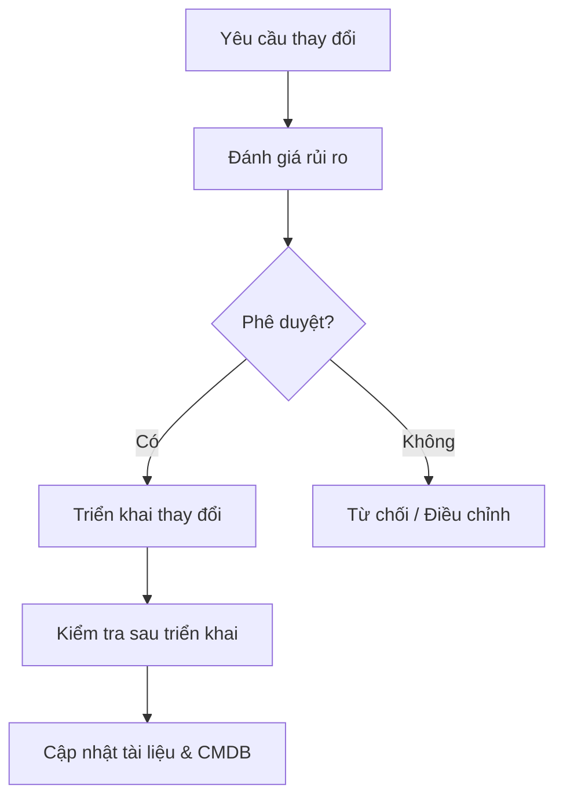
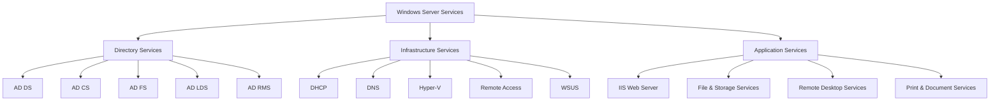
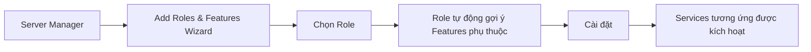
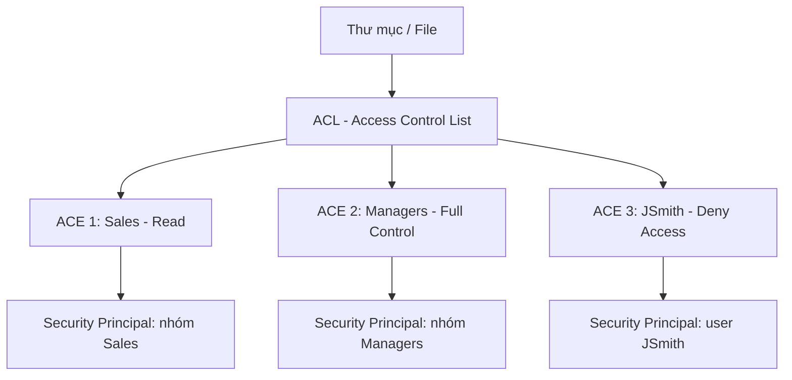
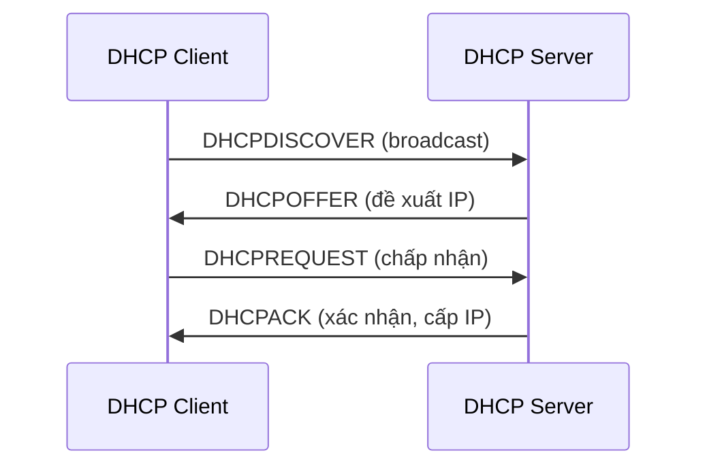
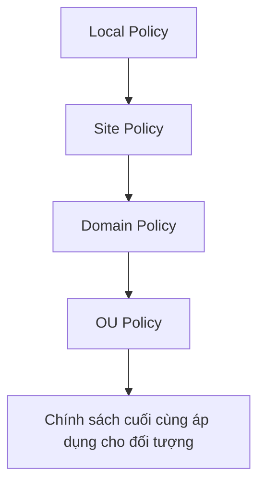
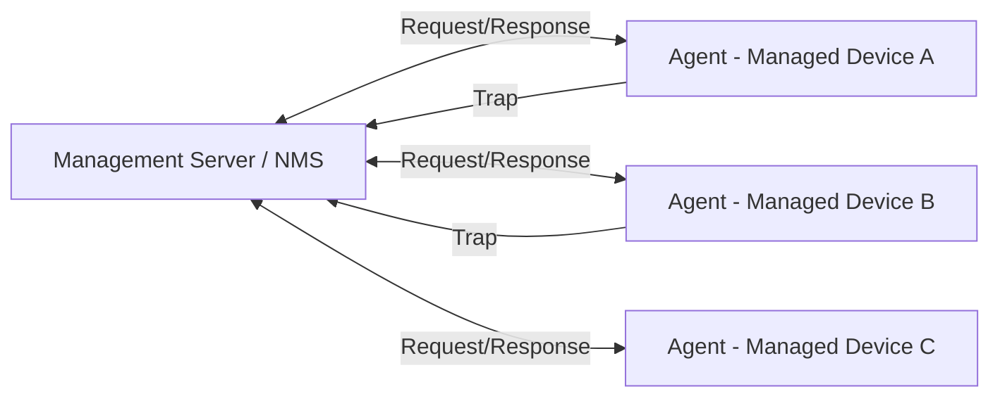

# Chương 9: Mange Task, Window Admin và Network management system

## Phần 1: Các Nhiệm Vụ Quản Lý Mạng (Network Management Tasks)

Quản lý mạng được chuẩn hóa theo mô hình **FCAPS** do ISO định nghĩa, bao gồm 5 lĩnh vực chức năng chính: Fault, Configuration, Accounting, Performance, Security.

---

### 1.1 Fault Management (Quản lý sự cố)

> **Mục tiêu:** Phát hiện, cô lập, chẩn đoán và khắc phục sự cố trong mạng.

Fault Management là quá trình liên tục giám sát toàn bộ hạ tầng mạng để phát hiện bất kỳ sự cố hoặc hành vi bất thường nào, sau đó xử lý theo quy trình có hệ thống.

**Các bước trong Fault Management:**

1. **Detect (Phát hiện):** Sử dụng các công cụ giám sát (Zabbix, Nagios, Icinga) để nhận cảnh báo khi thiết bị gặp sự cố, đường link bị đứt, hoặc ngưỡng tài nguyên bị vượt quá.
2. **Isolate (Cô lập):** Xác định phạm vi ảnh hưởng, tách biệt thành phần bị lỗi khỏi phần còn lại của hệ thống để tránh lan rộng.
3. **Diagnose (Chẩn đoán):** Phân tích log, thực hiện các lệnh kiểm tra (`ping`, `traceroute`, `netstat`) để tìm nguyên nhân gốc rễ.
4. **Correct (Khắc phục):** Áp dụng biện pháp sửa chữa: khởi động lại dịch vụ, thay thế phần cứng, cập nhật cấu hình, hoặc chuyển sang thiết bị dự phòng.

```bash
# Kiểm tra kết nối cơ bản
ping 192.168.1.1

# Truy vết đường đi gói tin
traceroute 8.8.8.8

# Kiểm tra cổng và kết nối đang mở
netstat -an | grep LISTEN
```

??? note "Công cụ phổ biến"
    - **Zabbix:** Giám sát mạng và server, hỗ trợ SNMP, ICMP, agent-based
    - **Nagios:** Cảnh báo theo ngưỡng, plugin ecosystem phong phú
    - **Icinga:** Fork của Nagios với UI hiện đại hơn, hỗ trợ clustering

---

### 1.2 Configuration Management (Quản lý cấu hình)

> **Mục tiêu:** Theo dõi và kiểm soát cấu hình của các thiết bị mạng.

Configuration Management đảm bảo rằng mọi thay đổi cấu hình đều được ghi lại, kiểm soát và có thể phục hồi. Đây là nền tảng để duy trì tính ổn định của hệ thống.

**Các hoạt động chính:**

- **Inventory (Kiểm kê):** Lưu trữ danh sách toàn bộ thiết bị, bao gồm địa chỉ IP, firmware version, vai trò trong mạng.
- **Baseline Configuration:** Xác định trạng thái cấu hình chuẩn cho từng loại thiết bị.
- **Change Management:** Mọi thay đổi cấu hình phải được phê duyệt, kiểm thử, và ghi lại trong Change Log.
- **Backup & Restore:** Sao lưu cấu hình định kỳ, có khả năng rollback khi xảy ra sự cố.



---

### 1.3 Accounting Management (Quản lý tài khoản / sử dụng)

> **Mục tiêu:** Theo dõi mức độ sử dụng tài nguyên mạng theo người dùng, phòng ban, hoặc ứng dụng.

Accounting Management giúp tổ chức hiểu rõ ai đang dùng gì, dùng bao nhiêu, và phân bổ chi phí hợp lý.

**Ứng dụng thực tế:**

- Tính cước dịch vụ (billing) cho ISP hoặc dịch vụ cloud nội bộ.
- Giám sát băng thông theo phòng ban để phân bổ tài nguyên.
- Phát hiện bất thường: một user hoặc thiết bị sử dụng băng thông bất thường cao có thể là dấu hiệu bị xâm phạm.
- Hỗ trợ lập kế hoạch nâng cấp hạ tầng dựa trên xu hướng sử dụng.

---

### 1.4 Performance Management (Quản lý hiệu suất)

> **Mục tiêu:** Giám sát và tối ưu hiệu suất của mạng và các thiết bị.

**Các chỉ số hiệu suất quan trọng (KPI):**

| Chỉ số | Mô tả | Công cụ kiểm tra |
|---|---|---|
| Bandwidth | Băng thông đã sử dụng / tổng dung lượng | MRTG, Cacti |
| Latency | Độ trễ truyền gói tin (ms) | ping, traceroute |
| Packet Loss | Tỷ lệ gói tin bị mất (%) | ping extended |
| Throughput | Lưu lượng thực tế qua mạng | iPerf |
| Uptime | Thời gian hoạt động liên tục | SNMP polling |

**Các hoạt động:**

- **Monitor (Giám sát):** Thu thập dữ liệu liên tục theo thời gian thực.
- **Test reachability (Kiểm tra khả năng đến được):** Xác nhận các điểm đầu cuối có đang hoạt động không.
- **Threshold alert (Cảnh báo ngưỡng):** Thiết lập ngưỡng cảnh báo để chủ động xử lý trước khi xảy ra sự cố.
- **Trend analysis (Phân tích xu hướng):** Dự đoán thời điểm cần nâng cấp dựa trên lịch sử dữ liệu.

---

### 1.5 Security Management (Quản lý bảo mật)

> **Mục tiêu:** Duy trì và phân phối chính sách bảo mật, kiểm soát truy cập, bảo vệ tài nguyên mạng.

**Các nhiệm vụ chính:**

- Quản lý tài khoản người dùng (username/password), phân quyền truy cập.
- Giám sát nhật ký bảo mật (security logs), phát hiện hành vi xâm nhập.
- Quản lý tường lửa (firewall), hệ thống phát hiện xâm nhập (IDS/IPS).
- Đảm bảo tuân thủ CIA Triad: **Confidentiality** (Bảo mật), **Integrity** (Toàn vẹn), **Availability** (Sẵn sàng).

---

## Phần 2: Windows Administration

### 2.1 Tổng quan Windows Server

Windows Server là hệ điều hành dòng máy chủ của Microsoft, được thiết kế để cung cấp các dịch vụ nền tảng cho hạ tầng doanh nghiệp.

**Các phiên bản chính:**

=== "Windows Server 2012 / 2012 R2"
    - Giới thiệu Storage Spaces, ReFS
    - Hyper-V 3.0 với live migration cải tiến
    - Hỗ trợ đến tháng 10/2023

=== "Windows Server 2016"
    - Giới thiệu Nano Server, Containers
    - Windows Defender tích hợp sâu hơn
    - Shielded VMs cho bảo mật Hyper-V

=== "Windows Server 2019"
    - Tích hợp Windows Admin Center
    - Cải tiến Hyper-Converged Infrastructure
    - Storage Migration Service

=== "Windows Server 2022"
    - Secured-core server
    - TLS 1.3, DNS-over-HTTPS tích hợp sẵn
    - Azure hybrid capabilities nâng cao

---

### 2.2 Phân loại dịch vụ (Services)

Windows Server tổ chức các chức năng thành 3 nhóm dịch vụ lớn:



#### Directory Services

Lưu trữ, tổ chức và cung cấp thông tin về mạng và tài nguyên mạng.

| Dịch vụ | Chức năng |
|---|---|
| **AD DS** (Active Directory Domain Services) | Xác thực và ủy quyền người dùng/máy tính trong domain |
| **AD CS** (Certificate Services) | Phát hành và quản lý chứng chỉ số PKI nội bộ |
| **AD FS** (Federation Services) | Xác thực liên kết (SSO) với các tổ chức bên ngoài |
| **AD LDS** (Lightweight Directory Services) | LDAP directory không cần domain, dùng cho ứng dụng |
| **AD RMS** (Rights Management Services) | Bảo vệ thông tin bằng chính sách quyền truy cập |

#### Infrastructure Services

Cung cấp các dịch vụ hỗ trợ nền tảng cho client trên mạng.

| Dịch vụ | Chức năng |
|---|---|
| **DHCP** | Cấp phát địa chỉ IP tự động cho client |
| **DNS Server** | Phân giải tên miền sang địa chỉ IP |
| **Hyper-V** | Nền tảng ảo hóa (hypervisor type-1) |
| **NPAS** | Quản lý chính sách truy cập mạng (NAP, RADIUS, VPN) |
| **Remote Access** | VPN, DirectAccess, Web Application Proxy |
| **WSUS** | Quản lý và phân phối Windows Update nội bộ |
| **WDS** | Triển khai hệ điều hành qua mạng (PXE boot) |

#### Application Services

| Dịch vụ | Chức năng |
|---|---|
| **IIS (Web Server)** | Hosting website và web application |
| **File and Storage Services** | Quản lý chia sẻ file, quota, DFS |
| **Remote Desktop Services** | Cho phép truy cập desktop từ xa |
| **Print and Document Services** | Quản lý máy in tập trung |
| **Fax Server** | Gửi/nhận fax qua mạng |

---

### 2.3 Role, Feature và Service

!!! info "Phân biệt Role, Feature và Service"
    Ba khái niệm này thường bị nhầm lẫn trong Windows Server:

**Role (Vai trò):** Định nghĩa chức năng chính của server. Khi cài một Role, bạn đang biến server thành một loại máy chủ cụ thể.

- Ví dụ: Cài Role "Web Server (IIS)" → server trở thành web server.

**Feature (Tính năng):** Module nhỏ hơn, thường bổ sung chức năng đơn lẻ cho một Role hoặc chạy độc lập.

- Ví dụ: `.NET Framework`, `Telnet Client`, `Windows Server Backup`.

**Service (Dịch vụ):** Chương trình chạy liên tục ở background, không có giao diện người dùng trực tiếp, cung cấp các chức năng cụ thể.

- Ví dụ: `DNS Client`, `DHCP Client`, `Windows Update`.



---

### 2.4 Folder Shares (Chia sẻ thư mục)

Để người dùng trong mạng có thể truy cập tài nguyên trên server, cần tạo **Share** cho các thư mục.

**Các quyết định cần đưa ra khi tạo Share:**

- Thư mục nào sẽ được chia sẻ?
- Tên share là gì? (Tên này người dùng dùng để kết nối: `\\server\tên_share`)
- Phân quyền gì cho người dùng nào?
- Cấu hình Offline Files như thế nào? (đồng bộ khi offline)

#### Hai giao thức chia sẻ file:

=== "SMB (Server Message Block)"
    - Giao thức chia sẻ file chuẩn trên **Windows**
    - Tất cả phiên bản Windows đều hỗ trợ
    - Yêu cầu role service: **File Server**
    - Truy cập: `\\server_name\share_name`
    - Phiên bản: SMB 1.0 (cũ, không an toàn), SMB 2.0, SMB 3.0 (có encryption)

=== "NFS (Network File System)"
    - Giao thức chia sẻ file chuẩn trên **UNIX/Linux**
    - Dùng khi cần Windows Server phục vụ client Linux/UNIX
    - Yêu cầu role service: **Server for NFS**
    - Mount point trên Linux: `mount -t nfs server:/share /mnt/point`

---

### 2.5 Permissions (Phân quyền)

Windows sử dụng hệ thống phân quyền dựa trên **ACL (Access Control List)**.



- **ACL (Access Control List):** Danh sách các quyền gắn với một đối tượng (file/folder).
- **ACE (Access Control Entry):** Một mục trong ACL, xác định quyền của một Security Principal cụ thể.
- **Security Principal:** Thực thể được gán quyền – có thể là user, group, hoặc computer account.

#### Quyền chia sẻ (Share Permissions):

| Quyền | Cho phép |
|---|---|
| **Full Control** | Thay đổi quyền file, lấy quyền sở hữu, toàn bộ quyền của Change |
| **Change** | Tạo thư mục, thêm/sửa/xóa file, đổi thuộc tính, toàn bộ quyền Read |
| **Read** | Xem tên file/folder, dữ liệu file, thuộc tính; chạy file thực thi; truy cập thư mục con |

!!! warning "Share Permission vs NTFS Permission"
    Windows có hai lớp quyền:
    
    - **Share Permission:** Áp dụng khi truy cập qua mạng.
    - **NTFS Permission:** Áp dụng cả khi truy cập local lẫn qua mạng.
    
    Khi cả hai được áp dụng, **quyền hiệu lực = giao của hai tập quyền** (quyền hạn chế nhất thắng).

---

### 2.6 DHCP Server

**DHCP (Dynamic Host Configuration Protocol)** tự động cấp phát cấu hình mạng cho client, tránh việc cấu hình thủ công từng máy.

**Thông tin DHCP cấp phát:**

- Địa chỉ IP
- Subnet Mask
- Default Gateway
- DNS Server
- Lease Time (thời gian thuê IP)



**Các khái niệm DHCP quan trọng:**

| Khái niệm | Mô tả |
|---|---|
| **Scope** | Dải địa chỉ IP mà DHCP server có thể cấp phát |
| **Exclusion Range** | Dải IP trong scope được loại trừ (dành cho thiết bị cố định) |
| **Reservation** | Gán IP cố định cho một MAC address cụ thể |
| **Lease** | Thời gian client được phép dùng IP (mặc định 8 ngày) |
| **DHCP Relay Agent** | Router/server chuyển tiếp DHCP broadcast sang subnet khác |

**Topology DHCP phổ biến:** Một DHCP server có thể phục vụ nhiều subnet thông qua DHCP Relay Agent đặt tại router.

---

### 2.7 DNS Server

**DNS (Domain Name System)** phân giải tên miền thành địa chỉ IP và ngược lại.

**Cài đặt:**

1. Thêm Role "DNS Server" qua Add Roles and Features Wizard.
2. Cấu hình thông qua **DNS Manager** console.

#### Zones (Vùng DNS):

Một **Zone** là đơn vị quản trị trên DNS server, chứa cơ sở dữ liệu (zone database) với các bản ghi tài nguyên (resource records) của các domain thuộc về zone đó.

!!! info "Yêu cầu về zone hợp lệ"
    Zone phải bao gồm các domain **liên tục** (contiguous). Không thể tạo một zone chứa `contoso.com` và `support.contoso.com` mà bỏ qua `sales.contoso.com` ở giữa.

**Hai loại zone chính:**

=== "Forward Lookup Zone"
    - Phân giải: **Tên miền → Địa chỉ IP**
    - Chứa các record: **A** (IPv4), **AAAA** (IPv6), **NS**, **SOA**, **MX**, **CNAME**
    - Ví dụ: `www.contoso.com` → `192.168.1.10`

=== "Reverse Lookup Zone"
    - Phân giải: **Địa chỉ IP → Tên miền**
    - Chứa record: **PTR (Pointer)**
    - Ví dụ: `192.168.1.10` → `www.contoso.com`
    - Dùng để xác minh danh tính máy chủ trong mail server, bảo mật

**Các loại record phổ biến:**

| Record | Chức năng |
|---|---|
| A | Ánh xạ hostname → IPv4 |
| AAAA | Ánh xạ hostname → IPv6 |
| CNAME | Bí danh (alias) trỏ về hostname khác |
| MX | Mail Exchange – server nhận email cho domain |
| NS | Name Server – DNS server có thẩm quyền cho zone |
| SOA | Start of Authority – thông tin về zone |
| PTR | Pointer – ánh xạ ngược IP → hostname |
| SRV | Service record – xác định vị trí dịch vụ (dùng bởi AD DS) |

---

### 2.8 Active Directory Domain Services (AD DS)

**Active Directory** là dịch vụ directory của Microsoft, là nền tảng quản lý danh tính và truy cập trong môi trường Windows.

> AD DS lưu trữ thông tin về các đối tượng trên mạng (user, computer, group, printer...) và cung cấp cơ chế xác thực, ủy quyền tập trung.

#### Authentication vs Authorization:

| Khái niệm | Định nghĩa | Ví dụ |
|---|---|---|
| **Authentication (Xác thực)** | Xác minh danh tính "Bạn là ai?" | Đăng nhập bằng username/password, smart card, vân tay |
| **Authorization (Ủy quyền)** | Xác định quyền truy cập "Bạn được làm gì?" | ACL cho phép nhóm Sales chỉ đọc thư mục |

**Phương thức xác thực AD hỗ trợ:**

- Passwords (mật khẩu truyền thống)
- Smart cards (thẻ thông minh)
- Biometrics (dấu vân tay, nhận diện khuôn mặt)

#### Domain:

Một **Domain** là container logic chứa các đối tượng mạng, được quản lý bởi Domain Controller (DC). Tất cả thiết bị và người dùng trong domain chia sẻ cơ sở dữ liệu AD, chính sách bảo mật chung.

#### Active Directory Objects (Đối tượng AD):

Mỗi **Object** là một thực thể được đặt tên với tập thuộc tính xác định.

=== "User Account"
    - Cho phép người dùng đăng nhập vào máy tính và domain.
    - Chứa thông tin: tên, email, điện thoại, phòng ban, ảnh đại diện.
    - Thuộc tính bảo mật: password policy, account expiration, logon hours.

=== "Computer Account"
    - Mỗi máy tính tham gia domain cần có Computer Account trong AD.
    - Cung cấp cơ chế xác thực máy tính (machine authentication).
    - Dùng để áp Group Policy cho máy tính.

=== "Group"
    - Tập hợp các User hoặc Computer Account.
    - Đơn giản hóa việc phân quyền: gán quyền cho group thay vì từng user.
    - **Security Group:** Dùng để phân quyền truy cập tài nguyên.
    - **Distribution Group:** Dùng cho danh sách email (không có chức năng bảo mật).

=== "Printer"
    - Đại diện cho máy in mạng trong AD, giúp người dùng tìm kiếm máy in theo thuộc tính.

#### Active Directory Management Tools:

| Công cụ | Chức năng |
|---|---|
| **AD Users and Computers** | Quản lý user, computer, group, OU |
| **AD Domains and Trusts** | Quản lý trust relationship giữa các domain |
| **AD Sites and Services** | Quản lý replication topology giữa các site |
| **AD Administrative Center** | GUI hiện đại, tích hợp PowerShell History Viewer |
| **Group Policy Management Console (GPMC)** | Tạo, chỉnh sửa và liên kết Group Policy Objects |

---

### 2.9 Group Policy (Chính sách nhóm)

**Group Policy** là một trong những tính năng mạnh mẽ nhất của Active Directory, cho phép quản trị viên cấu hình tập trung cho hàng nghìn máy tính và người dùng.

**Khả năng của Group Policy:**

- Cấu hình desktop (wallpaper, screensaver).
- Triển khai phần mềm tự động.
- Cấu hình bảo mật (password policy, account lockout).
- Ánh xạ ổ đĩa mạng, máy in.
- Chặn hoặc giới hạn truy cập Control Panel, Registry.
- Cấu hình tường lửa Windows.

#### Thứ tự áp dụng Group Policy (LSDOU):



!!! tip "Quy tắc LSDOU"
    Policy được áp dụng theo thứ tự: **L**ocal → **S**ite → **D**omain → **O**U.
    
    Policy áp dụng **sau** sẽ ghi đè policy áp dụng **trước** nếu có xung đột. Do đó OU Policy có độ ưu tiên cao nhất.

---

## Phần 3: Network Management System (NMS)

### 3.1 Các thành phần của NMS

Một hệ thống quản lý mạng gồm 3 thành phần cốt lõi:



| Thành phần | Mô tả |
|---|---|
| **Managed Device (Thiết bị được quản lý)** | Router, switch, server, firewall... chứa Agent và MIB |
| **Agent** | Phần mềm chạy trên managed device, thu thập và lưu thông tin quản lý, phản hồi yêu cầu từ NMS |
| **NMS (Network Management System)** | Phần mềm chạy trên management server, gửi yêu cầu đến agent và nhận thông tin, hiển thị cho admin |

---

### 3.2 Các phương thức hoạt động

#### Request/Response (Polling):

NMS chủ động gửi yêu cầu đến Agent để lấy thông tin trạng thái theo chu kỳ.

- **Ưu điểm:** NMS kiểm soát tần suất polling, dễ phát hiện device ngừng phản hồi.
- **Nhược điểm:** Tạo lưu lượng mạng đều đặn, có thể bỏ lỡ sự kiện xảy ra giữa 2 lần polling.

#### Trap (Event-driven):

Agent chủ động gửi thông báo đến NMS khi xảy ra sự kiện bất thường mà không cần được hỏi.

- **Ưu điểm:** Thông báo tức thì, giảm tải mạng khi hệ thống hoạt động bình thường.
- **Nhược điểm:** Nếu device mất kết nối hoàn toàn, trap sẽ không được gửi → NMS không biết.

!!! tip "Kết hợp cả hai"
    Thực tế, hệ thống NMS hiệu quả sử dụng **cả hai phương thức**: polling định kỳ để phát hiện device down, và trap để nhận cảnh báo tức thì về các sự kiện cụ thể.

---

### 3.3 Các giao thức quản lý mạng

#### SNMP (Simple Network Management Protocol)

SNMP là giao thức chuẩn để quản lý và giám sát thiết bị mạng.

**Kiến trúc SNMP:**

- **Manager:** NMS gửi truy vấn SNMP đến agent.
- **Agent:** Phần mềm trên thiết bị được quản lý.
- **MIB (Management Information Base):** Cơ sở dữ liệu định nghĩa các đối tượng thông tin có thể truy vấn, tổ chức theo cấu trúc cây OID (Object Identifier).

**Các phiên bản SNMP:**

| Phiên bản | Bảo mật | Ghi chú |
|---|---|---|
| SNMPv1 | Không có (community string dạng plaintext) | Lỗi thời, không khuyến dùng |
| SNMPv2c | Community string (vẫn plaintext) | Cải thiện hiệu suất, thêm GetBulk |
| SNMPv3 | Authentication + Encryption | Khuyến dùng, hỗ trợ USM và VACM |

**Các thao tác SNMP:**

| Thao tác | Mô tả |
|---|---|
| GET | Manager lấy giá trị một OID |
| GETNEXT | Lấy OID tiếp theo trong MIB tree |
| GETBULK | Lấy nhiều OID cùng lúc (SNMPv2+) |
| SET | Manager ghi giá trị vào OID |
| TRAP | Agent gửi cảnh báo không đồng bộ đến manager |
| INFORM | Tương tự TRAP nhưng có xác nhận (SNMPv2+) |

```bash
# Ví dụ truy vấn SNMP từ Linux
snmpget -v2c -c public 192.168.1.1 sysDescr.0

# Lấy toàn bộ MIB của thiết bị
snmpwalk -v2c -c public 192.168.1.1
```

#### Syslog

Syslog là giao thức chuẩn để gửi log từ thiết bị đến một **Syslog Server** tập trung.

- Thiết bị mạng (router, switch, firewall) gửi log theo giao thức UDP port 514 (hoặc TCP/TLS port 6514 với RFC 5425).
- Log được phân loại theo **Severity Level** (0-7): Emergency, Alert, Critical, Error, Warning, Notice, Informational, Debug.
- Công cụ: **rsyslog**, **syslog-ng** trên Linux; **Windows Event Forwarding** trên Windows.

#### Server/Agent Architecture

Mô hình này được sử dụng bởi nhiều NMS hiện đại như Zabbix, Nagios, Icinga.

- **Agent** cài đặt trên máy được giám sát, thu thập thông tin chi tiết hơn SNMP (CPU, RAM, disk, process...).
- **Server** nhận dữ liệu từ agent, lưu vào database, hiển thị và cảnh báo.

---

### 3.4 Các hệ thống NMS mã nguồn mở

=== "Nagios"
    - **Đặc điểm:** Giám sát host và service, cảnh báo qua email/SMS.
    - **Ưu điểm:** Hệ sinh thái plugin phong phú (hàng nghìn plugin), cộng đồng lớn.
    - **Nhược điểm:** Giao diện cũ, cấu hình phức tạp qua file text.
    - **Phiên bản thương mại:** Nagios XI với GUI đẹp hơn.

=== "Zabbix"
    - **Đặc điểm:** Giám sát toàn diện: mạng, server, cloud, ứng dụng.
    - **Ưu điểm:** Giao diện web hiện đại, hỗ trợ SNMP/IPMI/JMX/agent, auto-discovery, template system.
    - **Nhược điểm:** Cấu hình ban đầu phức tạp, tiêu thụ tài nguyên cao hơn Nagios.
    - **Nổi bật:** Hỗ trợ active và passive check, distributed monitoring.

=== "Icinga"
    - **Đặc điểm:** Fork của Nagios với nhiều cải tiến.
    - **Ưu điểm:** Web interface hiện đại (Icinga Web 2), hỗ trợ clustering, IDO database.
    - **Nhược điểm:** Tài liệu ít hơn Nagios/Zabbix.
    - **Nổi bật:** Tương thích với plugin Nagios, hỗ trợ REST API.

---

## Phần 4: Trắc nghiệm ôn tập

---

**Câu 1.** Mô hình quản lý mạng FCAPS bao gồm những thành phần nào?

- A. Firewall, Configuration, Accounting, Performance, Security
- B. Fault, Configuration, Accounting, Performance, Security
- C. Fault, Control, Access, Performance, Security
- D. Fault, Configuration, Authorization, Performance, System

??? info "Đáp án & Giải thích"
    **Đáp án: B**
    
    FCAPS là viết tắt của Fault, Configuration, Accounting, Performance, Security – 5 lĩnh vực chức năng trong quản lý mạng theo chuẩn ISO/IEC 7498-4.

---

**Câu 2.** Trong Fault Management, bước "Isolate" có nghĩa là gì?

- A. Phát hiện thiết bị bị lỗi
- B. Cô lập thành phần bị lỗi để tránh ảnh hưởng lan rộng
- C. Sửa chữa sự cố
- D. Ghi log sự cố vào hệ thống

??? info "Đáp án & Giải thích"
    **Đáp án: B**
    
    Bốn bước của Fault Management theo thứ tự là: Detect → Isolate → Diagnose → Correct. "Isolate" là bước xác định phạm vi và tách biệt thành phần lỗi khỏi phần còn lại.

---

**Câu 3.** Configuration Management chủ yếu thực hiện điều gì?

- A. Giám sát băng thông mạng
- B. Theo dõi và kiểm soát cấu hình của các thiết bị mạng
- C. Quản lý tài khoản người dùng
- D. Phân tích log bảo mật

??? info "Đáp án & Giải thích"
    **Đáp án: B**
    
    Configuration Management đảm bảo tất cả thay đổi cấu hình đều được ghi lại, kiểm soát, và có thể phục hồi, bao gồm inventory, baseline, change management và backup.

---

**Câu 4.** Accounting Management trong quản lý mạng có ứng dụng thực tế nào sau đây?

- A. Cấu hình tường lửa
- B. Phân bổ chi phí băng thông theo phòng ban
- C. Phân giải tên miền
- D. Sao lưu cấu hình router

??? info "Đáp án & Giải thích"
    **Đáp án: B**
    
    Accounting Management theo dõi mức độ sử dụng tài nguyên mạng để phục vụ tính cước, phân bổ chi phí, và phát hiện bất thường về lưu lượng.

---

**Câu 5.** Chỉ số nào sau đây KHÔNG thuộc Performance Management?

- A. Bandwidth utilization
- B. Packet loss
- C. IP address lease time
- D. Latency

??? info "Đáp án & Giải thích"
    **Đáp án: C**
    
    IP address lease time là khái niệm thuộc DHCP (Configuration/Infrastructure). Bandwidth, packet loss và latency đều là chỉ số hiệu suất mạng.

---

**Câu 6.** Security Management trong FCAPS bao gồm nhiệm vụ nào sau đây?

- A. Tự động cấp phát địa chỉ IP
- B. Duy trì và phân phối username/password
- C. Theo dõi hiệu suất CPU của server
- D. Sao lưu cấu hình thiết bị mạng

??? info "Đáp án & Giải thích"
    **Đáp án: B**
    
    Security Management bao gồm quản lý tài khoản người dùng, kiểm soát truy cập, giám sát log bảo mật, và quản lý firewall/IDS.

---

**Câu 7.** Windows Server 2022 có tính năng bảo mật nổi bật nào?

- A. Giới thiệu Hyper-V lần đầu
- B. Secured-core server và hỗ trợ TLS 1.3 tích hợp sẵn
- C. Chỉ hỗ trợ SMB 1.0
- D. Không có Windows Defender

??? info "Đáp án & Giải thích"
    **Đáp án: B**
    
    Windows Server 2022 nổi bật với Secured-core server, TLS 1.3, DNS-over-HTTPS tích hợp, và các khả năng hybrid với Azure được cải tiến.

---

**Câu 8.** Trong Windows Server, "Role" khác với "Feature" ở điểm nào?

- A. Role nhỏ hơn Feature
- B. Role định nghĩa chức năng chính của server; Feature là module bổ sung nhỏ hơn
- C. Feature chỉ dùng cho bảo mật
- D. Không có sự khác biệt

??? info "Đáp án & Giải thích"
    **Đáp án: B**
    
    Role định nghĩa mục đích chính của server (ví dụ: Web Server IIS), còn Feature là module đơn lẻ bổ sung chức năng (ví dụ: .NET Framework, Telnet Client).

---

**Câu 9.** Dịch vụ nào trong Directory Services của Windows Server chịu trách nhiệm phát hành chứng chỉ số nội bộ?

- A. AD DS
- B. AD FS
- C. AD CS
- D. AD LDS

??? info "Đáp án & Giải thích"
    **Đáp án: C**
    
    AD CS (Active Directory Certificate Services) là PKI nội bộ của Windows, phát hành và quản lý chứng chỉ số cho người dùng, máy tính và dịch vụ trong tổ chức.

---

**Câu 10.** WSUS được dùng để làm gì?

- A. Chia sẻ file qua mạng
- B. Quản lý và phân phối Windows Update nội bộ
- C. Giám sát hiệu suất mạng
- D. Cấp phát địa chỉ IP

??? info "Đáp án & Giải thích"
    **Đáp án: B**
    
    WSUS (Windows Server Update Services) cho phép quản trị viên kiểm soát việc cập nhật Windows trên toàn bộ máy tính trong tổ chức từ một server nội bộ.

---

**Câu 11.** Giao thức chia sẻ file chuẩn trên các hệ thống UNIX/Linux là gì?

- A. SMB
- B. NFS
- C. FTP
- D. SFTP

??? info "Đáp án & Giải thích"
    **Đáp án: B**
    
    NFS (Network File System) là giao thức chia sẻ file chuẩn trên UNIX/Linux. Khi Windows Server cần phục vụ client Linux, cần cài role service "Server for NFS".

---

**Câu 12.** Giao thức SMB phiên bản nào hỗ trợ mã hóa dữ liệu khi truyền?

- A. SMB 1.0
- B. SMB 2.0
- C. SMB 3.0
- D. SMB 1.0 và 2.0

??? info "Đáp án & Giải thích"
    **Đáp án: C**
    
    SMB 3.0 (giới thiệu trong Windows 8/Server 2012) thêm tính năng SMB Encryption, cho phép mã hóa dữ liệu end-to-end. SMB 1.0 bị coi là không an toàn và nên bị tắt.

---

**Câu 13.** ACL trong Windows Permissions là gì?

- A. Một loại giao thức mạng
- B. Danh sách các quyền gắn với một đối tượng (file/folder)
- C. Một dịch vụ xác thực
- D. Cơ chế sao lưu dữ liệu

??? info "Đáp án & Giải thích"
    **Đáp án: B**
    
    ACL (Access Control List) là danh sách chứa các ACE (Access Control Entry), mỗi ACE xác định quyền của một Security Principal (user, group, computer) đối với đối tượng.

---

**Câu 14.** Share Permission "Change" cho phép làm gì so với "Read"?

- A. Chỉ đọc file và thư mục
- B. Tạo, sửa, xóa file và thư mục, ngoài các quyền của Read
- C. Thay đổi quyền của file khác
- D. Lấy quyền sở hữu file

??? info "Đáp án & Giải thích"
    **Đáp án: B**
    
    "Change" bao gồm toàn bộ quyền "Read" cộng thêm: tạo thư mục, thêm file, thay đổi dữ liệu, xóa file. "Full Control" thêm quyền thay đổi permissions và lấy ownership.

---

**Câu 15.** Khi cả Share Permission và NTFS Permission đều được áp dụng, quyền hiệu lực được xác định như thế nào?

- A. Share Permission luôn thắng
- B. NTFS Permission luôn thắng
- C. Quyền hiệu lực là giao của hai tập quyền (quyền hạn chế nhất thắng)
- D. Quyền hiệu lực là hợp của hai tập quyền (quyền cao nhất thắng)

??? info "Đáp án & Giải thích"
    **Đáp án: C**
    
    Khi truy cập qua mạng, Windows áp dụng cả hai lớp quyền và lấy phần hạn chế nhất. Ví dụ: Share Permission là Full Control nhưng NTFS là Read → kết quả là Read.

---

**Câu 16.** Quá trình DHCP diễn ra theo thứ tự nào?

- A. OFFER → DISCOVER → REQUEST → ACK
- B. DISCOVER → OFFER → REQUEST → ACK
- C. REQUEST → DISCOVER → OFFER → ACK
- D. DISCOVER → REQUEST → OFFER → ACK

??? info "Đáp án & Giải thích"
    **Đáp án: B**
    
    Quy trình DORA: **D**ISCOVER (client broadcast tìm server) → **O**FFER (server đề xuất IP) → **R**EQUEST (client chấp nhận) → **A**CK (server xác nhận). Đây là quy trình chuẩn RFC 2131.

---

**Câu 17.** "DHCP Reservation" dùng để làm gì?

- A. Loại trừ một dải IP khỏi scope
- B. Gán một địa chỉ IP cố định cho một MAC address cụ thể
- C. Đặt thời gian lease ngắn hơn cho một client
- D. Chuyển tiếp DHCP request sang subnet khác

??? info "Đáp án & Giải thích"
    **Đáp án: B**
    
    Reservation cho phép DHCP server luôn cấp cùng một IP cho một thiết bị dựa trên MAC address của nó. Khác với Exclusion Range (loại IP ra khỏi cấp phát động hoàn toàn).

---

**Câu 18.** DHCP Relay Agent được sử dụng trong tình huống nào?

- A. Khi cần mã hóa DHCP traffic
- B. Khi DHCP server và client ở trên các subnet khác nhau
- C. Khi cần tăng tốc độ cấp phát IP
- D. Khi DHCP server không hoạt động

??? info "Đáp án & Giải thích"
    **Đáp án: B**
    
    DHCP DISCOVER là broadcast, không thể vượt qua router. DHCP Relay Agent (thường đặt trên router) chuyển tiếp broadcast này thành unicast đến DHCP server trên subnet khác.

---

**Câu 19.** DNS Forward Lookup Zone chứa loại record nào sau đây?

- A. Chỉ PTR records
- B. A, AAAA, NS, SOA, MX, CNAME records
- C. Chỉ A records
- D. Chỉ MX records

??? info "Đáp án & Giải thích"
    **Đáp án: B**
    
    Forward Lookup Zone phân giải tên → IP, chứa A (IPv4), AAAA (IPv6), CNAME (alias), MX (mail), NS (name server), SOA (authority). PTR record thuộc Reverse Lookup Zone.

---

**Câu 20.** DNS record nào dùng để phân giải ngược (IP → hostname)?

- A. A record
- B. CNAME record
- C. PTR record
- D. MX record

??? info "Đáp án & Giải thích"
    **Đáp án: C**
    
    PTR (Pointer) record nằm trong Reverse Lookup Zone, ánh xạ địa chỉ IP thành hostname. Thường dùng để xác minh danh tính mail server (chống spam).

---

**Câu 21.** Yêu cầu về "zone hợp lệ" trong DNS Windows Server là gì?

- A. Zone phải chứa ít nhất 10 records
- B. Zone phải bao gồm các domain liên tục (contiguous)
- C. Zone chỉ có thể chứa một domain
- D. Zone phải được replicate với ít nhất 2 DNS server khác

??? info "Đáp án & Giải thích"
    **Đáp án: B**
    
    DNS zone phải bao gồm các domain liên tục. Không thể tạo zone chứa `contoso.com` và `support.contoso.com` mà bỏ qua `sales.contoso.com`.

---

**Câu 22.** Active Directory Domain Services (AD DS) là gì?

- A. Giao thức chia sẻ file trên Windows
- B. Dịch vụ directory cung cấp xác thực và ủy quyền tập trung
- C. Công cụ giám sát hiệu suất mạng
- D. Giao thức phân giải tên miền

??? info "Đáp án & Giải thích"
    **Đáp án: B**
    
    AD DS là nền tảng quản lý danh tính và truy cập trong môi trường Windows, lưu trữ thông tin về tất cả đối tượng trong mạng và cung cấp cơ chế xác thực, ủy quyền tập trung.

---

**Câu 23.** Phân biệt Authentication và Authorization trong Active Directory?

- A. Authentication là phân quyền, Authorization là xác thực
- B. Authentication xác minh danh tính; Authorization xác định quyền truy cập
- C. Cả hai đều dùng để xác minh danh tính
- D. Cả hai đều dùng để phân quyền truy cập

??? info "Đáp án & Giải thích"
    **Đáp án: B**
    
    Authentication trả lời câu hỏi "Bạn là ai?" (xác minh danh tính qua password, smart card, biometrics). Authorization trả lời "Bạn được phép làm gì?" (dựa trên ACL và ACE).

---

**Câu 24.** Loại Group nào trong Active Directory dùng để phân quyền truy cập tài nguyên?

- A. Distribution Group
- B. Security Group
- C. Universal Group
- D. Local Group

??? info "Đáp án & Giải thích"
    **Đáp án: B**
    
    Security Group có chức năng bảo mật, dùng để gán quyền truy cập tài nguyên cho nhiều user cùng lúc. Distribution Group chỉ dùng cho danh sách email, không có chức năng bảo mật.

---

**Câu 25.** Công cụ nào dùng để quản lý user, computer và group trong Active Directory?

- A. DNS Manager
- B. DHCP Manager
- C. Active Directory Users and Computers
- D. Group Policy Management Console

??? info "Đáp án & Giải thích"
    **Đáp án: C**
    
    "Active Directory Users and Computers" (ADUC) là công cụ chính để quản lý các đối tượng AD như user, computer, group, và OU. GPMC dành riêng cho quản lý Group Policy.

---

**Câu 26.** Group Policy được áp dụng theo thứ tự nào (LSDOU)?

- A. Local → Site → Domain → OU
- B. OU → Domain → Site → Local
- C. Domain → Site → Local → OU
- D. Site → Local → OU → Domain

??? info "Đáp án & Giải thích"
    **Đáp án: A**
    
    LSDOU: Local → Site → Domain → OU. Policy áp dụng sau ghi đè policy trước nếu có xung đột. Do đó OU Policy có độ ưu tiên cao nhất trong LSDOU.

---

**Câu 27.** Điều gì xảy ra khi có xung đột giữa hai GPO trong LSDOU?

- A. GPO đầu tiên luôn thắng
- B. GPO áp dụng sau (gần đối tượng hơn) ghi đè GPO áp dụng trước
- C. Cả hai GPO đều bị vô hiệu
- D. Quản trị viên phải giải quyết thủ công

??? info "Đáp án & Giải thích"
    **Đáp án: B**
    
    Theo thứ tự LSDOU, OU Policy được áp dụng cuối cùng nên có độ ưu tiên cao nhất và ghi đè các policy cấp cao hơn nếu xung đột.

---

**Câu 28.** Ba thành phần cốt lõi của một Network Management System là gì?

- A. Router, Switch, Firewall
- B. Managed Device, Agent, NMS (Network Management System/Server)
- C. Server, Client, Database
- D. SNMP, Syslog, Trap

??? info "Đáp án & Giải thích"
    **Đáp án: B**
    
    NMS gồm: **Managed Device** (thiết bị được quản lý chứa agent), **Agent** (phần mềm thu thập thông tin), và **NMS/Management Server** (phần mềm trung tâm gửi yêu cầu và hiển thị thông tin).

---

**Câu 29.** Phương thức hoạt động "Trap" trong NMS có đặc điểm gì?

- A. NMS định kỳ hỏi agent về trạng thái
- B. Agent chủ động gửi thông báo đến NMS khi xảy ra sự kiện bất thường
- C. NMS gửi lệnh cấu hình đến thiết bị
- D. Agent định kỳ gửi báo cáo đầy đủ đến NMS

??? info "Đáp án & Giải thích"
    **Đáp án: B**
    
    Trap là phương thức event-driven: agent chủ động gửi cảnh báo ngay khi phát hiện sự kiện (interface down, nhiệt độ cao...) mà không cần đợi NMS hỏi.

---

**Câu 30.** Nhược điểm chính của phương thức Request/Response (Polling) trong NMS là gì?

- A. Không phát hiện được device down
- B. Có thể bỏ lỡ sự kiện xảy ra giữa hai lần polling và tạo lưu lượng mạng liên tục
- C. Agent phải cài đặt phức tạp
- D. Chỉ hoạt động được với thiết bị Cisco

??? info "Đáp án & Giải thích"
    **Đáp án: B**
    
    Polling tạo lưu lượng đều đặn và có khoảng thời gian "mù" giữa hai lần poll. Sự kiện xảy ra và biến mất trong khoảng thời gian này sẽ không được phát hiện.

---

**Câu 31.** SNMP sử dụng cấu trúc dữ liệu nào để định nghĩa các đối tượng có thể quản lý?

- A. SQL Database
- B. XML Schema
- C. MIB (Management Information Base) với OID
- D. JSON Object

??? info "Đáp án & Giải thích"
    **Đáp án: C**
    
    MIB là cơ sở dữ liệu dạng cây, mỗi đối tượng được xác định bằng OID (Object Identifier) – một chuỗi số duy nhất. Ví dụ: `1.3.6.1.2.1.1.1.0` là OID của `sysDescr`.

---

**Câu 32.** Phiên bản SNMP nào được khuyến dùng vì có xác thực và mã hóa?

- A. SNMPv1
- B. SNMPv2
- C. SNMPv2c
- D. SNMPv3

??? info "Đáp án & Giải thích"
    **Đáp án: D**
    
    SNMPv3 hỗ trợ USM (User-based Security Model) với authentication (MD5/SHA) và encryption (DES/AES), khắc phục điểm yếu của v1 và v2c (community string dạng plaintext).

---

**Câu 33.** Thao tác SNMP "INFORM" khác "TRAP" ở điểm nào?

- A. INFORM chỉ dùng cho SNMPv1
- B. INFORM yêu cầu xác nhận từ NMS; TRAP không cần xác nhận
- C. TRAP nhanh hơn INFORM
- D. Không có sự khác biệt

??? info "Đáp án & Giải thích"
    **Đáp án: B**
    
    INFORM (SNMPv2+) là trap có xác nhận: agent gửi và chờ ACK từ NMS. Nếu không nhận được ACK, agent sẽ gửi lại. TRAP không có cơ chế xác nhận, có thể bị mất.

---

**Câu 34.** Giao thức Syslog mặc định sử dụng cổng và giao thức vận chuyển nào?

- A. TCP port 514
- B. UDP port 514
- C. TCP port 162
- D. UDP port 161

??? info "Đáp án & Giải thích"
    **Đáp án: B**
    
    Syslog truyền thống dùng UDP port 514. Phiên bản bảo mật (RFC 5425) dùng TCP/TLS port 6514. SNMP dùng UDP 161 (polling) và UDP 162 (trap).

---

**Câu 35.** Công cụ nào sau đây là NMS mã nguồn mở?

- A. SolarWinds
- B. PRTG
- C. Zabbix
- D. WhatsUp Gold

??? info "Đáp án & Giải thích"
    **Đáp án: C**
    
    Zabbix, Nagios, và Icinga là 3 NMS mã nguồn mở được đề cập trong tài liệu. SolarWinds, PRTG, WhatsUp Gold là phần mềm thương mại.

---

**Câu 36.** AD DS "Domain" là gì?

- A. Một địa chỉ IP của Domain Controller
- B. Container logic chứa các đối tượng mạng, được quản lý tập trung bởi DC
- C. Một loại giao thức mạng
- D. Tên DNS của server

??? info "Đáp án & Giải thích"
    **Đáp án: B**
    
    Domain là đơn vị quản trị cơ bản trong AD. Tất cả đối tượng (user, computer) trong domain chia sẻ cơ sở dữ liệu AD, chính sách bảo mật, và tin tưởng lẫn nhau (trust).

---

**Câu 37.** Dịch vụ nào trong Windows Server hỗ trợ triển khai hệ điều hành qua mạng (PXE boot)?

- A. WSUS
- B. WDS (Windows Deployment Services)
- C. DHCP
- D. DNS

??? info "Đáp án & Giải thích"
    **Đáp án: B**
    
    WDS (Windows Deployment Services) cho phép triển khai Windows image qua mạng đến các máy tính không có OS, sử dụng công nghệ PXE boot kết hợp với DHCP.

---

**Câu 38.** Hyper-V trong Windows Server thuộc nhóm dịch vụ nào?

- A. Directory Services
- B. Application Services
- C. Infrastructure Services
- D. Security Services

??? info "Đáp án & Giải thích"
    **Đáp án: C**
    
    Hyper-V là hypervisor type-1 thuộc nhóm Infrastructure Services, cung cấp nền tảng ảo hóa cho phép chạy nhiều máy ảo trên một máy chủ vật lý.

---

**Câu 39.** AD FS (Federation Services) được dùng chủ yếu để làm gì?

- A. Phát hành chứng chỉ số nội bộ
- B. Xác thực liên kết (SSO) giữa các tổ chức khác nhau
- C. Quản lý quyền truy cập tài liệu
- D. Cung cấp LDAP directory cho ứng dụng

??? info "Đáp án & Giải thích"
    **Đáp án: B**
    
    AD FS cung cấp khả năng Single Sign-On (SSO) liên kết với các đối tác bên ngoài (federated identity), cho phép người dùng dùng tài khoản nội bộ để truy cập ứng dụng bên ngoài.

---

**Câu 40.** Tên share trong Windows SMB được truy cập theo cú pháp nào?

- A. `http://server_name/share_name`
- B. `ftp://server_name/share_name`
- C. `\\server_name\share_name`
- D. `nfs://server_name/share_name`

??? info "Đáp án & Giải thích"
    **Đáp án: C**
    
    UNC path (Universal Naming Convention) của SMB share có định dạng `\\server_name\share_name`. Ví dụ: `\\FILESERVER\Documents`.

---

**Câu 41.** "Security Principal" trong hệ thống phân quyền Windows có thể là gì?

- A. Chỉ người dùng (user)
- B. User, Group, hoặc Computer Account
- C. Chỉ nhóm (group)
- D. Chỉ máy tính (computer)

??? info "Đáp án & Giải thích"
    **Đáp án: B**
    
    Security Principal là bất kỳ thực thể nào có thể được xác thực và gán quyền: user account, group, computer account, và service account.

---

**Câu 42.** Thao tác SNMP nào cho phép NMS ghi giá trị vào thiết bị từ xa?

- A. GET
- B. GETNEXT
- C. SET
- D. TRAP

??? info "Đáp án & Giải thích"
    **Đáp án: C**
    
    SET cho phép NMS thay đổi giá trị cấu hình trên thiết bị từ xa. Đây là lý do SNMPv3 quan trọng – community string của v1/v2c nếu bị lộ có thể cho phép attacker thay đổi cấu hình thiết bị.

---

**Câu 43.** Zabbix khác Nagios ở điểm nổi bật nào?

- A. Nagios hỗ trợ nhiều giao thức giám sát hơn
- B. Zabbix có giao diện web hiện đại hơn và hỗ trợ auto-discovery
- C. Nagios miễn phí còn Zabbix tính phí
- D. Zabbix chỉ giám sát được thiết bị mạng

??? info "Đáp án & Giải thích"
    **Đáp án: B**
    
    Zabbix có UI web hiện đại, template system, auto-discovery, hỗ trợ SNMP/IPMI/JMX/agent-based. Nagios nổi tiếng với hệ sinh thái plugin nhưng cấu hình qua file text, giao diện cũ hơn.

---

**Câu 44.** Record DNS loại "SRV" được dùng để làm gì?

- A. Phân giải IP ngược
- B. Xác định vị trí của các dịch vụ (dùng bởi AD DS để tìm DC)
- C. Bí danh hostname
- D. Xác định mail server

??? info "Đáp án & Giải thích"
    **Đáp án: B**
    
    SRV record xác định hostname và port của các server cung cấp dịch vụ cụ thể. AD DS phụ thuộc rất nhiều vào SRV records để client tìm được Domain Controller và Global Catalog.

---

**Câu 45.** Công cụ "Active Directory Sites and Services" dùng để làm gì?

- A. Quản lý user và group
- B. Quản lý replication topology giữa các site địa lý
- C. Tạo và chỉnh sửa Group Policy
- D. Cấu hình DNS cho Active Directory

??? info "Đáp án & Giải thích"
    **Đáp án: B**
    
    AD Sites and Services quản lý cấu trúc vật lý của AD: định nghĩa site (vị trí địa lý), subnet, site links, và lịch trình replication giữa các Domain Controller ở các site khác nhau.

---

**Câu 46.** Trong SNMP MIB, OID là gì?

- A. Tên người dùng quản trị SNMP
- B. Mật khẩu xác thực SNMPv3
- C. Chuỗi số định danh duy nhất cho mỗi đối tượng trong MIB tree
- D. Community string dùng cho truy cập read-only

??? info "Đáp án & Giải thích"
    **Đáp án: C**
    
    OID (Object Identifier) là chuỗi số phân cấp xác định duy nhất mỗi đối tượng trong MIB. Ví dụ: `1.3.6.1.2.1.1.1.0` = `iso.org.dod.internet.mgmt.mib-2.system.sysDescr.0`.

---

**Câu 47.** Phương thức xác thực nào sau đây được Active Directory hỗ trợ?

- A. Chỉ password
- B. Password, Smart card, Biometrics
- C. Chỉ Smart card và Biometrics
- D. Password và certificate only

??? info "Đáp án & Giải thích"
    **Đáp án: B**
    
    AD DS hỗ trợ nhiều phương thức xác thực: passwords, smart cards (dùng AD CS), và biometrics như fingerprint scan. Với Windows Hello for Business còn hỗ trợ PIN và facial recognition.

---

**Câu 48.** DNS record "MX" (Mail Exchange) có chức năng gì?

- A. Xác định địa chỉ IPv6 của hostname
- B. Xác định mail server nhận email cho một domain
- C. Tạo bí danh cho hostname khác
- D. Xác định name server có thẩm quyền cho zone

??? info "Đáp án & Giải thích"
    **Đáp án: B**
    
    MX record chỉ định mail server chịu trách nhiệm nhận email cho domain. Có thể có nhiều MX record với priority khác nhau để dự phòng. Ví dụ: email gửi đến `@contoso.com` sẽ đến server được chỉ định trong MX record của `contoso.com`.

---

**Câu 49.** Icinga có mối liên hệ gì với Nagios?

- A. Icinga là phiên bản thương mại của Nagios
- B. Icinga là fork (nhánh tách) của Nagios với nhiều cải tiến về UI và clustering
- C. Icinga và Nagios là sản phẩm hoàn toàn độc lập
- D. Nagios được phát triển từ Icinga

??? info "Đáp án & Giải thích"
    **Đáp án: B**
    
    Icinga được fork từ Nagios năm 2009, tương thích với plugin Nagios nhưng thêm giao diện web hiện đại (Icinga Web 2), hỗ trợ distributed monitoring, clustering, và REST API.

---

**Câu 50.** AD RMS (Rights Management Services) bảo vệ thông tin bằng cơ chế nào?

- A. Mã hóa ổ đĩa cứng toàn bộ
- B. Kiểm soát quyền truy cập tài liệu bằng chính sách quyền (policy-based access control)
- C. Tạo backup tự động cho tài liệu
- D. Quét virus trong tài liệu

??? info "Đáp án & Giải thích"
    **Đáp án: B**
    
    AD RMS mã hóa tài liệu và nhúng chính sách quyền vào nó: ai được đọc, ai được in, ai được chuyển tiếp, và đến khi nào. Ngay cả khi tài liệu bị sao chép ra ngoài, chính sách vẫn được áp dụng.

---

**Câu 51.** GETBULK trong SNMP có ưu điểm gì so với nhiều lần GETNEXT?

- A. Bảo mật hơn
- B. Giảm số lượng round-trip, lấy nhiều OID trong một request duy nhất
- C. Hỗ trợ cả SNMPv1
- D. Không cần community string

??? info "Đáp án & Giải thích"
    **Đáp án: B**
    
    GETBULK (SNMPv2+) cho phép lấy nhiều OID liên tiếp trong một request, giảm đáng kể số lượng round-trip so với gọi GETNEXT nhiều lần. Đặc biệt hiệu quả khi cần lấy toàn bộ bảng routing.

---

**Câu 52.** Trong Windows Server, "Service" khác với "Role" và "Feature" ở điểm nào?

- A. Service có giao diện người dùng còn Role không
- B. Service chạy liên tục ở background, không có giao diện, cung cấp chức năng cụ thể
- C. Service chỉ có thể cài trên Windows Client
- D. Service là tên khác của Role

??? info "Đáp án & Giải thích"
    **Đáp án: B**
    
    Service là chương trình chạy liên tục ở background (daemon trong Linux), không có giao diện trực tiếp, cung cấp chức năng cho các ứng dụng và hệ thống khác. Ví dụ: DNS Client, DHCP Client, Windows Update.

---

**Câu 53.** Group Policy có thể thực hiện tác vụ nào sau đây?

- A. Chỉ cấu hình password policy
- B. Triển khai phần mềm, cấu hình bảo mật, ánh xạ ổ đĩa, chặn truy cập Control Panel và nhiều hơn nữa
- C. Chỉ cấu hình giao diện desktop
- D. Chỉ áp dụng cho máy tính, không áp dụng cho người dùng

??? info "Đáp án & Giải thích"
    **Đáp án: B**
    
    Group Policy là công cụ quản lý tập trung cực kỳ mạnh: cấu hình hơn 3.000 cài đặt cho cả Computer Configuration và User Configuration, từ bảo mật, phần mềm, đến giao diện người dùng.

---

**Câu 54.** Trong Syslog, mức độ nghiêm trọng (Severity) nào có số thấp nhất và nguy hiểm nhất?

- A. Debug (7)
- B. Informational (6)
- C. Emergency (0)
- D. Critical (2)

??? info "Đáp án & Giải thích"
    **Đáp án: C**
    
    Syslog Severity Level từ 0-7: 0=Emergency, 1=Alert, 2=Critical, 3=Error, 4=Warning, 5=Notice, 6=Informational, 7=Debug. Số càng thấp càng nghiêm trọng. Emergency (0) là mức nguy hiểm nhất, hệ thống không thể sử dụng được.

---

**Câu 55.** AD LDS (Lightweight Directory Services) được dùng trong tình huống nào?

- A. Thay thế hoàn toàn AD DS
- B. Cung cấp LDAP directory cho ứng dụng mà không cần tham gia domain
- C. Quản lý các máy tính trong workgroup
- D. Thay thế DNS trong mạng nội bộ

??? info "Đáp án & Giải thích"
    **Đáp án: B**
    
    AD LDS cung cấp directory service LDAP nhẹ, không yêu cầu domain. Phù hợp cho các ứng dụng cần lưu trữ và truy vấn thông tin directory mà không muốn phụ thuộc vào cơ sở hạ tầng AD DS đầy đủ.
