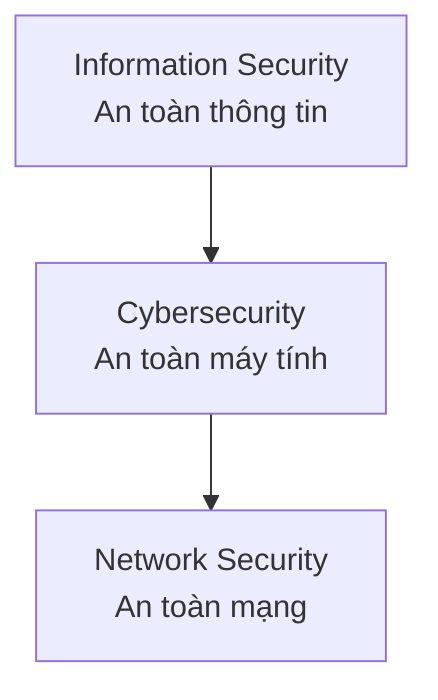
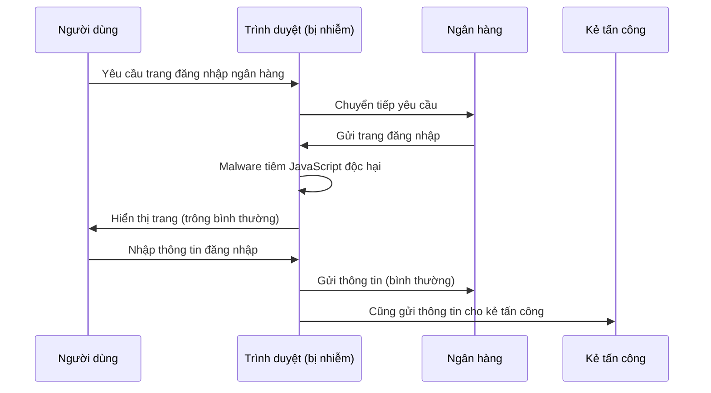
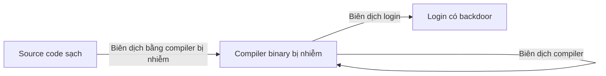
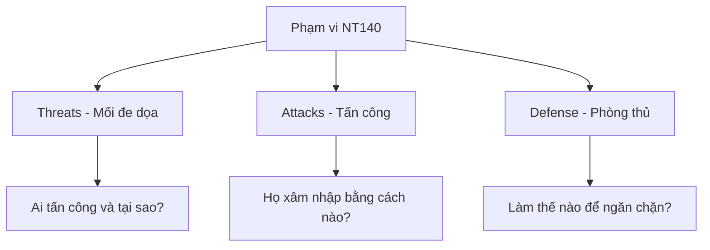

# Bài 1: Giới thiệu về An toàn mạng

## 1. Giới thiệu về Cybersecurity

### 1.1 Định nghĩa An toàn thông tin

Theo NIST (National Institute of Standards and Technology), **An toàn thông tin (Information Security)** được định nghĩa là:

> "Sự bảo vệ thông tin và hệ thống thông tin khỏi truy cập, sử dụng, tiết lộ, gián đoạn, sửa đổi hoặc phá hủy trái phép nhằm đảm bảo tính bảo mật, toàn vẹn và sẵn sàng."

### 1.2 Bộ ba mục tiêu CIA

Ba mục tiêu cốt lõi của an toàn thông tin được gọi là **CIA Triad**:

=== "Confidentiality (Bí mật)"
    **Tránh tiết lộ thông tin trái phép.**

    Ví dụ: Mã hóa dữ liệu để chỉ người được ủy quyền mới đọc được. Nếu kẻ tấn công đánh cắp dữ liệu đã mã hóa mà không có khóa, tính bí mật vẫn được đảm bảo.

    Đây là mục tiêu **dựa trên thông tin** — có thể kiểm soát bằng cách biến đổi thông tin (mã hóa).

=== "Integrity (Toàn vẹn)"
    **Tránh sửa đổi thông tin trái phép.**

    Ví dụ: Đảm bảo rằng file tải về không bị chỉnh sửa bởi kẻ tấn công ở giữa đường truyền. Thường dùng hash (MD5, SHA-256) để kiểm tra.

    Đây cũng là mục tiêu **dựa trên thông tin** — có thể kiểm soát bằng chữ ký số, MAC...

=== "Availability (Sẵn sàng)"
    **Đảm bảo thông tin và hệ thống luôn sẵn sàng cho người được ủy quyền khi cần.**

    Ví dụ: Tấn công DDoS làm tê liệt website — vi phạm tính sẵn sàng. Cần các biện pháp như load balancing, backup, redundancy.

    Đây là mục tiêu **dựa trên hệ thống** — không thể chỉ biến đổi thông tin để giải quyết, cần bảo vệ cả cơ sở hạ tầng.

---

### 1.3 Phân biệt các khái niệm liên quan



| Khái niệm | Định nghĩa | Phạm vi |
|---|---|---|
| Information Security | Bảo vệ thông tin ở mọi dạng (giấy tờ, kỹ thuật số...) | Rộng nhất |
| Cybersecurity | Bảo vệ mạng máy tính, thiết bị và dữ liệu khỏi tấn công kỹ thuật số | Trung bình |
| Network Security | Bảo vệ dữ liệu được truyền qua mạng, ngăn chặn sửa đổi/đánh cắp trên đường truyền | Hẹp nhất |

---

## 2. Tình trạng Cybersecurity hiện nay

### 2.1 Thị trường nhân lực bảo mật đang thiếu hụt nghiêm trọng

Theo nghiên cứu ISACA 2020 với 2.051 người tham gia toàn cầu:

- **62%** cho biết đội ngũ cybersecurity của tổ chức họ đang thiếu người.
- **57%** hiện có vị trí cybersecurity chưa được lấp đầy.
- **32%** nói phải mất 6 tháng hoặc hơn để tuyển được ứng viên đủ tiêu chuẩn.
- **70%** cho biết chưa đến một nửa ứng viên cybersecurity là thực sự đủ năng lực.
- **72%** chuyên gia cybersecurity cho rằng bộ phận HR không hiểu được nhu cầu của họ.

Ba yếu tố quan trọng nhất để đánh giá ứng viên:

1. **95%** — Kinh nghiệm thực chiến cybersecurity
2. **89%** — Chứng chỉ chuyên môn
3. **81%** — Đào tạo thực hành

!!! warning "Lý do nhân viên bảo mật nghỉ việc"
    1. Bị công ty khác tuyển dụng (59%)
    2. Ít cơ hội thăng tiến (50%)
    3. Đãi ngộ tài chính kém (50%)
    4. Áp lực công việc cao (40%)
    5. Thiếu sự hỗ trợ từ quản lý (39%)

### 2.2 Vấn đề thiếu kỹ năng

- Chỉ **27%** cho rằng sinh viên tốt nghiệp ngành cybersecurity đã sẵn sàng cho công việc thực tế.
- Các khoảng cách kỹ năng phổ biến: thiếu kinh nghiệm thực hành, thiếu kỹ năng mềm, thiếu hiểu biết nghiệp vụ.

### 2.3 Các phương thức tấn công phổ biến nhất

Trong bối cảnh COVID-19, tội phạm mạng gia tăng theo ISACA 2020:

| Tác nhân đe dọa | Tỷ lệ |
|---|---|
| Tội phạm mạng (Cybercriminals) | 22% |
| Hacker | 19% |
| Kẻ nội gián độc hại (Malicious insiders) | 11% |
| Kẻ nội gián vô ý (Non-malicious insiders) | 10% |
| Hacker được nhà nước bảo trợ | 9% |
| Hacktivist | 8% |

**Top 3 phương thức tấn công:**
1. Social engineering (15%)
2. Advanced Persistent Threat - APT (10%)
3. Ransomware và hệ thống chưa vá lỗi (9% mỗi loại)

---

## 3. Các mối đe dọa bảo mật — Hacker và Tội phạm mạng

### 3.1 Phân loại Hacker

"Security hacker" là những người tham gia vào việc vượt qua các biện pháp bảo mật máy tính.

=== "Black Hat"
    **Hacker mũ đen / Cracker**

    Tấn công hệ thống với mục đích xấu: đánh cắp dữ liệu, phá hoại, tống tiền, kiếm tiền bất hợp pháp. Đây là những kẻ thực hiện tội phạm mạng.

=== "White Hat"
    **Hacker mũ trắng / Ethical Hacker**

    Được cấp phép để tìm kiếm lỗ hổng bảo mật nhằm giúp tổ chức vá lỗi. Họ làm việc trong khuôn khổ pháp luật, thường được gọi là penetration tester.

=== "Gray Hat"
    **Hacker mũ xám**

    Ở ranh giới giữa hai loại trên: có thể xâm nhập hệ thống mà không được phép nhưng không gây hại, sau đó thông báo cho chủ sở hữu (đôi khi đòi tiền để vá lỗi).

### 3.2 Động cơ của Hacker

**Câu hỏi: Điều gì thúc đẩy hacker thực hiện tội phạm mạng?**

- **Tiền bạc (Money)**: Động cơ phổ biến nhất. Bán thông tin thẻ tín dụng, tống tiền ransomware, bán lỗ hổng 0-day, gian lận click quảng cáo...
- **Quyền lực (Power)**: Kiểm soát hệ thống, ảnh hưởng chính trị, phá hoại cơ sở hạ tầng quốc gia.
- **Cái tôi (Ego)**: Thách thức kỹ thuật, nổi tiếng trong cộng đồng hacker, chứng minh khả năng.
- **Chính trị / Ý thức hệ**: Hacktivist tấn công vì lý tưởng chính trị hoặc xã hội.
- **Tò mò / Nghịch ngợm**: Đặc biệt ở thanh thiếu niên — nhưng vẫn là tội phạm nghiêm trọng.

### 3.3 Ví dụ thực tế về hacker trẻ tuổi

!!! example "Những vụ hack nổi tiếng của thiếu niên"
    - **Jonathan James (15 tuổi)**: Hack vào máy chủ NASA, đánh cắp phần mềm trị giá 1 triệu USD, bị bắt và ngồi tù 6 tháng.
    - **Twitter Hack (2020)**: Bị điều phối bởi một nhóm trẻ tuổi, có người chỉ 17 tuổi, dùng social engineering để kiểm soát các tài khoản của những người nổi tiếng nhất thế giới.
    - **Kristoffer von Hassel (2009)**: Được ghi nhận là hacker nhỏ tuổi nhất thế giới khi tìm ra lỗ hổng trong Xbox của bố.

### 3.4 Hacker được nhà nước bảo trợ (Nation-State Actors)

Đây là mối đe dọa nguy hiểm nhất ở cấp độ quốc gia:

!!! danger "Ví dụ điển hình"
    - **Stuxnet**: Sâu máy tính được cho là do Mỹ và Israel tạo ra, nhắm vào cơ sở hạt nhân Natanz của Iran. Phá hủy vật lý các máy ly tâm làm giàu uranium.
    - **Tấn công Estonia (2007)**: Toàn bộ cơ sở hạ tầng số của Estonia — ngân hàng, báo chí, cơ quan chính phủ — bị tê liệt bởi các cuộc tấn công DDoS phối hợp.
    - **Bầu cử Mỹ 2016**: Nga xâm nhập vào hệ thống đăng ký cử tri của một số bang.
    - **Microsoft cảnh báo (2019)**: 10.000 người bị hacker nhà nước nhắm mục tiêu.

---

## 4. Tại sao hacker chiếm quyền kiểm soát máy tính?

### 4.1 Mục đích 1: Sử dụng địa chỉ IP và băng thông

**Mục tiêu của kẻ tấn công**: Trông giống như một người dùng Internet bình thường bằng cách sử dụng máy tính bị nhiễm.

Ứng dụng của máy tính bị chiếm quyền (botnet):

- **Spam**: Ví dụ Storm botnet — trong 12 triệu email spam dược phẩm mới có 1 người mua; trong 260.000 email có thẻ chúc mừng thì mới có 1 máy bị nhiễm.
- **Tấn công DDoS**: Dịch vụ cho thuê: 1 giờ = 20 USD, 24 giờ = 100 USD.
- **Gian lận click (Click fraud)**: Ví dụ Clickbot.a — tự động click vào quảng cáo để kiếm tiền bất hợp pháp.

### 4.2 Mục đích 2: Đánh cắp thông tin đăng nhập

**Man-in-the-Browser (MITB)** — cơ chế hoạt động:



Ví dụ: **Silent Banker Trojan**, **Zeus Botnet** — ghi lại mật khẩu ngân hàng, lan truyền qua email spam và trang web bị hack.

Top các malware tài chính (Kaspersky 2017): Trojan-Spy Zbot, Trojan Nymaim, SpyEye, Emotet, Dridex...

### 4.3 Mục đích 3: Ransomware (Mã độc tống tiền)

**WannaCry (2017)** — ví dụ điển hình:

!!! info "Dòng thời gian WannaCry"
    - **14/4/2017**: Nhóm ShadowBrokers công bố lỗ hổng EternalBlue (khai thác giao thức SMB, cổng 445) bị đánh cắp từ NSA.
    - **12/5/2017**: Sâu WannaCry xuất hiện — chỉ mất **3 tuần** để vũ khí hóa lỗ hổng này.
    - Mã hóa toàn bộ file của nạn nhân, đòi tiền chuộc bằng Bitcoin.
    - Hai năm sau, **hàng triệu máy tính vẫn còn dễ bị tấn công**.

Ví dụ khác: **Garmin (2020)** — bị tấn công bởi WastedLocker, phải trả 10 triệu USD tiền chuộc.

### 4.4 Mục đích 4: Tấn công phía máy chủ (Server-side attacks)

- **Đánh cắp dữ liệu**: Equifax (7/2017) — khai thác lỗ hổng Apache Struts (RCE), làm lộ dữ liệu của ~143 triệu khách hàng.
- **Động cơ chính trị**: Tấn công vào DNC, GitHub (3/2015), Facebook Tunisia (2/2011).
- **Lây nhiễm người dùng truy cập**: Trang web bị hack sẽ phát tán mã độc cho người truy cập.

!!! example "Tại Việt Nam"
    - Maritime Bank: 2 triệu tài khoản bị lộ thông tin (họ tên, CMND, số điện thoại, địa chỉ, nghề nghiệp...).
    - Zoom (4/2020): Hơn 500.000 tài khoản người dùng Việt Nam bị lộ.

---

## 5. Các lỗ hổng bảo mật (Vulnerabilities)

### 5.1 Nguyên nhân mất dữ liệu của doanh nghiệp

Theo PrivacyRights.org 2020:

| Nguyên nhân | Tỷ lệ |
|---|---|
| Malware/Hacking | 32% |
| Mất/đánh cắp laptop, máy chủ | 22% |
| Tiết lộ ngoài ý muốn | 21% |
| Lạm dụng/tấn công từ nội bộ | 17% |
| Mất tài liệu vật lý | 7% |

### 5.2 Lỗ hổng từ lỗi phần mềm (Software Bugs)

Lỗ hổng có thể xuất phát từ lỗi trong thiết kế hoặc triển khai phần mềm.

**Ví dụ kinh điển: Buffer Overflow (Tràn bộ đệm)**

- Được sử dụng trong sâu Internet đầu tiên — **Morris Worm (1988)** — và vẫn là một trong những vấn đề lớn nhất ngày nay.
- Nguyên lý: Khi chương trình ghi dữ liệu vượt quá giới hạn vùng bộ nhớ được cấp phát, dữ liệu thừa có thể ghi đè lên vùng bộ nhớ khác, bao gồm cả địa chỉ trả về của hàm, cho phép kẻ tấn công thực thi mã tùy ý.

**CWE Top 25 — 25 lỗ hổng phần mềm nguy hiểm nhất (2020):**

| Hạng | ID | Tên lỗ hổng | Điểm |
|---|---|---|---|
| 1 | CWE-79 | Cross-site Scripting (XSS) | 46.82 |
| 2 | CWE-787 | Out-of-bounds Write | 46.17 |
| 3 | CWE-20 | Improper Input Validation | 33.47 |
| 4 | CWE-125 | Out-of-bounds Read | 26.50 |
| 5 | CWE-119 | Buffer Overflow | 23.73 |
| 6 | CWE-89 | SQL Injection | 20.69 |

**Ứng dụng bị khai thác nhiều nhất (Kaspersky 2019):**

| Ứng dụng | Tỷ lệ |
|---|---|
| Office | 65.59% |
| Browser | 16.22% |
| Android | 12.54% |
| Java | 3.55% |
| Adobe Flash | 1.45% |
| PDF | 0.65% |

### 5.3 Lỗ hổng từ cấu hình sai (Misconfiguration)

!!! warning "Đây là một vấn đề cực kỳ nghiêm trọng!"
    - **Gartner** ước tính **65% cuộc tấn công mạng** khai thác các hệ thống bị cấu hình sai.
    - **Yankee Group**: 62% sự cố mạng là do lỗi cấu hình.
    - **OWASP Top 10**: Security Misconfiguration xếp hạng #6 trong danh sách lỗ hổng web phổ biến nhất.

Ví dụ điển hình: **Cloud server bị cấu hình sai** — cho phép dữ liệu công khai thay vì riêng tư, hacker là người đầu tiên phát hiện và tải dữ liệu xuống.

Phân tích của Telcordia trên 1.500 router, switch và firewall từ 8 mạng doanh nghiệp: **Tìm thấy lỗi trên TẤT CẢ các thiết bị.**

### 5.4 Lỗ hổng từ con người (Human Factors)

Con người thường là mắt xích yếu nhất trong chuỗi bảo mật.

!!! example "Thí nghiệm USB thả xuống bãi đỗ xe"
    Một kỹ thuật tấn công kinh điển: thả USB có logo của công ty vào bãi đỗ xe. Nhân viên nhặt được sẽ cắm vào máy tính vì muốn giúp đỡ (nghĩ rằng CEO đánh rơi). USB chứa mã độc sẽ tự động chạy.
    
    Stuxnet được cho là đã được triển khai theo cách này.

**Theo IBM**: Chi phí trung bình của một vụ vi phạm dữ liệu là **3,6 triệu USD toàn cầu**, phần lớn có thể truy nguyên từ sự bất cẩn của nhân viên nội bộ.

**Ngành giáo dục và vận tải** có nguy cơ cao nhất bị tấn công phishing do đào tạo nhân viên yếu kém (theo báo cáo Proofpoint 2019).

---

## 6. Thị trường cho lỗ hổng bảo mật (Marketplace for Vulnerabilities)

### 6.1 Bug Bounty Programs (Chương trình thưởng tìm lỗi)

Cách hợp pháp để bán/báo cáo lỗ hổng:

| Chương trình | Thưởng tối đa |
|---|---|
| Apple Bug Bounty | $200,000 |
| Microsoft Bounty Program | $100,000 |
| Google Vulnerability Reward Program | $31,337 |
| HackerOne | Biến đổi |

!!! info "Kỷ lục HackerOne (2019)"
    6 hacker đã kiếm được hơn **1 triệu USD mỗi người** từ bug bounty. Người đầu tiên đạt mốc này là Santiago Lopez (19 tuổi, Argentina), với 5.000 lỗ hổng bảo mật được vá nhờ các hacker này.

### 6.2 Thị trường chợ đen — Zerodium

Zerodium là công ty mua lại các lỗ hổng **0-day** (chưa được biết đến/vá) với giá rất cao để bán lại cho khách hàng là các chính phủ (chủ yếu châu Âu và Bắc Mỹ).

**Giá mua lỗ hổng mobile (2019):**

| Lỗ hổng | Giá |
|---|---|
| Android Full Chain Persistence (Zero Click) | $2,500,000 |
| iOS Full Chain Persistence (Zero Click) | $2,000,000 |
| WhatsApp/iMessage RCE+LPE (Zero Click) | $1,500,000 |
| Chrome RCE+LPE (Desktop) | $1,000,000 |
| Safari RCE+LPE | $500,000 |

**Giải thích thuật ngữ:**
- **RCE**: Remote Code Execution — thực thi mã từ xa
- **LPE**: Local Privilege Escalation — leo thang đặc quyền cục bộ
- **SBX**: Sandbox Escape — thoát khỏi sandbox
- **Zero Click**: Không cần tương tác của nạn nhân — cực kỳ nguy hiểm
- **0-day**: Lỗ hổng chưa được nhà sản xuất biết đến, chưa có bản vá

---

## 7. Các vụ tấn công mạng nổi tiếng trong lịch sử

| Năm | Tên | Mô tả |
|---|---|---|
| 1988 | Morris Worm | Sâu Internet đầu tiên, khai thác buffer overflow, fingerd, sendmail |
| 1994 | Mitnick Attack | Kevin Mitnick tấn công Tsutomu Shimomura bằng IP spoofing và TCP sequence prediction |
| 2000 | MafiaBoy | Michael Calce (15 tuổi) tấn công DDoS Yahoo, Amazon, CNN, Dell |
| 2008 | Kaminsky Attack | Lỗ hổng DNS cache poisoning nghiêm trọng |
| 2014 | Heartbleed | Lỗ hổng trong OpenSSL, ảnh hưởng hàng triệu server |
| 2016 | Mirai Botnet | Botnet từ thiết bị IoT, tấn công DDoS làm sập một phần Internet |
| 2017 | WannaCry | Ransomware toàn cầu, khai thác EternalBlue |

---

## 8. Tư duy bảo mật — "Trusting Trust"

### 8.1 Bài toán tin tưởng

**Câu hỏi: Chúng ta có thể tin tưởng chương trình `login` trên Linux không?**

- Không! Chương trình login có thể có backdoor — ghi lại mật khẩu khi bạn gõ.
- Giải pháp: Biên dịch lại từ source code.

**Câu hỏi: Chúng ta có thể tin tưởng source code của login không?**

- Có thể kiểm tra source code, rồi biên dịch lại.
- Nhưng... điều gì đảm bảo compiler không bị backdoor?

### 8.2 Backdoor thông minh của Ken Thompson (1984)

Ken Thompson, người đồng sáng tạo Unix, đã trình bày một cuộc tấn công tinh vi trong bài báo "Reflections on Trusting Trust" (CACM 8/1984):

**Bước 1 — Chỉnh sửa source code compiler:**

```c
compile(s) {
    if (match(s, "login-program")) {
        compile("login-backdoor");
        return;
    }
    if (match(s, "compiler-program")) {
        compile("compiler-backdoor");
        return;
    }
    /* biên dịch bình thường */
}
```

**Bước 2 — Thực thi cuộc tấn công:**

1. Biên dịch compiler đã bị chỉnh sửa → tạo ra **compiler binary có backdoor**.
2. **Khôi phục source code compiler về trạng thái ban đầu** (sạch, không có backdoor).

**Kết quả:**
- Kiểm tra source code → không thấy gì bất thường.
- Nhưng khi biên dịch compiler từ source code sạch đó bằng compiler binary bị nhiễm → cho ra compiler binary bị nhiễm mới.
- Và khi compiler này biên dịch chương trình login → tự động thêm backdoor vào login.



!!! danger "Điểm mấu chốt"
    Bạn không thể phát hiện ra cuộc tấn công này bằng cách kiểm tra source code, vì backdoor chỉ tồn tại trong **binary**, không có trong **source**.

### 8.3 Vậy chúng ta có thể tin tưởng gì?

**Kịch bản**: Bạn đặt mua laptop qua mạng. Khi nhận được, bạn có thể tin tưởng gì?

| Thành phần | Có thể tin không? | Giải pháp |
|---|---|---|
| Ứng dụng / OS có sẵn | Không — có thể có backdoor | Cài lại OS |
| Cách cài lại OS? | Không dùng OS hiện tại để cài OS | Boot từ USB (Tails/Debian) |
| BIOS / UEFI | Không — ví dụ ShadowHammer 2018 | Khó giải quyết |
| Motherboard / Firmware | Không — có thể bị can thiệp chuỗi cung ứng | Rất khó giải quyết |

**Thực tế đáng buồn**: Về lý thuyết, **không có gì là hoàn toàn đáng tin cậy**.

### 8.4 Giải pháp thực tế — Trusted Computing Base (TCB)

!!! success "Trusted Computing Base (TCB)"
    **Giả định**: Một phần tối thiểu của hệ thống là **không bị xâm phạm**.
    
    Từ đó, xây dựng môi trường an toàn trên nền tảng đáng tin cậy tối thiểu đó.
    
    Đây là nền tảng của toàn bộ ngành bảo mật máy tính.

---

## 9. Phạm vi của môn học NT140



**Các lớp mạng được nghiên cứu:**

| Lớp | Giao thức | Bài học |
|---|---|---|
| Application Layer | DNS, BGP | Bài 10, 13-15 |
| Transport Layer | TCP, UDP | Bài 9 |
| Network Layer | IP, ICMP | Bài 8 |
| Data Link Layer | Ethernet, ARP | Bài 7 |
| Physical Layer | — | Tổng quan |

**Lịch học sơ bộ:**
- Bài 01: Giới thiệu Cybersecurity
- Bài 02: Nguyên tắc và khái niệm cơ bản
- Bài 03: Mật mã học
- Bài 04: OS Security, Malware
- Bài 05: Tổng quan mạng và TCP/IP
- Bài 06: Packet Sniffing & Spoofing
- Bài 07: Data Link Layer Security
- Bài 08: Network Layer Security
- Bài 09: Transport Layer Security
- Bài 10: Application Layer — DNS Attacks
- Bài 11: Firewalls, IDPS, Honeypot
- Bài 12: Privacy, Anonymity, Censorship
- Bài 13-15: Seminar — Các chủ đề mới trong Network Security

---

## Câu hỏi trắc nghiệm

**Câu 1.** Theo NIST, định nghĩa đầy đủ của "An toàn thông tin" bao gồm bảo vệ thông tin khỏi?

- A. Chỉ truy cập trái phép
- B. Chỉ phá hủy và sửa đổi
- C. Truy cập, sử dụng, tiết lộ, gián đoạn, sửa đổi hoặc phá hủy trái phép
- D. Virus và malware

??? info "Đáp án & Giải thích"
    **Đáp án: C**

    Định nghĩa của NIST bao gồm 6 khía cạnh: unauthorized access (truy cập), use (sử dụng), disclosure (tiết lộ), disruption (gián đoạn), modification (sửa đổi), destruction (phá hủy).

---

**Câu 2.** "CIA Triad" trong an toàn thông tin là viết tắt của?

- A. Cybersecurity, Intelligence, Analysis
- B. Confidentiality, Integrity, Availability
- C. Control, Inspection, Authentication
- D. Cryptography, Identification, Authorization

??? info "Đáp án & Giải thích"
    **Đáp án: B**

    CIA Triad là bộ ba mục tiêu cốt lõi: Confidentiality (Bí mật), Integrity (Toàn vẹn), Availability (Sẵn sàng).

---

**Câu 3.** Tính "Availability" (Sẵn sàng) trong CIA Triad bị vi phạm trong tình huống nào?

- A. Kẻ tấn công đọc được email của bạn
- B. Kẻ tấn công sửa đổi dữ liệu trong database
- C. Tấn công DDoS làm tê liệt website của công ty
- D. Kẻ tấn công đánh cắp mật khẩu của bạn

??? info "Đáp án & Giải thích"
    **Đáp án: C**

    DDoS (Distributed Denial of Service) ngăn người dùng hợp lệ truy cập vào hệ thống, vi phạm trực tiếp tính Sẵn sàng. Đọc email vi phạm Confidentiality, sửa đổi dữ liệu vi phạm Integrity.

---

**Câu 4.** Điểm khác biệt chính giữa "Network Security" và "Cybersecurity" là?

- A. Network Security chỉ bảo vệ phần cứng, Cybersecurity bảo vệ phần mềm
- B. Network Security là tập con của Cybersecurity, tập trung vào bảo vệ dữ liệu trong quá trình truyền
- C. Cybersecurity là tập con của Network Security
- D. Hai khái niệm này hoàn toàn giống nhau

??? info "Đáp án & Giải thích"
    **Đáp án: B**

    Theo sơ đồ trong bài: Information Security ⊃ Cybersecurity ⊃ Network Security. Network Security tập trung vào bảo vệ dữ liệu được truyền qua mạng.

---

**Câu 5.** Theo ISACA 2020, bao nhiêu phần trăm tổ chức cho biết đội ngũ cybersecurity của họ đang thiếu nhân lực?

- A. 32%
- B. 57%
- C. 62%
- D. 70%

??? info "Đáp án & Giải thích"
    **Đáp án: C**

    62% cho biết đội ngũ cybersecurity đang understaffed (thiếu người). 57% có vị trí chưa được lấp đầy. 32% mất 6 tháng+ để tuyển người. 70% ứng viên không đủ năng lực.

---

**Câu 6.** Yếu tố quan trọng nhất để đánh giá ứng viên cybersecurity theo ISACA 2020 là?

- A. Bằng cấp đại học
- B. Chứng chỉ chuyên môn
- C. Kinh nghiệm thực chiến cybersecurity
- D. Kỹ năng mềm

??? info "Đáp án & Giải thích"
    **Đáp án: C**

    95% cho rằng hands-on cybersecurity experience là quan trọng nhất, tiếp theo là credentials (89%) và hands-on training (81%).

---

**Câu 7.** Phương thức tấn công phổ biến nhất theo ISACA 2020 là?

- A. Ransomware
- B. Advanced Persistent Threat
- C. Social Engineering
- D. SQL Injection

??? info "Đáp án & Giải thích"
    **Đáp án: C**

    Social engineering chiếm 15%, tiếp theo là APT (10%), rồi ransomware và unpatched systems (9% mỗi loại).

---

**Câu 8.** "Black Hat Hacker" khác với "White Hat Hacker" ở điểm nào?

- A. Black hat dùng Linux, white hat dùng Windows
- B. Black hat tấn công với mục đích xấu/bất hợp pháp, white hat được ủy quyền để kiểm tra bảo mật
- C. Black hat giỏi hơn white hat
- D. Black hat chỉ tấn công cá nhân, white hat chỉ tấn công tổ chức

??? info "Đáp án & Giải thích"
    **Đáp án: B**

    Điểm khác biệt cốt lõi là **ủy quyền và mục đích**. White hat (ethical hacker) có sự cho phép hợp pháp và mục đích bảo vệ. Black hat (cracker) tấn công trái phép vì lợi ích cá nhân.

---

**Câu 9.** Kỹ thuật tấn công "Man-in-the-Browser (MITB)" hoạt động như thế nào?

- A. Kẻ tấn công thay thế toàn bộ trình duyệt của nạn nhân
- B. Malware tiêm JavaScript vào trang web trong trình duyệt, gửi thông tin đăng nhập cho kẻ tấn công
- C. Kẻ tấn công chặn kết nối giữa trình duyệt và server
- D. Kẻ tấn công đánh cắp cookie session

??? info "Đáp án & Giải thích"
    **Đáp án: B**

    MITB hoạt động bằng cách malware (như Silent Banker Trojan, Zeus) tiêm JavaScript vào trang ngân hàng đang hiển thị trong trình duyệt. Khi người dùng submit form đăng nhập, thông tin được gửi cả đến ngân hàng (bình thường) lẫn đến server của kẻ tấn công.

---

**Câu 10.** Lỗ hổng EternalBlue khai thác giao thức/dịch vụ nào?

- A. HTTP (cổng 80)
- B. FTP (cổng 21)
- C. SMB (cổng 445)
- D. DNS (cổng 53)

??? info "Đáp án & Giải thích"
    **Đáp án: C**

    EternalBlue khai thác lỗ hổng trong giao thức SMB (Server Message Block) trên cổng 445. Lỗ hổng này được ShadowBrokers công bố ngày 14/4/2017 và WannaCry sử dụng chỉ 3 tuần sau đó.

---

**Câu 11.** WannaCry được phát hiện vào ngày nào?

- A. 14/4/2017
- B. 12/5/2017
- C. 17/6/2017
- D. 1/1/2017

??? info "Đáp án & Giải thích"
    **Đáp án: B**

    EternalBlue được công bố ngày 14/4/2017. Đến 12/5/2017, WannaCry xuất hiện — tức là chỉ mất 3 tuần để "vũ khí hóa" lỗ hổng.

---

**Câu 12.** Vụ vi phạm dữ liệu Equifax (2017) ảnh hưởng đến bao nhiêu khách hàng?

- A. Khoảng 14 triệu
- B. Khoảng 143 triệu
- C. Khoảng 14 nghìn
- D. Khoảng 1.43 tỷ

??? info "Đáp án & Giải thích"
    **Đáp án: B**

    Equifax bị tấn công vào tháng 7/2017 thông qua lỗ hổng RCE trong Apache Struts, ảnh hưởng đến khoảng 143 triệu bản ghi khách hàng.

---

**Câu 13.** Lỗ hổng nào xếp hạng 1 trong CWE Top 25 Most Dangerous Software Weaknesses 2020?

- A. SQL Injection
- B. Buffer Overflow
- C. Cross-site Scripting (XSS)
- D. Out-of-bounds Write

??? info "Đáp án & Giải thích"
    **Đáp án: C**

    CWE-79 (Cross-site Scripting) đứng đầu với điểm 46.82, tiếp theo là CWE-787 (Out-of-bounds Write, 46.17) và CWE-20 (Improper Input Validation, 33.47).

---

**Câu 14.** "Buffer Overflow" lần đầu tiên được sử dụng rộng rãi trong cuộc tấn công nào?

- A. WannaCry (2017)
- B. Morris Worm (1988)
- C. Stuxnet (2010)
- D. Heartbleed (2014)

??? info "Đáp án & Giải thích"
    **Đáp án: B**

    Morris Worm (1988) là sâu Internet đầu tiên được biết đến rộng rãi và nó khai thác lỗ hổng buffer overflow trong fingerd và sendmail.

---

**Câu 15.** Theo Gartner, bao nhiêu phần trăm cuộc tấn công mạng khai thác hệ thống bị cấu hình sai?

- A. 25%
- B. 45%
- C. 65%
- D. 85%

??? info "Đáp án & Giải thích"
    **Đáp án: C**

    Gartner ước tính 65% các cuộc tấn công mạng khai thác misconfigured systems. Yankee Group cũng cho biết 62% sự cố mạng là do lỗi cấu hình.

---

**Câu 16.** "Security Misconfiguration" xếp thứ bao nhiêu trong OWASP Top 10?

- A. Thứ 1
- B. Thứ 3
- C. Thứ 6
- D. Thứ 10

??? info "Đáp án & Giải thích"
    **Đáp án: C**

    Security Misconfiguration xếp hạng #6 trong OWASP Top 10 - danh sách các rủi ro bảo mật web nghiêm trọng nhất.

---

**Câu 17.** Stuxnet nhắm vào mục tiêu nào?

- A. Hệ thống ngân hàng của Iran
- B. Cơ sở hạt nhân Natanz của Iran
- C. Mạng điện lưới của Mỹ
- D. Hệ thống bầu cử của Nga

??? info "Đáp án & Giải thích"
    **Đáp án: B**

    Stuxnet là sâu máy tính (được cho là do Mỹ và Israel tạo ra) nhắm vào hệ thống kiểm soát công nghiệp (SCADA) tại cơ sở làm giàu uranium Natanz của Iran, phá hủy vật lý các máy ly tâm.

---

**Câu 18.** Trong tấn công "USB Drop", kẻ tấn công dựa vào yếu tố tâm lý nào của nạn nhân?

- A. Lòng tham
- B. Sự tò mò và mong muốn giúp đỡ
- C. Nỗi sợ hãi
- D. Sự bất cẩn

??? info "Đáp án & Giải thích"
    **Đáp án: B**

    Khi nhân viên nhìn thấy USB có logo công ty trong bãi đỗ xe, phản ứng tự nhiên là muốn **giúp đỡ** (nghĩ rằng đó là của sếp bị rơi, có thể có tài liệu quan trọng). Đây là social engineering khai thác lòng tốt chứ không phải sự ngu ngốc.

---

**Câu 19.** Zerodium là gì?

- A. Một chương trình bug bounty của Google
- B. Một loại malware tấn công hệ thống không qua mạng
- C. Công ty mua lại lỗ hổng 0-day để bán cho chính phủ
- D. Một framework kiểm tra thâm nhập mã nguồn mở

??? info "Đáp án & Giải thích"
    **Đáp án: C**

    Zerodium là công ty chuyên mua các lỗ hổng 0-day (chưa được vá) với giá rất cao và bán lại cho khách hàng là các tổ chức chính phủ (chủ yếu châu Âu và Bắc Mỹ).

---

**Câu 20.** Giá mua cao nhất của Zerodium năm 2019 là bao nhiêu và cho lỗ hổng nào?

- A. $2,000,000 — iOS Full Chain
- B. $2,500,000 — Android Full Chain Persistence Zero Click
- C. $1,500,000 — WhatsApp Zero Click
- D. $1,000,000 — Chrome RCE+LPE

??? info "Đáp án & Giải thích"
    **Đáp án: B**

    Android Full Chain with Persistence, Zero Click được trả đến $2,500,000 — cao hơn iOS ($2,000,000) vì Android khó exploit hơn do phân mảnh và có nhiều cơ chế bảo mật.

---

**Câu 21.** "RCE" trong bảng giá Zerodium là viết tắt của?

- A. Remote Control Encryption
- B. Remote Code Execution
- C. Recursive Code Error
- D. Real-time Cryptographic Exploit

??? info "Đáp án & Giải thích"
    **Đáp án: B**

    RCE = Remote Code Execution — khả năng thực thi mã tùy ý trên hệ thống từ xa mà không cần truy cập vật lý. Đây là loại lỗ hổng nguy hiểm nhất.

---

**Câu 22.** "Zero Click" exploit nguy hiểm hơn exploit thông thường vì?

- A. Nó mã hóa mạnh hơn
- B. Nó không cần bất kỳ tương tác nào từ nạn nhân
- C. Nó tự xóa dấu vết
- D. Nó hoạt động trên mọi hệ điều hành

??? info "Đáp án & Giải thích"
    **Đáp án: B**

    Zero Click không yêu cầu nạn nhân click link, mở file, hay làm bất cứ điều gì. Chỉ cần gửi tin nhắn (dù nạn nhân không đọc) là đủ để khai thác. Điều này khiến việc phòng thủ cực kỳ khó khăn.

---

**Câu 23.** Bài báo "Reflections on Trusting Trust" được viết bởi ai và năm nào?

- A. Bruce Schneier, 1990
- B. Dan Boneh, 2000
- C. Ken Thompson, 1984
- D. Dennis Ritchie, 1972

??? info "Đáp án & Giải thích"
    **Đáp án: C**

    Ken Thompson (đồng sáng tạo Unix, ngôn ngữ B — tiền thân của C) trình bày bài "Reflections on Trusting Trust" tại buổi nhận giải Turing Award năm 1983, đăng trên CACM tháng 8/1984.

---

**Câu 24.** Ý tưởng cốt lõi trong "Reflections on Trusting Trust" của Ken Thompson là?

- A. Mã nguồn mở an toàn hơn mã nguồn đóng
- B. Backdoor có thể được ẩn trong compiler binary mà không xuất hiện trong source code
- C. Mật khẩu nên được mã hóa bằng thuật toán một chiều
- D. Hệ thống Unix an toàn hơn Windows

??? info "Đáp án & Giải thích"
    **Đáp án: B**

    Thompson chứng minh rằng có thể tạo backdoor tự nhân bản trong compiler binary. Khi biên dịch từ source code sạch bằng compiler bị nhiễm, kết quả vẫn là compiler bị nhiễm. Source code sạch nhưng binary không sạch — không thể phát hiện qua code review.

---

**Câu 25.** "Trusted Computing Base (TCB)" là gì?

- A. Tập hợp tất cả phần cứng được tin tưởng tuyệt đối
- B. Phần tối thiểu của hệ thống được giả định là không bị xâm phạm để làm nền tảng xây dựng môi trường an toàn
- C. Cơ sở dữ liệu về các thiết bị đáng tin cậy
- D. Chứng chỉ bảo mật do chính phủ cấp

??? info "Đáp án & Giải thích"
    **Đáp án: B**

    Vì không thể tin tuyệt đối vào bất cứ điều gì, TCB là giải pháp thực tế: giả định một phần tối thiểu (thường là hardware + firmware + kernel) là an toàn, rồi xây dựng các lớp bảo mật trên đó.

---

**Câu 26.** Khi đặt mua laptop qua mạng và nhận về, vì sao không thể tin tưởng vào BIOS/UEFI?

- A. BIOS quá cũ, không hỗ trợ bảo mật hiện đại
- B. Có thể bị can thiệp trong chuỗi cung ứng, ví dụ như chiến dịch ShadowHammer 2018
- C. BIOS không có chữ ký số
- D. BIOS không được cập nhật thường xuyên

??? info "Đáp án & Giải thích"
    **Đáp án: B**

    Chiến dịch ShadowHammer (2018) là ví dụ thực tế: kẻ tấn công can thiệp vào chuỗi cung ứng để chèn mã độc vào firmware UEFI. Người dùng nhận được sản phẩm đã bị nhiễm từ nhà sản xuất.

---

**Câu 27.** Sâu Morris (Morris Worm) xuất hiện năm nào và được phân loại là gì?

- A. 1994, virus
- B. 1988, sâu Internet đầu tiên được biết đến rộng rãi
- C. 2000, trojan
- D. 1983, spyware

??? info "Đáp án & Giải thích"
    **Đáp án: B**

    Morris Worm (1988) được coi là sâu Internet đầu tiên lan rộng. Nó khai thác buffer overflow trong fingerd, một lỗ hổng trong sendmail debug mode, và rsh/rexec với trusted hosts. Tác giả là Robert Tappan Morris.

---

**Câu 28.** Tấn công "Click Fraud" trong bối cảnh botnet có nghĩa là?

- A. Lừa người dùng click vào link độc hại
- B. Tự động click vào quảng cáo để tạo doanh thu bất hợp pháp cho kẻ tấn công
- C. Giả mạo chứng chỉ SSL
- D. Chèn quảng cáo độc hại vào website

??? info "Đáp án & Giải thích"
    **Đáp án: B**

    Trong mô hình quảng cáo Pay-per-Click, mỗi lần click vào quảng cáo tạo ra doanh thu cho chủ website. Botnet sử dụng hàng nghìn máy tính bị chiếm quyền để tự động click, tạo ra doanh thu ảo cho kẻ tấn công.

---

**Câu 29.** Loại malware nào ghi lại tổ hợp phím người dùng nhập vào?

- A. Ransomware
- B. Rootkit
- C. Keylogger
- D. Adware

??? info "Đáp án & Giải thích"
    **Đáp án: C**

    Keylogger ghi lại mọi thứ người dùng gõ, bao gồm mật khẩu, số thẻ tín dụng, tin nhắn. Các trojan ngân hàng như Zbot (Zeus) có tích hợp keylogger để đánh cắp thông tin đăng nhập.

---

**Câu 30.** FinSpy là gì và nó thu thập loại thông tin nào?

- A. Phần mềm chống virus thương mại
- B. Spyware thương mại thu thập danh bạ, lịch sử cuộc gọi, vị trí, tin nhắn kể cả từ ứng dụng mã hóa
- C. Công cụ kiểm tra thâm nhập mã nguồn mở
- D. Phần mềm giám sát nhân viên hợp pháp

??? info "Đáp án & Giải thích"
    **Đáp án: B**

    FinSpy là "commercial spyware" (phần mềm gián điệp thương mại) hoạt động trên iOS, Android và Windows. Khi được cài, nó thu thập: danh bạ, lịch sử cuộc gọi, vị trí địa lý, tin nhắn SMS, và cả tin nhắn trong các ứng dụng mã hóa như Signal, Telegram.

---

**Câu 31.** Theo Kaspersky, trong danh sách top 10 mã độc tài chính phổ biến nhất, malware nào xếp hạng 1?

- A. Emotet
- B. Zeus/Zbot (Trojan-Spy Win32.Zbot)
- C. Dridex
- D. SpyEye

??? info "Đáp án & Giải thích"
    **Đáp án: B**

    Trojan-Spy Win32.Zbot (còn gọi là Zeus) xếp hạng 1. Zeus là một trong những banking trojan phổ biến và dai dẳng nhất, được biết đến với cơ chế Man-in-the-Browser.

---

**Câu 32.** Theo số liệu về spam trong slide, tỷ lệ chuyển đổi của spam quảng cáo dược phẩm là bao nhiêu?

- A. 1 trong 1.200 email
- B. 1 trong 12.000 email
- C. 1 trong 12 triệu email
- D. 1 trong 1.2 tỷ email

??? info "Đáp án & Giải thích"
    **Đáp án: C**

    Theo nghiên cứu "Spamalytics" được trích dẫn trong slide: 1 trong 12 triệu email spam dược phẩm dẫn đến một giao dịch mua hàng thực sự. Tuy tỷ lệ rất thấp nhưng do khối lượng cực lớn, spam vẫn sinh lời.

---

**Câu 33.** Nguyên nhân hàng đầu khiến nhân viên bảo mật rời bỏ công ty theo ISACA 2020 là?

- A. Áp lực công việc quá cao
- B. Được công ty khác tuyển dụng
- C. Thiếu đào tạo
- D. Môi trường làm việc không tốt

??? info "Đáp án & Giải thích"
    **Đáp án: B**

    59% cho biết lý do số 1 là bị công ty khác tuyển dụng (recruited by other companies). Do cầu vượt cung, nhân sự bảo mật giỏi liên tục nhận được lời mời hấp dẫn hơn.

---

**Câu 34.** Loại ứng dụng nào bị khai thác nhiều nhất theo Kaspersky Security Bulletin 2019?

- A. Browser (trình duyệt web)
- B. PDF Reader
- C. Microsoft Office
- D. Java Runtime

??? info "Đáp án & Giải thích"
    **Đáp án: C**

    Microsoft Office chiếm đến 65.59% các vụ khai thác, vượt xa Browser (16.22%), Android (12.54%), Java (3.55%), Adobe Flash (1.45%) và PDF (0.65%).

---

**Câu 35.** WastedLocker ransomware tấn công công ty nào và đòi bao nhiêu tiền chuộc?

- A. Sony — $5 triệu
- B. Garmin — $10 triệu
- C. Colonial Pipeline — $4.4 triệu
- D. JBS Foods — $11 triệu

??? info "Đáp án & Giải thích"
    **Đáp án: B**

    Garmin bị tấn công bởi WastedLocker vào tháng 7/2020. Dịch vụ GPS, hỗ trợ khách hàng và ứng dụng người dùng bị ảnh hưởng. Garmin được cho là đã trả khoảng $10 triệu tiền chuộc.

---

**Câu 36.** "APT" (Advanced Persistent Threat) là gì?

- A. Tấn công nhanh, tự động, nhắm vào nhiều mục tiêu cùng lúc
- B. Tấn công có chủ đích, dài hạn, phức tạp, thường do nhà nước hoặc nhóm tội phạm chuyên nghiệp thực hiện
- C. Phần mềm chống virus thế hệ mới
- D. Loại mã hóa bất đối xứng

??? info "Đáp án & Giải thích"
    **Đáp án: B**

    APT là cuộc tấn công dai dẳng (persistent), phức tạp (advanced), nhắm vào mục tiêu cụ thể. Kẻ tấn công có thể ẩn trong hệ thống hàng tháng hoặc hàng năm trước khi thực hiện mục tiêu cuối cùng. Thường do hacker nhà nước thực hiện.

---

**Câu 37.** Tại sao "Gray Hat Hacker" lại gây tranh cãi về mặt đạo đức?

- A. Họ dùng các công cụ bất hợp pháp
- B. Họ xâm nhập hệ thống mà không có phép nhưng không gây hại, tạo ra vùng xám pháp lý và đạo đức
- C. Họ bán thông tin cho cả hai phía
- D. Họ giả vờ là white hat nhưng thực ra là black hat

??? info "Đáp án & Giải thích"
    **Đáp án: B**

    Gray hat thực hiện hành vi xâm nhập trái phép (về mặt kỹ thuật là phạm pháp) nhưng không với mục đích gây hại. Họ thường thông báo cho chủ sở hữu sau đó. Điều này tạo ra tranh cãi: hành động tốt (giúp vá lỗi) nhưng cách thực hiện vi phạm pháp luật.

---

**Câu 38.** Theo IBM, chi phí trung bình của một vụ vi phạm dữ liệu toàn cầu là bao nhiêu?

- A. $1.2 triệu
- B. $2.4 triệu
- C. $3.6 triệu
- D. $5.8 triệu

??? info "Đáp án & Giải thích"
    **Đáp án: C**

    Theo IBM được trích dẫn trong bài, chi phí trung bình của một vụ vi phạm dữ liệu là $3.6 triệu USD toàn cầu (thời điểm bài giảng được viết).

---

**Câu 39.** Hacktivist khác với cybercriminal ở điểm nào?

- A. Hacktivist giỏi kỹ thuật hơn
- B. Hacktivist tấn công vì động cơ chính trị hoặc ý thức hệ, không phải vì tiền
- C. Hacktivist chỉ tấn công các hệ thống chính phủ
- D. Hacktivist luôn hoạt động ẩn danh

??? info "Đáp án & Giải thích"
    **Đáp án: B**

    Hacktivist (ghép từ "hacker" + "activist") tấn công để truyền tải thông điệp chính trị, xã hội hoặc môi trường. Họ thường nhắm vào các tổ chức mà họ phản đối về mặt ý thức hệ, không vì lợi ích tài chính. Ví dụ: Anonymous.

---

**Câu 40.** Trong mô hình phòng thủ bảo mật, "Defense in Depth" có nghĩa là?

- A. Xây dựng một tường lửa cực kỳ mạnh
- B. Sử dụng nhiều lớp bảo mật để nếu một lớp bị vượt qua, các lớp khác vẫn bảo vệ
- C. Tập trung bảo vệ dữ liệu quan trọng nhất
- D. Mã hóa tất cả dữ liệu

??? info "Đáp án & Giải thích"
    **Đáp án: B**

    Defense in Depth (phòng thủ theo chiều sâu) là nguyên tắc sử dụng nhiều lớp bảo mật độc lập. Ngay cả khi kẻ tấn công vượt qua được một lớp, họ vẫn phải đối mặt với các lớp tiếp theo. Đây là nguyên tắc cơ bản trong thiết kế hệ thống bảo mật.

---

**Câu 41.** Cách duy nhất để giải quyết "Backdoor trong Compiler" của Ken Thompson là gì?

- A. Kiểm tra source code thật kỹ
- B. Dùng compiler của hãng khác
- C. Sử dụng nhiều compiler khác nhau để cross-check (Diverse Double-Compiling)
- D. Không có giải pháp hoàn hảo nào

??? info "Đáp án & Giải thích"
    **Đáp án: D**

    Đây là điểm mấu chốt của bài báo Thompson: không có giải pháp hoàn toàn. Kỹ thuật "Diverse Double-Compiling" (DDC) của Ken Wheeler được đề xuất sau này như một hướng tiếp cận, nhưng TCB vẫn là giải pháp thực tế nhất — chấp nhận tin tưởng một phần tối thiểu.

---

**Câu 42.** Ngành nào có nguy cơ cao nhất với tấn công phishing theo Proofpoint 2019?

- A. Tài chính và ngân hàng
- B. Y tế và bệnh viện
- C. Giáo dục và vận tải
- D. Chính phủ và quân sự

??? info "Đáp án & Giải thích"
    **Đáp án: C**

    Theo báo cáo "Beyond the Phish" của Proofpoint 2019: ngành Giáo dục và Vận tải có nguy cơ cao nhất vì đào tạo nhân viên về cybersecurity yếu nhất.

---

**Câu 43.** "ShadowBrokers" là gì trong bối cảnh EternalBlue?

- A. Một nhóm hacker đã vá lỗ hổng EternalBlue
- B. Nhóm đã đánh cắp và công bố các công cụ tấn công của NSA, bao gồm EternalBlue
- C. Một cơ quan tình báo của Mỹ
- D. Tên mã của chiến dịch chống WannaCry

??? info "Đáp án & Giải thích"
    **Đáp án: B**

    ShadowBrokers là nhóm bí ẩn đã hack vào kho công cụ tấn công của NSA và công bố chúng. Ngày 14/4/2017, họ công bố EternalBlue. Chỉ 3 tuần sau, WannaCry sử dụng nó để tấn công toàn cầu.

---

**Câu 44.** Mục tiêu cuối cùng của môn học NT140 là phát triển điều gì ở sinh viên?

- A. Khả năng lập trình C/C++ thành thạo
- B. Chứng chỉ CEH hoặc CISSP
- C. "Security Mindset" — tư duy bảo mật
- D. Khả năng vận hành hệ thống Linux

??? info "Đáp án & Giải thích"
    **Đáp án: C**

    Mục tiêu cuối cùng được liệt kê trong course goal là "Developing a Security Mindset" — không chỉ học kỹ thuật mà còn học cách suy nghĩ như một chuyên gia bảo mật, luôn đặt câu hỏi về security implications.

---

**Câu 45.** Theo thống kê về nguồn vi phạm dữ liệu, nguyên nhân nào chiếm tỷ lệ lớn nhất?

- A. Mất/đánh cắp laptop hoặc server vật lý
- B. Malware/Hacking
- C. Tiết lộ ngoài ý muốn
- D. Kẻ nội gián lạm dụng quyền truy cập

??? info "Đáp án & Giải thích"
    **Đáp án: B**

    Theo PrivacyRights.org 2020: Malware/Hacking chiếm 32% — tỷ lệ cao nhất trong các nguyên nhân mất dữ liệu doanh nghiệp.

---

**Câu 46.** Điều gì phân biệt "0-day exploit" với exploit thông thường?

- A. 0-day exploit hoạt động nhanh hơn
- B. 0-day khai thác lỗ hổng chưa được nhà sản xuất biết đến và chưa có bản vá
- C. 0-day chỉ tấn công được hệ điều hành Windows
- D. 0-day exploit cần quyền quản trị viên

??? info "Đáp án & Giải thích"
    **Đáp án: B**

    "0-day" (zero-day) nghĩa là nhà sản xuất có "0 ngày" để chuẩn bị vá lỗ hổng vì họ chưa biết nó tồn tại. Điều này khiến 0-day cực kỳ nguy hiểm và có giá trị rất cao trên thị trường chợ đen.

---

**Câu 47.** Vụ tấn công mạng vào Estonia năm 2007 chủ yếu sử dụng kỹ thuật nào?

- A. SQL Injection vào database chính phủ
- B. Spear phishing nhắm vào quan chức
- C. DDoS coordinated attacks làm tê liệt cơ sở hạ tầng số
- D. Ransomware mã hóa dữ liệu chính phủ

??? info "Đáp án & Giải thích"
    **Đáp án: C**

    Cuộc tấn công Estonia 2007 là một trong những vụ tấn công mạng quy mô quốc gia đầu tiên. Các cuộc tấn công DDoS phối hợp làm tê liệt ngân hàng, báo chí, và cơ quan chính phủ. Estonia — một trong những quốc gia số hóa nhất thế giới — gần như tê liệt hoàn toàn.

---

**Câu 48.** Tại sao Social Engineering lại hiệu quả dù người dùng đã được cảnh báo về an ninh mạng?

- A. Kỹ thuật mã hóa của Social Engineering rất phức tạp
- B. Nó khai thác tâm lý con người (tin tưởng, sợ hãi, lòng tham, muốn giúp đỡ) thay vì lỗ hổng kỹ thuật
- C. Phần mềm chống virus không thể phát hiện Social Engineering
- D. Social Engineering luôn được thực hiện bởi các chuyên gia có nhiều năm kinh nghiệm

??? info "Đáp án & Giải thích"
    **Đáp án: B**

    Social Engineering bypass hoàn toàn các biện pháp bảo mật kỹ thuật bằng cách tác động trực tiếp vào con người — mắt xích yếu nhất. Dù có firewall tốt nhất, nếu nhân viên tự nguyện tiết lộ mật khẩu vì tin vào một cuộc gọi giả mạo IT, mọi biện pháp kỹ thuật đều vô nghĩa.

---

**Câu 49.** Trong dòng thời gian lịch sử hack, sự kiện nào xảy ra năm 2016?

- A. Heartbleed attack
- B. Kaminsky DNS attack
- C. Mirai Botnet làm sập một phần Internet
- D. WannaCry ransomware

??? info "Đáp án & Giải thích"
    **Đáp án: C**

    Mirai Botnet (2016) tập hợp hàng chục nghìn thiết bị IoT bị nhiễm (camera IP, router...) để thực hiện tấn công DDoS lịch sử, làm sập DNS provider Dyn và gián tiếp làm tê liệt Twitter, Netflix, Reddit, GitHub...

---

**Câu 50.** Theo nội dung bài học, điều nào sau đây là ĐÚNG về tình trạng hiện tại của Cybersecurity?

- A. Tội phạm mạng đang giảm dần nhờ cải tiến công nghệ
- B. Social engineering không còn hiệu quả vì người dùng đã được đào tạo tốt hơn
- C. Tội phạm mạng không ngừng tăng, và tiền lớn có thể kiếm từ khai thác lỗ hổng
- D. Hầu hết các cuộc tấn công đều đến từ hacker mới, không chuyên nghiệp

??? info "Đáp án & Giải thích"
    **Đáp án: C**

    Theo Dan Boneh (Stanford CS155) được trích dẫn: "Cybercrime is constantly increasing and more costly" và "Money (big bucks) can be made from finding and exploiting vulnerabilities". Có cả marketplace hợp pháp (bug bounty) lẫn chợ đen (Zerodium) cho lỗ hổng bảo mật.
