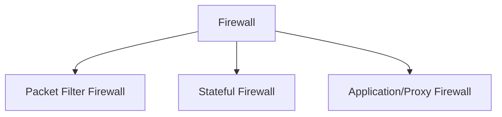
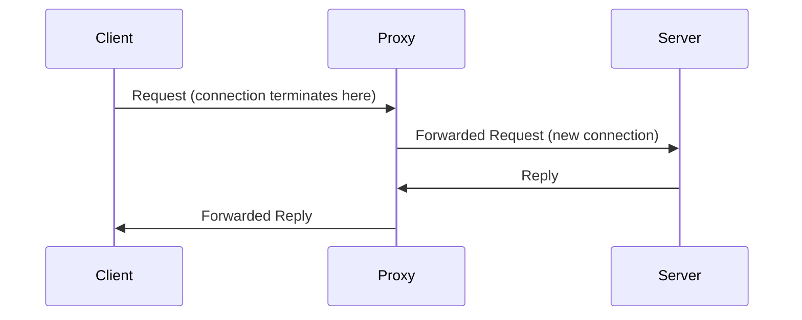
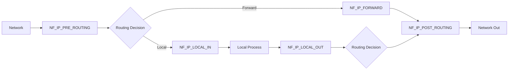
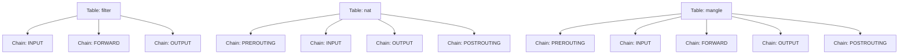
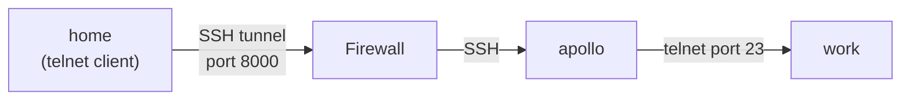

# Bài 11: Firewall — NT140 Network Security

## 1. Tổng quan về Firewall

### Firewall là gì?

Firewall là một thành phần của hệ thống máy tính hoặc mạng được thiết kế để ngăn chặn lưu lượng truy cập trái phép di chuyển từ mạng này sang mạng khác. Cụ thể hơn:

- **Phân tách** các thành phần tin cậy (trusted) và không tin cậy (untrusted) trong mạng.
- **Phân biệt** các mạng con ngay cả bên trong vùng tin cậy.
- **Chức năng chính**: lọc dữ liệu (filtering), chuyển hướng lưu lượng (redirecting traffic), và bảo vệ chống lại các cuộc tấn công mạng.

### Yêu cầu của một Firewall

1. **Tất cả lưu lượng** đi giữa các vùng tin cậy khác nhau phải đi qua firewall — không có đường vòng.
2. **Chỉ lưu lượng được phép** theo chính sách bảo mật mới được thông qua.
3. **Bản thân firewall phải miễn nhiễm** với các cuộc tấn công xâm nhập — đòi hỏi một hệ điều hành được hardened và cấu hình bảo mật nghiêm ngặt.

---

## 2. Chính sách Firewall (Firewall Policy)

Firewall kiểm soát truy cập theo ba chiều:

**User Control** — Kiểm soát dựa trên vai trò của người dùng đang cố truy cập. Áp dụng cho các người dùng bên trong vành đai firewall.

**Service Control** — Kiểm soát dựa trên loại dịch vụ mà host cung cấp. Áp dụng dựa trên địa chỉ mạng, giao thức kết nối, và số port.

**Direction Control** — Xác định chiều mà các yêu cầu có thể được khởi tạo và cho phép đi qua firewall:
- **Inbound**: Lưu lượng từ mạng ngoài vào firewall (ingress).
- **Outbound**: Lưu lượng từ bên trong ra ngoài (egress).

### Các hành động của Firewall

| Hành động | Mô tả |
|---|---|
| **Accepted** | Cho phép gói tin đi qua vào mạng/host đích |
| **Denied** | Không cho phép gói tin đi qua, huỷ im lặng |
| **Rejected** | Tương tự Denied nhưng gửi lại thông báo ICMP cho nguồn biết gói bị từ chối |

!!! note "Ingress vs Egress Filtering"
    - **Ingress filtering**: Kiểm tra lưu lượng đến (inbound) để bảo vệ mạng nội bộ khỏi các tấn công từ bên ngoài.
    - **Egress filtering**: Kiểm tra lưu lượng đi ra (outbound), ngăn người dùng nội bộ truy cập một số tài nguyên bên ngoài. Ví dụ: chặn mạng xã hội, game online trong trường học.

---

## 3. Các loại Firewall



### 3.1 Packet Filter Firewall (Stateless Firewall)

Firewall loại này hoạt động bằng cách kiểm tra thông tin trong **header của từng gói tin** một cách độc lập, không quan tâm đến payload (dữ liệu ứng dụng).

**Đặc điểm:**
- Không quan tâm gói tin có thuộc về một luồng dữ liệu đang tồn tại hay không.
- Không duy trì trạng thái (state) về các gói tin — đó là lý do còn gọi là **Stateless Firewall**.
- Quyết định dựa trên từng gói tin riêng lẻ: địa chỉ IP nguồn/đích, port, giao thức.

**Ưu điểm:** Nhanh, đơn giản, ít tốn tài nguyên.

**Nhược điểm:** Dễ bị bypass bởi các kỹ thuật giả mạo (spoofing), không thể phân tích ngữ cảnh kết nối.

### 3.2 Stateful Firewall

Firewall loại này **theo dõi trạng thái của từng kết nối** theo thời gian.

**Đặc điểm:**
- Ghi lại các thuộc tính như địa chỉ IP, số port, sequence number — được gọi chung là **connection state**.
- Duy trì một **Connection State Table** để hiểu ngữ cảnh của từng gói tin.
- Ví dụ: chỉ cho phép kết nối đến các port đang có kết nối mở hợp lệ.

**Lợi ích:** Có thể phân biệt gói tin hợp lệ thuộc về kết nối đang chạy với gói tin giả mạo được tạo ra để bypass firewall.

### 3.3 Application/Proxy Firewall

Firewall loại này phân tích dữ liệu **đến tầng ứng dụng (Layer 7)**.

**Cơ chế hoạt động:**
- Đóng vai trò là **trung gian (intermediary)** — giả mạo làm đích đến thực sự.
- Kết nối từ client **kết thúc tại proxy**; proxy mở một kết nối mới đến đích thực.
- Phân tích toàn bộ nội dung gói tin đến tầng ứng dụng để quyết định cho phép hay từ chối.



!!! warning "Hạn chế của Application Firewall"
    Cần phải implement proxy mới cho mỗi giao thức mới → tốn công hơn, chậm hơn so với các loại khác.

!!! success "Ưu điểm của Application Firewall"
    Có thể xác thực người dùng trực tiếp thay vì dựa vào địa chỉ mạng, giảm thiểu rủi ro tấn công IP Spoofing.

---

## 4. Xây dựng Firewall với Netfilter

### 4.1 Cơ chế hoạt động

Để implement packet filter firewall trong Linux kernel, cần hai cơ chế:

**Netfilter** — Framework cung cấp các **hook** (điểm móc) tại các vị trí quan trọng trên đường đi của gói tin trong Linux Kernel. Mỗi protocol stack định nghĩa một loạt hook theo đường đi của gói tin.

**Loadable Kernel Modules (LKM)** — Cho phép người dùng có đặc quyền thêm/gỡ module vào kernel một cách động mà không cần recompile toàn bộ kernel.

### 4.2 Loadable Kernel Modules

Một kernel module cơ bản có hai điểm vào/ra:

```c
#include <linux/module.h>
#include <linux/kernel.h>
#include <linux/init.h>

static int kmodule_init(void) {
    printk(KERN_INFO "Initializing this module\n");
    return 0;
}

static void kmodule_exit(void) {
    printk(KERN_INFO "Module cleanup\n");
}

module_init(kmodule_init);
module_exit(kmodule_exit);
MODULE_LICENSE("GPL");
```

- `module_init()`: Hàm khởi tạo được gọi khi module được nạp vào kernel (`insmod`).
- `module_exit()`: Hàm dọn dẹp được gọi khi module bị gỡ ra (`rmmod`).

**Compile kernel module:**

```makefile
obj-m += kMod.o
all:
    make -C /lib/modules/$(shell uname -r)/build M=$(PWD) modules
clean:
    make -C /lib/modules/$(shell uname -r)/build M=$(PWD) clean
```

**Sử dụng module:**

```bash
# Nạp module vào kernel
sudo insmod kMod.ko

# Kiểm tra module đang chạy
lsmod | grep kMod

# Gỡ module
sudo rmmod kMod

# Xem log kernel (output của printk)
dmesg
```

### 4.3 Netfilter Hooks cho IPv4

Netfilter định nghĩa 5 hook trên đường đi của gói tin IPv4:



| Hook | Vị trí | Dùng cho |
|---|---|---|
| `NF_IP_PRE_ROUTING` | Ngay sau khi gói tin đến, trước routing | Lọc tất cả traffic vào, DNAT |
| `NF_IP_LOCAL_IN` | Sau routing, gói tin dành cho local | Lọc traffic đến local process |
| `NF_IP_FORWARD` | Gói tin được chuyển tiếp | Lọc traffic đi qua router |
| `NF_IP_LOCAL_OUT` | Gói tin từ local process ra | Lọc traffic từ local process |
| `NF_IP_POST_ROUTING` | Sau routing, trước khi ra dây | SNAT, lọc outgoing |

!!! question "Câu hỏi trong slide: Muốn block outgoing telnet traffic, dùng hook nào?"
    **Đáp án:** `NF_IP_POST_ROUTING` hoặc `NF_IP_LOCAL_OUT`.
    
    - Nếu máy tính là **máy nguồn** gửi telnet: dùng `NF_IP_LOCAL_OUT`.
    - Nếu máy tính là **router** chuyển tiếp telnet: dùng `NF_IP_FORWARD`.
    - Dùng `NF_IP_POST_ROUTING` để chặn **tất cả** outgoing (cả local và forward).

### 4.4 Các verdict (quyết định) của Netfilter

| Verdict | Ý nghĩa |
|---|---|
| `NF_ACCEPT` | Cho gói tin tiếp tục đi qua stack |
| `NF_DROP` | Huỷ gói tin, không thông báo |
| `NF_QUEUE` | Chuyển gói tin lên user space qua `nf_queue` để xử lý |
| `NF_STOLEN` | Module tự xử lý gói tin, netfilter quên gói đó đi |
| `NF_REPEAT` | Yêu cầu netfilter gọi lại module này một lần nữa |

### 4.5 Implement Simple Packet Filter Firewall

**Bước 1 — Viết callback function:**

```c
unsigned int telnetFilter(void *priv, struct sk_buff *skb,
                          const struct nf_hook_state *state)
{
    struct iphdr *iph;
    struct tcphdr *tcph;

    iph = ip_hdr(skb);                          // Lấy IP header từ gói tin
    tcph = (void *)iph + iph->ihl * 4;          // Lấy TCP header

    if (iph->protocol == IPPROTO_TCP &&
        tcph->dest == htons(23)) {               // Port 23 = telnet
        printk(KERN_INFO "Dropping telnet packet to %d.%d.%d.%d\n",
               ((unsigned char *)&iph->daddr)[0],
               ((unsigned char *)&iph->daddr)[1],
               ((unsigned char *)&iph->daddr)[2],
               ((unsigned char *)&iph->daddr)[3]);
        return NF_DROP;                          // Huỷ gói tin
    }
    return NF_ACCEPT;                            // Cho qua
}
```

**Bước 2 — Đăng ký hook:**

```c
int setUpFilter(void) {
    printk(KERN_INFO "Registering telnet filter.\n");
    telnetFilterHook.hook     = telnetFilter;           // Callback function
    telnetFilterHook.hooknum  = NF_INET_POST_ROUTING;   // Hook point
    telnetFilterHook.pf       = PF_INET;                // IPv4
    telnetFilterHook.priority = NF_IP_PRI_FIRST;        // Ưu tiên cao nhất

    nf_register_hook(&telnetFilterHook);
    return 0;
}

void removeFilter(void) {
    printk(KERN_INFO "Telnet filter is being removed.\n");
    nf_unregister_hook(&telnetFilterHook);
}

module_init(setUpFilter);
module_exit(removeFilter);
```

**Kết quả kiểm thử:**

```bash
sudo insmod telnetFilter.ko
telnet 10.0.2.5        # → Unable to connect (blocked!)

dmesg
# [1166535.962316] Dropping telnet packet to 10.0.2.5
# [1166536.958065] Dropping telnet packet to 10.0.2.5

sudo rmmod telnetFilter
telnet 10.0.2.5        # → Connected! (module removed)
```

---

## 5. iptables — Linux Firewall

### 5.1 Tổng quan

`iptables` là firewall tích hợp sẵn trong Linux, xây dựng trên nền tảng Netfilter.

- **Kernel part**: Xtables (framework xử lý trong kernel)
- **User-space program**: `iptables` (công cụ dòng lệnh để cấu hình)

### 5.2 Cấu trúc phân cấp: Table → Chain → Rule



| Table | Chain | Chức năng |
|---|---|---|
| **filter** | INPUT, FORWARD, OUTPUT | Lọc gói tin (mặc định) |
| **nat** | PREROUTING, INPUT, OUTPUT, POSTROUTING | Sửa đổi địa chỉ IP nguồn/đích |
| **mangle** | Tất cả | Sửa đổi nội dung gói tin (TTL, TOS, ...) |

Mỗi chain tương ứng với một Netfilter hook:
- `INPUT` → `NF_IP_LOCAL_IN`
- `FORWARD` → `NF_IP_FORWARD`
- `OUTPUT` → `NF_IP_LOCAL_OUT`
- `PREROUTING` → `NF_IP_PRE_ROUTING`
- `POSTROUTING` → `NF_IP_POST_ROUTING`

### 5.3 Cú pháp cơ bản

```bash
iptables [-t table] -A CHAIN <rule> -j <target>
```

**Các tham số:**

| Tham số | Ý nghĩa |
|---|---|
| `-t table` | Chỉ định bảng (mặc định: `filter`) |
| `-A CHAIN` | Append rule vào cuối chain |
| `-I CHAIN [pos]` | Insert rule vào vị trí chỉ định |
| `-D CHAIN [pos]` | Xoá rule |
| `-P CHAIN target` | Đặt default policy cho chain |
| `-F` | Flush (xoá tất cả) rule |
| `-L` | Liệt kê rule |
| `-j target` | Hành động: `ACCEPT`, `DROP`, `REJECT`, `LOG`, ... |

**Chỉ định rule (matching):**

```bash
# Layer 2
-i eth0          # Interface đến (incoming)
-o eth0          # Interface đi (outgoing)

# Layer 3
-s 192.168.1.0/24    # Source IP/subnet
-d 10.0.0.1          # Destination IP

# Layer 4
-p tcp --dport 22    # TCP, destination port 22
-p udp --sport 53    # UDP, source port 53
-p icmp --icmp-type echo-request   # ICMP ping
```

### 5.4 Ví dụ cấu hình iptables

```bash
# Chặn IP nguồn cụ thể
sudo iptables -A INPUT -s 192.168.30.6 -d 192.168.1.0/24 -j DROP

# Cho phép TCP vào port 22 (SSH) và 80 (HTTP)
sudo iptables -A INPUT -p tcp --dport 22 -j ACCEPT
sudo iptables -A INPUT -p tcp --dport 80 -j ACCEPT

# Cho phép tất cả outgoing TCP
sudo iptables -A OUTPUT -p tcp -j ACCEPT

# Tăng TTL lên 5 cho tất cả gói tin
sudo iptables -t mangle -A PREROUTING -j TTL --ttl-inc 5
```

**Liệt kê và xoá rule:**

```bash
# Liệt kê với số thứ tự
sudo iptables -L --line-numbers

# Xoá rule số 2 trong chain INPUT
sudo iptables -D INPUT 2

# Liệt kê bảng nat
sudo iptables -t nat -L

# Flush bảng nat
sudo iptables -t nat -F
```

### 5.5 iptables Extension Modules

iptables có thể được mở rộng bằng các module.

=== "Conntrack Module"

    Cho phép xây dựng stateful firewall dựa trên trạng thái kết nối:

    ```bash
    # Chỉ cho phép outgoing TCP thuộc kết nối đã established
    sudo iptables -A OUTPUT -p tcp -m conntrack \
        --ctstate ESTABLISHED,RELATED -j ACCEPT
    ```

=== "Owner Module"

    Cho phép lọc gói tin theo user/group ID của tiến trình tạo ra nó. **Chỉ hoạt động với OUTPUT chain** (không thể xác định uid cho gói tin đến).

    ```bash
    # Chặn user "seed" gửi telnet
    sudo iptables -A OUTPUT -m owner --uid-owner seed -j DROP
    ```

    Kết quả: User `seed` không thể kết nối telnet, nhưng user khác (ví dụ `bob`) vẫn kết nối được bình thường.

### 5.6 Xây dựng Simple Firewall hoàn chỉnh với iptables

```bash
# Bước 1: Đặt default policy = ACCEPT trước khi thêm rule
sudo iptables -P INPUT ACCEPT
sudo iptables -P OUTPUT ACCEPT
sudo iptables -P FORWARD ACCEPT

# Bước 2: Flush tất cả rule cũ
sudo iptables -F

# Bước 3: Cho phép loopback interface
sudo iptables -I INPUT 1 -i lo -j ACCEPT

# Bước 4: Cho phép DNS
sudo iptables -A OUTPUT -p udp --dport 53 -j ACCEPT
sudo iptables -A INPUT  -p udp --sport 53 -j ACCEPT

# Bước 5: Cho phép SSH và HTTP vào
sudo iptables -A INPUT -p tcp --dport 22 -j ACCEPT
sudo iptables -A INPUT -p tcp --dport 80 -j ACCEPT

# Bước 6: Cho phép tất cả outgoing TCP
sudo iptables -A OUTPUT -p tcp -m tcp -j ACCEPT

# Bước 7: Sau khi thêm đủ rule, đổi default policy = DROP
sudo iptables -P INPUT   DROP
sudo iptables -P OUTPUT  DROP
sudo iptables -P FORWARD DROP
```

**Kết quả kiểm thử:**

```bash
# Từ máy khác
telnet 10.0.2.6      # → BLOCKED (port 23 không được phép)
wget 10.0.2.6        # → SUCCESS (port 80 được phép)
```

---

## 6. NAT với iptables

### 6.1 Source NAT (SNAT)

SNAT thay đổi địa chỉ IP **nguồn** của gói tin — thường dùng để nhiều máy trong mạng nội bộ chia sẻ một IP public.

```bash
# SNAT cố định: đổi source IP thành 10.0.2.7
sudo iptables -t nat -A POSTROUTING -o enp0s3 -j SNAT --to-source 10.0.2.7

# Bật IP forwarding
sudo sysctl net.ipv4.ip_forward=1

# MASQUERADE: SNAT động (tự lấy IP của interface, dùng cho IP động)
sudo iptables -t nat -A POSTROUTING -o enp0s3 -j MASQUERADE
```

!!! note "Sự khác biệt SNAT vs MASQUERADE"
    `SNAT` yêu cầu chỉ định IP cụ thể (`--to-source`), phù hợp với IP tĩnh. `MASQUERADE` tự động lấy IP của interface ra, phù hợp với IP động (DHCP).

### 6.2 Destination NAT (DNAT)

DNAT thay đổi địa chỉ IP **đích** của gói tin — thường dùng để port forwarding hoặc load balancing.

```bash
# Chuyển hướng port 8000 đến 192.168.60.5:23
sudo iptables -t nat -A PREROUTING -p tcp --dport 8000 \
    -j DNAT --to-destination 192.168.60.5:23
```

### 6.3 DNAT Load Balancing

=== "Random policy"

    Phân phối lưu lượng ngẫu nhiên với xác suất 50/50:

    ```bash
    sudo iptables -t nat -A PREROUTING -p tcp --dport 8000 \
        -m statistic --mode random --probability .50 \
        -j DNAT --to-destination 192.168.60.5:9001

    sudo iptables -t nat -A PREROUTING -p tcp --dport 8000 \
        -m statistic --mode random --probability .50 \
        -j DNAT --to-destination 192.168.60.5:9002
    ```

=== "Nth policy (Round-robin)"

    Phân phối lưu lượng luân phiên (mỗi gói thứ n):

    ```bash
    # Packet 0, 2, 4, ... → server 9001
    sudo iptables -t nat -A PREROUTING -p tcp --dport 8000 \
        -m statistic --mode nth --every 2 --packet 0 \
        -j DNAT --to-destination 192.168.60.5:9001

    # Packet 1, 3, 5, ... → server 9002
    sudo iptables -t nat -A PREROUTING -p tcp --dport 8000 \
        -m statistic --mode nth --every 2 --packet 1 \
        -j DNAT --to-destination 192.168.60.5:9002
    ```

---

## 7. Stateful Firewall và Connection Tracking

### 7.1 Stateful Firewall

Stateful firewall theo dõi lưu lượng đến và đi **theo thời gian**, ghi lại các thuộc tính như:
- Địa chỉ IP nguồn/đích
- Số port nguồn/đích
- Sequence number

Khái niệm **connection state** (trạng thái kết nối) xác định gói tin có thuộc về một luồng dữ liệu đang tồn tại hay không. Áp dụng được cho cả TCP (connection-oriented) lẫn UDP/ICMP (connectionless).

### 7.2 Connection Tracking trong Linux

`nf_conntrack` là framework theo dõi kết nối trong Linux kernel, xây dựng trên Netfilter. Mỗi gói tin được đánh dấu với một trong các trạng thái:

| Trạng thái | Mô tả |
|---|---|
| **NEW** | Kết nối đang bắt đầu; firewall chỉ thấy traffic một chiều |
| **ESTABLISHED** | Kết nối đã thiết lập; giao tiếp hai chiều đang diễn ra |
| **RELATED** | Kết nối liên quan đến kết nối khác (ví dụ: FTP control và FTP data) |
| **INVALID** | Gói tin không theo hành vi kết nối bình thường |

**Xem bảng connection tracking:**

```bash
sudo conntrack -L
```

Output ví dụ:
```
udp  17 22 src=10.0.2.6 dst=10.0.2.7 sport=60360 dport=9090 ...
tcp  429309 ESTABLISHED src=10.0.2.6 dst=10.0.2.7 sport=43164 dport=23 ... [ASSURED]
icmp 26 src=10.0.2.6 dst=10.0.2.7 type=8 code=0 ...
```

### 7.3 Xây dựng Stateful Firewall Rule

```bash
# Không dùng conntrack (stateless) — cho phép TẤT CẢ outgoing TCP
sudo iptables -A OUTPUT -p tcp -j ACCEPT

# Dùng conntrack (stateful) — chỉ cho phép outgoing TCP thuộc kết nối đang thiết lập
sudo iptables -A OUTPUT -p tcp -m conntrack --ctstate ESTABLISHED,RELATED -j ACCEPT
```

!!! info "Tại sao Stateful tốt hơn?"
    Với rule stateless `-A OUTPUT -p tcp -j ACCEPT`, một gói TCP bất kỳ đều được gửi ra — kể cả các gói không thuộc kết nối nào. Với stateful, chỉ traffic thuộc kết nối hợp lệ (đã qua handshake) mới được phép, ngăn chặn nhiều loại tấn công hơn.

---

## 8. Application/Proxy Firewall và Web Proxy

Proxy firewall kiểm tra traffic đến tầng ứng dụng. Để đảm bảo tất cả web traffic đều qua proxy:

1. **Cấu hình từng host** redirect web traffic đến proxy server (qua browser settings hoặc iptables DNAT).
2. **Đặt proxy trên network bridge** nối mạng nội bộ và mạng ngoài.

**Proxy cũng có thể dùng để bypass egress filtering:**
- Nếu firewall chặn dựa trên địa chỉ đích, ta có thể gửi traffic qua proxy bên ngoài.
- Firewall chỉ thấy địa chỉ proxy, không thấy đích thực sự.

**Anonymizing Proxy:** Ẩn địa chỉ IP thực của client; server chỉ thấy IP của proxy.

---

## 9. Bypass Firewall

### 9.1 SSH Tunneling (Local Port Forwarding)

**Tình huống 1: Telnet từ home vào work qua firewall**

Firewall chặn telnet (port 23) từ ngoài vào. Nhưng SSH (port 22) được phép đến máy `apollo`.



```bash
# Trên máy home: tạo SSH tunnel từ home:8000 → work:23 qua apollo
ssh -L 8000:work:23 apollo

# Sau đó telnet đến localhost:8000 (được tunnel forward đến work:23)
telnet localhost 8000
```

Firewall chỉ thấy SSH traffic (mã hoá) giữa home và apollo — không thấy telnet traffic thực sự.

**Tình huống 2: Truy cập Facebook bị chặn từ work**

```bash
# Trên máy work: tạo SSH tunnel đến home, forward traffic đến facebook
ssh -L 8000:www.facebook.com:80 home

# Trên browser: truy cập localhost:8000
```

### 9.2 Dynamic Port Forwarding (SOCKS Proxy)

```bash
ssh -D 9000 -C home
```

Lệnh này tạo một **SOCKS proxy** tại `localhost:9000`. Khác với local port forwarding, không cần chỉ định đích cụ thể — browser sẽ tự gửi mọi request qua proxy này.

**Cấu hình Firefox:**
- Network Settings → Manual proxy configuration
- SOCKS Host: `127.0.0.1`, Port: `9000`, SOCKS v5

!!! warning "Yêu cầu"
    Phần mềm client phải có hỗ trợ SOCKS native để dùng SOCKS proxy.

### 9.3 VPN

VPN tạo một **tunnel mã hoá** giữa máy bên trong và bên ngoài mạng. Vì traffic trong tunnel được mã hoá, firewall không thể xem nội dung để thực hiện filtering.

---

## 10. Câu hỏi trắc nghiệm

**Câu 1.** Firewall có chức năng chính nào sau đây?

- A. Tăng tốc độ kết nối mạng
- B. Lọc dữ liệu, chuyển hướng traffic và bảo vệ chống tấn công mạng
- C. Mã hóa toàn bộ dữ liệu truyền qua mạng
- D. Phân bổ địa chỉ IP cho các thiết bị

??? info "Đáp án & Giải thích"
    **Đáp án: B**
    
    Firewall có ba chức năng chính: filtering data (lọc dữ liệu), redirecting traffic (chuyển hướng lưu lượng), và protecting against network attacks (bảo vệ chống tấn công mạng).

---

**Câu 2.** Yêu cầu nào sau đây KHÔNG phải là yêu cầu bắt buộc của một firewall?

- A. Tất cả traffic giữa các trust zone phải đi qua firewall
- B. Chỉ traffic được ủy quyền mới được phép đi qua
- C. Firewall phải log tất cả traffic
- D. Bản thân firewall phải miễn nhiễm với xâm nhập

??? info "Đáp án & Giải thích"
    **Đáp án: C**
    
    Ba yêu cầu cốt lõi của firewall là: (1) tất cả traffic phải đi qua, (2) chỉ traffic được phép mới được thông qua, (3) firewall phải immune với penetration. Logging là tính năng hữu ích nhưng không phải yêu cầu bắt buộc trong định nghĩa cơ bản.

---

**Câu 3.** Firewall Policy "Direction Control" kiểm soát điều gì?

- A. Loại dịch vụ mà host cung cấp
- B. Quyền truy cập dựa trên vai trò người dùng
- C. Chiều mà các yêu cầu có thể được khởi tạo và đi qua firewall
- D. Giao thức mạng được phép sử dụng

??? info "Đáp án & Giải thích"
    **Đáp án: C**
    
    Direction Control xác định chiều của traffic (inbound/outbound) — gói tin đi vào hay đi ra và chiều nào được phép.

---

**Câu 4.** Sự khác biệt giữa hành động "Denied" và "Rejected" của firewall là gì?

- A. Denied nhanh hơn Rejected
- B. Rejected gửi thông báo ICMP về cho nguồn, Denied thì không
- C. Denied dùng cho TCP, Rejected dùng cho UDP
- D. Không có sự khác biệt

??? info "Đáp án & Giải thích"
    **Đáp án: B**
    
    Cả hai đều không cho gói tin qua. Tuy nhiên, Rejected còn gửi lại gói ICMP thông báo từ chối về cho máy nguồn, giúp nguồn biết gói bị chặn (thay vì chờ timeout như Denied).

---

**Câu 5.** Packet Filter Firewall (Stateless Firewall) đưa ra quyết định dựa trên thông tin nào?

- A. Nội dung payload của gói tin
- B. Thông tin trong header của từng gói tin riêng lẻ
- C. Lịch sử kết nối và trạng thái session
- D. Thông tin người dùng ứng dụng

??? info "Đáp án & Giải thích"
    **Đáp án: B**
    
    Packet Filter Firewall chỉ xem xét thông tin trong packet header (IP source/dest, port, protocol) mà không nhìn vào payload. Nó cũng không theo dõi trạng thái kết nối — đó là lý do gọi là Stateless.

---

**Câu 6.** Stateful Firewall khác Packet Filter Firewall ở điểm nào chủ yếu?

- A. Stateful Firewall nhanh hơn
- B. Stateful Firewall duy trì Connection State Table để hiểu ngữ cảnh kết nối
- C. Stateful Firewall phân tích đến tầng ứng dụng
- D. Stateful Firewall chỉ hoạt động với TCP

??? info "Đáp án & Giải thích"
    **Đáp án: B**
    
    Stateful Firewall theo dõi trạng thái của tất cả kết nối theo thời gian bằng Connection State Table, cho phép hiểu gói tin có thuộc về kết nối hợp lệ hay không. Packet Filter thì không có khả năng này.

---

**Câu 7.** Application/Proxy Firewall hoạt động theo cơ chế nào?

- A. Chặn tất cả traffic và chỉ cho phép whitelist
- B. Đóng vai trò trung gian — kết nối từ client kết thúc ở proxy, proxy mở kết nối mới đến đích
- C. Phân tích packet header đến tầng transport
- D. Mã hóa tất cả traffic đi qua

??? info "Đáp án & Giải thích"
    **Đáp án: B**
    
    Proxy Firewall hoạt động như một intermediary: client kết nối đến proxy (không phải đến server thực), proxy phân tích traffic đến tầng ứng dụng, rồi mở một kết nối mới đến server thực nếu cho phép.

---

**Câu 8.** Nhược điểm chính của Application/Proxy Firewall là gì?

- A. Không thể lọc traffic
- B. Cần implement proxy mới cho mỗi giao thức mới và chậm hơn loại khác
- C. Không hỗ trợ mã hóa
- D. Chỉ hoạt động với HTTP

??? info "Đáp án & Giải thích"
    **Đáp án: B**
    
    Vì Proxy Firewall phải hiểu từng giao thức ở tầng ứng dụng, mỗi giao thức mới (như WebRTC, QUIC...) cần một proxy module riêng. Quá trình phân tích sâu cũng khiến nó chậm hơn packet filter.

---

**Câu 9.** Netfilter cung cấp gì cho Linux kernel?

- A. Giao diện đồ họa để cấu hình firewall
- B. Hook tại các điểm quan trọng trên đường đi của gói tin trong kernel
- C. Cơ chế mã hóa gói tin
- D. Giao thức routing động

??? info "Đáp án & Giải thích"
    **Đáp án: B**
    
    Netfilter là framework cung cấp các hook (điểm móc) tại các vị trí quan trọng trong đường đi của gói tin trong Linux kernel. Các developer có thể dùng LKM để đăng ký callback tại các hook này.

---

**Câu 10.** Loadable Kernel Module (LKM) có ưu điểm gì so với việc sửa trực tiếp kernel?

- A. Chạy nhanh hơn
- B. Cho phép thêm/gỡ chức năng kernel động mà không cần recompile toàn bộ kernel
- C. Được cấp quyền cao hơn
- D. Hỗ trợ nhiều hệ điều hành hơn

??? info "Đáp án & Giải thích"
    **Đáp án: B**
    
    LKM cho phép privileged users thêm/gỡ module một cách động trong khi kernel đang chạy, không cần recompile và reboot. Đây là cơ chế linh hoạt để thêm chức năng như firewall vào kernel.

---

**Câu 11.** Trong kernel module C, hàm nào được gọi khi chạy lệnh `insmod`?

- A. `module_exit()`
- B. `cleanup_module()`
- C. Hàm được chỉ định bởi `module_init()`
- D. `main()`

??? info "Đáp án & Giải thích"
    **Đáp án: C**
    
    `module_init(func)` đăng ký hàm khởi tạo. Khi `insmod` nạp module vào kernel, kernel gọi hàm đã đăng ký đó. Tương tự, `module_exit(func)` đăng ký hàm được gọi khi `rmmod`.

---

**Câu 12.** Lệnh nào dùng để xem log từ `printk()` trong kernel module?

- A. `syslog`
- B. `dmesg`
- C. `journalctl`
- D. `cat /var/log/kernel`

??? info "Đáp án & Giải thích"
    **Đáp án: B**
    
    `printk()` ghi vào kernel ring buffer. Lệnh `dmesg` (diagnostic message) dùng để xem nội dung buffer đó.

---

**Câu 13.** Netfilter hook `NF_IP_PRE_ROUTING` được kích hoạt ở đâu?

- A. Sau khi routing decision, gói tin đến local process
- B. Ngay sau khi gói tin đến interface, trước routing decision
- C. Sau khi gói tin rời local process
- D. Khi gói tin được chuyển tiếp (forward)

??? info "Đáp án & Giải thích"
    **Đáp án: B**
    
    `NF_IP_PRE_ROUTING` là hook đầu tiên, kích hoạt ngay khi gói tin đến trước khi kernel quyết định route nó (local hay forward). Đây là nơi lý tưởng để thực hiện DNAT.

---

**Câu 14.** Muốn chặn outgoing telnet từ máy Linux đóng vai trò là router (không phải source), nên dùng Netfilter hook nào?

- A. `NF_IP_LOCAL_IN`
- B. `NF_IP_LOCAL_OUT`
- C. `NF_IP_FORWARD`
- D. `NF_IP_PRE_ROUTING`

??? info "Đáp án & Giải thích"
    **Đáp án: C**
    
    Khi máy Linux đóng vai trò router, gói tin được chuyển tiếp đi qua hook `NF_IP_FORWARD`. `NF_IP_LOCAL_OUT` chỉ áp dụng cho gói tin phát sinh từ chính local machine.

---

**Câu 15.** Netfilter verdict `NF_QUEUE` có ý nghĩa gì?

- A. Gói tin được chấp nhận
- B. Gói tin bị huỷ
- C. Gói tin được chuyển lên user space để xử lý thêm
- D. Gói tin được lặp lại qua hook

??? info "Đáp án & Giải thích"
    **Đáp án: C**
    
    `NF_QUEUE` chuyển gói tin lên user space thông qua `nf_queue` facility, cho phép xử lý phức tạp hơn (ví dụ: deep packet inspection bằng tool ở user space như `libnetfilter_queue`).

---

**Câu 16.** Trong code Netfilter, `sk_buff *skb` chứa thông tin gì?

- A. Chỉ IP header
- B. Chỉ TCP header
- C. Toàn bộ gói tin (bao gồm tất cả headers và payload)
- D. Thông tin về socket

??? info "Đáp án & Giải thích"
    **Đáp án: C**
    
    `struct sk_buff` (socket buffer) là cấu trúc dữ liệu trong Linux kernel đại diện cho toàn bộ gói tin mạng. Từ `skb`, ta có thể lấy IP header (`ip_hdr(skb)`), TCP header, payload, v.v.

---

**Câu 17.** Trong iptables, table mặc định nếu không chỉ định `-t` là gì?

- A. `nat`
- B. `mangle`
- C. `filter`
- D. `raw`

??? info "Đáp án & Giải thích"
    **Đáp án: C**
    
    Nếu không chỉ định tham số `-t`, iptables mặc định dùng table `filter` — bảng dành cho packet filtering cơ bản.

---

**Câu 18.** Chain `FORWARD` trong iptables tương ứng với Netfilter hook nào?

- A. `NF_IP_LOCAL_IN`
- B. `NF_IP_PRE_ROUTING`
- C. `NF_IP_FORWARD`
- D. `NF_IP_POST_ROUTING`

??? info "Đáp án & Giải thích"
    **Đáp án: C**
    
    Chain `FORWARD` được enforce tại hook `NF_IP_FORWARD`, xử lý các gói tin đi qua máy Linux hoạt động như router.

---

**Câu 19.** Lệnh iptables nào dùng để **chèn** rule vào vị trí đầu tiên của chain INPUT?

- A. `iptables -A INPUT -i lo -j ACCEPT`
- B. `iptables -I INPUT 1 -i lo -j ACCEPT`
- C. `iptables -D INPUT 1 -i lo -j ACCEPT`
- D. `iptables -P INPUT -i lo -j ACCEPT`

??? info "Đáp án & Giải thích"
    **Đáp án: B**
    
    `-I` (insert) chèn rule vào vị trí chỉ định. `-A` (append) thêm vào cuối. `-D` (delete) xoá. `-P` đặt default policy.

---

**Câu 20.** Để xoá rule số 2 trong chain INPUT, dùng lệnh nào?

- A. `iptables -F INPUT 2`
- B. `iptables -D INPUT 2`
- C. `iptables -R INPUT 2`
- D. `iptables -P INPUT 2 DROP`

??? info "Đáp án & Giải thích"
    **Đáp án: B**
    
    `-D CHAIN [line-number]` xoá rule tại vị trí chỉ định. Dùng `iptables -L --line-numbers` để xem số thứ tự của rule.

---

**Câu 21.** Module `owner` trong iptables chỉ hoạt động với chain nào?

- A. INPUT
- B. FORWARD
- C. OUTPUT
- D. Tất cả các chain

??? info "Đáp án & Giải thích"
    **Đáp án: C**
    
    Module `owner` match gói tin dựa trên UID/GID của process tạo ra chúng. Điều này chỉ có thể biết được cho gói tin **đi ra từ local machine** (OUTPUT chain), vì gói tin đến (INPUT) không mang thông tin về process nguồn.

---

**Câu 22.** Khi xây dựng firewall với iptables, tại sao nên đặt default policy = ACCEPT trước rồi mới đổi sang DROP sau khi thêm đủ rule?

- A. Vì ACCEPT nhanh hơn DROP
- B. Để tránh bị lock out khỏi machine trong quá trình cấu hình
- C. Vì iptables yêu cầu như vậy
- D. Để rule có hiệu lực ngay

??? info "Đáp án & Giải thích"
    **Đáp án: B**
    
    Nếu đặt DROP ngay từ đầu, các kết nối SSH hiện tại có thể bị ngắt trước khi rule cho phép SSH được thêm vào — khiến admin bị lock out khỏi server. Đặt ACCEPT trước cho phép thêm rule an toàn rồi mới chuyển sang DROP.

---

**Câu 23.** Lệnh iptables nào dùng để thực hiện Source NAT với IP động (IP của interface thay đổi)?

- A. `iptables -t nat -A POSTROUTING -j SNAT --to-source 1.2.3.4`
- B. `iptables -t nat -A POSTROUTING -j DNAT --to-destination 1.2.3.4`
- C. `iptables -t nat -A POSTROUTING -o eth0 -j MASQUERADE`
- D. `iptables -t nat -A PREROUTING -j MASQUERADE`

??? info "Đáp án & Giải thích"
    **Đáp án: C**
    
    `MASQUERADE` là dạng SNAT động, tự động dùng IP của interface output. Phù hợp với IP động (DHCP). Khác với `SNAT --to-source` yêu cầu IP cố định. MASQUERADE phải dùng ở POSTROUTING.

---

**Câu 24.** DNAT thường được thực hiện ở chain nào?

- A. `OUTPUT`
- B. `POSTROUTING`
- C. `PREROUTING`
- D. `FORWARD`

??? info "Đáp án & Giải thích"
    **Đáp án: C**
    
    DNAT (thay đổi địa chỉ đích) cần thực hiện ở `PREROUTING` — trước khi kernel đưa ra routing decision — để routing được thực hiện dựa trên địa chỉ đích đã sửa đổi.

---

**Câu 25.** `nf_conntrack` là gì?

- A. Công cụ dòng lệnh để xem kết nối mạng
- B. Framework theo dõi kết nối trong Linux kernel, xây dựng trên Netfilter
- C. Plugin cho Wireshark
- D. Giao thức mạng mới

??? info "Đáp án & Giải thích"
    **Đáp án: B**
    
    `nf_conntrack` là connection tracking framework trong Linux kernel, cung cấp khả năng theo dõi trạng thái kết nối cho iptables để xây dựng stateful firewall.

---

**Câu 26.** Trạng thái `ESTABLISHED` trong connection tracking có nghĩa là gì?

- A. Kết nối đang bắt đầu, chỉ có traffic một chiều
- B. Kết nối đã được thiết lập, giao tiếp hai chiều đang diễn ra
- C. Gói tin không theo hành vi kết nối bình thường
- D. Kết nối liên quan đến một kết nối khác

??? info "Đáp án & Giải thích"
    **Đáp án: B**
    
    `ESTABLISHED` nghĩa là kết nối đã được thiết lập thành công (ví dụ: TCP handshake hoàn tất) và đang có giao tiếp hai chiều.

---

**Câu 27.** Trạng thái `RELATED` trong conntrack thường gặp trong giao thức nào?

- A. HTTP
- B. DNS
- C. FTP (giữa control connection và data connection)
- D. SSH

??? info "Đáp án & Giải thích"
    **Đáp án: C**
    
    FTP dùng hai kết nối riêng: control (port 21) và data (port 20 hoặc port ngẫu nhiên). Conntrack nhận biết data connection là RELATED đến control connection thông qua helper module.

---

**Câu 28.** Lệnh nào dùng để xem bảng connection tracking hiện tại?

- A. `iptables -L`
- B. `netstat -an`
- C. `sudo conntrack -L`
- D. `cat /proc/net/nf_conntrack`

??? info "Đáp án & Giải thích"
    **Đáp án: C**
    
    `conntrack -L` dùng công cụ `conntrack-tools` để liệt kê các entry trong bảng connection tracking. (Câu D cũng đúng về mặt kỹ thuật nhưng C là cách được dạy trong slide.)

---

**Câu 29.** Rule iptables nào an toàn hơn để cho phép outgoing traffic?

- A. `iptables -A OUTPUT -p tcp -j ACCEPT`
- B. `iptables -A OUTPUT -p tcp -m conntrack --ctstate ESTABLISHED,RELATED -j ACCEPT`
- C. `iptables -P OUTPUT ACCEPT`
- D. `iptables -A OUTPUT -j ACCEPT`

??? info "Đáp án & Giải thích"
    **Đáp án: B**
    
    Rule B chỉ cho phép outgoing TCP packets thuộc các kết nối đã được thiết lập (ESTABLISHED) hoặc liên quan (RELATED). Rule A cho phép TẤT CẢ TCP outbound kể cả từ malware. Rule C cho phép mọi thứ outbound.

---

**Câu 30.** Tại sao egress filtering được dùng trong trường học/công ty?

- A. Tăng tốc độ mạng
- B. Ngăn người dùng nội bộ truy cập một số tài nguyên bên ngoài như mạng xã hội, game
- C. Bảo vệ server nội bộ khỏi tấn công
- D. Mã hóa dữ liệu truyền ra

??? info "Đáp án & Giải thích"
    **Đáp án: B**
    
    Egress filtering kiểm tra traffic đi ra (outbound). Trường học hay công ty dùng để ngăn nhân viên/học sinh truy cập mạng xã hội, game online, hoặc các trang web không phù hợp trong giờ làm việc/học tập.

---

**Câu 31.** Để enable IP forwarding trên Linux (cho phép máy hoạt động như router), dùng lệnh nào?

- A. `sudo iptables -P FORWARD ACCEPT`
- B. `sudo sysctl net.ipv4.ip_forward=1`
- C. `sudo modprobe ip_forward`
- D. `sudo ifconfig eth0 forward`

??? info "Đáp án & Giải thích"
    **Đáp án: B**
    
    `sysctl net.ipv4.ip_forward=1` bật tính năng IP forwarding trong kernel — cho phép kernel chuyển tiếp gói tin giữa các interface (hoạt động như router). Chỉ bật iptables FORWARD ACCEPT chưa đủ nếu IP forwarding bị tắt.

---

**Câu 32.** DNAT load balancing với `--mode random --probability .50` hoạt động như thế nào?

- A. Phân chia traffic theo round-robin (luân phiên đều đặn)
- B. Mỗi gói tin có 50% xác suất được route đến server được chỉ định
- C. Chỉ 50% tổng traffic được xử lý, phần còn lại bị drop
- D. Server đầu tiên xử lý 50 gói, server thứ hai xử lý 50 gói

??? info "Đáp án & Giải thích"
    **Đáp án: B**
    
    `--mode random --probability .50` nghĩa là mỗi gói tin đến có xác suất 50% match rule này (và được route đến server tương ứng). Rule thứ hai với probability .50 xử lý phần còn lại.

---

**Câu 33.** Trong ví dụ load balancing với `--mode nth --every 2 --packet 0`, gói tin nào sẽ được route đến server đầu tiên?

- A. Gói thứ 1, 3, 5, ... (lẻ)
- B. Gói thứ 0, 2, 4, ... (chẵn)
- C. Ngẫu nhiên
- D. Tất cả gói tin

??? info "Đáp án & Giải thích"
    **Đáp án: B**
    
    `--every 2 --packet 0` nghĩa là: trong mỗi nhóm 2 gói tin, gói có index 0 (gói thứ 0, 2, 4, ...) match rule này. `--packet 1` sẽ match gói index 1 (gói thứ 1, 3, 5, ...).

---

**Câu 34.** SSH Tunneling bypass firewall dựa vào nguyên lý nào?

- A. Khai thác lỗ hổng trong giao thức TCP
- B. Mã hóa và bọc traffic thực (như telnet) bên trong SSH connection được phép
- C. Giả mạo địa chỉ IP nguồn
- D. Tăng TTL để tránh bị chặn

??? info "Đáp án & Giải thích"
    **Đáp án: B**
    
    SSH tunnel bọc traffic thực sự (telnet, HTTP...) bên trong SSH session được mã hóa. Firewall chỉ thấy SSH traffic (thường được cho phép) mà không thấy traffic thực bên trong tunnel.

---

**Câu 35.** Lệnh `ssh -L 8000:work:23 apollo` tạo ra điều gì?

- A. SSH connection từ apollo đến work:23
- B. Tunnel chuyển tiếp TCP đến port 8000 trên local machine → work:23 qua apollo
- C. SOCKS proxy tại port 8000
- D. Port 8000 trên apollo → port 23 trên work

??? info "Đáp án & Giải thích"
    **Đáp án: B**
    
    `-L [local_port]:[remote_host]:[remote_port]` tạo local port forwarding: SSH lắng nghe tại `localhost:8000`, bất kỳ kết nối nào đến port đó sẽ được tunnel qua SSH đến `apollo`, từ đó kết nối đến `work:23`.

---

**Câu 36.** Dynamic Port Forwarding (`ssh -D 9000 home`) tạo ra loại proxy nào?

- A. HTTP proxy
- B. HTTPS proxy
- C. SOCKS proxy
- D. Transparent proxy

??? info "Đáp án & Giải thích"
    **Đáp án: C**
    
    `-D [port]` tạo một SOCKS proxy (SOCKS4/SOCKS5) tại port chỉ định. Khác với `-L` (local port forwarding cố định), SOCKS proxy không cần biết trước đích — client tự chỉ định đích khi kết nối qua proxy.

---

**Câu 37.** Sự khác biệt giữa Local Port Forwarding (`-L`) và Dynamic Port Forwarding (`-D`) trong SSH là gì?

- A. `-L` bảo mật hơn `-D`
- B. `-L` chuyển tiếp đến một đích cố định; `-D` tạo SOCKS proxy linh hoạt (đích do client quyết định)
- C. `-D` nhanh hơn `-L`
- D. `-L` dùng cho TCP, `-D` dùng cho UDP

??? info "Đáp án & Giải thích"
    **Đáp án: B**
    
    `-L local_port:remote_host:remote_port` forward đến một đích xác định trước. `-D port` tạo SOCKS proxy — client có thể kết nối đến bất kỳ đích nào thông qua proxy, không cần cấu hình trước.

---

**Câu 38.** Tại sao VPN có thể bypass firewall hiệu quả?

- A. VPN thay đổi địa chỉ MAC
- B. VPN tạo tunnel mã hóa, firewall không thể xem nội dung để thực hiện filtering
- C. VPN dùng port 443 luôn được phép
- D. VPN khai thác lỗ hổng firewall

??? info "Đáp án & Giải thích"
    **Đáp án: B**
    
    VPN mã hóa toàn bộ IP packets và đóng gói chúng trong tunnel. Firewall không thể inspect nội dung đã mã hóa, do đó không thể áp dụng các rule dựa trên nội dung traffic.

---

**Câu 39.** Proxy server có thể được dùng để bypass egress filtering như thế nào?

- A. Proxy thay đổi địa chỉ nguồn của gói tin
- B. Proxy đổi địa chỉ đích thành địa chỉ proxy, qua mặt rule chặn dựa trên destination IP
- C. Proxy nén dữ liệu để tránh detection
- D. Proxy dùng giao thức khác với HTTP

??? info "Đáp án & Giải thích"
    **Đáp án: B**
    
    Nếu firewall chặn dựa trên destination IP (ví dụ: chặn IP của Facebook), dùng web proxy sẽ khiến destination IP là địa chỉ proxy (không bị chặn). Proxy sau đó tự kết nối đến Facebook thay cho client.

---

**Câu 40.** `Anonymizing Proxy` giúp ẩn thông tin gì của client?

- A. Địa chỉ MAC
- B. Địa chỉ IP thực của client (server chỉ thấy IP của proxy)
- C. Nội dung request
- D. Thời gian kết nối

??? info "Đáp án & Giải thích"
    **Đáp án: B**
    
    Anonymizing proxy đứng giữa client và server. Server chỉ thấy kết nối từ proxy (IP của proxy), không biết IP thực của client. Đây là cơ chế cơ bản của nhiều dịch vụ ẩn danh.

---

**Câu 41.** Trong iptables, tham số `-p icmp --icmp-type echo-request` lọc loại ICMP nào?

- A. ICMP ping reply
- B. ICMP ping request (loại được gửi đi khi ping)
- C. ICMP destination unreachable
- D. ICMP time exceeded

??? info "Đáp án & Giải thích"
    **Đáp án: B**
    
    `echo-request` là ICMP type 8 — gói ping gửi đi. `echo-reply` là ICMP type 0 — gói phản hồi ping. Để block ping đến, ta block `echo-request` trên chain INPUT.

---

**Câu 42.** Lệnh `sudo iptables -t mangle -A PREROUTING -j TTL --ttl-inc 5` làm gì?

- A. Giảm TTL của tất cả gói tin đi 5
- B. Đặt TTL = 5 cho tất cả gói tin
- C. Tăng TTL của tất cả gói tin đi 5, áp dụng trước routing decision
- D. Chặn tất cả gói tin có TTL = 5

??? info "Đáp án & Giải thích"
    **Đáp án: C**
    
    `mangle` table dùng để sửa đổi gói tin. `--ttl-inc 5` tăng TTL lên 5. Dùng `PREROUTING` để áp dụng cho tất cả gói tin đến (cả local lẫn forward), trước khi routing quyết định gói đi đâu.

---

**Câu 43.** Lệnh `sudo iptables -L --line-numbers` dùng để làm gì?

- A. Liệt kê các chain của tất cả table
- B. Liệt kê các rule trong tất cả chain của table filter, kèm số thứ tự
- C. Liệt kê các kernel module đang chạy
- D. Liệt kê các kết nối đang active

??? info "Đáp án & Giải thích"
    **Đáp án: B**
    
    `-L` liệt kê rule của table filter (mặc định). `--line-numbers` thêm số thứ tự vào mỗi rule, cần thiết khi muốn xoá rule theo vị trí bằng `-D CHAIN [number]`.

---

**Câu 44.** Khi sử dụng iptables để chặn user `seed` dùng telnet nhưng cho phép user `bob`, phương pháp nào phù hợp nhất?

- A. `iptables -A INPUT -s seed -j DROP`
- B. `iptables -A OUTPUT -m owner --uid-owner seed -j DROP`
- C. `iptables -A OUTPUT -p tcp --dport 23 -j DROP`
- D. `iptables -A FORWARD -m owner --uid-owner seed -j DROP`

??? info "Đáp án & Giải thích"
    **Đáp án: B**
    
    Module `owner` cho phép lọc theo UID trên OUTPUT chain. Câu A không hợp lệ (seed không phải IP). Câu C chặn tất cả user dùng telnet, không chỉ seed. Câu D dùng FORWARD không đúng ngữ cảnh (owner chỉ hoạt động với OUTPUT).

---

**Câu 45.** Tại sao cần chạy `sudo sysctl net.ipv4.ip_forward=1` khi cấu hình SNAT/NAT?

- A. Để enable iptables
- B. Để kernel Linux chuyển tiếp (forward) gói tin giữa các network interface
- C. Để tăng tốc độ NAT
- D. Để enable IPv6

??? info "Đáp án & Giải thích"
    **Đáp án: B**
    
    Mặc định, Linux không chuyển tiếp gói tin giữa các interface (không hoạt động như router). `ip_forward=1` bật tính năng này, cần thiết để NAT và routing hoạt động đúng.

---

**Câu 46.** Để chặn tất cả traffic ngoại trừ những gì được phép rõ ràng (deny-all, allow-by-exception), cần làm gì trong iptables?

- A. Không thêm rule nào
- B. Đặt default policy là DROP cho các chain, sau đó thêm rule ACCEPT cho traffic được phép
- C. Đặt default policy là ACCEPT và thêm rule DROP
- D. Dùng `-j REJECT` cho tất cả rule

??? info "Đáp án & Giải thích"
    **Đáp án: B**
    
    Đây là phương pháp "whitelist" — mặc định chặn tất cả (`-P INPUT DROP`, `-P OUTPUT DROP`, `-P FORWARD DROP`), sau đó thêm các rule ACCEPT cho những gì được phép. Ngược lại với "blacklist" (mặc định ACCEPT, thêm DROP cho những thứ bị chặn).

---

**Câu 47.** Ưu điểm của Application Proxy Firewall so với Packet Filter trong việc chống IP Spoofing là gì?

- A. Proxy lọc dựa trên địa chỉ IP nên không bị spoofing
- B. Proxy xác thực người dùng ở tầng ứng dụng thay vì dựa vào địa chỉ IP, không bị ảnh hưởng bởi IP Spoofing
- C. Proxy không sử dụng địa chỉ IP
- D. Proxy mã hóa tất cả traffic

??? info "Đáp án & Giải thích"
    **Đáp án: B**
    
    Packet Filter dễ bị IP Spoofing vì nó tin tưởng địa chỉ IP. Proxy Firewall yêu cầu kết nối thực sự hoàn chỉnh đến proxy (không thể giả mạo trong TCP handshake) và có thể xác thực user qua credentials ở tầng ứng dụng.

---

**Câu 48.** Trong ví dụ SSH tunnel, firewall có thể thấy loại traffic nào?

- A. Telnet traffic giữa home và work
- B. HTTP traffic giữa work và Facebook
- C. SSH traffic (mã hóa) giữa home và apollo
- D. Tất cả traffic đều hiển thị rõ

??? info "Đáp án & Giải thích"
    **Đáp án: C**
    
    Firewall chỉ thấy SSH connection (được mã hóa) giữa home và apollo. Traffic thực sự (telnet data) được bọc bên trong SSH tunnel và không thể quan sát được.

---

**Câu 49.** Module `conntrack` trong iptables với `--ctstate NEW` cho phép điều gì?

- A. Chỉ cho phép gói tin thuộc kết nối đã established
- B. Cho phép gói tin khởi tạo kết nối mới (chỉ có traffic một chiều)
- C. Chặn tất cả kết nối mới
- D. Cho phép gói tin không thuộc kết nối nào

??? info "Đáp án & Giải thích"
    **Đáp án: B**
    
    `--ctstate NEW` match các gói tin đang bắt đầu kết nối mới — firewall chỉ thấy traffic một chiều (chưa có reply). Dùng để kiểm soát ai được phép khởi tạo kết nối vào mạng nội bộ.

---

**Câu 50.** Lệnh `sudo iptables -t nat -F` làm gì?

- A. Xoá chain FORWARD trong table nat
- B. Xoá tất cả rule trong table nat
- C. Flush toàn bộ iptables
- D. Liệt kê rule của table nat

??? info "Đáp án & Giải thích"
    **Đáp án: B**
    
    `-F` (flush) xoá tất cả rule. `-t nat` chỉ định table nat. Kết hợp lại: xoá tất cả rule trong bảng nat. Không xoá default policy.

---

**Câu 51.** Khi xây dựng firewall, tại sao phải thêm rule cho phép loopback interface (`-i lo -j ACCEPT`)?

- A. Vì loopback interface không an toàn
- B. Vì nhiều dịch vụ nội bộ giao tiếp qua loopback (127.0.0.1), block loopback sẽ làm hỏng hệ thống
- C. Vì loopback cần được encrypt
- D. Vì default policy không áp dụng cho loopback

??? info "Đáp án & Giải thích"
    **Đáp án: B**
    
    Loopback interface (`lo`, 127.0.0.1) được dùng bởi rất nhiều dịch vụ local để giao tiếp với nhau (database, web server, IPC...). Nếu block loopback khi default policy là DROP, nhiều service nội bộ sẽ không hoạt động.

---

**Câu 52.** `Ingress filtering` và `Egress filtering` khác nhau ở điểm nào?

- A. Ingress lọc UDP, Egress lọc TCP
- B. Ingress kiểm tra traffic đến (inbound) bảo vệ mạng nội bộ; Egress kiểm tra traffic ra (outbound) kiểm soát những gì người dùng nội bộ có thể truy cập
- C. Ingress nhanh hơn Egress
- D. Ingress dùng cho IPv4, Egress dùng cho IPv6

??? info "Đáp án & Giải thích"
    **Đáp án: B**
    
    Ingress filtering bảo vệ mạng nội bộ khỏi tấn công từ bên ngoài. Egress filtering kiểm soát những gì người dùng nội bộ được phép gửi ra ngoài hoặc truy cập — dùng để tuân thủ chính sách công ty, ngăn data leak, v.v.

---

**Câu 53.** Trong iptables, lệnh nào đặt default policy DROP cho chain INPUT?

- A. `iptables -A INPUT -j DROP`
- B. `iptables -D INPUT -j DROP`
- C. `iptables -P INPUT DROP`
- D. `iptables -I INPUT 1 -j DROP`

??? info "Đáp án & Giải thích"
    **Đáp án: C**
    
    `-P CHAIN target` (policy) đặt default policy cho chain. Đây là hành động được thực hiện khi không có rule nào match gói tin. `-A`, `-I` thêm rule; `-D` xoá rule — những lệnh này không đặt default policy.

---

**Câu 54.** Khi client dùng SOCKS proxy, yêu cầu kỹ thuật nào bắt buộc?

- A. Phần mềm client phải chạy trên Linux
- B. Phần mềm client phải có hỗ trợ SOCKS native
- C. SOCKS proxy phải chạy trên port 1080
- D. Phải dùng Firefox

??? info "Đáp án & Giải thích"
    **Đáp án: B**
    
    SOCKS là giao thức proxy ở tầng transport. Phần mềm client (browser, ứng dụng) phải có hỗ trợ SOCKS để biết cách "nói chuyện" với SOCKS proxy. Không phải tất cả phần mềm đều hỗ trợ SOCKS.

---

**Câu 55.** Trong Netfilter, `NF_IP_PRI_FIRST` trong đăng ký hook có ý nghĩa gì?

- A. Hook này xử lý trước tất cả hook khác cùng điểm
- B. Hook này chỉ xử lý gói tin đầu tiên
- C. Hook này có độ ưu tiên thấp nhất
- D. Hook này được gọi cuối cùng

??? info "Đáp án & Giải thích"
    **Đáp án: A**
    
    Khi nhiều module đăng ký callback tại cùng một hook point, `priority` xác định thứ tự gọi. `NF_IP_PRI_FIRST` có giá trị thấp nhất (âm nhất) → được gọi trước tất cả, tức là độ ưu tiên cao nhất.
