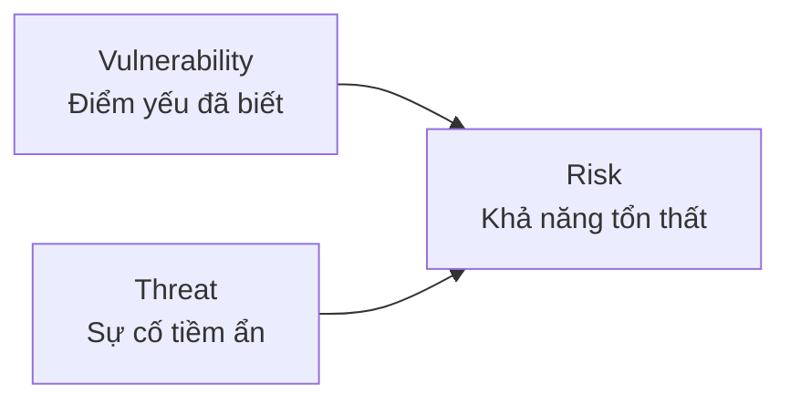
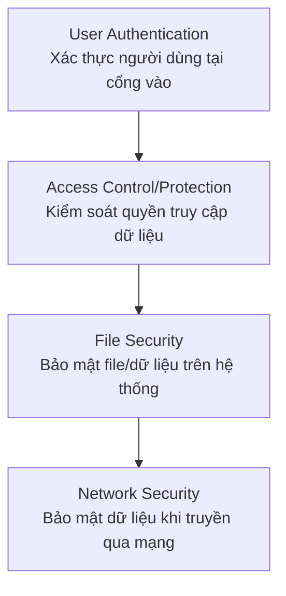

# Bài 2: Cybersecurity Concepts and Principles

## 1. Các khái niệm cơ bản trong An toàn máy tính

### 1.1 Định nghĩa An toàn máy tính

Theo NIST (National Institute of Standards and Technology):

> "Các biện pháp và kiểm soát đảm bảo tính bảo mật, toàn vẹn và sẵn sàng của các tài sản hệ thống thông tin, bao gồm phần cứng, phần mềm, firmware và thông tin đang được xử lý, lưu trữ và truyền thông."

---

### 1.2 CIA Triad và các mục tiêu mở rộng

Mô hình CIA Triad là nền tảng của an toàn thông tin, gồm 3 mục tiêu cốt lõi:

=== "Confidentiality (Bảo mật)"
    Đảm bảo rằng thông tin chỉ được truy cập bởi những người có thẩm quyền. Ví dụ: mã hóa dữ liệu, kiểm soát truy cập, phân quyền người dùng.

=== "Integrity (Toàn vẹn)"
    Đảm bảo rằng dữ liệu không bị sửa đổi trái phép trong quá trình lưu trữ hoặc truyền tải. Ví dụ: hash, chữ ký số, checksum.

=== "Availability (Sẵn sàng)"
    Đảm bảo hệ thống và dữ liệu luôn sẵn sàng cho người dùng hợp lệ khi cần. Ví dụ: dự phòng hệ thống, chống DDoS.

Ngoài CIA Triad, hai mục tiêu phổ biến khác thường được bổ sung:

=== "Authenticity (Xác thực)"
    Xác minh rằng người dùng đúng là người họ tuyên bố, và mỗi đầu vào đến hệ thống đến từ một nguồn đáng tin cậy. Ví dụ: đăng nhập hai yếu tố (2FA), chứng chỉ số (certificate).

=== "Accountability (Trách nhiệm giải trình)"
    Lưu lại nhật ký hoạt động của người dùng để phục vụ phân tích pháp y sau này, truy vết vi phạm bảo mật hoặc giải quyết tranh chấp giao dịch. Ví dụ: audit log, system log.

---

### 1.3 Vulnerability, Threat và Risk



| Khái niệm | Định nghĩa | Ví dụ |
|---|---|---|
| **Vulnerability** | Điểm yếu đã biết của một tài sản hệ thống mà kẻ tấn công có thể khai thác | Lỗ hổng SQL Injection trong web app |
| **Threat** | Sự cố mới hoặc mới phát hiện có tiềm năng gây hại cho hệ thống | Một nhóm hacker nhắm vào hệ thống ngân hàng |
| **Risk** | Khả năng xảy ra tổn thất hoặc thiệt hại khi một mối đe dọa khai thác điểm yếu | Nguy cơ mất dữ liệu khách hàng nếu SQL Injection bị khai thác |

!!! note "Mối quan hệ"
    Risk = Threat × Vulnerability × Impact. Nếu không có vulnerability thì threat không thể tạo ra risk, và ngược lại.

---

### 1.4 Attack và Countermeasure

**Attack (Tấn công):** Là một mối đe dọa được thực hiện bởi tác nhân đe dọa (threat agent/adversary). Nếu thành công, dẫn đến vi phạm bảo mật không mong muốn.

=== "Active Attack (Tấn công chủ động)"
    Kẻ tấn công cố tình **thay đổi tài nguyên hệ thống** hoặc **ảnh hưởng đến hoạt động** của nó. Đặc điểm: sửa đổi luồng dữ liệu hoặc tạo luồng dữ liệu giả.

    Các dạng tấn công chủ động:
    - **Replay**: Ghi lại và phát lại thông điệp hợp lệ để lừa hệ thống
    - **Masquerade**: Giả mạo danh tính của một thực thể hợp lệ
    - **Modification of messages**: Sửa đổi nội dung thông điệp trong quá trình truyền
    - **Denial of Service (DoS)**: Làm tê liệt dịch vụ, ngăn người dùng hợp lệ truy cập

=== "Passive Attack (Tấn công bị động)"
    Kẻ tấn công chỉ **nghe lén hoặc thu thập thông tin** mà không ảnh hưởng đến tài nguyên hệ thống. Đặc điểm: **rất khó phát hiện** vì không có dấu hiệu thay đổi.

    Các dạng tấn công bị động:
    - **Release of message contents**: Đọc nội dung thông điệp không được mã hóa
    - **Traffic analysis**: Phân tích mẫu lưu lượng để suy ra thông tin (dù không đọc được nội dung)

=== "Inside/Outside Attack"
    - **Inside attack (Insider)**: Kẻ tấn công là người bên trong tổ chức (nhân viên, contractor), đã có quyền truy cập hợp lệ.
    - **Outside attack (Outsider)**: Kẻ tấn công từ bên ngoài, không có quyền truy cập ban đầu.

**Countermeasure (Biện pháp đối phó):** Mọi biện pháp được áp dụng để xử lý tấn công bảo mật.

- Lý tưởng nhất: **ngăn chặn tấn công** trước khi xảy ra
- Nếu không thể ngăn chặn: **phát hiện tấn công** → **phục hồi** hoặc **giảm thiểu tác hại**

---

### 1.5 Threat Consequences và Threat Actions

Theo RFC 4949, các hậu quả của mối đe dọa được phân loại thành 4 nhóm:

=== "Unauthorized Disclosure"
    Một thực thể truy cập dữ liệu mà nó không được phép.

    | Threat Action | Mô tả |
    |---|---|
    | **Exposure** | Dữ liệu nhạy cảm bị tiết lộ trực tiếp cho thực thể trái phép |
    | **Interception** | Thực thể trái phép trực tiếp truy cập dữ liệu đang truyền giữa nguồn và đích hợp lệ |
    | **Inference** | Thực thể trái phép **gián tiếp** suy ra dữ liệu nhạy cảm qua đặc điểm hoặc sản phẩm phụ của truyền thông |
    | **Intrusion** | Thực thể trái phép vượt qua các cơ chế bảo vệ để truy cập dữ liệu |

=== "Deception"
    Thực thể được ủy quyền nhận dữ liệu sai và tin là đúng.

    | Threat Action | Mô tả |
    |---|---|
    | **Masquerade** | Thực thể trái phép giả mạo thực thể hợp lệ để truy cập hệ thống hoặc thực hiện hành động độc hại |
    | **Falsification** | Dữ liệu giả được đưa vào để đánh lừa thực thể hợp lệ |
    | **Repudiation** | Một thực thể lừa dối thực thể khác bằng cách phủ nhận trách nhiệm về hành động đã thực hiện |

=== "Disruption"
    Gián đoạn hoặc ngăn chặn hoạt động đúng của dịch vụ và chức năng hệ thống.

    | Threat Action | Mô tả |
    |---|---|
    | **Incapacitation** | Ngăn hoặc gián đoạn hoạt động hệ thống bằng cách vô hiệu hóa thành phần hệ thống |
    | **Corruption** | Sửa đổi bất lợi chức năng hoặc dữ liệu hệ thống theo hướng không mong muốn |
    | **Obstruction** | Cản trở việc cung cấp dịch vụ hệ thống bằng cách làm khó hoạt động hệ thống |

=== "Usurpation"
    Kiểm soát dịch vụ hoặc chức năng hệ thống bởi thực thể trái phép.

    | Threat Action | Mô tả |
    |---|---|
    | **Misappropriation** | Thực thể giành quyền kiểm soát logic hoặc vật lý trái phép đối với tài nguyên hệ thống |
    | **Misuse** | Khiến thành phần hệ thống thực hiện chức năng/dịch vụ gây hại cho bảo mật hệ thống |

---

### 1.6 Threats and Assets — Ví dụ cụ thể

| Tài sản | Availability | Confidentiality | Integrity |
|---|---|---|---|
| **Hardware** | Thiết bị bị đánh cắp hoặc vô hiệu hóa, từ chối dịch vụ | USB không mã hóa bị đánh cắp | — |
| **Software** | Chương trình bị xóa, người dùng mất quyền truy cập | Sao chép phần mềm trái phép | Chương trình bị sửa đổi để thất bại khi thực thi hoặc thực hiện tác vụ ngoài ý muốn |
| **Data** | File bị xóa, mất quyền truy cập | Đọc dữ liệu trái phép | File hiện có bị sửa đổi hoặc file mới được tạo giả mạo |
| **Communication Lines & Networks** | Thông điệp bị hủy hoặc xóa; mạng bị tê liệt | Thông điệp bị đọc; phân tích mẫu lưu lượng | Thông điệp bị sửa đổi, trì hoãn, đảo thứ tự, nhân bản; thông điệp giả được tạo ra |

---

## 2. Phạm vi của An toàn máy tính

An toàn máy tính bao gồm nhiều lớp bảo vệ:



Môn học NT140 tập trung vào **Network Security** — lớp bảo mật khi dữ liệu được truyền qua mạng.

---

## 3. Trusting Trust — Vấn đề niềm tin trong hệ thống

### 3.1 Bài toán "Reflections on Trusting Trust"

Đây là một bài toán kinh điển do **Ken Thompson** trình bày năm 1984 trên CACM (Communications of the ACM), đặt ra câu hỏi cốt lõi: **Chúng ta có thể tin tưởng vào điều gì trong hệ thống máy tính?**

---

### 3.2 Câu hỏi và phân tích từng lớp

**Q: Chúng ta có thể tin tưởng chương trình `login` trong một bản phân phối Linux (ví dụ Ubuntu) không?**

??? question "Trả lời"
    **Không!** Chương trình `login` có thể chứa backdoor được nhúng sẵn, ví dụ ghi lại mật khẩu khi người dùng nhập vào.

    **Giải pháp đề xuất:** Biên dịch lại chương trình `login` từ mã nguồn.

---

**Q: Chúng ta có thể tin tưởng mã nguồn của `login` không?**

??? question "Trả lời"
    **Không hoàn toàn**, nhưng ít nhất ta có thể kiểm tra mã nguồn rồi biên dịch lại.

    Tuy nhiên, vấn đề mới xuất hiện: **Chúng ta có thể tin tưởng compiler (trình biên dịch) không?**

---

### 3.3 Backdoor của Ken Thompson — Tấn công qua Compiler

Ken Thompson đề xuất một backdoor tinh vi được cài vào **compiler** (trình biên dịch C), không phải vào mã nguồn chương trình.

**Bước 1: Sửa đổi mã nguồn compiler**

```c
compile(s) {
    if (match(s, "login-program")) {
        compile("login-backdoor");
        return;
    }
    if (match(s, "compiler-program")) {
        compile("compiler-backdoor");  // Tự nhân bản backdoor vào compiler mới
        return;
    }
    /* regular compilation */
}
```

**Bước 2: Thực hiện tấn công**

1. Biên dịch compiler đã sửa đổi → tạo ra **compiler binary có backdoor**
2. **Khôi phục mã nguồn compiler về trạng thái ban đầu** (xóa bỏ mọi dấu vết trong source)
3. Kết quả: Kiểm tra mã nguồn compiler → **không thấy gì bất thường**
4. Nhưng khi dùng compiler binary để biên dịch → vẫn tạo ra **compiler bị nhiễm** và **login có backdoor**

!!! danger "Nguy hiểm"
    Backdoor này **tự nhân bản** — compiler bị nhiễm sẽ tiếp tục lây vào mọi compiler được biên dịch từ nó, dù mã nguồn hoàn toàn sạch. Đây là dạng tấn công **supply chain** cực kỳ tinh vi.

---

### 3.4 Chúng ta có thể tin tưởng phần cứng không?

Xem xét tình huống thực tế: Bạn đặt mua một laptop qua bưu điện. Khi nhận được, bạn có thể tin tưởng gì trên đó?

| Thành phần | Vấn đề | Giải pháp | Hạn chế của giải pháp |
|---|---|---|---|
| OS/Applications | Có thể đã bị cài backdoor | Cài lại OS và ứng dụng | Không thể tin OS hiện tại để cài lại OS |
| Quá trình cài lại | OS hiện tại không đáng tin | Boot từ USB Tails (Debian) | Vẫn phải tin vào BIOS/UEFI |
| BIOS/UEFI | Có thể bị nhiễm (ví dụ: ShadowHammer 2018) | ? | Rất khó kiểm soát |
| Motherboard/Firmware | Có thể bị can thiệp phần cứng | ? | Gần như không thể kiểm tra |

!!! example "ShadowHammer Operation (2018)"
    Năm 2018, kẻ tấn công đã xâm nhập vào hệ thống cập nhật BIOS của ASUS (ASUS Live Update), cài backdoor vào firmware được phân phối chính thức đến hàng trăm nghìn máy tính. Đây là ví dụ thực tế cho thấy ngay cả BIOS/UEFI cũng không thể tin tưởng hoàn toàn.

---

### 3.5 Kết luận: Trusted Computing Base (TCB)

**Sự thật đáng buồn:** Về mặt lý thuyết, **không có gì hoàn toàn đáng tin cậy** — bất kỳ thành phần nào cũng có thể bị xâm phạm.

Nhưng nếu không tin tưởng bất cứ điều gì, chúng ta không thể tiến lên phía trước.

!!! success "Giải pháp thực tế: Trusted Computing Base (TCB)"
    - **Giả định** rằng một phần tối thiểu của hệ thống là **không bị xâm phạm**
    - **Xây dựng** môi trường bảo mật trên nền tảng đó
    - TCB bao gồm: phần cứng cốt lõi, kernel OS, các cơ chế bảo mật cơ bản
    - Nguyên tắc: **càng nhỏ TCB, càng dễ kiểm chứng và tin tưởng**

---

## 4. Security Design Principles

### 4.1 Economy of Mechanism (Tính đơn giản của cơ chế)

**Nguyên tắc:** Thiết kế các cơ chế bảo mật càng đơn giản và nhỏ gọn càng tốt.

**Lý do:** Hệ thống càng phức tạp, càng có nhiều điểm yếu tiềm ẩn và càng khó kiểm tra toàn diện.

**Ví dụ:** Thay vì xây dựng một hệ thống xác thực phức tạp với nhiều lớp logic, hãy sử dụng thư viện xác thực đã được kiểm chứng (như OAuth2) với cấu hình đơn giản, rõ ràng.

---

### 4.2 Fail-Safe Defaults (Mặc định an toàn khi thất bại)

**Nguyên tắc:** Giá trị mặc định phải là **từ chối truy cập**. Chỉ cấp quyền truy cập khi có sự cho phép rõ ràng.

**Lý do:** Nếu hệ thống gặp lỗi hoặc tình huống không xác định, hành vi mặc định phải là an toàn (deny), không phải cho phép (allow).

**Ví dụ về lỗi thiết kế (từ Homework):**

```c
// WRONG — Nguy hiểm!
DWORD dwRet = IsAccessAllowed(...);
if (dwRet == ERROR_ACCESS_DENIED) {
    // Từ chối truy cập
} else {
    // Cho phép truy cập — Sai! Bao gồm cả trường hợp lỗi!
}
```

!!! danger "Vấn đề"
    Nếu `IsAccessAllowed()` trả về một mã lỗi khác (không phải `ERROR_ACCESS_DENIED`, ví dụ lỗi kết nối DB, lỗi hệ thống...), code vẫn **cho phép truy cập**. Đây là vi phạm nguyên tắc fail-safe defaults.

```c
// CORRECT — An toàn!
DWORD dwRet = IsAccessAllowed(...);
if (dwRet == ERROR_SUCCESS) {
    // Chỉ cho phép khi có xác nhận rõ ràng là được phép
    // Do something
} else {
    // Mặc định: từ chối — bao gồm cả lỗi và ACCESS_DENIED
    // Inform user that access is denied
}
```

---

### 4.3 Complete Mediation (Kiểm tra toàn diện)

**Nguyên tắc:** **Mọi** yêu cầu truy cập vào **mọi** đối tượng đều phải được kiểm tra quyền. Không có ngoại lệ, không cache quyền truy cập một cách thiếu kiểm soát.

**Lý do:** Nếu bỏ qua kiểm tra ở bất kỳ điểm nào (ví dụ cache quyền truy cập cũ), kẻ tấn công có thể khai thác điểm đó.

**Ví dụ:** Hệ thống file phải kiểm tra quyền mỗi lần truy cập file, không chỉ khi mở file lần đầu. Nếu quyền thay đổi giữa chừng, hệ thống phải phát hiện và từ chối.

---

### 4.4 Open Design (Thiết kế mở)

**Nguyên tắc:** Tính bảo mật của hệ thống **không** được phụ thuộc vào việc giữ bí mật thiết kế hay thuật toán. Bí mật chỉ nằm ở **khóa** (key) hoặc **mật khẩu** (password).

**Lý do:** Đây là nguyên tắc Kerckhoffs. Một hệ thống bảo mật qua ẩn giấu (security through obscurity) rất dễ bị phá vỡ khi thiết kế bị lộ.

**Ví dụ:** Các thuật toán mã hóa như AES, RSA đều được công bố công khai. Độ bảo mật nằm ở độ dài và bí mật của khóa, không phải ở việc giữ bí mật thuật toán.

---

### 4.5 Separation of Privilege (Phân tách đặc quyền)

**Nguyên tắc:** Không nên cấp quyền truy cập chỉ dựa trên **một điều kiện duy nhất**. Yêu cầu **nhiều điều kiện** phải được thỏa mãn đồng thời.

**Lý do:** Giảm thiểu rủi ro khi một yếu tố bị xâm phạm.

**Ví dụ:** Xác thực hai yếu tố (2FA) — cần cả mật khẩu (something you know) lẫn OTP từ điện thoại (something you have). Chỉ bị lộ mật khẩu thì chưa đủ để xâm nhập.

---

### 4.6 Least Privilege (Đặc quyền tối thiểu)

**Nguyên tắc:** Mỗi chương trình và người dùng hệ thống chỉ nên có **đúng những đặc quyền cần thiết** để hoàn thành công việc, không hơn.

**Lý do:** Giới hạn tầm ảnh hưởng nếu tài khoản hoặc chương trình bị xâm phạm.

**Ví dụ:** Một web server chỉ cần quyền đọc file tĩnh và ghi log — không nên chạy với quyền root. Nếu bị tấn công, kẻ tấn công chỉ có quyền hạn chế, không thể kiểm soát toàn bộ hệ thống.

---

## Câu hỏi trắc nghiệm

**Câu 1.** Theo định nghĩa của NIST, An toàn máy tính đảm bảo điều gì?

- A. Chỉ bảo vệ phần cứng và phần mềm
- B. Bảo vệ tính bảo mật, toàn vẹn và sẵn sàng của tài sản hệ thống thông tin
- C. Chỉ bảo vệ dữ liệu đang được truyền trên mạng
- D. Ngăn chặn mọi cuộc tấn công vào hệ thống

??? info "Đáp án & Giải thích"
    **Đáp án: B**

    NIST định nghĩa: "Measures and controls that ensure confidentiality, integrity, and availability of information system assets including hardware, software, firmware, and information being processed, stored, and communicated." Đây bao gồm phần cứng, phần mềm, firmware và thông tin ở mọi trạng thái.

---

**Câu 2.** CIA Triad trong bảo mật thông tin bao gồm những yếu tố nào?

- A. Confidentiality, Integrity, Authenticity
- B. Confidentiality, Integrity, Availability
- C. Confidentiality, Identity, Availability
- D. Control, Integrity, Availability

??? info "Đáp án & Giải thích"
    **Đáp án: B**

    CIA Triad là ba mục tiêu cốt lõi: Confidentiality (Bảo mật), Integrity (Toàn vẹn), Availability (Sẵn sàng). Authenticity và Accountability là các mục tiêu bổ sung phổ biến nhưng không thuộc CIA Triad cốt lõi.

---

**Câu 3.** "Authenticity" trong bảo mật thông tin có nghĩa là gì?

- A. Mã hóa toàn bộ dữ liệu truyền qua mạng
- B. Lưu lại nhật ký hoạt động của người dùng
- C. Xác minh người dùng đúng là người họ tuyên bố và đầu vào đến từ nguồn đáng tin
- D. Đảm bảo dữ liệu không bị thay đổi trong quá trình truyền

??? info "Đáp án & Giải thích"
    **Đáp án: C**

    Authenticity là việc xác minh danh tính — verifying that users are who they say they are and that each input arriving at the system came from a trusted source.

---

**Câu 4.** "Accountability" phục vụ mục đích gì?

- A. Ngăn chặn tấn công từ bên ngoài
- B. Lưu lại hoạt động để phục vụ phân tích pháp y và truy vết vi phạm bảo mật
- C. Xác minh nguồn gốc của dữ liệu
- D. Mã hóa thông tin nhạy cảm

??? info "Đáp án & Giải thích"
    **Đáp án: B**

    Accountability giữ hồ sơ hoạt động (audit trail) để phân tích pháp y (forensic analysis), truy vết vi phạm bảo mật, hoặc hỗ trợ giải quyết tranh chấp giao dịch.

---

**Câu 5.** Điểm khác biệt chính giữa Vulnerability và Threat là gì?

- A. Vulnerability là từ bên ngoài, Threat là từ bên trong
- B. Vulnerability là điểm yếu đã biết của tài sản, Threat là sự cố tiềm ẩn có thể gây hại
- C. Vulnerability nghiêm trọng hơn Threat
- D. Không có sự khác biệt, hai khái niệm giống nhau

??? info "Đáp án & Giải thích"
    **Đáp án: B**

    Vulnerability là điểm yếu đã biết (known weakness) của tài sản hệ thống. Threat là sự cố mới hoặc mới phát hiện có tiềm năng gây hại. Risk mới là kết quả khi threat khai thác vulnerability.

---

**Câu 6.** Risk trong bảo mật được định nghĩa là gì?

- A. Một điểm yếu của hệ thống
- B. Một cuộc tấn công đã xảy ra
- C. Khả năng xảy ra tổn thất khi mối đe dọa khai thác điểm yếu
- D. Biện pháp bảo vệ hệ thống

??? info "Đáp án & Giải thích"
    **Đáp án: C**

    Risk = khả năng tổn thất hoặc thiệt hại khi một threat khai thác một vulnerability. Risk kết hợp cả ba yếu tố: mối đe dọa, điểm yếu và tác động.

---

**Câu 7.** Đặc điểm nào phân biệt Passive Attack với Active Attack?

- A. Passive attack chỉ xảy ra từ bên trong tổ chức
- B. Passive attack không ảnh hưởng đến tài nguyên hệ thống và rất khó phát hiện
- C. Passive attack luôn gây thiệt hại lớn hơn Active attack
- D. Passive attack sửa đổi dữ liệu trong khi Active attack chỉ nghe lén

??? info "Đáp án & Giải thích"
    **Đáp án: B**

    Passive attack chỉ học hỏi/sử dụng thông tin mà không ảnh hưởng đến tài nguyên hệ thống, do đó rất khó phát hiện. Active attack mới có sự sửa đổi luồng dữ liệu hoặc tạo luồng giả.

---

**Câu 8.** Tấn công Replay thuộc loại nào?

- A. Passive attack
- B. Active attack
- C. Cả hai
- D. Không thuộc loại nào

??? info "Đáp án & Giải thích"
    **Đáp án: B**

    Replay là Active attack — kẻ tấn công ghi lại thông điệp hợp lệ rồi phát lại để lừa hệ thống. Đây là hành động chủ động can thiệp vào luồng dữ liệu.

---

**Câu 9.** Traffic analysis là dạng tấn công nào?

- A. Active attack — vì phân tích dữ liệu
- B. Passive attack — vì chỉ quan sát mẫu lưu lượng mà không thay đổi gì
- C. Inside attack
- D. DoS attack

??? info "Đáp án & Giải thích"
    **Đáp án: B**

    Traffic analysis là passive attack. Kẻ tấn công quan sát mẫu truyền thông (ai liên lạc với ai, khi nào, tần suất) mà không thay đổi nội dung. Dù không đọc được nội dung, thông tin meta này vẫn rất có giá trị.

---

**Câu 10.** Biện pháp đối phó (Countermeasure) lý tưởng nhất là gì?

- A. Phát hiện tấn công sau khi xảy ra
- B. Phục hồi hệ thống sau tấn công
- C. Ngăn chặn tấn công trước khi nó thành công
- D. Ghi log tất cả các hoạt động

??? info "Đáp án & Giải thích"
    **Đáp án: C**

    Lý tưởng nhất là **ngăn chặn** (prevent) tấn công trước khi xảy ra. Nếu không thể, mới dùng đến phát hiện (detect) → phục hồi/giảm thiểu (recover/mitigate).

---

**Câu 11.** "Unauthorized Disclosure" là hậu quả của mối đe dọa nào?

- A. Một thực thể nhận dữ liệu sai
- B. Một thực thể truy cập dữ liệu mà nó không được phép truy cập
- C. Dịch vụ hệ thống bị gián đoạn
- D. Thực thể trái phép kiểm soát chức năng hệ thống

??? info "Đáp án & Giải thích"
    **Đáp án: B**

    Unauthorized Disclosure xảy ra khi một thực thể truy cập dữ liệu mà nó không được ủy quyền. Các threat actions bao gồm: Exposure, Interception, Inference, Intrusion.

---

**Câu 12.** Threat action "Inference" khác với "Interception" ở điểm nào?

- A. Inference sửa đổi dữ liệu, Interception chỉ đọc
- B. Inference gián tiếp suy ra dữ liệu qua đặc điểm truyền thông, Interception trực tiếp truy cập dữ liệu
- C. Inference chỉ xảy ra qua mạng, Interception xảy ra cục bộ
- D. Không có sự khác biệt

??? info "Đáp án & Giải thích"
    **Đáp án: B**

    Interception: trực tiếp truy cập dữ liệu đang truyền. Inference: gián tiếp suy ra thông tin nhạy cảm qua đặc điểm hoặc sản phẩm phụ của truyền thông (không cần đọc nội dung trực tiếp).

---

**Câu 13.** Kẻ tấn công giả mạo danh tính của người dùng hợp lệ để truy cập hệ thống — đây là threat action gì?

- A. Falsification
- B. Repudiation
- C. Masquerade
- D. Intrusion

??? info "Đáp án & Giải thích"
    **Đáp án: C**

    Masquerade: thực thể trái phép giả mạo (poses as) thực thể hợp lệ để truy cập hệ thống hoặc thực hiện hành động độc hại. Ví dụ: giả mạo địa chỉ IP, giả mạo chứng chỉ.

---

**Câu 14.** "Repudiation" trong bảo mật có nghĩa là gì?

- A. Mã hóa dữ liệu để từ chối truy cập
- B. Một thực thể phủ nhận trách nhiệm về hành động đã thực hiện
- C. Hệ thống từ chối yêu cầu trái phép
- D. Dữ liệu bị xóa mà không để lại dấu vết

??? info "Đáp án & Giải thích"
    **Đáp án: B**

    Repudiation: một thực thể lừa dối thực thể khác bằng cách **falsely denying responsibility** (phủ nhận trách nhiệm) về hành động đã thực hiện. Non-repudiation (chống phủ chối) là tính năng bảo mật để ngăn chặn điều này.

---

**Câu 15.** "Incapacitation" thuộc nhóm hậu quả nào?

- A. Unauthorized Disclosure
- B. Deception
- C. Disruption
- D. Usurpation

??? info "Đáp án & Giải thích"
    **Đáp án: C**

    Incapacitation thuộc nhóm Disruption. Nó ngăn hoặc gián đoạn hoạt động hệ thống bằng cách vô hiệu hóa thành phần hệ thống. DoS attack là ví dụ điển hình.

---

**Câu 16.** "Corruption" trong nhóm Disruption có nghĩa là gì?

- A. Đánh cắp dữ liệu nhạy cảm
- B. Sửa đổi bất lợi chức năng hoặc dữ liệu hệ thống theo hướng không mong muốn
- C. Phủ nhận trách nhiệm về hành động
- D. Giả mạo danh tính người dùng hợp lệ

??? info "Đáp án & Giải thích"
    **Đáp án: B**

    Corruption: undesirably alters system operation by adversely modifying system functions or data. Ví dụ: ransomware mã hóa dữ liệu, virus sửa đổi file hệ thống.

---

**Câu 17.** Nhóm hậu quả "Usurpation" mô tả tình huống nào?

- A. Dữ liệu bị lộ cho bên trái phép
- B. Người dùng nhận dữ liệu sai
- C. Thực thể trái phép kiểm soát dịch vụ hoặc chức năng hệ thống
- D. Hệ thống bị gián đoạn hoạt động

??? info "Đáp án & Giải thích"
    **Đáp án: C**

    Usurpation: thực thể trái phép chiếm quyền kiểm soát dịch vụ hoặc chức năng hệ thống. Threat actions bao gồm Misappropriation và Misuse.

---

**Câu 18.** "Misuse" trong nhóm Usurpation là gì?

- A. Thực thể giành quyền kiểm soát vật lý trái phép
- B. Khiến thành phần hệ thống thực hiện chức năng gây hại cho bảo mật
- C. Sửa đổi dữ liệu truyền qua mạng
- D. Nghe lén lưu lượng mạng

??? info "Đáp án & Giải thích"
    **Đáp án: B**

    Misuse: causes a system component to perform a function or service that is detrimental to system security. Ví dụ: dùng tài nguyên hệ thống để tấn công hệ thống khác.

---

**Câu 19.** Theo bảng Threats and Assets, mối đe dọa nào ảnh hưởng đến Confidentiality của Hardware?

- A. Thiết bị bị đánh cắp hoặc vô hiệu hóa
- B. USB không được mã hóa bị đánh cắp
- C. Phần mềm bị xóa
- D. File bị sửa đổi

??? info "Đáp án & Giải thích"
    **Đáp án: B**

    USB không mã hóa bị đánh cắp ảnh hưởng đến Confidentiality của Hardware — dữ liệu trên thiết bị vật lý có thể bị đọc bởi người không có quyền.

---

**Câu 20.** Mối đe dọa nào ảnh hưởng đến Integrity của Software?

- A. Chương trình bị xóa
- B. Sao chép phần mềm trái phép
- C. Chương trình bị sửa đổi để thực hiện tác vụ ngoài ý muốn
- D. Phần mềm bị từ chối truy cập

??? info "Đáp án & Giải thích"
    **Đáp án: C**

    Integrity của Software bị ảnh hưởng khi chương trình bị sửa đổi để thất bại khi thực thi hoặc thực hiện tác vụ ngoài ý muốn. Đây là dạng tấn công phần mềm điển hình (ví dụ: cài backdoor vào chương trình).

---

**Câu 21.** Mối đe dọa nào đối với Availability của Communication Lines and Networks?

- A. Thông điệp bị đọc trộm
- B. Thông điệp bị sửa đổi
- C. Thông điệp bị hủy hoặc xóa, mạng bị tê liệt
- D. Thông điệp bị nhân bản

??? info "Đáp án & Giải thích"
    **Đáp án: C**

    Availability của mạng bị ảnh hưởng khi thông điệp bị hủy/xóa hoặc khi đường truyền/mạng bị tê liệt, ngăn cản người dùng hợp lệ truy cập dịch vụ.

---

**Câu 22.** Ken Thompson đề xuất backdoor trong bài "Reflections on Trusting Trust" năm nào?

- A. 1974
- B. 1984
- C. 1994
- D. 2004

??? info "Đáp án & Giải thích"
    **Đáp án: B**

    Ken Thompson công bố bài "Reflections on Trusting Trust" trên CACM (Communications of the ACM) vào tháng 8 năm 1984.

---

**Câu 23.** Backdoor của Thompson được cài vào đâu?

- A. Vào mã nguồn chương trình login
- B. Vào hệ điều hành Linux
- C. Vào compiler (trình biên dịch)
- D. Vào firmware BIOS

??? info "Đáp án & Giải thích"
    **Đáp án: C**

    Thompson cài backdoor vào **compiler binary** — trình biên dịch C. Điều tinh vi là mã nguồn compiler sau đó được khôi phục về trạng thái sạch, nhưng compiler binary vẫn tiếp tục tạo ra chương trình có backdoor.

---

**Câu 24.** Tại sao backdoor của Thompson lại nguy hiểm đặc biệt?

- A. Vì nó ảnh hưởng đến phần cứng
- B. Vì nó tự nhân bản vào mọi compiler được biên dịch từ nó, dù mã nguồn compiler hoàn toàn sạch
- C. Vì nó không thể bị phát hiện bởi antivirus
- D. Vì nó mã hóa toàn bộ hệ thống

??? info "Đáp án & Giải thích"
    **Đáp án: B**

    Backdoor tự nhân bản: compiler-backdoor trong binary sẽ nhận diện khi compiler đang biên dịch chính nó, rồi tự động chèn backdoor vào compiler binary mới. Vì vậy, dù mã nguồn được khôi phục sạch, backdoor vẫn tồn tại trong binary và tiếp tục lây lan.

---

**Câu 25.** Trong ví dụ Thompson's backdoor, Attack step 2 bao gồm những gì?

- A. Viết thêm backdoor vào mã nguồn login
- B. Biên dịch compiler đã sửa rồi khôi phục mã nguồn compiler về trạng thái gốc
- C. Xóa toàn bộ hệ thống và cài lại
- D. Mã hóa compiler binary

??? info "Đáp án & Giải thích"
    **Đáp án: B**

    Bước 2: (1) Biên dịch compiler đã sửa đổi → tạo compiler binary có backdoor. (2) Khôi phục mã nguồn compiler về trạng thái gốc. Kết quả: kiểm tra mã nguồn không thấy gì bất thường, nhưng compiler binary vẫn độc hại.

---

**Câu 26.** ShadowHammer Operation (2018) minh họa điều gì?

- A. Phần mềm antivirus có thể bị qua mặt
- B. Ngay cả BIOS/UEFI firmware cũng có thể bị xâm phạm qua kênh cập nhật chính thống
- C. Mạng WiFi có thể bị nghe lén
- D. Mật khẩu yếu dễ bị brute force

??? info "Đáp án & Giải thích"
    **Đáp án: B**

    ShadowHammer xâm phạm hệ thống cập nhật BIOS của ASUS, phân phối firmware độc hại qua kênh cập nhật chính thống. Điều này cho thấy ngay cả firmware cấp thấp nhất cũng không thể tin tưởng hoàn toàn.

---

**Câu 27.** Trusted Computing Base (TCB) là gì?

- A. Một phần mềm antivirus mạnh nhất thị trường
- B. Phần tối thiểu của hệ thống được giả định là không bị xâm phạm để xây dựng bảo mật trên đó
- C. Một tiêu chuẩn mã hóa quốc tế
- D. Một giao thức xác thực mạng

??? info "Đáp án & Giải thích"
    **Đáp án: B**

    TCB là phần tối thiểu của hệ thống (phần cứng cốt lõi, kernel, cơ chế bảo mật cơ bản) được **giả định** là không bị xâm phạm. Toàn bộ môi trường bảo mật được xây dựng trên nền tảng này. Nguyên tắc: TCB càng nhỏ, càng dễ kiểm chứng.

---

**Câu 28.** Tại sao không thể dùng OS hiện tại để cài lại OS khi nghi ngờ bị backdoor?

- A. OS hiện tại không có quyền cài lại OS
- B. Vì không thể tin tưởng OS hiện tại — nó có thể đã bị compromised và sẽ cài lại OS có backdoor
- C. Vì cần phải mua license mới
- D. Vì OS mới không tương thích với phần cứng

??? info "Đáp án & Giải thích"
    **Đáp án: B**

    Nếu OS hiện tại đã bị compromised, quá trình cài lại OS do nó thực hiện cũng không đáng tin cậy — nó có thể cài backdoor vào OS mới. Giải pháp: boot từ thiết bị độc lập (như USB Tails).

---

**Câu 29.** Nguyên tắc "Economy of Mechanism" khuyến nghị điều gì?

- A. Tiết kiệm chi phí vận hành hệ thống
- B. Thiết kế cơ chế bảo mật càng đơn giản và nhỏ gọn càng tốt
- C. Sử dụng nhiều lớp bảo mật phức tạp
- D. Tối ưu hóa hiệu năng hệ thống

??? info "Đáp án & Giải thích"
    **Đáp án: B**

    Economy of Mechanism: keep the design as simple and small as possible. Hệ thống càng phức tạp, càng có nhiều điểm yếu tiềm ẩn và càng khó kiểm tra, xác minh toàn diện.

---

**Câu 30.** Nguyên tắc "Fail-Safe Defaults" nghĩa là gì?

- A. Hệ thống tự động backup dữ liệu khi gặp lỗi
- B. Giá trị mặc định là từ chối truy cập; chỉ cấp quyền khi có phê duyệt rõ ràng
- C. Hệ thống tiếp tục hoạt động dù gặp lỗi
- D. Mật khẩu mặc định phải được thay đổi ngay khi cài đặt

??? info "Đáp án & Giải thích"
    **Đáp án: B**

    Fail-Safe Defaults: access decisions should be based on permission rather than exclusion. Mặc định là **deny** (từ chối), chỉ allow khi có điều kiện rõ ràng được thỏa mãn. Nếu hệ thống gặp lỗi không xác định, hành vi an toàn là từ chối.

---

**Câu 31.** Trong đoạn code lỗi của Homework, vấn đề bảo mật chính là gì?

```c
if (dwRet == ERROR_ACCESS_DENIED) {
    // Từ chối
} else {
    // Cho phép  ← Vấn đề ở đây
}
```

- A. Code không kiểm tra null pointer
- B. Code cho phép truy cập trong mọi trường hợp không phải ERROR_ACCESS_DENIED, kể cả khi có lỗi hệ thống
- C. Code không sử dụng mã hóa
- D. Code không ghi log

??? info "Đáp án & Giải thích"
    **Đáp án: B**

    Vi phạm Fail-Safe Defaults. Nếu `IsAccessAllowed()` trả về lỗi hệ thống (ví dụ lỗi kết nối DB, ERROR_TIMEOUT...), code vẫn rơi vào nhánh `else` và **cho phép truy cập**. Đúng ra phải kiểm tra `ERROR_SUCCESS` để cấp quyền, còn lại (bao gồm cả lỗi) đều từ chối.

---

**Câu 32.** Cách sửa đúng cho đoạn code lỗi trên theo nguyên tắc Fail-Safe Defaults là gì?

- A. Thêm log để ghi lại lỗi
- B. Kiểm tra `ERROR_SUCCESS` để cho phép, tất cả trường hợp khác đều từ chối
- C. Dùng try-catch để bắt exception
- D. Tăng timeout của hàm `IsAccessAllowed()`

??? info "Đáp án & Giải thích"
    **Đáp án: B**

    Sửa đúng: `if (dwRet == ERROR_SUCCESS) { /* allow */ } else { /* deny */ }`. Chỉ cho phép khi có xác nhận rõ ràng. Mọi trường hợp khác (kể cả lỗi) đều mặc định từ chối.

---

**Câu 33.** Nguyên tắc "Complete Mediation" yêu cầu gì?

- A. Mã hóa tất cả dữ liệu truyền qua mạng
- B. Mọi yêu cầu truy cập vào mọi đối tượng đều phải được kiểm tra quyền
- C. Chỉ kiểm tra quyền khi người dùng đăng nhập lần đầu
- D. Sử dụng nhiều lớp mã hóa

??? info "Đáp án & Giải thích"
    **Đáp án: B**

    Complete Mediation: every access to every object must be checked for authority. Không có ngoại lệ, không cache quyền truy cập thiếu kiểm soát. Mỗi lần truy cập đều phải qua kiểm tra.

---

**Câu 34.** Nguyên tắc "Open Design" phát biểu rằng tính bảo mật không nên phụ thuộc vào điều gì?

- A. Độ mạnh của mật khẩu
- B. Việc giữ bí mật thiết kế hay thuật toán
- C. Số lượng lớp bảo mật
- D. Phần cứng được sử dụng

??? info "Đáp án & Giải thích"
    **Đáp án: B**

    Open Design (hay nguyên tắc Kerckhoffs): bảo mật không nên phụ thuộc vào việc giữ bí mật thiết kế/thuật toán. Bí mật chỉ nằm ở key/password. AES là ví dụ — thuật toán công khai nhưng vẫn an toàn.

---

**Câu 35.** "Security through obscurity" vi phạm nguyên tắc nào?

- A. Least Privilege
- B. Open Design
- C. Complete Mediation
- D. Fail-Safe Defaults

??? info "Đáp án & Giải thích"
    **Đáp án: B**

    Security through obscurity (bảo mật qua ẩn giấu thiết kế) vi phạm nguyên tắc Open Design. Khi thiết kế bị lộ (điều thường xảy ra), toàn bộ hệ thống bị phá vỡ.

---

**Câu 36.** Xác thực hai yếu tố (2FA) là ví dụ minh họa cho nguyên tắc nào?

- A. Economy of Mechanism
- B. Open Design
- C. Separation of Privilege
- D. Least Privilege

??? info "Đáp án & Giải thích"
    **Đáp án: C**

    Separation of Privilege: không cấp quyền chỉ dựa trên một điều kiện. 2FA yêu cầu cả mật khẩu (something you know) lẫn OTP (something you have) — hai điều kiện phải được thỏa mãn đồng thời.

---

**Câu 37.** Nguyên tắc "Least Privilege" nghĩa là gì?

- A. Cấp quyền tối đa để người dùng làm việc hiệu quả
- B. Mỗi chương trình và người dùng chỉ có đúng những đặc quyền cần thiết để hoàn thành công việc
- C. Chỉ quản trị viên mới có quyền truy cập hệ thống
- D. Tất cả người dùng có cùng mức quyền

??? info "Đáp án & Giải thích"
    **Đáp án: B**

    Least Privilege: every program and every user of the system should operate using the least set of privileges necessary to complete the job. Điều này giới hạn tầm ảnh hưởng khi tài khoản bị xâm phạm.

---

**Câu 38.** Tại sao web server không nên chạy với quyền root?

- A. Quyền root làm chậm web server
- B. Nếu bị tấn công, kẻ tấn công chỉ có quyền hạn chế, không kiểm soát được toàn bộ hệ thống
- C. Quyền root không tương thích với web server
- D. Root không thể truy cập file tĩnh

??? info "Đáp án & Giải thích"
    **Đáp án: B**

    Theo nguyên tắc Least Privilege, web server chỉ cần quyền đọc file tĩnh và ghi log. Nếu chạy với quyền root và bị tấn công, kẻ tấn công có toàn quyền hệ thống. Nếu chạy với quyền tối thiểu, tầm ảnh hưởng bị giới hạn.

---

**Câu 39.** DoS (Denial of Service) attack thuộc loại tấn công nào theo phân loại Active/Passive?

- A. Passive attack
- B. Active attack
- C. Cả hai
- D. Không thuộc loại nào

??? info "Đáp án & Giải thích"
    **Đáp án: B**

    DoS là Active attack vì nó chủ động làm ảnh hưởng đến tài nguyên hệ thống (làm tê liệt dịch vụ). Đây cũng là ví dụ của Disruption và Incapacitation.

---

**Câu 40.** "Masquerade" attack có thể được ngăn chặn hiệu quả nhất bằng cơ chế nào?

- A. Firewall
- B. Xác thực mạnh (strong authentication) như 2FA, chứng chỉ số
- C. Mã hóa dữ liệu
- D. Antivirus

??? info "Đáp án & Giải thích"
    **Đáp án: B**

    Masquerade dựa vào việc giả mạo danh tính. Xác thực mạnh (2FA, chứng chỉ số, sinh trắc học) làm cho việc giả mạo trở nên rất khó vì kẻ tấn công cần nhiều yếu tố xác thực cùng lúc.

---

**Câu 41.** Một hacker nghe lén lưu lượng HTTPS đã được mã hóa nhưng không đọc được nội dung, thay vào đó phân tích tần suất và thời điểm liên lạc để suy ra thông tin — đây là dạng tấn công nào?

- A. Interception
- B. Exposure
- C. Traffic analysis (Inference)
- D. Intrusion

??? info "Đáp án & Giải thích"
    **Đáp án: C**

    Đây là Traffic analysis — một dạng Inference (Passive attack). Dù không đọc được nội dung mã hóa, việc phân tích ai liên lạc với ai, khi nào, bao nhiêu lần vẫn tiết lộ thông tin nhạy cảm.

---

**Câu 42.** Trong phân loại inside/outside attack, nhân viên bất mãn cố tình xóa dữ liệu quan trọng là ví dụ của loại nào?

- A. Outside attack
- B. Inside attack (Insider threat)
- C. Passive attack
- D. Không thuộc loại nào

??? info "Đáp án & Giải thích"
    **Đáp án: B**

    Nhân viên bất mãn là Insider — người đã có quyền truy cập hợp lệ vào hệ thống. Insider threat thường nguy hiểm hơn outsider vì họ đã biết hệ thống và có quyền truy cập sẵn.

---

**Câu 43.** Nguyên tắc nào trong Security Design Principles liên quan trực tiếp đến việc ghi audit log để truy vết hành động người dùng?

- A. Economy of Mechanism
- B. Fail-Safe Defaults
- C. Complete Mediation
- D. Accountability (mục tiêu bảo mật, không phải design principle, nhưng Complete Mediation hỗ trợ nó)

??? info "Đáp án & Giải thích"
    **Đáp án: C**

    Complete Mediation yêu cầu kiểm tra mọi truy cập — cơ chế này cũng tạo điều kiện ghi lại mọi lần truy cập, hỗ trợ Accountability. Ghi audit log cho mọi yêu cầu truy cập là biểu hiện của Complete Mediation.

---

**Câu 44.** Kẻ tấn công thực hiện tấn công "Obstruction" bằng cách nào?

- A. Đánh cắp dữ liệu mà không thay đổi hệ thống
- B. Cản trở, gây khó khăn cho hoạt động cung cấp dịch vụ hệ thống
- C. Giả mạo danh tính người dùng hợp lệ
- D. Phủ nhận đã thực hiện giao dịch

??? info "Đáp án & Giải thích"
    **Đáp án: B**

    Obstruction: a threat action that interrupts delivery of system services by hindering system operation. Ví dụ: gây tắc nghẽn băng thông mạng, chèn gói tin lỗi để làm chậm dịch vụ.

---

**Câu 45.** Kẻ tấn công giành quyền kiểm soát logic trái phép đối với một server — đây là threat action nào?

- A. Misuse
- B. Misappropriation
- C. Corruption
- D. Obstruction

??? info "Đáp án & Giải thích"
    **Đáp án: B**

    Misappropriation: an entity assumes unauthorized logical or physical control of a system resource. Ví dụ: chiếm quyền điều khiển server thông qua khai thác lỗ hổng bảo mật.

---

**Câu 46.** Theo nguyên tắc "Open Design", AES được coi là thuật toán mã hóa an toàn dù thuật toán được công khai vì lý do nào?

- A. Vì AES sử dụng nhiều vòng mã hóa phức tạp
- B. Vì tính bảo mật nằm ở độ dài và bí mật của khóa, không phải bí mật thuật toán
- C. Vì AES được chính phủ Mỹ phê duyệt
- D. Vì AES không thể bị brute force

??? info "Đáp án & Giải thích"
    **Đáp án: B**

    Theo Open Design (Kerckhoffs's principle): bảo mật phụ thuộc vào bí mật của **khóa**, không phải bí mật của thuật toán. AES với khóa 256-bit an toàn vì khóa bí mật và không gian khóa quá lớn để brute force.

---

**Câu 47.** Nếu một hệ thống chỉ kiểm tra quyền truy cập file khi mở file lần đầu (không kiểm tra lại các lần sau), nguyên tắc nào bị vi phạm?

- A. Least Privilege
- B. Fail-Safe Defaults
- C. Complete Mediation
- D. Separation of Privilege

??? info "Đáp án & Giải thích"
    **Đáp án: C**

    Vi phạm Complete Mediation. Nếu quyền của người dùng bị thu hồi sau khi đã mở file, hệ thống không phát hiện được vì không kiểm tra lại. Mọi truy cập phải được kiểm tra, không chỉ lần đầu.

---

**Câu 48.** Hệ thống phân quyền trong Linux (owner/group/others với read/write/execute) là ví dụ minh họa cho nguyên tắc nào?

- A. Open Design
- B. Economy of Mechanism
- C. Least Privilege
- D. Fail-Safe Defaults

??? info "Đáp án & Giải thích"
    **Đáp án: C**

    Hệ thống phân quyền Unix/Linux cho phép cấp đúng quyền cần thiết cho từng đối tượng (owner, group, others) — đây là biểu hiện của Least Privilege. Người dùng chỉ có quyền tối thiểu cần thiết.

---

**Câu 49.** Trong bối cảnh "Trusting Trust", lý do khiến vấn đề không thể giải quyết triệt để là gì?

- A. Phần cứng luôn an toàn hơn phần mềm
- B. Luôn tồn tại một lớp thấp hơn mà ta phải tin tưởng mà không thể kiểm chứng hoàn toàn
- C. Mã nguồn mở thì luôn an toàn hơn mã nguồn đóng
- D. Backdoor chỉ tồn tại trong phần mềm cũ

??? info "Đáp án & Giải thích"
    **Đáp án: B**

    Đây là bản chất của vấn đề Trusting Trust: khi giải quyết được lớp này (ví dụ kiểm tra source code), lại xuất hiện lớp thấp hơn cần tin tưởng (compiler binary → BIOS → motherboard firmware → silicon). Luôn có điểm cuối mà ta phải giả định là an toàn (TCB).

---

**Câu 50.** Nhóm nghiên cứu phát hiện ra rằng thư viện mã nguồn mở phổ biến chứa backdoor do một contributor độc hại chèn vào — đây là dạng tấn công nào?

- A. Passive attack
- B. Inside attack / Supply chain attack
- C. DoS attack
- D. Traffic analysis

??? info "Đáp án & Giải thích"
    **Đáp án: B**

    Đây là **supply chain attack** — tương tự backdoor của Thompson nhưng trong thực tế hiện đại. Kẻ tấn công là insider (contributor của project) chèn code độc hại vào source code chính thống. Ví dụ thực tế: vụ xz-utils backdoor năm 2024.
