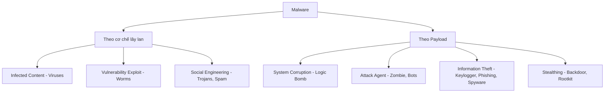
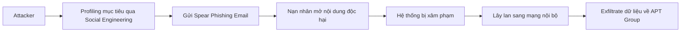
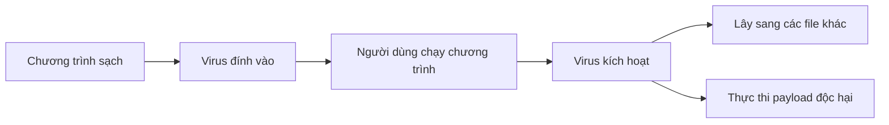
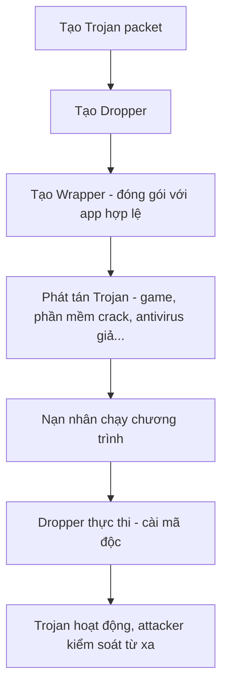
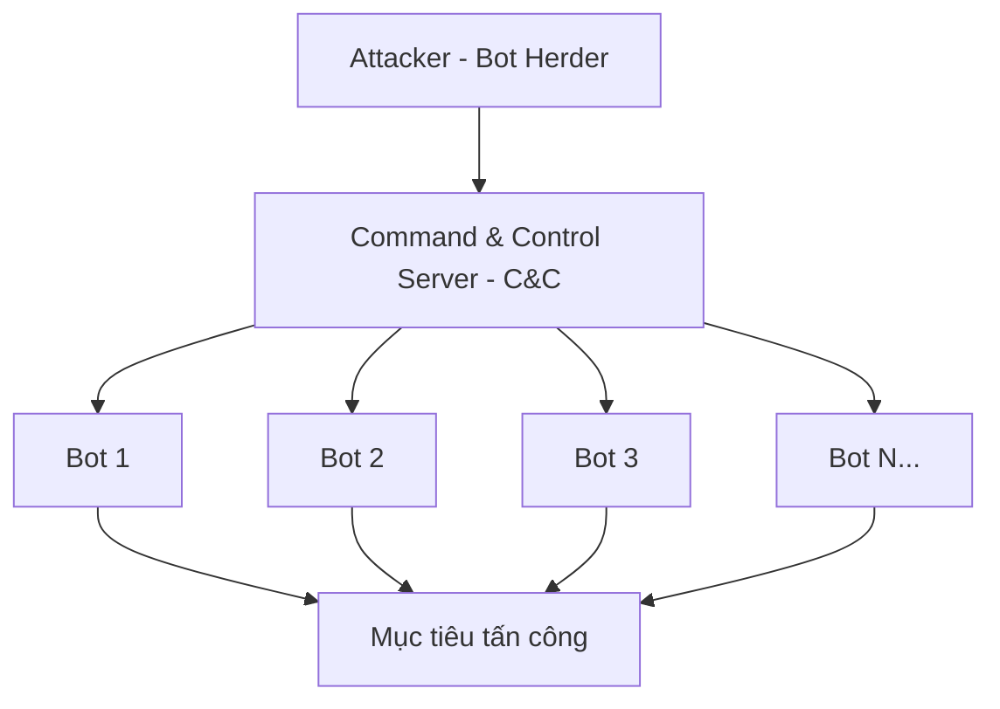
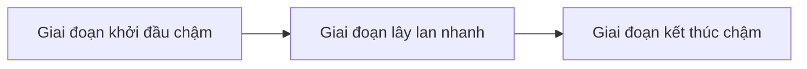

# Bài 4: Malware Threats - Mối đe dọa từ Phần mềm độc hại

## 1. Tổng quan về Malware

### Malware là gì?

Malware (Malicious Software) là phần mềm độc hại, hoạt động chống lại lợi ích của chủ sở hữu hoặc người dùng hệ thống.

NIST (SP 800-83) định nghĩa malware là:

> "Một chương trình được chèn vào hệ thống, thường là một cách bí mật, với mục đích xâm phạm tính bảo mật (confidentiality), tính toàn vẹn (integrity), hoặc tính sẵn sàng (availability) của dữ liệu, ứng dụng, hoặc hệ điều hành của nạn nhân, hoặc gây phiền nhiễu hay làm gián đoạn nạn nhân."

### Malware xâm nhập vào hệ thống qua đâu?

Malware có thể xâm nhập qua rất nhiều con đường khác nhau:

- Ứng dụng nhắn tin tức thời (Instant messenger)
- Thiết bị lưu trữ di động (USB, ổ cứng ngoài...)
- Lỗi trong trình duyệt và phần mềm email
- Quản lý bản vá (patch) không an toàn
- Website không tin cậy và freeware
- Tải file từ Internet
- File đính kèm trong email
- Lan truyền qua mạng (network propagation)
- Dịch vụ chia sẻ file (FTP, SMB)

### Thống kê về Malware

- Tổng số malware (tháng 9/2020): khoảng **1,1 tỷ mẫu**
- Mỗi ngày có hơn **350.000 mẫu malware mới** xuất hiện
- Năm 2019 có hơn **7 tỷ cuộc tấn công** bằng malware
- **4 công ty** bị tấn công bởi ransomware **mỗi phút**
- Tỷ lệ lây nhiễm malware IoT tăng **33%** từ 2018 đến 2019
- **Trojan** là loại malware phổ biến nhất toàn cầu (chiếm 11%)

---

## 2. Phân loại Malware (Taxonomy)

Malware được phân loại theo hai tiêu chí chính: **cơ chế lây lan** và **payload (hành vi gây hại)**.



### Các loại malware phổ biến

- **Adware** - Phần mềm quảng cáo
- **Backdoor** - Cửa hậu cho phép truy cập trái phép
- **Bots/Botnets** - Mạng lưới máy tính bị kiểm soát
- **Keyloggers** - Ghi lại phím bấm
- **Mobile malware** - Malware trên thiết bị di động
- **Ransomware** - Mã hóa dữ liệu tống tiền
- **Rootkits** - Ẩn sự hiện diện của malware
- **Spyware** - Phần mềm gián điệp
- **Trojan horse** - Ngựa thành Troy
- **Viruses** - Virus lây nhiễm file
- **Worms** - Sâu tự lan truyền qua mạng

---

## 3. Advanced Persistent Threat (APT)

APT là một mối đe dọa có chủ đích cao, thường được bảo trợ bởi nhà nước hoặc các tổ chức có nguồn lực lớn, nhắm vào các mục tiêu kinh doanh và chính trị.



### Ba đặc điểm của APT

- **Advanced (Tiên tiến)**: Sử dụng đa dạng các kỹ thuật thu thập thông tin và xâm nhập, bao gồm nhiều loại malware khác nhau, được lựa chọn cẩn thận.
- **Persistent (Dai dẳng)**: Được áp dụng một cách tiến bộ và thường bí mật cho đến khi mục tiêu bị xâm phạm hoàn toàn. Kẻ tấn công không bỏ cuộc sau một thất bại.
- **Threat (Mối đe dọa)**: Là kết quả từ ý định của những kẻ tấn công có tổ chức, có năng lực và được tài trợ tốt.
    - Công thức: **Threat = Capability + Intent**

### Kỹ thuật APT phổ biến

- Social engineering (kỹ thuật lừa đảo xã hội)
- Spear-phishing emails (email lừa đảo có chủ đích)
- Drive-by downloads (tải xuống ngầm khi truy cập web)

### Ví dụ APT nổi tiếng

- **Aurora** - Tấn công Google và hàng chục công ty lớn
- **RSA breach** - Đánh cắp dữ liệu xác thực hai yếu tố
- **APT1** - Nhóm tấn công được cho là liên kết với quân đội Trung Quốc
- **Stuxnet** - Tấn công vào cơ sở hạt nhân Iran

---

## 4. Phân loại cơ bản: Virus vs Worm

=== "Virus"

    **Virus** là malware lây nhiễm bằng cách chỉnh sửa các chương trình hoặc hệ thống đang hoạt động.
    
    - Là loại malware phổ biến đầu tiên
    - Sự lây lan được kích hoạt bởi **hành động của người dùng** (ví dụ: chạy chương trình bị nhiễm)
    - Thuật ngữ "anti-virus" được dùng rộng rãi dù AV hiện đại phát hiện nhiều loại hơn chỉ virus

=== "Worm"

    **Worm** (Sâu máy tính) là malware tự sao chép và lan truyền qua mạng.
    
    - Thường là chương trình độc lập (không cần đính vào file như virus)
    - Tự động lan truyền **mà không cần tương tác của người dùng**
    - Khai thác các lỗ hổng bảo mật (như buffer overflow) để lan rộng

---

## 5. Virus - Chi tiết

### Khái niệm cơ bản

- Thuật ngữ "virus máy tính" được đặt ra bởi **Fred Cohen vào năm 1983**
- Mã độc hại bám vào "nội dung hoạt động" (active content)
- "Active content" có thể là chương trình, script, boot sector, thư viện...

### Cơ chế hoạt động của Virus



Khi virus lây nhiễm một file thực thi, nó sẽ chèn mã độc vào đó. Khi file được chạy, mã virus chạy trước, sau đó chuyển quyền điều khiển lại cho chương trình gốc để người dùng không nghi ngờ.

### Boot Sector Virus (Bootkit)

!!! warning "Nguy hiểm ở mức thấp nhất"
    Boot sector virus (còn gọi là bootkit) thay thế **Master Boot Record (MBR)** - phần được nạp đầu tiên khi khởi động máy - do đó nó kiểm soát hoàn toàn hệ thống từ rất sớm trước khi OS khởi động.

**Quy trình khởi động bình thường:**

```
BIOS/UEFI → MBR → Bootloader → Hệ điều hành → Kernel
```

**Khi bị bootkit:**

```
BIOS → MBR bị thay thế (virus chạy ở đây) → Giả vờ nạp OS bình thường
```

- Virus PC đầu tiên (Brain) là boot-sector virus
- Loại nâng cao hơn có thể tạo hypervisor (như BluePill)
- **UEFI Secure Boot** là biện pháp bảo vệ tốt chống lại loại này

### Virus não (Brain Virus) - 1986

Được coi là virus PC đầu tiên "trong tự nhiên", xuất xứ từ Pakistan:

- Định vị bản thân trong bộ nhớ cao và ở lại thường trú
- Sao chép bản thân vào boot sector
- Sao chép boot sector gốc sang các vị trí khác trên đĩa, đánh dấu là "bad sectors"
- Chặn tất cả yêu cầu đọc/ghi đĩa để giả mạo việc đọc boot sector
- Lây sang tất cả đĩa chưa bị nhiễm trong quá trình đọc/ghi
- Không gây hại trực tiếp khác

### Macro Virus

!!! info "Dữ liệu không phải lúc nào cũng thụ động!"
    Nhiều định dạng tài liệu (ví dụ: MS Office) có thể chứa **macro** - các đoạn script tự động hóa. Đây là vector tấn công nguy hiểm vì người dùng thường tin tưởng file tài liệu hơn file thực thi.

- File HTML, email có thể chứa VBScript hoặc JavaScript
- Ví dụ sớm nhất: **Melissa (1999)** - dùng macro để truy cập danh bạ Outlook
- Microsoft đã thêm cảnh báo khi bật macro, nhưng nhiều người vẫn bấm "Enable Macros" mà không suy nghĩ

### Các virus/worm nổi tiếng theo thời gian

| Năm | Tên | Mô tả |
|-----|-----|--------|
| 1986 | Brain | Virus PC đầu tiên (MS-DOS, boot sector) |
| 1987 | Jerusalem | Virus PC đầu tiên gây hại rộng rãi; xóa file vào mỗi Thứ 6 ngày 13 |
| 1992 | Michelangelo | Xóa đĩa vào ngày sinh Michelangelo (6/3) |
| 1999 | Melissa | Macro virus; gửi bản thân tới 50 địa chỉ trong danh bạ |
| 2000 | ILOVEYOU | VBScript; xóa file media; tác giả từ Philippines |
| 2001 | Code Red | Lây qua lỗ hổng buffer overflow trong MS IIS |
| 2003 | Slammer | Lây qua MS SQL Server; nhân đôi số host nhiễm mỗi 8,5 giây |

### Virus Hoaxes (Tin đồn giả về virus)

Không phải mọi cảnh báo về virus đều là thật. Các tin đồn giả (hoaxes) gây hoảng loạn không cần thiết.

!!! tip "Lời khuyên"
    Luôn kiểm tra với các công ty bảo mật uy tín như McAfee hoặc Symantec trước khi chia sẻ cảnh báo về virus.

Ví dụ nổi tiếng:
- "Virus Flambé": đồn rằng virus có thể làm màn hình bốc cháy
- "Goodtimes" (1994): hoax đầu tiên được lan truyền rộng rãi

---

## 6. Worm - Chi tiết

### Đặc điểm của Worm

- Ít "hoán đổi đĩa" hơn so với thời trước, nhưng kết nối mạng nhiều hơn
- Không hoàn toàn khác với virus - cũng có thể lây nhiễm file thực thi
- Thường cài đặt như các chương trình hoàn chỉnh, độc lập trên hệ thống
- Có thể lây lan tự động hoặc yêu cầu người dùng thực hiện hành động

### Phương thức đánh lừa người dùng

Worm có thể thay đổi phần mở rộng file để lừa người dùng. Ví dụ:

```
file.pdf.exe
```

Người dùng thấy ".pdf" và nghĩ đây là tài liệu an toàn, nhưng thực ra đây là file thực thi.

### The Internet Worm - Morris Worm (1988)

Sự cố Internet nghiêm trọng và rộng rãi đầu tiên:

- Ngày **2/11/1988**
- Mục đích ban đầu: chỉ lan rộng, không gây hại
- Nhưng lỗi trong code sao chép khiến nó lây nhiễm lặp đi lặp lại trên cùng một host, làm **nghẽn nhiều hệ thống**
- Khai thác **3 lỗ hổng**: đoán tên đăng nhập, buffer overflow trong `fingerd`, và "debug mode" trong `sendmail`
- Tác giả: **Robert Morris** - sinh viên sau đại học tại Cornell
- Người đầu tiên bị kết tội theo **Computer Fraud and Abuse Act 1986** (phạt 10.000 USD, 3 năm án treo, 400 giờ phục vụ cộng đồng)
- Kết quả tích cực: **CERT (Computer Emergency Response Team)** được thành lập để phản ứng với các sự cố

### Worm Code Red (2001)

- Lây lan qua **lỗ hổng buffer overflow trong MS IIS**
- Ước tính lây nhiễm **750.000 server**
- Có thể có động cơ chính trị: để lại thông điệp "Hacked by Chinese" (vài tháng sau sự cố máy bay do thám Mỹ-Trung)
- Bao gồm timebomb tấn công DoS vào `www.whitehouse.gov`
- **Hai giai đoạn chính**: quét/lây nhiễm và tấn công (dựa trên ngày trong tháng)

### Worm Slammer (2003)

Còn gọi là "Sapphire" hoặc "SQL Slammer":

- Lây lan qua **lỗ hổng buffer overflow trong MS SQL Server**
- Tốc độ lây lan **cực kỳ nhanh**:
    - Số host nhiễm tăng gấp đôi mỗi **8,5 giây**
    - Lây nhiễm hơn **90% host dễ bị tổn thương trong 10 phút**
    - Lây qua **UDP** (không phải TCP) - nhanh hơn nhưng không đảm bảo
- Làm nghẽn mạng, vô hiệu hóa các dịch vụ khác
- Ví dụ: Nhiều máy ATM của Bank of America ngừng hoạt động

### Worm Stuxnet (2010)

Một trong những worm tinh vi nhất từng được phát hiện:

!!! danger "Vũ khí mạng đầu tiên"
    Stuxnet được coi là **vũ khí mạng** đầu tiên nhắm vào cơ sở hạ tầng công nghiệp vật lý.

- Khai thác ít nhất **4 lỗ hổng 0-day** để lan truyền
- Có thể lan qua USB và mạng
- Tích hợp **rootkit** để ẩn mình
- Ước tính lây nhiễm hơn **200.000 hệ thống**, hầu hết không thấy tác động rõ ràng
- **Payload (hành vi gây hại) chỉ kích hoạt trong điều kiện rất cụ thể** (logic bomb):
    - Tìm kiếm phần mềm điều khiển Siemens "Step 7"
    - Cấu hình mục tiêu cụ thể khớp với bộ điều khiển máy ly tâm hạt nhân của Iran
    - Lập trình lại bộ điều khiển để máy ly tâm quay mất kiểm soát
    - Được cho là đã phá hủy **1/5 số máy ly tâm hạt nhân của Iran**
- Một số lỗ hổng được khai thác sau đó có liên kết với **Equation Group**

---

## 7. Trojan Horse

### Khái niệm

Trojan horse (ngựa thành Troy) bắt nguồn từ câu chuyện thành Troy trong thần thoại Hy Lạp cổ đại. Trong bảo mật máy tính:

> Trojan horse là một chương trình hữu ích, hoặc có vẻ hữu ích, chứa mã ẩn mà khi được gọi, thực hiện một số chức năng không mong muốn hoặc gây hại.

Khác với virus và worm, **trojan không tự sao chép**. Nó dựa vào **social engineering** để lây lan - lừa người dùng tự cài đặt.

### Các loại Trojan

| Loại | Ví dụ |
|------|-------|
| Remote Access Trojan (RAT) | MoSucker, ProRAT, Theef |
| Backdoor Trojans | Kovter, Nitol, Quadars, Snake |
| Rootkit Trojan | Wingbird, Finfisher, GrayFish |
| Proxy Server Trojan | Linux.Proxy.10, Qbot |
| Mobile Trojan | Các biến thể nhắm vào Android/iOS |
| IoT Trojan | Nhắm vào thiết bị IoT |

### Cách Trojan lây nhiễm hệ thống



**Wrapper** là công cụ kết hợp trojan với một ứng dụng có vẻ hợp lệ (game, phần mềm văn phòng, antivirus giả, app bẻ khóa...) để nạn nhân không nghi ngờ.

---

## 8. Các hành vi Payload của Malware

### 8.1. Phá hủy dữ liệu và Ransomware

=== "Data Destruction"

    **Virus phá hủy dữ liệu** xóa toàn bộ dữ liệu trên hệ thống bị nhiễm.
    
    Ví dụ: **Chernobyl virus (1998)** - xóa flash BIOS và phân vùng đĩa cứng vào ngày 26/4 (ngày thảm họa Chernobyl).

=== "Ransomware"

    **Ransomware** mã hóa dữ liệu của người dùng và yêu cầu thanh toán để nhận khóa giải mã.
    
    Ví dụ:
    - **PC Cyborg Trojan (1989)**: Ransomware đầu tiên, lây qua đĩa mềm gửi qua đường bưu điện
    - **Gpcode Trojan (2006)**: Dùng mã hóa khóa công khai (public-key crypto)
    - **WannaCry (2017)**: Lây lan qua lỗ hổng SMB của Windows, tấn công toàn cầu
    
    Ransomware thường yêu cầu thanh toán bằng **Bitcoin** để tránh bị theo dõi.

### 8.2. Zombie và Botnet

**Bot** (còn gọi là robot, zombie, drone): Là PC, server, thiết bị nhúng (router, camera giám sát...) bị xâm phạm và được dùng để tấn công các máy khác.

**Botnet**: Một mạng lưới (tập hợp) các bot.

**Cách thức kiểm soát Botnet:**



Kênh C&C thường là các kênh khó theo dõi như IRC, Twitter hoặc các mạng ngang hàng (P2P).

**Ứng dụng của Botnet:**

- Tấn công **DDoS (Distributed Denial-of-Service)**
- Gửi **spam** với số lượng lớn
- **Nghe lén lưu lượng mạng** (sniffing traffic)
- **Phát tán malware mới**
- Cài đặt **adware**
- Tấn công mạng IRC
- **Đào tiền mã hóa** (coin mining)

Ví dụ: **Mirai botnet (2016)** - lây nhiễm hàng trăm nghìn thiết bị IoT, thực hiện các cuộc tấn công DDoS kỷ lục.

### 8.3. Backdoor

**Backdoor**: Cho phép người dùng trái phép truy cập vào hệ thống.

- Thường là tấn công từ bên trong (insider attack)
- Ví dụ: nhân viên cũ cài backdoor để giữ quyền truy cập sau khi nghỉ việc

### 8.4. Phần mềm xâm phạm quyền riêng tư

| Loại | Mô tả |
|------|-------|
| **Spyware** | Theo dõi lịch sử duyệt web và các ứng dụng đã chạy |
| **Adware** | Kẻ tấn công bán quảng cáo hiện trên máy nạn nhân |
| **Keylogger** | Ghi lại mọi phím bấm để đánh cắp mật khẩu |
| **Webcam tap** | Truy cập webcam để giám sát người dùng |

---

## 9. Hành vi và đặc điểm của Malware

### Vector lây nhiễm

- Phân phối phần mềm thông thường (đĩa hoặc mạng)
- Dịch vụ mạng dễ bị tổn thương
- Ứng dụng dễ bị tổn thương
- Email: tự động hoặc lừa người dùng

### Kiểm soát hành vi độc hại

- Có thể thực thi **ngay lập tức**
- Có thể **kích hoạt theo thời gian** ("time-bomb") hoặc theo điều kiện ("logic-bomb")
    - Ví dụ: Logic bomb thường được cài bởi nhân viên cũ, kích hoạt sau khi bị sa thải
    - Ví dụ thực tế: **OMEGA Engineering, 1996** - kỹ sư bị sa thải cài logic bomb xóa toàn bộ dữ liệu thiết kế
- Có thể được **điều khiển từ xa** (như trong botnet)

---

## 10. Mô hình lây lan của Malware

Nghiên cứu về dịch tễ học sinh học được áp dụng để mô hình hóa sự lây lan của malware:

**Các biến số chính:**

| Biến | Ý nghĩa |
|------|---------|
| N | Tổng số host dễ bị tổn thương |
| Iₜ | Số host bị nhiễm tại thời điểm t |
| Sₜ | Số host dễ bị tổn thương (chưa nhiễm) tại thời điểm t |
| β | Tỷ lệ lây nhiễm |

**Công thức cơ bản:**

```
Iₜ₊₁ = Iₜ + β × Iₜ × Sₜ
Sₜ₊₁ = N - Iₜ₊₁
```

**Ba giai đoạn lây lan:**



Mô hình này đã được xác nhận qua dữ liệu thực tế của worm Code Red - số lượng IP bị nhiễm theo thời gian khớp chính xác với mô hình lý thuyết.

---

## 11. Biện pháp đối phó (Countermeasures)

### Phát hiện Malware

=== "Signature-Based (Dựa trên chữ ký)"

    **Nguyên lý:** Nhận diện mã "đã biết là xấu" bằng cách so sánh với cơ sở dữ liệu chữ ký.
    
    **Ưu điểm:**
    - Đáng tin cậy với ít false positive
    - Hiệu quả với malware đã biết
    
    **Nhược điểm:**
    - Phải biết malware trước, nên **bỏ qua 0-days**
    - Kẻ tấn công có thể tránh phát hiện bằng sửa đổi nhỏ
    - Người dùng **phải cập nhật cơ sở dữ liệu** thường xuyên
    
    !!! warning "Cảnh báo"
        Nhiều chương trình antivirus đi kèm máy tính mới có thời gian dùng thử miễn phí cho việc cập nhật - sau đó **ngừng cập nhật**! Máy tính vẫn chạy AV nhưng không còn bảo vệ khỏi malware mới.

=== "Anomaly Detection (Phát hiện bất thường)"

    **Nguyên lý:** Phát hiện hoạt động bất thường so với hành vi bình thường.
    
    Ví dụ dấu hiệu bất thường:
    - Đọc/ghi số lượng lớn file trong thời gian ngắn
    - Phát hiện code gắn vào event handler (dấu hiệu của keylogger)
    
    **Ưu điểm:**
    - Có thể phát hiện **malware chưa biết và 0-days**
    
    **Nhược điểm:**
    - Có nhiều **false positive** (báo động nhầm)

### Cuộc đua vũ trang giữa kẻ tấn công và người bảo vệ

!!! example "Arms Race"
    Kỹ thuật phát hiện mới được phát minh liên tục... Kỹ thuật né tránh mới cũng được phát minh liên tục. Ai sẽ thắng?

**Các kỹ thuật né tránh AV:**

=== "Polymorphic Virus"

    **Virus đa hình**: Mã lõi được trình bày khác nhau trong các phiên bản khác nhau.
    
    Ví dụ: Mã virus được mã hóa bằng các khóa khác nhau.
    
    Thường vẫn có thể nhận ra một phần chính (bộ giải mã hoặc bộ biến đổi virus).

=== "Metamorphic Virus"

    **Virus biến đổi hoàn toàn**: Toàn bộ mã thay đổi thông qua các phép biến đổi bảo toàn chức năng.
    
    Kỹ thuật:
    - Hoán đổi các thanh ghi được sử dụng
    - Thêm mã vô dụng (junk code)
    - Dùng các lệnh tương đương
    
    Khó phát hiện hơn nhiều so với polymorphic!

---

## Câu hỏi và Trả lời

**Câu hỏi: Làm thế nào malware có thể xâm nhập vào hệ thống?**

Malware có thể xâm nhập qua rất nhiều con đường: email đính kèm, file tải từ Internet, thiết bị lưu trữ di động (USB), lỗ hổng trong ứng dụng hoặc hệ điều hành, các trang web độc hại, dịch vụ chia sẻ file (FTP, SMB), và thậm chí qua các ứng dụng nhắn tin. Điểm chung là khai thác sự thiếu cảnh giác của người dùng hoặc lỗ hổng kỹ thuật.

**Câu hỏi: Có bao nhiêu biến thể của malware?**

Rất nhiều, và con số không ngừng tăng. Có hơn 1,1 tỷ mẫu malware được ghi nhận tính đến tháng 9/2020, với hơn 350.000 mẫu mới mỗi ngày. Về loại, có ít nhất: adware, backdoor, bots/botnets, keyloggers, mobile malware, ransomware, rootkits, spyware, trojan horse, viruses, worms và nhiều loại khác.

**Câu hỏi: Ai sẽ thắng trong cuộc đua giữa kẻ tấn công và người bảo vệ?**

Đây là câu hỏi mở. Về mặt lý thuyết, kẻ tấn công luôn có lợi thế vì họ chỉ cần tìm một lỗ hổng, trong khi người bảo vệ phải bảo vệ toàn bộ hệ thống. Tuy nhiên, sự hợp tác quốc tế, nghiên cứu học thuật, và các công nghệ AI/ML đang giúp cân bằng hơn. Cuộc đua này tiếp tục không có điểm dừng.

---

## Câu hỏi trắc nghiệm

**Câu 1.** Theo định nghĩa của NIST, malware được chèn vào hệ thống với mục đích xâm phạm điều gì?

- A. Chỉ tính bảo mật (confidentiality)
- B. Tính bảo mật, tính toàn vẹn, hoặc tính sẵn sàng của dữ liệu/ứng dụng/hệ điều hành
- C. Chỉ tính sẵn sàng (availability)
- D. Chỉ tính toàn vẹn (integrity)

??? info "Đáp án & Giải thích"
    **Đáp án: B**
    
    NIST định nghĩa malware nhắm vào cả ba mục tiêu của tam giác CIA: Confidentiality (bảo mật), Integrity (toàn vẹn), và Availability (sẵn sàng), hoặc đơn giản là gây phiền nhiễu cho nạn nhân.

---

**Câu 2.** Đặc điểm nào phân biệt Worm với Virus?

- A. Worm không gây hại còn virus thì gây hại
- B. Worm tự lan truyền qua mạng mà không cần người dùng thực hiện hành động, còn virus cần
- C. Worm chỉ tấn công Linux, còn virus chỉ tấn công Windows
- D. Worm luôn mã hóa file, còn virus thì không

??? info "Đáp án & Giải thích"
    **Đáp án: B**
    
    Worm có thể tự động lan truyền qua mạng mà không cần tương tác của người dùng, thường bằng cách khai thác lỗ hổng bảo mật. Virus cần hành động của người dùng (như chạy chương trình bị nhiễm) để kích hoạt và lây lan.

---

**Câu 3.** Thuật ngữ "virus máy tính" được đặt ra bởi ai và khi nào?

- A. Bill Gates, 1975
- B. Robert Morris, 1988
- C. Fred Cohen, 1983
- D. John von Neumann, 1949

??? info "Đáp án & Giải thích"
    **Đáp án: C**
    
    Fred Cohen là người đã đặt ra thuật ngữ "computer virus" vào năm 1983, trong luận văn của mình về lý thuyết virus máy tính.

---

**Câu 4.** Virus PC đầu tiên "trong tự nhiên" là gì và xuất hiện vào năm nào?

- A. Jerusalem, 1987
- B. Brain, 1986
- C. Michelangelo, 1992
- D. Melissa, 1999

??? info "Đáp án & Giải thích"
    **Đáp án: B**
    
    Brain virus (1986), còn gọi là "Pakistani Brain", được coi là virus PC đầu tiên trong tự nhiên. Nó là một boot-sector virus xuất xứ từ Pakistan.

---

**Câu 5.** Worm Morris (1988) khai thác bao nhiêu lỗ hổng và chúng là gì?

- A. 2 lỗ hổng: buffer overflow trong FTP và lỗi trong HTTP
- B. 3 lỗ hổng: đoán tên đăng nhập, buffer overflow trong fingerd, và debug mode trong sendmail
- C. 4 lỗ hổng: SQL injection, XSS, buffer overflow, và privilege escalation
- D. 1 lỗ hổng: lỗi trong giao thức TCP/IP

??? info "Đáp án & Giải thích"
    **Đáp án: B**
    
    Morris Worm khai thác 3 lỗ hổng: (1) đoán tên đăng nhập/mật khẩu, (2) buffer overflow trong chương trình `fingerd`, và (3) "debug mode" trong `sendmail` cho phép thực thi lệnh tùy ý.

---

**Câu 6.** Kết quả tích cực nào xuất hiện sau sự cố Morris Worm?

- A. Microsoft ra mắt Windows
- B. CERT (Computer Emergency Response Team) được thành lập
- C. Luật Computer Fraud and Abuse Act được ban hành
- D. TCP/IP được cải tiến toàn diện

??? info "Đáp án & Giải thích"
    **Đáp án: B**
    
    Một kết quả tích cực sau sự cố Morris Worm là CERT (Computer Emergency Response Team) được thành lập để phản ứng với các sự cố bảo mật Internet. Lưu ý: Computer Fraud and Abuse Act được ban hành năm 1986, trước sự cố Morris Worm (1988).

---

**Câu 7.** Worm Code Red (2001) lây lan bằng cách nào?

- A. Qua email đính kèm
- B. Qua USB và thiết bị lưu trữ di động
- C. Qua lỗ hổng buffer overflow trong Microsoft IIS
- D. Qua lỗ hổng trong Adobe Acrobat

??? info "Đáp án & Giải thích"
    **Đáp án: C**
    
    Code Red lây lan qua lỗ hổng buffer overflow trong Microsoft Internet Information Server (IIS). Đây là web server của Microsoft, và lỗ hổng này cho phép worm thực thi mã từ xa.

---

**Câu 8.** Worm Slammer (2003) đặc biệt ở điểm gì?

- A. Là worm đầu tiên tấn công thiết bị IoT
- B. Số host nhiễm tăng gấp đôi mỗi 8,5 giây và lây nhiễm 90% host dễ bị tổn thương trong 10 phút
- C. Mã hóa toàn bộ dữ liệu trên host bị nhiễm
- D. Sử dụng kênh C&C qua Twitter

??? info "Đáp án & Giải thích"
    **Đáp án: B**
    
    Slammer nổi tiếng với tốc độ lây lan cực kỳ nhanh: số host nhiễm tăng gấp đôi mỗi 8,5 giây và chỉ trong 10 phút đã lây nhiễm hơn 90% số host dễ bị tổn thương. Điều này được thực hiện nhờ sử dụng giao thức UDP (không cần bắt tay như TCP).

---

**Câu 9.** Stuxnet khai thác bao nhiêu lỗ hổng 0-day?

- A. 1
- B. 2
- C. Ít nhất 4
- D. 10

??? info "Đáp án & Giải thích"
    **Đáp án: C**
    
    Stuxnet khai thác ít nhất 4 lỗ hổng 0-day khác nhau để lan truyền - một con số chưa từng thấy ở malware nào trước đó, phản ánh mức độ tinh vi và nguồn lực lớn của những người tạo ra nó.

---

**Câu 10.** Mục tiêu cụ thể của Stuxnet là gì?

- A. Đánh cắp thông tin tài chính từ ngân hàng
- B. Phá hủy máy ly tâm hạt nhân của Iran bằng cách lập trình lại bộ điều khiển Siemens
- C. Tấn công hệ thống điện của Nga
- D. Gián điệp mạng tại Mỹ

??? info "Đáp án & Giải thích"
    **Đáp án: B**
    
    Stuxnet tìm kiếm phần mềm điều khiển Siemens "Step 7" với cấu hình khớp chính xác với bộ điều khiển máy ly tâm hạt nhân của Iran, sau đó lập trình lại chúng để máy ly tâm quay mất kiểm soát. Được cho là đã phá hủy khoảng 1/5 số máy ly tâm của Iran.

---

**Câu 11.** APT là viết tắt của gì và công thức "Threat" trong APT là gì?

- A. Advanced Protection Technology; Threat = Software + Hardware
- B. Advanced Persistent Threat; Threat = Capability + Intent
- C. Automated Penetration Testing; Threat = Vulnerability + Exploit
- D. Active Protection Technique; Threat = Attack + Defense

??? info "Đáp án & Giải thích"
    **Đáp án: B**
    
    APT = Advanced Persistent Threat. Trong APT, "Threat" (mối đe dọa) được định nghĩa là tổ hợp của Capability (năng lực của kẻ tấn công) và Intent (ý định tấn công). Thiếu một trong hai thì không tạo thành mối đe dọa thực sự.

---

**Câu 12.** Kỹ thuật phổ biến nào được sử dụng trong các cuộc tấn công APT?

- A. Brute force và SQL injection
- B. Social engineering, spear-phishing, và drive-by downloads
- C. DDoS và port scanning
- D. ARP spoofing và MITM

??? info "Đáp án & Giải thích"
    **Đáp án: B**
    
    APT thường sử dụng: social engineering (thao túng tâm lý), spear-phishing emails (email lừa đảo nhắm vào cá nhân cụ thể), và drive-by downloads (tải xuống ngầm khi truy cập trang web bị compromised).

---

**Câu 13.** Điều gì làm cho "Metamorphic virus" khó phát hiện hơn "Polymorphic virus"?

- A. Metamorphic virus nhỏ hơn nên khó tìm thấy
- B. Metamorphic virus thay đổi toàn bộ mã qua các phép biến đổi bảo toàn chức năng, không còn phần nào cố định để nhận diện
- C. Metamorphic virus chỉ tấn công kernel nên AV không thể quét
- D. Metamorphic virus mã hóa chính bản thân AV

??? info "Đáp án & Giải thích"
    **Đáp án: B**
    
    Polymorphic virus vẫn có một phần cố định (như bộ giải mã) có thể bị nhận ra. Metamorphic virus thay đổi **toàn bộ** mã thông qua các phép biến đổi bảo toàn chức năng (hoán đổi thanh ghi, thêm junk code, dùng lệnh tương đương...), không còn bất kỳ phần cố định nào để signature-based AV nhận diện.

---

**Câu 14.** Anomaly-based detection có nhược điểm gì so với Signature-based detection?

- A. Không phát hiện được malware đã biết
- B. Cần nhiều băng thông mạng hơn
- C. Có nhiều false positive hơn
- D. Chỉ chạy được trên Linux

??? info "Đáp án & Giải thích"
    **Đáp án: C**
    
    Anomaly detection hoạt động bằng cách phát hiện hành vi bất thường, nhưng "bất thường" là khái niệm tương đối. Nhiều hoạt động hợp lệ (như backup toàn bộ ổ đĩa, cập nhật hệ thống...) có thể bị báo nhầm là độc hại, dẫn đến nhiều false positive.

---

**Câu 15.** Melissa (1999) là loại malware gì và hoạt động như thế nào?

- A. Boot sector virus; lây khi khởi động máy
- B. Macro virus trong MS-Word; tự gửi tới 50 địa chỉ đầu tiên trong danh bạ Outlook
- C. Worm; khai thác lỗ hổng trong MS Exchange Server
- D. Trojan; giả mạo phần mềm diệt virus

??? info "Đáp án & Giải thích"
    **Đáp án: B**
    
    Melissa là một macro virus trong MS-Word. Khi tài liệu bị nhiễm được mở, virus sử dụng macro để truy cập danh bạ Microsoft Outlook và tự gửi tới 50 địa chỉ đầu tiên, gây tắc nghẽn nhiều mail server.

---

**Câu 16.** Rootkit hoạt động ở mức người dùng làm gì trên Linux?

- A. Mã hóa file hệ thống
- B. Thay thế lệnh `ps` (ẩn tiến trình) và lệnh `ls` (ẩn file)
- C. Vô hiệu hóa tường lửa
- D. Đánh cắp mật khẩu root

??? info "Đáp án & Giải thích"
    **Đáp án: B**
    
    User-level rootkit trên Linux thay thế các lệnh hệ thống chuẩn: thay `ps` để ẩn các tiến trình độc hại và thay `ls` để ẩn các file độc hại. Điều này làm cho malware "vô hình" với người quản trị.

---

**Câu 17.** Điều gì phân biệt Kernel-level rootkit với User-level rootkit?

- A. Kernel-level rootkit chỉ hoạt động trên Windows
- B. Kernel-level rootkit ẩn mình ở mức sâu hơn, ẩn khỏi tất cả các chương trình
- C. Kernel-level rootkit không thể bị phát hiện bằng bất kỳ phương tiện nào
- D. Kernel-level rootkit nhỏ hơn và nhanh hơn

??? info "Đáp án & Giải thích"
    **Đáp án: B**
    
    Kernel-level rootkit hoạt động ở mức kernel (nhân hệ điều hành), sâu hơn và có đặc quyền cao hơn user-level rootkit. Nó có thể ẩn mình khỏi tất cả các chương trình chạy ở user space, bao gồm cả AV thông thường.

---

**Câu 18.** ILOVEYOU (Love Bug, 2000) gây hại như thế nào?

- A. Mã hóa toàn bộ ổ cứng
- B. Xóa các file media (.jpg, .mp3, ...)
- C. Tắt kết nối Internet
- D. Thay đổi mật khẩu người dùng

??? info "Đáp án & Giải thích"
    **Đáp án: B**
    
    ILOVEYOU (VBScript virus) lây lan qua email tương tự Melissa, nhưng còn thực hiện hành động gây hại: xóa các file media bao gồm .jpg, .mp3 và nhiều định dạng khác. Tác giả đến từ Philippines và về cơ bản đã tránh được hình phạt vì thiếu luật tội phạm mạng phù hợp.

---

**Câu 19.** Botnet thường sử dụng kênh Command & Control (C&C) nào để khó bị theo dõi?

- A. HTTP/HTTPS rõ ràng đến IP cố định
- B. Các kênh khó theo dõi như IRC, Twitter, hoặc mạng P2P
- C. Email SMTP thông thường
- D. FTP ẩn danh

??? info "Đáp án & Giải thích"
    **Đáp án: B**
    
    Botnet sử dụng các kênh khó theo dõi để liên lạc C&C: IRC (Internet Relay Chat), mạng xã hội như Twitter, hoặc mạng ngang hàng (P2P). Điều này khiến việc tìm kiếm và đánh sập botmaster trở nên khó khăn hơn.

---

**Câu 20.** Mirai botnet (2016) đặc biệt ở điểm gì?

- A. Là botnet đầu tiên tấn công ngân hàng
- B. Lây nhiễm hàng trăm nghìn thiết bị IoT (router, camera...) để thực hiện DDoS
- C. Mã hóa dữ liệu trên tất cả thiết bị bị nhiễm
- D. Tấn công chỉ vào hệ thống Windows

??? info "Đáp án & Giải thích"
    **Đáp án: B**
    
    Mirai botnet nổi tiếng vì lây nhiễm một lượng lớn thiết bị IoT như router, camera giám sát, DVR... bằng cách dùng thông tin đăng nhập mặc định. Sau đó dùng chúng để thực hiện các cuộc tấn công DDoS kỷ lục, bao gồm tấn công vào DNS provider Dyn.

---

**Câu 21.** Jerusalem virus (1987) kích hoạt khi nào và làm gì?

- A. Kích hoạt vào sinh nhật tác giả; hiển thị thông điệp chính trị
- B. Kích hoạt vào mỗi Thứ 6 ngày 13; xóa bất kỳ chương trình nào được chạy
- C. Kích hoạt vào ngày 1/1; xóa toàn bộ ổ cứng
- D. Kích hoạt khi kết nối mạng; gửi dữ liệu ra ngoài

??? info "Đáp án & Giải thích"
    **Đáp án: B**
    
    Jerusalem virus là một logic bomb: nó kích hoạt vào mỗi ngày Thứ 6 ngày 13 và xóa bất kỳ chương trình nào được người dùng chạy trong ngày đó. Nó cũng dùng tính năng "Terminate and Stay Resident" (TSR) của DOS để ở lại trong bộ nhớ.

---

**Câu 22.** Điều gì đặc biệt về cách Ransomware yêu cầu thanh toán?

- A. Yêu cầu chuyển khoản ngân hàng thông thường
- B. Yêu cầu thanh toán bằng thẻ tín dụng
- C. Thường yêu cầu thanh toán bằng Bitcoin hoặc tiền mã hóa khác để tránh theo dõi
- D. Yêu cầu thanh toán bằng thẻ quà tặng (gift card)

??? info "Đáp án & Giải thích"
    **Đáp án: C**
    
    Ransomware thường yêu cầu thanh toán bằng Bitcoin hoặc các tiền mã hóa khác vì tính ẩn danh của chúng, khiến rất khó (dù không phải không thể) để truy vết kẻ tấn công.

---

**Câu 23.** Ransomware PC Cyborg Trojan (1989) có gì đặc biệt về phương thức phát tán?

- A. Phát tán qua email hàng loạt
- B. Phát tán qua đĩa mềm gửi qua đường bưu điện
- C. Phát tán qua mạng LAN
- D. Phát tán qua USB

??? info "Đáp án & Giải thích"
    **Đáp án: B**
    
    PC Cyborg Trojan (1989) - được coi là ransomware đầu tiên - có phương thức phát tán rất thô sơ: gửi đĩa mềm vật lý qua đường bưu điện! Đây là ví dụ thú vị về "sneakernet" (mạng dùng chân) trong thời kỳ trước Internet phổ biến.

---

**Câu 24.** Trong mô hình lây lan malware, biến β (beta) đại diện cho điều gì?

- A. Số lượng host đã bị nhiễm
- B. Tỷ lệ lây nhiễm
- C. Tổng số host dễ bị tổn thương
- D. Thời gian trung bình để lây nhiễm một host

??? info "Đáp án & Giải thích"
    **Đáp án: B**
    
    Trong mô hình dịch tễ học áp dụng cho malware: N = tổng host dễ bị tổn thương, Iₜ = host đã bị nhiễm tại thời điểm t, Sₜ = host còn dễ bị tổn thương, và **β (beta) = tỷ lệ lây nhiễm** - xác suất một host bị nhiễm khi tiếp xúc với malware.

---

**Câu 25.** Biện pháp nào bảo vệ chống lại Boot Sector Virus hiệu quả?

- A. Cài đặt phần mềm antivirus thông thường
- B. UEFI Secure Boot
- C. Tường lửa mạng
- D. Mã hóa ổ cứng

??? info "Đáp án & Giải thích"
    **Đáp án: B**
    
    UEFI Secure Boot đảm bảo chỉ phần mềm được ký bởi các khóa tin cậy mới được khởi động, ngăn chặn bootkit thay thế MBR hoặc bootloader. Đây là biện pháp bảo vệ phần cứng/firmware ở mức thấp hơn OS.

---

**Câu 26.** Wrapper trong bối cảnh Trojan horse là gì?

- A. Phần mềm mã hóa malware để tránh bị phát hiện
- B. Công cụ kết hợp trojan với một ứng dụng có vẻ hợp lệ để lừa người dùng cài đặt
- C. Vỏ bọc bảo vệ xung quanh file hệ thống
- D. Giao thức truyền thông an toàn giữa bot và C&C server

??? info "Đáp án & Giải thích"
    **Đáp án: B**
    
    Wrapper là công cụ đóng gói (bind) trojan cùng với một ứng dụng có vẻ hợp lệ như game, phần mềm văn phòng, antivirus giả, hay app bẻ khóa. Khi người dùng cài đặt ứng dụng "hợp lệ", trojan cũng được cài ngầm cùng.

---

**Câu 27.** "Logic bomb" là gì?

- A. Malware khai thác lỗ hổng trong logic mạng
- B. Malware chỉ kích hoạt khi một điều kiện cụ thể được thỏa mãn
- C. Thuật toán tấn công brute force
- D. Loại DoS tấn công vào tầng ứng dụng

??? info "Đáp án & Giải thích"
    **Đáp án: B**
    
    Logic bomb là malware (hoặc phần của malware) chỉ kích hoạt hành vi gây hại khi một điều kiện cụ thể được thỏa mãn, ví dụ: một ngày nhất định (time bomb), khi một nhân viên bị xóa khỏi hệ thống HR, hoặc khi một file cụ thể được mở. Ví dụ: OMEGA Engineering 1996, Stuxnet.

---

**Câu 28.** Điều gì xảy ra với Robert Morris sau vụ Morris Worm?

- A. Được tuyển vào NSA
- B. Bị kết tội theo Computer Fraud and Abuse Act 1986: phạt 10.000 USD, 3 năm án treo, 400 giờ phục vụ cộng đồng
- C. Bị bỏ tù 10 năm
- D. Trốn thoát sang nước khác và không bị truy tố

??? info "Đáp án & Giải thích"
    **Đáp án: B**
    
    Robert Morris là người đầu tiên bị kết tội theo Computer Fraud and Abuse Act 1986. Ông bị xử: phạt 10.000 USD, 3 năm án treo (suspended sentence), và 400 giờ phục vụ cộng đồng. Sau đó ông trở thành giáo sư tại MIT.

---

**Câu 29.** Tại sao Signature-based detection thất bại với các cuộc tấn công 0-day?

- A. Vì AV không đủ mạnh để xử lý
- B. Vì signature-based detection chỉ nhận diện malware đã biết; 0-day là malware mới chưa có chữ ký trong cơ sở dữ liệu
- C. Vì 0-day tấn công vào chính AV software
- D. Vì 0-day chỉ tấn công qua mạng không phải qua file

??? info "Đáp án & Giải thích"
    **Đáp án: B**
    
    Signature-based detection hoạt động bằng cách so sánh với cơ sở dữ liệu chữ ký của malware đã biết. 0-day exploit khai thác lỗ hổng chưa được công bố và malware chưa được phân tích, nên chưa có chữ ký trong cơ sở dữ liệu - AV hoàn toàn "mù" trước chúng.

---

**Câu 30.** Spyware khác Adware ở điểm gì?

- A. Spyware chỉ hoạt động trên Mac, Adware chỉ trên Windows
- B. Spyware theo dõi hoạt động của người dùng (duyệt web, thực thi ứng dụng); Adware hiển thị quảng cáo trên máy nạn nhân
- C. Spyware mã hóa dữ liệu, Adware thì không
- D. Spyware chỉ ảnh hưởng đến phần cứng, Adware chỉ ảnh hưởng đến phần mềm

??? info "Đáp án & Giải thích"
    **Đáp án: B**
    
    Spyware theo dõi và thu thập thông tin về người dùng (lịch sử duyệt web, ứng dụng đã chạy, có thể truy cập webcam). Adware hiển thị quảng cáo không mong muốn trên máy nạn nhân - kẻ tấn công thực sự thu tiền từ các nhà quảng cáo.

---

**Câu 31.** Virus ILOVEYOU được viết bằng ngôn ngữ gì?

- A. C++
- B. Python
- C. VBScript
- D. Java

??? info "Đáp án & Giải thích"
    **Đáp án: C**
    
    ILOVEYOU (Love Bug, 2000) được viết bằng VBScript - một ngôn ngữ script của Microsoft. File đính kèm có tên "LOVE-LETTER-FOR-YOU.TXT.vbs" và khai thác việc Windows ẩn phần mở rộng file.

---

**Câu 32.** Trong ba giai đoạn lây lan của worm/virus, giai đoạn nào lây lan nhanh nhất?

- A. Giai đoạn khởi đầu (slow start)
- B. Giai đoạn kết thúc (slow finish)
- C. Giai đoạn lan rộng nhanh (fast spread)
- D. Tốc độ lây lan đồng đều trong cả ba giai đoạn

??? info "Đáp án & Giải thích"
    **Đáp án: C**
    
    Theo mô hình lây lan, có 3 giai đoạn: (1) Slow start - ít host bị nhiễm, tốc độ chậm; (2) Fast spread - số host nhiễm lớn, mỗi host lây sang nhiều host khác, tốc độ bùng phát; (3) Slow finish - hầu hết host dễ tổn thương đã bị nhiễm, ít "mồi" còn lại.

---

**Câu 33.** Remote Access Trojan (RAT) cho phép kẻ tấn công làm gì?

- A. Chỉ xem màn hình của nạn nhân
- B. Điều khiển từ xa hệ thống của nạn nhân hoàn toàn như thể ngồi trực tiếp trước máy
- C. Chỉ đánh cắp mật khẩu
- D. Chỉ tắt kết nối Internet của nạn nhân

??? info "Đáp án & Giải thích"
    **Đáp án: B**
    
    RAT (Remote Access Trojan) cung cấp cho kẻ tấn công quyền điều khiển đầy đủ và từ xa hệ thống của nạn nhân: xem màn hình, truy cập file, chạy lệnh, bật webcam/microphone, ghi phím bấm, v.v. Ví dụ: MoSucker, ProRAT, Theef.

---

**Câu 34.** Điều gì là đặc điểm "Persistent" (dai dẳng) trong APT?

- A. APT sử dụng nhiều loại malware khác nhau
- B. APT được áp dụng một cách tiến bộ và thường bí mật cho đến khi mục tiêu hoàn toàn bị xâm phạm; không bỏ cuộc
- C. APT để lại nhiều dấu vết rõ ràng
- D. APT chỉ tấn công trong thời gian ngắn rồi rút lui

??? info "Đáp án & Giải thích"
    **Đáp án: B**
    
    "Persistent" trong APT có nghĩa là cuộc tấn công được thực hiện một cách kiên trì, tiến bộ, và thường bí mật (stealthy) cho đến khi mục tiêu bị xâm phạm hoàn toàn. Kẻ tấn công không từ bỏ sau một thất bại và có thể duy trì sự hiện diện trong hệ thống mục tiêu trong thời gian dài.

---

**Câu 35.** Dropper trong bối cảnh Trojan là gì?

- A. Phần của trojan dùng để gửi email spam
- B. Phần của gói trojanized cài đặt mã độc lên hệ thống mục tiêu
- C. Công cụ xóa dấu vết sau khi tấn công
- D. Chương trình dùng để download payload từ Internet

??? info "Đáp án & Giải thích"
    **Đáp án: B**
    
    Dropper là thành phần trong gói trojanized chịu trách nhiệm "thả" (drop) và cài đặt mã độc thực sự lên hệ thống mục tiêu. Khi người dùng chạy chương trình có vẻ hợp lệ, dropper hoạt động ngầm để cài trojan.

---

**Câu 36.** Tại sao Worm Slammer lây lan qua UDP thay vì TCP?

- A. Vì UDP bảo mật hơn TCP
- B. Vì UDP không cần bắt tay (handshake), nhanh hơn, cho phép lây lan với tốc độ cao hơn
- C. Vì TCP không hỗ trợ lây lan malware
- D. Vì UDP được hỗ trợ trên nhiều thiết bị hơn

??? info "Đáp án & Giải thích"
    **Đáp án: B**
    
    UDP là giao thức không kết nối (connectionless), không cần quá trình bắt tay (handshake) 3 bước như TCP. Điều này cho phép Slammer gửi các gói tin lây nhiễm với tốc độ cực cao mà không cần chờ xác nhận, góp phần vào tốc độ lây lan kinh hoàng của nó.

---

**Câu 37.** AIDS Trojan (1989) là ví dụ về loại trojan gì và đặc biệt vì sao?

- A. RAT; vì điều khiển từ xa qua dial-up
- B. Ransomware đầu tiên; được phát tán qua đĩa mềm gửi bưu điện
- C. Keylogger; ghi lại tên đăng nhập và mật khẩu
- D. Backdoor; cho phép truy cập từ xa ẩn danh

??? info "Đáp án & Giải thích"
    **Đáp án: B**
    
    AIDS Trojan (1989), còn gọi là PC Cyborg, là ransomware đầu tiên trong lịch sử. Điều đặc biệt là nó được phát tán theo nghĩa đen qua đường bưu điện - các đĩa mềm được gửi tới các nhà nghiên cứu AIDS. Khi cài đặt, nó mã hóa danh sách file và yêu cầu thanh toán để khôi phục.

---

**Câu 38.** Khi malware có thể "trigger" theo thời gian được gọi là gì?

- A. Logic bomb
- B. Time bomb
- C. Schedule bomb
- D. Cron bomb

??? info "Đáp án & Giải thích"
    **Đáp án: B**
    
    Malware kích hoạt vào một thời điểm cụ thể được gọi là "time bomb". Ví dụ: Michelangelo kích hoạt vào ngày 6/3 (sinh nhật Michelangelo), Jerusalem kích hoạt vào mỗi Thứ 6 ngày 13. Khi kích hoạt theo điều kiện logic thì gọi là "logic bomb".

---

**Câu 39.** Điều gì là mục đích chính của Spear-phishing so với phishing thông thường?

- A. Spear-phishing dùng kỹ thuật kỹ thuật hơn, không liên quan đến email
- B. Spear-phishing nhắm vào cá nhân hoặc tổ chức cụ thể với thông tin được tùy chỉnh, trong khi phishing thông thường gửi đại trà
- C. Spear-phishing chỉ tấn công tài khoản ngân hàng
- D. Spear-phishing là phishing bằng điện thoại

??? info "Đáp án & Giải thích"
    **Đáp án: B**
    
    Spear-phishing là phishing có chủ đích: email được tùy chỉnh với thông tin cụ thể về nạn nhân (tên, chức vụ, tên công ty...) khiến nó trông đáng tin hơn nhiều. Phishing thông thường gửi email giống hệt nhau đến hàng triệu địa chỉ ngẫu nhiên.

---

**Câu 40.** Tổng số mẫu malware tính đến tháng 9/2020 là bao nhiêu?

- A. Khoảng 100 triệu
- B. Khoảng 500 triệu
- C. Khoảng 1,1 tỷ
- D. Khoảng 10 tỷ

??? info "Đáp án & Giải thích"
    **Đáp án: C**
    
    Theo thống kê của AV-TEST, tổng số mẫu malware tính đến tháng 9/2020 là khoảng 1,101,270,000 (hơn 1,1 tỷ), với hơn 350.000 mẫu mới được phát hiện mỗi ngày.

---

**Câu 41.** Loại malware nào phổ biến nhất toàn cầu theo thống kê?

- A. Ransomware
- B. Worm
- C. Trojan (11%)
- D. Virus

??? info "Đáp án & Giải thích"
    **Đáp án: C**
    
    Theo thống kê được đề cập trong bài, Trojan là loại malware phổ biến nhất toàn cầu, chiếm 11% tổng số malware được phát hiện.

---

**Câu 42.** Trong mô hình lây lan malware, công thức tính số host bị nhiễm tại thời điểm t+1 là gì?

- A. Iₜ₊₁ = Iₜ × β
- B. Iₜ₊₁ = Iₜ + β × Iₜ × Sₜ
- C. Iₜ₊₁ = N - Sₜ
- D. Iₜ₊₁ = β × N

??? info "Đáp án & Giải thích"
    **Đáp án: B**
    
    Công thức là **Iₜ₊₁ = Iₜ + β × Iₜ × Sₜ**, trong đó: Iₜ là số host đã nhiễm, β là tỷ lệ lây nhiễm, và Sₜ là số host còn dễ bị tổn thương. Đây là mô hình SIR (Susceptible-Infected-Removed) từ dịch tễ học sinh học.

---

**Câu 43.** Một trong những ứng dụng của botnet mà tài liệu đề cập nhưng ít được nghĩ đến là gì?

- A. In 3D
- B. Coin mining (đào tiền mã hóa)
- C. Render đồ họa
- D. Lưu trữ đám mây phân tán

??? info "Đáp án & Giải thích"
    **Đáp án: B**
    
    Ngoài các ứng dụng truyền thống như DDoS, spam, và phát tán malware, botnet ngày nay còn được dùng để **coin mining** - đào tiền mã hóa. Kẻ tấn công dùng CPU/GPU của hàng nghìn máy bị nhiễm để đào tiền, trong khi nạn nhân chịu chi phí điện và giảm hiệu năng máy.

---

**Câu 44.** Tại sao người dùng cần liên tục cập nhật cơ sở dữ liệu virus cho AV?

- A. Để AV chạy nhanh hơn
- B. Vì hơn 350.000 mẫu malware mới xuất hiện mỗi ngày, cơ sở dữ liệu cũ sẽ không nhận diện được chúng
- C. Để AV không chiếm nhiều RAM
- D. Vì nhà sản xuất AV yêu cầu để duy trì bản quyền

??? info "Đáp án & Giải thích"
    **Đáp án: B**
    
    Vì hơn 350.000 mẫu malware mới xuất hiện mỗi ngày, cơ sở dữ liệu chữ ký phải được cập nhật liên tục. AV với cơ sở dữ liệu cũ sẽ không nhận ra các malware mới. Đặc biệt nguy hiểm là nhiều máy tính mới đi kèm AV với "free trial" cập nhật - sau khi hết hạn, AV vẫn chạy nhưng không cập nhật được chữ ký mới.

---

**Câu 45.** Stuxnet được phát hiện vào năm nào và ai được cho là đứng sau nó?

- A. 2005; Trung Quốc
- B. 2010; được cho là Mỹ và Israel (có liên kết với Equation Group)
- C. 2015; Nga
- D. 2008; Bắc Triều Tiên

??? info "Đáp án & Giải thích"
    **Đáp án: B**
    
    Stuxnet được phát hiện vào năm 2010. Mặc dù không có quốc gia nào chính thức nhận trách nhiệm, nhiều bằng chứng chỉ ra sự liên kết với Mỹ và Israel. Một số lỗ hổng được khai thác sau này được liên kết với Equation Group - một nhóm được cho là có liên hệ với NSA.

---

**Câu 46.** Điều gì phân biệt "Phishing" với "Pharming"?

- A. Phishing dùng email, Pharming không
- B. Phishing lừa người dùng click vào link giả; Pharming chuyển hướng người dùng tới trang web giả mà không cần họ click gì (thông qua DNS poisoning)
- C. Phishing chỉ nhắm vào doanh nghiệp, Pharming nhắm vào cá nhân
- D. Đây là cùng một kỹ thuật, chỉ khác tên gọi

??? info "Đáp án & Giải thích"
    **Đáp án: B**
    
    Đây là câu hỏi mở rộng từ kiến thức nền. Phishing lừa người dùng tự click vào link giả mạo. Pharming can thiệp vào DNS để chuyển hướng người dùng đến trang web giả mạo ngay cả khi họ nhập đúng địa chỉ - người dùng không cần phải bị lừa click vào gì cả.

---

**Câu 47.** Chernobyl virus (1998) kích hoạt vào ngày nào và gây hại gì?

- A. Ngày 1/1; xóa tất cả file .exe
- B. Ngày 26/4 (ngày thảm họa Chernobyl); xóa flash BIOS và phân vùng đĩa cứng
- C. Ngày 6/3; ghi đè MBR
- D. Mỗi Thứ 6 ngày 13; mã hóa ổ cứng

??? info "Đáp án & Giải thích"
    **Đáp án: B**
    
    Chernobyl virus (còn gọi là CIH hay Spacefiller) kích hoạt vào ngày 26/4 - ngày kỷ niệm thảm họa hạt nhân Chernobyl. Nó xóa flash BIOS (làm máy không thể khởi động) và ghi đè dữ liệu trên ổ cứng - gây hại vật lý thực sự bằng phần mềm.

---

**Câu 48.** Phần mềm diệt virus (AV) dùng thuật ngữ "anti-virus" nhưng thực ra phát hiện được những gì?

- A. Chỉ phát hiện được virus truyền thống
- B. Phát hiện nhiều hơn chỉ virus: bao gồm worm, trojan, spyware, ransomware, và nhiều loại malware khác
- C. Chỉ phát hiện được virus và worm
- D. Chỉ phát hiện được malware trên email

??? info "Đáp án & Giải thích"
    **Đáp án: B**
    
    Tài liệu lưu ý rằng "anti-virus" được dùng như một thuật ngữ chung, nhưng thực tế phần mềm AV hiện đại phát hiện được nhiều loại malware hơn chỉ virus truyền thống: worm, trojan, spyware, adware, ransomware, keylogger, rootkit, và nhiều loại khác.

---

**Câu 49.** Phong trào kiểm tra bảo mật nào được thành lập sau Morris Worm và mục đích của nó là gì?

- A. NSA Cybersecurity Division; bảo vệ cơ quan chính phủ
- B. CERT (Computer Emergency Response Team); phản ứng với các sự cố bảo mật máy tính
- C. NIST Cybersecurity Framework; đặt ra tiêu chuẩn bảo mật
- D. FBI Cyber Division; điều tra tội phạm mạng

??? info "Đáp án & Giải thích"
    **Đáp án: B**
    
    Sau sự cố Morris Worm 1988, CERT (Computer Emergency Response Team) được thành lập để phản ứng với các sự cố bảo mật Internet. Đây là một trong những hệ quả tích cực hiếm hoi từ sự cố này - nó khiến mọi người bắt đầu chú ý nghiêm túc đến bảo mật máy tính.

---

**Câu 50.** Khi malware có thể thực hiện hành động gì để tự bảo vệ khỏi bị phát hiện?

- A. Chỉ xóa log file
- B. Nhiều kỹ thuật: dùng rootkit ẩn tiến trình/file, mã hóa thân mình (polymorphic), biến đổi toàn bộ mã (metamorphic), hoặc tạo hypervisor ảo hóa
- C. Chỉ tắt phần mềm AV
- D. Chỉ đặt quyền file ẩn

??? info "Đáp án & Giải thích"
    **Đáp án: B**
    
    Malware có nhiều kỹ thuật stealth (ẩn mình): rootkit ẩn tiến trình và file khỏi OS, polymorphic thay đổi cách trình bày mã lõi, metamorphic biến đổi toàn bộ mã qua các phép biến đổi tương đương chức năng, và bootkit/hypervisor kiểm soát từ mức thấp hơn OS để tránh phát hiện.

---

**Câu 51.** Code Red được đặt tên như thế nào?

- A. Vì nó gây ra màn hình đỏ trên máy tính bị nhiễm
- B. Vì các nhà nghiên cứu phân tích nó thâu đêm với nước tăng lực Mountain Dew Code Red
- C. Vì nó liên quan đến mã màu đỏ trong lập trình
- D. Vì nó được tìm thấy trong mạng lưới cảnh báo "Code Red" của chính phủ

??? info "Đáp án & Giải thích"
    **Đáp án: B**
    
    Code Red được đặt tên theo thức uống tăng lực Mountain Dew Code Red - loại đồ uống các nhà nghiên cứu dùng để duy trì sức tỉnh táo trong suốt đêm phân tích worm này. Đây là một ví dụ thú vị về văn hóa đặt tên trong cộng đồng bảo mật.

---

**Câu 52.** Điều gì làm cho Stuxnet là một bước ngoặt quan trọng trong lịch sử an ninh mạng?

- A. Là malware đầu tiên sử dụng mã hóa
- B. Là bằng chứng đầu tiên rõ ràng về vũ khí mạng do nhà nước tạo ra nhắm vào cơ sở hạ tầng vật lý thực tế
- C. Là malware đầu tiên tấn công điện thoại di động
- D. Là malware đầu tiên tự cập nhật từ Internet

??? info "Đáp án & Giải thích"
    **Đáp án: B**
    
    Stuxnet đánh dấu bước ngoặt vì đây là bằng chứng rõ ràng đầu tiên về **vũ khí mạng do nhà nước tạo ra** nhắm vào và phá hủy cơ sở hạ tầng vật lý thực tế (máy ly tâm). Nó chứng minh rằng phần mềm có thể gây thiệt hại vật lý và được dùng như công cụ chiến tranh thực sự.

---

**Câu 53.** Đặc điểm "Advanced" (tiên tiến) trong APT có nghĩa là gì cụ thể?

- A. APT sử dụng phần cứng đặc biệt tiên tiến
- B. Kẻ tấn công lựa chọn cẩn thận đa dạng kỹ thuật thu thập thông tin và xâm nhập, sử dụng nhiều loại malware khác nhau
- C. APT chỉ tấn công các hệ thống công nghệ tiên tiến
- D. APT sử dụng AI để tự động hóa tấn công

??? info "Đáp án & Giải thích"
    **Đáp án: B**
    
    "Advanced" trong APT đề cập đến việc kẻ tấn công **lựa chọn cẩn thận** và sử dụng đa dạng các kỹ thuật thu thập thông tin và xâm nhập, bao gồm nhiều loại malware khác nhau. Đây không phải là tấn công opportunistic mà là tấn công có chủ đích, được nghiên cứu kỹ lưỡng.

---

**Câu 54.** Tại sao người dùng nên cẩn thận khi nhận cảnh báo về virus qua email hoặc tin nhắn?

- A. Vì tất cả cảnh báo đều là giả mạo
- B. Vì nhiều "cảnh báo virus" thực ra là virus hoaxes - tin đồn giả gây hoảng loạn không cần thiết
- C. Vì email luôn bị theo dõi bởi hacker
- D. Vì cảnh báo thật chỉ xuất hiện trên website chính thức

??? info "Đáp án & Giải thích"
    **Đáp án: B**
    
    Nhiều cảnh báo về virus lây lan qua email và mạng xã hội thực ra là **virus hoaxes** - tin đồn giả. Ví dụ: "Virus Flambé" đồn rằng có thể làm cháy màn hình, hoặc "Goodtimes" (1994) - hoax đầu tiên được lan truyền rộng rãi. Người dùng nên kiểm tra với các nguồn uy tín như McAfee, Symantec trước khi tin và chia sẻ.

---

**Câu 55.** Khi malware bị phát hiện, hành động thông thường là gì?

- A. Hệ thống tự khởi động lại
- B. Malware bị cách ly (quarantine)
- C. Toàn bộ ổ cứng bị format
- D. Hệ điều hành tự cài lại

??? info "Đáp án & Giải thích"
    **Đáp án: B**
    
    Khi phần mềm bảo mật phát hiện malware, hành động phổ biến nhất là **quarantine (cách ly)** - di chuyển file độc hại vào một vùng an toàn, tách biệt khỏi phần còn lại của hệ thống, ngăn nó hoạt động nhưng vẫn giữ để phân tích sau.
