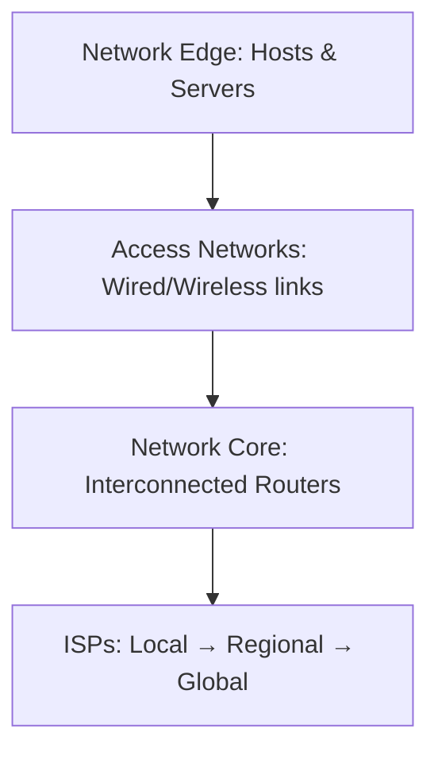
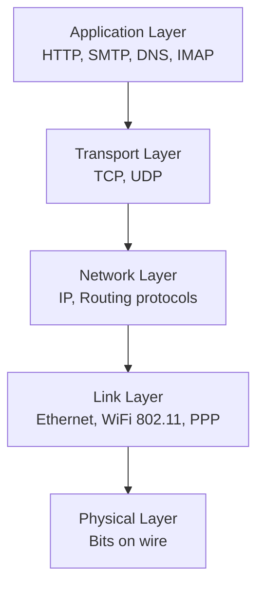
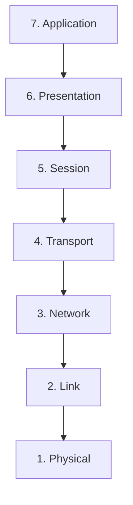
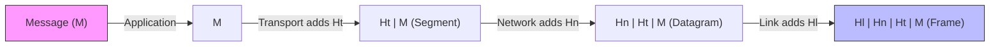
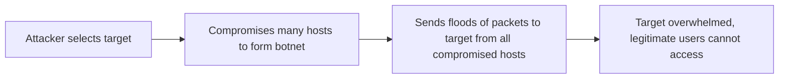
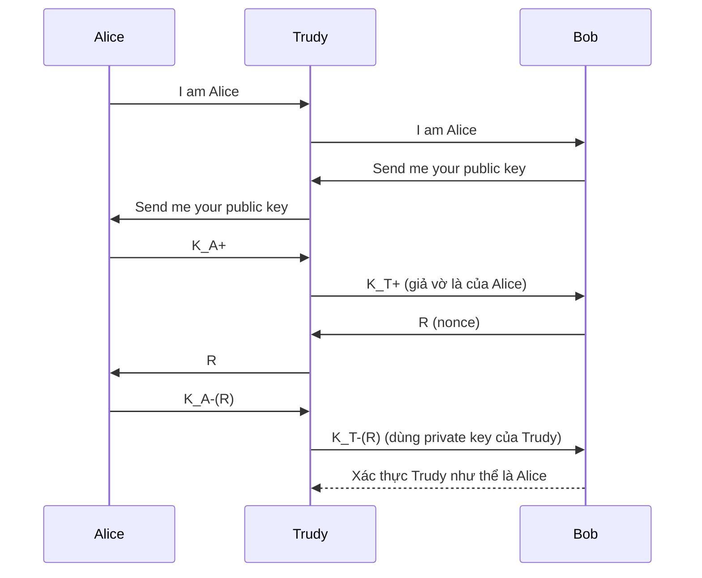

# Bài 5: Ôn tập Mạng Máy Tính – NT140 Network Security

## 1. Kiến trúc Internet

### 1.1 Góc nhìn "phần cứng/vật lý"

Internet là một **"mạng của các mạng"** (network of networks) – tập hợp hàng tỷ thiết bị tính toán kết nối với nhau thông qua các liên kết truyền thông và thiết bị chuyển mạch.

Các thành phần cốt lõi:

- **Hosts (end systems)**: Thiết bị đầu cuối – máy tính, điện thoại, máy chủ – nơi các ứng dụng mạng chạy trực tiếp.
- **Packet switches**: Thiết bị chuyển tiếp gói tin, gồm:
    - **Routers**: Hoạt động ở tầng mạng, định tuyến gói tin giữa các mạng.
    - **Switches**: Hoạt động ở tầng liên kết, chuyển tiếp trong một mạng LAN.
- **Communication links**: Các liên kết truyền thông vật lý – cáp quang, cáp đồng, sóng vô tuyến, vệ tinh – với tốc độ truyền gọi là **bandwidth (băng thông)**.
- **Networks**: Tập hợp thiết bị, routers và liên kết được quản lý bởi một tổ chức.

Các thành phần tổ chức theo cấu trúc phân lớp:

```
[Home network / Mobile network / Enterprise network]
        ↓
[Local / Regional ISP]
        ↓
[National / Global ISP]
        ↓
[Datacenter network / Content provider network]
```

### 1.2 Góc nhìn "dịch vụ"

Ngoài góc nhìn vật lý, Internet còn được nhìn nhận như một **hạ tầng cung cấp dịch vụ** cho các ứng dụng phân tán:

- Web, streaming video, email, game, e-commerce, mạng xã hội, thiết bị IoT...
- Cung cấp **giao diện lập trình (API)** cho phép ứng dụng "gắn vào" và sử dụng dịch vụ truyền tải của Internet – tương tự như dịch vụ bưu chính nhưng cho dữ liệu số.

### 1.3 Protocols & Chuẩn Internet

**Protocol** (giao thức) định nghĩa **format**, **thứ tự** của các thông điệp trao đổi giữa các thực thể mạng, cũng như **hành động** thực hiện khi nhận/gửi thông điệp.

Ví dụ: HTTP, TCP, IP, WiFi 802.11, Ethernet, 4G/5G...

Chuẩn hóa Internet được thực hiện qua:

- **RFC (Request for Comments)**: Tài liệu kỹ thuật định nghĩa các chuẩn.
- **IETF (Internet Engineering Task Force)**: Tổ chức quản lý việc phát triển chuẩn Internet.

---

## 2. Lịch sử Internet

=== "1980–1990"
    - 1982: Định nghĩa giao thức SMTP cho email.
    - 1983: Triển khai TCP/IP; DNS được định nghĩa để dịch tên miền sang địa chỉ IP.
    - 1985: Định nghĩa giao thức FTP.
    - 1988: TCP congestion control (kiểm soát tắc nghẽn).
    - Xuất hiện nhiều mạng quốc gia: CSnet, BITnet, NSFnet, Minitel.
    - Khoảng 100.000 hosts kết nối vào mạng.

=== "1990–2000"
    - Đầu 1990s: ARPAnet ngừng hoạt động; NSF bỏ hạn chế thương mại hóa NSFnet (1991).
    - Tim Berners-Lee phát triển HTML và HTTP → World Wide Web ra đời.
    - 1994: Trình duyệt Mosaic, sau đó là Netscape.
    - Cuối 1990s: Web thương mại hóa bùng nổ.
    - Xuất hiện instant messaging, P2P file sharing.
    - **Bảo mật mạng bắt đầu trở thành vấn đề trọng tâm.**
    - ~50 triệu host, 100 triệu+ người dùng; đường truyền backbone chạy ở tốc độ Gbps.

=== "2005–nay"
    - Triển khai rộng rãi băng thông rộng gia đình (10–100 Mbps).
    - 2008: Software-Defined Networking (SDN).
    - 4G/5G, WiFi phổ biến rộng rãi.
    - Google, Facebook, Microsoft xây dựng mạng riêng để kết nối trực tiếp đến người dùng.
    - Doanh nghiệp chuyển dịch vụ lên cloud (AWS, Azure...).
    - 2017: Thiết bị di động vượt thiết bị cố định; ~18 tỷ thiết bị kết nối Internet.

---

## 3. Cấu trúc chi tiết của Internet



- **Network Edge**: Hosts (clients & servers), máy chủ thường đặt trong data center.
- **Access Networks**: Các liên kết truyền thông có dây và không dây kết nối host vào lõi mạng.
- **Network Core**: Mạng lõi gồm các routers liên kết với nhau, thực hiện việc chuyển tiếp và định tuyến gói tin.

---

## 4. Hai chức năng cốt lõi của Network Core

### 4.1 Routing (Định tuyến)

**Routing** là quá trình **toàn cục** – xác định đường đi từ nguồn đến đích mà gói tin sẽ đi qua, dựa trên các **thuật toán định tuyến** (routing algorithms).

Kết quả của routing là tạo ra **bảng định tuyến (forwarding table)** tại mỗi router.

### 4.2 Forwarding (Chuyển tiếp)

**Forwarding** là hành động **cục bộ** tại mỗi router – dựa trên địa chỉ đích trong header của gói tin, tra bảng forwarding và chuyển gói tin từ cổng vào đến cổng ra thích hợp.

```
Ví dụ bảng forwarding:
+----------------+-------------+
| Header value   | Output link |
+----------------+-------------+
| 0100           | 3           |
| 0101           | 2           |
| 0111           | 2           |
| 1001           | 1           |
+----------------+-------------+
```

!!! note "Phân biệt Routing và Forwarding"
    - **Routing**: Quyết định "bản đồ đường đi" – chạy thuật toán, tính toán toàn mạng.
    - **Forwarding**: Thực hiện "lái xe theo bản đồ" – tra bảng cục bộ, chuyển gói tin tức thì.

---

## 5. Độ trễ và mất gói tin

### 5.1 Nguyên nhân

Gói tin đến router phải xếp hàng trong **buffer** chờ được truyền đi. Khi tốc độ đến tạm thời vượt quá khả năng truyền của link đầu ra, hàng đợi dài ra. Nếu bộ nhớ đệm đầy, gói tin bị **drop (mất)**.

### 5.2 Bốn nguồn gây trễ

$$d_{nodal} = d_{proc} + d_{queue} + d_{trans} + d_{prop}$$

| Thành phần | Ký hiệu | Mô tả |
|---|---|---|
| Nodal processing | $d_{proc}$ | Kiểm tra lỗi bit, xác định cổng ra. Thường < vài microsec. |
| Queueing delay | $d_{queue}$ | Thời gian chờ trong hàng đợi. Phụ thuộc vào mức độ tắc nghẽn. |
| Transmission delay | $d_{trans}$ | Thời gian đẩy toàn bộ gói lên đường truyền. $d_{trans} = L/R$ (L: độ dài gói bit, R: tốc độ link bps). |
| Propagation delay | $d_{prop}$ | Thời gian tín hiệu truyền qua vật lý. $d_{prop} = d/s$ (d: chiều dài link, s: tốc độ lan truyền ~$2 \times 10^8$ m/s). |

!!! warning "Phân biệt Transmission vs Propagation"
    - **Transmission delay**: Phụ thuộc kích thước gói và tốc độ link – thời gian để "đẩy" hết các bit lên dây.
    - **Propagation delay**: Phụ thuộc khoảng cách vật lý – thời gian bit "bay" từ đầu này đến đầu kia. Hai đại lượng này hoàn toàn độc lập nhau.

---

## 6. Protocol Stack – Mô hình phân lớp

### 6.1 Tại sao cần phân lớp?

Phân lớp giúp:

- **Xác định rõ cấu trúc** của hệ thống phức tạp và mối quan hệ giữa các thành phần.
- **Module hóa** – mỗi lớp có chức năng độc lập; thay đổi cài đặt một lớp không ảnh hưởng đến các lớp khác (miễn là interface giữ nguyên).

### 6.2 TCP/IP Protocol Stack (Internet Stack)



| Lớp | Chức năng | Ví dụ giao thức |
|---|---|---|
| Application | Hỗ trợ ứng dụng mạng | HTTP, SMTP, DNS, IMAP |
| Transport | Truyền dữ liệu giữa các process | TCP, UDP |
| Network | Định tuyến datagram từ nguồn đến đích | IP, OSPF, BGP |
| Link | Truyền dữ liệu giữa các node kề nhau | Ethernet, 802.11 WiFi, PPP |
| Physical | Truyền các bit thô trên đường truyền vật lý | Cáp đồng, cáp quang, sóng vô tuyến |

### 6.3 Mô hình OSI (ISO/OSI 7 lớp)

Mô hình OSI có **7 lớp**, nhiều hơn TCP/IP hai lớp:



!!! info "Hai lớp không có trong TCP/IP"
    - **Presentation layer**: Xử lý ngữ nghĩa dữ liệu – mã hóa, nén, chuyển đổi định dạng giữa các máy khác nhau.
    - **Session layer**: Đồng bộ hóa, checkpoint, phục hồi trao đổi dữ liệu.

    Trong Internet stack, hai chức năng này **không được tách thành lớp riêng** – nếu ứng dụng cần, phải tự cài đặt ở tầng Application.

---

## 7. Đóng gói (Encapsulation)

Khi dữ liệu đi từ tầng trên xuống tầng dưới tại máy gửi, mỗi lớp **thêm header** của mình vào:



| Tên đơn vị dữ liệu | Lớp tạo ra | Thành phần |
|---|---|---|
| Message | Application | M |
| Segment | Transport | Ht + M |
| Datagram | Network | Hn + Ht + M |
| Frame | Link | Hl + Hn + Ht + M |

Khi đi qua router (chỉ xử lý đến lớp Network) hoặc switch (chỉ đến lớp Link), header lớp tương ứng được đọc rồi header mới được gắn vào để tiếp tục chuyển tiếp.

---

## 8. Bảo mật Mạng (Network Security)

### 8.1 Bối cảnh

Internet ban đầu được thiết kế với tầm nhìn "một nhóm người dùng tin tưởng nhau kết nối vào mạng trong suốt" – không có nhiều cơ chế bảo mật. Về sau, các nhà thiết kế phải bổ sung bảo mật vào tất cả các lớp.

### 8.2 Các mục tiêu bảo mật mạng

| Mục tiêu | Định nghĩa |
|---|---|
| **Confidentiality (Bảo mật)** | Chỉ người gửi và người nhận hợp lệ mới đọc được nội dung thông điệp. Thực hiện qua mã hóa/giải mã. |
| **Authentication (Xác thực)** | Người gửi và nhận có thể xác minh danh tính của nhau. |
| **Message Integrity (Toàn vẹn thông điệp)** | Đảm bảo thông điệp không bị thay đổi trong quá trình truyền hoặc sau đó mà không bị phát hiện. |
| **Access & Availability (Truy cập & Sẵn sàng)** | Dịch vụ phải luôn sẵn sàng và có thể truy cập được bởi người dùng hợp lệ. |

### 8.3 Mô hình Alice, Bob và Trudy

Đây là cách đặt tên chuẩn trong bảo mật mạng:

- **Alice & Bob**: Hai bên muốn giao tiếp bảo mật.
- **Trudy (intruder)**: Kẻ tấn công có thể chặn, xóa hoặc chèn thêm thông điệp.

Ví dụ thực tế của Alice và Bob: trình duyệt/server trong giao dịch trực tuyến, client/server ngân hàng, DNS servers, BGP routers trao đổi bảng định tuyến.

### 8.4 Các kiểu tấn công

**1. Packet Sniffing (Nghe lén gói tin)**

Trên các môi trường broadcast (Ethernet chia sẻ, WiFi), card mạng ở chế độ **promiscuous** có thể đọc tất cả các gói tin đi qua, kể cả không gửi cho mình – bao gồm cả mật khẩu plaintext.

Công cụ: Wireshark, tcpdump, scapy.

**2. IP Spoofing (Giả mạo địa chỉ IP)**

Kẻ tấn công tạo và gửi gói tin với địa chỉ IP nguồn giả mạo (không phải địa chỉ thật của mình), giả danh người dùng hợp lệ.

**3. Denial of Service – DoS (Từ chối dịch vụ)**

Kẻ tấn công làm cho tài nguyên (server, băng thông) trở nên không khả dụng với người dùng hợp lệ bằng cách làm ngập lụt với lưu lượng giả.



### 8.5 Các lớp phòng thủ

- **Authentication**: Xác minh danh tính – ví dụ SIM card trong mạng di động.
- **Confidentiality**: Mã hóa dữ liệu.
- **Integrity checks**: Chữ ký số để phát hiện/ngăn chặn giả mạo.
- **Access restrictions**: VPN có mật khẩu bảo vệ.
- **Firewalls**: Thiết bị trung gian lọc gói tin đến/đi, mặc định chặn tất cả ngoại trừ những gì được cho phép; phát hiện và phản ứng với tấn công DoS.

---

## 9. Xác thực (Authentication) – Nghiên cứu trường hợp

### Protocol ap1.0

Alice chỉ gửi thông điệp "I am Alice".

**Vấn đề**: Trudy có thể gửi đúng thông điệp đó vì Bob không thể nhìn thấy Alice trực tiếp trên mạng.

### Protocol ap2.0

Alice gửi "I am Alice" kèm địa chỉ IP nguồn của mình.

**Vấn đề**: Trudy có thể **spoof** (giả mạo) địa chỉ IP của Alice.

### Protocol ap3.0

Alice gửi "I am Alice" kèm địa chỉ IP và **mật khẩu bí mật** (dạng plaintext).

**Vấn đề**: Trudy có thể **ghi lại** gói tin của Alice rồi **phát lại (playback attack)** sau đó.

### Protocol ap3.0 (sửa đổi)

Alice gửi mật khẩu đã **mã hóa**.

**Vấn đề**: Playback attack vẫn hoạt động – Trudy không cần biết nội dung, chỉ cần phát lại đúng gói tin đã mã hóa.

### Protocol ap4.0 – Dùng Nonce

Để chứng minh Alice đang **"sống" (live)** chứ không phải replay:

1. Alice gửi "I am Alice".
2. Bob gửi lại một **nonce R** (số dùng một lần duy nhất trong suốt vòng đời).
3. Alice trả về R đã mã hóa bằng **khóa bí mật chung** $K_{A-B}(R)$.

Bob biết: chỉ Alice mới biết khóa để mã hóa đúng nonce → Alice đang online.

**Hạn chế**: Yêu cầu cả hai bên phải có **khóa đối xứng chia sẻ trước** – khó phân phối khóa an toàn.

### Protocol ap5.0 – Dùng Public Key

Dùng nonce kết hợp với mã hóa khóa công khai:

1. Alice gửi "I am Alice".
2. Bob gửi nonce R.
3. Bob yêu cầu khóa công khai của Alice.
4. Alice gửi $K_A^-(R)$ (R mã hóa bằng **private key** của Alice).
5. Bob dùng $K_A^+$ để giải mã, xác nhận kết quả là R.

**Vấn đề nghiêm trọng – Man-in-the-Middle (MITM) Attack**:



Trudy đứng giữa, giả là Alice với Bob và giả là Bob với Alice. Bob nghĩ đang nói chuyện với Alice, nhưng thực ra đang nói với Trudy.

### Giải pháp: Certificate Authority (CA)

**CA (Certification Authority)** là bên thứ ba tin cậy, **ràng buộc khóa công khai với một thực thể cụ thể**:

1. Thực thể (người, website, router) đăng ký khóa công khai với CA, cung cấp bằng chứng danh tính.
2. CA tạo **certificate** (chứng chỉ) ràng buộc danh tính E với khóa công khai của E.
3. Certificate được **ký số bằng private key của CA**: `CA says "this is E's public key"`.

Khi Alice muốn khóa công khai của Bob:
- Lấy certificate của Bob.
- Dùng **public key của CA** để giải mã chữ ký → xác minh certificate hợp lệ → lấy được khóa công khai thật của Bob.

Nhờ đó, Trudy không thể giả mạo khóa công khai của Bob vì Trudy không có private key của CA để ký certificate giả.

---

## Câu hỏi và Trả lời

??? question "Failure scenario của ap1.0?"
    Bất kỳ ai cũng có thể gửi thông điệp "I am Alice" vì không có cơ chế xác minh nào. Trudy chỉ cần gõ đúng nội dung đó là Bob tin là Alice.

??? question "Failure scenario của ap2.0?"
    Trudy có thể thực hiện IP spoofing – tạo gói tin với địa chỉ IP nguồn là địa chỉ của Alice. Bob không có cách nào phân biệt gói tin thật hay giả mạo chỉ dựa vào IP nguồn.

??? question "Failure scenario của ap3.0 (cả plaintext lẫn mã hóa)?"
    Playback attack: Trudy ghi lại gói tin của Alice (dù có mã hóa hay không) rồi phát lại sau đó. Bob không phân biệt được đây là phiên mới hay phiên cũ bị replay.

??? question "ap4.0 giải quyết playback attack như thế nào?"
    Dùng nonce (số dùng một lần). Mỗi phiên xác thực, Bob gửi một số R khác nhau. Trudy không thể phát lại gói tin cũ vì R cũ đã hết hiệu lực; Trudy cũng không thể tạo ra $K_{A-B}(R_{mới})$ vì không biết khóa bí mật.

??? question "Lỗ hổng của ap5.0 là gì và khắc phục thế nào?"
    Lỗ hổng là MITM attack – Trudy có thể thay thế khóa công khai của Alice bằng khóa của mình. Khắc phục bằng **Public Key Infrastructure (PKI)** với **Certificate Authority (CA)**: CA ký chứng chỉ xác nhận khóa công khai thuộc về ai, ngăn chặn việc Trudy thay thế khóa.

---

## Câu hỏi Trắc nghiệm

**Câu 1.** Internet được mô tả chính xác nhất là gì?

- A. Một mạng duy nhất được quản lý bởi một tổ chức toàn cầu
- B. Một "mạng của các mạng" – tập hợp các ISP và mạng được kết nối với nhau
- C. Một mạng chỉ dùng cho mục đích quân sự
- D. Tập hợp các máy tính cùng chia sẻ một địa chỉ IP

??? info "Đáp án & Giải thích"
    **Đáp án: B**
    
    Internet là "network of networks" – bao gồm hàng nghìn ISP, mạng doanh nghiệp, mạng gia đình... được kết nối với nhau, không có một tổ chức đơn lẻ nào quản lý toàn bộ.

---

**Câu 2.** RFC là viết tắt của?

- A. Routing Frame Control
- B. Request for Comments
- C. Remote Function Call
- D. Reliable Frame Checksum

??? info "Đáp án & Giải thích"
    **Đáp án: B**
    
    RFC (Request for Comments) là các tài liệu kỹ thuật do IETF ban hành, định nghĩa các chuẩn và giao thức Internet.

---

**Câu 3.** Đâu là chức năng của IETF?

- A. Quản lý phân bổ địa chỉ IP toàn cầu
- B. Phát triển và duy trì các chuẩn Internet
- C. Cung cấp dịch vụ DNS toàn cầu
- D. Giám sát lưu lượng mạng Internet

??? info "Đáp án & Giải thích"
    **Đáp án: B**
    
    IETF (Internet Engineering Task Force) là tổ chức chịu trách nhiệm phát triển và duy trì các chuẩn kỹ thuật của Internet thông qua các RFC.

---

**Câu 4.** Trong kiến trúc Internet, **host** (end system) là gì?

- A. Chỉ các máy chủ web
- B. Chỉ các router lõi mạng
- C. Các thiết bị tính toán tại biên mạng – nơi ứng dụng chạy
- D. Các thiết bị chuyển mạch trong mạng lõi

??? info "Đáp án & Giải thích"
    **Đáp án: C**
    
    Host (end system) là tất cả thiết bị đầu cuối – laptop, điện thoại, máy chủ web – nằm ở biên mạng và là nơi các ứng dụng mạng chạy trực tiếp.

---

**Câu 5.** Sự khác biệt chính giữa **router** và **switch** là gì?

- A. Router hoạt động ở tầng Physical, switch ở tầng Network
- B. Router hoạt động ở tầng Network, switch ở tầng Link
- C. Cả hai hoạt động giống nhau
- D. Switch nhanh hơn router trong mọi trường hợp

??? info "Đáp án & Giải thích"
    **Đáp án: B**
    
    Router hoạt động ở tầng Network (Layer 3), đưa ra quyết định định tuyến giữa các mạng khác nhau. Switch hoạt động ở tầng Link (Layer 2), chuyển tiếp frame trong cùng một mạng LAN.

---

**Câu 6.** TCP/IP được triển khai rộng rãi vào năm nào?

- A. 1969
- B. 1983
- C. 1991
- D. 1995

??? info "Đáp án & Giải thích"
    **Đáp án: B**
    
    TCP/IP được triển khai chính thức vào năm 1983, thay thế NCP trên ARPANET.

---

**Câu 7.** World Wide Web (WWW) ra đời dựa trên hai công nghệ nào?

- A. FTP và DNS
- B. SMTP và POP3
- C. HTML và HTTP
- D. TCP và UDP

??? info "Đáp án & Giải thích"
    **Đáp án: C**
    
    Tim Berners-Lee phát triển HTML (ngôn ngữ đánh dấu siêu văn bản) và HTTP (giao thức truyền tải siêu văn bản) – nền tảng của World Wide Web.

---

**Câu 8.** **Forwarding** trong mạng máy tính là?

- A. Quá trình tính toán đường đi tốt nhất cho toàn mạng
- B. Hành động cục bộ tại router: chuyển gói tin từ cổng vào đến cổng ra dựa trên bảng forwarding
- C. Quá trình mã hóa gói tin trước khi truyền
- D. Quá trình phân mảnh gói tin lớn thành nhỏ hơn

??? info "Đáp án & Giải thích"
    **Đáp án: B**
    
    Forwarding (hay switching) là hành động **cục bộ** tại mỗi router: đọc địa chỉ đích trong header gói tin, tra bảng forwarding và chuyển gói tin đến đúng cổng ra.

---

**Câu 9.** **Routing** khác **Forwarding** ở điểm nào?

- A. Routing là hành động cục bộ, forwarding là toàn cục
- B. Routing xác định đường đi cho toàn mạng (toàn cục), forwarding thực thi việc chuyển tiếp cục bộ tại mỗi router
- C. Chúng là hai từ khác nhau nhưng có nghĩa giống nhau
- D. Forwarding chỉ áp dụng cho mạng không dây

??? info "Đáp án & Giải thích"
    **Đáp án: B**
    
    Routing là quá trình **toàn cục**, chạy các thuật toán định tuyến để xây dựng bảng forwarding. Forwarding là hành động **cục bộ**, dùng bảng đó để chuyển gói tin tại mỗi router.

---

**Câu 10.** Gói tin bị **mất (dropped/lost)** trong router xảy ra khi nào?

- A. Gói tin quá lớn
- B. Bộ nhớ đệm (buffer) của router đầy, không còn chỗ cho gói tin mới đến
- C. Tốc độ đường truyền quá cao
- D. Gói tin đến đúng lúc router đang xử lý

??? info "Đáp án & Giải thích"
    **Đáp án: B**
    
    Khi tốc độ đến vượt quá tốc độ truyền đi, hàng đợi trong buffer của router dài ra. Khi buffer đầy hoàn toàn, các gói tin mới đến sẽ bị drop (mất).

---

**Câu 11.** Công thức tính **transmission delay** là gì?

- A. $d_{trans} = d/s$
- B. $d_{trans} = L/R$
- C. $d_{trans} = R/L$
- D. $d_{trans} = L \times R$

??? info "Đáp án & Giải thích"
    **Đáp án: B**
    
    $d_{trans} = L/R$ trong đó L là độ dài gói tin (bits) và R là tốc độ đường truyền (bps). Đây là thời gian để đẩy toàn bộ gói tin lên đường truyền.

---

**Câu 12.** Một gói tin dài 1 MB được truyền qua link 100 Mbps. Transmission delay là bao nhiêu?

- A. 0.01 giây
- B. 0.08 giây
- C. 0.8 giây
- D. 8 giây

??? info "Đáp án & Giải thích"
    **Đáp án: B**
    
    $L = 1 \text{ MB} = 8 \times 10^6 \text{ bits}$; $R = 100 \times 10^6 \text{ bps}$
    
    $d_{trans} = L/R = 8 \times 10^6 / 100 \times 10^6 = 0.08$ giây.

---

**Câu 13.** **Propagation delay** phụ thuộc vào yếu tố nào?

- A. Kích thước gói tin và tốc độ đường truyền
- B. Độ dài vật lý của đường truyền và tốc độ lan truyền tín hiệu
- C. Mức độ tắc nghẽn của mạng
- D. Số lượng router trung gian

??? info "Đáp án & Giải thích"
    **Đáp án: B**
    
    $d_{prop} = d/s$ trong đó d là chiều dài vật lý của đường truyền và s là tốc độ lan truyền (~$2 \times 10^8$ m/s trong cáp quang). Propagation delay **không phụ thuộc** vào kích thước gói tin.

---

**Câu 14.** **Queueing delay** phụ thuộc vào điều gì?

- A. Khoảng cách vật lý giữa hai router
- B. Kích thước của gói tin
- C. Mức độ tắc nghẽn tại router – tốc độ đến so với tốc độ phục vụ
- D. Tốc độ xử lý của CPU trong router

??? info "Đáp án & Giải thích"
    **Đáp án: C**
    
    Queueing delay là thời gian gói tin phải chờ trong hàng đợi. Nó phụ thuộc vào mức độ tắc nghẽn: khi nhiều gói tin đến cùng lúc và vượt khả năng xử lý, hàng đợi dài ra và thời gian chờ tăng.

---

**Câu 15.** Tại sao Internet cần phân lớp giao thức?

- A. Để tăng tốc độ truyền dữ liệu
- B. Để cho phép mỗi lớp hoạt động độc lập, dễ bảo trì và nâng cấp
- C. Để giảm chi phí phần cứng
- D. Để mã hóa dữ liệu tự động

??? info "Đáp án & Giải thích"
    **Đáp án: B**
    
    Phân lớp cho phép module hóa hệ thống phức tạp: mỗi lớp có chức năng rõ ràng, thay đổi cài đặt một lớp không ảnh hưởng các lớp khác (miễn là interface giữ nguyên).

---

**Câu 16.** Trong mô hình TCP/IP, tầng nào chịu trách nhiệm **định tuyến gói tin từ nguồn đến đích**?

- A. Application
- B. Transport
- C. Network
- D. Link

??? info "Đáp án & Giải thích"
    **Đáp án: C**
    
    Tầng Network (Layer 3) chịu trách nhiệm định tuyến datagram từ máy nguồn đến máy đích, sử dụng giao thức IP và các giao thức định tuyến.

---

**Câu 17.** Giao thức nào sau đây thuộc tầng **Transport** trong mô hình TCP/IP?

- A. HTTP và SMTP
- B. TCP và UDP
- C. IP và OSPF
- D. Ethernet và WiFi

??? info "Đáp án & Giải thích"
    **Đáp án: B**
    
    TCP (Transmission Control Protocol) và UDP (User Datagram Protocol) là hai giao thức tầng Transport, chịu trách nhiệm truyền dữ liệu giữa các process trên hai host.

---

**Câu 18.** Tầng **Link** trong TCP/IP có chức năng gì?

- A. Định tuyến gói tin qua nhiều mạng
- B. Truyền dữ liệu giữa các node kề nhau trong cùng một mạng
- C. Cung cấp giao diện cho ứng dụng người dùng
- D. Đảm bảo truyền tin cậy đầu cuối

??? info "Đáp án & Giải thích"
    **Đáp án: B**
    
    Tầng Link (Layer 2) chịu trách nhiệm truyền frame giữa hai node kề nhau trên cùng một đoạn mạng, ví dụ: Ethernet truyền frame trong một LAN.

---

**Câu 19.** Mô hình OSI có bao nhiêu lớp?

- A. 4
- B. 5
- C. 6
- D. 7

??? info "Đáp án & Giải thích"
    **Đáp án: D**
    
    Mô hình OSI (Open Systems Interconnection) của ISO có 7 lớp: Physical, Data Link, Network, Transport, Session, Presentation, Application.

---

**Câu 20.** Lớp nào trong mô hình OSI **không có** trong mô hình TCP/IP Internet?

- A. Transport và Network
- B. Physical và Link
- C. Presentation và Session
- D. Application và Transport

??? info "Đáp án & Giải thích"
    **Đáp án: C**
    
    Mô hình TCP/IP Internet không có lớp **Presentation** (xử lý mã hóa, nén, định dạng dữ liệu) và lớp **Session** (đồng bộ hóa, checkpoint). Nếu ứng dụng cần, phải tự cài đặt ở tầng Application.

---

**Câu 21.** Lớp **Presentation** trong OSI có chức năng gì?

- A. Định tuyến gói tin
- B. Xử lý mã hóa, nén và chuyển đổi định dạng dữ liệu giữa các máy khác nhau
- C. Kiểm soát luồng dữ liệu
- D. Phân mảnh và ghép lại gói tin

??? info "Đáp án & Giải thích"
    **Đáp án: B**
    
    Tầng Presentation cho phép các ứng dụng diễn giải ngữ nghĩa của dữ liệu – xử lý mã hóa/giải mã, nén/giải nén và chuyển đổi định dạng giữa các máy có quy ước khác nhau.

---

**Câu 22.** Quá trình **đóng gói (encapsulation)** xảy ra như thế nào?

- A. Mỗi lớp loại bỏ header của lớp trên trước khi truyền
- B. Mỗi lớp thêm header của mình vào dữ liệu nhận từ lớp trên, tạo ra đơn vị dữ liệu mới
- C. Dữ liệu được mã hóa thêm ở mỗi lớp
- D. Tất cả các lớp chia sẻ chung một header

??? info "Đáp án & Giải thích"
    **Đáp án: B**
    
    Encapsulation là quá trình mỗi lớp thêm header (và đôi khi trailer) vào dữ liệu từ lớp trên, tạo ra đơn vị dữ liệu mới: Message → Segment → Datagram → Frame.

---

**Câu 23.** Đơn vị dữ liệu ở tầng **Transport** được gọi là gì?

- A. Frame
- B. Datagram
- C. Segment
- D. Packet

??? info "Đáp án & Giải thích"
    **Đáp án: C**
    
    Tầng Transport tạo ra **Segment** bằng cách thêm transport header (Ht) vào message từ tầng Application.

---

**Câu 24.** Đơn vị dữ liệu ở tầng **Network** được gọi là gì?

- A. Frame
- B. Datagram
- C. Segment
- D. Bit

??? info "Đáp án & Giải thích"
    **Đáp án: B**
    
    Tầng Network tạo ra **Datagram** bằng cách thêm network header (Hn) vào segment từ tầng Transport.

---

**Câu 25.** Đơn vị dữ liệu ở tầng **Link** được gọi là gì?

- A. Packet
- B. Segment
- C. Datagram
- D. Frame

??? info "Đáp án & Giải thích"
    **Đáp án: D**
    
    Tầng Link tạo ra **Frame** bằng cách thêm link header (Hl) vào datagram từ tầng Network.

---

**Câu 26.** Khi gói tin đi qua một **router** trong mạng, router xử lý đến tầng nào?

- A. Tầng Application
- B. Tầng Transport
- C. Tầng Network
- D. Tầng Physical

??? info "Đáp án & Giải thích"
    **Đáp án: C**
    
    Router xử lý đến tầng Network (Layer 3) để đọc địa chỉ IP đích và đưa ra quyết định định tuyến. Router không xử lý tầng Transport hay Application.

---

**Câu 27.** Khi gói tin đi qua một **switch** (Layer 2), switch xử lý đến tầng nào?

- A. Tầng Network
- B. Tầng Link
- C. Tầng Transport
- D. Tầng Application

??? info "Đáp án & Giải thích"
    **Đáp án: B**
    
    Switch Layer 2 xử lý đến tầng Link, đọc địa chỉ MAC đích để chuyển tiếp frame trong cùng một mạng LAN.

---

**Câu 28.** **Confidentiality (Bảo mật)** trong an ninh mạng đề cập đến điều gì?

- A. Đảm bảo dịch vụ luôn sẵn sàng
- B. Xác minh danh tính người gửi
- C. Chỉ người gửi và người nhận hợp lệ mới đọc được nội dung thông điệp
- D. Đảm bảo thông điệp không bị thay đổi trong truyền

??? info "Đáp án & Giải thích"
    **Đáp án: C**
    
    Confidentiality (bảo mật/bí mật) đảm bảo chỉ những bên được phép mới có thể đọc nội dung thông điệp, thực hiện qua mã hóa và giải mã.

---

**Câu 29.** **Message Integrity** trong an ninh mạng có nghĩa là gì?

- A. Đảm bảo thông điệp được gửi đúng giờ
- B. Đảm bảo nội dung thông điệp không bị thay đổi mà không bị phát hiện
- C. Đảm bảo người gửi được xác thực
- D. Đảm bảo thông điệp không bị đọc trộm

??? info "Đáp án & Giải thích"
    **Đáp án: B**
    
    Message Integrity (toàn vẹn thông điệp) đảm bảo rằng thông điệp không bị thay đổi (dù trong quá trình truyền hay sau đó) mà không bị phát hiện, thường thực hiện qua chữ ký số hoặc MAC.

---

**Câu 30.** Trong mô hình bảo mật, **Trudy** đại diện cho ai?

- A. Người dùng hợp lệ
- B. Kẻ tấn công (intruder) có thể chặn, xóa hoặc chèn thông điệp
- C. Quản trị viên mạng
- D. Máy chủ DNS

??? info "Đáp án & Giải thích"
    **Đáp án: B**
    
    Trong ký hiệu chuẩn của an ninh mạng, Trudy (viết tắt của "intruder") đại diện cho kẻ tấn công có thể thực hiện nhiều kiểu tấn công khác nhau trên kênh truyền giữa Alice và Bob.

---

**Câu 31.** **Packet Sniffing** hoạt động dựa trên nguyên lý nào?

- A. Tấn công vào router để lấy bảng định tuyến
- B. Card mạng ở chế độ promiscuous đọc tất cả gói tin đi qua, kể cả không gửi cho mình
- C. Chặn kết nối TCP và thay đổi nội dung
- D. Gửi nhiều gói tin giả để làm tắc nghẽn mạng

??? info "Đáp án & Giải thích"
    **Đáp án: B**
    
    Packet sniffing lợi dụng tính chất broadcast của một số môi trường truyền thông (Ethernet chia sẻ, WiFi): card mạng ở chế độ **promiscuous** sẽ nhận và xử lý tất cả các gói tin đi qua, không chỉ những gói gửi đến mình.

---

**Câu 32.** Công cụ nào sau đây được dùng để **packet sniffing**?

- A. nmap
- B. Wireshark
- C. iptables
- D. traceroute

??? info "Đáp án & Giải thích"
    **Đáp án: B**
    
    Wireshark là công cụ packet sniffer phổ biến và miễn phí. Các công cụ khác bao gồm tcpdump và scapy.

---

**Câu 33.** **IP Spoofing** là gì?

- A. Thay đổi địa chỉ MAC của thiết bị
- B. Gửi gói tin với địa chỉ IP nguồn giả mạo, không phải địa chỉ thật của kẻ tấn công
- C. Giả mạo DNS để chuyển hướng traffic
- D. Làm giả certificate SSL

??? info "Đáp án & Giải thích"
    **Đáp án: B**
    
    IP Spoofing là kỹ thuật kẻ tấn công đặt địa chỉ IP nguồn trong gói tin thành địa chỉ của nạn nhân hoặc địa chỉ giả mạo, để che giấu danh tính hoặc giả danh người dùng hợp lệ.

---

**Câu 34.** Tấn công **Denial of Service (DoS)** nhắm đến điều gì?

- A. Đánh cắp dữ liệu người dùng
- B. Làm cho tài nguyên (server, băng thông) không khả dụng với người dùng hợp lệ bằng cách áp đảo bằng traffic giả
- C. Giải mã dữ liệu mã hóa
- D. Chiếm quyền kiểm soát router

??? info "Đáp án & Giải thích"
    **Đáp án: B**
    
    DoS attack làm tắc nghẽn hoặc tiêu thụ hết tài nguyên của mục tiêu bằng cách gửi lượng lớn traffic giả, khiến người dùng hợp lệ không thể truy cập dịch vụ.

---

**Câu 35.** **Botnet** trong tấn công DoS là gì?

- A. Phần mềm antivirus
- B. Mạng các máy tính bị xâm nhập, bị điều khiển để cùng tấn công mục tiêu
- C. Một loại firewall
- D. Giao thức định tuyến đặc biệt

??? info "Đáp án & Giải thích"
    **Đáp án: B**
    
    Trong tấn công DDoS (Distributed DoS), kẻ tấn công trước tiên xâm nhập và kiểm soát nhiều máy tính trên Internet (tạo botnet), sau đó ra lệnh cho toàn bộ botnet cùng tấn công mục tiêu.

---

**Câu 36.** Vì sao **Firewall** thường hoạt động theo nguyên tắc "off-by-default"?

- A. Để tiết kiệm điện
- B. Để chặn tất cả gói tin mặc định và chỉ cho phép những gì được cấu hình rõ ràng – giảm bề mặt tấn công
- C. Để tăng tốc độ mạng
- D. Vì đây là yêu cầu của chuẩn RFC

??? info "Đáp án & Giải thích"
    **Đáp án: B**
    
    "Off-by-default" có nghĩa là mặc định tất cả đều bị chặn, chỉ những gì được cho phép rõ ràng mới được đi qua. Điều này giảm thiểu rủi ro bảo mật so với "cho phép tất cả, chặn những gì biết là xấu".

---

**Câu 37.** Lỗ hổng của Protocol ap1.0 (Alice chỉ gửi "I am Alice") là gì?

- A. Thông điệp bị mã hóa sai
- B. Bất kỳ ai cũng có thể gửi đúng thông điệp đó – không có cơ chế xác minh
- C. Thông điệp quá ngắn để xác thực
- D. Bob không thể giải mã thông điệp

??? info "Đáp án & Giải thích"
    **Đáp án: B**
    
    Vì Bob không nhìn thấy Alice trực tiếp trên mạng, Trudy có thể gửi đúng thông điệp "I am Alice" và Bob không thể phân biệt ai là người gửi thật.

---

**Câu 38.** Tại sao ap2.0 (thêm địa chỉ IP) vẫn thất bại?

- A. IP address bị mã hóa
- B. Trudy có thể thực hiện IP spoofing – giả mạo địa chỉ IP của Alice
- C. Bob không đọc được địa chỉ IP
- D. Địa chỉ IP thay đổi mỗi lần gửi

??? info "Đáp án & Giải thích"
    **Đáp án: B**
    
    IP không có cơ chế xác thực nguồn gốc – kẻ tấn công có thể tự do đặt bất kỳ địa chỉ IP nguồn nào trong gói tin gửi đi.

---

**Câu 39.** **Playback attack** là gì?

- A. Kẻ tấn công giải mã thông điệp của Alice
- B. Kẻ tấn công ghi lại gói tin hợp lệ và phát lại sau đó để tái xác thực
- C. Kẻ tấn công thay đổi nội dung gói tin
- D. Kẻ tấn công chặn đứng kết nối giữa Alice và Bob

??? info "Đáp án & Giải thích"
    **Đáp án: B**
    
    Trong playback attack, Trudy không cần biết nội dung thông điệp. Cô ta chỉ cần ghi lại gói tin xác thực hợp lệ của Alice, sau đó phát lại đúng gói tin đó để giả danh Alice với Bob – dù gói tin đã được mã hóa.

---

**Câu 40.** **Nonce** trong giao thức xác thực là gì và tại sao nó giải quyết được playback attack?

- A. Một loại mã hóa đặc biệt; giải quyết vì mã hóa mạnh hơn
- B. Số dùng một lần (number used once); giải quyết vì Trudy không thể phát lại gói tin cũ – nonce cũ đã hết hiệu lực
- C. Địa chỉ IP tạm thời; giải quyết vì địa chỉ thay đổi mỗi phiên
- D. Timestamp; giải quyết vì thời gian luôn tăng

??? info "Đáp án & Giải thích"
    **Đáp án: B**
    
    Nonce là số ngẫu nhiên dùng **một lần duy nhất**. Mỗi phiên Bob gửi một nonce R khác nhau. Trudy không thể phát lại gói tin cũ vì chứa response cho R cũ – Bob sẽ từ chối vì đang dùng R mới. Trudy cũng không thể tạo response mới vì không biết khóa bí mật.

---

**Câu 41.** Protocol ap4.0 yêu cầu gì mà ap5.0 cố khắc phục?

- A. ap4.0 yêu cầu kết nối không dây; ap5.0 dùng có dây
- B. ap4.0 yêu cầu **khóa đối xứng chia sẻ trước** – khó phân phối an toàn; ap5.0 dùng mã hóa khóa công khai thay thế
- C. ap4.0 quá chậm; ap5.0 nhanh hơn
- D. ap4.0 chỉ dùng được một lần; ap5.0 dùng nhiều lần

??? info "Đáp án & Giải thích"
    **Đáp án: B**
    
    ap4.0 yêu cầu Alice và Bob phải đã có sẵn **shared symmetric key** $K_{A-B}$ – vấn đề là làm sao hai bên trao đổi khóa này an toàn ban đầu. ap5.0 dùng **public key cryptography** để tránh vấn đề phân phối khóa.

---

**Câu 42.** Trong ap5.0, Alice chứng minh danh tính bằng cách nào?

- A. Gửi mật khẩu mã hóa
- B. Mã hóa nonce R bằng **private key** của mình; Bob giải mã bằng public key của Alice để xác minh
- C. Gửi địa chỉ IP và chứng chỉ số
- D. Sử dụng khóa đối xứng chia sẻ

??? info "Đáp án & Giải thích"
    **Đáp án: B**
    
    Alice dùng **private key** $K_A^-$ của mình để mã hóa nonce R thành $K_A^-(R)$. Bob dùng **public key** $K_A^+$ của Alice để giải mã: nếu kết quả là R, chứng tỏ chỉ Alice (người duy nhất có $K_A^-$) mới có thể tạo ra thông điệp đó.

---

**Câu 43.** **Man-in-the-Middle (MITM) attack** trong ap5.0 hoạt động như thế nào?

- A. Trudy chặn gói tin và giải mã nội dung
- B. Trudy đứng giữa, giả là Alice với Bob và giả là Bob với Alice, thay thế khóa công khai thật bằng khóa của mình
- C. Trudy làm giả địa chỉ IP của cả Alice và Bob
- D. Trudy tấn công DoS để ngắt kết nối của Alice

??? info "Đáp án & Giải thích"
    **Đáp án: B**
    
    Trudy chèn mình vào giữa: khi Bob yêu cầu khóa công khai của Alice, Trudy thay thế bằng khóa của mình $K_T^+$. Bob nghĩ đang xác thực Alice nhưng thực ra đang xác thực Trudy. Mọi thông tin sau đó đều đi qua Trudy.

---

**Câu 44.** **Certificate Authority (CA)** giải quyết vấn đề MITM như thế nào?

- A. CA mã hóa tất cả traffic trên Internet
- B. CA là bên thứ ba tin cậy, ký chứng chỉ ràng buộc khóa công khai với danh tính thật – ngăn Trudy giả mạo khóa công khai
- C. CA cung cấp khóa đối xứng cho mỗi phiên kết nối
- D. CA theo dõi tất cả giao tiếp trên mạng

??? info "Đáp án & Giải thích"
    **Đáp án: B**
    
    CA ký chứng chỉ bằng private key của mình, xác nhận "đây là khóa công khai của Bob". Trudy không thể tạo chứng chỉ giả vì không có private key của CA. Khi Alice nhận được chứng chỉ, cô ta dùng public key của CA (đã biết trước) để xác minh chữ ký → chắc chắn đây là khóa thật của Bob.

---

**Câu 45.** Để xác minh chứng chỉ của Bob, Alice cần gì?

- A. Private key của CA
- B. Public key của CA
- C. Private key của Bob
- D. Khóa đối xứng chia sẻ với Bob

??? info "Đáp án & Giải thích"
    **Đáp án: B**
    
    Alice dùng **public key của CA** ($K_{CA}^+$) để giải mã chữ ký số trên chứng chỉ của Bob. Nếu giải mã thành công và thông tin khớp, chứng chỉ là hợp lệ và Alice có được khóa công khai thật của Bob.

---

**Câu 46.** Điều gì xảy ra nếu Internet ban đầu được thiết kế với bảo mật là ưu tiên hàng đầu?

- A. Internet sẽ không thể kết nối được
- B. Nhiều giao thức bảo mật như TLS, IPSec sẽ được tích hợp sẵn thay vì thêm vào sau
- C. Internet sẽ chậm hơn nhiều
- D. Không có gì thay đổi vì bảo mật luôn được tích hợp

??? info "Đáp án & Giải thích"
    **Đáp án: B**
    
    Internet ban đầu thiết kế cho "nhóm người dùng tin tưởng nhau" – bảo mật không phải ưu tiên. Nhiều lỗ hổng hiện tại (IP spoofing, eavesdropping...) có thể đã được giải quyết từ đầu nếu bảo mật được tích hợp vào thiết kế gốc.

---

**Câu 47.** Giao thức **DNS** được định nghĩa vào năm nào và dùng để làm gì?

- A. 1982, để gửi email
- B. 1983, để dịch tên miền sang địa chỉ IP
- C. 1985, để truyền file
- D. 1988, để kiểm soát tắc nghẽn

??? info "Đáp án & Giải thích"
    **Đáp án: B**
    
    DNS (Domain Name System) được định nghĩa năm 1983, cung cấp dịch vụ phân giải tên miền (như google.com) thành địa chỉ IP để máy tính có thể kết nối.

---

**Câu 48.** Trong ap5.0, tại sao chỉ biết **public key** của Alice là chưa đủ để Trudy giả mạo?

- A. Vì public key bị mã hóa
- B. Vì để tạo $K_A^-(R)$ (response hợp lệ cho nonce), cần **private key** của Alice mà Trudy không có
- C. Vì Bob không biết public key của Alice
- D. Vì nonce R quá phức tạp để mã hóa

??? info "Đáp án & Giải thích"
    **Đáp án: B**
    
    Trong mã hóa khóa công khai, **bất kỳ ai** đều có thể có public key, nhưng chỉ **chủ sở hữu** mới có private key tương ứng. Để tạo ra $K_A^-(R)$ cần private key $K_A^-$ của Alice – Trudy không có nên không thể giả mạo (trừ khi thực hiện MITM attack bằng cách thay thế public key).

---

**Câu 49.** Sự kiện nào đánh dấu sự bùng nổ của **thương mại hóa Internet**?

- A. Triển khai TCP/IP năm 1983
- B. NSF bỏ hạn chế thương mại hóa NSFnet năm 1991 và sự phổ biến của Web qua Netscape
- C. Ra đời của email năm 1982
- D. Ra đời của WiFi năm 2000

??? info "Đáp án & Giải thích"
    **Đáp án: B**
    
    Năm 1991 NSF bỏ hạn chế thương mại trên NSFnet, kết hợp với sự ra đời của trình duyệt Mosaic (1994) và Netscape đã thúc đẩy mạnh mẽ việc thương mại hóa Internet và Web trong cuối thập niên 1990.

---

**Câu 50.** Theo bài giảng, **Software-Defined Networking (SDN)** bắt đầu xuất hiện từ năm nào?

- A. 2000
- B. 2004
- C. 2008
- D. 2012

??? info "Đáp án & Giải thích"
    **Đáp án: C**
    
    SDN (Software-Defined Networking) bắt đầu được triển khai từ năm 2008, tách biệt control plane (quyết định định tuyến) khỏi data plane (chuyển tiếp gói tin), cho phép lập trình và quản lý mạng linh hoạt hơn.

---

**Câu 51.** **Nodal processing delay** ($d_{proc}$) thường có giá trị trong khoảng nào?

- A. Vài milliseconds
- B. Vài microseconds
- C. Vài seconds
- D. Vài nanoseconds

??? info "Đáp án & Giải thích"
    **Đáp án: B**
    
    Nodal processing delay – bao gồm kiểm tra lỗi bit và xác định cổng ra – thường nhỏ hơn vài microseconds ở các router hiện đại.

---

**Câu 52.** Trong bối cảnh bảo mật, **"hijacking"** là kiểu tấn công gì?

- A. Đọc lén nội dung thông điệp
- B. Chiếm quyền kiểm soát kết nối đang diễn ra bằng cách loại bỏ một bên và thay thế vào vị trí đó
- C. Gửi thông điệp giả với địa chỉ nguồn giả
- D. Làm ngập lụt server với traffic

??? info "Đáp án & Giải thích"
    **Đáp án: B**
    
    Session hijacking là kiểu tấn công kẻ xấu "chiếm" một kết nối TCP đang active giữa hai bên – loại bỏ một trong hai bên và thay thế vào vị trí đó để kiểm soát phiên làm việc.

---

**Câu 53.** Trong kiến trúc Internet, **"access network"** là gì?

- A. Mạng lõi kết nối các ISP với nhau
- B. Mạng kết nối end system (host) vào mạng lõi – ví dụ DSL, cáp, WiFi gia đình
- C. Mạng riêng của các nhà cung cấp nội dung
- D. Mạng kết nối giữa các data center

??? info "Đáp án & Giải thích"
    **Đáp án: B**
    
    Access network là "đoạn cuối" kết nối hosts (gia đình, doanh nghiệp, trường học) vào mạng lõi Internet, bao gồm DSL, cáp đồng trục, WiFi, 4G/5G...

---

**Câu 54.** Tại sao năm 2017 được coi là cột mốc quan trọng trong lịch sử Internet?

- A. Ra đời của 5G
- B. Lần đầu tiên thiết bị di động vượt qua thiết bị cố định về số lượng kết nối Internet
- C. Internet đạt 1 tỷ trang web
- D. Triển khai IPv6 toàn cầu

??? info "Đáp án & Giải thích"
    **Đáp án: B**
    
    Năm 2017 đánh dấu cột mốc khi số lượng thiết bị di động kết nối Internet vượt qua thiết bị cố định, phản ánh sự dịch chuyển sang di động của người dùng toàn cầu. Cũng trong năm đó, khoảng 18 tỷ thiết bị được kết nối.
