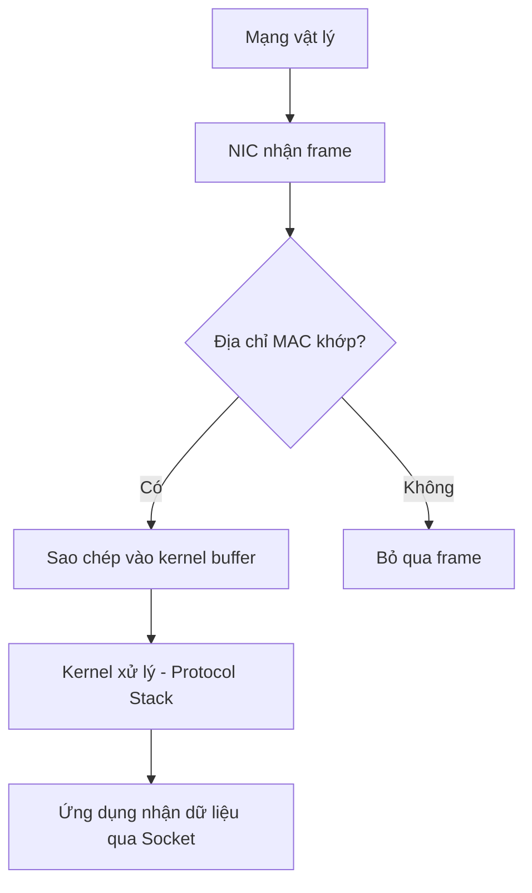
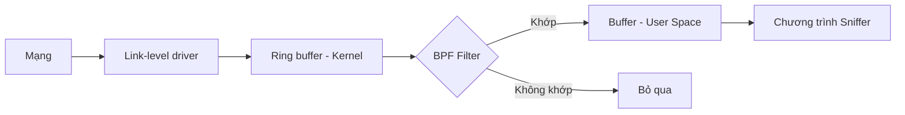
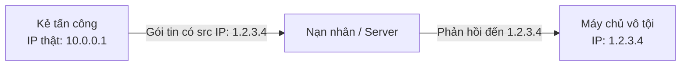
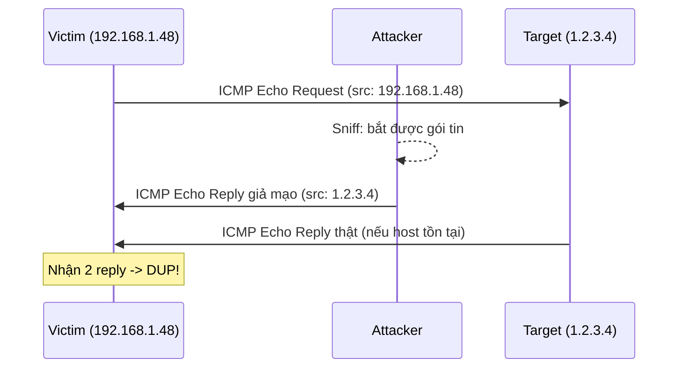
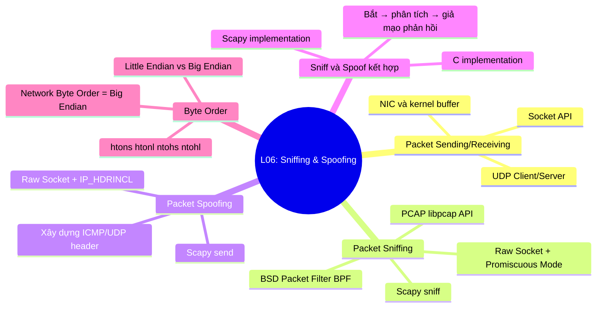

# Bài 6: Packet Sniffing and Spoofing

## 1. Gửi và Nhận Gói Tin (Packet Sending and Receiving)

### 1.1 Socket là gì?

Socket là một cơ chế giao tiếp giữa các tiến trình (process) qua mạng. Có thể hình dung socket như một "cánh cửa" — tiến trình gửi đẩy dữ liệu ra ngoài qua cánh cửa đó, và hạ tầng mạng phía dưới chịu trách nhiệm chuyển dữ liệu đến socket của tiến trình nhận ở đầu kia.

Mỗi kết nối mạng liên quan đến **hai socket**: một ở phía gửi, một ở phía nhận.

Trong mô hình phân tầng:

- **Tầng ứng dụng** (Application layer): do lập trình viên kiểm soát, dùng socket API.
- **Tầng vận chuyển trở xuống** (Transport, Network, Link, Physical): do hệ điều hành (OS) kiểm soát.

---

### 1.2 Gửi Gói Tin Bằng Socket

=== "Python (UDP Client)"

    ```python
    #!/usr/bin/python3
    import socket

    IP = "127.0.0.1"
    PORT = 8080
    data = b'Hello, World!'

    sock = socket.socket(socket.AF_INET, socket.SOCK_DGRAM)
    sock.sendto(data, (IP, PORT))
    ```

=== "C (UDP Client)"

    ```c
    #include <unistd.h>
    #include <stdio.h>
    #include <string.h>
    #include <sys/socket.h>
    #include <netinet/ip.h>
    #include <arpa/inet.h>

    int main() {
        struct sockaddr_in dest_info;
        const char* data = "Hello World!\n";

        // Bước 1: Tạo socket UDP
        int sock = socket(AF_INET, SOCK_DGRAM, IPPROTO_UDP);

        // Bước 2: Điền thông tin đích
        memset((char*)&dest_info, 0, sizeof(dest_info));
        dest_info.sin_family = AF_INET;
        dest_info.sin_addr.s_addr = inet_addr("127.0.0.1");
        dest_info.sin_port = htons(8080);

        // Bước 3: Gửi gói tin
        sendto(sock, data, strlen(data), 0,
               (struct sockaddr*)&dest_info, sizeof(dest_info));

        close(sock);
    }
    ```

!!! note "Python vs C"
    Python được xây dựng trên nền C/C++. Socket API của Python thực chất là wrapper của socket API trong C, giúp lập trình đơn giản hơn nhưng cùng bản chất.

---

### 1.3 Cách Gói Tin Được Nhận (How Packets Are Received)

**NIC (Network Interface Card)** là thành phần vật lý hoặc logic kết nối máy tính với mạng. Mỗi NIC có một địa chỉ MAC duy nhất.

Quá trình nhận gói tin:

1. Mọi NIC trên mạng đều "nghe" tất cả các frame truyền trên dây.
2. NIC kiểm tra địa chỉ đích của mỗi gói tin.
3. Nếu địa chỉ đích **khớp với MAC của NIC**, gói tin được sao chép vào một vùng đệm (buffer) trong kernel.
4. Kernel chuyển dữ liệu lên tầng trên (tầng vận chuyển, rồi tầng ứng dụng).



---

### 1.4 Nhận Gói Tin Bằng Socket

Phía server cần **bind** vào một cổng (port) cụ thể để lắng nghe. Client thì không bắt buộc phải bind port (OS sẽ tự gán port ngẫu nhiên).

!!! question "Câu hỏi: Có cần bind port cụ thể không?"
    - **Server**: **Bắt buộc** phải bind port để client biết cổng nào để gửi đến.
    - **Client**: **Không bắt buộc**. OS tự động gán một port tạm thời (ephemeral port) khi gửi.

=== "Python (UDP Server)"

    ```python
    import socket

    IP = "0.0.0.0"
    PORT = 9090

    sock = socket.socket(socket.AF_INET, socket.SOCK_DGRAM)
    sock.bind((IP, PORT))

    while True:
        data, (ip, port) = sock.recvfrom(1024)
        print("Sender: {} and Port: {}".format(ip, port))
        print("Received message: {}".format(data))
    ```

=== "C (UDP Server)"

    ```c
    // Bước 1: Tạo socket
    int sock = socket(AF_INET, SOCK_DGRAM, IPPROTO_UDP);

    // Bước 2: Điền thông tin server
    memset((char*)&server, 0, sizeof(server));
    server.sin_family = AF_INET;
    server.sin_addr.s_addr = htonl(INADDR_ANY);
    server.sin_port = htons(9090);

    // Bind socket
    if (bind(sock, (struct sockaddr*)&server, sizeof(server)) < 0)
        error("ERROR on binding");

    // Bước 3: Nhận gói tin
    while (1) {
        bzero(buf, 1500);
        recvfrom(sock, buf, 1500-1, 0,
                 (struct sockaddr*)&client, &clientlen);
        printf("%s\n", buf);
    }
    ```

---

## 2. Packet Sniffing — Bắt Gói Tin

### 2.1 Sniffing là gì?

**Packet sniffing** là quá trình bắt (capture) các gói tin đang lưu thông trên mạng trong thời gian thực. Đây là kỹ thuật quan trọng trong:

- Phân tích lưu lượng mạng (network analysis)
- Gỡ lỗi (debugging)
- Giám sát bảo mật
- Tấn công nghe lén (eavesdropping)

---

### 2.2 Bắt Gói Tin Bằng Raw Socket

Với socket thông thường, kernel chỉ chuyển lên tầng ứng dụng dữ liệu phù hợp với port/protocol của socket đó. Để bắt **tất cả** các gói tin đi qua NIC, ta cần dùng **Raw Socket** với chế độ **Promiscuous Mode**.

```c
// Tạo raw socket bắt tất cả loại gói tin
int sock = socket(AF_PACKET, SOCK_RAW, htons(ETH_P_ALL));

// Bật Promiscuous Mode
struct packet_mreq mr;
mr.mr_type = PACKET_MR_PROMISC;
setsockopt(sock, SOL_PACKET, PACKET_ADD_MEMBERSHIP, &mr, sizeof(mr));

// Vòng lặp bắt gói tin
while (1) {
    int data_size = recvfrom(sock, buffer, PACKET_LEN, 0,
                             &saddr, (socklen_t*)sizeof(saddr));
    if (data_size) printf("Got one packet\n");
}
```

---

### 2.3 Promiscuous Mode

Theo mặc định, NIC chỉ nhận các frame có địa chỉ đích là MAC của chính nó (hoặc broadcast). Các frame khác bị bỏ qua ngay tại phần cứng.

**Promiscuous Mode** (Chế độ lăng nhăng):

- NIC chuyển **tất cả** frame nhận được lên kernel, bất kể địa chỉ đích là gì.
- Nếu có chương trình sniffer đã đăng ký với kernel, nó sẽ nhận được tất cả các gói tin đó.
- Trong môi trường Wi-Fi, chế độ tương đương được gọi là **Monitor Mode**.

!!! warning "Lưu ý bảo mật"
    Promiscuous Mode cho phép một máy trong mạng "nghe lén" toàn bộ lưu lượng mạng không mã hóa. Đây là lý do tại sao các giao thức nhạy cảm (HTTP, Telnet, FTP...) cần được thay thế bởi các phiên bản mã hóa (HTTPS, SSH, SFTP...).

---

### 2.4 BSD Packet Filter (BPF)

Nếu không lọc gói tin, kernel sẽ chuyển toàn bộ lưu lượng lên chương trình sniffer — rất tốn tài nguyên. **BPF (Berkeley Packet Filter)** giải quyết vấn đề này.

**BPF** cho phép người dùng gắn một bộ lọc vào socket. Kernel sẽ dùng bộ lọc này để loại bỏ các gói tin không cần thiết **trước khi** sao chép chúng lên user space.



Gắn BPF filter vào socket:

```c
setsockopt(sock, SOL_SOCKET, SO_ATTACH_FILTER, &bpf, sizeof(bpf));
```

---

### 2.5 Hạn Chế Của Raw Socket + BPF Thủ Công

- **Không portable**: code phụ thuộc vào từng hệ điều hành.
- **Khó viết filter**: BPF pseudo-code rất phức tạp.
- **Hiệu năng chưa tối ưu**.

Giải pháp: **Thư viện PCAP (libpcap)**.

---

### 2.6 PCAP — Packet Capture API

**libpcap** là thư viện chuẩn cho packet sniffing, được tạo ra từ dự án `tcpdump`.

**Đặc điểm:**

- Hỗ trợ đa nền tảng: Linux (libpcap), Windows (Winpcap, Npcap).
- Viết bằng C, có wrapper cho nhiều ngôn ngữ khác.
- Là nền tảng của nhiều công cụ nổi tiếng: **Wireshark, tcpdump, Scapy, Nmap, Snort**.
- Cho phép viết filter bằng biểu thức Boolean dễ đọc (BPF expression).

=== "Cài đặt"

    ```bash
    apt install libpcap-dev
    gcc sniffer.c -o sniffer -lpcap
    sudo ./sniffer
    ```

=== "Code C với PCAP"

    ```c
    #include <pcap.h>
    #include <stdio.h>

    void got_packet(u_char *args, const struct pcap_pkthdr *header,
                    const u_char *packet) {
        printf("Got packet\n");
    }

    int main() {
        pcap_t *handle;
        char errbuf[PCAP_ERRBUF_SIZE];
        struct bpf_program fp;
        char filter_exp[] = "ip proto icmp";
        bpf_u_int32 net;

        // Bước 1: Mở phiên sniffing trực tiếp trên NIC
        handle = pcap_open_live("eth0", BUFSIZ, 1, 1000, errbuf);

        // Bước 2: Biên dịch filter sang BPF pseudo-code
        pcap_compile(handle, &fp, filter_exp, 0, net);
        pcap_setfilter(handle, &fp);

        // Bước 3: Vòng lặp bắt gói tin, gọi callback cho mỗi gói
        pcap_loop(handle, -1, got_packet, NULL);

        pcap_close(handle);
        return 0;
    }
    ```

---

### 2.7 Phân Tích Gói Tin Đã Bắt (Processing Captured Packet)

Sau khi bắt được gói tin, ta cần phân tích cấu trúc từng header theo thứ tự: **Ethernet → IP → TCP/UDP/ICMP**.

**Bước 1: Phân tích Ethernet Header**

```c
void got_packet(u_char *args, const struct pcap_pkthdr *header,
                const u_char *packet) {
    struct ethheader *eth = (struct ethheader *)packet;

    if (ntohs(eth->ether_type) == 0x0800) {
        // Là gói tin IP
    }
}
```

**Bước 2: Phân tích IP Header**

```c
struct ipheader *ip = (struct ipheader*)(packet + sizeof(struct ethheader));

printf("From: %s\n", inet_ntoa(ip->iph_sourceip));
printf("To:   %s\n", inet_ntoa(ip->iph_destip));

switch(ip->iph_protocol) {
    case IPPROTO_TCP: printf("Protocol: TCP\n"); break;
    case IPPROTO_UDP: printf("Protocol: UDP\n"); break;
    case IPPROTO_ICMP: printf("Protocol: ICMP\n"); break;
}
```

**Bước 3: Phân tích ICMP Header (ví dụ)**

```c
int ip_header_len = ip->iph_ihl * 4;
struct icmpheader *icmp = (struct icmpheader*)(
    packet + sizeof(struct ethheader) + ip_header_len
);
```

!!! info "Tại sao nhân với 4?"
    Trường `ihl` (IP Header Length) trong IP header đo bằng đơn vị **32-bit word** (4 byte). Vì vậy độ dài thực tế (byte) = `ihl * 4`. Giá trị thông thường là 5, tương ứng 20 byte (IP header tối thiểu).

---

### 2.8 Sniffing Bằng Scapy

**Scapy** là công cụ Python mạnh mẽ cho phép thao tác gói tin một cách trực quan.

Cài đặt:

```bash
sudo pip3 install scapy
```

**Ví dụ sniff ICMP:**

```python
#!/usr/bin/python3
from scapy.all import *

def print_pkt(pkt):
    print("Source IP:      ", pkt[IP].src)
    print("Destination IP: ", pkt[IP].dst)
    print("Protocol:       ", pkt[IP].proto)
    print()

pkt = sniff(filter='icmp', prn=print_pkt)
```

**Ví dụ sniff phức tạp hơn với hexdump:**

```python
#!/usr/bin/python3
from scapy.all import *

def process_packet(pkt):
    hexdump(pkt)
    pkt.show()
    print()

sniff(iface="eno1",
      filter="udp and dst portrange 50-55 or icmp",
      prn=process_packet)
```

**Xem các thuộc tính của một protocol class:**

```python
>>> ls(IP)       # Xem các trường của IP header
>>> help(IP)     # Xem tài liệu đầy đủ
```

---

## 3. Packet Spoofing — Giả Mạo Gói Tin

### 3.1 Spoofing là gì?

**Packet spoofing** là hành động giả mạo thông tin trong gói tin — thường là địa chỉ IP nguồn. Khi thông tin quan trọng trong gói tin bị làm giả, ta gọi đó là spoofing.

Nhiều cuộc tấn công mạng dựa trên packet spoofing:

- DDoS (giả mạo IP nguồn để khuếch đại)
- MITM (Man-in-the-Middle)
- DNS Poisoning
- TCP Session Hijacking



---

### 3.2 Gửi Gói Tin Bình Thường (Không Spoofing)

Khi dùng socket thông thường (`SOCK_DGRAM`), OS tự động điền địa chỉ IP nguồn theo địa chỉ thực của máy. Không thể tự ý thay đổi.

---

### 3.3 Spoofing Bằng Raw Socket (C)

Để tự điền header, cần dùng **Raw Socket** với tùy chọn `IP_HDRINCL` (Include IP Header — tự xây dựng IP header).

**Hàm gửi gói tin raw:**

```c
void send_raw_ip_packet(struct ipheader* ip) {
    struct sockaddr_in dest_info;
    int enable = 1;

    // Bước 1: Tạo raw socket
    int sock = socket(AF_INET, SOCK_RAW, IPPROTO_RAW);

    // Bước 2: Cho phép tự cung cấp IP header
    setsockopt(sock, IPPROTO_IP, IP_HDRINCL, &enable, sizeof(enable));

    // Bước 3: Điền thông tin đích (lấy từ IP header)
    dest_info.sin_family = AF_INET;
    dest_info.sin_addr = ip->iph_destip;

    // Bước 4: Gửi gói tin
    sendto(sock, ip, ntohs(ip->iph_len), 0,
           (struct sockaddr*)&dest_info, sizeof(dest_info));

    close(sock);
}
```

---

### 3.4 Xây Dựng Gói Tin ICMP Giả Mạo (C)

**Bước 1: Điền ICMP header**

```c
char buffer[1500];
memset(buffer, 0, 1500);

struct icmpheader *icmp = (struct icmpheader*)
    (buffer + sizeof(struct ipheader));

icmp->icmp_type = 8;  // 8 = ICMP Echo Request, 0 = Echo Reply

// Tính checksum
icmp->icmp_chksum = 0;
icmp->icmp_chksum = in_cksum((unsigned short*)icmp,
                              sizeof(struct icmpheader));
```

**Bước 2: Điền IP header**

```c
struct ipheader *ip = (struct ipheader*)buffer;

ip->iph_ver = 4;
ip->iph_ihl = 5;
ip->iph_ttl = 20;
ip->iph_sourceip.s_addr = inet_addr("1.2.3.4");   // IP nguồn giả mạo
ip->iph_destip.s_addr = inet_addr("10.0.2.5");    // IP đích thật
ip->iph_protocol = IPPROTO_ICMP;
ip->iph_len = htons(sizeof(struct ipheader) + sizeof(struct icmpheader));
```

**Bước 3: Gửi gói tin**

```c
send_raw_ip_packet(ip);
```

---

### 3.5 Xây Dựng Gói Tin UDP Giả Mạo (C)

```c
char buffer[1500];
memset(buffer, 0, 1500);

struct ipheader *ip = (struct ipheader*)buffer;
struct udpheader *udp = (struct udpheader*)
    (buffer + sizeof(struct ipheader));

// Bước 1: Điền payload
char *data = buffer + sizeof(struct ipheader) + sizeof(struct udpheader);
const char *msg = "Hello Server\n";
int data_len = strlen(msg);
strncpy(data, msg, data_len);

// Bước 2: Điền UDP header
udp->udp_sport = htons(12345);   // Port nguồn
udp->udp_dport = htons(9090);    // Port đích
udp->udp_ulen  = htons(sizeof(struct udpheader) + data_len);
udp->udp_sum   = 0;  // Nhiều OS bỏ qua checksum UDP

// Bước 3: Điền IP header
ip->iph_protocol = IPPROTO_UDP;  // 17
ip->iph_len = htons(sizeof(struct ipheader) + sizeof(struct udpheader) + data_len);
// ... các trường khác tương tự ICMP
```

Kết quả kiểm tra phía server:

```
$ nc -luv 9090
Connection from 1.2.3.4 port 9090 [udp/*] accepted
Hello Server!
```

---

### 3.6 Spoofing Bằng Scapy (Python)

Scapy sử dụng **operator overloading** (`/`) để xếp chồng các tầng protocol:

```python
pkt = IP() / UDP() / Raw("hello")
```

**Spoof ICMP:**

```python
#!/usr/bin/python3
from scapy.all import *

ip   = IP(src="1.2.3.4", dst="93.184.216.34")
icmp = ICMP()
pkt  = ip / icmp

pkt.show()
send(pkt, verbose=0)
```

**Spoof UDP:**

```python
#!/usr/bin/python3
from scapy.all import *

ip   = IP(src="1.2.3.4", dst="10.0.2.69")   # IP layer với src giả mạo
udp  = UDP(sport=8888, dport=9090)            # UDP layer
data = "Hello UDP\n"                          # Payload

pkt = ip / udp / data
pkt.show()
send(pkt, verbose=0)
```

---

## 4. Sniffing Kết Hợp Spoofing

### 4.1 Quy Trình Chung

Trong nhiều tình huống tấn công, cần kết hợp: **bắt gói tin → phân tích → giả mạo phản hồi**.



---

### 4.2 Sniff-and-Spoof UDP (C)

```c
void spoof_reply(struct ipheader* ip) {
    char buffer[1500];
    int ip_header_len = ip->iph_ihl * 4;
    struct udpheader* udp = (struct udpheader*)((u_char*)ip + ip_header_len);

    if (ntohs(udp->udp_dport) != 9999) return;  // Chỉ xử lý port 9999

    // Bước 1: Sao chép gói tin gốc
    memset((char*)buffer, 0, 1500);
    memcpy((char*)buffer, ip, ntohs(ip->iph_len));

    struct ipheader  *newip  = (struct ipheader*)buffer;
    struct udpheader *newudp = (struct udpheader*)(buffer + ip_header_len);
    char *data = (char*)newudp + sizeof(struct udpheader);

    // Bước 2: Tạo payload mới
    const char *msg = "This is spoofed reply\n";
    int data_len = strlen(msg);
    strncpy(data, msg, data_len);

    // Bước 3: Hoán đổi src/dst UDP port
    newudp->udp_sport = udp->udp_dport;
    newudp->udp_dport = udp->udp_sport;
    newudp->udp_ulen  = htons(sizeof(struct udpheader) + data_len);
    newudp->udp_sum   = 0;

    // Bước 4: Hoán đổi src/dst IP
    newip->iph_sourceip = ip->iph_destip;
    newip->iph_destip   = ip->iph_sourceip;
    newip->iph_ttl      = 50;
    newip->iph_len      = htons(sizeof(struct ipheader) +
                                sizeof(struct udpheader) + data_len);

    // Bước 5: Gửi gói tin giả mạo
    send_raw_ip_packet(newip);
}
```

---

### 4.3 Sniff-and-Spoof ICMP (Scapy)

```python
#!/usr/bin/python3
from scapy.all import *

def spoof_pkt(pkt):
    if ICMP in pkt and pkt[ICMP].type == 8:  # Echo Request
        print("Original Packet:")
        print("  Source IP:      ", pkt[IP].src)
        print("  Destination IP: ", pkt[IP].dst)

        # Xây dựng gói phản hồi giả mạo
        ip   = IP(src=pkt[IP].dst, dst=pkt[IP].src, ihl=pkt[IP].ihl)
        icmp = ICMP(type=0, id=pkt[ICMP].id, seq=pkt[ICMP].seq)
        data = pkt[Raw].load

        newpkt = ip / icmp / data

        print("Spoofed Packet:")
        print("  Source IP:      ", newpkt[IP].src)
        print("  Destination IP: ", newpkt[IP].dst)

        send(newpkt, verbose=0)

pkt = sniff(filter="icmp and src host 192.168.1.48", prn=spoof_pkt)
```

**Hiệu ứng quan sát được:** Khi ping đến một host có thật (8.8.8.8), máy nạn nhân nhận được **2 reply** — một từ host thật, một từ attacker giả mạo. Output hiển thị `(DUP!)`.

---

## 5. Scapy vs C: So Sánh

| Tiêu chí | Python + Scapy | C (Raw Socket) |
|---|---|---|
| Xây dựng gói tin | Rất đơn giản | Phức tạp |
| Tốc độ thực thi | Chậm hơn nhiều | Rất nhanh |
| Tính portable | Cao | Thấp (phụ thuộc OS) |
| Phù hợp cho | Prototype, testing | Production, high-throughput |

**Phương pháp Hybrid:**

- Dùng **Scapy** để xây dựng gói tin (tận dụng sự tiện lợi).
- Dùng **C** để chỉnh sửa nhỏ và gửi gói tin với tốc độ cao.
- Ví dụ ứng dụng thực tế: **Kaminsky DNS Attack**.

---

## 6. Byte Order — Endianness

### 6.1 Endianness là gì?

**Endianness** (thứ tự byte) quy định cách lưu trữ dữ liệu nhiều byte trong bộ nhớ.

Ví dụ: lưu giá trị `0x87654321` (4 byte):

| Địa chỉ | Little Endian | Big Endian |
|---|---|---|
| 0x1000 | `21` (LSB) | `87` (MSB) |
| 0x1001 | `43` | `65` |
| 0x1002 | `65` | `43` |
| 0x1003 | `87` (MSB) | `21` (LSB) |

- **Little Endian**: byte có giá trị nhỏ nhất (Least Significant Byte) được lưu ở địa chỉ **thấp nhất**. (x86, x86-64 — hầu hết PC hiện đại)
- **Big Endian**: byte có giá trị lớn nhất (Most Significant Byte) được lưu ở địa chỉ **thấp nhất**. (Mạng, một số CPU như SPARC, PowerPC cũ)

---

### 6.2 Endianness Trong Giao Tiếp Mạng

Các máy tính với byte order khác nhau sẽ hiểu lầm nhau nếu không có chuẩn chung.

**Giải pháp:** Quy ước **Network Byte Order** = Big Endian. Mọi máy tính phải chuyển đổi giữa "host order" và "network order" khi giao tiếp mạng.

| Macro | Ý nghĩa |
|---|---|
| `htons()` | Host to Network Short — chuyển `unsigned short` từ host order sang network order |
| `htonl()` | Host to Network Long — chuyển `unsigned int` từ host order sang network order |
| `ntohs()` | Network to Host Short — chuyển `unsigned short` từ network order sang host order |
| `ntohl()` | Network to Host Long — chuyển `unsigned int` từ network order sang host order |

!!! warning "Lỗi phổ biến"
    Quên dùng `htons()`/`htonl()` khi điền port hoặc độ dài vào header là lỗi rất phổ biến. Trên máy Little Endian (x86), các giá trị sẽ bị đảo byte, dẫn đến gói tin sai hoàn toàn.

---

## Tổng Kết



---

## Câu Hỏi Trắc Nghiệm

**Câu 1.** Socket trong lập trình mạng được ví như điều gì?

- A. Một giao thức mạng
- B. Một cánh cửa để tiến trình đẩy dữ liệu ra ngoài mạng
- C. Một loại địa chỉ IP
- D. Một thiết bị phần cứng

??? info "Đáp án & Giải thích"
    **Đáp án: B**

    Socket được ví như một "cánh cửa" (door) — tiến trình gửi đẩy dữ liệu ra ngoài qua cánh cửa đó, còn hạ tầng bên dưới chịu trách nhiệm vận chuyển đến socket của tiến trình nhận.

---

**Câu 2.** Trong mô hình phân tầng, ai kiểm soát tầng ứng dụng (application layer)?

- A. Hệ điều hành (OS)
- B. Nhà sản xuất phần cứng
- C. Lập trình viên ứng dụng (app developer)
- D. Nhà cung cấp dịch vụ mạng (ISP)

??? info "Đáp án & Giải thích"
    **Đáp án: C**

    Tầng ứng dụng do lập trình viên kiểm soát thông qua socket API. Các tầng còn lại (transport, network, link, physical) do OS và phần cứng kiểm soát.

---

**Câu 3.** Hàm `socket(AF_INET, SOCK_DGRAM, IPPROTO_UDP)` tạo ra loại socket nào?

- A. TCP socket
- B. Raw socket
- C. UDP socket
- D. Unix domain socket

??? info "Đáp án & Giải thích"
    **Đáp án: C**

    `AF_INET` = IPv4, `SOCK_DGRAM` = datagram (connectionless) = UDP, `IPPROTO_UDP` xác nhận giao thức UDP.

---

**Câu 4.** Tại sao server UDP cần gọi `bind()` nhưng client thì không bắt buộc?

- A. Vì server cần địa chỉ MAC
- B. Vì server cần có port cố định để client biết gửi đến đâu; client được OS tự gán port tạm thời
- C. Vì client không hỗ trợ bind
- D. Vì bind chỉ dùng cho TCP

??? info "Đáp án & Giải thích"
    **Đáp án: B**

    Server phải lắng nghe ở một port cố định (well-known port) để client có thể kết nối. Client không cần port cố định — OS tự động gán một ephemeral port ngẫu nhiên khi gửi gói tin.

---

**Câu 5.** NIC (Network Interface Card) là gì?

- A. Một giao thức mạng tầng ứng dụng
- B. Một thành phần vật lý/logic kết nối máy tính với mạng, có địa chỉ MAC
- C. Một loại socket đặc biệt
- D. Một thuật toán mã hóa

??? info "Đáp án & Giải thích"
    **Đáp án: B**

    NIC (Network Interface Card) là card mạng, là thành phần vật lý hoặc logic tạo ra liên kết giữa máy tính và mạng. Mỗi NIC có một địa chỉ MAC (Media Access Control) duy nhất.

---

**Câu 6.** Theo mặc định (không bật Promiscuous Mode), NIC xử lý gói tin như thế nào?

- A. Nhận tất cả mọi frame trên mạng
- B. Chỉ nhận frame có địa chỉ đích khớp với MAC của NIC (hoặc broadcast)
- C. Chỉ nhận frame TCP
- D. Bỏ qua tất cả frame

??? info "Đáp án & Giải thích"
    **Đáp án: B**

    NIC kiểm tra địa chỉ MAC đích của mỗi frame. Nếu không khớp với MAC của NIC (và không phải broadcast/multicast), frame bị bỏ qua ngay tại hardware.

---

**Câu 7.** Packet Sniffing là gì?

- A. Quá trình mã hóa gói tin
- B. Quá trình bắt/capture các gói tin đang lưu thông trên mạng trong thời gian thực
- C. Quá trình nén gói tin để tiết kiệm băng thông
- D. Quá trình định tuyến gói tin

??? info "Đáp án & Giải thích"
    **Đáp án: B**

    Packet sniffing là kỹ thuật capture gói tin đang truyền trên mạng. Có thể dùng để phân tích, debug, giám sát bảo mật, hoặc nghe lén (eavesdropping).

---

**Câu 8.** Để tạo raw socket bắt tất cả loại gói tin trên Linux, ta dùng lệnh nào?

- A. `socket(AF_INET, SOCK_STREAM, IPPROTO_TCP)`
- B. `socket(AF_PACKET, SOCK_RAW, htons(ETH_P_ALL))`
- C. `socket(AF_INET, SOCK_DGRAM, IPPROTO_UDP)`
- D. `socket(AF_UNIX, SOCK_RAW, 0)`

??? info "Đáp án & Giải thích"
    **Đáp án: B**

    `AF_PACKET` hoạt động ở tầng link (Ethernet), `SOCK_RAW` cho phép truy cập raw, `ETH_P_ALL` chỉ định bắt tất cả loại gói tin Ethernet.

---

**Câu 9.** Promiscuous Mode trên NIC có tác dụng gì?

- A. Tăng tốc độ truyền dữ liệu
- B. Mã hóa toàn bộ lưu lượng mạng
- C. Chuyển tất cả frame nhận được lên kernel, bất kể địa chỉ đích
- D. Chặn tất cả lưu lượng không mong muốn

??? info "Đáp án & Giải thích"
    **Đáp án: C**

    Khi bật Promiscuous Mode, NIC không lọc frame theo địa chỉ MAC nữa. Tất cả frame trên mạng đều được chuyển lên kernel, cho phép chương trình sniffer nhìn thấy toàn bộ lưu lượng.

---

**Câu 10.** Trong môi trường Wi-Fi, chế độ tương đương Promiscuous Mode được gọi là gì?

- A. AP Mode
- B. Ad-hoc Mode
- C. Monitor Mode
- D. Infrastructure Mode

??? info "Đáp án & Giải thích"
    **Đáp án: C**

    Trong Wi-Fi, Monitor Mode cho phép card Wi-Fi capture tất cả các frame 802.11 trên không trung, tương đương Promiscuous Mode trên mạng có dây.

---

**Câu 11.** BSD Packet Filter (BPF) có mục đích chính là gì?

- A. Mã hóa gói tin trước khi gửi
- B. Lọc gói tin tại kernel để tránh sao chép tất cả gói tin lên user space, tiết kiệm tài nguyên
- C. Tăng tốc độ truyền gói tin
- D. Phân mảnh gói tin lớn

??? info "Đáp án & Giải thích"
    **Đáp án: B**

    BPF cho phép gắn bộ lọc vào socket. Kernel áp dụng bộ lọc **trước** khi sao chép gói tin lên user space — chỉ những gói tin khớp filter mới được chuyển lên, tránh lãng phí tài nguyên.

---

**Câu 12.** Hàm `setsockopt` với tham số `SO_ATTACH_FILTER` dùng để làm gì?

- A. Bật Promiscuous Mode
- B. Gắn BPF filter vào socket
- C. Tạo raw socket
- D. Bind socket vào port cụ thể

??? info "Đáp án & Giải thích"
    **Đáp án: B**

    `setsockopt(sock, SOL_SOCKET, SO_ATTACH_FILTER, &bpf, sizeof(bpf))` gắn một BPF filter đã biên dịch vào socket, hướng dẫn kernel chỉ chuyển lên những gói tin khớp với điều kiện lọc.

---

**Câu 13.** Thư viện PCAP (libpcap) được tạo ra từ dự án nào?

- A. Wireshark
- B. Nmap
- C. tcpdump
- D. Snort

??? info "Đáp án & Giải thích"
    **Đáp án: C**

    libpcap ban đầu được phát triển cho dự án tcpdump. Sau đó nó trở thành thư viện độc lập và là nền tảng cho nhiều công cụ khác.

---

**Câu 14.** Thư viện PCAP hỗ trợ những hệ điều hành nào?

- A. Chỉ Linux
- B. Chỉ Windows
- C. Linux (libpcap) và Windows (Winpcap/Npcap)
- D. Chỉ macOS

??? info "Đáp án & Giải thích"
    **Đáp án: C**

    PCAP là thư viện đa nền tảng: libpcap cho Linux/macOS, Winpcap/Npcap cho Windows. API được chuẩn hóa giúp code portable.

---

**Câu 15.** Trong PCAP API, hàm `pcap_open_live()` dùng để làm gì?

- A. Mở file pcap đã lưu
- B. Mở một phiên capture trực tiếp trên NIC
- C. Biên dịch filter
- D. Đóng kết nối PCAP

??? info "Đáp án & Giải thích"
    **Đáp án: B**

    `pcap_open_live(device, snaplen, promisc, timeout, errbuf)` mở một phiên capture trực tiếp (live) trên NIC được chỉ định, khác với `pcap_open_offline()` để đọc file pcap.

---

**Câu 16.** Hàm `pcap_loop(handle, -1, got_packet, NULL)` hoạt động như thế nào?

- A. Bắt đúng 1 gói tin rồi dừng
- B. Bắt gói tin trong 1 giây
- C. Bắt gói tin vô hạn (tham số -1), gọi callback `got_packet` cho mỗi gói
- D. Bắt tối đa 100 gói tin

??? info "Đáp án & Giải thích"
    **Đáp án: C**

    Tham số `-1` (hoặc `0`) trong `pcap_loop` nghĩa là lặp vô hạn. Với mỗi gói tin capture được, hàm callback `got_packet` được gọi.

---

**Câu 17.** Trong hàm callback của PCAP, tham số `packet` chứa gì?

- A. Chỉ payload của ứng dụng
- B. Chỉ IP header
- C. Toàn bộ gói tin bao gồm cả Ethernet header
- D. Chỉ TCP/UDP header

??? info "Đáp án & Giải thích"
    **Đáp án: C**

    Tham số `packet` trong callback là một con trỏ đến bản sao đầy đủ của gói tin, bắt đầu từ Ethernet header. Ta typecast nó để truy cập các tầng header khác nhau.

---

**Câu 18.** Giá trị `0x0800` trong Ethernet header có ý nghĩa gì?

- A. ARP packet
- B. IPv6 packet
- C. IPv4 packet
- D. VLAN tag

??? info "Đáp án & Giải thích"
    **Đáp án: C**

    Trường `ether_type` trong Ethernet header: `0x0800` = IPv4, `0x0806` = ARP, `0x86DD` = IPv6. Code kiểm tra `ntohs(eth->ether_type) == 0x0800` để xác định gói tin IP.

---

**Câu 19.** Tại sao cần nhân `ihl` với 4 khi tính độ dài IP header?

- A. Vì IP header luôn là 40 byte
- B. Vì `ihl` đo bằng đơn vị 32-bit word (4 byte), cần nhân 4 để ra byte
- C. Vì đây là quy ước của PCAP
- D. Vì IP có 4 phiên bản

??? info "Đáp án & Giải thích"
    **Đáp án: B**

    Trường `IHL` (Internet Header Length) trong IP header có đơn vị là số lượng 32-bit word (4 byte). Giá trị thông thường là 5, tức IP header = 5 × 4 = 20 byte (không có option). Khi có IP option, giá trị này lớn hơn 5.

---

**Câu 20.** Trong Scapy, hàm `sniff(filter='icmp', prn=print_pkt)` có nghĩa là?

- A. Gửi gói tin ICMP
- B. Bắt tất cả gói tin và in ra dưới dạng ICMP
- C. Bắt các gói tin ICMP, gọi hàm `print_pkt` cho mỗi gói
- D. Bắt gói tin trong 1 phút

??? info "Đáp án & Giải thích"
    **Đáp án: C**

    `filter` là BPF expression để lọc gói tin (ở đây chỉ lấy ICMP), `prn` (print function) là callback được gọi với mỗi gói tin capture được.

---

**Câu 21.** Packet Spoofing là gì?

- A. Nén gói tin để giảm kích thước
- B. Giả mạo thông tin trong gói tin, thường là địa chỉ IP nguồn
- C. Mã hóa gói tin
- D. Phân mảnh gói tin lớn thành nhiều gói nhỏ

??? info "Đáp án & Giải thích"
    **Đáp án: B**

    Packet spoofing là việc làm giả (forge) thông tin quan trọng trong gói tin — phổ biến nhất là địa chỉ IP nguồn (source IP). Nhiều cuộc tấn công như DDoS amplification, DNS poisoning đều dựa vào kỹ thuật này.

---

**Câu 22.** Tại sao không thể spoof địa chỉ IP nguồn bằng socket thông thường (`SOCK_DGRAM`)?

- A. Vì SOCK_DGRAM không hỗ trợ IP
- B. Vì OS tự động điền địa chỉ IP nguồn theo địa chỉ thật của máy và không cho phép thay đổi
- C. Vì spoofing cần giao thức TCP
- D. Vì cần quyền root

??? info "Đáp án & Giải thích"
    **Đáp án: B**

    Với socket thông thường, kernel tự động xây dựng IP header và điền IP nguồn theo địa chỉ thật. Lập trình viên không thể can thiệp vào quá trình này qua API thông thường.

---

**Câu 23.** Tùy chọn `IP_HDRINCL` khi dùng với raw socket có ý nghĩa gì?

- A. Bật Promiscuous Mode
- B. Tự động tính checksum
- C. Cho phép lập trình viên tự cung cấp IP header (không để OS xây dựng)
- D. Giới hạn kích thước gói tin

??? info "Đáp án & Giải thích"
    **Đáp án: C**

    `IP_HDRINCL` (IP Header Include) báo cho OS biết rằng lập trình viên sẽ tự xây dựng IP header hoàn chỉnh. OS sẽ gửi gói tin như nguyên bản mà không thêm hay sửa đổi IP header.

---

**Câu 24.** Giá trị ICMP type nào tương ứng với Echo Request và Echo Reply?

- A. Request = 0, Reply = 8
- B. Request = 8, Reply = 0
- C. Request = 1, Reply = 2
- D. Request = 3, Reply = 4

??? info "Đáp án & Giải thích"
    **Đáp án: B**

    ICMP type 8 = Echo Request (gói ping gửi đi), ICMP type 0 = Echo Reply (phản hồi ping). Đây là hai giá trị cần nhớ khi xây dựng gói ICMP thủ công.

---

**Câu 25.** Trong Scapy, toán tử `/` được dùng để làm gì?

- A. Chia kích thước gói tin
- B. Xếp chồng (stack) các tầng protocol
- C. Tính checksum
- D. Phân mảnh gói tin

??? info "Đáp án & Giải thích"
    **Đáp án: B**

    Scapy override toán tử `/` (division) bằng operator overloading để xếp chồng các protocol layer. Ví dụ: `IP() / UDP() / Raw("hello")` tạo ra gói tin gồm IP header, UDP header, và payload.

---

**Câu 26.** Lệnh Scapy nào dùng để gửi gói tin ở tầng L3 (không cần Ethernet header)?

- A. `sendp(pkt)`
- B. `send(pkt)`
- C. `srp(pkt)`
- D. `sendraw(pkt)`

??? info "Đáp án & Giải thích"
    **Đáp án: B**

    `send()` gửi gói tin ở tầng L3 (IP layer), OS tự xử lý Ethernet header. `sendp()` gửi ở tầng L2 (Ethernet layer), cần tự xây dựng Ethernet header.

---

**Câu 27.** Trong kịch bản Sniff-and-Spoof, sau khi bắt được gói tin UDP gốc, cần hoán đổi những trường nào?

- A. Source và Destination MAC address
- B. Source và Destination IP, Source và Destination Port
- C. TTL và Checksum
- D. Protocol và Version

??? info "Đáp án & Giải thích"
    **Đáp án: B**

    Để tạo gói phản hồi, cần hoán đổi: `src IP ↔ dst IP` (để gửi về đúng nguồn) và `src port ↔ dst port` (để đến đúng port của người gửi gốc).

---

**Câu 28.** Khi ping đến 8.8.8.8 trong khi có chương trình sniff-and-spoof đang chạy, output của ping hiển thị gì bất thường?

- A. Không có phản hồi
- B. Timeout
- C. Xuất hiện `(DUP!)` — nhận được 2 reply cho mỗi request
- D. TTL exceeded

??? info "Đáp án & Giải thích"
    **Đáp án: C**

    Máy nhận được 2 ICMP Echo Reply: một từ 8.8.8.8 thật, một từ attacker giả mạo (src = 8.8.8.8). Ping nhận ra 2 reply có cùng sequence number nên đánh dấu reply thứ 2 là `(DUP!)`.

---

**Câu 29.** Ưu điểm chính của Python + Scapy so với C trong packet spoofing là gì?

- A. Nhanh hơn nhiều
- B. Sử dụng ít bộ nhớ hơn
- C. Xây dựng gói tin đơn giản, dễ đọc hơn
- D. Hỗ trợ nhiều protocol hơn

??? info "Đáp án & Giải thích"
    **Đáp án: C**

    Scapy cho phép xây dựng gói tin bằng cú pháp trực quan như `IP(src='1.2.3.4')/ICMP()`. Với C, phải tự điền từng trường của struct, tự tính checksum — phức tạp hơn nhiều.

---

**Câu 30.** Nhược điểm chính của Scapy so với C là gì?

- A. Không hỗ trợ IPv6
- B. Chậm hơn nhiều, không phù hợp với ứng dụng cần throughput cao
- C. Không thể giả mạo IP nguồn
- D. Chỉ chạy trên Linux

??? info "Đáp án & Giải thích"
    **Đáp án: B**

    Scapy chạy trên Python nên chậm hơn C đáng kể. Với các tình huống cần gửi hàng nghìn/hàng triệu gói tin (như trong tấn công Kaminsky DNS), C là lựa chọn bắt buộc.

---

**Câu 31.** "Hybrid Approach" trong packet spoofing là gì?

- A. Dùng cả IPv4 và IPv6
- B. Dùng Scapy để xây dựng gói tin, C để chỉnh sửa và gửi với tốc độ cao
- C. Dùng 2 máy tính khác nhau
- D. Kết hợp TCP và UDP

??? info "Đáp án & Giải thích"
    **Đáp án: B**

    Hybrid Approach tận dụng điểm mạnh của cả hai: Scapy để xây dựng cấu trúc gói tin phức tạp dễ dàng, C để thực hiện gửi với tốc độ cao và hiệu quả. Kaminsky DNS attack là ví dụ điển hình.

---

**Câu 32.** Endianness là thuật ngữ chỉ điều gì?

- A. Độ trễ mạng
- B. Thứ tự lưu trữ các byte của dữ liệu nhiều byte trong bộ nhớ
- C. Tốc độ xử lý gói tin
- D. Kích thước tối đa của gói tin

??? info "Đáp án & Giải thích"
    **Đáp án: B**

    Endianness quy định byte nào (most significant hay least significant) được lưu ở địa chỉ bộ nhớ thấp nhất. Điều này ảnh hưởng đến cách dữ liệu số nhiều byte được biểu diễn trong bộ nhớ.

---

**Câu 33.** CPU kiến trúc x86/x86-64 (hầu hết máy tính hiện đại) sử dụng byte order nào?

- A. Big Endian
- B. Little Endian
- C. Mixed Endian
- D. Không có byte order

??? info "Đáp án & Giải thích"
    **Đáp án: B**

    x86/x86-64 là Little Endian — byte có giá trị nhỏ nhất (LSB) được lưu ở địa chỉ thấp nhất. Đây là lý do tại sao cần chuyển đổi khi giao tiếp mạng (sử dụng Big Endian).

---

**Câu 34.** "Network Byte Order" tương đương với byte order nào?

- A. Little Endian
- B. Mixed Endian
- C. Big Endian
- D. Phụ thuộc vào hệ điều hành

??? info "Đáp án & Giải thích"
    **Đáp án: C**

    RFC 791 (IP) quy định Network Byte Order là Big Endian. Đây là chuẩn chung để tất cả các máy tính với byte order khác nhau có thể giao tiếp đúng với nhau.

---

**Câu 35.** Hàm `htons(8080)` trả về giá trị gì trên máy Little Endian?

- A. `8080` (không thay đổi)
- B. Giá trị 8080 với thứ tự byte đảo ngược (Big Endian)
- C. 0
- D. `80` (cắt bớt)

??? info "Đáp án & Giải thích"
    **Đáp án: B**

    `htons` (Host to Network Short) chuyển từ host order (Little Endian trên x86) sang network order (Big Endian). `8080 = 0x1F90`. Little Endian lưu: `90 1F`. Big Endian (network order): `1F 90`. Hàm này đảm bảo port number được truyền đúng định dạng.

---

**Câu 36.** Macro nào dùng để chuyển đổi từ network byte order sang host byte order cho kiểu `unsigned short`?

- A. `htons()`
- B. `htonl()`
- C. `ntohs()`
- D. `ntohl()`

??? info "Đáp án & Giải thích"
    **Đáp án: C**

    `ntohs` = Network To Host Short. Dùng khi đọc giá trị 2 byte (short/uint16) từ gói tin nhận được và cần chuyển sang host byte order để xử lý. Ví dụ: đọc port number, Ethernet type từ header.

---

**Câu 37.** Khi đọc trường `ether_type` từ Ethernet header, tại sao cần dùng `ntohs()`?

- A. Vì ether_type là kiểu float
- B. Vì ether_type trong gói tin là Big Endian (network order), cần chuyển về Little Endian (host order) để so sánh đúng
- C. Vì ether_type là kiểu char
- D. Vì ntohs() bắt buộc với mọi trường trong header

??? info "Đáp án & Giải thích"
    **Đáp án: B**

    Dữ liệu trong gói tin truyền theo network byte order (Big Endian). Trên máy x86 (Little Endian), nếu so sánh `eth->ether_type == 0x0800` mà không chuyển đổi, kết quả sẽ sai vì byte order khác nhau.

---

**Câu 38.** `pcap_compile()` trong PCAP API làm gì?

- A. Biên dịch file C
- B. Chuyển đổi filter expression (chuỗi người đọc được) thành BPF pseudo-code
- C. Mở file pcap
- D. Khởi động capture

??? info "Đáp án & Giải thích"
    **Đáp án: B**

    `pcap_compile(handle, &fp, filter_exp, 0, net)` biên dịch chuỗi filter như `"ip proto icmp"` thành BPF bytecode. Sau đó dùng `pcap_setfilter()` để gắn vào handle.

---

**Câu 39.** Trong Scapy, `pkt.show()` làm gì?

- A. Gửi gói tin
- B. Hiển thị chi tiết các trường của tất cả các tầng trong gói tin
- C. Lưu gói tin vào file
- D. Tính checksum của gói tin

??? info "Đáp án & Giải thích"
    **Đáp án: B**

    `pkt.show()` in ra cấu trúc đầy đủ của gói tin, bao gồm tất cả các tầng và giá trị của từng trường. Rất hữu ích để debug và xác nhận gói tin được xây dựng đúng.

---

**Câu 40.** Hàm `hexdump(pkt)` trong Scapy dùng để làm gì?

- A. Chuyển đổi gói tin sang định dạng hex
- B. Hiển thị nội dung raw của gói tin dưới dạng hexadecimal
- C. Mã hóa gói tin
- D. Giải mã gói tin

??? info "Đáp án & Giải thích"
    **Đáp án: B**

    `hexdump()` hiển thị nội dung raw của gói tin theo dạng hex dump (offset, hex bytes, ASCII representation). Hữu ích khi cần xem chính xác bytes trong gói tin.

---

**Câu 41.** Trong Scapy, lệnh `ls(IP)` cho biết thông tin gì?

- A. Danh sách các host trên mạng
- B. Danh sách tên và kiểu dữ liệu các trường trong IP header
- C. Danh sách các phương thức của Scapy
- D. Trạng thái kết nối mạng

??? info "Đáp án & Giải thích"
    **Đáp án: B**

    `ls(IP)` (list) hiển thị tất cả các trường (field) của IP header cùng với kiểu dữ liệu và giá trị mặc định. Ví dụ: `version`, `ihl`, `tos`, `len`, `id`, `flags`, `frag`, `ttl`, `proto`, `chksum`, `src`, `dst`, `options`.

---

**Câu 42.** Tại sao UDP checksum thường được đặt bằng 0 trong code spoof?

- A. Vì UDP không có checksum
- B. Vì nhiều hệ điều hành bỏ qua (ignore) UDP checksum nên không cần tính
- C. Vì 0 là giá trị checksum đúng
- D. Vì checksum chỉ dùng cho TCP

??? info "Đáp án & Giải thích"
    **Đáp án: B**

    Trong UDP, checksum là tùy chọn (optional) theo RFC 768. Nhiều OS và thiết bị mạng bỏ qua UDP checksum khi nhận. Tuy nhiên trong IPv6, UDP checksum là bắt buộc.

---

**Câu 43.** Công cụ nào KHÔNG dựa trên thư viện PCAP?

- A. Wireshark
- B. Snort
- C. OpenSSL
- D. tcpdump

??? info "Đáp án & Giải thích"
    **Đáp án: C**

    OpenSSL là thư viện mật mã (cryptography), không liên quan đến packet capture. Wireshark, Snort, tcpdump, Nmap, Scapy đều sử dụng libpcap (hoặc Npcap trên Windows).

---

**Câu 44.** Hạn chế nào của việc dùng Raw Socket + BPF thủ công mà PCAP giải quyết được?

- A. Không thể bắt gói tin
- B. Không portable giữa các OS, filter phức tạp, hiệu năng chưa tối ưu
- C. Không thể spoof IP
- D. Cần quyền root để chạy

??? info "Đáp án & Giải thích"
    **Đáp án: B**

    PCAP ẩn các chi tiết OS-specific, cung cấp API chuẩn cross-platform. Filter được viết bằng biểu thức Boolean dễ đọc thay vì BPF bytecode. PCAP cũng tối ưu hóa hiệu năng.

---

**Câu 45.** Trong lập trình raw socket C, loại socket nào được dùng để spoofing IP packet?

- A. `socket(AF_INET, SOCK_STREAM, IPPROTO_TCP)`
- B. `socket(AF_INET, SOCK_RAW, IPPROTO_RAW)`
- C. `socket(AF_PACKET, SOCK_RAW, htons(ETH_P_ALL))`
- D. `socket(AF_INET, SOCK_DGRAM, IPPROTO_UDP)`

??? info "Đáp án & Giải thích"
    **Đáp án: B**

    `AF_INET` + `SOCK_RAW` + `IPPROTO_RAW` tạo raw socket ở tầng IP. Kết hợp với `IP_HDRINCL`, lập trình viên có toàn quyền tự xây dựng IP header bao gồm cả trường source IP.

---

**Câu 46.** Checksum trong IP/ICMP header được tính bằng cách nào?

- A. MD5 hash
- B. CRC32
- C. One's complement sum (tổng bù một)
- D. SHA-256

??? info "Đáp án & Giải thích"
    **Đáp án: C**

    IP và ICMP checksum sử dụng Internet Checksum: tính tổng bù một (one's complement sum) của tất cả các 16-bit word trong header. Trước khi tính, trường checksum được đặt bằng 0. Hàm `in_cksum()` trong code C thực hiện phép tính này.

---

**Câu 47.** Khi tấn công DNS Kaminsky, tại sao dùng Hybrid Approach (Scapy + C)?

- A. Vì Scapy không hỗ trợ DNS
- B. Vì cần xây dựng gói tin phức tạp (Scapy) nhưng cũng cần gửi với tốc độ rất cao (C) để đua với response thật
- C. Vì C không hỗ trợ UDP
- D. Vì Scapy không chạy trên Linux

??? info "Đáp án & Giải thích"
    **Đáp án: B**

    Kaminsky attack cần gửi hàng nghìn gói DNS Response giả mạo trong thời gian rất ngắn (race condition với DNS server thật). Scapy xây dựng cấu trúc gói tin, C gửi nhanh để thắng race.

---

**Câu 48.** Lệnh `iface` trong `sniff(iface="eno1", ...)` của Scapy có nghĩa gì?

- A. Kích thước bộ nhớ đệm
- B. Chỉ định NIC cụ thể để sniff
- C. Thời gian timeout
- D. Số lượng gói tin cần bắt

??? info "Đáp án & Giải thích"
    **Đáp án: B**

    `iface` (interface) chỉ định NIC (network interface) cụ thể để thực hiện sniff. Nếu không chỉ định, Scapy sẽ sniff trên interface mặc định.

---

**Câu 49.** Trong Scapy sniff-and-spoof ICMP, tại sao cần copy `pkt[ICMP].id` và `pkt[ICMP].seq` vào gói phản hồi giả mạo?

- A. Để tính checksum đúng
- B. Để ping có thể match request với reply (xác nhận đây là phản hồi của request đó)
- C. Vì đây là trường bắt buộc của ICMP
- D. Để tránh bị tường lửa chặn

??? info "Đáp án & Giải thích"
    **Đáp án: B**

    Khi ping nhận được ICMP Echo Reply, nó kiểm tra `id` và `seq` để xác nhận đây là phản hồi của request nào. Nếu `id`/`seq` không khớp, ping sẽ bỏ qua gói tin đó.

---

**Câu 50.** Câu lệnh nào đúng để cài đặt thư viện libpcap trên Ubuntu/Debian?

- A. `pip install pcap`
- B. `apt install libpcap-dev`
- C. `npm install pcap`
- D. `yum install pcap`

??? info "Đáp án & Giải thích"
    **Đáp án: B**

    Trên Ubuntu/Debian, `apt install libpcap-dev` cài đặt thư viện libpcap development headers. Để biên dịch chương trình dùng pcap, cần thêm flag `-lpcap` khi compile: `gcc program.c -o program -lpcap`.

---

**Câu 51.** Đoạn filter `"udp and dst portrange 50-55 or icmp"` trong Scapy có nghĩa là?

- A. Bắt gói tin UDP đến port 50-55 HOẶC gói tin ICMP
- B. Bắt gói tin UDP port 50-55 VÀ ICMP cùng lúc
- C. Bắt chỉ gói tin UDP
- D. Bắt chỉ gói tin ICMP từ port 50-55

??? info "Đáp án & Giải thích"
    **Đáp án: A**

    Đây là BPF filter expression với operator `or`. Filter này bắt: (gói tin UDP có destination port trong range 50-55) HOẶC (gói tin ICMP bất kỳ).

---

**Câu 52.** Trong big endian, giá trị `0x1234` được lưu trong bộ nhớ như thế nào (từ địa chỉ thấp đến cao)?

- A. `34 12`
- B. `12 34`
- C. `00 12 34 00`
- D. `FF 12`

??? info "Đáp án & Giải thích"
    **Đáp án: B**

    Big Endian lưu MSB (Most Significant Byte) ở địa chỉ thấp nhất. `0x1234`: MSB = `0x12`, LSB = `0x34`. Vậy: địa chỉ thấp chứa `12`, địa chỉ cao hơn chứa `34`. Thứ tự: `12 34`.

---

**Câu 53.** Hàm nào trong PCAP dùng để giải phóng tài nguyên sau khi capture xong?

- A. `pcap_free()`
- B. `pcap_stop()`
- C. `pcap_close()`
- D. `pcap_destroy()`

??? info "Đáp án & Giải thích"
    **Đáp án: C**

    `pcap_close(handle)` đóng capture handle và giải phóng tài nguyên liên quan. Luôn cần gọi hàm này khi kết thúc, tương tự như `close()` với file descriptor.

---

**Câu 54.** Tại sao packet sniffing là mối đe dọa bảo mật nghiêm trọng trên mạng không mã hóa?

- A. Vì nó làm chậm mạng
- B. Vì kẻ tấn công có thể đọc toàn bộ nội dung gói tin bao gồm mật khẩu, dữ liệu nhạy cảm
- C. Vì nó phá hủy gói tin
- D. Vì nó làm hỏng NIC

??? info "Đáp án & Giải thích"
    **Đáp án: B**

    Trên mạng không mã hóa (HTTP, Telnet, FTP...), dữ liệu truyền dưới dạng plaintext. Kẻ tấn công trong cùng mạng bật Promiscuous Mode có thể đọc toàn bộ: username, password, nội dung email... Đây là lý do cần dùng HTTPS, SSH, SFTP.
