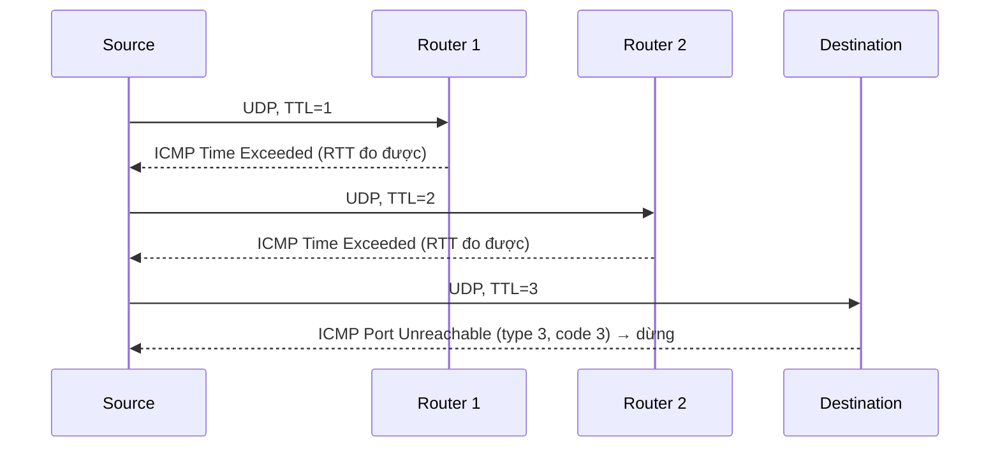

# Bài 8: Network Layer – IP, ICMP và Các Tấn Công

## 1. Network Layer (Tầng Mạng) – Ôn tập

### 1.1 Vai trò của tầng mạng

Tầng mạng chịu trách nhiệm **vận chuyển các segment từ host gửi đến host nhận** xuyên suốt qua nhiều router trung gian. Cụ thể:

- **Phía gửi:** Đóng gói segment thành **datagram**, chuyển xuống tầng liên kết (link layer).
- **Phía nhận:** Giải đóng gói datagram, chuyển segment lên tầng giao vận (transport layer).
- **Router:** Kiểm tra header của mỗi IP datagram đi qua, chuyển tiếp datagram từ cổng vào đến cổng ra phù hợp.

### 1.2 Hai chức năng chính của tầng mạng

```
Forwarding (Chuyển tiếp)          Routing (Định tuyến)
─────────────────────────         ─────────────────────────
Xử lý cục bộ tại từng router     Quyết định toàn mạng
Di chuyển gói qua một router      Xác định đường đi từ nguồn đến đích
Tra bảng forwarding table         Dùng routing algorithm
Tương tự: đi qua một ngã tư      Tương tự: lập kế hoạch toàn bộ hành trình
```

### 1.3 Data Plane vs Control Plane

=== "Data Plane"

    - Chức năng **cục bộ**, xử lý tại từng router riêng lẻ.
    - Quyết định datagram đến ở cổng vào nào sẽ được chuyển ra cổng ra nào.
    - Hoạt động ở tốc độ cao, thực hiện theo forwarding table đã được lập sẵn.

=== "Control Plane"

    - Logic **toàn mạng**, điều phối định tuyến qua nhiều router.
    - Xác định đường đi end-to-end từ nguồn đến đích.
    - Hai cách tiếp cận:
        - **Traditional routing algorithms:** Thuật toán chạy phân tán trên từng router (OSPF, BGP).
        - **SDN (Software-Defined Networking):** Bộ điều khiển tập trung tính toán và cài forwarding table vào từng router từ xa.

---

## 2. IP Protocol

### 2.1 Cấu trúc IP Datagram Header

```
 0                   1                   2                   3
 0 1 2 3 4 5 6 7 8 9 0 1 2 3 4 5 6 7 8 9 0 1 2 3 4 5 6 7 8 9 0 1
+-+-+-+-+-+-+-+-+-+-+-+-+-+-+-+-+-+-+-+-+-+-+-+-+-+-+-+-+-+-+-+-+
|Version|  IHL  |Type of Service|          Total Length         |
+-+-+-+-+-+-+-+-+-+-+-+-+-+-+-+-+-+-+-+-+-+-+-+-+-+-+-+-+-+-+-+-+
|         Identification        |Flags|      Fragment Offset    |
+-+-+-+-+-+-+-+-+-+-+-+-+-+-+-+-+-+-+-+-+-+-+-+-+-+-+-+-+-+-+-+-+
|  Time to Live |    Protocol   |         Header Checksum       |
+-+-+-+-+-+-+-+-+-+-+-+-+-+-+-+-+-+-+-+-+-+-+-+-+-+-+-+-+-+-+-+-+
|                       Source Address                          |
+-+-+-+-+-+-+-+-+-+-+-+-+-+-+-+-+-+-+-+-+-+-+-+-+-+-+-+-+-+-+-+-+
|                    Destination Address                        |
+-+-+-+-+-+-+-+-+-+-+-+-+-+-+-+-+-+-+-+-+-+-+-+-+-+-+-+-+-+-+-+-+
|                    Options (if any)                           |
+-+-+-+-+-+-+-+-+-+-+-+-+-+-+-+-+-+-+-+-+-+-+-+-+-+-+-+-+-+-+-+-+
```

| Trường | Độ rộng | Ý nghĩa |
|---|---|---|
| Version | 4 bit | Phiên bản IP (IPv4 = 4) |
| IHL (Header Length) | 4 bit | Độ dài header tính theo đơn vị 4 byte |
| Type of Service | 8 bit | DiffServ (6 bit) + ECN (2 bit) |
| Total Length | 16 bit | Tổng kích thước datagram (header + data), tối đa 65535 byte |
| Identification | 16 bit | Định danh datagram, dùng để ghép lại các mảnh |
| Flags | 3 bit | Bit 0: Reserved; Bit 1: Don't Fragment (DF); Bit 2: More Fragments (MF) |
| Fragment Offset | 13 bit | Vị trí mảnh trong datagram gốc, đơn vị 8 byte |
| TTL | 8 bit | Số router tối đa datagram có thể đi qua, giảm 1 tại mỗi router |
| Protocol | 8 bit | Giao thức tầng trên: TCP=6, UDP=17, ICMP=1 |
| Header Checksum | 16 bit | Kiểm tra lỗi header |
| Source IP | 32 bit | Địa chỉ IP nguồn |
| Destination IP | 32 bit | Địa chỉ IP đích |

!!! note "Overhead TCP+IP"
    Khi dùng TCP/IP: header IP = 20 byte + header TCP = 20 byte = **40 byte overhead** chưa kể dữ liệu ứng dụng.

### 2.2 TTL và cách Traceroute hoạt động

**TTL (Time to Live)** là trường 8-bit trong header IP, được giảm đi 1 tại mỗi router. Khi TTL = 0, router sẽ hủy datagram và gửi thông báo **ICMP Time Exceeded (type 11, code 0)** về cho nguồn.

**Traceroute** lợi dụng cơ chế này để khám phá đường đi:



**Điều kiện dừng:**
- Datagram UDP cuối cùng đến được đích.
- Đích trả về **ICMP Port Unreachable (type 3, code 3)** vì cổng UDP đích không tồn tại.
- Nguồn dừng gửi.

**Câu hỏi:** *Tại sao cần đặt TTL?*

> **Trả lời:** Nếu không có TTL, các datagram bị lạc đường (do routing loop) sẽ lưu thông mãi mãi trên mạng, gây tắc nghẽn. TTL đảm bảo datagram bị hủy sau một số bước nhất định, tránh lãng phí tài nguyên mạng.

**Câu hỏi:** *Tại sao trong traceroute có hàng `* * *`?*

> **Trả lời:** Router đó không gửi lại ICMP (bị chặn bởi firewall hoặc cấu hình im lặng), nên nguồn không nhận được phản hồi trong khoảng thời gian timeout.

---

## 3. IP Fragmentation và Tấn công

### 3.1 Tại sao cần phân mảnh (Fragmentation)?

Mỗi liên kết mạng có giới hạn kích thước frame tối đa gọi là **MTU (Maximum Transmission Unit)**. Ví dụ Ethernet có MTU = 1500 byte. Khi datagram lớn hơn MTU, router phải **chia nhỏ datagram thành nhiều mảnh (fragment)**.

- Các mảnh chỉ được **tái hợp (reassembly) tại đích**, không phải tại router trung gian.
- Header IP chứa các trường **Identification, Flags, Fragment Offset** để đích có thể ghép lại đúng thứ tự.

### 3.2 Ví dụ phân mảnh

Datagram 4000 byte, MTU = 1500 byte:

| Mảnh | ID | Offset | MF flag | Length |
|---|---|---|---|---|
| 1 | x | 0 | 1 | 1500 |
| 2 | x | 185 | 1 | 1500 |
| 3 | x | 370 | 0 | 1040 |

**Câu hỏi:** *Tại sao Fragment Offset phải chia cho 8?*

> **Trả lời:** Trường Fragment Offset chỉ có 13 bit, nếu tính theo byte thì chỉ biểu diễn được tối đa 8191 byte. Bằng cách dùng đơn vị **8 byte**, trường này có thể biểu diễn offset lên đến 8191 × 8 = 65528 byte, đủ cho datagram 65535 byte. Đây là lý do mọi mảnh (trừ mảnh cuối) phải có kích thước data là bội số của 8.

**Tính offset mảnh 2:** Data mảnh 1 = 1500 - 20 (header) = 1480 byte → offset = 1480 / 8 = **185**

**Tính offset mảnh 3:** 1480 × 2 = 2960 byte → offset = 2960 / 8 = **370**

### 3.3 Tạo IP Fragment thủ công với Scapy

```python
#!/usr/bin/python3
from scapy.all import *

ID   = 1000
dst_ip = "10.102.20.178"

# Fragment 1: chứa UDP header + 31 byte data 'A'
udp = UDP(sport=7070, dport=9090, chksum=0)
udp.len = 8 + 32 + 40 + 20   # tính thủ công
ip  = IP(dst=dst_ip, id=ID, frag=0, flags=1)
payload = "A" * 31 + "\n"
pkt = ip / udp / payload
send(pkt, verbose=0)

# Fragment 2: offset=5 (5*8=40 byte), data 'B'
ip = IP(dst=dst_ip, id=ID, frag=5, flags=1)
ip.proto = 17   # UDP
payload = "B" * 39 + "\n"
pkt = ip / payload
send(pkt, verbose=0)

# Fragment 3: offset=10 (10*8=80 byte), MF=0 (mảnh cuối), data 'C'
ip = IP(dst=dst_ip, id=ID, frag=10, flags=0)
ip.proto = 17
payload = "C" * 19 + "\n"
pkt = ip / payload
send(pkt, verbose=0)
```

!!! tip "Lưu ý khi tạo fragment thủ công"
    - `flags=1` → More Fragments (MF) = 1, còn mảnh tiếp theo.
    - `flags=0` → MF = 0, đây là mảnh cuối cùng.
    - `frag` = giá trị offset (tính theo đơn vị 8 byte).
    - Với mảnh không phải mảnh đầu, phải set `ip.proto = 17` (UDP) thủ công vì không có UDP header.

---

## 4. Tấn công dựa trên IP Fragmentation

### 4.1 Nguyên tắc chung

!!! warning "Nguyên tắc tấn công"
    Protocol là các **quy tắc**. Kẻ tấn công thích **vi phạm quy tắc**. Chương trình mạnh mẽ phải **xử lý được các vi phạm đó** mà không bị crash hay bị khai thác.

### 4.2 Ba câu hỏi khai thác cốt lõi

**Q1:** Có thể tạo IP packet lớn hơn 65.536 byte (64 KB) không?

> **Trả lời:** Về mặt giao thức, tổng kích thước datagram được giới hạn bởi trường Total Length 16 bit = tối đa 65535 byte. Tuy nhiên, kẻ tấn công có thể dùng **fragment** để tái tạo một datagram vượt giới hạn này khi được ghép lại ở đích. Đây là cơ sở của **Ping of Death**.

**Q2:** Có thể tạo các điều kiện bất thường bằng "offset" và "payload size" không?

> **Trả lời:** Có. Kẻ tấn công có thể tạo:
> - Các mảnh **chồng lấp nhau** (overlapping fragments) gây nhầm lẫn khi tái hợp.
> - Offset sai, tạo ra "lỗ hổng" trong dữ liệu tái hợp.
> - Mảnh cực nhỏ (tiny fragments) để bypass firewall.

**Q3:** Có thể dùng lượng băng thông nhỏ để chiếm dụng tài nguyên lớn của máy đích không?

> **Trả lời:** Có. Máy đích phải **giữ các mảnh trong bộ nhớ** chờ các mảnh còn lại để tái hợp. Nếu kẻ tấn công liên tục gửi mảnh đầu mà không bao giờ gửi mảnh cuối, bộ nhớ đích sẽ bị cạn kiệt. Đây là nguyên lý của **Fragment Flood / Resource Exhaustion**.

### 4.3 Ping of Death (PoD)

**Ping of Death** là tấn công tạo ra IP datagram **vượt quá 65.535 byte** bằng cách lợi dụng fragmentation:

```
Mảnh cuối:
  - offset = (65536 - 8) / 8 = 8191
  - total_length của mảnh = 1000 byte (data = 980 byte)
  - Khi tái hợp: offset_byte + data = 8191×8 + 980 = 65528 + 980 = 66508 byte > 65535 byte!
```

**Hậu quả:** Khi hệ điều hành đích cố gắng tái hợp datagram này, nó cố ghi vào buffer vượt quá kích thước được cấp phát → **Buffer Overflow** → crash hệ thống, reboot, hoặc thực thi mã độc.

!!! note "Lịch sử"
    Ping of Death ảnh hưởng nhiều hệ điều hành cũ (Windows 95, NT, Linux kernel cũ). Các hệ thống hiện đại đã vá lỗi này bằng cách kiểm tra tổng kích thước tái hợp trước khi cấp phát bộ nhớ.

---

## 5. ICMP Protocol và Tấn công

### 5.1 ICMP là gì?

**ICMP (Internet Control Message Protocol)** là giao thức hỗ trợ IP, dùng để:

- **Báo lỗi:** Thông báo khi datagram không thể giao (đích không tồn tại, TTL hết...).
- **Thăm dò mạng:** Ping, Traceroute.

ICMP hoạt động ở **tầng mạng**, được đóng gói trực tiếp trong IP datagram (Protocol = 1).

### 5.2 Một số loại ICMP message quan trọng

| Type | Code | Ý nghĩa |
|---|---|---|
| 0 | 0 | Echo Reply (phản hồi Ping) |
| 3 | 0 | Destination Network Unreachable |
| 3 | 1 | Destination Host Unreachable |
| 3 | 3 | Destination Port Unreachable |
| 8 | 0 | Echo Request (Ping) |
| 11 | 0 | Time Exceeded (TTL = 0) |

---

## Câu hỏi Trắc nghiệm

**Câu 1.** Chức năng của tầng mạng (Network Layer) là gì?

- A. Truyền bit qua đường vật lý
- B. Vận chuyển segment từ host gửi đến host nhận qua nhiều router
- C. Kiểm soát luồng dữ liệu giữa hai ứng dụng
- D. Mã hóa dữ liệu trước khi truyền

??? info "Đáp án & Giải thích"
    **Đáp án: B**

    Tầng mạng chịu trách nhiệm định tuyến và chuyển tiếp datagram từ nguồn đến đích xuyên qua nhiều router trung gian, tức là vận chuyển segment từ host gửi đến host nhận.

---

**Câu 2.** "Forwarding" trong tầng mạng khác "Routing" ở điểm nào?

- A. Forwarding là chức năng toàn mạng, Routing là chức năng cục bộ tại router
- B. Forwarding là chuyển gói qua một router đơn lẻ, Routing là xác định đường đi toàn mạng
- C. Forwarding dùng thuật toán Dijkstra, Routing dùng bảng tra cứu
- D. Không có sự khác biệt

??? info "Đáp án & Giải thích"
    **Đáp án: B**

    Forwarding là hành động cục bộ tại một router: nhận gói ở cổng vào, tra forwarding table, chuyển ra cổng ra phù hợp. Routing là logic toàn mạng: tính toán đường đi tối ưu từ nguồn đến đích qua nhiều router.

---

**Câu 3.** Trong SDN (Software-Defined Networking), forwarding table được tính toán ở đâu?

- A. Tại từng router phân tán
- B. Tại bộ điều khiển tập trung (Remote Controller) và cài xuống router
- C. Tại host nguồn
- D. Tại DNS server

??? info "Đáp án & Giải thích"
    **Đáp án: B**

    SDN tách biệt control plane khỏi data plane. Bộ điều khiển tập trung (Remote Controller) tính toán forwarding table rồi cài (install) vào từng router, thay vì mỗi router tự chạy thuật toán định tuyến như mô hình truyền thống.

---

**Câu 4.** Trường "Total Length" trong IP header có độ rộng bao nhiêu bit và giá trị tối đa là bao nhiêu byte?

- A. 8 bit, tối đa 255 byte
- B. 16 bit, tối đa 65535 byte
- C. 32 bit, tối đa ~4 GB
- D. 13 bit, tối đa 8191 byte

??? info "Đáp án & Giải thích"
    **Đáp án: B**

    Trường Total Length là 16 bit, biểu diễn giá trị từ 0 đến 65535, tức tối đa 65535 byte (~64 KB). Trên thực tế, các datagram thường nhỏ hơn 1500 byte do giới hạn MTU của Ethernet.

---

**Câu 5.** Trường TTL trong IP header có tác dụng gì?

- A. Xác định thời gian datagram được lưu trong cache của router
- B. Giới hạn số router tối đa datagram có thể đi qua, tránh routing loop vô hạn
- C. Mã hóa nội dung datagram
- D. Xác định độ ưu tiên của datagram

??? info "Đáp án & Giải thích"
    **Đáp án: B**

    TTL (Time to Live) giảm 1 tại mỗi router. Khi TTL = 0, router hủy datagram và gửi ICMP Time Exceeded về nguồn. Điều này ngăn datagram lưu thông vô hạn khi có routing loop.

---

**Câu 6.** Khi TTL của một datagram về 0 tại router, router sẽ làm gì?

- A. Chuyển tiếp datagram đến đích trực tiếp
- B. Gửi lại datagram đến nguồn
- C. Hủy datagram và gửi ICMP Time Exceeded (type 11, code 0) về nguồn
- D. Tăng TTL lên 1 và tiếp tục chuyển tiếp

??? info "Đáp án & Giải thích"
    **Đáp án: C**

    Theo chuẩn IP, khi TTL = 0, router hủy datagram và gửi thông báo ICMP Time Exceeded (type 11, code 0) về địa chỉ nguồn, kèm thông tin về router đó. Traceroute khai thác hành vi này.

---

**Câu 7.** Traceroute sử dụng kỹ thuật nào để khám phá từng router trên đường đi?

- A. Gửi các ICMP Echo Request với TTL tăng dần
- B. Gửi các UDP segment với TTL tăng dần từ 1
- C. Gửi TCP SYN với TTL cố định
- D. Dùng DNS để tra cứu từng hop

??? info "Đáp án & Giải thích"
    **Đáp án: B**

    Traceroute (trên Unix/Linux) gửi UDP segment với TTL = 1 (bị hủy tại router 1), rồi TTL = 2 (bị hủy tại router 2), v.v. Mỗi router trả về ICMP Time Exceeded, tiết lộ địa chỉ IP của nó. Trên Windows, tracert dùng ICMP Echo Request thay vì UDP.

---

**Câu 8.** Điều kiện dừng của Traceroute là gì?

- A. Khi TTL đạt giá trị 255
- B. Khi nhận được ICMP Echo Reply từ đích
- C. Khi nhận ICMP Port Unreachable (type 3, code 3) từ đích
- D. Khi đã gửi đủ 30 probe

??? info "Đáp án & Giải thích"
    **Đáp án: C**

    Traceroute dùng cổng UDP không tồn tại ở đích. Khi datagram cuối cùng đến đích, đích trả về ICMP Destination Port Unreachable (type 3, code 3) vì không có ứng dụng nào lắng nghe cổng đó. Nguồn nhận được thông báo này thì biết đã đến đích và dừng.

---

**Câu 9.** Tại sao trong kết quả traceroute có những dòng hiển thị `* * *`?

- A. Router đó không hỗ trợ IP
- B. Firewall chặn ICMP phản hồi hoặc router được cấu hình không trả lời
- C. Datagram bị drop do lỗi đường truyền
- D. TTL bị đặt sai

??? info "Đáp án & Giải thích"
    **Đáp án: B**

    Dấu `* * *` có nghĩa là nguồn không nhận được phản hồi trong khoảng thời gian timeout. Nguyên nhân thường gặp nhất là router/firewall chặn ICMP outbound, tức không cho phép gửi ICMP Time Exceeded ra ngoài, hoặc router được cấu hình im lặng với các gói này.

---

**Câu 10.** MTU (Maximum Transmission Unit) là gì?

- A. Tốc độ truyền tối đa của một liên kết mạng
- B. Kích thước frame tối đa mà một liên kết mạng có thể truyền
- C. Số kết nối tối đa một router có thể xử lý
- D. Kích thước bộ nhớ đệm của router

??? info "Đáp án & Giải thích"
    **Đáp án: B**

    MTU là kích thước tối đa (tính bằng byte) của một frame ở tầng liên kết. Ethernet có MTU = 1500 byte. Nếu IP datagram lớn hơn MTU, router phải phân mảnh (fragment) datagram đó.

---

**Câu 11.** Việc tái hợp (reassembly) các IP fragment được thực hiện ở đâu?

- A. Tại mỗi router trung gian
- B. Tại router cuối trước đích
- C. Chỉ tại host đích
- D. Tại cả router và host đích

??? info "Đáp án & Giải thích"
    **Đáp án: C**

    Theo thiết kế của IP, việc tái hợp fragment chỉ xảy ra tại host đích, không phải tại router trung gian. Điều này giúp router không phải giữ trạng thái (stateless) và giảm tải xử lý.

---

**Câu 12.** Trong IP fragmentation, trường nào được dùng để nhận biết các mảnh thuộc cùng một datagram gốc?

- A. TTL
- B. Protocol
- C. Identification (ID)
- D. Source IP Address

??? info "Đáp án & Giải thích"
    **Đáp án: C**

    Trường Identification (16 bit) mang cùng một giá trị cho tất cả các mảnh của cùng một datagram gốc. Host đích dùng ID này, kết hợp với Source IP, để nhóm các mảnh lại trước khi tái hợp.

---

**Câu 13.** Trường Fragment Offset trong IP header có kích thước bao nhiêu bit?

- A. 8 bit
- B. 16 bit
- C. 13 bit
- D. 3 bit

??? info "Đáp án & Giải thích"
    **Đáp án: C**

    Fragment Offset là trường 13 bit, biểu diễn vị trí của dữ liệu mảnh trong datagram gốc, tính theo đơn vị 8 byte. Giá trị tối đa là 8191, tương ứng offset byte là 65528.

---

**Câu 14.** Tại sao Fragment Offset được tính theo đơn vị 8 byte thay vì 1 byte?

- A. Để tiết kiệm băng thông
- B. Trường 13 bit chỉ biểu diễn được 8191, nhân với 8 mới đủ phạm vi cho datagram 65535 byte
- C. Vì Ethernet MTU là 1500 byte chia hết cho 8
- D. Để dễ tính toán checksum

??? info "Đáp án & Giải thích"
    **Đáp án: B**

    Với 13 bit, offset tối đa là 8191 byte — không đủ cho datagram 65535 byte. Bằng cách dùng đơn vị 8 byte, offset tối đa là 8191 × 8 = 65528 byte, đủ lớn. Hệ quả: tất cả mảnh (trừ mảnh cuối) phải có phần data có kích thước là bội số của 8.

---

**Câu 15.** Một datagram 4000 byte được phân mảnh với MTU = 1500 byte. Offset của mảnh thứ hai là bao nhiêu?

- A. 1480
- B. 185
- C. 148
- D. 1500

??? info "Đáp án & Giải thích"
    **Đáp án: B**

    Mảnh 1 chứa 1480 byte data (1500 - 20 byte IP header). Offset mảnh 2 = 1480 / 8 = 185. Đơn vị của Fragment Offset là 8 byte.

---

**Câu 16.** Flag "More Fragments (MF)" được đặt là 1 khi nào?

- A. Đây là mảnh duy nhất (không có phân mảnh)
- B. Đây là mảnh cuối cùng của datagram
- C. Còn có mảnh tiếp theo sau mảnh này
- D. Datagram không được phép phân mảnh

??? info "Đáp án & Giải thích"
    **Đáp án: C**

    MF = 1 nghĩa là "còn mảnh nữa phía sau". Mảnh cuối cùng có MF = 0 và offset khác 0. Datagram không bị phân mảnh có MF = 0 và offset = 0.

---

**Câu 17.** Flag "Don't Fragment (DF)" có ý nghĩa gì?

- A. Datagram đã bị phân mảnh
- B. Router không được phép phân mảnh datagram này; nếu cần phân mảnh thì hủy và gửi ICMP Fragmentation Needed
- C. Datagram là mảnh cuối cùng
- D. Datagram ưu tiên cao, không được hủy

??? info "Đáp án & Giải thích"
    **Đáp án: B**

    Khi DF = 1, router nhận datagram lớn hơn MTU sẽ **không phân mảnh** mà hủy datagram và gửi ICMP "Fragmentation Needed and DF Set" (type 3, code 4) về nguồn. Kỹ thuật Path MTU Discovery dùng cơ chế này để tìm MTU tối thiểu trên đường đi.

---

**Câu 18.** Trong code Scapy, `flags=1` khi tạo IP fragment có nghĩa là gì?

- A. Don't Fragment = 1
- B. More Fragments = 1 (còn mảnh tiếp theo)
- C. Reserved bit = 1
- D. Fragment Offset = 1

??? info "Đáp án & Giải thích"
    **Đáp án: B**

    Trong Scapy, trường `flags` của lớp IP nhận giá trị: 0 = không có flag, 1 = MF (More Fragments), 2 = DF (Don't Fragment). `flags=1` tương đương MF = 1, nghĩa là còn mảnh tiếp theo.

---

**Câu 19.** Khi tạo mảnh IP không phải mảnh đầu (không chứa UDP header) bằng Scapy, cần đặt `ip.proto = 17` vì sao?

- A. Để tăng tốc độ xử lý
- B. Vì Scapy không tự nhận biết protocol khi không có header tầng trên kèm theo
- C. Để bypass firewall
- D. 17 là giá trị mặc định của IP protocol

??? info "Đáp án & Giải thích"
    **Đáp án: B**

    Mảnh đầu tiên chứa UDP header nên Scapy tự động điền `proto=17`. Các mảnh sau chỉ chứa payload thô (không có UDP header), nên Scapy không biết protocol là gì; cần set thủ công `ip.proto = 17` để host đích biết đây là dữ liệu UDP khi tái hợp.

---

**Câu 20.** Ping of Death tấn công bằng cách nào?

- A. Gửi hàng triệu ICMP Echo Request nhỏ để làm cạn băng thông
- B. Dùng fragmentation tạo datagram khi tái hợp vượt 65535 byte, gây buffer overflow ở đích
- C. Giả mạo địa chỉ IP nguồn để gây phản hồi về nạn nhân
- D. Khai thác lỗ hổng trong giao thức TCP ba bước bắt tay

??? info "Đáp án & Giải thích"
    **Đáp án: B**

    Ping of Death gửi các mảnh IP được thiết kế sao cho tổng kích thước datagram sau tái hợp vượt 65535 byte. Hệ điều hành cũ khi cố ghi dữ liệu vào buffer cố định kích thước tối đa 65535 byte sẽ bị buffer overflow, dẫn đến crash.

---

**Câu 21.** Trong tấn công Ping of Death, mảnh cuối có offset = (65536 - 8) / 8. Giá trị này bằng bao nhiêu?

- A. 8192
- B. 8191
- C. 8190
- D. 8184

??? info "Đáp án & Giải thích"
    **Đáp án: B**

    (65536 - 8) / 8 = 65528 / 8 = **8191**. Đây là giá trị offset tối đa của trường 13 bit. Mảnh cuối bắt đầu ở byte 65528, cộng thêm payload > 7 byte sẽ vượt 65535 byte.

---

**Câu 22.** Tấn công "Fragment Flood" nhằm mục đích gì?

- A. Làm tràn bảng routing của router
- B. Chiếm dụng bộ nhớ của đích bằng cách gửi nhiều mảnh đầu mà không bao giờ gửi mảnh cuối
- C. Gây nhiễu tín hiệu vật lý
- D. Đánh cắp session cookie

??? info "Đáp án & Giải thích"
    **Đáp án: B**

    Host đích phải giữ các fragment trong bộ nhớ (buffer) để chờ tái hợp. Nếu kẻ tấn công liên tục gửi mảnh đầu (MF=1) mà không bao giờ gửi mảnh cuối, bộ nhớ đích dần bị chiếm hết, dẫn đến từ chối dịch vụ (DoS). Đây là dạng **resource exhaustion**.

---

**Câu 23.** "Overlapping Fragments" attack là gì?

- A. Gửi nhiều datagram trùng lặp để làm chậm mạng
- B. Tạo các mảnh có vùng dữ liệu chồng lấp nhau, khai thác sự không nhất quán trong logic tái hợp của các OS khác nhau
- C. Gửi mảnh với ID trùng nhau từ nhiều nguồn
- D. Phân mảnh gói ARP để bypass switch

??? info "Đáp án & Giải thích"
    **Đáp án: B**

    Overlapping fragments tạo ra các mảnh có vùng byte chồng lên nhau. Khi tái hợp, OS có thể dùng mảnh cũ hoặc mảnh mới để lấp vùng chồng lấp — sự không nhất quán này được khai thác để bypass IDS/firewall (gói mà firewall thấy khác gói mà đích tái hợp được).

---

**Câu 24.** ICMP thuộc tầng nào trong mô hình TCP/IP?

- A. Tầng ứng dụng (Application)
- B. Tầng giao vận (Transport)
- C. Tầng mạng (Network)
- D. Tầng liên kết (Link)

??? info "Đáp án & Giải thích"
    **Đáp án: C**

    ICMP được đóng gói trực tiếp trong IP datagram với trường Protocol = 1, hoạt động ở tầng mạng. Tuy nhiên, về mặt chức năng, ICMP hỗ trợ hoạt động của IP chứ không phải là giao thức giao vận.

---

**Câu 25.** ICMP Type 8, Code 0 là gì?

- A. Time Exceeded
- B. Echo Reply (phản hồi Ping)
- C. Echo Request (yêu cầu Ping)
- D. Destination Unreachable

??? info "Đáp án & Giải thích"
    **Đáp án: C**

    ICMP Type 8, Code 0 là **Echo Request**, tức lệnh Ping gửi đi. ICMP Type 0, Code 0 là **Echo Reply**, tức phản hồi Ping. Traceroute khai thác ICMP Type 11 (Time Exceeded) và Type 3 (Destination Unreachable).

---

**Câu 26.** ICMP Type 3, Code 3 có ý nghĩa gì?

- A. Network Unreachable
- B. Host Unreachable
- C. Port Unreachable
- D. Protocol Unreachable

??? info "Đáp án & Giải thích"
    **Đáp án: C**

    Type 3 = Destination Unreachable, Code 3 = Port Unreachable. Thông báo này được gửi khi một datagram UDP đến đích nhưng không có ứng dụng nào lắng nghe trên cổng đó. Traceroute dùng điều này làm tín hiệu dừng.

---

**Câu 27.** Trường Protocol trong IP header có giá trị 6 biểu thị giao thức nào?

- A. UDP
- B. ICMP
- C. TCP
- D. OSPF

??? info "Đáp án & Giải thích"
    **Đáp án: C**

    Các giá trị phổ biến: 1 = ICMP, 6 = TCP, 17 = UDP, 89 = OSPF. Giá trị này cho phép host đích biết nên chuyển payload lên giao thức tầng trên nào.

---

**Câu 28.** Trường Identification trong IP header có độ rộng bao nhiêu bit?

- A. 8 bit
- B. 13 bit
- C. 16 bit
- D. 32 bit

??? info "Đáp án & Giải thích"
    **Đáp án: C**

    Trường Identification là 16 bit. Tất cả các mảnh của cùng một datagram gốc mang cùng giá trị Identification, giúp host đích nhóm và tái hợp đúng.

---

**Câu 29.** Overhead tối thiểu khi truyền dữ liệu qua TCP/IP là bao nhiêu?

- A. 20 byte
- B. 28 byte
- C. 40 byte
- D. 60 byte

??? info "Đáp án & Giải thích"
    **Đáp án: C**

    IP header = 20 byte (không có option) + TCP header = 20 byte (không có option) = **40 byte** overhead tối thiểu. Đây là chi phí cố định trước khi thêm bất kỳ dữ liệu ứng dụng nào.

---

**Câu 30.** Địa chỉ IP nguồn trong IP header có độ rộng bao nhiêu bit?

- A. 16 bit
- B. 32 bit
- C. 48 bit
- D. 128 bit

??? info "Đáp án & Giải thích"
    **Đáp án: B**

    IPv4 dùng địa chỉ 32 bit (4 octet, ví dụ 192.168.1.1). IPv6 dùng 128 bit. Trong IP header (IPv4), cả source và destination đều là 32 bit.

---

**Câu 31.** Kích thước IP header tối thiểu (không có option) là bao nhiêu byte?

- A. 16 byte
- B. 20 byte
- C. 24 byte
- D. 40 byte

??? info "Đáp án & Giải thích"
    **Đáp án: B**

    IP header tối thiểu (không có trường Options) = 20 byte = 5 × 32-bit word. Trường IHL (Header Length) = 5 trong trường hợp này.

---

**Câu 32.** Trường "Type of Service" trong IP header (phiên bản hiện đại) bao gồm những gì?

- A. Priority và Delay
- B. DSCP (6 bit) và ECN (2 bit)
- C. Precedence và Reliability
- D. QoS class và Drop probability

??? info "Đáp án & Giải thích"
    **Đáp án: B**

    Trường ToS 8 bit hiện được dùng theo chuẩn DiffServ: 6 bit DSCP (Differentiated Services Code Point) để phân loại lưu lượng và ưu tiên xử lý, 2 bit ECN (Explicit Congestion Notification) để báo tắc nghẽn mà không cần drop gói.

---

**Câu 33.** Một datagram IP không bị phân mảnh có Fragment Offset và MF flag là bao nhiêu?

- A. Offset = 0, MF = 1
- B. Offset = 0, MF = 0
- C. Offset = 1, MF = 0
- D. Offset = 0, MF = x (bất kỳ)

??? info "Đáp án & Giải thích"
    **Đáp án: B**

    Datagram không bị phân mảnh: Fragment Offset = 0 (bắt đầu từ byte 0) và MF = 0 (không có mảnh tiếp theo). Đây là trạng thái bình thường của hầu hết các gói IP trên mạng Ethernet.

---

**Câu 34.** Lớp Scapy nào được dùng để tạo IP packet?

- A. `Ether()`
- B. `IP()`
- C. `TCP()`
- D. `ICMP()`

??? info "Đáp án & Giải thích"
    **Đáp án: B**

    Trong Scapy, `IP()` tạo IP header. Các lớp được kết hợp bằng toán tử `/`: `IP()/TCP()/payload` sẽ tạo một gói IP chứa TCP segment chứa payload.

---

**Câu 35.** Trong Scapy, lệnh `send(pkt, verbose=0)` có tác dụng gì?

- A. Gửi gói ở tầng 2 (link layer) không in thông báo
- B. Gửi gói ở tầng 3 (network layer) không in thông báo ra màn hình
- C. Lưu gói vào file pcap
- D. Gửi gói và chờ phản hồi

??? info "Đáp án & Giải thích"
    **Đáp án: B**

    `send()` trong Scapy gửi gói ở tầng 3 (Layer 3), không cần quan tâm đến tầng liên kết. `verbose=0` tắt thông báo in ra màn hình. Để gửi ở tầng 2 (kèm Ethernet header), dùng `sendp()`.

---

**Câu 36.** Tại sao các mảnh IP (trừ mảnh cuối) phải có phần dữ liệu là bội số của 8 byte?

- A. Để đảm bảo checksum chính xác
- B. Vì Fragment Offset tính theo đơn vị 8 byte, mảnh tiếp theo phải bắt đầu tại vị trí là bội số của 8
- C. Để phù hợp với kích thước cache line của CPU
- D. Vì TCP segment có kích thước bội số 8

??? info "Đáp án & Giải thích"
    **Đáp án: B**

    Fragment Offset biểu thị vị trí bắt đầu của mảnh theo đơn vị 8 byte. Để offset tiếp theo là số nguyên (không có phần thập phân), kích thước data của mảnh hiện tại phải là bội số của 8. Nếu không, mảnh tiếp theo sẽ có offset không biểu diễn được.

---

**Câu 37.** Routing protocol OSPF sử dụng trường Protocol trong IP header với giá trị nào?

- A. 6
- B. 17
- C. 1
- D. 89

??? info "Đáp án & Giải thích"
    **Đáp án: D**

    OSPF (Open Shortest Path First) được đóng gói trực tiếp trong IP với Protocol = 89. Nó không dùng TCP hay UDP, khác với BGP (dùng TCP/179).

---

**Câu 38.** Trong ví dụ Wireshark ở slide, giá trị TTL = 64 cho biết điều gì?

- A. Gói đã đi qua 64 router
- B. Gói xuất phát với TTL = 64, đây là giá trị mặc định phổ biến trên Linux/Unix
- C. Gói sẽ bị hủy sau đúng 64 giây
- D. Gói còn 64 byte dữ liệu để truyền

??? info "Đáp án & Giải thích"
    **Đáp án: B**

    TTL = 64 là giá trị khởi đầu mặc định của Linux/macOS. Windows dùng TTL = 128, một số thiết bị Cisco dùng TTL = 255. Khi nhìn thấy TTL = 64 ở nguồn, ta biết gói chưa đi qua router nào (hoặc đây là giá trị gốc).

---

**Câu 39.** Header checksum trong IP header bảo vệ điều gì?

- A. Toàn bộ datagram bao gồm cả dữ liệu
- B. Chỉ phần IP header
- C. Chỉ phần dữ liệu (payload)
- D. Cả header và trailer

??? info "Đáp án & Giải thích"
    **Đáp án: B**

    IP header checksum chỉ bảo vệ **phần header**. Tính toàn vẹn của dữ liệu (payload) là trách nhiệm của giao thức tầng trên (TCP checksum, UDP checksum). Mỗi router phải tính lại checksum vì TTL thay đổi.

---

**Câu 40.** Khi router nhận datagram với DF = 1 nhưng datagram lớn hơn MTU của liên kết ra, router sẽ làm gì?

- A. Phân mảnh datagram bình thường
- B. Hủy datagram và gửi ICMP Fragmentation Needed (type 3, code 4) về nguồn
- C. Gửi datagram nguyên vẹn dù vượt MTU
- D. Tăng MTU của liên kết đó

??? info "Đáp án & Giải thích"
    **Đáp án: B**

    Khi DF = 1, router bị cấm phân mảnh. Nếu datagram quá lớn để chuyển qua liên kết, router hủy datagram và gửi ICMP "Fragmentation Needed and DF Set" (Type 3, Code 4) về nguồn, kèm MTU của liên kết. Nguồn dùng thông tin này để điều chỉnh kích thước (Path MTU Discovery).

---

**Câu 41.** Trong mô hình phân tầng, datagram IP tương ứng với đơn vị dữ liệu ở tầng nào?

- A. Tầng ứng dụng: message
- B. Tầng giao vận: segment
- C. Tầng mạng: datagram
- D. Tầng liên kết: frame

??? info "Đáp án & Giải thích"
    **Đáp án: C**

    Mỗi tầng có đơn vị dữ liệu riêng: Application = message, Transport = segment, Network = **datagram** (packet), Link = frame, Physical = bit.

---

**Câu 42.** Traceroute gửi mỗi TTL value bao nhiêu probe (lần đo)?

- A. 1
- B. 2
- C. 3
- D. 5

??? info "Đáp án & Giải thích"
    **Đáp án: C**

    Traceroute gửi **3 probe** cho mỗi giá trị TTL. Kết quả hiển thị 3 RTT (Round Trip Time) tương ứng. Nếu một trong 3 không nhận được phản hồi thì hiển thị `*`.

---

**Câu 43.** ECN (Explicit Congestion Notification) trong IP header có tác dụng gì?

- A. Ưu tiên gói tin quan trọng
- B. Thông báo tắc nghẽn mạng mà không cần drop gói
- C. Mã hóa nội dung gói
- D. Nhận dạng luồng dữ liệu

??? info "Đáp án & Giải thích"
    **Đáp án: B**

    ECN (2 bit trong trường ToS) cho phép router thông báo tắc nghẽn bằng cách đánh dấu gói thay vì drop gói. Điểm cuối nhận gói có bit ECN được bật sẽ giảm tốc độ gửi. Điều này cải thiện hiệu năng so với việc chờ TCP phát hiện mất gói.

---

**Câu 44.** Giá trị nào trong trường Protocol của IP header biểu thị UDP?

- A. 1
- B. 6
- C. 17
- D. 89

??? info "Đáp án & Giải thích"
    **Đáp án: C**

    Các giá trị Protocol quan trọng: 1 = ICMP, 6 = TCP, **17 = UDP**, 89 = OSPF. Đây là IANA-assigned protocol numbers, được chuẩn hóa toàn cầu.

---

**Câu 45.** Điểm khác biệt giữa Traditional Routing và SDN là gì?

- A. Traditional routing nhanh hơn SDN
- B. Traditional routing: mỗi router tự chạy thuật toán định tuyến phân tán; SDN: bộ điều khiển tập trung tính toán và cài forwarding table
- C. SDN chỉ dùng được trong mạng nội bộ
- D. Traditional routing không hỗ trợ IPv6

??? info "Đáp án & Giải thích"
    **Đáp án: B**

    Traditional routing (OSPF, BGP): mỗi router chạy thuật toán định tuyến độc lập, trao đổi thông tin với router láng giềng. SDN: tách control plane ra khỏi router, đặt vào Remote Controller tập trung; controller tính toán và push forwarding table xuống từng router qua giao thức như OpenFlow.

---

**Câu 46.** Khi Traceroute đến một router không phản hồi (firewall chặn ICMP), điều gì xảy ra với TTL?

- A. TTL dừng tăng tại router đó
- B. TTL tiếp tục tăng, nhưng dòng đó hiển thị `* * *`, và probe tiếp theo vẫn được gửi với TTL+1
- C. Traceroute dừng lại hoàn toàn
- D. Traceroute thử lại với TTL giảm dần

??? info "Đáp án & Giải thích"
    **Đáp án: B**

    Traceroute không dừng khi không nhận được phản hồi. Nó tiếp tục gửi probe với TTL tăng dần. Dòng không có phản hồi hiển thị `* * *`, nhưng các dòng tiếp theo vẫn có thể có kết quả nếu router/host tiếp theo cho phép ICMP.

---

**Câu 47.** Trong tấn công dựa trên protocol violation, nguyên tắc cơ bản là gì?

- A. Khai thác lỗ hổng trong mã hóa
- B. Giao thức là tập quy tắc; kẻ tấn công cố tình vi phạm quy tắc đó để kiểm tra xem chương trình xử lý thế nào
- C. Brute-force mật khẩu
- D. Man-in-the-middle để nghe lén

??? info "Đáp án & Giải thích"
    **Đáp án: B**

    Protocol-based attacks dựa trên việc gửi các gói vi phạm đặc tả giao thức. Các chương trình mạng mạnh mẽ phải kiểm tra và từ chối gracefully các đầu vào bất hợp lệ thay vì crash hay hoạt động sai.

---

**Câu 48.** Nếu Fragment Offset = 0 và MF = 1, đây là loại mảnh nào?

- A. Mảnh cuối cùng
- B. Mảnh duy nhất (không có phân mảnh)
- C. Mảnh đầu tiên (còn mảnh tiếp theo)
- D. Mảnh trung gian

??? info "Đáp án & Giải thích"
    **Đáp án: C**

    Offset = 0 nghĩa là mảnh này bắt đầu từ đầu datagram (là mảnh đầu tiên). MF = 1 nghĩa là còn mảnh tiếp theo. Kết hợp: đây là **mảnh đầu tiên** của một datagram bị phân mảnh.

---

**Câu 49.** Tại sao việc tái hợp fragment chỉ được thực hiện tại đích thay vì tại mỗi router?

- A. Router không đủ năng lực tính toán
- B. Giữ router stateless (không cần lưu trạng thái), giảm tải và tăng tốc độ chuyển tiếp
- C. Để bảo mật tốt hơn
- D. Vì các mảnh có thể đi theo các đường khác nhau đến router

??? info "Đáp án & Giải thích"
    **Đáp án: B**

    Thiết kế IP muốn router càng đơn giản càng tốt. Nếu router phải tái hợp, nó cần giữ tất cả mảnh trong bộ nhớ (stateful), chờ đủ mảnh rồi mới chuyển tiếp — điều này làm chậm đáng kể và tốn tài nguyên. Để đích xử lý tái hợp giúp router hoạt động nhanh và stateless.

---

**Câu 50.** Trong ví dụ Scapy tạo fragment, tại sao fragment đầu tiên gán `udp.len` thủ công thay vì để Scapy tự tính?

- A. Vì Scapy không hỗ trợ tự động tính UDP length
- B. Vì UDP header chỉ nằm ở mảnh đầu nhưng UDP length phải tính tổng toàn bộ dữ liệu UDP qua nhiều mảnh; Scapy không biết kích thước các mảnh sau
- C. Để tiết kiệm bộ nhớ
- D. Vì đây là yêu cầu của giao thức UDP

??? info "Đáp án & Giải thích"
    **Đáp án: B**

    UDP header chỉ xuất hiện ở mảnh đầu tiên. Trường `udp.len` phải bằng tổng kích thước UDP header + tất cả dữ liệu UDP (phân bố qua tất cả các mảnh). Scapy chỉ thấy dữ liệu trong mảnh đầu, không biết các mảnh sau có bao nhiêu byte, nên cần tính và điền thủ công để giá trị chính xác.

---

**Câu 51.** Kích thước data tối đa của mảnh IP đầu tiên với MTU = 1500 byte là bao nhiêu?

- A. 1500 byte
- B. 1480 byte
- C. 1460 byte
- D. 1492 byte

??? info "Đáp án & Giải thích"
    **Đáp án: B**

    Kích thước data tối đa = MTU - IP header = 1500 - 20 = **1480 byte**. Nếu mảnh đầu cũng chứa UDP header (8 byte), data thực = 1480 - 8 = 1472 byte.

---

**Câu 52.** Mảnh IP cuối cùng được nhận biết bằng điều kiện nào?

- A. ID = 0
- B. Offset = 0 và MF = 0
- C. MF = 0 và Offset ≠ 0
- D. TTL = 0

??? info "Đáp án & Giải thích"
    **Đáp án: C**

    Mảnh cuối: MF = 0 (không còn mảnh sau) VÀ Offset ≠ 0 (không phải mảnh đầu). Sự kết hợp MF = 0 và Offset ≠ 0 xác định đây là mảnh kết thúc của datagram bị phân mảnh.

---

**Câu 53.** ICMP được đóng gói trong IP datagram với giá trị Protocol field là bao nhiêu?

- A. 0
- B. 1
- C. 6
- D. 17

??? info "Đáp án & Giải thích"
    **Đáp án: B**

    ICMP sử dụng IP Protocol number = **1**. Đây là giá trị được IANA gán cố định. TCP = 6, UDP = 17.

---

**Câu 54.** Điều gì xảy ra khi một datagram đi qua router nhưng không có entry phù hợp trong forwarding table?

- A. Router giữ datagram chờ entry được cập nhật
- B. Router chuyển về nguồn
- C. Router hủy datagram, thường gửi ICMP Network Unreachable hoặc Host Unreachable
- D. Router flood datagram ra tất cả các cổng

??? info "Đáp án & Giải thích"
    **Đáp án: C**

    Khi router không tìm thấy route khớp (và không có default route), router hủy datagram và gửi ICMP Destination Unreachable (type 3) về nguồn. Code cụ thể phụ thuộc vào tình huống: code 0 = Network Unreachable, code 1 = Host Unreachable.

---

**Câu 55.** Giá trị IHL = 5 trong IP header có nghĩa là header dài bao nhiêu byte?

- A. 5 byte
- B. 10 byte
- C. 20 byte
- D. 40 byte

??? info "Đáp án & Giải thích"
    **Đáp án: C**

    IHL (Internet Header Length) tính theo đơn vị 32-bit word (4 byte). IHL = 5 → 5 × 4 = **20 byte**. Đây là kích thước tối thiểu của IP header (không có option). IHL tối đa = 15 → 60 byte.
