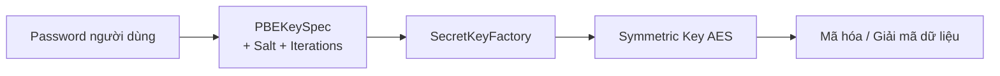
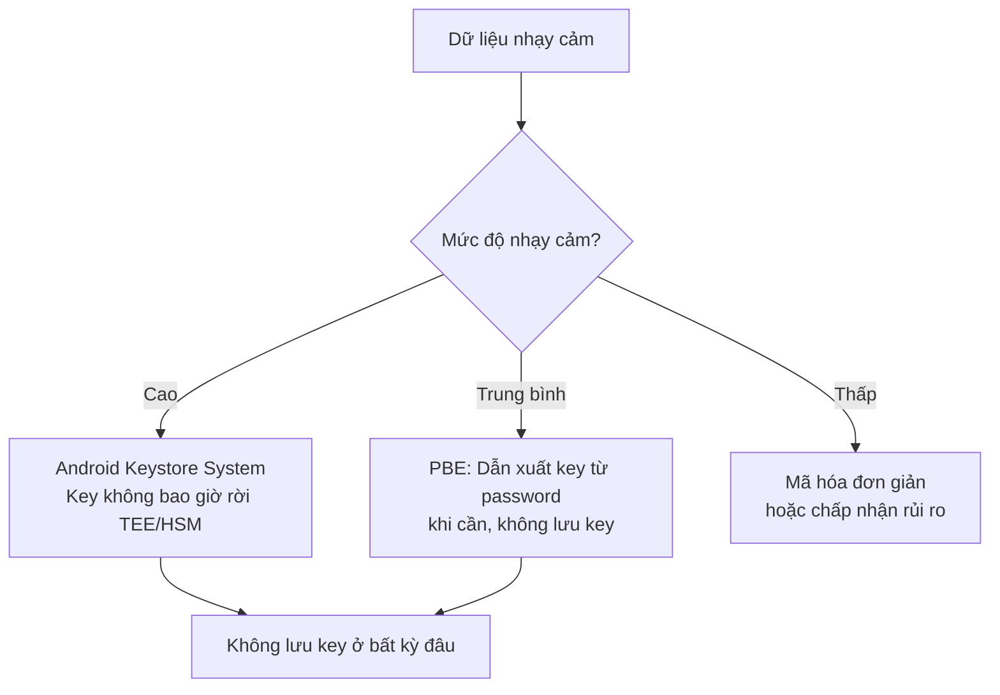
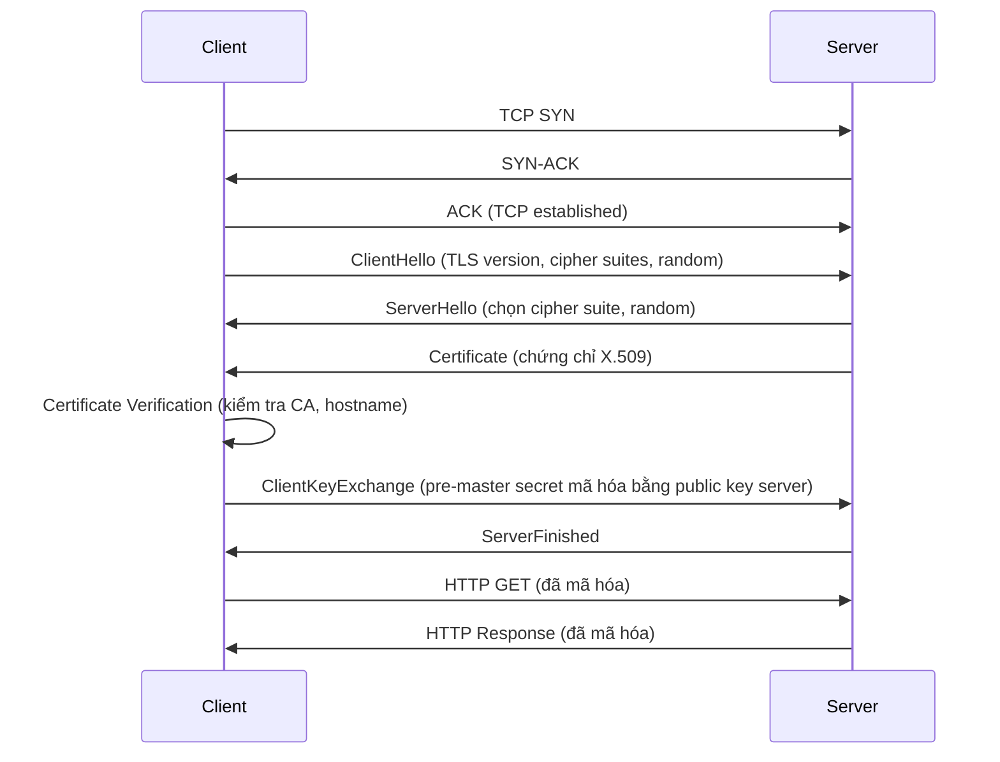
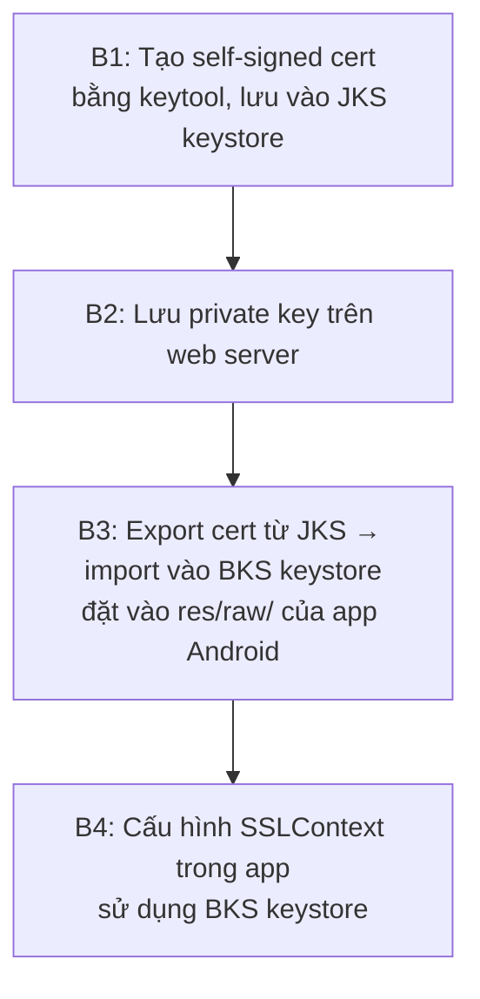
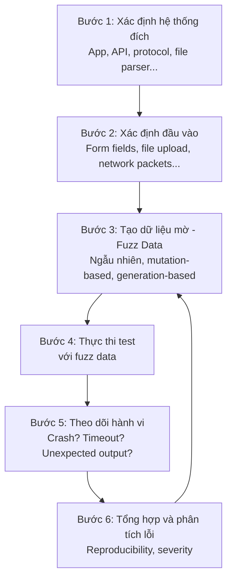

# Bài 10: Android Security & Top 10 Mobile - Fuzzy Testing


---

## 1. Credential Storage

### 1.1 Vấn đề đặt ra

Khi phát triển ứng dụng di động, dữ liệu nhạy cảm (mật khẩu, token, khóa API...) thường phải được lưu trữ cục bộ trên thiết bị. Câu hỏi đặt ra: **làm thế nào để bảo vệ chúng khỏi bị đánh cắp qua reverse engineering?**

Các kỹ thuật mã hóa thường dùng:

| Loại | Thuật toán |
|---|---|
| Mã hóa đối xứng | AES, Blowfish, CAST5, RC4, 3DES |
| Mã hóa bất đối xứng | Diffie-Hellman, RSA, ECDSA, ElGamal |
| Hash | SHA-1, SHA-2, MD5, Tiger |
| Password-based | PBE, KDF |

---

### 1.2 Password-Based Encryption (PBE)

**PBE** là kỹ thuật dẫn xuất khóa mã hóa đối xứng từ mật khẩu của người dùng. Android hỗ trợ PBE sử dụng **SHA-256 + AES**, thực hiện nhiều chu kỳ hash để làm chậm brute-force.

**Luồng hoạt động:**



**Ví dụ code Android (Java):**

```java
String PBE_ALGORITHM = "PBEWithSHA256And256BitAES-CBC-BC";
int NUM_OF_ITERATIONS = 1000;
int KEY_SIZE = 256;

byte[] salt = "ababababababababababab".getBytes();

try {
    PBEKeySpec pbeKeySpec = new PBEKeySpec(
        password.toCharArray(), salt, NUM_OF_ITERATIONS, KEY_SIZE
    );
    SecretKeyFactory keyFactory = SecretKeyFactory.getInstance(PBE_ALGORITHM);
    SecretKey tempKey = keyFactory.generateSecret(pbeKeySpec);
    SecretKey secretKey = new SecretKeySpec(tempKey.getEncoded(), "AES");
} catch (Exception exp) {
    // xử lý lỗi
}
```

---

### 1.3 Vai trò của Salt

!!! info "Salt là gì?"
    Salt là một chuỗi byte ngẫu nhiên được **nối thêm vào password trước khi hash**, nhằm ngăn chặn tấn công Rainbow Table (tra cứu hash có sẵn).

**Hai yêu cầu mâu thuẫn cần cân bằng:**

- Để tạo lại đúng key từ cùng một password → salt phải **cố định** (không đổi giữa các lần).
- Để chống tấn công liên thiết bị → salt phải **duy nhất trên mỗi thiết bị**, được sinh ra lúc cài đặt ứng dụng lần đầu, sau đó lưu vào vùng bảo mật (ví dụ Android Keystore).

!!! warning "Lưu ý thực tế"
    Hardcode salt cố định trong mã nguồn là **chấp nhận được về mặt kỹ thuật** nhưng **giảm mức độ bảo mật** vì kẻ tấn công có thể reverse engineer ra. Tốt hơn là sinh salt lúc runtime và lưu vào Android Keystore System.

---

### 1.4 Practical Cryptography: Sử dụng IV kèm KDF

**Initialization Vector (IV)** là một chuỗi byte ngẫu nhiên được sử dụng trong các chế độ mã hóa khối như **CBC (Cipher Block Chaining)** để đảm bảo cùng một plaintext sẽ cho ra ciphertext khác nhau mỗi lần mã hóa.

!!! question "Tại sao cần IV?"
    Nếu không có IV, với cùng một key và cùng một plaintext, kết quả mã hóa luôn giống nhau. Kẻ tấn công có thể nhận ra pattern. IV phá vỡ tính xác định này. IV không cần bí mật nhưng **phải ngẫu nhiên và không tái sử dụng** với cùng một key.

**Ví dụ đầy đủ mã hóa/giải mã với IV:**

```java
String PBE_ALGORITHM   = "PBEWithSHA256And256BitAES-CBC-BC";
String CIPHER_ALGORITHM = "AES/CBC/PKCS5Padding";
int NUM_OF_ITERATIONS  = 1000;
int KEY_SIZE           = 256;

byte[] salt = "ababababababababababab".getBytes();
byte[] iv   = "123456789oabcdef".getBytes(); // 16 bytes cho AES-128/256

String clearText = "Dữ liệu cần mã hóa";

try {
    // 1. Dẫn xuất key từ password
    PBEKeySpec pbeKeySpec = new PBEKeySpec(
        password.toCharArray(), salt, NUM_OF_ITERATIONS, KEY_SIZE
    );
    SecretKeyFactory keyFactory = SecretKeyFactory.getInstance(PBE_ALGORITHM);
    SecretKey tempKey  = keyFactory.generateSecret(pbeKeySpec);
    SecretKey secretKey = new SecretKeySpec(tempKey.getEncoded(), "AES");

    // 2. Khởi tạo IV
    IvParameterSpec ivSpec = new IvParameterSpec(iv);

    // 3. Cipher mã hóa
    Cipher encCipher = Cipher.getInstance(CIPHER_ALGORITHM);
    encCipher.init(Cipher.ENCRYPT_MODE, secretKey, ivSpec);
    byte[] encryptedText = encCipher.doFinal(clearText.getBytes());

    // 4. Cipher giải mã
    Cipher decCipher = Cipher.getInstance(CIPHER_ALGORITHM);
    decCipher.init(Cipher.DECRYPT_MODE, secretKey, ivSpec);
    byte[] decryptedText = decCipher.doFinal(encryptedText);

    String sameAsClearText = new String(decryptedText);
} catch (Exception e) {
    // xử lý lỗi
}
```

---

### 1.5 Các chiến lược lưu key — Rủi ro và giải pháp

!!! danger "Các anti-pattern phổ biến"

=== "Hardcode key trong source"
    ```java
    // KHÔNG NÊN
    String secretKey = "MyHardcodedKey123";
    ```
    Kẻ tấn công reverse engineer APK là lấy được ngay.

=== "Cache key trong RAM sau khi dẫn xuất"
    Nếu attacker dump memory (root device / memory forensics), key bị lộ.

=== "Lưu key trong SharedPreferences / file"
    Trên thiết bị root, đọc file dễ dàng.

**Giải pháp đúng đắn:**



!!! tip "Nguyên tắc vàng"
    **Khóa mã hóa KHÔNG nên lưu ở bất kỳ đâu, cũng như bất kỳ lúc nào.** Hãy dẫn xuất lại khi cần và giải phóng khỏi bộ nhớ ngay sau khi dùng xong.

> **Mở rộng:** Android Keystore System (từ Android 4.3+) cho phép tạo và sử dụng key bên trong **Trusted Execution Environment (TEE)** hoặc **Secure Element**, key vật lý không thể export ra ngoài. Đây là cách bảo vệ tốt nhất hiện nay. Tham khảo: [Android Keystore System](https://developer.android.com/training/articles/keystore)

---

## 2. SSL/TLS

### 2.1 Hai mục tiêu bảo mật cốt lõi

| Mục tiêu | Ý nghĩa |
|---|---|
| **Confidentiality (Bí mật)** | Ngăn bên thứ ba đọc lén hoặc chỉnh sửa dữ liệu trên đường truyền |
| **Authentication (Xác thực)** | Đảm bảo client đang nói chuyện đúng với server mong muốn, không phải kẻ giả mạo |

---

### 2.2 SSL/TLS Handshake



**Điểm quan trọng:** Bước **Certificate Verification** phía client là nơi xảy ra hầu hết các lỗ hổng SSL/TLS nếu implement sai.

---

### 2.3 Kết nối đến Server Công Cộng

Server công cộng là server **nằm ngoài quyền quản lý** của nhà phát triển (ví dụ: API của bên thứ ba). Các server này dùng chứng chỉ từ các **CA (Certificate Authority) phổ biến** — Android đã có sẵn danh sách CA tin cậy.

**Tạo kết nối HTTPS cơ bản trong Android:**

```java
try {
    URL url = new URL("https://clientaccess.example.com");
    HttpsURLConnection urlConn = (HttpsURLConnection) url.openConnection();
    urlConn.setDoOutput(true);

    OutputStream output = urlConn.getOutputStream();
    InputStream input   = urlConn.getInputStream();

    // Thông tin về kết nối:
    String cipherSuite = urlConn.getCipherSuite();           // thuật toán mã hóa
    Certificate[] certs = urlConn.getServerCertificates();   // chứng chỉ server
} catch (Exception e) {
    // xử lý lỗi
}
```

---

### 2.4 Hostname Verification

Sau khi xác minh chứng chỉ hợp lệ (được ký bởi CA tin cậy), Android còn phải kiểm tra **hostname trong chứng chỉ có khớp với hostname đang kết nối không**.

=== "AllowAllHostnameVerifier"
    ```java
    // NGUY HIỂM - tắt hoàn toàn hostname verification
    // Chấp nhận mọi chứng chỉ hợp lệ dù hostname không khớp
    // Dễ bị MITM attack
    ```

=== "StrictHostnameVerifier"
    ```java
    // An toàn - wildcard 1 cấp
    // *.example.com khớp: server1.example.com
    // *.example.com KHÔNG khớp: server1.domain1.example.com
    HostnameVerifier newHV = new StrictHostnameVerifier();
    HttpsURLConnection.setDefaultHostnameVerifier(newHV);
    ```

=== "BrowserCompatHostnameVerifier"
    ```java
    // Wildcard nhiều cấp (giống browser)
    // *.example.com khớp: server1.domain1.example.com
    ```

**Custom HostnameVerifier:**

```java
HostnameVerifier customHV = new HostnameVerifier() {
    @Override
    public boolean verify(String urlHostname, SSLSession connSession) {
        String certificateHostname = connSession.getPeerHost();
        // So sánh urlHostname và certificateHostname
        // Trả về true nếu chấp nhận, false nếu từ chối
        boolean isCertOK = true;

        try {
            Certificate[] certs = connSession.getPeerCertificates();
            X509Certificate caCert = (X509Certificate) certs[certs.length - 1];
            String caName = caCert.getIssuerX500Principal().getName();

            // Ví dụ: từ chối nếu được ký bởi CA không tin tưởng
            if (caName.equals(CA_WE_DO_NOT_WANT_TO_TRUST)) {
                isCertOK = false;
            }
        } catch (SSLPeerUnverifiedException e) {
            isCertOK = false;
        }

        return isCertOK;
    }
};
```

!!! warning "Lỗi phổ biến"
    Rất nhiều developer override `HostnameVerifier` và luôn `return true` để bỏ qua lỗi SSL trong quá trình dev — rồi quên không sửa lại khi release. Đây là lỗ hổng nghiêm trọng.

---

### 2.5 Kết nối đến Server Riêng Tư

Server riêng tư do chính nhà phát triển quản lý. Mô hình CA công cộng không phù hợp vì:

- Không muốn / không cần mua chứng chỉ từ CA thương mại.
- Muốn **giới hạn** chỉ ứng dụng của mình mới kết nối được (certificate pinning thô sơ).
- Dùng **self-signed certificate**.

**Quy trình 4 bước:**



**B1: Tạo self-signed certificate:**

```bash
keytool -genkey \
  -dname "cn=server.example.com, ou=Development, o=example.com, c=US" \
  -alias selfsignedcert1 \
  -keypass genericPassword \
  -keystore certs.jks \
  -storepass genericPassword \
  -validity 365
```

**B3: Chuyển đổi sang BKS (Bouncy Castle Keystore) cho Android:**

```bash
# Export chứng chỉ từ JKS
keytool -export \
  -alias selfsignedcert1 \
  -keystore certs.jks \
  -storepass genericPassword \
  -keypass genericPassword \
  -file cert.cer

# Import vào BKS keystore
keytool -import \
  -file cert.cer \
  -keypass genericPassword \
  -keystore /home/user1/dev/project1/res/raw/selfsignedcerts.bks \
  -storetype BKS \
  -storepass genericPassword \
  -providerClass org.bouncycastle.jce.provider.BouncyCastleProvider \
  -providerpath /home/user1/lib/bcprov-jdk16-146.jar \
  -alias selfsignedcert1
```

**B4: Cấu hình Android app sử dụng self-signed cert:**

```java
// B4.1: Load BKS KeyStore từ res/raw/
KeyStore selfsignedKeys = KeyStore.getInstance("BKS");
selfsignedKeys.load(
    context.getResources().openRawResource(R.raw.selfsignedcerts),
    "genericPassword".toCharArray()
);

// B4.2: Tạo TrustManagerFactory chỉ tin tưởng cert trên
TrustManagerFactory trustMgr = TrustManagerFactory.getInstance(
    TrustManagerFactory.getDefaultAlgorithm()
);
trustMgr.init(selfsignedKeys);

// B4.3: Tạo SSLContext
SSLContext selfsignedSSLContext = SSLContext.getInstance("TLS");
selfsignedSSLContext.init(null, trustMgr.getTrustManagers(), new SecureRandom());
HttpsURLConnection.setDefaultSSLSocketFactory(selfsignedSSLContext.getSocketFactory());

// B4.4: Kết nối
URL serverURL = new URL("https://server.example.com/endpointTest");
HttpsURLConnection serverConn = (HttpsURLConnection) serverURL.openConnection();
```

> **Mở rộng — Certificate Pinning hiện đại:** Từ Android 7.0+, có thể dùng **Network Security Configuration** (file XML) thay vì code Java để pin certificate, dễ quản lý hơn nhiều. Tham khảo: [Network Security Configuration](https://developer.android.com/training/articles/security-config). Ngoài ra thư viện **OkHttp** hỗ trợ `CertificatePinner` rất tiện lợi.

---

## 3. An Toàn Dữ Liệu Đầu Vào

### 3.1 Các loại tấn công injection

- **SQL Injection:** chèn câu lệnh SQL vào input để thao túng database.
- **Command Injection:** chèn lệnh hệ thống vào input để thực thi trên server/thiết bị.

### 3.2 Hai chiến lược kiểm tra

=== "Reject-Known-Bad (Blacklist)"
    Từ chối những input đã biết là nguy hiểm (ký tự `'`, `--`, `;`, `<script>`, ...).

    !!! danger "Hạn chế"
        Danh sách blacklist **không bao giờ đầy đủ**. Attacker luôn tìm được encoding mới (URL encode, Unicode, double encode...) để bypass. Đây là chiến lược **yếu**.

=== "Accept-Known-Good (Whitelist)"
    Chỉ chấp nhận input khớp với định dạng mong muốn. Kiểm tra:

    | Tiêu chí | Ví dụ |
    |---|---|
    | **Data Type** | Trường tuổi phải là số nguyên |
    | **Length** | Tên không quá 100 ký tự |
    | **Numeric Range** | Tuổi từ 0 đến 150 |
    | **Numeric Sign** | Số lượng phải dương |
    | **Syntax/Grammar** | Email phải khớp regex `^[a-zA-Z0-9._%+-]+@[a-zA-Z0-9.-]+\.[a-zA-Z]{2,}$` |

    !!! success "Đây là chiến lược đúng đắn"
        Kết hợp whitelist validation với **Prepared Statements** (cho SQL) và **parameterized commands** để triệt để ngăn injection.

---

## 4. OWASP Mobile Top 10

> OWASP Mobile Top 10 là tiêu chuẩn đánh giá bảo mật ứng dụng di động, liệt kê 10 loại lỗ hổng nguy hiểm nhất. Tham khảo: [owasp.org/www-project-mobile-top-10](https://owasp.org/www-project-mobile-top-10/)

**Thống kê thực tế (NowSecure, 2018):** Ít nhất 85% ứng dụng mắc ít nhất một lỗ hổng. 50% liên quan đến lưu trữ và truyền nhận dữ liệu.

---

### M1: Improper Platform Usage

Lạm dụng hoặc khai thác sai các tính năng bảo mật của nền tảng:

- Android Intents, Platform Permissions
- Touch ID / Face ID (Apple)
- Keychain / Keystore

**Ví dụ thực tế — Bypass Touch ID (Citrix Worx):**
1. Reboot iPhone.
2. Mở ứng dụng Citrix Worx.
3. Bắt đầu xác thực nhưng **cancel Touch ID**.
4. Tắt app, mở lại → vào được mà không cần xác thực.

**Nguyên nhân:** App không xử lý đúng trạng thái cancelled authentication, fallback về trạng thái đã authenticated từ session trước.

---

### M2: Insecure Data Storage

Lưu trữ dữ liệu nhạy cảm không được bảo vệ đúng cách, hoặc rò rỉ vô ý.

- Sai `keychain accessibility option` (ví dụ: `kSecAttrAccessibleAlways` thay vì `kSecAttrAccessibleWhenUnlockedThisDeviceOnly`)
- File không được mã hóa
- Log ra thông tin nhạy cảm

**Ví dụ thực tế — Tinder GPS Leak:**

Tinder từng để lộ khoảng cách chính xác (tính bằng feet/mét) giữa người dùng. Bằng cách tạo nhiều tài khoản giả và dùng **trilateration** (giao điểm của 3 vòng tròn khoảng cách), attacker có thể xác định vị trí GPS chính xác của nạn nhân dù Tinder không hiển thị tọa độ trực tiếp.

---

### M3: Insecure Communication

Truyền dữ liệu nhạy cảm không được mã hóa hoặc xác thực đúng cách.

- Dùng HTTP thay vì HTTPS
- Không kiểm tra certificate (accept all)
- Thiếu certificate pinning
- Dùng SSL version cũ (SSLv2, SSLv3 đã bị tấn công POODLE)

**Ví dụ thực tế — Misafe Smartwatch:**

Đồng hồ thông minh trẻ em Misafe giao tiếp qua cleartext HTTP. Attacker cùng mạng WiFi có thể:
- Lấy GPS realtime của trẻ
- Gọi điện tới đồng hồ
- Gửi tin nhắn thoại giả mạo phụ huynh
- Nghe lén qua micro (one-way audio)

---

### M4: Insecure Authentication

Lỗ hổng trong xác thực danh tính và quản lý phiên.

- Không xác thực đúng cách
- Session token không hết hạn
- Không giới hạn số lần thử

**Ví dụ thực tế — Bypass 2FA của Grab (2017):**

Grab dùng mã OTP 4 chữ số (10.000 tổ hợp). Server **không giới hạn số lần gửi mã**, cho phép brute-force 10.000 request. Attacker tự động thử hết tổ hợp để vượt 2FA.

!!! note "Bài học"
    Luôn implement **rate limiting** và **account lockout** sau N lần thử sai.

---

### M5: Insufficient Cryptography

Dùng thuật toán mã hóa lỗi thời, yếu, hoặc tự viết thuật toán riêng.

**Ví dụ thực tế — Ola (dịch vụ xe Ấn Độ):**

- Key mã hóa hardcode: `PRODKEYPRODKEY12` — quá ngắn và dễ đoán.
- Dữ liệu thanh toán truyền qua HTTP (không SSL).
- Attacker dùng `curl` với `api-key` để nạp tiền vào ví mà không qua cổng thanh toán.

!!! danger "Các thuật toán không nên dùng"
    MD5, SHA-1 (cho mã hóa), DES, RC4, RSA < 2048 bit. Dùng: AES-256, SHA-256/SHA-3, RSA-2048+, ECDSA P-256+.

---

### M6: Insecure Authorization

Phân quyền sai hoặc thiếu, dẫn đến **Insecure Direct Object Reference (IDOR)** hoặc **Privilege Escalation**.

**Ví dụ thực tế — Viper SmartStart (quản lý xe):**

Sau khi đăng nhập, API cho phép thay đổi `vehicle_id` trong request. Server không kiểm tra `vehicle_id` có thuộc về user đang đăng nhập không → attacker xem thông tin và điều khiển xe của người khác.

---

### M7: Client Code Quality

Lỗi lập trình ở phía client dẫn đến lỗ hổng bộ nhớ.

- **Buffer Overflow:** ghi dữ liệu vượt quá kích thước buffer đã cấp phát.
- **Format String Vulnerability:** truyền string do user kiểm soát vào hàm `printf`.

**Ví dụ thực tế — CVE-2019-3568 (WhatsApp 0-Day):**

Buffer overflow trong **VOIP stack** của WhatsApp. Kẻ tấn công chỉ cần **gọi điện qua WhatsApp** (nạn nhân không cần bắt máy) để trigger overflow và inject **Pegasus spyware** — phần mềm gián điệp của NSO Group có thể đọc mọi tin nhắn, bật camera/mic.

---

### M8: Code Tampering

Sửa đổi code của ứng dụng sau khi đã được phát hành.

- **Binary patching:** chỉnh sửa bytecode/native code trực tiếp.
- **Method hooking/swizzling:** dùng Frida, Xposed Framework để hook function runtime.
- **Dynamic memory modification:** chỉnh sửa giá trị biến trong RAM khi app đang chạy (dùng GameGuardian, Cheat Engine).

**Ví dụ thực tế — Pokémon GO:**

- Decompile APK, thêm module giả mạo GPS → teleport đến bất kỳ đâu để bắt Pokémon hiếm.
- Sửa logic game để trứng nở mà không cần đi bộ.

---

### M9: Reverse Engineering

Phân tích binary của ứng dụng để trích xuất:

- Source code (dùng jadx, apktool với Android; Hopper, IDA Pro với iOS)
- Thư viện và dependencies
- Thuật toán mã hóa và hardcoded key/secret
- API endpoints

!!! tip "Biện pháp chống reverse engineering"
    - **Obfuscation:** ProGuard/R8 (Android), obfuscate symbol names.
    - **Anti-debugging:** phát hiện debugger đang attached.
    - **Root/Jailbreak detection:** từ chối chạy trên thiết bị đã root.
    - **Certificate pinning:** ngăn MITM proxy.
    - Tuy nhiên, đây là **biện pháp làm khó** (raise the bar), không phải giải pháp tuyệt đối.

---

### M10: Extraneous Functionality

Chức năng không mong muốn / cửa hậu do developer vô tình để lại trong bản release.

- Tài khoản dev/QA hardcode (`admin/admin`, bypass authentication)
- Log verbose để lại trong production
- Debug endpoint còn hoạt động
- Mở port không cần thiết

**Ví dụ thực tế — Wifi File Transfer App:**

App mở port trên thiết bị để nhận kết nối từ máy tính — tiện lợi khi dùng WiFi nội bộ nhưng trở thành backdoor khi kết nối mạng công cộng.

**Nghiên cứu ĐH Michigan (Google Play):**

| Số lượng | Vấn đề |
|---|---|
| 1.632 ứng dụng | Mở cổng TCP/UDP |
| 410 ứng dụng | Không có cơ chế bảo vệ trên port đó |
| 57 ứng dụng | Xác nhận có thể khai thác được |

---

## 5. Fuzz Testing

### 5.1 Định nghĩa

**Fuzz Testing (Fuzzing)** là kỹ thuật kiểm thử tự động / bán tự động, trong đó hệ thống được cấp một lượng lớn dữ liệu đầu vào **không hợp lệ, ngẫu nhiên, hoặc bất ngờ** (gọi là **fuzz**) để phát hiện lỗi và lỗ hổng bảo mật.

!!! info "Phân loại"
    Fuzz testing là một dạng **black-box testing** (không cần biết internal logic), và là một loại **Security Testing**. Đây cũng là một trong những kỹ thuật phổ biến nhất mà hacker dùng để tìm lỗ hổng.

---

### 5.2 Ví dụ trực quan: Hàm reverse

**Bài toán:** Hàm `reverse` nhận vào một list, trả về list đảo ngược. Làm sao kiểm thử?

=== "Unit test thông thường"
    ```elm
    -- Chỉ kiểm tra một số case cụ thể
    test "reverse [1,2,3]" <|
        \_ -> Expect.equal [3,2,1] (reverse [1,2,3])
    ```
    **Vấn đề:** Bạn phải nghĩ ra từng test case thủ công. Dễ bỏ sót edge case.

=== "Fuzz test (Property-based testing)"
    ```elm
    doubleReverseTest : Test
    doubleReverseTest =
        fuzz (Fuzz.list Fuzz.int)
            "A list reversed twice should be the original list"
            (\list -> list |> reverse |> reverse |> Expect.equal list)
    ```
    **Framework tự sinh hàng trăm list ngẫu nhiên** (rỗng, một phần tử, rất dài, chứa số âm, MAX_INT...) và kiểm tra property: `reverse(reverse(list)) == list`.

!!! quote "Triết lý của Fuzz Testing"
    "Fuzz testing allows you to focus more on **expected behavior** and less on **coming up with and maintaining test data**."

---

### 5.3 Quy trình Fuzz Testing



---

### 5.4 Phân loại kỹ thuật sinh Fuzz Data

| Kỹ thuật | Mô tả | Ví dụ |
|---|---|---|
| **Random** | Sinh dữ liệu hoàn toàn ngẫu nhiên | Random bytes |
| **Mutation-based** | Lấy input hợp lệ rồi biến đổi | Flip bit, thêm ký tự đặc biệt |
| **Generation-based** | Sinh dữ liệu dựa trên grammar/spec | Sinh XML/JSON hợp lệ nhưng edge case |
| **Coverage-guided** | Dùng code coverage để hướng dẫn sinh input | **AFL**, **libFuzzer** — state-of-the-art |

> **Mở rộng — Coverage-guided Fuzzing:** Công cụ như **AFL++ (American Fuzzy Lop)** và **libFuzzer** instrumentation binary để theo dõi code path nào được thực thi. Khi một input kích hoạt code path mới, nó được giữ lại để mutation tiếp. Cực kỳ hiệu quả để tìm lỗ hổng trong parser, codec, kernel driver.

---

### 5.5 Ưu điểm và Nhược điểm

=== "Ưu điểm"
    - Tìm được crash, memory leak, unhandled exception, integer overflow mà human tester bỏ sót.
    - Hoàn toàn tự động, chạy liên tục không mệt.
    - Tìm được bug ở edge case cực hiếm.
    - Không cần hiểu sâu logic bên trong (black-box).

=== "Nhược điểm"
    - **Không đưa ra bức tranh toàn diện** về bảo mật nếu chỉ dùng fuzzing.
    - **Kém hiệu quả với logic bug** không gây crash (ví dụ: worm, trojan, business logic flaw).
    - Tốn thời gian chạy (có thể cần nhiều giờ/ngày).
    - Thiết lập input model phức tạp đòi hỏi chuyên môn.
    - Tỷ lệ **false negative** cao với các protocol có checksum (fuzzer cần tính lại checksum).

---

### 5.6 Công cụ Fuzz Testing phổ biến

| Công cụ | Mục tiêu | Ghi chú |
|---|---|---|
| **Peach Fuzzer** | Network protocol, file format | Commercial + open source |
| **Burp Suite** | Web app, API | Rất phổ biến trong pentest web |
| **OWASP WSFuzzer** | Web Service (SOAP/WSDL) | |
| **AFL++ / libFuzzer** | Binary, native code | State-of-the-art coverage-guided |
| **Radamsa** | File format mutation | Dễ dùng |
| **Atheris** | Python code | Google, dùng libFuzzer |
| **OSS-Fuzz** | Open source projects | Google tích hợp liên tục |

---

### 5.7 Ví dụ thực tế với Python (atheris)

```python
import atheris
import sys

@atheris.instrument_func
def TestOneInput(data):
    fdp = atheris.FuzzedDataProvider(data)
    s = fdp.ConsumeUnicodeNoSurrogates(20)
    
    # Hàm cần test
    try:
        result = my_parser.parse(s)
    except ValueError:
        pass  # Input không hợp lệ, expected
    except Exception as e:
        raise  # Bug thật sự!

atheris.Setup(sys.argv, TestOneInput)
atheris.Fuzz()
```

---

## Tài liệu tham khảo

- [OWASP Mobile Top 10](https://owasp.org/www-project-mobile-top-10/)
- [OWASP Mobile Security Testing Guide (MSTG)](https://mobile-security.gitbook.io/mobile-security-testing-guide/)
- [Android Security — Keystore System](https://developer.android.com/training/articles/keystore)
- [Android Network Security Configuration](https://developer.android.com/training/articles/security-config)
- [AFL++ Coverage-guided Fuzzer](https://github.com/AFLplusplus/AFLplusplus)
- [Google OSS-Fuzz](https://github.com/google/oss-fuzz)
- *Application Security for the Android Platform* — Jeff Six (2011)
- *Android Security Internals* — Nikolay Elenkov (No Starch Press, 2015)
