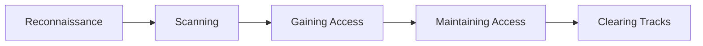
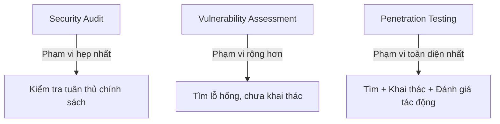
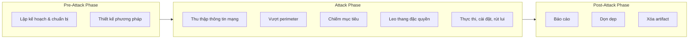
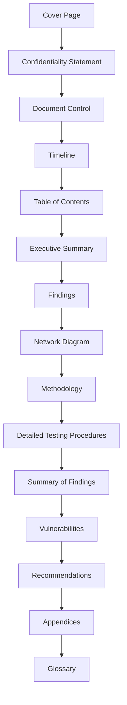

# Bài 11: Hacking phase, Pentesting & Report

## 1. Hacking

### 1.1 Hacking là gì?

**Hacking** là hành vi khai thác các lỗ hổng trong hệ thống và vượt qua các cơ chế kiểm soát bảo mật nhằm truy cập trái phép vào tài nguyên của hệ thống. Đây không chỉ đơn thuần là "bẻ khóa mật khẩu" — hacking bao gồm toàn bộ quá trình từ thu thập thông tin, phân tích điểm yếu đến thực thi khai thác.

Hacking có thể nhằm mục đích:

- Đánh cắp, tái phân phối tài sản trí tuệ gây tổn thất cho tổ chức
- Thay đổi tính năng của hệ thống/ứng dụng ngoài mục đích ban đầu của nhà phát triển
- Giành quyền truy cập không được phép vào dữ liệu nhạy cảm

### 1.2 Hacker là ai?

Hacker là những cá nhân có kỹ năng máy tính xuất sắc, có khả năng tạo ra và khám phá phần mềm, phần cứng máy tính. Phân loại theo mục đích:

| Loại | Màu mũ | Mô tả |
|---|---|---|
| Ethical Hacker | White Hat | Được thuê để tìm lỗ hổng, hành động hợp pháp |
| Cybercriminal | Black Hat | Tấn công với mục đích xấu: đánh cắp dữ liệu, gian lận |
| Grey Hat | Grey Hat | Không hoàn toàn hợp pháp, nhưng không có ý định gây hại nghiêm trọng |
| Script Kiddie | — | Dùng công cụ có sẵn mà không hiểu kỹ thuật |
| Hacktivist | — | Hacking vì mục đích chính trị/xã hội |

---

## 2. Các Giai Đoạn Hacking (Hacking Phases)



### 2.1 Reconnaissance (Trinh sát)

Đây là **giai đoạn chuẩn bị** trước khi tấn công. Kẻ tấn công thu thập thông tin về mục tiêu càng nhiều càng tốt mà chưa thực sự tấn công. Thông tin thu được có thể dùng lại trong tương lai như một "điểm quay lại" khi cần.

**Phạm vi mục tiêu trinh sát** bao gồm: khách hàng, nhân viên, quy trình vận hành, hệ thống mạng, hạ tầng của tổ chức.

=== "Passive Reconnaissance"

    Thu thập thông tin **mà không tương tác trực tiếp** với mục tiêu.

    Ví dụ:
    - Tra cứu hồ sơ công khai (WHOIS, DNS records)
    - Đọc bản tin, báo cáo tài chính công khai
    - Tìm kiếm trên Google (Google Dorking)
    - Dùng Shodan để tìm thiết bị lộ ra internet
    - Xem LinkedIn, Facebook để biết thông tin nhân viên

=== "Active Reconnaissance"

    Thu thập thông tin bằng cách **tương tác trực tiếp** với mục tiêu.

    Ví dụ:
    - Gọi điện đến bộ phận hỗ trợ kỹ thuật (social engineering)
    - Gửi email giả mạo để thu thập phản hồi
    - Ping, traceroute để xác định topology mạng
    - Scan port để biết dịch vụ đang chạy

!!! warning "Lưu ý pháp lý"
    Active Reconnaissance có thể bị phát hiện và để lại dấu vết. Trong kiểm thử thực tế, cần có **phạm vi cho phép (scope)** rõ ràng từ khách hàng trước khi thực hiện.

### 2.2 Scanning (Quét)

Là giai đoạn **tiền tấn công** khi kẻ tấn công dùng thông tin từ Reconnaissance để quét mạng, tìm kiếm thông tin cụ thể hơn.

Thông tin thu được từ scanning:

- Các máy chủ đang hoạt động (live hosts)
- Cổng mở (open ports) và trạng thái cổng
- Hệ điều hành và phiên bản dịch vụ
- Loại thiết bị, thời gian uptime

Công cụ thường dùng: **Nmap**, dialers, network mappers, ping tools, vulnerability scanners.

### 2.3 Gaining Access (Chiếm quyền truy cập)

Kẻ tấn công thực sự **xâm nhập** vào hệ điều hành hoặc ứng dụng trên máy tính/mạng mục tiêu.

Có thể xâm nhập ở nhiều tầng:

- **Tầng mạng (Network level):** Khai thác giao thức mạng
- **Tầng hệ điều hành (OS level):** Buffer overflow, password cracking
- **Tầng ứng dụng (Application level):** SQL Injection, XSS, session hijacking

Sau khi có quyền truy cập, kẻ tấn công có thể **leo thang đặc quyền (privilege escalation)** để đạt toàn quyền kiểm soát. Trong quá trình đó, các hệ thống kết nối trung gian cũng có thể bị xâm phạm theo.

### 2.4 Maintaining Access (Duy trì quyền truy cập)

Sau khi chiếm được quyền, kẻ tấn công cố gắng **giữ quyền sở hữu** hệ thống lâu dài.

Kỹ thuật duy trì:

- **Backdoor:** Cửa hậu để truy cập lại mà không cần khai thác lại lỗ hổng
- **Rootkit:** Ẩn tiến trình độc hại, duy trì quyền root ẩn
- **Trojan:** Giả dạng phần mềm hợp lệ, chạy ngầm

Từ hệ thống bị chiếm, kẻ tấn công có thể: tải lên/xuống dữ liệu, thay đổi cấu hình, và dùng máy nạn nhân làm bàn đạp để tấn công hệ thống khác (pivoting).

### 2.5 Clearing Tracks (Xóa dấu vết)

Kẻ tấn công thực hiện các hoạt động để **che giấu hành vi độc hại**, tránh bị phát hiện và truy tố.

Mục tiêu:

- Tiếp tục truy cập mà không bị nghi ngờ
- Xóa bằng chứng dẫn đến danh tính

Kỹ thuật:

- Ghi đè log của server, hệ điều hành, ứng dụng
- Dùng công cụ xóa log như `Metasploit`'s `clearev`
- Đổi timestamp của file đã thay đổi
- Dùng steganography để ẩn dữ liệu

---

## 3. Penetration Testing (Kiểm Thử Xâm Nhập)

### 3.1 Khái niệm

**Penetration Testing (Pentest)** là phương pháp đánh giá bảo mật của hệ thống thông tin hoặc mạng bằng cách **mô phỏng tấn công** để tìm ra các lỗ hổng mà kẻ tấn công thực sự có thể khai thác.

Khác với kiểm tra thụ động, pentest:

- Phân tích chủ động các cơ chế bảo mật để tìm điểm yếu về thiết kế và kỹ thuật
- Không chỉ chỉ ra lỗ hổng, mà còn **chứng minh cách khai thác** lỗ hổng đó
- Cung cấp báo cáo toàn diện cho cả quản lý cấp cao lẫn đội kỹ thuật

### 3.2 Tại sao cần Pentest?

- Kiểm tra và xác nhận hiệu quả của các biện pháp bảo mật hiện tại
- Xác định các mối đe dọa đối với tài sản thông tin của tổ chức
- Giảm chi phí bảo mật CNTT, tăng **Return On Security Investment (ROSI)** bằng cách ưu tiên vá đúng lỗ hổng
- Hỗ trợ khi nâng cấp hạ tầng phần mềm, phần cứng, thiết kế mạng
- Đánh giá toàn diện: chính sách, quy trình, thiết kế và triển khai
- Đánh giá hiệu quả thiết bị mạng: firewall, router, web server
- Đạt và duy trì chứng chỉ tuân thủ: BS7799, HIPAA, PCI-DSS,...

### 3.3 So sánh Security Audit, Vulnerability Assessment và Pentest



| Tiêu chí | Security Audit | Vulnerability Assessment | Penetration Testing |
|---|---|---|---|
| Mục đích | Kiểm tra tuân thủ chính sách/quy trình bảo mật | Phát hiện lỗ hổng trong hệ thống | Mô phỏng tấn công thực tế, khai thác lỗ hổng |
| Phạm vi | Hẹp (chính sách, thủ tục) | Rộng hơn (kỹ thuật) | Toàn diện nhất |
| Có khai thác không? | Không | Không | Có |
| Đánh giá tác động? | Không | Không | Có |

### 3.4 Phân loại Pentest

=== "Black-box"

    **Không có thông tin trước** về hạ tầng cần kiểm tra.

    - Mô phỏng tình huống kẻ tấn công từ bên ngoài, không biết gì về mục tiêu
    - Thực tế và tốn thời gian nhất
    - Còn gọi là **Blind Testing**
    - Biến thể: **Double Blind Testing** — ngay cả đội phòng thủ cũng không biết đang bị kiểm tra

=== "White-box"

    **Có đầy đủ thông tin** về hạ tầng: source code, sơ đồ mạng, tài khoản,...

    - Kiểm tra chi tiết và toàn diện nhất
    - Tốn ít thời gian hơn black-box
    - Phù hợp khi muốn kiểm tra kỹ logic nội bộ, code review kết hợp pentest

=== "Grey-box"

    **Có một phần thông tin** về hạ tầng.

    - Thường là tài khoản người dùng thường, biết tên miền/IP nhưng không có source code
    - Cân bằng giữa thực tế và hiệu quả
    - Phổ biến nhất trong thực tế doanh nghiệp

### 3.5 Các giai đoạn Pentest



---

## 4. Phương Pháp Kiểm Tra Bảo Mật

### 4.1 OWASP

**The Open Web Application Security Project (OWASP)** là dự án bảo mật ứng dụng mã nguồn mở, hỗ trợ tổ chức trong việc mua, phát triển và duy trì phần mềm và tài liệu kiến thức về bảo mật ứng dụng web.

Tài nguyên nổi bật:

- [OWASP Top 10](https://owasp.org/www-project-top-ten/) — 10 rủi ro bảo mật web phổ biến nhất
- [OWASP Testing Guide v4](https://owasp.org/www-project-web-security-testing-guide/)
- [OWASP ASVS](https://owasp.org/www-project-application-security-verification-standard/) — Application Security Verification Standard

### 4.2 OSSTMM

**Open Source Security Testing Methodology Manual** — phương pháp được đánh giá ngang hàng (peer-reviewed) cho kiểm tra bảo mật chất lượng cao, bao gồm: kiểm soát dữ liệu, kiểm soát gian lận và social engineering, mạng máy tính, thiết bị không dây, mobile, kiểm soát truy cập vật lý.

### 4.3 ISSAF

**Information Systems Security Assessment Framework** — framework đánh giá bảo mật hệ thống thông tin toàn diện, thực tiễn và được chấp nhận rộng rãi, dành cho chuyên gia bảo mật.

### 4.4 ISO/IEC 27001:2013

Tiêu chuẩn quốc tế quy định yêu cầu để thiết lập, triển khai, duy trì và cải tiến liên tục **Hệ thống Quản lý An toàn Thông tin (ISMS)**. Các ứng dụng chính:

- Xây dựng yêu cầu và mục tiêu bảo mật trong tổ chức
- Quản lý rủi ro bảo mật thông tin hiệu quả về chi phí
- Đảm bảo tuân thủ pháp luật và quy định
- Xác định và triển khai quy trình quản lý bảo mật mới
- Cung cấp thông tin bảo mật đáng tin cậy cho khách hàng

---

## 5. CVE và CWE

### 5.1 CVE — Common Vulnerabilities and Exposures

**CVE** là hệ thống định danh chuẩn cho các lỗ hổng bảo mật đã được công bố công khai. Mỗi lỗ hổng được gán một mã định danh duy nhất dạng `CVE-YYYY-NNNNN`.

**CVE cung cấp:**

- Mô tả chi tiết lỗ hổng
- Phiên bản phần mềm bị ảnh hưởng
- CVSS Score (điểm đánh giá mức độ nghiêm trọng)
- Ngày công bố và ngày cập nhật

**Ví dụ thực tế — CVE-2017-3526:**

```
Lỗ hổng trong Java SE, Java SE Embedded, JRockit (subcomponent: JAXP)
Phiên bản bị ảnh hưởng: Java SE 6u141, 7u131, 8u121; JRockit R28.3.13

CVSS Score: 7.1 (v2) / 5.9 (v3)
Tác động: Availability — Complete DoS (crash/hang hoàn toàn)
Không cần xác thực, truy cập qua mạng, độ phức tạp trung bình

CVSS Vector: CVSS:3.0/AV:N/AC:H/PR:N/UI:N/S:U/C:N/I:N/A:H
```

!!! info "Giải thích CVSS Vector"
    - `AV:N` — Attack Vector: Network (tấn công từ xa qua mạng)
    - `AC:H` — Attack Complexity: High (cần điều kiện đặc biệt)
    - `PR:N` — Privileges Required: None (không cần đặc quyền)
    - `UI:N` — User Interaction: None (không cần tương tác người dùng)
    - `C:N / I:N / A:H` — Confidentiality/Integrity: không ảnh hưởng; Availability: High

**Tra cứu CVE:** [https://www.cvedetails.com/](https://www.cvedetails.com/) hoặc [https://nvd.nist.gov/](https://nvd.nist.gov/)

### 5.2 CWE — Common Weakness Enumeration

**CWE** là danh sách các **loại điểm yếu phần mềm** phổ biến, được phát triển bởi cộng đồng. Khác với CVE (lỗ hổng cụ thể), CWE mô tả **loại điểm yếu** dẫn đến lỗ hổng.

CWE phục vụ 3 mục đích:

- **Ngôn ngữ chung** để mô tả điểm yếu phần mềm
- **Thước đo** cho công cụ bảo mật phần mềm
- **Baseline** cho việc xác định, giảm thiểu và ngăn chặn điểm yếu

**Ví dụ một số CWE phổ biến:**

| CWE-ID | Tên | Mô tả |
|---|---|---|
| CWE-79 | Cross-site Scripting | Không kiểm soát input được nhúng vào output HTML |
| CWE-89 | SQL Injection | Input người dùng được nhúng trực tiếp vào câu lệnh SQL |
| CWE-284 | Improper Access Control | Kiểm soát truy cập không đúng cách |
| CWE-352 | CSRF | Giả mạo yêu cầu từ phía người dùng |
| CWE-119 | Buffer Overflow | Ghi dữ liệu vượt giới hạn bộ nhớ |

**Tra cứu CWE:** [https://cwe.mitre.org/](https://cwe.mitre.org/)

!!! tip "Mối liên hệ CVE ↔ CWE"
    Mỗi CVE thường được gán một CWE để chỉ rõ **loại điểm yếu** gây ra lỗ hổng đó. Ví dụ: CVE-2017-3526 có CWE-284 (Improper Access Control).

---

## 6. Footprinting (Nhận Dạng Hạ Tầng)

### 6.1 Khái niệm

**Footprinting** là **bước đầu tiên** trong bất kỳ cuộc tấn công nào, nơi kẻ tấn công thu thập thông tin về mạng mục tiêu để xác định các con đường có thể xâm nhập.

Footprinting cho phép nhận dạng tất cả tài nguyên trong mạng, bao gồm cả firewall và IDS (Intrusion Detection System).

### 6.2 Phân loại

=== "Passive Footprinting"

    Thu thập thông tin **không có tương tác trực tiếp** với mục tiêu.

    Công cụ và kỹ thuật:
    - **WHOIS lookup:** thông tin đăng ký domain
    - **DNS enumeration:** bản ghi MX, NS, A, AAAA
    - **Google Dorking:** dùng toán tử tìm kiếm nâng cao
    - **Shodan:** tìm kiếm thiết bị kết nối internet
    - **Archive.org (Wayback Machine):** xem phiên bản cũ của website
    - **LinkedIn/Social Media:** thông tin nhân viên, công nghệ sử dụng

=== "Active Footprinting"

    Thu thập thông tin **bằng tương tác trực tiếp** với mục tiêu.

    - Ping và traceroute để xác định topology
    - DNS zone transfer (nếu server cấu hình sai)
    - Port scanning
    - Social engineering qua điện thoại/email

### 6.3 Thông tin thu được từ Footprinting

- **Thông tin tổ chức:** tên nhân viên, số điện thoại, địa chỉ, lịch sử, công nghệ web
- **Thông tin mạng:** domain và subdomain, dải địa chỉ IP, bản ghi WHOIS, DNS
- **Thông tin hệ thống:** hệ điều hành, vị trí web server, tài khoản và mật khẩu

### 6.4 Mục tiêu của Footprinting

- **Đánh giá thế bảo mật (Security Posture):** hiểu mức độ bảo mật của tổ chức
- **Thu hẹp phạm vi tấn công:** từ toàn bộ internet xuống còn một dải IP, domain cụ thể
- **Xác định lỗ hổng:** chọn exploit phù hợp với hệ thống mục tiêu
- **Vẽ sơ đồ mạng:** hiểu topology thực tế của môi trường sẽ tấn công

---

## 7. Công Cụ Reconnaissance

### 7.1 Nmap — Network Mapper

**Nmap** là port scanner được sử dụng phổ biến nhất. Tính năng chính:

- Nhận dạng host đang hoạt động
- Scan cổng TCP/UDP đang mở
- Phát hiện firewall
- Lấy version dịch vụ đang chạy
- Tìm và khai thác lỗ hổng qua scripting engine

**Các lệnh cơ bản:**

```bash
# Kiểm tra host đang hoạt động (ICMP ping scan)
nmap -sn 192.168.1.0/24

# Scan port cơ bản
nmap 192.168.1.102

# Xem version dịch vụ và đoán hệ điều hành
nmap -sV -O 192.168.1.102

# SYN scan (chậm hơn nhưng ít bị IDS phát hiện hơn)
nmap -sT 192.168.1.102

# Bỏ qua ping test, scan toàn bộ mục tiêu
nmap -Pn 192.168.1.102

# Scan các port chỉ định
nmap -p 80,443,8080 192.168.1.102

# Chạy script trên các port mở
nmap --script=http-title 192.168.1.102
```

**Ví dụ output thực tế:**

```
Starting Nmap 6.47 at 2015-06-09 21:43 CDT
Nmap scan report for 192.168.56.102
Host is up (0.00026s latency).

PORT      STATE SERVICE    VERSION
22/tcp    open  ssh        OpenSSH 5.3p1 Debian
80/tcp    open  http       Apache httpd 2.2.14 (Ubuntu)
139/tcp   open  netbios-ssn Samba smbd 3.X
143/tcp   open  imap       Courier Imapd
443/tcp   open  ssl/http   Apache httpd 2.2.14
445/tcp   open  netbios-ssn Samba smbd 3.X
8080/tcp  open  http       Apache Tomcat/Coyote JSP engine 1.1

OS details: Linux 2.6.17 - 2.6.36
```

!!! info "Tham số quan trọng"
    - `-sT`: TCP Connect scan — chậm, bị ghi log trên server, nhưng ít bị IDS phát hiện hơn SYN scan
    - `-Pn`: Bỏ bước ping, scan tất cả host kể cả host không phản hồi ICMP (hữu ích khi firewall block ping)
    - `-sV`: Phát hiện version dịch vụ
    - `-O`: Phát hiện hệ điều hành
    - `--script`: Chạy Nmap Scripting Engine (NSE) — xem thêm tại [nmap.org/nsedoc](https://nmap.org/nsedoc/scripts/)

**Công cụ thay thế/bổ sung:**

- `unicornscan` — scan nhanh hơn Nmap trong một số trường hợp
- `hping3` — tạo packet tùy chỉnh, kiểm tra firewall
- `masscan` — scan toàn bộ internet với tốc độ cực cao
- `amap` — nhận dạng ứng dụng trên port không chuẩn
- Metasploit scanning modules — tích hợp với framework khai thác

### 7.2 Nhận Dạng Web Application Firewall (WAF)

**WAF** là thiết bị hoặc phần mềm kiểm tra các gói tin gửi đến server để nhận dạng và chặn mã độc. Khi pentest, cần xác định WAF trước để tránh bị chặn.

```bash
# Phát hiện WAF bằng Nmap script
nmap -p 80,443 --script=http-waf-detect <IP/domain>

# Nhận dạng chính xác loại WAF
nmap -p 80,443 --script=http-waf-fingerprint <IP/domain>

# Dùng công cụ chuyên biệt
wafw00f <IP/domain>
```

### 7.3 Robots.txt

File `robots.txt` được web server dùng để báo cho search engine biết các file/folder **không được index**. Đây chính là nguồn thông tin về những đường dẫn nhạy cảm mà admin muốn ẩn khỏi người dùng thông thường (trang login nội bộ, admin CMS, backup files,...).

```
http://<IP hoặc domain>/robots.txt
```

Ví dụ nội dung robots.txt lộ thông tin:

```
User-agent: *
Disallow: /admin/
Disallow: /backup/
Disallow: /config/
Disallow: /cgi-bin/
```

### 7.4 DirBuster — Tìm File và Folder Ẩn

DirBuster là công cụ **brute force** để khám phá file và folder tồn tại trên web server mà không được liên kết công khai.

**Cách sử dụng:**

1. Tạo file `dictionary.txt` chứa tên thư mục/file muốn thử
2. Mở DirBuster, nhập URL mục tiêu
3. Chọn dictionary file
4. Xem kết quả ở tab Results

**HTTP Response Codes cần chú ý:**

| Code | Ý nghĩa | Hành động |
|---|---|---|
| 200 OK | File/folder tồn tại và có thể đọc được | **Đáng chú ý nhất** |
| 301 Moved | Chuyển hướng đến URL khác | Theo dõi URL mới |
| 401 Unauthorized | Tồn tại nhưng yêu cầu xác thực | Thử brute force |
| 403 Forbidden | Request hợp lệ nhưng server từ chối | Có thể bypass |
| 404 Not Found | File/folder không tồn tại | Bỏ qua |

### 7.5 CeWL — Custom Word List Generator

**CeWL** crawl một website và tạo danh sách từ từ nội dung trên website đó, phục vụ brute force trang login với từ điển phù hợp với ngữ cảnh mục tiêu.

```bash
# Xem help
cewl --help

# Tạo danh sách từ độ dài tối thiểu 5 ký tự, kèm đếm số lần xuất hiện
cewl -w wordlist_output.txt -c -m 5 http://target.com
```

**Công cụ tạo wordlist khác:**

- **Crunch:** Tạo wordlist dựa trên tập ký tự tùy chỉnh
- **CUPP (Common User Password Profiler):** Tạo wordlist mật khẩu dựa trên thông tin cá nhân của mục tiêu
- **WLM (Wordlist Maker):** Kết hợp tập ký tự và trích xuất từ file text/web

### 7.6 John the Ripper — Mở Rộng Từ Điển

**John the Ripper** là công cụ crack mật khẩu, nhận dạng hầu hết thuật toán mã hóa/hash và hỗ trợ tấn công từ điển + brute force. Có thể dùng để **mở rộng wordlist** bằng rules.

```bash
# Hiển thị các mật khẩu sẽ dùng để crack
john --stdout --wordlist=dictionary.txt

# Áp dụng rule mở rộng từ điển
# (chữ hoa/thường, thêm prefix/suffix, thay ký tự thành số/symbol)
john --stdout --wordlist=dictionary.txt --rules

# Lưu từ điển đã mở rộng
john --stdout --wordlist=dictionary.txt --rules > finaldict.txt
```

!!! example "Ví dụ rules mở rộng"
    Từ gốc `password` → John với rules có thể sinh ra: `Password`, `PASSWORD`, `p@ssword`, `password123`, `Password!`, `P455w0rd`,...

### 7.7 OWASP ZAP — Zed Attack Proxy

**ZAP** là công cụ đa năng: proxy, passive/active vulnerability scanner, fuzzer, spider, HTTP request sender.

Tính năng **Forced Browse** (kế thừa từ DirBuster) cho phép brute force tìm file/folder. Wordlist có sẵn trong Kali tại:

```
/usr/share/wordlists/dirbuster/
```

**Cấu hình ZAP làm proxy:**

```
HTTP Proxy: 127.0.0.1:8080
Tick: Use this proxy for all protocols
```

### 7.8 Xem Mã Nguồn và Cookie

**Phân tích mã nguồn frontend** giúp:

- Hiểu logic kiểm tra input phía client (JavaScript, third-party library)
- Tìm comment chứa thông tin nhạy cảm
- Phát hiện endpoint API ẩn
- Xác định framework/thư viện → tìm CVE tương ứng

**Cookie management** là kỹ thuật quan trọng:

Cookie lưu trữ: theme, preferences, **session identifier** — phần quan trọng nhất về bảo mật.

Có thể edit/delete/tạo mới cookie để:

- Chèn mã độc (XSS thông qua cookie)
- Cướp phiên đăng nhập (session hijacking)
- Bypass kiểm tra phía client

!!! note "HttpOnly Flag"
    Cookie có flag `HttpOnly = true` không thể truy cập bởi JavaScript — bảo vệ khỏi XSS đánh cắp session. Nếu flag này bị tắt, đây là điểm yếu cần ghi nhận trong báo cáo pentest.

---

## 8. Định Dạng Báo Cáo Pentest

### 8.1 Cấu trúc báo cáo



### 8.2 Cover Page

Bao gồm: tên báo cáo, phiên bản, ngày, tác giả, tên nhà cung cấp dịch vụ, bên nhận báo cáo, phân loại bảo mật tài liệu.

### 8.3 Confidentiality Statement (Cam kết bảo mật)

Bảo vệ thông tin thu thập trong quá trình pentest. Nội dung cần nêu rõ:

- Mức độ bảo mật của tài liệu
- Ai được phép xem
- Quyền sao chép và phân phối
- Ngôn ngữ pháp lý liên quan

### 8.4 Document Control

Theo dõi lịch sử chỉnh sửa:

| Version | Date | Author(s) | Comments |
|---|---|---|---|
| 1 | 5/1/13 | Josh Wink | Created |
| 2 | 5/10/13 | Mark Farina | Reviewed |
| 3 | 5/24/13 | Jeff Mills | Reviewed |

### 8.5 Timeline (Kế hoạch thời gian)

| Phase | Tasks | Estimated Duration |
|---|---|---|
| Project Kickoff | Statement of Work review, Q&A | 8 Hours |
| Network Assessment | Footprinting, mapping, policy review | 16 Hours |
| Penetration Testing | Exploitation, privilege escalation | 32 Hours |
| Reporting | Analysis, recommendations, presentation | 16 Hours |

### 8.6 Executive Summary

Tóm tắt cấp cao cho ban lãnh đạo:

- Tại sao dịch vụ được thực hiện
- Bối cảnh dẫn đến vấn đề
- Tóm tắt phát hiện và đề xuất giải pháp

### 8.7 Findings (Kết quả)

Phân loại mức độ nghiêm trọng:

| Mức độ | Ý nghĩa |
|---|---|
| **Critical** | Đe dọa trực tiếp đến các quy trình kinh doanh cốt lõi |
| **High** | Đe dọa gián tiếp đến quy trình cốt lõi hoặc trực tiếp đến quy trình phụ |
| **Medium** | Đe dọa gián tiếp/một phần đến quy trình kinh doanh |
| **Low** | Không có đe dọa trực tiếp, chỉ có thể kết hợp với lỗ hổng khác |
| **Informational** | Không tạo rủi ro ngay lập tức, nhưng là thông tin hữu ích cho kẻ tấn công |

**Cấu trúc mô tả một vulnerability:**

- Vulnerability name
- Business criticality
- Vulnerability description
- Technical details (kèm screenshot, PoC)
- Affected systems và ports
- Recommended action

### 8.8 Network Diagram

Sơ đồ trực quan mô tả hạ tầng mạng đã khám phá, kể cả các subnet phát hiện thêm trong quá trình pentest (dù không được phép tấn công thêm theo ROE).

### 8.9 Methodology

Mô tả cách tiếp cận thực hiện pentest:

- Quy trình từng giai đoạn
- Công cụ sử dụng
- Cách xử lý các mối đe dọa được phát hiện
- Lý do bỏ qua/không thực hiện giai đoạn nào đó (nếu có, theo Rules of Engagement)

### 8.10 Appendices

Thông tin bổ sung: output đầy đủ của Nessus/OpenVAS, log scan, PoC scripts, Rules of Engagement, ...

---

## 9. Tài Nguyên Học Tập Thực Hành

### 9.1 CTF và Lab thực hành

- [OverTheWire: Natas](https://overthewire.org/wargames/natas/) — Web security wargame, từ cơ bản đến nâng cao
- [OWASP WebGoat](https://owasp.org/www-project-webgoat/) — Ứng dụng web có lỗ hổng cố ý để học
- [HackTheBox](https://www.hackthebox.com/) — Nền tảng pentest thực hành với máy ảo thực tế
- [TryHackMe](https://tryhackme.com/) — Học pentest theo lộ trình, phù hợp người mới
- [VulnHub](https://www.vulnhub.com/) — Tải VM có lỗ hổng về pentest offline

### 9.2 Tài liệu tham khảo

- [OWASP Testing Guide v4](https://owasp.org/www-project-web-security-testing-guide/)
- [OWASP Mobile Security Testing Guide](https://owasp.org/www-project-mobile-app-security/)
- [NVD — National Vulnerability Database](https://nvd.nist.gov/)
- [Nmap NSE Scripts](https://nmap.org/nsedoc/scripts/)
- Sách: *Web Penetration Testing with Kali Linux* — Joseph Muniz, Aamir Lakhani
