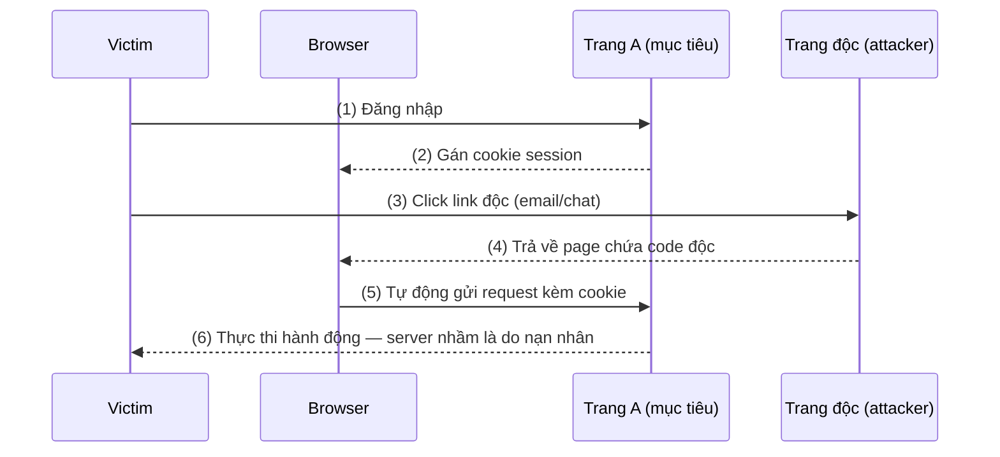

# Bài 4: CSRF & XSS

---

## 1. Cross-Site Request Forgery (CSRF)

### 1.1 Tổng quan

**CSRF** (còn gọi là XSRF, one-click attack, session riding) là kiểu tấn công trong đó kẻ tấn công **giả mạo danh tính người dùng đã xác thực** để gửi các yêu cầu trái phép đến máy chủ mục tiêu mà nạn nhân không hề hay biết.

> **Điểm mấu chốt:** CSRF không nhằm đánh cắp dữ liệu — mà nhằm **thực hiện thay đổi trạng thái** (state-changing request) trên server thông qua trình duyệt của nạn nhân.

Ví dụ các mục tiêu:
- Thay đổi email, mật khẩu tài khoản
- Thực hiện mua hàng, chuyển tiền
- Thay đổi thông tin cá nhân

---

### 1.2 Điều kiện để CSRF thành công

Cần đồng thời thỏa mãn 3 điều kiện:

1. Nạn nhân **đã đăng nhập** (có session/cookie hợp lệ) vào trang web mục tiêu A
2. Kẻ tấn công dựng một trang web độc hại (hoặc URL độc) và **lừa nạn nhân truy cập** (qua email, chat, mạng xã hội...)
3. Trang web A **không có cơ chế xác minh** nguồn gốc của request

---

### 1.3 Cơ chế hoạt động



**Lý do hoạt động được:** Trình duyệt tự động đính kèm cookie của domain vào mọi request gửi đến domain đó, bất kể request xuất phát từ trang nào. Server không có cách nào phân biệt request "thật" từ người dùng với request "giả" do trang độc tạo ra.

---

### 1.4 Các dạng tấn công CSRF

=== "GET Request"

    Ứng dụng dùng GET để thực hiện thay đổi — đây là thiết kế sai ngay từ đầu.

    Kẻ tấn công nhúng URL vào link hoặc ảnh:

    ```html
    <!-- Dạng link ngụy trang -->
    <a href="http://bank.com/transfer.do?acct=HACKER&amount=100000">
        Xem ảnh của tôi!
    </a>

    <!-- Dạng ảnh vô hình — nạn nhân không cần click gì cả -->
    
    ```

    Khi trình duyệt tải trang độc, thẻ `` khiến trình duyệt tự động gửi GET request kèm cookie — nạn nhân hoàn toàn không hay biết.

=== "POST Request"

    Kẻ tấn công tạo một form ẩn trên trang độc:

    ```html
    <form action="http://bank.com/transfer.do" method="POST">
        <input type="hidden" name="acct" value="HACKER">
        <input type="hidden" name="amount" value="100000">
        <input type="submit" value="Xem ảnh của tôi!">
    </form>
    ```

    Kết hợp JavaScript để submit tự động khi trang load — nạn nhân không cần click:

    ```html
    <body onload="document.forms[0].submit()">
    ```

=== "PUT/DELETE (XMLHttpRequest)"

    Với các ứng dụng REST API hiện đại dùng PUT/DELETE:

    ```javascript
    function sendRequest() {
        var x = new XMLHttpRequest();
        x.open("PUT", "http://bank.com/transfer.do", true);
        x.setRequestHeader("Content-Type", "application/json");
        x.send(JSON.stringify({"acct": "HACKER", "amount": 100000}));
    }
    ```

    ```html
    <body onload="sendRequest()">
    ```

    !!! warning "Lưu ý SOP"
        Request kiểu này bị **Same-Origin Policy (SOP)** chặn trên trình duyệt hiện đại. Tuy nhiên nếu server cấu hình **CORS sai** (ví dụ `Access-Control-Allow-Origin: *`), tấn công vẫn có thể thực hiện được.

---

### 1.5 Biện pháp ngăn chặn CSRF

#### Phía server (quan trọng nhất)

**CSRF Token**

Đây là biện pháp phổ biến và hiệu quả nhất. Cơ chế:

1. Server tạo một token ngẫu nhiên, duy nhất cho mỗi session (hoặc mỗi request)
2. Token được nhúng vào mọi form hoặc trả về qua API
3. Mỗi request thay đổi trạng thái phải gửi kèm token này
4. Server kiểm tra token — nếu không khớp thì từ chối

```html
<!-- Server nhúng token vào form -->
<form action="/transfer" method="POST">
    <input type="hidden" name="csrf_token" value="a8f3b2c9d1e4...">
    <!-- các field khác -->
    <button type="submit">Chuyển tiền</button>
</form>
```

Hầu hết các framework đều hỗ trợ sẵn: Laravel (`@csrf`), ASP.NET MVC (`@Html.AntiForgeryToken()`), Django (``), CodeIgniter...

**Kiểm tra Referer / Origin Header**

```
Referer: https://bank.com/transfer-page
Origin: https://bank.com
```

Server kiểm tra giá trị `Origin` hoặc `Referer` trong header để đảm bảo request xuất phát từ domain hợp lệ.

!!! warning "Cẩn thận với XSS"
    Nếu ứng dụng bị XSS, kẻ tấn công có thể đọc CSRF token và bypass biện pháp này. Do đó cần **vừa phòng chống CSRF, vừa phòng chống XSS**.

**Dùng SOP kết hợp Custom Header**

Tạo header tùy chỉnh `X-CSRF-Token` và gửi qua JavaScript. Trình duyệt sẽ chặn các trang cross-origin cố gán custom header.

#### Yêu cầu tương tác người dùng

Áp dụng cho các thao tác nhạy cảm:

- **Re-authentication**: Yêu cầu nhập lại mật khẩu trước khi thực hiện
- **One-time Token (OTP)**: Gửi mã xác nhận qua SMS/email
- **CAPTCHA**: Xác minh đây là người thật

#### Phía trình duyệt (người dùng)

- Extension: RequestPolicy, uMatrix, NoScript
- Đăng xuất sau khi dùng xong
- Không click link lạ trong email, chat
- Không đăng nhập đồng thời nhiều trang quan trọng trên cùng một tab/trình duyệt
- Xóa cookie định kỳ

---

### 1.6 Kiến thức mở rộng — SameSite Cookie

Một biện pháp hiện đại và hiệu quả là thuộc tính **SameSite** của cookie (được hỗ trợ rộng rãi từ 2020):

```
Set-Cookie: session=abc123; SameSite=Strict; Secure; HttpOnly
```

| Giá trị | Mô tả |
|---|---|
| `Strict` | Cookie chỉ gửi khi request xuất phát từ cùng domain. Bảo vệ hoàn toàn khỏi CSRF nhưng có thể gây bất tiện (ví dụ click link từ email không giữ session). |
| `Lax` | Cookie được gửi với GET navigation (click link), nhưng không gửi với POST cross-origin. Cân bằng giữa bảo mật và trải nghiệm. **Đây là giá trị mặc định của Chrome từ 2020.** |
| `None` | Gửi cookie trong mọi trường hợp — phải kết hợp với `Secure`. |

---

## 2. Cross-Site Scripting (XSS)

### 2.1 Tổng quan

**XSS** là dạng tấn công **injection** trong đó kẻ tấn công chèn mã script độc hại (thường là JavaScript) vào nội dung của trang web hợp lệ. Khi người dùng truy cập trang đó, trình duyệt thực thi script như thể nó đến từ server tin cậy.

---

### 2.2 Nguyên nhân

XSS xảy ra khi ứng dụng:

1. **Nhận dữ liệu** từ nguồn không tin cậy (user input qua form, URL parameter, HTTP header...)
2. **Đưa dữ liệu đó ra output** (hiển thị lên trang HTML) mà **thiếu hoặc không có**:
    - **Validation** — kiểm tra tính hợp lệ của dữ liệu
    - **Encoding** — mã hóa ký tự đặc biệt
    - **Sanitization** — làm sạch dữ liệu nguy hiểm

Hậu quả: trình duyệt không thể phân biệt đâu là nội dung hợp lệ, đâu là script độc hại.

---

### 2.3 Các dạng tấn công XSS

=== "Stored XSS"

    **Stored XSS** (Persistent XSS, Type-I XSS): Script độc được **lưu vĩnh viễn trên server** (database, file log, comment...) và thực thi mỗi khi có người truy cập nội dung đó.

    ```mermaid
    sequenceDiagram
        participant Attacker
        participant Server
        participant DB as Database
        participant Victim

        Attacker->>Server: (1) Gửi comment chứa script độc
        Server->>DB: (2) Lưu script vào DB
        Victim->>Server: (3) Yêu cầu xem trang
        Server->>DB: (4) Lấy dữ liệu (có chứa script)
        Server-->>Victim: (5) Trả về HTML kèm script độc
        Victim->>Victim: (6) Trình duyệt thực thi script
    ```

    **Ví dụ thực tế:**

    Bình thường, user A gửi comment:
    ```
    I love your post!
    ```
    HTML trả về:
    ```html
    <p class="comment">I love your post!</p>
    ```

    Attacker gửi comment:
    ```html
    Jason, I love your blog post!
    <script>
        window.onload = function() {
            window.location = "http://evil.com";
        }
    </script>
    ```

    Mọi user B khi đọc bài post đều bị redirect đến trang độc mà không cần bất kỳ tương tác nào thêm.

    !!! danger "Tầm ảnh hưởng"
        **Tất cả** người dùng truy cập trang bị nhiễm đều bị ảnh hưởng. Đây là lý do Stored XSS đặc biệt nguy hiểm — một lần tấn công, nhiều nạn nhân.

=== "Reflected XSS"

    **Reflected XSS** (Non-Persistent XSS, Type-II XSS): Script độc được nhúng vào **URL hoặc tham số request**. Server nhận input và "phản chiếu" (reflect) nó ngay lại trong response mà không lưu trữ.

    **Ví dụ:** Server có đoạn code PHP xử lý trang 404:

    ```php
    <html><body>
    <?php
        echo "Not found: " . urldecode($_SERVER["REQUEST_URI"]);
    ?>
    </body></html>
    ```

    Request bình thường:
    ```
    http://example.com/jason_file.html
    → Hiển thị: Not found: /jason_file.html
    ```

    Request của attacker:
    ```
    http://example.com/<script>alert(document.cookie)</script>
    → Trình duyệt thực thi script!
    ```

    **Kịch bản tấn công thực tế:**

    ```
    Attacker gửi email:
    "Tài khoản của bạn có vấn đề, click vào đây để xem:"
    http://bank.com?p1=
    ```

    Khi nạn nhân click → server bank.com nhận tham số và nhúng vào HTML trả về → trình duyệt nạn nhân thực thi script → cookie bị gửi đến evil.com.

    !!! warning "Tầm ảnh hưởng"
        Chỉ những người **click vào URL độc** mới bị ảnh hưởng. Nhưng mức độ nguy hại tương đương Stored XSS.

=== "DOM-based XSS"

    **DOM-based XSS** (Type-0 XSS): Response từ server **không thay đổi**, không chứa script độc. Tuy nhiên, **JavaScript phía client** đọc dữ liệu từ URL hoặc nguồn không an toàn và ghi vào DOM mà không encode.

    **Ví dụ:**

    ```javascript
    // Code JS trên trang hợp lệ — tạo dropdown ngôn ngữ từ URL parameter
    document.write(
        "<OPTION value=1>" +
        document.location.href.substring(
            document.location.href.indexOf("default=") + 8
        ) +
        "</OPTION>"
    );
    ```

    Request bình thường:
    ```
    http://example.com/index.html?default=Vietnamese
    → Tạo: <OPTION value=1>Vietnamese</OPTION>
    ```

    Request độc:
    ```
    http://example.com/index.html?default=<script>alert(document.cookie)</script>
    → DOM chứa: <OPTION value=1><script>alert(document.cookie)</script></OPTION>
    ```

    Script thực thi trực tiếp trong trình duyệt — **server không hề biết**.

    Các "nguồn" (source) nguy hiểm trong DOM-based XSS:
    - `document.URL`, `document.location.href`
    - `document.referrer`
    - `window.name`
    - `location.hash`, `location.search`

---

### 2.4 Tác động của XSS

Khi XSS thành công, kẻ tấn công có thể:

- **Đánh cắp cookie / session token** → chiếm quyền tài khoản
- **Keylogging** → ghi lại mọi phím người dùng gõ
- **Phishing** → thay đổi giao diện trang (deface), tạo form giả để lấy thông tin
- **Chuyển hướng** → đưa nạn nhân đến trang độc
- **XSS Worm** → tự lây lan (sâu Samy trên MySpace 2005 lây nhiễm 1 triệu profile trong 20 giờ)
- **Tạo botnet** → dùng trình duyệt nạn nhân để thực hiện DDoS

---

### 2.5 Các payload XSS phổ biến

```html
<!-- Alert đơn giản để test -->
<script>alert(1)</script>

<!-- Qua event handler của body -->
<body onload="alert('XSS')">

<!-- Qua img onerror -->


<!-- Redirect -->
<script>window.location = "http://evil.com"</script>

<!-- Đánh cắp cookie gửi về server attacker -->
<script>
    document.write(
        ''
    );
</script>
```

**Bypass filter (khi server có filter cơ bản):**

```html
<!-- Thay đổi chữ hoa/thường -->
<ScRiPt>alert(document.cookie)</ScRiPt>

<!-- HTML encode -->
&#x3c;script&#x3e;alert(document.cookie)&#x3c;/script&#x3e;

<!-- Chèn vào thuộc tính HTML -->
" onfocus="alert(document.cookie)

<!-- Đóng attribute rồi mở tag mới -->
'><script>alert(document.cookie)</script>
```

---

### 2.6 Biện pháp ngăn chặn XSS

#### Output Encoding

Đây là biện pháp **quan trọng nhất**. Trước khi hiển thị bất kỳ dữ liệu nào ra HTML, phải encode các ký tự đặc biệt:

| Ký tự | HTML Entity |
|---|---|
| `&` | `&amp;` |
| `<` | `&lt;` |
| `>` | `&gt;` |
| `"` | `&quot;` |
| `'` | `&#x27;` |
| `/` | `&#x2F;` |

**PHP:**

```php
// HTML encoding — dùng khi output vào HTML content
echo htmlspecialchars($userInput, ENT_QUOTES, 'UTF-8');

// Loại bỏ hoàn toàn HTML tags
echo strip_tags($userInput);

// Validate và lọc dữ liệu
$email = filter_var($input, FILTER_SANITIZE_EMAIL);
$url   = filter_var($input, FILTER_SANITIZE_URL);
```

**JavaScript (phía client):**

```javascript
// Encode URL parameter
encodeURI("http://example.com/path?q=<script>");

// Encode component (phần query string)
encodeURIComponent("<script>alert(1)</script>");
// → %3Cscript%3Ealert(1)%3C%2Fscript%3E
```

!!! tip "Quy tắc ngữ cảnh (Context)"
    Cùng một dữ liệu nhưng đặt ở ngữ cảnh khác nhau thì cần encode khác nhau:

    - Trong **HTML content**: dùng HTML entity encoding
    - Trong **HTML attribute**: HTML attribute encoding
    - Trong **JavaScript**: JavaScript string encoding
    - Trong **URL**: URL encoding
    - Trong **CSS**: CSS encoding

#### Validation / Sanitization

```php
// Dùng whitelist — chỉ cho phép những gì đã biết là an toàn
// Ví dụ: tên người dùng chỉ cho phép chữ cái, số, dấu gạch dưới
if (!preg_match('/^[a-zA-Z0-9_]+$/', $username)) {
    die("Tên người dùng không hợp lệ");
}
```

#### Content Security Policy (CSP)

CSP là HTTP header cho phép server khai báo **những nguồn tài nguyên nào được phép tải và thực thi**:

```
Content-Security-Policy: default-src 'self';
                         script-src 'self' https://trusted.com;
                         img-src *;
                         style-src 'self' 'unsafe-inline';
```

Với CSP nghiêm ngặt, ngay cả khi attacker chèn được `<script>` vào HTML, trình duyệt sẽ từ chối thực thi nếu script không đến từ nguồn được phép.

!!! note "CSP không phải silver bullet"
    CSP giảm thiểu tác động của XSS nhưng không ngăn chặn hoàn toàn. Cấu hình CSP sai (ví dụ `unsafe-inline`) có thể vô hiệu hóa bảo vệ. Nên dùng CSP như **lớp bảo vệ bổ sung**, không phải thay thế cho encoding.

---

### 2.7 So sánh 3 dạng XSS

| Tiêu chí | Stored | Reflected | DOM-based |
|---|---|---|---|
| Script lưu trên server? | Có | Không | Không |
| Cần URL độc? | Không | Có | Có |
| Server có trong response? | Có | Có | Không |
| Số nạn nhân | Nhiều | Tùy | Tùy |
| Khó phát hiện | Trung bình | Dễ hơn | Khó nhất |

---

### 2.8 Kiến thức mở rộng

**HttpOnly Cookie**

Ngăn JavaScript truy cập cookie — giảm thiểu thiệt hại khi XSS xảy ra:

```
Set-Cookie: session=abc123; HttpOnly; Secure; SameSite=Strict
```

Với `HttpOnly`, dù attacker chèn được `<script>document.cookie</script>` thì giá trị của session cookie cũng không đọc được.

**Trusted Types (API mới)**

Chrome hỗ trợ Trusted Types — buộc developer phải đi qua API an toàn trước khi gán vào các "sink" nguy hiểm như `innerHTML`, `document.write`:

```javascript
// Bật qua CSP
// Content-Security-Policy: require-trusted-types-for 'script'

const policy = trustedTypes.createPolicy('default', {
    createHTML: (input) => DOMPurify.sanitize(input)
});
document.getElementById('output').innerHTML = policy.createHTML(userInput);
```

---

## 3. So sánh CSRF và XSS

| | CSRF | XSS |
|---|---|---|
| Bản chất | Giả mạo request từ nạn nhân | Chèn và thực thi script độc |
| Mục tiêu | Server (thực hiện hành động) | Client (trình duyệt nạn nhân) |
| Cần nạn nhân đăng nhập? | Bắt buộc | Không bắt buộc |
| Attacker nhận được response? | Không | Có thể |
| Biện pháp chính | CSRF Token, SameSite Cookie | Output Encoding, CSP |
| XSS có bypass CSRF không? | Có — nếu có XSS, có thể đọc CSRF token | — |

---

## 4. Tài liệu tham khảo

- [OWASP — CSRF](https://owasp.org/www-community/attacks/csrf)
- [OWASP — XSS Prevention Cheat Sheet](https://cheatsheetseries.owasp.org/cheatsheets/Cross_Site_Scripting_Prevention_Cheat_Sheet.html)
- [PortSwigger Web Security Academy — CSRF](https://portswigger.net/web-security/csrf)
- [PortSwigger Web Security Academy — XSS](https://portswigger.net/web-security/cross-site-scripting)
- [MDN — Content Security Policy](https://developer.mozilla.org/en-US/docs/Web/HTTP/CSP)
- [Google XSS Game (thực hành)](https://xss-game.appspot.com/)
- [PayloadsAllTheThings — XSS](https://github.com/swisskyrepo/PayloadsAllTheThings/tree/master/XSS%20Injection)
